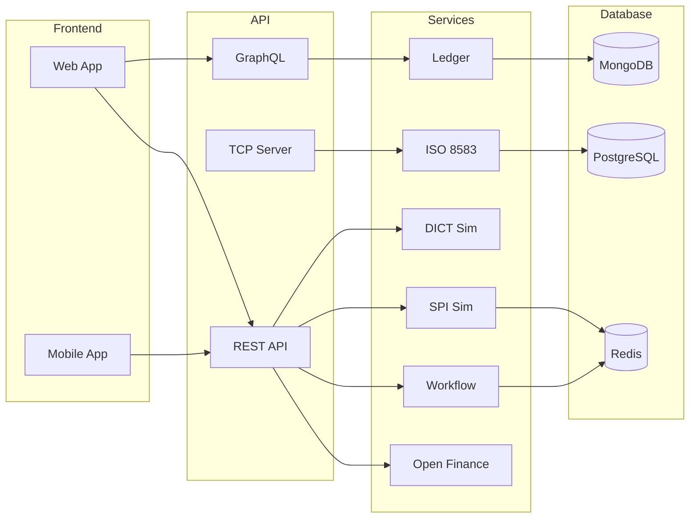
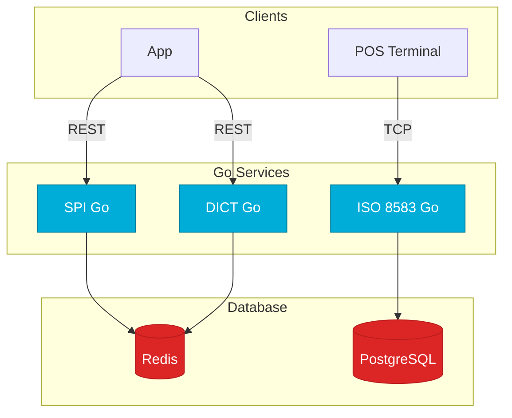

# Arquitetura do Sistema / System Architecture

## Visão Geral

O Banking Challenges é um **monorepo** gerenciado pelo **Turborepo** com **pnpm workspaces**. Cada desafio é um pacote independente, mas todos compartilham a mesma visão: **simular sistemas financeiros brasileiros reais** com a tecnologia mais adequada para cada problema.

## Switch: TypeScript vs Go

<LanguageToggle />

<div class="lang-content ts" style="display:block;">

### Stack Completo

| Camada | Tecnologia | Desafios |
|--------|------------|----------|
| **Backend** | TypeScript (Koa, Fastify, Express) | 01, 05, 06, 07, 08, 09 |
| **Frontend** | Next.js 14, Vite + React | 10, 11 |
| **Database** | MongoDB, PostgreSQL, Redis | Todos |
| **Infra** | Docker, Kubernetes, Proxmox | 12 |
| **CI/CD** | GitHub Actions, GitLab CI | 13 |
| **Docs** | VitePress | Todos |

### Diagrama de Arquitetura

```
┌─────────────────────────────────────────────────────────────────┐
│                      Clientes / Consumers                        │
│  GraphQL Playground │ REST Clients │ Web Browser │ Postman       │
└──────────────────────────┬──────────────────────────────────────┘
                           │
┌──────────────────────────▼──────────────────────────────────────┐
│                      API Gateway (opcional)                      │
│                  Roteamento, autenticação, rate-limit            │
└──┬──────────┬──────────┬──────────┬──────────┬─────────────────┘
   │          │          │          │          │
┌──▼──┐  ┌────▼────┐ ┌──▼──┐  ┌───▼───┐  ┌───▼───┐
│Ledger│  │SPI/ICOM│ │DICT  │  │ISO8583│  │Workflow│
│      │  │        │ │      │  │       │  │Engine  │
│ Koa  │  │Fastify │ │Express│  │TCP    │  │Redis   │
│GraphQl│  │ISO20022│ │REST  │  │Server │  │Graph   │
│MongoDB│  │Go(Gin) │ │JSON  │  │Binário│  │DAG     │
└──┬───┘  └───┬────┘ └──┬───┘  └───┬───┘  └───┬───┘
   │          │         │          │          │
   │     ┌────▼────┐ ┌──▼───┐  ┌──▼───┐  ┌───▼───┐
   │     │Open Fin │ │NFS-e │  │Report│  │Leaky  │
   │     │Fastify  │ │SOAP  │  │Fastify│  │Bucket │
   │     │REST+FAPI│ │XML   │  │PG+MinIO│  │Redis  │
   └─────┴─────────┴──┴─────┴──┴──────┴──┴───────┘
```

### Princípios Arquiteturais

| Princípio | Descrição |
|-----------|-----------|
| **Independência** | Cada desafio é um pacote isolado |
| **Simulação Realista** | Replicam sistemas financeiros reais |
| **Infra Local** | Docker Compose: MongoDB, PostgreSQL, Redis, MinIO |
| **TypeScript Nativo** | Backend 100% TypeScript |
| **Padrões Financeiros** | ISO 20022, ISO 8583, ABRASF |

### Mapeamento de Desafios

| # | Desafio | Stack Principal | Database |
|---|---------|----------------|----------|
| 01 | Ledger GraphQL | Koa + GraphQL + Relay | MongoDB |
| 02 | SPI Simulator | Go (Gin) + ISO 20022 | In-memory |
| 03 | DICT Simulator | Go (Gin) + REST | In-memory |
| 04 | ISO 8583 | TCP Server | PostgreSQL |
| 05 | Workflow Engine | Fastify + DAG + WebSockets | Redis |
| 06 | Open Finance | Fastify + FAPI + OAuth 2.0 | PostgreSQL |
| 07 | NFS-e | Fastify + SOAP + XML | PostgreSQL |
| 08 | Report System | Fastify + Streaming | PostgreSQL + MinIO |
| 09 | Leaky Bucket | Fastify + Lua Scripts | Redis |
| 10 | Landing Page | Next.js 14 + Tailwind | - |
| 11 | KYC System | Vite + React | PostgreSQL |
| 12 | Proxmox + IaC | Terraform + Ansible | - |
| 13 | CI/CD | GitHub Actions / GitLab CI | - |
| 14 | RFC / ADR | Markdown + Mermaid | - |
| 15 | PISP | Open Finance + FAPI | PostgreSQL |
| 16 | Antecipação | Pricing Engine | PostgreSQL |

### Fluxo de Dados



### Segurança

| Camada | Tecnologia |
|--------|------------|
| **Transporte** | TLS 1.3, mTLS |
| **Autenticação** | JWT, OAuth 2.0, FAPI |
| **Criptografia** | AES-256, RSA, 3DES |
| **Rate Limiting** | Leaky Bucket (Redis + Lua) |
| **Audit** | Logs imutáveis, 5+ anos |

</div>

<div class="lang-content go" style="display:none;">

### Stack Go no Banking Stack

| Camada | Tecnologia | Desafios |
|--------|------------|----------|
| **Backend Core** | Go (Gin) | 02 SPI, 03 DICT |
| **ISO 8583** | Go TCP Server | 04 |
| **Performance** | Goroutines + Channels | Todos os Go |
| **Criptografia** | crypto/rsa, crypto/x509 | 02, 04 |
| **XML** | encoding/xml | 02, 04 |
| **Deploy** | Binário único | Todos |

### Por que Go para Serviços Críticos?

| Serviço | Por que Go |
|---------|-----------|
| **SPI Simulator** | ISO 20022 XML parsing, < 1ms latência |
| **DICT Simulator** | REST de alta performance, concorrência |
| **ISO 8583** | TCP binary, parsing bit-level |

### Benchmark: Go vs TypeScript

| Serviço | TS Throughput | Go Throughput | Ganho |
|---------|--------------|---------------|-------|
| SPI Transfer | ~2K req/s | ~50K req/s | 25x |
| DICT Query | ~5K req/s | ~45K req/s | 9x |
| ISO 8583 Parse | ~1K msg/s | ~10K msg/s | 10x |

### Arquitetura Go



### Decisão: Go vs TypeScript

| Critério | Escolha |
|----------|---------|
| **GraphQL API** | TypeScript (ecossistema Apollo) |
| **ISO 20022 XML** | Go (encoding/xml nativo) |
| **TCP Binary** | Go (performance) |
| **REST API simples** | TypeScript (rápido) |
| **Alta performance** | Go (Gin, goroutines) |
| **Frontend** | TypeScript (React, Next.js) |

</div>

---

## Como testar

```bash
# Subir tudo
docker compose up -d

# Testar Ledger
curl -X POST http://localhost:3001/graphql \
  -H "Content-Type: application/json" \
  -d '{"query":"{ accounts { id name balance } }"}'

# Testar SPI (Go)
cd packages/backend/spi-simulator-go
go run .

# Testar ISO 8583
echo "0100..." | nc localhost 3004
```

---

## Lições aprendidas

1. **Monorepo com Turborepo** — Independência entre desafios, compartilhamento de código
2. **Go para serviços críticos** — SPI, DICT, ISO 8583 precisam de performance
3. **TypeScript para APIs** — GraphQL, REST, webhooks são mais produtivos em TS
4. **Docker Compose** — Infraestrutura local completa (MongoDB, PostgreSQL, Redis, MinIO)
5. **Padrões financeiros** — ISO 20022, ISO 8583, ABRASF não são opcionais
6. **Segurança em camadas** — TLS, JWT, mTLS, rate limiting, audit
7. **Documentação viva** — VitePress com i18n PT/EN
8. **CI/CD obrigatório** — Toda mudança passa por testes e aprovação
