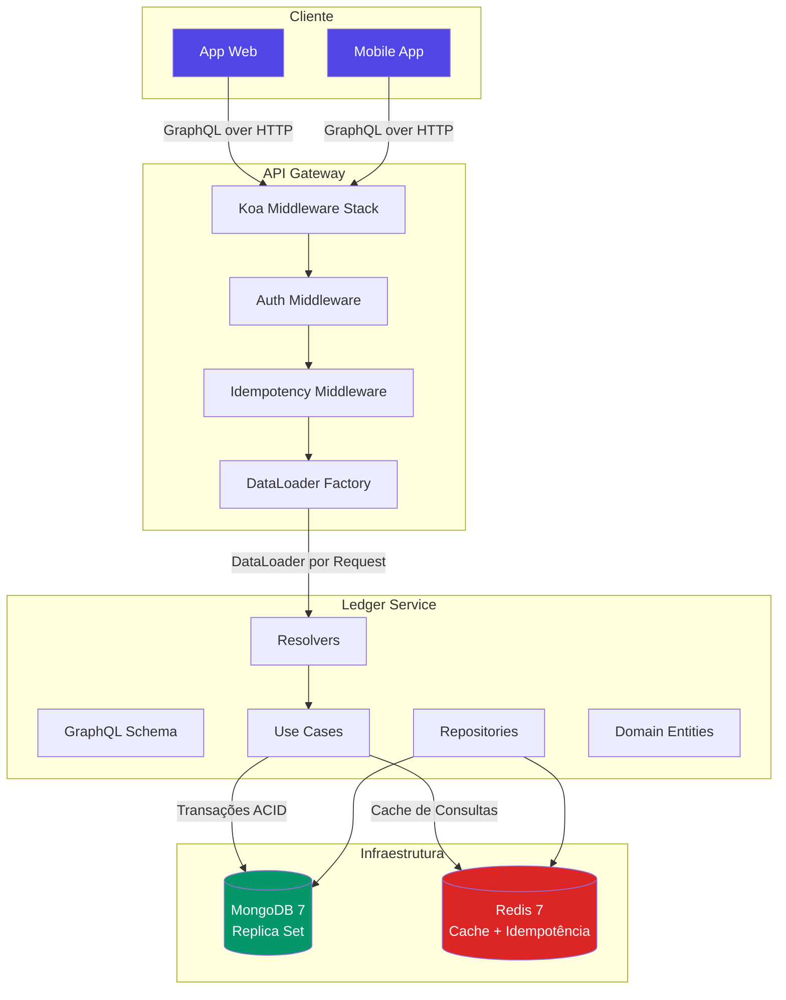
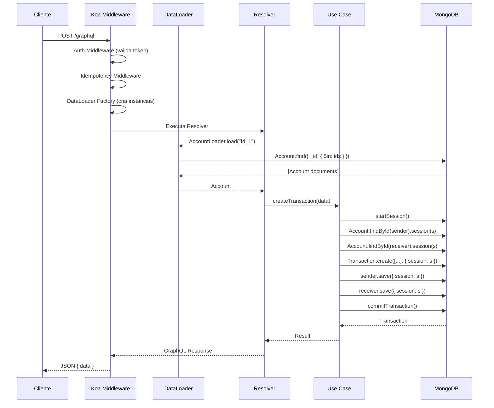
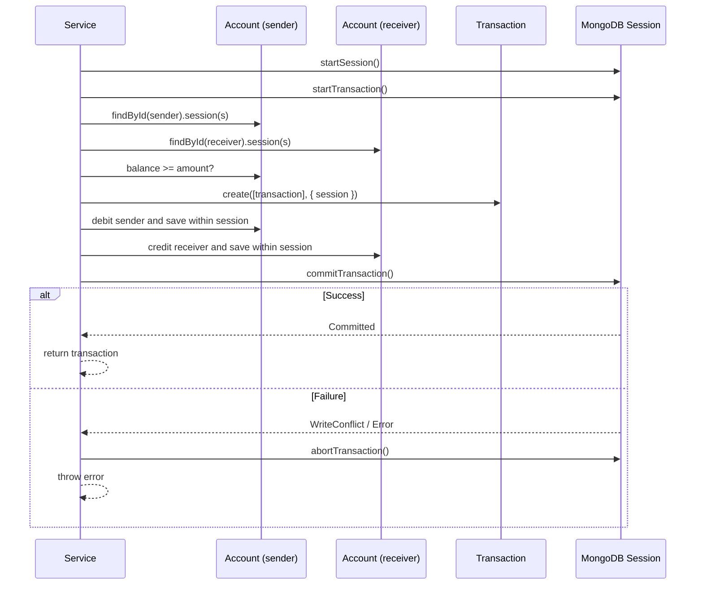
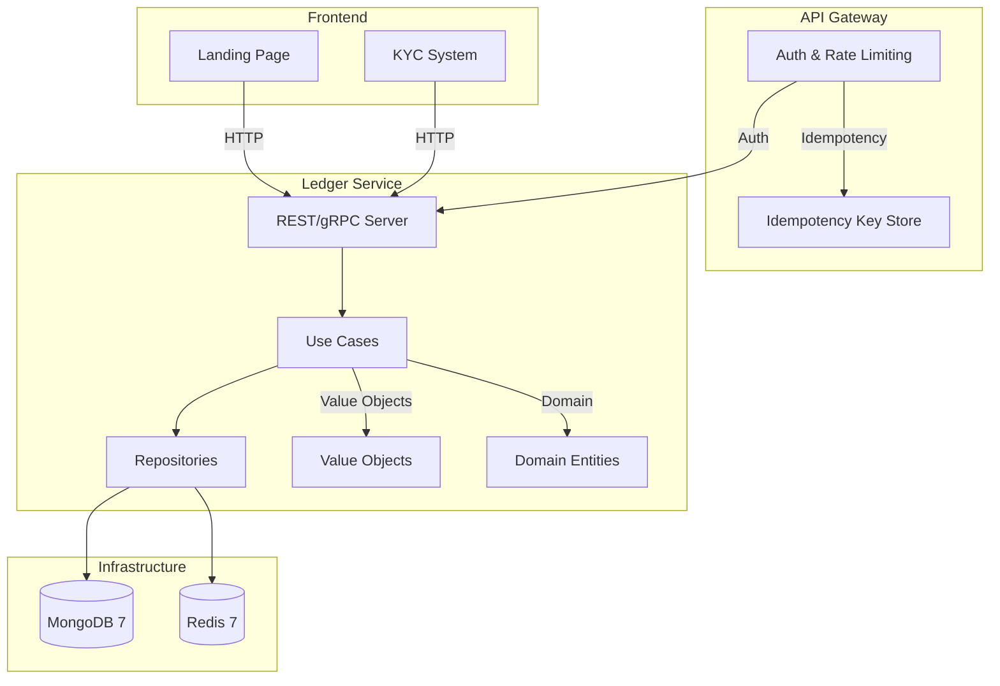
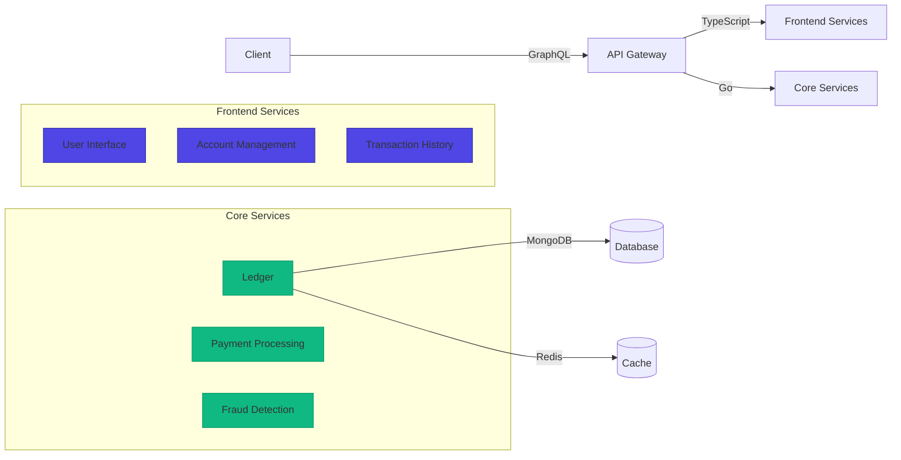

# Desafio 01: Ledger — O Coração Contábil de Qualquer Fintech

**🇧🇷** Ledger Bancário com GraphQL Relay  
**🇬🇧** Bank Ledger with GraphQL Relay

---

## 🎯 Objetivos de Aprendizado

- Implementar um ledger contábil com atomicidade garantida
- Entender por que paginação cursor-based é obrigatória em sistemas financeiros
- Dominar DataLoader para eliminar N+1 em GraphQL
- Projetar transações ACID em MongoDB (Replica Set)
- Implementar idempotência e retry com exponential backoff

---

## 📋 Pré-requisitos

### 🧠 Conceitos
- Double-entry bookkeeping
- REST vs GraphQL
- NoSQL vs SQL trade-offs

### 📚 Desafios Anteriores
- Nenhum (é o primeiro)

### 🛠️ Ferramentas
- Docker
- MongoDB 7 Replica Set
- Redis 7
- pnpm

### 💻 Técnico
- TypeScript
- Node.js 20+
- GraphQL básico
- Mongoose ODM

---

## 📖 Abertura — O Que é um Ledger?

"Vou te explicar. toda vez que você abre o Nubank, Inter, ou qualquer banco aí, e vê aquele saldo na tela — parece simples, né? Um número. Mas por trás desse número existe um sistema que precisa ser **atomicamente consistente**. Se uma transferência sai da conta do João e entra na conta da Maria, as duas operações precisam acontecer. Não existe "Mais ou menos" em dinheiro. Não existe "Commited pela metade".

Isso é um **ledger**.

Mas deixa eu voltar um pouco mais no tempo — e quando eu digo tempo, é **1494**. Ano em que Luca Pacioli, um frade franciscano italiano, publicou a _Summa de Arithmetica, Geometria, Proportioni et Proportionalità_. Dentro desse livro tinha uma seção chamada _Particularis de Computis et Scripturis_ — e ali Pacioli descreveu pela primeira vez o que hoje a gente chama de **double-entry bookkeeping**. Débito de um lado, crédito do outro. Cada transação com duas entradas espelhadas. O que sai de uma conta, entra em outra. A soma dos débitos igual à soma dos créditos. Essa ideia — de que o livro contábil precisa fechar, que nenhum centavo pode ser criado ou destruído — sobreviveu 500 anos.

E sabe o que é mais impressionante? Os bancos ainda rodam sistemas que são herdeiros diretos dessa lógica. Nos mainframes dos anos 60 e 70, o ledger virou coisa de COBOL rodando em batch. Antigamente — e quando eu digo antigamente é nos mainframes dos anos 70 — ledger era livro de papel. Literalmente. Cada transação era anotada à mão, debaixo de um candelabro, e o saldo era calculado no final do dia no famoso "Batch processing". Você já deve ter ouvido falar de "D+1" ou "D+2" — isso é herança dessa época em que liquidar uma transação demorava **dias**.

O processamento batch funcionava mais ou menos assim: durante o dia, todas as transações iam pra uma fila — literalmente arquivos sequenciais em fita magnética. À noite, um job de COBOL rodava e aplicava cada débito e crédito, uma transação por vez, calculava os saldos, e gerava os extratos pro dia seguinte. Era lento, mas era deterministicamente consistente. Ninguém conseguia roubar o banco porque tudo era processado em sequência, uma linha depois da outra, sem concorrência.

Só que hoje não dá mais. Hoje é PIX, é tempo real, é 2500 transações por segundo no horário de pico. O modelo batch não sobrevive a um mundo onde você faz um PIX e o destinatário recebe em 10 segundos. E o ledger? Continua sendo a mesma responsabilidade de sempre — garantir que **a soma dos saldos nunca muda**. Cada centavo que sai de uma conta vai parar exatamente em outra. Sem criar dinheiro do nada. Sem sumir.

Aí entra o que bancos como o Nubank fizeram. Eles pegaram os princípios contábeis de Pacioli — que não mudaram em 500 anos — e os implementaram com tecnologia moderna. O Nubank rodava seu ledger em **Clojure** sobre **Datomic**, um banco de dados imutável onde cada transação é um fato que se acumula no tempo. Você nunca deleta, nunca atualiza in-place — você sempre adiciona um novo fato. Isso dá trilha de auditoria completa e permite "Viajar no tempo" pra saber qual era o saldo em qualquer data passada. É o conceito de **event sourcing** aplicado a finanças.

Mas por que "Saldo nunca pode ser negativo"? Porque saldo negativo significa que o banco emprestou dinheiro sem autorização. Significa que o banco criou dinheiro do nada. Em um ledger contábil — _double-entry_ — o balanço sempre fecha. Se alguém debitou R$ 100, alguém creditou R$ 100. Se uma conta fica negativa sem que outra tenha emprestado, a equação não fecha. É o tipo de bug que quebra banco. Literalmente. O banco Knight Capital perdeu US$ 440 milhões em 45 minutos em 2012 por causa de um bug em deploy — imagina se fosse um bug de saldo negativo passando despercebido por meses.

Esse desafio é sobre **construir esse coração contábil**. Não com mainframe, não com COBOL, não com Clojure — mas com TypeScript, GraphQL e MongoDB, porque o mundo mudou, mas a responsabilidade de manter o patrimônio dos clientes íntegro não mudou."

---

## 🔥 O Problema

Imagine que você está construindo o backend de um banco digital. No começo, é só uma API REST simples:

```
GET /accounts?page=1&limit=10
```

E funciona. Até que seu banco começa a crescer e aparecem os problemas:

1. **N+1 queries** — Uma listagem de 10 transações, cada uma buscando o sender e receiver, faz **21 queries**. Em REST você não percebe porque o ORM esconde. Só que quando o sistema começa a travar, você vai olhar e vai ver o banco gritando.

Só que o N+1 não é só um problema de performance. É um problema de **latência percebida pelo usuário** e de **custo de infraestrutura**. Vamos fazer as contas: cada round-trip MongoDB leva em média 2ms em rede local, 20ms em cloud com latência de rede. Com 21 queries, isso dá entre 42ms e 420ms. Agora multiplica isso por 10.000 usuários simultâneos. Você está gastando 4.200 segundos de tempo de banco de dados — que poderia ser 3 queries batchadas resolvendo tudo em 30ms. DataLoader não é otimização prematura: é arquitetura.

E o pior: N+1 é sorrateiro. Em desenvolvimento local, com o banco na mesma máquina e 10 registros, você nem percebe. O problema só aparece em produção, com latência de rede real e milhares de registros. Quando você percebe, já tem cliente reclamando que o app trava ao abrir o extrato.

2. **Paginação com offset desvia** — Enquanto o usuário está na página 2, uma transação nova entra na página 1. Quando ele clica "Próxima página", o offset `?page=2&limit=10` agora inclui registro que não estava antes. **O usuário vê o mesmo dado duas vezes.** Em sistema financeiro isso é inaceitável.

Isso aqui merece um exemplo concreto. Imagina um correntista conferindo o extrato pra fechar a contabilidade do mês. Ele está na página 2, vendo as transações 11 a 20. Enquanto ele lê, o PIX de R$ 5.000 que ele fez de manhã é processado e inserido como transação #3. Quando ele clica "Próxima página", o offset 20 agora aponta pra transação #21 — mas a transação #11 original agora é a #12, e a página mostra registros 21 a 30. O correntista **nunca viu a transação #11**. Ele pula um registro sem saber.

Agora imagina isso num cenário de auditoria. Um auditor do Banco Central está revisando transações de uma fintech. Ele exporta página por página. Se o offset desviar e ele perder transações, o banco pode ser multado. Em 2018, um banco europeu foi multado em €2 milhões porque o sistema de extrato deles tinha exatamente esse bug — transações puladas em relatórios de compliance.

Outro caso: você está fazendo reconciliação contábil (o famoso "Fechamento"). Precisa comparar transações do seu sistema com as da clearing house. Se a paginação desvia e você perde registros, a reconciliação não fecha. E reconciliação que não fecha = dinheiro perdido. Literalmente.

3. **Atomicidade** — Sua transferência debita de um lado e... ops, o servidor caiu no meio. O dinheiro sumiu. O cliente não vai gostar.

Vamos falar de exemplos reais de catástrofe atômica. Em 2015, um banco australiano teve um crash no meio de um batch de transferências interbancárias. O job estava processando 50.000 transações em lote. Debitou 23.000 contas e... o servidor morreu. As outras 27.000 ficaram sem crédito. O banco passou três dias com 23.000 clientes sem dinheiro e 27.000 fornecedores sem receber. O prejuízo em reputação foi incalculável.

Outro caso clássico: _two-phase commit_ parcial. Uma transferência internacional passa por 5 bancos intermediários. Se o 4º banco falha, os 3 primeiros já debitaram. Quem estorna? Como estorna? Sem atomicidade, cada banco tem que ter seu próprio mecanismo de rollback — e se um deles não tiver, o dinheiro fica preso no limbo.

E tem o caso mais comum de todos: **race condition**. Duas threads debitam a mesma conta ao mesmo tempo. Ambas leem saldo = R$ 100. Ambas debitam R$ 100. Saldo final? R$ -100. Você acabou de permitir que um cliente gastasse o dobro do que tinha. Isso aconteceu com um banco digital brasileiro em 2022 — o bug ficou 4 horas no ar antes de ser detectado.

Cada um desses problemas tem solução: **GraphQL + Relay Connection** pra paginação cursor-based (adeus offset), **DataLoader** pra eliminar N+1, **transações MongoDB** pra atomicidade.

---

## 🏗️ Arquitetura Geral

<LanguageToggle />

<div class="Lang-content ts" style="Display:block;">

### Visão Macro



Antes de mergulhar no código, quero que você entenda uma decisão arquitetural importante nesse diagrama: o **DataLoader Factory** fica entre o middleware e os resolvers. Isso não é acidental. DataLoader tem que ser criado **por request** — cada request HTTP ganha sua própria instância, seu próprio cache de batch. Porque se você usar um DataLoader global (singleton), o cache de um usuário vaza pra outro. Imagina o João pedindo extrato e recebendo contas de um estranho porque o DataLoader reaproveitou uma query em cache.

Outra coisa: repare que o **Idempotency Middleware** vem antes de tudo. Ele intercepta a request, olha se já existe um `Idempotency-Key` no header, e consulta o Redis antes mesmo de chegar nos resolvers. Se a operação já foi processada, retorna o resultado cached. Se não, passa adiante e guarda o resultado depois. Isso evita que um retry do cliente (muito comum em PIX, onde o timeout do Banco Central é curto e o cliente reenvia) crie transações duplicadas.

E sobre o Redis ali embaixo: ele não é cache de dados. É **cache de idempotência** e **cache de consultas frequentes**. O ledger em si vive no MongoDB. O Redis é a camada de defesa: evita duplicatas e acelera reads que não precisam de consistência forte.

### A Stack

Koa, Mongoose, `graphql-relay`, `dataloader`. Tudo TypeScript, zero frameworks mágicos.

> **Por que Koa e não Express?** — O middleware cascata do Koa (async/await nativo) casa muito melhor com GraphQL. Cada request monta seu próprio contexto compartilhado — instâncias de DataLoader, sessão do usuário — e cada middleware pode enriquecer ou abortar esse contexto. No Express, o middleware linear faz você empilhar coisas no `req` e rezar. No Koa, é um pipeline.

Podia ter usado Apollo Server, mas não usei por dois motivos: primeiro, Apollo abstrai como o GraphQL funciona por baixo — você nunca vê como o schema é resolvido, como os resolvers se conectam, como o DataLoader se integra. Segundo, eu queria controle fino sobre error handling, CORS e lifecycle da request. Koa + `koa-graphql` me dá um middleware que recebe um schema e devolve GraphQL. Sem firulas.

### Fluxo de uma Requisição



<InteractiveDiagram title="Fluxo de uma Requisicao — passo a passo" :steps="[
  { from: 'Cliente', to: 'Koa', message: 'POST /graphql', explanation: 'O cliente envia uma query GraphQL via POST. O Koa recebe e inicia o pipeline de middlewares.' },
  { from: 'Koa', to: 'Auth', message: 'Valida token JWT', explanation: 'O middleware de autenticacao extrai e valida o token JWT. Se invalido, retorna 401 imediatamente.' },
  { from: 'Koa', to: 'Idempotency', message: 'Verifica idempotency key', explanation: 'Se o request tem idempotency key, verifica se ja foi processado. Se sim, retorna o resultado cacheado.' },
  { from: 'Koa', to: 'DataLoader', message: 'Cria instancias por request', explanation: 'DataLoader factory cria novas instancias isoladas para este request. Cada usuario tem seus proprios loaders.' },
  { from: 'Koa', to: 'Resolver', message: 'Executa GraphQL resolver', explanation: 'O schema GraphQL e executado. Cada campo resolvido dispara chamadas ao DataLoader.' },
  { from: 'DataLoader', to: 'MongoDB', message: 'Account.find({ _id: { \$in: ids } })', explanation: 'Em vez de N queries individuais, o DataLoader agrupa todas em uma unica query com operador IN.' },
  { from: 'Resolver', to: 'Use Case', message: 'createTransaction(data)', explanation: 'O resolver chama o use case que contem a logica de negocio — validacoes, regras, orquestracao.' },
  { from: 'Use Case', to: 'MongoDB', message: 'startSession + startTransaction', explanation: 'Inicia uma sessao e transacao ACID no MongoDB. Todas as operacoes seguintes ficam dentro dessa transacao.' },
  { from: 'Use Case', to: 'MongoDB', message: 'Debita sender, credita receiver, salva transacao', explanation: 'As 3 operacoes sao atomicas: ou todas acontecem, ou nenhuma. O MongoDB garante isso via Replica Set.' },
  { from: 'Use Case', to: 'MongoDB', message: 'commitTransaction', explanation: 'Confirma a transacao. Se houver WriteConflict (concorrencia), o commit falha e o use case faz retry.' },
  { from: 'Koa', to: 'Cliente', message: 'JSON { data }', explanation: 'Resposta GraphQL padrao. Se houve erro em qualquer etapa, o erro e capturado e retornado no formato GraphQL errors.' },
]" />

Repare em dois detalhes sutis desse diagrama de sequência. O primeiro: o DataLoader batcha as chamadas `AccountLoader.load()` — mesmo que o resolver chame `load("Id_1")` e `load("Id_2")` em pontos diferentes do código, o DataLoader acumula essas chamadas durante o mesmo _"Tick"_ do event loop e dispara uma única query `find({ _id: { $in: [...] } })`. Isso é o que elimina o N+1: não é mágica, é batching no event loop.

O segundo detalhe: a sessão do MongoDB (`startSession`) envolve **todas** as operações — find, create, save, commit. Se qualquer uma dessas operações falhar, o `abortTransaction` reverte tudo. Isso é atomicidade real: ou todas as 5 operações acontecem, ou nenhuma. O MongoDB garante isso no nível do Replica Set com write-ahead log (WAL) — o mesmo mecanismo que o PostgreSQL usa, aliás.

### Schema GraphQL

O schema segue a especificação Relay. Toda entidade implementa `Node`, toda lista retorna `Connection`:

```graphql
interface Node { id: ID! }

type Account implements Node {
  id: ID!        # Relay global ID (base64)
  name: String!
  document: String!
  balance: Float!
}

type Transaction implements Node {
  id: ID!
  sender: Account!
  receiver: Account!
  amount: Float!
  type: TransactionType!
  status: TransactionStatus!
  createdAt: String!
}

type AccountConnection {
  edges: [AccountEdge]
  pageInfo: PageInfo!     # hasNextPage, hasPreviousPage, startCursor, endCursor
  totalCount: Int!
}
```

Agora, por que o schema usa o padrão Relay Connection em vez de uma lista simples `[Account]`? Porque o padrão Relay Connection encapsula todo o estado de paginação — cursores, direção, página atual — em um tipo padronizado. Quando o frontend usa Relay (ou Apollo com `@connection`), ele consegue fazer cache de paginação automaticamente. Cada página tem um cursor que identifica exatamente onde ela começa, e o cache do Relay consegue fundir páginas consecutivas sem repetir registros.

O campo `totalCount` merece uma nota: ele não é obrigatório no padrão Relay original. O Relay original era minimalista — `pageInfo` com `hasNextPage` e `hasPreviousPage` era suficiente. Mas em sistema financeiro, o usuário quer saber quantas transações ele tem no total. "Você tem 342 transações" é uma informação importante pra UX. Então incluímos `totalCount` como um campo extra — é uma `countDocuments()` que o MongoDB executa rápido porque usa índices.

Sobre o `balance` ser `Float` — sim, sei que Float tem problema de precisão em ponto flutuante. Em produção você usaria inteiros (centavos) ou Decimal do MongoDB. Pra esse desafio, Float é suficiente pra demonstrar os conceitos. **Mas não use Float em produção com dinheiro, pelo amor de deus.**

---

## 👨‍💻 Mão na Massa

"Bora codar. O bagulho é o seguinte: você precisa de um ledger que garanta que **toda transferência seja atômica**. Se caiu o servidor no meio, o dinheiro não pode ter ido pra lugar nenhum. Se tentou transferir duas vezes ao mesmo tempo, uma delas precisa falhar.

Antes de colocar a mão no código, quero que você entenda três conceitos que vão aparecer em cada linha desse sistema: o **Relay Connection spec**, **optimistic locking**, e **defense in depth**.

### Relay Connection Spec em Detalhe

O padrão Relay Connection foi criado pelo Facebook em 2015 e virou um padrão de facto pra paginação em GraphQL. Ele define três coisas: como representar cursores (`PageInfo`), como encapsular itens paginados (`Edge` + `Node`), e como navegar (`first`/`after` pra frente, `last`/`before` pra trás).

A estrutura é sempre a mesma: uma `Connection` contém `edges` (cada edge tem um `cursor` e um `node`), `pageInfo` (com `hasNextPage`, `hasPreviousPage`, `startCursor`, `endCursor`). O cursor é sempre opaco — o cliente nunca interpreta, só passa de volta. Isso permite que o servidor troque a implementação do cursor sem quebrar o cliente.

E por que `Edge` em vez de colocar o cursor dentro do `Node`? Porque o cursor é metadado da posição, não propriedade do objeto. A conta bancária não tem "Posição na lista" — a posição é propriedade da consulta. Separar `cursor` do `node` mantém o modelo de domínio limpo.

### Por que Base64 nos IDs?

`QWNjb3VudDox` é `Account:1` em base64. Mas por que? Porque o padrão Relay exige que todo `Node` tenha um ID global único. Se você tiver `Account:1` e `Transaction:1`, eles colidiriam como strings puras. O base64 codifica `TypeName:InternalId` em uma string opaca que o cliente trata como `ID!`. O servidor decodifica com `fromGlobalId()`.

E tem um benefício arquitetural enorme: **indireção**. O cliente nunca sabe se o ID interno é ObjectId do MongoDB, UUID do PostgreSQL, ou inteiro auto-increment. Se você migrar de banco, o cliente continua mandando o mesmo base64 — o servidor só muda a lógica de `fromGlobalId`. Isso se chama _global object identification_ e é um dos pilares do Relay.

### Optimistic Locking vs Pessimistic Locking

Em sistema concorrente, você tem duas estratégias pra lidar com conflitos de escrita:

- **Pessimistic locking**: você trava o registro antes de ler. "Ninguém mexe nessa conta enquanto eu estiver processando". Funciona, mas é lento e pode causar deadlocks. Em sistemas com 2500 TPS, locking pessimista vira gargalo.

- **Optimistic locking**: você lê o registro com um `version` (ou `updatedAt`), faz suas alterações, e na hora de salvar verifica se a versão ainda é a mesma. Se alguém alterou enquanto você processava, o update falha e você retry. É "Otimista" porque assume que conflitos são raros — o que é verdade na maioria dos sistemas.

No nosso ledger, usamos optimistic locking com **transações do MongoDB**. O MongoDB, quando opera em Replica Set, usa optimistic concurrency control internamente. Duas transações que mexem no mesmo documento vão conflitar no `commitTransaction` — uma delas recebe `WriteConflict`. É o MongoDB fazendo optimistic locking pra gente.

### Defense in Depth Aplicado ao Ledger

Defense in depth é um princípio de segurança: você nunca confia em uma única camada de defesa. No nosso ledger, isso significa que a proteção contra saldo negativo existe em **quatro camadas**:

1. **Schema do Mongoose**: `balance: { min: 0 }` — validação declarativa no modelo.
2. **Pre-save hook**: `AccountSchema.pre('save', ...)` — validação imperativa antes de persistir.
3. **Service layer**: `if (sender.balance < data.amount) throw new Error(...)` — validação de negócio.
4. **MongoDB transaction rollback**: se algo falhar, `session.abortTransaction()` reverte tudo.

Se uma camada falhar (bug no schema, hook removido acidentalmente, refactor que quebrou o service), as outras seguram. É o mesmo princípio que faz aviões terem 3 sistemas hidráulicos redundantes — cada um capaz de pousar o avião sozinho.

Vou te mostrar como fazer isso na prática."

### Modelo de Dados

Primeiro, as contas:

```typescript
import mongoose, { Schema, Document } from 'mongoose';

export interface IAccount extends Document {
  _id: mongoose.Types.ObjectId;
  name: string;
  document: string;
  balance: number;
  createdAt: Date;
  updatedAt: Date;
}

const AccountSchema = new Schema<IAccount>(
  {
    name: { type: String, required: true },
    document: { type: String, required: true, unique: true },
    balance: { type: Number, required: true, default: 0, min: 0 },
  },
  { timestamps: true }
);

AccountSchema.pre('save', function (next) {
  if (this.balance < 0) {
    return next(new Error('Account balance cannot be negative'));
  }
  next();
});

export const Account = mongoose.model<IAccount>('Account', AccountSchema);
```

**Duas decisões importantes aqui:**

1. **`unique: true` no document** — Impede CPF/CNPJ duplicado. Validado tanto no índice do MongoDB quanto no service layer. Defense in depth.

2. **`pre('save') hook`** — Última barreira contra saldo negativo. É o que a gente chama de _defense in depth_: você não confia em uma única camada. O `min: 0` no schema, o hook no Mongoose, a checagem no service — tudo isso existe porque **uma conta com saldo negativo é um bug que custa dinheiro de verdade**.

Agora as transações:

```typescript
export type TransactionType = 'PIX' | 'TED' | 'DOC' | 'TRANSFER';
export type TransactionStatus = 'PENDING' | 'COMPLETED' | 'FAILED' | 'REVERTED';

export interface ITransaction extends Document {
  _id: mongoose.Types.ObjectId;
  senderAccount: mongoose.Types.ObjectId;
  receiverAccount: mongoose.Types.ObjectId;
  amount: number;
  description?: string;
  type: TransactionType;
  status: TransactionStatus;
  createdAt: Date;
  completedAt?: Date;
}

const TransactionSchema = new Schema<ITransaction>(
  {
    senderAccount: { type: Schema.Types.ObjectId, ref: 'Account', required: true },
    receiverAccount: { type: Schema.Types.ObjectId, ref: 'Account', required: true },
    amount: { type: Number, required: true, min: 0 },
    description: { type: String, default: '' },
    type: { type: String, enum: ['PIX', 'TED', 'DOC', 'TRANSFER'], required: true },
    status: { type: String, enum: ['PENDING', 'COMPLETED', 'FAILED', 'REVERTED'], default: 'PENDING' },
    completedAt: { type: Date },
  },
  { timestamps: { createdAt: true, updatedAt: false } }
);

export const Transaction = mongoose.model<ITransaction>('Transaction', TransactionSchema);
```

**Três decisões de design:**

- **`status` com `PENDING` como default** — A transação nasce `PENDING`, só vira `COMPLETED` após confirmação atômica. Se algo der errado, vira `FAILED`. E se precisar desfazer, vira `REVERTED`. Isso dá audit trail completo.

- **`completedAt` opcional** — Separa data de criação da data de completion. Parece besteira, mas permite métricas de latency: "Quanto tempo demora do PENDING ao COMPLETED?". Em TED, que leva horas, isso é essencial.

- **`amount: { min: 0 }`** — Impede que erro no service crie transação com valor negativo. Mais uma camada de defense in depth.

O modelo de status em máquina de estados (`PENDING → COMPLETED / FAILED / REVERTED`) é proposital. Não existe "Deletar transação". Em contabilidade, você nunca remove um lançamento — você lança um estorno. O `REVERTED` existe exatamente pra isso: quando você precisa desfazer uma transação, cria uma nova com status `REVERTED` que referencia a original. O saldo volta, mas a transação original continua lá pra sempre, auditável.

### DataLoader — Matando o N+1

Sem DataLoader, uma query de 10 transações faria **21 queries** no banco. Olha o tamanho do estrago:

```
Query: { transactions(first: 10) { edges { node { sender { name } receiver { name } } } } }

1.  SELECT * FROM transactions LIMIT 11
2.  SELECT * FROM accounts WHERE _id = 'sender_1'   ← N+1 starts here
3.  SELECT * FROM accounts WHERE _id = 'receiver_1'
4.  SELECT * FROM accounts WHERE _id = 'sender_2'
5.  SELECT * FROM accounts WHERE _id = 'receiver_2'
...
21. SELECT * FROM accounts WHERE _id = 'receiver_10'
```

21 queries pra buscar 10 transações. Agora escala isso pra 100 transações = 201 queries. O banco vai pro chão e você nem vai entender por quê.

DataLoader resolve isso **batchando** as chamadas:

```typescript
import DataLoader from 'dataloader';

export const createAccountLoader = (): DataLoader<string, IAccount | null> => {
  return new DataLoader<string, IAccount | null>(async (ids) => {
    const accounts = await Account.find({ _id: { $in: ids } }).lean();
    const map = new Map<string, IAccount>();
    for (const acc of accounts) {
      map.set(acc._id.toString(), acc as unknown as IAccount);
    }
    return ids.map((id) => map.get(id) ?? null);
  });
};
```

Com DataLoader, aquelas 21 queries viram **3**:

```
1. SELECT * FROM transactions LIMIT 11
2. SELECT * FROM accounts WHERE _id IN ('sender_1', 'receiver_1', ..., 'receiver_10')
```

**Cada request cria sua própria instância** pra evitar cache sujo entre requisições. O `lean()` faz o Mongoose retornar plain objects — mais performático pra leitura porque não hidrata documentos completos do Mongoose.

O `dataloader` funciona com um truque esperto do event loop do Node.js. Quando você chama `.load(id)`, o DataLoader não dispara a query imediatamente. Ele empurra o `id` pra uma fila e agenda um _microtask_ via `process.nextTick()`. Quando o event loop chega nesse microtask, todos os `ids` acumulados são enviados de uma vez na função batch. É por isso que DataLoader funciona mesmo que `load()` seja chamado em partes diferentes do código: todas as chamadas síncronas durante o mesmo tick são batchadas.

Tem um detalhe importante sobre o `.lean()` ali: ele retorna POJOs (Plain Old JavaScript Objects) em vez de documentos do Mongoose. Documentos do Mongoose têm getters, setters, hooks, métodos como `.save()` — tudo isso custa memória e CPU. Pra leitura pura, `.lean()` é significativamente mais rápido (~3-5x em benchmarks). Mas cuidado: você perde os métodos do Mongoose — não dá pra chamar `.save()` num objeto lean.

<Checkpoint question="Por que DataLoader deve ser instanciado por request e NUNCA como singleton global?">
Se o DataLoader for global (singleton), o cache de deduplicação seria compartilhado entre todos os usuários. Um usuário poderia ver dados cacheados de outro usuário. Cada request recebe sua própria instância de DataLoader — o cache vive apenas durante aquela requisição e é descartado depois.
</Checkpoint>

### Transação Atômica — O Coração do Ledger

"Aqui é onde a porca torce o rabo. Transferência não pode ser `UPDATE accounts SET balance = balance - 100 WHERE id = X` seguido de `UPDATE accounts SET balance = balance + 100 WHERE id = Y`. Se o servidor cair entre os dois updates, o dinheiro sumiu.

A solução é usar **transações do MongoDB**."

```typescript
export const transactionService = {
  async createTransaction(data: {
    senderAccount: string;
    receiverAccount: string;
    amount: number;
    description?: string;
    type: string;
  }): Promise<ITransaction> {
    if (data.amount <= 0) throw new Error('Amount must be positive');
    if (data.senderAccount === data.receiverAccount) {
      throw new Error('Sender and receiver must be different');
    }

    const session = await mongoose.startSession();
    session.startTransaction();

    try {
      const sender = await Account.findById(data.senderAccount).session(session);
      if (!sender) throw new Error('Sender account not found');
      const receiver = await Account.findById(data.receiverAccount).session(session);
      if (!receiver) throw new Error('Receiver account not found');
      if (sender.balance < data.amount) throw new Error('Insufficient funds');

      const [transaction] = await Transaction.create(
        [{
          senderAccount: new Types.ObjectId(data.senderAccount),
          receiverAccount: new Types.ObjectId(data.receiverAccount),
          amount: data.amount,
          description: data.description ?? '',
          type: data.type,
          status: 'COMPLETED' as TransactionStatus,
          completedAt: new Date(),
        }], { session }
      );

      sender.balance -= data.amount;
      receiver.balance += data.amount;
      await sender.save({ session });
      await receiver.save({ session });
      await session.commitTransaction();
      return transaction;
    } catch (error) {
      await session.abortTransaction();
      throw error;
    } finally {
      session.endSession();
    }
  },
```

**O fluxo da transação:**



**Edge case crítico:** Duas transferências concorrentes debitam da mesma conta ao mesmo tempo. O MongoDB lida com isso via lock do Replica Set — uma transação falha no `commitTransaction` com `WriteConflict`. Isso **não é erro**, é **comportamento esperado** em sistemas concorrentes. A solução é retry com idempotency key:

Mas quero que você entenda exatamente o que acontece no `commitTransaction`. O MongoDB não trava documentos durante a transação — ele usa **snapshot isolation**. Cada transação lê uma versão consistente do banco no momento em que começou. Quando chega no commit, o MongoDB verifica se algum documento lido foi alterado por outra transação enquanto esta estava rodando. Se foi, `WriteConflict`. Se não foi, commit.

Isso é radicalmente diferente de bancos como MySQL/InnoDB com `SELECT ... FOR UPDATE`, onde você travaria a linha do sender antes mesmo de começar. No MongoDB, você é otimista: assume que não vai ter conflito, lê sem travar, e só descobre no commit. A vantagem é throughput maior (ninguém espera lock). A desvantagem é que você precisa estar preparado pra retry.

### Retry com Exponential Backoff

```typescript
async function createTransactionWithRetry(
  data: TransactionData,
  idempotencyKey: string,
  maxRetries = 3
) {
  for (let attempt = 1; attempt <= maxRetries; attempt++) {
    try {
      // Checa idempotência antes de tentar
      const existing = await idempotencyStore.get(idempotencyKey);
      if (existing) return existing;

      const result = await createTransaction(data);

      await idempotencyStore.set(idempotencyKey, result);
      return result;
    } catch (err: unknown) {
      const error = err as Error;
      if (error.message.includes('WriteConflict') && attempt < maxRetries) {
        await new Promise(r => setTimeout(r, Math.pow(2, attempt) * 50));
        continue;
      }
      throw err;
    }
  }
  throw new Error('Max retries reached');
}
```

O exponential backoff usa a fórmula `2^attempt * 50ms`:
- Tentativa 1 falhou → espera 100ms
- Tentativa 2 falhou → espera 200ms
- Tentativa 3 falhou → espera 400ms (mas essa é a última, se falhar throw)

Por que exponencial e não constante? Porque se o conflito é causado por alta concorrência, esperar um tempo constante só garante que as transações vão colidir de novo no mesmo instante. O backoff exponencial espalha as retentativas no tempo, reduzindo a probabilidade de colisão repetida. Isso se chama **jitter implícito** — cada transação espera um tempo diferente baseado em quantas vezes já tentou.

E a idempotency key? Ela é uma string única que o cliente gera (UUID) e manda no header `Idempotency-Key`. O servidor guarda no Redis: `idempotency:{key} → {resultado}`. Se o cliente retry (timeout, rede, etc.), o servidor vê que a chave já existe e retorna o resultado cached em vez de processar de novo. **Sem idempotency key, retry do cliente = transação duplicada = cliente puto.**

---

## 🧠 A Profundidade

### Por que Paginação Cursor-Based?

"Cara, deixa eu te contar uma história. Lá em 2012, quando o Facebook lançou o GraphQL, eles já tinham um problema enorme com paginação. O feed de notícias não podia usar `OFFSET` porque quando você scrollava, posts novos entravam no topo e o offset desviava tudo. Você via o mesmo post duas vezes. E em 2012, o Facebook já tinha 1 bilhão de usuários — qualquer bug de paginação era catastrófico.

A diferença entre `LIMIT/OFFSET` e cursor:

**Com OFFSET:**
```
Página 1: SELECT * FROM accounts LIMIT 10 OFFSET 0   → ids 1-10
Página 2: SELECT * FROM accounts LIMIT 10 OFFSET 10  → ids 11-20
```

Agora insere um registro novo. O que era página 1 agora tem 11 registros. Página 2 com OFFSET 10 retorna **ids 11-20 ainda**, mas o id 11 agora é o registro novo. O usuário vê um dado repetido.

**Com cursor:**
```
Página 1: SELECT * FROM accounts LIMIT 11
          → retorna até id "Abc123", hasNextPage = true
          → cursor = base64("Abc123")

Página 2: SELECT * FROM accounts WHERE _id > "Abc123" LIMIT 11
          → retorna a partir de onde parou, sem desvio
```

Registro novo entrou? Não importa. O cursor diz "A partir daqui". **Não desvia.**

Em sistema financeiro, onde o usuário confere extrato e precisa ter certeza de que não pulou nem repetiu nenhuma transação, cursor-based não é opcional — é obrigatório."

Mas deixa eu aprofundar um pouco mais. O problema do offset não é só teórico — ele tem consequências financeiras mensuráveis. Imagina um sistema de conciliação bancária processando 10 milhões de transações por dia. Se 0.01% das transações são puladas ou duplicadas por causa de offset pagination, são 1.000 transações erradas. A R$ 100 cada, são R$ 100.000 em inconsistência contábil por dia.

E tem um problema ainda mais sutil: **hotspot de índice**. Com `OFFSET 100000 LIMIT 10`, o banco ainda precisa **contar** 100.010 registros pra te entregar 10. Isso porque o banco não "Pula" registros — ele lê e descarta. Em MongoDB com milhões de documentos, um `OFFSET 100000` pode levar segundos. Já o cursor `WHERE _id > "Abc123" LIMIT 11` usa índice diretamente — o banco vai direto pro ponto certo via B-tree, sem ler registros intermediários.

```typescript
async getAccounts(
  pagination: { first?: number; after?: string; last?: number; before?: string }
) {
  const { first = 10, after, last, before } = pagination;
  let query: Record<string, unknown> = {};
  let sortDir: 1 | -1 = 1;
  let limit = first;

  if (last) { sortDir = -1; limit = last; }
  if (after) {
    const decoded = Buffer.from(after, 'base64').toString('utf-8');
    query = { ...query, _id: { $gt: new Types.ObjectId(decoded) } };
  }
  if (before) {
    const decoded = Buffer.from(before, 'base64').toString('utf-8');
    query = { ...query, _id: { $lt: new Types.ObjectId(decoded) } };
  }

  const totalCount = await Account.countDocuments();
  const accounts = await Account.find(query)
    .sort({ _id: sortDir }).limit(limit + 1).lean();
  const hasMore = accounts.length > limit;
  if (hasMore) accounts.pop();
  if (last) accounts.reverse();

  return { accounts, totalCount, hasNextPage: hasMore, hasPreviousPage: before ? hasMore : false };
}
```

Repara que `limit + 1` — a gente busca UM registro a mais do que o necessário. Se voltaram 11 registros, é porque tem mais página. O 11º é descartado. Esse é o truque pra saber se `hasNextPage` é true sem fazer uma query extra de `COUNT`.

### MongoDB Transactions vs PostgreSQL ACID

"Fato curioso: essa é uma comparação que eu queria que mais devs fizessem antes de escolher banco pra sistema financeiro."

MongoDB e PostgreSQL implementam ACID de formas fundamentalmente diferentes, e entender isso é essencial pra projetar seu ledger:

| Aspecto | MongoDB (7.0+) | PostgreSQL |
|---------|---------------|------------|
| **Isolamento** | Snapshot isolation (optimistic) | Serializable / Repeatable Read / Read Committed |
| **Lock** | No lock on read; WriteConflict on commit | Row-level locks, `SELECT FOR UPDATE` |
| **Atomicidade** | Multi-document transactions (Replica Set) | Single & multi-statement transactions (always) |
| **Durabilidade** | Write-ahead log (WAL) via oplog | Write-ahead log (WAL) via pg_wal |
| **Consistência** | Schema validation + application-level | Constraints (FK, CHECK, UNIQUE) nativas |
| **Concorrência** | MVCC sem locks de leitura | MVCC com múltiplos níveis de isolamento |
| **Transactions** | Requer Replica Set; limitadas a 60s default | Sempre disponível; sem limite de duração |

A diferença mais importante: no PostgreSQL você pode abrir uma transação, fazer 50 operações em 10 tabelas, dar um `SELECT` pra conferir, tomar um café, e dar `COMMIT`. No MongoDB, a transação tem um **timeout de 60 segundos** (configurável, mas não recomendado aumentar). Se passar disso, aborta. Isso força você a pensar em transações curtas e eficientes — o que é bom design de qualquer forma.

Outra diferença crucial: o PostgreSQL tem `SELECT ... FOR UPDATE` que trava a linha imediatamente. Se duas transações concorrentes tentarem debitar a mesma conta, a segunda vai **esperar** (não falhar) até a primeira dar commit. Isso é _pessimistic locking_ — você paga o custo de espera, mas não precisa de retry.

No MongoDB, você não tem `FOR UPDATE`. Duas transações leem o mesmo saldo, debitam, e uma falha no commit com `WriteConflict`. Você precisa implementar retry. É _optimistic locking_ — você paga o custo de retry, mas ganha throughput maior sem locks.

Qual escolher? Depende do perfil de concorrência. Se 90% das transações são em contas diferentes, MongoDB vence (sem locks desnecessários). Se 90% são na mesma conta (conta de tesouraria central), PostgreSQL vence (lock evita retry infinito). No mundo real, bancos grandes usam ambos — PostgreSQL pro core contábil de baixa concorrência e MongoDB/bancos de documento pros sistemas de alta escala.

### Double-Entry Accounting Explicado Didaticamente

Double-entry accounting (partidas dobradas) é o princípio contábil mais importante que você precisa entender pra construir um ledger. A ideia é simples: **toda transação tem duas pernas — débito e crédito — e a soma das duas é sempre zero**.

Em termos práticos:

```
Transferência de R$ 100 de A pra B:

Entry 1: DEBIT  Account A  R$ 100  (sai dinheiro de A)
Entry 2: CREDIT Account B  R$ 100  (entra dinheiro em B)

Soma: -100 + 100 = 0 ✓
```

Se você implementar seu ledger com esse modelo, várias coisas maravilhosas acontecem:

- **Saldo de qualquer conta** = soma de todas as entries daquela conta (débito diminui, crédito aumenta)
- **Balanço do sistema** = soma de todas as entries de todas as contas = sempre zero. SEMPRE.
- **Auditoria** = você consegue provar que nenhum centavo foi criado ou destruído.
- **Reconciliação** = comparar soma de entradas do seu ledger com extrato bancário externo.

No nosso `createTransaction`, nós implementamos double-entry implicitamente: `sender.balance -= amount` (débito) e `receiver.balance += amount` (crédito). Mas note que nosso modelo atual é simplificado: ele atualiza saldos diretamente em vez de criar entries atômicas. Em produção, você evoluiria pra um modelo de entries explícito — cada transação gera duas entries, e o saldo é derivado da soma. Isso é o que bancos como Nubank fazem.

O modelo de entries tem uma vantagem que o modelo de saldo direto não tem: **audit trail imutável**. Se alguém hackear seu banco e alterar `balance` diretamente no MongoDB, você nunca vai saber. Mas se o saldo é derivado de `SUM(entries)`, qualquer alteração suspeita fica visível — a soma não fecha. Imutabilidade via append-only é a base de qualquer sistema financeiro auditável.

### Event Sourcing no Ledger

Event sourcing é um padrão arquitetural onde o estado atual é derivado de uma sequência de eventos imutáveis. Em vez de guardar `balance = 500`, você guarda todos os eventos que levaram a esse saldo:

```
Evento 1: Depositou 1000 → saldo = 1000
Evento 2: Transferiu 300  → saldo = 700
Evento 3: Depositou 200   → saldo = 900
Evento 4: Transferiu 400  → saldo = 500
```

O saldo 500 nunca é armazenado diretamente — ele é calculado somando os eventos. Isso traz benefícios enormes:

- **Audit trail completo**: você sabe exatamente como o saldo chegou ali.
- **Time travel**: qual era o saldo em 15 de janeiro? Soma eventos até essa data.
- **Correção de erros**: se um evento foi registrado errado, você não edita — você adiciona um evento de correção.
- **Rebuild**: deletou o banco sem querer? Replay dos eventos reconstrói tudo.

Bancos como Nubank (Datomic) e Monzo (Kafka + event store) usam event sourcing no core. Não é moda — é exigência regulatória. O Banco Central exige que todo evento financeiro seja rastreável, imutável e reconstruível.

No nosso desafio, não implementamos event sourcing completo (fica pro desafio 02 de histórico de saldo), mas a semente está plantada: cada transação é imutável (nunca deletamos, só marcamos status), e o campo `status` com `REVERTED` te dá a base pra construir uma sequência de eventos sem perder dados.

### Write-Ahead Log (WAL) Interno do MongoDB

Tanto MongoDB quanto PostgreSQL usam Write-Ahead Log (WAL) pra garantir durabilidade. No MongoDB, o WAL se chama **oplog** (operations log) e funciona assim:

1. Uma transação começa. Todas as operações (inserts, updates) são escritas no oplog **antes** de serem aplicadas aos dados reais.
2. Quando você chama `commitTransaction`, o MongoDB escreve um `commit` entry no oplog.
3. Se o servidor cair entre o passo 1 e o passo 2, o oplog não tem a entry de commit. Na recuperação, o MongoDB descarta operações sem commit.
4. Se o servidor cair depois do passo 2, o oplog tem a entry de commit. Na recuperação, o MongoDB reaplica as operações pendentes.

Isso é exatamente o que garante que `session.abortTransaction()` funcione: o abort simplesmente não escreve a entry de commit no oplog. Na ausência de commit, o MongoDB trata como se nada tivesse acontecido.

O oplog é replicado para os secundários do Replica Set — é assim que a replicação funciona. Cada secundário lê o oplog do primário e aplica as mesmas operações na mesma ordem. Se o primário cair, o secundário com o oplog mais atualizado é eleito novo primário.

Por isso que MongoDB exige Replica Set pra transactions: sem oplog replicado, sem garantia de durabilidade. Se você rodar MongoDB standalone e o servidor cair, os dados do oplog podem estar só em memória. Com Replica Set, o commit só retorna quando a maioria dos nós confirmou que escreveu no oplog.

### Mutations no Padrão Relay

O padrão Relay usa `mutationWithClientMutationId` que já encapsula o input/output pattern com `clientMutationId` pra idempotência do lado do cliente:

```typescript
export const CreateTransactionMutation = mutationWithClientMutationId({
  name: 'CreateTransaction',
  inputFields: {
    senderAccount: { type: new GraphQLNonNull(GraphQLString) },
    receiverAccount: { type: new GraphQLNonNull(GraphQLString) },
    amount: { type: new GraphQLNonNull(GraphQLFloat) },
    description: { type: GraphQLString },
    type: { type: new GraphQLNonNull(GraphQLString) },
  },
  mutateAndGetPayload: async ({ senderAccount, receiverAccount, amount, description, type }) => {
    const { id: senderId } = fromGlobalId(senderAccount);
    const { id: receiverId } = fromGlobalId(receiverAccount);
    const transaction = await transactionService.createTransaction({
      senderAccount: senderId, receiverAccount: receiverId,
      amount, description, type,
    });
    return { transaction };
  },
  outputFields: {
    transaction: { type: new GraphQLNonNull(TransactionType) },
  },
});
```

O `fromGlobalId` decodifica o base64 (`QWNjb3VudDox` → `Account:1`). O cliente nunca precisa saber o ID interno do banco. **Migrou de MongoDB pra PostgreSQL? O cliente nem percebe.** O global ID muda internamente, mas o cliente continua mandando o mesmo base64.

O `clientMutationId` é um campo que o Relay adiciona automaticamente: o cliente manda um UUID, e o servidor ecoa de volta na resposta. Isso permite que o cliente case a resposta com a request original — útil em apps que disparam várias mutations e precisam saber qual resposta corresponde a qual. É um mecanismo simples de idempotência client-side que funciona mesmo sem Redis no backend.

### Servidor Koa

```typescript
import Koa from 'koa';
import mongoose from 'mongoose';
import { graphqlHTTP } from 'koa-graphql';
import { schema } from './graphql/schema';
import { config } from './config';

const app = new Koa();

app.use(async (ctx, next) => {
  ctx.set('Access-Control-Allow-Origin', '*');
  ctx.set('Access-Control-Allow-Methods', 'GET, POST, OPTIONS');
  ctx.set('Access-Control-Allow-Headers', 'Content-Type, Authorization');
  if (ctx.method === 'OPTIONS') { ctx.status = 204; return; }
  await next();
});

app.use(async (ctx, next) => {
  try { await next(); }
  catch (err: unknown) {
    const error = err as Error;
    ctx.status = 400;
    ctx.body = { errors: [{ message: error.message || 'Internal server error' }] };
  }
});

app.use(graphqlHTTP({ schema, graphiql: false }));

mongoose.connect(config.mongoUri).then(() => {
  app.listen(config.port, () => {
    console.log(`[ledger] GraphQL endpoint: http://localhost:${config.port}/graphql`);
  });
});
```

---

## 🧪 Testando Concorrência

"O teste mais importante desse sistema — e o que a maioria dos devs esquece — é o teste de concorrência. Você precisa simular duas transferências acontecendo ao mesmo tempo na mesma conta."

Teste de concorrência não é teste unitário comum. Você está testando **não-determinismo**. O mesmo teste pode passar 99 vezes e falhar na 100ª — e é exatamente essa a 100ª que vai acontecer em produção. Por isso que teste de concorrência precisa rodar múltiplas vezes, com variação de timing e carga.

Uma estratégia boa é usar `Promise.all` com um array de promessas disparadas simultaneamente — sem `await` individual. O `await` sequencial esconde race conditions porque cada operação espera a anterior terminar. Em produção, as requests chegam em paralelo, então seu teste deve simular exatamente isso.

```typescript
it('should handle concurrent transactions atomically', async () => {
  const promises = Array.from({ length: 5 }, () =>
    transactionService.createTransaction({
      senderAccount: senderId, receiverAccount: receiverId,
      amount: 150, type: 'PIX',
    }).catch(() => null)
  );

  const results = await Promise.all(promises);
  const successful = results.filter(r => r !== null);
  const sender = await accountService.getAccountById(senderId);
  expect(sender!.balance).toBe(1000 - successful.length * 150);
});
```

**O invariante:** independente de quantas transações passem ou falhem, a soma dos saldos é sempre conservada. Se o sender começou com R$ 1000 e 3 transações de R$ 150 passaram, ele termina com R$ 550. As 2 que falharam (WriteConflict) não deixaram rastro.

```typescript
it('should maintain sum of balances invariant', async () => {
  // Saldo inicial total: sender 1000 + receiver 0 = 1000
  const initialTotal = 1000;

  await Promise.all(
    Array.from({ length: 10 }, (_, i) =>
      transactionService.createTransaction({
        senderAccount: senderId,
        receiverAccount: receiverId,
        amount: 50 + i * 10, // valores diferentes pra testar variedade
        type: 'PIX',
      }).catch(() => null)
    )
  );

  const [sender, receiver] = await Promise.all([
    accountService.getAccountById(senderId),
    accountService.getAccountById(receiverId),
  ]);

  const finalTotal = sender!.balance + receiver!.balance;
  expect(finalTotal).toBe(initialTotal);
});
```

Esse segundo teste é o **teste do invariante fundamental**. Não importa quantas transações deram certo ou errado. Não importa quais valores foram usados. O que importa é: `sender.balance + receiver.balance === 1000` sempre. Se esse teste falhar, você tem um bug de atomicidade. Dinheiro foi criado ou destruído. É o tipo de teste que deveria rodar no CI com 1000 iterações pra garantir que não é flaky.

---

## 💡 Lições Aprendidas

1. **GraphQL não é REST melhorado** — Você paga o custo inicial de schema e resolvers em troca de flexibilidade no consumo. Se sua API tem 3 endpoints e 2 clientes, REST é mais negócio. Mas se você tem múltiplos clientes (web, mobile, integração, parceiros) que precisam de projeções diferentes dos mesmos dados, GraphQL compensa cada minuto gasto no schema. O ponto de virada é por volta de 5 clientes diferentes consumindo a mesma API — a partir daí, REST vira um pesadelo de over-fetching e under-fetching.

2. **DataLoader deveria vir por padrão em todo servidor GraphQL** — Sem ele, qualquer query aninhada explode em N+1. Um DataLoader por request, nunca global. E não é só pra banco de dados: DataLoader funciona pra qualquer batch — chamadas HTTP, leitura de arquivo, consulta a Redis. O padrão é "Acumular chaves durante o tick e resolver em lote". A biblioteca `dataloader` do Facebook é 200 linhas de código. Dá pra implementar na mão em 30 minutos. Não tem desculpa pra não usar.

3. **Transação ACID em NoSQL exige setup** — MongoDB precisa de Replica Set pra transactions. Single node não rola. Isso significa que seu ambiente de desenvolvimento também precisa de Replica Set (docker-compose com `--replSet`). É um custo de setup que PostgreSQL não tem, mas o payoff em flexibilidade de schema é real. A escolha não é binária "MongoDB vs PostgreSQL" — é "Qual o _tradeoff_ que faz sentido pro meu domínio?"

4. **Cursor-based > offset** — Cursor não desvia quando novos registros são inseridos. Em sistema financeiro, isso é obrigatório. Mas tem mais: cursor-based é mais performático porque usa índice B-tree diretamente, enquanto offset escaneia e descarta registros intermediários. A diferença de performance cresce linearmente com o tamanho da tabela. Com 1 milhão de registros, `OFFSET 500000` pode levar segundos enquanto cursor leva milissegundos.

5. **TypeScript pra GraphQL, Go pra dados** — Cada um onde brilha. TS tem o melhor ecossistema GraphQL; Go tem performance e concorrência nativa. Não existe "Linguagem certa". Existe linguagem certa pra cada camada. Nubank usa Clojure pro core, Go pra serviços de alta performance, TypeScript pro frontend. Você não precisa escolher uma — você escolhe uma por serviço.

6. **Defense in depth pra saldo negativo** — Regra no schema (`min:0`), hook no Mongoose, checagem no service. Três camadas. Mas idealmente quatro: a quarta camada seria uma constraint no banco (`CHECK (balance >= 0)` no PostgreSQL ou validação de schema no MongoDB). Cada camada é barata de implementar e cara de não ter quando o bug acontece.

7. **WriteConflict não é erro, é evento esperado** — Em sistema concorrente, conflitos de escrita acontecem. Projete retry desde o início. E não é só retry — é retry com idempotency key, com exponential backoff, com jitter, com limite máximo de tentativas. Retry sem idempotency é receita pra duplicata. Retry sem backoff é receita pra thundering herd.

8. **Global IDs desacoplam cliente do banco** — Migrou de MongoDB pra PostgreSQL? O cliente nem percebe porque o ID global continua sendo base64. Mas o benefício vai além: você pode ter múltiplos bancos coexistindo. Contas no PostgreSQL, transações no MongoDB. O `fromGlobalId` roteia baseado no type name. O cliente não sabe e não precisa saber.

9. **Teste concorrência com Promise.all** — `await` em série não testa race condition. Você precisa disparar tudo junto e ver o que acontece. E precisa rodar múltiplas vezes. Um teste de concorrência que passa 1 vez não prova nada. Rode 100, 1000 vezes. Se falhar 1 em 1000, você tem um heisenbug que vai aparecer em produção no pior momento possível.

10. **Idempotency key é dívida técnica clássica** — Sem ela, retry do cliente = transação duplicada = cliente puto. Mas idempotency key também é um problema de storage: o Redis precisa de TTL (time-to-live) pra não crescer infinitamente, o TTL precisa ser maior que o timeout do cliente, e a chave precisa ser única por operação (não por cliente). Um bom TTL pra PIX é 24 horas — tempo suficiente pra qualquer retry e curto o bastante pra não estourar memória.

11. **Transações do MongoDB têm timeout de 60 segundos** — Se seu use case envolve interação humana durante a transação (ex: aguardar aprovação de gerente), MongoDB não é o banco certo. Use PostgreSQL. Transações longas no MongoDB são abortadas automaticamente, e você não quer descobrir isso com o gerente tendo aprovado a transferência mas o commit tendo falhado.

12. **Double-entry accounting é mais velho que o Brasil** — E ainda é a melhor forma de modelar dinheiro. Cada transação com duas pernas: débito e crédito. A soma sempre zero. Esse invariante contábil, quando codificado no seu sistema, te protege de uma classe inteira de bugs. Se o balanço não fecha, algo está errado — e você sabe imediatamente.

13. **Event sourcing é exigência regulatória disfarçada de padrão arquitetural** — O Banco Central não diz "Use event sourcing". Mas diz "Toda transação deve ser rastreável, imutável e reconstruível". Event sourcing é o caminho natural pra atender isso. Você pode não implementar event sourcing puro, mas precisa de append-only log, audit trail, e capacidade de reconstruir saldo em qualquer data.

14. **Nunca use Float pra dinheiro** — Já falei mas vou repetir: `0.1 + 0.2 !== 0.3` em IEEE 754. Use inteiros (centavos), Decimal128 do MongoDB, ou `BigDecimal` em Java. Float é pra gráfico 3D e machine learning. Não pra dinheiro. O bug do Float em dinheiro é silencioso: os centavos vão se acumulando errados, transação por transação, e você só descobre quando a auditoria não fecha e ninguém sabe por quê.

---

## 🚀 Como Testar na Prática

```bash
# Sobe a infra
make infra-up

# Inicia o servidor
pnpm --filter @banking/ledger dev

# Criar conta
curl -X POST http://localhost:3001/graphql \
  -H "Content-Type: application/json" \
  -d '{"Query":"Mutation { createAccount(input: {name: \"João\", document: \"12345678900\", balance: 1000}) { account { id name balance } } }"}'

# Transferir
curl -X POST http://localhost:3001/graphql \
  -H "Content-Type: application/json" \
  -d '{"Query":"Mutation { createTransaction(input: {senderAccount: \"QWNjb3VudDox\", receiverAccount: \"QWNjb3VudDoy\", amount: 100, type: PIX}) { transaction { id amount status } } }"}'

# Listar contas (cursor-based)
curl -s http://localhost:3001/graphql \
  -H "Content-Type: application/json" \
  -d '{"Query":"{ accounts(first: 10) { edges { node { id name balance } } pageInfo { hasNextPage endCursor } } }"}'
```

Para rodar os testes:

```bash
docker run -d --name ledger-mongo-test -p 27017:27017 mongo:7 --replSet rs0
docker exec ledger-mongo-test mongosh --eval "Rs.initiate()"
pnpm --filter @banking/ledger test
```

---

## 🔧 Troubleshooting

### 1. WriteConflict no commit

**Causa:** Duas transações concorrentes modificaram o mesmo documento.  
**Solução:** Retry com exponential backoff:

```typescript
async function createTransactionWithRetry(data: TransactionData, maxRetries = 3) {
  for (let attempt = 1; attempt <= maxRetries; attempt++) {
    try {
      return await createTransaction(data);
    } catch (err: unknown) {
      const error = err as Error;
      if (error.message.includes('WriteConflict') && attempt < maxRetries) {
        await new Promise(r => setTimeout(r, Math.pow(2, attempt) * 50));
        continue;
      }
      throw err;
    }
  }
  throw new Error('Max retries reached');
}
```

### 2. "Transaction numbers are only allowed on a replica set member"

**Causa:** MongoDB rodando standalone, sem Replica Set configurado.  
**Solução:** MongoDB exige Replica Set pra habilitar o oplog que sustenta transações multi-document. Configure no `docker-compose.yml`:

```yaml
mongodb:
  image: mongo:7
  command: ["--replSet", "Rs0", "--bind_ip_all"]
  ports:
    - "27017:27017"
```

Depois inicialize o Replica Set:

```bash
docker exec <container> mongosh --eval "Rs.initiate({_id:'rs0', members:[{_id:0, host:'localhost:27017'}]})"
```

Esse erro é comum em desenvolvimento local porque a imagem oficial do MongoDB não vem com Replica Set ativo por padrão. Se você não configurar, `startSession()` vai lançar exceção.

### 3. Saldo negativo mesmo com validação

**Causa:** Race condition entre leitura e escrita. Duas threads leram o saldo antes de qualquer uma escrever — ambas viram saldo suficiente.  
**Solução:** Optimistic locking com campo `version` no documento:

```typescript
const result = await Account.findOneAndUpdate(
  { _id: id, version: currentVersion },
  { $inc: { balance: -amount, version: 1 } },
  { new: true }
);
if (!result) throw new Error('Optimistic lock failed, retry');
```

O campo `version` é incrementado a cada update. Se duas threads lerem `version: 5`, a primeira que executar `findOneAndUpdate` vai atualizar pra `version: 6`. A segunda vai procurar `version: 5` e não encontrar — `$inc` retorna `null`, e você sabe que houve conflito. Isso é optimistic locking manual, mais explícito que confiar só no WriteConflict do MongoDB (que opera com locking interno, não com campo de versão visível).

### 4. Resolver retornou null para campo que existe

**Causa:** `lean()` stripou o populated field do Mongoose. Quando você usa `.lean()`, os campos de referência (`senderAccount`, `receiverAccount`) voltam como `ObjectId` puro, não como documento populado.  
**Solução:** Busque via DataLoader em vez de confiar em `populate`:

```typescript
resolve: async (parent) => {
  const senderId = parent.senderAccount?.toString?.() ?? parent.senderAccount;
  return accountService.getAccountById(senderId);
},
```

### 5. Timeout de transação (60 segundos)

**Causa:** A transação ficou aberta por mais de 60 segundos, o que aciona o abort automático do MongoDB.  
**Solução:** Transações do MongoDB devem ser curtas. Se sua lógica de negócio envolve espera (ex: chamada HTTP externa durante a transação), faça a chamada externa **antes** de abrir a transação. Reúna todos os dados necessários, abra a sessão, execute as operações de banco em sequência, e dê commit imediatamente.

```typescript
// Ruim: chamada externa dentro da transação
await session.startTransaction();
const fraudCheck = await fraudAPI.check(senderId); // ← 2 segundos de espera
sender.balance -= amount;
await session.commitTransaction();

// Bom: chamada externa antes da transação
const fraudCheck = await fraudAPI.check(senderId);
await session.startTransaction();
sender.balance -= amount;
await session.commitTransaction();
```

### 6. DataLoader retornando dados de outro usuário

**Causa:** DataLoader sendo compartilhado entre requests (instância global/singleton).  
**Solução:** SEMPRE crie uma nova instância de DataLoader por request. No Koa, use `ctx.state`:

```typescript
app.use(async (ctx, next) => {
  ctx.state.loaders = {
    accountLoader: createAccountLoader(),
    transactionLoader: createTransactionLoader(),
  };
  await next();
});
```

Nunca faça `export const accountLoader = new DataLoader(...)` no escopo do módulo.

---

## 📚 O que vem depois

Este desafio construiu a base — o ledger atômico que garante que nenhum centavo é criado ou destruído. Mas um sistema financeiro real vai muito além disso. Aqui está o roadmap do que você precisa evoluir:

- **Idempotency keys com Redis** — O retry com exponential backoff já está implementado, mas a idempotency key precisa de storage persistente. Redis é a escolha natural porque é rápido e suporta TTL. Mas você precisa pensar em: política de expurgo (TTL de 24h pra PIX, 7 dias pra TED), fallback se o Redis cair (aceita duplicata ou rejeita tudo?), e chave de idempotência composta (clientId + operationType + payloadHash) pra evitar colisões.

- **Estorno (reversal) com double-entry** — O status `REVERTED` já existe no modelo, mas o próximo passo é implementar a transaction de reversal que gera duas entries inversas: debita de quem recebeu e credita pra quem enviou. O reversal referencia a transaction original (`reversalOf: ObjectId`), então você consegue rastrear toda a cadeia: transferência → estorno → correção.

- **Fila de processamento assíncrono** — TED leva horas (D+0 ou D+1 útil). Você não pode manter uma transação MongoDB aberta por horas. A solução é: cria a transaction com status `PENDING`, enfileira no BullMQ/Redis, um worker processa quando a TED liquida, e atualiza pra `COMPLETED`. O modelo de status `PENDING → COMPLETED / FAILED` já está preparado pra isso — você só precisa adicionar o worker.

- **Histórico de saldo (snapshot queries)** — "Quanto eu tinha em 15 de janeiro?" Pra responder isso, você precisa de uma tabela de snapshots: a cada transação, calcula o saldo resultante e salva `(accountId, date, balance)`. Ou implementa event sourcing puro: saldo em qualquer data = soma de transações até aquela data. O segundo é mais elegante, mas mais caro computacionalmente pra consultas frequentes. O primeiro é um cache materializado da truth — prática comum em bancos.

- **Audit log WORM (Write Once Read Many)** — Cada operação no ledger gera um registro imutável em um storage separado (S3, Cassandra, ou até uma collection WORM no MongoDB com permissão de append-only). Esse log serve pra auditoria regulatória e NUNCA é alterado. Se houver discrepância entre o ledger operacional e o audit log, o audit log é a verdade. Implementar isso envolve: hash chain (cada entry referencia o hash da anterior, formando uma blockchain interna), assinatura digital, e replicação off-site.

- **Reconciliação cross-system** — Seu ledger diz uma coisa. O Banco Central diz outra. A clearing house diz uma terceira. Reconciliação é o processo de comparar e identificar divergências. Você precisa de: jobs diários que comparam transações do seu ledger com arquivos CNAB/SPB, fila de divergências pra investigação manual, e rollback automático pra divergências com regra clara.

- **Sharding e particionamento** — Com 2500 TPS crescendo, um dia seu MongoDB Replica Set não vai aguentar. Você precisa particionar por account range ou por data. MongoDB suporta sharding nativo, mas sharding com transactions tem limitações: transações cross-shard são mais lentas e têm restrições de isolamento. A solução típica é shard por account — todas as transações de uma conta ficam no mesmo shard, então debitar e creditar a mesma conta é atômico sem overhead.

- **Rate limiting e throttling por conta** — Uma conta não pode fazer 10.000 PIX em 1 minuto (abuso, fraude, ou bug). Você precisa de um middleware de rate limiting que opere por accountId, não por IP. Redis com sliding window log é a implementação clássica: `MULTI; ZADD rate:account:123 timestamp; EXPIRE rate:account:123 60; ZCOUNT ... ; EXEC`. Se count > threshold, rejeita.

- **Circuit breaker pra dependências externas** — Seu ledger depende do Redis (idempotência), do MongoDB (storage), e talvez de serviços externos (fraude, KYC). Se qualquer um cair, seu ledger não pode cair junto. Circuit breaker no Redis: se Redis estiver fora, degrade para "Aceitar sem idempotência temporariamente" (com log de auditoria e alerta P1). Circuit breaker no MongoDB: se MongoDB estiver lento, retorne 503 e pare de aceitar novas transações — melhor recusar do que corromper.

- **Compliance e relatórios regulatórios** — COAF, BACEN, Receita Federal. Cada um exige relatórios específicos: transações acima de X valor, movimentação suspeita, saldo consolidado. Seu ledger precisa conseguir gerar esses relatórios sem impacto no sistema transacional — use read replicas do MongoDB pra consultas pesadas, e agende jobs em horários de baixa.

- **Versionamento de API e schema evolution** — Seu schema GraphQL vai evoluir. Campos vão ser adicionados, depreciados, removidos. O Relay lida bem com adição de campos (cliente ignora o que não conhece), mas remoção requer `@deprecated` com lead time. Crie uma política: campos deprecated ficam 6 meses antes de remoção. Use semantic versioning no schema: breaking changes = major version.

---

</div>

<div class="Lang-content go" style="Display:none;">

### Arquitetura do Ledger (Go)



### Domain Layer

```go
package ledger

import (
    "Context"
    "Fmt"
    "Time"
)

type Money struct {
    Amount   int64
    Currency string
}

type Account struct {
    ID      string
    Balance Money
    Status  string
    Created time.Time
}

type Transaction struct {
    ID          string
    Entries     []Entry
    Description string
    Created     time.Time
    Status      string
}

type Entry struct {
    AccountID string
    Amount    Money
    Type      string // "DEBIT" or "CREDIT"
}

func (t *Transaction) IsBalanced() bool {
    total := int64(0)
    for _, e := range t.Entries {
        if e.Type == "CREDIT" {
            total += e.Amount.Amount
        } else {
            total -= e.Amount.Amount
        }
    }
    return total == 0
}

type LedgerService interface {
    CreateTransaction(ctx context.Context, tx *Transaction) error
    GetAccount(ctx context.Context, id string) (*Account, error)
}
```

### Use Cases Layer

```go
type CreateTransactionUseCase struct {
    ledgerRepo   LedgerRepository
    idempotency  IdempotencyStore
}

func (u *CreateTransactionUseCase) Execute(ctx context.Context, tx *Transaction) error {
    if !tx.IsBalanced() {
        return fmt.Errorf("Transaction must be balanced")
    }

    if existing, _ := u.idempotency.Get(ctx, tx.ID); existing != nil {
        return fmt.Errorf("Duplicate transaction")
    }

    if err := u.ledgerRepo.CreateTransaction(ctx, tx); err != nil {
        return err
    }

    return u.idempotency.Set(ctx, tx.ID, tx)
}
```

### Infrastructure Layer — MongoDB

```go
package infrastructure

import (
    "Context"
    "Go.mongodb.org/mongo-driver/bson"
    "Go.mongodb.org/mongo-driver/mongo"
)

type MongoDBLedgerRepository struct {
    collection *mongo.Collection
}

func (r *MongoDBLedgerRepository) CreateTransaction(ctx context.Context, tx *Transaction) error {
    session, err := r.client.StartSession()
    if err != nil { return err }
    defer session.EndSession(ctx)

    _, err = session.WithTransaction(ctx, func(ctx mongo.SessionContext) (interface{}, error) {
        // Insert transaction
        if _, err := r.collection.InsertOne(ctx, tx); err != nil {
            return nil, err
        }

        // Update balances atomically
        for _, entry := range tx.Entries {
            inc := entry.Amount.Amount
            if entry.Type == "DEBIT" { inc = -inc }

            result := r.collection.FindOneAndUpdate(ctx,
                bson.M{"_id": entry.AccountID, "Balance": bson.M{"$gte": 0}},
                bson.M{"$inc": bson.M{"Balance": inc}},
            )

            if result.Err() != nil {
                return nil, fmt.Errorf("Insufficient funds or account not found")
            }
        }
        return nil, nil
    })

    return err
}
```

### Comparação: Go vs TypeScript para Ledger

| Aspecto | TypeScript | Go |
|---------|-----------|-----|
| **Produtividade GraphQL** | Excelente (codegen, playground) | Baixa (gqlgen verboso) |
| **Atomicidade** | Session do MongoDB | `FindOneAndUpdate` nativo |
| **Concorrência** | Event loop | Goroutines + channels |
| **Tratamento de erro** | try/catch | error returns (explícito) |
| **Performance** | ~2-3x mais lento | Benchmark vence |
| **Deploy** | Precisa de Node runtime | Binário único estático |

### Quando escolher cada uma?

**Escolha TypeScript quando:**
- Você precisa de **prototipagem rápida** (MVP)
- Sua equipe tem **expertise em TypeScript**
- Você quer **integrar com GraphQL/Relay** sem complicação
- Você prioriza **velocidade de desenvolvimento**

**Escolha Go quando:**
- Você precisa de **alta performance** (10k+ TPS)
- Você quer **menor consumo de recursos**
- Você precisa de **concorrência massiva** (milhares de conexões)
- Você prioriza **simplicidade de deploy** (binário único)

### Exemplo Real: Nubank

Nubank usa **Go para processamento de transações** e **TypeScript para frontend**. A razão:

- **Processamento (Go)** — Alta performance, concorrência nativa, GC determinístico
- **Frontend (TS)** — Velocidade de desenvolvimento, ecossistema React/GraphQL



**Conclusão:** No banco real, usam TypeScript pra interface do usuário e Go pro core financeiro. Cada tecnologia onde brilha.

<Quiz />

<FlashcardReview />

<APIPlayground />

<GiscusComments />

</div>
