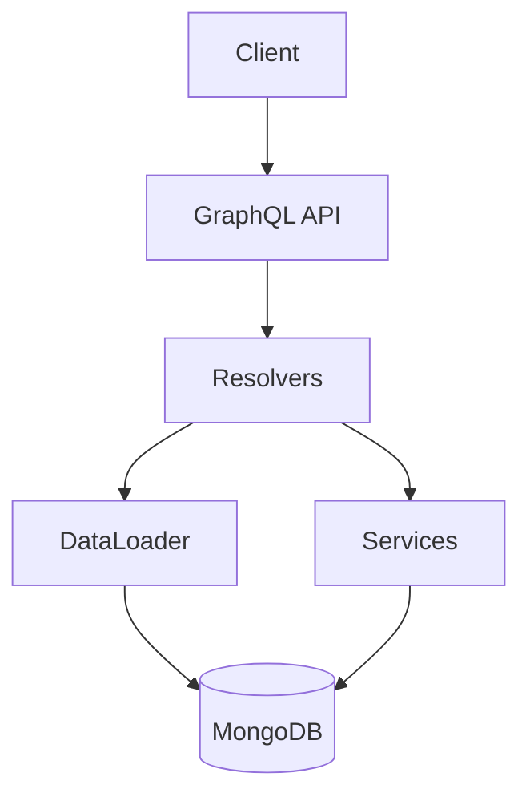

# 01 — Ledger GraphQL

**🇧🇷** Ledger Bancário com GraphQL Relay  
**🇬🇧** Bank Ledger with GraphQL Relay

---

Sabe quando você abre o app do banco e vê seu saldo? Aquela tela parece simples, mas por trás tem um sistema que precisa ser atomicamente consistente. Seu saldo não pode sumir. Uma transferência não pode ser debitada de um lado e não creditada do outro. Isso é ledger.

O desafio tradicional é fazer isso com REST: você busca um recurso, depois outro, o N+1 problem aparece, a paginação é feita na base do `page=1&limit=10` que não funciona quando o banco insere registros no meio. Aí você descobre GraphQL e Relay Connection e percebe que dava pra fazer melhor.

Foi o que fiz aqui. Peguei o problema clássico de ledger bancário — contas, transações, saldos — e implementei com GraphQL no padrão Relay Connection. Com DataLoader pra evitar N+1, transações MongoDB pra atomicidade, e paginação cursor-based.

---

## A arquitetura



```
Schema:
  Queries:    account(id), accounts(first,after), transaction(id), transactions(first,after,accountId)
  Mutations:  createAccount, createTransaction
```

Cada query usa Relay Connection pra paginação. Cada mutation segue o padrão Relay: `Input` → `Payload` → `clientMutationId`.

---

## Resolução em TypeScript

### Schema GraphQL

O schema segue a especificação Relay. Toda entidade implementa `Node`, toda lista retorna `Connection`:

```graphql
interface Node { id: ID! }

type Account implements Node {
  id: ID!        # Relay global ID (base64)
  name: String!
  document: String!
  balance: Float!
}

type Transaction implements Node {
  id: ID!
  sender: Account!
  receiver: Account!
  amount: Float!
  type: TransactionType!
  status: TransactionStatus!
}
```

A Connection segue o padrão cursor-based:

```graphql
type AccountConnection {
  edges: [AccountEdge]
  pageInfo: PageInfo!     # hasNextPage, hasPreviousPage, startCursor, endCursor
  totalCount: Int!
}
```

### DataLoader contra N+1

Sem DataLoader, uma query de 10 transações faria 21 queries no banco (1 pras transações + 2 pra cada conta envolvida). É o N+1 clássico:

```typescript
import DataLoader from 'dataloader';

// Batch loader: agrupa múltiplos findById em uma query só
const accountLoader = new DataLoader(async (ids: string[]) => {
  const accounts = await Account.find({ _id: { $in: ids } });
  const map = new Map(accounts.map(a => [a._id.toString(), a]));
  return ids.map(id => map.get(id) || null);
});

const resolvers = {
  Transaction: {
    sender: (tx) => accountLoader.load(tx.senderAccount.toString()),
    receiver: (tx) => accountLoader.load(tx.receiverAccount.toString()),
  }
};
```

### Transação atômica (MongoDB)

Transferir dinheiro entre contas é a operação mais crítica. Se o servidor cai no meio, não pode perder dinheiro:

```typescript
async function createTransaction(senderId: string, receiverId: string, amount: number) {
  const session = await mongoose.startSession();
  session.startTransaction();

  try {
    const sender = await Account.findById(senderId).session(session);
    const receiver = await Account.findById(receiverId).session(session);

    if (!sender || sender.balance < amount) {
      throw new Error('Saldo insuficiente');
    }

    sender.balance -= amount;
    receiver.balance += amount;

    await sender.save({ session });
    await receiver.save({ session });

    const tx = await Transaction.create([{
      sender: senderId, receiver: receiverId,
      amount, type: 'PIX', status: 'COMPLETED'
    }], { session });

    await session.commitTransaction();
    return tx[0];
  } catch (err) {
    await session.abortTransaction();
    throw err;
  } finally {
    session.endSession();
  }
}
```

Sem `session`, se o servidor cai depois de debitar o sender mas antes de creditar o receiver, o dinheiro desaparece. Com `session`, ou os dois acontecem ou nenhum.

### Paginação cursor-based

```typescript
async function accounts(first: number, after?: string) {
  const query = after
    ? { _id: { $gt: cursorFrom(after) } }
    : {};

  const items = await Account.find(query)
    .limit(first + 1)
    .sort({ _id: 1 });

  const hasNextPage = items.length > first;
  const nodes = hasNextPage ? items.slice(0, first) : items;

  return {
    edges: nodes.map(item => ({
      node: item,
      cursor: cursorTo(item._id),
    })),
    pageInfo: {
      hasNextPage,
      hasPreviousPage: !!after,
      startCursor: cursorTo(nodes[0]?._id),
      endCursor: cursorTo(nodes[nodes.length - 1]?._id),
    },
    totalCount: await Account.countDocuments(),
  };
}
```

A diferença pra `LIMIT/OFFSET` é que cursor não desvia quando novos registros são inseridos no banco. Se aparece uma transação nova no meio da consulta, ela não bagunça a página atual.

---

## Resolução em Go

Go não tem GraphQL nativo. Dá pra usar `gqlgen`, mas pra esse caso — 2 entidades, CRUD simples — eu preferi algo mais direto.

Mas o ponto é: Go não é a melhor ferramenta pra GraphQL. Você perde o ecossistema de schema-first, codegen, e playground. Onde Go brilha aqui é no que fica **fora** do GraphQL — na camada de serviço e automação:

```go
package main

import (
    "context"
    "fmt"
    "go.mongodb.org/mongo-driver/bson"
    "go.mongodb.org/mongo-driver/mongo"
    "go.mongodb.org/mongo-driver/mongo/options"
)

type Account struct {
    ID       string  `bson:"_id,omitempty"`
    Name     string  `bson:"name"`
    Document string  `bson:"document"`
    Balance  float64 `bson:"balance"`
}

type TransactionData struct {
    SenderID   string
    ReceiverID string
    Amount     float64
    Type       string
}

func Transfer(ctx context.Context, db *mongo.Database, data *TransactionData) error {
    session, err := db.Client().StartSession()
    if err != nil { return err }
    defer session.EndSession(ctx)

    _, err = session.WithTransaction(ctx, func(sc mongo.SessionContext) (interface{}, error) {
        senderCol := db.Collection("accounts")
        receiverCol := db.Collection("accounts")
        txCol := db.Collection("transactions")

        // Atomic read-modify-write
        var sender, receiver Account
        senderCol.FindOneAndUpdate(sc,
            bson.M{"_id": data.SenderID, "balance": bson.M{"$gte": data.Amount}},
            bson.M{"$inc": bson.M{"balance": -data.Amount}},
        ).Decode(&sender)

        receiverCol.FindOneAndUpdate(sc,
            bson.M{"_id": data.ReceiverID},
            bson.M{"$inc": bson.M{"balance": data.Amount}},
        ).Decode(&receiver)

        if sender.ID == "" {
            return nil, fmt.Errorf("saldo insuficiente")
        }

        txCol.InsertOne(sc, bson.M{
            "sender":   data.SenderID,
            "receiver": data.ReceiverID,
            "amount":   data.Amount,
            "type":     data.Type,
            "status":   "COMPLETED",
        })

        return nil, nil
    })

    return err
}
```

A diferença: Go com `FindOneAndUpdate` é mais seguro que Mongoose `findById.save()` porque o decremento do saldo é atômico. O banco garante que não vai ter race condition entre duas transferências concorrentes. Em TypeScript, você depende da session do MongoDB. Nos dois casos funciona, mas o Go te força a pensar em atomicidade desde o começo.

---

## Como testar

```bash
# TypeScript
make infra-up
pnpm --filter @banking/ledger dev

# Criar conta
curl -X POST http://localhost:3001/graphql \
  -H "Content-Type: application/json" \
  -d '{"query":"mutation { createAccount(input: {name: \"João\", document: \"12345678900\", balance: 1000}) { account { id name balance } } }"}'

# Transferir
curl -X POST http://localhost:3001/graphql \
  -H "Content-Type: application/json" \
  -d '{"query":"mutation { createTransaction(input: {senderAccount: \"QWNjb3VudDox\", receiverAccount: \"QWNjb3VudDoy\", amount: 100, type: PIX}) { transaction { id amount status } } }"}'

# Listar contas (cursor-based)
curl -s http://localhost:3001/graphql \
  -H "Content-Type: application/json" \
  -d '{"query":"{ accounts(first: 10) { edges { node { id name balance } } pageInfo { hasNextPage endCursor } } }"}'
```

---

## Lições aprendidas

1. **GraphQL não é REST melhorado** — É uma filosofia diferente. Você paga o custo inicial de schema e resolvers em troca de flexibilidade no consumo.
2. **DataLoader deveria vir por padrão** — Sem ele, qualquer query aninhada explode em N+1 queries. Com ele, o batch loading resolve.
3. **Transação ACID em banco NoSQL é possível, mas exige setup** — MongoDB precisa de Replica Set pra transactions funcionarem. Não é automático.
4. **Cursor-based pagination é superior a offset** — Quando novos registros são inseridos durante a navegação, cursor não desvia. Offset sim.
5. **TypeScript vs Go aqui é sobre ecossistema** — GraphQL em TS é muito mais produtivo (codegen, playground, schema-first). Go é melhor na camada de dados (atomicidade, performance). Use cada um onde brilha.
