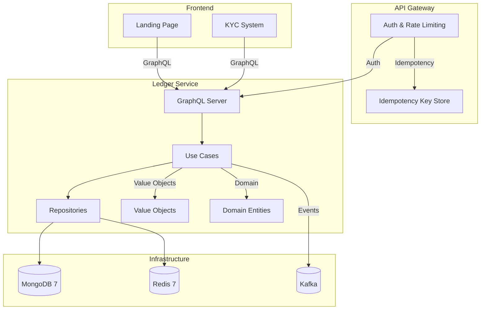
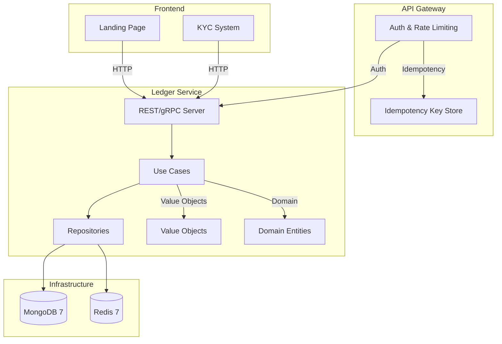
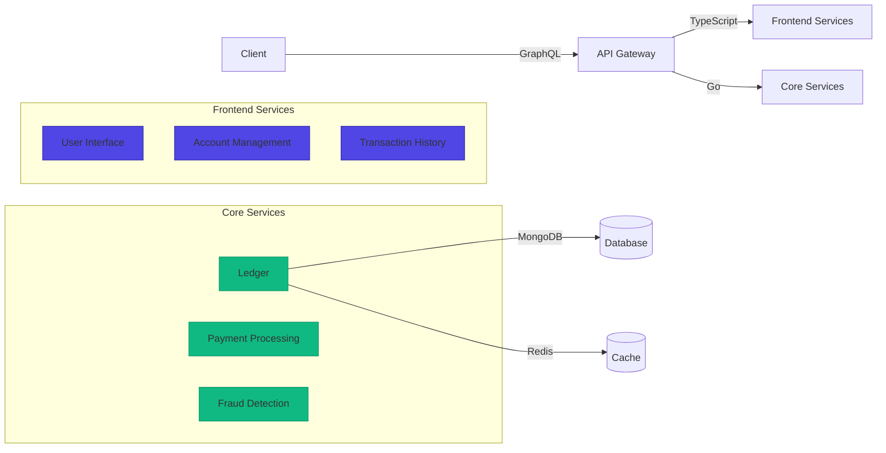

# Desafio 01: Ledger GraphQL — O Coração Contábil de Qualquer Fintech

**🇧🇷** Ledger Bancário com GraphQL Relay  
**🇬🇧** Bank Ledger with GraphQL Relay

---

Sabe quando você abre o app do banco e vê seu saldo? Aquela tela parece simples, mas por trás tem um sistema que precisa ser atomicamente consistente. Uma transferência não pode ser debitada de um lado e não creditada do outro. Isso é ledger.

O desafio com REST: N+1 problem, paginação `page=1&limit=10` que desvia quando o banco insere registros no meio. GraphQL + Relay Connection resolve isso — com DataLoader pra evitar N+1, transações MongoDB pra atomicidade, e paginação cursor-based.

---

## Switch: TypeScript vs Go

<LanguageToggle />

<div class="lang-content ts" style="display:block;">

### Arquitetura do Ledger (TypeScript)



### A Stack

Koa, Mongoose, `graphql-relay`, `dataloader`. Tudo TypeScript, zero frameworks mágicos. Usei Koa ao invés de Express porque o middleware cascata (async/await nativo) casa melhor com GraphQL — você monta contextos compartilhados (DataLoader instances, sessão) no middleware e consome nos resolvers. Cada request ganha seu próprio DataLoader, essencial pra evitar cache sujo entre requisições.

Podia ter usado Apollo Server, mas não usei por dois motivos: primeiro, Apollo abstrai como o GraphQL funciona por baixo. Segundo, eu queria controle fino sobre error handling, CORS, e lifecycle da request. Koa + `koa-graphql` me dá um middleware que recebe schema e devolve GraphQL, sem firulas.

### Schema GraphQL

O schema segue a especificação Relay. Toda entidade implementa `Node`, toda lista retorna `Connection`:

```graphql
interface Node { id: ID! }

type Account implements Node {
  id: ID!        # Relay global ID (base64)
  name: String!
  document: String!
  balance: Float!
}

type Transaction implements Node {
  id: ID!
  sender: Account!
  receiver: Account!
  amount: Float!
  type: TransactionType!
  status: TransactionStatus!
}

type AccountConnection {
  edges: [AccountEdge]
  pageInfo: PageInfo!     # hasNextPage, hasPreviousPage, startCursor, endCursor
  totalCount: Int!
}
```

### Modelo de Dados

```typescript
import mongoose, { Schema, Document } from 'mongoose';

export interface IAccount extends Document {
  _id: mongoose.Types.ObjectId;
  name: string;
  document: string;
  balance: number;
  createdAt: Date;
  updatedAt: Date;
}

const AccountSchema = new Schema<IAccount>(
  {
    name: { type: String, required: true },
    document: { type: String, required: true, unique: true },
    balance: { type: Number, required: true, default: 0, min: 0 },
  },
  { timestamps: true }
);

AccountSchema.pre('save', function (next) {
  if (this.balance < 0) {
    return next(new Error('Account balance cannot be negative'));
  }
  next();
});

export const Account = mongoose.model<IAccount>('Account', AccountSchema);
```

Duas decisões importantes:

1. **`unique: true` no document** — Impede CPF/CNPJ duplicado, validado tanto no índice quanto no service layer.
2. **`pre('save') hook`** — Última barreira contra saldo negativo. É _defense in depth_: você não confia em uma única camada.

Transaction:

```typescript
export type TransactionType = 'PIX' | 'TED' | 'DOC' | 'TRANSFER';
export type TransactionStatus = 'PENDING' | 'COMPLETED' | 'FAILED' | 'REVERTED';

export interface ITransaction extends Document {
  _id: mongoose.Types.ObjectId;
  senderAccount: mongoose.Types.ObjectId;
  receiverAccount: mongoose.Types.ObjectId;
  amount: number;
  description?: string;
  type: TransactionType;
  status: TransactionStatus;
  createdAt: Date;
  completedAt?: Date;
}

const TransactionSchema = new Schema<ITransaction>(
  {
    senderAccount: { type: Schema.Types.ObjectId, ref: 'Account', required: true },
    receiverAccount: { type: Schema.Types.ObjectId, ref: 'Account', required: true },
    amount: { type: Number, required: true, min: 0 },
    description: { type: String, default: '' },
    type: { type: String, enum: ['PIX', 'TED', 'DOC', 'TRANSFER'], required: true },
    status: { type: String, enum: ['PENDING', 'COMPLETED', 'FAILED', 'REVERTED'], default: 'PENDING' },
    completedAt: { type: Date },
  },
  { timestamps: { createdAt: true, updatedAt: false } }
);

export const Transaction = mongoose.model<ITransaction>('Transaction', TransactionSchema);
```

Três decisões de design:

- **`status` com `PENDING` como default** — A transação nasce `PENDING`, só vira `COMPLETED` após confirmação atômica.
- **`completedAt` opcional** — Separa data de criação da de completion. Permite métricas de latency.
- **`amount: { min: 0 }`** — Impede que erro no service crie transação com valor negativo.

### DataLoader contra N+1

Sem DataLoader, uma query de 10 transações faria 21 queries no banco. É o N+1 clássico:

```typescript
import DataLoader from 'dataloader';

export const createAccountLoader = (): DataLoader<string, IAccount | null> => {
  return new DataLoader<string, IAccount | null>(async (ids) => {
    const accounts = await Account.find({ _id: { $in: ids } }).lean();
    const map = new Map<string, IAccount>();
    for (const acc of accounts) {
      map.set(acc._id.toString(), acc as unknown as IAccount);
    }
    return ids.map((id) => map.get(id) ?? null);
  });
};
```

Cada request cria sua própria instância pra evitar cache sujo. O `lean()` faz o Mongoose retornar plain objects — mais performático pra leitura.

### Transação atômica (MongoDB)

```typescript
export const transactionService = {
  async createTransaction(data: {
    senderAccount: string;
    receiverAccount: string;
    amount: number;
    description?: string;
    type: string;
  }): Promise<ITransaction> {
    if (data.amount <= 0) throw new Error('Amount must be positive');
    if (data.senderAccount === data.receiverAccount) {
      throw new Error('Sender and receiver must be different');
    }

    const session = await mongoose.startSession();
    session.startTransaction();

    try {
      const sender = await Account.findById(data.senderAccount).session(session);
      if (!sender) throw new Error('Sender account not found');
      const receiver = await Account.findById(data.receiverAccount).session(session);
      if (!receiver) throw new Error('Receiver account not found');
      if (sender.balance < data.amount) throw new Error('Insufficient funds');

      const [transaction] = await Transaction.create(
        [{
          senderAccount: new Types.ObjectId(data.senderAccount),
          receiverAccount: new Types.ObjectId(data.receiverAccount),
          amount: data.amount,
          description: data.description ?? '',
          type: data.type,
          status: 'COMPLETED' as TransactionStatus,
          completedAt: new Date(),
        }], { session }
      );

      sender.balance -= data.amount;
      receiver.balance += data.amount;
      await sender.save({ session });
      await receiver.save({ session });
      await session.commitTransaction();
      return transaction;
    } catch (error) {
      await session.abortTransaction();
      throw error;
    } finally {
      session.endSession();
    }
  },
```

**Edge case:** Duas transferências concorrentes debitam da mesma conta ao mesmo tempo. O MongoDB lida com isso via lock do Replica Set — uma transação falha no `commitTransaction` com WriteConflict. **Solução:** Retry com idempotency key (UUID do cliente).

### Paginação cursor-based

```typescript
async getAccounts(
  pagination: { first?: number; after?: string; last?: number; before?: string }
) {
  const { first = 10, after, last, before } = pagination;
  let query: Record<string, unknown> = {};
  let sortDir: 1 | -1 = 1;
  let limit = first;

  if (last) { sortDir = -1; limit = last; }
  if (after) {
    const decoded = Buffer.from(after, 'base64').toString('utf-8');
    query = { ...query, _id: { $gt: new Types.ObjectId(decoded) } };
  }
  if (before) {
    const decoded = Buffer.from(before, 'base64').toString('utf-8');
    query = { ...query, _id: { $lt: new Types.ObjectId(decoded) } };
  }

  const totalCount = await Account.countDocuments();
  const accounts = await Account.find(query)
    .sort({ _id: sortDir }).limit(limit + 1).lean();
  const hasMore = accounts.length > limit;
  if (hasMore) accounts.pop();
  if (last) accounts.reverse();

  return { accounts, totalCount, hasNextPage: hasMore, hasPreviousPage: before ? hasMore : false };
}
```

A diferença pra `LIMIT/OFFSET`: cursor não desvia quando novos registros são inseridos.

### Mutations no padrão Relay

```typescript
export const CreateTransactionMutation = mutationWithClientMutationId({
  name: 'CreateTransaction',
  inputFields: {
    senderAccount: { type: new GraphQLNonNull(GraphQLString) },
    receiverAccount: { type: new GraphQLNonNull(GraphQLString) },
    amount: { type: new GraphQLNonNull(GraphQLFloat) },
    description: { type: GraphQLString },
    type: { type: new GraphQLNonNull(GraphQLString) },
  },
  mutateAndGetPayload: async ({ senderAccount, receiverAccount, amount, description, type }) => {
    const { id: senderId } = fromGlobalId(senderAccount);
    const { id: receiverId } = fromGlobalId(receiverAccount);
    const transaction = await transactionService.createTransaction({
      senderAccount: senderId, receiverAccount: receiverId,
      amount, description, type,
    });
    return { transaction };
  },
  outputFields: {
    transaction: { type: new GraphQLNonNull(TransactionType) },
  },
});
```

O `fromGlobalId` decodifica o base64 (`QWNjb3VudDox` → `Account:1`). O cliente nunca precisa saber o ID interno do banco.

### Servidor Koa

```typescript
import Koa from 'koa';
import mongoose from 'mongoose';
import { graphqlHTTP } from 'koa-graphql';
import { schema } from './graphql/schema';
import { config } from './config';

const app = new Koa();

app.use(async (ctx, next) => {
  ctx.set('Access-Control-Allow-Origin', '*');
  ctx.set('Access-Control-Allow-Methods', 'GET, POST, OPTIONS');
  ctx.set('Access-Control-Allow-Headers', 'Content-Type, Authorization');
  if (ctx.method === 'OPTIONS') { ctx.status = 204; return; }
  await next();
});

app.use(async (ctx, next) => {
  try { await next(); }
  catch (err: unknown) {
    const error = err as Error;
    ctx.status = 400;
    ctx.body = { errors: [{ message: error.message || 'Internal server error' }] };
  }
});

app.use(graphqlHTTP({ schema, graphiql: false }));

mongoose.connect(config.mongoUri).then(() => {
  app.listen(config.port, () => {
    console.log(`[ledger] GraphQL endpoint: http://localhost:${config.port}/graphql`);
  });
});
```

### Testes

```typescript
it('should handle concurrent transactions atomically', async () => {
  const promises = Array.from({ length: 5 }, () =>
    transactionService.createTransaction({
      senderAccount: senderId, receiverAccount: receiverId,
      amount: 150, type: 'PIX',
    }).catch(() => null)
  );

  const results = await Promise.all(promises);
  const successful = results.filter(r => r !== null);
  const sender = await accountService.getAccountById(senderId);
  expect(sender!.balance).toBe(1000 - successful.length * 150);
});
```

**O invariante:** independente de quantas transações passem, a soma dos saldos é sempre conservada.

</div>

<div class="lang-content go" style="display:none;">

### Arquitetura do Ledger (Go)



### Domain Layer

```go
package ledger

import (
    "context"
    "fmt"
    "time"
)

type Money struct {
    Amount   int64
    Currency string
}

type Account struct {
    ID      string
    Balance Money
    Status  string
    Created time.Time
}

type Transaction struct {
    ID          string
    Entries     []Entry
    Description string
    Created     time.Time
    Status      string
}

type Entry struct {
    AccountID string
    Amount    Money
    Type      string // "DEBIT" or "CREDIT"
}

func (t *Transaction) IsBalanced() bool {
    total := int64(0)
    for _, e := range t.Entries {
        if e.Type == "CREDIT" {
            total += e.Amount.Amount
        } else {
            total -= e.Amount.Amount
        }
    }
    return total == 0
}

type LedgerService interface {
    CreateTransaction(ctx context.Context, tx *Transaction) error
    GetAccount(ctx context.Context, id string) (*Account, error)
}
```

### Use Cases Layer

```go
type CreateTransactionUseCase struct {
    ledgerRepo   LedgerRepository
    idempotency  IdempotencyStore
}

func (u *CreateTransactionUseCase) Execute(ctx context.Context, tx *Transaction) error {
    if !tx.IsBalanced() {
        return fmt.Errorf("transaction must be balanced")
    }

    if existing, _ := u.idempotency.Get(ctx, tx.ID); existing != nil {
        return fmt.Errorf("duplicate transaction")
    }

    if err := u.ledgerRepo.CreateTransaction(ctx, tx); err != nil {
        return err
    }

    return u.idempotency.Set(ctx, tx.ID, tx)
}
```

### Infrastructure Layer — MongoDB

```go
package infrastructure

import (
    "context"
    "go.mongodb.org/mongo-driver/bson"
    "go.mongodb.org/mongo-driver/mongo"
)

type MongoDBLedgerRepository struct {
    collection *mongo.Collection
}

func (r *MongoDBLedgerRepository) CreateTransaction(ctx context.Context, tx *Transaction) error {
    session, err := r.client.StartSession()
    if err != nil { return err }
    defer session.EndSession(ctx)

    _, err = session.WithTransaction(ctx, func(ctx mongo.SessionContext) (interface{}, error) {
        // Insert transaction
        if _, err := r.collection.InsertOne(ctx, tx); err != nil {
            return nil, err
        }

        // Update balances atomically
        for _, entry := range tx.Entries {
            inc := entry.Amount.Amount
            if entry.Type == "DEBIT" { inc = -inc }

            result := r.collection.FindOneAndUpdate(ctx,
                bson.M{"_id": entry.AccountID, "balance": bson.M{"$gte": 0}},
                bson.M{"$inc": bson.M{"balance": inc}},
            )

            if result.Err() != nil {
                return nil, fmt.Errorf("insufficient funds or account not found")
            }
        }
        return nil, nil
    })

    return err
}
```

### Comparação: Go vs TypeScript para Ledger

| Aspecto | TypeScript | Go |
|---------|-----------|-----|
| **Produtividade GraphQL** | Excelente (codegen, playground) | Baixa (gqlgen verboso) |
| **Atomicidade** | Session do MongoDB | `FindOneAndUpdate` nativo |
| **Concorrência** | Event loop | Goroutines + channels |
| **Tratamento de erro** | try/catch | error returns (explícito) |
| **Performance** | ~2-3x mais lento | Benchmark vence |
| **Deploy** | Precisa de Node runtime | Binário único estático |

### Quando escolher cada uma?

**Escolha TypeScript quando:**
- Você precisa de **prototipagem rápida** (MVP)
- Sua equipe tem **expertise em TypeScript**
- Você quer **integrar com GraphQL/Relay** sem complicação
- Você prioriza **velocidade de desenvolvimento**

**Escolha Go quando:**
- Você precisa de **alta performance** (10k+ TPS)
- Você quer **menor consumo de recursos**
- Você precisa de **concorrência massiva** (milhares de conexões)
- Você prioriza **simplicidade de deploy** (binário único)

### Exemplo Real: Nubank

Nubank usa **Go para processamento de transações** e **TypeScript para frontend**. A razão:

- **Processamento (Go)** — Alta performance, concorrência nativa, GC determinístico
- **Frontend (TS)** — Velocidade de desenvolvimento, ecossistema React/GraphQL



**Conclusão:** No banco real, usam TypeScript pra interface do usuário e Go pro core financeiro. Cada tecnologia onde brilha.

</div>

---

## Como testar

```bash
# TypeScript
make infra-up
pnpm --filter @banking/ledger dev

# Criar conta
curl -X POST http://localhost:3001/graphql \
  -H "Content-Type: application/json" \
  -d '{"query":"mutation { createAccount(input: {name: \"João\", document: \"12345678900\", balance: 1000}) { account { id name balance } } }"}'

# Transferir
curl -X POST http://localhost:3001/graphql \
  -H "Content-Type: application/json" \
  -d '{"query":"mutation { createTransaction(input: {senderAccount: \"QWNjb3VudDox\", receiverAccount: \"QWNjb3VudDoy\", amount: 100, type: PIX}) { transaction { id amount status } } }"}'

# Listar contas (cursor-based)
curl -s http://localhost:3001/graphql \
  -H "Content-Type: application/json" \
  -d '{"query":"{ accounts(first: 10) { edges { node { id name balance } } pageInfo { hasNextPage endCursor } } }"}'
```

```bash
# Testes
docker run -d --name ledger-mongo-test -p 27017:27017 mongo:7 --replSet rs0
docker exec ledger-mongo-test mongosh --eval "rs.initiate()"
pnpm --filter @banking/ledger test
```

---

## Troubleshooting

### 1. WriteConflict no commit

**Causa:** Duas transações concorrentes modificaram o mesmo documento. **Solução:** Retry com exponential backoff:

```typescript
async function createTransactionWithRetry(data: TransactionData, maxRetries = 3) {
  for (let attempt = 1; attempt <= maxRetries; attempt++) {
    try {
      return await createTransaction(data);
    } catch (err: unknown) {
      const error = err as Error;
      if (error.message.includes('WriteConflict') && attempt < maxRetries) {
        await new Promise(r => setTimeout(r, Math.pow(2, attempt) * 50));
        continue;
      }
      throw err;
    }
  }
  throw new Error('Max retries reached');
}
```

### 2. Saldo negativo mesmo com validação

**Causa:** Race condition entre leitura e escrita. **Solução:** Optimistic locking:

```typescript
const result = await Account.findOneAndUpdate(
  { _id: id, version: currentVersion },
  { $inc: { balance: -amount, version: 1 } },
  { new: true }
);
if (!result) throw new Error('Optimistic lock failed, retry');
```

### 3. Resolver retornou null para campo que existe

**Causa:** `lean()` stripou o populated field. **Solução:**

```typescript
resolve: async (parent) => {
  const senderId = parent.senderAccount?.toString?.() ?? parent.senderAccount;
  return accountService.getAccountById(senderId);
},
```

---

## Lições aprendidas

1. **GraphQL não é REST melhorado** — Você paga o custo inicial de schema e resolvers em troca de flexibilidade no consumo.
2. **DataLoader deveria vir por padrão** — Sem ele, qualquer query aninhada explode em N+1. Um DataLoader por request, nunca global.
3. **Transação ACID em NoSQL exige setup** — MongoDB precisa de Replica Set pra transactions.
4. **Cursor-based > offset** — Cursor não desvia quando novos registros são inseridos.
5. **TypeScript pra GraphQL, Go pra dados** — Cada um onde brilha.
6. **Defense in depth pra saldo negativo** — Regra no schema (min:0), hook no Mongoose, checagem no service.
7. **WriteConflict não é erro, é evento esperado** — Projete retry desde o início.
8. **Global IDs desacoplam cliente do banco** — Migrou de MongoDB pra PostgreSQL? O cliente nem percebe.
9. **Teste concorrência com Promise.all** — `await` em série não testa race condition.
10. **Idempotency key é dívida técnica clássica** — Sem ela, retry do cliente = transação duplicada.

---

## O que vem depois

- **Idempotency keys** — Evitar duplicação em retry
- **Estorno (reversal)** — Transação REVERTED que desfaz atomicamente uma anterior
- **Fila de processamento** — TED leva horas, precisa de async com status tracking
- **Histórico de saldo** — Saldo em qualquer data (slowly changing dimension)
- **Audit log WORM** — Cada operação imutável (Write Once Read Many)
