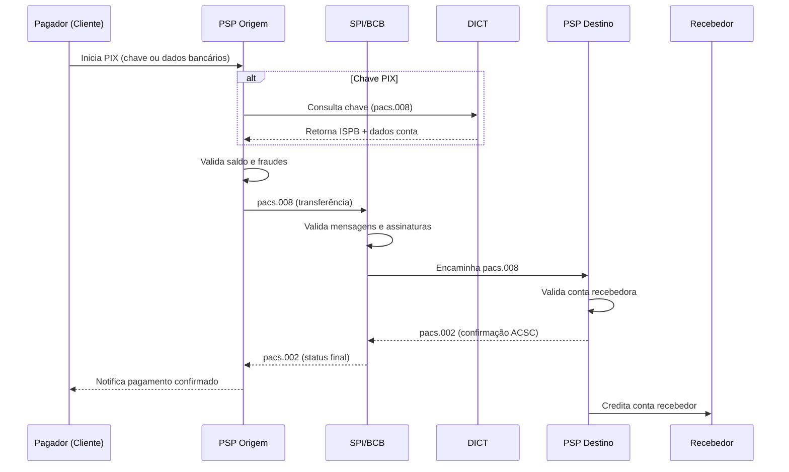
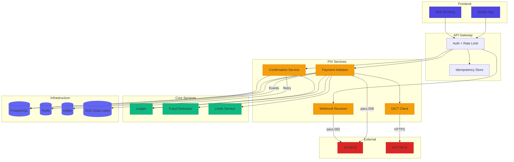
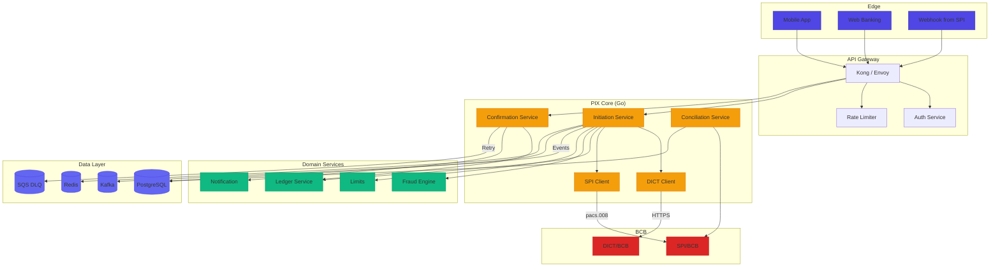
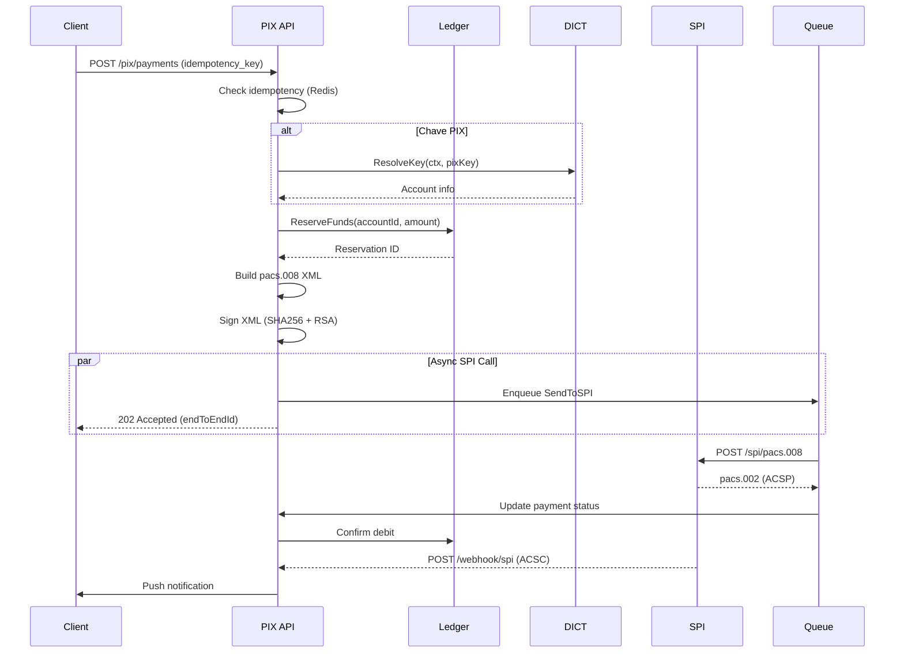
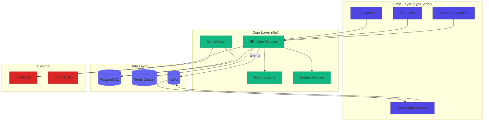

# Desafio 02: SPI — Pagamentos Instantâneos (PIX) no Coração do Brasil

**🇧🇷** Simulador do Sistema de Pagamentos Instantâneos  
**🇬🇧** Instant Payment System Simulator

---

O **Sistema de Pagamentos Instantâneos (SPI)** é a infraestrutura do Banco Central do Brasil que viabiliza o **PIX**. Ele permite transferências em tempo real, 24/7, entre qualquer instituição participante, em menos de 10 segundos.

## Switch: TypeScript vs Go

<LanguageToggle />

<div class="lang-content ts" style="display:block;">

### O que é SPI?

| Componente | Descrição |
|------------|-----------|
| **SPI/BCB** | Central que orquestra as transferências |
| **ISPB** | Identificador único de cada instituição (8 dígitos) |
| **DICT** | Diretório de chaves PIX (CPF, e-mail, telefone, aleatória) |
| **ISO 20022** | Padrão de mensagens financeiras utilizado |
| **Conta PI** | Conta de Pagamentos Instantâneos no BCB |

| Característica | Valor |
|----------------|-------|
| **Latência** | Menos de 10 segundos end-to-end |
| **Disponibilidade** | 24/7, 365 dias por ano |
| **SLA** | 99,99% de disponibilidade |
| **Liquidação** | Bruta em tempo real (RTGS) |

### Fluxo Completo do PIX



### Arquitetura de um PSP Integrado ao SPI



### Mensagens ISO 20022 no SPI

| Mensagem | Direção | Propósito |
|----------|---------|-----------|
| **pacs.008** | PSP → SPI | Instrução de pagamento |
| **pacs.002** | SPI → PSP | Confirmação de status |
| **pacs.008** | PSP → SPI | Devolução de pagamento |
| **camt.053** | SPI → PSP | Extrato da Conta PI |

| Código | Significado |
|--------|-------------|
| **ACSP** | Aceito para compensação |
| **ACSC** | Aceito e compensado (confirmado!) |
| **RJCR** | Rejeitado por falta de fundos |
| **RJVA** | Rejeitado por valor inválido |
| **RJCT** | Rejeitado (genérico) |

### Domain Layer

```typescript
export enum PixPaymentStatus {
  PENDING = 'PENDING',
  SENT_TO_SPI = 'SENT_TO_SPI',
  CONFIRMED = 'CONFIRMED',
  REJECTED = 'REJECTED',
  REFUNDED = 'REFUNDED',
  FAILED = 'FAILED'
}

export interface PixPaymentProps {
  idempotencyKey: string;
  debtorAccount: {
    ispb: string;
    branch: string;
    accountNumber: string;
    accountType: 'CACC' | 'SVGS' | 'TRAN';
  };
  creditorAccount: {
    ispb: string;
    branch: string;
    accountNumber: string;
    accountType: 'CACC' | 'SVGS' | 'TRAN';
  };
  amount: Money;
  endToEndId: string;
  description?: string;
  status: PixPaymentStatus;
  spiTransactionId?: string;
  createdAt: Date;
  confirmedAt?: Date;
}

export class PixPayment extends Entity<string> {
  public static create(props: PixPaymentProps): PixPayment {
    return new PixPayment(props);
  }

  public confirm(spiTransactionId: string): void {
    this.props.status = PixPaymentStatus.CONFIRMED;
    this.props.spiTransactionId = spiTransactionId;
    this.props.confirmedAt = new Date();
  }

  public reject(reasonCode: string): void {
    this.props.status = PixPaymentStatus.REJECTED;
  }
}
```

### SPI Client

```typescript
import { XMLBuilder, XMLParser } from 'fast-xml-parser';

export class SPIClient {
  private readonly xmlBuilder: XMLBuilder;
  private readonly xmlParser: XMLParser;

  constructor(config: SPIConfig) {
    this.xmlBuilder = new XMLBuilder({
      attributeNamePrefix: '@_',
      ignoreAttributes: false,
      format: true
    });
    this.xmlParser = new XMLParser({
      ignoreAttributes: false,
      attributeNamePrefix: '@_'
    });
  }

  public async sendPacs008(payment: PixPayment): Promise<Pacs002Response> {
    const pacs008Xml = this.buildPacs008(payment);
    const signedXml = this.signXml(pacs008Xml);

    const response = await fetch(`${this.baseUrl}/pix/spi/pacs.008`, {
      method: 'POST',
      headers: {
        'Content-Type': 'application/xml',
        'X-Ispb': this.ispb,
        'X-Signature': this.getSignatureHeader(signedXml)
      },
      body: signedXml
    });

    const responseBody = await response.text();
    return this.mapPacs002Response(this.xmlParser.parse(responseBody));
  }

  private buildPacs008(payment: PixPayment): string {
    return this.xmlBuilder.build({
      'Document': {
        '@_xmlns': 'urn:iso:std:iso:20022:tech:xsd:pacs.008.001.08',
        'FIToFICustomerCreditTransfer': {
          'GrpHdr': {
            'MsgId': `MSG${Date.now()}`,
            'CreDtTm': new Date().toISOString(),
            'NbOfTxs': '1',
            'SttlmMtd': 'CLRG'
          },
          'CdtTrfTxInf': {
            'PmtId': {
              'EndToEndId': payment.props.endToEndId,
              'InstrId': payment.props.idempotencyKey
            },
            'IntrBkSttlmAmt': {
              '@_Ccy': 'BRL',
              '#text': payment.props.amount.toDecimal().toString()
            },
            'DbtrAgt': { 'FinInstnId': { 'ClrSysMmbId': { 'MmbId': payment.props.debtorAccount.ispb } } },
            'CdtrAgt': { 'FinInstnId': { 'ClrSysMmbId': { 'MmbId': payment.props.creditorAccount.ispb } } },
            'CdtrAcct': { 'Id': { 'Othr': { 'Id': payment.props.creditorAccount.accountNumber } } }
          }
        }
      }
    });
  }
}
```

### Use Case — Iniciar Pagamento PIX

```typescript
export class InitiatePixPaymentUseCase {
  constructor(
    private readonly pixPaymentRepo: PixPaymentRepository,
    private readonly dictClient: DICTClient,
    private readonly spiClient: SPIClient,
    private readonly ledgerService: LedgerService,
    private readonly fraudService: FraudDetectionService,
    private readonly eventPublisher: EventPublisher
  ) {}

  public async execute(input: InitiatePixPaymentInput): Promise<Either<DomainError, PixPayment>> {
    // 1. Verifica idempotência
    const existing = await this.pixPaymentRepo.findByIdempotencyKey(input.idempotencyKey);
    if (existing) return right(existing);

    // 2. Resolve dados do recebedor via DICT
    let creditorAccount;
    if (input.pixKey) {
      const dictResult = await this.dictClient.resolveKey(input.pixKey);
      if (dictResult.isLeft()) return left(new PixKeyNotFoundError(input.pixKey));
      creditorAccount = dictResult.value;
    }

    // 3. Valida saldo
    const debtorAccount = await this.ledgerService.getAccount(input.debtorAccountId);
    if (debtorAccount.balance < input.amount) return left(new InsufficientFundsError());

    // 4. Detecção de fraude
    const fraudCheck = await this.fraudService.check({
      debtorAccountId: input.debtorAccountId,
      amount: input.amount,
      creditorIspb: creditorAccount.ispb
    });
    if (fraudCheck.isHighRisk) return left(new FraudDetectedError());

    // 5. Reserva fundos no ledger
    await this.ledgerService.reserveFunds({
      accountId: input.debtorAccountId,
      amount: input.amount
    });

    // 6. Envia para SPI
    const payment = PixPayment.create({ ... });
    const spiResponse = await this.spiClient.sendPacs008(payment);

    if (spiResponse.status === 'ACSC') {
      payment.confirm(spiResponse.transactionId);
    } else {
      payment.reject(spiResponse.reasonCode);
      await this.ledgerService.releaseReservation(payment.id);
    }

    return right(payment);
  }
}
```

### Webhook Receiver

```typescript
export class ReceiveSPIConfirmationUseCase {
  public async execute(pacs002: Pacs002Message): Promise<Either<Error, void>> {
    const payment = await this.pixPaymentRepo.findByEndToEndId(pacs002.endToEndId);
    if (!payment) return left(new PaymentNotFoundError(pacs002.endToEndId));

    switch (pacs002.status) {
      case 'ACSC':
        await this.ledgerService.confirmDebit(payment.props.debtorAccount.accountNumber, payment.id);
        payment.confirm(pacs002.transactionId);
        await this.eventPublisher.publish('pix.payment.confirmed', { paymentId: payment.id });
        return right(undefined);

      case 'RJCR':
      case 'RJVA':
      case 'RJCT':
        await this.ledgerService.releaseReservation(payment.id);
        payment.reject(pacs002.reasonCode);
        await this.eventPublisher.publish('pix.payment.rejected', { paymentId: payment.id, reason: pacs002.reasonCode });
        return right(undefined);
    }
  }
}
```

### Conciliação Diária

```typescript
export class DailyConciliationJob {
  public async execute(date: Date): Promise<ConciliationResult> {
    // 1. Baixa extrato da conta PI no BCB (camt.053)
    const statement = await this.spiStatementClient.getStatement(date);

    // 2. Busca pagamentos locais do dia
    const localPayments = await this.pixPaymentRepo.findByDate(date);
    const localByEndToEnd = new Map(localPayments.map(p => [p.endToEndId, p]));

    const discrepancies: Discrepancy[] = [];

    // 3. Valida cada entrada do extrato
    for (const entry of statement.entries) {
      const local = localByEndToEnd.get(entry.endToEndId);
      if (!local) {
        discrepancies.push({ type: 'MISSING_LOCALLY', endToEndId: entry.endToEndId, severity: 'HIGH' });
      } else if (entry.status === 'ACSC' && !local.isConfirmed()) {
        discrepancies.push({ type: 'STATUS_MISMATCH', endToEndId: entry.endToEndId, severity: 'MEDIUM' });
      }
    }

    return { date, discrepancies, status: discrepancies.length === 0 ? 'OK' : 'WITH_ISSUES' };
  }
}
```

### Comparação: TypeScript vs Go para SPI

| Aspecto | TypeScript | Go |
|---------|-----------|-----|
| **Velocidade de desenvolvimento** | Rápido, XML/JSON libs prontas | Mais verboso, mas compila rápido |
| **Performance** | ~10-50ms latência | ~1-5ms latência |
| **XML Processing** | fast-xml-parser (rápido) | encoding/xml nativo (eficiente) |
| **Criptografia** | node-forge, xml-crypto | stdlib crypto (assembly otimizado) |
| **Concorrência** | Event loop (single-thread) | Goroutines (M:N scheduler) |
| **Deploy** | Precisa Node runtime | Binário único |
| **Ecossistema ISO 20022** | Bibliotecas prontas | Precisa implementar |

### Quando escolher TypeScript?

- **MVP e validação** — Fintech em fase inicial
- **Baixo volume** — Até 1.000 PIX/s
- **Equipe TypeScript** — Curva de aprendizado menor
- **Integrações múltiplas** — Múltiplos provedores

### Caso Real: Nubank

O Nubank processa bilhões de PIX por mês com abordagem híbrida:

- **Clojure + Go** — Processamento de transações, assinatura, conciliação
- **TypeScript + Node.js** — APIs mobile (BFF), webhooks, notificações

</div>

<div class="lang-content go" style="display:none;">

### Arquitetura SPI em Go



### Fluxo de Iniciação de PIX



### Domain Layer

```go
package domain

import (
    "context"
    "time"
    "github.com/google/uuid"
)

type PixPaymentStatus string

const (
    StatusPending   PixPaymentStatus = "PENDING"
    StatusSentToSPI PixPaymentStatus = "SENT_TO_SPI"
    StatusConfirmed PixPaymentStatus = "CONFIRMED"
    StatusRejected  PixPaymentStatus = "REJECTED"
    StatusFailed    PixPaymentStatus = "FAILED"
)

type Money struct {
    Amount   int64  // centavos
    Currency string // "BRL"
}

func NewMoney(amount int64) Money {
    return Money{Amount: amount, Currency: "BRL"}
}

type AccountInfo struct {
    ISPB          string
    Branch        string
    AccountNumber string
    AccountType   string
    OwnerName     string
    OwnerTaxID    string
}

type PixPayment struct {
    ID               uuid.UUID
    IdempotencyKey   string
    EndToEndID       string
    DebtorAccount    AccountInfo
    CreditorAccount  AccountInfo
    Amount           Money
    Description      string
    Status           PixPaymentStatus
    SPITransactionID string
    CreatedAt        time.Time
    ConfirmedAt      *time.Time
    RejectionReason  string
}

func NewPixPayment(
    idempotencyKey string,
    debtor, creditor AccountInfo,
    amount Money,
    description string,
) (*PixPayment, error) {
    if amount.Amount <= 0 {
        return nil, ErrInvalidAmount
    }
    return &PixPayment{
        ID:              uuid.New(),
        IdempotencyKey:  idempotencyKey,
        EndToEndID:      generateEndToEndID(creditor.ISPB),
        DebtorAccount:   debtor,
        CreditorAccount: creditor,
        Amount:          amount,
        Description:     description,
        Status:          StatusPending,
        CreatedAt:       time.Now(),
    }, nil
}

func (p *PixPayment) Confirm(spiTransactionID string) {
    p.Status = StatusConfirmed
    p.SPITransactionID = spiTransactionID
    now := time.Now()
    p.ConfirmedAt = &now
}

func (p *PixPayment) Reject(reason string) {
    p.Status = StatusRejected
    p.RejectionReason = reason
}

type PixPaymentRepository interface {
    Save(ctx context.Context, payment *PixPayment) error
    FindByID(ctx context.Context, id uuid.UUID) (*PixPayment, error)
    FindByEndToEndID(ctx context.Context, endToEndID string) (*PixPayment, error)
    FindByIdempotencyKey(ctx context.Context, key string) (*PixPayment, error)
    Update(ctx context.Context, payment *PixPayment) error
}
```

### SPI Client — Comunicação com o BCB

```go
package spi

import (
    "bytes"
    "context"
    "crypto"
    "crypto/rand"
    "crypto/rsa"
    "crypto/sha256"
    "crypto/tls"
    "crypto/x509"
    "encoding/pem"
    "encoding/xml"
    "fmt"
    "io"
    "net/http"
    "os"
    "time"
)

type Client struct {
    baseURL    string
    httpClient *http.Client
    privateKey *rsa.PrivateKey
    cert       *x509.Certificate
    ispb       string
}

func NewClient(cfg ClientConfig) (*Client, error) {
    certPEM, _ := os.ReadFile(cfg.CertPath)
    keyPEM, _ := os.ReadFile(cfg.PrivateKeyPath)

    cert, err := tls.X509KeyPair(certPEM, keyPEM)
    if err != nil {
        return nil, fmt.Errorf("failed to parse key pair: %w", err)
    }

    keyBlock, _ := pem.Decode(keyPEM)
    privateKey, _ := x509.ParsePKCS1PrivateKey(keyBlock.Bytes)

    certBlock, _ := pem.Decode(certPEM)
    x509Cert, _ := x509.ParseCertificate(certBlock.Bytes)

    tlsConfig := &tls.Config{
        Certificates: []tls.Certificate{cert},
        MinVersion:   tls.VersionTLS12,
    }

    httpClient := &http.Client{
        Transport: &http.Transport{TLSClientConfig: tlsConfig},
        Timeout:   cfg.Timeout,
    }

    return &Client{
        baseURL:    cfg.BaseURL,
        httpClient: httpClient,
        privateKey: privateKey,
        cert:       x509Cert,
        ispb:       cfg.ISPB,
    }, nil
}

func (c *Client) SendPacs008(ctx context.Context, payment *domain.PixPayment) (*Pacs002Response, error) {
    pacs008, err := c.buildPacs008(payment)
    if err != nil {
        return nil, fmt.Errorf("failed to build pacs.008: %w", err)
    }

    signedXML, err := c.signXML(pacs008)
    if err != nil {
        return nil, fmt.Errorf("failed to sign XML: %w", err)
    }

    req, _ := http.NewRequestWithContext(ctx, "POST", c.baseURL+"/pix/spi/pacs.008", bytes.NewReader(signedXML))
    req.Header.Set("Content-Type", "application/xml")
    req.Header.Set("X-ISPB", c.ispb)

    resp, err := c.httpClient.Do(req)
    if err != nil {
        return nil, fmt.Errorf("SPI request failed: %w", err)
    }
    defer resp.Body.Close()

    body, _ := io.ReadAll(resp.Body)

    var pacs002 Pacs002Response
    if err := xml.Unmarshal(body, &pacs002); err != nil {
        return nil, fmt.Errorf("failed to parse pacs.002: %w", err)
    }

    return &pacs002, nil
}

func (c *Client) signXML(xmlContent []byte) ([]byte, error) {
    hash := sha256.Sum256(xmlContent)
    signature, err := rsa.SignPKCS1v15(rand.Reader, c.privateKey, crypto.SHA256, hash[:])
    if err != nil {
        return nil, fmt.Errorf("failed to sign: %w", err)
    }
    return appendXMLSignature(xmlContent, signature, c.cert), nil
}

type Pacs002Response struct {
    XMLName         xml.Name `xml:"Document"`
    EndToEndID      string   `xml:"FIToFIPaymentStatusReport>TxInfAndSts>OrgnlEndToEndId"`
    Status          string   `xml:"FIToFIPaymentStatusReport>TxInfAndSts>TxSts"`
    TransactionID   string   `xml:"FIToFIPaymentStatusReport>TxInfAndSts>ClrSysRef"`
    RejectionReason string   `xml:"FIToFIPaymentStatusReport>TxInfAndSts>StsRsnInf>Rsn>Cd"`
}
```

### Use Case — Iniciar Pagamento PIX

```go
package usecase

import (
    "context"
    "fmt"
    "time"

    "github.com/google/uuid"
    "go.uber.org/zap"
)

type InitiatePixInput struct {
    IdempotencyKey  string
    DebtorAccountID uuid.UUID
    PixKey          *string
    CreditorISPB    *string
    CreditorBranch  *string
    CreditorAccount *string
    AmountCents     int64
    Description     string
}

type InitiatePixUseCase struct {
    paymentRepo domain.PixPaymentRepository
    dictClient  dict.Client
    spiClient   spi.Client
    ledgerSvc   ledger.Service
    fraudSvc    fraud.Service
    eventPub    event.Publisher
    logger      *zap.Logger
}

func (uc *InitiatePixUseCase) Execute(ctx context.Context, input InitiatePixInput) (*InitiatePixOutput, error) {
    // 1. Idempotência
    existing, err := uc.paymentRepo.FindByIdempotencyKey(ctx, input.IdempotencyKey)
    if err == nil && existing != nil {
        return uc.toOutput(existing), nil
    }

    // 2. Resolve credor
    var creditor domain.AccountInfo
    if input.PixKey != nil {
        creditorInfo, err := uc.dictClient.ResolveKey(ctx, *input.PixKey)
        if err != nil {
            return nil, fmt.Errorf("failed to resolve PIX key: %w", err)
        }
        creditor = creditorInfo.ToDomain()
    }

    // 3. Valida saldo
    debtorAccount, err := uc.ledgerSvc.GetAccount(ctx, input.DebtorAccountID)
    if err != nil {
        return nil, fmt.Errorf("failed to get debtor account: %w", err)
    }
    if debtorAccount.Balance < input.AmountCents {
        return nil, ErrInsufficientFunds
    }

    // 4. Fraud check com timeout
    fraudCtx, cancel := context.WithTimeout(ctx, 500*time.Millisecond)
    defer cancel()

    fraudResult, err := uc.fraudSvc.Check(fraudCtx, fraud.CheckInput{
        DebtorAccountID: input.DebtorAccountID,
        AmountCents:     input.AmountCents,
        CreditorISPB:    creditor.ISPB,
    })
    if err != nil {
        uc.logger.Warn("Fraud check failed, continuing", zap.Error(err))
    } else if fraudResult.IsHighRisk {
        return nil, ErrFraudDetected
    }

    // 5. Cria pagamento
    payment, err := domain.NewPixPayment(
        input.IdempotencyKey,
        debtorAccount.ToAccountInfo(),
        creditor,
        domain.NewMoney(input.AmountCents),
        input.Description,
    )
    if err != nil {
        return nil, fmt.Errorf("failed to create payment: %w", err)
    }

    // 6. Reserva fundos
    reservationID, err := uc.ledgerSvc.ReserveFunds(ctx, ledger.ReserveInput{
        AccountID:     input.DebtorAccountID,
        AmountCents:   input.AmountCents,
        ReservationID: payment.ID,
    })
    if err != nil {
        return nil, fmt.Errorf("failed to reserve funds: %w", err)
    }

    // 7. Persiste
    if err := uc.paymentRepo.Save(ctx, payment); err != nil {
        uc.ledgerSvc.ReleaseReservation(ctx, reservationID)
        return nil, fmt.Errorf("failed to save payment: %w", err)
    }

    // 8. Envia ao SPI (async)
    go func() {
        spiCtx, cancel := context.WithTimeout(context.Background(), 5*time.Second)
        defer cancel()

        spiResp, err := uc.spiClient.SendPacs008(spiCtx, payment)
        if err != nil {
            uc.logger.Error("Failed to send to SPI", zap.String("payment_id", payment.ID.String()), zap.Error(err))
            uc.ledgerSvc.ReleaseReservation(context.Background(), reservationID)
            payment.Status = domain.StatusFailed
            uc.paymentRepo.Update(context.Background(), payment)
            return
        }

        switch spiResp.Status {
        case "ACSP", "ACSC":
            payment.Status = domain.StatusSentToSPI
            payment.SPITransactionID = spiResp.TransactionID
        default:
            payment.Reject(spiResp.RejectionReason)
            uc.ledgerSvc.ReleaseReservation(context.Background(), reservationID)
        }
        uc.paymentRepo.Update(context.Background(), payment)
    }()

    return uc.toOutput(payment), nil
}
```

### Webhook Handler

```go
package http

import (
    "encoding/xml"
    "io"
    "net/http"
    "go.uber.org/zap"
)

type WebhookHandler struct {
    usecase *usecase.ReceiveSPIConfirmationUseCase
    logger  *zap.Logger
}

func (h *WebhookHandler) HandleSPIWebhook(w http.ResponseWriter, r *http.Request) {
    body, err := io.ReadAll(r.Body)
    if err != nil {
        http.Error(w, "failed to read body", http.StatusBadRequest)
        return
    }
    defer r.Body.Close()

    if err := validateSignature(body, r.Header.Get("X-Signature")); err != nil {
        h.logger.Warn("Invalid webhook signature", zap.Error(err))
        http.Error(w, "invalid signature", http.StatusUnauthorized)
        return
    }

    var pacs002 domain.Pacs002Message
    if err := xml.Unmarshal(body, &pacs002); err != nil {
        http.Error(w, "invalid xml", http.StatusBadRequest)
        return
    }

    if err := h.usecase.Execute(r.Context(), pacs002); err != nil {
        h.logger.Error("Failed to process webhook", zap.Error(err))
        http.Error(w, "internal error", http.StatusInternalServerError)
        return
    }

    w.WriteHeader(http.StatusOK)
    w.Write([]byte(`{"status":"received"}`))
}
```

### Conciliação Diária

```go
package jobs

import (
    "context"
    "sync"
    "time"
    "go.uber.org/zap"
)

type DailyConciliationJob struct {
    spiStatementClient spi.StatementClient
    paymentRepo        domain.PixPaymentRepository
    reconciliationRepo domain.ReconciliationRepository
    notificationSvc    notification.Service
    logger             *zap.Logger
}

func (j *DailyConciliationJob) Execute(ctx context.Context, date time.Time) (*ConciliationResult, error) {
    statement, err := j.spiStatementClient.GetStatement(ctx, date)
    if err != nil {
        return nil, fmt.Errorf("failed to get statement: %w", err)
    }

    localPayments, err := j.paymentRepo.FindByDateRange(ctx, date, date.Add(24*time.Hour))
    if err != nil {
        return nil, fmt.Errorf("failed to get local payments: %w", err)
    }

    localByEndToEnd := make(map[string]*domain.PixPayment, len(localPayments))
    for _, p := range localPayments {
        localByEndToEnd[p.EndToEndID] = p
    }

    var discrepancies []Discrepancy
    var mu sync.Mutex
    var wg sync.WaitGroup
    sem := make(chan struct{}, 100)

    for _, entry := range statement.Entries {
        wg.Add(1)
        go func(entry spi.StatementEntry) {
            defer wg.Done()
            sem <- struct{}{}
            defer func() { <-sem }()

            local, exists := localByEndToEnd[entry.EndToEndID]
            if !exists {
                mu.Lock()
                discrepancies = append(discrepancies, Discrepancy{
                    Type: "MISSING_LOCALLY", Severity: "HIGH",
                    EndToEndID: entry.EndToEndID, BCBAmmount: entry.AmountCents,
                })
                mu.Unlock()
                return
            }

            if entry.Status == "ACSC" && !local.IsConfirmed() {
                mu.Lock()
                discrepancies = append(discrepancies, Discrepancy{
                    Type: "STATUS_MISMATCH", Severity: "MEDIUM",
                    EndToEndID: entry.EndToEndID,
                })
                mu.Unlock()
            }
        }(entry)
    }
    wg.Wait()

    result := &ConciliationResult{
        Date:           date,
        TotalProcessed: len(statement.Entries),
        TotalLocal:     len(localPayments),
        Discrepancies:  discrepancies,
        Status:         "OK",
    }
    if len(discrepancies) > 0 {
        result.Status = "WITH_ISSUES"
    }

    return result, nil
}
```

### Performance: Go vs TypeScript

| Aspecto | TypeScript | Go |
|---------|-----------|-----|
| **Latência P99** | 10-50ms | 1-5ms |
| **Throughput** | ~2K PIX/s | ~50K PIX/s |
| **Memória** | ~50MB | ~10MB |
| **GC pauses** | ~100ms (imprevisível) | ~1ms (previsível) |
| **Startup** | ~2s | ~50ms |
| **Deploy** | npm install + node | scp binário |

### Caso Real: Itaú Unibanco

O Itaú processa mais de **50 milhões de PIX por dia**:

- **Go** — Processamento massivo (picos de 150K TPS), assinatura digital, conciliação
- **Java** — Core banking legado, compliance, reporting regulatório

### Arquitetura Híbrida Recomendada



**Regra de ouro:** Use **Go para o caminho crítico do dinheiro** (SPI, ledger, fraud detection) e **TypeScript para o caminho da experiência** (BFF, webhooks, notificações).

### Decisão Final

| Cenário | Escolha |
|---------|---------|
| Startup em validação | TypeScript em tudo |
| Fintech em crescimento | TS no edge, Go no core |
| Banco consolidado | Go para SPI crítico |
| Multi-país | Go para SPI-like (PIX, SPEI, UPI) |

</div>

---

## Como testar

```bash
# TypeScript
make infra-up
pnpm --filter @banking/spi dev

# Enviar pacs.008
curl -X POST http://localhost:3002/spi/pacs.008 \
  -H "Content-Type: application/xml" \
  -d @testdata/pacs008-example.xml

# Ver transações
curl http://localhost:3002/spi/transactions

# Go
cd packages/backend/spi-simulator-go
go run .

# Mesmos endpoints na porta 3002
```

---

## Troubleshooting

### 1. Namespace XML errado

O erro mais comum. O `encoding/xml` do Go retorna struct zerada sem erro:

```go
// ERRADO: namespace antigo
<Document xmlns="urn:iso:std:iso:20022:tech:xsd:pacs.008.001.07">

// CORRETO
<Document xmlns="urn:iso:std:iso:20022:tech:xsd:pacs.008.001.08">
```

### 2. Race condition em teste de carga

```bash
go run -race .  # ESSENCIAL — detecta acessos concorrentes sem sync
```

### 3. Float impreciso

```typescript
// ERRADO: 0.1 + 0.2 = 0.30000000000000004
const amount = 15_738_294.12

// CORRETO: tudo em centavos (int64)
type MonetaryAmount struct {
    Value    int64  // centavos
    Currency string // ISO 4217
}
```

---

## Lições aprendidas

1. **XML é chato, mas necessário** — O mundo financeiro roda em XML desde os anos 90
2. **ISO 20022 é o futuro** — Pix já usa, Europa migrou com SEPA
3. **Go não é bala de prata** — Use onde faz sentido, e pra SPI faz muito
4. **Performance importa** — Mas não a qualquer custo. Conheça seu SLA
5. **Garbage collector é risco financeiro** — Pausas de 100ms = transação perdida
6. **Prefira int64 para dinheiro** — Float point = R$ 100 mil de divergência em 10M transações
7. **Idempotência é a base** — EndToEndId único global, sem exceção
8. **Observabilidade não é opcional** — Monitore latência P99, taxa de rejeição, conciliação
9. **Deploy simplificado** — Go: `scp binário` + executar. Sem npm install.
10. **Context é onipresente** — Cada request carrega timeout, tracing, valores

---

## O que vem depois

- **S2 Simulator** — Sistema de Transferência de Reservas
- **LBTR** — Liquidação bruta em tempo real
- **Mensagens negativas** — pacs.004 (devolução), camt.056 (cancelamento)
- **Zona de espera** — Fila quando banco destino offline
- **AML** — Transações > R$ 10.000 notificam COAF
- **Limites Pix** — Período noturno (R$ 1.000), diurno (banco define)
- **Tarifação** — R$ 0,01 por Pix liquidado
