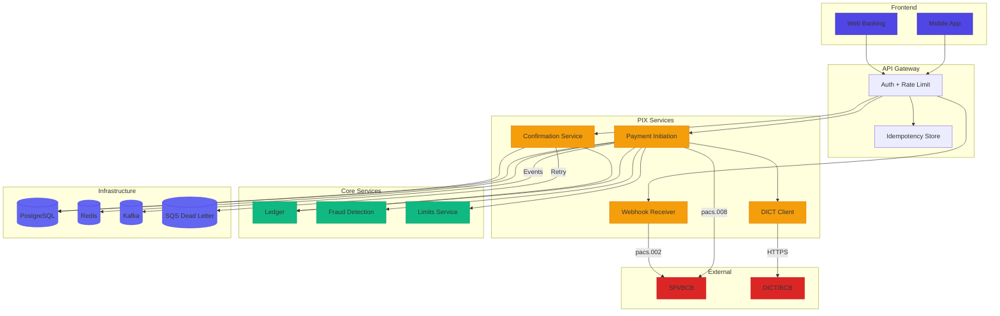
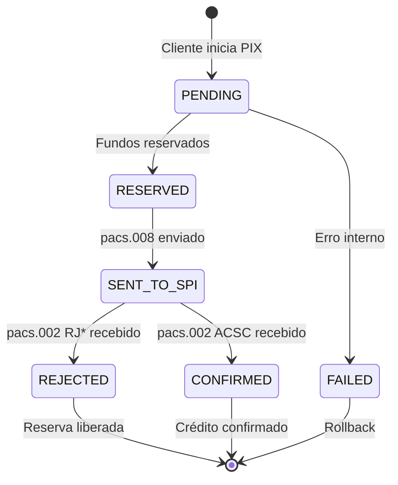
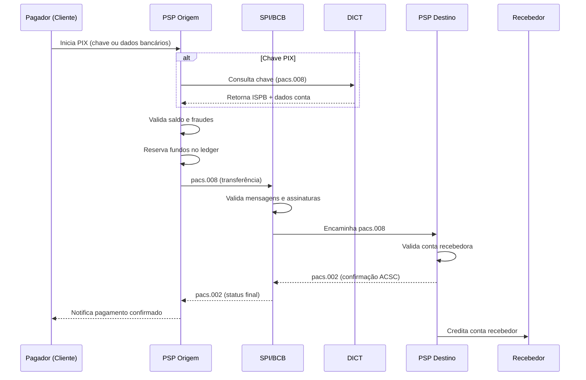
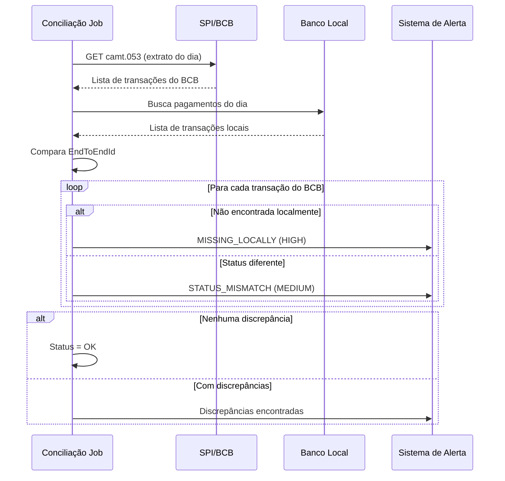
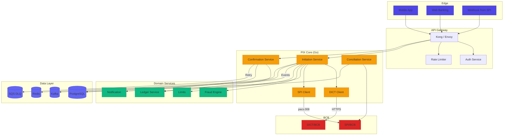
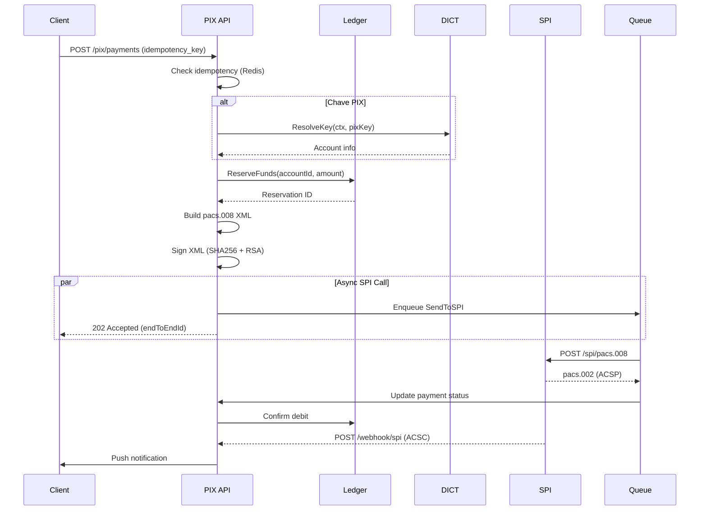
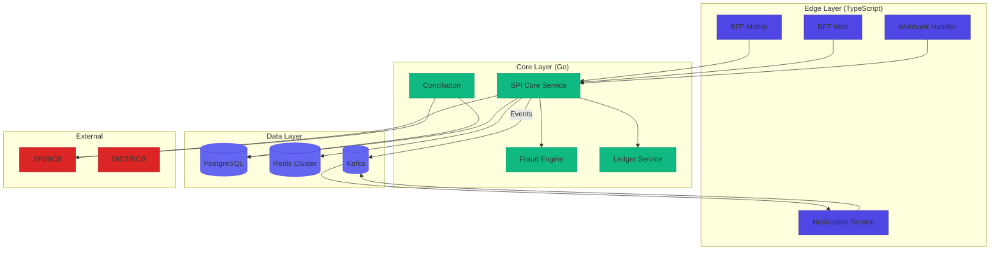

# Desafio 02: SPI — Pagamentos Instantâneos (PIX) no Coração do Brasil

**🇧🇷** Simulador do Sistema de Pagamentos Instantâneos  
**🇬🇧** Instant Payment System Simulator

---

## 🎯 Objetivos de Aprendizado

- Implementar um cliente SPI que constrói e assina mensagens ISO 20022 (pacs.008/pacs.002)
- Entender o fluxo completo de um PIX: iniciação → liquidação → confirmação → conciliação
- Projetar um webhook receiver para confirmações assíncronas do BCB
- Implementar conciliação diária comparando extrato da Conta PI com registros locais
- Dominar idempotência com EndToEndId e reserva de fundos com ledger

---

## 📋 Pré-requisitos

### 🧠 Conceitos
- ISO 20022 (pacs.008/pacs.002/camt.053)
- PIX e SPI no Brasil
- Assinatura digital (PKI)
- Idempotência

### 📚 Desafios Anteriores
- [Desafio 01: Ledger](/challenges/01-ledger) — o ledger para reserva e confirmação de fundos

### 🛠️ Ferramentas
- OpenSSL
- Certificado digital A1/A3
- Redis (idempotência)
- Kafka (eventos)

### 💻 Técnico
- TypeScript
- XML (fast-xml-parser)
- Criptografia (SHA-256, RSA)
- Go opcional

---

## 📖 Abertura — O Terremoto Chamado PIX

"Sabe, deixa eu te contar uma história que mudou o Brasil pra sempre.

Antes de 2020, transferir dinheiro no Brasil era uma novela. Você tinha DOC (até às 22h, R$ 4,99 de tarifa, chegava no dia seguinte), TED (horário comercial, R$ 9,90, chegava em algumas horas) e... era isso. Se fosse fim de semana ou feriado, esquece. O dinheiro ficava preso. A liquidação era D+1, D+2, dependendo do horário. E sabe qual era o pior? O sistema bancário brasileiro era dominado por um oligopólio de 5 grandes bancos — Itaú, Bradesco, Santander, Banco do Brasil e Caixa — que controlavam mais de 80% do mercado. Eles não tinham incentivo nenhum pra melhorar. Pelo contrário: cada DOC e TED era uma tarifa no bolso. Quanto mais demorado e burocrático, mais o cliente pagava. A FEBRABAN, que representa esses bancos, tentou criar uma solução própria durante anos. Tentou o SITRAF, tentou a CIP, tentou vários arranjos de pagamento. Nenhum vingou. Sabe por quê? Porque os grandes bancos não queriam um sistema que nivelasse o campo de jogo. Um sistema instantâneo e gratuito ia matar a receita de TED/DOC e ainda permitir que fintechs competissem de igual pra igual. Era contra os interesses estabelecidos.

Aí entra o Banco Central. Em 2016, o BCB — comandado por Ilan Goldfajn e depois por Roberto Campos Neto — iniciou a Agenda BC#, um programa de modernização do sistema financeiro brasileiro. O PIX era o carro-chefe dessa agenda. Entre 2016 e 2018, o BCB fez algo que nenhum banco central do mundo tinha feito naquela escala: eles mesmos projetaram, construíram e operaram o sistema. Não licitaram pra um consórcio de bancos. Não terceirizaram pra uma empresa privada. O BCB virou desenvolvedor de software. Eles criaram times internos de engenharia, fizeram chamadas públicas pra participação do mercado, escreveram o manual de especificações técnicas com mais de 600 páginas, definiram padrões de mensageria, segurança, certificação, e estabeleceram um cronograma de implementação de 2 anos. O SPI — Sistema de Pagamentos Instantâneos — foi a peça central: um motor de liquidação bruta em tempo real que conecta todas as instituições financeiras brasileiras por meio de mensagens ISO 20022.

E a FEBRABAN? Fez barulho. Reclamou do cronograma, pediu prorrogação, argumentou que era inviável. Mas o BCB tinha uma arma secreta: o monopólio da liquidação interbancária. Quem não se conectasse ao SPI, não liquidava pagamentos no Brasil. Perdeu, FEBRABAN. Em novembro de 2020, o PIX foi lançado. Em menos de 2 anos, o Brasil saiu de 0 pra 150 milhões de chaves PIX cadastradas. Hoje, mais de 70% das transações financeiras do país são via PIX. O sistema processa 100 milhões de transações por dia em picos. É o maior sistema de pagamentos instantâneos do mundo em volume bruto.

Pra você ter dimensão: a Índia tem o **UPI** (Unified Payments Interface), criado em 2016 pela NPCI. É gigantesco — 10 bilhões de transações por mês — e foi a primeira prova de que pagamentos instantâneos em escala nacional eram viáveis. A diferença é que o UPI é um protocolo de três partes (pagador, recebedor, intermediário PSP) que opera sobre a infraestrutura existente do IMPS. Já o PIX brasileiro opera no nível da liquidação — o SPI movimenta os reais de fato, em tempo real, na Conta PI de cada instituição no BCB. É uma camada mais profunda. A Europa tem o **SEPA Instant** (SCT Inst), que desde 2017 permite transferências em até 10 segundos dentro da zona do euro. Mas a adoção é tímida — bancos europeus cobram tarifas, muitos ainda não aderiram, e a implementação é fragmentada entre 36 países com reguladores diferentes. Os Estados Unidos lançaram o **FedNow** em julho de 2023 — três anos depois do PIX — com adoção lenta e apenas 900 instituições participantes. O Reino Unido tem o **Faster Payments** desde 2008, que foi pioneiro mas usa infraestrutura legada e tem limites de R$ 250 mil. Nenhum desses sistemas tem a combinação de escala, capilaridade, gratuidade e obrigatoriedade do PIX brasileiro.

O impacto econômico é brutal. O PIX reduziu o uso de dinheiro físico no Brasil de 35% para 22% das transações em 3 anos, economizando bilhões em custos de impressão, transporte e segurança de cédulas. A inclusão financeira explodiu: 36 milhões de brasileiros fizeram sua primeira transferência bancária digital via PIX. Microempreendedores, camelôs, vendedores de rua, profissionais autônomos — todos passaram a aceitar pagamentos instantaneamente, sem maquininha, sem taxa. O PIX democratizou o acesso ao sistema financeiro de uma forma que nenhum programa de bancarização jamais conseguiu. O Banco Mundial e o FMI citam o PIX como case de estudo de política pública digital bem-sucedida.

E o coração desse sistema? O **SPI — Sistema de Pagamentos Instantâneos**.

O SPI é o middleware do BCB que orquestra as transferências entre as instituições. Cada banco tem uma **Conta PI** no Banco Central, e é por lá que o dinheiro transita. As mensagens seguem o padrão **ISO 20022** — XML, sim, aquele formato que todo dev frontend odeia, mas que o mundo financeiro adora porque é extensível, validável e auditável. Cada mensagem pacs.008 que você envia tem um tamanho médio de 2 a 5 KB e precisa ser assinada digitalmente com certificado ICP-Brasil. Cada pacs.002 que você recebe confirma (ou rejeita) a transação. E todo dia, religiosamente, você concilia o extrato da sua Conta PI com seus registros locais.

Esse desafio é sobre **construir um cliente SPI**. Você vai enviar pacs.008, receber pacs.002, fazer conciliação diária, e entender por que o PIX é a maior revolução financeira do Brasil desde o Plano Real. É sobre entender que pagamento instantâneo não é feature — é infraestrutura de país. E você vai construir um pedaço dela."

---

## 🔥 O Problema

Sua fintech cresceu. Você já tem ledger, já tem contas, já faz TED e DOC. Agora seus clientes querem **PIX**. E PIX não é só mais um meio de pagamento — é uma **obrigação regulatória**.

O BCB exige que todo PSP (Prestador de Serviço de Pagamento, no jargão do BC) se integre ao SPI. E a integração não é trivial. Vamos olhar pra cada dimensão desse problema com profundidade.

### 1. Mensagens XML Assinadas — Certificado Digital e a Maldição do Byte

Cada pacs.008 precisa ser assinado digitalmente com certificado A1 ou A3 do ICP-Brasil. Não é um JWT com HMAC — é assinatura XML-DSig com certificado X.509, cadeia de confiança completa, e validação de schema XSD. Um byte errado no XML e a assinatura quebra. O BCB rejeita sumariamente, sem explicação detalhada — você recebe um pacs.002 com status `RJCT` e um código genérico. A ISO 20022 define namespaces com versão — `pacs.008.001.08` é diferente de `pacs.008.001.09`. Se você mandar o namespace errado, a mensagem é rejeitada antes mesmo da validação de assinatura. E tem mais: a ordem dos elementos XML importa pra assinatura canônica. O processo de canonicalização (C14N) remove whitespace, ordena atributos, normaliza namespaces — e se a sua lib de XML não seguir o padrão à risca, a assinatura que você calcula localmente não bate com a validação do lado do SPI.

Existem dois tipos de certificado: **A1** (software, chave privada no servidor, renovação anual) e **A3** (hardware — token USB ou smartcard, renovação a cada 3 anos). A maioria das fintechs usa A1 no começo por simplicidade, mas bancos estabelecidos são obrigados a usar A3. A troca de certificado exige um processo de onboarding com o BCB que leva semanas — planeje com antecedência.

### 2. Disponibilidade 24/7 — O PIX Nunca Dorme (E Nem Você)

O SPI opera 24 horas por dia, 7 dias por semana, 365 dias por ano, incluindo feriados nacionais, estaduais e municipais. O horário de funcionamento do PIX é **ininterrupto** desde as 00:00:00 do dia 16/11/2020. Nunca parou. A janela de manutenção do SPI é das 00:00 às 00:30, mas isso não significa que o sistema para — a liquidação contínua ocorre normalmente; apenas algumas operações administrativas são restritas nesse período. Seu sistema precisa processar pagamentos domingo de madrugada, Natal às 03:00, Ano Novo às 02:15. Se cair, o cliente liga reclamando e o BCB multa. E a multa não é simbólica.

Falando em multa: o Regulamento do PIX prevê penalidades severas. Se sua instituição ficar indisponível por mais de 30 minutos consecutivos, a multa é de **R$ 50.000 por ocorrência**. Se ultrapassar 2 horas, sobe pra **R$ 200.000**. Se for reincidente, o BCB pode suspender sua participação no PIX — o que significa que seus clientes não podem mais fazer nem receber PIX. Tradução: game over. Além da multa, existe a **multa operacional por transação**: se você rejeitar pagamentos indevidamente ou atrasar processamento, paga R$ 1.000 por transação.

### 3. SLA de 10 Segundos — O Relógio Não Para

O SLA do PIX é de 10 segundos end-to-end. Isso significa que, do momento em que o pagador aperta "Enviar" até o recebedor ver o dinheiro na conta, não podem passar mais de 10 segundos. Esse tempo inclui: validação da chave PIX no DICT (até 500ms), reserva de fundos no ledger (até 200ms), detecção de fraude (até 500ms), construção e assinatura da mensagem pacs.008 (até 1s), envio ao SPI (até 2s ida e volta), processamento no SPI do BCB, envio ao PSP destino, confirmação pacs.002, e débito/crédito final. Em condições normais, um PIX leva de 2 a 4 segundos. Em horários de pico (Dia das Mães, Black Friday, pagamento de salários), pode chegar perto dos 10 segundos. Se ultrapassar 10 segundos, o PIX é considerado **timeout** e o pagador recebe uma notificação de falha — mas o dinheiro pode ter sido debitado da Conta PI do seu banco. Isso gera um problema de reconciliação que só se resolve na conciliação diária.

### 4. Conciliação Diária Obrigatória

Todo dia, você precisa baixar o extrato da sua Conta PI no formato camt.053 e comparar, transação por transação, com seus registros locais. O camt.053 é um extrato eletrônico ISO 20022 que lista todas as entradas e saídas da sua Conta PI no dia anterior. Você cruza pelo `EndToEndId` — o identificador único global do pagamento. Se o BCB registrou um débito que você não tem localmente, você precisa investigar: foi um PIX que você enviou mas não registrou? Foi um estorno? Foi uma devolução? Se você registrou um débito que não aparece no camt.053, pode ser um pagamento que o SPI rejeitou mas você debitou o cliente — nesse caso, você precisa estornar. Discrepâncias não resolvidas viram notificação do BCB. Discrepâncias recorrentes viram processo administrativo. Discrepâncias com impacto financeiro relevante viram multa. A conciliação é o momento da verdade — onde você prova que seu sistema está em ordem com o regulador.

### 5. Reserva de Fundos e o Problema do Estado Intermediário

Você não pode debitar a conta do cliente antes de ter certeza que o PIX foi aceito pelo SPI. Mas também não pode deixar sem reserva, senão o cliente gasta o dinheiro em outra transação antes do PIX liquidar. Esse é o clássico problema de **two-phase state**: entre a iniciação e a confirmação, o dinheiro está num estado intermediário — não pertence mais ao cliente (porque ele iniciou o PIX), mas também não pertence ao recebedor (porque o SPI ainda não confirmou). A solução é o **ledger com reserva**: o saldo disponível do cliente diminui imediatamente (evitando gasto duplo), mas o saldo contábil só é debitado quando o pacs.002 ACSC chega. Se o pacs.002 chega com status de rejeição (RJCR — falta de fundos na Conta PI, por exemplo), a reserva é liberada e o saldo disponível volta ao normal. Esse mecanismo de dois estágios é o coração do controle financeiro do PIX.

### 6. Custos Regulatórios e Infraestrutura

Participar do SPI não é de graça. O BCB cobra **R$ 0,01 por cada 10 PIX liquidados** como tarifa de uso do sistema. Parece pouco, mas para um banco que processa 50 milhões de PIX por dia, são R$ 50 mil por dia, R$ 1,5 milhão por mês. Além disso, você precisa manter infraestrutura redundante: dois data centers em regiões diferentes do Brasil (o BCB exige disaster recovery com RPO de 0 e RTO de 30 minutos), conectividade dedicada com o SPI via link redundante, equipe de plantão 24/7, e ambiente de homologação (chamado de "PIX Sandbox" ou "Ambiente de testes do SPI") onde você certifica seu software antes de ir pra produção.

Cada um desses problemas tem solução arquitetural específica: **cliente SPI com assinatura XML canônica**, **webhook receiver idempotente** pra confirmação assíncrona, **conciliação diária automática com alertas**, **reserva de fundos no ledger com estado transacional**, **monitoramento de SLA com heartbeat para o BCB**, e **arquitetura multi-DC com failover automático**.

---

## 🏗️ Arquitetura Geral

<LanguageToggle />

<div class="Lang-content ts" style="Display:block;">

### Visão Macro



### Estados de um Pagamento PIX



### Mensagens ISO 20022 no SPI

| Mensagem | Direção | Propósito |
|----------|---------|-----------|
| **pacs.008** | PSP → SPI | Instrução de pagamento |
| **pacs.002** | SPI → PSP | Confirmação de status |
| **pacs.008** | PSP → SPI | Devolução de pagamento |
| **camt.053** | SPI → PSP | Extrato da Conta PI |

| Código | Significado |
|--------|-------------|
| **ACSP** | Aceito para compensação |
| **ACSC** | Aceito e compensado (confirmado!) |
| **RJCR** | Rejeitado por falta de fundos |
| **RJVA** | Rejeitado por valor inválido |
| **RJCT** | Rejeitado (genérico) |

### Fluxo Completo do PIX



### Conciliação Diária — O Momento da Verdade



---

## 👨‍💻 Mão na Massa

"Bora codar. O bagulho é o seguinte: você precisa se comunicar com o SPI do BCB usando XML assinado. Não é JSON, não é REST — é XML puro com certificado digital, igual aos mainframes dos anos 90. Mas hey, o bagulho funciona e processa milhões de PIX por dia.

Vou te mostrar o passo a passo: construir a mensagem, assinar, enviar, e tratar a resposta."

### A Estrutura do XML ISO 20022 — Entendendo Cada Seção

Antes de escrever código, você precisa entender o que é uma mensagem pacs.008. O nome "Pacs.008" vem do catálogo ISO 20022: **Pa**yments **C**learing and **S**ettlement, mensagem número 008 — Customer Credit Transfer Initiation. É a instrução que o PSP do pagador envia ao SPI dizendo: "Transfira X reais da minha Conta PI para a Conta PI do PSP do recebedor".

Uma mensagem pacs.008.001.08 tem a seguinte estrutura hierárquica:

1. **`<Document>`** — Elemento raiz do XML, contém o namespace da versão da mensagem (fundamental: `urn:iso:std:iso:20022:tech:xsd:pacs.008.001.08`). O BCB valida o namespace ANTES de qualquer coisa — se você mandar .07 em vez de .08, a mensagem é rejeitada imediatamente.

2. **`<FIToFICustomerCreditTransfer>`** — O wrapper principal. "FI to FI" significa Financial Institution to Financial Institution. É uma transferência entre duas instituições financeiras (PSP do pagador → PSP do recebedor), iniciada por um cliente pessoa física ou jurídica (Customer Credit Transfer).

3. **`<GrpHdr>`** (Group Header) — Metadados da mensagem. Contém o `MsgId` (identificador único da mensagem, gerado pelo PSP), `CreDtTm` (timestamp de criação), `NbOfTxs` (número de transações no lote — quase sempre 1 no PIX), e `SttlmMtd` (método de liquidação: `CLRG` para clearing, que no contexto do SPI indica liquidação bruta em tempo real).

4. **`<CdtTrfTxInf>`** (Credit Transfer Transaction Information) — O núcleo da transação. Contém:
   - **`<PmtId>`** — Identificadores: `EndToEndId` (o identificador supremo, único globalmente, gerado pelo PSP), `InstrId` (identificador da instrução, que você pode usar como chave de idempotência), `TxId` (identificador da transação individual no lote).
   - **`<IntrBkSttlmAmt>`** — Valor da liquidação interbancária em reais, com o atributo `Ccy="BRL"`. Este é o valor que efetivamente transita entre as Contas PI.
   - **`<DbtrAgt>`** — Agente Devedor (PSP do pagador), identificado pelo ISPB no campo `ClrSysMmbId/MmbId`.
   - **`<CdtrAgt>`** — Agente Credor (PSP do recebedor), também identificado pelo ISPB.
   - **`<DbtrAcct>`** — Conta do pagador (agência, número, tipo CACC/SVGS/TRAN).
   - **`<CdtrAcct>`** — Conta do recebedor (agência, número, tipo de conta).
   - **`<RmtInf>`** — Informações de remessa: descrição opcional, identificador estruturado.

5. **Assinatura Digital** — Depois de construído, o XML é assinado com XML-DSig (XML Signature), seguindo o padrão W3C. A assinatura é inserida como um elemento `<Signature>` dentro do `<Document>`, antes de qualquer outro elemento (regra de posicionamento do BCB).

<Checkpoint question="Por que a assinatura XML precisa de canonicalização (C14N) antes de assinar?">
Porque XML pode ser semanticamente idêntico mas ter representações diferentes (ordem de atributos, whitespace, namespaces). A assinatura cobre os bytes do XML. Se o mesmo XML for serializado de forma diferente pelo emissor e pelo validador, a assinatura quebra. A canonicalização (C14N) normaliza o XML para uma forma canônica antes de assinar e antes de verificar — garantindo que ambos vejam os mesmos bytes.
</Checkpoint>

### Por que Fila Assíncrona para o SPI?

"Olha, aqui vai um segredo de quem já fez PIX em produção: **você NÃO deve chamar o SPI de forma síncrona direto da API do cliente**. O motivo? O SPI tem SLA de processamento, mas pode responder em 100ms ou em 8 segundos, dependendo da carga. Se você amarrar uma conexão HTTP do cliente esperando o SPI responder, você vai esgotar o pool de conexões do seu servidor em minutos de pico.

A arquitetura correta é: a API recebe a requisição do cliente, faz as validações síncronas (saldo, fraude, limites), reserva os fundos, persiste o pagamento com status PENDING, e **responde 202 Accepted** com o EndToEndId. A chamada ao SPI vai pra uma **fila assíncrona** (Kafka, RabbitMQ, SQS, ou mesmo uma goroutine com retry). O worker da fila constrói e assina o XML e envia ao SPI. Quando o SPI responde com pacs.002 (via webhook ou polling), você atualiza o status do pagamento e notifica o cliente.

Isso resolve três problemas de uma vez: **(1)** desacopla a experiência do cliente da latência do SPI, **(2)** permite retry automático em caso de falha temporária do SPI, e **(3)** garante que picos de volume não derrubem sua API."

### Assinatura XML com Certificado — O Ritual

O processo de assinar um XML ISO 20022 para o SPI segue um ritual específico. Não basta jogar o XML numa função de hash e assinar. O fluxo canônico é:

1. **Construir o XML** com todos os elementos de negócio, incluindo namespaces corretos e encoding UTF-8.
2. **Canonicalizar** o XML usando o algoritmo C14N (Canonical XML 1.0) — isso remove espaços em branco insignificantes, ordena atributos alfabeticamente, e normaliza a representação de namespaces.
3. **Calcular o hash SHA-256** do XML canonicalizado.
4. **Assinar o hash** com a chave privada do certificado usando RSA PKCS#1 v1.5 com padding.
5. **Construir o elemento `<Signature>`** segundo o padrão XML-DSig, contendo: `<SignedInfo>` (o que foi assinado), `<SignatureValue>` (a assinatura base64), `<KeyInfo>` (o certificado X.509 em base64), e `<Reference>` com o URI apontando para o elemento assinado.
6. **Inserir o elemento `<Signature>`** dentro do `<Document>`, antes de `<FIToFICustomerCreditTransfer>`.

No TypeScript, você pode usar a lib `xml-crypto` combinada com `node-forge`. No Go, a stdlib tem tudo: `crypto/sha256`, `crypto/rsa`, `encoding/xml`, `crypto/x509`.

### Domain Layer — O Coração do PIX

Primeiro, a entidade que modela um pagamento PIX:

```typescript
export enum PixPaymentStatus {
  PENDING = 'PENDING',
  SENT_TO_SPI = 'SENT_TO_SPI',
  CONFIRMED = 'CONFIRMED',
  REJECTED = 'REJECTED',
  REFUNDED = 'REFUNDED',
  FAILED = 'FAILED'
}

export interface PixPaymentProps {
  idempotencyKey: string;
  debtorAccount: {
    ispb: string;
    branch: string;
    accountNumber: string;
    accountType: 'CACC' | 'SVGS' | 'TRAN';
  };
  creditorAccount: {
    ispb: string;
    branch: string;
    accountNumber: string;
    accountType: 'CACC' | 'SVGS' | 'TRAN';
  };
  amount: Money;
  endToEndId: string;
  description?: string;
  status: PixPaymentStatus;
  spiTransactionId?: string;
  createdAt: Date;
  confirmedAt?: Date;
}

export class PixPayment extends Entity<string> {
  public static create(props: PixPaymentProps): PixPayment {
    return new PixPayment(props);
  }

  public confirm(spiTransactionId: string): void {
    this.props.status = PixPaymentStatus.CONFIRMED;
    this.props.spiTransactionId = spiTransactionId;
    this.props.confirmedAt = new Date();
  }

  public reject(reasonCode: string): void {
    this.props.status = PixPaymentStatus.REJECTED;
  }
}
```

### SPI Client — Construindo e Assinando XML

"Beleza, agora que temos a entidade de domínio, precisamos do cliente que vai falar com o SPI. Aqui mora a complexidade: você vai construir XML na mão, assinar digitalmente, e enviar por HTTPS com mTLS. Cada uma dessas etapas tem pegadinhas que eu vou te mostrar.

Primeiro, o builder do XML: repare que o `fast-xml-parser` usa uma convenção onde atributos XML viram `@_atributo` e conteúdo de texto vira `#text`. Isso é específico da lib — se você trocar de lib de XML, a estrutura do objeto muda radicalmente. Escolha sua lib com cuidado e NUNCA troque no meio do projeto."

Agora vamos conectar o cliente SPI com o use case de iniciação de pagamento. O fluxo é: receber a requisição → validar → reservar fundos → enviar ao SPI. O código é extenso porque cada passo tem tratamento de erro específico e rollback. Note que o fraud check tem timeout de 500ms — se o serviço de fraude não responder a tempo, você prefere deixar passar (com log de warning) do que derrubar o fluxo do cliente. Isso é uma decisão de negócio: falsos negativos são aceitáveis, falsos positivos (bloquear um pagamento legítimo) custam confiança do cliente.

```typescript
import { XMLBuilder, XMLParser } from 'fast-xml-parser';

export class SPIClient {
  private readonly xmlBuilder: XMLBuilder;
  private readonly xmlParser: XMLParser;

  constructor(config: SPIConfig) {
    this.xmlBuilder = new XMLBuilder({
      attributeNamePrefix: '@_',
      ignoreAttributes: false,
      format: true
    });
    this.xmlParser = new XMLParser({
      ignoreAttributes: false,
      attributeNamePrefix: '@_'
    });
  }

  public async sendPacs008(payment: PixPayment): Promise<Pacs002Response> {
    const pacs008Xml = this.buildPacs008(payment);
    const signedXml = this.signXml(pacs008Xml);

    const response = await fetch(`${this.baseUrl}/pix/spi/pacs.008`, {
      method: 'POST',
      headers: {
        'Content-Type': 'application/xml',
        'X-Ispb': this.ispb,
        'X-Signature': this.getSignatureHeader(signedXml)
      },
      body: signedXml
    });

    const responseBody = await response.text();
    return this.mapPacs002Response(this.xmlParser.parse(responseBody));
  }

  private buildPacs008(payment: PixPayment): string {
    return this.xmlBuilder.build({
      'Document': {
        '@_xmlns': 'urn:iso:std:iso:20022:tech:xsd:pacs.008.001.08',
        'FIToFICustomerCreditTransfer': {
          'GrpHdr': {
            'MsgId': `MSG${Date.now()}`,
            'CreDtTm': new Date().toISOString(),
            'NbOfTxs': '1',
            'SttlmMtd': 'CLRG'
          },
          'CdtTrfTxInf': {
            'PmtId': {
              'EndToEndId': payment.props.endToEndId,
              'InstrId': payment.props.idempotencyKey
            },
            'IntrBkSttlmAmt': {
              '@_Ccy': 'BRL',
              '#text': payment.props.amount.toDecimal().toString()
            },
            'DbtrAgt': { 'FinInstnId': { 'ClrSysMmbId': { 'MmbId': payment.props.debtorAccount.ispb } } },
            'CdtrAgt': { 'FinInstnId': { 'ClrSysMmbId': { 'MmbId': payment.props.creditorAccount.ispb } } },
            'CdtrAcct': { 'Id': { 'Othr': { 'Id': payment.props.creditorAccount.accountNumber } } }
          }
        }
      }
    });
  }
}
```

### Use Case — Iniciar Pagamento PIX

```typescript
export class InitiatePixPaymentUseCase {
  constructor(
    private readonly pixPaymentRepo: PixPaymentRepository,
    private readonly dictClient: DICTClient,
    private readonly spiClient: SPIClient,
    private readonly ledgerService: LedgerService,
    private readonly fraudService: FraudDetectionService,
    private readonly eventPublisher: EventPublisher
  ) {}

  public async execute(input: InitiatePixPaymentInput): Promise<Either<DomainError, PixPayment>> {
    // 1. Verifica idempotência
    const existing = await this.pixPaymentRepo.findByIdempotencyKey(input.idempotencyKey);
    if (existing) return right(existing);

    // 2. Resolve dados do recebedor via DICT
    let creditorAccount;
    if (input.pixKey) {
      const dictResult = await this.dictClient.resolveKey(input.pixKey);
      if (dictResult.isLeft()) return left(new PixKeyNotFoundError(input.pixKey));
      creditorAccount = dictResult.value;
    }

    // 3. Valida saldo
    const debtorAccount = await this.ledgerService.getAccount(input.debtorAccountId);
    if (debtorAccount.balance < input.amount) return left(new InsufficientFundsError());

    // 4. Detecção de fraude
    const fraudCheck = await this.fraudService.check({
      debtorAccountId: input.debtorAccountId,
      amount: input.amount,
      creditorIspb: creditorAccount.ispb
    });
    if (fraudCheck.isHighRisk) return left(new FraudDetectedError());

    // 5. Reserva fundos no ledger
    await this.ledgerService.reserveFunds({
      accountId: input.debtorAccountId,
      amount: input.amount
    });

    // 6. Envia para SPI
    const payment = PixPayment.create({ ... });
    const spiResponse = await this.spiClient.sendPacs008(payment);

    if (spiResponse.status === 'ACSC') {
      payment.confirm(spiResponse.transactionId);
    } else {
      payment.reject(spiResponse.reasonCode);
      await this.ledgerService.releaseReservation(payment.id);
    }

    return right(payment);
  }
}
```

### Webhook Receiver — O Retorno do SPI

"O SPI não responde síncrono com ACSC. Na verdade, a resposta síncrona do SPI ao pacs.008 é um ACSP (Accepted for Settlement Processing) — que significa 'recebi sua mensagem, vou processar'. O status final (ACSC ou rejeição) chega DEPOIS, via webhook. O BCB faz uma requisição HTTPS POST para um endpoint que VOCÊ precisa expor, em um domínio válido com certificado TLS, registrado previamente no diretório de participantes do SPI.

E aqui vai a pegadinha: **o BCB pode reenviar o mesmo webhook**. Se a sua resposta não chegar (timeout de rede, por exemplo), o BCB retenta. Por isso seu webhook handler PRECISA ser idempotente — verificar se o pagamento já está confirmado antes de debitar novamente. Se você debitar duas vezes o mesmo pagamento porque recebeu o mesmo pacs.002 duas vezes, o problema é seu, não do BCB."

O webhook handler também precisa validar a assinatura da mensagem recebida. O BCB assina cada pacs.002 com o certificado do SPI, e você deve verificar essa assinatura antes de processar. Isso previne que alguém forje um webhook falso e tente creditar dinheiro indevidamente.

```typescript
export class ReceiveSPIConfirmationUseCase {
  public async execute(pacs002: Pacs002Message): Promise<Either<Error, void>> {
    const payment = await this.pixPaymentRepo.findByEndToEndId(pacs002.endToEndId);
    if (!payment) return left(new PaymentNotFoundError(pacs002.endToEndId));

    switch (pacs002.status) {
      case 'ACSC':
        await this.ledgerService.confirmDebit(payment.props.debtorAccount.accountNumber, payment.id);
        payment.confirm(pacs002.transactionId);
        await this.eventPublisher.publish('pix.payment.confirmed', { paymentId: payment.id });
        return right(undefined);

      case 'RJCR':
      case 'RJVA':
      case 'RJCT':
        await this.ledgerService.releaseReservation(payment.id);
        payment.reject(pacs002.reasonCode);
        await this.eventPublisher.publish('pix.payment.rejected', { paymentId: payment.id, reason: pacs002.reasonCode });
        return right(undefined);
    }
  }
}
```

---

## 🧠 A Profundidade

### Por que XML? ISO 20022 e a Escolha do BCB

"Cara, eu sei que você deve estar pensando: 'XML em 2026? Pelo amor de deus, por que não JSON?'

Deixa eu te explicar. O padrão **ISO 20022** foi criado pelo SWIFT (sim, a rede de mensagens que conecta 11 mil bancos no mundo inteiro). E o SWIFT escolheu XML por um motivo muito específico: **extensibilidade com validação**.

No JSON, você não tem schema. Você manda um campo a mais, o receptor ignora. Ou pior: interpreta errado e ninguém descobre até a conciliação do fim do mês. No ISO 20022, cada mensagem tem um **XSD** que define exatamente quais campos são obrigatórios, opcionais, tipos, tamanhos, padrões de regex. Se faltou um campo obrigatório, o schema valida antes de processar.

Fora que o ISO 20022 foi desenhado pra **durar 30 anos**. Daqui a 20 anos, quando o JSON for história, o XML ainda vai estar rodando no core bancário de todo mundo.

A escolha do BCB pelo ISO 20022 foi estratégica: o Brasil não ia inventar um padrão próprio (como a India fez com UPI). O BCB adotou o padrão internacional, fez adaptações locais, e agora o Brasil é o maior usuário de ISO 20022 do mundo. Os europeus estão correndo pra migrar o SEPA pro mesmo padrão, e eles olham pro Brasil como referência."

### ISO 20022 vs Formatos Proprietários — A Guerra dos Padrões

O mundo financeiro sempre teve uma Babel de formatos proprietários. Cada banco, cada clearing house, cada sistema de pagamento tinha seu próprio formato de mensagem. O Banco do Brasil usava CNAB 240. A Caixa usava FEBRABAN 150. O Bradesco tinha seu layout proprietário. Cada integração bancária exigia um parser específico, documentação desatualizada, e um mês de desenvolvimento pra mapear campos. O SWIFT tentou unificar isso com o padrão **SWIFT MT** (Message Type) nos anos 70 — mensagens de texto estruturado com campos numerados como `:20:`, `:32A:`, `:50K:`. Funcionou por 40 anos, mas tinha limites claros: campos de tamanho fixo (35 caracteres para nome, 4 linhas de endereço), sem estrutura hierárquica, sem extensibilidade sem quebrar compatibilidade.

O ISO 20022 (também chamado de SWIFT MX, de XML) resolve isso com uma abordagem de **modelagem de negócio**: primeiro você define o modelo de dados do domínio financeiro (account, party, payment, settlement), depois gera os schemas XSD a partir desse modelo. O resultado é um padrão onde um pagamento internacional e um PIX brasileiro usam a MESMA estrutura conceitual — o que facilita interoperabilidade global. Um banco brasileiro pode mandar uma mensagem ISO 20022 pra um banco alemão e ele entende perfeitamente, porque ambos falam a mesma língua de negócio — mesmo que o envelope de transporte seja diferente (SPI vs SWIFTNet vs SEPA).

A migração global do SWIFT MT para MX está em andamento desde 2018 e tem prazo final em novembro de 2025. A partir dessa data, todas as mensagens de pagamento transfronteiriças serão obrigatoriamente ISO 20022. O Brasil, por ter adotado o padrão desde o lançamento do PIX, está anos à frente nessa transição.

### A Conta PI — O Cofre no Banco Central

Toda instituição participante do PIX mantém uma **Conta de Pagamentos Instantâneos** (Conta PI) no Banco Central. Essa conta é um livro-razão mantido pelo BCB onde cada centavo que entra e sai do SPI é registrado. A Conta PI não é uma conta bancária tradicional — é uma conta de liquidação, mantida exclusivamente no âmbito do STR (Sistema de Transferência de Reservas), o sistema de liquidação bruta do BCB.

Durante o dia, o saldo da Conta PI flutua constantemente: a cada pacs.008 aceito, o valor do débito é deduzido imediatamente; a cada pacs.008 recebido, o valor do crédito é adicionado. No fim do dia, o saldo da Conta PI é zerado e transferido de/para a Conta de Reservas Bancárias da instituição. Isso significa que a liquidação do PIX é **bruta e em tempo real** (LBTR), diferente do modelo de compensação diferida (DNS — Deferred Net Settlement) usado em sistemas como DOC e cheques, onde os saldos só são acertados no fim do dia.

O BCB exige que cada instituição mantenha um **saldo mínimo na Conta PI** proporcional ao volume de PIX processado. Se o saldo cair abaixo do mínimo durante o dia, a instituição precisa fazer uma transferência da Conta de Reservas Bancárias para a Conta PI. Se não fizer, o SPI começa a rejeitar pagamentos por falta de fundos (RJCR — Rejected by Lack of Funds in the PI Account). Isso é grave: significa que clientes não conseguem fazer PIX porque seu banco ficou sem lastro.

### LBTR — Liquidação Bruta em Tempo Real

"Liquidação Bruta em Tempo Real — você já ouviu essa sigla, mas o que ela significa de verdade? LBTR é um modelo onde cada transação é liquidada individualmente e imediatamente, em vez de acumular transações num lote e liquidar o saldo líquido no fim do dia.

No modelo DNS (Deferred Net Settlement), você manda 100 pagamentos e recebe 80 durante o dia. No fim do dia, você calcula o saldo líquido (100 - 80 = 20 de débito) e faz UMA transferência. Isso é eficiente em termos de liquidez (você precisa de menos dinheiro na conta de liquidação), mas é arriscado: se uma das contrapartes quebrar durante o dia, as transações já processadas precisam ser desfeitas (unwind), gerando um efeito cascata. Foi exatamente o que aconteceu na crise do Banco Herstatt em 1974 — o banco alemão quebrou no meio do dia, deixando contrapartes americanas com prejuízo. Esse evento motivou a criação dos padrões de liquidação do BIS (Bank for International Settlements).

O PIX usa LBTR puro: cada transação é liquidada no momento em que o SPI processa o pacs.008. O débito na Conta PI do PSP pagador e o crédito na Conta PI do PSP recebedor são simultâneos e atômicos. Não existe 'depois eu acerto'. Isso elimina o risco de crédito entre instituições, mas exige que cada PSP tenha liquidez suficiente na Conta PI o tempo todo. É por isso que o BCB oferece o **mecanismo de aporte automático**: se sua Conta PI estiver com saldo baixo, o SPI automaticamente puxa recursos da sua Conta de Reservas Bancárias (se houver saldo disponível).

### Mensagens Negativas — pacs.004 (Devolução) e camt.056 (Cancelamento)

Nem todo PIX é feliz. Existem cenários onde o dinheiro precisa voltar. O BCB define duas mensagens específicas para isso:

A **pacs.004** (**Payment Return**) é a mensagem de devolução. Ela é usada quando o PSP recebedor detecta que não pode creditar o valor — por exemplo, conta do recebedor encerrada, bloqueada judicialmente, ou dados da conta inválidos. O pacs.004 referencia o `EndToEndId` original e `TxId` original, e contém um `Rsn` (reason code) que explica o motivo da devolução: `AC01` (conta inválida), `AC04` (conta encerrada), `AC06` (conta bloqueada), `AG01` (transação não autorizada). A devolução é sempre pelo valor total e é iniciada pelo PSP recebedor. O pagador recebe o dinheiro de volta automaticamente.

Existe também a **devolução por iniciativa do pagador** (também pacs.004): se você caiu num golpe e fez um PIX pra um estelionatário, você pode solicitar a devolução ao seu banco. O banco do pagador envia um pacs.004 para o banco do recebedor, que tem até 7 dias para devolver se houver saldo na conta do recebedor. Esse é o **Mecanismo Especial de Devolução (MED)**, criado pelo BCB especificamente para casos de fraude. Se o recebedor não devolver e for constatada a fraude, o BCB pode bloquear a conta do recebedor.

O **camt.056** (**Payment Cancellation Request**) é a mensagem de solicitação de cancelamento. Diferente da devolução (que pressupõe que o crédito foi feito), o cancelamento é usado quando a transação ainda não foi concluída. Por exemplo: o pagador inicia um PIX, o pacs.008 é enviado, mas antes do ACSC chegar, o pagador quer cancelar. O PSP pagador envia um camt.056, e se o PSP recebedor ainda não processou, ele responde com uma rejeição e a transação é cancelada.

### O DICT — O Catálogo de Chaves PIX

Nenhuma conversa sobre SPI está completa sem mencionar o **DICT** (Diretório de Identificadores de Contas Transacionais). O DICT é o banco de dados centralizado mantido pelo BCB que mapeia chaves PIX (CPF, e-mail, telefone, chave aleatória) para dados bancários (ISPB, agência, conta, tipo de conta). Quando você faz um PIX usando uma chave em vez de dados bancários, seu PSP consulta o DICT via API REST em HTTPS, passa a chave PIX, e recebe os dados bancários do recebedor.

O DICT tem duas operações principais: **consulta** (resolve a chave e retorna os dados, gratuita e sem limite de uso) e **vinculação** (registra uma chave PIX para uma conta, limitada a 5 chaves por CPF por instituição). A consulta ao DICT é o primeiro passo de qualquer PIX por chave e precisa ser rápida — o SLA do DICT é de **500ms** no percentil 99. Se o DICT estiver lento, todo o PIX fica lento. É por isso que os PSPs mantêm caches locais do DICT (com TTL de 15 minutos), mas apenas para consultas repetidas — a primeira consulta de uma chave sempre vai ao DICT oficial.

### Conciliação Diária — A Prova dos Nove

```typescript
export class DailyConciliationJob {
  public async execute(date: Date): Promise<ConciliationResult> {
    // 1. Baixa extrato da conta PI no BCB (camt.053)
    const statement = await this.spiStatementClient.getStatement(date);

    // 2. Busca pagamentos locais do dia
    const localPayments = await this.pixPaymentRepo.findByDate(date);
    const localByEndToEnd = new Map(localPayments.map(p => [p.endToEndId, p]));

    const discrepancies: Discrepancy[] = [];

    // 3. Valida cada entrada do extrato
    for (const entry of statement.entries) {
      const local = localByEndToEnd.get(entry.endToEndId);
      if (!local) {
        discrepancies.push({ type: 'MISSING_LOCALLY', endToEndId: entry.endToEndId, severity: 'HIGH' });
      } else if (entry.status === 'ACSC' && !local.isConfirmed()) {
        discrepancies.push({ type: 'STATUS_MISMATCH', endToEndId: entry.endToEndId, severity: 'MEDIUM' });
      }
    }

    return { date, discrepancies, status: discrepancies.length === 0 ? 'OK' : 'WITH_ISSUES' };
  }
}
```

---

## 🧪 Testando Concorrência

"O PIX é um sistema 24/7 com SLA de 10 segundos. Isso significa que sua aplicação precisa lidar com dezenas de pagamentos concorrentes na mesma conta ao mesmo tempo. O teste mais crítico é garantir que reserva de fundos, idempotência e webhooks se comportem corretamente sob concorrência."

```typescript
describe('PIX Concorrência', () => {
  it('should handle concurrent PIX payments with proper fund reservation', async () => {
    // 10 pagamentos concorrentes de R$ 100 numa conta com R$ 1000
    const promises = Array.from({ length: 10 }, (_, i) =>
      initiatePixUseCase.execute({
        idempotencyKey: `pix-concurrent-${i}`,
        debtorAccountId: accountId,
        amount: 100,
        pixKey: 'joao@email.com',
      }).catch(() => null)
    );

    const results = await Promise.all(promises);
    const successful = results.filter(r => r !== null);
    const account = await ledgerService.getAccount(accountId);

    // O invariante: saldo final = saldo inicial menos pagamentos bem-sucedidos
    expect(account.balance).toBe(1000 - successful.length * 100);
    // Pelo menos um deve falhar (WriteConflict na reserva)
    expect(successful.length).toBeLessThan(10);
  });

  it('should reject duplicate idempotency key', async () => {
    const result1 = await initiatePixPaymentUseCase.execute({
      idempotencyKey: 'dup-key-001',
      debtorAccountId: accountId,
      amount: 100,
      pixKey: 'joao@email.com',
    });

    const result2 = await initiatePixPaymentUseCase.execute({
      idempotencyKey: 'dup-key-001', // mesma key
      debtorAccountId: accountId,
      amount: 100,
      pixKey: 'joao@email.com',
    });

    // Deve retornar a mesma entidade, sem criar nova transação
    expect(result1).toBeDefined();
    expect(result2).toBeDefined();
    expect(result1!.id).toBe(result2!.id);

    // Saldo só foi debitado uma vez
    const account = await ledgerService.getAccount(accountId);
    expect(account.balance).toBe(900); // 1000 - 100
  });

  it('should deduplicate webhook notifications', async () => {
    const pacs002 = {
      endToEndId: 'E2E20260630001',
      status: 'ACSC',
      transactionId: 'SPI-TXN-789',
    };

    // Primeira notificação
    await receiveSPIConfirmationUseCase.execute(pacs002);

    // Segunda notificação (duplicata — BCB pode reenviar)
    await receiveSPIConfirmationUseCase.execute(pacs002);

    const payment = await pixPaymentRepo.findByEndToEndId('E2E20260630001');

    // Status final é CONFIRMED, não duplicado
    expect(payment!.status).toBe(PixPaymentStatus.CONFIRMED);

    // Ledger só debitou uma vez
    const account = await ledgerService.getAccount(accountId);
    expect(account.balance).toBe(800); // 900 - 100
  });
});
```

**O invariante crítico:** em todos os cenários de concorrência, a soma dos saldos é sempre conservada. Cada PIX bem-sucedido debita exatamente uma vez. Cada duplicata é detectada e rejeitada silenciosamente.

---

## 💡 Lições Aprendidas

1. **XML é chato, mas necessário — e tem seus méritos.** O mundo financeiro roda em XML desde os anos 90 e não vai parar tão cedo. ISO 20022 é extensível (você adiciona campos sem quebrar compatibilidade), validável (XSD rejeita mensagem inválida antes de processar), e auditável (cada mensagem é autossuficiente, com todos os dados necessários para rastrear uma transação meses depois). A dor de cabeça do XML é compensada pela confiabilidade que ele traz. E depois de algumas semanas escrevendo pacs.008, você nem sente mais diferença — é só mais um formato de dados, com regras mais rígidas.

2. **ISO 20022 é o futuro do sistema financeiro global.** O SWIFT vai descontinuar o formato MT em 2025. A Europa migrou o SEPA Instant para ISO 20022. O FedNow americano já nasceu ISO 20022. O PIX brasileiro foi pioneiro e é o maior case de sucesso do padrão no mundo — processamos mais mensagens ISO 20022 por dia do que toda a rede SWIFT junta, e somos referência global em implementação do padrão para pagamentos domésticos.

3. **EndToEndId é o identificador supremo.** Único, global, imutável, gerado pelo PSP pagador. Use-o para idempotência (se o mesmo EndToEndId chegar duas vezes, retorne o mesmo resultado), para conciliação (cruzamento camt.053 x registros locais), e para rastreamento (se um cliente ligar perguntando "Cadê meu PIX?", você digita o EndToEndId e acha a transação em todos os sistemas). O formato do EndToEndId segue a convenção `E{ISPB}{timestamp}{sequencial}` — não invente formatos customizados, siga o padrão do BCB.

4. **Reserva de fundos é mandatória e é o coração do controle financeiro.** Sem reserva, o cliente gasta o dinheiro antes do PIX liquidar e você fica com saldo negativo (rombo contábil). Com reserva, o saldo disponível é separado do saldo contábil: o dinheiro some da disponibilidade imediatamente, mas só sai da contabilidade quando o ACSC chega. Esse padrão de two-phase commit financeiro é usado em todos os sistemas de pagamento do mundo — aprenda a implementar em ledger com segurança transacional.

5. **Webhook receiver precisa ser idempotente, ponto final.** O BCB pode reenviar o mesmo pacs.002 por vários motivos: timeout de rede, crash do seu servidor no meio do processamento, ou simplesmente retry automático. Seu handler precisa verificar se o pagamento já está no estado final antes de debitar/creditar. A melhor implementação é: ao receber um pacs.002, busque o pagamento pelo EndToEndId; se já estiver com status CONFIRMED ou REJECTED, retorne 200 OK sem fazer nada; se estiver PENDING, processe a transição de estado de forma atômica usando um lock otimista (version check) ou SELECT FOR UPDATE no banco.

6. **Conciliação diária não é opcional — é sua prova perante o BCB.** Discrepância não resolvida em até 24 horas vira notificação formal. Discrepância recorrente vira processo administrativo e multa. A melhor arquitetura é: job diário que baixa o camt.053, faz o diff transação a transação, gera relatório com discrepâncias classificadas por severidade (MISSING_LOCALLY = HIGH, STATUS_MISMATCH = MEDIUM, AMOUNT_MISMATCH = CRITICAL), e dispara alertas no Slack/Discord/PagerDuty. Se houver discrepância, o time de operações tem até o fim do dia seguinte para resolver.

7. **Assinatura XML é o ponto mais frágil do sistema — e o mais negligenciado nos testes.** Um byte a mais no XML, um namespace errado, uma ordem de atributos diferente, e a assinatura quebra. O BCB rejeita com RJCT genérico e você perde horas debuggando. A dica de ouro: **gere o XML, serialize para string, assine, e guarde tanto o XML original quanto o assinado em logs**. Quando der erro, você compara o que foi enviado com o que deveria ter sido enviado. E teste com os XMLs de exemplo do manual do BCB — eles fornecem arquivos de teste oficiais que você deve usar como referência. Se seu código gera XML diferente do exemplo oficial, está errado.

8. **Disponibilidade 24/7 é requisito regulatório, não desejo de produto.** Seu sistema PIX não pode ter janela de manutenção. Toda implantação precisa ser blue-green ou canary com zero downtime. Toda migração de banco precisa ser online. Todo deploy precisa ter rollback automático. Se você derruba o serviço PIX por 30 minutos, a multa é de R$ 50.000 — mais caro que o salário do seu engenheiro sênior. Invista em infraestrutura de verdade: dois data centers, load balancer com health check, Kubernetes com auto-healing, e monitoramento com PagerDuty.

9. **Performance importa — cada milissegundo conta no SLA de 10 segundos.** 2 segundos para o DICT, 1 segundo para XML + assinatura, 2 segundos para o SPI ida e volta, 1 segundo para ledger, 1 segundo para notificação. Já deu 7 segundos. Em pico, você tem 3 segundos de folga. Otimize o que for possível: cache de chaves DICT, XML pré-compilado para pagamentos recorrentes, pool de conexões HTTP para o SPI, e logging assíncrono (nunca bloqueie o fluxo principal esperando um log ser escrito).

10. **Go é a escolha certa para o caminho crítico do dinheiro.** A stdlib do Go tem tudo que você precisa para SPI: `encoding/xml`, `crypto/rsa`, `crypto/sha256`, `crypto/x509`, `net/http` com keep-alive. Binário compilado, sem dependências, deploy com `scp` e `systemctl restart`. Para processamento de alto volume (10k+ PIX/segundo), goroutines com channels são imbatíveis em simplicidade e performance. TypeScript é ótimo para a camada de BFF e webhooks, mas o core do SPI deve rodar em Go.

11. **Nunca confie na rede — o SPI pode falhar, e você precisa de um plano B.** O SPI do BCB tem SLA de 99,99%, mas já teve outages documentadas. Quando o SPI cai (ou fica lento), seus PIXs ficam pendentes na fila de envio. Você precisa de um mecanismo de retry com backoff exponencial. Se o retry falhar por mais de 30 segundos, o pagamento deve ser marcado como FAILED e a reserva de fundos liberada, com notificação ao cliente. O pior cenário é um PIX em estado zumbi — fundos reservados, SPI offline, e cliente sem o dinheiro e sem o produto.

12. **Teste de concorrência não é luxo — é requisito de homologação.** O BCB exige que você teste cenários de concorrência durante a certificação do SPI: múltiplos pagamentos simultâneos na mesma conta, idempotência com chave duplicada, webhooks concorrentes, e race condition entre o retorno síncrono do SPI e o webhook assíncrono. Se sua aplicação tem race conditions, você perde dinheiro. Invista em testes de integração com múltiplas goroutines/workers, use o race detector do Go (`go test -race`), e simule cenários de rede lenta com toxiproxy.

13. **O onboarding no SPI é um projeto à parte.** Entrar no PIX não é só escrever código. Você precisa de: CNPJ com CNAE financeiro, autorização do BCB como PSP (processo que leva de 6 a 18 meses), certificado digital ICP-Brasil A1 ou A3, contrato com a CIP (Câmara Interbancária de Pagamentos) para acesso à rede RSFN (Rede do Sistema Financeiro Nacional), ambiente de homologação aprovado, e equipe de compliance dedicada. O custo total de onboarding pode chegar a R$ 500 mil, considerando infraestrutura, certificações, consultoria e taxas regulatórias. Planeje seu roadmap com folga — o BCB não acelera processo burocrático.

14. **O PIX não substitui TED/DOC — ele os torna obsoletos.** TED ainda existe para transferências acima de R$ 50 mil (limite noturno do PIX, que pode ser aumentado pelo usuário) e para pagamentos entre contas do mesmo titular em bancos diferentes (portabilidade de salário). DOC, honestamente, é um dinossauro que só sobrevive por inércia — algumas empresas ainda usam por integração legada. Mas a tendência é clara: o PIX vai absorver 95% das transferências interbancárias nos próximos 5 anos. Construa seu sistema pensando em PIX-first, com TED/DOC como fallback temporário.

---

## 🚀 Como Testar na Prática

```bash
# Sobe a infra
make infra-up

# Inicia o servidor
pnpm --filter @banking/spi dev

# Criar um pagamento PIX (iniciação)
curl -X POST http://localhost:3002/pix/payments \
  -H "Content-Type: application/json" \
  -d '{
    "IdempotencyKey": "Ext-123",
    "DebtorAccountId": "Acct_001",
    "PixKey": "Joao@email.com",
    "Amount": 15000,
    "Description": "Pagamento de teste"
  }'

# Enviar pacs.008 diretamente (simulação)
curl -X POST http://localhost:3002/spi/pacs.008 \
  -H "Content-Type: application/xml" \
  -d @testdata/pacs008-example.xml

# Ver transações
curl http://localhost:3002/spi/transactions

# Simular webhook do BCB (pacs.002)
curl -X POST http://localhost:3002/webhook/spi \
  -H "Content-Type: application/xml" \
  -d @testdata/pacs002-acsc.xml

# Rodar conciliação do dia
curl -X POST http://localhost:3002/spi/conciliation \
  -H "Content-Type: application/json" \
  -d '{"Date": "2026-06-30"}'
```

Para rodar os testes:

```bash
docker run -d --name spi-mongo-test -p 27017:27017 mongo:7 --replSet rs0
docker exec spi-mongo-test mongosh --eval "Rs.initiate()"
pnpm --filter @banking/spi test
```

---

## 🔧 Troubleshooting

### 1. Namespace XML errado

O erro mais comum. O parsing retorna struct zerada sem erro:

```xml
<!-- ERRADO: namespace antigo -->
<Document xmlns="Urn:iso:std:iso:20022:tech:xsd:pacs.008.001.07">

<!-- CORRETO -->
<Document xmlns="Urn:iso:std:iso:20022:tech:xsd:pacs.008.001.08">
```

### 2. Race condition em teste de carga

Transações concorrentes disputando a mesma conta:

```bash
go run -race .  # ESSENCIAL — detecta acessos concorrentes sem sync
```

### 3. Float impreciso em valores monetários

```typescript
// ERRADO: 0.1 + 0.2 = 0.30000000000000004
const amount = 15_738_294.12

// CORRETO: tudo em centavos (int64)
type MonetaryAmount struct {
    Value    int64  // centavos
    Currency string // ISO 4217
}
```

### 4. Webhook duplicado debitando duas vezes

Sintoma: cliente reclama que o mesmo PIX debitou duas vezes. Causa: webhook handler sem verificação de idempotência. O BCB reenviou o pacs.002 porque seu servidor demorou para responder e o TCP connection resetou. Solução: antes de processar o webhook, busque o pagamento por `EndToEndId` e verifique se o status já é terminal (`CONFIRMED` ou `REJECTED`). Se for, retorne 200 OK sem fazer nada.

### 5. Certificado expirado no meio da noite

Sintoma: todos os pacs.008 são rejeitados com `RJCT`, sem explicação. Causa: o certificado digital A1 expirou e ninguém lembrou de renovar (A1 expira em 1 ano). Solução: implemente monitoramento de expiração de certificado com alerta 30, 15 e 7 dias antes do vencimento. Use o campo `notAfter` do certificado X.509 para calcular a data de expiração programaticamente.

### 6. Saldo insuficiente na Conta PI (RJCR)

Sintoma: seus PIXs são rejeitados com código `RJCR` (Rejected by Lack of Funds in the PI Account), mesmo com saldo suficiente no banco. Causa: sua Conta PI no BCB está sem saldo. A Conta PI é separada da Conta de Reservas Bancárias — você precisa transferir recursos entre elas manualmente ou configurar o aporte automático. Solução: implemente um monitor de saldo da Conta PI e dispare alertas quando o saldo cair abaixo de um threshold. Configure o aporte automático do BCB, que puxa recursos da Conta de Reservas quando a Conta PI está baixa.

### 7. Timeout do SPI em horário de pico

Sintoma: PIXs demoram mais de 10 segundos ou recebem timeout nos horários de pico (Dia das Mães, Black Friday, 5º dia útil). Causa: o SPI está sob carga elevada e sua aplicação não está conseguindo processar no SLA. Solução: aumente o timeout HTTP do cliente SPI para 12 segundos (não 10 exatos — dê margem), implemente métricas de latência por endpoint, e configure alertas quando o P95 de latência ultrapassar 5 segundos. Considere pré-assinar XMLs para pagamentos recorrentes (como folha de pagamento) e enviá-los fora do horário de pico.

### 8. Discrepância na conciliação — MISSING_LOCALLY

Sintoma: a conciliação diária reporta transações que existem no camt.053 do BCB mas não existem na sua base local. Causas possíveis: (a) seu sistema caiu e perdeu a transação antes de persistir, (b) o webhook do BCB não foi entregue (seu endpoint estava offline), (c) alguém fez um PIX diretamente no internet banking do seu banco que você não está rastreando. Solução: para cada MISSING_LOCALLY, baixe o detalhe da transação via camt.053 (que inclui o EndToEndId e o valor) e reconcilie manualmente. Implemente um endpoint de health check que o BCB possa verificar antes de enviar webhooks.

### 9. XML malformado — erro de encoding

Sintoma: o SPI rejeita com erro de parsing XML. Causa: caracteres especiais (acentos, ç, emojis) em campos como nome do recebedor ou descrição do pagamento não estão escapados corretamente. Solução: sempre use uma lib de XML que lida com encoding automaticamente (o `encoding/xml` do Go faz escape automático de `&`, `<`, `>`, `"`). Jamais construa XML com concatenação de string ou template literals sem escape. Se o campo `RmtInf/Ustrd` (descrição) contiver emoji, use CDATA.

### 10. Assinatura inválida após formatação do XML

Sintoma: você gera o XML, assina, envia, e o BCB rejeita com erro de assinatura. Mas quando você verifica localmente, a assinatura está correta. Causa: você formatou o XML (pretty-print, indentação) DEPOIS de assinar. A canonicalização C14N é sensível a whitespace, e a formatação altera a estrutura. Solução: assine o XML canonicalizado primeiro, depois insira a assinatura no documento, e NUNCA reformate o XML depois de assinar. Se precisar de XML legível para debug, gere uma cópia formatada ANTES da assinatura.

### 11. Ordem dos elementos XML quebrando a assinatura

Sintoma: o mesmo XML, gerado pelo mesmo código, às vezes é rejeitado com erro de assinatura, às vezes é aceito. Causa: sua lib de XML não garante ordem determinística dos elementos — maps em Go não têm ordem garantida, e se você usar `map[string]interface{}` para construir o XML, a ordem dos elementos pode variar entre execuções. Solução: use structs para modelar o XML (a ordem dos campos na struct determina a ordem dos elementos no XML em Go) ou use uma lib que garanta ordem determinística. Nunca use maps para construir XML assinado.

### 12. Concorrência: reserva duplicada no ledger

Sintoma: dois PIXs concorrentes conseguem reservar o mesmo saldo, resultando em saldo negativo. Causa: o método `reserveFunds` não é atômico — lê o saldo, verifica, e atualiza em operações separadas (race condition clássica). Solução: use `SELECT FOR UPDATE` no PostgreSQL para travar a linha da conta durante a reserva, ou use operações atômicas no Redis (`DECRBY` com verificação de saldo negativo via script Lua), ou implemente optimistic locking com version check e retry.

---

## 📚 O que vem depois

O SPI é a espinha dorsal do PIX, mas o ecossistema é muito maior. Depois de dominar o envio e recebimento de pacs.008/pacs.002, existem outros sistemas e conceitos que aprofundam sua compreensão do sistema financeiro brasileiro:

### STR — Sistema de Transferência de Reservas

O STR é o sistema de liquidação de grandes valores do BCB. É anterior ao PIX e opera no mesmo princípio de LBTR (Liquidação Bruta em Tempo Real), mas com foco em transações de alto valor entre instituições financeiras — compra e venda de títulos públicos, operações de câmbio, e transferências interbancárias de grande monta. O SPI foi construído como uma extensão funcional do STR, reaproveitando a infraestrutura de liquidação. Se você entende o SPI, entender o STR é questão de aprender os tipos de mensagem específicos e os limites operacionais. A principal diferença é que o STR opera apenas em horário comercial (6:30 às 18:30), enquanto o SPI é 24/7.

### LBTR — Liquidação Bruta em Tempo Real

O conceito de LBTR merece um estudo dedicado. Entender como cada transação é liquidada individualmente versus como sistemas de compensação diferida (DNS) funcionam é fundamental para projetar sistemas de pagamento seguros. Estude os padrões do BIS (Bank for International Settlements), especialmente os *Principles for Financial Market Infrastructures* (PFMI), que definem os requisitos de segurança para sistemas de liquidação.

### Mensagens Negativas Avançadas

Além do pacs.004 (devolução) e camt.056 (cancelamento) que já cobrimos, existem variações importantes:
- **pacs.004 com código REAS** (Return Exact Amount Same): devolução parcial, onde o recebedor devolve apenas parte do valor original. Usado em cenários de estorno parcial de compra.
- **camt.029** (Resolution of Investigation): resposta a uma investigação iniciada por camt.056, confirmando ou negando o cancelamento.
- **camt.054** (Bank to Customer Debit/Credit Notification): notificação de débito ou crédito enviada do banco para o cliente corporativo, usada por empresas que precisam de extrato detalhado em tempo real.
- **admi.002** (Administrative Response): resposta a mensagens administrativas, como confirmação de recebimento de lote de transações.

### Zona de Espera e Resiliência

Quando o PSP destino está offline (manutenção, queda de conectividade, desastre), o SPI coloca as transações em uma **zona de espera** temporária. As transações na zona de espera não são rejeitadas — ficam aguardando o PSP destino voltar ao ar. O timeout da zona de espera é de 60 minutos. Se o PSP destino não retornar, as transações são rejeitadas e devolvidas ao pagador. Implementar tratamento correto de zona de espera é crítico — sua API precisa informar ao cliente que o PIX está "Em processamento" e não "Confirmado" ou "Rejeitado".

### AML, COAF e Compliance

Transações PIX acima de R$ 10.000 (pessoa física) ou R$ 50.000 (pessoa jurídica) por dia precisam ser reportadas ao COAF (Conselho de Controle de Atividades Financeiras). Seu sistema precisa de um módulo de AML (Anti-Money Laundering) que monitore padrões suspeitos: múltiplos PIXs pequenos para a mesma conta (estruturação, ou "Smurfing"), PIXs para contas em jurisdições de alto risco, e transações inconsistentes com o perfil do cliente. O não reporte de operações suspeitas pode resultar em multas de até R$ 20 milhões.

### Limites PIX

O BCB estabelece limites de valor por horário para segurança do usuário:
- **Período noturno** (20:00 às 06:00): limite padrão de R$ 1.000 por transação.
- **Período diurno** (06:00 às 20:00): limite definido pelo banco, mas o usuário pode solicitar aumento ou redução.
- Limites podem ser customizados por canal (app, internet banking, caixa eletrônico) e por dia.

Sua aplicação precisa consultar e respeitar esses limites antes de iniciar um PIX, rejeitando a transação se exceder o limite configurado pelo usuário.

### Tarifação

O BCB cobra R$ 0,01 por cada 10 PIX liquidados (R$ 0,001 por transação). Para pessoa física, o PIX é gratuito por lei. Para pessoa jurídica, o banco pode cobrar tarifa (a maioria não cobra para manter competitividade). O custo operacional do PIX para o PSP é essencialmente infraestrutura + compliance — o custo marginal por transação é praticamente zero depois que o sistema está rodando.

### PIX Automático

Anunciado pelo BCB para 2024, o **PIX Automático** é a evolução do débito automático tradicional. Em vez de depender de convênios bilaterais entre cada banco e cada empresa, o PIX Automático usa a infraestrutura do SPI com autorizações recorrentes. O usuário autoriza uma vez (via PIX), e os débitos futuros são automáticos, com notificação prévia. Isso elimina a fricção do débito automático tradicional e deve substituir boletos recorrentes (água, luz, telefone, streaming, academia). Para o desenvolvedor, significa novas mensagens no SPI: pacs.003 (direct debit) e pacs.010 (direct debit initiation).

### PIX Internacional e Fase 2

O BCB está trabalhando na integração do PIX com sistemas de pagamento internacionais. O projeto **Nexus**, do BIS Innovation Hub, conecta múltiplos sistemas de pagamento instantâneo usando ISO 20022 como denominador comum. O Brasil participa do piloto junto com Malásia, Singapura, Filipinas e Índia. Em breve, um PIX feito no Brasil poderá ser recebido na Índia via UPI, liquidado em tempo real, com conversão de moeda automática. Para o desenvolvedor, isso significa suporte a múltiplas moedas no pacs.008, informações de câmbio (camt.060), e due diligence cross-border. O PIX vai virar um sistema de pagamentos global, e você vai estar pronto.

### Desafios Relacionados no Banking Stack

- **Desafio 01: Ledger** — O livro-razão que debita e credita com consistência. Pré-requisito fundamental para o módulo de reserva de fundos do SPI.
- **Desafio 03: BFF** — O Backend for Frontend que expõe APIs REST para apps mobile e web banking consumirem os serviços do SPI.
- **Desafio 07: STR** — O Sistema de Transferência de Reservas, irmão mais velho do SPI, focado em transações de alto valor.

---

</div>

<div class="Lang-content go" style="Display:none;">

### Arquitetura SPI em Go



### Fluxo de Iniciação de PIX



### Domain Layer — Go

```go
package domain

import (
    "Context"
    "Time"
    "Github.com/google/uuid"
)

type PixPaymentStatus string

const (
    StatusPending   PixPaymentStatus = "PENDING"
    StatusSentToSPI PixPaymentStatus = "SENT_TO_SPI"
    StatusConfirmed PixPaymentStatus = "CONFIRMED"
    StatusRejected  PixPaymentStatus = "REJECTED"
    StatusFailed    PixPaymentStatus = "FAILED"
)

type Money struct {
    Amount   int64  // centavos
    Currency string // "BRL"
}

func NewMoney(amount int64) Money {
    return Money{Amount: amount, Currency: "BRL"}
}

type AccountInfo struct {
    ISPB          string
    Branch        string
    AccountNumber string
    AccountType   string
    OwnerName     string
    OwnerTaxID    string
}

type PixPayment struct {
    ID               uuid.UUID
    IdempotencyKey   string
    EndToEndID       string
    DebtorAccount    AccountInfo
    CreditorAccount  AccountInfo
    Amount           Money
    Description      string
    Status           PixPaymentStatus
    SPITransactionID string
    CreatedAt        time.Time
    ConfirmedAt      *time.Time
    RejectionReason  string
}

func NewPixPayment(
    idempotencyKey string,
    debtor, creditor AccountInfo,
    amount Money,
    description string,
) (*PixPayment, error) {
    if amount.Amount <= 0 {
        return nil, ErrInvalidAmount
    }
    return &PixPayment{
        ID:              uuid.New(),
        IdempotencyKey:  idempotencyKey,
        EndToEndID:      generateEndToEndID(creditor.ISPB),
        DebtorAccount:   debtor,
        CreditorAccount: creditor,
        Amount:          amount,
        Description:     description,
        Status:          StatusPending,
        CreatedAt:       time.Now(),
    }, nil
}

func (p *PixPayment) Confirm(spiTransactionID string) {
    p.Status = StatusConfirmed
    p.SPITransactionID = spiTransactionID
    now := time.Now()
    p.ConfirmedAt = &now
}

func (p *PixPayment) Reject(reason string) {
    p.Status = StatusRejected
    p.RejectionReason = reason
}

type PixPaymentRepository interface {
    Save(ctx context.Context, payment *PixPayment) error
    FindByID(ctx context.Context, id uuid.UUID) (*PixPayment, error)
    FindByEndToEndID(ctx context.Context, endToEndID string) (*PixPayment, error)
    FindByIdempotencyKey(ctx context.Context, key string) (*PixPayment, error)
    Update(ctx context.Context, payment *PixPayment) error
}
```

### SPI Client — Crypto Nativa vs Dependências

"Fato curioso: repara numa coisa interessante. No TypeScript, você depende de `node-forge` pra criptografia e `fast-xml-parser` pra XML. Duas libs externas que você precisa manter atualizadas, auditar segurança, e torcer pra não ter breaking change.

No Go, **tudo vem na stdlib**: `crypto/rsa`, `crypto/sha256`, `crypto/x509`, `encoding/xml`. Zero dependências externas pro core do SPI. Isso não é coincidência — é uma **decisão filosófica** da linguagem. O Rob Pike e o Ken Thompson (sim, um dos criadores do Unix) projetaram Go pra ser **autossuficiente** em cenários críticos.

E faz sentido: numa fintech que processa milhões de PIX por dia, cada dependência externa é um **vetor de ataque** potencial. Cada atualização de lib é um **risco de regressão**. No Go, você compila o binário e ele tem absolutamente tudo que precisa — até o resolvedor DNS tá embutido."

### SPI Client — Comunicação com o BCB

```go
package spi

import (
    "Bytes"
    "Context"
    "Crypto"
    "Crypto/rand"
    "Crypto/rsa"
    "Crypto/sha256"
    "Crypto/tls"
    "Crypto/x509"
    "Encoding/pem"
    "Encoding/xml"
    "Fmt"
    "Io"
    "Net/http"
    "Os"
    "Time"
)

type Client struct {
    baseURL    string
    httpClient *http.Client
    privateKey *rsa.PrivateKey
    cert       *x509.Certificate
    ispb       string
}

func NewClient(cfg ClientConfig) (*Client, error) {
    certPEM, _ := os.ReadFile(cfg.CertPath)
    keyPEM, _ := os.ReadFile(cfg.PrivateKeyPath)

    cert, err := tls.X509KeyPair(certPEM, keyPEM)
    if err != nil {
        return nil, fmt.Errorf("Failed to parse key pair: %w", err)
    }

    keyBlock, _ := pem.Decode(keyPEM)
    privateKey, _ := x509.ParsePKCS1PrivateKey(keyBlock.Bytes)

    certBlock, _ := pem.Decode(certPEM)
    x509Cert, _ := x509.ParseCertificate(certBlock.Bytes)

    tlsConfig := &tls.Config{
        Certificates: []tls.Certificate{cert},
        MinVersion:   tls.VersionTLS12,
    }

    httpClient := &http.Client{
        Transport: &http.Transport{TLSClientConfig: tlsConfig},
        Timeout:   cfg.Timeout,
    }

    return &Client{
        baseURL:    cfg.BaseURL,
        httpClient: httpClient,
        privateKey: privateKey,
        cert:       x509Cert,
        ispb:       cfg.ISPB,
    }, nil
}

func (c *Client) SendPacs008(ctx context.Context, payment *domain.PixPayment) (*Pacs002Response, error) {
    pacs008, err := c.buildPacs008(payment)
    if err != nil {
        return nil, fmt.Errorf("Failed to build pacs.008: %w", err)
    }

    signedXML, err := c.signXML(pacs008)
    if err != nil {
        return nil, fmt.Errorf("Failed to sign XML: %w", err)
    }

    req, _ := http.NewRequestWithContext(ctx, "POST", c.baseURL+"/pix/spi/pacs.008", bytes.NewReader(signedXML))
    req.Header.Set("Content-Type", "Application/xml")
    req.Header.Set("X-ISPB", c.ispb)

    resp, err := c.httpClient.Do(req)
    if err != nil {
        return nil, fmt.Errorf("SPI request failed: %w", err)
    }
    defer resp.Body.Close()

    body, _ := io.ReadAll(resp.Body)

    var pacs002 Pacs002Response
    if err := xml.Unmarshal(body, &pacs002); err != nil {
        return nil, fmt.Errorf("Failed to parse pacs.002: %w", err)
    }

    return &pacs002, nil
}

func (c *Client) signXML(xmlContent []byte) ([]byte, error) {
    hash := sha256.Sum256(xmlContent)
    signature, err := rsa.SignPKCS1v15(rand.Reader, c.privateKey, crypto.SHA256, hash[:])
    if err != nil {
        return nil, fmt.Errorf("Failed to sign: %w", err)
    }
    return appendXMLSignature(xmlContent, signature, c.cert), nil
}

type Pacs002Response struct {
    XMLName         xml.Name `xml:"Document"`
    EndToEndID      string   `xml:"FIToFIPaymentStatusReport>TxInfAndSts>OrgnlEndToEndId"`
    Status          string   `xml:"FIToFIPaymentStatusReport>TxInfAndSts>TxSts"`
    TransactionID   string   `xml:"FIToFIPaymentStatusReport>TxInfAndSts>ClrSysRef"`
    RejectionReason string   `xml:"FIToFIPaymentStatusReport>TxInfAndSts>StsRsnInf>Rsn>Cd"`
}
```

### Use Case — Iniciar Pagamento PIX (Go)

```go
package usecase

import (
    "Context"
    "Fmt"
    "Time"

    "Github.com/google/uuid"
    "Go.uber.org/zap"
)

type InitiatePixInput struct {
    IdempotencyKey  string
    DebtorAccountID uuid.UUID
    PixKey          *string
    CreditorISPB    *string
    CreditorBranch  *string
    CreditorAccount *string
    AmountCents     int64
    Description     string
}

type InitiatePixUseCase struct {
    paymentRepo domain.PixPaymentRepository
    dictClient  dict.Client
    spiClient   spi.Client
    ledgerSvc   ledger.Service
    fraudSvc    fraud.Service
    eventPub    event.Publisher
    logger      *zap.Logger
}

func (uc *InitiatePixUseCase) Execute(ctx context.Context, input InitiatePixInput) (*InitiatePixOutput, error) {
    // 1. Idempotência
    existing, err := uc.paymentRepo.FindByIdempotencyKey(ctx, input.IdempotencyKey)
    if err == nil && existing != nil {
        return uc.toOutput(existing), nil
    }

    // 2. Resolve credor
    var creditor domain.AccountInfo
    if input.PixKey != nil {
        creditorInfo, err := uc.dictClient.ResolveKey(ctx, *input.PixKey)
        if err != nil {
            return nil, fmt.Errorf("Failed to resolve PIX key: %w", err)
        }
        creditor = creditorInfo.ToDomain()
    }

    // 3. Valida saldo
    debtorAccount, err := uc.ledgerSvc.GetAccount(ctx, input.DebtorAccountID)
    if err != nil {
        return nil, fmt.Errorf("Failed to get debtor account: %w", err)
    }
    if debtorAccount.Balance < input.AmountCents {
        return nil, ErrInsufficientFunds
    }

    // 4. Fraud check com timeout
    fraudCtx, cancel := context.WithTimeout(ctx, 500*time.Millisecond)
    defer cancel()

    fraudResult, err := uc.fraudSvc.Check(fraudCtx, fraud.CheckInput{
        DebtorAccountID: input.DebtorAccountID,
        AmountCents:     input.AmountCents,
        CreditorISPB:    creditor.ISPB,
    })
    if err != nil {
        uc.logger.Warn("Fraud check failed, continuing", zap.Error(err))
    } else if fraudResult.IsHighRisk {
        return nil, ErrFraudDetected
    }

    // 5. Cria pagamento
    payment, err := domain.NewPixPayment(
        input.IdempotencyKey,
        debtorAccount.ToAccountInfo(),
        creditor,
        domain.NewMoney(input.AmountCents),
        input.Description,
    )
    if err != nil {
        return nil, fmt.Errorf("Failed to create payment: %w", err)
    }

    // 6. Reserva fundos
    reservationID, err := uc.ledgerSvc.ReserveFunds(ctx, ledger.ReserveInput{
        AccountID:     input.DebtorAccountID,
        AmountCents:   input.AmountCents,
        ReservationID: payment.ID,
    })
    if err != nil {
        return nil, fmt.Errorf("Failed to reserve funds: %w", err)
    }

    // 7. Persiste
    if err := uc.paymentRepo.Save(ctx, payment); err != nil {
        uc.ledgerSvc.ReleaseReservation(ctx, reservationID)
        return nil, fmt.Errorf("Failed to save payment: %w", err)
    }

    // 8. Envia ao SPI (async)
    go func() {
        spiCtx, cancel := context.WithTimeout(context.Background(), 5*time.Second)
        defer cancel()

        spiResp, err := uc.spiClient.SendPacs008(spiCtx, payment)
        if err != nil {
            uc.logger.Error("Failed to send to SPI", zap.String("Payment_id", payment.ID.String()), zap.Error(err))
            uc.ledgerSvc.ReleaseReservation(context.Background(), reservationID)
            payment.Status = domain.StatusFailed
            uc.paymentRepo.Update(context.Background(), payment)
            return
        }

        switch spiResp.Status {
        case "ACSP", "ACSC":
            payment.Status = domain.StatusSentToSPI
            payment.SPITransactionID = spiResp.TransactionID
        default:
            payment.Reject(spiResp.RejectionReason)
            uc.ledgerSvc.ReleaseReservation(context.Background(), reservationID)
        }
        uc.paymentRepo.Update(context.Background(), payment)
    }()

    return uc.toOutput(payment), nil
}
```

### Webhook Handler — Go

```go
package http

import (
    "Encoding/xml"
    "Io"
    "Net/http"
    "Go.uber.org/zap"
)

type WebhookHandler struct {
    usecase *usecase.ReceiveSPIConfirmationUseCase
    logger  *zap.Logger
}

func (h *WebhookHandler) HandleSPIWebhook(w http.ResponseWriter, r *http.Request) {
    body, err := io.ReadAll(r.Body)
    if err != nil {
        http.Error(w, "Failed to read body", http.StatusBadRequest)
        return
    }
    defer r.Body.Close()

    if err := validateSignature(body, r.Header.Get("X-Signature")); err != nil {
        h.logger.Warn("Invalid webhook signature", zap.Error(err))
        http.Error(w, "Invalid signature", http.StatusUnauthorized)
        return
    }

    var pacs002 domain.Pacs002Message
    if err := xml.Unmarshal(body, &pacs002); err != nil {
        http.Error(w, "Invalid xml", http.StatusBadRequest)
        return
    }

    if err := h.usecase.Execute(r.Context(), pacs002); err != nil {
        h.logger.Error("Failed to process webhook", zap.Error(err))
        http.Error(w, "Internal error", http.StatusInternalServerError)
        return
    }

    w.WriteHeader(http.StatusOK)
    w.Write([]byte(`{"Status":"Received"}`))
}
```

### Conciliação Diária — Go

```go
package jobs

import (
    "Context"
    "Sync"
    "Time"
    "Go.uber.org/zap"
)

type DailyConciliationJob struct {
    spiStatementClient spi.StatementClient
    paymentRepo        domain.PixPaymentRepository
    reconciliationRepo domain.ReconciliationRepository
    notificationSvc    notification.Service
    logger             *zap.Logger
}

func (j *DailyConciliationJob) Execute(ctx context.Context, date time.Time) (*ConciliationResult, error) {
    statement, err := j.spiStatementClient.GetStatement(ctx, date)
    if err != nil {
        return nil, fmt.Errorf("Failed to get statement: %w", err)
    }

    localPayments, err := j.paymentRepo.FindByDateRange(ctx, date, date.Add(24*time.Hour))
    if err != nil {
        return nil, fmt.Errorf("Failed to get local payments: %w", err)
    }

    localByEndToEnd := make(map[string]*domain.PixPayment, len(localPayments))
    for _, p := range localPayments {
        localByEndToEnd[p.EndToEndID] = p
    }

    var discrepancies []Discrepancy
    var mu sync.Mutex
    var wg sync.WaitGroup
    sem := make(chan struct{}, 100)

    for _, entry := range statement.Entries {
        wg.Add(1)
        go func(entry spi.StatementEntry) {
            defer wg.Done()
            sem <- struct{}{}
            defer func() { <-sem }()

            local, exists := localByEndToEnd[entry.EndToEndID]
            if !exists {
                mu.Lock()
                discrepancies = append(discrepancies, Discrepancy{
                    Type: "MISSING_LOCALLY", Severity: "HIGH",
                    EndToEndID: entry.EndToEndID, BCBAmmount: entry.AmountCents,
                })
                mu.Unlock()
                return
            }

            if entry.Status == "ACSC" && !local.IsConfirmed() {
                mu.Lock()
                discrepancies = append(discrepancies, Discrepancy{
                    Type: "STATUS_MISMATCH", Severity: "MEDIUM",
                    EndToEndID: entry.EndToEndID,
                })
                mu.Unlock()
            }
        }(entry)
    }
    wg.Wait()

    result := &ConciliationResult{
        Date:           date,
        TotalProcessed: len(statement.Entries),
        TotalLocal:     len(localPayments),
        Discrepancies:  discrepancies,
        Status:         "OK",
    }
    if len(discrepancies) > 0 {
        result.Status = "WITH_ISSUES"
    }

    return result, nil
}
```

### Comparação: TypeScript vs Go para SPI

| Aspecto | TypeScript | Go |
|---------|-----------|-----|
| **Velocidade de desenvolvimento** | Rápido, XML/JSON libs prontas | Mais verboso, mas compila rápido |
| **Performance** | ~10-50ms latência | ~1-5ms latência |
| **XML Processing** | fast-xml-parser (rápido) | encoding/xml nativo (eficiente) |
| **Criptografia** | node-forge, xml-crypto | stdlib crypto (assembly otimizado) |
| **Concorrência** | Event loop (single-thread) | Goroutines (M:N scheduler) |
| **Deploy** | Precisa Node runtime | Binário único |
| **Ecossistema ISO 20022** | Bibliotecas prontas | Precisa implementar |

| Aspecto | TypeScript | Go |
|---------|-----------|-----|
| **Latência P99** | 10-50ms | 1-5ms |
| **Throughput** | ~2K PIX/s | ~50K PIX/s |
| **Memória** | ~50MB | ~10MB |
| **GC pauses** | ~100ms (imprevisível) | ~1ms (previsível) |
| **Startup** | ~2s | ~50ms |
| **Deploy** | npm install + node | scp binário |

### Quando escolher cada uma?

**Escolha TypeScript quando:**
- **MVP e validação** — Fintech em fase inicial
- **Baixo volume** — Até 1.000 PIX/s
- **Equipe TypeScript** — Curva de aprendizado menor
- **Integrações múltiplas** — Múltiplos provedores

**Escolha Go quando:**
- **Alta performance** — 10k+ PIX/s
- **Menor consumo de recursos** — ~10MB vs ~50MB
- **Concorrência massiva** — Milhares de conexões simultâneas
- **Simplicidade de deploy** — Binário único estático

### Caso Real: Nubank e Itaú Unibanco

**Nubank** processa bilhões de PIX por mês com abordagem híbrida:
- **Clojure + Go** — Processamento de transações, assinatura, conciliação
- **TypeScript + Node.js** — APIs mobile (BFF), webhooks, notificações

**Itaú Unibanco** processa mais de **50 milhões de PIX por dia**:
- **Go** — Processamento massivo (picos de 150K TPS), assinatura digital, conciliação
- **Java** — Core banking legado, compliance, reporting regulatório

### Arquitetura Híbrida Recomendada



**Regra de ouro:** Use **Go para o caminho crítico do dinheiro** (SPI, ledger, fraud detection) e **TypeScript para o caminho da experiência** (BFF, webhooks, notificações).

### Decisão Final

| Cenário | Escolha |
|---------|---------|
| Startup em validação | TypeScript em tudo |
| Fintech em crescimento | TS no edge, Go no core |
| Banco consolidado | Go para SPI crítico |
| Multi-país | Go para SPI-like (PIX, SPEI, UPI) |

<Quiz />

<FlashcardReview />

<GiscusComments />

</div>
