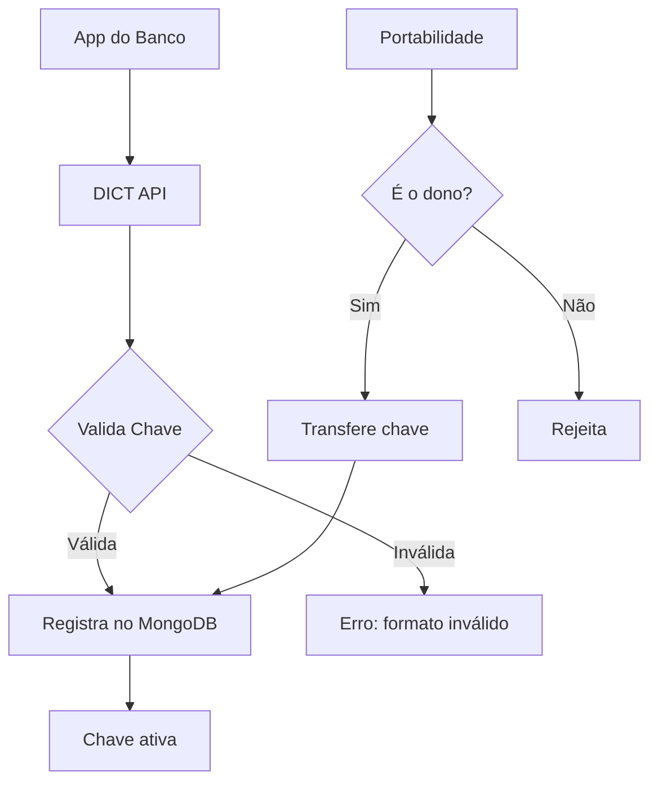

# 03 — DICT Simulator

**🇧🇷** Simulador do Diretório de Identificadores de Contas Transacionais  
**🇬🇧** DICT (Directory of Transactional Account Identifiers) Simulator

---

Você tem um CPF. Esse CPF é uma chave Pix. Mas como o sistema sabe que aquele CPF é seu e não do vizinho?

A resposta é o DICT — Diretório de Identificadores de Contas Transacionais. É o sistema que o Banco Central criou pra gerenciar chaves Pix. Ele armazena a relação entre chaves (CPF, CNPJ, email, telefone, ou chave aleatória) e as contas bancárias associadas.

Sem DICT, você não teria como digitar um CPF e cair na conta certa. Seria como ter uma agenda telefônica sem nomes.

---

## A arquitetura



| Método | Rota | O que faz |
|--------|------|-----------|
| POST | `/keys` | Registra chave |
| GET | `/keys/:key` | Consulta chave |
| PATCH | `/keys/:key/claim` | Portabilidade |
| DELETE | `/keys/:key` | Remove chave |
| GET | `/accounts/:ispb/keys` | Chaves de uma conta |

---

## Resolução em TypeScript

### Validação de chave Pix

O primeiro problema: como validar cada tipo de chave?

```typescript
type PixKeyType = 'CPF' | 'CNPJ' | 'EMAIL' | 'PHONE' | 'RANDOM';

function normalizeKey(key: string, type: PixKeyType): string {
  switch (type) {
    case 'CPF':  return key.replace(/\D/g, '').padStart(11, '0');
    case 'CNPJ': return key.replace(/\D/g, '').padStart(14, '0');
    case 'EMAIL': return key.toLowerCase().trim();
    case 'PHONE': return '+55' + key.replace(/\D/g, '');
    case 'RANDOM': return key.toUpperCase().replace(/[^A-Z0-9]/g, '');
  }
}

function validateKey(key: string, type: PixKeyType) {
  const n = normalizeKey(key, type);
  
  switch (type) {
    case 'CPF':
      if (n.length !== 11) return false;
      return isValidCPF(n);
    case 'PHONE':
      if (!/^\+55\d{10,11}$/.test(n)) return false;
      break;
    case 'EMAIL':
      if (!/^[^\s@]+@[^\s@]+\.[^\s@]+$/.test(n)) return false;
      break;
    case 'RANDOM':
      if (n.length !== 32 || /[^A-Z0-9]/.test(n)) return false;
      break;
  }
  return true;
}
```

O algoritmo de validação de CPF parece mágica mas é matemática simples:

```typescript
function isValidCPF(cpf: string): boolean {
  if (/^(\d)\1+$/.test(cpf)) return false; // 111.111.111-11 é inválido
  
  let sum = 0;
  for (let i = 0; i < 9; i++) sum += parseInt(cpf[i]) * (10 - i);
  let d1 = (sum * 10) % 11;
  if (d1 === 10) d1 = 0;
  if (d1 !== parseInt(cpf[9])) return false;
  
  sum = 0;
  for (let i = 0; i < 10; i++) sum += parseInt(cpf[i]) * (11 - i);
  let d2 = (sum * 10) % 11;
  if (d2 === 10) d2 = 0;
  if (d2 !== parseInt(cpf[10])) return false;
  
  return true;
}
```

### Endpoint de registro

```typescript
import Fastify from 'fastify';

const app = Fastify();

app.post<{ Body: DictKeyRequest }>('/api/v1/dict/keys', async (req, reply) => {
  const { type, value, account, owner } = req.body;
  
  if (!validateKey(value, type)) {
    return reply.status(422).send({ error: 'Formato de chave inválido' });
  }
  
  const normalized = normalizeKey(value, type);
  
  // Uma chave só pode pertencer a uma conta
  const exists = await db.collection('keys').findOne({ 
    type, key: normalized 
  });
  
  if (exists) {
    return reply.status(409).send({ error: 'Chave já registrada' });
  }
  
  const key = {
    _id: normalized,
    type,
    originalValue: value,
    status: 'ACTIVE',
    account,
    owner,
    claims: [],
    createdAt: new Date(),
  };
  
  await db.collection('keys').insertOne(key);
  
  return reply.status(201).send(key);
});
```

---

## Resolução em Go

Em Go a estrutura é parecida, mas a validação de CPF é mais explícita:

```go
package main

import (
    "net/http"
    "regexp"
    "github.com/gin-gonic/gin"
    "go.mongodb.org/mongo-driver/mongo"
)

type PixKey struct {
    Type    string `json:"type" binding:"required"`
    Value   string `json:"value" binding:"required"`
    Account struct {
        Ispb   string `json:"ispb"`
        Branch string `json:"branch"`
        Number string `json:"number"`
    } `json:"account" binding:"required"`
    Owner struct {
        Name     string `json:"name"`
        Document string `json:"document"`
    } `json:"owner" binding:"required"`
}

func isValidCPF(cpf string) bool {
    if len(cpf) != 11 {
        return false
    }
    
    // Check if all digits are the same
    allSame := true
    for i := 1; i < 11; i++ {
        if cpf[i] != cpf[0] {
            allSame = false
            break
        }
    }
    if allSame {
        return false
    }
    
    // First verification digit
    sum := 0
    for i := 0; i < 9; i++ {
        sum += int(cpf[i]-'0') * (10 - i)
    }
    d1 := (sum * 10) % 11
    if d1 == 10 { d1 = 0 }
    if d1 != int(cpf[9]-'0') {
        return false
    }
    
    // Second verification digit
    sum = 0
    for i := 0; i < 10; i++ {
        sum += int(cpf[i]-'0') * (11 - i)
    }
    d2 := (sum * 10) % 11
    if d2 == 10 { d2 = 0 }
    if d2 != int(cpf[10]-'0') {
        return false
    }
    
    return true
}

func normalizeCPF(value string) string {
    re := regexp.MustCompile(`\D`)
    cpf := re.ReplaceAllString(value, "")
    
    // Pad with leading zeros if needed
    for len(cpf) < 11 {
        cpf = "0" + cpf
    }
    
    return cpf
}

func main() {
    r := gin.Default()

    r.POST("/api/v1/dict/keys", func(c *gin.Context) {
        var req PixKey
        if err := c.ShouldBindJSON(&req); err != nil {
            c.JSON(400, gin.H{"error": err.Error()})
            return
        }

        switch req.Type {
        case "CPF":
            cpf := normalizeCPF(req.Value)
            if !isValidCPF(cpf) {
                c.JSON(422, gin.H{"error": "CPF inválido"})
                return
            }
            req.Value = cpf
        case "EMAIL":
            // Simple email validation
            matched, _ := regexp.MatchString(`^[^\s@]+@[^\s@]+\.[^\s@]+$`, req.Value)
            if !matched {
                c.JSON(422, gin.H{"error": "Email inválido"})
                return
            }
        case "PHONE":
            re := regexp.MustCompile(`\D`)
            phone := re.ReplaceAllString(req.Value, "")
            if len(phone) < 10 || len(phone) > 11 {
                c.JSON(422, gin.H{"error": "Telefone inválido"})
                return
            }
            req.Value = "+55" + phone
        }

        c.JSON(201, gin.H{
            "key":    req.Value,
            "type":   req.Type,
            "status": "ACTIVE",
            "account": req.Account,
            "owner":  req.Owner,
        })
    })

    r.Run(":3003")
}
```

A diferença principal: Go é mais verboso, mas o fluxo fica explícito. Não tem "mágica" de runtime. O que você lê é o que executa.

---

## Como testar

```bash
# TypeScript
pnpm --filter @banking/dict-simulator dev
curl -X POST http://localhost:3003/api/v1/dict/keys \
  -H "Content-Type: application/json" \
  -d '{"type":"CPF","value":"529.982.247-25","account":{"ispb":"12345678","branch":"0001","number":"12345-6"},"owner":{"name":"João","document":"52998224725"}}'

# Go
cd packages/backend/dict-simulator-go
go run .
curl localhost:3003/api/v1/dict/keys ...
```

---

## Lições aprendidas

1. **Validação de chave Pix não é trivial** — CPF tem dígito verificador, email tem regex, telefone tem +55. Cada tipo tem sua regra.
2. **Normalização é rei** — "123.456.789-00" e "12345678900" são o mesmo CPF. O DICT precisa normalizar antes de salvar.
3. **Portabilidade é o pesadelo** — Transferir chave entre bancos envolve notificação, confirmação em até 7 dias, e expiry. É um estado machine por si só.
4. **Concorrência** — Duas requisições simultâneas podem registrar a mesma chave. Precisa de índice único ou lock.
