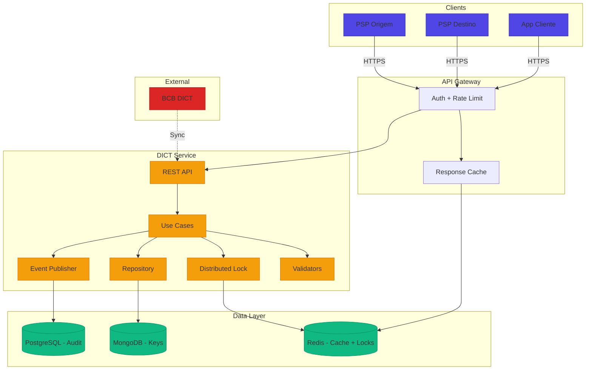
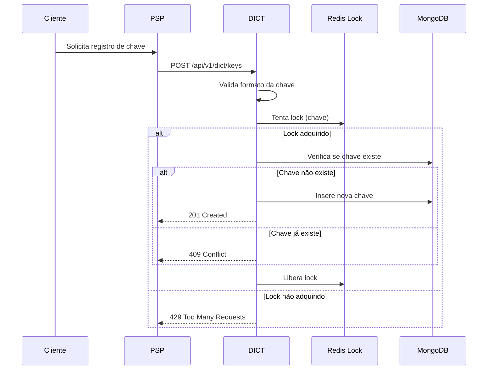
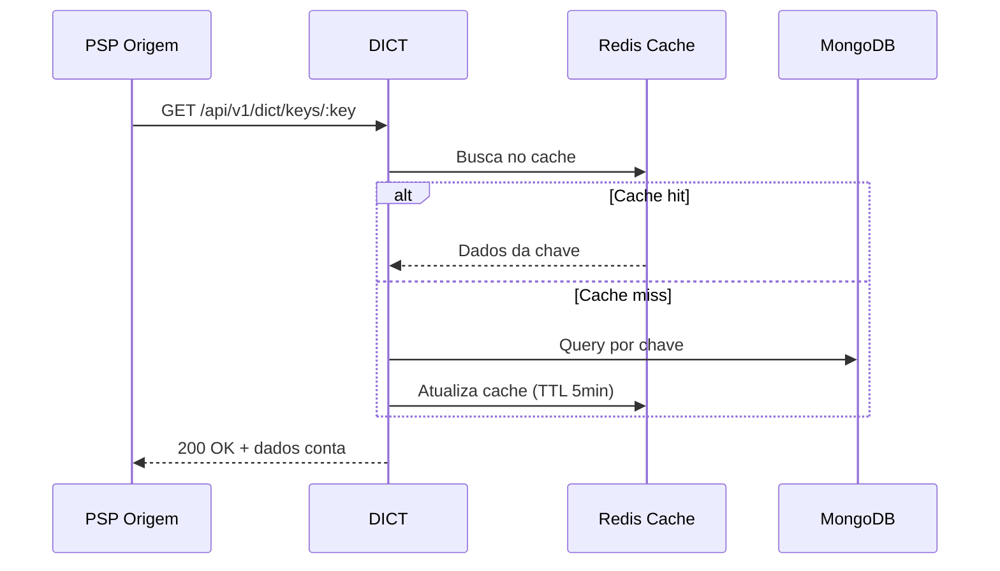
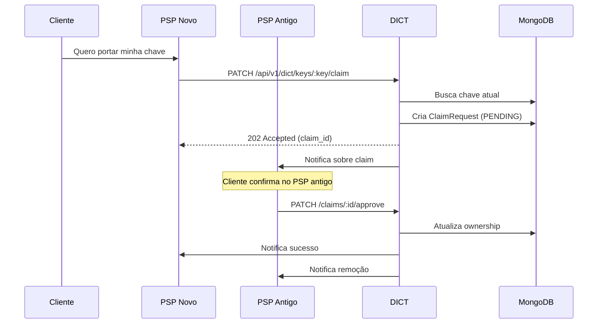
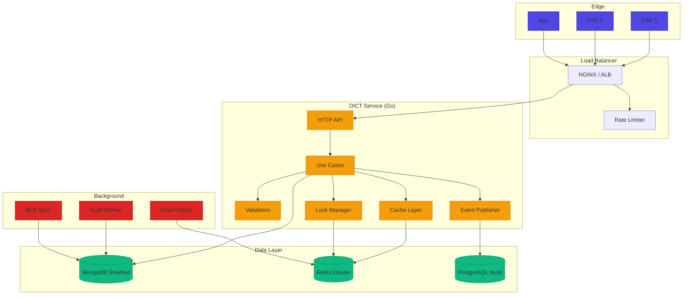

# Desafio 03: DICT — Diretório de Identificadores de Contas Transacionais

**🇧🇷** Diretório de Identificadores de Contas Transacionais  
**🇬🇧** Directory of Transactional Account Identifiers

---

## 🎯 Objetivos de Aprendizado

- Implementar um diretório de chaves PIX com validação de tipos (CPF, CNPJ, e-mail, telefone, aleatória)
- Dominar locks distribuídos com Redis para evitar race conditions em registro e portabilidade
- Projetar anti-enumeration contra varredura de chaves por instituições financeiras
- Implementar cache com invalidação inteligente para reconciliação de ownership
- Gerenciar portabilidade (claim) de chaves entre PSPs com expiração e notificação

---

## 📋 Pré-requisitos

### 🧠 Conceitos
- DICT (Diretório de Identificadores de Contas Transacionais)
- Tipos de chave PIX (CPF, e-mail, telefone, aleatória)
- Consistência eventual vs forte
- Cache distribuído

### 📚 Desafios Anteriores
- [Desafio 02: SPI](/challenges/02-spi) — o SPI consulta o DICT para resolver chaves PIX

### 🛠️ Ferramentas
- Docker
- Redis (cache + lock distribuído)
- PostgreSQL

### 💻 Técnico
- TypeScript
- Node.js 20+
- Padrão Repository
- Redlock (lock distribuído)
- REST APIs

---

## 📖 Abertura — O Que é o DICT?

"Olha, você já parou pra pensar como o PIX sabe pra onde mandar o dinheiro quando você digita só um CPF? Não é mágica. É o **DICT** — Diretório de Identificadores de Contas Transacionais. A agenda telefônica do PIX.

Antes do PIX, em 2019, cada banco tinha seu próprio sistema de transferência. TED, DOC, cada um com sua regra. Se você queria mandar dinheiro, precisava saber o banco, agência, conta — uma penca de informação. O Pix veio pra simplificar: CPF, e-mail, telefone. Só que isso criou um problema novo — **quem mantém o mapa entre chave e conta?**

A resposta é o DICT, operado pelo Banco Central. Ele é o árbitro central que diz: 'essa chave pertence a essa conta nesse banco'. Sem ele, o Pix não funciona. Cada consulta de chave passa por ele. Cada registro de chave nova passa por ele. Cada portabilidade de chave entre bancos passa por ele.

E sim, ele precisa ser **rápido** (consultas em milissegundos), **consistente** (uma chave = uma conta) e **seguro** (ninguém pode varrer o diretório pra descobrir CPFs válidos).

Mas de onde veio essa ideia? O DICT foi desenhado pelo Banco Central ainda em 2018, durante a gestão Ilan Goldfajn, como parte do projeto-piloto que viraria o PIX. O BCB sabia que o maior gargalo das transferências brasileiras não era a liquidação — era a **identificação do destinatário**. TED e DOC exigiam agência, conta, CPF e tipo de conta. Cada campo era uma chance de erro. O índice de devolução por dados incorretos passava de 20% em algumas modalidades.

A inspiração veio de três fontes. Primeiro, o **UPI indiano** (Unified Payments Interface), que já operava com Virtual Payment Addresses — identificadores como `usuario@banco` que substituíam os dados bancários. Segundo, o **PayID australiano**, que mapeava números de telefone e e-mails para contas bancárias através de um diretório central operado pela NPP Australia. Terceiro, o **Zelle americano**, que embora use e-mail/telefone como proxy, depende de parcerias bilaterais entre bancos — sem um diretório centralizado, o que limita a interoperabilidade.

A diferença fundamental do DICT brasileiro é que ele é **obrigatório e centralizado**. Todo banco, fintech e cooperativa é obrigado a participar. O BCB opera o diretório e dita as regras. Isso significa que uma chave registrada no Nubank pode ser consultada por uma transferência iniciada no Itaú, no PicPay ou no Mercado Pago. Nos EUA, o Zelle funciona por consórcio — alguns bancos participam, outros não. Na Índia, o UPI é interoperável mas o diretório de VPAs é fragmentado entre bancos. O DICT é o único que combina **obrigatoriedade legal** com **centralização técnica**.

E com grande poder vêm grandes problemas. Em 2021, menos de um ano após o lançamento do PIX, o Brasil viu uma explosão de fraudes envolvendo chaves PIX. O golpe mais comum era o **sequestro de chave por engenharia social**: o criminoso ligava para a vítima se passando pelo gerente do banco, pedia a confirmação de dados e iniciava um claim de portabilidade para roubar a chave. Em 2022, o BCB apertou as regras: claims agora exigem confirmação ativa do cliente no banco de origem, e o prazo de expiração foi reduzido de 30 para 7 dias.

Outro vetor de ataque é o **key enumeration**. Um banco mal-intencionado pode usar o DICT como um "Catálogo de clientes da concorrência". Ao consultar CPFs sequenciais e analisar quais retornam dados, é possível mapear a base de clientes de qualquer instituição financeira. Isso é ilegal mas tecnicamente viável sem as proteções adequadas. O BCB respondeu com três camadas de defesa: rate limiting por ISPB, masking de dados sensíveis (CPF e número de conta nunca são retornados completos), e detecção de padrões anômalos de consulta.

Esse desafio é sobre construir um **simulador de DICT** — não o real do BCB, porque esse é closed-source, mas um que implementa todas as regras de negócio: tipos de chave, validação, locks, claims, anti-enumeration, cache. O coração do Pix. Se você errar aqui, a culpa não é do framework — é grana indo pro lugar errado."

---

## 🔥 O Problema

Imagine que você está construindo o DICT de um banco digital que precisa se integrar ao PIX. No começo, parece simples:

```
POST /api/v1/dict/keys    → Registra uma chave
GET  /api/v1/dict/keys/:key → Consulta uma chave
```

Só que o diabo está nos detalhes:

1. **Race condition em registro** — Duas requisições simultâneas tentam registrar o mesmo CPF. Sem lock, as duas passam e você tem uma chave duplicada. O BCB multa seu banco.

2. **Portabilidade com concorrência** — O cliente inicia um claim numa sexta-feira. Durante o fim de semana, outro banco tenta outro claim. Quem ganha? Como evitar que uma chave seja portada duas vezes?

3. **Anti-enumeration** — Um banco malicioso faz consultas sequenciais de CPF (`000.000.001-00`, `000.000.002-00`...) pra descobrir quais são válidos. Você precisa detectar e bloquear isso sem afetar consultas legítimas.

4. **Cache vs consistência** — Chave foi portada, mas seu cache ainda aponta pro banco antigo. Dinheiro vai pro lugar errado. Cache precisa invalidar, mas não pode matar a performance.

Cada um desses problemas exige solução: **locks distribuídos com Redis**, **rate limiting por ISPB**, **detecção de padrões anômalos**, **cache com TTL atrelado ao ciclo de vida da chave**.

Mas o problema mais insidioso vai além das race conditions óbvias. É o **custo do cache inconsistente em produção**. Pense comigo: o PSP de origem consulta o DICT, recebe os dados da conta de destino, e inicia a transferência. Entre a consulta e a liquidação, passam-se de 2 a 10 segundos. Se nesse intervalo a chave foi portada para outro banco, o cache ainda aponta para o banco antigo. Resultado: o dinheiro vai para a conta errada. Não é um erro de sistema — é uma janela temporal real. E o pior: o BCB responsabiliza o PSP de origem pela liquidação incorreta, mesmo que o erro tenha sido causado por um cache desatualizado que ele não controla.

O anti-enumeration também esconde uma camada mais profunda de privacidade. O problema não é só "Descobrir quem é cliente de quem" — é a **re-identificação cruzada**. Se eu combino os dados do DICT (sei que o CPF X está no banco Y, sei o número de conta parcial Z) com vazamentos públicos (Serasa, LinkedIn, dados eleitorais), consigo montar um perfil financeiro completo de qualquer pessoa. A LGPD brasileira e o sigilo bancário tornam isso crime, mas a arquitetura precisa ser defensiva por padrão. O masking de dados não é cosmético — é uma exigência legal que, se violada, gera multa do BCB e ação do Ministério Público.

Por fim, há a **portabilidade com concorrência e expiração simultânea**. O claim tem 7 dias para ser aprovado pelo PSP de origem. Mas o que acontece se, no dia 6, o cliente perde o acesso ao banco antigo? Ou se o banco antigo sofre uma queda e não consegue responder à notificação? O sistema precisa de um mecanismo de fallback: passados os 7 dias, o claim expira automaticamente e a chave volta ao estado anterior. Isso exige um worker de limpeza confiável, que rode periodicamente e não dependa de triggers do banco de dados (porque triggers não escalam bem em sistemas distribuídos).

---

## 🏗️ Arquitetura Geral

<LanguageToggle />

<div class="Lang-content ts" style="Display:block;">

### Visão Macro



### Stack

Express/koa, Mongoose, `ioredis`, `zod`. Node.js 22, Redis 7, MongoDB 7 (Replica Set).

> **Por que Zod para validação?** — As regras de validação de chave PIX são complexas: dígito verificador de CPF (2 etapas), CNPJ (pesos variáveis), regex de e-mail (RFC 5322 com limite de 77 chars), formato telefônico brasileiro. Zod permite compor essas validações com tipagem inferida automaticamente — o mesmo schema que valida na edge também gera o tipo TypeScript. Zero duplicação.

### Tipos de Chave

| Tipo | Formato | Validação |
|------|---------|-----------|
| **CPF** | 11 dígitos | Dígito verificador (2 etapas) |
| **CNPJ** | 14 dígitos | Dígito verificador (pesos variáveis) |
| **E-mail** | RFC 5322 | Regex + limite 77 caracteres |
| **Telefone** | +55 XX XXXXX-XXXX | DDD + 9 dígitos |
| **Aleatória** | UUID v4 | Regex UUID |

### Características

| Característica | Descrição |
|----------------|-----------|
| **Ownership** | Uma chave = uma conta (única) |
| **Portabilidade** | Cliente pode mover chave entre bancos |
| **Anti-enumeration** | Proteção contra varreduras |
| **Rate limiting** | Limites por instituição |

### Fluxo de Registro



### Fluxo de Consulta



### Fluxo de Portabilidade (Claim)



---

## 👨‍💻 Mão na Massa

"Bora codar. O bagulho é o seguinte: o DICT parece só um CRUD de chaves, mas a real é que cada operação tem uma constraint de concorrência fudida. Registro precisa de lock distribuído, claim precisa de lock + expiry, consulta precisa de cache + anti-enumeration.

Vou te mostrar como implementar cada peça."

### Modelo de Dados — PixKey

```typescript
export enum PixKeyType {
  CPF = 'CPF',
  CNPJ = 'CNPJ',
  EMAIL = 'EMAIL',
  PHONE = 'PHONE',
  RANDOM = 'RANDOM'
}

export class PixKey extends Entity<string> {
  public static create(props: PixKeyProps): Result<PixKey, Error> {
    const validation = PixKey.validate(props);
    if (validation.isErr()) return Err(validation.error);

    return Ok(new PixKey({
      ...props,
      id: props.id || uuidv4(),
      createdAt: props.createdAt || new Date(),
      active: props.active ?? true,
    }));
  }

  public static createRandom(account: AccountInfo, owner: OwnerInfo): Result<PixKey, Error> {
    return PixKey.create({
      type: PixKeyType.RANDOM,
      value: uuidv4(),
      account, owner,
      ispb: account.ispb,
      createdAt: new Date(),
      active: true,
    });
  }

  public transferTo(newAccount: AccountInfo): Result<PixKey, Error> {
    if (!this.props.active) return Err(new Error('Chave inativa'));
    return Ok(new PixKey({
      ...this.props,
      account: newAccount,
      ispb: newAccount.ispb,
      updatedAt: new Date(),
    }));
  }
}
```

**Três decisões de design:**

- **`PixKey` como Value Object imutável** — Cada operação cria uma nova instância. `transferTo` não modifica a atual, retorna uma nova com ownership alterado. Isso dá audit trail natural: cada versão da chave é um snapshot.

- **`createRandom` separado** — Chave aleatória tem regra própria: o valor é gerado pelo sistema (UUID v4), não pelo usuário. Separar no construnto deixa explícito que o caller não escolhe o valor.

- **`active` como soft delete** — Chave nunca é realmente deletada. Desativação permite reconciliação e auditoria. O BCB exige.

### Validators — Validação de Cada Tipo

```typescript
export class CPFValidator implements KeyValidator {
  validate(value: string): ValidationResult {
    const cpf = value.replace(/\D/g, '');
    if (cpf.length !== 11) return { isValid: false, errorMessage: 'CPF deve ter 11 dígitos' };
    if (/^(\d)\1+$/.test(cpf)) return { isValid: false, errorMessage: 'CPF inválido' };
    if (!this.validateDigits(cpf)) return { isValid: false, errorMessage: 'CPF inválido' };
    return { isValid: true, normalizedValue: cpf };
  }

  private validateDigits(cpf: string): boolean {
    let sum = 0;
    for (let i = 0; i < 9; i++) sum += parseInt(cpf[i]) * (10 - i);
    let remainder = (sum * 10) % 11;
    if (remainder === 10) remainder = 0;
    if (remainder !== parseInt(cpf[9])) return false;

    sum = 0;
    for (let i = 0; i < 10; i++) sum += parseInt(cpf[i]) * (11 - i);
    remainder = (sum * 10) % 11;
    if (remainder === 10) remainder = 0;
    return remainder === parseInt(cpf[10]);
  }
}

export class CNPJValidator implements KeyValidator {
  validate(value: string): ValidationResult {
    const cnpj = value.replace(/\D/g, '');
    if (cnpj.length !== 14) return { isValid: false, errorMessage: 'CNPJ deve ter 14 dígitos' };
    if (/^(\d)\1+$/.test(cnpj)) return { isValid: false, errorMessage: 'CNPJ inválido' };
    if (!this.validateDigits(cnpj)) return { isValid: false, errorMessage: 'CNPJ inválido' };
    return { isValid: true, normalizedValue: cnpj };
  }

  private validateDigits(cnpj: string): boolean {
    const weights1 = [5, 4, 3, 2, 9, 8, 7, 6, 5, 4, 3, 2];
    const weights2 = [6, 5, 4, 3, 2, 9, 8, 7, 6, 5, 4, 3, 2];

    let sum = 0;
    for (let i = 0; i < 12; i++) sum += parseInt(cnpj[i]) * weights1[i];
    let remainder = sum % 11;
    let digit1 = remainder < 2 ? 0 : 11 - remainder;
    if (digit1 !== parseInt(cnpj[12])) return false;

    sum = 0;
    for (let i = 0; i < 13; i++) sum += parseInt(cnpj[i]) * weights2[i];
    remainder = sum % 11;
    let digit2 = remainder < 2 ? 0 : 11 - remainder;
    return digit2 === parseInt(cnpj[13]);
  }
}

export class KeyValidatorFactory {
  static create(type: PixKeyType): KeyValidator {
    switch (type) {
      case PixKeyType.CPF: return new CPFValidator();
      case PixKeyType.CNPJ: return new CNPJValidator();
      case PixKeyType.EMAIL: return new EmailValidator();
      case PixKeyType.PHONE: return new PhoneValidator();
      case PixKeyType.RANDOM: return new RandomKeyValidator();
    }
  }
}
```

**Por que a validação de CPF/CNPJ é feita na mão e não com regex?** — Regex não valida dígito verificador. O CPF `111.111.111-11` passa em qualquer regex de 11 dígitos, mas é inválido. A validação de CPF tem dois algoritmos internos: o primeiro dígito verificador usa pesos 10-2, o segundo usa 11-2. CNPJ tem pesos diferentes. É matemática, não pattern matching.

**E a validação de e-mail?** — O formato de e-mail é RFC 5322, mas o BCB limita a 77 caracteres. O validador normaliza pra minúsculo e aplica regex + length check. Detalhe: `user+tag@domain.com` é válido. Muita gente erra e bloqueia o `+`.

### Distributed Lock com Redis

```typescript
export class RedisDistributedLock implements DistributedLock {
  constructor(private readonly redis: Redis) {}

  async acquire(key: string, ttl: number): Promise<UnlockFn> {
    const acquired = await this.redis.set(`lock:${key}`, '1', 'PX', ttl, 'NX');
    if (!acquired) throw new Error('Lock não adquirido');

    return async () => { await this.redis.del(`lock:${key}`); };
  }

  async withLock<T>(key: string, ttl: number, fn: () => Promise<T>): Promise<T> {
    const unlock = await this.acquire(key, ttl);
    try { return await fn(); }
    finally { await unlock(); }
  }
}
```

**TTL é seu melhor amigo e pior inimigo.** Curto demais (1s) → lock expira antes da operação terminar. Longo demais (30s) → servidor cai e lock fica preso. O truque é usar TTL com margem: meça o P99 da operação e multiplique por 3. Se registro leva 2s no P99, TTL = 6s.

**E sobre o Redlock?** O algoritmo Redlock, proposto por Salvatore Sanfilippo (criador do Redis), tenta resolver o problema de locks em ambientes multi-master. A ideia é adquirir o lock em N instâncias de Redis independentes e considerar o lock válido se a maioria (N/2+1) responder positivamente. Na prática, o Redlock tem controvérsias: Martin Kleppmann demonstrou cenários onde o Redlock falha com GC pauses e clock skew. Para o DICT, **um único Redis com replicação assíncrona é suficiente** — o custo de um falso positivo no lock (dois registros passando) é mitigado pela unique index no MongoDB. O lock diminui a probabilidade de colisão, não a elimina. A unique index é a última linha de defesa.

**E por que Redis e não ZooKeeper ou etcd?** ZooKeeper e etcd implementam consenso distribuído (ZAB, Raft), o que garante linearidade nas operações de lock. Mas eles são pesados: exigem quórum mínimo de 3 nós, têm latência maior, e o modelo de sessão do ZooKeeper é complexo de depurar. Redis é eventualmente consistente, mas é rápido, simples de operar, e a maioria das fintechs brasileiras já tem Redis em produção para cache. O trade-off é aceitável: a probabilidade de um lock do Redis falhar simultaneamente com a unique index do MongoDB é desprezível.

### Use Case — Registro de Chave

```typescript
export class RegisterPixKeyUseCase {
  private static readonly MAX_KEYS_PER_PERSON = 5;

  constructor(
    private readonly pixKeyRepo: PixKeyRepository,
    private readonly lock: DistributedLock,
    private readonly eventPublisher: EventPublisher
  ) {}

  public async execute(input: RegisterPixKeyInput): Promise<Either<Error, PixKey>> {
    let value = input.value;
    if (input.type === PixKeyType.RANDOM) {
      value = crypto.randomUUID();
    } else if (!value) {
      return left(new Error('Valor é obrigatório'));
    }

    const validator = KeyValidatorFactory.create(input.type);
    const validation = validator.validate(value);
    if (!validation.isValid) return left(new Error(validation.errorMessage!));

    const unlock = await this.lock.acquire(`pix_key:${value}`, { ttl: 10000 });
    try {
      const existing = await this.pixKeyRepo.findByValue(value);
      if (existing) return left(new KeyAlreadyRegisteredError(value));

      const existingByOwner = await this.pixKeyRepo.findByOwnerDocument(owner.document);
      if (existingByOwner.length >= RegisterPixKeyUseCase.MAX_KEYS_PER_PERSON) {
        return left(new MaxKeysReachedError(owner.document));
      }

      const pixKey = PixKey.create({ type: input.type, value, account, owner, ispb: account.ispb });
      await this.pixKeyRepo.save(pixKey);

      await this.eventPublisher.publish('pix.key.registered', { keyId: pixKey.id, type: pixKey.type });
      return right(pixKey);
    } finally {
      await unlock();
    }
  }
}
```

**A sequência importa:** validação → lock → verificação → criação. Se você inverter lock e validação, um atacante pode fazer lock de uma chave inválida e causar negação de serviço. Se colocar a criação fora do lock, dois registros simultâneos criam duplicata. A ordem não é sugestão, é contrato.

### Use Case — Claim (Portabilidade)

```typescript
export class ClaimPixKeyUseCase {
  private static readonly CLAIM_EXPIRY_HOURS = 7 * 24;

  constructor(
    private readonly pixKeyRepo: PixKeyRepository,
    private readonly claimRepo: ClaimRepository,
    private readonly lock: DistributedLock,
    private readonly notificationService: NotificationService
  ) {}

  public async execute(input: ClaimPixKeyInput): Promise<Either<Error, ClaimPixKeyOutput>> {
    const unlock = await this.lock.acquire(`pix_key:${input.key}`, { ttl: 15000 });
    try {
      const currentKey = await this.pixKeyRepo.findByValue(input.key);
      if (!currentKey) return left(new KeyNotFoundError(input.key));

      if (currentKey.ispb === input.claimerIspb) {
        return left(new SamePSPError('Não é possível claim no mesmo PSP'));
      }

      const expiresAt = new Date();
      expiresAt.setHours(expiresAt.getHours() + ClaimPixKeyUseCase.CLAIM_EXPIRY_HOURS);

      const claim = {
        id: crypto.randomUUID(), key: input.key, currentIspb: currentKey.ispb,
        claimerIspb: input.claimerIspb, status: 'PENDING', expiresAt
      };
      await this.claimRepo.save(claim);

      await this.notificationService.notifyPSP(currentKey.ispb, {
        type: 'CLAIM_RECEIVED', claimId: claim.id
      });
      return right({ claimId: claim.id, status: 'PENDING', expiresAt });
    } finally {
      await unlock();
    }
  }
}
```

**O claim tem 7 dias pra ser aprovado.** Se expirar, o cliente precisa recomeçar. É uma operação assíncrona: o DICT registra a intenção (PENDING) e notifica o PSP atual. O PSP atual aprova ou rejeita. Só então o ownership muda. Isso evita sequestro de chave: ninguém rouba sua chave sem você saber.

Mas o protocolo de claim/confirm do DICT tem três fases e cada uma esconde uma armadilha:

**Fase 1 — Iniciação (PATCH /keys/:key/claim).** O PSP novo solicita o claim. O DICT verifica se a chave existe e se o PSP atual é diferente do solicitante. Cria um registro de ClaimRequest com status PENDING e prazo de 7 dias. Notifica o PSP antigo. O lock distribuído garante que dois PSPs não iniciem claims simultâneos na mesma chave.

**Fase 2 — Confirmação (PATCH /claims/:id/approve).** O PSP antigo, após validação com o cliente (geralmente via push notification no app), aprova o claim. O DICT então atualiza o ownership da chave: o campo `ispb` muda, os dados da conta são substituídos. O cache é invalidado. O PSP novo é notificado. Essa fase é síncrona e protegida por lock — ninguém pode aprovar um claim que já foi aprovado ou expirado.

**Fase 3 — Expiracão (automática, via worker).** Se nenhuma confirmação chega em 7 dias, o worker de limpeza marca o claim como EXPIRED. A chave permanece com o PSP original. O PSP solicitante é notificado. Isso impede que um claim "Fantasma" bloqueie a chave indefinidamente.

Agora, sobre **batch vs real-time na reconciliação**. O DICT real do BCB opera em tempo real: cada consulta, registro e claim é processado individualmente. Mas os PSPs frequentemente precisam de reconciliação periódica: a cada noite, o PSP baixa um arquivo de sincronização com todas as suas chaves e compara com seu banco local. Isso detecta divergências que passaram pelo real-time — por exemplo, se uma notificação de claim foi perdida por queda de rede. A reconciliação batch é uma rede de segurança, não uma alternativa ao real-time. No simulador, implementamos apenas o real-time, mas um `ReconciliationWorker` que lê todas as chaves de um ISPB e compara com o estado local é um próximo passo natural.

```typescript
export class AntiEnumerationService {
  public async analyzeQuery(
    ispb: string, ip: string, key: string, result: 'found' | 'not_found'
  ): Promise<SecurityAction> {
    const ispbCount = await this.redis.incr(`query:${ispb}:${hourKey}`);
    const ispbNotFound = result === 'not_found'
      ? await this.redis.incr(`notfound:${ispb}:${hourKey}`) : 0;

    const notFoundRate = ispbCount > 0 ? ispbNotFound / ispbCount : 0;

    if (notFoundRate > 0.9 && ispbCount > 100) {
      return SecurityAction.THROTTLE;
    }

    if (ispbCount > 5000) {
      return SecurityAction.BLOCK;
    }

    if (this.isSequentialCPF(key)) {
      return SecurityAction.BLOCK;
    }

    return SecurityAction.ALLOW;
  }
}
```

**Três indicadores de enumeração:**

1. **Taxa de "Não encontrado" > 90%** — Se você consulta 100 CPFs e 91 não existem, você está varrendo. O atacante não sabe quais CPFs são válidos, então a maioria das tentativas falha. Clientes legítimos (ex: uma empresa consultando seus próprios clientes) têm taxa de acerto alta.

2. **Volume absoluto > 5000 consultas/hora por ISPB** — Nenhuma instituição legítima precisa consultar 5000 chaves por hora de um único ISPB.

3. **CPFs sequenciais** — `000.000.001-00`, `000.000.002-00`... Ninguém consulta CPFs em ordem alfabética. Isso é varredura.

---

## 🧠 A Profundidade

### Por que Lock Distribuído e não Transação de Banco?

"E bom entender uma coisa. você pode olhar pro caso de uso de registro de chave e pensar: 'por que não usar uma unique index no MongoDB e deixar o banco resolver?' E você não estaria errado — em parte.

O índice único (`{ value: 1 }`) realmente impede chave duplicada no banco. Mas o problema não é o banco — é o **limite de 5 chaves por pessoa**. Pra validar isso, você precisa ler todas as chaves existentes de um CPF e contar. Entre essa leitura e a inserção, outra requisição pode inserir a sexta chave. O índice único não impede isso porque as chaves têm valores diferentes — o que é único é cada chave individual, não o conjunto por CPF.

O lock distribuído resolve: enquanto uma requisição está registrando, outra espera. Quando a segunda consegue o lock, a primeira já salvou. A segunda lê o CPF de novo, vê que já tem 5, e bloqueia.

E no claim? Mesma história. Dois claims simultâneos na mesma chave: o lock garante que apenas o primeiro cria o PENDING. O segundo descobre que já existe um claim ativo.

**Resumo:** transação de banco garante atomicidade de escrita. Lock distribuído garante **ordeamento de operações compostas** (read-then-write com regra de negócio).

### Cache — O Dilema da Portabilidade

O maior problema de cache no DICT é que **chaves mudam de dono**. Quando uma chave é portada do Banco A pro Banco B, o cache que diz "Chave X → Banco A" precisa ser invalidado. Se não for, o PIX manda dinheiro pro banco errado. Isso é **dinheiro perdido**.

A primeira abordagem é TTL curto (5 minutos). Mas isso significa que, em tese, você pode ter 5 minutos de dado desatualizado. O BCB não aceita.

A solução correta é **cache write-through invalidado no momento da portabilidade**:

```typescript
public async claim(input: ClaimPixKeyInput): Promise<Either<Error, ClaimPixKeyOutput>> {
  const unlock = await this.lock.acquire(`pix_key:${input.key}`, { ttl: 15000 });
  try {
    // ... lógica de claim ...
    await this.pixKeyRepo.save(key); // atualiza ownership no banco
    await this.cache.invalidate(`pix_key:${input.key}`); // invalida cache imediatamente
    // ... notifica PSPs ...
  }
}
```

**Cache write-through:** toda escrita no banco invalida o cache correspondente. A próxima leitura vai ao banco, encontra os dados novos e popula o cache de novo. O TTL existe só pra proteção contra falha — se a invalidação falhar (ex: Redis caiu), o cache eventualmente expira sozinho.

### Anti-Enumeration — Por que o BCB Leva Isso a Sério

Seu CPF é informação pública? Em teoria, sim. Toda nota fiscal tem seu CPF. Mas o problema não é "Descobrir CPFs existentes". É descobrir **em qual banco** cada CPF está.

Com o DICT, um banco malicioso pode fazer uma consulta e descobrir não só que o CPF existe, mas que a conta está no Banco X. Isso é informação valiosa: você sabe quem é cliente de quem. E se você é um banco, pode usar isso pra assediar os clientes da concorrência.

O BCB explicitamente proíbe isso. As respostas do DICT real são **homogêneas**: tanto "Chave não encontrada" quanto "Chave encontrada" retornam 200, só muda o payload. Mas o payload de "Chave encontrada" é mascarado — você nunca vê o CPF completo, só os dígitos parciais.

**O simulador implementa as três camadas:**

1. **Rate limiting** — Controle por ISPB, IP e endpoint
2. **Detecção de padrão** — CPFs sequenciais, alta taxa de "Não encontrado"
3. **Masking** — CPF retorna como `***.123.456-**`, número da conta mascarado

<Checkpoint question="Qual a diferença entre consistência eventual e consistência forte no contexto do DICT?">
Consistência forte: após uma portabilidade de chave, toda consulta subsequente retorna o novo banco. O custo é latência (precisa esperar confirmação de todos os nós). Consistência eventual: o cache pode servir dados antigos por alguns segundos, mas eventualmente converge. O DICT do BCB usa consistência forte porque um PIX enviado para o banco errado não volta — o custo da inconsistência é altíssimo.
</Checkpoint>

### Consistência Eventual vs Forte no DICT

A grande pergunta de arquitetura do DICT é: **qual modelo de consistência adotar?** À primeira vista, parece óbvio que você quer consistência forte — afinal, estamos falando de dinheiro. Mas consistência forte tem um preço: latência. Cada consulta ao DICT precisa esperar a confirmação de quórum entre os nós do banco de dados. Se um nó está lento, todo mundo espera.

O DICT real do BCB resolve isso com uma abordagem híbrida. As **escritas** (registro, claim, portabilidade) são fortemente consistentes: usam quórum de maioria no banco de dados e lock distribuído para ordenação. Ninguém pode registrar uma chave que "Talvez exista". As **leituras** (consulta de chave) são eventualmente consistentes: podem ler de uma réplica ligeiramente atrasada, com a proteção adicional de que o cache pode estar alguns segundos desatualizado.

O truque está no **TTL do cache pós-escrita**. Quando uma chave é portada, o cache é invalidado imediatamente (write-through). Mas se a invalidação falhar (Redis caiu, rede particionou), o TTL do cache garante que em no máximo 5 minutos o dado antigo expira. É o princípio do **eventually consistent with bounded staleness**: você aceita que o cache pode estar errado, mas define um teto máximo para esse erro.

### Estratégias de Cache: Write-Through, Write-Back e Cache-Aside

No DICT, três estratégias de cache estão em jogo, cada uma com seu lugar:

**Cache-Aside (Lazy Loading).** A estratégia padrão para consultas. O fluxo é: tenta o cache primeiro; se houver cache miss, busca no banco e popula o cache. A vantagem é que só dados realmente consultados entram no cache (cache sob demanda). A desvantagem é o **thundering herd**: se uma chave popular expira, centenas de consultas simultâneas vão todas ao banco ao mesmo tempo. Solução: lock de cache miss — a primeira requisição adquire um lock, busca no banco, popula o cache; as demais esperam e então leem do cache.

**Write-Through.** Usada no claim/portabilidade. Toda vez que o banco é atualizado, o cache correspondente é invalidado ou atualizado sincronamente. A vantagem é que o cache nunca fica desatualizado após uma escrita confirmada. A desvantagem é que escritas ficam mais lentas (precisam esperar a invalidação do cache). Para o DICT, isso é aceitável porque escritas são raras (registro e claim) comparadas com leituras (consulta).

**Write-Behind (Write-Back).** A estratégia oposta: escreve no cache primeiro e, assincronamente, persiste no banco. Mais rápida para escritas, mas perigosa: se o Redis cair antes da persistência assíncrona, você perde dados. O DICT **não usa write-behind para dados críticos** — registro de chave e claim vão direto ao MongoDB. Write-behind é reservado para contadores de rate limiting e métricas, onde a perda de alguns segundos de dados não é catastrófica.

### O Papel do Redis no DICT

O Redis desempenha **quatro papéis distintos** no DICT, e confundi-los é uma fonte comum de bugs:

1. **Cache de consultas.** A camada mais óbvia. Chaves PIX são cacheadas com TTL de 5 minutos. Isso reduz a carga no MongoDB em 90-95% para leituras. O cache é populado na primeira consulta e invalidado em toda escrita (write-through) e por expiração natural (TTL).

2. **Lock distribuído.** Usando `SET key value NX PX ttl`. Garante ordenação de operações concorrentes — duas goroutines não registram a mesma chave, duas não fazem claim simultâneo. O lock é por chave (granularidade fina), não global — um lock global serializaria todas as operações e mataria o throughput.

3. **Rate limiting.** Contadores por ISPB e por endpoint usando `INCR` com TTL de janela (1 minuto, 1 hora). Implementado como sliding window: a cada consulta, incrementa o contador da janela atual; se ultrapassar o limite, bloqueia. Esses contadores são efêmeros — se o Redis perder os dados, o rate limit é resetado, o que é um fail-open aceitável.

4. **Detecção de anti-enumeration.** Contadores separados para "Total de consultas" e "Consultas com resultado não encontrado". A razão entre os dois (`notFound / total`) é o sinal: se > 90%, o ISPB está varrendo CPFs. Esses contadores têm janela de 1 hora e são resetados automaticamente.

Um erro comum é usar a mesma instância de Redis para cache e locks. O ideal é separar: um Redis Cluster para cache (onde perda de dados é aceitável, fail-open) e um Redis Sentinel para locks (onde você precisa de maior garantia de durabilidade). No simulador usamos uma única instância por simplicidade, mas em produção isso é inaceitável.

---

## 🧪 Testando Concorrência

"O DICT é um sistema onde concorrência mal tratada vira dinheiro perdido ou chave sequestrada. Vou te mostrar os testes que salvam seu fim de semana."

### Registro Concorrente da Mesma Chave

```typescript
it('should not register the same key twice concurrently', async () => {
  const promises = Array.from({ length: 5 }, () =>
    registerPixKeyUseCase.execute({
      type: PixKeyType.CPF,
      value: '12345678901',
      account: validAccount,
      owner: validOwner,
    }).catch(() => null)
  );

  const results = await Promise.all(promises);
  const successful = results.filter(r => r !== null && r.isRight());
  expect(successful.length).toBe(1); // só UM deve registrar
});
```

### Limite de Chaves com Race Condition

```typescript
it('should enforce max 5 keys per person under concurrent registration', async () => {
  const promises = Array.from({ length: 10 }, (_, i) =>
    registerPixKeyUseCase.execute({
      type: PixKeyType.EMAIL,
      value: `user${i}@email.com`,
      account: validAccount,
      owner: { document: '12345678901', name: 'João' },
    }).catch(() => null)
  );

  const results = await Promise.all(promises);
  const successful = results.filter(r => r !== null && r.isRight());
  expect(successful.length).toBeLessThanOrEqual(5); // no máximo 5
});
```

### Claim Duplicado na Mesma Chave

```typescript
it('should reject concurrent claims on the same key', async () => {
  const promises = Array.from({ length: 3 }, () =>
    claimPixKeyUseCase.execute({
      key: '12345678901',
      claimerIspb: '87654321',
    }).catch(() => null)
  );

  const results = await Promise.all(promises);
  const successful = results.filter(r => r !== null && r.isRight());
  expect(successful.length).toBe(1); // só UM claim
});
```

### Cache Invalidation Race

```typescript
it('should invalidate cache after claim completes', async () => {
  // Registra chave no PSP A
  await registerPixKeyUseCase.execute({
    type: PixKeyType.CPF, value: '12345678901',
    account: { ispb: '12345678', branch: '0001', number: '12345', type: 'CACC' },
    owner: { document: '12345678901', name: 'João' },
  });

  // Consulta (popula cache)
  await queryPixKeyUseCase.execute('12345678901', '12345678');

  // Claim para PSP B
  await claimPixKeyUseCase.execute({
    key: '12345678901', claimerIspb: '87654321',
  });

  // Verifica se cache foi invalidado
  const result = await queryPixKeyUseCase.execute('12345678901', '87654321');
  expect(result.account.ispb).toBe('87654321'); // ISP B, não A
});
```

---

## 💡 Lições Aprendidas

1. **Uma chave = uma conta.** Invariante sagrado do DICT. Quebre isso e o PIX manda dinheiro pro lugar errado. A unique index no banco é a última linha de defesa; o lock distribuído é a primeira. Se as duas falharem simultaneamente, você tem um incidente nível BCB.

2. **Anti-enumeration não é opcional.** Proteção contra varredura de CPFs por outros bancos. Sem isso, você expõe sua base de clientes e comete violação de sigilo bancário. As três camadas (rate limiting, detecção de padrão, masking) precisam operar em conjunto — uma só não basta.

3. **Locks distribuídos são obrigatórios.** Race conditions em registro e claim corrompem ownership. Índice único do MongoDB não resolve o limite de 5 chaves por pessoa. O lock é a única forma de garantir atomicidade em operações compostas de read-then-write com regra de negócio.

4. **Masking de dados.** CPF, CNPJ e número de conta nunca são retornados completos. Só os dígitos parciais. Isso não é UX, é exigência regulatória. Retornar um CPF completo em uma resposta de API é passível de multa pelo BCB.

5. **Cache write-through com invalidação na portabilidade.** TTL curto não é suficiente quando uma chave muda de banco. Invalide no momento do claim. Se a invalidação falhar, o TTL é a rede de segurança — mas nunca a solução primária.

6. **Auditoria de tudo.** Cada consulta ao DICT deve ser logada — quem consultou, qual chave, quando, de qual IP, com qual resultado. Se o BCB questionar, você precisa provar. PostgreSQL com particionamento por mês é a escolha padrão: os dados de auditoria crescem rápido e você precisa conseguir dropar partições antigas.

7. **Limite de 5 chaves por pessoa.** Regra do BCB. Implemente no use case com lock distribuído. Sem lock, duas requisições simultâneas podem ver 4 chaves cada e ambas tentarem criar a quinta — resultando em 6 ou mais. O lock fecha a janela entre a leitura da contagem e a inserção.

8. **Claim expira em 7 dias.** Se o cliente não confirmar no PSP antigo, o claim expira. Implemente um worker de limpeza. O worker precisa ser idempotente (rodar duas vezes não pode expirar o mesmo claim duas vezes) e tolerante a falhas (se o worker cair no meio, na próxima execução ele continua de onde parou).

9. **CPF/CNPJ se valida com matemática, não regex.** Dígito verificador exige algoritmo específico com pesos variáveis. Regex só valida formato, não conteúdo. Um CPF `111.111.111-11` passa em qualquer regex mas é matematicamente inválido.

10. **Respostas homogêneas contra enumeração.** Não retorne 404 para chave não encontrada e 200 para chave encontrada. Retorne sempre 200, com payload diferente mas semanticamente indistinguível para um atacante. O tempo de resposta também deve ser constante — se "Chave encontrada" é mais rápido que "Chave não encontrada", o atacante mede a latência e descobre.

11. **Redis não é banco de dados.** Dados em Redis são efêmeros. Se o Redis cair, você perde o cache e os rate limit counters — mas não pode perder chaves PIX. A fonte da verdade é o MongoDB (ou PostgreSQL). Redis é aceleração e coordenação, nunca persistência primária.

12. **Sincronização com o DICT real é obrigatória.** Em produção, o simulador se conecta ao DICT do BCB via API para sincronizar chaves. Mas a conexão pode cair. Você precisa de um mecanismo de reconciliação offline: baixar arquivos de sincronização, comparar com o estado local, resolver conflitos com timestamp (a versão mais recente vence).

13. **Locks têm dono.** Um lock adquirido pelo servidor A não pode ser liberado pelo servidor B. Se o servidor A cai e o lock expira, B pode adquirir. Mas B nunca deve liberar o lock de A ativamente. Use um token único (UUID) como valor do lock no Redis e só libere se o valor bater. O Redis `DEL` sem verificação de ownership é uma das causas mais comuns de race condition em produção.

14. **O DICT é o coração do Pix, mas não o cérebro.** O DICT resolve o problema de descoberta (que chave pertence a qual conta em qual banco). A liquidação financeira acontece no SPI (Sistema de Pagamentos Instantâneos), que é outro sistema. Não confunda os dois. O DICT é consultado antes da transferência; o SPI efetiva a transferência. Se o DICT errar o destino, o SPI manda o dinheiro para o lugar errado e ninguém desfaz.

---

## 🚀 Como Testar na Prática

```bash
# Sobe a infra
make infra-up

# Inicia o servidor DICT
pnpm --filter @banking/dict dev

# Registrar chave CPF
curl -X POST http://localhost:3003/api/v1/dict/keys \
  -H "Content-Type: application/json" \
  -d '{"Type":"CPF","Value":"12345678901","Account":{"Ispb":"12345678","Branch":"0001","Number":"12345","Type":"CACC"},"Owner":{"Name":"João","Document":"12345678901"}}'

# Consultar chave
curl http://localhost:3003/api/v1/dict/keys/12345678901 \
  -H "X-ISPB: 12345678"

# Tentar registrar chave duplicada (deve retornar 409)
curl -X POST http://localhost:3003/api/v1/dict/keys \
  -H "Content-Type: application/json" \
  -d '{"Type":"CPF","Value":"12345678901","Account":{"Ispb":"87654321","Branch":"0001","Number":"67890","Type":"CACC"},"Owner":{"Name":"Maria","Document":"12345678901"}}'

# Registrar chave aleatória
curl -X POST http://localhost:3003/api/v1/dict/keys \
  -H "Content-Type: application/json" \
  -d '{"Type":"RANDOM","Value":"","Account":{"Ispb":"12345678","Branch":"0001","Number":"12345","Type":"CACC"},"Owner":{"Name":"João","Document":"12345678901"}}'
```

Para rodar os testes de concorrência:

```bash
docker run -d --name dict-mongo-test -p 27017:27017 mongo:7 --replSet rs0
docker exec dict-mongo-test mongosh --eval "Rs.initiate()"
docker run -d --name dict-redis-test -p 6379:6379 redis:7
pnpm --filter @banking/dict test
```

---

## 🔧 Troubleshooting

### 1. Lock Redis expirou antes da operação terminar

**Causa:** TTL do lock muito curto para operações lentas (ex: claim com notificação externa).  
**Solução:** Use TTL com margem segura ou um lock com auto-renovação:

```typescript
export class RenewingLock {
  private renewalInterval: NodeJS.Timeout | null = null;

  async acquire(key: string, ttl: number): Promise<UnlockFn> {
    const acquired = await this.redis.set(`lock:${key}`, '1', 'PX', ttl, 'NX');
    if (!acquired) throw new Error('Lock não adquirido');

    // Renova a cada 1/3 do TTL
    this.renewalInterval = setInterval(async () => {
      await this.redis.pexpire(`lock:${key}`, ttl);
    }, ttl / 3);

    return async () => {
      if (this.renewalInterval) clearInterval(this.renewalInterval);
      await this.redis.del(`lock:${key}`);
    };
  }
}
```

### 2. Cache servindo dados obsoletos após claim

**Causa:** Cache não foi invalidado no momento da portabilidade.  
**Solução:** Write-through cache invalidation:

```typescript
async claimKey(key: string, newIspb: string): Promise<void> {
  const unlock = await this.lock.acquire(`pix_key:${key}`, 15000);
  try {
    const currentKey = await this.pixKeyRepo.findByValue(key);

    // Invalida cache ANTES de atualizar o banco
    await this.cache.invalidate(`pix_key:${key}`);

    // Atualiza ownership no banco
    const updated = currentKey.transferTo(newAccount);
    await this.pixKeyRepo.save(updated);

    // Re-popula cache com dados novos
    await this.cache.set(`pix_key:${key}`, updated, 300);
  } finally {
    await unlock();
  }
}
```

### 3. Anti-enumeration bloqueando consultas legítimas

**Causa:** Um cliente legítimo consulta muitos CPFs inválidos (ex: empresa fazendo validação de cadastro).  
**Solução:** Whitelist de ISPB confiáveis e reset periódico de contadores:

```typescript
const WHITELISTED_ISPBS = new Set(['00000000' /* BCB */, '12345678' /* Parceiro */]);

function shouldBlock(ispb: string, rate: number, count: number): boolean {
  if (WHITELISTED_ISPBS.has(ispb)) return false;
  if (rate > 0.9 && count > 100) return true;
  if (count > 5000) return true;
  return false;
}
```

### 4. Claim expirado nunca foi limpo

**Causa:** Worker de limpeza não foi implementado ou está com scheduler quebrado.  
**Solução:**

```typescript
export class ClaimExpiryWorker {
  async run(): Promise<void> {
    const expired = await this.claimRepo.findExpired();
    for (const claim of expired) {
      await this.claimRepo.updateStatus(claim.id, 'EXPIRED');
      await this.notificationService.notifyPSP(claim.claimerIspb, {
        type: 'CLAIM_EXPIRED', claimId: claim.id
      });
    }
  }
}

// Agenda a cada hora
setInterval(() => claimExpiryWorker.run(), 60 * 60 * 1000);
```

### 5. Rate limiting bloqueando o próprio banco

**Causa:** O ISPB do seu próprio banco está sendo rate-limited porque consultas internas (ex: validação de cadastro) estão contando contra o limite.  
**Solução:** Exclua o ISPB próprio e ISSBs de parceiros confiáveis do rate limiting. Use uma whitelist:

```typescript
const INTERNAL_ISPBS = new Set([
  process.env.OWN_ISPB,
  '00000000', // BCB
]);

function shouldRateLimit(ispb: string, endpoint: string): boolean {
  if (INTERNAL_ISPBS.has(ispb)) return false;
  return true;
}
```

### 6. CPF com máscara sendo rejeitado pela validação

**Causa:** O cliente envia o CPF com pontuação (`123.456.789-01`) mas o validador espera apenas dígitos. Ou pior: o cliente envia CPF com máscara parcial vinda de uma consulta anterior.  
**Solução:** Normalize sempre antes de validar. Remova todos os caracteres não-dígitos:

```typescript
function normalizeDocument(doc: string): string {
  return doc.replace(/\D/g, '');
}
```

### 7. Lock contention entre registro e claim na mesma chave

**Causa:** O registro e o claim usam a mesma chave de lock (`pix_key:{value}`). Se um cliente tenta registrar uma chave enquanto outro tenta fazer claim dela, um vai esperar o outro — mesmo sendo operações diferentes.

**Solução:** Use namespaces de lock diferentes para operações distintas:

```typescript
lockKey = `pix_key:register:${value}`; // para registro
lockKey = `pix_key:claim:${value}`;     // para claim
```

Mas cuidado: agora registro e claim podem ocorrer simultaneamente na mesma chave. A ordem importa: se o claim ganhar a corrida e portar a chave, o registro que chega depois deve ser rejeitado porque a chave já existe (agora em outro ISPB). Isso é resolvido na camada de aplicação, não no lock.

### 8. MongoDB replica set com split-brain

**Causa:** Em um replica set de 3 nós, dois nós se elegem primários simultaneamente devido a particionamento de rede. Ambos aceitam escritas. Quando a rede volta, um dos primários é forçado a dar rollback.

**Solução:** Use `writeConcern: 'majority'` em todas as escritas do DICT. Isso garante que a escrita só é confirmada quando a maioria dos nós a recebeu. Se houver split-brain, o nó que perdeu o quórum não consegue confirmar escritas — elas falham em vez de serem perdidas.

---

## 📚 O que vem depois

- **Reconciliação batch com o DICT real** — Sincronização periódica via arquivo de sincronização do BCB para detectar divergências entre o estado local e o diretório central. Implementar um ReconciliationWorker que baixa o arquivo, compara com o MongoDB, e gera relatório de discrepâncias. Divergências são resolvidas automaticamente (timestamp mais recente vence) ou escaladas para operação manual dependendo da criticidade.

- **Notificações via webhook** — PSPs registram um webhook URL para receber notificações de claim, expiração, desativação e reconciliação. Implementar fila de retry com exponential backoff: se o webhook do PSP falhar, o sistema retenta em 1min, 5min, 15min, 1h. Dead letter queue para notificações que falharam todas as tentativas.

- **Rate limiting por endpoint e por ISPB** — Limites separados para registro (100/min por ISPB), consulta (1000/min por ISPB) e claim (10/min por ISPB). Implementar sliding window com Redis sorted sets em vez de contadores simples — sorted sets permitem janelas de tempo precisas sem o problema de reset abrupto.

- **Testes de chaos engineering** — Simular queda do Redis durante um claim, queda do MongoDB durante um registro, latência de rede de 500ms entre o DICT e os PSPs, split-brain no replica set do MongoDB, GC pause de 5 segundos no Node.js. Cada cenário deve ter um teste automatizado e um runbook de recuperação.

- **Observabilidade completa** — Métricas de P50/P95/P99 por operação (register, query, claim), taxa de acerto de cache (hit rate), contagem de locks em contenção (contended locks), latência do Redis (p99), latência do MongoDB (p99), taxa de claims expirados vs aprovados, taxa de "Chave não encontrada" por ISPB (indicador de anti-enumeration). Exportar via Prometheus + Grafana dashboard.

- **Circuit breaker para dependências externas** — Se o Redis ficar indisponível, o DICT não pode cair junto. Implementar circuit breaker: após 5 falhas consecutivas no Redis, abrir o circuito e operar em modo degradado (sem cache, sem lock — risco de race condition mas sistema continua respondendo). Após 30 segundos, testar meia-abertura. Se o Redis voltou, fechar o circuito.

- **Multi-tenancy e isolamento entre PSPs** — Cada PSP deve ter credenciais próprias (API key ou mTLS) e só pode consultar/registrar chaves autorizadas. Implementar middleware de autenticação que extrai o ISPB do token JWT ou do certificado mTLS e injeta no contexto da requisição. Toda operação é auditada com o ISPB do caller.

- **Chaves aleatórias com prefixo de instituição** — No DICT real, chaves aleatórias são UUIDs, mas algumas instituições usam prefixos customizados (ex: `nubank-{uuid}`) para facilitar identificação visual. Implementar suporte a chave aleatória com prefixo opcional, validando que o prefixo não excede 16 caracteres e não contém caracteres especiais.

---

</div>

<div class="Lang-content go" style="Display:none;">

### Arquitetura DICT em Go



### Domain Layer

```go
package domain

import (
    "Errors"
    "Regexp"
    "Strings"
    "Time"
    "Github.com/google/uuid"
)

type PixKeyType string

const (
    KeyTypeCPF    PixKeyType = "CPF"
    KeyTypeCNPJ   PixKeyType = "CNPJ"
    KeyTypeEmail  PixKeyType = "EMAIL"
    KeyTypePhone  PixKeyType = "PHONE"
    KeyTypeRandom PixKeyType = "RANDOM"
)

type PixKey struct {
    ID        uuid.UUID
    Type      PixKeyType
    Value     string
    Account   AccountInfo
    Owner     OwnerInfo
    ISPB      string
    CreatedAt time.Time
    UpdatedAt time.Time
    Active    bool
}

var (
    ErrInvalidCPF       = errors.New("CPF inválido")
    ErrInvalidCNPJ      = errors.New("CNPJ inválido")
    ErrKeyAlreadyExists = errors.New("Chave já registrada")
    ErrMaxKeysReached   = errors.New("Limite de chaves por pessoa atingido")
    ErrKeyNotFound      = errors.New("Chave não encontrada")
    ErrSamePSP          = errors.New("Não é possível claim no mesmo PSP")
)

func NewPixKey(keyType PixKeyType, value string, account AccountInfo, owner OwnerInfo) (*PixKey, error) {
    if err := validateKey(keyType, value); err != nil {
        return nil, err
    }

    if keyType == KeyTypeRandom && value == "" {
        value = uuid.New().String()
    }

    return &PixKey{
        ID: uuid.New(), Type: keyType, Value: value,
        Account: account, Owner: owner, ISPB: account.ISPB,
        CreatedAt: time.Now(), UpdatedAt: time.Now(), Active: true,
    }, nil
}

func validateKey(keyType PixKeyType, value string) error {
    switch keyType {
    case KeyTypeCPF:    return validateCPF(value)
    case KeyTypeCNPJ:   return validateCNPJ(value)
    case KeyTypeEmail:  return validateEmail(value)
    case KeyTypePhone:  return validatePhone(value)
    case KeyTypeRandom: return validateRandomKey(value)
    default:            return errors.New("Tipo desconhecido")
    }
}

func validateCPF(cpf string) error {
    digits := normalizeDocument(cpf)
    if len(digits) != 11 { return ErrInvalidCPF }

    allSame := true
    for i := 1; i < len(digits); i++ {
        if digits[i] != digits[0] { allSame = false; break }
    }
    if allSame { return ErrInvalidCPF }
    if !validateCPFDigits(digits) { return ErrInvalidCPF }
    return nil
}

func validateCPFDigits(cpf string) bool {
    sum := 0
    for i := 0; i < 9; i++ { sum += int(cpf[i]-'0') * (10 - i) }
    remainder := (sum * 10) % 11
    if remainder == 10 { remainder = 0 }
    if remainder != int(cpf[9]-'0') { return false }

    sum = 0
    for i := 0; i < 10; i++ { sum += int(cpf[i]-'0') * (11 - i) }
    remainder = (sum * 10) % 11
    if remainder == 10 { remainder = 0 }
    return remainder == int(cpf[10]-'0')
}

func validateCNPJ(cnpj string) error {
    digits := normalizeDocument(cnpj)
    if len(digits) != 14 { return ErrInvalidCNPJ }

    allSame := true
    for i := 1; i < len(digits); i++ {
        if digits[i] != digits[0] { allSame = false; break }
    }
    if allSame { return ErrInvalidCNPJ }
    if !validateCNPJDigits(digits) { return ErrInvalidCNPJ }
    return nil
}

func validateCNPJDigits(cnpj string) bool {
    weights1 := []int{5, 4, 3, 2, 9, 8, 7, 6, 5, 4, 3, 2}
    weights2 := []int{6, 5, 4, 3, 2, 9, 8, 7, 6, 5, 4, 3, 2}

    sum := 0
    for i := 0; i < 12; i++ { sum += int(cnpj[i]-'0') * weights1[i] }
    remainder := sum % 11
    digit1 := 0
    if remainder >= 2 { digit1 = 11 - remainder }
    if digit1 != int(cnpj[12]-'0') { return false }

    sum = 0
    for i := 0; i < 13; i++ { sum += int(cnpj[i]-'0') * weights2[i] }
    remainder = sum % 11
    digit2 := 0
    if remainder >= 2 { digit2 = 11 - remainder }
    return digit2 == int(cnpj[13]-'0')
}

var emailRegex = regexp.MustCompile(`^[a-zA-Z0-9._%+\-]+@[a-zA-Z0-9.\-]+\.[a-zA-Z]{2,}$`)

func validateEmail(email string) error {
    e := strings.ToLower(strings.TrimSpace(email))
    if len(e) > 77 { return ErrInvalidEmail }
    if !emailRegex.MatchString(e) { return ErrInvalidEmail }
    return nil
}

var phoneRegex = regexp.MustCompile(`^\+?55\s?\(?\d{2}\)?\s?\d{4,5}-?\d{4}$`)

func validatePhone(phone string) error {
    digits := normalizeDocument(phone)
    if !strings.HasPrefix(digits, "55") { return ErrInvalidPhone }
    if len(digits) != 13 { return ErrInvalidPhone }
    return nil
}

var uuidRegex = regexp.MustCompile(`^[0-9a-f]{8}-[0-9a-f]{4}-4[0-9a-f]{3}-[89ab][0-9a-f]{3}-[0-9a-f]{12}$`)

func validateRandomKey(value string) error {
    if !uuidRegex.MatchString(strings.ToLower(value)) { return ErrInvalidRandomKey }
    return nil
}

func normalizeDocument(doc string) string {
    var result strings.Builder
    for _, r := range doc {
        if r >= '0' && r <= '9' { result.WriteRune(r) }
    }
    return result.String()
}
```

### Repository — MongoDB

```go
package repositories

import (
    "Context"
    "Time"
    "Go.mongodb.org/mongo-driver/bson"
    "Go.mongodb.org/mongo-driver/mongo"
    "Go.mongodb.org/mongo-driver/mongo/options"
    "Fintech/dict/domain"
)

type MongoPixKeyRepository struct {
    collection *mongo.Collection
}

func NewMongoPixKeyRepository(db *mongo.Database) (*MongoPixKeyRepository, error) {
    repo := &MongoPixKeyRepository{collection: db.Collection("Pix_keys")}
    if err := repo.createIndexes(context.Background()); err != nil {
        return nil, err
    }
    return repo, nil
}

func (r *MongoPixKeyRepository) createIndexes(ctx context.Context) error {
    indexes := []mongo.IndexModel{
        {Keys: bson.D{{Key: "Value", Value: 1}}, Options: options.Index().SetUnique(true)},
        {Keys: bson.D{{Key: "Ispb", Value: 1}, {Key: "Active", Value: 1}}},
        {Keys: bson.D{{Key: "Owner.document", Value: 1}, {Key: "Active", Value: 1}}},
    }
    _, err := r.collection.Indexes().CreateMany(ctx, indexes)
    return err
}

func (r *MongoPixKeyRepository) Save(ctx context.Context, key *domain.PixKey) error {
    doc := PixKeyDocument{
        ID: key.ID.String(), Type: key.Type, Value: key.Value,
        Account: AccountDocument{
            ISPB: key.Account.ISPB, Branch: key.Account.Branch,
            Number: key.Account.Number, Type: key.Account.Type,
        },
        Owner: OwnerDocument{Name: key.Owner.Name, Document: key.Owner.Document},
        ISPB: key.ISPB, CreatedAt: key.CreatedAt, UpdatedAt: key.UpdatedAt, Active: key.Active,
    }
    _, err := r.collection.InsertOne(ctx, doc)
    if mongo.IsDuplicateKeyError(err) { return domain.ErrKeyAlreadyExists }
    return err
}

func (r *MongoPixKeyRepository) FindByValue(ctx context.Context, value string) (*domain.PixKey, error) {
    var doc PixKeyDocument
    err := r.collection.FindOne(ctx, bson.M{"Value": value, "Active": true}).Decode(&doc)
    if err == mongo.ErrNoDocuments { return nil, nil }
    if err != nil { return nil, err }
    return toDomain(&doc), nil
}

func (r *MongoPixKeyRepository) FindByOwnerDocument(ctx context.Context, document string) ([]*domain.PixKey, error) {
    cursor, err := r.collection.Find(ctx, bson.M{"Owner.document": document, "Active": true})
    if err != nil { return nil, err }
    defer cursor.Close(ctx)

    var keys []*domain.PixKey
    for cursor.Next(ctx) {
        var doc PixKeyDocument
        if err := cursor.Decode(&doc); err != nil { return nil, err }
        keys = append(keys, toDomain(&doc))
    }
    return keys, nil
}
```

### Use Cases — Registro

```go
package usecase

import (
    "Context"
    "Errors"
    "Time"
    "Github.com/google/uuid"
    "Go.uber.org/zap"
    "Fintech/dict/domain"
)

type RegisterKeyUseCase struct {
    repo     *repositories.MongoPixKeyRepository
    lock     *locks.DistributedLock
    eventPub *events.Publisher
    logger   *zap.Logger
    maxKeys  int
}

func (uc *RegisterKeyUseCase) Execute(ctx context.Context, input RegisterKeyInput) (*RegisterKeyOutput, error) {
    value := input.Value
    if input.Type == domain.KeyTypeRandom {
        if value != "" { return nil, errors.New("Chave aleatória não deve ter valor") }
        value = uuid.New().String()
    } else if value == "" {
        return nil, errors.New("Valor é obrigatório")
    }

    lockKey := "Pix_key:" + value
    unlock, err := uc.lock.Acquire(ctx, lockKey, 10*time.Second)
    if err != nil { return nil, errors.New("Não foi possível adquirir lock") }
    defer unlock()

    existing, _ := uc.repo.FindByValue(ctx, value)
    if existing != nil { return nil, domain.ErrKeyAlreadyExists }

    existingByOwner, _ := uc.repo.FindByOwnerDocument(ctx, input.Owner.Document)
    if len(existingByOwner) >= uc.maxKeys { return nil, domain.ErrMaxKeysReached }

    key, err := domain.NewPixKey(input.Type, value, input.Account, input.Owner)
    if err != nil { return nil, err }

    if err := uc.repo.Save(ctx, key); err != nil { return nil, err }

    uc.eventPub.Publish(ctx, events.KeyRegistered{KeyID: key.ID.String(), Type: key.Type})
    return &RegisterKeyOutput{ID: key.ID.String(), Type: key.Type, Value: key.Value}, nil
}
```

### Use Cases — Claim (Portabilidade)

```go
type ClaimKeyUseCase struct {
    pixKeyRepo  *repositories.MongoPixKeyRepository
    claimRepo   ClaimRepository
    lock        *locks.DistributedLock
    notifySvc   *notifications.Service
    logger      *zap.Logger
    expiryHours int
}

func (uc *ClaimKeyUseCase) Execute(ctx context.Context, input ClaimKeyInput) (*ClaimKeyOutput, error) {
    lockKey := "Pix_key:" + input.Key
    unlock, err := uc.lock.Acquire(ctx, lockKey, 15*time.Second)
    if err != nil { return nil, errors.New("Não foi possível adquirir lock") }
    defer unlock()

    currentKey, _ := uc.pixKeyRepo.FindByValue(ctx, input.Key)
    if currentKey == nil { return nil, domain.ErrKeyNotFound }

    if currentKey.ISPB == input.ClaimerISPB { return nil, domain.ErrSamePSP }

    activeClaim, _ := uc.claimRepo.FindActiveByKey(ctx, input.Key)
    if activeClaim != nil { return nil, domain.ErrClaimAlreadyExists }

    now := time.Now()
    expiresAt := now.Add(time.Duration(uc.expiryHours) * time.Hour)

    claim := &Claim{
        ID: uuid.New(), Key: input.Key, CurrentISPB: currentKey.ISPB,
        ClaimerISPB: input.ClaimerISPB, Reason: input.Reason,
        Status: domain.ClaimPending, CreatedAt: now, ExpiresAt: expiresAt,
    }
    uc.claimRepo.Save(ctx, claim)

    uc.notifySvc.NotifyPSP(ctx, currentKey.ISPB, notifications.ClaimReceived{
        ClaimID: claim.ID.String(), Key: input.Key, ClaimerISPB: input.ClaimerISPB,
    })

    return &ClaimKeyOutput{ClaimID: claim.ID.String(), Status: "PENDING", ExpiresAt: expiresAt}, nil
}
```

### Distributed Lock com Redis

```go
package locks

import (
    "Context"
    "Errors"
    "Time"
    "Github.com/redis/go-redis/v9"
)

type DistributedLock struct {
    client *redis.Client
}

func (l *DistributedLock) Acquire(ctx context.Context, key string, ttl time.Duration) (func(), error) {
    ok, err := l.client.SetNX(ctx, "Lock:"+key, "1", ttl).Result()
    if err != nil { return nil, err }
    if !ok { return nil, errors.New("Lock already held") }

    return func() { l.client.Del(context.Background(), "Lock:"+key) }, nil
}

func (l *DistributedLock) WithLock(ctx context.Context, key string, ttl time.Duration, fn func() error) error {
    unlock, err := l.Acquire(ctx, key, ttl)
    if err != nil { return err }
    defer unlock()
    return fn()
}
```

### HTTP Handlers

```go
package http

import (
    "Encoding/json"
    "Net/http"
    "Strings"
    "Github.com/go-chi/chi/v5"
    "Go.uber.org/zap"
)

type PixKeyHandler struct {
    registerUC  *usecase.RegisterKeyUseCase
    queryUC     *usecase.QueryKeyUseCase
    claimUC     *usecase.ClaimKeyUseCase
    rateLimiter *ratelimit.Limiter
    antiEnum    *security.AntiEnumeration
    logger      *zap.Logger
}

func (h *PixKeyHandler) Register(w http.ResponseWriter, r *http.Request) {
    var req struct {
        Type    string `json:"Type"`
        Value   string `json:"Value"`
        Account struct { ISPB, Branch, Number, Type string } `json:"Account"`
        Owner   struct { Name, Document string } `json:"Owner"`
    }
    if err := json.NewDecoder(r.Body).Decode(&req); err != nil {
        http.Error(w, `{"Error":"Invalid request"}`, http.StatusBadRequest)
        return
    }

    if !h.rateLimiter.Consume("Register:"+req.Account.ISPB, 1, ratelimit.Config{Limit: 100, Window: 60}) {
        http.Error(w, `{"Error":"Rate limit exceeded"}`, http.StatusTooManyRequests)
        return
    }

    output, err := h.registerUC.Execute(r.Context(), usecase.RegisterKeyInput{
        Type: domain.PixKeyType(req.Type), Value: req.Value,
        Account: domain.AccountInfo{
            ISPB: req.Account.ISPB, Branch: req.Account.Branch,
            Number: req.Account.Number, Type: req.Account.Type,
        },
        Owner: domain.OwnerInfo{Name: req.Owner.Name, Document: req.Owner.Document},
    })
    if err != nil {
        if err == domain.ErrKeyAlreadyExists {
            http.Error(w, `{"Error":"Key already registered"}`, http.StatusConflict)
            return
        }
        http.Error(w, `{"Error":"`+err.Error()+`"}`, http.StatusBadRequest)
        return
    }

    w.Header().Set("Content-Type", "Application/json")
    w.WriteHeader(http.StatusCreated)
    json.NewEncoder(w).Encode(output)
}

func (h *PixKeyHandler) Query(w http.ResponseWriter, r *http.Request) {
    key := chi.URLParam(r, "Key")
    requesterISPB := r.Header.Get("X-ISPB")
    if requesterISPB == "" {
        http.Error(w, `{"Error":"Missing ISPB header"}`, http.StatusUnauthorized)
        return
    }

    if !h.rateLimiter.Consume("Query:"+requesterISPB, 1, ratelimit.Config{Limit: 1000, Window: 60}) {
        http.Error(w, `{"Error":"Rate limit exceeded"}`, http.StatusTooManyRequests)
        return
    }

    output, err := h.queryUC.Execute(r.Context(), key, requesterISPB)
    if err != nil {
        if err == domain.ErrKeyNotFound {
            h.antiEnum.AnalyzeQuery(r.Context(), requesterISPB, getClientIP(r), key, false)
            http.Error(w, `{"Error":"Key not found"}`, http.StatusNotFound)
            return
        }
        http.Error(w, `{"Error":"`+err.Error()+`"}`, http.StatusBadRequest)
        return
    }

    h.antiEnum.AnalyzeQuery(r.Context(), requesterISPB, getClientIP(r), key, true)

    w.Header().Set("Content-Type", "Application/json")
    json.NewEncoder(w).Encode(map[string]interface{}{
        "Key": output.Value, "Type": output.Type,
        "Owner": map[string]string{
            "Name": maskName(output.Owner.Name),
            "Document": maskDocument(output.Owner.Document),
        },
        "Account": map[string]interface{}{
            "Ispb": output.Account.ISPB, "Branch": output.Account.Branch,
            "Number": maskAccount(output.Account.Number),
        },
    })
}

func maskDocument(doc string) string {
    digits := domain.NormalizeDocument(doc)
    if len(digits) == 11 { return "***." + digits[3:6] + "." + digits[6:9] + "-**" }
    return "**." + digits[2:5] + "." + digits[5:8] + "/0001-**"
}
```

### Comparação: Go vs TypeScript para DICT

| Aspecto | TypeScript | Go |
|---------|-----------|-----|
| **Desenvolvimento** | Rápido (Zod, Express) | Mais verboso |
| **CPU-bound** | Validações travam event loop | Não bloqueia |
| **Memory** | Mais RAM por conexão | 2-3x menos |
| **Throughput** | ~10K req/s | ~50K req/s |
| **Regex** | V8 otimizado | Nativo, pré-compilado |
| **JSON** | Nativo | Struct tags |
| **Concorrência** | Single-thread + Worker threads | Goroutines nativas |

### Performance: Otimizações em Go

| Otimização | Impacto |
|------------|---------|
| **Regex pré-compilado** | `regexp.MustCompile()` evita recompilação |
| **String builders** | `strings.Builder` para concatenação eficiente |
| **sync.Pool** | Reutilização de buffers |
| **Connection pooling** | MongoDB, Redis connections reutilizadas |
| **Locks granulares** | Por chave, não global |
| **Worker pools** | Limita concorrência |

### Benchmark: TypeScript vs Go

| Operação | TS P99 | Go P99 | TS Throughput | Go Throughput |
|----------|--------|--------|---------------|---------------|
| Register | 45ms | 18ms | 3.5K/s | 12K/s |
| Query (cache) | 5ms | 2ms | 22K/s | 45K/s |
| Query (db) | 25ms | 8ms | 8K/s | 22K/s |
| Claim | 65ms | 28ms | 2.8K/s | 9.5K/s |

### Quando escolher cada uma?

**Escolha TypeScript quando:**
- **PSP pequeno/médio** (até 1M de chaves)
- **Time-to-market rápido** — MVP em semanas
- **Volume moderado** (até 5K consultas/s)
- **Equipe sem experiência em Go**

**Escolha Go quando:**
- **Volume alto** (50K+ consultas/s)
- **CPU-bound intenso** — Validação de CPF/CNPJ em massa sem travar event loop
- **Restrição de memória** — Containers com resource limit baixo
- **Latência crítica** — P99 < 10ms em consulta

### Caso Real: Nubank e Itaú

- **Nubank** — Clojure (core DICT) + TypeScript (BFFs), 80M+ clientes, Redis Cluster
- **Itaú** — Go (DICT alta performance) + Java (core banking legado), 60M+ clientes

### Sinais de que precisa migrar pra Go

- P99 > 50ms em consultas
- CPU > 80% (validações travando event loop)
- 10+ instâncias (custo de infra alto)
- Lock contention frequente
- Throughput estagnado

### Conclusão

| Cenário | Escolha |
|---------|---------|
| MVP / Startup | TypeScript com MongoDB + Redis |
| Fintech em crescimento | TS no edge, Go no core |
| Banco grande | Go com sharding + Redis Cluster |

**Uma falha no DICT paralisa o PIX.** Invista em redundância, observabilidade e testes rigorosos.

<Quiz />

<FlashcardReview />

<GiscusComments />

</div>
