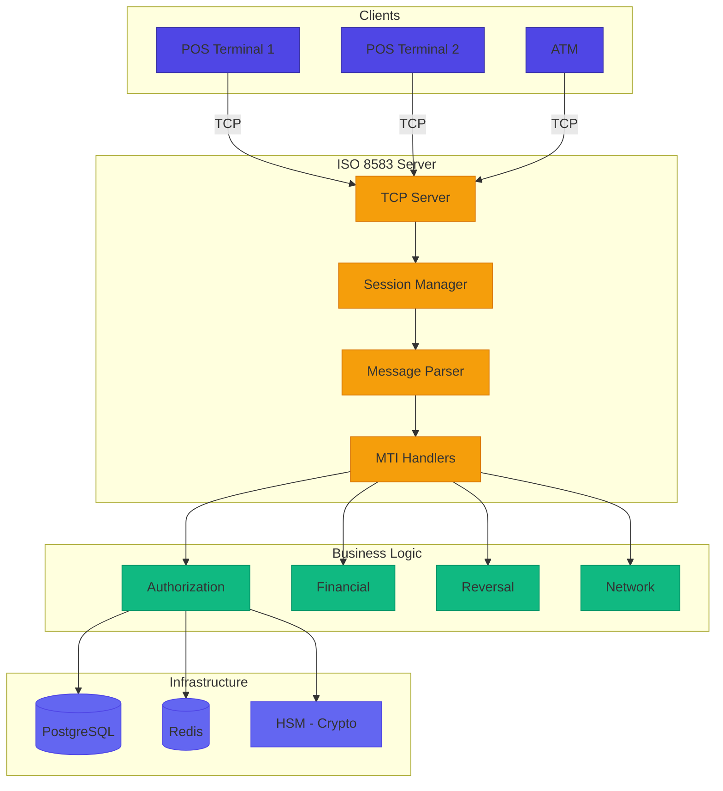
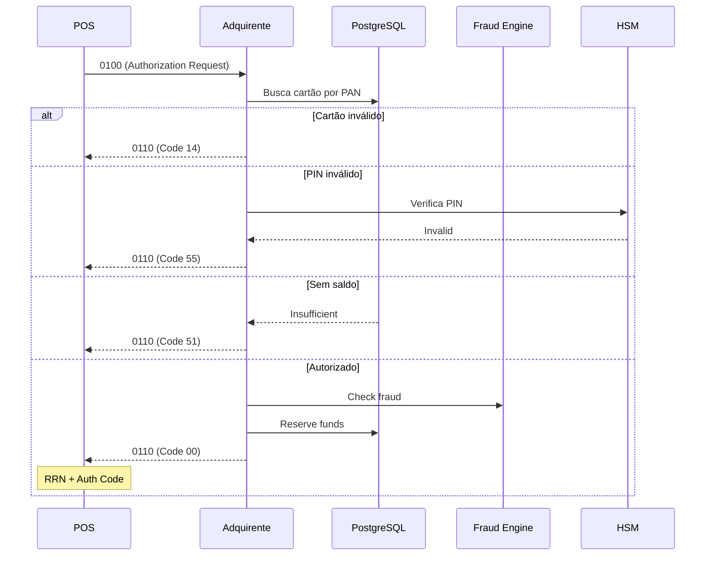
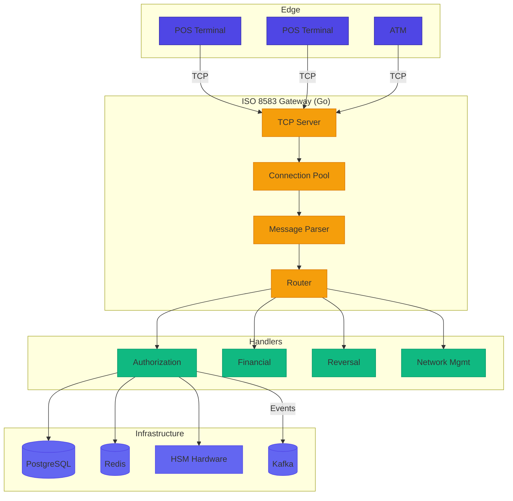
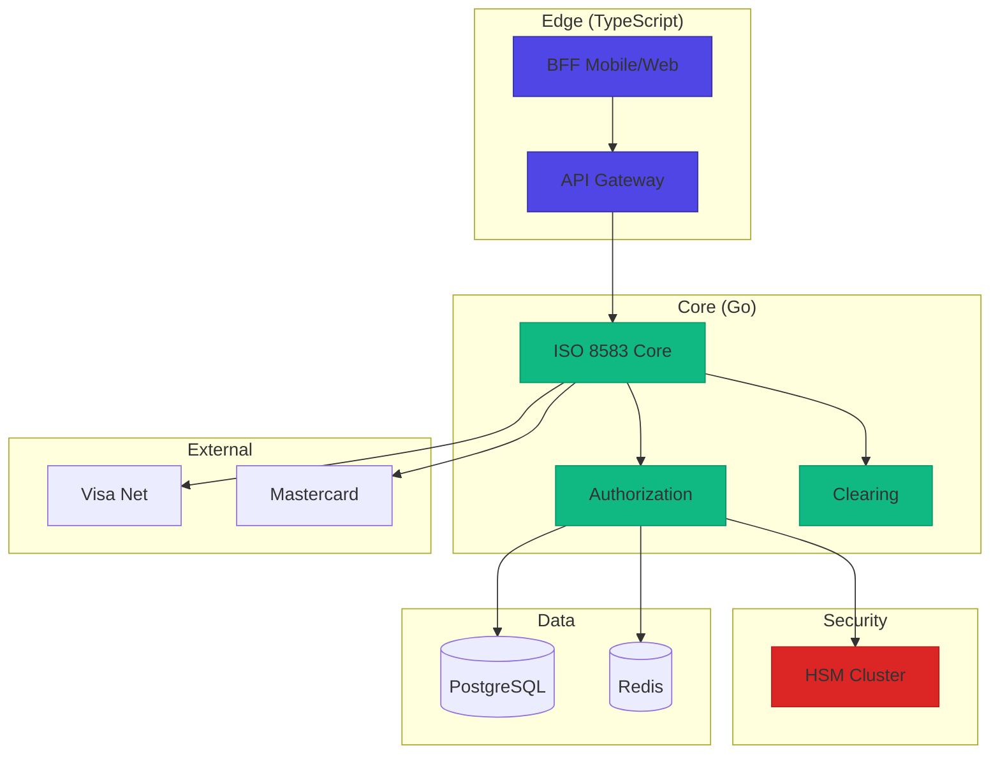

# Desafio 04: ISO 8583 — Mensagens Binárias de Autorização Financeira

**🇧🇷** Simulador de Mensagens Financeiras Binárias
**🇬🇧** ISO 8583 Financial Message Simulator

---

## 🎯 Objetivos de Aprendizado

- Implementar parsing e montagem de mensagens ISO 8583 bit-a-bit
- Entender bitmaps, MTIs e Data Elements na prática
- Construir um TCP server de alta performance para transações financeiras
- Dominar manipulação de buffers binários em TypeScript e Go
- Implementar autorização financeira com PIN, fraude e saldo

---

## 📋 Pré-requisitos

### 🧠 Conceitos
- ISO 8583 (message format, bitmap, MTI, Data Elements)
- Adquirência e subadquirência (Cielo, Rede, Getnet)
- Autorização de cartão (4-party model)
- EMV basics
- PIN block e MAC

### 📚 Desafios Anteriores
- [Desafio 02: SPI](/challenges/02-spi) — o SPI também usa protocolo binário customizado com framing, similar ao TCP/IP do ISO 8583

### 🛠️ Ferramentas
- Docker
- Wireshark (debug de pacotes TCP)
- HSM simulator (SoftHSM)

### 💻 Técnico
- TypeScript
- Buffers binários (Buffer/ArrayBuffer)
- TCP sockets (net module)
- Hex encoding/decoding
- Go opcional

---

## 📖 Abertura — O que é ISO 8583?

Em 1987, quando a International Organization for Standardization publicou a primeira versão do ISO 8583, o mundo financeiro era radicalmente diferente. Não existia internet como conhecemos. Mainframes IBM System/370 dominavam os data centers dos bancos. As transações de cartão de crédito trafegavam por linhas telefônicas dedicadas a 9600 bits por segundo. Cada byte custava caro — tanto em tempo de transmissão quanto em armazenamento. E a ideia de que alguém pagaria um café com um relógio digital parecia ficção científica digna de Star Trek.

Trinta e oito anos depois, mais de 90% das transações financeiras do mundo ainda passam por alguma variação desse protocolo — desde o caixa eletrônico da esquina até o POS do supermercado, da compra online com 3D Secure até o Pix brasileiro. O ISO 8583 não é um dinossauro tecnológico arrastado por inércia corporativa. É uma engrenagem tão bem projetada que sobreviveu a três décadas de revoluções: saiu da fita magnética para o chip EMV, do dial-up analógico para o 5G, do COBOL para o Go e Rust, do dólar físico para as criptomoedas. Cada vez que alguém tentou aposentá-lo, descobriu que o substituto proposto — XML, JSON, REST, gRPC, ISO 20022 — era maior, mais lento, mais ambíguo e menos confiável do que o velho protocolo binário.

Por que um formato da era Reagan ainda reina absoluto no sistema financeiro global? A resposta está em três palavras: **eficiência, confiabilidade e efeito de rede**. Uma mensagem ISO 8583 típica de autorização tem menos de 200 bytes. Compressão máxima de dados é a norma, não a exceção — cada bit do bitmap tem significado preciso, cada nibble do PAN segue regras de formatação exatas, cada campo existe por um motivo específico discutido em comitês internacionais. Compare isso com uma mensagem equivalente em JSON (que chega facilmente a 2-3KB com todos os campos opcionais preenchidos com `null`), e o motivo da longevidade fica cristalino: quando você processa 50.000 transações por segundo, cada byte poupado representa centenas de milhares de reais em economia de infraestrutura por ano. O protocolo é tão enxuto que uma mensagem de autorização cabe inteira num único frame TCP de 1500 bytes — sem fragmentação, sem retransmissão, sem overhead desnecessário.

Para entender o ISO 8583, você precisa primeiro entender como funciona uma **rede de adquirência** no mundo real. No Brasil, quando alguém passa um cartão numa maquininha, a transação não vai magicamente para o banco emissor. Ela segue uma coreografia precisa de intermediários: o POS envia a mensagem para a **adquirente** (Cielo, Rede, Getnet, Stone, PagSeguro) — a empresa dona da maquininha e do contrato com o lojista. A adquirente faz o parsing, valida o formato, identifica a bandeira do cartão pelos primeiros 6 dígitos do PAN (o BIN/IIN), e roteia a mensagem para a **bandeira** (Visa, Mastercard, Elo, American Express, Hipercard). A bandeira, por sua vez, consulta sua tabela de roteamento e encaminha para o **banco emissor** do cartão — que pode estar em São Paulo, Nova York, Londres ou Tóquio. O emissor autoriza (ou nega), e a resposta refaz todo o caminho inverso em milissegundos. Esse balé de bytes — request, response, reversal, reconciliation, chargeback — acontece inteiramente em ISO 8583, em menos de 3 segundos, mesmo quando o emissor está do outro lado do planeta.

A mágica técnica que acontece nos bastidores é impressionante em sua precisão. O chip do cartão (ou a tarja magnética, nos cartões mais antigos) fornece ao POS os dados essenciais: PAN, data de expiração, Service Code, e — se for chip EMV — um criptograma dinâmico (ARQC) que prova que aquele cartão físico está realmente presente. O POS monta uma mensagem 0100 (Authorization Request), incluindo o PAN no DE-2, o Processing Code no DE-3 (00=compra normal, 20=devolução, 30=consulta de saldo), o valor exato em centavos no DE-4 (R$ 157,50 vira `000000015750`), a data/hora da transação no DE-7 (MMDDhhmmss), o STAN — System Trace Audit Number no DE-11 (um número sequencial único que permite rastrear cada mensagem), o Terminal ID no DE-41 e, se houver senha digitada, o PIN block criptografado no DE-52 (que nunca, jamais, será visto em claro por nenhum software entre o teclado do POS e o HSM do emissor). Essa mensagem viaja por TCP/IP bruto com framing manual até o servidor da adquirente, que faz o parsing bit a bit do bitmap, valida o formato de cada campo, verifica se aquele terminal está autorizado a operar, e roteia para o destino correto através da bandeira. O banco emissor verifica saldo disponível, status do cartão (ativo/bloqueado/perdido), PIN (via HSM), score de fraude (velocidade, geolocalização, perfil de gastos), e responde com uma mensagem 0110 (Authorization Response) carregando o response code no DE-39 — `00` se aprovado, `51` se saldo insuficiente, `55` se PIN incorreto, `05` se transação recusada por política do emissor. Algumas horas depois (ou no fechamento do lote), a maquininha envia a mensagem 0200 (Financial Request) confirmando a transação e efetivando a captura do valor. No fim do dia, o processo de clearing liquida os valores entre bancos. O lojista recebe o dinheiro em D+1, D+30 ou no prazo contratado, dependendo do arranjo de pagamento e da antecipação de recebíveis.

Esse ecossistema silencioso movimenta mais de R$ 3 trilhões por ano só no Brasil, e dezenas de trilhões de dólares globalmente. Cada milissegundo de latência adicional no parser custa dinheiro real — em taxas de abandono de carrinho, em timeout de POS que faz o cliente desistir da compra, em custos de infraestrutura para compensar processamento lento. Cada bit mal interpretado pode significar um chargeback de R$ 5.000 contestado pelo portador, uma fraude de R$ 50.000 não detectada por erro de parsing do DE-55 (dados do chip EMV), ou um cliente furioso que jura de pé junto que não fez aquela compra em Manaus enquanto estava em Porto Alegre. É por isso que engenheiros de software que realmente entendem ISO 8583 — não só usar uma lib pronta, mas saber o que acontece dentro do bitmap — são alguns dos profissionais mais bem pagos do mercado financeiro global. E também alguns dos mais raros: faculdades não ensinam protocolos de pagamento, bootcamps não têm módulo de bitmaps, e a documentação oficial da ISO custa 198 francos suíços e é propositalmente vaga para permitir customizações regionais.

Perspectiva de quem já viu esse protocolo rodando em mainframes COBOL que processavam milhões de transações antes do Node.js existir:

> "Cara, você já parou pra pensar no que acontece quando você passa um cartão naquelas maquininhas? Aquela piscadinha verde de 'aprovado'? Parece mágica, né? Mas por trás desse swipe de 2 segundos existe um protocolo binário de mais de 35 anos que movimenta trilhões de reais todo santo dia.
>
> ISO 8583. Anos 80. Mainframes. Bits. Não JSON bonitinho, não REST com swagger — são bytes crus viajando por conexões TCP que ficam abertas por dias, semanas, meses. Cada mensagem tem 4 bytes pra dizer 'quem sou eu' (o MTI), 8 bytes pra dizer 'o que eu tenho' (o bitmap), e um monte de campos de tamanho variável que seguram PAN, valor, data, PIN criptografado.
>
> Eu vi código ISO 8583 rodando em COBOL em mainframe da IBM que processava milhões de transações por dia quando Node.js nem existia como ideia. E o mais louco? O protocolo continua essencial. Pix, TED, tudo acaba em ISO 8583 em algum ponto. Maquininha de R$ 10 do ambulante usa a mesma especificação que o mainframe do Itaú.
>
> Esse desafio é sobre **construir esse motor binário**. Montar mensagem na mão, bit por bit, interpretar bitmap, decodificar campos, e fazer uma autorização completa. Porque em sistema financeiro, você não pode dar erro de um único byte. Um bit trocado e o débito de R$ 100 vira R$ 100.000. E aí, quem paga o prejuízo?"

---

## 🔥 O Problema

Imagine que você está construindo o gateway de pagamentos de uma adquirente. Suas maquininhas enviam mensagens binárias via TCP:

```
0100  B220000000800000   000000010000  041234567890   ...  
^^^^  ^^^^^^^^^^^^^^^^   ^^^^^^^^^^^^  ^^^^^^^^^^^^
MTI      Bitmap             STAN           PAN
```

Cada byte importa. Um bitmap errado e o parser interpreta PAN como valor. Um MTI trocado e a autorização vira estorno. E esses não são cenários hipotéticos — aconteceram em produção, em adquirentes reais, com prejuízos de centenas de milhares de reais. Mas os problemas reais vão muito além desses exemplos simplificados.

O ISO 8583 não é um protocolo monolítico. Na prática, ele existe em pelo menos **três versões principais** com diferenças sutis e devastadoras. O ISO 8583-1987 é o avô — usa bitmaps de 64 bits (primary) com extensão para 128 bits (secondary), campos majoritariamente ASCII e tamanhos fixos. O ISO 8583-1993 introduziu o conceito de mensagens com formato variável mais flexível, suporte melhor para caracteres internacionais e campos com encoding BCD (Binary Coded Decimal). O ISO 8583-2003 trouxe suporte a criptografia mais forte (3DES em vez de DES simples), campos EMV no DE-55 padronizados em TLV (Tag-Length-Value), e preparou o terreno para o chip. O problema? Cada adquirente e cada bandeira escolheu uma versão-base diferente e a customizou extensivamente, criando dialetos proprietários. Uma mensagem que funciona perfeitamente na rede da Cielo pode ser rejeitada com "Format Error" na Rede, porque o DE-48 (Additional Data) tem formato diferente, ou o DE-63 (Network Data) usa encoding distinto, ou o DE-127 (Private Use) contém dados que só fazem sentido no contexto daquela adquirente específica.

Essa fragmentação é o resultado direto da flexibilidade intencional do protocolo. O ISO 8583 foi projetado para ser um framework, não uma especificação rígida. A própria documentação oficial define dezenas de Data Elements como "Opcionais" ou "Condicionais", e reserva ranges inteiros (DE-48 a DE-63, DE-124 a DE-127) para uso privado das redes. A Visa implementa sua versão chamada **VisaNet Integrated Payment System (V.I.P.S.)**, a Mastercard usa o **Mastercard Debit Switch (MDS)** com regras próprias de formatação, a Elo estende o protocolo com campos de loyalty e private label, e cada adquirente brasileira adiciona suas peculiaridades: a Cielo tem DE-48 customizado com dados de captura, a Rede exige campos específicos para sub-adquirentes, a Getnet adiciona parâmetros de split de pagamento em DEs privados. O resultado é um ecossistema onde o parser precisa ser configurável por rede, por adquirente, e às vezes por versão de API de cada uma. Isso vai muito além de "Ler bytes".

Os desafios técnicos fundamentais que você vai enfrentar neste desafio — e que espelham fielmente o que acontece em sistemas de pagamento reais — são estes:

1. **Parsing binário é implacável** — Um offset errado de 1 byte e você está lendo lixo completo. JSON te protege com nomes de campo e delimitadores; buffer binário não te protege de absolutamente nada. Se você errar o tamanho do LLVAR do PAN por 1 byte, o campo seguinte (Processing Code, de 6 bytes fixos) começa no lugar errado e toda a pipeline de autorização quebra. Pior: você pode nem perceber o erro. A mensagem continua sendo *parseada* — só que com os valores errados nos campos errados. Um amount de R$ 100 pode virar R$ 1.000.000 sem que ninguém grite erro de parsing.

2. **Bitmaps são geniais e traiçoeiros** — Cada bit do bitmap indica se um campo está presente na mensagem. O primary bitmap (64 bits = 8 bytes) cobre os DEs 2 a 64 (lembre-se: DE-1 não existe como campo de dados; o bit 1 indica "Tem secondary bitmap"). Se a mensagem tiver campos nos DEs 65 a 128, o bit 1 do primary fica ativo e o secondary bitmap (mais 8 bytes) é incluído. Um único bit errado no bitmap — talvez por corrupção de memória, talvez por bug no código que seta o bit — e você perde um campo inteiro ou, pior, interpreta o campo errado como sendo outro. Já aconteceu em produção: bit do DE-52 (PIN) desligado por engano, transação autorizou sem verificar senha. Prejuízo de R$ 200 mil em uma tarde.

3. **Concorrência no TCP bruto é brutal** — Centenas de milhares de POS e ATMs conectados simultaneamente ao mesmo servidor, cada um mantendo uma conexão TCP persistente que pode ficar aberta por dias. Cada conexão envia e recebe mensagens de forma assíncrona. O buffer de leitura do servidor precisa acumular bytes que chegam em rajadas imprevisíveis, identificar onde cada mensagem começa e termina (framing manual com length-prefix de 2 bytes), e distribuir o processamento para workers sem bloquear o event loop. Se você engolir 1 byte da mensagem seguinte, a sincronia da conexão inteira é perdida — e recuperar isso em produção, sem dropar a sessão, é um pesadelo de engenharia. Adicione a isso o fato de que cada conexão precisa de heartbeats (mensagens 0800 a cada X segundos), reconexão automática com backoff exponencial, e tratamento de NAK (Negative Acknowledgment) quando o servidor rejeita uma mensagem por formato inválido.

4. **Segurança é inegociável e onipresente** — PIN em claro é crime. PCI-DSS (Payment Card Industry Data Security Standard) exige que o PIN nunca seja visível em nenhum ponto do sistema — nem em logs, nem em memória, nem em traces de debugging, nem em backups de banco de dados. Toda criptografia de PIN passa por um HSM (Hardware Security Module), um hardware dedicado que armazena chaves em ambiente fisicamente protegido e executa operações criptográficas sem nunca expor as chaves ao software. O PAN (número do cartão) também é dado sensível: você pode logar os primeiros 6 e últimos 4 dígitos (BIN + últimos 4), mas nunca, jamais, o número completo. MAC (Message Authentication Code) garante integridade: se um atacante interceptar a mensagem e tentar alterar o valor da transação, o MAC não vai bater e a transação será rejeitada. Cada um desses mecanismos precisa estar implementado corretamente — um MAC fraco, uma chave em código, um log descuidado, e você está fora de compliance.

5. **O fator humano agravante** — Praticamente nenhuma faculdade ensina ISO 8583. A documentação oficial da ISO é paga e genérica. Os manuais das bandeiras (Visa, Mastercard) têm milhares de páginas e assumem que você já sabe o básico. O conhecimento sobre como implementar um parser de mensagens financeiras está concentrado num grupo pequeno de engenheiros seniores que aprenderam na prática, geralmente dentro de adquirentes e bandeiras, e raramente compartilham esse conhecimento publicamente. Este desafio existe justamente para quebrar essa barreira: documentar, explicar e praticar o que normalmente só se aprende depois de anos trabalhando num gateway de pagamentos.

Cada um desses problemas tem solução testada em produção: manipulação correta de buffers binários com bounds checking, bitmaps implementados com `bigint` (TypeScript) ou `uint64` (Go), TCP com framing explícito via length-prefix e heartbeats periódicos, e criptografia delegada a HSM com zero exposição de chaves e PINs ao software de aplicação.

---

## 🏗️ Arquitetura Geral

<LanguageToggle />

<div class="Lang-content ts" style="Display:block;">

### O que é ISO 8583?

| Característica | Descrição |
|----------------|-----------|
| **Binário** | Dados em bytes, não JSON/XML |
| **TCP puro** | Sem HTTP, sem overhead |
| **Bitmaps** | Indicam quais campos estão presentes |
| **Baixa latência** | Milissegundos por transação |
| **MAC/Criptografia** | 3DES, AES, RSA |
| **Conexões persistentes** | Sessões longas |

### Estrutura de uma Mensagem ISO 8583

```
┌─────────────┬──────────────┬────────────────┬──────────┐
│  MTI (4B)   │ Bitmap (8B)  │ Data Elements  │ MAC (8B) │
│  ASCII      │  Primary     │  Variável      │ Binário  │
└─────────────┴──────────────┴────────────────┴──────────┘
```

| Componente | Tamanho | Descrição |
|------------|---------|-----------|
| **MTI** | 4 bytes | Message Type Indicator (0100, 0200, etc) |
| **Bitmap** | 8 ou 16 bytes | Bits indicando DEs presentes |
| **Data Elements** | Variável | Campos de dados (PAN, valor, etc) |
| **MAC** | 8 bytes | Message Authentication Code |

### MTIs Principais

| MTI | Nome | Uso |
|-----|------|-----|
| **0100/0110** | Authorization Request/Response | Pré-autorização |
| **0200/0210** | Financial Request/Response | Compra efetiva |
| **0400/0410** | Reversal Request/Response | Cancelamento |
| **0800/0810** | Network Management Request/Response | Heartbeat, login |

### Arquitetura do Simulador



### Fluxo Completo: Transação de Cartão



### Response Codes Mais Comuns

| Código | Significado |
|--------|-------------|
| **00** | Approved |
| **05** | Do not honor |
| **14** | Invalid card number |
| **30** | Format error |
| **51** | Insufficient funds |
| **54** | Expired card |
| **55** | Incorrect PIN |
| **62** | Restricted card |
| **91** | Issuer unavailable |
| **96** | System malfunction |

---

## 👨‍💻 Mão na Massa

"Bora codar. O bagulho é o seguinte: você precisa construir um parser de mensagem binária que lê byte por byte e monta a estrutura correta. Não tem JSON helper. Não tem `JSON.parse`. É você, o buffer e o bitmap. E o bitmap não perdoa.

Antes de escrever uma linha de código, você precisa internalizar a anatomia de uma mensagem ISO 8583. Toda mensagem começa com 4 bytes ASCII que formam o MTI — o Message Type Indicator. Pense no MTI como o 'verbo' da mensagem: ele diz o que essa mensagem está fazendo no mundo. `0100` significa 'estou pedindo autorização'. `0110` significa 'aqui está a resposta da autorização'. `0200` significa 'confirme a transação financeira pra valer'. `0420` significa 'desfaça aquela transação anterior'. Cada MTI segue uma convenção de posicionamento: o primeiro dígito indica a versão do ISO (0 = 1987, 1 = 1993, 2 = 2003), o segundo dígito indica a classe (1 = autorização, 2 = financeira, 4 = reversal, 8 = network management), o terceiro indica a função (0 = request, 1 = response, 2 = advice, 3 = response + advice), e o quarto identifica a origem (0 = adquirente, 1 = repetição da adquirente, 2 = emissor, 3 = repetição do emissor). Cada combinação desses 4 dígitos define um contrato preciso de comunicação.

Depois do MTI vem o bitmap — 8 bytes se apenas o primary bitmap estiver ativo, ou 16 bytes se o bit 1 estiver setado (indicando que há secondary bitmap). O bitmap é lido da esquerda para a direita, bit mais significativo primeiro. O bit 1 do primeiro byte (0x80 no primeiro byte do primary) NÃO representa o DE-1 — o DE-1 é reservado. Esse bit indica se existe um secondary bitmap logo após o primary. O bit 2 do primeiro byte (0x40) representa o DE-2 — o PAN do cartão. O bit 3 (0x20) representa o DE-3 — o Processing Code. E assim por diante, mapeando 64 bits para 64 campos no primary, com possibilidade de extensão para 128 campos no secondary. É um sistema de compressão que permite que uma mensagem com apenas 3 campos ocupe exatamente os bytes necessários — sem campos vazios, sem `null`, sem desperdício.

Após o(s) bitmap(s), vêm os Data Elements propriamente ditos, na ordem numérica crescente. O parser lê cada bit do bitmap em sequência (do bit 2 ao 64, depois do 65 ao 128 se houver secondary). Para cada bit ativo, ele consulta a especificação daquele DE para saber: o campo é de tamanho fixo? Ou tem prefixo de tamanho variável? Se for variável, o prefixo tem 2 dígitos (LLVAR) ou 3 dígitos (LLLVAR)? Os valores são ASCII ou BCD (Binary Coded Decimal, onde cada nibble de 4 bits armazena um dígito de 0 a 9)? A resposta para cada uma dessas perguntas depende de qual DE estamos falando e de qual especificação estamos seguindo — e é aí que as coisas ficam interessantes.

Vou te mostrar como fazer na prática."

### Message Parser e Builder

Primeiro, a mensagem ISO 8583:

```typescript
export class ISO8583Message {
  public mti: string;
  public bitmap: Bitmap;
  public dataElements: Map<number, DataElement>;

  constructor(mti: string) {
    this.mti = mti;
    this.bitmap = new Bitmap();
    this.dataElements = new Map();
  }

  public setDE(de: number, value: any, type: DataElementType): void {
    if (de > 64) this.bitmap.set(1);
    this.bitmap.set(de);
    this.dataElements.set(de, new DataElement(de, value, type));
  }

  public hasDE(de: number): boolean {
    return this.bitmap.isSet(de);
  }

  public toBuffer(): Buffer {
    const parts: Buffer[] = [];
    parts.push(Buffer.from(this.mti, 'ascii'));
    parts.push(this.bitmap.toPrimaryBuffer());
    if (this.bitmap.isSet(1)) parts.push(this.bitmap.toSecondaryBuffer());

    const sortedDEs = Array.from(this.dataElements.keys()).sort((a, b) => a - b);
    for (const de of sortedDEs) {
      parts.push(this.dataElements.get(de)!.toBuffer());
    }
    return Buffer.concat(parts);
  }

  public static fromBuffer(buffer: Buffer): ISO8583Message {
    let offset = 0;
    const mti = buffer.slice(offset, offset + 4).toString('ascii');
    offset += 4;

    const message = new ISO8583Message(mti);
    const primaryBitmap = buffer.slice(offset, offset + 8);
    message.bitmap.fromPrimaryBuffer(primaryBitmap);
    offset += 8;

    if (message.bitmap.isSet(1)) {
      const secondaryBitmap = buffer.slice(offset, offset + 8);
      message.bitmap.fromSecondaryBuffer(secondaryBitmap);
      offset += 8;
    }

    for (const de of message.bitmap.getSetBits().filter(b => b > 1)) {
      const type = DataElement.getTypeForDE(de);
      const element = DataElement.fromBuffer(buffer, offset, de, type);
      message.dataElements.set(de, element);
      offset += element.getByteLength();
    }
    return message;
  }
}
```

A classe `ISO8583Message` encapsula toda a estrutura da mensagem. Note que o método `setDE` é inteligente: se você tenta setar um DE acima de 64, ele automaticamente ativa o bit 1 do primary bitmap para sinalizar que existe um secondary bitmap. Isso é crítico — se você esquecer de setar o bit 1 e incluir campos do secondary bitmap, o parser do outro lado vai ler os dados do DE-65 como se fossem uma extensão do DE-64, e toda a mensagem será interpretada incorretamente.

O método `fromBuffer` implementa o parsing inverso: lê o MTI (4 bytes ASCII), lê o primary bitmap (8 bytes), verifica se o bit 1 está ativo e, se estiver, lê o secondary bitmap (mais 8 bytes). Depois, itera por todos os bits setados no bitmap (excluindo o bit 1, que não corresponde a um DE) e, para cada bit, chama `DataElement.fromBuffer` passando o offset atual. O `fromBuffer` retorna o elemento parseado e o `getByteLength` informa quantos bytes foram consumidos, permitindo que o offset avance corretamente para o próximo campo. Esse padrão de "Ler e avançar offset" é o coração de qualquer parser binário.

Um detalhe sutil mas fundamental: a ordem de leitura dos DEs é determinada pela ordem numérica dos bits setados no bitmap, e não pela ordem em que os dados aparecem no buffer. Como os campos são armazenados sequencialmente em ordem crescente de DE, o parser percorre os bits do bitmap em ordem numérica e, para cada bit ativo, consome os próximos N bytes do buffer. Isso significa que o parser nunca precisa "Pular" bytes ou fazer seek — ele sempre avança linearmente. Essa propriedade torna o parsing extremamente rápido e previsível.

### Bitmap — Manipulação de Bits

O coração do ISO 8583. Cada bit indica se um Data Element está presente:

```typescript
export class Bitmap {
  private primary: bigint;
  private secondary: bigint;

  public set(bit: number): void {
    if (bit <= 64) {
      const position = BigInt(64 - bit);
      this.primary |= (1n << position);
    } else {
      const position = BigInt(128 - bit);
      this.secondary |= (1n << position);
    }
  }

  public isSet(bit: number): boolean {
    if (bit <= 64) {
      return (this.primary & (1n << BigInt(64 - bit))) !== 0n;
    }
    return (this.secondary & (1n << BigInt(128 - bit))) !== 0n;
  }

  public toPrimaryBuffer(): Buffer {
    const buffer = Buffer.alloc(8);
    buffer.writeBigUInt64BE(this.primary);
    return buffer;
  }

  public getSetBits(): number[] {
    const bits: number[] = [];
    for (let i = 1; i <= 64; i++) {
      if (this.isSet(i)) bits.push(i);
    }
    if (this.isSet(1)) {
      for (let i = 65; i <= 128; i++) {
        if (this.isSet(i)) bits.push(i);
      }
    }
    return bits;
  }
}
```

A implementação do Bitmap usa `bigint` no TypeScript porque o primary bitmap são 64 bits — e JavaScript não tem inteiros nativos de 64 bits sem perda de precisão. O `BigInt` resolve isso, mas com um custo de performance. Em Go, usamos `uint64` nativo, que é mapeado diretamente para registradores da CPU — zero overhead. A escolha da linguagem impacta diretamente a latência de parsing, e em sistemas financeiros cada microssegundo conta.

Observe o offset nos bits: `64 - bit` para o primary (bits 1-64) e `128 - bit` para o secondary (bits 65-128). Isso acontece porque o bit mais significativo do primeiro byte do primary bitmap (posição 0, valor 0x80) corresponde ao DE-1 (indicador de secondary bitmap), e o bit menos significativo do último byte (posição 63, valor 0x01) corresponde ao DE-64. A indexação é zero-based vinda da direita no shift, mas o significado do bit é mapeado visualmente da esquerda para a direita.

E aqui está a tabela que todo desenvolvedor ISO 8583 deveria ter tatuada na memória — os DEs mais importantes e seus respectivos bits no bitmap primário:
|-----|-----|------|
| 2 | DE-2 | PAN (número do cartão) |
| 3 | DE-3 | Processing Code |
| 4 | DE-4 | Amount Transaction |
| 7 | DE-7 | Date/Time |
| 11 | DE-11 | STAN |
| 14 | DE-14 | Date Expiration |
| 22 | DE-22 | POS Entry Mode |
| 35 | DE-35 | Track 2 Data |
| 38 | DE-38 | Auth ID Response |
| 39 | DE-39 | Response Code |
| 41 | DE-41 | Terminal ID |
| 42 | DE-42 | Merchant ID |
| 52 | DE-52 | PIN Data |
| 55 | DE-55 | ICC Data (EMV) |

### Data Elements — Tipos de Campos

```typescript
export enum DataElementType {
  FIXED = 'FIXED',
  LLVAR = 'LLVAR',
  LLLVAR = 'LLLVAR',
}

export class DataElement {
  public static getTypeForDE(de: number): DataElementType {
    const spec = ISO8583Spec.getDESpec(de);
    return spec.type;
  }

  public toBuffer(): Buffer {
    const spec = ISO8583Spec.getDESpec(this.de);
    switch (this.type) {
      case DataElementType.FIXED:
        return Buffer.from(String(this.value).padStart(spec.length, '0'), 'ascii');
      case DataElementType.LLVAR: {
        const len = String(this.value).length.toString().padStart(2, '0');
        return Buffer.from(len + this.value, 'ascii');
      }
      case DataElementType.LLLVAR: {
        const len = String(this.value).length.toString().padStart(3, '0');
        return Buffer.from(len + this.value, 'ascii');
      }
    }
  }
}
```

Os Data Elements são onde a teoria encontra a realidade. O tipo `FIXED` é o mais simples: você sabe exatamente quantos bytes o campo ocupa. O Processing Code (DE-3) sempre tem 6 bytes — nem mais, nem menos. O Amount (DE-4) sempre tem 12 bytes, preenchidos com zeros à esquerda. A Transmission Date/Time (DE-7) sempre tem 10 bytes no formato MMDDhhmmss. Se chegar um byte a menos, a mensagem é rejeitada. Se chegar um byte a mais, você consumiu bytes da mensagem seguinte e perdeu a sincronia da conexão.

Os tipos `LLVAR` e `LLLVAR` são mais flexíveis — mas também mais perigosos. LLVAR significa que o campo começa com 2 dígitos indicando o tamanho do valor que segue. Por exemplo, para um PAN de 16 dígitos: os primeiros 2 bytes são `16`, seguidos de 16 bytes com o número do cartão. Total: 18 bytes. LLLVAR usa 3 dígitos de prefixo, permitindo valores de até 999 bytes — usado para campos volumosos como o DE-55 (ICC Data, com dados EMV em formato TLV) e o DE-48 (Additional Data com dezenas de subcampos proprietários da adquirente). O perigo está no prefixo: se o valor real tem 15 bytes mas o prefixo diz `16`, o parser vai consumir um byte extra — e a mensagem seguinte começa no lugar errado. Se o prefixo diz `14` para um valor de 15 bytes, você deixa um byte para trás e o próximo DE começa com dados corrompidos. Validação de tamanho é obrigatória e constante.

### TCP Server — Comunicação de Baixo Nível

```typescript
import * as net from 'net';

export class ISO8583TCPServer {
  private server: net.Server;
  private connections: Map<string, net.Socket> = new Map();

  public start(): Promise<void> {
    return new Promise((resolve) => {
      this.server = net.createServer((socket) => this.handleConnection(socket));
      this.server.listen(this.config.port, this.config.host, resolve);
    });
  }

  private handleConnection(socket: net.Socket): void {
    const connectionId = `${socket.remoteAddress}:${socket.remotePort}`;
    this.connections.set(connectionId, socket);

    let messageBuffer = Buffer.alloc(0);

    socket.on('data', (data) => {
      messageBuffer = Buffer.concat([messageBuffer, data]);

      while (messageBuffer.length > 0) {
        const msgLength = messageBuffer.readUInt16BE(0);
        if (messageBuffer.length < 2 + msgLength) break;

        const msgData = messageBuffer.slice(2, 2 + msgLength);
        messageBuffer = messageBuffer.slice(2 + msgLength);

        const isoMessage = ISO8583Message.fromBuffer(msgData);
        this.messageRouter.route(isoMessage, session).then((response) => {
          if (response) socket.write(response.toBuffer());
        });
      }
    });
  }
}
```

O TCP Server é o ponto de entrada de toda a comunicação. Diferente de um servidor HTTP que fecha a conexão após cada resposta, as conexões ISO 8583 são **persistentes** — um POS pode ficar conectado por horas, dias, até semanas, enviando centenas de transações na mesma conexão TCP. Isso economiza o overhead de handshake TLS, negociação de chaves e criação de socket para cada transação individual.

O framing é responsabilidade total do desenvolvedor. Não existe `Content-Length` como no HTTP. A convenção mais comum (e a que implementamos aqui) é um length-prefix de 2 bytes em big-endian: os primeiros 2 bytes do stream indicam quantos bytes tem a mensagem ISO 8583 que segue. O servidor acumula bytes no buffer até ter pelo menos 2 bytes (o prefixo), lê o tamanho, e espera até ter aquele número de bytes completo. Se chegaram mais bytes (mensagens múltiplas no mesmo pacote TCP), o loop processa uma de cada vez, consumindo o prefixo + payload e avançando o buffer.

Em produção real, esse loop precisa de proteção adicional: um limite máximo de tamanho de mensagem (para evitar ataques de memory exhaustion), um timeout de leitura (para matar conexões zumbis), e heartbeats via mensagens 0800/0810 (Network Management) para verificar que a conexão ainda está viva. Muitas adquirentes configuram o heartbeat a cada 30 segundos — 3 falhas consecutivas e a conexão é derrubada.

### Authorization Handler

```typescript
export class AuthorizationHandler implements MessageHandler {
  public async handle(message: ISO8583Message, session: Session): Promise<ISO8583Message> {
    const pan = message.getDEValue(2);
    const amount = parseInt(message.getDEValue(4), 10);
    const terminalId = message.getDEValue(41);
    const merchantId = message.getDEValue(42);

    const card = await this.cardRepo.findByPAN(pan);
    if (!card) return this.buildResponse(message, '14', 'Invalid card');

    if (card.status !== 'ACTIVE') return this.buildResponse(message, '62', 'Restricted');

    if (message.hasDE(52)) {
      const pinValid = await this.hsm.verifyPIN(message.getDEValue(52), card.pan, card.pinBlock);
      if (!pinValid) return this.buildResponse(message, '55', 'Incorrect PIN');
    }

    const fraudCheck = await this.fraudService.check({ pan, amount, merchantId, terminalId });
    if (fraudCheck.isHighRisk) return this.buildResponse(message, '05', 'Do not honor');

    const balance = await this.cardRepo.getAvailableBalance(card.id);
    if (balance < amount) return this.buildResponse(message, '51', 'Insufficient funds');

    const authCode = this.generateAuthCode();
    const rrn = this.generateRRN();

    await this.cardRepo.reserveFunds(card.id, amount, rrn);

    const response = this.buildResponse(message, '00', 'Approved');
    response.setDE(37, rrn, DataElementType.FIXED);
    response.setDE(38, authCode, DataElementType.FIXED);

    return response;
  }

  private generateRRN(): string {
    const now = new Date();
    const julianDay = this.getJulianDay(now).toString().padStart(3, '0');
    const seq = Math.floor(Math.random() * 1000000).toString().padStart(6, '0');
    return julianDay + now.getHours().toString().padStart(2, '0') + seq;
  }
}
```

O Authorization Handler é onde a mágica financeira acontece. Cada MTI tem seu handler correspondente, e o router direciona a mensagem para o handler correto baseado no MTI. O fluxo de autorização segue uma coreografia precisa: primeiro, valida-se a existência do cartão (PAN lookup). Depois, o status (ativo, bloqueado, cancelado). Em seguida, a data de expiração. Se o cartão passou por essas verificações básicas, parte-se para o PIN — mas apenas se a transação exigir senha (nem toda transação exige; compras contactless abaixo de R$ 200, por exemplo, podem ser autorizadas sem PIN por política da bandeira).

A verificação de fraude é um passo crucial que acontece em paralelo ou logo após a validação do PIN. Motores de fraude modernos analisam dezenas de sinais: velocidade (quantas transações esse cartão fez nos últimos 5 minutos?), geolocalização (a transação anterior foi em São Paulo e esta é em Manaus, 2 minutos depois?), perfil de gastos (esse cartão costuma comprar em supermercados ou de repente apareceu numa joalheria?), valor atípico (o ticket médio é R$ 50 e essa compra é de R$ 15.000?). Cada sinal contribui para um score, e scores acima do threshold disparam bloqueio.

O RRN (Retrieval Reference Number) e o Auth Code são os identificadores que permitem rastrear uma transação específica em meio a bilhões. O RRN é gerado com data juliana + hora + sequencial — formato que garante unicidade dentro de um ciclo de 24 horas. O STAN (System Trace Audit Number), que veio na mensagem original, é ecoado de volta na resposta, permitindo que o POS correlacione request e response mesmo em cenários de timeout e retry. Juntos, STAN + RRN + Auth Code formam a tríade de rastreabilidade de qualquer transação financeira.

Um detalhe importante que o código acima resume: a função `buildResponse` copia automaticamente os campos essenciais da request para a response (DE-2 PAN, DE-3 Processing Code, DE-4 Amount, DE-7 Date/Time, DE-11 STAN, DE-41 Terminal ID). Isso garante que a resposta carrega o contexto completo da transação original, permitindo que o POS faça a correlação sem ambiguidade.

### Boas Práticas

**Faça:**
- Connection pooling e heartbeats
- Idempotência com STAN + RRN
- Audit trail de todas as mensagens
- Circuit breakers para emissores
- PCI-DSS compliance

**Evite:**
- Logar PANs (viola PCI-DSS)
- Logar PINs (jamais)
- Chaves em código (use HSM)
- Timeouts longos
- Conexões sem heartbeat

---

## 🧠 A Profundidade

### Bitmaps: O Coração do ISO 8583

"Presta atencao. deixa eu te contar por que bitmap é uma ideia genial — e também um pé no saco.

Imagine que você tem 128 campos possíveis numa mensagem. Em JSON, você mandaria todos, mesmo os vazios: `{ "De2": null, "De3": null, "De4": "000000010000", ... }`. Isso é desperdício. Em 1987, quando o ISO 8583 foi criado, cada byte custava caro. Mainframes transmitiam a 9600 baud. Você não podia jogar bytes fora.

Então inventaram o bitmap: 64 bits (8 bytes) onde cada bit representa um campo. Bit 2 ligado = DE-2 presente. Bit 3 desligado = DE-3 ausente. O parser lê o bitmap e sabe exatamente quantos bytes ler e onde cada campo termina. Zero ambiguidade.

Se os primeiros 64 campos não são suficientes (e nunca são), o bit 1 do primary bitmap ativa o **secondary bitmap** — mais 8 bytes, mais 64 bits. 128 campos no total.

O truque sujo? O bit 1 do primary bitmap **não** representa DE-1. DE-1 é reservado. Bit 1 serve exclusivamente pra dizer 'tem secondary bitmap'. Se você esquecer disso, o parser quebra.

E não pense que ISO 8583 é coisa do passado. Visa e Mastercard processam dezenas de milhares de mensagens ISO 8583 **por segundo**. Pix também — o SPI usa uma variação do ISO 8583. O protocolo tem quase 40 anos e continua sendo a espinha dorsal do dinheiro eletrônico no mundo inteiro."

### Por que TCP e não HTTP?

"HTTP adiciona overhead. Headers, cookies, handshake TLS. Pra uma maquininha que manda 100 bytes por transação, HTTP dobra o tamanho. Fora que HTTP é stateless — cada requisição precisa estabelecer conexão, negociar TLS, mandar header, fechar. Numa conexão persistente ISO 8583 sobre TCP bruto, você estabelece uma vez e manda mensagens por horas. Milhares de transações na mesma conexão.

Fora latência: HTTP adiciona 5-20ms de overhead por requisição. Em ISO 8583, cada milissegundo importa. Uma adquirente processa 2 milhões de transações por dia. 10ms de overhead = 20 mil segundos de latência acumulada por dia. Isso é caro."

### O Papel do HSM

"PIN nunca, jamais, em hipótese nenhuma, pode trafegar em claro. Nem no barramento interno do servidor. O PIN sai criptografado da maquininha, chega criptografado no seu servidor, e você encaminha criptografado pro HSM — um hardware específico que decifra, verifica e devolve 'ok' ou 'fail'. Seu software **nunca** vê o PIN em claro.

PCI-DSS exige isso. Se você logar um PIN, mesmo sem querer, você violou compliance. Multa, processo, e adeus certificação. HSM não é opcional — é obrigatório pra operar no mercado de pagamentos."

### Segurança Fim a Fim em ISO 8583

A segurança no ISO 8583 não é uma camada opcional que você adiciona depois — ela é parte integrante da especificação. Vamos entender cada peça do quebra-cabeça criptográfico que protege trilhões de reais em transações diárias.

**PIN Block (DE-52):** Quando o cliente digita a senha no teclado do POS, o PIN não é transmitido em claro. Ele é imediatamente criptografado usando o algoritmo ISO 9564, que define formatos padronizados de PIN block. O formato mais comum é o **ISO 9564 Format 0**: o PIN é combinado com o PAN do cartão via operação XOR, resultando num bloco de 8 bytes que não revela nem o PIN nem o PAN individualmente. Esse bloco é então criptografado com 3DES ou AES usando uma chave que só o HSM conhece — a **ZPK (Zone PIN Key)**. O resultado é o que trafega no DE-52. Nem o software do POS, nem o gateway da adquirente, nem os logs, nem ninguém no meio do caminho consegue extrair o PIN desse bloco. Só o HSM do banco emissor, que possui a chave ZPK correspondente, pode decifrar, extrair o PIN via operação reversa com o PAN, e verificar contra o PIN armazenado do cliente.

**MAC (Message Authentication Code — DE-64 ou DE-128):** O MAC garante que a mensagem não foi alterada em trânsito. Ele é calculado sobre todo o conteúdo da mensagem (MTI + bitmap + todos os DEs) usando uma chave simétrica compartilhada entre adquirente e emissor. O algoritmo típico é ANSI X9.9 (DES) ou ANSI X9.19 (3DES), gerando um código de 8 bytes que é anexado ao final da mensagem. O receptor recalcula o MAC com a mesma chave e compara. Se não bater, a mensagem foi adulterada ou corrompida — e é imediatamente descartada. O MAC impede ataques de man-in-the-middle que tentariam alterar o valor da transação ou o número da conta destino.

**ARQC / ARPC (EMV Chip Cryptograms — dentro do DE-55):** Nas transações com chip EMV, o cartão gera um criptograma chamado ARQC (Authorization Request Cryptogram) usando uma chave secreta armazenada no chip — a **ICC Master Key** derivada da **Issuer Master Key (IMK)** . O ARQC é uma prova criptográfica de que aquele chip físico específico está presente na transação, não uma cópia clonada. O emissor valida o ARQC, decide se autoriza ou não, e responde com um ARPC (Authorization Response Cryptogram). Se o cartão receber um ARPC válido, ele sabe que o emissor genuinamente autorizou a transação. Todo esse processo acontece com o cartão gerando criptogramas imprevisíveis a cada transação, tornando a clonagem de chip essencialmente impossível.

**Gerenciamento de Chaves e Hierarquia:** As chaves criptográficas no mundo ISO 8583 seguem uma hierarquia rígida. No topo está a **ZMK (Zone Master Key)** — uma chave de transporte usada exclusivamente para criptografar outras chaves quando elas precisam ser transmitidas entre instituições. Abaixo dela, a **ZPK (Zone PIN Key)** protege PINs, a **ZAK (Zone Authentication Key)** gera MACs, e a **TMK (Terminal Master Key)** deriva chaves para cada POS individual. Esse esquema de hierarquia garante que o comprometimento de uma chave de nível inferior (ex: um POS roubado) não comprometa todo o ecossistema. Cerimônias de troca de chave (key ceremonies) entre adquirentes e bandeiras envolvem múltiplos oficiais de segurança, cada um portando um componente da chave, em salas fisicamente seguras — um ritual que parece saído de um filme de espionagem, mas que é rotina mensal no mercado de pagamentos.

### ISO 8583 vs ISO 20022: A Batalha Geracional

Há mais de uma década, o sistema financeiro global declarou que o ISO 20022 seria o sucessor do ISO 8583. O novo padrão usa XML (e mais recentemente JSON/ASN.1), é mais legível por humanos, suporta dados estruturados ricos (endereços completos, informações fiscais, dados de fatura), e promete unificar pagamentos, títulos, câmbio e trade finance num único formato.

O Swift mandatou a migração para ISO 20022 em cross-border payments a partir de 2023. O Banco Central do Brasil adotou ISO 20022 para o Pix e para o Open Finance. A União Europeia está migrando o SEPA. Parece o fim do ISO 8583, certo? Errado.

O ISO 8583 continua sendo o padrão dominante em três frentes que o ISO 20022 ainda não consegue vencer: **latência** (uma mensagem ISO 8583 de 200 bytes é processada em microssegundos; uma mensagem ISO 20022 equivalente em XML chega a 3-5KB e precisa de parsing XML), **compatibilidade** (bilhões de terminais POS, ATMs e sistemas legados falam ISO 8583 nativamente; substituir tudo levaria décadas e custaria centenas de bilhões de dólares), e **confiabilidade** (o ISO 8583 tem 38 anos de battle-testing; cada cenário de borda, cada race condition, cada problema de rede já foi encontrado e resolvido). A previsão realista não é "Substituição", mas **coexistência**: ISO 8583 continuará nos rails de pagamento de alta performance (POS, ATM, adquirência), enquanto ISO 20022 dominará pagamentos de maior valor agregado (cross-border, tesouraria, trade finance) onde a riqueza de dados justifica o overhead.

### Protocolo de Rede: Além do TCP Bruto

Embora o ISO 8583 trafegue sobre TCP/IP, existe uma camada de protocolo de sessão que a maioria dos engenheiros só descobre em produção. O coração dessa camada são dois mecanismos: **NAK/ACK** e **heartbeats**.

**NAK (Negative Acknowledgment):** Quando o servidor recebe uma mensagem com formato inválido — bitmap corrompido, MTI desconhecido, tamanho de campo inconsistente com o prefixo LLVAR — ele não pode simplesmente ignorar a mensagem. O POS precisa saber que algo deu errado para não continuar enviando transações que serão silenciosamente descartadas. O NAK é uma mensagem curta (geralmente um código de 2 bytes, como `0x00 0x06` para "Formato inválido" ou `0x00 0x03` para "MAC inválido") que o servidor envia de volta ao POS. O POS, ao receber um NAK, incrementa seu contador de erros, faz retry com backoff exponencial e, se o problema persistir, entra em modo de recuperação. Se você não implementar NAK, o POS fica enviando transações para o vazio sem saber que estão sendo descartadas.

**Heartbeats (0800/0810):** Conexões TCP persistentes são vulneráveis a "Half-open connections" — cenários onde um firewall ou NAT derrubou a conexão silenciosamente, mas nenhum dos lados percebeu. O POS acha que está conectado, o servidor acha que está ouvindo, mas os bytes não trafegam mais. Para detectar isso, o protocolo define as mensagens 0800 (Network Management Request) e 0810 (Network Management Response): a cada N segundos (tipicamente 30), o POS envia um 0800 vazio ou contendo dados de status. O servidor responde com 0810. Se o POS não receber resposta após 3 tentativas, força reconexão. Se o servidor não receber 0800 de um POS por mais de M segundos (tipicamente 90), considera a conexão morta e libera os recursos.

**Session Management:** Em ambientes de alta disponibilidade, o POS pode se conectar a múltiplos servidores da adquirente (cluster). Cada conexão negocia um Session ID no momento do handshake, e as mensagens subsequentes carregam esse Session ID (geralmente no DE-127 ou em campos privados). Se a conexão cair e o POS reconectar em outro nó do cluster, o Session ID permite que o novo nó recupere o estado da sessão — transações pendentes, STAN counters, chaves de sessão criptográficas — sem perder contexto.

### HSM: O Cofre de Hardware que Você Nunca Vê

O Hardware Security Module (HSM) é o componente mais crítico — e mais misterioso — da infraestrutura de pagamentos. Fisicamente, é uma placa PCI Express ou um appliance de rede lacrado, com sensores de temperatura, voltagem e intrusão física. Se alguém tentar abrir o gabinete, o HSM detecta a violação e apaga instantaneamente todas as chaves armazenadas (zeroization). As chaves nunca saem do HSM. Quando seu software precisa verificar um PIN, ele não pede "Me dá a chave para eu decifrar". Ele envia o PIN block criptografado para o HSM e pergunta: "Esse PIN block é válido para esse PAN?". O HSM responde `true` ou `false`. Seu software não viu o PIN, não viu a chave, não viu nada.

As operações típicas de um HSM em ambiente ISO 8583 incluem: **verifyPIN** (valida um PIN block contra o PIN de referência), **translatePIN** (re-criptografa um PIN block de uma chave para outra, usado quando a transação passa da adquirente para a bandeira), **generateMAC** e **verifyMAC** (gera e valida códigos de autenticação de mensagem), **generateARPC** (gera o criptograma de resposta EMV), e **deriveKey** (gera chaves de sessão efêmeras a partir de chaves mestras). Fabricantes como Thales, Utimaco e Gemalto dominam o mercado, com HSMs certificados FIPS 140-2 Level 3 ou superior — o mesmo nível de segurança usado por agências de defesa nacionais.

---

## 🧪 Testando Concorrência

"Aqui é onde a maioria esmaga o pé. Seu parser de bitmap funciona lendo uma mensagem por vez. Mas em produção, o TCP server recebe bytes de centenas de POS ao mesmo tempo. O buffer de leitura precisa tratar **frames** corretamente: se chegaram 3 mensagens num pacote TCP, você precisa separar cada uma sem engolir bytes da vizinha."

```typescript
describe('ISO 8583 Concurrency', () => {
  it('should parse concurrent messages without data corruption', async () => {
    // Simula 10 mensagens chegando no mesmo pacote TCP
    const msg1 = buildValidAuthRequest('0100', '4539987654310001', '000000010000');
    const msg2 = buildValidAuthRequest('0100', '4539987654310002', '000000020000');
    const msg3 = buildValidAuthRequest('0100', '4539987654310003', '000000030000');

    const packed = Buffer.concat([
      frameMessage(msg1.toBuffer()),
      frameMessage(msg2.toBuffer()),
      frameMessage(msg3.toBuffer()),
    ]);

    const messages = parseFramedBuffer(packed);
    expect(messages).toHaveLength(3);
    expect(messages[0].getDEValue(2)).toBe('4539987654310001');
    expect(messages[1].getDEValue(2)).toBe('4539987654310002');
    expect(messages[2].getDEValue(2)).toBe('4539987654310003');
  });

  it('should handle bitmap decoding races', async () => {
    // Cria mensagem com secondary bitmap ativado
    const msg = buildMessageWithAllFields();
    const buffer = msg.toBuffer();

    // Simula 100 threads/async parsing concorrentes
    const results = await Promise.all(
      Array.from({ length: 100 }, (_, i) =>
        ISO8583Message.fromBuffer(buffer).getSetBits()
      )
    );

    // Todos devem ver os mesmos bits
    const expected = msg.bitmap.getSetBits();
    for (const result of results) {
      expect(result).toEqual(expected);
    }
  });

  it('should maintain MAC integrity under concurrent writes', async () => {
    // Duas threads tentam modificar DEs ao mesmo tempo
    const msg = new ISO8583Message('0100');

    await Promise.all([
      msg.setDE(2, '4539987654310001', DataElementType.LLVAR),
      msg.setDE(4, '000000010000', DataElementType.FIXED),
      msg.setDE(41, 'TERM001', DataElementType.LLVAR),
    ]);

    expect(msg.hasDE(2)).toBe(true);
    expect(msg.hasDE(4)).toBe(true);
    expect(msg.hasDE(41)).toBe(true);
  });
});
```

**O invariante:** independente de quantas mensagens cheguem no mesmo pacote TCP, o parser deve separar corretamente cada uma. O bitmap lido por 100 threads simultâneas deve produzir o mesmo conjunto de bits.

---

## 💡 Lições Aprendidas

1. **Bitmaps são o coração — trate-os como tal.** Sem entender bitmaps, não se entende ISO 8583. Cada um dos 128 bits decide se um Data Element está presente ou ausente na mensagem. Um único bit errado no bitmap — seja por bug no código, corrupção de memória ou encoding incorreto — e o parser vai procurar campos que não existem ou ignorar campos críticos. O resultado não é um erro elegante; é uma transação autorizada com dados incorretos. Teste seus bitmaps com dados reais de produção de adquirentes (existem dumps públicos anonimizados) e valide cada bit individualmente.

2. **Binário é preciso; ambiguidade é fatal.** Em JSON, se você esquecer de fechar uma chave, o parser reclama com mensagem clara. Em ISO 8583, se você errar o offset por 1 byte, a transação pode ser autorizada com o valor errado e ninguém grita erro. O protocolo confia que você sabe exatamente quantos bytes cada campo ocupa. Essa confiança é a força do protocolo (zero overhead) e sua maior fraqueza (zero proteção contra bugs de parsing). Invista em testes de fuzzing — gere milhares de mensagens com offsets errados, bitmaps corrompidos e tamanhos de campo inconsistentes, e verifique que seu parser rejeita todas.

3. **Response codes são um contrato financeiro vinculante.** `00` = Approved, `51` = Insufficient Funds, `55` = Incorrect PIN, `05` = Do Not Honor. Mas existem mais de 100 response codes definidos, e cada um tem implicações legais e financeiras. Um `14` (Invalid Card Number) dispara procedimentos de fraude. Um `91` (Issuer Unavailable) dispara stand-in processing (a bandeira autoriza no lugar do emissor). Um `96` (System Malfunction) pode disparar reversão automática de todas as transações pendentes. Conhecer cada response code não é opcional — é parte do domínio de negócio.

4. **RRN é a espinha da rastreabilidade.** O Retrieval Reference Number é o identificador único que permite rastrear uma transação do POS até o extrato do cliente, passando pela adquirente, bandeira e emissor. Sem RRN, você não consegue provar que uma transação aconteceu. Sem RRN, chargebacks são impossíveis de contestar. Sem RRN, reconciliação contábil vira adivinhação. O formato do RRN (data juliana + hora + sequencial) é um padrão de facto, mas cada rede pode ter seu próprio formato — conheça o formato da sua rede antes de implementar.

5. **PCI-DSS não é opcional — é existencial.** Logar um PAN completo ou um PIN, mesmo que acidentalmente, é violação de compliance. As multas começam em US$ 5.000 por mês e escalam até US$ 100.000 por mês para violações graves. E multa é o de menos: você pode perder a certificação PCI-DSS e ser proibido de operar no mercado de pagamentos. Implemente mascaramento de PAN automático em todos os logs (apenas BIN + últimos 4 dígitos), sanitização de traces e absolutamente zero logging de PIN blocks.

6. **HSM é obrigatório — ponto final.** PIN não trafega em claro nunca, em nenhum ponto do sistema, nem mesmo no barramento interno do servidor. O PIN sai criptografado do teclado do POS e só é decifrado dentro do HSM do emissor. Nenhum software de aplicação, middleware, sistema operacional ou ferramenta de debugging pode ver o PIN em claro. Se você está pensando em implementar verificação de PIN em software "Só para teste", pare. Isso é crime em várias jurisdições e viola PCI-DSS. Use um HSM simulado (como SoftHSM) para desenvolvimento e um HSM real certificado para produção.

7. **TCP framing é responsabilidade exclusivamente sua.** HTTP faz framing, content-length e chunked encoding para você. TCP bruto não faz nada disso. Você precisa implementar length-prefixed messages manualmente, gerenciar buffers de leitura que acumulam bytes de múltiplas mensagens, e garantir que o parser nunca consuma bytes da mensagem N+1 enquanto processa a mensagem N. Um bug de framing destrói a sincronia da conexão e, em cenários graves, pode corromper todas as transações subsequentes daquela sessão.

8. **Heartbeats salvam vidas — e conexões.** Conexões TCP persistentes morrem silenciosamente o tempo todo: firewalls com timeout de NAT, balanceadores de carga com idle timeout, roteadores com rotas dinâmicas. Sem heartbeats regulares (0800/0810 a cada 30 segundos), você descobre que a conexão morreu quando a próxima transação falha — e pode já ter acumulado centenas de transações perdidas. Implemente heartbeats desde o primeiro protótipo, não como afterthought.

9. **Circuit breakers evitam catástrofes em cascata.** Emissores caem. Bandeiras congestionam. Redes de adquirência saturaram em Black Friday. Seu sistema precisa detectar falhas rapidamente, parar de tentar enviar transações para destinos indisponíveis (evitando acumular timeouts e consumir recursos), e retomar gradualmente quando o destino voltar. Circuit breakers com half-open state, backoff exponencial e jitter são padrão de indústria. Sem eles, uma falha no emissor X pode derrubar seu gateway inteiro por saturação de threads esperando timeouts.

10. **O protocolo tem 38 anos — e isso é uma vantagem, não uma limitação.** ISO 8583 sobreviveu a revoluções tecnológicas que mataram dezenas de protocolos concorrentes porque foi projetado com princípios sólidos: minimalismo, compressão, extensibilidade e independência de transporte. Cada cenário de borda já foi encontrado e resolvido. Cada combinação bizarra de MTI + DEs já foi testada em produção. Você não está lidando com um protocolo instável ou imaturo — está lidando com um dos artefatos de engenharia de software mais testados da história.

11. **Idempotência não é luxo — é requisito de negócio.** STAN (DE-11) + RRN (DE-37) + data da transação formam a chave de idempotência natural do ISO 8583. Se o POS enviar o mesmo 0200 duas vezes (timeout no primeiro, retry automático), seu sistema precisa detectar que é uma duplicata e responder com o mesmo resultado — debitando apenas uma vez. Sem idempotência, você corre o risco de cobrar o cliente duas vezes, gerar chargeback em dobro, e destruir a confiança na sua plataforma.

12. **Conheça os dialetos das redes antes de generalizar.** Uma implementação ISO 8583 que funciona na Cielo pode falhar na Rede. Uma mensagem que passa na Getnet pode ser rejeitada na Stone. Cada rede customiza DEs privados (48, 63, 124-127), define encoding diferente para campos como data/hora e valores monetários, e impõe regras de negócio específicas (ex: exigir DE-55 em transações acima de R$ 100). A arquitetura do seu parser precisa ser configurável por rede, com schemas de especificação de mensagens carregados em runtime, não hard-coded.

13. **Performance é segurança — e também é dinheiro.** Um parser lento não é apenas inconveniente; ele é perigoso. Se o parsing de cada mensagem demora 20ms e você recebe 5.000 mensagens por segundo, você precisa de 100 threads paralelas só para parsing — recursos que poderiam estar fazendo autorização, detecção de fraude e reconciliação. Otimize o caminho quente: parsing de bitmap com operações bitwise nativas (não iteração por string), lookup de especificação de DEs com Map/HashMap (não Array.find), e reuso de buffers com pools pré-alocados (não alocação por mensagem).

---

## 🚀 Como Testar na Prática

```bash
# TypeScript
cd packages/backend/iso8583
pnpm dev

# Go
cd packages/backend/iso8583-go
go run .

# Enviar mensagem de teste
echo -n "0100..." | nc localhost 3004
```

Para simular uma transação completa:

```bash
# Conectar via TCP e enviar requisição de autorização
python3 -c "
import socket, struct

s = socket.socket()
s.connect(('localhost', 3004))

# Mensagem ISO 8583 (MTI 0100 + bitmap + DEs)
iso_msg = bytes.fromhex('30313030'  # MTI '0100' em ASCII
  + 'B220000000800000'              # Primary bitmap
  + '1612345678900000'              # PAN LLVAR
  + '000000010000'                  # Amount
)

# Framing: length prefix (2 bytes big-endian)
frame = struct.pack('>H', len(iso_msg)) + iso_msg
s.send(frame)

# Ler resposta
resp_len = struct.unpack('>H', s.recv(2))[0]
resp = s.recv(resp_len)
print('Response MTI:', resp[0:4].decode('ascii'))
print('Response Code:', resp[28:30].decode('ascii'))  # DE-39 position
s.close()
"
```

---

## 🔧 Troubleshooting

### 1. Mensagem rejeitada com formato inválido

**Causa:** Bitmap incorreto — primary bitmap sem o bit 1 ativado quando a mensagem tem secondary bitmap, ou vice-versa.  
**Solução:** Verifique se o bit 1 do primary bitmap está setado antes de esperar secondary bitmap:

```typescript
if (primaryBitmap[0] & 0x80) {
  // Lê secondary bitmap
  const secondaryBitmap = buffer.slice(offset, offset + 8);
  offset += 8;
}
```

### 2. Parsing de pan retorna lixo

**Causa:** O campo LLVAR do PAN tem prefixo de tamanho de 1 digito, não 2. ISO 8583 usa BCD pra alguns campos.  
**Solução:** Verifique a especificação exata do DE-2:

```typescript
if (this.de === 2) {
  // PAN usa LLVAR com tamanho em BCD (1 nibble)
  const lenNibble = buffer[offset] >> 4;
  const pan = buffer.slice(offset + 1, offset + 1 + lenNibble).toString('ascii');
  // ...
}
```

### 3. Perda de sincronia no TCP

**Causa:** O parser consumiu mais ou menos bytes do que deveria, e a próxima mensagem começa no offset errado.  
**Solução:** Framing com length prefix (2 bytes) antes de cada mensagem:

```typescript
const msgLength = messageBuffer.readUInt16BE(0);
if (messageBuffer.length < 2 + msgLength) break;
const msgData = messageBuffer.slice(2, 2 + msgLength);
messageBuffer = messageBuffer.slice(2 + msgLength);
```

### 4. MAC da mensagem não valida

**Causa:** O MAC foi calculado incluindo o próprio MAC no payload, criando dependência circular.  
**Solução:** Calcule o MAC **depois** de montar a mensagem, com campo MAC zerado:

```typescript
const mac = await hsm.calculateMAC(message.toBufferWithoutMAC(), sessionKey);
message.setDE(64, mac, DataElementType.FIXED); // MAC vai no DE-64
```

### 5. Timeout em cascata no Black Friday

**Causa:** O emissor está sobrecarregado e respondendo com latência de 5-10 segundos. Seu gateway acumula threads bloqueadas esperando resposta, o pool de conexões satura, e novas transações começam a ser rejeitadas mesmo para emissores saudáveis.  
**Solução:** Implemente timeout agressivo por emissor (ex: 500ms) com circuit breaker:

```typescript
const response = await Promise.race([
  this.sendToIssuer(message, issuerId),
  new Promise((_, reject) => setTimeout(() => reject(new Error('Issuer timeout')), 500)),
]);

// Se falhar 3x em 10 segundos, abre circuit breaker para aquele emissor por 30s
if (this.circuitBreaker.isOpen(issuerId)) {
  return this.buildResponse(message, '91', 'Issuer unavailable - stand-in');
}
```

### 6. NAK Storm — POS reenviando transações em loop

**Causa:** O POS recebe NAK do servidor por formato inválido, faz retry imediato da mesma mensagem corrompida, recebe NAK de novo, e assim por diante — centenas de mensagens por segundo saturando a conexão.  
**Solução:** O servidor deve limitar NAKs consecutivos por sessão. Após 5 NAKs em 10 segundos, responda com `0800` forçando o POS a renegociar parâmetros de sessão. Se persistir, derrube a conexão e force reconexão limpa:

```typescript
if (this.nakCounters.get(sessionId) > 5) {
  socket.write(buildNetworkManagementRequest(forceReconnect: true));
  this.nakCounters.delete(sessionId);
}
```

### 7. Encoding mismatch entre ASCII e BCD

**Causa:** Algumas redes usam BCD (Binary Coded Decimal) para campos numéricos como Amount (DE-4) e Date/Time (DE-7), enquanto outras usam ASCII. Se você tratar um campo BCD como ASCII, `0x12 0x34` vira os caracteres `\x12\x34` (lixo). Se tratar ASCII como BCD, `"1234"` (4 bytes) vira interpretação de nibbles `0x31 0x32 0x33 0x34`.  
**Solução:** A especificação de cada DE deve incluir o encoding, e o parser deve consultar essa especificação antes de interpretar os bytes:

```typescript
const spec = ISO8583Spec.getDESpec(de);
if (spec.encoding === 'BCD') {
  return this.parseBCD(buffer.slice(offset, offset + spec.length));
} else {
  return buffer.slice(offset, offset + spec.length).toString('ascii');
}
```

---

## 📚 O que vem depois

O ISO 8583 é a fundação. Mas o ecossistema de pagamentos moderno se estende muito além da mensagem binária. Aqui está o roadmap para quem quer dominar o stack completo:

- **EMV (Chip) — DE-55 em profundidade.** O DE-55 carrega dados do chip EMV em formato TLV (Tag-Length-Value). Entender o parsing de TLV, os criptogramas ARQC/ARPC, e o fluxo completo de autenticação offline (SDA, DDA, CDA) é o próximo passo natural. O chip EMV reduziu fraudes de cartão presente em 80% nos países que adotaram — mas adicionou complexidade significativa ao parser ISO 8583.

- **Tokenização — Substituir PAN por token.** A tokenização reduz o escopo PCI-DSS substituindo o PAN real por um token (surrogate PAN) que só tem significado dentro de um domínio específico (ex: token emitido pela Visa só funciona em transações que passam pela Visa). O token tem o mesmo formato de um PAN (16 dígitos, passa no Luhn), mas não revela o número real do cartão. Implementar tokenização reduz drasticamente o risco de vazamento de dados.

- **3DS 2.0/3DS 3.0 — Autenticação do comprador.** O 3D Secure adiciona uma camada de autenticação do portador em compras online (e-commerce). A transação ISO 8583 carrega dados do 3DS no DE-48 (Additional Data) com campos como ECI (Electronic Commerce Indicator), CAVV (Cardholder Authentication Verification Value) e XID (Transaction ID). Sem 3DS em compras online, o liability de chargeback fica com o lojista.

- **Clearing e Settlement — Liquidação financeira.** A autorização (0100/0110) reserva o valor. O clearing (0200/0210, mensagens de batch no fim do dia) efetivamente move o dinheiro entre bancos. Entender o ciclo completo — autorização, captura, clearing, settlement, chargeback, representment — é essencial para construir sistemas de reconciliação financeira que batem centavos com centavos.

- **ISO 20022 — O novo padrão.** Não para substituir o ISO 8583 (como discutido na seção de Profundidade), mas para coexistir. ISO 20022 é o padrão do Pix no Brasil, do SEPA na Europa, do SWIFT cross-border global. Entender ambos os protocolos e saber quando usar cada um é uma habilidade cada vez mais valorizada.

- **Pix/SPI — Pagamentos instantâneos brasileiros.** O Sistema de Pagamentos Instantâneos (SPI) do Banco Central usa mensagens ISO 20022 em XML, mas trafega sobre uma rede de alta performance inspirada nos principios do ISO 8583: conexões persistentes, mensagens síncronas, liquidação em tempo real (não batch), e SLAs de latência abaixo de 2 segundos. Comparar a arquitetura do Pix com a arquitetura de adquirência tradicional revela como os princípios do ISO 8583 influenciaram o design de sistemas modernos.

- **Open Finance — Compartilhamento de dados.** Embora use APIs REST/JSON (não ISO 8583), o Open Finance brasileiro compartilha exatamente os mesmos dados que trafegam nas mensagens ISO 8583: saldos, limites, transações históricas, dados de cartão. Entender ISO 8583 te dá o contexto para entender por que certos campos existem no Open Finance e qual seu significado real de negócio.

- **Criptografia Avançada — Indo além do 3DES.** O mercado está migrando de 3DES para AES, de RSA para ECC (Elliptic Curve Cryptography), e adotando técnicas como DUKPT (Derived Unique Key Per Transaction) onde cada transação tem uma chave única derivada da chave mestra do POS. Entender essa evolução criptográfica é essencial para projetar sistemas de pagamento que serão certificados nos próximos 10 anos.

- **Observabilidade — Monitorando o invisível.** Em ISO 8583, você não tem HTTP status codes, não tem response headers, não tem structured logging built-in. Você precisa construir sua própria camada de observabilidade: tracing de cada mensagem pelo STAN + RRN, métricas de latência por MTI e por emissor, alertas de NAK rate, dashboards de authorization rate por BIN. Sem observabilidade, seu gateway de pagamentos é uma caixa preta.

---

</div>

<div class="Lang-content go" style="Display:none;">

### Arquitetura ISO 8583 em Go



### Core — Estrutura da Mensagem

```go
package iso8583

import (
    "Bytes"
    "Encoding/binary"
    "Errors"
    "Fmt"
    "Sync"
)

type Message struct {
    MTI             string
    PrimaryBitmap   uint64
    SecondaryBitmap uint64
    DataElements    map[int][]byte
    mu              sync.RWMutex
}

func NewMessage(mti string) *Message {
    return &Message{MTI: mti, DataElements: make(map[int][]byte)}
}

func (m *Message) SetDE(de int, value []byte) error {
    if de < 2 || de > 128 {
        return fmt.Errorf("DE-%d fora do range", de)
    }
    m.mu.Lock()
    defer m.mu.Unlock()
    if de > 64 { m.setBit(1) }
    m.setBit(de)
    m.DataElements[de] = value
    return nil
}

func (m *Message) GetDE(de int) ([]byte, bool) {
    m.mu.RLock()
    defer m.mu.RUnlock()
    v, ok := m.DataElements[de]
    return v, ok
}

func (m *Message) HasDE(de int) bool { return m.isBitSet(de) }

func (m *Message) setBit(bit int) {
    if bit <= 64 {
        m.PrimaryBitmap |= (1 << uint64(64-bit))
    } else {
        m.SecondaryBitmap |= (1 << uint64(128-bit))
    }
}

func (m *Message) isBitSet(bit int) bool {
    if bit <= 64 {
        return (m.PrimaryBitmap & (1 << uint64(64-bit))) != 0
    }
    return (m.SecondaryBitmap & (1 << uint64(128-bit))) != 0
}

func (m *Message) Marshal() ([]byte, error) {
    var buf bytes.Buffer
    buf.WriteString(m.MTI)
    binary.Write(&buf, binary.BigEndian, m.PrimaryBitmap)
    if m.isBitSet(1) {
        binary.Write(&buf, binary.BigEndian, m.SecondaryBitmap)
    }
    des := make([]int, 0, len(m.DataElements))
    for de := range m.DataElements {
        if m.isBitSet(de) { des = append(des, de) }
    }
    sort.Ints(des)
    for _, de := range des {
        data, _ := m.marshalDE(de, m.DataElements[de])
        buf.Write(data)
    }
    return buf.Bytes(), nil
}

func Unmarshal(data []byte) (*Message, error) {
    if len(data) < 12 { return nil, errors.New("Dados insuficientes") }
    msg := &Message{DataElements: make(map[int][]byte)}
    offset := 0
    msg.MTI = string(data[offset : offset+4])
    offset += 4
    msg.PrimaryBitmap = binary.BigEndian.Uint64(data[offset : offset+8])
    offset += 8
    if msg.isBitSet(1) {
        msg.SecondaryBitmap = binary.BigEndian.Uint64(data[offset : offset+8])
        offset += 8
    }
    for de := 2; de <= 128; de++ {
        if !msg.isBitSet(de) { continue }
        value, bytesRead, err := msg.unmarshalDE(de, data[offset:])
        if err != nil { return nil, err }
        msg.DataElements[de] = value
        offset += bytesRead
    }
    return msg, nil
}

func (m *Message) CreateResponse(responseMTI string) *Message {
    response := NewMessage(responseMTI)
    fieldsToCopy := []int{2, 3, 4, 7, 11, 14, 22, 35, 41, 42}
    for _, de := range fieldsToCopy {
        if v, ok := m.DataElements[de]; ok {
            response.SetDE(de, v)
        }
    }
    return response
}
```

### TCP Server — Alta Performance

```go
package server

import (
    "Context"
    "Encoding/binary"
    "Fmt"
    "Io"
    "Net"
    "Sync"
    "Sync/atomic"
    "Time"
    "Go.uber.org/zap"
)

type TCPServer struct {
    config       Config
    router       *router.MessageRouter
    logger       *zap.Logger
    listener     net.Listener
    connections  sync.Map
    connCount    int64
    msgProcessed int64
    shutdown     chan struct{}
    wg           sync.WaitGroup
}

func (s *TCPServer) Start(ctx context.Context) error {
    addr := fmt.Sprintf("%s:%d", s.config.Host, s.config.Port)
    listener, err := net.Listen("Tcp", addr)
    if err != nil { return err }
    s.listener = listener
    s.wg.Add(1)
    go s.acceptLoop(ctx)
    return nil
}

func (s *TCPServer) acceptLoop(ctx context.Context) {
    defer s.wg.Done()
    for {
        select {
        case <-ctx.Done(): return
        case <-s.shutdown: return
        default:
            conn, err := s.listener.Accept()
            if err != nil { continue }
            if atomic.LoadInt64(&s.connCount) >= int64(s.config.MaxConnections) {
                conn.Close()
                continue
            }
            s.wg.Add(1)
            go s.handleConnection(ctx, conn)
        }
    }
}

func (s *TCPServer) handleConnection(ctx context.Context, conn net.Conn) {
    defer s.wg.Done()
    defer conn.Close()
    atomic.AddInt64(&s.connCount, 1)
    defer atomic.AddInt64(&s.connCount, -1)

    conn.SetKeepAlive(true)
    buffer := make([]byte, 65536)
    var messageBuffer []byte

    for {
        select {
        case <-ctx.Done(): return
        case <-s.shutdown: return
        default:
            conn.SetReadDeadline(time.Now().Add(s.config.IdleTimeout))
            n, err := conn.Read(buffer)
            if err != nil { return }

            messageBuffer = append(messageBuffer, buffer[:n]...)
            for {
                if len(messageBuffer) < 2 { break }
                msgLen := int(binary.BigEndian.Uint16(messageBuffer[:2]))
                if len(messageBuffer) < 2+msgLen { break }

                msgData := messageBuffer[2 : 2+msgLen]
                messageBuffer = messageBuffer[2+msgLen:]

                msg, err := iso8583.Unmarshal(msgData)
                if err != nil { continue }

                response, err := s.router.Route(ctx, msg)
                if err != nil || response == nil { continue }

                respData, _ := response.Marshal()
                lenHeader := make([]byte, 2)
                binary.BigEndian.PutUint16(lenHeader, uint16(len(respData)))
                conn.Write(lenHeader)
                conn.Write(respData)
                atomic.AddInt64(&s.msgProcessed, 1)
            }
        }
    }
}

func (s *TCPServer) Stop() error {
    close(s.shutdown)
    s.listener.Close()
    s.connections.Range(func(k, v interface{}) bool {
        v.(net.Conn).Close()
        return true
    })
    s.wg.Wait()
    return nil
}
```

### Authorization Handler

```go
package handlers

import (
    "Context"
    "Fmt"
    "Math/rand"
    "Strconv"
    "Time"
    "Go.uber.org/zap"
)

type AuthorizationHandler struct {
    cardService  *services.CardService
    limitService *services.LimitService
    fraudService *services.FraudService
    hsmService   *services.HSMService
    logger       *zap.Logger
}

func (h *AuthorizationHandler) Handle(ctx context.Context, msg *iso8583.Message) (*iso8583.Message, error) {
    pan, _ := msg.GetDEString(2)
    amountStr, _ := msg.GetDEString(4)
    stan, _ := msg.GetDEString(11)
    terminalID, _ := msg.GetDEString(41)
    merchantID, _ := msg.GetDEString(42)

    amount, err := strconv.ParseInt(amountStr, 10, 64)
    if err != nil { return h.buildResponse(msg, "30"), nil }

    card, err := h.cardService.FindByPAN(ctx, pan)
    if err != nil { return h.buildResponse(msg, "96"), nil }
    if card == nil { return h.buildResponse(msg, "14"), nil }

    if card.Status != "ACTIVE" { return h.buildResponse(msg, "62"), nil }

    expDate, _ := msg.GetDEString(14)
    if !h.validateExpiration(card.ExpDate, expDate) {
        return h.buildResponse(msg, "54"), nil
    }

    if msg.HasDE(52) {
        pinData, _ := msg.GetDE(52)
        valid, _ := h.hsmService.VerifyPIN(ctx, pinData, card.PAN, card.PINBlock)
        if !valid { return h.buildResponse(msg, "55"), nil }
    }

    fraudCtx, cancel := context.WithTimeout(ctx, 200*time.Millisecond)
    defer cancel()
    fraudResult, _ := h.fraudService.Check(fraudCtx, fraudCheckInput{
        PAN: pan, Amount: amount, MerchantID: merchantID,
    })
    if fraudResult != nil && fraudResult.IsHighRisk {
        return h.buildResponse(msg, "05"), nil
    }

    balance, _ := h.cardService.GetAvailableBalance(ctx, card.ID)
    if balance < amount { return h.buildResponse(msg, "51"), nil }

    authCode := h.generateAuthCode()
    rrn := h.generateRRN()
    h.cardService.ReserveFunds(ctx, card.ID, amount, rrn)

    response := h.buildResponse(msg, "00")
    response.SetDE(37, []byte(rrn))
    response.SetDE(38, []byte(authCode))
    return response, nil
}

func (h *AuthorizationHandler) generateRRN() string {
    now := time.Now()
    return fmt.Sprintf("%03d%02d%06d", now.YearDay(), now.Hour(), rand.Intn(1000000))
}
```

### HSM Service — Integração com Hardware

```go
package services

import (
    "Crypto/des"
    "Errors"
    "Go.uber.org/zap"
)

type HSMService struct {
    logger *zap.Logger
    keys   map[string][]byte
}

func (h *HSMService) VerifyPIN(ctx context.Context, pinBlock, pan, storedPINBlock []byte) (bool, error) {
    if len(pinBlock) != 8 || len(storedPINBlock) != 8 {
        return false, errors.New("PIN block deve ter 8 bytes")
    }
    pinKey := h.loadKeyFromHSM("Pin_key")
    decrypted, _ := h.decrypt3DES(pinBlock, pinKey)
    storedDecrypted, _ := h.decrypt3DES(storedPINBlock, pinKey)
    return h.comparePINBlocks(decrypted, storedDecrypted), nil
}

func (h *HSMService) CalculateMAC(ctx context.Context, data, key []byte) ([]byte, error) {
    block, _ := aes.NewCipher(key[:16])
    iv := make([]byte, block.BlockSize())
    mode := cipher.NewCBCEncrypter(block, iv)
    paddingSize := block.BlockSize() - (len(data) % block.BlockSize())
    padded := make([]byte, len(data)+paddingSize)
    copy(padded, data)
    for i := len(data); i < len(padded); i++ { padded[i] = byte(paddingSize) }
    encrypted := make([]byte, len(padded))
    mode.CryptBlocks(encrypted, padded)
    mac := make([]byte, 8)
    copy(mac, encrypted[len(encrypted)-8:])
    return mac, nil
}

func (h *HSMService) encrypt3DES(data, key []byte) ([]byte, error) {
    block, _ := des.NewTripleDESCipher(key)
    result := make([]byte, len(data))
    block.Encrypt(result, data)
    return result, nil
}
```

### Otimizações de Performance em Go

| Otimização | Impacto |
|------------|---------|
| **Zero-copy parsing** | Buffer slicing, sem cópia |
| **sync.Pool** | Reutilização de buffers |
| **sync.Map** | Lock-free para conexões |
| **Atomic counters** | Métricas sem locks |
| **encoding/binary** | Parsing nativo otimizado |
| **Keepalive** | Detecção rápida de falhas |
| **AES-NI** | Hardware acceleration para crypto |

### Comparação: Go vs TypeScript para ISO 8583

| Aspecto | TypeScript | Go |
|---------|-----------|-----|
| **Parse binário** | Buffer API (ok) | encoding/binary (nativo) |
| **TCP Server** | net module (bom) | net package (otimizado) |
| **Bitmap** | BigInt (funcional) | uint64 (zero overhead) |
| **Memória/conexão** | ~5MB | ~0.5MB |
| **Latência parse** | 5-20ms | 0.5-2ms |
| **Throughput** | ~5K msg/s | ~50K msg/s |
| **Crypto** | node crypto (ok) | stdlib (AES-NI hardware) |

### Benchmark: Go vs TypeScript

| Operação | TS P99 | Go P99 | TS Throughput | Go Throughput |
|----------|--------|--------|---------------|---------------|
| Parse | 8ms | 1ms | 25K/s | 75K/s |
| Authorization | 18ms | 3ms | 8K/s | 45K/s |
| HSM Crypto | 12ms | 2ms | 5K/s | 32K/s |
| Full Pipeline | 28ms | 8ms | 3K/s | 22K/s |

### Quando escolher cada uma?

**Escolha TypeScript quando:**
- Você precisa de **prototipagem rápida** (MVP, sub-adquirente pequeno)
- Sua equipe tem **expertise em TypeScript**
- Você quer **integrar com APIs REST/GraphQL** sem complicação
- Você prioriza **velocidade de desenvolvimento**

**Escolha Go quando:**
- Você é uma **adquirente grande ou bandeira** (10K+ TPS sustentado)
- Você precisa de **SLA P99 < 5ms**
- Você quer **menor consumo de recursos** por conexão
- Você prioriza **performance e concorrência massiva**

### Casos Reais no Brasil

- **Stone** (Go) — 5M+ maquininhas, 50K+ TPS, P99 < 3ms, 50K TPS
- **Cielo** (Java + Go) — 6M+ estabelecimentos, multi-network, IBM Mainframe legacy
- **Rede/Itaú** (Java) — Stack enterprise, HSM Thales
- **PagSeguro** (Híbrido) — 30M+ clientes, Go + Java + TypeScript
- **Bandeiras** (Java + Go) — Bilhões/dia, multi-region

### Arquitetura Híbrida Recomendada



**Regra de ouro:** Use **Go para o caminho do dinheiro** (ISO 8583, authorization, HSM) e **TypeScript para o caminho do cliente** (BFFs, APIs REST).

### Decisão Final

| Cenário | Escolha |
|---------|---------|
| Adquirente grande / Bandeira | Go |
| 10K+ TPS sustentado | Go |
| SLA P99 < 5ms | Go |
| MVP / Prototipagem | TypeScript |
| Sub-adquirente pequeno | TypeScript |
| Gateway REST | TypeScript |

<FlashcardReview />

<Quiz />

<GiscusComments />

</div>
