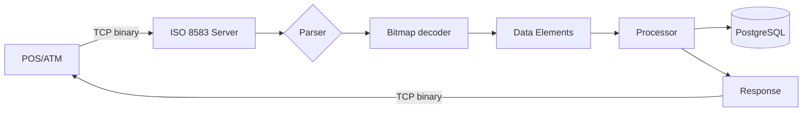

# 04 — ISO 8583 Simulator

**🇧🇷** Simulador de Mensagens Financeiras Binárias  
**🇬🇧** ISO 8583 Financial Message Simulator

---

Quando você passa um cartão de crédito na maquininha, o que acontece entre o "aprovar" e o "aprovado"?

Não é uma chamada HTTP. É uma mensagem binária via TCP. O padrão se chama ISO 8583 e é usado por todas as bandeiras — Visa, Mastercard, Elo — desde os anos 80.

A mensagem é uma estrutura binária compacta: 4 bytes de MTI, 8 bytes de bitmap, e campos de tamanho variável. Cada bit do bitmap indica se um campo está presente ou não. É eficiente, mas é um inferno de debugar.

---

## A arquitetura



```
┌──────────────┐     TCP      ┌──────────────┐     ┌──────────────┐
│   Client     │ ──────────── │  ISO 8583    │ ── │   Database   │
│  (POS/ATM)   │  Binary      │  Simulator   │     │  (Limits,    │
│              │  Messages    │              │     │   Cards)     │
└──────────────┘              └──────────────┘     └──────────────┘
```

---

## Como a mensagem funciona

```
┌─────────┬─────────┬──────────┬──────────────────────┐
│ MTI     │ Primary │ Secondary│   Data Elements      │
│ (4 hex) │ Bitmap  │ Bitmap   │   (variable length)  │
│         │ (8 hex) │ (8 hex)  │                      │
├─────────┼─────────┼──────────┼──────────────────────┤
│ 0200    │ F23C... │ (opcional│  PAN, Amount,        │
│         │         │  se bit 1│  Terminal, etc.      │
│         │         │  tiver 1)│                      │
└─────────┴─────────┴──────────┴──────────────────────┘
```

Cada bit do bitmap de 64 bits representa um campo. Bit 1 ligado = existe um bitmap secundário. Bit 2 ligado = campo PAN (número do cartão) está presente. E por aí vai.

---

## Resolução em TypeScript

### Parsing de bitmap

```typescript
function parseBitmap(hex: string): number[] {
  const bits: number[] = [];
  const buffer = Buffer.from(hex, 'hex');
  
  for (let byte = 0; byte < buffer.length; byte++) {
    for (let bit = 0; bit < 8; bit++) {
      if (buffer[byte] & (1 << (7 - bit))) {
        bits.push(byte * 8 + bit + 1);
      }
    }
  }
  
  return bits;
}
```

### Construção de mensagem

```typescript
function buildMessage(mti: string, fields: Map<number, string>): Buffer {
  const mtiBuf = Buffer.from(mti, 'ascii');
  
  // Determina quais campos estão presentes
  const presentFields = Array.from(fields.keys());
  const bitmap = buildBitmap(presentFields);
  
  // Codifica cada campo
  const elements = Buffer.concat(
    presentFields.map(fieldNum => {
      const value = fields.get(fieldNum)!;
      return encodeField(fieldNum, value);
    })
  );
  
  return Buffer.concat([mtiBuf, bitmap, elements]);
}

function encodeField(fieldNum: number, value: string): Buffer {
  switch (fieldNum) {
    case 2:  // PAN — LLVAR (length-prefixed)
      const len = Buffer.alloc(1, value.length);
      return Buffer.concat([len, Buffer.from(value, 'ascii')]);
    
    case 4:  // Amount — fixed 12 digits
      return Buffer.from(value.padStart(12, '0'), 'ascii');
    
    case 7:  // Transmission date/time — MMDDhhmmss
      return Buffer.from(value, 'ascii');
    
    default:
      return Buffer.from(value, 'ascii');
  }
}
```

### Respostas padrão

| Código | Significado |
|--------|-------------|
| 00 | Aprovado |
| 05 | Não honrar |
| 14 | Cartão inválido |
| 51 | Saldo insuficiente |
| 54 | Cartão vencido |
| 91 | Emissor indisponível |

---

## Resolução em Go

No Go, o tratamento de binário é mais explícito. Não tem `Buffer` mágico:

```go
package main

import (
    "encoding/binary"
    "encoding/hex"
    "net"
    "fmt"
)

type ISO8583Message struct {
    MTI    string
    Fields map[int]string
}

func ParseMessage(data []byte) (*ISO8583Message, error) {
    if len(data) < 12 {
        return nil, fmt.Errorf("mensagem muito curta")
    }

    msg := &ISO8583Message{
        MTI:    string(data[0:4]),
        Fields: make(map[int]string),
    }

    // Parse primary bitmap (bytes 4-11)
    bitmap := data[4:12]
    hasSecondary := bitmap[0]&0x80 != 0

    // Parse fields
    offset := 12
    if hasSecondary {
        offset = 20
    }

    for bit := 2; bit <= 128; bit++ {
        byteIndex := (bit - 1) / 8
        bitIndex := 7 - ((bit - 1) % 8)
        
        if byteIndex >= len(bitmap) {
            break
        }
        
        if bitmap[byteIndex]&(1<<bitIndex) != 0 {
            value, consumed := parseField(bit, data[offset:])
            msg.Fields[bit] = value
            offset += consumed
        }
    }

    return msg, nil
}

func parseField(bit int, data []byte) (string, int) {
    switch bit {
    case 2:
        // LLVAR: 1 byte length + value
        length := int(data[0])
        return string(data[1 : 1+length]), 1 + length
    case 4:
        // Fixed 12 bytes
        return string(data[:12]), 12
    default:
        return "", 0
    }
}

func BuildResponse(original *ISO8583Message, code string) []byte {
    response := &ISO8583Message{
        MTI: original.MTI[:2] + "10", // 0100 -> 0110, 0200 -> 0210
        Fields: map[int]string{
            39: code, // Response code
        },
    }
    return encodeMessage(response)
}
```

### Servidor TCP

```go
func main() {
    listener, _ := net.Listen("tcp", ":3004")
    fmt.Println("ISO 8583 server on :3004")

    for {
        conn, _ := listener.Accept()
        go handleConnection(conn)
    }
}

func handleConnection(conn net.Conn) {
    defer conn.Close()
    
    buf := make([]byte, 4096)
    
    for {
        n, err := conn.Read(buf)
        if err != nil {
            break
        }
        
        msg, err := ParseMessage(buf[:n])
        if err != nil {
            continue
        }
        
        fmt.Printf("MTI: %s\n", msg.MTI)
        
        response := BuildResponse(msg, "00")
        conn.Write(response)
    }
}
```

---

## Como testar

```bash
# TypeScript
pnpm --filter @banking/iso8583 dev

# Go
cd packages/backend/iso8583-go
go run .

# Conectar com netcat e enviar binário
printf '\x02\x00\xF2\x3C\x48\x20\x00\xC0\x80\x04\x06\x12\x34\x56\x78\x90\x12\x34\x00\x00\x00\x01\x00\x00\x50\x00' | nc localhost 3004
```

---

## Lições aprendidas

1. **ISO 8583 é mais eficiente que JSON** — Uma mensagem de autorização cabe em 128 bytes. O equivalente em XML teria 2KB.
2. **Bitmap é uma arte** — Cada bit representa um campo. Um bitmap bem montado reduz o tamanho da mensagem drasticamente.
3. **TCP raw é diferente de HTTP** — Não tem request/response mapping. Você precisa gerenciar conexões, timeouts, e reassembly.
4. **Go brilha aqui** — Parsing binário com Go é natural. TypeScript com Buffer funciona, mas Go com slices de bytes é mais idiomático.
