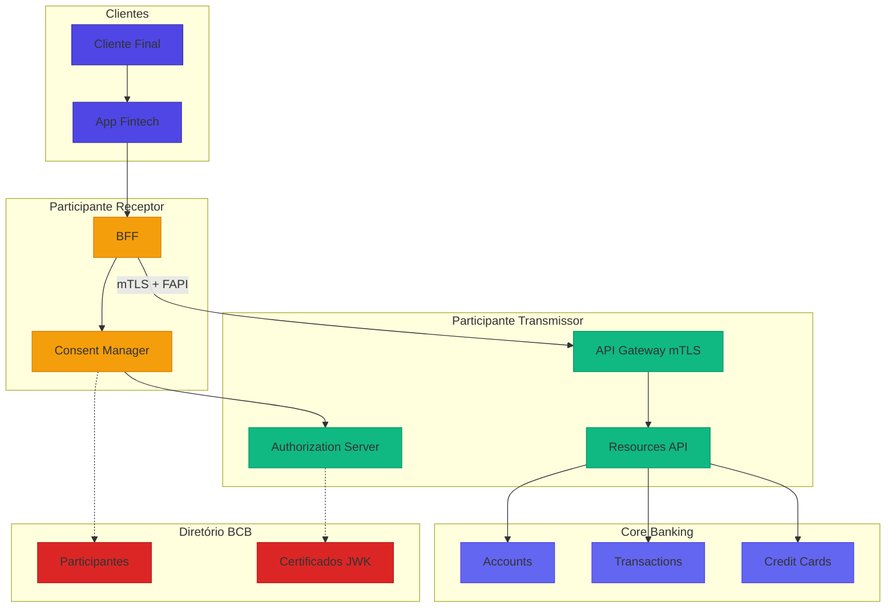
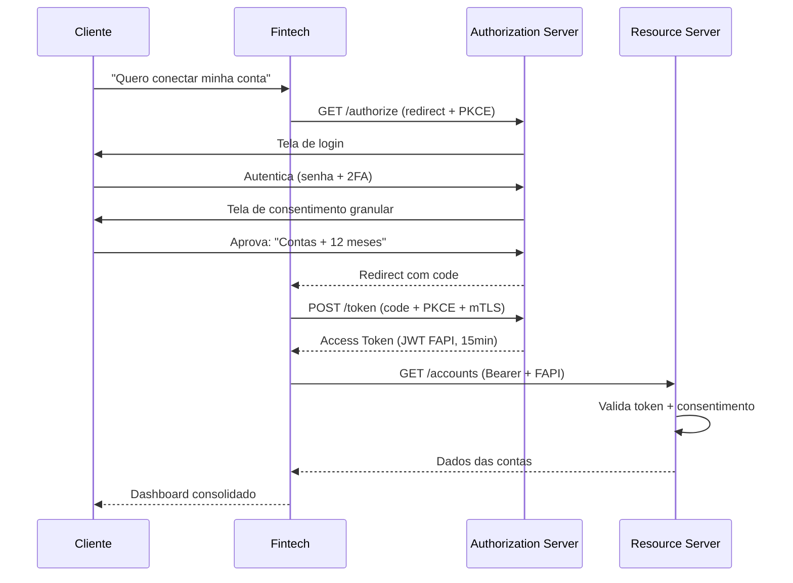
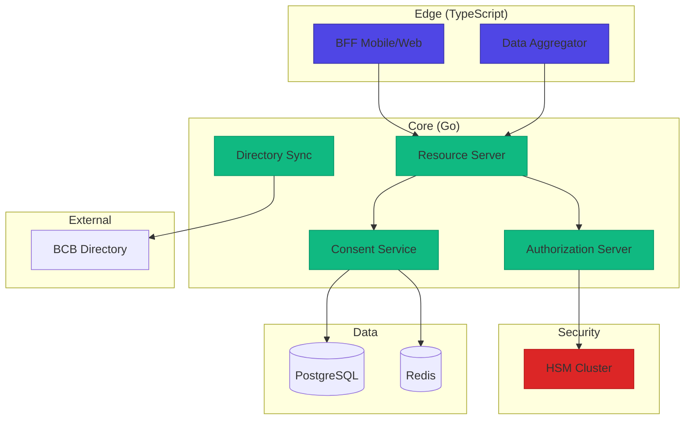

# Desafio 05: Open Finance Brasil — Compartilhamento de Dados com Consentimento

**🇧🇷** APIs Reguladas pelo Banco Central  
**🇬🇧** Regulated Open Finance APIs

---

O **Open Finance Brasil** é o sistema regulado pelo Banco Central que permite o **compartilhamento seguro de dados financeiros** entre instituições, **sempre com o consentimento do cliente**. É o maior e mais ambicioso do mundo em escopo — cobre contas, crédito, investimentos, seguros e câmbio.

## Switch: TypeScript vs Go

<LanguageToggle />

<div class="lang-content ts" style="display:block;">

### O que é Open Finance Brasil?

| Base Legal | Descrição |
|------------|-----------|
| **Lei 13.506/2017** | Autoriza o BCB a regular |
| **Resolução CMN 1/2020** | Marco regulatório |
| **LGPD (13.709/2018)** | Proteção de dados |
| **Resolução BCB 109/2021** | Consentimento |
| **Resolução Conjunta 1/2022** | Padrões técnicos |

| Princípio | Descrição |
|-----------|-----------|
| **Cliente é dono** | Dos seus dados financeiros |
| **Consentimento explícito** | Granular e revogável |
| **Segurança máxima** | mTLS, FAPI, JWS |
| **Reciprocidade** | Quem recebe também compartilha |
| **Padronização** | APIs e schemas únicos |

### As 4 Fases

| Fase | Período | Escopo |
|------|---------|--------|
| **1** | Nov/2021 | Dados Institucionais (agências, canais, produtos) |
| **2** | Ago/2022 | Dados Cadastrais e Transacionais (contas, saldos, cartões) |
| **3** | Dez/2022 | Iniciação de Pagamentos (PIX/Boletos via API) |
| **4** | Ago/2023 | Seguros, Previdência, Investimentos, Câmbio |

### Arquitetura Open Finance



### Fluxo de Consentimento



### FAPI Brasil — Segurança

| OAuth 2.0 Tradicional | FAPI Brasil |
|----------------------|-------------|
| Bearer token simples | JWT assinado (PS256) + mTLS |
| Client Secret | Private Key JWT |
| Tokens 1h+ | Tokens 15-60min |
| TLS simples | mTLS obrigatório |
| Sem auditoria | Logs obrigatórios |

### APIs Padronizadas

| Endpoint | Descrição |
|----------|-----------|
| `GET /accounts` | Lista contas |
| `GET /accounts/{id}/balances` | Saldos |
| `GET /accounts/{id}/transactions` | Transações |
| `GET /credit-cards-accounts` | Cartões de crédito |
| `GET /loans` | Empréstimos |
| `POST /consents` | Criar consentimento |
| `DELETE /consents/{id}` | Revogar |

### Domain Layer — Consent

```typescript
export enum ConsentStatus {
  AUTHORISED = 'AUTHORISED',
  AWAITING_AUTHORISATION = 'AWAITING_AUTHORISATION',
  REJECTED = 'REJECTED',
  REVOKED = 'REVOKED',
  EXPIRED = 'EXPIRED',
}

export enum ConsentPermission {
  ACCOUNTS_READ = 'ACCOUNTS_READ',
  CREDIT_CARDS_READ = 'CREDIT_CARDS_READ',
  LOANS_READ = 'LOANS_READ',
  FINANCINGS_READ = 'FINANCINGS_READ',
}

export class Consent extends Entity<string> {
  public isActive(): boolean {
    return this.props.status === ConsentStatus.AUTHORISED
      && new Date() <= this.props.expirationDateTime;
  }

  public hasPermission(perm: ConsentPermission): boolean {
    return this.props.permissions.includes(perm);
  }

  public revoke(reason: string = 'Revoked by user'): void {
    this.props.status = ConsentStatus.REVOKED;
    this.props.statusUpdateDateTime = new Date();
  }
}
```

### Authorization Server — FAPI

```typescript
export class AuthorizationServer {
  public async issueAccessToken(params: TokenRequest): Promise<TokenResponse> {
    // 1. Valida client_assertion (Private Key JWT)
    const clientJwk = await this.clientRegistry.getJWK(params.client_id);
    await verify(params.client_assertion, clientJwk, {
      issuer: params.client_id,
      audience: `${this.issuer}/token`,
      algorithms: ['PS256'],
    });

    // 2. Valida mTLS
    if (!this.validateMTLS(params.client_certificate, clientJwk)) {
      throw new InvalidClientError('mTLS mismatch');
    }

    // 3. Valida PKCE
    const hash = crypto.createHash('sha256').update(params.code_verifier).digest('base64url');
    if (hash !== authCode.code_challenge) {
      throw new InvalidGrantError('PKCE failed');
    }

    // 4. Emite token FAPI (15 min)
    const payload: FAPITokenPayload = {
      iss: this.issuer, sub: consent.id, aud: params.client_id,
      exp: now + 900, consent_id: consent.id, permissions: consent.permissions,
    };

    return { access_token: sign(payload, this.signingKey, { algorithm: 'PS256' }), expires_in: 900 };
  }
}
```

### Consent Service

```typescript
export class ConsentService {
  private static readonly MAX_EXPIRATION_DAYS = 365;

  public async createConsent(input: CreateConsentInput): Promise<Consent> {
    this.validatePermissions(input.permissions);
    this.validateExpiration(input.expirationDateTime);

    const consent = Consent.create({
      ...input, status: ConsentStatus.AWAITING_AUTHORISATION,
    });
    await this.consentRepo.save(consent);
    await this.auditLog.log({ action: 'CONSENT_CREATED', consentId: consent.id });
    return consent;
  }

  public async validateConsent(consentId: string, clientId: string, perm: ConsentPermission) {
    const consent = await this.consentRepo.findById(consentId);
    if (!consent || consent.clientId !== clientId) return { valid: false, reason: 'INVALID' };
    if (!consent.isActive()) return { valid: false, reason: `CONSENT_${consent.status}` };
    if (!consent.hasPermission(perm)) return { valid: false, reason: 'PERMISSION_NOT_GRANTED' };
    return { valid: true, consent };
  }
}
```

### Resource Server

```typescript
export class AccountsController {
  public async listAccounts(req: Request, res: Response) {
    const tokenValidation = await this.tokenVerifier.verify(req.headers.authorization!);
    if (!tokenValidation.valid) return res.status(401).json({ errors: [{ code: 'INVALID_TOKEN' }] });

    const consentValidation = await this.consentService.validateConsent(
      tokenValidation.payload.consent_id, tokenValidation.payload.client_id,
      ConsentPermission.ACCOUNTS_READ
    );
    if (!consentValidation.valid) return res.status(403).json({ errors: [{ code: 'CONSENT_INVALID' }] });

    const accounts = await this.accountRepo.findByUserDocument(
      consentValidation.consent!.props.loggedUser.document.identification
    );

    res.json({ data: accounts, meta: { totalRecords: accounts.length } });
  }
}
```

### Comparação: TypeScript vs Go

| Aspecto | TypeScript | Go |
|---------|-----------|-----|
| **JWT/JWS** | jose, jsonwebtoken | golang-jwt/jwt |
| **mTLS** | TLS nativo | net/http mTLS |
| **Crypto** | node crypto (ok) | stdlib completa |
| **Performance** | ~3K req/s | ~25K req/s |
| **Memory** | ~500MB | ~50MB |
| **Ecossistema** | Rico (Zod, Express) | Menos libs OF |

### Casos Reais

- **Itaú** (Java + Go) — Maior transmissor, 60M+ clientes, P99 < 50ms
- **Nubank** (Clojure + TS) — 80M+ clientes, consome 50+ APIs
- **Banco do Brasil** (Java) — 75M clientes, compliance rigoroso
- **Olé Consignado** (Go) — Fintech ágil, Open Finance desde dia 1

</div>

<div class="lang-content go" style="display:none;">

### Por que Go para Open Finance?

| Requisito | Go resolve com |
|-----------|----------------|
| **FAPI** | crypto/rsa, crypto/x509 nativos |
| **mTLS** | net/http com TLS config |
| **Alta escala** | Goroutines, sync.Map |
| **Performance** | 5-10x vs Node.js em crypto |
| **Binário único** | Deploy simples |

### Domain — Consent

```go
package domain

import "time"

type ConsentStatus string

const (
    ConsentStatusAuthorised   ConsentStatus = "AUTHORISED"
    ConsentStatusAwaiting     ConsentStatus = "AWAITING_AUTHORISATION"
    ConsentStatusRevoked      ConsentStatus = "REVOKED"
    ConsentStatusExpired      ConsentStatus = "EXPIRED"
)

type ConsentPermission string

const (
    PermissionAccountsRead  ConsentPermission = "ACCOUNTS_READ"
    PermissionCreditCards   ConsentPermission = "CREDIT_CARDS_READ"
    PermissionLoansRead     ConsentPermission = "LOANS_READ"
)

type Consent struct {
    ID                 string
    Status             ConsentStatus
    ClientID           string
    LoggedUser         LoggedUser
    Permissions        []ConsentPermission
    ExpirationDateTime time.Time
    CreatedAt          time.Time
}

const MaxConsentExpirationDays = 365

func (c *Consent) IsActive() bool {
    return c.Status == ConsentStatusAuthorised && time.Now().Before(c.ExpirationDateTime)
}

func (c *Consent) HasPermission(perm ConsentPermission) bool {
    for _, p := range c.Permissions {
        if p == perm { return true }
    }
    return false
}

func (c *Consent) Revoke(reason string) {
    c.Status = ConsentStatusRevoked
}
```

### Authorization Server — FAPI Completo

```go
package oauth2

import (
    "context"
    "crypto/rsa"
    "crypto/sha256"
    "crypto/x509"
    "encoding/base64"
    "errors"
    "time"
    "github.com/golang-jwt/jwt/v5"
)

type FAPITokenClaims struct {
    jwt.RegisteredClaims
    ConsentID   string   `json:"consent_id"`
    Permissions []string `json:"permissions"`
    ClientID    string   `json:"client_id"`
    Scope       string   `json:"scope"`
    CNF         *CNF     `json:"cnf,omitempty"`
}

type CNF struct {
    X5tS256 string `json:"x5t#S256"`
}

type AuthorizationServer struct {
    issuer         string
    signingKey     *rsa.PrivateKey
    keyID          string
    clientRegistry ClientRegistry
    consentRepo    ConsentRepository
    tokenBlacklist TokenBlacklist
    auditLog       AuditLogger
}

func (as *AuthorizationServer) IssueAccessToken(
    ctx context.Context, req TokenRequest,
) (*TokenResponse, error) {
    // 1. Valida Private Key JWT + mTLS
    client, err := as.authenticateClient(ctx, req.ClientID, req.ClientAssertion, req.ClientCert)
    if err != nil { return nil, err }

    // 2. Valida PKCE
    hash := sha256.Sum256([]byte(req.CodeVerifier))
    computed := base64.RawURLEncoding.EncodeToString(hash[:])
    if computed != authCode.CodeChallenge {
        return nil, errors.New("PKCE failed")
    }

    // 3. Busca consentimento
    consent, _ := as.consentRepo.FindByID(ctx, authCode.ConsentID)
    if consent == nil || !consent.IsActive() {
        return nil, errors.New("consent not active")
    }

    // 4. Emite token PS256 (15 min)
    now := time.Now()
    certThumbprint := calculateCertThumbprint(req.ClientCert)

    claims := FAPITokenClaims{
        RegisteredClaims: jwt.RegisteredClaims{
            Issuer:    as.issuer,
            Subject:   consent.ID,
            Audience:  jwt.ClaimStrings{req.ClientID},
            ExpiresAt: jwt.NewNumericDate(now.Add(15 * time.Minute)),
            ID:        generateUUID(),
        },
        ConsentID:   consent.ID,
        Permissions: consent.PermissionsAsStrings(),
        ClientID:    req.ClientID,
        CNF:         &CNF{X5tS256: certThumbprint},
    }

    token := jwt.NewWithClaims(jwt.SigningMethodPS256, claims)
    token.Header["kid"] = as.keyID
    token.Header["typ"] = "at+jwt"

    accessToken, err := token.SignedString(as.signingKey)
    if err != nil { return nil, err }

    as.auditLog.Log(ctx, AuditEvent{Action: "TOKEN_ISSUED", ConsentID: consent.ID})

    return &TokenResponse{
        AccessToken: accessToken, TokenType: "Bearer", ExpiresIn: 900,
    }, nil
}

func (as *AuthorizationServer) validateMTLS(cert *x509.Certificate, client *RegisteredClient) bool {
    hash := sha256.Sum256(cert.Raw)
    thumbprint := base64.RawURLEncoding.EncodeToString(hash[:])
    return thumbprint == client.CertificateThumbprint
}

func calculateCertThumbprint(cert *x509.Certificate) string {
    hash := sha256.Sum256(cert.Raw)
    return base64.RawURLEncoding.EncodeToString(hash[:])
}
```

### Resource Server — Accounts API

```go
package http

import (
    "encoding/json"
    "net/http"
    "time"
    "github.com/go-chi/chi/v5"
)

type AccountsHandler struct {
    consentService ConsentService
    accountRepo    AccountRepository
    tokenVerifier  TokenVerifier
}

func (h *AccountsHandler) ListAccounts(w http.ResponseWriter, r *http.Request) {
    claims, err := h.tokenVerifier.Verify(r.Context(), r.Header.Get("Authorization"))
    if err != nil {
        h.writeError(w, 401, "INVALID_TOKEN")
        return
    }

    validation, err := h.consentService.ValidateConsent(r.Context(), ValidationRequest{
        ConsentID: claims.ConsentID, ClientID: claims.ClientID,
        RequiredPermission: "ACCOUNTS_READ",
    })
    if err != nil || !validation.Valid {
        h.writeError(w, 403, "CONSENT_INVALID")
        return
    }

    accounts, _ := h.accountRepo.FindByUserDocument(r.Context(), validation.Consent.LoggedUser.Document.Identification)

    response := AccountsResponse{
        Data:  h.mapToOpenFinanceAccounts(accounts),
        Links: Links{Self: r.URL.Path},
        Meta:  Meta{TotalRecords: len(accounts), RequestDateTime: time.Now().UTC()},
    }

    w.Header().Set("Content-Type", "application/json")
    json.NewEncoder(w).Encode(response)
}

type OpenFinanceAccount struct {
    BrandName   string `json:"brandName"`
    CompanyCnpj string `json:"companyCnpj"`
    Type        string `json:"type"`
    CompeCode   string `json:"compeCode"`
    BranchCode  string `json:"branchCode"`
    Number      string `json:"number"`
    AccountID   string `json:"accountId"`
}

type AccountsResponse struct {
    Data  []OpenFinanceAccount `json:"data"`
    Links Links                `json:"links"`
    Meta  Meta                 `json:"meta"`
}

type Links struct {
    Self  string `json:"self"`
    First string `json:"first,omitempty"`
    Next  string `json:"next,omitempty"`
    Prev  string `json:"prev,omitempty"`
}

type Meta struct {
    TotalRecords    int       `json:"totalRecords"`
    TotalPages      int       `json:"totalPages,omitempty"`
    RequestDateTime time.Time `json:"requestDateTime"`
}
```

### mTLS Middleware

```go
package middleware

import (
    "context"
    "crypto/sha256"
    "crypto/x509"
    "encoding/base64"
    "net/http"
)

type MTLSMiddleware struct {
    clientRegistry ClientRegistry
}

func (m *MTLSMiddleware) Wrap(next http.Handler) http.Handler {
    return http.HandlerFunc(func(w http.ResponseWriter, r *http.Request) {
        var clientCert *x509.Certificate

        if r.TLS != nil && len(r.TLS.PeerCertificates) > 0 {
            clientCert = r.TLS.PeerCertificates[0]
        }

        if clientCert == nil {
            http.Error(w, `{"error":"missing_client_certificate"}`, 401)
            return
        }

        thumbprint := calculateCertThumbprint(clientCert)
        participant, err := m.clientRegistry.GetByCertificateThumbprint(r.Context(), thumbprint)
        if err != nil || participant.Status != "ACTIVE" {
            http.Error(w, `{"error":"unregistered_participant"}`, 401)
            return
        }

        ctx := context.WithValue(r.Context(), "participant", participant)
        w.Header().Set("x-fapi-interaction-id", r.Header.Get("x-fapi-interaction-id"))
        next.ServeHTTP(w, r.WithContext(ctx))
    })
}
```

### Directory Sync — Integração BCB

```go
package directory

import (
    "context"
    "sync"
    "time"
    "go.uber.org/zap"
)

type DirectorySync struct {
    bcbURL       string
    participants map[string]*Participant
    jwksCache    map[string]*JWKS
    mu           sync.RWMutex
    logger       *zap.Logger
    syncInterval time.Duration
}

func (d *DirectorySync) Start(ctx context.Context) {
    d.sync(ctx)
    go func() {
        ticker := time.NewTicker(d.syncInterval)
        defer ticker.Stop()
        for {
            select {
            case <-ctx.Done(): return
            case <-ticker.C: d.sync(ctx)
            }
        }
    }()
}

func (d *DirectorySync) sync(ctx context.Context) {
    participants, err := d.fetchParticipants(ctx)
    if err != nil { return }

    d.mu.Lock()
    d.participants = make(map[string]*Participant, len(participants))
    for _, p := range participants { d.participants[p.ClientID] = p }
    d.mu.Unlock()

    d.syncJWKS(ctx, participants)
}

func (d *DirectorySync) IsParticipantRegistered(ctx context.Context, clientID string) bool {
    d.mu.RLock()
    defer d.mu.RUnlock()
    p, ok := d.participants[clientID]
    return ok && p.Status == "ACTIVE"
}
```

### Benchmark: Go vs TypeScript

| Endpoint | TS P99 | Go P99 | TS Throughput | Go Throughput |
|----------|--------|--------|---------------|---------------|
| /token | 180ms | 12ms | 400/s | 2800/s |
| /accounts | 85ms | 5ms | 900/s | 6200/s |
| Alta carga | 450ms | 18ms | 1800/s | 13500/s |

### Casos Reais

- **Itaú** (Go + Java) — Authorization server em Go, P99 < 50ms
- **Bradesco** (Go) — Stack 100% Go, Kubernetes
- **Banco do Brasil** (Java) — Core legado, HSM Thales
- **Nubank** (Clojure + TS) — Líder em receptores, 80M+ clientes

### Arquitetura Híbrida



**Regra de ouro:** Go para o core regulatório (Authorization Server, Consent, Resources), TypeScript para o edge (BFFs, agregadores, dashboards).

</div>

---

## Como testar

```bash
# TypeScript
pnpm --filter @banking/open-finance dev

# Go
cd packages/backend/open-finance-go
go run .

# Criar consentimento
curl -X POST http://localhost:3006/open-banking/consents/v1/consents \
  -H "Content-Type: application/json" \
  -d '{"loggedUser":{"document":{"identification":"12345678901","rel":"CPF"}},"permissions":["ACCOUNTS_READ"],"expirationDateTime":"2025-12-31T23:59:59Z"}'
```

---

## Lições aprendidas

1. **Consentimento é o coração** — Sem ele, nenhum dado pode ser compartilhado
2. **FAPI não é OAuth simples** — mTLS + PS256 + Private Key JWT são obrigatórios
3. **Tokens curtos** — 15 minutos máximo, com cert binding
4. **Diretório BCB** — Sincronize a cada 5 minutos
5. **Logs obrigatórios** — 5 anos mínimo (LGPD + BCB)
6. **mTLS em tudo** — Não é opcional em produção
7. **Go domina crypto** — 10x mais rápido que Node.js em FAPI
8. **Reciprocidade** — Quem recebe também compartilha
9. **Granularidade** — Permissões específicas, não tudo ou nada
10. **Maior Open Finance do mundo** — E cresce a cada fase
