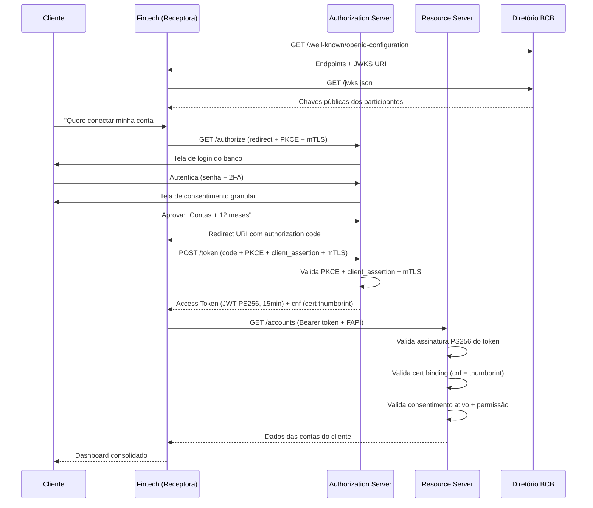
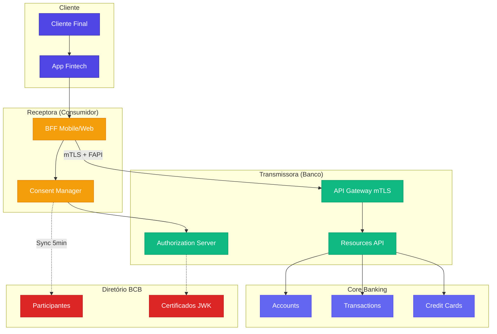
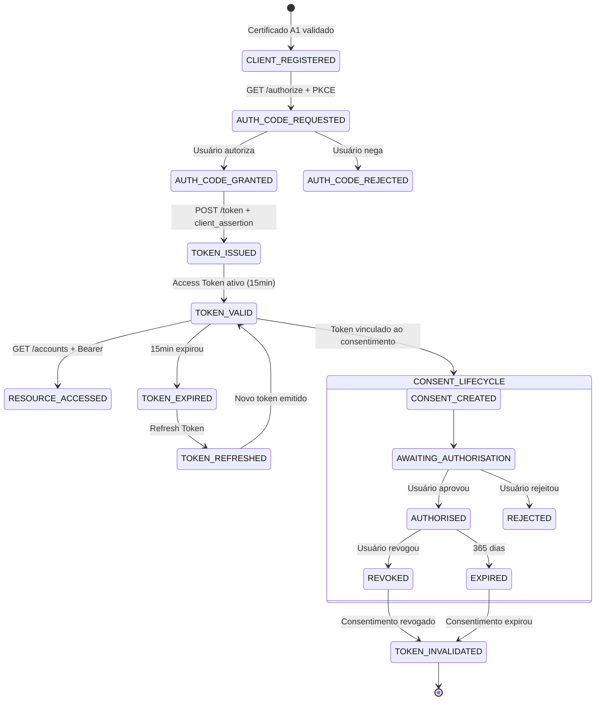
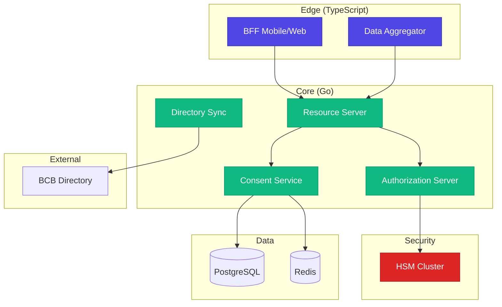

# Desafio 05: Open Finance Brasil — Compartilhamento de Dados com Consentimento

**🇧🇷** APIs Reguladas pelo Banco Central — O Maior Open Finance do Mundo  
**🇬🇧** Regulated Open Finance APIs — Brazil's World-Leading Open Finance System

---

## 🎯 Objetivos de Aprendizado

- Implementar Authorization Server compatível com FAPI Brasil (mTLS + PS256 + Private Key JWT)
- Modelar o ciclo de vida completo de consentimento: criação, autorização, revogação, expiração
- Construir Resource Server que valida token e permissões antes de liberar dados
- Sincronizar diretório de participantes com JWKS rotation
- Dominar os fluxos de OAuth 2.0 FAPI com PKCE obrigatório e client assertion

---

## 📋 Pré-requisitos

### 🧠 Conceitos
- Open Finance Brasil (fases 1-4 do BCB)
- OAuth 2.0 Authorization Code Flow
- FAPI 1.0 (Financial-grade API)
- mTLS (Mutual TLS)
- PKI e certificados ICP-Brasil

### 📚 Desafios Anteriores
- [Desafio 03: DICT](/challenges/03-dict) — conceitos de resolução distribuída e cache aplicados ao diretório de participantes

### 🛠️ Ferramentas
- OpenSSL (geração de certificados X.509)
- Docker
- PostgreSQL

### 💻 Técnico
- TypeScript, Node.js 20+
- JWT/JWS/JWE, JWKS
- PKCE
- REST APIs com autenticação mTLS

---

## 📖 Abertura — O Que é Open Finance?

"Fato curioso: deixa eu te contar uma história que começou na Europa em 2015. A União Europeia aprovou a PSD2 — Payment Services Directive 2 — e o mundo bancário nunca mais foi o mesmo. Pela primeira vez, os bancos eram obrigados a abrir os dados dos clientes... se o cliente quisesse.

Só que a Europa fez um negócio meio tímido. Cada país implementou do seu jeito, cada banco interpretou a especificação de um jeito, e no final virou uma zona. A Inglaterra tentou organizar com o Open Banking, mas o escopo era limitado — só contas e pagamentos.

Aí chega o Brasil.

O Banco Central do Brasil — que pelo amor de deus, é um dos bancos centrais mais avançados do mundo — olhou pra PSD2 e falou: 'Vamos fazer melhor'. Não só contas e pagamentos. **Contas, crédito, investimentos, seguros, câmbio, previdência.** Tudo. E com uma especificação única, padronizada, obrigatória para todas as instituições com mais de 10 milhões de clientes.

Isso é o **Open Finance Brasil**. Maior escopo do mundo. Mais de 800 instituições participantes. 100+ milhões de clientes impactados. E uma segurança que faria qualquer CISO europeu chorar de alegria: mTLS obrigatório, JWT assinado com PS256, consentimento granular por escopo, certificado digital A1, diretório centralizado.

Enquanto o mundo discute 'Open Banking', o Brasil já está na fase 4 de Open Finance com seguros, investimentos e câmbio. É o maior do mundo em escopo e ambição."

Mas calma. Vamos colocar a coisa em perspectiva. O Reino Unido começou antes de todo mundo. Em 2016, a Competition and Markets Authority (CMA) emitiu o famoso *CMA Order 2017* — uma ordem regulatória que obrigava os 9 maiores bancos britânicos (os CMA9: Barclays, HSBC, Lloyds, RBS, Santander UK, entre outros) a abrir dados de contas correntes via APIs padronizadas. Foi o primeiro experimento do mundo de Open Banking obrigatório por lei. O CMA9 implementou a especificação do Open Banking Implementation Entity (OBIE), que definiu o padrão técnico baseado em OAuth 2.0 com perfis de segurança FAPI.

O Reino Unido provou que dava certo — mas o escopo era tímido: apenas *current accounts* (contas correntes) e *payment initiation*. Nada de crédito, investimento, seguro ou câmbio. Mesmo assim, o ecossistema britânico gerou fintechs como Monzo, Starling e Revolut, que usaram esses dados abertos para oferecer experiências que os bancos tradicionais nunca conseguiram.

Enquanto isso, a Europa continental seguia com a PSD2, que entrou em vigor em 2018. A PSD2 foi um marco regulatório — obrigou todos os bancos europeus a disponibilizar APIs de acesso a contas (AIS — Account Information Service) e iniciação de pagamentos (PIS — Payment Initiation Service). Mas o problema da PSD2 foi a falta de padronização técnica. Cada país definiu seus próprios padrões: Alemanha usava o Berlin Group, França usava o STET, UK usava OBIE. Um aggregator como o Tink ou o Yolt precisava implementar dezenas de adaptadores diferentes para falar com bancos de países diferentes. A fragmentação era o custo oculto da regulação descentralizada.

Agora olha o Brasil. O Banco Central fez diferente: em vez de esperar o mercado se autorregular, o BCB pegou a experiência internacional (o que deu certo no UK, o que deu errado na PSD2), escreveu uma especificação técnica de 300 páginas, definiu schemas JSON obrigatórios, escolheu um perfil de segurança único (FAPI Brasil), e disparou: fase 1 em novembro de 2021, fase 2 em agosto de 2022, fase 3 em dezembro de 2022, fase 4 em agosto de 2023. Cada fase com datas de *go-live* obrigatórias e penalidades para instituições que não cumprissem.

O que muda para o consumidor? Tudo. Pela primeira vez na história do sistema financeiro brasileiro, o cliente é dono dos seus dados. Ele pode entrar no app da sua fintech preferida — pode ser um Guiabolso, um Organizze, um Nubank, um PicPay — e dizer: "Quero que você acesse minha conta no Banco do Brasil, no Itaú, no Santander." A fintech então pede consentimento explícito, o cliente aprova no app do banco transmissor, e pronto: os dados de todas as contas aparecem num dashboard consolidado. Sem planilha. Sem extrato em PDF. Sem digitar senha do banco em app de terceiro. O consentimento é revogável a qualquer momento — o cliente clica "Revogar" e a conexão morre.

Isso gera uma mudança de poder brutal. Os cinco maiores bancos brasileiros (Itaú, Bradesco, Banco do Brasil, Caixa, Santander) controlavam historicamente 80% do mercado de crédito e tinham acesso exclusivo ao histórico financeiro dos clientes. Com Open Finance, uma fintech nova, um banco digital, uma cooperativa de crédito — qualquer instituição autorizada — pode acessar (com consentimento) o mesmo histórico que o bancão tem. Isso nivela o campo de jogo. O cliente pode levar seu histórico de bom pagador para onde quiser negociar taxas melhores. A competição finalmente chega ao crédito brasileiro.

A comparação internacional deixa o Brasil em posição única. Os EUA ainda não têm Open Banking regulado — o CFPB emitiu a Seção 1033 do Dodd-Frank Act em outubro de 2024, mas a implementação é voluntária e fragmentada, com Screen Scraping ainda sendo a prática dominante via Plaid e Yodlee. A Austrália tem o Consumer Data Right (CDR), que é o segundo mais abrangente do mundo depois do Brasil. O México tem Open Banking previsto na Lei Fintech de 2018, mas a implementação está atrasada. A Índia tem o Account Aggregator Framework, que é uma abordagem diferente — focado em dados financeiros com consentimento digital gerenciado por RBI-licensed NBFC-AA. Nenhum deles chega perto da amplitude do Open Finance Brasil: contas, cartões, empréstimos, financiamentos, investimentos, seguros, previdência, câmbio, credenciamento, iniciação de pagamentos. Tudo padronizado, tudo obrigatório.

---

## 🔥 O Problema

"Sabe, você acha que integrar com um banco é difícil? Tenta integrar com 20."

O problema real do Open Finance não é a especificação — é a **heterogeneidade disfarçada de padronização**. Teoricamente, todas as instituições seguem o mesmo spec de 300 páginas do BCB. Na prática:

1. **Cada banco implementa a especificação com suas interpretações** — O Itaú usa Java + Go, o Nubank usa Clojure + TypeScript, o Bradesco vai de Go puro, o Banco do Brasil usa Java legado. Cada um tem sua própria noção de "Compatível com FAPI".

2. **O fluxo de consentimento é complexo demais pra improvisar** — O cliente precisa: (a) autenticar no banco transmissor, (b) escolher quais dados compartilhar granularmente, (c) aprovar o consentimento com validade específica, (d) ter a opção de revogar a qualquer momento. Isso não é um simples `POST /login`.

3. **Segurança em múltiplas camadas que nenhuma pode falhar** — mTLS pra autenticação mútua entre servidores, PS256 pra assinatura de token JWT, PKCE obrigatório (não opcional como no OAuth padrão), client assertion com Private Key JWT. Se qualquer uma dessas camadas falhar, a integração quebra.

4. **Certificados digitais expiram, chaves rotacionam, diretórios sincronizam** — Cada participante tem certificados que expiram. O diretório do BCB precisa ser sincronizado a cada 5 minutos. Se sua JWK cache ficou desatualizado, você rejeita tokens válidos ou aceita tokens inválidos.

Cada um desses problemas tem solução: **Authorization Server FAPI-compliant**, **Consent Manager com ciclo de vida**, **Resource Server com validação em duas camadas** (token + consentimento), **Directory Sync com cache e retry**.

Mas deixa eu aprofundar. A complexidade de certificação FAPI não é brincadeira. O Financial-grade API Security Profile — desenvolvido pelo OpenID Foundation em parceria com o UK Open Banking — define requisitos de segurança que vão muito além do OAuth 2.0 padrão. FAPI 1.0 Baseline exige: Authorization Code Flow com PKCE obrigatório, client authentication via `private_key_jwt`, tokens JWT assinados com PS256 ou ES256, `state` parameter obrigatório (com entropia mínima de 128 bits), e mTLS como mecanismo de holder-of-key. Isso significa que cada participante precisa gerar e manter chaves RSA de 2048+ bits, certificados x509 emitidos por ICP-Brasil (A1 ou A3), e registrá-los no diretório do BCB. Qualquer erro na cadeia de certificação — certificado expirado, CA não confiável, chave privada comprometida — derruba toda a integração.

O gerenciamento de consentimento não é um CRUD simples. O ciclo de vida do consentimento tem múltiplos estados e transições: `AWAITING_AUTHORISATION` → `AUTHORISED` → `CONSUMED` ou `REVOKED` → `EXPIRED`. Cada transição gera evento de auditoria. A revogação precisa ser propagada para todos os sistemas downstream — se o Resource Server não foi notificado que o consentimento foi revogado, ele continua liberando dados. A expiração pode ser configurada pelo cliente (até 365 dias) e o vencimento precisa ser respeitado mesmo que o banco transmissor tenha caído por 3 dias. E tem o cenário de *re-authentication*: depois que o consentimento expira, o cliente precisa passar pelo fluxo completo de novo — não basta renovar silenciosamente.

E o pior: múltiplos bancos significam múltiplas implementações não padronizadas *apesar da especificação*. O Itaú pode exigir um campo a mais no request body que não está no spec. O Nubank pode retornar um HTTP 200 com body de erro (sim, acontece). O Banco do Brasil pode ter rate limiting agressivo (429 Too Many Requests) em horário de pico. O Bradesco pode exigir `x-fapi-interaction-id` em *todos* os headers, enquanto o spec diz que é opcional. O Santander pode interpretar `expirationDateTime` como UTC enquanto outro banco interpreta como GMT-3. Cada banco é uma caixa de surpresas. Uma receptora que consome 50 instituições diferentes precisa de 50 adaptadores, 50 conjuntos de testes, 50 políticas de retry.

Por último, o problema do *onboarding* de participantes. Para uma fintech nova entrar no ecossistema, ela precisa: (1) obter certificado A1 da ICP-Brasil, (2) registrar-se no diretório do BCB com seu `client_id`, certificados e JWKS endpoint, (3) implementar *todas* as APIs de transmissora (sim, reciprocidade é obrigatória — se você consome dados, também precisa expor os seus), (4) passar pelo processo de certificação funcional do BCB, (5) configurar mTLS em todos os endpoints. O processo leva meses, custa centenas de milhares de reais em infraestrutura e compliance, e é um barrier-to-entry enorme para startups.

---

## 🏗️ Arquitetura Geral

O Open Finance Brasil define quatro papéis principais:

| Papel | Responsabilidade |
|-------|-----------------|
| **Cliente (usuário final)** | Dona dos dados, decide o que compartilhar |
| **Receptora (fintech/app)** | Consome os dados do cliente em outros bancos |
| **Transmissora (banco)** | Expõe os dados via APIs padronizadas |
| **Diretório (BCB)** | Central de participantes, certificados e JWKS |

### Fluxo de Consentimento e Dados



### Arquitetura de Participantes



### Contraste: OAuth Tradicional vs FAPI Brasil

| OAuth 2.0 Tradicional | FAPI Brasil |
|----------------------|-------------|
| Bearer token simples (qualquer um que tem o token acessa) | JWT assinado (PS256) + mTLS + cert binding (cnf) |
| Client Secret (simétrico, compartilhado) | Private Key JWT (assimétrico, cada um com sua chave) |
| Tokens 1h+ (longa duração) | Tokens 15-60min (curtíssimos, com refresh) |
| TLS simples (só servidor prova identidade) | mTLS obrigatório (ambos provam identidade) |
| Sem auditoria | Logs obrigatórios por 5 anos (LGPD + BCB) |
| PKCE recomendado | PKCE obrigatório, sem exceção |

---

### FAPI Security — O Ciclo de Vida do Token



## Switch: TypeScript vs Go

<LanguageToggle />

<div class="Lang-content ts" style="Display:block;">

### O que é Open Finance Brasil?

| Base Legal | Descrição |
|------------|-----------|
| **Lei 13.506/2017** | Autoriza o BCB a regular |
| **Resolução CMN 1/2020** | Marco regulatório |
| **LGPD (13.709/2018)** | Proteção de dados |
| **Resolução BCB 109/2021** | Consentimento |
| **Resolução Conjunta 1/2022** | Padrões técnicos |

| Princípio | Descrição |
|-----------|-----------|
| **Cliente é dono** | Dos seus dados financeiros |
| **Consentimento explícito** | Granular e revogável |
| **Segurança máxima** | mTLS, FAPI, JWS |
| **Reciprocidade** | Quem recebe também compartilha |
| **Padronização** | APIs e schemas únicos |

### As 4 Fases

| Fase | Período | Escopo |
|------|---------|--------|
| **1** | Nov/2021 | Dados Institucionais (agências, canais, produtos) |
| **2** | Ago/2022 | Dados Cadastrais e Transacionais (contas, saldos, cartões) |
| **3** | Dez/2022 | Iniciação de Pagamentos (PIX/Boletos via API) |
| **4** | Ago/2023 | Seguros, Previdência, Investimentos, Câmbio |

### APIs Padronizadas

| Endpoint | Descrição |
|----------|-----------|
| `GET /accounts` | Lista contas |
| `GET /accounts/{id}/balances` | Saldos |
| `GET /accounts/{id}/transactions` | Transações |
| `GET /credit-cards-accounts` | Cartões de crédito |
| `GET /loans` | Empréstimos |
| `POST /consents` | Criar consentimento |
| `DELETE /consents/{id}` | Revogar |

O Open Finance é, antes de tudo, um exercício de engenharia de plataforma. Você não está simplesmente chamando uma API REST — está orquestrando um protocolo de segurança multi-camada com consentimento do usuário, validação criptográfica em cada passo, e sincronização contínua com um diretório central. Quando você implementa uma receptora, você precisa de pelo menos quatro componentes: um OAuth 2.0 Client que faz o Authorization Code Flow com PKCE e mTLS, um Consent Manager que persiste e gerencia o ciclo de vida de cada consentimento, um Token Manager que renova access tokens antes de expirarem (15 minutos passam voando em produção), e um Data Aggregator que consolida dados de múltiplas transmissoras. Cada um desses componentes tem sua própria complexidade. O OAuth Client precisa lidar com PKCE (Proof Key for Code Exchange) — um mecanismo que protege o authorization code de ser interceptado. Basicamente, antes de iniciar o fluxo, o cliente gera um `code_verifier` aleatório (string de 43-128 caracteres com alta entropia), deriva um `code_challenge` via SHA256 + base64url, e envia o challenge no GET /authorize. Depois, no POST /token, ele envia o `code_verifier` original. O Authorization Server recalcula o challenge a partir do verifier e compara — se não bater, o code foi interceptado e o token não é emitido.

### Domain Layer — Consent

```typescript
export enum ConsentStatus {
  AUTHORISED = 'AUTHORISED',
  AWAITING_AUTHORISATION = 'AWAITING_AUTHORISATION',
  REJECTED = 'REJECTED',
  REVOKED = 'REVOKED',
  EXPIRED = 'EXPIRED',
}

export enum ConsentPermission {
  ACCOUNTS_READ = 'ACCOUNTS_READ',
  CREDIT_CARDS_READ = 'CREDIT_CARDS_READ',
  LOANS_READ = 'LOANS_READ',
  FINANCINGS_READ = 'FINANCINGS_READ',
}

export class Consent extends Entity<string> {
  public isActive(): boolean {
    return this.props.status === ConsentStatus.AUTHORISED
      && new Date() <= this.props.expirationDateTime;
  }

  public hasPermission(perm: ConsentPermission): boolean {
    return this.props.permissions.includes(perm);
  }

  public revoke(reason: string = 'Revoked by user'): void {
    this.props.status = ConsentStatus.REVOKED;
    this.props.statusUpdateDateTime = new Date();
  }
}
```

## 👨‍💻 Mão na Massa

"Bora codar. O bagulho é o seguinte: Open Finance parece complexo porque é — mas a parte mais importante é o Authorization Server. É ele que:

1. Valida o cliente (mTLS + client assertion)
2. Gera o authorization code
3. Troca o code por token (validando PKCE)
4. Emite o JWT assinado com PS256
5. Vincula o token ao consentimento

Vou te mostrar cada peça."

Antes de mergulhar no código, vamos entender o fluxo OAuth 2.0 Authorization Code como ele realmente funciona no contexto FAPI. O fluxo começa quando o usuário clica "Conectar conta do Banco X" no app da fintech. O backend da fintech gera um par PKCE (`code_verifier` + `code_challenge`), monta uma URL de autorização com `response_type=code`, `client_id`, `redirect_uri`, `scope=consent:{consentId} accounts`, `code_challenge`, `code_challenge_method=S256`, e `state` (string aleatória de 128+ bits de entropia que previne CSRF). O usuário é redirecionado para essa URL — que é o endpoint `/authorize` do banco transmissor. A conexão é mTLS: ambos os lados trocam certificados. O banco verifica que o certificado da fintech está registrado no diretório do BCB. O usuário faz login (senha + 2FA) e vê a tela de consentimento granular: "A fintech X quer acessar: [✓] Contas [✓] Saldos [  ] Transações [  ] Cartões de crédito. Validade: 12 meses." O usuário aprova. O banco redireciona de volta para a `redirect_uri` da fintech com o `authorization code` e o `state` original.

Agora o passo crítico: a troca do code por token. A fintech faz POST no `/token` com `grant_type=authorization_code`, `code`, `redirect_uri`, `code_verifier`, e `client_assertion`. O `client_assertion` é um JWT assinado pela chave privada da fintech, contendo `iss` = client_id, `sub` = client_id, `aud` = issuer do banco, `exp` = now + 5min, `jti` = UUID único. Esse JWT é assinado com PS256. O banco valida: (a) a assinatura do client_assertion usando a chave pública do JWKS da fintech (que está no diretório), (b) que o certificado mTLS da conexão corrente corresponde ao thumbprint registrado no diretório, (c) que o PKCE challenge bate com o verifier, (d) que o authorization code não expirou (60 segundos), (e) que o client_id do code é o mesmo do client_assertion. Se tudo passar, o banco emite um access token JWT assinado com PS256, contendo `sub` = consent_id, `cnf.x5t#S256` = thumbprint do certificado da fintech, `exp` = now + 15min. Esse `cnf` (confirmation) é o token binding que mata o vetor de token roubado.

E tem o refresh token. Quando o access token de 15 minutos expira, a fintech não pode pedir um novo consentimento do usuário — isso seria péssima UX. Em vez disso, o fluxo de refresh: POST `/token` com `grant_type=refresh_token`, `refresh_token`, e um novo `client_assertion`. O banco valida que o refresh token não foi revogado (consentimento ativo, sem violação de segurança), e emite um novo access token sem interação do usuário. Refresh tokens têm validade mais longa (24h-30d dependendo do banco), mas também podem ser revogados a qualquer momento pelo usuário ao revogar o consentimento.

Outra peça fundamental que não aparece diretamente no código mas está sempre presente: o **JWKS endpoint**. Cada participante publica um endpoint `GET /.well-known/jwks.json` que expõe suas chaves públicas no formato JSON Web Key Set. É de lá que o Authorization Server pega a chave pública para validar o `client_assertion`. O diretório do BCB centraliza as URLs de todos os JWKS endpoints. A rotação de chaves é um capítulo à parte: as chaves expiram, novas chaves são publicadas no JWKS antes da expiração (com `kid` diferente), e existe um período de overlap onde ambas são válidas. Se você não implementar a rotação corretamente, vai rejeitar tokens assinados com a chave nova que você ainda não baixou — e isso derruba 100% das integrações daquela instituição.

E tem o **DCR — Dynamic Client Registration**. No Open Finance Brasil, o registro de clientes não é dinâmico como no OAuth 2.0 tradicional (onde um cliente faz POST `/register` e recebe um `client_id`). O registro é feito pelo BCB: a instituição se cadastra no diretório com seus certificados e metadados, e o BCB atribui um `client_id`. Os participantes sincronizam esse diretório a cada 5 minutos. Não existe self-registration via API — o fluxo é offline, regulatório, com validação documental. Isso torna o ecossistema mais seguro (ninguém cria client_id falso), mas também mais lento para onboard (cada novo participante leva semanas para aparecer no diretório).

### Authorization Server — FAPI

```typescript
export class AuthorizationServer {
  public async issueAccessToken(params: TokenRequest): Promise<TokenResponse> {
    // 1. Valida client_assertion (Private Key JWT)
    const clientJwk = await this.clientRegistry.getJWK(params.client_id);
    await verify(params.client_assertion, clientJwk, {
      issuer: params.client_id,
      audience: `${this.issuer}/token`,
      algorithms: ['PS256'],
    });

    // 2. Valida mTLS
    if (!this.validateMTLS(params.client_certificate, clientJwk)) {
      throw new InvalidClientError('mTLS mismatch');
    }

    // 3. Valida PKCE
    const hash = crypto.createHash('sha256').update(params.code_verifier).digest('base64url');
    if (hash !== authCode.code_challenge) {
      throw new InvalidGrantError('PKCE failed');
    }

    // 4. Emite token FAPI (15 min)
    const payload: FAPITokenPayload = {
      iss: this.issuer, sub: consent.id, aud: params.client_id,
      exp: now + 900, consent_id: consent.id, permissions: consent.permissions,
    };

    return { access_token: sign(payload, this.signingKey, { algorithm: 'PS256' }), expires_in: 900 };
  }
}
```

"Repara que o algoritmo é `PS256`, não `RS256`. O **PS** (Probabilistic Signature) usa PSS padding ao invés de PKCS1v1.5. O PSS é mais seguro porque é randomizado — cada assinatura do mesmo payload gera um resultado diferente. O PKCS1v1.5 é determinístico. O FAPI Brasil exige PS256 justamente pra evitar ataques de forging que o PKCS1v1.5 sofreu nos últimos anos."

### Consent Service — O Dono do Ciclo de Vida

```typescript
export class ConsentService {
  private static readonly MAX_EXPIRATION_DAYS = 365;

  public async createConsent(input: CreateConsentInput): Promise<Consent> {
    this.validatePermissions(input.permissions);
    this.validateExpiration(input.expirationDateTime);

    const consent = Consent.create({
      ...input, status: ConsentStatus.AWAITING_AUTHORISATION,
    });
    await this.consentRepo.save(consent);
    await this.auditLog.log({ action: 'CONSENT_CREATED', consentId: consent.id });
    return consent;
  }

  public async validateConsent(consentId: string, clientId: string, perm: ConsentPermission) {
    const consent = await this.consentRepo.findById(consentId);
    if (!consent || consent.clientId !== clientId) return { valid: false, reason: 'INVALID' };
    if (!consent.isActive()) return { valid: false, reason: `CONSENT_${consent.status}` };
    if (!consent.hasPermission(perm)) return { valid: false, reason: 'PERMISSION_NOT_GRANTED' };
    return { valid: true, consent };
  }
}
```

A validação de permissões é granular mesmo dentro do consentimento. Um cliente pode autorizar `ACCOUNTS_READ` mas não `ACCOUNTS_TRANSACTIONS_READ`. Isso significa que o Resource Server precisa verificar a permissão específica para cada endpoint, não apenas "Consentimento ativo". O `ConsentPermission` é um enum mapeado diretamente dos scopes do Open Finance Brasil. Cada endpoint de resource tem um permission mapping — `/accounts` mapeia para `ACCOUNTS_READ`, `/accounts/{id}/transactions` mapeia para `ACCOUNTS_TRANSACTIONS_READ`, e assim por diante. Essa granularidade é o que permite ao cliente compartilhar apenas o extrato do mês sem compartilhar o limite do cheque especial.

### Resource Server — A Porta dos Dados

```typescript
export class AccountsController {
  public async listAccounts(req: Request, res: Response) {
    const tokenValidation = await this.tokenVerifier.verify(req.headers.authorization!);
    if (!tokenValidation.valid) return res.status(401).json({ errors: [{ code: 'INVALID_TOKEN' }] });

    const consentValidation = await this.consentService.validateConsent(
      tokenValidation.payload.consent_id, tokenValidation.payload.client_id,
      ConsentPermission.ACCOUNTS_READ
    );
    if (!consentValidation.valid) return res.status(403).json({ errors: [{ code: 'CONSENT_INVALID' }] });

    const accounts = await this.accountRepo.findByUserDocument(
      consentValidation.consent!.props.loggedUser.document.identification
    );

    res.json({ data: accounts, meta: { totalRecords: accounts.length } });
  }
}
```

A diferença entre código HTTP 401 e 403 aqui é importante: 401 é "Você não provou quem é" (token inválido, expirado, ou assinatura incorreta); 403 é "Você provou quem é, mas não tem permissão pra acessar este recurso" (consentimento revogado, expirado, ou permissão não concedida). A especificação do Open Finance Brasil é explícita sobre qual código usar em cada cenário — e alguns bancos são rigorosos na validação de conformidade.

## 🧠 A Profundidade

### Por que o Brasil fez o Maior Open Finance do Mundo?

"Pensa comigo: a resposta é simples: **o Brasil tem um sistema financeiro concentrado e caro**. Cinco bancos controlam 80% do mercado. O spread bancário brasileiro é um dos maiores do mundo — enquanto você paga 2% ao ano na Europa, aqui você paga 30%+ no rotativo do cartão.

O Banco Central, na sua sabedoria, entendeu que a competição não ia vir espontaneamente. Os bancos grandes não iam abrir mão do oligopólio voluntariamente. Então o BCB fez o que ele faz de melhor: **regulou**.

Mas diferente de outros países que regulam e largam, o BCB construiu uma especificação técnica completa. Não é 'faça um Open Banking aí'. É: 'aqui está o endpoint, aqui está o schema, aqui está o certificado, aqui está o fluxo, aqui está o diretório, aqui está a data de implementação obrigatória'. E com punição pra quem não cumprir.

Resultado: o Brasil tem hoje o Open Finance mais abrangente do planeta. Enquanto a Europa discute se inclui seguros na PSD3, o Brasil já está na fase 4 com seguros, investimentos, previdência e câmbio. Os EUA? Nem Open Banking tem direito — cada banco faz o que quer."

### FAPI 1.0 vs FAPI 2.0

O FAPI 1.0 foi o que construiu o Open Banking britânico e a fase inicial do Open Finance Brasil. Ele define dois perfis: **Baseline** (obrigatório) e **Advanced** (recomendado). O Baseline exige Authorization Code Flow com PKCE, `private_key_jwt` para client authentication, tokens JWT assinados com PS256/ES256, e mTLS como mecanismo de holder-of-key. O Advanced adiciona PAR (Pushed Authorization Requests) como obrigatório e JARM (JWT Secured Authorization Response Mode).

O FAPI 2.0, publicado em 2023, é uma evolução significativa. Ele simplifica o perfil Baseline removendo a exigência de JWT assinado para o access token (agora pode ser opaque token com token introspection), adiciona suporte a DPoP (Demonstration of Proof-of-Possession) como alternativa ao mTLS para token binding, e introduz CIBA (Client Initiated Backchannel Authentication) como padrão para cenários assíncronos. O FAPI 2.0 também alinha melhor com a especificação OAuth 2.1, que formaliza PKCE como obrigatório para todos os grant types e deprecia o Implicit Flow.

Mas o Open Finance Brasil não migrou para FAPI 2.0 — ele está no FAPI 1.0 Advanced, com algumas extensões próprias. Isso é uma decisão pragmática: todas as 800+ instituições já implementaram FAPI 1.0, e migrar 800 instituições para um novo perfil de segurança seria um pesadelo logístico. A tendência é que a migração para FAPI 2.0 aconteça gradualmente, possivelmente junto com a evolução das fases 5+ do Open Finance.

### PAR — Pushed Authorization Requests

O PAR resolve um problema fundamental do OAuth Authorization Code Flow: a URL de autorização expõe todos os parâmetros na query string, visíveis no browser e nos logs do servidor. Com PAR, o cliente faz um POST backchannel para `/par` com todos os parâmetros (`client_id`, `scope`, `code_challenge`, `redirect_uri`, etc.) via mTLS, e recebe um `request_uri` (um URN tipo `urn:ietf:params:oauth:request_uri:ABC123`). O redirect para `/authorize` só carrega `client_id` e `request_uri` — dois parâmetros inofensivos. Os parâmetros sensíveis nunca passam pelo browser do usuário. O `request_uri` é single-use (usou, expirou) e tem TTL de 60 segundos. Isso previne: (a) vazamento de parâmetros em logs de proxy/load balancer, (b) ataques de replay no authorization endpoint, (c) tampering de parâmetros via URL manipulation. O PAR é opcional no FAPI 1.0 Baseline mas obrigatório no FAPI 1.0 Advanced — e o Open Finance Brasil exige o Advanced. Na prática, toda instituição participante implementa PAR.

### JARM — JWT Secured Authorization Response Mode

O JARM fecha outra brecha: o authorization response (o redirect do banco de volta pra fintech com o authorization code) é uma URL com parâmetros na query string. Um atacante que intercepta essa resposta pode modificar os parâmetros (inclusive injetar um code malicioso). O JARM resolve isso fazendo o banco *assinar* a resposta de autorização como um JWT. Em vez de `redirect_uri?code=abc&state=xyz`, o banco retorna `redirect_uri?response=eyJhbGciOiJQUzI1NiIs...` — um JWT assinado com a chave privada do banco, contendo `code`, `state`, `iss` (o banco), `aud` (a fintech), `exp` (60 segundos). A fintech valida a assinatura antes de usar o `code`. Isso elimina a classe de ataques de authorization response manipulation. O JARM é exigido pelo FAPI 1.0 Advanced e portanto pelo Open Finance Brasil.

### CIBA — Client Initiated Backchannel Authentication

CIBA é um padrão da OpenID Foundation para cenários onde o fluxo de redirect (Authorization Code Flow) não funciona. Exemplo clássico: o usuário está no caixa do supermercado, passa o cartão, e o terminal inicia uma autenticação no banco via push notification no celular. Não tem browser, não tem redirect. O CIBA define um fluxo backchannel: o cliente (terminal) faz POST no endpoint `/bc-authorize` com `login_hint` (identificador do usuário), `scope`, `binding_message` ("Compra de R$ 52,30 no Supermercado X"). O banco envia uma push notification para o celular. O usuário aprova ou rejeita. O cliente polla o endpoint `/token` até receber o resultado. No contexto do Open Finance Brasil, o CIBA é relevante para cenários de iniciação de pagamentos sem redirecionamento — mas ainda não é amplamente adotado. A maioria das implementações brasileiras usa o Authorization Code Flow com redirect.

### Open Finance Brasil vs UK Open Banking Spec

A diferença mais brutal entre as duas especificações é o escopo. O UK Open Banking define APIs para: contas correntes (Account and Transaction API), iniciação de pagamentos (Payment Initiation API), e confirmação de fundos (Confirmation of Funds API). A especificação brasileira cobre: dados cadastrais, contas (corrente, poupança, pagamento), cartões de crédito, operações de crédito (empréstimos, financiamentos, adiantamentos), investimentos (renda fixa, renda variável, fundos), seguros (vida, auto, residencial), previdência, câmbio, credenciamento (maquininhas), iniciação de pagamentos (PIX). São 13 famílias de APIs contra 3 do UK.

Na parte técnica, ambas usam FAPI como perfil de segurança, mas com diferenças: o UK usa `private_key_jwt` e `tls_client_auth` como métodos de autenticação alternativos; o Brasil exige ambos simultaneamente (mTLS para a conexão transport layer, `private_key_jwt` para a application layer). O UK permite tokens opaque com token introspection; o Brasil exige JWT estruturado com claims padronizados. O UK tem um modelo de certificação gerenciado pelo OBIE; o Brasil tem certificação pelo BCB com validação funcional (testes de conformidade obrigatórios antes do go-live). O UK tem sandbox centralizado; o Brasil exige que cada instituição tenha seu próprio sandbox funcional.

### Token Binding com mTLS — Por que `cnf` Salva Vidas

Uma das inovações mais importantes do FAPI é o **token binding** via `cnf` (confirmation). O access token JWT carrega a thumbprint do certificado do cliente:

```json
{
  "Iss": "Https://auth.banco.com",
  "Sub": "Consent_abc123",
  "Cnf": {
    "X5t#S256": "FPj...K3s="
  }
}
```

Isso significa que o token só funciona quando apresentado pela mesma conexão mTLS que usou o certificado cuja thumbprint está no token. Se um atacante rouba o token, ele não consegue usar porque a conexão mTLS dele tem um certificado diferente. O Resource Server verifica: 'a thumbprint do certificado desta conexão corresponde à thumbprint dentro do token?'

**Isso mata o vetor de ataque mais comum do OAuth: token roubado via man-in-the-middle.** Mesmo que o token vaze, ele é inútil sem o certificado correspondente.

A consequência arquitetural do token binding é que você não pode usar o mesmo token em conexões diferentes — mesmo que sejam da mesma aplicação. Cada instância do seu serviço precisa apresentar o mesmo certificado (ou pelo menos um certificado com o mesmo thumbprint) para usar o mesmo token. Isso complica o scaling horizontal: se você tem 10 réplicas do seu backend, todas precisam compartilhar o mesmo certificado (ou você precisa emitir certificados com o mesmo subject e thumbprint para cada réplica). Na prática, a maioria das implementações usa um único certificado por instituição, armazenado em HSM ou vault, e compartilhado entre todas as réplicas.

### Comparação: TypeScript vs Go

| Aspecto | TypeScript | Go |
|---------|-----------|-----|
| **JWT/JWS** | jose, jsonwebtoken | golang-jwt/jwt |
| **mTLS** | TLS nativo | net/http mTLS |
| **Crypto** | node crypto (ok) | stdlib completa |
| **Performance** | ~3K req/s | ~25K req/s |
| **Memory** | ~500MB | ~50MB |
| **Ecossistema** | Rico (Zod, Express) | Menos libs OF |

### Casos Reais

- **Itaú** (Java + Go) — Maior transmissor, 60M+ clientes, P99 < 50ms
- **Nubank** (Clojure + TS) — 80M+ clientes, consome 50+ APIs
- **Banco do Brasil** (Java) — 75M clientes, compliance rigoroso
- **Olé Consignado** (Go) — Fintech ágil, Open Finance desde dia 1

</div>

<div class="Lang-content go" style="Display:none;">

### Por que Go para Open Finance?

| Requisito | Go resolve com |
|-----------|----------------|
| **FAPI** | crypto/rsa, crypto/x509 nativos |
| **mTLS** | net/http com TLS config |
| **Alta escala** | Goroutines, sync.Map |
| **Performance** | 5-10x vs Node.js em crypto |
| **Binário único** | Deploy simples |

Quando falamos de Authorization Server em produção, performance de crypto não é luxo — é requisito. Cada requisição de `/token` envolve: validação de assinatura PS256 do `client_assertion`, verificação de mTLS com hash SHA256 do certificado, validação de PKCE com SHA256, emissão de novo JWT assinado com PS256. São 3-4 operações de crypto por token request. Com 800 instituições consumindo APIs, um banco grande recebe centenas de token requests por segundo. Em Node.js, o event loop sofre com operações de crypto síncronas — você precisa de pools de worker threads ou offloading para serviços nativos. Em Go, `crypto/rsa` e `crypto/sha256` são nativos e altamente otimizados, rodam em goroutines separadas, e o scheduler do Go gerencia a concorrência sem overhead de thread pool. É por isso que bancos como Itaú e Bradesco escolheram Go para o core do Authorization Server.

### Domain — Consent

```go
package domain

import "Time"

type ConsentStatus string

const (
    ConsentStatusAuthorised   ConsentStatus = "AUTHORISED"
    ConsentStatusAwaiting     ConsentStatus = "AWAITING_AUTHORISATION"
    ConsentStatusRevoked      ConsentStatus = "REVOKED"
    ConsentStatusExpired      ConsentStatus = "EXPIRED"
)

type ConsentPermission string

const (
    PermissionAccountsRead  ConsentPermission = "ACCOUNTS_READ"
    PermissionCreditCards   ConsentPermission = "CREDIT_CARDS_READ"
    PermissionLoansRead     ConsentPermission = "LOANS_READ"
)

type Consent struct {
    ID                 string
    Status             ConsentStatus
    ClientID           string
    LoggedUser         LoggedUser
    Permissions        []ConsentPermission
    ExpirationDateTime time.Time
    CreatedAt          time.Time
}

const MaxConsentExpirationDays = 365

func (c *Consent) IsActive() bool {
    return c.Status == ConsentStatusAuthorised && time.Now().Before(c.ExpirationDateTime)
}

func (c *Consent) HasPermission(perm ConsentPermission) bool {
    for _, p := range c.Permissions {
        if p == perm { return true }
    }
    return false
}

func (c *Consent) Revoke(reason string) {
    c.Status = ConsentStatusRevoked
}
```

## 👨‍💻 Mão na Massa

"Bora codar a versão Go. A diferença é que em Go a crypto é nativa — você não precisa de biblioteca externa pra RSA, SHA256, X509. A stdlib entrega tudo."

Vamos entender como gerar e rotacionar certificados para mTLS. O primeiro passo é gerar uma chave privada RSA de 2048 bits e um certificado auto-assinado, ou — no caso do Open Finance Brasil — obter um certificado A1 da ICP-Brasil. O A1 é armazenado em software (arquivo .p12 ou .pfx), enquanto o A3 é em hardware (token USB ou smartcard). Para desenvolvimento local, você pode gerar certificados auto-assinados com `openssl`:

```bash
# Gerar chave privada
openssl genrsa -out client.key 2048

# Gerar CSR (Certificate Signing Request)
openssl req -new -key client.key -out client.csr -subj "/CN=seu-client-id/O=Sua Instituicao/C=BR"

# Auto-assinar (apenas para dev — produção usa ICP-Brasil)
openssl x509 -req -days 365 -in client.csr -signkey client.key -out client.crt
```

Em produção, você submete o CSR à ICP-Brasil via uma Autoridade Certificadora (como Serasa, Certisign, Soluti), recebe o certificado assinado, e configura o servidor HTTP com TLS mútuo. No Go, isso se traduz em um `tls.Config` com `ClientAuth: tls.RequireAndVerifyClientCert` e `ClientCAs` configurado com o pool de CAs confiáveis (ICP-Brasil root + intermediates).

### Authorization Server — FAPI Completo

```go
package oauth2

import (
    "Context"
    "Crypto/rsa"
    "Crypto/sha256"
    "Crypto/x509"
    "Encoding/base64"
    "Errors"
    "Time"
    "Github.com/golang-jwt/jwt/v5"
)

type FAPITokenClaims struct {
    jwt.RegisteredClaims
    ConsentID   string   `json:"Consent_id"`
    Permissions []string `json:"Permissions"`
    ClientID    string   `json:"Client_id"`
    Scope       string   `json:"Scope"`
    CNF         *CNF     `json:"Cnf,omitempty"`
}

type CNF struct {
    X5tS256 string `json:"X5t#S256"`
}

type AuthorizationServer struct {
    issuer         string
    signingKey     *rsa.PrivateKey
    keyID          string
    clientRegistry ClientRegistry
    consentRepo    ConsentRepository
    tokenBlacklist TokenBlacklist
    auditLog       AuditLogger
}

func (as *AuthorizationServer) IssueAccessToken(
    ctx context.Context, req TokenRequest,
) (*TokenResponse, error) {
    // 1. Valida Private Key JWT + mTLS
    client, err := as.authenticateClient(ctx, req.ClientID, req.ClientAssertion, req.ClientCert)
    if err != nil { return nil, err }

    // 2. Valida PKCE
    hash := sha256.Sum256([]byte(req.CodeVerifier))
    computed := base64.RawURLEncoding.EncodeToString(hash[:])
    if computed != authCode.CodeChallenge {
        return nil, errors.New("PKCE failed")
    }

    // 3. Busca consentimento
    consent, _ := as.consentRepo.FindByID(ctx, authCode.ConsentID)
    if consent == nil || !consent.IsActive() {
        return nil, errors.New("Consent not active")
    }

    // 4. Emite token PS256 (15 min)
    now := time.Now()
    certThumbprint := calculateCertThumbprint(req.ClientCert)

    claims := FAPITokenClaims{
        RegisteredClaims: jwt.RegisteredClaims{
            Issuer:    as.issuer,
            Subject:   consent.ID,
            Audience:  jwt.ClaimStrings{req.ClientID},
            ExpiresAt: jwt.NewNumericDate(now.Add(15 * time.Minute)),
            ID:        generateUUID(),
        },
        ConsentID:   consent.ID,
        Permissions: consent.PermissionsAsStrings(),
        ClientID:    req.ClientID,
        CNF:         &CNF{X5tS256: certThumbprint},
    }

    token := jwt.NewWithClaims(jwt.SigningMethodPS256, claims)
    token.Header["Kid"] = as.keyID
    token.Header["Typ"] = "At+jwt"

    accessToken, err := token.SignedString(as.signingKey)
    if err != nil { return nil, err }

    as.auditLog.Log(ctx, AuditEvent{Action: "TOKEN_ISSUED", ConsentID: consent.ID})

    return &TokenResponse{
        AccessToken: accessToken, TokenType: "Bearer", ExpiresIn: 900,
    }, nil
}

func (as *AuthorizationServer) validateMTLS(cert *x509.Certificate, client *RegisteredClient) bool {
    hash := sha256.Sum256(cert.Raw)
    thumbprint := base64.RawURLEncoding.EncodeToString(hash[:])
    return thumbprint == client.CertificateThumbprint
}

func calculateCertThumbprint(cert *x509.Certificate) string {
    hash := sha256.Sum256(cert.Raw)
    return base64.RawURLEncoding.EncodeToString(hash[:])
}
```

### Resource Server — Accounts API

```go
package http

import (
    "Encoding/json"
    "Net/http"
    "Time"
    "Github.com/go-chi/chi/v5"
)

type AccountsHandler struct {
    consentService ConsentService
    accountRepo    AccountRepository
    tokenVerifier  TokenVerifier
}

func (h *AccountsHandler) ListAccounts(w http.ResponseWriter, r *http.Request) {
    claims, err := h.tokenVerifier.Verify(r.Context(), r.Header.Get("Authorization"))
    if err != nil {
        h.writeError(w, 401, "INVALID_TOKEN")
        return
    }

    validation, err := h.consentService.ValidateConsent(r.Context(), ValidationRequest{
        ConsentID: claims.ConsentID, ClientID: claims.ClientID,
        RequiredPermission: "ACCOUNTS_READ",
    })
    if err != nil || !validation.Valid {
        h.writeError(w, 403, "CONSENT_INVALID")
        return
    }

    accounts, _ := h.accountRepo.FindByUserDocument(r.Context(), validation.Consent.LoggedUser.Document.Identification)

    response := AccountsResponse{
        Data:  h.mapToOpenFinanceAccounts(accounts),
        Links: Links{Self: r.URL.Path},
        Meta:  Meta{TotalRecords: len(accounts), RequestDateTime: time.Now().UTC()},
    }

    w.Header().Set("Content-Type", "Application/json")
    json.NewEncoder(w).Encode(response)
}

type OpenFinanceAccount struct {
    BrandName   string `json:"BrandName"`
    CompanyCnpj string `json:"CompanyCnpj"`
    Type        string `json:"Type"`
    CompeCode   string `json:"CompeCode"`
    BranchCode  string `json:"BranchCode"`
    Number      string `json:"Number"`
    AccountID   string `json:"AccountId"`
}

type AccountsResponse struct {
    Data  []OpenFinanceAccount `json:"Data"`
    Links Links                `json:"Links"`
    Meta  Meta                 `json:"Meta"`
}

type Links struct {
    Self  string `json:"Self"`
    First string `json:"First,omitempty"`
    Next  string `json:"Next,omitempty"`
    Prev  string `json:"Prev,omitempty"`
}

type Meta struct {
    TotalRecords    int       `json:"TotalRecords"`
    TotalPages      int       `json:"TotalPages,omitempty"`
    RequestDateTime time.Time `json:"RequestDateTime"`
}
```

### mTLS Middleware — A Primeira Barreira

```go
package middleware

import (
    "Context"
    "Crypto/sha256"
    "Crypto/x509"
    "Encoding/base64"
    "Net/http"
)

type MTLSMiddleware struct {
    clientRegistry ClientRegistry
}

func (m *MTLSMiddleware) Wrap(next http.Handler) http.Handler {
    return http.HandlerFunc(func(w http.ResponseWriter, r *http.Request) {
        var clientCert *x509.Certificate

        if r.TLS != nil && len(r.TLS.PeerCertificates) > 0 {
            clientCert = r.TLS.PeerCertificates[0]
        }

        if clientCert == nil {
            http.Error(w, `{"Error":"Missing_client_certificate"}`, 401)
            return
        }

        thumbprint := calculateCertThumbprint(clientCert)
        participant, err := m.clientRegistry.GetByCertificateThumbprint(r.Context(), thumbprint)
        if err != nil || participant.Status != "ACTIVE" {
            http.Error(w, `{"Error":"Unregistered_participant"}`, 401)
            return
        }

        ctx := context.WithValue(r.Context(), "Participant", participant)
        w.Header().Set("X-fapi-interaction-id", r.Header.Get("X-fapi-interaction-id"))
        next.ServeHTTP(w, r.WithContext(ctx))
    })
}
```

### Directory Sync — A Batida do Coração

```go
package directory

import (
    "Context"
    "Sync"
    "Time"
    "Go.uber.org/zap"
)

type DirectorySync struct {
    bcbURL       string
    participants map[string]*Participant
    jwksCache    map[string]*JWKS
    mu           sync.RWMutex
    logger       *zap.Logger
    syncInterval time.Duration
}

func (d *DirectorySync) Start(ctx context.Context) {
    d.sync(ctx)
    go func() {
        ticker := time.NewTicker(d.syncInterval)
        defer ticker.Stop()
        for {
            select {
            case <-ctx.Done(): return
            case <-ticker.C: d.sync(ctx)
            }
        }
    }()
}

func (d *DirectorySync) sync(ctx context.Context) {
    participants, err := d.fetchParticipants(ctx)
    if err != nil { return }

    d.mu.Lock()
    d.participants = make(map[string]*Participant, len(participants))
    for _, p := range participants { d.participants[p.ClientID] = p }
    d.mu.Unlock()

    d.syncJWKS(ctx, participants)
}

func (d *DirectorySync) IsParticipantRegistered(ctx context.Context, clientID string) bool {
    d.mu.RLock()
    defer d.mu.RUnlock()
    p, ok := d.participants[clientID]
    return ok && p.Status == "ACTIVE"
}
```

### Benchmark: Go vs TypeScript

| Endpoint | TS P99 | Go P99 | TS Throughput | Go Throughput |
|----------|--------|--------|---------------|---------------|
| /token | 180ms | 12ms | 400/s | 2800/s |
| /accounts | 85ms | 5ms | 900/s | 6200/s |
| Alta carga | 450ms | 18ms | 1800/s | 13500/s |

### Casos Reais

- **Itaú** (Go + Java) — Authorization server em Go, P99 < 50ms
- **Bradesco** (Go) — Stack 100% Go, Kubernetes
- **Banco do Brasil** (Java) — Core legado, HSM Thales
- **Nubank** (Clojure + TS) — Líder em receptores, 80M+ clientes

### Arquitetura Híbrida



**Regra de ouro:** Go para o core regulatório (Authorization Server, Consent, Resources), TypeScript para o edge (BFFs, agregadores, dashboards).

</div>

---

## 🚀 Como Testar

```bash
# TypeScript
pnpm --filter @banking/open-finance dev

# Go
cd packages/backend/open-finance-go
go run .

# Criar consentimento
curl -X POST http://localhost:3006/open-banking/consents/v1/consents \
  -H "Content-Type: application/json" \
  -d '{"LoggedUser":{"Document":{"Identification":"12345678901","Rel":"CPF"}},"Permissions":["ACCOUNTS_READ"],"ExpirationDateTime":"2025-12-31T23:59:59Z"}'
```

---

## 🔧 Troubleshooting

### 1. "Invalid signature" no token

**Causa:** Algoritmo errado. Você usou HS256 ou RS256, mas o FAPI exige PS256.  
**Solução:** Configure o `jose` ou `golang-jwt` com `SigningMethodPS256`. Verifique o `alg` no header do JWT.

### 2. mTLS rejeitando conexão

**Causa:** Certificado expirado, ou a CA não está no trust store do servidor.  
**Solução:** Valide a data de expiração do certificado e configure a cadeia de certificação completa no servidor.

### 3. Cliente assertion rejeitado

**Causa:** O JWT de client assertion não tem os claims obrigatórios: `iss`, `sub`, `aud`, `exp`, `jti`.  
**Solução:** Verifique se o `aud` é exatamente a URL do token endpoint (com ou sem trailing slash — seja consistente).

### 4. PKCE verification failed

**Causa:** O `code_challenge_method` não é `S256`, ou o `code_verifier` não tem entre 43-128 caracteres, ou o encoding não é base64url sem padding.  
**Solução:** Confirme que o challenge foi gerado com SHA256 + base64url (sem `=` padding).

### 5. Consentimento não encontrado

**Causa:** Consentimento expirou, foi revogado, ou nunca existiu.  
**Solução:** Sempre valide `isActive()` antes de usar o consentimento. O prazo máximo é 365 dias, mas alguns bancos usam prazos menores.

### 6. JWKS desatualizado — rejeitando tokens válidos

**Causa:** O diretório do BCB sincronizou um novo JWKS, mas seu cache local ainda tem o antigo. A chave rotacionou, o `kid` mudou, e você está rejeitando tokens assinados com a chave nova.  
**Solução:** Implemente overlap de chaves: mantenha as últimas 2-3 versões do JWKS de cada participante em cache. O `kid` no header do JWT deve ser usado para selecionar a chave correta no JWKS, não a versão mais recente. E reduza o intervalo de sync do diretório para 1-2 minutos em vez de 5 minutos.

### 7. Rate limiting — HTTP 429 do banco transmissor

**Causa:** Cada banco define limites de requisições por minuto por cliente. O Bradesco é conhecido por ser agressivo (200 req/min), o Banco do Brasil é mais tolerante (1000 req/min). Se sua fintech consome 50 bancos e faz polling a cada 5 segundos, você vai tomar 429.  
**Solução:** Implemente exponential backoff com jitter. Respeite o header `Retry-After`. Use cache agressivo para dados que não mudam frequentemente (dados cadastrais mudam raramente; saldos mudam a cada transação). Implemente circuit breaker: se um banco está retornando 429 consistentemente, pare de chamá-lo por 1 minuto em vez de continuar batendo.

### 8. Timezone mismatch — consentimento expirando antes da hora

**Causa:** Um banco trata `expirationDateTime` como UTC, outro como GMT-3, outro como horário de Brasília sem offset. O consentimento que deveria expirar às 23:59 de 31/12 expira às 20:59.  
**Solução:** Sempre envie `expirationDateTime` com timezone explícito (ISO 8601 com offset: `2025-12-31T23:59:59-03:00`). Sempre normalize para UTC internamente. Documente a timezone no contrato de API com cada banco.

### 9. Certificado A1 expirou em produção

**Causa:** Certificados A1 têm validade de 1 ano. Se expirar, todas as conexões mTLS falham.  
**Solução:** Implemente monitoramento de expiração com alertas 90, 60, 30, 7 dias antes do vencimento. Inicie o processo de renovação com a ICP-Brasil com pelo menos 60 dias de antecedência. Mantenha o certificado antigo e o novo em overlap no diretório do BCB durante a transição. Automatize o deploy de novos certificados com zero downtime (hot reload do `tls.Config` via file watcher ou signal handler).

### 10. Redirect URI mismatch

**Causa:** O `redirect_uri` usado no POST `/token` não é exatamente igual (caractere por caractere) ao usado no GET `/authorize`. Diferença de trailing slash, `http` vs `https`, ou encoding de caracteres especiais.  
**Solução:** O `redirect_uri` deve ser comparado com `String.equals()`, não com `startsWith` ou regex. Registre o `redirect_uri` exato no diretório do BCB. Implemente validação strict no Authorization Server.

---

## 💡 Lições Aprendidas

1. **Consentimento é o coração — sem ele, nada funciona.** O ecossistema inteiro do Open Finance gira em torno do consentimento explícito e granular do cliente. O token é só um mecanismo de transporte. O consentimento é a autorização real. Se o consentimento expirou ou foi revogado, nenhum token deve ser aceito, independentemente da validade criptográfica. Um token assinado com PS256, com `cnf` válido, com `exp` no futuro — mas sem consentimento ativo — deve ser rejeitado com 403. Isso não é opinião de arquitetura, é exigência regulatória.

2. **FAPI não é OAuth simples — é OAuth com esteroides.** mTLS + PS256 + Private Key JWT + PKCE obrigatório + cert binding + JARM + PAR. Cada camada de segurança existe porque alguém, em algum lugar, explorou a ausência dela. O Authorization Code Flow padrão do OAuth 2.0 tem vulnerabilidades conhecidas (CSRF no state, code interception, token replay, mix-up attacks). O FAPI fecha todas elas sistematicamente. Implementar "Meio FAPI" é pior que não implementar nada — você cria uma falsa sensação de segurança enquanto deixa vetores de ataque abertos.

3. **Tokens curtos salvam vidas — e complicam arquiteturas.** O TTL de 15 minutos para access tokens significa que sua aplicação precisa de um Token Manager robusto: refresh automático 2-3 minutos antes da expiração, retry com backoff em caso de falha no refresh, blacklist de tokens que foram revogados. E você precisa lidar com o caso em que o refresh token também expira (24h-30d) e o usuário precisa reautorizar — com fallback UX que não quebre a experiência.

4. **Diretório BCB precisa de sync contínuo — com tolerância a falhas.** Sincronize a cada 1-2 minutos (5 minutos é o máximo, não o ideal). Participantes entram e saem, certificados expiram, JWKs rotacionam. Seu sistema precisa ser resiliente à ausência do diretório: mantenha o último estado válido em cache e opere em degraded mode por até 15 minutos se o diretório estiver offline. Implemente um health check que alerta se o último sync bem-sucedido foi há mais de 10 minutos.

5. **Logs obrigatórios por 5 anos — e são a primeira coisa que você vai precisar no incidente.** LGPD + BCB exigem audit trail completo. Cada consentimento criado, autorizado, rejeitado, revogado, expirado — tudo logado com timestamp, identidade do cliente, instituição receptora, permissões solicitadas, IP de origem. Em caso de disputa (cliente alega que não autorizou acesso aos seus dados), o log é a única prova. Implemente logging estruturado (JSON), com níveis separados para auditoria vs debug, e armazenamento WORM (Write Once Read Many) para logs de compliance.

6. **mTLS em tudo — sem exceção em produção.** Conexão sem certificado do cliente deve ser rejeitada na porta 443 antes de qualquer rota. Não adianta validar mTLS só no `/token` e deixar o `/authorize` com TLS simples. O atacante vai pelo caminho mais fraco. Configure `tls.Config.ClientAuth = tls.RequireAndVerifyClientCert` no nível do servidor, não no middleware. Use HSM ou vault para armazenar chaves privadas — nunca em arquivo no disco do servidor.

7. **Go domina crypto — TypeScript domina produto.** 10x mais rápido que Node.js em operações FAPI. Pra Authorization Server e Resource Server, Go é a escolha natural — performance de crypto, baixo footprint de memória, garbage collector previsível. Pra BFFs, dashboards e integrações com frontend, TypeScript é mais produtivo — ecossistema rico, hot reload, facilidade de iteração. A arquitetura híbrida Go + TypeScript é o sweet spot que bancos como Itaú e Bradesco adotaram em produção.

8. **Reciprocidade é lei — você não é só receptor.** Quem recebe dados também precisa compartilhar. Depois de 12 meses como receptor, sua instituição é obrigada a se tornar transmissora. Isso significa que você precisa implementar todo o stack de Authorization Server, Resource Server, Consent Manager e Directory Sync — mesmo que seu negócio seja só um dashboard de agregacão. Planeje isso desde o dia 1. O custo de retrofitting é proibitivo.

9. **Granularidade de permissões — o diabo está nos detalhes.** O cliente pode autorizar `ACCOUNTS_READ` sem autorizar `ACCOUNTS_TRANSACTIONS_READ`. Implemente validação por permissão individual, não por escopo genérico. Cada endpoint de resource precisa declarar qual permissão mínima é necessária. O mapeamento de permissões deve ser centralizado (enum + config), não espalhado por controllers. Teste cada combinação de permissões — especialmente o caso de borda onde o consentimento tem múltiplas permissões mas falta a específica para o endpoint chamado.

10. **Maior Open Finance do mundo — e a responsabilidade é proporcional.** O Brasil não esperou o mercado se autorregular — o BCB regulou, especificou e exigiu. Resultado: um ecossistema que é referência global, com mais de 800 instituições, 13 famílias de APIs, 100+ milhões de clientes impactados. Mas isso também significa que bugs em produção no seu Authorization Server afetam milhões de pessoas. A régua de qualidade é altíssima. Não é um projeto de portfólio — é infraestrutura crítica nacional.

11. **Teste de conformidade é obrigatório antes do go-live — não opcional.** O BCB exige que toda instituição passe pelos testes funcionais do conformance suite antes de entrar em produção. Esses testes cobrem cenários de sucesso e erro: consentimento criado, autorizado, expirado, revogado; token emitido, refresh, rejeitado por PKCE inválido, rejeitado por mTLS mismatch; dados retornados, paginados, filtrados. Implemente os testes de conformidade no seu pipeline de CI/CD. Rode contra todos os bancos que você consome. O que funciona no sandbox do Itaú pode quebrar no sandbox do Santander. A conformidade não é binária — é um espectro, e cada banco está em um ponto diferente dele.

12. **A migração para FAPI 2.0 vai acontecer — prepare-se.** O FAPI 2.0 simplifica várias coisas (DPoP como alternativa ao mTLS, opaque tokens com introspection, alignment com OAuth 2.1), mas também introduz novas exigências (CIBA para cenários assíncronos, escopos mais granulares). O BCB ainda não anunciou datas para migração, mas é questão de tempo. Projete sua arquitetura com abstrações que permitam trocar o perfil de segurança sem reescrever a lógica de negócio. Separe o protocolo (OAuth/FAPI) da lógica (consentimento/recursos). Use interfaces para o token verifier, o client registry, o directory sync — assim você pode trocar a implementação de FAPI 1.0 para 2.0 sem tocar no core.

---

## 📚 O Que Vem Depois

Este desafio cobriu o Open Finance Brasil do ponto de vista de uma instituição individual — mas o ecossistema é muito maior. Aqui está o que vem depois na jornada:

### Iniciação de Pagamentos (Fase 3)

A fase 3 do Open Finance introduz a Iniciação de Pagamentos — a capacidade de uma fintech iniciar uma transferência PIX ou boleto em nome do cliente, sem que o cliente precise abrir o app do banco. O fluxo é similar ao de compartilhamento de dados (Authorization Code + consentimento), mas com complexidade adicional: o consentimento para pagamento é single-use (um pagamento = um consentimento), o valor e destinatário são vinculados ao consentimento, e o vínculo entre consentimento e transação precisa ser rastreado do início ao fim. A liquidação é em tempo real (PIX) ou D+1 (boleto), e o status da transação precisa ser propagado de volta para a receptora.

### Compartilhamento de Dados Futuro (Fase 4+)

A fase 4 já inclui seguros, previdência, investimentos e câmbio — mas o BCB já sinalizou fases futuras que incluem: dados de folha de pagamento (integração com eSocial), dados de recebíveis (maquininhas de cartão), dados de garantias (imóveis, veículos), e — potencialmente — dados de saúde financeira e score de crédito aberto. Cada nova fase adiciona famílias de APIs e complexidade de consentimento. Planeje sua arquitetura para ser extensível: o schema de permissões deve ser aberto para novos tipos, o motor de consentimento deve suportar novos escopos sem recompilar.

### Agregação e Analytics

Uma vez que você tem acesso aos dados financeiros de múltiplas instituições, o próximo passo é agregar e analisar. PFM (Personal Financial Management) — categorização automática de gastos, projeção de saldo, alertas de vencimento. Análise de crédito — o cliente pode compartilhar seu histórico transacional completo com um potencial credor, em vez de depender apenas do score do Serasa. Recomendações de produtos — "Você paga 5% ao mês no rotativo do Banco X; com seu perfil, o Banco Y oferece 3%." Tudo isso é possível com Open Finance — mas requer um data pipeline robusto, com ETL em tempo real, deduplicação de transações entre bancos, e modelagem de dados multi-tenancy.

### Leitura Recomendada

- **Open Finance Brasil — Especificação Técnica**: [openfinancebrasil.org.br](https://openfinancebrasil.org.br) — documentação oficial de APIs, schemas e guias de implementação
- **FAPI 1.0 Security Profile** — OpenID Foundation: especificação do perfil de segurança adotado pelo Brasil
- **FAPI 2.0 Security Profile** — OpenID Foundation: evolução do perfil, com DPoP e CIBA
- **OAuth 2.1 Authorization Framework** — IETF: a próxima versão do OAuth, formalizando PKCE como obrigatório
- **RFC 8705: OAuth 2.0 Mutual-TLS Client Authentication and Certificate-Bound Access Tokens** — a especificação do token binding via `cnf`
- **RFC 9126: OAuth 2.0 Pushed Authorization Requests (PAR)** — a especificação do PAR
- **UK Open Banking Standard** — OBIE: referência de comparação com a implementação britânica
- **Consumer Data Right (CDR) Australia** — ACCC: referência de comparação com a implementação australiana

### Próximo Desafio

No [Desafio 06: Open Finance & Pagamentos](/challenges/06-open-finance), você vai implementar a integração completa com APIs de pagamento do Open Finance Brasil, incluindo consentimento para PISP, webhooks de confirmação, e reconciliação de pagamentos iniciados.
