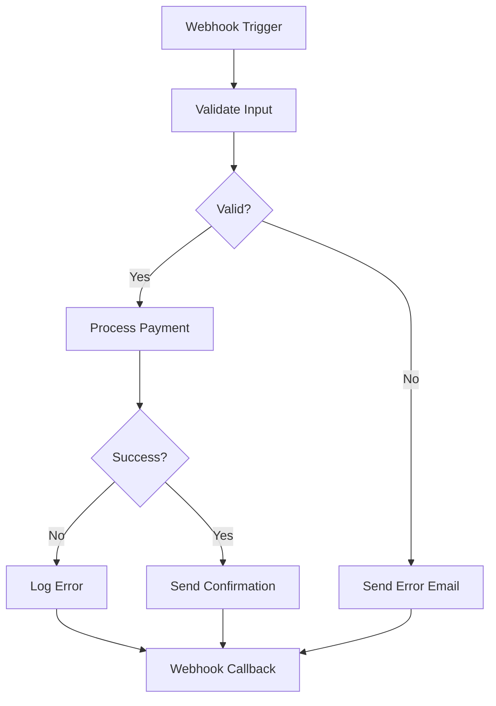

# 05 — Workflow Engine

**🇧🇷** Motor de Automação de Workflows  
**🇬🇧** Workflow Automation Engine

---

## Descrição do Desafio

Implementar um motor de automação de workflows similar ao n8n ou Zapier, onde usuários podem definir fluxos de trabalho compostos por nós (trigger, ação, condição) que executam em sequência.

Requisitos:
- Definir workflows como grafos direcionados (DAG)
- Nós de trigger (webhook, schedule, event)
- Nós de ação (HTTP request, email, transform)
- Nós condicionais (if/else, switch)
- Execução assíncrona com filas
- Estado e rastreamento de execução
- Redis para filas e cache de estado

---

## Challenge Description

Implement a workflow automation engine similar to n8n or Zapier, where users can define workflows composed of nodes (trigger, action, condition) that execute in sequence.

Requirements:
- Define workflows as directed graphs (DAG)
- Trigger nodes (webhook, schedule, event)
- Action nodes (HTTP request, email, transform)
- Conditional nodes (if/else, switch)
- Asynchronous execution with queues
- Execution state and tracing
- Redis for queues and state cache

---

## Architecture

```
┌─────────────────────────────────────────────────────────────┐
│                    Workflow Engine                           │
│                                                              │
│  POST /api/v1/workflows               Create workflow       │
│  GET  /api/v1/workflows/:id           Get workflow          │
│  PUT  /api/v1/workflows/:id           Update workflow       │
│  DELETE /api/v1/workflows/:id         Delete workflow       │
│  POST /api/v1/workflows/:id/execute    Execute workflow     │
│  GET  /api/v1/workflows/:id/runs      List executions       │
│                                                              │
│  Workflow Definition:                                        │
│  { nodes: Node[], edges: Edge[] }  ← Directed Acyclic Graph │
└──────────────────────────────────────────────────────────────┘
```

### Workflow Graph Example

```
   [Webhook Trigger]
          │
          ▼
   [HTTP Request] ───► [Transform Node]
          │
          ├── (success) ──► [Send Email]
          │
          └── (error)  ──► [Log Error] ──► [Webhook Callback]
```

---

## Workflow Definition (JSON)

```json
{
  "id": "wf_abc123",
  "name": "Process Payment",
  "nodes": [
    {
      "id": "trigger_1",
      "type": "trigger:webhook",
      "config": {
        "path": "/payment",
        "method": "POST"
      }
    },
    {
      "id": "validate_1",
      "type": "action:http",
      "config": {
        "url": "http://localhost:3001/validate",
        "method": "POST",
        "headers": {
          "Content-Type": "application/json"
        }
      }
    },
    {
      "id": "check_1",
      "type": "condition:ifelse",
      "config": {
        "field": "body.valid",
        "operator": "equals",
        "value": true
      }
    },
    {
      "id": "success_1",
      "type": "action:http",
      "config": {
        "url": "http://localhost:3001/success",
        "method": "POST"
      }
    },
    {
      "id": "error_1",
      "type": "action:email",
      "config": {
        "to": "admin@example.com",
        "subject": "Payment validation failed"
      }
    }
  ],
  "edges": [
    { "from": "trigger_1", "to": "validate_1" },
    { "from": "validate_1", "to": "check_1" },
    { "from": "check_1", "to": "success_1", "condition": "true" },
    { "from": "check_1", "to": "error_1", "condition": "false" }
  ]
}
```

---

## Node Types

| Type | Description | Config |
|------|-------------|--------|
| `trigger:webhook` | HTTP webhook trigger | `path`, `method` |
| `trigger:schedule` | Cron-based schedule | `cron` expression |
| `trigger:event` | Event-based trigger | `event`, `channel` |
| `action:http` | Make HTTP request | `url`, `method`, `headers`, `body` |
| `action:transform` | Transform data | `script` (JS function) |
| `action:email` | Send email | `to`, `subject`, `body` |
| `action:log` | Log execution | `level`, `message` |
| `condition:ifelse` | Conditional branch | `field`, `operator`, `value` |
| `condition:switch` | Multi-branch switch | `field`, `cases` |

---

## Code Example: DAG Executor

```typescript
interface Node {
  id: string;
  type: string;
  config: Record<string, any>;
}

interface Edge {
  from: string;
  to: string;
  condition?: string;
}

interface Workflow {
  id: string;
  nodes: Node[];
  edges: Edge[];
}

class WorkflowExecutor {
  private workflow: Workflow;
  private state: Map<string, any> = new Map();

  constructor(workflow: Workflow) {
    this.workflow = workflow;
  }

  async execute(triggerData: any): Promise<void> {
    // Find trigger node
    const trigger = this.workflow.nodes.find(n => 
      n.type.startsWith('trigger:')
    );
    
    if (!trigger) throw new Error('No trigger node found');
    
    // Set initial data
    this.state.set('trigger', triggerData);
    
    // Execute from trigger
    await this.executeNode(trigger.id);
  }

  private async executeNode(nodeId: string): Promise<void> {
    const node = this.workflow.nodes.find(n => n.id === nodeId);
    if (!node) return;

    // Execute node based on type
    const result = await this.runNode(node);
    this.state.set(nodeId, result);

    // Find next nodes
    const nextEdges = this.workflow.edges.filter(e => e.from === nodeId);
    
    for (const edge of nextEdges) {
      // Check condition if exists
      if (edge.condition) {
        const conditionMet = this.evaluateCondition(
          edge.condition, 
          result
        );
        if (!conditionMet) continue;
      }
      
      await this.executeNode(edge.to);
    }
  }

  private async runNode(node: Node): Promise<any> {
    switch (node.type) {
      case 'action:http':
        return this.executeHttp(node.config);
      case 'action:transform':
        return this.executeTransform(node.config);
      case 'condition:ifelse':
        return this.evaluateIfElse(node.config);
      default:
        return null;
    }
  }

  private evaluateCondition(condition: string, data: any): boolean {
    // Simple condition evaluation
    if (condition === 'true') return Boolean(data);
    if (condition === 'false') return !data;
    return data === condition;
  }
}
```

---

## Tech Stack

| Technology | Purpose |
|------------|---------|
| **Fastify** | HTTP framework |
| **Redis** | Queue, state, pub/sub |
| **BullMQ** | Job queue |
| **TypeScript** | Type safety |
| **PostgreSQL** | Workflow persistence |

---

## Execution Flow



---

## How to Run

```bash
pnpm --filter @banking/workflow-engine dev
# Starts server on port 3005
```

## API Endpoints

| Method | Endpoint | Description |
|--------|----------|-------------|
| POST | `/api/v1/workflows` | Create workflow |
| GET | `/api/v1/workflows/:id` | Get workflow |
| PUT | `/api/v1/workflows/:id` | Update workflow |
| DELETE | `/api/v1/workflows/:id` | Delete workflow |
| POST | `/api/v1/workflows/:id/execute` | Execute workflow |
| GET | `/api/v1/workflows/:id/runs` | List executions |
| GET | `/api/v1/workflows/:id/runs/:runId` | Get execution status |
