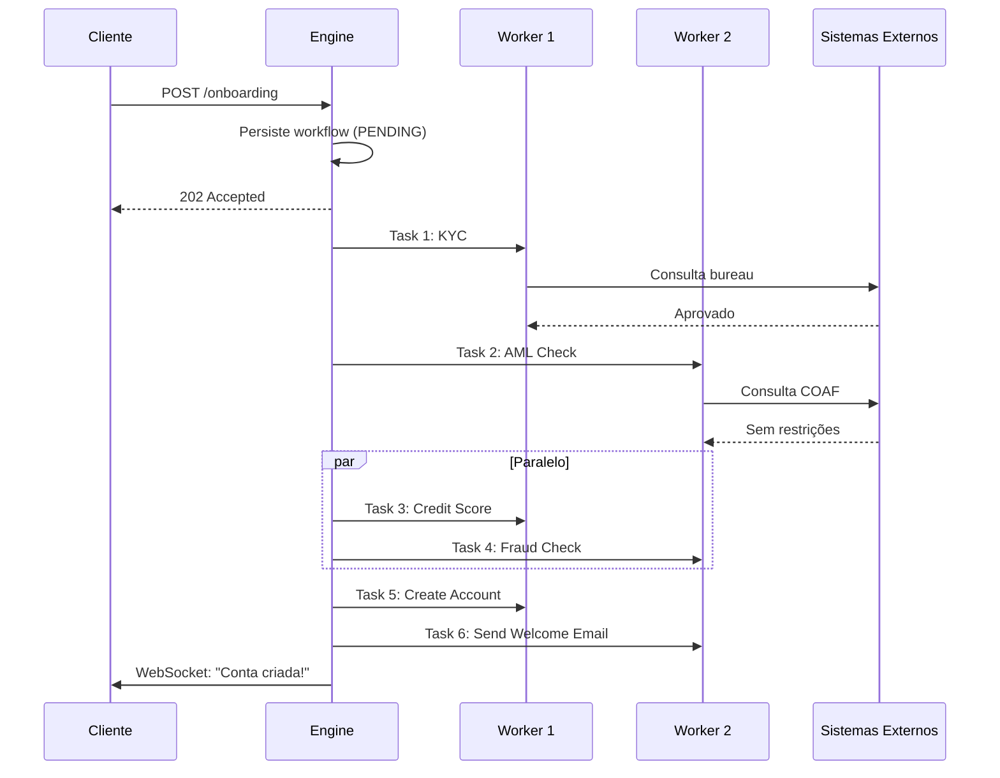
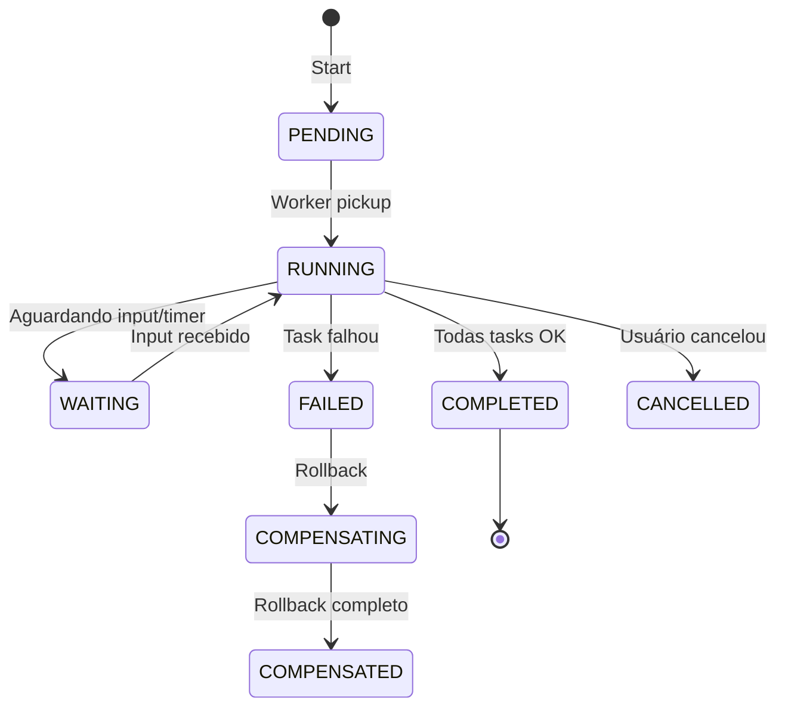

# Desafio 05: Workflow Engine — O Cérebro que Orquestra Fintechs

**🇧🇷** Orquestração de Processos Financeiros  
**🇬🇧** Financial Process Orchestration

---

Um **Workflow Engine** é o cérebro orquestrador de uma fintech. Coordena processos complexos com múltiplos sistemas, aprovações, retries, timeouts e compensações. Sem ele, você tem "código espaguete" sem visibilidade.

## Switch: TypeScript vs Go

<LanguageToggle />

<div class="lang-content ts" style="display:block;">

### Por que precisamos?

| Caso de Uso | Fluxo |
|-------------|-------|
| **Onboarding** | KYC → AML → Score → Conta |
| **Crédito** | Aplicação → Análise → Aprovação → Liberação |
| **Pagamentos** | PIX, TED, DOC com múltiplos passos |
| **Chargebacks** | Disputa → Análise → Decisão → Reembolso |

### O Problema sem Engine

```typescript
// ❌ Spaghetti anti-pattern
async function onboardCustomer(data: CustomerData) {
  const kyc = await kycService.verify(data);
  if (!kyc.approved) throw new Error('KYC failed');

  try {
    const aml = await amlService.check(data.document);
    if (aml.isBlacklisted) throw new Error('AML failed');
  } catch (error) {
    // E agora? Como compensar o KYC? Como retentar?
  }

  const score = await creditBureau.query(data.document);
  const account = await ledger.createAccount(data);
  // Se crashar aqui? Como retomar?
}
```

**Problemas:** sem persistência, sem retry, sem compensação, sem visibilidade.

### Conceitos Fundamentais

| Conceito | Descrição |
|----------|-----------|
| **Workflow (DAG)** | Grafo acíclico dirigido de tarefas |
| **Task (Activity)** | Unidade de trabalho, idempotente |
| **Execution (Run)** | Instância específica com estado persistido |
| **Compensation (Saga)** | Rollback em caso de falha |
| **Retry Policy** | Backoff exponencial configurável |

### Fluxo: Onboarding de Cliente



### State Machine



### Workflow Entity

```typescript
export enum WorkflowStatus {
  PENDING = 'PENDING', RUNNING = 'RUNNING', WAITING = 'WAITING',
  COMPLETED = 'COMPLETED', FAILED = 'FAILED', CANCELLED = 'CANCELLED',
  COMPENSATING = 'COMPENSATING', COMPENSATED = 'COMPENSATED', PAUSED = 'PAUSED',
}

export interface RetryPolicy {
  maxAttempts: number;
  initialIntervalMs: number;
  backoffCoefficient: number;
  maxIntervalMs: number;
  nonRetryableErrors?: string[];
}

export interface TaskDefinition {
  name: string;
  type: string;
  dependsOn?: string[];
  timeout?: number;
  retryPolicy?: RetryPolicy;
  compensation?: string;
  parallel?: boolean;
}

export class Workflow extends Entity<string> {
  public getReadyTasks(definition: WorkflowDefinition): TaskDefinition[] {
    const ready: TaskDefinition[] = [];
    for (const taskDef of definition.tasks) {
      const execution = this.props.tasks.get(taskDef.name);
      if (!execution || execution.status !== TaskStatus.PENDING) continue;

      const deps = taskDef.dependsOn || [];
      const allDepsCompleted = deps.every(depName => {
        const dep = this.props.tasks.get(depName);
        return dep && (dep.status === TaskStatus.COMPLETED || dep.status === TaskStatus.SKIPPED);
      });

      if (allDepsCompleted) ready.push(taskDef);
    }
    return ready;
  }

  public startCompensation(): string[] {
    this.props.status = WorkflowStatus.COMPENSATING;
    const toCompensate: string[] = [];
    for (const [name, execution] of Array.from(this.props.tasks.entries()).reverse()) {
      if (execution.status === TaskStatus.COMPLETED) {
        toCompensate.push(name);
        execution.status = TaskStatus.COMPENSATING;
      }
    }
    return toCompensate;
  }
}
```

### Workflow Engine — Orquestrador

```typescript
export class WorkflowEngine {
  public async startWorkflow(input: StartWorkflowInput): Promise<StartWorkflowOutput> {
    const definition = await this.definitionRepo.findByNameAndVersion(input.definitionName, 'latest');
    const workflow = Workflow.create(definition, input.input);
    await this.workflowRepo.save(workflow);
    await this.eventPublisher.publish('workflow.started', { workflowId: workflow.id });
    return { workflowId: workflow.id, status: workflow.status };
  }

  public async start(): Promise<void> {
    this.running = true;
    while (this.running) {
      await this.processPendingWorkflows();
      await this.processRetryableTasks();
      await this.processTimedOutTasks();
      await this.sleep(1000);
    }
  }

  private async executeTask(workflow: Workflow, taskDef: TaskDefinition, definition: WorkflowDefinition) {
    workflow.startTask(taskDef.name);
    const executor = this.taskRegistry.get(taskDef.type);
    const result = await this.withTimeout(executor.execute(taskInput, context), timeout);

    if (result.success) {
      workflow.completeTask(taskDef.name, result.output || {});
    } else {
      await this.handleTaskFailure(workflow, taskDef, definition, result.error);
    }
  }

  private async handleTaskFailure(workflow: Workflow, taskDef: TaskDefinition, definition: WorkflowDefinition, error: string) {
    const retryPolicy = taskDef.retryPolicy || { maxAttempts: 3, initialIntervalMs: 1000, backoffCoefficient: 2.0, maxIntervalMs: 60000 };

    const shouldRetry = !retryPolicy.nonRetryableErrors?.some(e => error.includes(e)) && taskExec.attempt < retryPolicy.maxAttempts;

    if (shouldRetry) {
      const interval = Math.min(retryPolicy.initialIntervalMs * Math.pow(retryPolicy.backoffCoefficient, taskExec.attempt - 1), retryPolicy.maxIntervalMs);
      workflow.failTask(taskDef.name, error, true, new Date(Date.now() + interval));
    } else {
      workflow.failTask(taskDef.name, error, false);
      if (definition.onFailure === 'COMPENSATE') await this.compensateWorkflow(workflow, definition);
    }
  }

  private async compensateWorkflow(workflow: Workflow, definition: WorkflowDefinition) {
    const toCompensate = workflow.startCompensation();
    for (const taskName of toCompensate) {
      const taskDef = definition.tasks.find(t => t.name === taskName);
      if (!taskDef?.compensation) continue;
      const executor = this.taskRegistry.get(taskDef.compensation);
      await executor.execute({ originalInput: taskExec.input, originalOutput: taskExec.output }, context);
    }
  }
}
```

### Definição YAML

```yaml
name: customer-onboarding
version: "1.0.0"
onFailure: COMPENSATE

tasks:
  - name: kyc_verification
    type: kyc_check
    input: { document: ${input.document}, name: ${input.name} }
    timeout: 30000
    retryPolicy: { maxAttempts: 3, backoffCoefficient: 2.0 }

  - name: aml_check
    type: aml_check
    dependsOn: [kyc_verification]
    input: { document: ${input.document} }

  - name: credit_score
    type: credit_bureau_query
    dependsOn: [kyc_verification]
    parallel: true

  - name: fraud_check
    type: fraud_detection
    dependsOn: [kyc_verification]
    parallel: true

  - name: account_creation
    type: account_create
    dependsOn: [aml_check, credit_score, fraud_check]
    conditional: "tasks.credit_score.score > 600 && tasks.fraud_check.risk === 'LOW'"
    compensation: close_account_compensation
```

### Comparação: TypeScript vs Go

| Aspecto | TypeScript | Go |
|---------|-----------|-----|
| **Temporal SDK** | Excelente | Nativo |
| **Throughput** | ~12K workflows/s | ~75K workflows/s |
| **Memory** | ~2GB (100K workflows) | ~450MB |
| **Goroutines** | Worker threads | Goroutines (2KB stack) |
| **ECOSSistema** | Temporal, BullMQ | Temporal, Cadence |

### Casos Reais

- **Nubank** (Temporal + Clojure) — 80M+ clientes, millions/day
- **Stone** (Temporal + Go) — 5M+ maquininhas, P99 < 100ms
- **Mercado Pago** (Go + Custom) — Fork do Cadence, 100K+ workflows/s
- **Itaú** (Camunda + Java) — BPMN 2.0, compliance

</div>

<div class="lang-content go" style="display:none;">

### Domain — Workflow Entity

```go
package domain

import (
    "errors"
    "time"
    "github.com/google/uuid"
)

type WorkflowStatus string

const (
    StatusPending      WorkflowStatus = "PENDING"
    StatusRunning      WorkflowStatus = "RUNNING"
    StatusWaiting      WorkflowStatus = "WAITING"
    StatusCompleted    WorkflowStatus = "COMPLETED"
    StatusFailed       WorkflowStatus = "FAILED"
    StatusCompensating WorkflowStatus = "COMPENSATING"
    StatusCompensated  WorkflowStatus = "COMPENSATED"
    StatusPaused       WorkflowStatus = "PAUSED"
)

type Workflow struct {
    ID                string
    DefinitionName    string
    DefinitionVersion string
    Status            WorkflowStatus
    Input             map[string]interface{}
    Output            map[string]interface{}
    Tasks             map[string]*TaskExecution
    CurrentTask       string
    Error             string
    StartedAt         time.Time
    CompletedAt       *time.Time
    NextRetryAt       *time.Time
    IdempotencyKey    string
    Metadata          map[string]interface{}
}

func NewWorkflow(definition *WorkflowDefinition, input map[string]interface{}) *Workflow {
    tasks := make(map[string]*TaskExecution, len(definition.Tasks))
    for _, taskDef := range definition.Tasks {
        tasks[taskDef.Name] = &TaskExecution{
            ID: uuid.New().String(), Name: taskDef.Name, Type: taskDef.Type,
            Status: TaskStatusPending, Input: taskDef.Input, Attempt: 0,
        }
    }
    return &Workflow{
        ID: uuid.New().String(), DefinitionName: definition.Name,
        DefinitionVersion: definition.Version, Status: StatusPending,
        Input: input, Tasks: tasks, StartedAt: time.Now(),
        Metadata: make(map[string]interface{}),
    }
}

func (w *Workflow) GetReadyTasks(definition *WorkflowDefinition) []TaskDefinition {
    var ready []TaskDefinition
    for _, taskDef := range definition.Tasks {
        execution, exists := w.Tasks[taskDef.Name]
        if !exists || execution.Status != TaskStatusPending { continue }

        allDepsCompleted := true
        for _, depName := range taskDef.DependsOn {
            dep, exists := w.Tasks[depName]
            if !exists || (dep.Status != TaskStatusCompleted && dep.Status != TaskStatusSkipped) {
                allDepsCompleted = false
                break
            }
        }
        if allDepsCompleted { ready = append(ready, taskDef) }
    }
    return ready
}

func (w *Workflow) StartTask(taskName string) error {
    task, exists := w.Tasks[taskName]
    if !exists { return ErrTaskNotFound }
    task.Status = TaskStatusRunning
    task.Attempt++
    now := time.Now()
    task.StartedAt = &now
    w.Status = StatusRunning
    w.CurrentTask = taskName
    return nil
}

func (w *Workflow) CompleteTask(taskName string, output map[string]interface{}) error {
    task, exists := w.Tasks[taskName]
    if !exists { return ErrTaskNotFound }
    task.Status = TaskStatusCompleted
    task.Output = output
    now := time.Now()
    task.CompletedAt = &now

    allCompleted := true
    for _, t := range w.Tasks {
        if t.Status != TaskStatusCompleted && t.Status != TaskStatusSkipped { allCompleted = false; break }
    }
    if allCompleted {
        w.Status = StatusCompleted
        w.CompletedAt = &now
        w.Output = w.aggregateOutputs()
    }
    return nil
}

func (w *Workflow) StartCompensation() []string {
    w.Status = StatusCompensating
    var toCompensate []string
    for name, task := range w.Tasks {
        if task.Status == TaskStatusCompleted {
            toCompensate = append([]string{name}, toCompensate...)
            task.Status = TaskStatusCompensating
        }
    }
    return toCompensate
}
```

### Engine com Worker Pool

```go
package engine

import (
    "context"
    "sync"
    "time"
    "go.uber.org/zap"
)

type Engine struct {
    workflowRepo   domain.WorkflowRepository
    definitionRepo domain.DefinitionRepository
    taskRegistry   *TaskRegistry
    eventPub       *events.Publisher
    logger         *zap.Logger
    workers        int
    pollInterval   time.Duration
    stopCh         chan struct{}
    workerWg       sync.WaitGroup
}

func NewEngine(workflowRepo, definitionRepo, taskRegistry, eventPub, logger, workers int) *Engine {
    return &Engine{
        workflowRepo: workflowRepo, definitionRepo: definitionRepo,
        taskRegistry: taskRegistry, eventPub: eventPub, logger: logger,
        workers: workers, pollInterval: time.Second, stopCh: make(chan struct{}),
    }
}

func (e *Engine) Start(ctx context.Context) error {
    e.running = true
    workCh := make(chan *domain.Workflow, e.workers*2)

    for i := 0; i < e.workers; i++ {
        e.workerWg.Add(1)
        go e.worker(ctx, i, workCh)
    }
    e.workerWg.Add(1)
    go e.mainLoop(ctx, workCh)
    return nil
}

func (e *Engine) mainLoop(ctx context.Context, workCh chan<- *domain.Workflow) {
    defer e.workerWg.Done()
    ticker := time.NewTicker(e.pollInterval)
    defer ticker.Stop()

    for {
        select {
        case <-ctx.Done(): return
        case <-e.stopCh: return
        case <-ticker.C:
            workflows, _ := e.workflowRepo.FindRunnable(ctx)
            for _, w := range workflows {
                select {
                case workCh <- w:
                case <-ctx.Done(): return
                }
            }
            e.processRetryableTasks(ctx)
            e.processTimedOutTasks(ctx)
        }
    }
}

func (e *Engine) worker(ctx context.Context, id int, workCh <-chan *domain.Workflow) {
    defer e.workerWg.Done()
    for {
        select {
        case <-ctx.Done(): return
        case <-e.stopCh: return
        case workflow, ok := <-workCh:
            if !ok { return }
            e.processWorkflow(ctx, workflow)
        }
    }
}

func (e *Engine) processWorkflow(ctx context.Context, w *domain.Workflow) error {
    definition, _ := e.definitionRepo.FindByNameAndVersion(ctx, w.DefinitionName, w.DefinitionVersion)
    readyTasks := w.GetReadyTasks(definition)

    var parallelTasks, sequentialTasks []domain.TaskDefinition
    for _, task := range readyTasks {
        if task.Parallel { parallelTasks = append(parallelTasks, task) }
        else { sequentialTasks = append(sequentialTasks, task) }
    }

    if len(parallelTasks) > 0 {
        var wg sync.WaitGroup
        for _, task := range parallelTasks {
            wg.Add(1)
            go func(t domain.TaskDefinition) {
                defer wg.Done()
                e.executeTask(ctx, w, t, definition)
            }(task)
        }
        wg.Wait()
    } else if len(sequentialTasks) > 0 {
        e.executeTask(ctx, w, sequentialTasks[0], definition)
    }

    return e.workflowRepo.Update(ctx, w)
}

func (e *Engine) executeTask(ctx context.Context, w *domain.Workflow, taskDef domain.TaskDefinition, definition *domain.WorkflowDefinition) {
    w.StartTask(taskDef.Name)
    e.workflowRepo.Update(ctx, w)

    executor := e.taskRegistry.Get(taskDef.Type)
    if executor == nil { w.FailTask(taskDef.Name, "executor not found", false, nil); return }

    timeout := taskDef.Timeout
    if timeout == 0 { timeout = definition.DefaultTimeout }
    taskCtx, cancel := context.WithTimeout(ctx, timeout)
    defer cancel()

    result, err := executor.Execute(taskCtx, e.resolveInput(taskDef, w), TaskContext{WorkflowID: w.ID, TaskName: taskDef.Name})
    if err != nil { e.handleTaskFailure(ctx, w, taskDef, definition, err.Error()); return }

    if result.Success { w.CompleteTask(taskDef.Name, result.Output) }
    else { e.handleTaskFailure(ctx, w, taskDef, definition, result.Error) }

    e.workflowRepo.Update(ctx, w)
}
```

### Task Registry e Executors

```go
package engine

type TaskExecutor interface {
    Execute(ctx context.Context, input map[string]interface{}, taskCtx TaskContext) (*TaskResult, error)
}

type TaskRegistry struct {
    executors map[string]TaskExecutor
    mu        sync.RWMutex
}

func (r *TaskRegistry) Register(taskType string, executor TaskExecutor) {
    r.mu.Lock()
    defer r.mu.Unlock()
    r.executors[taskType] = executor
}

func (r *TaskRegistry) Get(taskType string) TaskExecutor {
    r.mu.RLock()
    defer r.mu.RUnlock()
    return r.executors[taskType]
}
```

### Exemplo: KYC Task

```go
type KYCTask struct {
    kycService *external.KYCService
}

func (t *KYCTask) Execute(ctx context.Context, input map[string]interface{}, taskCtx TaskContext) (*TaskResult, error) {
    document, _ := input["document"].(string)
    name, _ := input["name"].(string)

    result, err := t.kycService.Verify(ctx, external.KYCRequest{Document: document, Name: name})
    if err != nil { return &TaskResult{Success: false, Error: err.Error()}, nil }

    return &TaskResult{
        Success: true,
        Output: map[string]interface{}{
            "approved": result.Approved, "score": result.Score,
            "verified_at": time.Now().Format(time.RFC3339),
        },
    }, nil
}
```

### Temporal.io em Go (Produção)

```go
func OnboardingWorkflow(ctx workflow.Context, input OnboardingInput) (*OnboardingOutput, error) {
    retryPolicy := &temporal.RetryPolicy{
        InitialInterval: time.Second, BackoffCoefficient: 2.0,
        MaximumInterval: time.Minute, MaximumAttempts: 5,
        NonRetryableErrorTypes: []string{"INVALID_DOCUMENT", "FRAUD_DETECTED"},
    }
    ctx = workflow.WithActivityOptions(ctx, workflow.ActivityOptions{
        StartToCloseTimeout: 30 * time.Second, RetryPolicy: retryPolicy,
    })

    // Step 1: KYC
    var kycResult KYCResult
    workflow.ExecuteActivity(ctx, KYCActivity, KYCInput{Document: input.Document}).Get(ctx, &kycResult)
    if !kycResult.Approved { return nil, temporal.NewApplicationError("KYC rejected", "KYC_REJECTED", nil) }

    // Step 2: AML + Credit Score em paralelo
    amlFuture := workflow.ExecuteActivity(ctx, AMLActivity, AMLInput{Document: input.Document})
    creditFuture := workflow.ExecuteActivity(ctx, CreditScoreActivity, CreditInput{Document: input.Document})

    var amlResult, creditResult
    amlFuture.Get(ctx, &amlResult)
    creditFuture.Get(ctx, &creditResult)

    // Step 3: Create account (condicional)
    if creditResult.Score > 600 {
        var accountResult AccountResult
        workflow.ExecuteActivity(ctx, CreateAccountActivity, AccountInput{CustomerID: input.CustomerID}).Get(ctx, &accountResult)
    }

    return &OnboardingOutput{CreditScore: creditResult.Score, Status: "COMPLETED"}, nil
}
```

### Benchmark

| Métrica | TS | Go |
|---------|----|----|
| Throughput (100K workflows) | 12K/s | 75K/s |
| Memory (100K workflows) | ~2GB | ~450MB |
| P99 latency | 150ms | 25ms |

### Casos Reais

- **Nubank** (Temporal + Clojure) — 80M+ clientes
- **Stone** (Temporal + Go) — 5M+ maquininhas
- **Mercado Pago** (Go + Custom) — Fork Cadence, 100K+ workflows/s
- **Itaú** (Camunda + Java) — BPMN 2.0

</div>

---

## Como testar

```bash
# TypeScript
pnpm --filter @banking/workflow-engine dev

# Go
cd packages/backend/workflow-engine-go
go run .

# Iniciar workflow
curl -X POST http://localhost:3011/api/v1/workflows \
  -H "Content-Type: application/json" \
  -d '{"definitionName":"customer-onboarding","input":{"document":"12345678901","name":"João Silva"}}'

# Consultar status
curl http://localhost:3011/api/v1/workflows/{id}
```

---

## Lições aprendidas

1. **Sem engine = código espaguete** — Sem visibilidade, sem retry, sem compensação
2. **Estado durável** — Workflows sobrevivem a crashes
3. **Retry com backoff** — Evita thundering herd
4. **Saga pattern** — Compensação em ordem reversa (LIFO)
5. **Tasks idempotentes** — Podem ser reexecutadas com segurança
6. **Temporal.io** — Padrão de mercado (Cadence → Uber → Open Source)
7. **Go é natural pra engines** — Temporal, Cadence, Kubernetes são Go
8. **Parallel execution** — Tasks independentes rodam em goroutines
9. **WebSockets** — Updates em tempo real pro cliente
10. **Versionamento** — Workflows precisam de SemVer e compatibilidade
