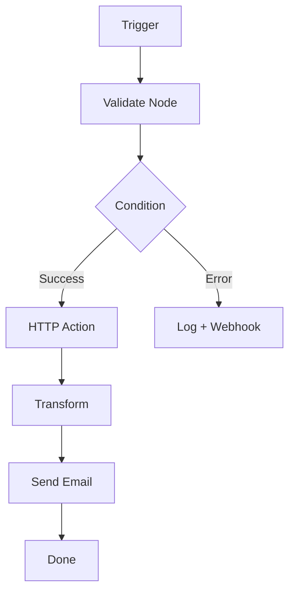

# 05 — Workflow Engine

**🇧🇷** Motor de Workflows  
**🇬🇧** Workflow Engine

---

Sabe quando você precisa executar uma sequência de passos: validar dados, chamar uma API, transformar o resultado, enviar email? Se um passo falha, o que acontece? Se o servidor cai no meio do caminho?

Um workflow engine resolve isso. Você define os passos como nós de um grafo, e o motor executa na ordem certa, com retry, fila, e estado persistido.

É assim que n8n, Zapier e Power Automate funcionam por baixo dos panos.

---

## A arquitetura



```
POST /api/v1/workflows         → Criar workflow
GET  /api/v1/workflows/:id     → Consultar
POST /api/v1/workflows/:id/execute → Executar
GET  /api/v1/workflows/:id/runs    → Histórico
```

---

## Resolução em TypeScript

### Definição de workflow

```typescript
interface Node {
  id: string;
  type: 'trigger:webhook' | 'action:http' | 'action:transform' 
      | 'condition:ifelse' | 'action:email' | 'action:log';
  config: Record<string, any>;
}

interface Edge {
  from: string;
  to: string;
  condition?: string; // 'success' | 'error' | expressão
}

interface Workflow {
  id: string;
  nodes: Node[];
  edges: Edge[];
}
```

### Executor DAG

```typescript
class WorkflowExecutor {
  private state: Map<string, any> = new Map();

  async execute(workflow: Workflow, triggerData: any): Promise<void> {
    const trigger = workflow.nodes.find(n => n.type.startsWith('trigger:'));
    if (!trigger) throw new Error('Workflow sem trigger');
    
    this.state.set('trigger', triggerData);
    await this.executeNode(workflow, trigger.id);
  }

  private async executeNode(workflow: Workflow, nodeId: string) {
    const node = workflow.nodes.find(n => n.id === nodeId);
    if (!node) return;

    const result = await this.runNode(node);
    this.state.set(nodeId, result);

    const nextEdges = workflow.edges.filter(e => e.from === nodeId);
    
    for (const edge of nextEdges) {
      if (edge.condition && !this.evalCondition(edge.condition, result)) {
        continue;
      }
      await this.executeNode(workflow, edge.to);
    }
  }

  private async runNode(node: Node): Promise<any> {
    switch (node.type) {
      case 'action:http':
        return fetch(node.config.url, {
          method: node.config.method || 'POST',
          headers: { 'Content-Type': 'application/json' },
          body: JSON.stringify(node.config.body),
        }).then(r => r.json());
      
      case 'action:transform':
        const fn = new Function('data', node.config.script);
        return fn(this.state);
      
      case 'condition:ifelse':
        return this.evalField(node.config);
      
      default:
        return null;
    }
  }
}
```

### Exemplo de workflow

```json
{
  "nodes": [
    { "id": "trigger", "type": "trigger:webhook", "config": {} },
    { "id": "validate", "type": "action:http", "config": {
        "url": "http://validator/api",
        "method": "POST"
    }},
    { "id": "check", "type": "condition:ifelse", "config": {
        "field": "body.valid", "operator": "equals", "value": "true"
    }},
    { "id": "process", "type": "action:http", "config": {
        "url": "http://processor/api", "method": "POST"
    }},
    { "id": "notify", "type": "action:email", "config": {
        "to": "admin@bank.com", "subject": "Processado"
    }}
  ],
  "edges": [
    { "from": "trigger", "to": "validate" },
    { "from": "validate", "to": "check" },
    { "from": "check", "to": "process", "condition": "success" },
    { "from": "check", "to": "notify", "condition": "error" }
  ]
}
```

---

## Resolução em Go

Em Go, cada nó roda em uma goroutine. O workflow é um pipeline de canais:

```go
package main

import (
    "context"
    "encoding/json"
    "fmt"
    "net/http"
)

type Node struct {
    ID     string                 `json:"id"`
    Type   string                 `json:"type"`
    Config map[string]interface{} `json:"config"`
}

type Edge struct {
    From      string `json:"from"`
    To        string `json:"to"`
    Condition string `json:"condition,omitempty"`
}

type Workflow struct {
    Nodes []Node `json:"nodes"`
    Edges []Edge `json:"edges"`
}

type Executor struct {
    state map[string]interface{}
    done  chan struct{}
}

func NewExecutor() *Executor {
    return &Executor{
        state: make(map[string]interface{}),
        done:  make(chan struct{}),
    }
}

func (e *Executor) Execute(ctx context.Context, wf *Workflow, triggerData interface{}) error {
    // Find trigger node
    var trigger *Node
    for _, n := range wf.Nodes {
        if len(n.Type) > 8 && n.Type[:8] == "trigger:" {
            trigger = &n
            break
        }
    }
    if trigger == nil {
        return fmt.Errorf("no trigger node found")
    }

    e.state["trigger"] = triggerData
    
    // Build adjacency list
    edges := make(map[string][]Edge)
    for _, edge := range wf.Edges {
        edges[edge.From] = append(edges[edge.From], edge)
    }

    // Execute DAG
    return e.executeNode(ctx, wf, edges, trigger.ID)
}

func (e *Executor) executeNode(ctx context.Context, wf *Workflow, 
    edges map[string][]Edge, nodeID string) error {
    
    // Find node
    var node *Node
    for _, n := range wf.Nodes {
        if n.ID == nodeID {
            node = &n
            break
        }
    }
    if node == nil {
        return nil
    }

    // Execute node
    result, err := e.runNode(ctx, node)
    if err != nil {
        return err
    }
    e.state[nodeID] = result

    // Execute children
    for _, edge := range edges[nodeID] {
        if edge.Condition != "" {
            if !e.evaluateCondition(edge.Condition, result) {
                continue
            }
        }
        if err := e.executeNode(ctx, wf, edges, edge.To); err != nil {
            return err
        }
    }

    return nil
}

func (e *Executor) runNode(ctx context.Context, node *Node) (interface{}, error) {
    switch node.Type {
    case "action:http":
        url, _ := node.Config["url"].(string)
        resp, err := http.Get(url)
        if err != nil {
            return nil, err
        }
        defer resp.Body.Close()
        
        var result interface{}
        json.NewDecoder(resp.Body).Decode(&result)
        return result, nil

    case "condition:ifelse":
        field, _ := node.Config["field"].(string)
        value, _ := node.Config["value"].(string)
        
        if data, ok := e.state[field]; ok {
            return fmt.Sprintf("%v", data) == value, nil
        }
        return false, nil

    default:
        return nil, nil
    }
}
```

**Diferença chave:** Em Go, o executor é concorrente de verdade com goroutines. Cada branch do workflow pode rodar em paralelo. Em TypeScript, é sequencial com async/await — mais simples de entender, mas menos eficiente.

---

## Como testar

```bash
pnpm --filter @banking/workflow-engine dev

curl -X POST http://localhost:3005/api/v1/workflows \
  -H "Content-Type: application/json" \
  -d '{"nodes":[...],"edges":[...]}'

curl -X POST http://localhost:3005/api/v1/workflows/wf_1/execute
```

---

## Lições aprendidas

1. **DAG é o coração** — Workflow engine sem DAG é só uma fila de tarefas.
2. **Estado precisa ser externo** — Se o servidor reinicia, o workflow precisa continuar de onde parou. Redis ou PostgreSQL.
3. **Retry não é opcional** — Chamadas HTTP falham. Seu workflow precisa tentar de novo, com backoff.
4. **Observabilidade** — Cada execução precisa de log, tracing, e status visível. Sem isso, debug é impossível.
