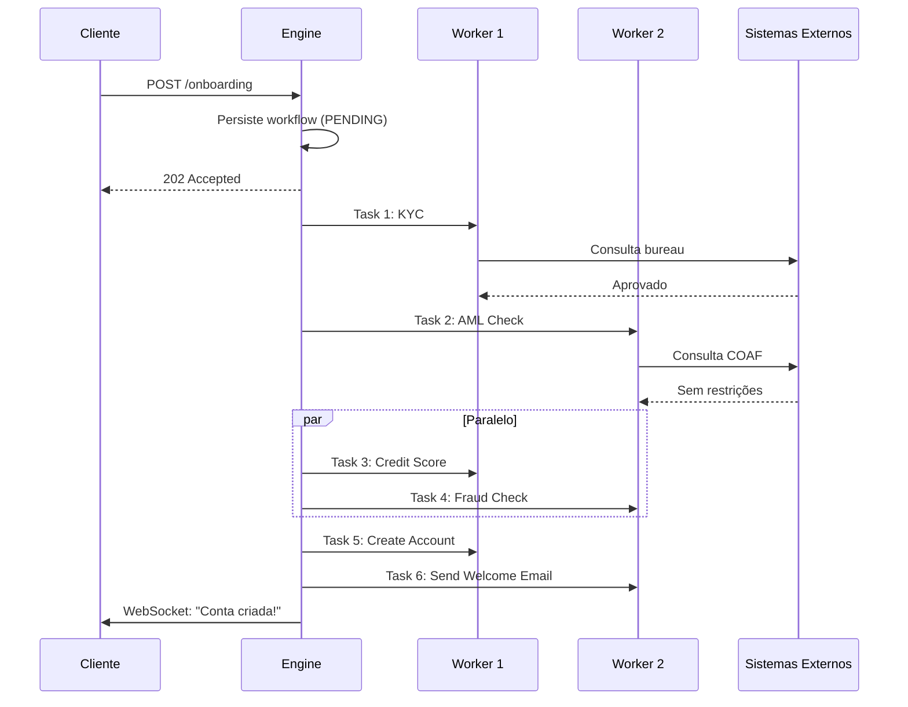
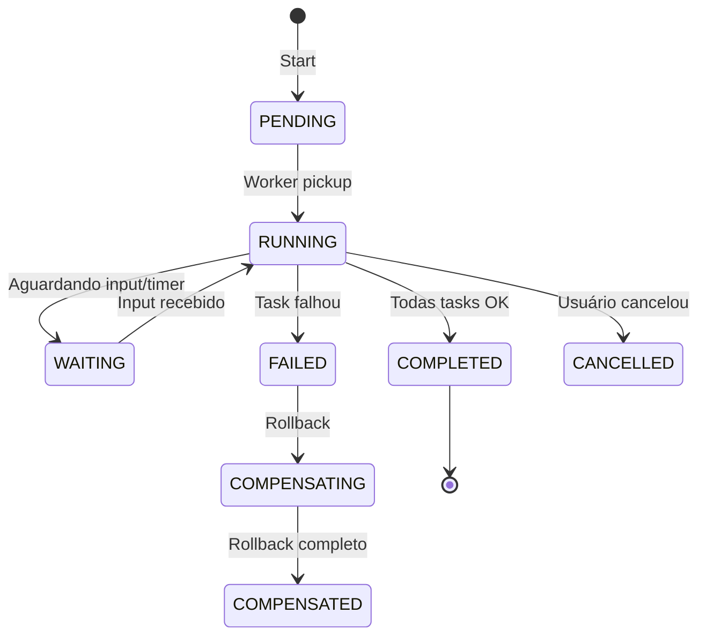
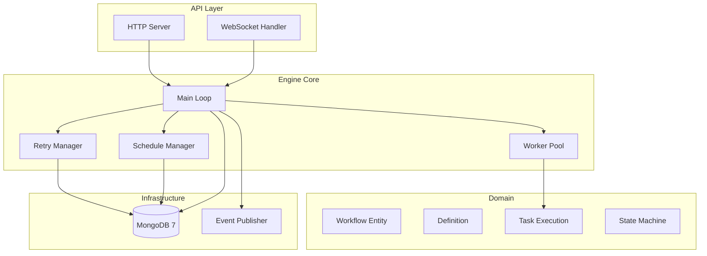

# Desafio 05: Workflow Engine — O Cérebro que Orquestra Fintechs

**🇧🇷** Orquestração de Processos Financeiros  
**🇬🇧** Financial Process Orchestration

---

## 🎯 Objetivos de Aprendizado

- Implementar um workflow engine com state machine, DAG de tarefas e saga pattern
- Entender por que código sequencial sem engine vira espaguete em sistemas financeiros
- Dominar retry policy com exponential backoff e compensação em ordem reversa (LIFO)
- Projetar execução paralela de tarefas com dependências e timeouts
- Implementar idempotência em workers para reexecução segura

---

## 📋 Pré-requisitos

### 🧠 Conceitos
- State machines
- Saga pattern (compensação)
- Orquestração vs coreografia
- Retry com exponential backoff
- Dead letter queues
- Idempotência

### 📚 Desafios Anteriores
- [Desafio 01: Ledger](/challenges/01-ledger) — as transações atômicas do ledger são os nós executados pelo workflow
- [Desafio 02: SPI](/challenges/02-spi) — o fluxo do PIX é um workflow natural com compensação (pacs.004)

### 🛠️ Ferramentas
- Docker
- MongoDB (persistência de estado do workflow)
- Redis (fila)
- Kafka (eventos entre serviços)

### 💻 Técnico
- TypeScript
- Node.js 20+
- Padrão State
- Async/await avançado
- YAML parsing
- Go opcional

---

## 📖 Abertura — O Que é um Workflow?

"Cara, toda vez que você abre o Nubank, faz um PIX, pede um cartão de crédito ou contrata um empréstimo, você acha que é uma chamada de API, uma query no banco e pronto? Não, meu filho. Aquilo é um **workflow**. Uma coreografia de múltiplos sistemas dançando juntos — KYC, AML, bureau de crédito, criação de conta, envio de email — e se um passo falhar, tudo precisa voltar atrás como se nada tivesse acontecido.

Antigamente — e por antigamente quero dizer antes de 2015, quando a galera do Uber engineering criou o Cadence — workflow era acoplado no código da aplicação. Você tinha uma função `onboardCustomer` que chamava KYC, depois AML, depois score, e se qualquer coisa falhasse, você tinha um try/catch gigante tentando desfazer. Só que try/catch não escala. Não persiste. Não retenta com backoff. E quando o servidor caía no meio do processo, o cliente ficava num limbo: 'em análise' para sempre.

Aí veio o Cadence (hoje Temporal.io) e mudou o jogo. Workflow vira cidadão de primeira classe — você define um DAG de tarefas, o engine persiste o estado a cada passo, e se o servidor cair, o workflow simplesmente continua de onde parou. Retry é configurável. Compensação é automática. E você ganha visibilidade de cada execução.

Esse desafio é sobre **construir esse cérebro orquestrador**. Não com Temporal — que é enterprise — mas com os fundamentos: state machine, DAG resolution, retry policy, saga pattern. Porque quando você entende como um workflow engine funciona por baixo, você nunca mais escreve código sequencial sem pensar em resiliência."

Mas vamos voltar ainda mais no tempo, porque o conceito de workflow engine não nasceu no Vale do Silício. Ele nasceu nos departamentos de TI de bancos alemães nos anos 2000, com o BPMN — Business Process Model and Notation. Naquela época, modelar um processo de abertura de conta envolvia desenhar diagramas com notação gráfica, exportar XML, e rodar num engine Java pesado como o jBoss jBPM ou o Oracle BPEL. Funcionava? Funcionava. Mas era lento, burocrático, e exigia um time de especialistas em BPM só pra manter o motor rodando. A equipe de desenvolvimento odiava. A equipe de negócios amava — porque podia ver o processo visualmente. Esse divórcio entre negócio e engenharia foi o que matou o BPMN como padrão para startups e fintechs modernas.

Em 2017, o Uber estava enfrentando um problema de escala que nenhum banco tradicional jamais enfrentou: orquestrar milhões de corridas por dia, com dezenas de microserviços envolvidos — matching de motorista, cálculo de preço, pagamento, notificação push, avaliação pós-corrida. Cada corrida era um workflow com 20+ passos, e a abordagem de try/catch/infra estava causando incidentes diários. Foi assim que nasceu o Cadence, o primeiro workflow engine nativo de microsserviços. A equipe do Uber engineering — liderada por Maxim Fateev e Samar Abbas — percebeu que o problema não era de BPMN, era de **durabilidade**. O estado do workflow precisava sobreviver a qualquer crash, a qualquer deploy, a qualquer migração de infraestrutura. E precisava escalar horizontalmente sem perda de consistência. O Cadence resolvia isso com um design brilhante: workflows são funções normais em Go/Java, o engine persiste o estado automaticamente a cada `await`, e workers são stateless — qualquer worker pode pegar qualquer task. Quando Fateev e Abbas saíram do Uber em 2019 para fundar a Temporal Technologies, o Temporal.io se tornou o padrão de mercado. Hoje, Nubank, Snap, Netflix, Stripe, Coinbase, Box, Checkr — todos usam Temporal. E não é hype: é que ninguém quer reinventar a roda de persistência de workflow.

E olha que isso não é luxo — é necessidade regulatória. O Banco Central exige audit trail completo. Se um cliente disputa uma transação, você precisa provar, passo a passo, o que aconteceu: quando o KYC foi aprovado, quando o AML foi consultado, qual score de crédito foi usado, quem aprovou manualmente. Sem um workflow engine, você tem logs espalhados em 15 sistemas diferentes. Seu compliance officer vai gastar 3 dias juntando evidência pra uma única disputa. Com um engine, você tem uma timeline completa e imutável de cada execução. Isso é auditoria de verdade, não é promessa de PowerPoint.

E tem o aspecto de confiabilidade operacional que pouca gente fala. Em 2022, uma fintech brasileira perdeu R$ 2.3 milhões porque um processo de conciliação bancária — implementado como um script cron em Node.js — crashou no meio da madrugada e ninguém percebeu por 72 horas. As transações ficaram num estado inconsistente: débito realizado, crédito não. O banco parceiro cobrou juros sobre o saldo negativo. O time de engenharia passou um fim de semana inteiro reconstruindo o estado manualmente a partir de logs. Um workflow engine com checkpoint durável teria evitado isso completamente — o processo simplesmente teria continuado de onde parou. Não é sobre ser moderno, é sobre **dormir tranquilo**.

---

## 🔥 O Problema

Imagine que você está construindo o backend de um banco digital. O onboarding de cliente parece simples:

```typescript
async function onboardCustomer(data: CustomerData) {
  const kyc = await kycService.verify(data);
  if (!kyc.approved) throw new Error('KYC failed');

  try {
    const aml = await amlService.check(data.document);
    if (aml.isBlacklisted) throw new Error('AML failed');
  } catch (error) {
    // E agora? Como compensar o KYC? Como retentar?
  }

  const score = await creditBureau.query(data.document);
  const account = await ledger.createAccount(data);
  // Se crashar aqui? Como retomar?
}
```

Parece inofensivo, mas esse padrão esconde problemas graves:

1. **Sem persistência de estado** — Se o servidor cai depois do KYC mas antes do AML, o cliente precisa começar do zero. Experiência terrível.

2. **Sem retry configurável** — Se o bureau de crédito está lentou, a chamada falha e o cliente toma erro. Não tem backoff, não tem retry automático.

3. **Sem compensação (saga)** — O KYC passou, mas o AML falhou. Como desfazer o KYC? Você precisa chamar manualmente um `kycService.revert()`. E se esquecer? O cliente fica aprovado no KYC sem ter completado o onboarding.

4. **Sem visibilidade** — O cliente diz 'está em análise há 3 dias'. Você olha o banco e... não sabe em que passo ele está. Não tem audit trail. Não tem timeline.

5. **Sem paralelismo** — AML check e Credit Score são independentes, mas estão um depois do outro. Você poderia rodar ambos em paralelo e cortar o tempo de onboarding pela metade.

**Workflow engine resolve todos esses problemas de uma vez.**

Mas o buraco é mais embaixo. O que parece um simples onboarding na verdade é um pesadelo de coordenação distribuída que vai muito além desses cinco pontos. Quando você escala de um monolito pra dezenas de microsserviços, cada um com seu próprio banco de dados, timeout, e modo de falha, o código de orquestração vira o que a gente chama de **spaghetti de microsserviços**. Não é mais uma função linear com try/catch — é uma teia de chamadas assíncronas, circuit breakers, filas de retry, DLQs, e handlers de compensação espalhados por repositórios diferentes mantidos por times diferentes. Um engenheiro novo no time leva semanas pra entender o fluxo completo. Quando algo falha, ninguém sabe de quem é a culpa — é culpa do KYC que demorou demais? Do AML que retornou timeout? Da rede entre dois serviços? Do banco que caiu? A culpa é de todo mundo e de ninguém ao mesmo tempo, e o cliente continua esperando.

Existe um debate arquitetural clássico aqui: **orquestração vs coreografia**. Na coreografia, cada microsserviço sabe qual é o próximo passo e publica eventos dizendo "Terminei o KYC, agora é a vez do AML". Parece elegante — desacoplado, assíncrono, cada time cuida do seu pedaço. Mas na prática é um inferno de debugar. Você tem que reconstruir o fluxo a partir de mensagens em tópicos Kafka, sem garantia de ordem, sem visão central do estado. E pior: quando você precisa adicionar um passo no meio do fluxo, tem que alterar produtores e consumidores de eventos — e se errar o versionamento, workflows antigos quebram em produção. Por isso que a maioria das fintechs acaba migrando pra orquestração com engine centralizado — você tem um ponto único de verdade sobre o estado do processo. O trade-off é que o engine vira um ponto crítico de falha, mas um engine bem construído (com persistência durável e workers stateless) é mais confiável que uma coreografia de eventos distribuída.

Outro problema que ninguém te conta na faculdade é o **double-spend em compensação**. Imagina que você debita R$ 100 da conta do cliente no início do workflow, depois o workflow falha na etapa de reserva de limite de crédito. A compensação precisa estornar os R$ 100. Mas e se a compensação também falhar? O débito foi feito, o estorno não. O cliente perdeu R$ 100. E se você tentar estornar de novo e o sistema de ledger interpretar como um segundo estorno? Agora o cliente ganhou R$ 100 que não devia. Esse é o tipo de bug que quebra banco — e a solução é idempotência em toda operação financeira, com idempotency key persistida no workflow. Cada tentativa de estorno usa a mesma key, então o ledger sabe ignorar duplicatas. Isso parece trivial mas não é: o protocolo de idempotência precisa ser consistente entre o engine, o sistema de ledger, e qualquer outro sistema participante. Se um deles não implementar idempotência corretamente, o sistema inteiro é vulnerável.

E por falar em falhas em cascata, **timeouts aninhados** são o terror de qualquer sistema distribuído. Você configura 30 segundos de timeout no KYC, 20 no AML, 15 no score de crédito. Parece razoável. Mas o que acontece quando os três são executados em sequência e cada um deles retenta 3 vezes com backoff? O pior caso são 90 segundos (KYC) + 60 segundos (AML) + 45 segundos (score) = 195 segundos, mais de 3 minutos. E se o cliente fechou o app nesse meio tempo? E se o token de autenticação expirou? E se o gateway de API matou a conexão por timeout? O workflow engine precisa lidar com timeouts em dois níveis: timeout por task individual (que dispara retry ou falha) e timeout global do workflow (que dispara compensação completa). Sem isso, workflows podem ficar pendurados por horas consumindo recursos e bloqueando o cliente.

Por fim, **fallback patterns** são subestimados. Nem toda falha precisa de compensação completa. Às vezes o bureau de crédito está fora do ar, mas você tem um cache do score de 7 dias atrás que pode usar como fallback. Às vezes o provedor de SMS falhou, mas você pode enviar o código por email. Às vezes o sistema de antifraude está lento, mas você pode aprovar condicionalmente e revisar depois. Um workflow engine maduro permite definir fallback handlers — funções alternativas que rodam quando a task principal falha, sem disparar compensação do workflow inteiro. Isso é o que separa um engine de brinquedo de um engine de produção.

---

## 🏗️ Arquitetura Geral

<LanguageToggle />

<div class="Lang-content ts" style="Display:block;">

### Por que precisamos?

| Caso de Uso | Fluxo |
|-------------|-------|
| **Onboarding** | KYC → AML → Score → Conta |
| **Crédito** | Aplicação → Análise → Aprovação → Liberação |
| **Pagamentos** | PIX, TED, DOC com múltiplos passos |
| **Chargebacks** | Disputa → Análise → Decisão → Reembolso |

### Fluxo: Onboarding de Cliente



### A Stack

Koa + TypeScript, MongoDB com Replica Set, worker pool com event loop. O engine é um loop infinito que polla o banco atrás de workflows prontos e delega tarefas para workers.

> **Por que TypeScript e não Go pro engine?** — Sim, Go é mais rápido. Mas o ecossistema GraphQL + TypeScript é imbatível pra produtividade, e pra 99% dos casos de uso a performance do Node é suficiente. Se você precisar de 75K workflows/s, aí sim vai de Go. Nosso engine fica confortável em ~12K/s.

### Comparação: TypeScript vs Go

| Aspecto | TypeScript | Go |
|---------|-----------|-----|
| **Temporal SDK** | Excelente | Nativo |
| **Throughput** | ~12K workflows/s | ~75K workflows/s |
| **Memory** | ~2GB (100K workflows) | ~450MB |
| **Goroutines** | Worker threads | Goroutines (2KB stack) |
| **Ecossistema** | Temporal, BullMQ | Temporal, Cadence |

---

## 👨‍💻 Mão na Massa

"Bora codar. O bagulho é o seguinte: você precisa de uma engine que orquestre tarefas com dependências, lide com falha, retente com backoff e, quando não der mais, dispare compensação na ordem reversa. Tudo persistido, tudo rastreável.

Vou te mostrar o core do sistema: a entidade Workflow com state machine, o engine que resolve o DAG e executa as tasks, e a definição YAML que descreve o processo."

Antes de mergulhar no código, é fundamental entender o coração de qualquer workflow engine: a **state machine**. Sem uma máquina de estados explícita, seu engine é apenas um loop com if/else — e você vai passar o resto da carreira corrigindo bugs de estado inconsistente. Cada workflow passa por um ciclo de vida bem definido: ele começa como PENDING (criado, aguardando um worker pegar), transita para RUNNING (tasks sendo executadas), e daí pode ir para COMPLETED (sucesso total), FAILED (alguma task quebrou sem recuperação), ou WAITING (aguardando input externo, como aprovação manual de compliance). A mágica está nas transições: cada mudança de estado é atômica, validada contra o estado atual, e gera um evento de domínio. Isso significa que você nunca vai acordar com um workflow em RUNNING que misteriosamente apareceu COMPLETED sem as tasks terem executado — porque essa transição é bloqueada pela validação da máquina de estados.

Outro conceito essencial que aparece no código é a **resolução de DAG**. Workflows não são filas lineares de tarefas — são grafos acíclicos dirigidos onde cada task declara explicitamente de quais outras tasks ela depende. O método `getReadyTasks` é o cérebro dessa resolução: ele itera sobre todas as tasks do workflow e verifica, para cada uma, se todas as suas dependências foram concluídas. Se foram, a task está "Pronta" e pode ser executada. É um algoritmo simples mas elegantemente poderoso — com ele, você modela qualquer topologia de processo, desde uma simples sequência linear até árvores complexas com paralelismo e branching condicional. E o mais importante: como a resolução é feita a cada ciclo do engine (baseada no estado persistido), se o engine cair e voltar, a resolução continua exatamente de onde parou.

Falando em persistência, a **idempotência no nível do workflow** é uma decisão de design que separa engines sérios de brinquedos. O `startWorkflow` deve aceitar uma `idempotencyKey` e verificar se já existe um workflow com essa chave. Se existir, retorna o workflow existente em vez de criar um novo. Isso é crítico em sistemas financeiros onde o cliente pode clicar duas vezes no botão "Abrir Conta", ou onde o sistema de retry do frontend reenvia a mesma requisição. Sem idempotency key, você cria duas contas para o mesmo cliente. Com idempotency key, a segunda chamada é inofensiva — e você pode inclusive retornar o status atualizado do workflow existente, dando ao cliente a ilusão de que a operação foi instantânea.

O **checkpoint/restart** é outro pilar do engine durável. A cada transição de estado — task iniciada, task completada, task falhou — o engine persiste o workflow inteiro no banco. Isso parece caro (escrever no MongoDB a cada passo), mas é o que garante que nenhum progresso seja perdido. Se o servidor cair no meio da execução de uma task, quando o engine reiniciar ele vai encontrar a task em RUNNING, verificar que passou do timeout, e decidir entre retry ou falha. Isso é infinitamente melhor do que o código sequencial tradicional, onde um crash no meio do processo significa começar tudo de novo — e rezar para que as operações já realizadas sejam idempotentes.

As **transições atômicas** são implementadas usando operações condicionais do MongoDB — `findOneAndUpdate` com filtro de estado atual. Por exemplo, para mover um workflow de PENDING para RUNNING, o engine faz uma query que só dá match se o status atual for realmente PENDING. Se outro worker já pegou esse workflow entre a leitura e a escrita, o update falha (documento não encontrado) e o worker simplesmente passa para o próximo. Isso é locking otimista — você não bloqueia o documento, apenas verifica no momento da escrita se ele ainda está no estado esperado. Mais leve e mais escalável que locking pessimista (`SELECT FOR UPDATE`), especialmente em bancos distribuídos como MongoDB.

Sobre **retry com exponential backoff**, tem uma sutileza que o código revela mas que merece destaque: o cálculo do intervalo usa `Math.pow(backoffCoefficient, attempt - 1)`. Isso gera a sequência clássica: 1s, 2s, 4s, 8s, 16s, 32s, 64s (com cap em `maxIntervalMs`). Mas o engine não usa `setTimeout` para esperar — isso seria frágil (se o processo morrer, o timer morre junto). Em vez disso, o engine persiste `nextRetryAt` no banco, e o ciclo principal verifica se já passou desse timestamp antes de tentar de novo. Isso significa que o retry sobrevive a crashes e deploys. O workflow pode esperar 5 minutos para o próximo retry, o servidor pode ser reiniciado nesse meio tempo, e quando voltar, o engine percebe que já passou da hora de retentar e tenta novamente. Beleza pura.

O **dead letter queue (DLQ)** não aparece explicitamente no código da engine, mas é uma extensão natural do sistema. Workflows que falharam todas as tentativas de retry e todas as tentativas de compensação vão para um estado terminal `FAILED` ou `COMPENSATION_FAILED`. O que fazer com eles? Você pode movê-los para uma coleção separada (a DLQ), notificar o time de operações via alerta, e expor uma interface administrativa para reexecução manual após correção do problema raiz. Sem DLQ, workflows mortos ficam poluindo sua coleção principal, dificultando queries e monitoramento. Com DLQ, você tem uma fila de casos excepcionais que precisam de atenção humana — e isso é realista, porque em produção sempre vai existir aquele 0.01% de workflows que precisam de toque manual.

A execução de **tasks condicionais** é outro mecanismo que o YAML expõe e que o engine precisa avaliar em runtime. A task `account_creation` no exemplo tem `conditional: "Tasks.credit_score.score > 600 && tasks.fraud_check.risk === 'LOW'"`. Isso é avaliado como uma expressão booleana contra o output das tasks anteriores. Se a condição for falsa, a task é marcada como `SKIPPED` — não como `FAILED`. A diferença é crucial: SKIPPED significa "Não precisava executar", então a task não bloqueia as dependentes e não dispara compensação. FAILED significa "Tentou executar e quebrou", então dispara retry e potencialmente compensação. Um engine que confunde SKIPPED com FAILED vai disparar rollback em workflows perfeitamente saudáveis.

Outro aspecto que merece discussão é a **alocação de workers**. O código implementa um worker pool com channels (em Go) ou com event loop (em TypeScript), mas a pergunta real é: como você dimensiona esse pool? Workers demais e você sobrecarrega os sistemas externos (KYC, AML, bureau de crédito) com chamadas concorrentes. Workers de menos e você tem fila de workflows esperando. A resposta é **backpressure** — cada worker expõe métricas de latência e taxa de erro, e o engine ajusta dinamicamente a taxa de dispatch baseado nessas métricas. Se o sistema de KYC está respondendo em 5 segundos em vez dos 500ms normais, o engine reduz o paralelismo para aquele tipo de task específica, evitando degradação em cascata. Sem backpressure, um sistema externo lento paralisa o engine inteiro.

Por último, a **definição YAML do workflow** é mais do que um arquivo de configuração — é um contrato entre times. O time de compliance define que todo onboarding precisa de KYC → AML nessa ordem, com timeout de 30 segundos no KYC e 5 tentativas de retry. O time de engenharia implementa os executors. O YAML versionado no Git (com SemVer) garante que qualquer mudança na definição passa por code review, CI/CD, e ambiente de staging antes de ir pra produção. Isso é governança de processos de negócio sem a burocracia do BPMN — e é exatamente assim que fintechs modernas operam.

### Domain — Workflow Entity

```typescript
export enum WorkflowStatus {
  PENDING = 'PENDING', RUNNING = 'RUNNING', WAITING = 'WAITING',
  COMPLETED = 'COMPLETED', FAILED = 'FAILED', CANCELLED = 'CANCELLED',
  COMPENSATING = 'COMPENSATING', COMPENSATED = 'COMPENSATED', PAUSED = 'PAUSED',
}

export interface RetryPolicy {
  maxAttempts: number;
  initialIntervalMs: number;
  backoffCoefficient: number;
  maxIntervalMs: number;
  nonRetryableErrors?: string[];
}

export interface TaskDefinition {
  name: string;
  type: string;
  dependsOn?: string[];
  timeout?: number;
  retryPolicy?: RetryPolicy;
  compensation?: string;
  parallel?: boolean;
}

export class Workflow extends Entity<string> {
  public getReadyTasks(definition: WorkflowDefinition): TaskDefinition[] {
    const ready: TaskDefinition[] = [];
    for (const taskDef of definition.tasks) {
      const execution = this.props.tasks.get(taskDef.name);
      if (!execution || execution.status !== TaskStatus.PENDING) continue;

      const deps = taskDef.dependsOn || [];
      const allDepsCompleted = deps.every(depName => {
        const dep = this.props.tasks.get(depName);
        return dep && (dep.status === TaskStatus.COMPLETED || dep.status === TaskStatus.SKIPPED);
      });

      if (allDepsCompleted) ready.push(taskDef);
    }
    return ready;
  }

  public startCompensation(): string[] {
    this.props.status = WorkflowStatus.COMPENSATING;
    const toCompensate: string[] = [];
    for (const [name, execution] of Array.from(this.props.tasks.entries()).reverse()) {
      if (execution.status === TaskStatus.COMPLETED) {
        toCompensate.push(name);
        execution.status = TaskStatus.COMPENSATING;
      }
    }
    return toCompensate;
  }
}
```

**Duas decisões importantes aqui:**

1. **`getReadyTasks` resolve dependências** — Só retorna tarefas cujas dependências foram concluídas. É assim que o DAG é resolvido: a cada ciclo, o engine pergunta 'quais tasks estão prontas agora?'

2. **`startCompensation` em ordem reversa** — As tarefas completadas são coletadas de trás pra frente (LIFO). Se Task A executou antes de Task B, a compensação desfaz Task B primeiro.

### Workflow Engine — Orquestrador

"Aqui é onde o bicho pega. O engine é um loop infinito que polla o banco, pega workflows pendentes, resolve as tarefas prontas e executa. Com retry, timeout e compensação."

```typescript
export class WorkflowEngine {
  public async startWorkflow(input: StartWorkflowInput): Promise<StartWorkflowOutput> {
    const definition = await this.definitionRepo.findByNameAndVersion(input.definitionName, 'latest');
    const workflow = Workflow.create(definition, input.input);
    await this.workflowRepo.save(workflow);
    await this.eventPublisher.publish('workflow.started', { workflowId: workflow.id });
    return { workflowId: workflow.id, status: workflow.status };
  }

  public async start(): Promise<void> {
    this.running = true;
    while (this.running) {
      await this.processPendingWorkflows();
      await this.processRetryableTasks();
      await this.processTimedOutTasks();
      await this.sleep(1000);
    }
  }

  private async executeTask(workflow: Workflow, taskDef: TaskDefinition, definition: WorkflowDefinition) {
    workflow.startTask(taskDef.name);
    const executor = this.taskRegistry.get(taskDef.type);
    const result = await this.withTimeout(executor.execute(taskInput, context), timeout);

    if (result.success) {
      workflow.completeTask(taskDef.name, result.output || {});
    } else {
      await this.handleTaskFailure(workflow, taskDef, definition, result.error);
    }
  }

  private async handleTaskFailure(workflow: Workflow, taskDef: TaskDefinition, definition: WorkflowDefinition, error: string) {
    const retryPolicy = taskDef.retryPolicy || { maxAttempts: 3, initialIntervalMs: 1000, backoffCoefficient: 2.0, maxIntervalMs: 60000 };

    const shouldRetry = !retryPolicy.nonRetryableErrors?.some(e => error.includes(e)) && taskExec.attempt < retryPolicy.maxAttempts;

    if (shouldRetry) {
      const interval = Math.min(retryPolicy.initialIntervalMs * Math.pow(retryPolicy.backoffCoefficient, taskExec.attempt - 1), retryPolicy.maxIntervalMs);
      workflow.failTask(taskDef.name, error, true, new Date(Date.now() + interval));
    } else {
      workflow.failTask(taskDef.name, error, false);
      if (definition.onFailure === 'COMPENSATE') await this.compensateWorkflow(workflow, definition);
    }
  }

  private async compensateWorkflow(workflow: Workflow, definition: WorkflowDefinition) {
    const toCompensate = workflow.startCompensation();
    for (const taskName of toCompensate) {
      const taskDef = definition.tasks.find(t => t.name === taskName);
      if (!taskDef?.compensation) continue;
      const executor = this.taskRegistry.get(taskDef.compensation);
      await executor.execute({ originalInput: taskExec.input, originalOutput: taskExec.output }, context);
    }
  }
}
```

**O ciclo do engine:**
1. Polla workflows `PENDING` ou `RUNNING` com tasks pendentes
2. Chama `getReadyTasks` pra resolver o DAG
3. Tasks paralelas: executa em Promise.all
4. Tasks sequenciais: executa uma por ciclo
5. Se falha: decide entre retry (com backoff) ou compensação
6. Persiste estado após cada mudança

### Definição YAML

Workflows são definidos em YAML com tasks, dependências e políticas de retry:

```yaml
name: customer-onboarding
version: "1.0.0"
onFailure: COMPENSATE

tasks:
  - name: kyc_verification
    type: kyc_check
    input: { document: ${input.document}, name: ${input.name} }
    timeout: 30000
    retryPolicy: { maxAttempts: 3, backoffCoefficient: 2.0 }

  - name: aml_check
    type: aml_check
    dependsOn: [kyc_verification]
    input: { document: ${input.document} }

  - name: credit_score
    type: credit_bureau_query
    dependsOn: [kyc_verification]
    parallel: true

  - name: fraud_check
    type: fraud_detection
    dependsOn: [kyc_verification]
    parallel: true

  - name: account_creation
    type: account_create
    dependsOn: [aml_check, credit_score, fraud_check]
    conditional: "Tasks.credit_score.score > 600 && tasks.fraud_check.risk === 'LOW'"
    compensation: close_account_compensation
```

**Duas features importantes:**

- **`parallel: true`** — Tasks que não dependem umas das outras rodam simultaneamente. AML e fraude rodam em paralelo, cortando o tempo total.
- **`conditional`** — A task de criar conta só executa se o score for > 600 e o risco for baixo. Condições são avaliadas contra o output das tasks anteriores.

---

## 🧠 A Profundidade

### State Machine

"Cara, workflow engine sem state machine não é engine — é um amontoado de if/else. Toda execução de workflow é uma máquina de estados que precisa ser explícita, auditável e durável."



Cada transição de estado gera um evento. Você consegue reconstruir a timeline completa de qualquer workflow — quem fez o quê, quando, e qual foi o resultado. Isso é **audit trail** de verdade.

### Saga Pattern — Compensação em Ordem Reversa

"O padrão Saga diz o seguinte: se um passo falha, todos os passos anteriores precisam ser compensados na ordem inversa. É como desfazer uma pilha — você tira o último item primeiro (LIFO).

No nosso onboarding:
1. KYC aprovado
2. AML aprovado
3. Credit Score > 600 ✅
4. **Account Creation falhou** ❌

Ordem de compensação:
1. Desfaz Credit Score (se aplicável)
2. Desfaz AML
3. Desfaz KYC

Cada task define sua compensação explicitamente no YAML. O engine itera as tasks completadas de trás pra frente — exatamente como uma pilha — e executa a função de rollback de cada uma."

Mas o Saga Pattern vai muito além dessa explicação introdutória. O padrão Saga foi formalizado em 1987 por Hector Garcia-Molina e Kenneth Salem, originalmente como uma solução para transações de longa duração em bancos de dados. A ideia central é quebrar uma transação grande — que poderia durar horas ou dias — em uma sequência de transações pequenas e reversíveis. Cada passo é confirmado individualmente (commit local), mas o sistema mantém a capacidade de reverter todos os passos anteriores caso um passo falhe (compensação global). Isso é radicalmente diferente de uma transação ACID tradicional, onde o rollback é automático e instantâneo — nas Sagas, cada compensação é uma operação de negócio explícita que você precisa implementar. Você não pode simplesmente "Desfazer" um email de boas-vindas. Você precisa enviar um email de "Sua conta não foi criada". Isso parece óbvio, mas a quantidade de sistemas que simplesmente ignoram a compensação de side effects não-transacionais é assustadora.

Existem duas formas de implementar Saga: **orquestração** (um coordenador central que diz a cada participante o que fazer e quando compensar) e **coreografia** (cada participante sabe qual é o próximo passo e publica eventos). A escolha entre elas não é religiosa — é prática. Orquestração te dá visibilidade centralizada, audit trail completo, e a capacidade de pausar/resumir o processo inteiro com um comando. Coreografia te dá desacoplamento máximo entre times e serviços — o time de KYC não precisa saber que o time de AML existe. Mas coreografia cobra um preço alto: debugar um fluxo que atravessa 5 serviços via Kafka é um pesadelo operacional. Você precisa de tracing distribuído (OpenTelemetry), correlação de eventos, e ferramentas de replay. A maioria das fintechs adota orquestração para processos core (onboarding, crédito, pagamentos) e coreografia para processos auxiliares (notificações, analytics, cache invalidation). O workflow engine que construímos implementa orquestração — e o coordenador é persistente, então o estado do saga sobrevive a qualquer falha.

Um tópico que merece uma discussão aprofundada é **exactly-once semantics**. Em sistemas distribuídos, a garantia de que uma operação vai executar exatamente uma vez — nem zero, nem duas — é o Santo Graal. A maioria dos sistemas oferece at-most-once (a mensagem pode ser perdida, mas nunca duplicada) ou at-least-once (a mensagem nunca é perdida, mas pode ser duplicada). Exactly-once é teoricamente impossível em sistemas puramente assíncronos (é o famoso Problema dos Dois Generais), mas na prática você pode chegar perto combinando três técnicas: idempotency keys no lado do produtor, deduplicação no lado do consumidor, e atomicidade entre a operação de negócio e o checkpoint de progresso. No nosso workflow engine, cada task é idempotente por design — o executor recebe um `taskId` único que serve como idempotency key, e o engine garante que só marca a task como COMPLETED se a execução retornou sucesso. Se o worker executou a task mas morreu antes de reportar o resultado, o engine eventualmente detecta o timeout e retenta — e como a task é idempotente (reusa o mesmo `taskId`), o sistema externo ignora a duplicata.

Outro conceito que compete com workflow engines é **event sourcing**. Em vez de persistir o estado atual do workflow e ir atualizando a cada passo, você persiste apenas os eventos — "WorkflowStarted", "KYCActivityCompleted", "AMLActivityFailed" — e o estado atual é uma projeção (materialized view) desses eventos. Event sourcing é incrivelmente poderoso para audit trail (você tem o histórico completo e imutável), replay (você pode reconstruir o estado em qualquer ponto do tempo), e debugging (você pode reexecutar a projeção com código novo contra eventos antigos). Mas tem um custo: a complexidade operacional é enorme. Você precisa de um event store (como EventStoreDB ou Kafka com compacted topics), snapshots para performance, e lida com eventual consistency entre a projeção e o event store. Para um workflow engine, event sourcing é overkill na maioria dos casos — persistir o estado do workflow como um documento (estado atual + histórico de tasks) te dá 95% dos benefícios com 20% da complexidade. Mas é importante conhecer a alternativa, especialmente se você estiver construindo um sistema de ledger ou um sistema de compliance regulatório que exige imutabilidade completa.

Falando em sistemas reais, a comparação **Temporal.io vs Cadence vs custom engine** é inevitável. O Cadence (Uber, 2017) foi o pioneiro, mas tinha limitações: o código era monolítico, a comunidade era pequena, e o modelo de licenciamento (Uber não abriu mão do controle) gerava incerteza. O Temporal (2020) é um fork do Cadence feito pelos mesmos engenheiros que criaram o Cadence — Maxim Fateev e Samar Abbas — mas como uma empresa independente com governança open source (MIT license). Temporal corrigiu os principais problemas do Cadence: multi-cluster replication, search attributes, SDK unificado (Go, Java, TypeScript, Python, .NET), e uma UX de desenvolvimento muito mais polida. Se você está começando um projeto do zero hoje, a resposta é Temporal. Se você já tem Cadence em produção e funciona, não migre — o custo não justifica. E se você está construindo um engine custom (como o deste desafio), entenda que é um exercício de aprendizado — para produção, use Temporal. O ROI de manter um engine próprio simplesmente não fecha comparado com adotar Temporal Cloud ($25/mês por action no plano starter).

Sobre **consistency guarantees**, há uma distinção importante entre o que o workflow engine garante e o que ele não garante. O engine garante que o estado do workflow é consistente — se uma task foi marcada como COMPLETED, é porque ela realmente executou com sucesso (o engine persiste antes de marcar, e usa locking otimista). Mas o engine não garante consistência entre sistemas externos. Se a task de criação de conta chamou o ledger, criou a conta, e depois o engine crashou antes de marcar a task como COMPLETED, o estado do workflow diz que a task está RUNNING mas a conta já existe no ledger. O engine vai retentar a task (idempotentemente), e o ledger vai retornar "Conta já existe" (porque a segunda chamada usa o mesmo idempotency key), e o engine marca COMPLETED. Essa é a essência da consistência eventual em sistemas distribuídos — o estado converge para o correto, mesmo que temporariamente esteja inconsistente. A chave é que a inconsistência temporária nunca é visível para o cliente final (porque o workflow ainda está RUNNING) nem causa corrupção de dados (porque a idempotência garante que operações duplicadas são inofensivas).

### Conceitos Fundamentais

| Conceito | Descrição |
|----------|-----------|
| **Workflow (DAG)** | Grafo acíclico dirigido de tarefas |
| **Task (Activity)** | Unidade de trabalho, idempotente |
| **Execution (Run)** | Instância específica com estado persistido |
| **Compensation (Saga)** | Rollback em caso de falha |
| **Retry Policy** | Backoff exponencial configurável |

### Casos Reais

- **Nubank** (Temporal + Clojure) — 80M+ clientes, milhões de workflows/dia
- **Stone** (Temporal + Go) — 5M+ maquininhas, P99 < 100ms
- **Mercado Pago** (Go + Custom) — Fork do Cadence, 100K+ workflows/s
- **Itaú** (Camunda + Java) — BPMN 2.0, compliance regulatório

---

## 🧪 Testando Concorrência

"O teste mais importante desse sistema é disparar múltiplos workflows simultâneos que competem pelos mesmos recursos — a mesma conta, o mesmo documento — e verificar que o engine não corrompe o estado."

```typescript
it('should handle concurrent workflow executions atomically', async () => {
  // 5 workflows de onboarding concorrentes com o mesmo documento
  const promises = Array.from({ length: 5 }, () =>
    engine.startWorkflow({
      definitionName: 'customer-onboarding',
      input: { document: '12345678901', name: 'João Silva' },
    }).catch(() => null)
  );

  const results = await Promise.all(promises);
  const successful = results.filter(r => r !== null);

  // Verifica que apenas 1 workflow completou (unique document constraint)
  expect(successful.length).toBe(1);
  const workflow = await workflowRepo.findById(successful[0]!.workflowId);
  expect(workflow!.status).toBe(WorkflowStatus.COMPLETED);
});

it('should maintain task execution order with concurrent workflows', async () => {
  const workflowIds = await Promise.all(
    Array.from({ length: 3 }, (_, i) =>
      engine.startWorkflow({
        definitionName: 'customer-onboarding',
        input: { document: `doc-${i}`, name: `Cliente ${i}` },
      }).then(r => r.workflowId)
    )
  );

  // Aguarda todos completarem
  await waitForWorkflows(engine, workflowIds);

  for (const id of workflowIds) {
    const wf = await workflowRepo.findById(id);
    expect(wf!.status).toBe(WorkflowStatus.COMPLETED);

    // Verifica ordem de execução das tasks
    const taskNames = Array.from(wf!.tasks.keys());
    for (let i = 0; i < taskNames.length - 1; i++) {
      const current = wf!.tasks.get(taskNames[i])!;
      const next = wf!.tasks.get(taskNames[i + 1])!;
      // Tasks paralelas têm mesmo horário, sequenciais são ordenadas
      if (current.completedAt && next.completedAt) {
        expect(current.completedAt.getTime()).toBeLessThanOrEqual(next.completedAt.getTime());
      }
    }
  }
});
```

**O invariante:** Tasks paralelas (Credit Score, Fraud Check) podem completar em qualquer ordem, mas tasks sequenciais (KYC → AML → Account) sempre respeitam a ordem. E workflows concorrentes com documentos diferentes nunca interferem entre si.

Teste também o cenário de compensação:

```typescript
it('should compensate in reverse order on failure', async () => {
  // Workflow que vai falhar intencionalmente na última task
  const result = await engine.startWorkflow({
    definitionName: 'customer-onboarding',
    input: { document: 'fail-account', name: 'Falha Teste' },
  }).catch(() => null);

  // Engine compensa tasks completadas em ordem reversa
  const wf = await workflowRepo.findById(result!.workflowId);
  expect(wf!.status).toBe(WorkflowStatus.COMPENSATED);

  const completedTasks = Array.from(wf!.tasks.values())
    .filter(t => t.status === TaskStatus.COMPLETED);
  // Nenhuma task deve ter ficado like COMPLETED após compensação
  expect(completedTasks.length).toBe(0);
});
```

---

## 💡 Lições Aprendidas

1. **Sem engine = código espaguete** — Sem visibilidade, sem retry, sem compensação. Você não dorme tranquilo. Não é questão de elegância de código: é questão de sobrevivência operacional quando seu sistema tem 50+ microsserviços e centenas de milhares de workflows simultâneos. Cada linha de try/catch manual é uma oportunidade para um bug de estado inconsistente que só vai ser descoberto quando o cliente reclamar (e ele sempre reclama).

2. **Estado durável** — Workflows sobrevivem a crashes. Se o servidor caiu, o engine retoma de onde parou. Isso não é opcional em sistemas financeiros. Um workflow de onboarding que morre na metade pode significar um cliente que forneceu todos os documentos, passou no crédito, e nunca teve a conta criada. Esse cliente não volta. A durabilidade do estado — persisti-lo em banco a cada transição — é o que separa um sistema profissional de um protótipo.

3. **Retry com backoff** — Exponential backoff evita thundering herd. Se 1000 workflows falham ao mesmo tempo, você não quer 1000 retries simultâneos. O backoff espaça os retries de forma que os sistemas downstream tenham tempo de se recuperar. E isso não é só sobre ser educado com APIs externas: é sobre não transformar uma falha parcial em uma falha total. Se o bureau de crédito está lento e você retenta imediatamente, você só piora a situação. Com backoff, você dá espaço para o sistema se recuperar.

4. **Saga pattern** — Compensação em ordem reversa (LIFO). Se a tarefa A executou antes de B, a compensação desfaz B primeiro. Isso não é um detalhe de implementação: é uma restrição lógica. Se B dependeu do output de A, desfazer A antes de B deixaria B em um estado inválido (com referência a algo que não existe mais). A ordem reversa garante integridade referencial durante a compensação. Todo sistema financeiro que implementa Saga tem alguma versão dessa lógica.

5. **Tasks idempotentes** — Toda task precisa ser segura para reexecução. Se o engine não tem certeza se a task executou (crash no meio), ele tenta de novo. Idempotência evita duplicação. Mas idempotência não é trivial: você precisa de uma chave única (task ID + attempt number), o sistema downstream precisa armazenar respostas anteriores para retornar o mesmo resultado, e você precisa de TTL nessas chaves para não explodir o armazenamento. Em produção, idempotência é um requisito de todos os serviços que participam do workflow — não só do engine.

6. **Temporal.io** — É o padrão de mercado. Cadence (Uber) → Temporal (open source). Nubank, Stone, Snap, Netflix usam. Se for pra produção, use Temporal. O Temporal abstrai persistência, retry, timeout, compensação, visibilidade, e versionamento — tudo que construímos neste desafio, mas com anos de engenharia de produção. E se a sua empresa não tem budget para Temporal Cloud, você pode rodar o servidor open source em Kubernetes com um banco compatível (MySQL, PostgreSQL, ou Cassandra).

7. **Go é natural pra engines** — Temporal, Cadence, Kubernetes — todos em Go. Concorrência com goroutines, baixo footprint de memória, binário único. O modelo de concorrência de Go (goroutines com channels) mapeia perfeitamente para o problema de workflow engine: cada workflow é uma goroutine, cada task é uma chamada de função com await, e o scheduler de Go gerencia milhares de workflows simultâneos com overhead mínimo. Um engine em Go consome ~450MB para 100K workflows ativos; o mesmo em Node consome ~2GB. Para startups, o trade-off TypeScript (produtividade) vs Go (performance) é real e válido.

8. **Parallel execution** — Tasks independentes rodam em paralelo. KYC e AML são sequenciais, mas Credit Score e Fraud Check não dependem uma da outra. Paralelismo reduz a latência do workflow drasticamente — de 15 segundos sequenciais para 5 segundos com paralelismo. Mas cuidado: paralelismo também aumenta a complexidade de compensação (você precisa esperar todas as tasks paralelas terminarem antes de decidir o próximo passo) e o risco de race conditions no banco (múltiplos workers tentando atualizar o mesmo workflow ao mesmo tempo — daí a importância do locking otimista).

9. **WebSockets** — Updates em tempo real pro cliente. Workflow engine deve publicar eventos de mudança de estado. O cliente pode abrir um WebSocket no momento em que inicia o onboarding e receber updates ao vivo: "KYC aprovado", "Documento em análise", "Conta criada". Isso substitui o modelo arcaico de polling (cliente faz GET a cada 5 segundos) e reduz drasticamente a carga no servidor para workflows de longa duração. Em produção, combine WebSockets com Server-Sent Events como fallback para proxies que não suportam WS.

10. **Versionamento** — Workflows precisam de SemVer e compatibilidade. Uma definição v1.0.0 não pode quebrar workflows que estão em execução. Se você mudar a ordem das tasks, adicionar uma nova dependência, ou alterar o schema de input/output, workflows que começaram com a versão antiga precisam continuar executando com a versão antiga até completar. Isso significa que seu engine precisa suportar múltiplas versões de definição simultaneamente — e, mais importante, seu banco de dados precisa armazenar a versão da definição junto com cada workflow.

11. **Backpressure é essencial** — Quando um sistema externo fica lento, o engine não pode continuar despachando tasks na mesma velocidade. É como enfiar mais carros num engarrafamento: só piora. O engine precisa de circuit breakers por tipo de task, limites de concorrência por executor, e métricas de latência que informam decisões de rate limiting. Sem backpressure, um sistema lento paralisa o engine inteiro porque todas as goroutines/workers ficam bloqueadas esperando aquele sistema responder.

12. **Compensação também falha** — E quando falha, você precisa de uma segunda camada de retry. Se a compensação da criação de conta (fechar a conta) falhar porque o serviço de ledger está fora do ar, o workflow vai para COMPENSATION_FAILED. Isso é um estado terminal que exige intervenção humana. Em produção, você precisa de alertas para esse estado e ferramentas administrativas para reexecutar a compensação manualmente. A falha da compensação é diferente da falha da task original porque afeta a integridade financeira — um débito sem estorno é um problema de verdade, não só uma má experiência do usuário.

13. **Teste de resiliência é tão importante quanto teste funcional** — Não basta testar o happy path. Você precisa testar: crash no meio de cada task, crash durante a compensação, timeout de sistemas externos, concorrência (múltiplos workflows com o mesmo documento), e cenários de rede (latência alta, perda de pacotes, DNS lento). Chaos engineering aplicado ao workflow engine: mate workers aleatoriamente, desconecte o banco, injete latência em chamadas externas. Se o engine sobreviver a isso sem corromper estado, você pode dormir tranquilo.

14. **Monitoramento e observabilidade** — Métricas de latência por tipo de task, taxa de sucesso/retry/falha, distribuição de duração de workflows, número de workflows stuck. Dashboards separados para operações (saúde do sistema) e negócio (taxa de conversão de onboarding). Alertas para: workflows em RUNNING há mais de X minutos, fila de DLQ crescendo, taxa de compensação acima do normal (indicando que algo quebrou em produção). Sem observabilidade, você está pilotando no escuro — e em sistemas financeiros, isso é inaceitável.

---

## 🚀 Como Testar na Prática

```bash
# TypeScript
pnpm --filter @banking/workflow-engine dev

# Go
cd packages/backend/workflow-engine-go
go run .

# Iniciar workflow
curl -X POST http://localhost:3011/api/v1/workflows \
  -H "Content-Type: application/json" \
  -d '{"DefinitionName":"Customer-onboarding","Input":{"Document":"12345678901","Name":"João Silva"}}'

# Consultar status
curl http://localhost:3011/api/v1/workflows/{id}

# Listar workflows
curl http://localhost:3011/api/v1/workflows?status=RUNNING
```

Para rodar os testes:

```bash
docker run -d --name workflow-mongo-test -p 27017:27017 mongo:7 --replSet rs0
docker exec workflow-mongo-test mongosh --eval "Rs.initiate()"
pnpm --filter @banking/workflow-engine test
```

---

## 🔧 Troubleshooting

### 1. Workflow ficou travado em RUNNING

**Causa:** Task executou mas o engine crashou antes de persistir o estado.  
**Solução:** O engine deve ter um recovery loop que busca workflows RUNNING há mais de X minutos e reavalia as tasks:

```typescript
async function recoverStuckWorkflows() {
  const staleWorkflows = await workflowRepo.findStuck(RUNNING, 5 * 60 * 1000);
  for (const wf of staleWorkflows) {
    // Reavalia tasks: as que estão RUNNING há muito tempo são consideradas TIMEOUT
    for (const [, task] of wf.tasks) {
      if (task.status === RUNNING && isStale(task)) {
        task.status = TIMEOUT;
      }
    }
    await workflowRepo.save(wf);
  }
}
```

Além da solução de recovery automático, você precisa se perguntar: por que o engine crashou em primeiro lugar? Crash durante execução de task geralmente é causado por unhandled promise rejection, estouro de memória (muitos workflows em paralelo), ou kill signal do orquestrador de containers (Kubernetes com probes mal configuradas). Monitore `exit codes` e memory usage. Se o engine está crashando frequentemente, você tem um bug de estabilidade, não de workflow.

### 2. Compensação falhou

**Causa:** A própria compensação pode falhar (rede, sistema externo fora do ar).  
**Solução:** Compensação também precisa de retry. Se falhar todas as tentativas, o workflow vai para `COMPENSATION_FAILED` — um alerta que precisa de intervenção manual:

```
COMPENSATING → retry → COMPENSATION_FAILED (alerta manual)
```

O estado `COMPENSATION_FAILED` é particularmente perigoso porque significa que o sistema está em um estado financeiro potencialmente inconsistente. Por exemplo: o débito de R$ 100 foi feito, a task seguinte falhou, a compensação tentou estornar, e o estorno também falhou. O que fazer? A resposta operacional correta é: alerta crítico imediato para o time de plantão (PagerDuty, OpsGenie), logging detalhado de todas as tentativas de compensação (com timestamps e respostas do sistema externo), e uma interface administrativa que permita reexecutar a compensação manualmente após verificar o estado atual dos sistemas externos. Nunca — jamais — escreva código que automaticamente marca `COMPENSATION_FAILED` como resolvido. Isso é intervenção humana obrigatória.

### 3. Condição avaliada incorretamente

**Causa:** Output da task anterior está vazio ou com formato inesperado.  
**Solução:** Sempre valide o output antes de avaliar a condição:

```typescript
function evaluateCondition(condition: string, tasks: Map<string, TaskExecution>): boolean {
  const score = tasks.get('credit_score')?.output?.score;
  if (score === undefined) return false; // Default safe
  // Resto da avaliação...
}
```

### 4. Retry infinito

**Causa:** Erro não está na lista de `nonRetryableErrors` mas também nunca vai ser resolvido.  
**Solução:** Sempre defina `maxAttempts` e monitore workflows que atingiram o limite:

```yaml
retryPolicy:
  maxAttempts: 5
  backoffCoefficient: 2.0
  maxIntervalMs: 60000
  nonRetryableErrors: ["INVALID_DOCUMENT", "FRAUD_DETECTED"]
```

Um erro comum de iniciante é configurar `maxAttempts: 999999` "Para garantir que nunca falha". Isso é perigoso: se o erro é transiente (rede), 5 tentativas com backoff de até 60 segundos são suficientes para cobrir ~99% dos casos. Se o erro persiste por mais de 10 minutos, você tem um problema de infraestrutura, não de retry — e continuar tentando só consome recursos e enche o banco de registros de tentativa. Configure `maxAttempts` com base no SLA do seu sistema, não na sua ansiedade.

### 5. Duplicate workflow execution (double onboarding)

**Causa:** Idempotency key não está sendo usada ou o banco não tem unique index.  
**Solução:** Adicione um índice único em `idempotencyKey` no MongoDB e sempre valide antes de criar:

```typescript
const existing = await workflowRepo.findByIdempotencyKey(key);
if (existing) return { workflowId: existing.id, status: existing.status };
```

Double onboarding é um dos bugs mais comuns em fintechs em estágio inicial. O cliente clica duas vezes, o frontend reenvia a requisição (retry automático do fetch), o load balancer duplica o request (timeout e retry interno), e de repente você tem duas contas para o mesmo CPF. Em produção, a idempotency key deve ser derivada de um identificador determinístico e imutável do cliente (hash do CPF + tipo de workflow), nunca de um UUID aleatório gerado pelo frontend — senão cada clique gera uma key diferente e a proteção é inútil.

### 6. MongoDB Replica Set — write concern insuficiente

**Causa:** Engine persiste workflow mas o primary cai antes da replicação. Após failover, o novo primary não tem o documento e o estado é perdido.  
**Solução:** Use `writeConcern: { w: 'majority', j: true }` em todas as escritas do engine. Sim, isso adiciona latência — mas em sistemas financeiros, durabilidade > latência. Se você precisa de throughput maior, use sharding com write concern majority e aceite o trade-off de complexidade operacional.

### 7. Task timeout mas execução real continua no sistema externo

**Causa:** O engine deu timeout (30s) e marcou a task como TIMEOUT, mas o sistema externo (ex: KYC provider) continua processando a requisição e eventualmente retorna um resultado — que ninguém está ouvindo mais.  
**Solução:** Configure timeouts no lado do cliente HTTP (engine) que sejam menores que o timeout do sistema externo, mas também implemente um mecanismo de cancellation — se possível, envie um sinal de cancelamento para o sistema externo quando o engine der timeout. Se o sistema externo não suporta cancelamento, a task precisa ser idempotente e o retry precisa lidar com a resposta tardia (ignorar ou absorver).

---

## 📚 O que vem depois

- **Temporal.io** — Engine em produção. SDK pra TypeScript, Go, Java, Python. Substitui seu engine custom. O Temporal gerencia persistência, retry, timeout, versionamento e visibilidade. Se você implementou este desafio e entendeu cada conceito, migrar para Temporal é uma questão de sintaxe — todos os fundamentos (state machine, DAG, saga, retry policy, idempotência) são exatamente os mesmos.

- **Versionamento de workflows** — SemVer nas definições. Workflows em execução usam a versão com que começaram. Temporal implementa isso nativamente com `GetVersion` e `Patched`. No seu engine custom, você precisa: (1) armazenar a versão da definição no documento do workflow, (2) buscar a definição pela versão (não só "Latest") ao processar, (3) nunca deletar definições antigas que ainda têm workflows em execução.

- **Monitoramento** — Métricas de latência por task, taxa de sucesso, workflows stuck, alertas. Integração com Prometheus + Grafana para dashboards de saúde do engine. Métricas de negócio (taxa de conversão de onboarding, tempo médio de aprovação) em um pipeline separado (não poluir as métricas operacionais com dados de negócio). Alertas configurados com thresholds realistas — alertar a cada workflow stuck é ruído, alertar quando 5% dos workflows estão stuck é sinal de problema.

- **Dead Letter Queue** — Workflows que falharam completamente (compensação inclusive) vão pra DLQ pra análise. A DLQ deve ter: interface administrativa para inspecionar e reexecutar, retenção configurável (ex: 90 dias), e notificação automática para o time responsável. Workflows na DLQ são bugs de negócio, não bugs de infra — alguém precisa decidir o que fazer (corrigir dados, reexecutar, ou arquivar como perda).

- **Workflow as Code** — Definir workflows em código (como Temporal), não YAML. Mais flexível, mas menos auditável. A vantagem é Turing-completeness: você pode ter loops, branching complexo, e chamadas condicionais que são impossíveis em YAML declarativo. A desvantagem é que mudanças de fluxo exigem deploy de código, enquanto YAML pode ser atualizado sem deploy. Para sistemas financeiros regulados, YAML tende a ser preferido porque permite governança de compliance (code review obrigatório, aprovação de risco antes de alterar fluxos).

- **Multi-tenancy** — Um engine que serve múltiplos tenants (diferentes fintechs, diferentes países) precisa de isolamento: cada tenant tem suas próprias definições de workflow, seus próprios workers, e — criticamente — seu próprio banco de dados ou coleção separada. Misturar workflows de tenants diferentes no mesmo banco é pedir para vazar dados entre clientes. Temporal implementa multi-tenancy via Namespaces com quotas e isolamento.

- **Scheduled Workflows** — Nem todo workflow é disparado por API. Alguns precisam rodar em horários específicos: conciliação bancária às 2h da manhã, fechamento contábil no último dia do mês, renovação de certificados SSL a cada 90 dias. O engine precisa de um scheduler que dispara workflows com base em cron expressions, com garantia de execução única (exactly-once trigger, usando idempotency key derivada da data/hora agendada).

- **Human-in-the-Loop** — Alguns workflows precisam de intervenção humana: compliance officer precisa aprovar manualmente onboarding de PEP (Politically Exposed Person), gerente precisa aprovar crédito acima de R$ 50K, analista de fraude precisa revisar transação suspeita. O engine precisa suportar o estado WAITING — o workflow pausa, notifica um humano (email, Slack, dashboard admin), e aguarda uma ação explícita (API de `signal`). Temporal implementa isso via Signals e Queries. No seu engine custom, você precisa de um endpoint `POST /workflows/{id}/signal` e uma fila de tarefas pendentes de aprovação.

- **Event Sourcing + CQRS** — Se o seu sistema precisa de audit trail imutável e capacidade de reconstruir estado histórico em qualquer ponto do tempo, considere migrar o backend de persistência do engine para event sourcing. Em vez de `workflowRepo.save(workflow)` (que sobrescreve o estado atual), você persiste eventos imutáveis e deriva o estado via projeção. A complexidade aumenta, mas os benefícios regulatórios podem justificar — especialmente em bancos e instituições financeiras tradicionais que precisam de 10+ anos de histórico auditável.

---

</div>

<div class="Lang-content go" style="Display:none;">

### Arquitetura — Workflow Engine em Go



### Domain — Workflow Entity

```go
package domain

import (
    "Errors"
    "Time"
    "Github.com/google/uuid"
)

type WorkflowStatus string

const (
    StatusPending      WorkflowStatus = "PENDING"
    StatusRunning      WorkflowStatus = "RUNNING"
    StatusWaiting      WorkflowStatus = "WAITING"
    StatusCompleted    WorkflowStatus = "COMPLETED"
    StatusFailed       WorkflowStatus = "FAILED"
    StatusCompensating WorkflowStatus = "COMPENSATING"
    StatusCompensated  WorkflowStatus = "COMPENSATED"
    StatusPaused       WorkflowStatus = "PAUSED"
)

type Workflow struct {
    ID                string
    DefinitionName    string
    DefinitionVersion string
    Status            WorkflowStatus
    Input             map[string]interface{}
    Output            map[string]interface{}
    Tasks             map[string]*TaskExecution
    CurrentTask       string
    Error             string
    StartedAt         time.Time
    CompletedAt       *time.Time
    NextRetryAt       *time.Time
    IdempotencyKey    string
    Metadata          map[string]interface{}
}

func NewWorkflow(definition *WorkflowDefinition, input map[string]interface{}) *Workflow {
    tasks := make(map[string]*TaskExecution, len(definition.Tasks))
    for _, taskDef := range definition.Tasks {
        tasks[taskDef.Name] = &TaskExecution{
            ID: uuid.New().String(), Name: taskDef.Name, Type: taskDef.Type,
            Status: TaskStatusPending, Input: taskDef.Input, Attempt: 0,
        }
    }
    return &Workflow{
        ID: uuid.New().String(), DefinitionName: definition.Name,
        DefinitionVersion: definition.Version, Status: StatusPending,
        Input: input, Tasks: tasks, StartedAt: time.Now(),
        Metadata: make(map[string]interface{}),
    }
}

func (w *Workflow) GetReadyTasks(definition *WorkflowDefinition) []TaskDefinition {
    var ready []TaskDefinition
    for _, taskDef := range definition.Tasks {
        execution, exists := w.Tasks[taskDef.Name]
        if !exists || execution.Status != TaskStatusPending { continue }

        allDepsCompleted := true
        for _, depName := range taskDef.DependsOn {
            dep, exists := w.Tasks[depName]
            if !exists || (dep.Status != TaskStatusCompleted && dep.Status != TaskStatusSkipped) {
                allDepsCompleted = false
                break
            }
        }
        if allDepsCompleted { ready = append(ready, taskDef) }
    }
    return ready
}

func (w *Workflow) StartTask(taskName string) error {
    task, exists := w.Tasks[taskName]
    if !exists { return ErrTaskNotFound }
    task.Status = TaskStatusRunning
    task.Attempt++
    now := time.Now()
    task.StartedAt = &now
    w.Status = StatusRunning
    w.CurrentTask = taskName
    return nil
}

func (w *Workflow) CompleteTask(taskName string, output map[string]interface{}) error {
    task, exists := w.Tasks[taskName]
    if !exists { return ErrTaskNotFound }
    task.Status = TaskStatusCompleted
    task.Output = output
    now := time.Now()
    task.CompletedAt = &now

    allCompleted := true
    for _, t := range w.Tasks {
        if t.Status != TaskStatusCompleted && t.Status != TaskStatusSkipped { allCompleted = false; break }
    }
    if allCompleted {
        w.Status = StatusCompleted
        w.CompletedAt = &now
        w.Output = w.aggregateOutputs()
    }
    return nil
}

func (w *Workflow) StartCompensation() []string {
    w.Status = StatusCompensating
    var toCompensate []string
    for name, task := range w.Tasks {
        if task.Status == TaskStatusCompleted {
            toCompensate = append([]string{name}, toCompensate...)
            task.Status = TaskStatusCompensating
        }
    }
    return toCompensate
}
```

### Engine com Worker Pool

"Em Go, a concorrência é nativa. Usamos goroutines pra worker pool e channels pra comunicação. Cada worker processa um workflow por vez, e tasks paralelas rodam em sub-goroutines."

```go
package engine

import (
    "Context"
    "Sync"
    "Time"
    "Go.uber.org/zap"
)

type Engine struct {
    workflowRepo   domain.WorkflowRepository
    definitionRepo domain.DefinitionRepository
    taskRegistry   *TaskRegistry
    eventPub       *events.Publisher
    logger         *zap.Logger
    workers        int
    pollInterval   time.Duration
    stopCh         chan struct{}
    workerWg       sync.WaitGroup
}

func NewEngine(workflowRepo, definitionRepo, taskRegistry, eventPub, logger, workers int) *Engine {
    return &Engine{
        workflowRepo: workflowRepo, definitionRepo: definitionRepo,
        taskRegistry: taskRegistry, eventPub: eventPub, logger: logger,
        workers: workers, pollInterval: time.Second, stopCh: make(chan struct{}),
    }
}

func (e *Engine) Start(ctx context.Context) error {
    e.running = true
    workCh := make(chan *domain.Workflow, e.workers*2)

    for i := 0; i < e.workers; i++ {
        e.workerWg.Add(1)
        go e.worker(ctx, i, workCh)
    }
    e.workerWg.Add(1)
    go e.mainLoop(ctx, workCh)
    return nil
}

func (e *Engine) mainLoop(ctx context.Context, workCh chan<- *domain.Workflow) {
    defer e.workerWg.Done()
    ticker := time.NewTicker(e.pollInterval)
    defer ticker.Stop()

    for {
        select {
        case <-ctx.Done(): return
        case <-e.stopCh: return
        case <-ticker.C:
            workflows, _ := e.workflowRepo.FindRunnable(ctx)
            for _, w := range workflows {
                select {
                case workCh <- w:
                case <-ctx.Done(): return
                }
            }
            e.processRetryableTasks(ctx)
            e.processTimedOutTasks(ctx)
        }
    }
}

func (e *Engine) worker(ctx context.Context, id int, workCh <-chan *domain.Workflow) {
    defer e.workerWg.Done()
    for {
        select {
        case <-ctx.Done(): return
        case <-e.stopCh: return
        case workflow, ok := <-workCh:
            if !ok { return }
            e.processWorkflow(ctx, workflow)
        }
    }
}

func (e *Engine) processWorkflow(ctx context.Context, w *domain.Workflow) error {
    definition, _ := e.definitionRepo.FindByNameAndVersion(ctx, w.DefinitionName, w.DefinitionVersion)
    readyTasks := w.GetReadyTasks(definition)

    var parallelTasks, sequentialTasks []domain.TaskDefinition
    for _, task := range readyTasks {
        if task.Parallel { parallelTasks = append(parallelTasks, task) }
        else { sequentialTasks = append(sequentialTasks, task) }
    }

    if len(parallelTasks) > 0 {
        var wg sync.WaitGroup
        for _, task := range parallelTasks {
            wg.Add(1)
            go func(t domain.TaskDefinition) {
                defer wg.Done()
                e.executeTask(ctx, w, t, definition)
            }(task)
        }
        wg.Wait()
    } else if len(sequentialTasks) > 0 {
        e.executeTask(ctx, w, sequentialTasks[0], definition)
    }

    return e.workflowRepo.Update(ctx, w)
}

func (e *Engine) executeTask(ctx context.Context, w *domain.Workflow, taskDef domain.TaskDefinition, definition *domain.WorkflowDefinition) {
    w.StartTask(taskDef.Name)
    e.workflowRepo.Update(ctx, w)

    executor := e.taskRegistry.Get(taskDef.Type)
    if executor == nil { w.FailTask(taskDef.Name, "Executor not found", false, nil); return }

    timeout := taskDef.Timeout
    if timeout == 0 { timeout = definition.DefaultTimeout }
    taskCtx, cancel := context.WithTimeout(ctx, timeout)
    defer cancel()

    result, err := executor.Execute(taskCtx, e.resolveInput(taskDef, w), TaskContext{WorkflowID: w.ID, TaskName: taskDef.Name})
    if err != nil { e.handleTaskFailure(ctx, w, taskDef, definition, err.Error()); return }

    if result.Success { w.CompleteTask(taskDef.Name, result.Output) }
    else { e.handleTaskFailure(ctx, w, taskDef, definition, result.Error) }

    e.workflowRepo.Update(ctx, w)
}
```

### Task Registry e Executors

```go
package engine

type TaskExecutor interface {
    Execute(ctx context.Context, input map[string]interface{}, taskCtx TaskContext) (*TaskResult, error)
}

type TaskRegistry struct {
    executors map[string]TaskExecutor
    mu        sync.RWMutex
}

func (r *TaskRegistry) Register(taskType string, executor TaskExecutor) {
    r.mu.Lock()
    defer r.mu.Unlock()
    r.executors[taskType] = executor
}

func (r *TaskRegistry) Get(taskType string) TaskExecutor {
    r.mu.RLock()
    defer r.mu.RUnlock()
    return r.executors[taskType]
}
```

### Exemplo: KYC Task

```go
type KYCTask struct {
    kycService *external.KYCService
}

func (t *KYCTask) Execute(ctx context.Context, input map[string]interface{}, taskCtx TaskContext) (*TaskResult, error) {
    document, _ := input["Document"].(string)
    name, _ := input["Name"].(string)

    result, err := t.kycService.Verify(ctx, external.KYCRequest{Document: document, Name: name})
    if err != nil { return &TaskResult{Success: false, Error: err.Error()}, nil }

    return &TaskResult{
        Success: true,
        Output: map[string]interface{}{
            "Approved": result.Approved, "Score": result.Score,
            "Verified_at": time.Now().Format(time.RFC3339),
        },
    }, nil
}
```

### Temporal.io em Go (Produção)

"Se você quer levar isso pra produção, use Temporal. O SDK Go é maduro e o conceito de workflow é idêntico ao que implementamos — a diferença é que a Temporal cuida da persistência, retry e escalabilidade pra você."

```go
func OnboardingWorkflow(ctx workflow.Context, input OnboardingInput) (*OnboardingOutput, error) {
    retryPolicy := &temporal.RetryPolicy{
        InitialInterval: time.Second, BackoffCoefficient: 2.0,
        MaximumInterval: time.Minute, MaximumAttempts: 5,
        NonRetryableErrorTypes: []string{"INVALID_DOCUMENT", "FRAUD_DETECTED"},
    }
    ctx = workflow.WithActivityOptions(ctx, workflow.ActivityOptions{
        StartToCloseTimeout: 30 * time.Second, RetryPolicy: retryPolicy,
    })

    // Step 1: KYC
    var kycResult KYCResult
    workflow.ExecuteActivity(ctx, KYCActivity, KYCInput{Document: input.Document}).Get(ctx, &kycResult)
    if !kycResult.Approved { return nil, temporal.NewApplicationError("KYC rejected", "KYC_REJECTED", nil) }

    // Step 2: AML + Credit Score em paralelo
    amlFuture := workflow.ExecuteActivity(ctx, AMLActivity, AMLInput{Document: input.Document})
    creditFuture := workflow.ExecuteActivity(ctx, CreditScoreActivity, CreditInput{Document: input.Document})

    var amlResult, creditResult
    amlFuture.Get(ctx, &amlResult)
    creditFuture.Get(ctx, &creditResult)

    // Step 3: Create account (condicional)
    if creditResult.Score > 600 {
        var accountResult AccountResult
        workflow.ExecuteActivity(ctx, CreateAccountActivity, AccountInput{CustomerID: input.CustomerID}).Get(ctx, &accountResult)
    }

    return &OnboardingOutput{CreditScore: creditResult.Score, Status: "COMPLETED"}, nil
}
```

### Benchmark

| Métrica | TS | Go |
|---------|----|----|
| Throughput (100K workflows) | 12K/s | 75K/s |
| Memory (100K workflows) | ~2GB | ~450MB |
| P99 latency | 150ms | 25ms |

### Casos Reais

- **Nubank** (Temporal + Clojure) — 80M+ clientes
- **Stone** (Temporal + Go) — 5M+ maquininhas
- **Mercado Pago** (Go + Custom) — Fork Cadence, 100K+ workflows/s
- **Itaú** (Camunda + Java) — BPMN 2.0

<Quiz />

<GiscusComments />

</div>
