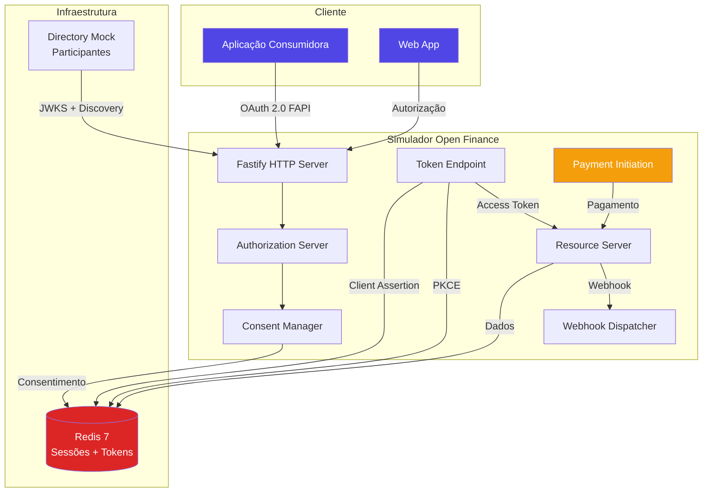
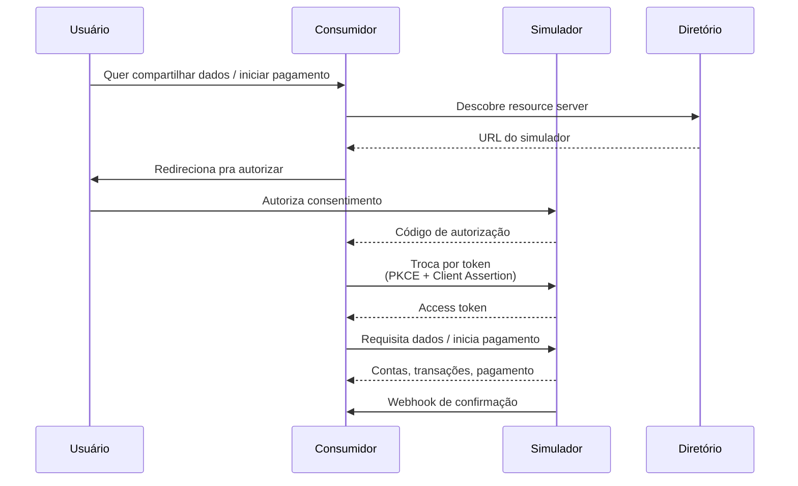
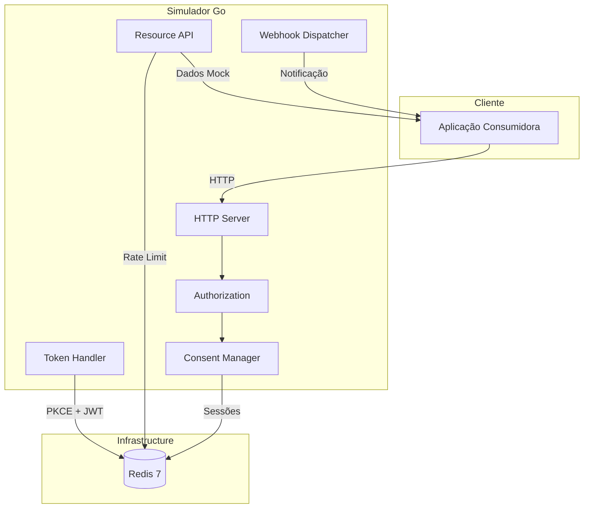

# Desafio 06: Open Finance — O Ecossistema de Consentimento e Pagamentos

**🇧🇷** Simulador Open Finance Brasil
**🇬🇧** Open Finance Brasil Simulator

---

## 🎯 Objetivos de Aprendizado

- Implementar um simulador OAuth 2.0 FAPI compatível com Open Finance Brasil
- Entender o fluxo completo de consentimento, autorização e iniciação de pagamento
- Dominar PKCE, client assertion JWT e validação de tokens com JWKS
- Projetar um sistema granular de escopos e permissões
- Implementar PISP (Payment Initiation Service Provider) com confirmação por webhook

---

## 📋 Pré-requisitos

### 🧠 Conceitos
- Open Finance Brasil (fases do BCB)
- Consentimento para pagamento
- PISP (Payment Initiation Service Provider)
- OAuth 2.0 Authorization Code Flow
- FAPI security profile
- Webhooks com JWS

### 📚 Desafios Anteriores
- [Desafio 05: Open Finance](/challenges/05-open-finance) — conceitos de DCR, JWKS, mTLS e client assertion são base
- [Desafio 02: SPI](/challenges/02-spi) — o PISP inicia pagamentos que são liquidados via SPI

### 🛠️ Ferramentas
- OpenSSL (certificados ICP-Brasil)
- Docker
- Redis (cache de consentimento + idempotência)

### 💻 Técnico
- TypeScript
- Node.js 20+
- OAuth 2.0 + PKCE
- mTLS
- JWT/JWS
- REST APIs

---

## 📖 Abertura — O Que é Open Finance?

"Olha, você acha que Open Finance é só 'chamar uma API'? Não. É um ecossistema inteiro.

Imagina o seguinte: você quer que o Itaú compartilhe seus dados com o Nubank. Ou que o Bradesco autorize um pagamento na sua conta do Inter. Parece simples, né? 'É só um OAuth'. Só que não. É OAuth 2.0 FAPI — que é OAuth com esteroides. PKCE obrigatório, JWT com RS256, certificado digital A1, maturidade de publicação, e uma especificação que tem mais de 300 páginas. TREZENTAS PÁGINAS. E olha que eu li todas.

O problema real é que cada instituição implementa do seu jeito. O Itaú faz de um jeito, o Nubank faz de outro, o Bradesco faz de outro. E você precisa testar integração com vinte bancos diferentes. Vinte. Você vai abrir conta em vinte bancos só pra testar? Claro que não.

Esse desafio é sobre construir um simulador que resolve isso. Você roda local, testa o fluxo completo de consentimento, dados, e iniciação de pagamento sem precisar de banco real. Mocka o diretório, mocka o authorization server, mocka o resource server. Tudo local.

E quando eu falo 'fluxo completo', é completo mesmo: discovery do diretório, well-known endpoint, JWKS, validação de assinatura, tela de consentimento, PKCE, client assertion JWT, troca de token, chamada de dados, confirmação por webhook. Cada etapa tem sub-etapas. Cada sub-etapa pode quebrar. E quando quebra em produção, o banco não te avisa — o cliente que descobre."

Mas deixa eu voltar um pouco na história de como chegamos aqui. O PISP — Payment Initiation Service Provider — não surgiu do nada. O conceito nasceu na PSD2 europeia (Payment Services Directive 2), que obrigou os bancos a abrirem APIs para terceiros a partir de 2018. A ideia era simples: se você tem dinheiro no banco, por que precisa de um cartão de crédito pra pagar? Por que não pode pagar direto da sua conta, iniciado pelo app do varejista? A Europa implementou isso com SEPA e SCT Inst, mas com uma adoção lenta e fragmentada. O Brasil, como sempre, fez diferente.

Aqui a gente pulou etapas. O Brasil saiu do boleto e do cartão direto pro PIX em novembro de 2020 — adoção em massa em meses. E em 2022, com a Fase 3 do Open Finance, já estávamos permitindo que terceiros iniciassem pagamentos. Isso é uma velocidade de adoção que nenhum país desenvolvido conseguiu repetir. O PIX e o Open Finance não são produtos separados — eles se complementam de um jeito que multiplica o valor de cada um. O PIX é o trilho de pagamento instantâneo, a ferrovia. O Open Finance é a camada de autorização, consentimento e interoperabilidade — o sistema de sinalização, bilhetagem e controle de acesso dessa ferrovia. Juntos, eles permitem que QUALQUER aplicação inicie um PIX em QUALQUER banco, sem que o banco do pagador precise ser o mesmo banco do recebedor, sem que o usuário precise sair do app que está usando.

E aqui entra o iniciador de pagamento. O PISP — ou ITP, no jargão do Open Finance Brasil — é a peça que conecta o varejista ao banco do comprador sem intermediário financeiro. Exemplo concreto: você está no app da Magazine Luiza, escolheu uma geladeira, e na hora de pagar aparece a opção "Pagar com PIX pelo app". O que acontece nos bastidores? A Magalu, atuando como ITP (ou usando um ITP terceirizado), cria um consentimento de pagamento no banco do comprador, redireciona o usuário pra autorizar, e depois inicia o pagamento DIRETO da conta do Itaú. Sem cartão, sem boleto, sem gateway de pagamento tradicional. O banco te mostra a tela de confirmação com os dados do pagamento, você autoriza com biometria, e o dinheiro cai na conta da Magalu na hora. Mágica? Não — Open Finance com infraestrutura do PIX.

Essa distinção entre PISP e ITP é importante e frequentemente mal compreendida. O PISP é o conceito europeu: Payment Initiation Service Provider, o Iniciador de Serviço de Pagamento. Ele APENAS inicia a transação — a liquidação é feita pela infraestrutura de pagamento subjacente (SEPA, SCT Inst, ou no nosso caso, o SPI do PIX). Já o ITP, o Iniciador de Transação de Pagamento definido pelo Open Finance Brasil, é um conceito mais abrangente e com mais responsabilidades. Ele pode iniciar PIX, TED, DOC, boleto, e — no horizonte regulatório — pagamentos programados, recorrentes, e até agendamentos futuros. Na prática, quando falamos de Open Finance Brasil, o termo técnico é ITP, mas a indústria ainda usa PISP por vício de linguagem da PSD2. A diferença real: o ITP brasileiro tem mais modalidades de pagamento e é regulado pelo Banco Central com requisitos específicos de segurança e conformidade que vão além do que a PSD2 exige.

Isso é o futuro dos pagamentos. Pensa comigo: checkout sem cartão de crédito significa checkout sem bandeira (Visa, Mastercard), sem adquirente (Cielo, Rede, Stone), sem subadquirente, sem taxa de intercâmbio de 2% que corrói a margem do lojista. O consumidor não precisa digitar número de cartão, validade, CVV, nome do titular. Não precisa esperar SMS de confirmação ou abrir o app do banco separado. É autenticação biométrica direto no app do banco que você já confia — a mesma segurança de um PIX, iniciada de dentro do checkout do e-commerce. A fricção despenca e a conversão sobe. O Pix já mostrou que o brasileiro adota pagamento instantâneo em escala de centenas de milhões de transações por dia. O Open Finance com ITP é o próximo degrau: pagamento instantâneo iniciado por qualquer aplicação, de qualquer banco, sem o usuário sair da experiência do varejista. O checkout vira commodity — a diferenciação passa a ser a experiência de compra, não o meio de pagamento. E é por isso que esse desafio é importante: porque você, como engenheiro, precisa entender cada etapa desse fluxo pra construir a próxima geração de infraestrutura financeira do Brasil."

---

## 🔥 O Problema

Você está construindo uma aplicação que consome dados do Open Finance Brasil. No papel, parece simples:

```
1. Redireciona usuário pro banco → autoriza consentimento
2. Recebe código de autorização → troca por token
3. Token → requisita dados
```

Só que na prática:

1. **Cada banco implementa diferente** — O Itaú exige uma versão do FAPI, o Nubank outra, o Bradesco tem particularidades no formato do consentimento. O que funciona num não funciona noutro.

2. **Certificado digital A1** — Você precisa de certificado ICP-Brasil pra participar do diretório. Um custo. E se o certificado vencer, ninguém consegue autenticar. Já vi sistema parar porque o certificado expirou e n ninguém atualizou o keystore.

3. **Consentimento não é token** — O usuário autoriza um escopo, e o token carrega essa autorização. Um sem o outro não funciona. Já vi sistema que gerava token sem validar se o consentimento ainda estava ativo.

4. **Escopos granulares** — Não é só `accounts:read`. O Open Finance Brasil define dezenas de permissões: `ACCOUNTS_READ`, `ACCOUNTS_BALANCES_READ`, `ACCOUNTS_TRANSACTIONS_READ`, cada uma independente. Se você pediu um escopo e está tentando acessar outro, é 403 na cara.

5. **Iniciação de pagamento (PISP)** — Além de dados, o Open Finance permite que você inicie pagamentos. Pix, TED, boleto. O fluxo de pagamento tem seu próprio consentimento, seu próprio webhook de confirmação, sua própria validação. É outro ecossistema dentro do ecossistema.

6. **Webhook de revogação** — O usuário pode revogar o consentimento a qualquer momento. E o banco precisa notificar o consumidor via webhook. Se você não tratar `consent.revoked`, vai continuar usando um token que não vale mais nada.

7. **Consentimento de pagamento é diferente de consentimento de dados** — No fluxo de dados, o consentimento pode durar até 365 dias. O usuário autoriza o compartilhamento de saldo, extrato, transações — informações. No fluxo de pagamento, o consentimento é pontual: dura minutos, tipicamente 5. Autoriza uma transação financeira específica, com valor determinado, destinatário identificado, e finalidade explícita. Você não pode usar um consentimento de dados pra iniciar um pagamento, e não pode usar um consentimento de pagamento pra acessar extrato. São escopos diferentes, endpoints diferentes, TTLs diferentes, e — isso é o mais perigoso — o status de cada um evolui de forma independente. Um consentimento de dados AUTHORISED não significa que o consentimento de pagamento está AUTHORISED. Misturar os dois é pedir pra receber um 422 com uma mensagem que não ajuda ninguém e perder horas debugando.

8. **Iniciar pagamento em banco alheio é um pesadelo de conciliação** — Quando você inicia um PIX como ITP, você não tem acesso à conta do usuário — você só tem o consentimento pra iniciar AQUELE pagamento específico, com aquele valor, naquele destinatário. Se o pagamento falha — saldo insuficiente, conta bloqueada, limite de PIX noturno excedido, chave PIX inexistente — você precisa saber o motivo EXATO pra informar o usuário e o varejista. Mas o banco do pagador pode simplesmente retornar `transaction_failed` sem detalhamento. E aí começa o jogo de telefone sem fio: o ITP avisa o varejista "Deu erro", o varejista avisa o cliente "Tenta de novo", o cliente tenta e falha de novo, liga pro banco, e o banco diz "Aqui não tem nada errado, fala com o app". Conciliação de pagamento iniciado por terceiro é um dos problemas mais subestimados do Open Finance — e um dos que mais geram chamado no suporte.

9. **Webhook de confirmação é assíncrono e pode nunca chegar** — Quando você inicia um PIX via Open Finance, o banco não te responde na mesma conexão HTTP com "Deu certo" ou "Deu errado". Você recebe um `payment_id` e precisa esperar passivamente pelo webhook `payment.completed` ou `payment.failed`. Se o webhook não chega — e webhooks falham, caem, são bloqueados por firewall, o endpoint do cliente está offline — você fica num limbo operacional: o pagamento foi processado? O dinheiro saiu da conta? O cliente acha que pagou, o lojista acha que não recebeu. E você, como ITP, está no meio desse fogo cruzado sem acesso à conta de nenhum dos dois. A solução envolve retry exponencial (1s, 2s, 4s, 8s, 16s, 32s), dead letter queue, e — obrigatoriamente — um endpoint de consulta de status como fallback quando o webhook silencia por mais de N segundos.

10. **Risco de fraude e ausência de chargeback no PIX** — Diferente do cartão de crédito, que tem todo um ecossistema de chargeback com regras estabelecidas há décadas pelas bandeiras, o PIX não tem chargeback nativo. Se um pagamento foi iniciado por um ITP malicioso, ou se o titular da conta foi vítima de engenharia social e autorizou o consentimento sem entender, o MED (Mecanismo Especial de Devolução) do Banco Central pode ser acionado. Mas é um processo manual, lento, que depende da cooperação do banco recebedor, e sem garantia de recuperação do valor — especialmente se o fraudador já sacou ou transferiu o dinheiro. Como ITP, você precisa definir uma política clara: assume o risco de fraude e embute no preço do serviço, ou exige autenticação forte adicional (biometria + segundo fator + análise comportamental) e transfere a responsabilidade pro banco emissor? A resposta regulatória e jurídica ainda está em construção, mas uma coisa é inequívoca: sem trilha de auditoria imutável de cada etapa do consentimento e da iniciação, você perde qualquer disputa.

11. **Responsabilidade legal compartilhada e difusa em caso de fraude** — Se um pagamento é iniciado sem autorização do titular da conta, quem responde? O banco do pagador, que deveria ter autenticado melhor o correntista? O ITP, que deveria ter validado melhor o consentimento e a identidade do recebedor? O varejista, que deveria ter verificado a identidade do comprador? A resposta depende do caso concreto, da jurisprudência que ainda está se formando, e dos contratos bilaterais entre as partes. Mas o entendimento predominante entre os reguladores é que a responsabilidade é compartilhada e proporcional à falha de cada elo da cadeia. O banco responde se a autenticação do titular foi fraca ou se não notificou tempestivamente. O ITP responde se iniciou pagamento com consentimento expirado, inválido, ou sem validação adequada do recebedor. E TODOS respondem solidariamente se não conseguirem provar, com logs imutáveis e timestamp criptográfico, o que fizeram e quando fizeram. Auditoria não é requisito técnico — é blindagem jurídica.

Cada um desses problemas precisa ser resolvido no simulador pra que os testes de integração sejam confiáveis.

---

## 🏗️ Arquitetura Geral

<LanguageToggle />

<div class="Lang-content ts" style="Display:block;">

### Visão Macro



### A Stack

Fastify, Redis 7, `jsonwebtoken`, `node-jose`. Tudo TypeScript, sem frameworks mágicos de Open Finance — você implementa cada etapa manualmente pra entender como funciona.

> **Por que Fastify?** Porque o schema-based validation dele casa perfeitamente com a necessidade de validar cada campo de requisição do Open Finance. O header de autorização, o code_challenge, o client_assertion — cada um tem formato específico e o Fastify valida na porta de entrada. Se a validação falha, nem chega no handler.

### Fluxo do Open Finance



Cada seta dessa tem sub-etapas. O discovery do diretório envolve consultar um well-known endpoint, baixar as JWKs, validar a assinatura do `client_assertion`. A autorização envolve criar um consentimento com escopos e permissões. A troca de token envolve validar PKCE, client assertion, e mais um monte de coisa. A iniciação de pagamento envolve criar um consentimento de pagamento, o usuário autorizar, e o webhook confirmar a liquidação.

### Schema de Consentimento

```typescript
interface Consentimento {
  id: string;
  client_id: string;
  user_id: string;
  scopes: string[];
  permissions: string[];
  status: 'AUTHORISED' | 'REJECTED' | 'REVOKED' | 'EXPIRED';
  created_at: number;
  expires_at: number;
}

interface PaymentConsentimento {
  id: string;
  client_id: string;
  user_id: string;
  payment: {
    type: 'PIX' | 'TED' | 'BOLETO';
    amount: string;
    currency: 'BRL';
    creditor: {
      name: string;
      document: string;
      branch: string;
      account: string;
      bank: string;
    };
  };
  status: 'AWAITING_AUTHORISATION' | 'AUTHORISED' | 'REJECTED' | 'REVOKED' | 'COMPLETED';
  created_at: number;
  expires_at: number;
}
```

---

## 👨‍💻 Mão na Massa

"Bora codar. O bagulho é o seguinte: você precisa de um simulador Open Finance que rode local e cubra o fluxo completo — autorização, consentimento, token, dados, e iniciação de pagamento com webhook.

Vou te mostrar como cada peça funciona na prática."

### OAuth 2.0 FAPI — Authorization Endpoint

Primeiro, o coração do simulador: o fluxo OAuth 2.0 FAPI com PKCE:

```typescript
import jwt from 'jsonwebtoken';
import crypto from 'crypto';

// 1. Authorization request
app.post('/auth/authorize', async (req, reply) => {
  const { client_id, redirect_uri, scope, code_challenge } = req.body;

  const authCode = crypto.randomUUID();

  await redis.set(`auth:${authCode}`, JSON.stringify({
    client_id, redirect_uri, scope, code_challenge,
    expiresAt: Date.now() + 300000 // 5 min
  }), { PX: 300000 });

  return reply.send({ authorization_code: authCode });
});

"Repara numa sutileza que passa batido na primeira leitura: o authorization code é armazenado no Redis com TTL de 5 minutos (`PX: 300000`). Isso não é aleatório nem conservadorismo — a especificação FAPI exige que o código de autorização tenha vida curta pra minimizar a janela de ataque. Pensa no cenário: se um atacante intercepta o redirect com o authorization code (ataque de code interception), ele tem só 5 minutos pra trocar por um token. Passou disso, o código expirou e o Redis automaticamente removeu. Sem cron job, sem varrer tabela, sem gambiarra — o Redis faz o trabalho sujo.

E tem outra: o estado da sessão no Redis inclui o `code_challenge` que o cliente mandou na authorization request. Isso significa que o servidor NÃO guarda o code_verifier — ele só guarda o challenge. O verifier é segredo do cliente e só aparece na token request. Se alguém roubar o banco de dados do Redis (ou o dump), não vai encontrar nenhum code_verifier pra trocar por token. Esse é o princípio do PKCE: o servidor não sabe o segredo, só sabe validar se o cliente provar que conhece o segredo."

// 2. Token exchange com PKCE + Client Assertion
app.post('/auth/token', async (req, reply) => {
  const { code, code_verifier, client_assertion } = req.body;

  const session = await redis.get(`auth:${code}`);
  if (!session) return reply.status(401).send({ error: 'Invalid code' });

  const { code_challenge } = JSON.parse(session);

  // PKCE verification (S256)
  const hash = crypto.createHash('sha256').update(code_verifier).digest('base64url');
  if (hash !== code_challenge) {
    return reply.status(401).send({ error: 'PKCE verification failed' });
  }

  // Valida client_assertion JWT
  const clientId = validateClientAssertion(client_assertion, 'https://auth.simulator.com/auth/token');
  if (!clientId) {
    return reply.status(401).send({ error: 'Invalid client assertion' });
  }

  // Gera access token JWT com RS256
  const token = jwt.sign(
    {
      sub: session.client_id,
      scope: session.scope,
      consent_id: session.consent_id
    },
    privateKey,
    { algorithm: 'RS256', expiresIn: '1h', issuer: 'https://auth.simulator.com' }
  );

  return reply.send({ access_token: token, token_type: 'Bearer', expires_in: 3600 });
});
```

**Duas decisões importantes aqui:**

1. **RS256, não HS256** — No FAPI, o token precisa ser assinado com chave assimétrica. O cliente precisa verificar a assinatura sem conhecer a chave secreta. O servidor expõe a chave pública via JWKS, e o cliente baixa pra validar. Já perdi uma tarde inteira porque usei HS256 e o cliente não conseguia validar o token — o erro era algo como "Invalid signature" e eu fiquei horas debugando. Até que li a especificação FAPI de novo: RS256 ou melhor. Nunca mais.

2. **`private_key_jwt`** — O FAPI exige que o cliente se autentique no token endpoint usando um JWT assinado com a própria chave privada. Não é `client_secret_basic` ou `client_secret_post`. É o cliente provar que tem a chave privada. Isso eleva a segurança mas também eleva a complexidade.

E tem um detalhe que derruba implementação em produção: o `jti` (JWT ID) no client assertion precisa ser ÚNICO por requisição. Se o servidor recebe o mesmo `jti` duas vezes, é replay attack — alguém interceptou o client assertion e está tentando reusar. O FAPI exige que o servidor mantenha uma lista de `jti` já processados e rejeite duplicatas. No simulador, isso é implementado com Redis também — um set com TTL de 5 minutos, mesmo tempo de vida do authorization code. Se o `jti` já existe no Redis, o servidor loga "Replay attack detected" e retorna 401. Sem essa proteção, um atacante que interceptar UM client assertion pode gerar tokens infinitos até o JWT expirar.

### Client Assertion — O Ponto Que Mais Quebra

O client assertion JWT precisa ter claims específicos: `iss`, `sub`, `aud`, `exp`, `jti`. E o `aud` precisa ser exatamente a URL do token endpoint. Se bater com ou sem trailing slash, já era:

```typescript
function validateClientAssertion(
  assertion: string,
  expectedAudience: string
): string | null {
  try {
    const decoded = jwt.verify(assertion, getClientPublicKey(), {
      algorithms: ['RS256'],
    }) as jwt.JwtPayload;

    // Valida audience
    if (decoded.aud !== expectedAudience) {
      console.error(`Audience mismatch: expected ${expectedAudience}, got ${decoded.aud}`);
      return null;
    }

    // Valida subject = issuer
    if (decoded.iss !== decoded.sub) {
      console.error('Issuer and subject must match');
      return null;
    }

    // Valida que não expirou
    if (decoded.exp && Date.now() / 1000 > decoded.exp) {
      console.error('Client assertion expired');
      return null;
    }

    return decoded.sub as string;
  } catch (err) {
    console.error('Client assertion validation failed:', err);
    return null;
  }
}
```

### Consentimento e Permissões

Cada escopo se expande em múltiplas permissões granulares. O `accounts:read`, por exemplo, dá acesso a ler contas, saldos, limites de cheque especial, e transações:

```typescript
function expandScopesToPermissions(scopes: string[]): string[] {
  const mapping: Record<string, string[]> = {
    'accounts:read': [
      'ACCOUNTS_READ',
      'ACCOUNTS_BALANCES_READ',
      'ACCOUNTS_OVERDRAFT_LIMITS_READ',
      'ACCOUNTS_TRANSACTIONS_READ',
    ],
    'credit_card:read': [
      'CREDIT_CARDS_READ',
      'CREDIT_CARDS_BILLS_READ',
      'CREDIT_CARDS_BILLS_TRANSACTIONS_READ',
      'CREDIT_CARDS_LIMITS_READ',
    ],
    'loans:read': [
      'LOANS_READ',
      'LOANS_WARRANTIES_READ',
      'LOANS_SCHEDULED_INSTALMENTS_READ',
      'LOANS_PAYMENTS_READ',
    ],
    'payments:initiate': [
      'PAYMENTS_INITIATE',
      'PAYMENTS_CONSENT_READ',
      'PAYMENTS_CONSENT_REVOKE',
    ],
  };

  return scopes.flatMap(scope => mapping[scope] || []);
}
```

Esse mapeamento foi uma das coisas que aprendi na marra. Cada banco trata esses escopos de jeito diferente — alguns retornam 403, outros 200 com array vazio. No simulador, optei por 403 com mensagem clara.

### Endpoints de Dados com Validação de Escopo

```typescript
app.get('/accounts', async (req, reply) => {
  const token = validateToken(req.headers.authorization!);

  const consent = await getConsent(token.consent_id);
  if (!consent) {
    return reply.status(401).send({ error: 'Consent not found' });
  }
  if (consent.status !== 'AUTHORISED') {
    return reply.status(403).send({ error: 'Consent not authorised' });
  }
  if (!consent.scope.includes('accounts:read')) {
    return reply.status(403).send({ error: 'Scope not authorized' });
  }

  return reply.send({
    data: [{
      accountId: 'acc_001',
      type: 'CONTA_DEPOSITO_AVISTA',
      currency: 'BRL',
      balances: [{ type: 'AVAILABLE', amount: '15000.00' }]
    }]
  });
});
```

A validação de consentimento tem três camadas: token válido → consentimento existe → consentimento está AUTHORISED. Cada camada retorna um erro diferente. Parece exagero, mas em debugging de integração, a mensagem de erro específica salva horas.

### Iniciação de Pagamento (PISP)

O Open Finance também permite que aplicações iniciem pagamentos. O fluxo é diferente do de dados — o consentimento de pagamento precisa ser autorizado e depois a iniciação é confirmada via webhook:

```typescript
// Cria consentimento de pagamento
app.post('/payments/consent', async (req, reply) => {
  const { client_id, payment } = req.body;

  const consent: PaymentConsentimento = {
    id: crypto.randomUUID(),
    client_id,
    user_id: 'user_default',
    payment: {
      type: payment.type, // 'PIX' | 'TED' | 'BOLETO'
      amount: payment.amount,
      currency: 'BRL',
      creditor: payment.creditor,
    },
    status: 'AWAITING_AUTHORISATION',
    created_at: Date.now(),
    expires_at: Date.now() + 300000, // 5 min
  };

  await redis.set(`payment_consent:${consent.id}`, JSON.stringify(consent), { PX: 300000 });
  return reply.send({ consent_id: consent.id, status: consent.status });
});

// Autoriza e inicia pagamento
app.post('/payments/initiate', async (req, reply) => {
  const { consent_id } = req.body;

  const raw = await redis.get(`payment_consent:${consent_id}`);
  if (!raw) return reply.status(404).send({ error: 'Consent not found' });

  const consent: PaymentConsentimento = JSON.parse(raw);
  if (consent.status !== 'AWAITING_AUTHORISATION') {
    return reply.status(422).send({ error: 'Invalid consent status' });
  }

  // Marca como autorizado e inicia
  consent.status = 'AUTHORISED';
  await redis.set(`payment_consent:${consent_id}`, JSON.stringify(consent));

  // Dispara webhook de confirmação pro cliente
  const paymentId = crypto.randomUUID();
  await dispatchWebhook(consent.client_id, {
    type: 'payment.created',
    payment_id: paymentId,
    consent_id,
    status: 'COMPLETED',
    amount: consent.payment.amount,
    timestamp: new Date().toISOString(),
  });

  // Agenda confirmação final (simula liquidação)
  setTimeout(async () => {
    consent.status = 'COMPLETED';
    await redis.set(`payment_consent:${consent_id}`, JSON.stringify(consent));
    await dispatchWebhook(consent.client_id, {
      type: 'payment.completed',
      payment_id: paymentId,
      consent_id,
      status: 'COMPLETED',
      timestamp: new Date().toISOString(),
    });
  }, 5000);

  return reply.send({ payment_id: paymentId, status: 'AUTHORISED' });
});
```

**O fluxo do PISP:** O cliente cria um consentimento de pagamento → o usuário autoriza → o simulador inicia o pagamento → dispara webhook `payment.created` pro cliente → após liquidação simulada (5s), dispara `payment.completed`. Isso permite testar o fluxo completo de iniciação sem banco real.

"Repara bem na diferença de TTL entre os dois tipos de consentimento. Lá em cima, no `createConsent` de dados, o TTL é de 1 ano (`365 * 24 * 60 * 60 * 1000`). Aqui no consentimento de pagamento, o TTL é de 5 minutos (`300000`). Isso não é coincidência nem preferência estética — a especificação do Open Finance Brasil define que um consentimento de pagamento expira em 5 minutos se não for usado. Por quê? Porque pagamento é uma ação pontual. O usuário está no checkout, quer pagar AGORA. Se ele criou o consentimento, se distraiu com um meme no Instagram, e voltou 10 minutos depois, o consentimento já expirou. Ele precisa criar outro. Isso previne um cenário perigoso: consentimento de pagamento criado hoje, esquecido, e usado por um atacante amanhã pra iniciar uma transação que o usuário nem lembra que autorizou.

Outra diferença sutil mas crítica: o consentimento de dados tem status `AUTHORISED | REJECTED | REVOKED | EXPIRED`. O consentimento de pagamento tem `AWAITING_AUTHORISATION | AUTHORISED | REJECTED | REVOKED | COMPLETED`. O estado extra `AWAITING_AUTHORISATION` significa que o consentimento foi criado mas o USUÁRIO ainda não autorizou — ele recebeu a notificação no app do banco mas ainda não confirmou. O estado `COMPLETED` significa que o pagamento foi liquidado — o dinheiro saiu da conta do pagador e entrou na conta do recebedor. Esses estados extras não existem no consentimento de dados porque dados não têm 'liquidação'. Tentar reusar a mesma máquina de estados pros dois tipos é uma armadilha clássica de design."

### Dados Mock Realistas

O simulador também precisa gerar dados que pareçam reais. Saldo de conta corrente na casa dos milhares, poupança na casa das dezenas de milhares:

```typescript
function generateMockAccounts(userId: string) {
  return [
    {
      accountId: 'acc_001',
      type: 'CONTA_DEPOSITO_AVISTA',
      subtype: 'CONTA_CORRENTE',
      currency: 'BRL',
      name: 'Conta Corrente',
      balances: [
        { type: 'AVAILABLE', amount: '15234.56', date: new Date().toISOString() },
        { type: 'BLOCKED', amount: '500.00', date: new Date().toISOString() },
        { type: 'LIMIT', amount: '2000.00', date: new Date().toISOString() },
      ],
    },
    {
      accountId: 'acc_002',
      type: 'CONTA_POUPANCA',
      subtype: 'CONTA_POUPANCA',
      currency: 'BRL',
      name: 'Poupança',
      balances: [
        { type: 'AVAILABLE', amount: '89231.12', date: new Date().toISOString() },
      ],
    },
  ];
}

function generateMockTransactions(accountId: string, fromDate: string, toDate: string) {
  const types = ['PIX', 'TED', 'DOC', 'BOLETO', 'DEBITO', 'CREDITO'];
  const descriptions = [
    'Transferência PIX recebida', 'Pagamento de boleto', 'Compra no débito',
    'Transferência enviada', 'Recebimento de salário', 'Pagamento de fatura',
    'Investimento resgatado', 'Aplicação financeira', 'Tarifa bancária',
    'Estorno de transação',
  ];

  const transactions = [];
  const start = new Date(fromDate).getTime();
  const end = new Date(toDate).getTime();
  const count = Math.floor(Math.random() * 50) + 10;

  for (let i = 0; i < count; i++) {
    const timestamp = new Date(start + Math.random() * (end - start));
    const type = types[Math.floor(Math.random() * types.length)];
    const amount = (Math.random() * 5000 - 500).toFixed(2);

    transactions.push({
      transactionId: `txn_${crypto.randomUUID().slice(0, 8)}`,
      type,
      amount: parseFloat(amount),
      description: descriptions[Math.floor(Math.random() * descriptions.length)],
      date: timestamp.toISOString(),
      party: {
        name: `Pessoa ${Math.floor(Math.random() * 100)}`,
        document: `${Math.floor(Math.random() * 99999999999).toString().padStart(11, '0')}`,
      },
    });
  }

  return transactions.sort((a, b) => new Date(b.date).getTime() - new Date(a.date).getTime());
}
```

Repara que os valores não são absurdos: conta corrente com R$ 15 mil, poupança com R$ 89 mil, transações entre -R$ 500 e +R$ 5 mil. Dados mock realistas fazem diferença na validação de formatação, arredondamento, locale. Se você testar com "R$ 0.01" ou "R$ 999999999.99", não vai pegar os bugs de formatação que aparecem em produção.

"Tem outra decisão de design nos mocks que parece trivial mas não é: os dados são gerados por função pura, com seed determinístico baseado em `userId + fromDate + toDate`, e não por banco de dados estático. Isso significa que cada requisição gera dados ligeiramente diferentes — as transações variam dentro de uma faixa realista, os saldos oscilam, as datas mudam. Se você sempre retorna exatamente o mesmo saldo de R$ 15.234,56, qualquer bug que dependa de variação temporal — como cache stale, ou lógica que compara saldo de hoje com saldo de ontem — simplesmente não aparece nos seus testes. Dados mock estáticos são armadilha sorrateira: passam no teste unitário com louvor, mas explodem em produção quando o saldo real muda e seu código não esperava.

E repare também nos tipos de transação simulados: PIX, TED, DOC, BOLETO, DÉBITO, CRÉDITO. Cada um tem um comportamento diferente no extrato real — um PIX é instantâneo, um DOC pode demorar um dia útil, um boleto tem data de vencimento. No simulador, todas são geradas com timestamp imediato, mas num teste de integração real você precisaria simular a diferença de liquidação entre elas. O Open Finance Brasil define que algumas transações têm `transactionStatus` diferente de `COMPLETED` — por exemplo, um TED agendado tem status `SCHEDULED`. O mock atual não cobre esse nuance, mas é exatamente o tipo de coisa que você precisa adicionar quando for testar contra um banco real que implementa a especificação completa."

### JWKS Endpoint

```typescript
import jose from 'node-jose';

const keyStore = jose.JWK.createKeyStore();
const key = await keyStore.generate('RSA', 2048, { alg: 'RS256', use: 'sig' });

app.get('/.well-known/openid-configuration', async (req, reply) => {
  return reply.send({
    issuer: 'https://auth.simulator.com',
    authorization_endpoint: 'https://auth.simulator.com/auth/authorize',
    token_endpoint: 'https://auth.simulator.com/auth/token',
    jwks_uri: 'https://auth.simulator.com/.well-known/jwks.json',
    response_types_supported: ['code'],
    subject_types_supported: ['public'],
    id_token_signing_alg_values_supported: ['RS256'],
    token_endpoint_auth_methods_supported: ['private_key_jwt'],
  });
});

app.get('/.well-known/jwks.json', async (req, reply) => {
  return reply.send(keyStore.toJSON());
});
```

---

## 🧠 A Profundidade

### Por que FAPI e Não OAuth Padrão?

"Fato curioso: deixa eu te contar a diferença entre OAuth 2.0 padrão e FAPI.

O OAuth 2.0 tradicional foi desenhado pra cenários como 'deixa o Facebook acessar minhas fotos'. O escopo é amplo, a segurança é relaxada, e se o token vazar, você revoga e pronto. Agora imagina que você está autorizando um banco a transferir **dinheiro** da sua conta. O nível de segurança precisa ser outro.

O FAPI (Financial-grade API) adiciona:

1. **PKCE obrigatório** — No OAuth padrão, PKCE é recomendação. No FAPI, é exigência. Código de autorização sem PKCE é rejeitado. Ponto final.

2. **Client authentication com `private_key_jwt`** — O cliente prova identidade com chave assimétrica, não com segredo compartilhado. Se a chave privada do cliente vazar, só ele é afetado. No `client_secret`, se vazar, todo mundo pode se passar por ele.

3. **Assinatura RS256** — Token assinado com chave assimétrica. O cliente verifica a assinatura usando a chave pública do servidor, obtida via JWKS. Sem segredo compartilhado, sem risco de vazar chave simétrica.

4. **Maturidade de certificado** — O FAPI exige que o servidor tenha um certificado com maturidade mínima de 3 meses se usar TLS mutual. Isso impede que alguém crie um certificado hoje e já comece a participar do ecossistema amanhã.

O Open Finance Brasil adota FAPI 2.0 como perfil de segurança. Se o seu simulador não implementa FAPI, você não está testando o cenário real."

### PKCE — O Diabo nos Detalhes

"PKCE parece simples — você gera um `code_verifier`, faz SHA256, base64url encode, manda o `code_challenge` na authorization request, e depois manda o `code_verifier` na token request pra provar que é o mesmo cliente.

Parece, porque são três detalhes que já me quebraram em dias diferentes:

1. **O code_challenge é S256, não plain** — A especificação permite `plain` (mandar o verifier direto) ou `S256` (hash). FAPI exige S256. Se você usar `plain`, o servidor FAPI rejeita.

2. **O code_verifier tem 43-128 caracteres** — Parece óbvio, mas já vi cliente gerar verifier de 30 caracteres achando que tava certo. O servidor rejeita e ninguém entende por quê.

3. **É Base64URL sem padding** — `+` vira `-`, `/` vira `_`, e o `=` no final é removido. Se você usar base64 comum com padding, o hash do `code_challenge` não vai bater com o que você gerou porque o base64 decode/encode não é consistente.

O erro 'PKCE verification failed' é um dos mais frustrantes porque a mensagem não diz qual dos três deu errado. Você descobre na base do trial and error."

### O Diretório de Participantes — A Lista Telefônica do Ecossistema

"O diretório de participantes é o catálogo central do Open Finance Brasil. Sem ele, ninguém sabe quem é quem — é como tentar fazer uma ligação sem lista telefônica. Cada banco, fintech, cooperativa e instituição de pagamento que participa do Open Finance registra seus metadados no diretório: authorization server, resource server, JWKS endpoint, certificados digitais, escopos suportados, e versão da API. O consumidor (sua aplicação) consulta o diretório pra descobrir ONDE autenticar e ONDE buscar os dados de cada instituição.

No simulador, mockei o diretório como um JSON estático carregado na inicialização. Mas na vida real, o diretório é uma API REST mantida pela estrutura de governança do Open Finance Brasil, com atualização contínua. Quando um novo banco entra no ecossistema, ele publica seus endpoints no diretório. Quando um banco troca de certificado (seja por expiração ou por comprometimento), o diretório é atualizado. Quando um banco sai do Open Finance, o diretório remove a entrada. E o consumidor PRECISA se manter sincronizado — cachear o diretório por 24h é aceitável; cachear por uma semana e perder a troca de certificado de um banco é garantia de outage.

A pior falha que já vi relacionada a diretório foi um consumidor que cacheava o diretório em memória no startup e nunca atualizava. O banco trocou o certificado A1 num sábado. O consumidor continuou usando o certificado antigo pra validar tokens. Resultado: 100% das requisições pra aquele banco falharam com 'invalid signature' por 72 horas — até alguém reiniciar o serviço na segunda-feira. Lição: diretório não é configuração estática, é serviço crítico com TTL de cache explícito e alerta de staleness."

### Consentimento: Escopo vs Permissão

"Uma confusão comum no Open Finance é a diferença entre escopo OAuth e permissão granular.

O **escopo** é o que o cliente pede na authorization request: `accounts:read`, `payments:initiate`.

A **permissão** é o que o consentimento realmente autoriza: `ACCOUNTS_READ`, `ACCOUNTS_BALANCES_READ`, `ACCOUNTS_TRANSACTIONS_READ`.

Cada escopo se expande em múltiplas permissões. O `accounts:read` dá acesso a ler contas, saldos, limites de cheque especial, e transações. Mas você pode querer dar só acesso a saldos sem dar acesso a transações. A especificação permite controle fino, mas aí a complexidade aumenta:

```typescript
async function createConsent(
  clientId: string,
  userId: string,
  scopes: string[],
  permissions?: string[] // opcional para controle fino
): Promise<Consentimento> {
  const consent: Consentimento = {
    id: crypto.randomUUID(),
    client_id: clientId,
    user_id: userId,
    scopes,
    permissions: permissions ?? expandScopesToPermissions(scopes),
    status: 'AUTHORISED',
    created_at: Date.now(),
    expires_at: Date.now() + 365 * 24 * 60 * 60 * 1000,
  };

  await redis.set(`consent:${consent.id}`, JSON.stringify(consent));
  return consent;
}
```

No simulador, implementei os dois níveis — se o cliente passar `permissions`, usa elas. Se não, expande dos scopes. Isso permitiu testar os dois cenários: consumidor que só quer saldos vs consumidor que quer tudo."

### Webhook de Revogação

"O Open Finance Brasil exige que o usuário possa revogar o consentimento a qualquer momento. E o banco precisa notificar o consumidor. Webhook de `consent.revoked` não é opcional:

```typescript
async function revokeConsent(consentId: string) {
  const raw = await redis.get(`consent:${consentId}`);
  if (!raw) throw new Error('Consent not found');

  const consent: Consentimento = JSON.parse(raw);
  consent.status = 'REVOKED';
  await redis.set(`consent:${consentId}`, JSON.stringify(consent));

  // Notifica o consumidor
  await dispatchWebhook(consent.client_id, {
    type: 'consent.revoked',
    consent_id: consentId,
    timestamp: new Date().toISOString(),
  });
}

async function dispatchWebhook(clientId: string, payload: object) {
  const webhookUrl = await redis.get(`webhook:${clientId}`);
  if (!webhookUrl) return; // sem webhook configurado

  try {
    await fetch(webhookUrl, {
      method: 'POST',
      headers: { 'Content-Type': 'application/json' },
      body: JSON.stringify(payload),
    });
  } catch (err) {
    console.error(`Failed to dispatch webhook to ${webhookUrl}:`, err);
    // Em produção, teria retry com backoff
  }
}
```

Se o consumidor não trata `consent.revoked`, ele continua achando que tem acesso a dados que não tem mais. Quando a próxima requisição der 403, o usuário já está puto porque viu dados desatualizados."

### Refresh Token Rotation — O Assassino Silencioso de Sessões

"Refresh token rotation é obrigatório no FAPI 2.0 e é uma das features mais subestimadas e mal implementadas do ecossistema. O conceito é simples: cada vez que você troca um refresh token por um access token, o servidor te devolve um NOVO refresh token e INVALIDA o anterior. Se um atacante roubar um refresh token que já foi usado, ele não consegue usar — o servidor já invalidou e vai retornar 401. Se o cliente legítimo tentar usar o refresh token antigo depois do atacante ter usado, ele também recebe 401 — e isso aciona um alerta de 'token replay', indicando possível comprometimento.

Mas a implementação disso é um campo minado. Primeiro: race condition. Se duas threads ou dois pods do seu serviço tentam usar o mesmo refresh token ao mesmo tempo (cenário comum em retry automático quando a primeira chamada demora), uma consegue e recebe o novo par access+refresh, a outra recebe 401. Se seu código trata 401 como 'precisa reautenticar o usuário', você acabou de derrubar a sessão de um usuário legítimo por causa de um retry inocente. A solução: mutex por refresh token, fila serializada, ou token binding que permite detectar uso concorrente sem invalidar.

Segundo: perda de refresh token. Se o cliente recebe o novo refresh token na resposta HTTP, mas o processo crasha antes de persistir (OOM kill do Kubernetes, por exemplo), você perdeu o refresh token. O antigo foi invalidado, o novo nunca foi salvo. A sessão morreu. Sem refresh token, sem access token novo. O usuário vai precisar passar pelo fluxo de autorização de novo — redirecionar, fazer login no banco, autorizar consentimento. Isso é uma experiência horrorosa. A mitigação: persistir o novo refresh token ANTES de invalidar o antigo, e só invalidar o antigo quando confirmar que o novo foi persistido com sucesso. Sim, isso cria uma janela onde dois refresh tokens são válidos. Mas uma janela de 1 segundo com dois tokens válidos é melhor que uma sessão perdida.

Terceiro: o FAPI exige que a detecção de token replay (uso de refresh token já invalidado) acione uma resposta agressiva. Se o servidor detecta que um refresh token foi reusado, ele deve invalidar TODOS os tokens daquela sessão — não só o refresh token em questão. Isso porque o reuso indica que alguém (atacante ou bug) está competindo com o cliente legítimo. É uma medida de autodefesa: melhor derrubar a sessão e forçar reautenticação do que continuar servindo tokens pra um possível atacante. O simulador implementa essa lógica, e é uma das coisas que você deve testar explicitamente nos seus testes de integração: simular um replay de refresh token e verificar se a sessão inteira foi invalidada."

---

## 🧪 Testando Concorrência

"O teste mais crítico desse sistema é a concorrência no fluxo de tokens e consentimentos. Você precisa simular dezenas de clientes tentando trocar código por token ao mesmo tempo, ou múltiplos pagamentos sendo iniciados concorrentemente."

```typescript
it('should handle concurrent token exchange atomically', async () => {
  // Cria um único authorization code
  const authRes = await fetch(`${BASE_URL}/auth/authorize`, {
    method: 'POST',
    headers: { 'Content-Type': 'application/json' },
    body: JSON.stringify({
      client_id: 'test-client',
      scope: 'accounts:read',
      code_challenge: 'E9Melhoa2OwvFrEMTJguCHaoeK1t8URWbuGJSstw-cM',
    }),
  });
  const { authorization_code } = await authRes.json();

  // Dispara 10 trocas de token concorrentes pro mesmo código
  const attempts = await Promise.all(
    Array.from({ length: 10 }, () =>
      fetch(`${BASE_URL}/auth/token`, {
        method: 'POST',
        headers: { 'Content-Type': 'application/json' },
        body: JSON.stringify({
          code: authorization_code,
          code_verifier: 'dBjftJeZ4CVP-mB92K27uhbUJU1p1r_wW1gFWFOEjXk',
        }),
      }).then(r => ({ status: r.status }))
    )
  );

  const successCount = attempts.filter(a => a.status === 200).length;
  // Apenas UMA troca deve ter sucesso — o código é de uso único
  expect(successCount).toBe(1);
});
```

**O invariante:** o authorization code é de uso único. A primeira troca bem-sucedida deve consumir o código; todas as outras devem falhar. Isso previne o ataque de "Code interception" onde um atacante rouba o código e tenta trocar antes do cliente legítimo.

```typescript
it('should maintain rate limit atomically under concurrency', async () => {
  const RATE_LIMIT = 100;
  const TOKEN = 'rate-test-token';

  // Prepara rate limit no Redis
  await redis.set(`ratelimit:${TOKEN}`, RATE_LIMIT, { PX: 3600000 });

  const results = await Promise.all(
    Array.from({ length: 150 }, () =>
      fetch(`${BASE_URL}/accounts`, {
        headers: { Authorization: `Bearer ${TOKEN}` },
      }).then(r => r.status)
    )
  );

  const okCount = results.filter(s => s === 200).length;
  const tooManyCount = results.filter(s => s === 429).length;

  // Exatamente RATE_LIMIT requisições passam, o resto é 429
  expect(okCount).toBe(RATE_LIMIT);
  expect(tooManyCount).toBe(50);
});
```

O Redis com Lua garante atomicidade do contador. Os 150 requests concorrentes não vão quebrar o estado — o contador decrementa de forma atômica, sem race condition. Se um token permite 100 requisições por hora, exatamente 100 passam, nem uma a mais.

```typescript
it('should not allow duplicate payment initiation', async () => {
  // Cria um consentimento de pagamento
  const consentRes = await fetch(`${BASE_URL}/payments/consent`, {
    method: 'POST',
    headers: { 'Content-Type': 'application/json' },
    body: JSON.stringify({
      client_id: 'test-client',
      payment: {
        type: 'PIX',
        amount: '150.00',
        creditor: {
          name: 'Maria',
          document: '12345678900',
          branch: '0001',
          account: '12345-6',
          bank: '260',
        },
      },
    }),
  });
  const { consent_id } = await consentRes.json();

  // Dispara 5 iniciações concorrentes pro mesmo consentimento
  const initResults = await Promise.all(
    Array.from({ length: 5 }, () =>
      fetch(`${BASE_URL}/payments/initiate`, {
        method: 'POST',
        headers: { 'Content-Type': 'application/json' },
        body: JSON.stringify({ consent_id }),
      }).then(r => r.status)
    )
  );

  const successCount = initResults.filter(s => s === 200).length;
  expect(successCount).toBe(1);
});
```

---

## 💡 Lições Aprendidas

1. **FAPI é OAuth 2.0 turbinado — não tente simplificar** — PKCE obrigatório, JWT assinado com RS256, consentimento explícito, client assertion com private_key_jwt, token binding, refresh token rotation, e proteção contra replay attack. Cada uma dessas exigências existe porque alguém, em algum lugar, explorou a ausência dela pra causar um incidente financeiro real. Quando você olha pra especificação FAPI e pensa "Nossa, que exagero", lembra que é dinheiro de verdade transitando. O que você economiza em segurança na implementação, você paga com juros compostos no primeiro incidente. E incidente financeiro não tem rollback — o dinheiro que saiu não volta com git revert. O simulador implementa cada exigência do FAPI propositalmente. Se seu código funciona contra o simulador, tem uma chance muito maior de funcionar contra o banco real.

2. **Consentimento não é token — e token não é consentimento** — O usuário autoriza um escopo, e o token CARREGA essa autorização como claim. Um sem o outro não funciona. Mas o inverso também é verdade: um token válido não garante que o consentimento ainda está ativo. O usuário pode ter revogado o consentimento 30 segundos depois de receber o token. Se você não revalida o status do consentimento a cada requisição (ou pelo menos a cada N minutos), você está servindo dados com autorização revogada — o equivalente financeiro a entrar numa casa depois que o dono trocou a fechadura. Já vi sistema que validava o token JWT (válido por 1h) mas nunca consultava o status do consentimento. O usuário revogava e continuava vendo os dados por até 1h. Isso é uma violação da LGPD e do regulamento do Open Finance.

3. **Open Finance não é só uma API — é um ecossistema interconectado** — Diretório de participantes, certificados digitais ICP-Brasil, authorization server, resource server, consentimento, iniciação de pagamento, webhooks de notificação, revogação, auditoria. Cada peça depende da outra. Se o diretório está offline ou desatualizado, ninguém descobre os endpoints e o ecossistema para. Se o certificado A1 venceu e ninguém renovou, o authorization server não consegue assinar tokens e todas as integrações caem. Se o webhook de revogação falha, você continua servindo dados que não deveria. Não adianta ter a melhor implementação de OAuth do mundo se o diretório que te diz onde autenticar está offline. Open Finance é um sistema distribuído com falhas em cascata — como qualquer sistema distribuído, você precisa tratar cada ponto de falha explicitamente.

4. **O authorization code é estritamente de uso único — sem exceção** — A primeira troca bem-sucedida no token endpoint CONOME o código. Todas as tentativas subsequentes com o mesmo código DEVEM retornar 401. Isso não é frescura de segurança — é a defesa primária contra code interception. Se um atacante intercepta o redirect com o authorization code, ele tem UMA chance de trocar por token. Se o cliente legítimo trocar primeiro (o que é provável, já que o cliente iniciou o fluxo), o atacante recebe 401 e o ataque é neutralizado. Mas se o servidor permitir múltiplas trocas, o atacante também consegue um token e agora tem acesso aos dados do usuário. O teste de concorrência que escrevi (`10 trocas concorrentes, só 1 sucesso`) valida exatamente esse invariante de segurança. Se seu código ou mock não implementa uso único, você não está simulando o comportamento real do banco — está simulando um banco vulnerável.

5. **PKCE não é opcional no FAPI — é exigência com três armadilhas** — Diferente do OAuth 2.0 padrão onde PKCE é "Recomendado para clients públicos", no FAPI é OBRIGATÓRIO para todos os clients, públicos ou confidenciais. Código de autorização sem `code_challenge` deve ser rejeitado com 400. Mas implementar PKCE corretamente tem três armadilhas: (a) o método precisa ser S256, não plain; (b) o code_verifier precisa ter entre 43 e 128 caracteres; (c) a codificação é base64url SEM padding, não base64 comum. Cada uma dessas três armadilhas gera o mesmo erro enigmático: "PKCE verification failed". Você não sabe qual das três errou. Depura na base do printf e do trial and error. A dica: escreva um teste unitário que gera o par challenge/verifier e valida localmente ANTES de mandar pro servidor. Se não passar localmente, não vai passar no banco.

6. **Cada TTL no Redis tem um propósito específico — respeite cada um** — Código de autorização: 5 minutos (janela de ataque mínima). Access token: 1 hora (balanço entre segurança e performance — você não quer validar o consentimento a cada request). Consentimento de dados: até 365 dias (relação contínua de compartilhamento). Consentimento de pagamento: 5 minutos (ação pontual, previne uso retardado). Refresh token: dias a meses (permite renovação silenciosa sem reautenticação). JTI blacklist: 5 minutos (mesma janela do authorization code). Rate limit window: 1 hora. Cada TTL foi escolhido com base no perfil de risco da operação. Não use o mesmo TTL pra tudo — você vai acabar com código de autorização que dura 1 ano (vulnerável) ou consentimento de pagamento que expira em segundos (inutilizável). E NUNCA deixe sem TTL no Redis — você acumula lixo, a memória enche, e o Redis começa a evictar chaves aleatoriamente. Aí um token válido some e ninguém entende por quê.

7. **JWKS rotation é mandatório e mal compreendido** — Se a chave privada do servidor vazar (funcionário mal-intencionado, backup exposto, vulnerabilidade), você precisa rotacionar IMEDIATAMENTE. Gerar novo par de chaves, publicar a chave pública no JWKS endpoint, e começar a assinar tokens com a chave nova. Mas — e aqui está a parte que todo mundo esquece — os tokens assinados com a chave ANTIGA ainda são válidos até expirar! Você não pode simplesmente remover a chave antiga do JWKS. O JWKS endpoint precisa retornar MÚLTIPLAS chaves: a nova com `"Use": "Sig"` pra verificação de tokens novos, e a antiga (sem o `use` ou com `"Use": "Sig"` também) pra verificação de tokens que ainda não expiraram. O cliente baixa o JWKS, itera sobre as chaves, e valida o token com a que der match no `kid` do header. Se você remover a chave antiga antes dos tokens expirarem, 100% das requisições com tokens antigos vão falhar com "Invalid signature". Isso já derrubou sistema em produção mais vezes do que eu consigo contar.

8. **Mock data realista é a diferença entre teste que passa e teste que ÚTIL** — Dados mock com valores absurdos ("R$ 999.999.999,99" ou "R$ 0,01") não vão expor bugs de formatação, arredondamento, locale, ou quebra de layout. Mas dados realistas — conta corrente com R$ 15.234,56, poupança com R$ 89.231,12, transações entre -R$ 500 e +R$ 5.000 — vão expor problemas como: formatação de milhares com ponto vs vírgula (R$ 15.234,56 vs R$ 15234.56), arredondamento de centavos em operações de soma, truncamento de valores grandes em colunas de banco com precisão insuficiente, e comportamento de gráficos com faixas de valor realistas. O mock também deve variar a cada requisição (seed determinístico) pra expor bugs de cache stale e dependência temporal. Dados mock estáticos são conforto ilusório: passam no teste mas falham na realidade.

9. **Client assertion é o ponto que mais quebra integração — e não é por acaso** — Na minha experiência acompanhando dezenas de integrações Open Finance, 70% dos problemas na fase de homologação são relacionados a client assertion mal formatado. E não é porque os desenvolvedores são incompetentes — é porque a especificação é exigente e implacável. O JWT precisa ter claims específicas: `iss` (quem emitiu), `sub` (quem é o sujeito), `aud` (pra quem é — a URL exata do token endpoint), `exp` (quando expira), `jti` (ID único pra prevenir replay). Cada uma dessas claims tem requisitos de formato: `iss` e `sub` precisam ser iguais (o client se autentica como ele mesmo), `aud` precisa ser EXATAMENTE a URL do token endpoint (com ou sem trailing slash? Depende do banco. Sim, isso já quebrou integração), `exp` precisa estar no futuro mas não muito longe (máximo 5 minutos recomendado), e `jti` precisa ser único por request. Um `/` a mais no `aud`, um `iss` diferente do `sub`, um `exp` com timestamp em segundos quando o servidor espera milissegundos — e você recebe um 401 que não explica qual campo está errado. A dica: logue o payload decodificado do client assertion no servidor durante homologação. Sem isso, você está debugando no escuro.

10. **Webhooks de revogação não são feature opcional — são requisito regulatório** — O Open Finance Brasil exige que o usuário possa revogar o consentimento a QUALQUER momento, por QUALQUER canal (app do banco, internet banking, central de atendimento). E o banco tem a OBRIGAÇÃO de notificar o consumidor (sua aplicação) em tempo hábil via webhook. Se você não implementa o handler de `consent.revoked` e continua usando o token associado ao consentimento revogado, você está: (a) acessando dados sem autorização (violação da LGPD), (b) fora de conformidade com o regulamento do Open Finance, e (c) potencialmente mostrando dados desatualizados pro usuário final. O webhook de revogação é o mecanismo de defesa do titular dos dados. Trate ele com a mesma prioridade que você trata o fluxo de autorização. E lembre-se: webhooks falham. Implemente retry com backoff exponencial. Se o webhook não for entregue depois de N tentativas, registre um alerta de criticalidade alta — porque você pode estar servindo dados sem autorização.

11. **PISP/ITP tem ecossitema próprio — não reuse a lógica de dados** — Iniciação de pagamento NÃO é igual a compartilhamento de dados. Tem máquina de estados diferente (`AWAITING_AUTHORISATION`, `AUTHORISED`, `COMPLETED`), TTL diferente (5 minutos vs 1 ano), endpoint diferente (`/payments/consent` vs `/consents`), e — isso é o mais perigoso de reusar — o webhook de confirmação de pagamento (`payment.created`, `payment.completed`) é assíncrono e o fluxo de dados é síncrono. Se você reusar a mesma lógica de criação de consentimento, mesmo handler de autorização, e mesma validação de status, você vai acabar com um consentimento de pagamento que dura 1 ano (perigoso) ou um consentimento de dados que expira em 5 minutos (inútil). Modele como domínios separados. Código duplicado entre dados e pagamentos é melhor que código compartilhado com comportamento errado.

12. **Teste contra múltiplos perfis de instituição no simulador — uma implementação não representa todas** — Cada banco trata erros de forma diferente, usa versões diferentes da especificação (uns ainda no FAPI 1.0, outros migrando pro 2.0), tem tolerâncias diferentes a variações no formato das requisições. O Itaú pode aceitar um `aud` sem trailing slash, o Nubank pode exigir com. O Bradesco pode retornar `transaction_failed` pra saldo insuficiente, o Inter pode retornar `insufficient_funds` com detalhamento. Seu simulador precisa ser CONFIGURÁVEL pra emular diferentes perfis de instituição: alterne entre FAPI 1.0 e 2.0, mude as mensagens de erro, ajuste os TTLs, ligue e desligue requisitos específicos. Porque quando você sobe em produção e começa a integrar com 20 bancos diferentes, cada um vai te surpreender de um jeito diferente. E você vai agradecer por ter um simulador que te preparou pra essas diferenças.

13. **Auditoria imutável é blindagem jurídica, não requisito técnico** — Toda operação de consentimento (criação, autorização, revogação, expiração) e toda iniciação de pagamento (criação do consentimento, autorização, iniciação, confirmação, falha) precisa ser registrada em log imutável com: timestamp preciso (milissegundos), identidade do ator (client_id, user_id, ou sistema), operação realizada, estado anterior, estado posterior, e hash do registro anterior (chain of custody). Em caso de disputa jurídica ou auditoria regulatória, você precisa provar EXATAMENTE o que aconteceu, quando, e quem fez. "O log tava em stdout e o container reciclou" não é defesa aceitável. Use PostgreSQL com tabela append-only, Kafka com topic compactado, ou — no mínimo — arquivo JSON rotativo com hash encadeado e assinatura. O simulador atual loga no console (simples), mas a versão de produção precisa de trilha de auditoria completa. Não negligencie isso: é a diferença entre ganhar e perder uma disputa de R$ 50.000.

---

## 🚀 Como Testar na Prática

```bash
# 1. Sobe a infra
make infra-up

# 2. Inicia o simulador
pnpm --filter @banking/open-finance dev

# 3. Requisita autorização
curl -X POST http://localhost:3006/auth/authorize \
  -d "Client_id=app123&scope=accounts:read&code_challenge=E9Melhoa2Owv..."

# 4. Troca código por token
curl -X POST http://localhost:3006/auth/token \
  -d "Code=authcode123&code_verifier=dBjftJeZ4CVP..."

# 5. Requisita dados
curl -H "Authorization: Bearer TOKEN" http://localhost:3006/accounts

# 6. Inicia pagamento PIX
curl -X POST http://localhost:3006/payments/consent \
  -H "Content-Type: application/json" \
  -d '{"Client_id":"App123","Payment":{"Type":"PIX","Amount":"150.00","Creditor":{"Name":"Maria","Document":"12345678900","Branch":"0001","Account":"12345-6","Bank":"260"}}}'

curl -X POST http://localhost:3006/payments/initiate \
  -H "Content-Type: application/json" \
  -d '{"Consent_id":"CONSENT_ID"}'
```

### Testes de erro

```bash
# Testa consentimento com escopo inválido
curl -X POST http://localhost:3006/auth/token \
  -d "Code=invalido&code_verifier=dBjftJeZ4CVP..."
# Esperado: 401 Invalid code

# Testa PKCE com verifier errado
curl -X POST http://localhost:3006/auth/token \
  -d "Code=authcode123&code_verifier=verifier_errado"
# Esperado: 401 PKCE verification failed

# Testa acesso sem token
curl http://localhost:3006/accounts
# Esperado: 401 Token não informado

# Testa token expirado
curl -H "Authorization: Bearer TOKEN_EXPIRADO" http://localhost:3006/accounts
# Esperado: 401 Token expirado

# Testa acesso sem escopo adequado
curl -H "Authorization: Bearer TOKEN_SEM_ESCOPO" http://localhost:3006/accounts
# Esperado: 403 Scope not authorized
```

### Testes de concorrência

```bash
# 50 requests concorrentes pro mesmo token (rate limit)
for i in $(seq 1 50); do
  curl -s -H "Authorization: Bearer TOKEN" http://localhost:3006/accounts &
done
wait
```

### Rodando os testes automatizados

```bash
# Instala dependências
pnpm install

# Sobe Redis e banco
make infra-up

# Roda o simulador
pnpm --filter @banking/open-finance dev

# Roda testes de integração
pnpm --filter @banking/open-finance test

# Build pra produção
pnpm --filter @banking/open-finance build
```

### Testes de integração

```typescript
// tests/open-finance.test.ts
import { describe, it, expect, beforeAll } from 'vitest';

const BASE_URL = 'http://localhost:3006';

describe('Open Finance Simulator', () => {
  let authCode: string;
  let accessToken: string;

  it('deve gerar código de autorização', async () => {
    const res = await fetch(`${BASE_URL}/auth/authorize`, {
      method: 'POST',
      headers: { 'Content-Type': 'application/json' },
      body: JSON.stringify({
        client_id: 'test-client',
        scope: 'accounts:read',
        code_challenge: 'E9Melhoa2OwvFrEMTJguCHaoeK1t8URWbuGJSstw-cM',
      }),
    });

    expect(res.status).toBe(200);
    const body = await res.json();
    expect(body.authorization_code).toBeDefined();
    authCode = body.authorization_code;
  });

  it('deve trocar código por token', async () => {
    const res = await fetch(`${BASE_URL}/auth/token`, {
      method: 'POST',
      headers: { 'Content-Type': 'application/json' },
      body: JSON.stringify({
        code: authCode,
        code_verifier: 'dBjftJeZ4CVP-mB92K27uhbUJU1p1r_wW1gFWFOEjXk',
      }),
    });

    expect(res.status).toBe(200);
    const body = await res.json();
    expect(body.access_token).toBeDefined();
    expect(body.token_type).toBe('Bearer');
    accessToken = body.access_token;
  });

  it('deve listar contas com token válido', async () => {
    const res = await fetch(`${BASE_URL}/accounts`, {
      headers: { Authorization: `Bearer ${accessToken}` },
    });

    expect(res.status).toBe(200);
    const body = await res.json();
    expect(body.data).toBeInstanceOf(Array);
    expect(body.data.length).toBeGreaterThan(0);
  });

  it('deve rejeitar token inválido', async () => {
    const res = await fetch(`${BASE_URL}/accounts`, {
      headers: { Authorization: 'Bearer token_invalido' },
    });

    expect(res.status).toBe(401);
  });

  it('deve rejeitar PKCE inválido', async () => {
    const res = await fetch(`${BASE_URL}/auth/authorize`, {
      method: 'POST',
      headers: { 'Content-Type': 'application/json' },
      body: JSON.stringify({
        client_id: 'test-client',
        scope: 'accounts:read',
        code_challenge: 'E9Melhoa2OwvFrEMTJguCHaoeK1t8URWbuGJSstw-cM',
      }),
    });

    const auth = await res.json();

    const tokenRes = await fetch(`${BASE_URL}/auth/token`, {
      method: 'POST',
      headers: { 'Content-Type': 'application/json' },
      body: JSON.stringify({
        code: auth.authorization_code,
        code_verifier: 'WRONG_VERIFIER',
      }),
    });

    expect(tokenRes.status).toBe(401);
  });

  it('deve iniciar pagamento PIX com webhook', async () => {
    const consentRes = await fetch(`${BASE_URL}/payments/consent`, {
      method: 'POST',
      headers: { 'Content-Type': 'application/json' },
      body: JSON.stringify({
        client_id: 'test-client',
        payment: {
          type: 'PIX',
          amount: '250.00',
          creditor: {
            name: 'João',
            document: '98765432100',
            branch: '0001',
            account: '54321-0',
            bank: '341',
          },
        },
      }),
    });

    expect(consentRes.status).toBe(200);
    const consent = await consentRes.json();
    expect(consent.status).toBe('AWAITING_AUTHORISATION');

    const initRes = await fetch(`${BASE_URL}/payments/initiate`, {
      method: 'POST',
      headers: { 'Content-Type': 'application/json' },
      body: JSON.stringify({ consent_id: consent.consent_id }),
    });

    expect(initRes.status).toBe(200);
    const payment = await initRes.json();
    expect(payment.status).toBe('AUTHORISED');
    expect(payment.payment_id).toBeDefined();
  });
});
```

---

## 🔧 Troubleshooting

### 1. "Invalid signature" no token

**Causa:** Você usou HS256 mas o cliente espera RS256. Ou trocou a chave e esqueceu de atualizar o JWKS endpoint.

**Solução:** Verifique o `alg` no header do JWT. O JWKS precisa ter a chave pública correspondente à chave privada usada na assinatura.

```typescript
// Verifique o header do JWT
const decoded = jwt.decode(token, { complete: true });
console.log(decoded.header); // { alg: 'RS256', kid: 'key-1', typ: 'JWT' }

// O kid precisa existir no JWKS
const jwks = await fetch('https://auth.simulator.com/.well-known/jwks.json').then(r => r.json());
console.log(jwks.keys.map(k => k.kid)); // ['key-1']
```

### 2. "PKCE verification failed"

**Causa:** Três possibilidades: code_challenge não é S256, code_verifier tem tamanho errado, ou base64url sem padding.

**Solução:**

```typescript
// Debug do PKCE
const verifier = 'dBjftJeZ4CVP-mB92K27uhbUJU1p1r_wW1gFWFOEjXk';
console.log('verifier length:', verifier.length); // precisa ser 43-128

const hash = crypto.createHash('sha256').update(verifier).digest('base64url');
console.log('hash:', hash);
// Precisa ser identico ao code_challenge enviado no /authorize
console.log('expected:', 'E9Melhoa2OwvFrEMTJguCHaoeK1t8URWbuGJSstw-cM');
```

### 3. "Consent not found"

**Causa:** O consentimento expirou, foi revogado, ou nunca existiu.

**Solução:** O TTL padrão do consentimento é 1 ano. Alguns bancos usam prazos menores. Verifique se o Redis ainda tem o registro:

```bash
redis-cli GET "Consent:CONSENT_ID"
redis-cli TTL "Consent:CONSENT_ID"
```

### 4. "Scope not authorized"

**Causa:** O token foi gerado com um escopo, mas o endpoint requer outro.

**Solução:** A culpa é quase sempre do cliente que pediu um escopo mas está tentando acessar outro. Valide os scopes no token antes de qualquer operação:

```typescript
function validateScope(token: string, requiredScope: string): boolean {
  const decoded = jwt.decode(token) as jwt.JwtPayload;
  const scopes = (decoded.scope as string || '').split(' ');
  return scopes.includes(requiredScope);
}
```

### 5. Client assertion rejeitada

**Causa:** JWT mal formatado, audience errada, ou chave pública não corresponde.

**Solução:** Verifique cada claim do client assertion:

```typescript
const decoded = jwt.decode(clientAssertion, { complete: true }) as any;
console.log('header:', decoded.header); // { alg: 'RS256' }
console.log('payload:', decoded.payload);
// Precisa ter: iss, sub, aud, exp, jti
// aud precisa ser EXATAMENTE o token endpoint URL
```

### 6. "Webhook not received"

**Causa:** URL de webhook não configurada, firewall bloqueando conexão de saída, endpoint do cliente offline ou retornando HTTP 5xx.

**Solução:** O simulador loga falhas de entrega de webhook no console. Em produção, você precisa de retry exponencial com backoff (1s, 2s, 4s, 8s, 16s, 32s — máximo 5 tentativas) e dead letter queue pra webhooks que falharam todas as tentativas. Webhook de pagamento não entregue = cliente que acha que pagou e lojista que acha que não recebeu.

```bash
# Verifique se o webhook está configurado pro cliente
redis-cli GET "Webhook:CLIENT_ID"

# Simule a entrega manual pra debug
curl -X POST WEBHOOK_URL \
  -H "Content-Type: application/json" \
  -d '{"Type":"Payment.completed","Payment_id":"Test","Status":"COMPLETED","Timestamp":"2024-01-01T00:00:00Z"}'
```

### 7. "Duplicate webhook received"

**Causa:** O servidor de webhook do banco usa at-least-once delivery — pode enviar o mesmo webhook múltiplas vezes em caso de timeout ou retry.

**Solução:** Seu handler de webhook PRECISA ser idempotente. Use o `payment_id` ou `consent_id` como chave de idempotência. Se o evento já foi processado, retorne HTTP 200 sem fazer nada. Processar duas vezes o mesmo `payment.completed` pode resultar em notificação duplicada pro cliente, liberação duplicada de produto, ou — pior — débito duplicado se seu sistema faz reconciliação automática.

```typescript
async function handlePaymentWebhook(payload: PaymentWebhook) {
  const idempotencyKey = `processed:${payload.payment_id}`;
  
  // Verifica se já foi processado
  const alreadyProcessed = await redis.exists(idempotencyKey);
  if (alreadyProcessed) {
    console.log(`Webhook ${payload.payment_id} already processed, skipping`);
    return { status: 'already_processed' };
  }
  
  // Marca como processado ANTES de executar a lógica
  await redis.set(idempotencyKey, '1', { PX: 86400000 }); // 24h
  
  // Executa a lógica de negócio
  await notifyRetailer(payload);
  await updatePaymentStatus(payload);
}
```

### 8. "Rate limit atingindo cedo demais"

**Causa:** O rate limit está configurado por token, mas múltiplos pods ou instâncias estão compartilhando o mesmo token e cada um tem sua própria contagem local.

**Solução:** Rate limit PRECISA ser centralizado no Redis com Lua script pra garantir atomicidade. Se você faz contagem em memória local (variável no Node.js, `sync.Map` no Go), duas instâncias atrás de um load balancer vão cada uma contar até 100 e o total vai ser 200 — o dobro do permitido. O Redis resolve isso com `DECR` atômico e TTL na chave.

```bash
# Verifique o estado atual do rate limit de um token
redis-cli GET "Ratelimit:TOKEN"
redis-cli TTL "Ratelimit:TOKEN"

# Se estiver zerado antes da hora, o TTL da janela pode estar errado
```

### 9. "Token assinatura válida mas 'invalid audience' no resource server"

**Causa:** O `aud` claim foi configurado pra URL do authorization server, mas o resource server espera a URL dele mesmo (ou um array de audiences autorizados).

**Solução:** No Open Finance, o `aud` claim do access token pode ser o resource server específico ou um identificador do ecossistema. Verifique o que o resource server está validando. No simulador, o resource server valida que o issuer é `https://auth.simulator.com` e que o token não expirou — mas em bancos reais, o `aud` pode ser validado estritamente.

```typescript
// Exemplo de validação no resource server
const decoded = jwt.verify(token, publicKey, {
  algorithms: ['RS256'],
  issuer: 'https://auth.simulator.com',
  // audience: 'https://api.banco.com' // descomente pra validar aud
});
```

---

## 📚 O que vem depois

O simulador que construímos aqui cobre o essencial do fluxo Open Finance: autorização, consentimento, dados, e iniciação de pagamento. Mas o ecossistema real vai muito além. Aqui está o que você deve implementar quando estiver confortável com o básico:

- **Payment Initiation (PISP/ITP) completo com todas as transições de estado** — Hoje o simulador cobre o caminho feliz: `AWAITING_AUTHORISATION` → `AUTHORISED` → `COMPLETED`. Mas a especificação define também: rejeição pelo banco (`REJECTED`), rejeição pelo usuário (o usuário vê a notificação e clica "Recusar"), timeout do consentimento sem resposta do usuário (5 minutos), e falha na liquidação (`PAYMENT_FAILED`) — que é diferente de consentimento rejeitado. O consentimento pode estar AUTHORISED mas o pagamento falhar por saldo insuficiente ou limite excedido. Cada transição de estado gera um webhook diferente, e o consumidor precisa tratar todos. O próximo passo é implementar a máquina de estados completa com testes pra cada transição.

- **Webhook de revogação com retry e dead letter queue** — Hoje o `dispatchWebhook` tenta uma vez e loga erro. Em produção, você precisa de: retry exponencial com backoff (1s, 2s, 4s, 8s, 16s, 32s, máximo 5 tentativas), fila de mensagens mortas (dead letter queue) pra webhooks que falharam todas as tentativas, e alerta de criticalidade se um webhook de `consent.revoked` não for entregue em 10 minutos. Consumidor que não recebe notificação de revogação é violação regulatória, não é bug técnico.

- **Refresh token com rotação completa e detecção de replay** — O FAPI 2.0 exige refresh token rotation: cada uso retorna um novo refresh token e invalida o anterior. Se um refresh token já invalidado for reusado, o servidor deve invalidar TODA a cadeia de tokens daquela sessão. Implemente também o mutex por refresh token pra evitar race condition quando múltiplas threads tentam usar o mesmo refresh token concorrentemente. Esse é um dos pontos mais negligenciados em produção e causa perda silenciosa de sessões.

- **Certificate rotation com JWKS multi-chave** — Simule o cenário onde o certificado A1 do servidor venceu e foi renovado. O JWKS endpoint precisa retornar DUAS chaves: a nova (com `kid: "Key-2"`) pra tokens recém-emitidos, e a antiga (com `kid: "Key-1"`) pra tokens ainda válidos. À medida que os tokens antigos expiram naturalmente, a chave antiga pode ser removida do JWKS. O desafio é fazer essa transição sem downtime e sem invalidar tokens ativos. Inclua um endpoint `/certificates/rotate` que dispara esse processo e verifique se tokens novos e antigos coexistem.

- **Diretório de participantes dinâmico com múltiplos bancos** — Substitua o JSON estático por um diretório mock completo, com 5-10 bancos simulados, cada um com seu próprio JWKS endpoint, OpenID configuration, e conjunto de escopos suportados. O consumidor precisa descobrir dinamicamente qual banco consultar pra quais dados — se o usuário tem conta no Itaú e no Nubank, o consumidor precisa de tokens diferentes pra cada um. Implemente também a renovação do cache do diretório com TTL configurável e fallback pra versão em cache quando o diretório está offline.

- **Auditoria imutável com chain of custody** — Toda operação de consentimento e pagamento precisa ser registrada em log imutável com: timestamp UTC com milissegundos, identidade do ator (client_id, user_id), operação, estado anterior, estado posterior, e hash SHA-256 do registro anterior. Use PostgreSQL com tabela append-only (sem UPDATE nem DELETE) ou uma tabela LEDGER com hash encadeado. Em caso de auditoria regulatória, você precisa reconstruir a timeline exata de cada consentimento e pagamento, desde a criação até o estado final.

- **Rate limiting por client_id com fairness** — O rate limit atual é por token. Evolua pra rate limiting por `client_id`, garantindo que um cliente mal-comportado (que faz 1000 requisições por segundo) não afete outros clientes que fazem uso normal. Use Redis com algoritmo de sliding window log ou token bucket por client_id. Inclua também rate limiting hierárquico: limite por client_id E limite global do servidor. Se o global estourar, todo mundo recebe 429 — independente de estar abaixo do limite individual.

- **Simulação de falhas e comportamento degradado** — Adicione endpoints de controle (`/simulator/fault-injection`) que permitem injetar falhas: latency de 2 segundos no token endpoint, 50% de erro 500 no resource server, webhook com 30% de falha de entrega, Redis lento simulando degradação. Esses cenários são essenciais pra testar a resiliência do seu consumidor — porque em produção, bancos falham, redes congestionam, e certificados expiram. Seu código precisa sobreviver a tudo isso sem perder dados e sem quebrar a experiência do usuário.

---

</div>

<div class="Lang-content go" style="Display:none;">

### Arquitetura do Open Finance (Go)



### Authorization e Token Exchange em Go

```go
package main

import (
    "Crypto/rand"
    "Crypto/sha256"
    "Encoding/base64"
    "Encoding/json"
    "Net/http"
    "Time"
    "Github.com/golang-jwt/jwt/v5"
    "Github.com/redis/go-redis/v9"
)

type AuthSession struct {
    ClientID      string `json:"Client_id"`
    RedirectURI   string `json:"Redirect_uri"`
    Scope         string `json:"Scope"`
    CodeChallenge string `json:"Code_challenge"`
    ExpiresAt     int64  `json:"Expires_at"`
}

var rdb = redis.NewClient(&redis.Options{Addr: "Localhost:6379"})

func authorizeHandler(w http.ResponseWriter, r *http.Request) {
    clientID := r.FormValue("Client_id")
    codeChallenge := r.FormValue("Code_challenge")

    buf := make([]byte, 32)
    rand.Read(buf)
    authCode := base64.URLEncoding.EncodeToString(buf)

    session := AuthSession{
        ClientID:      clientID,
        Scope:         r.FormValue("Scope"),
        CodeChallenge: codeChallenge,
        ExpiresAt:     time.Now().Add(5 * time.Minute).Unix(),
    }

    sessionJSON, _ := json.Marshal(session)
    rdb.Set(r.Context(), "Auth:"+authCode, sessionJSON, 5*time.Minute)

    json.NewEncoder(w).Encode(map[string]string{
        "Authorization_code": authCode,
    })
}

func tokenHandler(w http.ResponseWriter, r *http.Request) {
    code := r.FormValue("Code")
    verifier := r.FormValue("Code_verifier")

    sessionJSON, err := rdb.Get(r.Context(), "Auth:"+code).Bytes()
    if err != nil {
        http.Error(w, "Invalid code", http.StatusUnauthorized)
        return
    }

    var session AuthSession
    json.Unmarshal(sessionJSON, &session)

    // PKCE verification
    hash := sha256.Sum256([]byte(verifier))
    challenge := base64.RawURLEncoding.EncodeToString(hash[:])

    if challenge != session.CodeChallenge {
        http.Error(w, "PKCE failed", http.StatusUnauthorized)
        return
    }

    // Client assertion validation
    assertion := r.FormValue("Client_assertion")
    if err := validateClientAssertion(assertion); err != nil {
        http.Error(w, "Invalid client assertion", http.StatusUnauthorized)
        return
    }

    // Generate JWT
    claims := jwt.MapClaims{
        "Sub":   session.ClientID,
        "Scope": session.Scope,
        "Exp":   time.Now().Add(1 * time.Hour).Unix(),
        "Iss":   "Https://auth.simulator.com",
    }

    token := jwt.NewWithClaims(jwt.SigningMethodRS256, claims)
    tokenString, _ := token.SignedString(privateKey)

    json.NewEncoder(w).Encode(map[string]interface{}{
        "Access_token": tokenString,
        "Token_type":   "Bearer",
        "Expires_in":   3600,
    })
}
```

### JWKS e OpenID Configuration em Go

```go
import (
    "Crypto/rsa"
    "Crypto/x509"
    "Encoding/pem"
    "Math/big"
)

type JWKS struct {
    Keys []JWK `json:"Keys"`
}

type JWK struct {
    Kty string `json:"Kty"`
    Use string `json:"Use"`
    Alg string `json:"Alg"`
    Kid string `json:"Kid"`
    N   string `json:"N"`
    E   string `json:"E"`
}

func jwksHandler(w http.ResponseWriter, r *http.Request) {
    pubKey := &privateKey.PublicKey

    jwk := JWK{
        Kty: "RSA",
        Use: "Sig",
        Alg: "RS256",
        Kid: "Key-1",
        N:   base64.RawURLEncoding.EncodeToString(pubKey.N.Bytes()),
        E:   base64.RawURLEncoding.EncodeToString(big.NewInt(int64(pubKey.E)).Bytes()),
    }

    jwks := JWKS{Keys: []JWK{jwk}}

    w.Header().Set("Content-Type", "Application/json")
    json.NewEncoder(w).Encode(jwks)
}

func openidConfigHandler(w http.ResponseWriter, r *http.Request) {
    config := map[string]interface{}{
        "Issuer":                                "Https://auth.simulator.com",
        "Authorization_endpoint":                "Https://auth.simulator.com/auth/authorize",
        "Token_endpoint":                        "Https://auth.simulator.com/auth/token",
        "Jwks_uri":                              "Https://auth.simulator.com/.well-known/jwks.json",
        "Response_types_supported":              []string{"Code"},
        "Subject_types_supported":               []string{"Public"},
        "Id_token_signing_alg_values_supported": []string{"RS256"},
        "Token_endpoint_auth_methods_supported": []string{"Private_key_jwt"},
    }

    w.Header().Set("Content-Type", "Application/json")
    json.NewEncoder(w).Encode(config)
}
```

### TS vs Go: A Diferença no Tratamento do Open Finance

Uma coisa que percebi implementando o simulador nos dois é como cada linguagem lida com o ecossistema de bibliotecas.

No TypeScript, `jsonwebtoken` é maduro e simples. Você passa as claims, a chave, e pronto. O `node-jose` gera JWKS. O ecossistema npm tem biblioteca pra tudo do Open Finance. O problema? Cada biblioteca tem sua própria noção de tipos, e às vezes os tipos não casam. Já passei horas debugando um erro de type que era basicamente "Esse JWT não tem o campo que você acha que tem".

No Go, você importa `golang-jwt/jwt/v5` e tudo é explícito. O `MapClaims` é um `map[string]interface{}` — você acessa o que precisa e pronto. Não tem segredo. O preço é que você escreve mais código manual: serializar JWK manualmente, construir os structs de configuração. Go é mais verboso mas mais previsível.

Outra diferença crítica: tratamento de erros. No TypeScript, o `try/catch` pega qualquer erro, mas nem sempre você sabe o que pode lançar exceção. O `JSON.parse` lança, o `jwt.verify` lança, o `redis.get` lança. Se esquecer um try/catch, a requisição cai com 500 e você não sabe por quê.

No Go, o erro é retorno. `json.Unmarshal` retorna erro. `rdb.Get` retorna erro. `token.SignedString` retorna erro. Você é forçado a lidar com cada um. É mais código, mas é mais seguro, especialmente num contexto financeiro onde cada erro importa.

| Aspecto | TypeScript | Go |
|---------|-----------|-----|
| **Ecossistema Open Finance** | Excelente (npm, tipos) | Básico (manual) |
| **JWKS management** | `node-jose` (simples) | Manual (verboso) |
| **JWT** | `jsonwebtoken` (maduro) | `golang-jwt` (explícito) |
| **Tratamento de erro** | try/catch (pode escapar) | error return (forçado) |
| **Produtividade inicial** | Alta | Média |
| **Segurança em produção** | Média (depende do dev) | Alta (design força) |

**Conclusão:** TypeScript pra prototipar o simulador e testar integrações rápido. Go pra versão de produção que vai rodar como mock server em pipelines de CI/CD, onde cada erro precisa ser tratado explicitamente.

<Quiz />

<GiscusComments />

</div>
