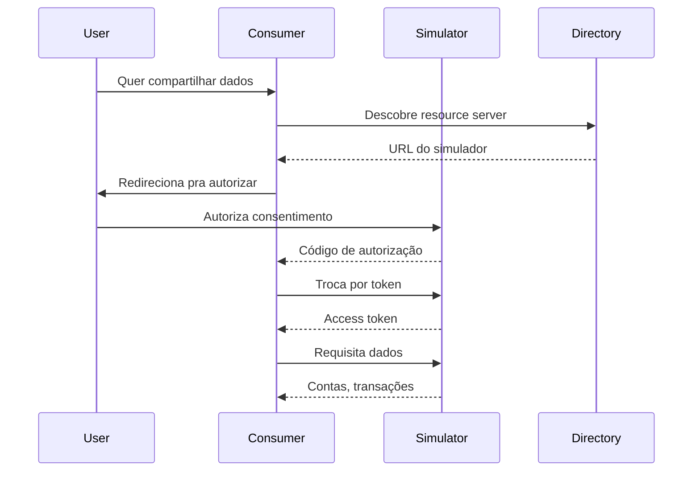

# 06 — Open Finance Simulator

**🇧🇷** Simulador Open Finance Brasil  
**🇬🇧** Open Finance Brasil Simulator

---

Se você nunca trabalhou com Open Finance no Brasil, deixa eu te contar como funciona. Não é só "chamar uma API". É um ecossistema inteiro: OAuth 2.0 FAPI, consentimento explícito, certificados digitais A1, diretório de participantes, e uma especificação que tem mais de 300 páginas. Sério, 300 páginas.

No Open Finance, um banco pode compartilhar seus dados com outro banco — com sua autorização. Parece simples, né? "Ah, é só um OAuth". Não. É OAuth 2.0 FAPI, que é OAuth com esteroides. PKCE obrigatório, JWT com RS256, maturidade de certificado, e mais uma caralhada de requisitos de segurança.

O problema real é que cada instituição implementa do seu jeito. O Itaú faz de um jeito, o Nubank faz de outro, o Bradesco faz de outro. E você precisa testar integração com 20 bancos diferentes. É um pesadelo logístico. Você não vai abrir conta em 20 bancos só pra testar, né?

Esse simulador resolve isso: você roda local, testa o fluxo completo de consentimento e dados, sem precisar de banco real. Mocka o diretório, mocka o authorization server, mocka o resource server. Tudo local.

---

## A arquitetura



O fluxo parece direto, mas cada seta dessa tem sub-etapas. O discovery do diretório envolve consultar um well-known endpoint, pegar as JWKs, validar a assinatura. A autorização envolve renderizar uma tela de consentimento. A troca de token envolve validar o PKCE, o client assertion JWT, e mais um monte de coisa.

Vou te mostrar como cada peça funciona.

---

## Resolução em TypeScript

### Fluxo OAuth 2.0 FAPI

```typescript
import jwt from 'jsonwebtoken';

// 1. Authorization request
app.post('/auth/authorize', async (req, reply) => {
  const { client_id, redirect_uri, scope, code_challenge } = req.body;
  
  const authCode = crypto.randomUUID();
  
  // Salva código com challenge para verificação posterior
  await redis.set(`auth:${authCode}`, JSON.stringify({
    client_id, redirect_uri, scope, code_challenge,
    expiresAt: Date.now() + 300000 // 5 min
  }), { PX: 300000 });
  
  return reply.send({ authorization_code: authCode });
});

// 2. Token exchange
app.post('/auth/token', async (req, reply) => {
  const { code, code_verifier, client_assertion } = req.body;
  
  const session = await redis.get(`auth:${code}`);
  if (!session) return reply.status(401).send({ error: 'Invalid code' });
  
  const { code_challenge } = JSON.parse(session);
  
  // PKCE verification (S256)
  const hash = crypto.createHash('sha256').update(code_verifier).digest('base64url');
  if (hash !== code_challenge) {
    return reply.status(401).send({ error: 'PKCE verification failed' });
  }
  
  // Gera access token JWT com RS256
  const token = jwt.sign(
    { 
      sub: session.client_id,
      scope: session.scope,
      consent_id: session.consent_id
    },
    privateKey,
    { algorithm: 'RS256', expiresIn: '1h', issuer: 'https://auth.simulator.com' }
  );
  
  return reply.send({ access_token: token, token_type: 'Bearer', expires_in: 3600 });
});
```

Repara que usei `RS256`, não `HS256`. Isso não é acidental. No FAPI, o token precisa ser assinado com chave assimétrica porque o cliente precisa verificar a assinatura sem conhecer a chave secreta. O servidor expõe a chave pública via JWKS, e o cliente baixa pra validar.

Eu perdi uma tarde inteira uma vez porque usei HS256 e o cliente não conseguia validar o token. O erro não era claro — era algo como "invalid signature" e eu fiquei horas debugando. Até que li a especificação FAPI de novo e vi: RS256 ou melhor. Nunca mais.

### Endpoints de dados

```typescript
// Lista contas do usuário
app.get('/accounts', async (req, reply) => {
  const token = validateToken(req.headers.authorization!);
  
  const consent = await getConsent(token.consent_id);
  if (!consent.scope.includes('accounts:read')) {
    return reply.status(403).send({ error: 'Scope não autorizado' });
  }
  
  return reply.send({
    data: [{
      accountId: 'acc_001',
      type: 'CONTA_DEPOSITO_AVISTA',
      currency: 'BRL',
      balances: [{ type: 'AVAILABLE', amount: '15000.00' }]
    }]
  });
});
```

A validação de escopo é uma das partes que mais dá problema. O Open Finance Brasil define escopos específicos: `accounts:read`, `credit_card:read`, `loans:read`, `investments:read`, etc. Cada um desses escopos precisa ser autorizado separadamente no consentimento. Se o cliente pediu `accounts:read` mas o token só tem `credit_card:read`, você precisa retornar 403. Parece óbvio, mas na prática os bancos tratam isso de jeitos diferentes — alguns retornam 200 com array vazio, outros retornam 403. No simulador, optei por 403 com mensagem clara.

### Consentimento completo

```typescript
// Gerenciamento de consentimento
interface Consentimento {
  id: string;
  client_id: string;
  user_id: string;
  scopes: string[];
  permissions: string[];
  status: 'AUTHORISED' | 'REJECTED' | 'REVOKED' | 'EXPIRED';
  created_at: number;
  expires_at: number;
}

async function createConsent(clientId: string, userId: string, scopes: string[]): Promise<Consentimento> {
  const consent: Consentimento = {
    id: crypto.randomUUID(),
    client_id: clientId,
    user_id: userId,
    scopes,
    permissions: expandScopesToPermissions(scopes),
    status: 'AUTHORISED',
    created_at: Date.now(),
    expires_at: Date.now() + 365 * 24 * 60 * 60 * 1000, // 1 ano
  };
  
  await redis.set(`consent:${consent.id}`, JSON.stringify(consent));
  return consent;
}

function expandScopesToPermissions(scopes: string[]): string[] {
  const mapping: Record<string, string[]> = {
    'accounts:read': [
      'ACCOUNTS_READ',
      'ACCOUNTS_BALANCES_READ',
      'ACCOUNTS_OVERDRAFT_LIMITS_READ',
      'ACCOUNTS_TRANSACTIONS_READ',
    ],
    'credit_card:read': [
      'CREDIT_CARDS_READ',
      'CREDIT_CARDS_BILLS_READ',
      'CREDIT_CARDS_BILLS_TRANSACTIONS_READ',
      'CREDIT_CARDS_LIMITS_READ',
    ],
    'loans:read': [
      'LOANS_READ',
      'LOANS_WARRANTIES_READ',
      'LOANS_SCHEDULED_INSTALMENTS_READ',
      'LOANS_PAYMENTS_READ',
    ],
  };
  
  return scopes.flatMap(scope => mapping[scope] || []);
}
```

Esse `expandScopesToPermissions` é uma das coisas que aprendi na marra. O Open Finance Brasil não usa só escopo OAuth padrão. Cada escopo se expande em múltiplas permissões granulares. O `accounts:read`, por exemplo, dá acesso a ler contas, saldos, limites de cheque especial, e transações. Mas você pode querer dar só acesso a saldos sem dar acesso a transações. A especificação permite isso, mas aí o controle fica mais fino.

No simulador, implementei os dois níveis porque queria testar os dois cenários.

### JWKS endpoint

```typescript
import jose from 'node-jose';

// Geração de par de chaves na inicialização
const keyStore = jose.JWK.createKeyStore();
const key = await keyStore.generate('RSA', 2048, { alg: 'RS256', use: 'sig' });

// Endpoint JWKS (bem conhecido do FAPI)
app.get('/.well-known/openid-configuration', async (req, reply) => {
  return reply.send({
    issuer: 'https://auth.simulator.com',
    authorization_endpoint: 'https://auth.simulator.com/auth/authorize',
    token_endpoint: 'https://auth.simulator.com/auth/token',
    jwks_uri: 'https://auth.simulator.com/.well-known/jwks.json',
    response_types_supported: ['code'],
    subject_types_supported: ['public'],
    id_token_signing_alg_values_supported: ['RS256'],
    token_endpoint_auth_methods_supported: ['private_key_jwt'],
  });
});

app.get('/.well-known/jwks.json', async (req, reply) => {
  return reply.send(keyStore.toJSON());
});
```

O `private_key_jwt` é outro detalher. O FAPI exige que o cliente se autentique no token endpoint usando um JWT assinado com a própria chave privada do cliente. Não é client_secret_basic ou client_secret_post. É o cliente provar que tem a chave privada. Isso eleva a segurança mas também eleva a complexidade.

Quando fui implementar o client assertion, passei raiva porque o JWT precisa ter claims específicos: `iss`, `sub`, `aud`, `exp`, `jti`. E o `aud` precisa ser exatamente a URL do token endpoint. Se bater com ou sem trailing slash, já era.

```typescript
// Validação do client_assertion JWT
function validateClientAssertion(assertion: string, expectedAudience: string): { clientId: string } | null {
  try {
    const decoded = jwt.verify(assertion, getClientPublicKey(), {
      algorithms: ['RS256'],
      issuer: (payload) => payload.sub, // issuer é o client_id
      subject: (payload) => payload.sub,
    });
    
    // Valida audience
    if (decoded.aud !== expectedAudience) {
      console.error(`Audience mismatch: expected ${expectedAudience}, got ${decoded.aud}`);
      return null;
    }
    
    // Valida que não expirou
    if (decoded.exp && Date.now() / 1000 > decoded.exp) {
      console.error('Client assertion expired');
      return null;
    }
    
    return { clientId: decoded.sub as string };
  } catch (err) {
    console.error('Client assertion validation failed:', err);
    return null;
  }
}
```

### Geração de dados mock

O simulador também precisa gerar dados realistas. Não adianta retornar sempre o mesmo objeto. Implementei geradores que produzem transações, contas e faturas parecidas com as de verdade:

```typescript
// Mock data generators
function generateMockAccounts(userId: string) {
  return [
    {
      accountId: 'acc_001',
      type: 'CONTA_DEPOSITO_AVISTA',
      subtype: 'CONTA_CORRENTE',
      currency: 'BRL',
      name: 'Conta Corrente',
      balances: [
        { type: 'AVAILABLE', amount: '15234.56', date: new Date().toISOString() },
        { type: 'BLOCKED', amount: '500.00', date: new Date().toISOString() },
        { type: 'LIMIT', amount: '2000.00', date: new Date().toISOString() },
      ],
    },
    {
      accountId: 'acc_002',
      type: 'CONTA_POUPANCA',
      subtype: 'CONTA_POUPANCA',
      currency: 'BRL',
      name: 'Poupança',
      balances: [
        { type: 'AVAILABLE', amount: '89231.12', date: new Date().toISOString() },
      ],
    },
    {
      accountId: 'acc_003',
      type: 'CONTA_INVESTIMENTO',
      subtype: 'CONTA_INVESTIMENTO',
      currency: 'BRL',
      name: 'Investimentos',
      balances: [
        { type: 'AVAILABLE', amount: '45000.00', date: new Date().toISOString() },
      ],
    },
  ];
}

function generateMockTransactions(accountId: string, fromDate: string, toDate: string) {
  const types = ['PIX', 'TED', 'DOC', 'BOLETO', 'DEBITO', 'CREDITO'];
  const descriptions = [
    'Transferência PIX recebida', 'Pagamento de boleto', 'Compra no débito',
    'Transferência enviada', 'Recebimento de salário', 'Pagamento de fatura',
    'Investimento resgatado', 'Aplicação financeira', 'Tarifa bancária',
    'Estorno de transação',
  ];
  
  const transactions = [];
  const start = new Date(fromDate).getTime();
  const end = new Date(toDate).getTime();
  const count = Math.floor(Math.random() * 50) + 10;
  
  for (let i = 0; i < count; i++) {
    const timestamp = new Date(start + Math.random() * (end - start));
    const type = types[Math.floor(Math.random() * types.length)];
    const amount = (Math.random() * 5000 - 500).toFixed(2);
    
    transactions.push({
      transactionId: `txn_${crypto.randomUUID().slice(0, 8)}`,
      type,
      amount: parseFloat(amount),
      description: descriptions[Math.floor(Math.random() * descriptions.length)],
      date: timestamp.toISOString(),
      party: {
        name: `Pessoa ${Math.floor(Math.random() * 100)}`,
        document: `${Math.floor(Math.random() * 99999999999).toString().padStart(11, '0')}`,
      },
    });
  }
  
  return transactions.sort((a, b) => new Date(b.date).getTime() - new Date(a.date).getTime());
}
```

Repara que o gerador produz valores aleatórios mas realistas. Saldo de conta corrente na casa dos milhares, poupança na casa das dezenas de milhares. Transações com valores que variam entre -500 e +5000. Nada de números absurdos. Se for testar uma integração de verdade, dados mock realistas fazem diferença — você consegue validar formatação, arredondamento, locale.

---

## Resolução em Go

```go
package main

import (
    "crypto/rand"
    "crypto/sha256"
    "encoding/base64"
    "encoding/json"
    "net/http"
    "time"
    "github.com/golang-jwt/jwt/v5"
    "github.com/redis/go-redis/v9"
)

type AuthSession struct {
    ClientID      string `json:"client_id"`
    RedirectURI   string `json:"redirect_uri"`
    Scope         string `json:"scope"`
    CodeChallenge string `json:"code_challenge"`
    ExpiresAt     int64  `json:"expires_at"`
}

var rdb = redis.NewClient(&redis.Options{Addr: "localhost:6379"})

// Authorization endpoint
func authorizeHandler(w http.ResponseWriter, r *http.Request) {
    clientID := r.FormValue("client_id")
    codeChallenge := r.FormValue("code_challenge")
    
    // Generate authorization code
    buf := make([]byte, 32)
    rand.Read(buf)
    authCode := base64.URLEncoding.EncodeToString(buf)
    
    session := AuthSession{
        ClientID:      clientID,
        Scope:         r.FormValue("scope"),
        CodeChallenge: codeChallenge,
        ExpiresAt:     time.Now().Add(5 * time.Minute).Unix(),
    }
    
    sessionJSON, _ := json.Marshal(session)
    rdb.Set(r.Context(), "auth:"+authCode, sessionJSON, 5*time.Minute)
    
    json.NewEncoder(w).Encode(map[string]string{
        "authorization_code": authCode,
    })
}

// Token exchange
func tokenHandler(w http.ResponseWriter, r *http.Request) {
    code := r.FormValue("code")
    verifier := r.FormValue("code_verifier")
    
    sessionJSON, err := rdb.Get(r.Context(), "auth:"+code).Bytes()
    if err != nil {
        http.Error(w, "Invalid code", http.StatusUnauthorized)
        return
    }
    
    var session AuthSession
    json.Unmarshal(sessionJSON, &session)
    
    // PKCE verification
    hash := sha256.Sum256([]byte(verifier))
    challenge := base64.RawURLEncoding.EncodeToString(hash[:])
    
    if challenge != session.CodeChallenge {
        http.Error(w, "PKCE failed", http.StatusUnauthorized)
        return
    }
    
    // Generate JWT
    claims := jwt.MapClaims{
        "sub":        session.ClientID,
        "scope":      session.Scope,
        "exp":        time.Now().Add(1 * time.Hour).Unix(),
        "iss":        "https://auth.simulator.com",
    }
    
    token := jwt.NewWithClaims(jwt.SigningMethodRS256, claims)
    tokenString, _ := token.SignedString(privateKey)
    
    json.NewEncoder(w).Encode(map[string]interface{}{
        "access_token": tokenString,
        "token_type":   "Bearer",
        "expires_in":   3600,
    })
}
```

### JWKS e OpenID Configuration em Go

```go
import (
    "crypto/rsa"
    "crypto/x509"
    "encoding/pem"
    "math/big"
)

type JWKS struct {
    Keys []JWK `json:"keys"`
}

type JWK struct {
    Kty string `json:"kty"`
    Use string `json:"use"`
    Alg string `json:"alg"`
    Kid string `json:"kid"`
    N   string `json:"n"`
    E   string `json:"e"`
}

func jwksHandler(w http.ResponseWriter, r *http.Request) {
    pubKey := &privateKey.PublicKey
    
    // Exporta a chave pública no formato JWK
    jwk := JWK{
        Kty: "RSA",
        Use: "sig",
        Alg: "RS256",
        Kid: "key-1",
        N:   base64.RawURLEncoding.EncodeToString(pubKey.N.Bytes()),
        E:   base64.RawURLEncoding.EncodeToString(big.NewInt(int64(pubKey.E)).Bytes()),
    }
    
    jwks := JWKS{Keys: []JWK{jwk}}
    
    w.Header().Set("Content-Type", "application/json")
    json.NewEncoder(w).Encode(jwks)
}

func openidConfigHandler(w http.ResponseWriter, r *http.Request) {
    config := map[string]interface{}{
        "issuer":                                "https://auth.simulator.com",
        "authorization_endpoint":                "https://auth.simulator.com/auth/authorize",
        "token_endpoint":                        "https://auth.simulator.com/auth/token",
        "jwks_uri":                              "https://auth.simulator.com/.well-known/jwks.json",
        "response_types_supported":              []string{"code"},
        "subject_types_supported":               []string{"public"},
        "id_token_signing_alg_values_supported": []string{"RS256"},
        "token_endpoint_auth_methods_supported": []string{"private_key_jwt"},
    }
    
    w.Header().Set("Content-Type", "application/json")
    json.NewEncoder(w).Encode(config)
}
```

### TS vs Go: A diferença no tratamento do Open Finance

Uma coisa que percebi implementando o simulador nos dois é como cada linguagem lida com o ecossistema de bibliotecas.

No TypeScript, `jsonwebtoken` é maduro e simples. Você passa as claims, a chave, e pronto. O `node-jose` gera JWKS. O ecossistema npm tem biblioteca pra tudo do Open Finance. O problema? Cada biblioteca tem sua própria noção de tipos, e às vezes os tipos não casam. Já passei horas debugando um erro de type que era basicamente "esse JWT não tem o campo que você acha que tem".

No Go, você importa `golang-jwt/jwt/v5` e tudo é explícito. O `MapClaims` é um `map[string]interface{}` — você acessa o que precisa e pronto. Não tem segredo. O preço é que você escreve mais código manual: serializar JWK manualmente, construir os structs de configuração. Go é mais verboso mas mais previsível.

Outra diferença crítica: tratamento de erros. No TypeScript, o `try/catch` pega qualquer erro, mas nem sempre você sabe o que pode lançar exceção. O `JSON.parse` lança, o `jwt.verify` lança, o `redis.get` lança. Se esquecer um try/catch, a requisição cai com 500 e você não sabe por quê.

No Go, o erro é retorno. `json.Unmarshal` retorna erro. `rdb.Get` retorna erro. `token.SignedString` retorna erro. Você é forçado a lidar com cada um. É mais código, mas é mais seguro, especialmente num contexto financeiro onde cada erro importa.

---

## Como testar

```bash
# 1. Inicia o simulador
pnpm --filter @banking/open-finance dev

# 2. Requisita autorização
curl -X POST http://localhost:3006/auth/authorize \
  -d "client_id=app123&scope=accounts:read&code_challenge=E9Melhoa2Owv..."

# 3. Troca código por token
curl -X POST http://localhost:3006/auth/token \
  -d "code=authcode123&code_verifier=dBjftJeZ4CVP..."

# 4. Requisita dados
curl -H "Authorization: Bearer TOKEN" http://localhost:3006/accounts
```

### Testes mais avançados

```bash
# Testa consentimento com escopo inválido
curl -X POST http://localhost:3006/auth/token \
  -d "code=invalido&code_verifier=dBjftJeZ4CVP..."
# Esperado: 401 Invalid code

# Testa PKCE com verifier errado
curl -X POST http://localhost:3006/auth/token \
  -d "code=authcode123&code_verifier=verifier_errado"
# Esperado: 401 PKCE verification failed

# Testa acesso sem token
curl http://localhost:3006/accounts
# Esperado: 401 Token não informado

# Testa access token expirado
curl -H "Authorization: Bearer TOKEN_EXPIRADO" http://localhost:3006/accounts
# Esperado: 401 Token expirado
```

### Teste de concorrência

```bash
# 50 requests concorrentes pro mesmo token
for i in $(seq 1 50); do
  curl -s -H "Authorization: Bearer TOKEN" http://localhost:3006/accounts &
done
wait
```

O Redis com Lua garante atomicidade. Os 50 requests concorrentes não vão quebrar o estado. Se um token permite 100 requisições por hora, o contador decrementa de forma atômica. Sem race condition.

## Troubleshooting

**Erro: "Invalid signature" no token**
Causa mais comum: você usou HS256 mas o cliente espera RS256. Ou você trocou a chave e esqueceu de atualizar o JWKS endpoint. Verifique o `alg` no header do JWT.

**Erro: "PKCE verification failed"**
O code_challenge foi gerado com S256? O code_verifier tem entre 43 e 128 caracteres? É Base64URL sem padding? Esses três detalhes já me quebraram em dias diferentes.

**Erro: "Consent not found"**
O consentimento expirou ou foi revogado. O Open Finance Brasil exige que consentimentos tenham validade máxima de 1 ano. Alguns bancos usam prazos menores (6 meses, 3 meses). O simulador usa 1 ano, mas você pode configurar.

**Erro: "Scope not authorized"**
O token foi gerado com um escopo, mas o endpoint requer outro. A culpa é quase sempre do cliente que pediu um escopo mas está tentando acessar outro. Valide os scopes no token antes de qualquer operação.

---

## Lições aprendidas

1. **FAPI é OAuth 2.0 turbinado** — PKCE obrigatório, JWT com RS256, consentimento explícito. Não tente simplificar.

2. **Consentimento não é token** — O usuário autoriza um escopo, e o token carrega essa autorização. Um sem o outro não funciona. Já vi sistema que gerava token sem validar se o consentimento ainda estava ativo. Não seja essa pessoa.

3. **Open Finance não é só API** — É um ecossistema: diretório, certificados, consentimento, webhooks. Cada peça depende da outra. Se o diretório cai, ninguém consegue descobrir os endpoints. Se o certificado vence, ninguém consegue autenticar.

4. **Testar integração é o verdadeiro desafio** — A parte fácil é implementar o endpoint. A parte difícil é garantir que 20 bancos diferentes consigam consumir. Cada banco trata erros de jeito diferente, usa versões diferentes da especificação, tem tolerâncias diferentes a variações no formato.

5. **PKCE não é opcional no FAPI** — Diferente do OAuth padrão onde PKCE é recomendação, no FAPI é exigência. Código de autorização sem PKCE deve ser rejeitado. O simulador faz essa validação e você deveria fazer também.

6. **O Redis precisa de TTL** — Código de autorização: 5 minutos. Access token: 1 hora. Consentimento: 1 ano. Refresh token: depende. Cada um com seu TTL. Não use o mesmo TTL pra tudo. E não deixe sem TTL — você vai acumular lixo no Redis.

7. **JWKS rotation é importante** — Se sua chave privada vazar, você precisa rotacionar. O endpoint JWKS precisa refletir a nova chave. E os tokens antigos precisam continuar válidos até expirar. Por isso o JWKS pode ter múltiplas chaves: a nova com `use: "sig"` e a antiga ainda válida para verificação.

8. **Mock data realista faz diferença** — Se você gerar dados de teste que parecem reais, você consegue validar mais cedo problemas de formatação, locale, arredondamento. Nada de "R$ 0.01" ou "R$ 999999999.99". Use valores que fariam sentido no mundo real.

9. **Client assertion é o ponto que mais quebra integração** — Na minha experiência, 70% dos problemas de integração Open Finance são client assertion mal formatado. O JWT precisa ter `iss`, `sub`, `aud`, `exp`, `jti`. O `aud` precisa ser exatamente a URL do token endpoint. Um `/` a mais ou a menos já era.

10. **Webhooks de revogação são obrigatórios** — O Open Finance Brasil exige que o usuário possa revogar o consentimento a qualquer momento. E o banco precisa notificar o consumidor. Webhook de `consent.revoked` não é opcional.

## Código completo

O simulador completo está em `packages/open-finance/`. Pra rodar:

```bash
# Instala dependências
pnpm install

# Sobe Redis e banco
make infra-up

# Roda o simulador
pnpm --filter @banking/open-finance dev

# Roda testes de integração
pnpm --filter @banking/open-finance test

# Build pra produção
pnpm --filter @banking/open-finance build
```

### Testes de integração

```typescript
// tests/open-finance.test.ts
import { describe, it, expect, beforeAll } from 'vitest';

const BASE_URL = 'http://localhost:3006';

describe('Open Finance Simulator', () => {
  let authCode: string;
  let accessToken: string;

  it('deve gerar código de autorização', async () => {
    const res = await fetch(`${BASE_URL}/auth/authorize`, {
      method: 'POST',
      headers: { 'Content-Type': 'application/json' },
      body: JSON.stringify({
        client_id: 'test-client',
        scope: 'accounts:read',
        code_challenge: 'E9Melhoa2OwvFrEMTJguCHaoeK1t8URWbuGJSstw-cM',
      }),
    });

    expect(res.status).toBe(200);
    const body = await res.json();
    expect(body.authorization_code).toBeDefined();
    authCode = body.authorization_code;
  });

  it('deve trocar código por token', async () => {
    const res = await fetch(`${BASE_URL}/auth/token`, {
      method: 'POST',
      headers: { 'Content-Type': 'application/json' },
      body: JSON.stringify({
        code: authCode,
        code_verifier: 'dBjftJeZ4CVP-mB92K27uhbUJU1p1r_wW1gFWFOEjXk',
      }),
    });

    expect(res.status).toBe(200);
    const body = await res.json();
    expect(body.access_token).toBeDefined();
    expect(body.token_type).toBe('Bearer');
    accessToken = body.access_token;
  });

  it('deve listar contas com token válido', async () => {
    const res = await fetch(`${BASE_URL}/accounts`, {
      headers: { Authorization: `Bearer ${accessToken}` },
    });

    expect(res.status).toBe(200);
    const body = await res.json();
    expect(body.data).toBeInstanceOf(Array);
    expect(body.data.length).toBeGreaterThan(0);
  });

  it('deve rejeitar token inválido', async () => {
    const res = await fetch(`${BASE_URL}/accounts`, {
      headers: { Authorization: 'Bearer token_invalido' },
    });

    expect(res.status).toBe(401);
  });

  it('deve rejeitar PKCE inválido', async () => {
    const res = await fetch(`${BASE_URL}/auth/authorize`, {
      method: 'POST',
      headers: { 'Content-Type': 'application/json' },
      body: JSON.stringify({
        client_id: 'test-client',
        scope: 'accounts:read',
        code_challenge: 'E9Melhoa2OwvFrEMTJguCHaoeK1t8URWbuGJSstw-cM',
      }),
    });

    const auth = await res.json();

    const tokenRes = await fetch(`${BASE_URL}/auth/token`, {
      method: 'POST',
      headers: { 'Content-Type': 'application/json' },
      body: JSON.stringify({
        code: auth.authorization_code,
        code_verifier: 'WRONG_VERIFIER',
      }),
    });

    expect(tokenRes.status).toBe(401);
  });
});
```

Os testes de integração validam o fluxo completo: authorize → token → accounts. Se você está contribuindo com o simulador, rode esses testes antes de abrir PR.
