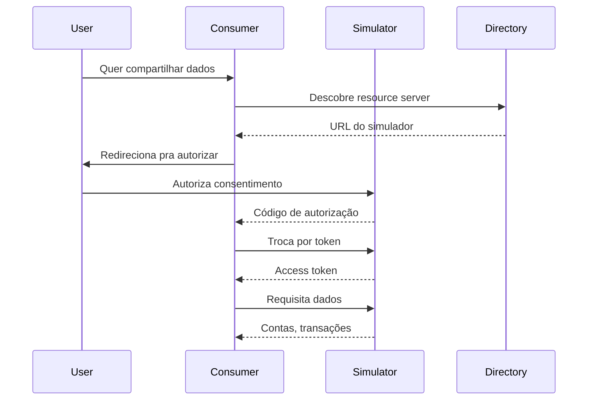

# 06 — Open Finance Simulator

**🇧🇷** Simulador Open Finance Brasil  
**🇬🇧** Open Finance Brasil Simulator

---

No Open Finance, um banco pode compartilhar seus dados com outro banco — com sua autorização. Parece simples, mas por trás tem OAuth 2.0 FAPI, consentimento explícito, certificados digitais, e uma especificação de 300 páginas.

O problema é que cada instituição implementa do seu jeito. Testar integração com 20 bancos diferentes é um pesadelo. Esse simulador resolve isso: você roda local, testa o fluxo completo de consentimento e dados, sem precisar de banco real.

---

## A arquitetura



---

## Resolução em TypeScript

### Fluxo OAuth 2.0 FAPI

```typescript
import jwt from 'jsonwebtoken';

// 1. Authorization request
app.post('/auth/authorize', async (req, reply) => {
  const { client_id, redirect_uri, scope, code_challenge } = req.body;
  
  const authCode = crypto.randomUUID();
  
  // Salva código com challenge para verificação posterior
  await redis.set(`auth:${authCode}`, JSON.stringify({
    client_id, redirect_uri, scope, code_challenge,
    expiresAt: Date.now() + 300000 // 5 min
  }), { PX: 300000 });
  
  return reply.send({ authorization_code: authCode });
});

// 2. Token exchange
app.post('/auth/token', async (req, reply) => {
  const { code, code_verifier, client_assertion } = req.body;
  
  const session = await redis.get(`auth:${code}`);
  if (!session) return reply.status(401).send({ error: 'Invalid code' });
  
  const { code_challenge } = JSON.parse(session);
  
  // PKCE verification (S256)
  const hash = crypto.createHash('sha256').update(code_verifier).digest('base64url');
  if (hash !== code_challenge) {
    return reply.status(401).send({ error: 'PKCE verification failed' });
  }
  
  // Gera access token JWT com RS256
  const token = jwt.sign(
    { 
      sub: session.client_id,
      scope: session.scope,
      consent_id: session.consent_id
    },
    privateKey,
    { algorithm: 'RS256', expiresIn: '1h', issuer: 'https://auth.simulator.com' }
  );
  
  return reply.send({ access_token: token, token_type: 'Bearer', expires_in: 3600 });
});
```

### Endpoints de dados

```typescript
// Lista contas do usuário
app.get('/accounts', async (req, reply) => {
  const token = validateToken(req.headers.authorization!);
  
  const consent = await getConsent(token.consent_id);
  if (!consent.scope.includes('accounts:read')) {
    return reply.status(403).send({ error: 'Scope não autorizado' });
  }
  
  return reply.send({
    data: [{
      accountId: 'acc_001',
      type: 'CONTA_DEPOSITO_AVISTA',
      currency: 'BRL',
      balances: [{ type: 'AVAILABLE', amount: '15000.00' }]
    }]
  });
});
```

---

## Resolução em Go

```go
package main

import (
    "crypto/rand"
    "crypto/sha256"
    "encoding/base64"
    "encoding/json"
    "net/http"
    "time"
    "github.com/golang-jwt/jwt/v5"
    "github.com/redis/go-redis/v9"
)

type AuthSession struct {
    ClientID      string `json:"client_id"`
    RedirectURI   string `json:"redirect_uri"`
    Scope         string `json:"scope"`
    CodeChallenge string `json:"code_challenge"`
    ExpiresAt     int64  `json:"expires_at"`
}

var rdb = redis.NewClient(&redis.Options{Addr: "localhost:6379"})

// Authorization endpoint
func authorizeHandler(w http.ResponseWriter, r *http.Request) {
    clientID := r.FormValue("client_id")
    codeChallenge := r.FormValue("code_challenge")
    
    // Generate authorization code
    buf := make([]byte, 32)
    rand.Read(buf)
    authCode := base64.URLEncoding.EncodeToString(buf)
    
    session := AuthSession{
        ClientID:      clientID,
        Scope:         r.FormValue("scope"),
        CodeChallenge: codeChallenge,
        ExpiresAt:     time.Now().Add(5 * time.Minute).Unix(),
    }
    
    sessionJSON, _ := json.Marshal(session)
    rdb.Set(r.Context(), "auth:"+authCode, sessionJSON, 5*time.Minute)
    
    json.NewEncoder(w).Encode(map[string]string{
        "authorization_code": authCode,
    })
}

// Token exchange
func tokenHandler(w http.ResponseWriter, r *http.Request) {
    code := r.FormValue("code")
    verifier := r.FormValue("code_verifier")
    
    sessionJSON, err := rdb.Get(r.Context(), "auth:"+code).Bytes()
    if err != nil {
        http.Error(w, "Invalid code", http.StatusUnauthorized)
        return
    }
    
    var session AuthSession
    json.Unmarshal(sessionJSON, &session)
    
    // PKCE verification
    hash := sha256.Sum256([]byte(verifier))
    challenge := base64.RawURLEncoding.EncodeToString(hash[:])
    
    if challenge != session.CodeChallenge {
        http.Error(w, "PKCE failed", http.StatusUnauthorized)
        return
    }
    
    // Generate JWT
    claims := jwt.MapClaims{
        "sub":        session.ClientID,
        "scope":      session.Scope,
        "exp":        time.Now().Add(1 * time.Hour).Unix(),
        "iss":        "https://auth.simulator.com",
    }
    
    token := jwt.NewWithClaims(jwt.SigningMethodRS256, claims)
    tokenString, _ := token.SignedString(privateKey)
    
    json.NewEncoder(w).Encode(map[string]interface{}{
        "access_token": tokenString,
        "token_type":   "Bearer",
        "expires_in":   3600,
    })
}
```

---

## Como testar

```bash
# 1. Inicia o simulador
pnpm --filter @banking/open-finance dev

# 2. Requisita autorização
curl -X POST http://localhost:3006/auth/authorize \
  -d "client_id=app123&scope=accounts:read&code_challenge=E9Melhoa2Owv..."

# 3. Troca código por token
curl -X POST http://localhost:3006/auth/token \
  -d "code=authcode123&code_verifier=dBjftJeZ4CVP..."

# 4. Requisita dados
curl -H "Authorization: Bearer TOKEN" http://localhost:3006/accounts
```

---

## Lições aprendidas

1. **FAPI é OAuth 2.0 turbinado** — PKCE obrigatório, JWT com RS256, consentimento explícito.
2. **Consentimento não é token** — O usuário autoriza um escopo, e o token carrega essa autorização. Um sem o outro não funciona.
3. **Open Finance não é só API** — É um ecossistema: diretório, certificados, consentimento, webhooks. Cada peça depende da outra.
4. **Testar integração é o verdadeiro desafio** — A parte fácil é implementar o endpoint. A parte difícil é garantir que 20 bancos diferentes consigam consumir.
