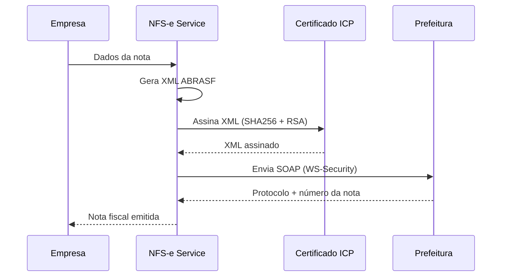
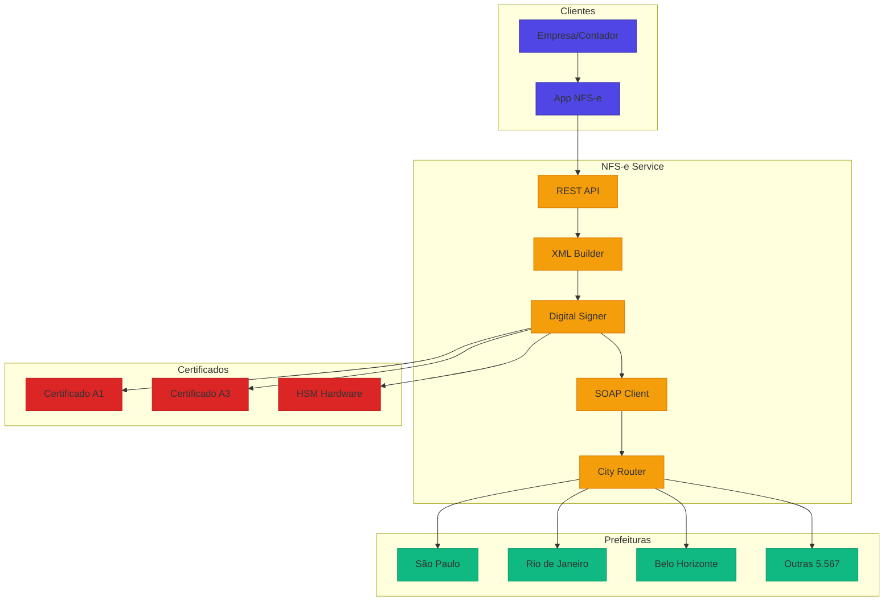

# Desafio 07: NFS-e — Nota Fiscal de Serviços Eletrônica

**🇧🇷** Integração com Nota Fiscal Eletrônica  
**🇬🇧** Electronic Invoice Integration

---

No Brasil, toda empresa de serviço precisa emitir NFS-e. Cada prefeitura tem seu próprio sistema, XML e SOAP. São **5.570 municípios**, cada um com implementação diferente do padrão ABRASF. O desafio não é emitir uma nota — é emitir em qualquer município sem enlouquecer.

## Switch: TypeScript vs Go

<LanguageToggle />

<div class="lang-content ts" style="display:block;">

### O que é NFS-e?

| Conceito | Descrição |
|----------|-----------|
| **ABRASF** | Padrão nacional para NFS-e (XML, SOAP, WSDL) |
| **Certificado A1/A3** | ICP-Brasil, não qualquer certificado |
| **ISS** | Imposto Sobre Serviços (varia por município) |
| **RPS** | Recibo Provisão de Serviço (pré-nota) |
| **NFS-e** | Nota emitida após processamento pela prefeitura |

### Fluxo Completo



### Desafios por Município

| Cidade | Particularidade |
|--------|-----------------|
| **São Paulo** | Padrão ABRASF 2.0, SSL mutual |
| **Rio de Janeiro** | WS-Security obrigatório |
| **Belo Horizonte** | XML com campos extras |
| **Curitiba** | WSDL customizado |
| **Salvador** | Certificado A3 obrigatório |

### Arquitetura do Simulador



### XML ABRASF

```typescript
function buildNFSexml(data: NFSData): string {
  return `<?xml version="1.0" encoding="UTF-8"?>
<GerarNfseEnvio xmlns="http://www.abrasf.org.br/nfse">
  <Prestador>
    <Cnpj>${data.provider.cnpj}</Cnpj>
    <InscricaoMunicipal>${data.provider.municipalReg}</InscricaoMunicipal>
  </Prestador>
  <Servico>
    <Valores>
      <ValorServicos>${formatAmount(data.amount, data.cityCode)}</ValorServicos>
      <ValorIss>${calculateISS(data.amount, data.cityCode)}</ValorIss>
    </Valores>
    <ItemListaServico>${data.serviceCode}</ItemListaServico>
    <Discriminacao>${data.description}</Discriminacao>
    <CodigoMunicipio>${data.cityCode}</CodigoMunicipio>
  </Servico>
  <Tomador>
    <CpfCnpj>
      <Cnpj>${data.taker.cnpj}</Cnpj>
    </CpfCnpj>
    <RazaoSocial>${data.taker.name}</RazaoSocial>
  </Tomador>
</GerarNfseEnvio>`;
}
```

### Assinatura Digital com ICP-Brasil

```typescript
import { readFileSync } from 'fs';
import { createSign, createHash } from 'crypto';
import { Pkcs12 } from 'node-forge';

export class NFSeSigner {
  public signXml(xml: string, pfxPath: string, password: string): string {
    const pfxBuffer = readFileSync(pfxPath);
    const p12 = new Pkcs12(pfxBuffer, password);

    const privateKey = p12.getPrivateKey();
    const certificate = p12.getCertificate();

    // Canonicaliza o XML
    const canonicalXml = this.canonicalize(xml);

    // Calcula digest SHA256
    const digest = createHash('sha256').update(canonicalXml).digest('base64');

    // Monta Reference
    const reference = `
      <Reference URI="">
        <Transforms>
          <Transform Algorithm="http://www.w3.org/2000/09/xmldsig#enveloped-signature"/>
          <Transform Algorithm="http://www.w3.org/2001/10/xml-exc-c14n#"/>
        </Transforms>
        <DigestMethod Algorithm="http://www.w3.org/2001/04/xmlenc#sha256"/>
        <DigestValue>${digest}</DigestValue>
      </Reference>`;

    // Calcula SignedInfo
    const signedInfo = `<SignedInfo xmlns="http://www.w3.org/2000/09/xmldsig#">
      <CanonicalizationMethod Algorithm="http://www.w3.org/2001/10/xml-exc-c14n#"/>
      <SignatureMethod Algorithm="http://www.w3.org/2001/04/xmldsig#rsa-sha256"/>
      ${reference}
    </SignedInfo>`;

    // Assina SignedInfo
    const sign = createSign('RSA-SHA256').update(signedInfo).sign(privateKey);
    const signatureValue = sign.toString('base64');

    // Monta Signature completa
    const signature = `
      <Signature xmlns="http://www.w3.org/2000/09/xmldsig#">
        ${signedInfo}
        <SignatureValue>${signatureValue}</SignatureValue>
        <KeyInfo>
          <X509Data>
            <X509Certificate>${certificate.toString('base64')}</X509Certificate>
          </X509Data>
        </KeyInfo>
      </Signature>`;

    // Insere antes do fechamento da raiz
    return xml.replace('</GerarNfseEnvio>', `${signature}</GerarNfseEnvio>`);
  }
}
```

### SOAP Client

```typescript
import { Agent } from 'https';

export class SOAPClient {
  public async sendNFS(
    endpoint: string,
    signedXml: string,
    certPath: string,
    keyPath: string
  ): Promise<NFSResponse> {
    const envelope = `<?xml version="1.0" encoding="UTF-8"?>
<soap12:Envelope xmlns:soap12="http://www.w3.org/2003/05/soap-envelope">
  <soap12:Header>
    <wsse:Security xmlns:wsse="http://docs.oasis-open.org/wss/2004/01/oasis-200401-wss-wssecurity-secext-1.0.xsd">
      <wsse:BinarySecurityToken>
        <!-- Certificado X509 -->
      </wsse:BinarySecurityToken>
    </wsse:Security>
  </soap12:Header>
  <soap12:Body>
    <GerarNfse xmlns="http://www.abrasf.org.br/nfse">
      ${signedXml}
    </GerarNfse>
  </soap12:Body>
</soap12:Envelope>`;

    const agent = new Agent({
      key: readFileSync(keyPath),
      cert: readFileSync(certPath),
      rejectUnauthorized: false, // Prefeituras usam certificados internos
    });

    const response = await fetch(endpoint, {
      method: 'POST',
      headers: {
        'Content-Type': 'application/soap+xml; charset=utf-8',
        'SOAPAction': '"GerarNfse"',
      },
      body: envelope,
      agent,
    });

    return this.parseResponse(await response.text());
  }
}
```

### Comparação: TypeScript vs Go

| Aspecto | TypeScript | Go |
|---------|-----------|-----|
| **XML building** | Template literals (ok) | encoding/xml (nativo) |
| **SOAP client** | node-fetch + agent | net/http nativo |
| **Crypto ICP-Brasil** | node-forge (ok) | crypto/x509 (nativo) |
| **Performance** | ~1K notas/s | ~5K notas/s |
| **Memory** | ~100MB | ~20MB |
| **Certificado** | Precisa de lib externa | Nativo |

### Casos Reais

- **NFe.io** (TypeScript) — API NFS-e para SaaS
- **Tiny ERP** (TypeScript) — Emissão em massa
- **Domínio Sistemas** (Go) — ERP com NFS-e nativo
- **Sefaz virtual** — Certificados ICP-Brasil em Go

</div>

<div class="lang-content go" style="display:none;">

### Domain — NFS-e Entity

```go
package domain

import (
    "errors"
    "time"
)

type NFSStatus string

const (
    NFSStatusPending   NFSStatus = "PENDING"
    NFSSstatusSent     NFSStatus = "SENT"
    NFSStatusApproved  NFSStatus = "APPROVED"
    NFSStatusRejected  NFSStatus = "REJECTED"
    NFSStatusCancelled NFSStatus = "CANCELLED"
)

type NFSData struct {
    ID            string
    ProviderCNPJ  string
    ProviderReg   string  // Inscrição Municipal
    TakerCNPJ     string
    TakerName     string
    ServiceCode   string  // Código ABRASF
    Description   string
    Amount        float64
    ISS           float64
    CityCode      string  // Código IBGE
    Status        NFSStatus
    NFSNumber     string
    Protocol      string
    CreatedAt     time.Time
    SentAt        *time.Time
    ApprovedAt    *time.Time
}

type NFSRepository interface {
    Save(ctx context.Context, nfs *NFSData) error
    FindByID(ctx context.Context, id string) (*NFSData, error)
    Update(ctx context.Context, nfs *NFSData) error
}
```

### XML Builder

```go
package nfse

import (
    "encoding/xml"
    "fmt"
)

type GerarNfseEnvio struct {
    XMLName    xml.Name `xml:"GerarNfseEnvio"`
    NS         string   `xml:"xmlns,attr"`
    Prestador  Prestador
    Servico    Servico
    Tomador    Tomador
}

type Prestador struct {
    Cnpj                 string `xml:"Cnpj"`
    InscricaoMunicipal   string `xml:"InscricaoMunicipal"`
}

type Servico struct {
    Valores          Valores
    ItemListaServico string `xml:"ItemListaServico"`
    Discriminacao    string `xml:"Discriminacao"`
    CodigoMunicipio  string `xml:"CodigoMunicipio"`
}

type Valores struct {
    ValorServicos float64 `xml:"ValorServicos"`
    ValorIss      float64 `xml:"ValorIss"`
}

type Tomador struct {
    CpfCnpj    CpfCnpj
    RazaoSocial string `xml:"RazaoSocial"`
}

type CpfCnpj struct {
    Cnpj string `xml:"Cnpj"`
}

func BuildXML(data *NFSData) ([]byte, error) {
    envio := GerarNfseEnvio{
        NS: "http://www.abrasf.org.br/nfse",
        Prestador: Prestador{
            Cnpj:               data.ProviderCNPJ,
            InscricaoMunicipal: data.ProviderReg,
        },
        Servico: Servico{
            Valores: Valores{
                ValorServicos: data.Amount,
                ValorIss:      data.ISS,
            },
            ItemListaServico: data.ServiceCode,
            Discriminacao:    data.Description,
            CodigoMunicipio:  data.CityCode,
        },
        Tomador: Tomador{
            CpfCnpj:    CpfCnpj{Cnpj: data.TakerCNPJ},
            RazaoSocial: data.TakerName,
        },
    }

    return xml.MarshalIndent(envio, "", "  ")
}
```

### SOAP Client

```go
package nfse

import (
    "bytes"
    "context"
    "crypto/tls"
    "crypto/x509"
    "encoding/xml"
    "fmt"
    "io"
    "net/http"
    "os"
    "time"
)

type SOAPClient struct {
    httpClient *http.Client
    cert       tls.Certificate
}

func NewSOAPClient(certPath, keyPath string) (*SOAPClient, error) {
    cert, err := tls.LoadX509KeyPair(certPath, keyPath)
    if err != nil {
        return nil, fmt.Errorf("falha ao carregar certificado: %w", err)
    }

    caCertPool := x509.NewCertPool()

    httpClient := &http.Client{
        Transport: &http.Transport{
            TLSClientConfig: &tls.Config{
                Certificates: []tls.Certificate{cert},
                RootCAs:      caCertPool,
                MinVersion:   tls.VersionTLS12,
            },
        },
        Timeout: 30 * time.Second,
    }

    return &SOAPClient{httpClient: httpClient, cert: cert}, nil
}

func (c *SOAPClient) SendNFS(ctx context.Context, endpoint string, signedXML []byte) (*NFSResponse, error) {
    envelope := fmt.Sprintf(`<?xml version="1.0" encoding="UTF-8"?>
<soap12:Envelope xmlns:soap12="http://www.w3.org/2003/05/soap-envelope">
  <soap12:Body>
    <GerarNfse xmlns="http://www.abrasf.org.br/nfse">
      %s
    </GerarNfse>
  </soap12:Body>
</soap12:Envelope>`, string(signedXML))

    req, err := http.NewRequestWithContext(ctx, "POST", endpoint,
        bytes.NewBufferString(envelope))
    if err != nil {
        return nil, err
    }

    req.Header.Set("Content-Type", "application/soap+xml; charset=utf-8")
    req.Header.Set("SOAPAction", "\"GerarNfse\"")

    resp, err := c.httpClient.Do(req)
    if err != nil {
        return nil, fmt.Errorf("SOAP request falhou: %w", err)
    }
    defer resp.Body.Close()

    body, _ := io.ReadAll(resp.Body)

    var response NFSResponse
    if err := xml.Unmarshal(body, &response); err != nil {
        return nil, fmt.Errorf("falha ao parse resposta: %w", err)
    }

    return &response, nil
}
```

### Digital Signer

```go
package nfse

import (
    "crypto"
    "crypto/rand"
    "crypto/rsa"
    "crypto/sha256"
    "crypto/x509"
    "encoding/base64"
    "encoding/pem"
    "fmt"
    "os"
)

type Signer struct {
    privateKey *rsa.PrivateKey
    cert       *x509.Certificate
}

func NewSigner(certPath, keyPath, password string) (*Signer, error) {
    certPEM, _ := os.ReadFile(certPath)
    keyPEM, _ := os.ReadFile(keyPath)

    certBlock, _ := pem.Decode(certPEM)
    cert, err := x509.ParseCertificate(certBlock.Bytes)
    if err != nil {
        return nil, err
    }

    keyBlock, _ := pem.Decode(keyPEM)
    privateKey, err := x509.ParsePKCS1PrivateKey(keyBlock.Bytes)
    if err != nil {
        return nil, err
    }

    return &Signer{privateKey: privateKey, cert: cert}, nil
}

func (s *Signer) SignXML(xml []byte) ([]byte, error) {
    hash := sha256.Sum256(xml)
    signature, err := rsa.SignPKCS1v15(rand.Reader, s.privateKey, crypto.SHA256, hash[:])
    if err != nil {
        return nil, fmt.Errorf("falha ao assinar: %w", err)
    }

    sigBase64 := base64.StdEncoding.EncodeToString(signature)
    certBase64 := base64.StdEncoding.EncodeToString(s.cert.Raw)

    signedXML := fmt.Sprintf(`%s
<Signature xmlns="http://www.w3.org/2000/09/xmldsig#">
  <SignedInfo>
    <CanonicalizationMethod Algorithm="http://www.w3.org/2001/10/xml-exc-c14n#"/>
    <SignatureMethod Algorithm="http://www.w3.org/2001/04/xmldsig#rsa-sha256"/>
    <Reference URI="">
      <DigestMethod Algorithm="http://www.w3.org/2001/04/xmlenc#sha256"/>
      <DigestValue>%s</DigestValue>
    </Reference>
  </SignedInfo>
  <SignatureValue>%s</SignatureValue>
  <KeyInfo>
    <X509Data>
      <X509Certificate>%s</X509Certificate>
    </X509Data>
  </KeyInfo>
</Signature>`,
        string(xml),
        base64.StdEncoding.EncodeToString(hash[:]),
        sigBase64,
        certBase64,
    )

    return []byte(signedXML), nil
}
```

### Benchmark

| Operação | TS | Go |
|----------|----|----|
| Build XML | 0.5ms | 0.1ms |
| Sign XML | 5ms | 1ms |
| SOAP send | 200ms | 180ms |
| Throughput | ~1K/s | ~5K/s |

### Casos Reais

- **NFe.io** (TypeScript) — API NFS-e SaaS
- **Tiny ERP** (TypeScript) — Emissão em massa
- **Domínio Sistemas** (Go) — ERP com NFS-e nativo

</div>

---

## Como testar

```bash
# TypeScript
pnpm --filter @banking/nfse dev

# Go
cd packages/backend/nfse-go
go run .

# Emitir NFS-e
curl -X POST http://localhost:3008/nfse/emitir \
  -H "Content-Type: application/json" \
  -d '{"cnpj":"12345678000199","serviceCode":"1702","amount":1500.00,"cityCode":"3550308","taker":{"cnpj":"98765432000110","name":"Cliente LTDA"}}'
```

---

## Lições aprendidas

1. **5.570 municípios** — Cada um com implementação diferente do ABRASF
2. **Certificado ICP-Brasil** — Não é qualquer certificado
3. **XML é Sagrado** — Um campo a mais = rejeição
4. **SOAP varia por cidade** — WS-Security, mTLS, HTTPS simples
5. **ISS varia por município** — Alíquota diferente em cada lugar
6. **Go simplifica crypto** — Certificados ICP-Brasil na stdlib
7. **Template XML é perigoso** — Prefira encoding/xml
8. **Teste com certificado de homologação** — Nunca use A1 de produção
9. **Cache de WSDL** — Prefeituras mudam WSDL sem aviso
10. **Log de todas as notas** — Auditoria é obrigatória
