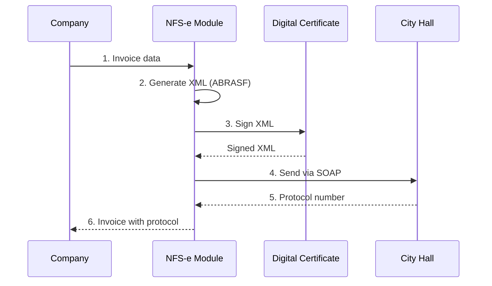

# 07 — NFS-e Integration

**🇧🇷** Integração com Nota Fiscal de Serviços Eletrônica  
**🇬🇧** Electronic Service Invoice Integration

---

## Descrição do Desafio

Implementar integração com sistemas municipais de NFS-e (Nota Fiscal de Serviços Eletrônica), permitindo a geração, envio e consulta de notas fiscais de serviços. A integração segue o padrão ABRASF (Associação Brasileira das Secretarias de Finanças das Capitais).

Requisitos:
- Geração de XML de NFS-e no padrão ABRASF
- Envio para prefeituras via SOAP
- Consulta de notas emitidas e recebidas
- Cancelamento de notas
- Cálculo de impostos (ISS, IR, CSLL, PIS, COFINS)
- Certificação digital (A1/A3) para assinatura XML

---

## Challenge Description

Implement integration with municipal NFS-e (Electronic Service Invoice) systems, allowing generation, submission, and query of service invoices. The integration follows the ABRASF standard (Brazilian Association of Capital City Finance Secretariats).

Requirements:
- Generate NFS-e XML in ABRASF standard
- Submit to city halls via SOAP
- Query issued and received invoices
- Cancel invoices
- Tax calculation (ISS, IR, CSLL, PIS, COFINS)
- Digital certificate (A1/A3) for XML signing

---

## Architecture

```
┌─────────────────────────────────────────────────────────────┐
│                    NFS-e Integration                         │
│                                                              │
│  POST /api/v1/nfse/emitter        Emit invoice              │
│  GET  /api/v1/nfse/:id            Get invoice               │
│  POST /api/v1/nfse/:id/cancel     Cancel invoice            │
│  GET  /api/v1/nfse                List invoices             │
│  GET  /api/v1/nfse/dashboard      Dashboard statistics      │
│                                                              │
│  Communication: SOAP/XML over HTTP                           │
│  Standard: ABRASF 3.0                                       │
└──────────────────────────────────────────────────────────────┘
```

---

## Invoice Flow



---

## ABRASF XML Structure

```xml
<?xml version="1.0" encoding="UTF-8"?>
<GerarNfseEnvio xmlns="http://www.abrasf.org.br/nfse">
  <Prestador>
    <Cnpj>12345678000195</Cnpj>
    <InscricaoMunicipal>12345</InscricaoMunicipal>
    <CodigoMunicipio>3550308</CodigoMunicipio>
  </Prestador>
  
  <Servico>
    <Valores>
      <ValorServicos>1500.00</ValorServicos>
      <ValorDeducoes>0.00</ValorDeducoes>
      <ValorPis>22.50</ValorPis>
      <ValorCofins>103.50</ValorCofins>
      <ValorIr>165.00</ValorIr>
      <ValorCsll>45.00</ValorCsll>
      <ValorIss>75.00</ValorIss>
    </Valores>
    <ItemListaServico>17.02</ItemListaServico>
    <CodigoTributacaoMunicipio>1702</CodigoTributacaoMunicipio>
    <Discriminacao>Serviços de desenvolvimento de software</Discriminacao>
    <CodigoMunicipio>3550308</CodigoMunicipio>
  </Servico>
  
  <Tomador>
    <CpfCnpj>
      <Cnpj>98765432000195</Cnpj>
    </CpfCnpj>
    <RazaoSocial>Tomador Ltda</RazaoSocial>
    <Endereco>
      <TipoLogradouro>Rua</TipoLogradouro>
      <Logradouro>Augusta</Logradouro>
      <Numero>1234</Numero>
      <Bairro>Bela Vista</Bairro>
      <CodigoMunicipio>3550308</CodigoMunicipio>
      <Cep>01304001</Cep>
    </Endereco>
  </Tomador>
</GerarNfseEnvio>
```

---

## Tax Calculation

```typescript
interface TaxCalculation {
  valorServicos: number;
  aliquotaIss: number;    // 2-5% depending on city
  aliquotaIr: number;     // 1.5% (simplified)
  aliquotaCsll: number;   // 1% (simplified)
  aliquotaPis: number;    // 1.5% (simplified)
  aliquotaCofins: number; // 6.9% (simplified)
}

function calculateTaxes(valorServicos: number, cityCode: string): TaxCalculation {
  // ISS varies by city (2-5%)
  const aliquotaIss = getIssAliquota(cityCode);
  
  // Federal taxes (simplified regime - Lucro Presumido)
  const aliquotaIr = 1.5;
  const aliquotaCsll = 1.0;
  const aliquotaPis = 1.5;
  const aliquotaCofins = 6.9;
  
  return {
    valorServicos,
    aliquotaIss,
    aliquotaIr,
    aliquotaCsll,
    aliquotaPis,
    aliquotaCofins
  };
}

function getIssAliquota(cityCode: string): number {
  // São Paulo: 2-5% depending on service type
  const aliquotas: Record<string, number> = {
    '3550308': 5.0,  // São Paulo
    '3304524': 5.0,  // Rio de Janeiro
    '3106200': 5.0,  // Belo Horizonte
  };
  return aliquotas[cityCode] || 5.0;
}
```

---

## Code Example: SOAP Client

```typescript
import { createClientAsync } from 'soap';

class NFSClient {
  private client: any;
  private certificate: Buffer;

  constructor(wsdlUrl: string, certificate: Buffer) {
    this.certificate = certificate;
    this.client = createClientAsync(wsdlUrl);
  }

  async emitNFS(data: NFSData): Promise<NFSResponse> {
    // Generate XML from data
    const xml = this.generateXML(data);
    
    // Sign XML with certificate
    const signedXml = await this.signXML(xml);
    
    // Send via SOAP
    const result = await this.client.GerarNfse({
      xml: signedXml
    });
    
    return {
      protocolo: result.Protocolo,
      numeroNfse: result.NumeroNfse,
      dataEmissao: new Date()
    };
  }

  async cancelNFS(numeroNfse: string, motivo: string): Promise<void> {
    const xml = this.generateCancelXML(numeroNfse, motivo);
    const signedXml = await this.signXML(xml);
    
    await this.client.CancelarNfse({
      xml: signedXml
    });
  }

  private generateXML(data: NFSData): string {
    // Generate ABRASF XML
    return `<?xml version="1.0" encoding="UTF-8"?>
      <GerarNfseEnvio xmlns="http://www.abrasf.org.br/nfse">
        ...
      </GerarNfseEnvio>`;
  }

  private async signXML(xml: string): Promise<string> {
    // Sign with digital certificate
    // Implementation using xml-crypto
    return xml;
  }
}
```

---

## Tech Stack

| Technology | Purpose |
|------------|---------|
| **Fastify** | HTTP framework |
| **soap** | SOAP client |
| **xml-crypto** | XML digital signature |
| **node-forge** | Certificate handling |
| **PostgreSQL** | Invoice storage |

---

## How to Run

```bash
pnpm --filter @banking/nfse dev
# Starts server on port 3007
```

## API Endpoints

| Method | Endpoint | Description |
|--------|----------|-------------|
| POST | `/api/v1/nfse/emitter` | Emit invoice |
| GET | `/api/v1/nfse/:id` | Get invoice |
| POST | `/api/v1/nfse/:id/cancel` | Cancel invoice |
| GET | `/api/v1/nfse` | List invoices |
| GET | `/api/v1/nfse/dashboard` | Dashboard statistics |
