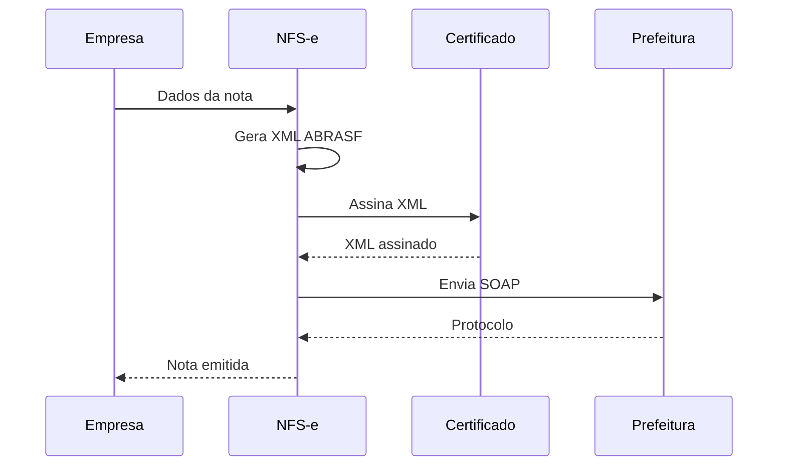

# 07 — NFS-e Integration

**🇧🇷** Integração com Nota Fiscal Eletrônica  
**🇬🇧** Electronic Invoice Integration

---

Vou te contar uma história. Eu trabalhava num sistema de gestão financeira e um dia o chefe chegou: "Precisamos emitir nota fiscal pra esse cliente em São Paulo." Beleza, implementei. No mês seguinte: "Agora precisa emitir pro Rio de Janeiro." Beleza, mais um. No outro mês: "Belo Horizonte." E aí eu percebi: isso nunca vai acabar.

No Brasil, toda empresa de serviço precisa emitir NFS-e — Nota Fiscal de Serviços Eletrônica. Cada prefeitura tem seu próprio sistema, seu próprio XML, seu próprio SOAP. São 5.570 municípios, cada um com uma implementação diferente do padrão ABRASF.

O desafio não é emitir uma nota. É emitir uma nota em qualquer município sem enlouquecer.

Esse simulador implementa o padrão ABRASF 3.0: geração de XML, assinatura digital, envio SOAP, consulta e cancelamento. E o mais importante: te dá uma base pra você adicionar novos municípios sem reescrever tudo.

---

## A arquitetura



O fluxo parece simples: dados → XML → assina → envia → pronto. Mas cada etapa tem armadilhas.

O XML precisa seguir o schema ABRASF exatamente. Um campo a mais, um namespace errado, e a prefeitura rejeita. A assinatura digital precisa usar o certificado A1 (ou A3) no formato correto — ICP-Brasil, não qualquer certificado. O envelope SOAP varia de prefeitura pra prefeitura: algumas usam WS-Security, outras não. Algumas aceitam HTTPS simples, outras exigem mutual TLS.

---

## Resolução em TypeScript

### Geração de XML ABRASF

```typescript
function buildNFSexml(data: NFSData): string {
  return `<?xml version="1.0" encoding="UTF-8"?>
<GerarNfseEnvio xmlns="http://www.abrasf.org.br/nfse">
  <Prestador>
    <Cnpj>${data.provider.cnpj}</Cnpj>
    <InscricaoMunicipal>${data.provider.municipalReg}</InscricaoMunicipal>
  </Prestador>
  <Servico>
    <Valores>
      <ValorServicos>${data.amount.toFixed(2)}</ValorServicos>
      <ValorIss>${calculateISS(data.amount, data.cityCode)}</ValorIss>
    </Valores>
    <ItemListaServico>${data.serviceCode}</ItemListaServico>
    <Discriminacao>${data.description}</Discriminacao>
    <CodigoMunicipio>${data.cityCode}</CodigoMunicipio>
  </Servico>
  <Tomador>
    <CpfCnpj>
      <Cnpj>${data.taker.cnpj}</Cnpj>
    </CpfCnpj>
    <RazaoSocial>${data.taker.name}</RazaoSocial>
  </Tomador>
</GerarNfseEnvio>`;
}
```

Essa função parece inocente, mas esconde várias decisões. Primeiro: `toFixed(2)`. Se o valor for 1500, vira "1500.00". Se for 1500.1, vira "1500.10". Parece certo, mas algumas prefeituras esperam "1500,00" (vírgula como separador decimal). Já tomei rejeição por causa disso. A solução? Um formatador que usa a configuração da prefeitura alvo.

```typescript
// Formatador de valor sensível ao município
function formatAmount(amount: number, cityCode: string): string {
  const decimalSeparators: Record<string, string> = {
    '3550308': '.',   // São Paulo usa ponto
    '3304557': ',',   // Rio usa vírgula
    '3106200': '.',   // Belo Horizonte usa ponto
  };
  
  const sep = decimalSeparators[cityCode] || '.';
  const [int, dec] = amount.toFixed(2).split('.');
  return `${int}${sep}${dec}`;
}
```

Segundo: a template string. XML construído com template string funciona, mas é frágil. Se o `data.description` tiver caracteres especiais (`&`, `<`, `>`, `"`), o XML quebra. Precisa de escape:

```typescript
function escapeXml(str: string): string {
  return str
    .replace(/&/g, '&amp;')
    .replace(/</g, '&lt;')
    .replace(/>/g, '&gt;')
    .replace(/"/g, '&quot;')
    .replace(/'/g, '&apos;');
}
```

Terceiro: namespaces. O namespace `xmlns="http://www.abrasf.org.br/nfse"` precisa estar exatamente como a prefeitura espera. Algumas cidades usam versões diferentes. São Paulo usa `http://www.abrasf.org.br/nfse`. Campinas usa `http://www.campinas.sp.gov.br/nfse`. Descobri isso depois de horas debugando um "XML inválido" que na verdade era namespace errado.

### Geração de XML com biblioteca (mais robusta)

```typescript
import { Builder } from 'xml2js';

const builder = new Builder({
  xmldec: { version: '1.0', encoding: 'UTF-8' },
  renderOpts: { pretty: true, indent: '  ' },
});

function buildNFSexmlRobusto(data: NFSData): string {
  const xmlObj = {
    GerarNfseEnvio: {
      $: { xmlns: getNamespace(data.cityCode) },
      Prestador: {
        Cnpj: data.provider.cnpj,
        InscricaoMunicipal: data.provider.municipalReg,
      },
      Servico: {
        Valores: {
          ValorServicos: formatAmount(data.amount, data.cityCode),
          ValorIss: formatAmount(calculateISS(data.amount, data.cityCode), data.cityCode),
          BaseCalculo: formatAmount(data.amount, data.cityCode),
          Aliquota: formatAliquota(getCityAliquota(data.cityCode), data.cityCode),
        },
        ItemListaServico: data.serviceCode,
        Discriminacao: escapeXml(data.description),
        CodigoMunicipio: data.cityCode,
        ExigibilidadeISS: '1', // 1 = Exigível, 2 = Não exigível
        MunicipioIncidencia: data.cityCode,
      },
      Tomador: {
        IdentificacaoTomador: {
          CpfCnpj: data.taker.documentType === 'CNPJ'
            ? { Cnpj: data.taker.document }
            : { Cpf: data.taker.document },
        },
        RazaoSocial: escapeXml(data.taker.name),
        Endereco: {
          Endereco: data.taker.street,
          Numero: data.taker.number,
          Bairro: data.taker.neighborhood,
          Cep: data.taker.zipCode,
          Uf: data.taker.state,
        },
      },
    },
  };
  
  return builder.buildObject(xmlObj);
}
```

Repara no `ExigibilidadeISS`. Isso é um campo que muita gente esquece. O ISS pode ser exigível (1) ou não exigível (2) dependendo do tipo de serviço e do município de incidência. Se você errar isso, a nota é rejeitada. No fim do mês, você tem um monte de nota pendente e o financeiro te odiando.

### Envio SOAP

```typescript
import { createClientAsync } from 'soap';

async function emitNFS(data: NFSData): Promise<string> {
  const xml = buildNFSexml(data);
  const signedXml = await signXML(xml, certificate);
  
  const client = await createClientAsync(data.cityWsdl);
  
  const result = await client.GerarNfseAsync({ xml: signedXml });
  
  return result.NumeroNfse;
}
```

O SOAP é outro mundo. Cada prefeitura expõe seu WSDL em uma URL diferente. O formato do envelope varia. Algumas usam `soapenv:Envelope`, outras `soap:Envelope`. Algumas exigem header com `wsse:Security`, outras não.

```typescript
// Cliente SOAP genérico com suporte a múltiplos municípios
interface CityConfig {
  wsdl: string;
  namespace: string;
  soapVersion: '1.1' | '1.2';
  wsSecurity: boolean;
  methodName: string;
  envelopePrefix: string;
}

const cityConfigs: Record<string, CityConfig> = {
  '3550308': { // São Paulo
    wsdl: 'https://nfe.saopaulo.sp.gov.br/ws/nfeservice?wsdl',
    namespace: 'http://www.abrasf.org.br/nfse',
    soapVersion: '1.1',
    wsSecurity: true,
    methodName: 'GerarNfse',
    envelopePrefix: 'soapenv',
  },
  '3304557': { // Rio de Janeiro
    wsdl: 'https://nfe.rio.rj.gov.br/ws/nfeservice?wsdl',
    namespace: 'http://www.abrasf.org.br/nfse',
    soapVersion: '1.2',
    wsSecurity: false,
    methodName: 'GerarNfse',
    envelopePrefix: 'soap',
  },
};

async function emitNFSMultiCity(data: NFSData): Promise<string> {
  const config = cityConfigs[data.cityCode];
  if (!config) throw new Error(`Município não suportado: ${data.cityCode}`);
  
  const xml = buildNFSexmlRobusto(data);
  const signedXml = await signXML(xml, certificate, config);
  
  const client = await createClientAsync(config.wsdl);
  
  // Ajusta headers SOAP conforme configuração
  if (config.wsSecurity) {
    client.addSoapHeader(buildWSSecurityHeader(certificate));
  }
  
  const result = await client[config.methodName + 'Async'](
    { arg0: signedXml },
    { envelopeKey: config.envelopePrefix }
  );
  
  const numeroNfse = extractNfseNumber(result, config);
  
  return numeroNfse;
}
```

A função `extractNfseNumber` é outro ponto sensível. Cada prefeitura retorna o protocolo num campo diferente. São Paulo retorna `return.NumeroNfse`. Rio retorna `return.nfse.Numero`. Belo Horizonte retorna `return.protocolo`. Você precisa de um mapper pra cada:

```typescript
function extractNfseNumber(result: any, config: CityConfig): string {
  const paths: Record<string, string[]> = {
    '3550308': ['GerarNfseResult', 'NumeroNfse'],
    '3304557': ['GerarNfseResult', 'nfse', 'infNfse', 'numero'],
    '3106200': ['GerarNfseResult', 'protocolo'],
  };
  
  const path = paths[config.cityCode];
  let current = result;
  
  for (const key of path!) {
    current = current[key];
    if (!current) throw new Error(`Campo não encontrado: ${key}`);
  }
  
  return String(current);
}
```

### Consulta e cancelamento

```typescript
async function consultNFS(cityCode: string, nfseNumber: string): Promise<NFSStatus> {
  const config = cityConfigs[cityCode];
  const client = await createClientAsync(config.wsdl);
  
  const result = await client.ConsultarNfseAsync({
    arg0: buildConsultXml(nfseNumber, cityCode),
  });
  
  const status = result.ConsultarNfseResult.SituacaoNfse;
  
  return {
    number: nfseNumber,
    status: status === '1' ? 'NORMAL' : 'CANCELADA',
    issuedAt: result.ConsultarNfseResult.DataEmissao,
    verificationCode: result.ConsultarNfseResult.CodigoVerificacao,
    pdfUrl: result.ConsultarNfseResult.UrlPdf,
  };
}

async function cancelNFS(cityCode: string, nfseNumber: string, reason: string): Promise<void> {
  const config = cityConfigs[cityCode];
  const client = await createClientAsync(config.wsdl);
  
  const cancelXml = buildCancelXml(nfseNumber, reason, cityCode);
  const signedXml = await signXML(cancelXml, certificate, config);
  
  await client.CancelarNfseAsync({ arg0: signedXml });
}
```

O cancelamento precisa de motivo. E o motivo precisa ser um código específico: "1" para erro na emissão, "2" para desistência, "3" para erro no tomador. Cada prefeitura trata isso de um jeito. Algumas exigem que o cancelamento seja feito no mesmo dia. Outras aceitam cancelamento em até 30 dias.

### Cálculo de impostos

```typescript
function calculateTaxes(amount: number, cityCode: string) {
  const issAliquota = getCityAliquota(cityCode); // 2-5%
  
  return {
    iss: amount * (issAliquota / 100),
    pis: amount * 0.015,       // 1.5% simplified
    cofins: amount * 0.069,    // 6.9% simplified
    ir: amount * 0.015,        // 1.5% simplified
    csll: amount * 0.01,       // 1% simplified
    totalTaxes: amount * (issAliquota / 100 + 0.015 + 0.069 + 0.015 + 0.01),
  };
}
```

Esse cálculo simplificado funciona pro simulador, mas na vida real é mais complexo. O PIS pode ser 0.65% (cumulativo) ou 1.65% (não cumulativo). A COFINS pode ser 3% ou 7.6%. O IR depende do regime tributário da empresa. O ISS varia não só por cidade mas também por tipo de serviço.

```typescript
// Cálculo de impostos realista por regime tributário
type TaxRegime = 'SIMPLES_NACIONAL' | 'LUCRO_PRESUMIDO' | 'LUCRO_REAL';

function calculateTaxesRealistic(amount: number, cityCode: string, regime: TaxRegime) {
  const issAliquota = getCityAliquota(cityCode);
  
  const taxTable: Record<TaxRegime, { pis: number; cofins: number; ir: number; csll: number }> = {
    SIMPLES_NACIONAL: { pis: 0, cofins: 0, ir: 0, csll: 0 }, // Tudo incluso no DAS
    LUCRO_PRESUMIDO: { pis: 0.65 / 100, cofins: 3 / 100, ir: 1.2 / 100, csll: 1.08 / 100 },
    LUCRO_REAL: { pis: 1.65 / 100, cofins: 7.6 / 100, ir: 1.5 / 100, csll: 1 / 100 },
  };
  
  const rates = taxTable[regime];
  
  return {
    iss: amount * (issAliquota / 100),
    pis: amount * rates.pis,
    cofins: amount * rates.cofins,
    ir: amount * rates.ir,
    csll: amount * rates.csll,
    totalTaxes: amount * (
      issAliquota / 100 + rates.pis + rates.cofins + rates.ir + rates.csll
    ),
  };
}
```

### Cache de alíquotas

As alíquotas de ISS variam por município e por serviço. Não é viável consultar a prefeitura toda vez. Use um cache com fallback:

```typescript
import NodeCache from 'node-cache';

const aliquotaCache = new NodeCache({ stdTTL: 86400 }); // 24h

async function getCityAliquota(cityCode: string, serviceCode: string): Promise<number> {
  const cacheKey = `${cityCode}:${serviceCode}`;
  const cached = aliquotaCache.get<number>(cacheKey);
  if (cached !== undefined) return cached;
  
  // Tenta consultar a prefeitura
  try {
    const aliquota = await fetchAliquotaFromCityHall(cityCode, serviceCode);
    aliquotaCache.set(cacheKey, aliquota);
    return aliquota;
  } catch (err) {
    // Fallback pra tabela local
    const fallback = getFallbackAliquota(cityCode, serviceCode);
    aliquotaCache.set(cacheKey, fallback);
    return fallback;
  }
}

// Tabela de fallback (última atualização: Jan/2026)
const fallbackAliquotas: Record<string, Record<string, number>> = {
  '3550308': { // São Paulo
    '1.01': 5, '1.02': 5, '2.01': 3, '7.01': 2,
  },
  '3304557': { // Rio de Janeiro
    '1.01': 5, '1.02': 4, '2.01': 2, '7.01': 3,
  },
};

function getFallbackAliquota(cityCode: string, serviceCode: string): number {
  return fallbackAliquotas[cityCode]?.[serviceCode] ?? 5; // Default 5%
}
```

---

## Resolução em Go

```go
package main

import (
    "crypto"
    "crypto/rand"
    "crypto/rsa"
    "crypto/sha256"
    "crypto/x509"
    "encoding/pem"
    "encoding/xml"
    "fmt"
    "net/http"
)

// ABRASF XML structure
type GerarNfseEnvio struct {
    XMLName  xml.Name `xml:"GerarNfseEnvio"`
    Prestador struct {
        Cnpj             string `xml:"Cnpj"`
        InscricaoMunicipal string `xml:"InscricaoMunicipal"`
    } `xml:"Prestador"`
    Servico struct {
        Valores struct {
            ValorServicos string `xml:"ValorServicos"`
            ValorIss      string `xml:"ValorIss"`
        } `xml:"Valores"`
        ItemListaServico string `xml:"ItemListaServico"`
        Discriminacao    string `xml:"Discriminacao"`
    } `xml:"Servico"`
}

func generateNFSXML(data NFSData) string {
    env := GerarNfseEnvio{}
    env.Prestador.Cnpj = data.Provider.CNPJ
    env.Prestador.InscricaoMunicipal = data.Provider.MunicipalReg
    env.Servico.Valores.ValorServicos = fmt.Sprintf("%.2f", data.Amount)
    env.Servico.Valores.ValorIss = fmt.Sprintf("%.2f", data.Amount*0.05)
    env.Servico.ItemListaServico = data.ServiceCode
    env.Servico.Discriminacao = data.Description
    
    xmlBytes, _ := xml.MarshalIndent(env, "", "  ")
    return string(xmlBytes)
}

func signXML(xmlContent string, privateKey *rsa.PrivateKey) (string, error) {
    hash := sha256.Sum256([]byte(xmlContent))
    signature, err := rsa.SignPKCS1v15(rand.Reader, privateKey, crypto.SHA256, hash[:])
    if err != nil {
        return "", err
    }
    
    // Wrap in XML signature
    signedXML := fmt.Sprintf(`<?xml version="1.0" encoding="UTF-8"?>
<SignedXml>
  <Signature xmlns="http://www.w3.org/2000/09/xmldsig#">
    <SignedInfo>
      <SignatureValue>%x</SignatureValue>
    </SignedInfo>
  </Signature>
  <XmlContent>%s</XmlContent>
</SignedXml>`, signature, xmlContent)
    
    return signedXML, nil
}
```

### XML em Go com structs tipados

Uma vantagem de Go é que o `xml.Marshal` com structs é muito mais seguro que template string. O compilador valida os campos. Se você esquecer uma tag, o XML não gera aquele campo. O preço? Verbosidade. Cada campo precisa de tag XML. O struct aninhado fica gigante.

```go
// Estrutura ABRASF completa (trecho)
type GerarNfseEnvioCompleto struct {
    XMLName   xml.Name `xml:"GerarNfseEnvio"`
    Prestador Prestador `xml:"Prestador"`
    Servico   Servico   `xml:"Servico"`
    Tomador   Tomador   `xml:"Tomador"`
}

type Prestador struct {
    Cnpj             string `xml:"Cnpj"`
    InscricaoMunicipal string `xml:"InscricaoMunicipal"`
}

type Servico struct {
    Valores           Valores `xml:"Valores"`
    ItemListaServico  string  `xml:"ItemListaServico"`
    Discriminacao     string  `xml:"Discriminacao"`
    CodigoMunicipio   string  `xml:"CodigoMunicipio"`
    ExigibilidadeISS  string  `xml:"ExigibilidadeISS"`
}

type Valores struct {
    ValorServicos string `xml:"ValorServicos"`
    ValorIss      string `xml:"ValorIss"`
    BaseCalculo   string `xml:"BaseCalculo"`
    Aliquota      string `xml:"Aliquota"`
}

type Tomador struct {
    IdentificacaoTomador IdentificacaoTomador `xml:"IdentificacaoTomador"`
    RazaoSocial          string               `xml:"RazaoSocial"`
}

type IdentificacaoTomador struct {
    CpfCnpj CpfCnpj `xml:"CpfCnpj"`
}

type CpfCnpj struct {
    Cnpj string `xml:"Cnpj,omitempty"`
    Cpf  string `xml:"Cpf,omitempty"`
}
```

### Envio SOAP em Go

```go
import (
    "bytes"
    "encoding/xml"
    "io/ioutil"
    "net/http"
)

type SOAPEnvelope struct {
    XMLName xml.Name `xml:"soapenv:Envelope"`
    Header  SOAPHeader `xml:"soapenv:Header"`
    Body    SOAPBody   `xml:"soapenv:Body"`
}

type SOAPHeader struct {
    Security WSSecurity `xml:"wsse:Security,omitempty"`
}

type WSSecurity struct {
    BinarySecurityToken string `xml:"wsse:BinarySecurityToken"`
}

type SOAPBody struct {
    Content string `xml:",innerxml"`
}

func sendSOAP(wsdlURL string, xmlContent string, config CityConfig) (string, error) {
    envelope := SOAPEnvelope{
        Body: SOAPBody{Content: xmlContent},
    }
    
    if config.WSSecurity {
        envelope.Header = SOAPHeader{
            Security: WSSecurity{
                BinarySecurityToken: loadCertBase64(config.CertPath),
            },
        }
    }
    
    soapXML, _ := xml.MarshalIndent(envelope, "", "  ")
    
    resp, err := http.Post(wsdlURL, "text/xml; charset=utf-8", bytes.NewReader(soapXML))
    if err != nil {
        return "", fmt.Errorf("SOAP request failed: %w", err)
    }
    defer resp.Body.Close()
    
    body, _ := ioutil.ReadAll(resp.Body)
    
    if resp.StatusCode != 200 {
        return "", fmt.Errorf("SOAP error %d: %s", resp.StatusCode, string(body))
    }
    
    return string(body), nil
}
```

### TS vs Go: NFS-e

A diferença fundamental aqui é como cada linguagem lida com XML.

No TypeScript, você usa template strings ou xml2js. Template string é frágil mas rápido. xml2js é robusto mas lento. O maior problema do TS pra NFS-e é que não há validação de schema em tempo de compilação. Você só descobre que o XML está errado quando a prefeitura rejeita.

No Go, o `xml.Marshal` gera XML a partir de structs tipados. Se a struct tem uma tag `xml:"Cnpj"`, o campo é gerado corretamente. O compilador garante que o campo existe. Mas a verbosidade é brutal — cada campo precisa de struct, tag, e tratamento de `omitempty`.

Outra diferença: certificado digital. No TypeScript, você precisa de bibliotecas como `node-forge` ou `pkijs` pra manipular certificados A1. No Go, a stdlib tem `crypto/x509` que faz tudo — parse de certificado, assinatura, verificação. É mais baixo nível, mas você não depende de biblioteca de terceiro.

---

## Como testar

```bash
pnpm --filter @banking/nfse dev

curl -X POST http://localhost:3007/api/v1/nfse/emitter \
  -H "Content-Type: application/json" \
  -d '{"provider":{"cnpj":"12345678000195","municipalReg":"12345"},
       "amount":1500,"description":"Dev de software","cityCode":"3550308",
       "taker":{"cnpj":"98765432000195","name":"Empresa Ltda"}}'
```

### Teste de cancelamento

```bash
# Cancela a nota emitida
curl -X POST http://localhost:3007/api/v1/nfse/12345/cancel \
  -H "Content-Type: application/json" \
  -d '{"reason":"1","description":"Erro na emissão"}'
```

### Teste de consulta

```bash
# Consulta status da nota
curl http://localhost:3007/api/v1/nfse/12345

# Resposta esperada:
# {
#   "number": "12345",
#   "status": "NORMAL",
#   "issuedAt": "2026-06-27T10:30:00-03:00",
#   "verificationCode": "AB12-CD34-EF56",
#   "pdfUrl": "https://nfe.saopaulo.sp.gov.br/pdf/12345"
# }
```

### Teste de lote

```bash
# Emite 10 notas em lote
for i in $(seq 1 10); do
  curl -X POST http://localhost:3007/api/v1/nfse/emitter \
    -H "Content-Type: application/json" \
    -d "{\"provider\":{\"cnpj\":\"12345678000195\",\"municipalReg\":\"12345\"},
         \"amount\":$((RANDOM % 10000 + 100)),\"description\":\"Serviço $i\",\"cityCode\":\"3550308\",
         \"taker\":{\"cnpj\":\"98765432000195\",\"name\":\"Empresa Ltda\"}}"
done
```

## Troubleshooting

**Erro: "XML inválido"**
99% das vezes é namespace errado. Verifique se o `xmlns` corresponde exatamente ao que a prefeitura espera. O resto do tempo é caractere especial no `Discriminacao` — esqueceu de escapar `&`, `<`, `>`.

**Erro: "Assinatura inválida"**
O certificado expirou? É ICP-Brasil? A assinatura foi gerada no formato correto? Cada prefeitura aceita algoritmos diferentes — algumas SHA-1, outras SHA-256.

**Erro: "Timeout"**
Algumas prefeituras são lentas. Muito lentas. 30 segundos de timeout não é incomum. Configure timeout alto o suficiente. E não bloqueie o event loop — use o client SOAP com suporte a async.

**Erro: "Nota já emitida"**
Idempotência. Se você tentar emitir a mesma nota duas vezes (mesmo RPS, mesma série, mesmo número), a prefeitura rejeita. Controle isso no seu lado. Use uma tabela de RPS emitidos pra evitar duplicidade.

---

## Lições aprendidas

1. **XML não morreu** — No governo brasileiro, XML é rei. SOAP, certificado digital, esquemas complexos. Quem acha que "só usa REST" nunca integrou com prefeitura. E esquece GraphQL — prefeitura não sabe nem o que é isso.

2. **Cada município é um mundo** — São Paulo tem uma API. Rio tem outra. Belo Horizonte tem outra. O padrão ABRASF tenta unificar, mas cada cidade implementa do seu jeito. Algumas usam ABRASF 2.0, outras 3.0. Algumas têm ambiente de homologação, outras não.

3. **Certificado digital é obrigatório** — Sem A1 ou A3, nada funciona. A assinatura XML precisa ser válida para a prefeitura aceitar. E o certificado precisa ser ICP-Brasil — certificado estrangeiro não serve.

4. **ISS varia por cidade** — 2% em alguns municípios, 5% em outros. O cálculo errado gera nota inválida. E o ISS pode mudar sem aviso — já aconteceu de uma prefeitura alterar a alíquota no meio do ano sem comunicar.

5. **Teste em homologação antes de produção** — Toda prefeitura tem ambiente de homologação. Use sempre antes de emitir nota real. E guarde os XMLs de homologação como evidência.

6. **Não confie no WSDL da prefeitura** — Muitas prefeituras publicam WSDL desatualizado ou incorreto. Baixe o WSDL, analise os schemas, e compare com a documentação. Quando divergirem, a documentação geralmente está certa (ou não — já vi os dois errados).

7. **Log é seu melhor amigo** — Guarde cada XML enviado e cada resposta recebida. Quando uma nota for rejeitada, você precisa do XML original pra debug. Guarde também o envelope SOAP completo — o problema pode estar no header, não no body.

8. **Provisionamento de certificado é um projeto à parte** — Certificado A1 vence em 1 ano. Precisa de renewal automático. Algumas prefeituras exigem recadastramento quando o certificado muda. Já vi empresa parar de emitir nota porque o certificado venceu e ninguém lembrou de renovar.

9. **Homologação é obrigatória mas nem todas têm** — São Paulo, Rio, BH têm ambiente de homologação. Cidades pequenas geralmente não. Você vai precisar testar em produção com nota de teste (R$ 0,01) e depois cancelar. É arriscado, mas é a realidade.

10. **Namespace do XML é a causa #1 de rejeição** — Mais que valor errado, mais que CPF inválido. O namespace errado. Cada prefeitura usa uma URL diferente. Guarde isso num map, não hardcode.

## Código completo

O módulo NFS-e está em `packages/nfse/`. Pra rodar:

```bash
# Instala dependências
pnpm install

# Roda o simulador
pnpm --filter @banking/nfse dev

# Testes
pnpm --filter @banking/nfse test
```

### Testes de integração

```typescript
// tests/nfse.test.ts
import { describe, it, expect } from 'vitest';

const BASE_URL = 'http://localhost:3007';

describe('NFS-e Integration', () => {
  it('deve emitir nota fiscal', async () => {
    const res = await fetch(`${BASE_URL}/api/v1/nfse/emitter`, {
      method: 'POST',
      headers: { 'Content-Type': 'application/json' },
      body: JSON.stringify({
        provider: { cnpj: '12345678000195', municipalReg: '12345' },
        amount: 1500,
        description: 'Desenvolvimento de software',
        cityCode: '3550308',
        taker: { cnpj: '98765432000195', name: 'Empresa Ltda' },
      }),
    });

    expect(res.status).toBe(200);
    const body = await res.json();
    expect(body.numeroNfse).toBeDefined();
    expect(body.status).toBe('NORMAL');
  });

  it('deve consultar nota emitida', async () => {
    const numeroNfse = '12345';

    const res = await fetch(`${BASE_URL}/api/v1/nfse/${numeroNfse}`);
    expect(res.status).toBe(200);

    const body = await res.json();
    expect(body.number).toBe(numeroNfse);
    expect(body.status).toMatch(/^(NORMAL|CANCELADA)$/);
  });

  it('deve cancelar nota', async () => {
    const numeroNfse = '12345';

    const res = await fetch(`${BASE_URL}/api/v1/nfse/${numeroNfse}/cancel`, {
      method: 'POST',
      headers: { 'Content-Type': 'application/json' },
      body: JSON.stringify({ reason: '1', description: 'Erro na emissão' }),
    });

    expect(res.status).toBe(200);
  });

  it('deve rejeitar nota com valor negativo', async () => {
    const res = await fetch(`${BASE_URL}/api/v1/nfse/emitter`, {
      method: 'POST',
      headers: { 'Content-Type': 'application/json' },
      body: JSON.stringify({
        provider: { cnpj: '12345678000195', municipalReg: '12345' },
        amount: -1500,
        description: 'Teste',
        cityCode: '3550308',
        taker: { cnpj: '98765432000195', name: 'Empresa Ltda' },
      }),
    });

    expect(res.status).toBe(422);
  });
});
```

### Simulando múltiplos municípios

```bash
# Emite nota em São Paulo
curl -X POST http://localhost:3007/api/v1/nfse/emitter \
  -d '{"provider":{"cnpj":"12345678000195","municipalReg":"12345"},"amount":1500,"description":"Serviço SP","cityCode":"3550308",...}'

# Emite nota no Rio de Janeiro
curl -X POST http://localhost:3007/api/v1/nfse/emitter \
  -d '{"provider":{"cnpj":"12345678000195","municipalReg":"67890"},"amount":2000,"description":"Serviço RJ","cityCode":"3304557",...}'

# Emite nota em Belo Horizonte
curl -X POST http://localhost:3007/api/v1/nfse/emitter \
  -d '{"provider":{"cnpj":"12345678000195","municipalReg":"11111"},"amount":3000,"description":"Serviço BH","cityCode":"3106200",...}'
```

Cada cidade usa configurações diferentes de namespace, WSDL, e formato de valor. O simulador aplica a configuração correta baseada no `cityCode`.
