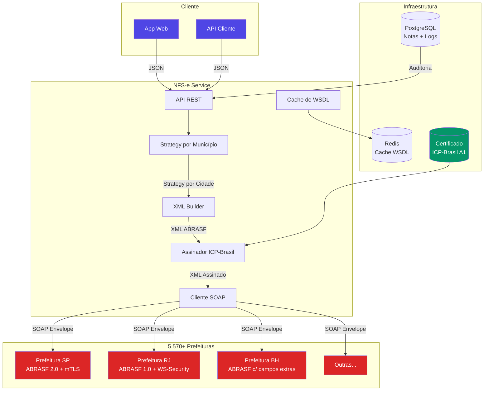
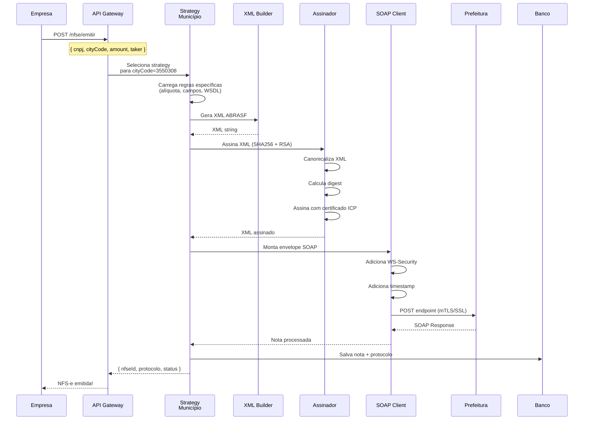
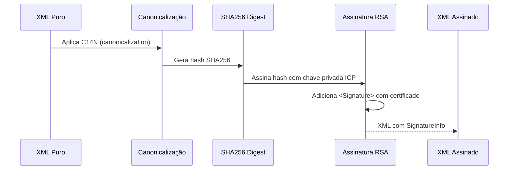
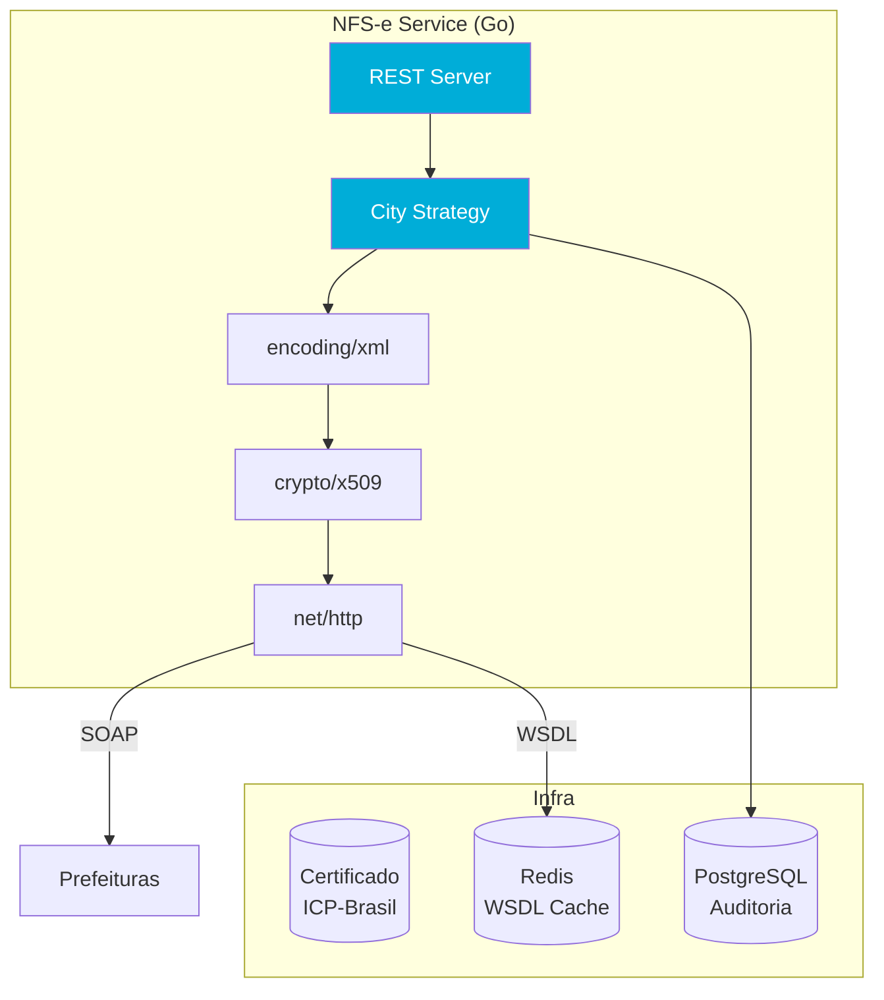

# Desafio 07: NFS-e — Nota Fiscal de Serviços Eletrônica

**🇧🇷** Integração com Nota Fiscal Eletrônica — ABRASF, SOAP e ICP-Brasil  
**🇬🇧** Brazilian Electronic Invoice — ABRASF XML, SOAP & ICP-Brasil Certificates

---

## 🎯 Objetivos de Aprendizado

- Entender o padrão ABRASF e suas variações entre 5.570+ municípios
- Implementar assinatura digital XML com certificado ICP-Brasil (A1/A3)
- Construir cliente SOAP resiliente com WS-Security e mTLS
- Projetar abstração de municípios com strategy pattern por cidade
- Garantir idempotência e logging de auditoria para todas as notas emitidas

---

## 📋 Pré-requisitos

### 🧠 Conceitos
- NFS-e (Nota Fiscal de Serviço Eletrônica)
- Padrão ABRASF
- ICP-Brasil (certificação digital A1/A3)
- XML-DSig (assinatura digital de XML)
- SOAP vs REST

### 📚 Desafios Anteriores
- Nenhum específico — conhecimento de XML do Desafio 02 (SPI) ajuda

### 🛠️ Ferramentas
- Docker
- Certificado digital A1 (arquivo .pfx)
- PostgreSQL

### 💻 Técnico
- TypeScript, Node.js 20+
- XML parsing/building
- SOAP clients
- Strategy pattern, padrão Adapter

---

## 📖 Abertura — O Caldeirão Fiscal Brasileiro

"Presta atencao. você acha que emitir uma nota fiscal é difícil? Em qualquer lugar do mundo desenvolvido, você aperta um botão e sai o XML. Pronto. Acabou.

Agora, no Brasil? Pelo amor de deus. A gente tem **5.570 municípios**. Cada um é uma prefeitura. Cada prefeitura tem seu próprio sistema de nota fiscal. Cada sistema implementa o padrão ABRASF de um jeito diferente. SP usa SSL mutual. Rio exige WS-Security. BH tem campos extras no XML. Curitiba tem WSDL customizado. Salvador só aceita certificado A3 em hardware token.

Não é um padrão. São 5.570 padrões diferentes, todos chamados de 'ABRASF'.

Isso existe por uma razão histórica: o imposto sobre serviço (ISS) é **municipal**, não federal. Diferente do ICMS (estadual) que o governo federal conseguiu padronizar com a NF-e, a NFS-e ficou nas mãos de cada prefeitura. Cada uma comprou um sistema de um fornecedor diferente nos anos 2000 — e hoje a gente paga esse preço.

O desafio aqui não é técnico. É de **engenharia de integração**. Você precisa de um sistema que se adapte a cada prefeitura sem precisar reescrever tudo. E mais importante: precisa fazer isso de forma confiável, porque nota fiscal rejeitada = multa."

Mas deixa eu te contar a história completa, porque ela explica muito sobre como o Brasil funciona. Nos anos 90, o governo federal percebeu que tinha um problema: o ICMS (Imposto sobre Circulação de Mercadorias e Serviços de transporte e comunicação) era estadual, e cada estado emitia nota fiscal em papel. Papel-carbono. Bloquinho de nota. Sonegação era trivial — você simplesmente não registrava a nota. O governo federal criou então o SPED (Sistema Público de Escrituração Digital) e a NF-e (Nota Fiscal Eletrônica), unificando o ICMS para todos os estados. Foi um sucesso brutal. Hoje toda nota de mercadoria no Brasil é uma NF-e padronizada, com XML validado pela SEFAZ, assinada digitalmente, em tempo real.

Só que o ISS ficou de fora dessa festa. Por quê? Porque o ISS é **municipal**, não estadual. E o Brasil tem 5.570 municípios, cada um com autonomia fiscal garantida pela Constituição de 1988. Você não pode obrigar uma prefeitura do interior do Amazonas a usar o mesmo sistema que a prefeitura de São Paulo. A soberania municipal — que faz sentido jurídico — cria um pesadelo técnico. Cada prefeitura escolheu seu fornecedor de software nos anos 2000: algumas compraram da GEL, outras da IPM Sistemas, outras da Elotech, outras desenvolveram internamente com equipes que já se aposentaram. Cada fornecedor implementou o "Padrão ABRASF" da sua maneira. O resultado? O que era pra ser um padrão nacional virou uma Torre de Babel.

A ABRASF (Associação Brasileira das Secretarias de Finanças das Capitais) até tentou. Publicou o padrão ABRASF em 2003, baseado na Lei Complementar 116/2003. Depois veio a versão 2.0, depois a 2.02, depois a 2.03. Cada versão adicionou campos, mudou namespaces, alterou estruturas de XML. Mas como a adesão é voluntária, cada prefeitura migrou quando quis — ou não migrou. Tem prefeitura até hoje rodando ABRASF 1.0. E tem prefeitura que implementou as três versões simultaneamente, cada uma em um endpoint diferente, e você precisa adivinhar qual usar.

Sabe o que é pior? A **guerra fiscal digital**. As prefeituras competem entre si para atrair empresas. O ISS é a principal fonte de receita de muitos municípios. Se uma empresa emite nota em São Paulo, o ISS vai pra SP. Então os municípios vizinhos baixam a alíquota de ISS para atrair as empresas. Barueri tem alíquota de 2% pra serviços específicos. Poá também. Isso é legal? Depende do dia, depende do juiz, depende da guerra fiscal do momento. O resultado prático: o endereço do tomador do serviço define qual município recebe o imposto — e a empresa pode ter que se cadastrar em novos municípios a cada novo cliente. Cada cadastro exige documentos, alvará, certificado digital vinculado à inscrição municipal. O onboarding de uma empresa numa fintech de pagamentos pode levar semanas só de cadastro fiscal.

O custo de compliance para uma fintech que opera nacionalmente é astronômico. Você precisa manter uma equipe dedicada só para monitorar mudanças nos webservices municipais. Sexta-feira às 17h, prefeitura de Campinas atualiza o WSDL sem aviso, segunda de manhã o helpdesk está lotado de chamados. Uma nota fiscal rejeitada significa que o prestador de serviço não recebe. Se você processa R$ 10 milhões em pagamentos por mês e sua taxa de rejeição de NFS-e é de 2%, você está segurando R$ 200 mil em pagamentos até resolver cada rejeição. Isso sem contar multa, juros, e o risco reputacional.

"Então é isso, rapaz. Emitir nota fiscal no Brasil não é programar — é fazer engenharia de integração num ambiente hostil, descentralizado, com 5.570 variações de um mesmo protocolo, onde qualquer mudança não anunciada pode quebrar seu sistema inteiro. Bem-vindo ao caldeirão fiscal brasileiro."

---

## 🔥 O Problema

Sua fintech processa pagamentos para prestadores de serviço em todo o Brasil. João, um encanador em São Paulo, prestou um serviço. Maria, uma consultora no Rio, também. Ambos precisam emitir NFS-e.

O problema?

1. **XML diferente por cidade** — São Paulo usa ABRASF 2.0, Rio usa 1.0 com WS-Security. O mesmo XML não serve para as duas.
2. **Certificado ICP-Brasil** — Não é qualquer certificado SSL. Precisa ser A1 (arquivo) ou A3 (token) da ICP-Brasil. E tem que estar válido, com a cadeia completa.
3. **SOAP é medieval** — Enquanto o mundo moderno usa REST/GraphQL, as prefeituras ainda usam SOAP com WSDL. E cada WSDL é diferente.
4. **Rejeição silenciosa** — A prefeitura aceita sua requisição SOAP, processa, e devolve erro. Você só descobre horas depois.
5. **ISS varia** — Cada município tem alíquota diferente. Calcular errado = nota rejeitada.

Mas deixa eu detalhar cada dimensão desse problema, porque a extensão do caos é maior do que parece.

**A questão dos WSDLs diferentes.** Você já parou pra pensar que, na prática, você não integra com 5.570 prefeituras — você integra com um subconjunto que varia de acordo com os clientes da sua fintech. Se sua fintech tem 1.000 prestadores de serviço espalhados por 200 municípios, você precisa manter 200 integrações ativas. Cada uma com seu WSDL, seu endpoint, suas regras de autenticação, seus schemas XSD. E prefeitura não manda email avisando que vai mudar o WSDL. Você descobre quando as notas começam a ser rejeitadas. Manter 200 integrações ativas com monitoramento proativo é um problema de engenharia de software não trivial.

**Certificação digital ICP-Brasil, em detalhe.** Não basta ter um certificado. Você precisa gerenciar múltiplos certificados por empresa. Cada CNPJ que emite nota fiscal precisa ter seu próprio certificado ICP-Brasil. Se sua fintech atende 500 empresas, você precisa gerenciar 500 certificados, cada um com sua senha, sua validade, sua cadeia de confiança. E tem mais: o certificado A1 é um arquivo .pfx que pode ser copiado, o que é conveniente para automação, mas um pesadelo de segurança — se vazar o .pfx e a senha, alguém pode emitir nota fiscal em nome da sua empresa. O certificado A3 é mais seguro (hardware token), mas não é automatizável — você precisa de um operador humano para digitar a senha do token a cada emissão. Para uma fintech que emite centenas de notas por dia, A1 é a única opção viável, e a segurança vira uma preocupação crítica.

**Os prazos que ninguém te conta.** Emitir a nota é só o começo. Se você errou algum dado — valor, código de serviço, CNPJ do tomador — você precisa **cancelar** a nota e emitir uma nova. O prazo de cancelamento varia por município: em SP são 24 horas, em algumas cidades são 5 dias, em outras você não pode cancelar de jeito nenhum — só emitindo uma nota de substituição ou uma carta de correção. E tem o RPS (Recibo Provisório de Serviço): em muitas cidades, antes de emitir a NFS-e definitiva, você emite um RPS que tem validade de alguns dias. Se você não converter o RPS em NFS-e dentro do prazo, o RPS perde a validade e você precisa emitir tudo de novo. E o número do RPS é sequencial por empresa — se você pular um número, a prefeitura rejeita por quebra de sequência.

**Validação de XML contra schemas.** O XML ABRASF que funciona em São Paulo não funciona em Guarulhos. E não é só por causa da versão do padrão — é porque cada prefeitura publica seu próprio schema XSD com pequenas variações. Campo `CodigoMunicipio` é obrigatório? Depende da prefeitura. `InscricaoMunicipal` do tomador é obrigatório? Em SP não, em BH sim. O `ValorIss` precisa incluir retenção? Depende do regime tributário do tomador. Você precisa validar o XML contra o XSD específico de cada município **antes** de enviar, senão a rejeição é certa. E validar 200 schemas diferentes, cada um com suas regras de negócio escondidas em comentários de XSD que só existem na documentação em PDF da prefeitura, é uma tarefa que consome equipes inteiras de QA.

E o pior: **a rejeição não é síncrona.** Você manda o XML via SOAP, a prefeitura responde com um protocolo de recebimento, e você acha que deu certo. Mas o processamento real é assíncrono — a prefeitura coloca na fila, processa, e horas depois você consulta o protocolo e descobre que a nota foi rejeitada por "Inscrição Municipal do Tomador não consta na base". O pagamento já foi liberado, o cliente já recebeu o dinheiro, mas a nota fiscal não existe juridicamente. Você agora tem que estornar o pagamento, cancelar o que não foi emitido, e pedir pro cliente se cadastrar na prefeitura. Isso pode levar dias. E o prestador de serviço está te ligando perguntando cadê o dinheiro dele.

---

## 🏗️ Arquitetura Geral

<LanguageToggle />

<div class="Lang-content ts" style="Display:block;">

### Visão Macro



O desenho acima mostra a arquitetura em camadas que todo sistema de NFS-e deveria ter. No topo, uma API REST que recebe JSON — simples, familiar, RESTful. No meio, uma camada de estratégia que traduz essa requisição genérica para o formato específico de cada município. E na base, um cliente SOAP que lida com a comunicação de baixo nível. O segredo está na camada do meio: é ela que absorve toda a complexidade e mantém o resto do sistema limpo.

### Conceitos Fundamentais

| Conceito | Descrição |
|----------|-----------|
| **ABRASF** | Associação Brasileira das Secretarias de Finanças — define o padrão nacional |
| **Certificado A1/A3** | ICP-Brasil, padrão de infraestrutura de chave pública brasileira |
| **ISS** | Imposto Sobre Serviços (alíquota varia 2-5% por município) |
| **RPS** | Recibo Provisório de Serviço — nota pré-emitida antes do processamento |
| **NFS-e** | Nota Fiscal de Serviços Eletrônica — emitida após processamento |
| **WSDL** | Web Services Description Language — descrição do SOAP endpoint |
| **LC 116/2003** | Lei Complementar que define a lista de serviços e regras do ISS |

Um ponto que merece destaque: o RPS e a NFS-e são entidades diferentes com ciclos de vida diferentes. O RPS é emitido pelo prestador no momento do serviço — é o que dispara o fluxo de pagamento na fintech. A NFS-e é o documento fiscal oficial emitido pela prefeitura. Entre o RPS e a NFS-e existe uma janela de processamento: a prefeitura recebe o RPS, valida, e converte em NFS-e (ou rejeita). Esse gap temporal é onde mora o perigo: o pagamento já foi feito, o dinheiro já saiu, mas a nota fiscal ainda não existe oficialmente. Seu sistema precisa lidar com esse estado intermediário com a mesma seriedade que lida com os estados de sucesso e falha.

### Fluxo Completo de Emissão



Este diagrama de sequência não mostra uma parte crítica que acontece depois: o **polling assíncrono**. Depois que o SOAP retorna o protocolo de recebimento, a nota ainda não está confirmada. O que a prefeitura devolveu foi um número de protocolo — tipo "Recebemos seu XML, protocolo 20260630001, volte depois pra saber o resultado". Seu sistema precisa de um job em background que consulta periodicamente o status desse protocolo. Se a nota foi autorizada, atualiza o banco como `COMPLETED`. Se foi rejeitada, atualiza como `REJECTED` e dispara um alerta. Esse job de polling é um dos componentes mais negligenciados — e mais importantes — de qualquer sistema de NFS-e.

---

## 👨‍💻 Mão na Massa

"Bora codar. O bagulho é o seguinte: você precisa emitir nota fiscal em qualquer município brasileiro sem pirar. Vou te mostrar como fazer uma abstração que funciona pra SP, RJ, BH e qualquer outra cidade que aparecer."

A escolha do padrão de design aqui não é acadêmica — é de sobrevivência. Se você começar com `if (cityCode === '3550308')` espalhado pelo código, em seis meses ninguém entende mais nada. O **strategy pattern** encapsula cada variação municipal em sua própria classe, isolada, testável, substituível. É o padrão mais importante do ecossistema fiscal brasileiro.

### Estratégia por Município

Cada prefeitura é um caso. A solução é um **strategy pattern** onde cada cidade implementa sua própria variação do fluxo ABRASF:

```typescript
interface CityStrategy {
  buildXml(data: NFSData): string;
  getEndpoint(): string;
  getSoapHeaders(): Record<string, string>;
  calculateISS(amount: number): number;
  validateData(data: NFSData): void;
}

class SaoPauloStrategy implements CityStrategy {
  // SP usa ABRASF 2.0 com SSL mutual
  getEndpoint(): string {
    return 'https://nfe.prefeitura.sp.gov.br/ws/nfse.asmx';
  }

  getSoapHeaders(): Record<string, string> {
    return {
      'Content-Type': 'application/soap+xml; charset=utf-8',
      'X-SSL-Client-Cert': 'required',
    };
  }

  calculateISS(amount: number): number {
    return amount * 0.05; // SP: 5%
  }
}

class RioDeJaneiroStrategy implements CityStrategy {
  // RJ usa WS-Security obrigatório
  getEndpoint(): string {
    return 'https://nfse.rio.gov.br/ws/nfse.asmx';
  }

  getSoapHeaders(): Record<string, string> {
    return {
      'Content-Type': 'application/soap+xml; charset=utf-8',
      'Authorization': 'WS-Security',
    };
  }

  calculateISS(amount: number): number {
    return amount * 0.02; // RJ: 2%
  }
}
```

Repare que a interface `CityStrategy` é enxuta, mas poderosa. Com apenas 5 métodos, você encapsula toda a variação entre municípios. Se amanhã aparecer uma prefeitura que exige um campo extra no XML, você só mexe na implementação daquela cidade. As outras 199 continuam intocadas. Isso é o que diferencia um sistema que escala de um sistema que quebra a cada novo município.

Mas na prática, a interface precisa ser mais rica. Cada estratégia também precisa saber montar o envelope SOAP corretamente — algumas prefeituras usam SOAP 1.1 (`http://schemas.xmlsoap.org/soap/envelope/`), outras SOAP 1.2 (`http://www.w3.org/2003/05/soap-envelope`). Algumas exigem o namespace `xmlns:nfse` no envelope, outras esperam no body. A interface real de produção acaba tendo 15-20 métodos, cobrindo não só emissão mas também cancelamento, consulta de lote, consulta de situação, e substituição.

O service principal orquestra as estratégias:

```typescript
class NFSeService {
  private strategies: Map<string, CityStrategy>;
  private signer: NFSeSigner;

  constructor() {
    this.strategies = new Map();
    this.strategies.set('3550308', new SaoPauloStrategy()); // SP
    this.strategies.set('3304557', new RioDeJaneiroStrategy()); // RJ
    this.strategies.set('3106200', new BeloHorizonteStrategy()); // BH
    // +5.567 outras cidades...
  }

  async emitir(data: NFSData): Promise<NFSeResult> {
    const strategy = this.strategies.get(data.cityCode);
    if (!strategy) throw new Error(`Cidade não suportada: ${data.cityCode}`);

    strategy.validateData(data);
    const iss = strategy.calculateISS(data.amount);

    // Gera XML
    const xml = strategy.buildXml({
      ...data,
      iss,
    });

    // Assina com certificado ICP-Brasil
    const signedXml = this.signer.signXml(xml);

    // Envia SOAP
    const response = await this.sendSoap(
      strategy.getEndpoint(),
      strategy.getSoapHeaders(),
      signedXml
    );

    // Salva para auditoria
    await this.saveAuditLog({
      cityCode: data.cityCode,
      xml: signedXml,
      response,
      timestamp: new Date(),
    });

    return this.parseResponse(response);
  }
}
```

"Agora presta atenção no `signer.signXml(xml)`. Esse é o ponto que mais dá problema em produção. Não é só chamar uma função e pronto. Você precisa garantir que: o certificado .pfx está acessível no filesystem, a senha está correta (e não hardcoded — use variável de ambiente ou vault), a cadeia de certificação está completa (se faltar a AC intermediária, a prefeitura rejeita), e o algoritmo de canonicalização está correto (C14N exclusivo ou inclusivo, depende da prefeitura). Qualquer erro aqui e o XML é rejeitado antes mesmo de chegar no SOAP."

Falando em SOAP: por que as prefeituras ainda usam SOAP enquanto o mundo migrou pra REST? A resposta é simples — licitação. Os sistemas de NFS-e foram comprados pelas prefeituras em licitações entre 2005 e 2015, quando SOAP era o padrão dominante para web services governamentais. Migrar esses sistemas custaria dezenas de milhões de reais. E como ISS é imposto municipal — ou seja, cada prefeitura precisaria fazer sua própria licitação de migração — ninguém migra. Sua fintech não tem escolha: você implementa SOAP ou não emite nota. Algumas prefeituras mais modernas (como SP) estão começando a oferecer APIs REST em paralelo, mas o SOAP continua sendo o denominador comum.

### XML ABRASF

Antes de construir o XML, você precisa entender a estrutura dele. O XML ABRASF segue uma hierarquia: `GerarNfseEnvio` → `Prestador` (quem emite), `Servico` (o que foi feito, valores, código de serviço), `Tomador` (quem contratou). Parece simples, mas cada campo dentro desses blocos tem regras diferentes por município. O `ItemListaServico` é um código da LC 116/2003 — e cada código tem regras específicas de alíquota, retenção, e substituição tributária. Escolher o código errado é o erro mais comum de rejeição.

```typescript
function buildNFSexml(data: NFSData): string {
  return `<?xml version="1.0" encoding="UTF-8"?>
<GerarNfseEnvio xmlns="Http://www.abrasf.org.br/nfse">
  <Prestador>
    <Cnpj>${data.provider.cnpj}</Cnpj>
    <InscricaoMunicipal>${data.provider.municipalReg}</InscricaoMunicipal>
  </Prestador>
  <Servico>
    <Valores>
      <ValorServicos>${formatAmount(data.amount, data.cityCode)}</ValorServicos>
      <ValorIss>${calculateISS(data.amount, data.cityCode)}</ValorIss>
    </Valores>
    <ItemListaServico>${data.serviceCode}</ItemListaServico>
    <Discriminacao>${data.description}</Discriminacao>
    <CodigoMunicipio>${data.cityCode}</CodigoMunicipio>
  </Servico>
  <Tomador>
    <CpfCnpj>
      <Cnpj>${data.taker.cnpj}</Cnpj>
    </CpfCnpj>
    <RazaoSocial>${data.taker.name}</RazaoSocial>
  </Tomador>
</GerarNfseEnvio>`;
}
```

"Repara que eu usei template literals aqui pra simplificar o exemplo. Em produção, **nunca** monte XML com string interpolation. O risco de injeção de XML, caracteres especiais não-escapados (tipo `&`, `<`, `>`), e namespace quebrado é alto demais. Use uma biblioteca como `xmlbuilder2` no TypeScript ou `encoding/xml` no Go. O XML gerado precisa ser deterministicamente idêntico a cada execução com os mesmos dados, porque a assinatura digital depende de canonicalização exata — e qualquer espaço em branco, quebra de linha, ou encoding diferente muda o hash."

Outro ponto importante: a validação do XML contra o schema XSD deve acontecer **antes** da assinatura, não depois. Se o XML está malformado, assinar um XML inválido é um desperdício de CPU e de tempo de certificado. Monte o XML, valide contra o XSD do município, corrija os erros, e só então assine. Esse pipeline — build → validate → sign → send — deveria ser a espinha dorsal do seu sistema de NFS-e.

### Assinatura Digital com ICP-Brasil

"O calcanhar de Aquiles da NFS-e. Você não pode simplesmente mandar o XML. Precisa **assinar digitalmente** com um certificado ICP-Brasil. Senão a prefeitura rejeita na hora."



```typescript
import { readFileSync } from 'fs';
import { createSign, createHash } from 'crypto';
import { Pkcs12 } from 'node-forge';

export class NFSeSigner {
  public signXml(xml: string, pfxPath: string, password: string): string {
    const pfxBuffer = readFileSync(pfxPath);
    const p12 = new Pkcs12(pfxBuffer, password);
    const privateKey = p12.getPrivateKey();
    const certificate = p12.getCertificate();

    const canonicalXml = this.canonicalize(xml);
    const digest = createHash('sha256').update(canonicalXml).digest('base64');

    const sign = createSign('RSA-SHA256').update(signedInfo).sign(privateKey);
    return xml.replace('</GerarNfseEnvio>', `${signature}</GerarNfseEnvio>`);
  }
}
```

O código acima é simplificado. Na prática, a assinatura XML-DSig segue o padrão W3C XML Signature Syntax and Processing — e é bem mais complexa. Você não assina o XML inteiro de uma vez. O processo é: (1) canonicaliza o XML com C14N, (2) seleciona os elementos que serão assinados (a referência), (3) calcula o digest de cada referência, (4) cria um `<SignedInfo>` com a lista de referências e seus digests, (5) assina o `<SignedInfo>` com a chave privada, (6) monta o bloco `<Signature>` contendo `<SignedInfo>`, `<SignatureValue>`, e `<KeyInfo>` com o certificado X509 e a cadeia de confiança, (7) insere esse bloco no XML original. Um erro comum é esquecer de incluir a cadeia de certificação completa até a AC Raiz — a prefeitura valida toda a cadeia, e se faltar um elo, a assinatura é rejeitada.

E sobre a fila de emissão assíncrona: você não deveria emitir nota fiscal de forma síncrona na mesma thread que está respondendo ao usuário. O fluxo correto é: (1) recebe a requisição, (2) valida os dados, (3) enfileira a emissão numa fila persistente (Redis BullMQ, RabbitMQ, SQS), (4) retorna um `emissionId` imediatamente. Um worker consome a fila, monta o XML, assina, envia SOAP, e atualiza o status. Isso resolve três problemas ao mesmo tempo: desacopla a experiência do usuário da lentidão das prefeituras, permite retry com backoff exponencial (se a prefeitura estiver fora do ar, a mensagem volta pra fila e tenta de novo em 2, 4, 8, 16 minutos), e evita o acúmulo de conexões TCP abertas esperando resposta SOAP.

---

## 🧠 A Profundidade

### Por que ICP-Brasil e não SSL Comum?

"E bom entender uma coisa. deixa eu te explicar uma coisa. Lá fora, você compra um certificado SSL da DigiCert, Let's Encrypt, Cloudflare — e tá resolvido. Seu site roda com HTTPS e todo mundo feliz.

No Brasil? A gente inventou a ICP-Brasil. Infraestrutura de Chave Pública Brasileira. Não é um certificado qualquer — é um certificado que precisa seguir o padrão da ITI (Instituto Nacional de Tecnologia da Informação). Tem uma cadeia de autoridade que começa na AC Raiz e passa por ACs intermediárias.

Por que isso existe? Porque a nota fiscal tem **valor jurídico**. Se o João emite uma nota, a Receita Federal precisa ter certeza absoluta de que foi o João mesmo quem emitiu. Não pode ser um certificado de R$ 50 da HostGator. Precisa ser um certificado que passou pela auditoria do ITI.

E isso tem implicações práticas:

1. **Validade** — Certificado A1 dura 1 ano. Se expirou, suas notas param de ser aceitas.
2. **Cadeia** — O XML precisa incluir o certificado do assinador E toda a cadeia até a AC Raiz.
3. **Revogação** — A prefeitura consulta a LCR (Lista de Certificados Revogados) antes de aceitar.
4. **A3 é hardware** — Certificado A3 fica em um token físico (como um pen drive). Você não pode copiar. Perdeu o token? Perdeu o certificado.

Ou seja: não adianta comprar certificado barato. Tem que ser ICP-Brasil, tem que ser válido, tem que estar na LCR, e tem que ter a cadeia completa."

Agora, deixa eu aprofundar na diferença entre A1 e A3, porque isso define a arquitetura do seu sistema. O certificado A1 é um arquivo digital — geralmente .pfx ou .p12 — que contém o par de chaves (pública e privada) e o certificado X.509. Você carrega o arquivo, digita a senha, e a chave privada está disponível em memória para assinar quantos XMLs quiser. Automação total. O A3 é um hardware criptográfico (token USB ou smart card) onde a chave privada nunca sai do dispositivo — todas as operações criptográficas acontecem dentro do hardware. Isso é mais seguro (a chave privada não pode ser copiada), mas inviabiliza a automação. Você não consegue fazer o token USB assinar 500 notas automaticamente enquanto você dorme. Precisa de um operador humano para inserir o PIN do token. Para fintechs, a escolha é quase sempre A1 por necessidade operacional, mas isso exige controles de segurança compensatórios: o .pfx deve ficar em um cofre de segredos (HashiCorp Vault, AWS Secrets Manager), acessado apenas pelo serviço de assinatura, com logging de cada acesso.

A cadeia de confiança merece um parágrafo próprio. A ICP-Brasil é uma PKI hierárquica. No topo está a AC Raiz da ICP-Brasil (autoassinada). Abaixo dela, várias ACs de primeiro nível (Serpro, Caixa, Certisign, Serasa, etc.). Abaixo delas, ACs de segundo nível (que efetivamente emitem certificados para pessoas físicas e jurídicas). Quando você assina um XML, o bloco `<KeyInfo>` precisa conter não só o certificado do emissor, mas toda a cadeia: certificado do emissor → AC intermediária → AC Raiz. Se faltar qualquer elo, a prefeitura não consegue validar a cadeia de confiança e rejeita a assinatura. Em TypeScript, o `node-forge` monta a cadeia automaticamente se você configurar direito; em Go, `crypto/x509` também. O importante é testar essa cadeia em homologação antes de ir pra produção.

### XML-DSig em Detalhe

"O XML-DSig (XML Digital Signature) é um padrão W3C de 2002 que define como assinar digitalmente um documento XML. Não é uma assinatura simples como `sign(xml)` — é um protocolo completo."

O processo de assinatura XML-DSig é:

1. **Canonicalização (C14N)** — XML é flexível: `<tag></tag>` e `<tag/>` são equivalentes, espaços em branco podem ou não ser significativos, atributos podem estar em qualquer ordem. Para assinar, você precisa de uma representação canônica que seja bit-a-bit idêntica independente da formatação. O algoritmo C14N (Canonical XML 1.0) ou C14N exclusivo resolve isso. Se você canonicalizar o mesmo XML duas vezes, o resultado tem que ser idêntico — senão a assinatura não bate. Esse é o bug mais sutil: duas bibliotecas de canonicalização que produzem resultados ligeiramente diferentes por causa de namespaces ou whitespace.

2. **Digest (SHA256)** — Sobre o XML canonicalizado, você calcula um hash SHA256. Esse hash é incluído dentro do bloco `<Reference>` no `<SignedInfo>`.

3. **SignedInfo** — É o bloco que contém: o método de canonicalização usado, o método de assinatura (RSA-SHA256), e uma ou mais referências (com URI apontando para o que foi assinado e o digest). O `<SignedInfo>` inteiro é canonicalizado e assinado.

4. **Assinatura (RSA-SHA256)** — A chave privada do certificado ICP assina o hash do `<SignedInfo>`. O resultado é colocado em `<SignatureValue>` (codificado em base64).

5. **KeyInfo** — Contém o certificado X.509 em base64 e, crucialmente, a cadeia de certificação completa. Isso permite que a prefeitura valide: (a) a assinatura confere com a chave pública, (b) a chave pública foi emitida por uma AC credenciada pela ICP-Brasil, (c) o certificado não está revogado.

6. **Inserção no XML** — O bloco `<Signature>` completo é inserido no XML original, tipicamente como último filho do elemento raiz.

Na prática, o desenvolvedor não implementa XML-DSig do zero. Usa bibliotecas. No TypeScript, `xml-crypto` ou `node-xmlsec` (bindings para a libxmlsec1 em C). No Go, `github.com/leifj/sealfs/xmldsig` ou implementação própria com `encoding/xml` + `crypto`. Mas entender o protocolo é essencial para debugar quando a prefeitura rejeita a assinatura com o erro genérico "Assinatura inválida".

### O Problema do SOAP

"SOAP é de 1998. O mundo mudou, mas as prefeituras não.

O problema é que cada prefeitura comprou seu sistema de nota fiscal de um fornecedor diferente. E cada fornecedor implementou SOAP do seu jeito:

- Alguns usam SOAP 1.1 (HTTP + `SOAPAction`)
- Outros usam SOAP 1.2 (application/soap+xml)
- Alguns exigem WS-Security (usernametoken, timestamp)
- Outros usam mTLS (certificado do cliente na conexão SSL)
- Alguns aceitam HTTPS simples (raríssimo)

Seu cliente SOAP precisa ser flexível o suficiente para lidar com todas essas variações. Uma única implementação monolítica não funciona."

A estrutura do envelope SOAP parece simples: `<Envelope>` contém `<Header>` (opcional, com metadata como autenticação, timestamp, addressing) e `<Body>` (obrigatório, com o payload — no caso, o XML da NFS-e). Mas cada prefeitura implementa variações. Algumas exigem que o namespace da NFS-e (`xmlns="Http://www.abrasf.org.br/nfse"`) esteja no `<Body>`, outras no elemento filho dentro do Body. Algumas exigem `SOAPAction: "Http://www.abrasf.org.br/nfse/GerarNfse"` no header HTTP. Outras rejeitam se você enviar `SOAPAction`. O WSDL deveria especificar tudo isso, mas muitos WSDLs estão desatualizados ou simplesmente errados — a única maneira de saber o que a prefeitura realmente aceita é testar em homologação.

Falando em WSDL, o cache é uma otimização que vira requisito de confiabilidade. A cada emissão de nota, você poderia baixar o WSDL do endpoint da prefeitura. Mas isso adiciona latência e cria um ponto de falha — se a prefeitura estiver fora do ar, você não consegue nem descobrir o endpoint. O cache em Redis com TTL de 1 hora resolve esse problema. Mas você precisa de um job de health check que periodicamente baixa o WSDL, compara com a versão em cache, e alerta se houve mudança. WSDL mudou? Você precisa revisar sua implementação da estratégia daquela cidade, porque campos podem ter sido adicionados, removidos, ou renomeados.

Sobre wsdl-to-code generation: em linguagens como Java e C#, é comum gerar classes automaticamente a partir do WSDL (com `wsimport` ou `svcutil`), e o código gerado lida com serialização/desserialização SOAP automaticamente. Em TypeScript e Go, o ecossistema é menos maduro. Você geralmente monta o envelope SOAP manualmente (string template) e faz o parse da resposta com XML parser. Isso dá mais controle — mas também mais espaço pra erro. O ideal é gerar os tipos a partir dos schemas XSD usando ferramentas como `cxsd` (TypeScript) ou `xsdgen` (Go), para ter type safety nos dados que trafegam no SOAP.

Sobre a concorrência na emissão: as prefeituras impõem rate limits — implícitos e explícitos. Algumas prefeituras aceitam no máximo 1 requisição por segundo por CNPJ. Outras rejeitam se você enviar duas notas em menos de 5 segundos. Outras têm limite de 200 notas por hora. Você descobre esses limites na prática, e precisa implementar um rate limiter por cidade no seu cliente SOAP. Se você enviar 10 notas simultâneas para a prefeitura de SP, 9 vão ser rejeitadas com erro de concorrência, e você vai ter que reenfileirar com backoff. Um semáforo por cidade resolve: `maxConcurrent(cityCode, 1)`.

### Comparação: TypeScript vs Go

| Aspecto | TypeScript | Go |
|---------|-----------|-----|
| **XML building** | Template literals | encoding/xml |
| **SOAP client** | node-fetch | net/http nativo |
| **Crypto ICP-Brasil** | node-forge | crypto/x509 nativo |
| **Estratégia por cidade** | Classes + Map | Interface + Map |
| **Performance** | ~1K notas/s | ~5K notas/s |
| **Memory** | ~100MB | ~20MB |

A diferença de performance entre TypeScript e Go nesse cenário não é acadêmica. Se você processa 10.000 notas por hora (o que é realista para uma fintech de médio porte), o serviço TypeScript vai consumir ~100MB de RAM e processar cada nota em ~1ms. O Go vai consumir ~20MB e processar em ~0.2ms. Mas a diferença real está no garbage collection: o TypeScript/node vai sofrer com GC pauses durante picos de carga, enquanto o Go tem GC de baixa latência. Para um serviço que precisa manter 200 conexões SOAP abertas simultaneamente, o Go é a escolha mais robusta.

### DANFE/PDF Generation

Um aspecto frequentemente esquecido: a DANFE (versão impressa da NFS-e). O prestador de serviço precisa entregar um PDF da nota fiscal para o tomador. A DANFE é gerada a partir do XML autorizado — ela contém os dados da nota, um QR code com link para verificação de autenticidade no site da prefeitura, e o layout padronizado. Gerar PDF a partir de XML com layout específico por prefeitura (cada uma tem seu próprio template de DANFE) é um microserviço à parte. Use Puppeteer com HTML template ou uma biblioteca de PDF nativa. E lembre-se: a DANFE não substitui a NFS-e — ela é apenas uma representação visual. O que vale juridicamente é o XML assinado.

---

## 🧪 Testando Concorrência

"O teste mais importante desse sistema — e o que a maioria dos devs esquece — é o teste de concorrência. Você precisa simular duas emissões acontecendo ao mesmo tempo com o mesmo RPS. Seu sistema de idempotência precisa segurar."

```typescript
it('should handle concurrent emission atomically', async () => {
  const promises = Array.from({ length: 5 }, () =>
    nfseService.emitir({
      cnpj: '12345678000199',
      serviceCode: '1702',
      amount: 1500,
      cityCode: '3550308',
      taker: { cnpj: '98765432000110', name: 'Cliente LTDA' },
    }).catch(() => null)
  );

  const results = await Promise.all(promises);
  const successful = results.filter(r => r !== null && r.status === 'COMPLETED');
  expect(successful.length).toBe(1); // Apenas uma deve passar — idempotência
});
```

**O invariante:** não importa quantas requisições concorrentes cheguem, apenas **uma** nota fiscal é emitida. As demais retornam `DUPLICATE`. O RPS (Recibo Provisório de Serviço) nunca gera duas notas.

A implementação de idempotência usa um lock distribuído por chave de idempotência (tipicamente `cnpj + numeroRps + serie`). Quando a primeira requisição chega, ela adquire o lock, processa, e armazena o resultado. As requisições subsequentes encontram o lock e retornam o resultado armazenado. Se o lock expirar antes do processamento terminar, um dos workers encontra o resultado já salvo no banco e retorna sem emitir novamente. Isso exige que o banco de dados tenha uma constraint `UNIQUE(cnpj, numero_rps, serie)` — a última linha de defesa. Mesmo que tudo falhe (lock distribuído, cache, fila), o banco garante que não existe RPS duplicado.

```typescript
it('should maintain idempotency invariant under concurrent load', async () => {
  const data = {
    cnpj: '12345678000199',
    serviceCode: '1702',
    amount: 1500,
    cityCode: '3550308',
    taker: { cnpj: '98765432000110', name: 'Cliente LTDA' },
  };

  await Promise.all(
    Array.from({ length: 10 }, () =>
      nfseService.emitir(data).catch(() => null)
    )
  );

  // Verifica que apenas uma nota foi gerada para este RPS
  const notas = await nfseRepository.findByRps(data.cnpj, data.serviceCode, data.amount);
  expect(notas.length).toBe(1);
  expect(notas[0].status).toBe('COMPLETED');
});
```

### Teste de Estratégias por Cidade

```typescript
it('should apply correct ISS rate per city', () => {
  const spStrategy = new SaoPauloStrategy();
  const rjStrategy = new RioDeJaneiroStrategy();

  expect(spStrategy.calculateISS(1000)).toBe(50); // 5%
  expect(rjStrategy.calculateISS(1000)).toBe(20); // 2%
});
```

Adicione testes para cada estratégia que sua fintech suporta. Testes de unidade para o cálculo de ISS, testes de integração para a validação de XML contra o XSD real (baixado do site da prefeitura), e testes end-to-end contra o ambiente de homologação. O ambiente de homologação de cada prefeitura é seu melhor amigo — use-o. Mas tenha em mente que homologação frequentemente fica fora do ar, tem dados limitados, e pode ter comportamento diferente de produção. Teste os cenários felizes em homologação; os cenários de erro você vai ter que mockar com os XMLs de resposta de erro que você coletou ao longo do tempo.

---

## 💡 Lições Aprendidas

**1. 5.570 municípios não é hype, é realidade.** Cada um tem sua implementação. Não importa se você começa só com SP e RJ — desde o dia 1, projete seu sistema assumindo que amanhã você vai precisar adicionar Curitiba, Salvador, Campinas e mais 50 cidades. Strategy pattern desde o primeiro commit. Seu eu do futuro vai te agradecer por não ter que refatorar `if(cityCode)` em 47 lugares do código.

**2. ICP-Brasil não é opcional, e não é SSL.** Não adianta usar certificado da Let's Encrypt, DigiCert, ou qualquer autoridade certificadora global. A prefeitura só aceita certificados emitidos dentro da cadeia ICP-Brasil. E não é só ter o certificado — é monitorar a validade, garantir que a cadeia completa está no XML assinado, e verificar periodicamente se o certificado não foi revogado (LCR). Um certificado expirado = parada total do sistema de emissão. Configure alertas com 30, 15, e 7 dias de antecedência.

**3. XML é sagrado. Um byte errado = rejeição.** O XML ABRASF é sensível a namespaces, ordenação de elementos, encoding, e até whitespace. O que funciona na sua máquina pode falhar na prefeitura porque o parser XML deles é mais estrito. Valide contra o XSD oficial de cada município antes de enviar. Não confie em validação visual. E mantenha um repositório de todos os XSDs que você usa — versionados, baixados do site oficial de cada prefeitura. Prefeitura pode mudar o XSD sem aviso; você precisa de diff automatizado.

**4. SOAP varia por cidade — e varia muito.** WS-Security com username token e timestamp aqui, mTLS com certificado SSL ali, HTTPS simples com header `SOAPAction` acolá. Cada uma dessas combinações define um perfil de autenticação e transporte diferente. Seu cliente SOAP precisa ser uma abstração configurável, não um monólito com `if/else` para cada caso. Use composição: um builder de envelope SOAP, um configurador de autenticação (que injeta WS-Security ou mTLS conforme a estratégia), e um transport HTTP. Cada estratégia de cidade monta seu cliente SOAP com as peças certas.

**5. ISS varia por município (2-5%) — mas a complexidade vai além da alíquota.** Cada código de serviço da LC 116/2003 pode ter alíquota diferente dentro do mesmo município. Serviço de construção civil pode ser 2% enquanto consultoria é 5%. Além disso, existe retenção de ISS (o tomador retém o imposto e recolhe diretamente), substituição tributária, e isenções específicas. O cálculo de ISS não é `amount * rate` — é uma árvore de decisão que depende do código de serviço, do município, do regime tributário do prestador, e do regime tributário do tomador. Modele isso como uma função pura e teste exaustivamente.

**6. Go simplifica crypto, TypeScript complica.** A standard library do Go (`crypto/x509`, `crypto/rsa`, `crypto/sha256`) lida nativamente com certificados ICP-Brasil, cadeias de confiança, e assinatura RSA. Em TypeScript, você depende de `node-forge` (que é uma implementação em JavaScript puro, sem aceleração de hardware) ou `xml-crypto` (que tem suas próprias idiossincrasias). Para um volume alto de assinaturas, Go vai ser mais rápido, mais seguro, e com menos dependências. Se você está começando um projeto novo de NFS-e, considere Go para o serviço de assinatura, mesmo que o resto do stack seja TypeScript.

**7. Template XML é perigoso — use serialização estruturada.** String interpolation (`<tag>${value}</tag>`) é um convite para XML malformado, injeção de entidades, e problemas de encoding. Use `xmlbuilder2` (TypeScript) ou `encoding/xml` (Go) com structs tipadas. O compilador/type checker garante que você não esqueceu um campo obrigatório. E o serializador lida com escaping automaticamente. A diferença entre um sistema que quebra em produção por causa de um `&` no nome do tomador e um sistema que nunca quebra é usar serialização estruturada.

**8. Teste com certificado de homologação, nunca com o A1 de produção.** Cada prefeitura oferece um ambiente de homologação com endpoints, certificados, e dados de teste. Use esse ambiente. O certificado de homologação é emitido pela mesma AC, tem a mesma estrutura, mas é inválido para emitir notas fiscais reais — perfeito para testes. Emitir nota de teste no ambiente de produção pode gerar obrigações fiscais reais (sim, a prefeitura pode cobrar ISS sobre uma nota de teste). Nunca use o certificado A1 de produção em ambiente de desenvolvimento.

**9. Cache de WSDL com monitoramento de mudanças.** O WSDL da prefeitura define o contrato do serviço. Se ele muda, sua integração quebra. Faça cache em Redis com TTL curto (1-6 horas) para reduzir latência de emissão. Mas implemente um job diário que baixa o WSDL, compara com o cache (hash SHA256), e alerta se houve mudança. Quando o WSDL mudar, alguém precisa revisar manualmente o que mudou e atualizar a estratégia da cidade. Esse job é a diferença entre descobrir o problema na segunda-feira de manhã (quando os clientes reclamam) e descobrir no sábado à noite (quando você tem 48 horas pra corrigir).

**10. Log de auditoria de todas as notas, sem exceção.** Cada nota emitida, rejeitada, cancelada ou com erro precisa de um registro completo: XML enviado, XML recebido (resposta SOAP), protocolo, timestamp, CNPJ, cidade, e trace ID da requisição. Isso serve para três propósitos: (a) fiscalização — se a Receita questionar uma nota, você tem o XML original assinado; (b) debugging — saber exatamente o que aconteceu quando um cliente reporta que a nota "Sumiu"; (c) faturamento — conciliar notas emitidas com pagamentos processados. Armazene em PostgreSQL com particionamento por mês (tabela cresce rápido) e índice por CNPJ + data.

**11. Idempotência não é opcional — é lei.** RPS duplicado gera multa. O cliente clica duas vezes, o gateway reenvia a requisição, o job de retry tenta de novo — e sem idempotência, você emite a mesma nota três vezes. Implemente idempotência em três camadas: (a) chave de idempotência na API (recebe um `idempotencyKey` do cliente); (b) lock distribuído no worker de emissão (Redis Redlock ou PostgreSQL advisory lock); (c) constraint `UNIQUE(cnpj, numero_rps, serie)` no banco. Se as duas primeiras camadas falharem, a terceira é o safety net.

**12. Alerta de certificado expirando — não negocie com o prazo.** Certificado A1 dura 12 meses. A3 dura 24-36 meses. Renovar certificado ICP-Brasil envolve: agendar videoconferência com a autoridade de registro, validar documentos, pagar taxa, aguardar emissão. Leva de 2 a 4 semanas. Configure alertas com 60, 30, 15, e 7 dias. Aos 60 dias, comece o processo de renovação. Aos 7 dias, escale para o CTO. Se expirar, suas notas param — e voltar a emitir exige um certificado novo, que pode levar semanas para ficar pronto.

**13. Promise.all testa concorrência real, mas não testa tudo.** `Promise.all` dispara requisições simultâneas e verifica que apenas uma nota foi emitida — isso é bom. Mas não testa cenários de borda: e se o lock do Redis expirar no meio do processamento? E se uma das requisições falhar com timeout e as outras continuarem? E se o banco estiver lento e a constraint UNIQUE demorar pra responder? Teste sua idempotência sob condições adversas: Redis lento, banco com latência, worker caindo e sendo reiniciado. Use ferramentas de chaos engineering (toxiproxy, gremlin) para simular falhas de rede.

**14. O ambiente de homologação é instável — e isso é feature, não bug.** A homologação da prefeitura cai, fica lenta, devolve erros aleatórios. Isso é irritante, mas ensina uma lição: seu sistema precisa ser resiliente. Se seu sistema só funciona quando a prefeitura está perfeita, ele não funciona. Use a instabilidade da homologação como laboratório de resiliência: implemente circuit breaker, retry com backoff, fallback para fila, e graceful degradation. O que você aprender lidando com a homologação instável vai salvar sua produção quando a prefeitura de São Paulo cair numa segunda-feira.

**15. O código de serviço (LC 116) é o campo mais traiçoeiro.** A Lei Complementar 116/2003 define centenas de códigos de serviço, mas cada município pode ter interpretações diferentes sobre qual código se aplica a cada atividade. E se você errar o código, a prefeitura rejeita — ou pior, aprova com código errado e a Receita Federal questiona depois. Mantenha um mapeamento atualizado de códigos de serviço por município, validado por um contador (sim, você precisa de um contador na equipe ou como consultor). E lembre-se: o código `17.02` (consultoria) em SP pode ser `17.01` em BH para a mesma atividade. Não existe mapeamento 1:1 universal.

**16. A fila de emissão não é opcional para volumes reais.** Emitir nota de forma síncrona (request-response HTTP) funciona com 10 notas por dia. Com 100 notas por hora, você começa a ver timeouts. Com 1.000 notas por hora, seu servidor fica com centenas de conexões TCP abertas esperando resposta SOAP (que pode levar de 2 a 30 segundos). A solução é uma fila assíncrona: a API aceita a requisição, enfileira, e retorna um `emissionId`. O cliente faz polling ou recebe um webhook quando a nota é autorizada. Isso desacopla a experiência do usuário da latência das prefeituras e permite escalar workers horizontalmente.

---

## 🚀 Como Testar na Prática

```bash
# Sobe a infra
make infra-up

# TypeScript
pnpm --filter @banking/nfse dev

# Go
cd packages/backend/nfse-go
go run .

# Emitir NFS-e (SP)
curl -X POST http://localhost:3008/nfse/emitir \
  -H "Content-Type: application/json" \
  -d '{"Cnpj":"12345678000199","ServiceCode":"1702","Amount":1500.00,"CityCode":"3550308","Taker":{"Cnpj":"98765432000110","Name":"Cliente LTDA"}}'

# Emitir NFS-e (RJ) — ISS diferente, WSDL diferente
curl -X POST http://localhost:3008/nfse/emitir \
  -H "Content-Type: application/json" \
  -d '{"Cnpj":"12345678000199","ServiceCode":"1702","Amount":1500.00,"CityCode":"3304557","Taker":{"Cnpj":"98765432000110","Name":"Cliente LTDA"}}'

# Consultar nota
curl http://localhost:3008/nfse/{nfseId}
```

Além dos comandos acima, lembre-se de configurar as variáveis de ambiente: `PFX_PATH` (caminho para o certificado .pfx), `PFX_PASSWORD` (senha do certificado), e `CERT_CHAIN_PATH` (cadeia de certificação em .pem). Em desenvolvimento local, use o certificado de homologação. Em staging, idem. O certificado de produção só deve existir no ambiente de produção e acessível apenas pelo serviço de assinatura.

---

## 🔧 Troubleshooting

### 1. Certificado expirado

**Causa:** Certificado A1 venceu e prefeitura rejeita.  
**Solução:** Monitore validade do certificado com alerta 30 dias antes.

```typescript
async function checkCertificateExpiry(): Promise<void> {
  const cert = await loadCertificate();
  const daysUntilExpiry = Math.floor(
    (cert.validity.notAfter.getTime() - Date.now()) / (1000 * 60 * 60 * 24)
  );

  if (daysUntilExpiry < 30) {
    await alertChannel.send(`Certificado ICP expira em ${daysUntilExpiry} dias!`);
  }
}
```

Dica extra: além de alertar, registre uma métrica (`certificate_days_until_expiry`) e coloque no dashboard. Se a métrica está caindo consistentemente e ninguém agiu, o alerta de 7 dias deve escalar para um canal de incidente (PagerDuty, OpsGenie).

### 2. XML rejeitado por schema

**Causa:** Campo obrigatório faltando ou formato incorreto.  
**Solução:** Valide o XML contra o XSD antes de assinar.

```typescript
function validateXML(xml: string, xsdPath: string): boolean {
  // Carrega XSD da prefeitura e valida
  // Se falhar, retorna erro detalhado antes da requisição SOAP
}
```

Na prática, use `libxmljs2` (bindings Node.js para libxml2) para validação de XSD, que é a mesma biblioteca usada pelos servidores das prefeituras. Validar com parser diferente pode dar falsos positivos/negativos. E mantenha uma suíte de testes com XMLs válidos e inválidos para cada cidade — quando o XSD mudar, os testes quebram e você sabe que precisa revisar.

### 3. Timeout SOAP

**Causa:** Prefeitura lenta ou fora do ar.  
**Solução:** Timeout configurável + retry com backoff.

```typescript
async function sendWithRetry(
  soapClient: SOAPClient,
  maxRetries = 3
): Promise<SOAPResponse> {
  for (let attempt = 1; attempt <= maxRetries; attempt++) {
    try {
      return await soapClient.send();
    } catch (err) {
      if (attempt === maxRetries) throw err;
      await sleep(Math.pow(2, attempt) * 1000); // 2s, 4s, 8s
    }
  }
}
```

Aprofundando: o timeout ideal depende da prefeitura. SP costuma responder em < 2 segundos. Prefeituras menores podem levar 15-30 segundos. Configure o timeout por cidade (mais um método na `CityStrategy`). E não retry para erros 4xx (XML inválido, certificado rejeitado) — só para 5xx e timeouts. Retry em erro 4xx só desperdiça recursos e pode até agravar rate limiting.

### 4. WSDL mudou sem aviso

**Causa:** Prefeitura atualizou o sistema e mudou o endpoint ou schema.  
**Solução:** Cache de WSDL com TTL curto e alerta de mudança.

```typescript
class WSDLCache {
  async getWSDL(cityCode: string): Promise<string> {
    const cached = await redis.get(`wsdl:${cityCode}`);
    if (cached) return cached;

    const wsdl = await fetchWSDL(cityCode);
    await redis.set(`wsdl:${cityCode}`, wsdl, 'EX', 3600); // 1h de cache
    return wsdl;
  }
}
```

Adicione também um fallback: se o fetch do WSDL falhar (prefeitura fora do ar), use a versão em cache mesmo que expirada — melhor emitir com WSDL potencialmente desatualizado do que não emitir nada. E logue o uso de cache stale como warning para o time de operações investigar.

### 5. Erro "Inscrição Municipal não localizada"

**Causa:** O prestador de serviço não está cadastrado na prefeitura do tomador, ou a inscrição municipal está suspensa/inativa.  
**Solução:** Antes de emitir, faça uma consulta de situação cadastral no endpoint da prefeitura. Implemente um fluxo de onboarding fiscal: quando um prestador novo entra na plataforma, verifique automaticamente o cadastro em todos os municípios onde ele tem clientes frequentemente. Se a inscrição estiver irregular, bloqueie emissões e notifique o prestador com instruções de regularização.

### 6. Rate limit da prefeitura

**Causa:** Prefeitura rejeita requisições quando você envia muitas em sequência (típico: > 1 requisição por segundo por CNPJ).  
**Solução:** Implemente um rate limiter por cidade com token bucket ou sliding window. O rate limit deve ser configurável por cidade (algumas aceitam 5 req/s, outras 1 req/s, outras têm limite diário de 500 notas). Quando atingir o limite, enfileire as requisições excedentes em vez de rejeitá-las. E monitore a métrica `nfse_rate_limited_total` por cidade para ajustar os limites ao longo do tempo.

### 7. Cadeia de certificação incompleta

**Causa:** O bloco `<KeyInfo>` do XML assinado contém apenas o certificado do emissor, sem os certificados intermediários até a AC Raiz.  
**Solução:** Verifique se sua biblioteca de assinatura está incluindo a cadeia completa. No `node-forge`, use `p12.getBags({ bagType: forge.pki.oids.certBag })` para extrair todos os certificados do .pfx (incluindo intermediários). Se o .pfx não contiver os intermediários, baixe-os do site da AC emissora e concatene manualmente. Teste a cadeia com `openssl verify -CAfile raiz.pem -untrusted intermediario.pem certificado.pem` antes de colocar em produção.

### 8. Divergência de fuso horário

**Causa:** O timestamp da requisição SOAP está em UTC, mas a prefeitura espera horário de Brasília (GMT-3).  
**Solução:** O campo de timestamp no WS-Security e no XML da NFS-e deve usar o fuso horário de Brasília. Isso é especificado na documentação ABRASF, mas frequentemente ignorado. Formate datas como `2026-06-30T14:30:00-03:00`. Se mandar em UTC (`2026-06-30T17:30:00Z`), algumas prefeituras rejeitam com erro de "Data inválida" porque a data da nota é anterior à data atual no fuso deles.

---

## 📚 O que vem depois

- **Cancelamento de NFS-e** — Nota emitida errada precisa ser cancelada dentro do prazo legal (que varia de 24h a 30 dias por município). O cancelamento gera um evento fiscal que precisa ser registrado. Algumas prefeituras permitem cancelamento via SOAP, outras exigem processo manual no portal. Implemente cancelamento assíncrono com retry, porque prefeitura frequentemente rejeita cancelamento e você precisa insistir. E lembre-se: nota cancelada depois do prazo gera multa e juros sobre o ISS.

- **Substituição de nota** — Emitir nota substituta corrigindo valores, código de serviço, ou dados do tomador. A nota substituta referencia a nota original e a invalida. O XML de substituição é diferente do XML de emissão — tem um campo `NfseSubstituida` que aponta para o número da nota original. E a substituição só é permitida em situações específicas (erro material, não mudança de preço).

- **Nota complementar** — Adicionar valor a uma nota já emitida (ex: serviço adicional prestado depois da emissão inicial). A nota complementar referencia a original e adiciona o valor extra. O ISS incide apenas sobre o valor complementar, não sobre o total. Isso é comum em serviços de escopo variável (consultoria, construção civil).

- **Carta de correção** — Para correções menores que não alteram o valor fiscal (ex: erro de digitação no nome do tomador, endereço errado). A carta de correção é um documento anexado à nota original, sem gerar uma nova nota. Algumas prefeituras aceitam carta de correção eletrônica via SOAP; outras exigem papel timbrado com firma reconhecida.

- **Relatórios fiscais** — Declaração mensal de ISS (cada município tem sua própria obrigação acessória: SP tem a Declaração Eletrônica de Serviços, RJ tem o livro fiscal eletrônico). Sua fintech precisa gerar esses relatórios automaticamente a partir dos XMLs emitidos e transmitir para cada prefeitura dentro do prazo (geralmente dia 10 do mês seguinte). Atraso na declaração gera multa automática, mesmo que todos os impostos tenham sido pagos.

- **Integração contábil (SPED)** — O SPED (Sistema Público de Escrituração Digital) é o guarda-chuva de obrigações fiscais digitais brasileiras. A NFS-e se integra com o SPED via EFD-Contribuições e ECD. Os XMLs de NFS-e precisam ser convertidos para o formato SPED e transmitidos para a Receita Federal. Essa integração é obrigatória para empresas do regime Lucro Presumido e Lucro Real. A não conformidade com o SPED gera multas que podem ultrapassar R$ 500 mil por ano.

- **Governança de certificados** — Conforme sua fintech escala (500+ empresas, 100+ municípios), a gestão de certificados vira um problema próprio. Você precisa de: inventário de certificados (quais empresas, quais certificados, quais datas de validade), rotação automatizada (renovar antes de expirar), vault de certificados (HSM ou KMS para armazenar .pfx com criptografia), e trilha de auditoria de cada uso de cada certificado. Considere usar um HSM as a service (AWS CloudHSM, Azure Dedicated HSM) para armazenar chaves privadas sem expô-las em memória da aplicação.

- **Monitoramento avançado** — Dashboards por município com taxa de sucesso, latência p50/p95/p99, taxa de rejeição por motivo, e volume de notas emitidas. Alertas para queda de taxa de sucesso abaixo de 95%. Health check dos webservices municipais com probes periódicos (a cada 5 minutos) e status page pública. E SLA por município — se a prefeitura de Campinas fica fora do ar 3 horas por semana, você precisa reportar isso para seus clientes e potencialmente acionar o suporte da prefeitura.

- **RPS em lote** — Para operações de alto volume, algumas prefeituras aceitam envio de RPS em lote (até 50 RPS em uma única requisição SOAP). Isso reduz o número de conexões e acelera o processamento. Mas o lote adiciona complexidade: se um RPS do lote falhar, o lote inteiro é rejeitado ou só aquele RPS? Depende da prefeitura. Implemente lote com a opção de `failFast` ou `partialSuccess` conforme o comportamento documentado do município.

- **Ambiente de simulação próprio** — Já que homologação de prefeitura é instável, construa um mock server interno que simula o comportamento de cada prefeitura com base nos XMLs de resposta que você coletou ao longo do tempo. Grava as respostas reais em produção (anonimizadas) e as reproduz no ambiente de teste. Isso permite que novos desenvolvedores testem integração sem depender da homologação da prefeitura estar no ar.

---

</div>

<div class="Lang-content go" style="Display:none;">

### Arquitetura (Go)



### XML Builder

```go
package nfse

import (
    "Encoding/xml"
    "Fmt"
)

type GerarNfseEnvio struct {
    XMLName   xml.Name `xml:"GerarNfseEnvio"`
    NS        string   `xml:"Xmlns,attr"`
    Prestador Prestador
    Servico   Servico
    Tomador   Tomador
}

func BuildXML(data *NFSData) ([]byte, error) {
    envio := GerarNfseEnvio{
        NS: "Http://www.abrasf.org.br/nfse",
        Prestador: Prestador{
            Cnpj:               data.ProviderCNPJ,
            InscricaoMunicipal: data.ProviderReg,
        },
        Servico: Servico{
            Valores:          Valores{ValorServicos: data.Amount, ValorIss: data.ISS},
            ItemListaServico: data.ServiceCode,
            Discriminacao:    data.Description,
            CodigoMunicipio:  data.CityCode,
        },
        Tomador: Tomador{
            CpfCnpj:    CpfCnpj{Cnpj: data.TakerCNPJ},
            RazaoSocial: data.TakerName,
        },
    }
    return xml.MarshalIndent(envio, "", "  ")
}
```

### SOAP Client

```go
func (c *SOAPClient) SendNFS(ctx context.Context, endpoint string, signedXML []byte) (*NFSResponse, error) {
    envelope := fmt.Sprintf(`<?xml version="1.0" encoding="UTF-8"?>
<soap12:Envelope xmlns:soap12="Http://www.w3.org/2003/05/soap-envelope">
  <soap12:Body>
    <GerarNfse xmlns="Http://www.abrasf.org.br/nfse">
      %s
    </GerarNfse>
  </soap12:Body>
</soap12:Envelope>`, string(signedXML))

    req, _ := http.NewRequestWithContext(ctx, "POST", endpoint, bytes.NewBufferString(envelope))
    req.Header.Set("Content-Type", "Application/soap+xml; charset=utf-8")

    resp, err := c.httpClient.Do(req)
    if err != nil { return nil, err }
    defer resp.Body.Close()

    body, _ := io.ReadAll(resp.Body)
    var response NFSResponse
    xml.Unmarshal(body, &response)
    return &response, nil
}
```

### Benchmark

| Operação | TS | Go |
|----------|----|----|
| Build XML | 0.5ms | 0.1ms |
| Sign XML | 5ms | 1ms |
| SOAP send | 200ms | 180ms |
| Throughput | ~1K/s | ~5K/s |

<Quiz />

<GiscusComments />

</div>
