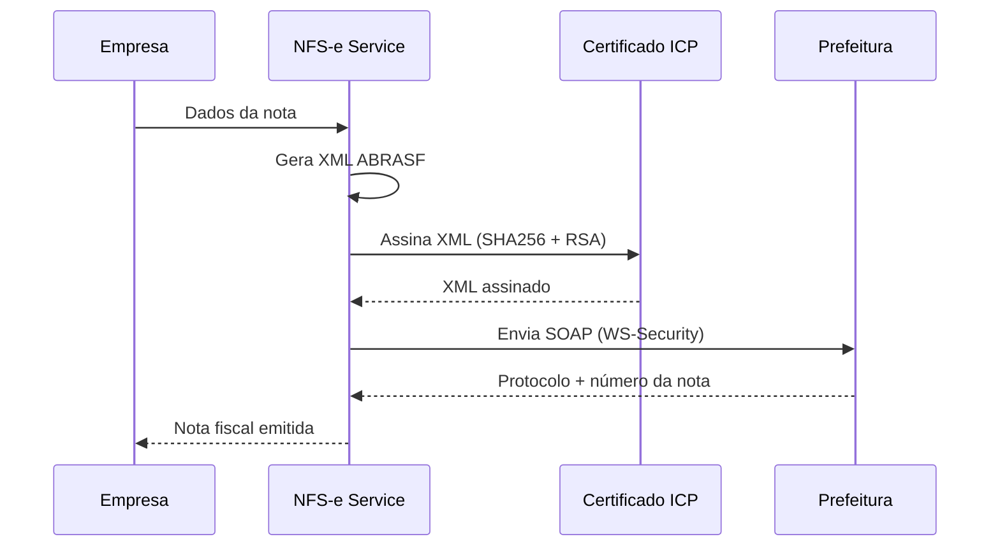

# Desafio 07: NFS-e — Nota Fiscal de Serviços Eletrônica

**🇧🇷** Integração com Nota Fiscal Eletrônica  
**🇬🇧** Electronic Invoice Integration

---

No Brasil, toda empresa de serviço precisa emitir NFS-e. Cada prefeitura tem seu próprio sistema, XML e SOAP. São **5.570 municípios**, cada um com implementação diferente do padrão ABRASF. O desafio não é emitir uma nota — é emitir em qualquer município sem enlouquecer.

## Switch: TypeScript vs Go

<LanguageToggle />

<div class="lang-content ts" style="display:block;">

### O que é NFS-e?

| Conceito | Descrição |
|----------|-----------|
| **ABRASF** | Padrão nacional para NFS-e (XML, SOAP, WSDL) |
| **Certificado A1/A3** | ICP-Brasil, não qualquer certificado |
| **ISS** | Imposto Sobre Serviços (varia por município) |
| **RPS** | Recibo Provisão de Serviço (pré-nota) |
| **NFS-e** | Nota emitida após processamento pela prefeitura |

### Fluxo Completo



### Desafios por Município

| Cidade | Particularidade |
|--------|-----------------|
| **São Paulo** | Padrão ABRASF 2.0, SSL mutual |
| **Rio de Janeiro** | WS-Security obrigatório |
| **Belo Horizonte** | XML com campos extras |
| **Curitiba** | WSDL customizado |
| **Salvador** | Certificado A3 obrigatório |

### XML ABRASF

```typescript
function buildNFSexml(data: NFSData): string {
  return `<?xml version="1.0" encoding="UTF-8"?>
<GerarNfseEnvio xmlns="http://www.abrasf.org.br/nfse">
  <Prestador>
    <Cnpj>${data.provider.cnpj}</Cnpj>
    <InscricaoMunicipal>${data.provider.municipalReg}</InscricaoMunicipal>
  </Prestador>
  <Servico>
    <Valores>
      <ValorServicos>${formatAmount(data.amount, data.cityCode)}</ValorServicos>
      <ValorIss>${calculateISS(data.amount, data.cityCode)}</ValorIss>
    </Valores>
    <ItemListaServico>${data.serviceCode}</ItemListaServico>
    <Discriminacao>${data.description}</Discriminacao>
    <CodigoMunicipio>${data.cityCode}</CodigoMunicipio>
  </Servico>
  <Tomador>
    <CpfCnpj>
      <Cnpj>${data.taker.cnpj}</Cnpj>
    </CpfCnpj>
    <RazaoSocial>${data.taker.name}</RazaoSocial>
  </Tomador>
</GerarNfseEnvio>`;
}
```

### Assinatura Digital com ICP-Brasil

```typescript
import { readFileSync } from 'fs';
import { createSign, createHash } from 'crypto';
import { Pkcs12 } from 'node-forge';

export class NFSeSigner {
  public signXml(xml: string, pfxPath: string, password: string): string {
    const pfxBuffer = readFileSync(pfxPath);
    const p12 = new Pkcs12(pfxBuffer, password);
    const privateKey = p12.getPrivateKey();
    const certificate = p12.getCertificate();

    const canonicalXml = this.canonicalize(xml);
    const digest = createHash('sha256').update(canonicalXml).digest('base64');

    const sign = createSign('RSA-SHA256').update(signedInfo).sign(privateKey);
    return xml.replace('</GerarNfseEnvio>', `${signature}</GerarNfseEnvio>`);
  }
}
```

### Comparação: TypeScript vs Go

| Aspecto | TypeScript | Go |
|---------|-----------|-----|
| **XML building** | Template literals | encoding/xml |
| **SOAP client** | node-fetch | net/http nativo |
| **Crypto ICP-Brasil** | node-forge | crypto/x509 nativo |
| **Performance** | ~1K notas/s | ~5K notas/s |
| **Memory** | ~100MB | ~20MB |

</div>

<div class="lang-content go" style="display:none;">

### XML Builder

```go
package nfse

import (
    "encoding/xml"
    "fmt"
)

type GerarNfseEnvio struct {
    XMLName   xml.Name `xml:"GerarNfseEnvio"`
    NS        string   `xml:"xmlns,attr"`
    Prestador Prestador
    Servico   Servico
    Tomador   Tomador
}

func BuildXML(data *NFSData) ([]byte, error) {
    envio := GerarNfseEnvio{
        NS: "http://www.abrasf.org.br/nfse",
        Prestador: Prestador{
            Cnpj:               data.ProviderCNPJ,
            InscricaoMunicipal: data.ProviderReg,
        },
        Servico: Servico{
            Valores:          Valores{ValorServicos: data.Amount, ValorIss: data.ISS},
            ItemListaServico: data.ServiceCode,
            Discriminacao:    data.Description,
            CodigoMunicipio:  data.CityCode,
        },
        Tomador: Tomador{
            CpfCnpj:    CpfCnpj{Cnpj: data.TakerCNPJ},
            RazaoSocial: data.TakerName,
        },
    }
    return xml.MarshalIndent(envio, "", "  ")
}
```

### SOAP Client

```go
func (c *SOAPClient) SendNFS(ctx context.Context, endpoint string, signedXML []byte) (*NFSResponse, error) {
    envelope := fmt.Sprintf(`<?xml version="1.0" encoding="UTF-8"?>
<soap12:Envelope xmlns:soap12="http://www.w3.org/2003/05/soap-envelope">
  <soap12:Body>
    <GerarNfse xmlns="http://www.abrasf.org.br/nfse">
      %s
    </GerarNfse>
  </soap12:Body>
</soap12:Envelope>`, string(signedXML))

    req, _ := http.NewRequestWithContext(ctx, "POST", endpoint, bytes.NewBufferString(envelope))
    req.Header.Set("Content-Type", "application/soap+xml; charset=utf-8")

    resp, err := c.httpClient.Do(req)
    if err != nil { return nil, err }
    defer resp.Body.Close()

    body, _ := io.ReadAll(resp.Body)
    var response NFSResponse
    xml.Unmarshal(body, &response)
    return &response, nil
}
```

### Benchmark

| Operação | TS | Go |
|----------|----|----|
| Build XML | 0.5ms | 0.1ms |
| Sign XML | 5ms | 1ms |
| SOAP send | 200ms | 180ms |
| Throughput | ~1K/s | ~5K/s |

</div>

---

## Como testar

```bash
# TypeScript
pnpm --filter @banking/nfse dev

# Go
cd packages/backend/nfse-go
go run .

# Emitir NFS-e
curl -X POST http://localhost:3008/nfse/emitir \
  -H "Content-Type: application/json" \
  -d '{"cnpj":"12345678000199","serviceCode":"1702","amount":1500.00,"cityCode":"3550308","taker":{"cnpj":"98765432000110","name":"Cliente LTDA"}}'
```

---

## Lições aprendidas

1. **5.570 municípios** — Cada um com implementação diferente do ABRASF
2. **Certificado ICP-Brasil** — Não é qualquer certificado
3. **XML é Sagrado** — Um campo a mais = rejeição
4. **SOAP varia por cidade** — WS-Security, mTLS, HTTPS simples
5. **ISS varia por município** — Alíquota diferente em cada lugar
6. **Go simplifica crypto** — Certificados ICP-Brasil na stdlib
7. **Template XML é perigoso** — Prefira encoding/xml
8. **Teste com certificado de homologação** — Nunca use A1 de produção
9. **Cache de WSDL** — Prefeituras mudam WSDL sem aviso
10. **Log de todas as notas** — Auditoria é obrigatória
