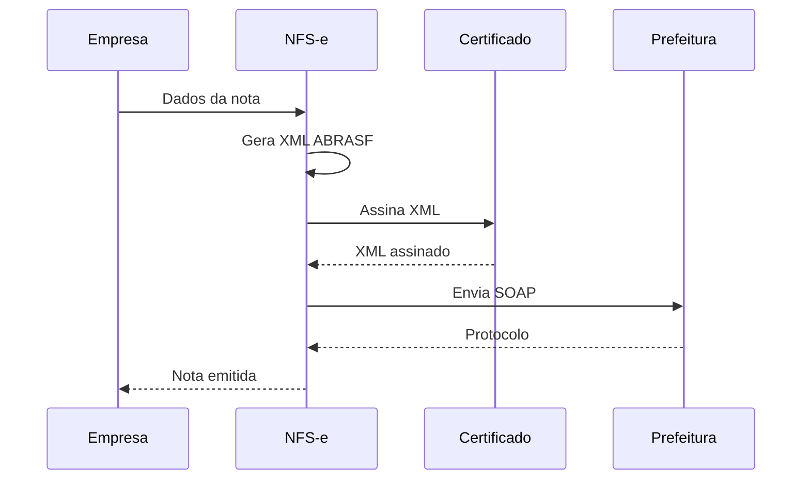

# 07 — NFS-e Integration

**🇧🇷** Integração com Nota Fiscal Eletrônica  
**🇬🇧** Electronic Invoice Integration

---

No Brasil, toda empresa de serviço precisa emitir NFS-e — Nota Fiscal de Serviços Eletrônica. Cada prefeitura tem seu próprio sistema, seu próprio XML, seu próprio SOAP. São 5.570 municípios, cada um com uma implementação diferente do padrão ABRASF.

O desafio não é emitir uma nota. É emitir uma nota em qualquer município sem enlouquecer.

Esse simulador implementa o padrão ABRASF 3.0: geração de XML, assinatura digital, envio SOAP, consulta e cancelamento.

---

## A arquitetura



---

## Resolução em TypeScript

### Geração de XML ABRASF

```typescript
function buildNFSexml(data: NFSData): string {
  return `<?xml version="1.0" encoding="UTF-8"?>
<GerarNfseEnvio xmlns="http://www.abrasf.org.br/nfse">
  <Prestador>
    <Cnpj>${data.provider.cnpj}</Cnpj>
    <InscricaoMunicipal>${data.provider.municipalReg}</InscricaoMunicipal>
  </Prestador>
  <Servico>
    <Valores>
      <ValorServicos>${data.amount.toFixed(2)}</ValorServicos>
      <ValorIss>${calculateISS(data.amount, data.cityCode)}</ValorIss>
    </Valores>
    <ItemListaServico>${data.serviceCode}</ItemListaServico>
    <Discriminacao>${data.description}</Discriminacao>
    <CodigoMunicipio>${data.cityCode}</CodigoMunicipio>
  </Servico>
  <Tomador>
    <CpfCnpj>
      <Cnpj>${data.taker.cnpj}</Cnpj>
    </CpfCnpj>
    <RazaoSocial>${data.taker.name}</RazaoSocial>
  </Tomador>
</GerarNfseEnvio>`;
}
```

### Envio SOAP

```typescript
import { createClientAsync } from 'soap';

async function emitNFS(data: NFSData): Promise<string> {
  const xml = buildNFSexml(data);
  const signedXml = await signXML(xml, certificate);
  
  const client = await createClientAsync(data.cityWsdl);
  
  const result = await client.GerarNfseAsync({ xml: signedXml });
  
  return result.NumeroNfse;
}
```

### Cálculo de impostos

```typescript
function calculateTaxes(amount: number, cityCode: string) {
  const issAliquota = getCityAliquota(cityCode); // 2-5%
  
  return {
    iss: amount * (issAliquota / 100),
    pis: amount * 0.015,       // 1.5% simplified
    cofins: amount * 0.069,    // 6.9% simplified
    ir: amount * 0.015,        // 1.5% simplified
    csll: amount * 0.01,       // 1% simplified
    totalTaxes: amount * (issAliquota / 100 + 0.015 + 0.069 + 0.015 + 0.01),
  };
}
```

---

## Resolução em Go

```go
package main

import (
    "crypto"
    "crypto/rand"
    "crypto/rsa"
    "crypto/sha256"
    "crypto/x509"
    "encoding/pem"
    "encoding/xml"
    "fmt"
    "net/http"
)

// ABRASF XML structure
type GerarNfseEnvio struct {
    XMLName  xml.Name `xml:"GerarNfseEnvio"`
    Prestador struct {
        Cnpj             string `xml:"Cnpj"`
        InscricaoMunicipal string `xml:"InscricaoMunicipal"`
    } `xml:"Prestador"`
    Servico struct {
        Valores struct {
            ValorServicos string `xml:"ValorServicos"`
            ValorIss      string `xml:"ValorIss"`
        } `xml:"Valores"`
        ItemListaServico string `xml:"ItemListaServico"`
        Discriminacao    string `xml:"Discriminacao"`
    } `xml:"Servico"`
}

func generateNFSXML(data NFSData) string {
    env := GerarNfseEnvio{}
    env.Prestador.Cnpj = data.Provider.CNPJ
    env.Prestador.InscricaoMunicipal = data.Provider.MunicipalReg
    env.Servico.Valores.ValorServicos = fmt.Sprintf("%.2f", data.Amount)
    env.Servico.Valores.ValorIss = fmt.Sprintf("%.2f", data.Amount*0.05)
    env.Servico.ItemListaServico = data.ServiceCode
    env.Servico.Discriminacao = data.Description
    
    xmlBytes, _ := xml.MarshalIndent(env, "", "  ")
    return string(xmlBytes)
}

func signXML(xmlContent string, privateKey *rsa.PrivateKey) (string, error) {
    hash := sha256.Sum256([]byte(xmlContent))
    signature, err := rsa.SignPKCS1v15(rand.Reader, privateKey, crypto.SHA256, hash[:])
    if err != nil {
        return "", err
    }
    
    // Wrap in XML signature
    signedXML := fmt.Sprintf(`<?xml version="1.0" encoding="UTF-8"?>
<SignedXml>
  <Signature xmlns="http://www.w3.org/2000/09/xmldsig#">
    <SignedInfo>
      <SignatureValue>%x</SignatureValue>
    </SignedInfo>
  </Signature>
  <XmlContent>%s</XmlContent>
</SignedXml>`, signature, xmlContent)
    
    return signedXML, nil
}
```

---

## Como testar

```bash
pnpm --filter @banking/nfse dev

curl -X POST http://localhost:3007/api/v1/nfse/emitter \
  -H "Content-Type: application/json" \
  -d '{"provider":{"cnpj":"12345678000195","municipalReg":"12345"},
       "amount":1500,"description":"Dev de software","cityCode":"3550308",
       "taker":{"cnpj":"98765432000195","name":"Empresa Ltda"}}'
```

---

## Lições aprendidas

1. **XML não morreu** — No governo brasileiro, XML é rei. SOAP, certificado digital, esquemas complexos. Quem acha que "só usa REST" nunca integrou com prefeitura.
2. **Cada município é um mundo** — São Paulo tem uma API. Rio tem outra. Belo Horizonte tem outra. O padrão ABRASF tenta unificar, mas cada cidade implementa do seu jeito.
3. **Certificado digital é obrigatório** — Sem A1 ou A3, nada funciona. A assinatura XML precisa ser válida para a prefeitura aceitar.
4. **ISS varia por cidade** — 2% em alguns municípios, 5% em outros. O cálculo errado gera nota inválida.
