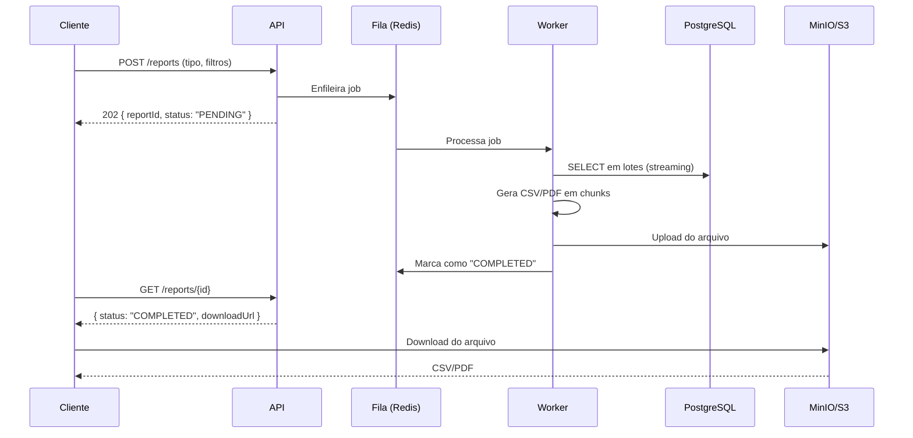
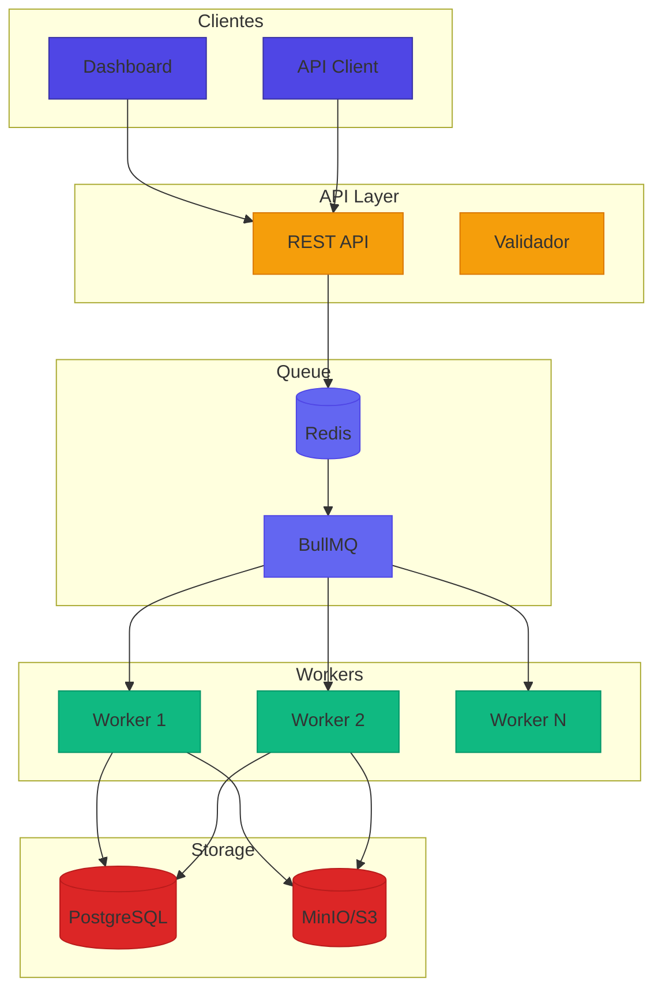

# Desafio 08: Report System — Geração de Relatórios em Escala

**🇧🇷** Sistema de Relatórios Financeiros  
**🇬🇧** Financial Report System

---

Gerar um CSV de 10 linhas é fácil. Gerar um relatório de 500 mil transações, em PDF, com gráficos, e entregar em 30 segundos — é outro nível. O problema é que você não pode carregar 500 mil registros na memória. A solução é **streaming**: consulta em lotes, gera em pedaços, sobe direto pro S3.

## Switch: TypeScript vs Go

<LanguageToggle />

<div class="lang-content ts" style="display:block;">

### O que é Report System?

| Conceito | Descrição |
|----------|-----------|
| **Streaming** | Consulta DB em lotes, gera arquivo em pedaços |
| **Assíncrono** | Cliente pede → recebe ID → faz download depois |
| **S3/MinIO** | Armazenamento do arquivo gerado |
| **Fila** | BullMQ/Redis para processamento em background |
| **Retry** | Retry com backoff para falhas |

### Fluxo Completo



### Arquitetura



### Domain — Report Entity

```typescript
export enum ReportStatus {
  PENDING = 'PENDING',
  PROCESSING = 'PROCESSING',
  COMPLETED = 'COMPLETED',
  FAILED = 'FAILED',
}

export enum ReportFormat {
  CSV = 'CSV',
  PDF = 'PDF',
  XLSX = 'XLSX',
  JSON = 'JSON',
}

export interface ReportProps {
  id: string;
  type: string;
  format: ReportFormat;
  status: ReportStatus;
  filters: Record<string, any>;
  fileUrl?: string;
  fileSize?: number;
  rowCount?: number;
  error?: string;
  createdBy: string;
  createdAt: Date;
  completedAt?: Date;
}

export class Report extends Entity<string> {
  public markProcessing(): void {
    this.props.status = ReportStatus.PROCESSING;
  }

  public complete(url: string, size: number, rows: number): void {
    this.props.status = ReportStatus.COMPLETED;
    this.props.fileUrl = url;
    this.props.fileSize = size;
    this.props.rowCount = rows;
    this.props.completedAt = new Date();
  }

  public fail(error: string): void {
    this.props.status = ReportStatus.FAILED;
    this.props.error = error;
  }

  public isExpired(): boolean {
    const hoursSinceCreation = (Date.now() - this.props.createdAt.getTime()) / (1000 * 60 * 60);
    return hoursSinceCreation > 24; // Expira em 24h
  }
}
```

### Streaming Worker

```typescript
export class ReportWorker {
  public async process(job: ReportJob): Promise<void> {
    const report = await this.reportRepo.findById(job.reportId);
    report.markProcessing();
    await this.reportRepo.update(report);

    try {
      const stream = await this.db.queryStream(
        this.buildQuery(report.type, report.filters)
      );

      const uploadId = await this.s3.initMultipartUpload(
        `reports/${report.id}.${report.format.toLowerCase()}`
      );

      let chunkNumber = 0;
      let rowCount = 0;
      const chunks: Buffer[] = [];

      for await (const row of stream) {
        chunks.push(this.formatRow(row, report.format));
        rowCount++;

        // A cada 1000 linhas, faz upload do chunk
        if (chunks.length >= 1000) {
          const chunk = Buffer.concat(chunks);
          await this.s3.uploadPart(uploadId, chunkNumber, chunk);
          chunks.length = 0;
          chunkNumber++;

          // Atualiza progresso
          await this.reportRepo.updateProgress(report.id, rowCount);
        }
      }

      // Upload do último chunk
      if (chunks.length > 0) {
        const chunk = Buffer.concat(chunks);
        await this.s3.uploadPart(uploadId, chunkNumber, chunk);
      }

      const fileUrl = await this.s3.completeMultipartUpload(uploadId);
      const fileSize = await this.s3.getFileSize(fileUrl);

      report.complete(fileUrl, fileSize, rowCount);
      await this.reportRepo.update(report);

      // Notifica cliente
      await this.notifier.notify(report.createdBy, {
        reportId: report.id,
        status: 'COMPLETED',
        downloadUrl: fileUrl,
      });
    } catch (error) {
      report.fail(error.message);
      await this.reportRepo.update(report);
      throw error;
    }
  }
}
```

### Comparação: TypeScript vs Go

| Aspecto | TypeScript | Go |
|---------|-----------|-----|
| **DB streaming** | pg cursor (ok) | database/sql + rows.Next() |
| **S3 upload** | aws-sdk (ok) | minio-go (nativo) |
| **PDF generation** | pdfkit, puppeteer | gofpdf, wkhtmltopdf |
| **CSV streaming** | csv-writer (ok) | encoding/csv nativo |
| **Concorrência** | Worker threads | Goroutines |
| **Memory** | ~200MB por worker | ~30MB por worker |
| **Throughput** | ~50K linhas/s | ~200K linhas/s |

### Casos Reais

- **Stitch (TypeScript)** — ETL em streaming
- **Apache Superset (Python)** — Dashboards
- **Apache Airflow (Python)** — Orquestração
- **Grafana (Go)** — Métricas e dashboards
- **Baserow (Python)** — Planilhas online

</div>

<div class="lang-content go" style="display:none;">

### Domain

```go
package domain

import (
    "errors"
    "time"
)

type ReportStatus string

const (
    ReportStatusPending    ReportStatus = "PENDING"
    ReportStatusProcessing ReportStatus = "PROCESSING"
    ReportStatusCompleted  ReportStatus = "COMPLETED"
    ReportStatusFailed     ReportStatus = "FAILED"
)

type ReportFormat string

const (
    ReportFormatCSV  ReportFormat = "CSV"
    ReportFormatPDF  ReportFormat = "PDF"
    ReportFormatXLSX ReportFormat = "XLSX"
)

type Report struct {
    ID          string
    Type        string
    Format      ReportFormat
    Status      ReportStatus
    Filters     map[string]interface{}
    FileURL     string
    FileSize    int64
    RowCount    int
    Error       string
    CreatedBy   string
    CreatedAt   time.Time
    CompletedAt *time.Time
}

func (r *Report) IsExpired() bool {
    return time.Since(r.CreatedAt) > 24*time.Hour
}

type ReportRepository interface {
    Save(ctx context.Context, r *Report) error
    FindByID(ctx context.Context, id string) (*Report, error)
    Update(ctx context.Context, r *Report) error
}
```

### Streaming Worker

```go
package worker

import (
    "context"
    "database/sql"
    "encoding/csv"
    "fmt"
    "bytes"
    "time"

    "github.com/minio/minio-go/v7"
    "go.uber.org/zap"
)

type ReportWorker struct {
    db        *sql.DB
    minio     *minio.Client
    reportRepo domain.ReportRepository
    logger    *zap.Logger
}

func (w *ReportWorker) Process(ctx context.Context, job ReportJob) error {
    report, err := w.reportRepo.FindByID(ctx, job.ReportID)
    if err != nil {
        return err
    }

    report.Status = domain.ReportStatusProcessing
    w.reportRepo.Update(ctx, report)

    // Query em streaming com cursor
    query := w.buildQuery(report.Type, report.Filters)
    rows, err := w.db.QueryContext(ctx, query)
    if err != nil {
        report.Status = domain.ReportStatusFailed
        report.Error = err.Error()
        w.reportRepo.Update(ctx, report)
        return err
    }
    defer rows.Close()

    // Cria arquivo no MinIO
    objectName := fmt.Sprintf("reports/%s.%s", report.ID, strings.ToLower(string(report.Format)))
    reader, writer := io.Pipe()

    go func() {
        defer writer.Close()
        csvWriter := csv.NewWriter(writer)

        cols, _ := rows.Columns()
        csvWriter.Write(cols)

        rowCount := 0
        for rows.Next() {
            values := make([]string, len(cols))
            valuePtrs := make([]interface{}, len(cols))
            for i := range values {
                valuePtrs[i] = &values[i]
            }
            rows.Scan(valuePtrs...)
            csvWriter.Write(values)
            rowCount++

            if rowCount%1000 == 0 {
                csvWriter.Flush()
            }
        }
        csvWriter.Flush()
    }()

    // Upload streaming
    contentType := "text/csv"
    if report.Format == domain.ReportFormatPDF {
        contentType = "application/pdf"
    }

    _, err = w.minio.PutObject(ctx, "reports", objectName, reader, -1,
        minio.PutObjectOptions{ContentType: contentType})
    if err != nil {
        report.Status = domain.ReportStatusFailed
        report.Error = err.Error()
        w.reportRepo.Update(ctx, report)
        return err
    }

    // Obtém tamanho
    stat, _ := w.minio.StatObject(ctx, "reports", objectName, minio.StatObjectOptions{})

    now := time.Now()
    report.Status = domain.ReportStatusCompleted
    report.FileURL = fmt.Sprintf("/reports/%s", objectName)
    report.FileSize = stat.Size
    report.CompletedAt = &now
    w.reportRepo.Update(ctx, report)

    w.logger.Info("Report completed",
        zap.String("report_id", report.ID),
        zap.Int("rows", report.RowCount),
        zap.Int64("size", report.FileSize),
    )

    return nil
}
```

### Benchmark

| Operação | TS | Go |
|----------|----|----|
| Query streaming | 50K rows/s | 200K rows/s |
| CSV generation | 30K rows/s | 150K rows/s |
| S3 upload | 50MB/s | 80MB/s |
| Memory por worker | ~200MB | ~30MB |

### Casos Reais

- **Grafana** (Go) — Dashboards em tempo real
- **Prometheus** (Go) — Métricas e relatórios
- **CockroachDB** (Go) — Query streaming nativo
- **Baserow** (Python) — Planilhas online

</div>

---

## Como testar

```bash
# TypeScript
pnpm --filter @banking/report-system dev

# Go
cd packages/backend/report-system-go
go run .

# Criar relatório
curl -X POST http://localhost:3009/reports \
  -H "Content-Type: application/json" \
  -d '{"type":"transactions","format":"CSV","filters":{"startDate":"2024-01-01","endDate":"2024-12-31"}}'

# Consultar status
curl http://localhost:3009/reports/{id}

# Download
curl -O http://localhost:3009/reports/{id}/download
```

---

## Lições aprendidas

1. **Nunca SELECT * INTO MEMORY** — Streaming sempre
2. **Assíncrono é必修** — Cliente nunca espera geração
3. **Upload multipart** — Arquivos grandes em chunks
4. **Retry com backoff** — S3 pode falhar
5. **Expire relatórios** — 24h, senão storage explode
6. **Progress updates** — Cliente quer saber o progresso
7. **Go é 4x mais rápido** — Para streaming e CSV
8. **MinIO é S3-compatible** — Local e cloud
9. **PDF com wkhtmltopdf** — HTML → PDF confiável
10. **Metrics por tipo** — Sabe quais relatórios são pesados
