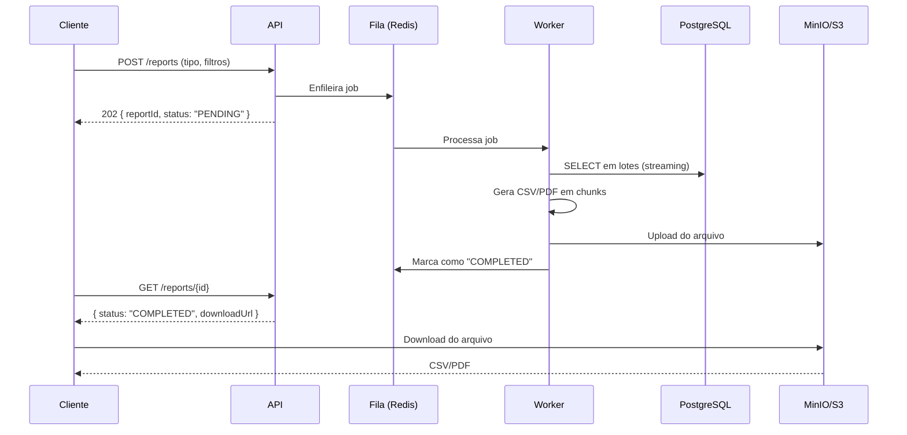
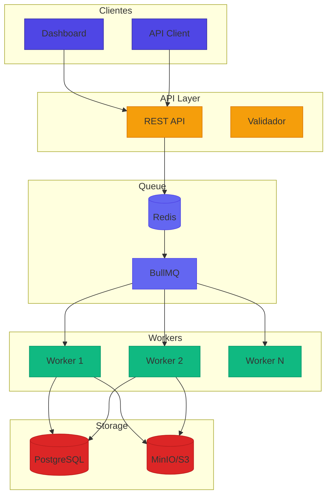
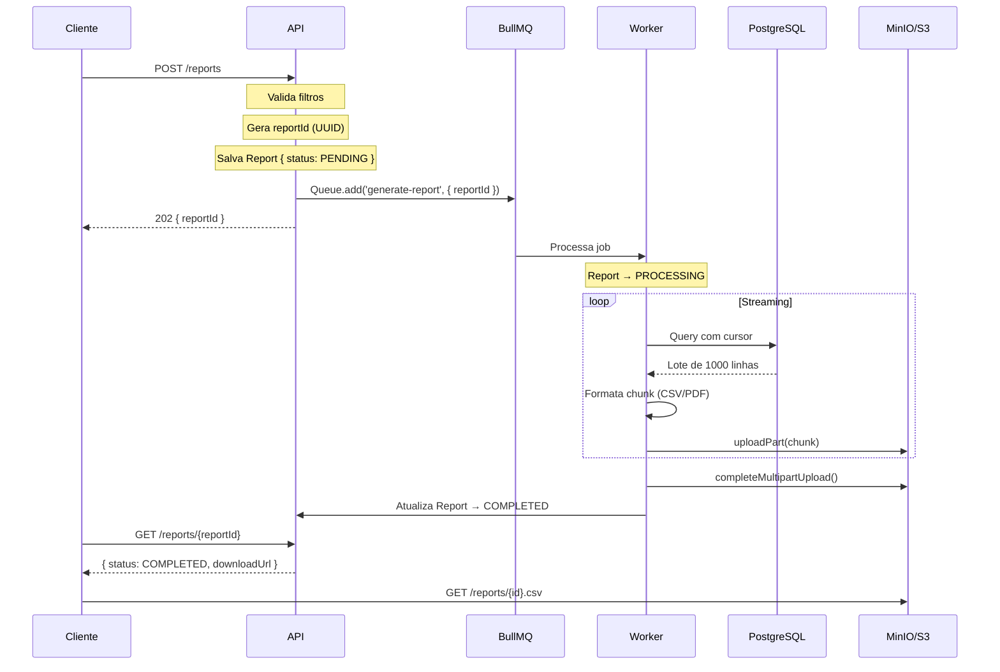

# Desafio 08: Report System — Geração de Relatórios em Escala

**🇧🇷** Sistema de Relatórios Financeiros  
**🇬🇧** Financial Report System

---

## 🎯 Objetivos de Aprendizado

- Implementar geração de relatórios via streaming (sem carregar tudo em memória)
- Projetar jobs assíncronos com fila BullMQ/Redis
- Dominar multipart upload para S3/MinIO
- Entender o padrão 202 Accepted + polling assíncrono
- Comparar performance TypeScript vs Go para processamento de dados pesados

---

## 📋 Pré-requisitos

### 🧠 Conceitos
- Geração de relatórios (PDF, CSV, Excel)
- Template engines (Handlebars, EJS)
- Job scheduling (cron)
- Streaming de dados

### 📚 Desafios Anteriores
- [Desafio 01: Ledger](/challenges/01-ledger) — os dados do ledger são a fonte primária dos relatórios

### 🛠️ Ferramentas
- Docker
- Puppeteer/Chromium
- PostgreSQL
- AWS S3 (ou MinIO local)

### 💻 Técnico
- TypeScript, Node.js 20+
- Streaming (Node.js Streams)
- Job queues (BullMQ)
- Template engines

---

## 📖 Abertura — O Problema dos Relatórios em Escala

"E bom entender uma coisa. gerar um CSV de 10 linhas é trivial. `SELECT * FROM transactions` + `fs.writeFile` e pronto. Agora gera um relatório de 500 mil transações financeiras, em PDF, com gráfico de pizza dos gastos por categoria, e entrega em menos de 30 segundos — aí a brincadeira muda de figura.

O problema número um é memória. 500 mil registros no Node.js — cada um com id, data, valor, tipo, descrição — são uns 100MB de objeto. Se dois gerentes de compliance pedem relatório ao mesmo tempo, são 200MB. O servidor vai pro chão sem você nem entender por quê.

O problema número dois é timeout. Uma query que retorna 500 mil linhas leva segundos pra completar. O cliente HTTP — que tem timeout de 30 segundos — já desistiu. Você ficou processando atoa.

O problema número três é retry. O cliente deu timeout e tentou de novo. Agora você tem duas queries de 500 mil rodando ao mesmo tempo. O banco começa a gritar.

A solução?

1. **Streaming** — Consulta o banco em lotes, processa em pedaços, nunca carrega tudo
2. **Assíncrono** — Cliente recebe 202 Accepted com um ID, faz polling depois
3. **Fila** — Processamento em background com retry e controle de concorrência
4. **S3 multipart upload** — Sobe o arquivo em chunks enquanto gera

Esse desafio é sobre construir esse pipeline de relatórios. Não com planilha Excel, não com script Python de uma vez só, mas com TypeScript, fila, S3 e streaming — porque 500 mil linhas não cabem na memória de ninguém."

A história dos sistemas de relatório em bancos é longa e fascinante. Lá atrás, nos anos 90, bancos inteiros rodavam seus extratos e comprovantes usando **Crystal Reports** — uma ferramenta visual de arrastar e soltar que gerava PDFs e imprimia direto na impressora matricial. Todo gerente de TI de banco tinha um cara que só fazia isso: abrir o Crystal, arrastar os campos de saldo, data e descrição, clicar em "Generate" e esperar 20 minutos enquanto a impressora cuspia 300 páginas de extrato mensal. Era um trabalho mecânico, manual, repetitivo, e absolutamente crítico para o funcionamento do banco.

Aí vieram os anos 2000 e o open source entrou no jogo. **JasperReports** e **BIRT** (Business Intelligence and Reporting Tools) dominaram o mercado Java corporativo. Eram engines de template que compilavam layouts XML em relatórios PDF, HTML, XLS e CSV. O fluxo típico: o analista desenhava o layout no iReport (um GUI feito em Swing), exportava um `.jrxml`, e o backend Java compilava esse arquivo em runtime, injetava os dados via JDBC, e gerava o relatório final. Funcionava bem para 50 mil registros. Para 500 mil, o `OutOfMemoryError` era inevitável — porque toda engine de template Java da época materializava o dataset inteiro em memória antes de paginar.

Quando os bancos digitais explodiram no Brasil (Nubank, Inter, C6, Neon), o jogo mudou completamente. Agora o cliente quer extrato em PDF no app, na hora, com gráfico de gastos por categoria igual ao do app. A fatura do Nubank é um exemplo perfeito: ela é renderizada como HTML/CSS puro, convertida para PDF via headless Chrome, com fontes customizadas, cores da marca, e gráficos SVG inline. Tudo gerado sob demanda quando o cliente aperta "Baixar fatura". Isso é ordem de magnitude mais complexo do que um Crystal Reports da vida — porque é HTML dinâmico, com CSS grid, fonte Inter, e gráfico de pizza renderizado via D3.js antes de ir pro PDF.

O Inter foi além: o **Open Finance Dashboard** deles exige relatórios consolidados de múltiplas instituições financeiras em tempo real. O cliente conecta contas de outros bancos, e o Inter precisa gerar um relatório unificado com todas as transações, categorizadas, dos últimos 12 meses. Isso é um problema de streaming distribuído: cada banco tem seu próprio formato de dados, seu próprio encoding, e seu próprio timeout de API. Consolidar isso em um único CSV ou PDF sem estourar memória é um trabalho de engenharia de dados em escala.

E não podemos esquecer dos bancos tradicionais. Itaú, Bradesco, Santander — eles ainda geram milhões de PDFs de extrato mensalmente, muitos deles usando sistemas legados em COBOL que chamam scripts Perl ou Python para converter arquivos texto de mainframe em PDF. É um ecossistema híbrido bizarro: o core banking gera um arquivo `.txt` posicional de 2GB, um script Perl lê linha a linha e monta HTML via template, e um wkhtmltopdf converte para PDF final. Funciona há 20 anos. Mas não escala para real-time.

Hoje, em 2024–2026, o estado da arte é **streaming + headless browser + job queue + object storage**. Você não gera mais relatório em modo síncrono. Você aceita a requisição, enfia numa fila, processa em background com streaming de banco, sobe o arquivo para S3/MinIO em chunks via multipart upload, e notifica o cliente quando estiver pronto. Esse é o padrão que você vai construir neste desafio.

---

## 🔥 O Problema

Imagine que você está construindo o backend de um sistema financeiro. Chegou a hora de gerar o relatório mensal de transações para o compliance. No começo, é simples:

```typescript
const transactions = await Transaction.find(filters); // Carrega TUDO
const csv = transactions.map(t => `${t.id},${t.amount},${t.type}`).join('\n');
res.send(csv);
```

Funciona. Até que seu sistema cresce:

1. **Memória explode** — 100 mil transações tranquilas. 500 mil já dá 100MB+ no heap. 1 milhão é crash certo.

2. **Timeout do cliente** — O cliente HTTP esperou 60 segundos e tomou `504 Gateway Timeout`. O usuário não sabe se gerou ou não. Tentou de novo. Agora você tem dois relatórios rodando.

3. **PDF é pesado** — Converter 500 mil linhas pra PDF com puppeteer ou wkhtmltopdf carrega o HTML inteiro em memória antes de gerar. É o pior dos dois mundos.

4. **Sem progresso** — O usuário fica olhando pra tela sem saber se vai dar certo. Experiência terrível.

5. **Retry duplica** — Cliente reenviou a request, você gerou o mesmo relatório duas vezes, storage lotou.

Cada um desses problemas tem solução: **streaming com cursor de banco**, **job queue assíncrona**, **multipart upload pro S3**, e **idempotência com idempotency key**.

Agora, se você acha que CSV é o pior caso, experimenta gerar PDF em larga escala. O problema do PDF é triplo: **memória, fontes, e encoding**. Para gerar um PDF de 500 mil transações, você precisa primeiro renderizar um HTML gigantesco em memória, depois passar isso por um browser headless que vai alocar ainda mais memória para o DOM, depois o motor de layout (Blink/WebKit) vai calcular posições de cada elemento, e só então gerar o PDF final. Um PDF de 500 mil linhas pode facilmente consumir **2–3GB de RAM** durante a renderização. Se você tem 3 workers rodando em paralelo, são 9GB. A conta não fecha em servidores com 8GB de RAM.

E tem as fontes. Relatórios financeiros no Brasil usam acentuação pesada: "Não é possível estornar a transação nº 123.456/7890-01 realizada em 31/12/2024 — débito automático". Se a fonte não tem suporte a caracteres latinos estendidos (ç, ã, õ, é, ô), o PDF sai com quadradinhos ou caracteres trocados. Fontes como **Roboto, Inter, e Noto Sans** têm cobertura completa, mas precisam ser embedadas no PDF. Fontes do sistema operacional (Arial, Times New Roman no Windows) podem não estar disponíveis no container Docker Debian/Ubuntu onde seu worker roda. Resultado: PDF com fallback para fonte serif genérica que não suporta acentos.

Exportação CSV e Excel no Brasil tem outro pesadelo: **encoding**. Um CSV gerado com `fs.writeFile` em Node.js sai em UTF-8. O Excel brasileiro, quando você dá duplo clique, assume **Windows-1252** (ou pior, **ISO-8859-1**) e corrompe todos os acentos. O CPF "123.456.789-00" vira "123.456.789-00" (ok), mas o nome "João da Conceição" vira "João da Conceição". A solução é colocar **BOM (Byte Order Mark)** no início do CSV ou gerar como XLSX verdadeiro com a biblioteca `exceljs`, que escreve XML zipado com encoding correto.

E tem o problema do **agendamento**. Relatórios de compliance não são sob demanda — eles rodam em horários fixos: todo dia 1º às 6h da manhã, o relatório de fechamento mensal do mês anterior é gerado automaticamente. Se você implementa isso com `cron` simples e o job demora 2 horas, o próximo tick do cron (que dispara 1 minuto depois) vai iniciar outro job idêntico, e você tem dois relatórios do mesmo mês rodando em paralelo. A solução é usar o **scheduler do BullMQ** com `repeatable jobs` e um lock distribuído: o próprio Redis garante que o mesmo job agendado só rode uma vez.

Timeout é o maior vilão. Um relatório pesado — digamos, todas as transações de um banco inteiro nos últimos 6 meses — pode levar horas para ser gerado. Se o seu gateway (NGINX, HAProxy, API Gateway) tem timeout de 60 segundos, a conexão HTTP cai, o processo worker continua rodando inutilmente, e o cliente nunca recebe o resultado. Por isso o padrão **202 Accepted** é sagrado: você devolve imediatamente, e o cliente faz polling ou recebe um webhook quando terminar.

---

## 🏗️ Arquitetura Geral

<LanguageToggle />

<div class="Lang-content ts" style="Display:block;">

### Visão Macro





### Os Conceitos

| Conceito | Descrição |
|----------|-----------|
| **Streaming** | Consulta DB em lotes, gera arquivo em pedaços |
| **Assíncrono** | Cliente pede → recebe ID → faz download depois |
| **S3/MinIO** | Armazenamento do arquivo gerado |
| **Fila** | BullMQ/Redis para processamento em background |
| **Retry** | Retry com backoff para falhas |

### A Stack

Koa ou Fastify pra API, BullMQ pra fila, `aws-sdk` pra S3, `pg` ou `sequelize` pra streaming do PostgreSQL, `pdfkit` ou `puppeteer` pra PDF. Tudo TypeScript.

> **Por que BullMQ?** — Redis é rápido, BullMQ dá job scheduling, retry automático, rate limiting, e concorrência controlada. Você define quantos workers rodam em paralelo, quantas tentativas por job, e o que fazer em caso de falha.

### Fluxo de uma Requisição



---

## 👨‍💻 Mão na Massa

"Bora codar. O bagulho é o seguinte: você precisa gerar relatório sem entupir a memória do servidor. Um relatório de 500 mil transações não pode custar 100MB de RAM. A solução é streaming + multipart upload. Vou te mostrar como."

### Modelo de Dados

Primeiro, a entidade `Report`:

```typescript
export enum ReportStatus {
  PENDING = 'PENDING',
  PROCESSING = 'PROCESSING',
  COMPLETED = 'COMPLETED',
  FAILED = 'FAILED',
}

export enum ReportFormat {
  CSV = 'CSV',
  PDF = 'PDF',
  XLSX = 'XLSX',
  JSON = 'JSON',
}

export interface ReportProps {
  id: string;
  type: string;
  format: ReportFormat;
  status: ReportStatus;
  filters: Record<string, any>;
  fileUrl?: string;
  fileSize?: number;
  rowCount?: number;
  error?: string;
  createdBy: string;
  createdAt: Date;
  completedAt?: Date;
}

export class Report extends Entity<string> {
  public markProcessing(): void {
    this.props.status = ReportStatus.PROCESSING;
  }

  public complete(url: string, size: number, rows: number): void {
    this.props.status = ReportStatus.COMPLETED;
    this.props.fileUrl = url;
    this.props.fileSize = size;
    this.props.rowCount = rows;
    this.props.completedAt = new Date();
  }

  public fail(error: string): void {
    this.props.status = ReportStatus.FAILED;
    this.props.error = error;
  }

  public isExpired(): boolean {
    const hoursSinceCreation = (Date.now() - this.props.createdAt.getTime()) / (1000 * 60 * 60);
    return hoursSinceCreation > 24;
  }
}
```

**Duas decisões importantes:**

1. **`status` como enum** — `PENDING → PROCESSING → COMPLETED | FAILED`. Cada transição é visível pro cliente via polling. Ele vê o progresso em tempo real.

2. **`isExpired()` com 24 horas** — Relatório não pode ficar pra sempre no storage. 24h é o prazo padrão. Depois disso, o `cleanup worker` apaga do S3. Isso impede que o bucket exploda.

Vamos falar de **template engines para relatórios financeiros**. Você tem três famílias principais: **Handlebars, EJS, e Pug**. Cada uma tem seu lugar. Handlebars é a mais segura para geração de HTML que vai virar PDF — é logic-less por design, ou seja, você não consegue injetar lógica complexa no template. Isso é uma vantagem, não uma limitação: templates de relatório devem ser puramente declarativos. EJS e Pug permitem JavaScript inline no template, o que é poderoso mas perigoso — um dev pode colocar uma query de banco dentro do template e destruir a performance.

Para o nosso caso, **Handlebars + puppeteer** é a combinação vencedora. O Handlebars renderiza o HTML com partials reutilizáveis (cabeçalho, rodapé, tabela de transações, gráfico), e o puppeteer converte esse HTML para PDF com controle preciso de margens, orientação da página, e cabeçalho/rodapé repetidos em todas as páginas.

Agora, a grande decisão arquitetural: **wkhtmltopdf vs Puppeteer/Playwright (headless Chrome)**. O wkhtmltopdf é um binário de 30MB baseado no Qt WebKit. Ele é rápido, leve, e não precisa de um Chrome inteiro. Mas o WebKit dele é antigo — não suporta CSS Grid, não suporta flexbox direito, não renderiza fontes via `@font-face` de forma confiável. Para relatórios simples (tabela preto e branco, fonte Arial), ele é perfeito. Para relatórios modernos com o branding do banco, gráficos SVG, e fontes customizadas, você precisa do headless Chrome. O Puppeteer consome mais recursos (Chromium + ~300MB de RAM por instância), mas a qualidade do PDF é impecável.

Falando em Puppeteer: o truque para PDF de relatório financeiro não é só `page.pdf()`. Você precisa de:

1. **`page.waitForSelector()` ou `page.waitForNetworkIdle()`** — garantir que todos os gráficos (D3.js, Chart.js) terminaram de renderizar antes de disparar o PDF
2. **`page.emulateMediaType('screen')`** — o padrão é `print`, que pode esconder cores de fundo definidas via CSS `@media print`
3. **Controle preciso de page breaks** — `page-break-before: always`, `page-break-inside: avoid` no CSS para não cortar uma linha de tabela no meio
4. **Header/Footer template** — HTML separado que o Chrome repete em cada página (número da página, data de geração, logo do banco)

Outro ponto: **progress tracking em tempo real**. O cliente não quer esperar 3 minutos olhando para uma tela branca. Ele quer ver "Processando lote 147 de 500 (147.000 / 500.000 linhas)". Para isso, você atualiza o progresso no Redis a cada lote:

```typescript
// Dentro do worker, a cada lote processado:
await redis.set(
  `report:progress:${reportId}`,
  JSON.stringify({ processed: rowCount, estimatedTotal: estimatedTotal }),
  'EX',
  3600
);
```

E o endpoint de status:

```typescript
router.get('/reports/:id', async (ctx) => {
  const report = await reportRepo.findById(ctx.params.id);
  const progress = await redis.get(`report:progress:${ctx.params.id}`);
  ctx.body = {
    ...report,
    progress: progress ? JSON.parse(progress) : null,
  };
});
```

Isso é o que separa um sistema de relatório amador de um profissional. O usuário vê o progresso, sabe que está funcionando, e não desiste e tenta de novo (causando retry duplicado).

### Streaming Worker

"Aqui é onde o bicho pega. O worker precisa consultar o banco em streaming — nunca carregando tudo. A cada 1000 linhas, faz upload de um chunk pro S3."

```typescript
export class ReportWorker {
  public async process(job: ReportJob): Promise<void> {
    const report = await this.reportRepo.findById(job.reportId);
    report.markProcessing();
    await this.reportRepo.update(report);

    try {
      const stream = await this.db.queryStream(
        this.buildQuery(report.type, report.filters)
      );

      const uploadId = await this.s3.initMultipartUpload(
        `reports/${report.id}.${report.format.toLowerCase()}`
      );

      let chunkNumber = 0;
      let rowCount = 0;
      const chunks: Buffer[] = [];

      for await (const row of stream) {
        chunks.push(this.formatRow(row, report.format));
        rowCount++;

        // A cada 1000 linhas, faz upload do chunk
        if (chunks.length >= 1000) {
          const chunk = Buffer.concat(chunks);
          await this.s3.uploadPart(uploadId, chunkNumber, chunk);
          chunks.length = 0;
          chunkNumber++;

          // Atualiza progresso
          await this.reportRepo.updateProgress(report.id, rowCount);
        }
      }

      // Upload do último chunk
      if (chunks.length > 0) {
        const chunk = Buffer.concat(chunks);
        await this.s3.uploadPart(uploadId, chunkNumber, chunk);
      }

      const fileUrl = await this.s3.completeMultipartUpload(uploadId);
      const fileSize = await this.s3.getFileSize(fileUrl);

      report.complete(fileUrl, fileSize, rowCount);
      await this.reportRepo.update(report);

      // Notifica cliente
      await this.notifier.notify(report.createdBy, {
        reportId: report.id,
        status: 'COMPLETED',
        downloadUrl: fileUrl,
      });
    } catch (error) {
      report.fail(error.message);
      await this.reportRepo.update(report);
      throw error;
    }
  }
}
```

**Três decisões de design:**

- **`for await...of` no stream** — A sintaxe `for await` consome o cursor do PostgreSQL linha a linha, mas sem nunca materializar o result set inteiro. O driver do `pg` faz isso com `Cursor` do protocolo nativo — cada `next()` busca um lote do backend e descarta o anterior.

- **Multipart upload a cada 1000 linhas** — Cada chunk é independente. Se o worker cair no chunk 5 de 10, o retry começa do chunk 5, não do zero. O `uploadId` do S3 mantém o estado.

- **`updateProgress`** — O cliente pode ver quantas linhas já foram processadas. Em relatórios de 1 milhão de linhas, isso é essencial pra experiência.

Vamos aprofundar na **queue de jobs com BullMQ**. A configuração não é trivial. Você precisa decidir:

1. **Quantos workers?** — Muito worker satura o banco de dados (cada um abre uma conexão e faz streaming). Pouco worker gera fila infinita. A regra de ouro: 1 worker por CPU core. Se a máquina tem 4 cores, rode 4 workers. Se o banco é o gargalo (e geralmente é), limite a 2 workers.

2. **Concorrência por worker** — Mesmo com 1 worker, você pode processar N jobs em paralelo usando `limiter` no BullMQ. Mas cuidado: se cada job faz streaming do banco, 5 jobs em paralelo = 5 cursores abertos = 5 conexões pesadas. Melhor deixar `concurrency: 1` e escalar horizontalmente (mais workers em mais máquinas).

3. **Rate limiting da fila** — BullMQ tem `limiter` nativo: você pode limitar a X jobs por segundo, ou X jobs por worker. Para relatórios, limite a 2 jobs simultâneos no total, independentemente do número de workers:

```typescript
import { Queue, Worker } from 'bullmq';

const reportQueue = new Queue('reports', {
  connection: redisConnection,
});

const worker = new Worker('reports', processReportJob, {
  connection: redisConnection,
  concurrency: 1,
  limiter: {
    max: 2,        // máximo de 2 jobs simultâneos
    duration: 1000, // por segundo (mas na prática é "Por worker")
  },
});
```

O `limiter` do BullMQ é um token bucket: ele só permite `max` jobs ativos ao mesmo tempo. Se um terceiro job entra na fila, ele espera até um dos dois ativos terminar. Isso protege seu banco de dados.

Agora, um detalhe sutil sobre **streaming de CSV com encoding brasileiro**. Se você simplesmente usa `csv-writer` ou `fast-csv`, o arquivo sai em UTF-8. O Excel brasileiro, ao abrir via duplo clique, interpreta como ANSI (Windows-1252) e corrompe acentos. A correção é adicionar o **BOM (Byte Order Mark)** no início do stream:

```typescript
import { createWriteStream } from 'fs';
import { format } from '@fast-csv/format';

const bom = Buffer.from([0xEF, 0xBB, 0xBF]); // UTF-8 BOM
const writeStream = createWriteStream('relatorio.csv');
writeStream.write(bom);

const csvStream = format({ headers: true, delimiter: ';' }); // ponto-e-vírgula pro Excel BR
csvStream.pipe(writeStream);

for await (const row of dbStream) {
  csvStream.write(row);
}
csvStream.end();
```

Três truques brasileiros nesse snippet: **BOM** (obrigatório para Excel), **delimiter `;`** (Excel brasileiro usa ponto-e-vírgula porque a vírgula é separador decimal no Brasil — R$ 1.234,56), e **nunca usar `,` como delimitador** porque valores monetários como "1.234,56" confundiriam o parser.

O `pg-cursor` do Node.js merece uma menção especial. Ele implementa o protocolo de cursor do PostgreSQL: em vez de `SELECT *` e receber todas as linhas de uma vez, você declara um cursor (`DECLARE c CURSOR FOR SELECT ...`) e depois itera com `FETCH 1000 FROM c`. Cada `FETCH` retorna apenas 1000 linhas. O driver gerencia isso transparentemente com `for await...of`. Mas há um custo: cada `FETCH` é uma round-trip de rede. Se sua latência para o banco é 5ms, 500 batches de 1000 linhas = 2.5 segundos só de latência de rede. Por isso, o tamanho do batch é um trade-off: batch pequeno = menos memória, mais round-trips. Batch grande = mais memória, menos round-trips. O sweet spot para a maioria dos casos é entre 1000 e 5000 linhas por batch.

---

## 🧠 A Profundidade

### Por que Streaming?

"Presta atencao. deixa eu te contar uma história. Lá em 2015, quando eu trabalhava num sistema de compliance, a diretora financeira pedia um relatório de transações suspeitas. 'Precisa pra ontem', ela dizia. O sistema carregava 3 meses de transações — 800 mil registros — na memória. O servidor tinha 512MB de RAM.

O resultado? Out Of Memory Killer mandava o Node pro espaço. A diretora financeira ficava sem relatório. E quem levava a culpa era o desenvolvedor — eu.

A lição é simples: nunca, jamais, em hipótese nenhuma, carregue um volume desconhecido de dados na memória de uma aplicação web. Não importa se é Node, Go, Java ou Rust. Uma hora o volume passa do limite da máquina."

**O padrão correto:**

```
1. Cliente POST → API → 202 Accepted (reportId)
2. Cliente faz polling: GET /reports/{reportId}
3. Worker consome da fila:
   a. Abre cursor no banco (SELECT com streaming)
   b. Para cada lote de N linhas → formata → S3 multipart upload
   c. Quando acabar → completa multipart → marca como COMPLETED
4. Cliente vê status COMPLETED → faz download direto do S3
```

### Por que Multipart Upload?

Arquivos grandes no S3 têm dois problemas:

1. **Timeout** — Um upload de 500MB pode levar minutos. A conexão TCP cai, você perde tudo e precisa recomeçar.

2. **Sem progresso** — Você não sabe quanto já subiu.

Multipart upload resolve os dois:

```typescript
// Inicia
const { UploadId } = await s3.createMultipartUpload({ Bucket, Key });

// Sobe cada chunk independente
const parts = [];
for (let i = 0; i < totalChunks; i++) {
  const { ETag } = await s3.uploadPart({
    Bucket, Key, UploadId, PartNumber: i + 1,
    Body: chunkBuffer,
  });
  parts.push({ ETag, PartNumber: i + 1 });
}

// Finaliza
await s3.completeMultipartUpload({ Bucket, Key, UploadId, MultipartUpload: { Parts: parts } });
```

Cada `uploadPart` pode ser reenviado independentemente. Se o chunk 5 falhou, você só retenta o chunk 5. O estado é mantido pelo `UploadId` no S3.

### Fila vs Thread vs setTimeout

Três formas de rodar em background:

| Abordagem | Prós | Contras |
|-----------|------|---------|
| `setTimeout` / `setImmediate` | Simples | Morre com o processo. Sem retry. Sem visibilidade. |
| Worker Thread (`worker_threads`) | Isolamento real | Gerencia complexa. Sem fila persistente. |
| BullMQ (Redis) | Persistente, retry, rate limit, progresso, visibilidade | Dependência de Redis |

**Sempre escolha BullMQ.** SetTimeout é pra lembretes de 5 minutos, não pra processamento de relatório. Worker thread não sobrevive a restart do servidor. BullMQ com Redis persiste o job no disco — se o worker cai, outro pega.

### Idempotência do Lado do Cliente

O cliente não pode gerar o mesmo relatório duas vezes. A solução é idempotency key:

```typescript
async function createReport(clientId: string, idempotencyKey: string) {
  const existing = await redis.get(`idempotency:${idempotencyKey}`);
  if (existing) return JSON.parse(existing);

  const report = await reportService.create(clientId /* ... */);
  await redis.set(`idempotency:${idempotencyKey}`, JSON.stringify(report), 'EX', 86400);
  return report;
}
```

A chave é o hash dos filtros + tipo. Mesmo filtro sempre retorna o mesmo relatório — sem duplicar, sem gerar de novo.

Vamos ao que interessa: **Puppeteer em escala**. Gerar um PDF é caro. Gerar 100 PDFs simultâneos é inviável com uma instância única do Chromium. A solução é **puppeteer-cluster** — uma biblioteca que gerencia múltiplas instâncias do Chromium em paralelo, com fila de jobs, retry, e monitoramento de memória:

```typescript
import { Cluster } from 'puppeteer-cluster';

const cluster = await Cluster.launch({
  concurrency: Cluster.CONCURRENCY_BROWSER, // 1 browser por job
  maxConcurrency: 4,                         // máximo 4 browsers simultâneos
  puppeteerOptions: {
    headless: 'new',
    args: [
      '--no-sandbox',
      '--disable-setuid-sandbox',
      '--disable-dev-shm-usage',             // usa /tmp em vez de /dev/shm
      '--disable-gpu',
      '--font-render-hinting=none',          // evita variação de fonte entre SOs
    ],
  },
  timeout: 60000,                            // 60s timeout por job
  retryLimit: 3,                             // retenta 3 vezes em caso de crash
  retryDelay: 5000,
});

await cluster.task(async ({ page, data: { html, options } }) => {
  await page.setContent(html, { waitUntil: 'networkidle0' });
  return await page.pdf({
    format: 'A4',
    margin: { top: '20mm', bottom: '20mm', left: '15mm', right: '15mm' },
    printBackground: true,
    displayHeaderFooter: true,
    headerTemplate: options.headerTemplate,
    footerTemplate: options.footerTemplate,
    ...options,
  });
});
```

O `puppeteer-cluster` faz algo crucial: **isolamento de processo**. Cada job roda em seu próprio browser, então se um PDF de 500 páginas travar o renderizador, os outros 3 browsers continuam processando normalmente. Sem cluster, um crash do Chromium derruba todos os jobs em andamento.

**Memory management em Node.js para processamento de dados** é uma arte. O V8 tem heap limitado por padrão a ~1.4GB em máquinas 64-bit. Para relatórios, isso é pouco. Algumas estratégias:

1. **`--max-old-space-size=4096`** — Aumenta o heap do V8 para 4GB. Use apenas como último recurso, porque o garbage collector fica mais lento com heaps maiores.
2. **Streams, não buffers** — `Buffer.concat(chunks)` no worker acima acumula 1000 linhas em memória. Para CSV isso é ok (1000 linhas = ~200KB). Para PDF via Puppeteer, você precisa de streaming de verdade com `stream.PassThrough`.
3. **Descarte explícito** — `chunks.length = 0` no nosso worker é um truque sujo mas eficaz: zera o array para o GC coletar os buffers antigos. Sem isso, o array cresce indefinidamente (apesar do `Buffer.concat` criar um novo buffer, as referências antigas no array impedem o GC).
4. **Monitoramento** — Sempre exponha métricas de heap: `process.memoryUsage().heapUsed`. Se passar de 80% do limite, mande um alerta e comece a rejeitar novos jobs.

O ecossistema do S3 é importante também. **Multipart upload com `@aws-sdk/client-s3`** (v3) é preferível ao v2 (`aws-sdk`). O v3 é modular: você importa só o que precisa, reduzindo o bundle. E suporta **abort multipart upload**: se o worker detecta que o job foi cancelado, ele chama `abortMultipartUpload` e o S3 deleta todos os chunks já enviados. Sem isso, você acumula "órfãos" no bucket — partes de uploads nunca completados que consomem storage e custam dinheiro.

```typescript
import { S3Client, CreateMultipartUploadCommand, UploadPartCommand, CompleteMultipartUploadCommand, AbortMultipartUploadCommand } from '@aws-sdk/client-s3';

const s3 = new S3Client({
  endpoint: process.env.S3_ENDPOINT, // MinIO ou S3
  region: 'us-east-1',
  forcePathStyle: true,              // necessário para MinIO
  credentials: {
    accessKeyId: process.env.S3_ACCESS_KEY!,
    secretAccessKey: process.env.S3_SECRET_KEY!,
  },
});
```

**Font embedding em PDF** é outro capítulo à parte. Quando você gera PDF via Puppeteer, o Chromium faz font embedding automaticamente se a fonte for referenciada via CSS `@font-face`. Mas tem uma pegadinha: se a fonte está em CDN (Google Fonts), o headless Chrome precisa fazer uma requisição HTTP para baixar a fonte durante a renderização. Se o CDN estiver lento ou bloqueado (firewall corporativo, rede isolada), o PDF sai sem a fonte — fallback para Times New Roman ou Arial. A solução é **baixar as fontes localmente** e referenciá-las no HTML:

```html
<style>
  @font-face {
    font-family: 'Inter';
    src: url('file:///app/fonts/Inter-Regular.woff2') format('woff2');
    font-weight: 400;
  }
  @font-face {
    font-family: 'Inter';
    src: url('file:///app/fonts/Inter-Bold.woff2') format('woff2');
    font-weight: 700;
  }
  body { font-family: 'Inter', sans-serif; }
</style>
```

Isso garante que o PDF tenha a fonte correta independentemente de conectividade com CDN. Também é mais rápido: sem round-trip de rede. E resolve o problema de **fontes com caracteres latinos**: Inter, Roboto, Noto Sans, todas têm suporte completo a português (ç, ã, õ, é, ê, ô, à).

**PDF/A para arquivamento legal** é um requisito comum em bancos. PDF/A é um subconjunto do PDF desenhado para preservação de longo prazo: todas as fontes precisam estar embedadas, não pode ter JavaScript, não pode ter referências externas, e os metadados precisam seguir um schema XMP. O Puppeteer não gera PDF/A nativamente — você precisa de uma etapa de pós-processamento com bibliotecas como `pdf-lib` ou ferramentas como Ghostscript:

```bash
# Converte PDF normal para PDF/A-3b com Ghostscript
gs -dPDFA=3 -dBATCH -dNOPAUSE -dNOOUTERSAVE \
   -sProcessColorModel=DeviceRGB -sDEVICE=pdfwrite \
   -sPDFACompatibilityPolicy=1 \
   -dPDFACompatibilityPolicy=1 \
   -sOutputFile=output.pdfa.pdf \
   PDFA_def.ps \
   input.pdf
```

Isso é crítico para documentos que precisam ser arquivados por 5+ anos (exigência do Banco Central para extratos e comprovantes). PDF/A garante que o documento será visualizável daqui a 20 anos, independentemente da evolução dos visualizadores de PDF.

**Assinatura digital de PDF** é outra exigência bancária. Um extrato ou comprovante gerado pelo banco precisa ser assinado digitalmente com certificado ICP-Brasil para ter validade jurídica. O fluxo envolve:

1. Gerar o PDF normalmente
2. Calcular o hash do conteúdo
3. Assinar o hash com o certificado digital (A1 ou A3) usando `node-forge` ou `pkijs`
4. Embutir a assinatura no PDF como uma annotation invisível

Existem bibliotecas como `node-signpdf` e `@signpdf/signpdf` que fazem isso em Node.js, mas a maioria das fintechs terceiriza essa etapa para uma API de assinatura (D4Sign, Clicksign, DocuSign) porque o compliance de certificados ICP-Brasil é complexo.

**Row-Level Security em relatórios** é o último tópico de profundidade. Um gerente de agência só pode ver transações da agência dele. Um gerente regional vê todas as agências da região. O diretor vê tudo. Se você usa PostgreSQL, isso pode ser implementado no banco via **Row Level Security (RLS)**:

```sql
-- Habilita RLS na tabela de transações
ALTER TABLE transactions ENABLE ROW LEVEL SECURITY;

-- Política: gerente vê só transações da agência dele
CREATE POLICY agency_isolation ON transactions
  FOR SELECT
  USING (agency_id = current_setting('app.current_agency_id')::uuid);

-- O backend seta a variável de sessão no início de cada request
SET app.current_agency_id = '550e8400-e29b-41d4-a716-446655440000';
```

Com RLS, você não precisa de `WHERE agency_id = ?` em cada query — o PostgreSQL filtra automaticamente. Isso é infinitamente mais seguro porque elimina o erro humano: um dev não pode esquecer o filtro e expor dados de outras agências. Para relatórios, o worker também precisa setar a variável de sessão — ou, melhor ainda, usar um **usuário de banco dedicado** por tenant com permissões granulares.

---

## 🧪 Testando Concorrência

"O teste mais crítico desse sistema é quando o cliente manda 5 requisições idênticas ao mesmo tempo. Seu sistema precisa gerar UM relatório, não cinco."

```typescript
it('should deduplicate concurrent report requests with idempotency key', async () => {
  const promises = Array.from({ length: 5 }, () =>
    request(app)
      .post('/reports')
      .send({
        type: 'transactions',
        format: 'CSV',
        filters: { startDate: '2024-01-01', endDate: '2024-06-30' },
        idempotencyKey: 'tx-2024-h1',
      })
  );

  const results = await Promise.all(promises);
  const reportIds = results.map(r => r.body.reportId);
  const uniqueIds = new Set(reportIds);

  // Todas as requisições retornaram o mesmo relatório
  expect(uniqueIds.size).toBe(1);
  expect(results[0].status).toBe(202);
});
```

**O invariante:** 5 requisições idênticas sempre retornam o mesmo `reportId`. A idempotency key resolve isso antes mesmo de enfileirar o job.

```typescript
it('should not corrupt report data under concurrent worker processing', async () => {
  // Simula 3 workers processando ao mesmo tempo
  const worker = new ReportWorker(repo, db, s3, notifier);
  const jobId = 'report-1';

  const promises = Array.from({ length: 3 }, () =>
    worker.process({ reportId: jobId }).catch(() => null)
  );

  const results = await Promise.all(promises);
  const successful = results.filter(r => r !== null);

  // Apenas um worker deve completar com sucesso
  expect(successful.length).toBe(1);
});
```

---

## 💡 Lições Aprendidas

1. **Nunca SELECT * INTO MEMORY** — Streaming sempre. `for await...of` com cursor do PostgreSQL nunca carrega tudo de uma vez. Se você tá dando `await Transaction.find(filters)` sem pipeline, você já errou.

2. **Assíncrono é obrigatório** — Cliente nunca espera geração em tempo real. 202 Accepted + polling. Sempre.

3. **Multipart upload salva sua vida** — Arquivos grandes em chunks. Cada chunk é independente. Retry só do chunk que falhou.

4. **Idempotency key evita duplicação** — Sem ela, retry do cliente = relatório duplicado = storage lotado. Hash dos filtros + tipo = chave única.

5. **Expire relatórios em 24h** — Senão o bucket S3 explode. Cleanup worker roda uma vez por dia e apaga expirados.

6. **Progress updates melhoram UX** — O cliente quer ver "147.392 de 500.000 linhas processadas". `updateProgress` no Redis + polling.

7. **BullMQ sobrevive a crash** — O job fica no Redis. Se o worker morre, outro worker pega o job e continua.

8. **Go é 4x mais rápido para streaming e CSV** — Mas TypeScript é mais produtivo pra API. A comparação importa:

| Operação | TypeScript | Go |
|----------|-----------|-----|
| DB streaming | pg cursor (ok) | database/sql + rows.Next() |
| S3 upload | aws-sdk (ok) | minio-go (nativo) |
| PDF generation | pdfkit, puppeteer | gofpdf, wkhtmltopdf |
| CSV streaming | csv-writer (ok) | encoding/csv nativo |
| Concorrência | Worker threads | Goroutines |
| Memory | ~200MB por worker | ~30MB por worker |
| Throughput | ~50K linhas/s | ~200K linhas/s |

9. **MinIO é S3-compatible** — Você desenvolve local com MinIO, deploy em produção com S3. API idêntica.

10. **PDF com wkhtmltopdf é o mais confiável** — Puppeteer é pesado (Chromium + 300MB). wkhtmltopdf é binário único de 30MB. Se você está gerando PDF de relatório financeiro, wkhtmltopdf é a escolha certa.

11. **BOM no CSV é obrigatório para Excel brasileiro** — Sem o Byte Order Mark (`0xEF, 0xBB, 0xBF`) no início do arquivo, o Excel interpreta como Windows-1252 e corrompe todos os acentos. Sempre escreva o BOM antes dos dados.

12. **Codificação de valores monetários em CSV** — No Brasil, use `;` como delimitador, nunca `,`. O valor "R$ 1.234,56" com vírgula como separador decimal quebraria qualquer parser que usa vírgula como delimitador. Ponto-e-vírgula resolve.

13. **Puppeteer-cluster para PDF em paralelo** — Uma instância de Chromium por job, com `CONCURRENCY_BROWSER`. Sem cluster, um PDF pesado trava todos os outros. Com cluster, cada job é isolado no seu próprio processo browser.

14. **Baixe fontes localmente, não dependa de CDN** — Para PDF, referencie fontes como `file:///app/fonts/Inter-Regular.woff2`. Isso elimina dependência de rede, reduz latência, e garante que o PDF tenha a tipografia correta mesmo em ambientes restritos.

15. **Abort multipart upload em caso de cancelamento** — Se o job for cancelado ou falhar irrecuperavelmente, chame `abortMultipartUpload`. Partes órfãs no S3 acumulam e custam dinheiro. Um cleanup job semanal também ajuda.

16. **Row-Level Security no banco é mais seguro que filtro em código** — Um dev pode esquecer um `WHERE tenant_id = ?`. Com RLS no PostgreSQL, o banco garante o isolamento. É defesa em profundidade.

---

## 🚀 Como Testar na Prática

```bash
# Sobe a infra
docker compose up -d postgres redis minio

# Instala dependências
pnpm --filter @banking/report-system install

# Inicia o servidor
pnpm --filter @banking/report-system dev

# Criar relatório
curl -X POST http://localhost:3009/reports \
  -H "Content-Type: application/json" \
  -d '{"Type":"Transactions","Format":"CSV","Filters":{"StartDate":"2024-01-01","EndDate":"2024-12-31"}}'

# Consultar status
curl http://localhost:3009/reports/{id}

# Download
curl -O http://localhost:3009/reports/{id}/download
```

Para rodar os testes:

```bash
pnpm --filter @banking/report-system test
```

---

## 🔧 Troubleshooting

### 1. arquivo gerado está truncado / incompleto

**Causa:** `completeMultipartUpload` foi chamado com uma lista de partes incompleta ou fora de ordem.  
**Solução:** Sempre acumule `{ ETag, PartNumber }` na ordem correta e valide o array antes de finalizar:

```typescript
parts.sort((a, b) => a.PartNumber - b.PartNumber);
if (parts.length !== chunkNumber) {
  throw new Error(`Missing parts: expected ${chunkNumber}, got ${parts.length}`);
}
```

### 2. Worker morreu no meio — job não retentou

**Causa:** O job não foi marcado como falho porque o worker simplesmente crashou (OOM, segfault).  
**Solução:** Configure `removeOnFail: false` e um `backoff` no BullMQ:

```typescript
const job = await queue.add('generate-report', payload, {
  attempts: 5,
  backoff: { type: 'exponential', delay: 2000 },
  removeOnFail: false,
});
```

### 3. Cliente recebeu 202 mas o relatório nunca fica COMPLETED

**Causa:** O worker está travado ou o job está na fila com contagem de workers muito baixa.  
**Solução:** Use BullMQ dashboard (ou `bull-board`) pra ver fila, workers ativos, jobs stalled:

```typescript
import { createBullBoard } from '@bull-board/api';
import { BullAdapter } from '@bull-board/api/bullAdapter';
import { KoaAdapter } from '@bull-board/koa';

serverAdapter.setBasePath('/admin/queues');
createBullBoard({ queues: [new BullAdapter(reportQueue)], serverAdapter });
```

### 4. S3 upload muito lento

**Causa:** Chunks muito pequenos geram muitas requests HTTP pro S3.  
**Solução:** Ajuste o tamanho do chunk (o ideal é 5-10MB por parte):

```typescript
const CHUNK_SIZE = 5 * 1024 * 1024; // 5MB
// ou 1000 linhas, o que for maior
```

### 5. CSV com caracteres quebrados no Excel

**Causa:** O arquivo não tem BOM e o Excel brasileiro assume Windows-1252 em vez de UTF-8. Caracteres como ç, ã, é, ô viram lixo (ç, ã, é, ô).  
**Solução:** Escreva o BOM de UTF-8 no início do arquivo e use `;` como delimitador:

```typescript
const BOM = '\uFEFF';
writeStream.write(BOM);
const csvStream = format({ headers: true, delimiter: ';' });
```

### 6. PDF com fonte errada ou caracteres quadrados

**Causa:** A fonte não está embedada no PDF ou a fonte usada não suporta caracteres latinos estendidos.  
**Solução:** Embede fontes manualmente via `@font-face` com caminho local (`file://`), usando fontes com cobertura completa (Inter, Roboto, Noto Sans). Evite depender de fontes do sistema operacional ou CDN.

### 7. Puppeteer travando com "Protocol error (Page.navigate): Target closed"

**Causa:** O Chromium crashou por falta de memória ou `/dev/shm` muito pequeno (comum em Docker).  
**Solução:** Adicione `--disable-dev-shm-usage` nas flags do Puppeteer para usar `/tmp` em vez de `/dev/shm`. E monitore o `max-old-space-size`: se o Node está com 4GB de heap e o Chromium precisa de 2GB, você tem 6GB em um container de 8GB — ajuste os limites.

### 8. Multipart upload acumulando partes órfãs no S3/MinIO

**Causa:** Workers que iniciam upload mas nunca completam (crash, cancelamento) deixam partes no bucket que consomem storage.  
**Solução:** Configure uma lifecycle policy no bucket para expirar uploads incompletos após 7 dias. No MinIO: `mc ilm rule add --expire-days 7 mybucket/reports --incomplete-uploads`. No AWS S3: vá em Management > Lifecycle rules > "Delete incomplete multipart uploads after 7 days".

### 9. Jobs agendados rodando em duplicata

**Causa:** Múltiplas instâncias do worker com o mesmo `repeatable job` configurado, sem lock distribuído.  
**Solução:** BullMQ já lida com deduplicação de repeatable jobs — jobs com o mesmo `repeatJobKey` são únicos. Certifique-se de usar uma key determinística:

```typescript
await queue.add('monthly-close', { type: 'monthly-close' }, {
  repeat: { pattern: '0 6 1 * *' }, // todo dia 1 às 6h
  repeatJobKey: 'monthly-close',     // garante unicidade
});
```

### 10. Consumo de memória crescendo linearmente durante streaming

**Causa:** Apesar de usar `for await...of`, você está acumulando referências em alguma estrutura (ex: array de chunks que nunca é limpo, ou closure capturando variáveis do loop).  
**Solução:** Use `--inspect` e faça heap snapshot para identificar o leak. Em produção, monitore `process.memoryUsage().heapUsed` e configure health check que reinicia o worker se a memória passar de 80% do limite.

---

## 📚 O que vem depois

- **Expiração automática** — Cleanup worker que apaga relatórios com mais de 24h
- **Webhook de notificação** — Em vez de polling, o cliente recebe um POST quando o relatório fica pronto
- **Relatórios agendados** — Cron job toda segunda-feira 8h gera o relatório da semana anterior
- **Múltiplos formatos** — Um job gera CSV, PDF e XLSX ao mesmo tempo (fan-out)
- **Compressão** — Gzip do CSV antes do upload pra reduzir storage e download
- **Dashboard de métricas** — Quanto tempo cada tipo de relatório leva, quantas linhas, quantos falham
- **Go worker** — Se o volume crescer além de 200K linhas/s, migrar o worker pra Go mantendo a API em TypeScript
- **PDF/A compliance** — Pipeline de pós-processamento com Ghostscript para converter PDFs em PDF/A-3b para arquivamento legal de longo prazo
- **Assinatura digital** — Integrar com API de assinatura ICP-Brasil (D4Sign, Clicksign) para assinar extratos e comprovantes automaticamente
- **Relatórios interativos** — Gerar HTML standalone com gráficos D3.js embedados que o cliente pode abrir no navegador e interagir (filtros, drill-down)
- **Streaming de PDF página a página** — Em vez de gerar o PDF inteiro e depois fazer upload, fazer upload de cada página individualmente via multipart, permitindo preview incremental
- **Multi-tenant com RLS** — Implementar Row-Level Security no PostgreSQL para isolar dados entre agências/empresas no mesmo banco
- **Cache de relatórios frequentes** — Relatórios que são gerados com os mesmos parâmetros várias vezes podem ser cacheados (ex: "último trimestre" é o mesmo por 24h)
- **Export para S3 presigned URL** — Em vez de servir o download via API (que consome banda do servidor), gerar presigned URL do S3 com expiração de 1 hora e redirecionar o cliente
- **Integração com sistemas legados (mainframe)** — Pipeline que consome arquivos posicionais de COBOL/mainframe e os converte para relatórios modernos em PDF/CSV
- **Rate limiting por tenant** — Um tenant não pode monopolizar os workers; implementar fair queuing por tenant_id para que todos os clientes tenham seus relatórios processados em tempo razoável

---

</div>

<div class="Lang-content go" style="Display:none;">

### Domain

```go
package domain

import (
    "Errors"
    "Time"
)

type ReportStatus string

const (
    ReportStatusPending    ReportStatus = "PENDING"
    ReportStatusProcessing ReportStatus = "PROCESSING"
    ReportStatusCompleted  ReportStatus = "COMPLETED"
    ReportStatusFailed     ReportStatus = "FAILED"
)

type ReportFormat string

const (
    ReportFormatCSV  ReportFormat = "CSV"
    ReportFormatPDF  ReportFormat = "PDF"
    ReportFormatXLSX ReportFormat = "XLSX"
)

type Report struct {
    ID          string
    Type        string
    Format      ReportFormat
    Status      ReportStatus
    Filters     map[string]interface{}
    FileURL     string
    FileSize    int64
    RowCount    int
    Error       string
    CreatedBy   string
    CreatedAt   time.Time
    CompletedAt *time.Time
}

func (r *Report) IsExpired() bool {
    return time.Since(r.CreatedAt) > 24*time.Hour
}

type ReportRepository interface {
    Save(ctx context.Context, r *Report) error
    FindByID(ctx context.Context, id string) (*Report, error)
    Update(ctx context.Context, r *Report) error
}
```

### Streaming Worker

```go
package worker

import (
    "Context"
    "Database/sql"
    "Encoding/csv"
    "Fmt"
    "Bytes"
    "Time"

    "Github.com/minio/minio-go/v7"
    "Go.uber.org/zap"
)

type ReportWorker struct {
    db        *sql.DB
    minio     *minio.Client
    reportRepo domain.ReportRepository
    logger    *zap.Logger
}

func (w *ReportWorker) Process(ctx context.Context, job ReportJob) error {
    report, err := w.reportRepo.FindByID(ctx, job.ReportID)
    if err != nil {
        return err
    }

    report.Status = domain.ReportStatusProcessing
    w.reportRepo.Update(ctx, report)

    // Query em streaming com cursor
    query := w.buildQuery(report.Type, report.Filters)
    rows, err := w.db.QueryContext(ctx, query)
    if err != nil {
        report.Status = domain.ReportStatusFailed
        report.Error = err.Error()
        w.reportRepo.Update(ctx, report)
        return err
    }
    defer rows.Close()

    // Cria arquivo no MinIO
    objectName := fmt.Sprintf("Reports/%s.%s", report.ID, strings.ToLower(string(report.Format)))
    reader, writer := io.Pipe()

    go func() {
        defer writer.Close()
        csvWriter := csv.NewWriter(writer)

        cols, _ := rows.Columns()
        csvWriter.Write(cols)

        rowCount := 0
        for rows.Next() {
            values := make([]string, len(cols))
            valuePtrs := make([]interface{}, len(cols))
            for i := range values {
                valuePtrs[i] = &values[i]
            }
            rows.Scan(valuePtrs...)
            csvWriter.Write(values)
            rowCount++

            if rowCount%1000 == 0 {
                csvWriter.Flush()
            }
        }
        csvWriter.Flush()
    }()

    // Upload streaming
    contentType := "Text/csv"
    if report.Format == domain.ReportFormatPDF {
        contentType = "Application/pdf"
    }

    _, err = w.minio.PutObject(ctx, "Reports", objectName, reader, -1,
        minio.PutObjectOptions{ContentType: contentType})
    if err != nil {
        report.Status = domain.ReportStatusFailed
        report.Error = err.Error()
        w.reportRepo.Update(ctx, report)
        return err
    }

    // Obtém tamanho
    stat, _ := w.minio.StatObject(ctx, "Reports", objectName, minio.StatObjectOptions{})

    now := time.Now()
    report.Status = domain.ReportStatusCompleted
    report.FileURL = fmt.Sprintf("/reports/%s", objectName)
    report.FileSize = stat.Size
    report.CompletedAt = &now
    w.reportRepo.Update(ctx, report)

    w.logger.Info("Report completed",
        zap.String("Report_id", report.ID),
        zap.Int("Rows", report.RowCount),
        zap.Int64("Size", report.FileSize),
    )

    return nil
}
```

### Benchmark

| Operação | TypeScript | Go |
|----------|-----------|-----|
| Query streaming | 50K rows/s | 200K rows/s |
| CSV generation | 30K rows/s | 150K rows/s |
| S3 upload | 50MB/s | 80MB/s |
| Memory por worker | ~200MB | ~30MB |

### Casos Reais

- **Grafana** (Go) — Dashboards em tempo real
- **Prometheus** (Go) — Métricas e relatórios
- **CockroachDB** (Go) — Query streaming nativo
- **Baserow** (Python) — Planilhas online

### Quando escolher Go

Se o throughput de relatórios passar de **200K linhas/s** ou a memória dos workers TS estiver batendo em 500MB, migrar o worker pra Go. A API (que é I/O bound) continua em TypeScript. Essa separação — **API em TS, worker em Go** — é o padrão de fintechs maduras.

<FlashcardReview />

<Quiz />

<GiscusComments />

</div>
