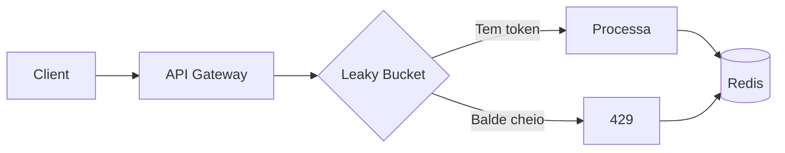

# 09 — Leaky Bucket (Rate Limiter)

**🇧🇷** Rate Limiter Distribuído  
**🇬🇧** Distributed Rate Limiter

---

Sua API está no ar. De repente, 10 mil requisições por segundo. O que acontece? Seu servidor morre, o banco trava, e você perde clientes.

Rate limiting não é opcional. É o que separa uma API robusta de uma que cai na Black Friday.

O Leaky Bucket é um dos algoritmos mais usados: a água entra em taxa variável (as requisições) e sai a uma taxa constante (o processamento). Se o balde enche, as próximas gotas transbordam (429 Too Many Requests).

---

## A arquitetura



```
Leaky Bucket (capacidade 100, refill 10/s):
┌──────────────────────────────────────────────┐
│  ┌─┐ ┌─┐ ┌─┐ ┌─┐ ┌─┐                    │
│  │R│ │R│ │R│ │R│ │R│ → processando        │
│  │e│ │e│ │e│ │e│ │e│    (10 req/s)        │
│  │q│ │q│ │q│ │q│ │q│                      │
│  └─┘ └─┘ └─┘ └─┘ └─┘                      │
│  ────────────────────────────────────────  │
│  Transbordo (429)                          │
└──────────────────────────────────────────────┘
```

---

## Resolução em TypeScript

### Middleware com Redis

```typescript
import Redis from 'ioredis';

class LeakyBucket {
  private redis: Redis;

  constructor() {
    this.redis = new Redis(process.env.REDIS_URI);
  }

  async checkLimit(key: string, capacity: number, refillRate: number, refillMs: number) {
    const now = Date.now();
    const redisKey = `leaky:${key}`;
    
    // Lua script roda atômico no Redis
    const result = await this.redis.eval(`
      local key = KEYS[1]
      local capacity = tonumber(ARGV[1])
      local refill = tonumber(ARGV[2])
      local interval = tonumber(ARGV[3])
      local now = tonumber(ARGV[4])
      
      local bucket = redis.call('HMGET', key, 'tokens', 'last_refill')
      local tokens = tonumber(bucket[1]) or capacity
      local last = tonumber(bucket[2]) or now
      
      -- Refill baseado no tempo
      local elapsed = now - last
      if elapsed > 0 then
        local add = math.floor(elapsed / interval) * refill
        tokens = math.min(capacity, tokens + add)
      end
      
      if tokens >= 1 then
        tokens = tokens - 1
        redis.call('HMSET', key, 'tokens', tokens, 'last_refill', now)
        redis.call('PEXPIRE', key, interval * 2)
        return {1, tokens, 0}
      else
        return {0, 0, interval - (now % interval)}
      end
    `, 1, redisKey, capacity, refillRate, refillMs, now);
    
    return {
      allowed: result[0] === 1,
      remaining: result[1],
      resetIn: result[2],
    };
  }
}

// Middleware Express/Fastify
function rateLimit(capacity: number, refillRate: number) {
  const bucket = new LeakyBucket();
  
  return async (req: any, res: any, next: any) => {
    const key = `${req.ip}:${req.route.path}`;
    
    const result = await bucket.checkLimit(key, capacity, refillRate, 1000);
    
    res.setHeader('X-RateLimit-Limit', capacity);
    res.setHeader('X-RateLimit-Remaining', result.remaining);
    res.setHeader('X-RateLimit-Reset', Math.ceil(result.resetIn / 1000));
    
    if (!result.allowed) {
      return res.status(429).json({
        error: 'Too Many Requests',
        retryAfter: Math.ceil(result.resetIn / 1000),
      });
    }
    
    next();
  };
}
```

---

## Resolução em Go

```go
package main

import (
    "context"
    "fmt"
    "net/http"
    "strconv"
    "time"
    "github.com/redis/go-redis/v9"
)

type RateLimiter struct {
    rdb *redis.Client
}

func NewRateLimiter(addr string) *RateLimiter {
    return &RateLimiter{
        rdb: redis.NewClient(&redis.Options{Addr: addr}),
    }
}

func (rl *RateLimiter) Check(ctx context.Context, key string,
    capacity, refillRate int, refillMs int64) (bool, int, int64) {

    now := time.Now().UnixMilli()

    script := redis.NewScript(`
        local key = KEYS[1]
        local capacity = tonumber(ARGV[1])
        local refill = tonumber(ARGV[2])
        local interval = tonumber(ARGV[3])
        local now = tonumber(ARGV[4])

        local bucket = redis.call('HMGET', key, 'tokens', 'last_refill')
        local tokens = tonumber(bucket[1]) or capacity
        local last = tonumber(bucket[2]) or now

        local elapsed = now - last
        if elapsed > 0 then
            local add = math.floor(elapsed / interval) * refill
            tokens = math.min(capacity, tokens + add)
        end

        if tokens >= 1 then
            tokens = tokens - 1
            redis.call('HMSET', key, 'tokens', tokens, 'last_refill', now)
            redis.call('PEXPIRE', key, interval * 2)
            return {1, tokens, 0}
        else
            return {0, 0, interval - (now % interval)}
        end
    `)

    result, err := script.Run(ctx, rl.rdb, []string{key},
        capacity, refillRate, refillMs, now).Result()
    if err != nil {
        return true, capacity, 0 // Fail open
    }

    vals := result.([]interface{})
    allowed := vals[0].(int64) == 1
    remaining := int(vals[1].(int64))
    resetIn := vals[2].(int64)

    return allowed, remaining, resetIn
}

func (rl *RateLimiter) Middleware(capacity, refill int) func(http.Handler) http.Handler {
    return func(next http.Handler) http.Handler {
        return http.HandlerFunc(func(w http.ResponseWriter, r *http.Request) {
            key := r.RemoteAddr + ":" + r.URL.Path

            allowed, remaining, resetIn := rl.Check(r.Context(), key, capacity, refill, 1000)

            w.Header().Set("X-RateLimit-Limit", strconv.Itoa(capacity))
            w.Header().Set("X-RateLimit-Remaining", strconv.Itoa(remaining))
            w.Header().Set("X-RateLimit-Reset", fmt.Sprintf("%d", resetIn/1000))

            if !allowed {
                w.Header().Set("Retry-After", fmt.Sprintf("%d", resetIn/1000))
                http.Error(w, `{"error":"Too Many Requests"}`, http.StatusTooManyRequests)
                return
            }

            next.ServeHTTP(w, r)
        })
    }
}
```

---

## Como testar

```bash
make infra-up
pnpm --filter @banking/leaky-bucket dev

# Load test
npx autocannon -c 100 -d 10 http://localhost:3009/api/test

# Ver headers
curl -v http://localhost:3009/api/test 2>&1 | grep RateLimit
```

---

## Lições aprendidas

1. **Lua script no Redis é atômico** — Sem race condition. Milhões de requisições concorrentes não quebram o bucket.
2. **Fail open vs fail closed** — Se o Redis cai, sua API para? Depende. Financeiro: fail closed. Rede social: fail open.
3. **Headers são contrato** — `X-RateLimit-Limit`, `Remaining`, `Reset` não são opcionais. O cliente precisa saber quando pode tentar de novo.
4. **Capacidade e refill são diferentes** — Capacidade é o burst. Refill é a taxa sustentável. Um sem o outro não faz sentido.
