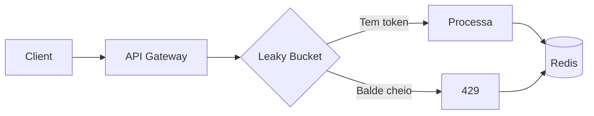

# Desafio 09: Leaky Bucket (Rate Limiter)

**🇧🇷** Rate Limiter Distribuído  
**🇬🇧** Distributed Rate Limiter

---

## 🎯 Objetivos de Aprendizado

- Implementar rate limiting distribuído com Leaky Bucket no Redis
- Entender atomicidade via Lua scripting — sem race conditions
- Dominar os parâmetros: capacidade (burst) e refill (taxa sustentável)
- Comparar estratégias: Leaky Bucket, Token Bucket, Fixed Window, Sliding Window Log
- Implementar Circuit Breaker como proteção reativa a serviços downstream
- Projetar fallback local para resiliência quando o Redis cai

---

## 📋 Pré-requisitos

### 🧠 Conceitos
- Rate limiting (token bucket, leaky bucket, fixed/sliding window, GCRA)
- HTTP 429 Too Many Requests
- Lua scripting no Redis
- Atomicidade em sistemas distribuídos
- Defesa contra DDoS camada 7

### 📚 Desafios Anteriores
- [Desafio 03: DICT](/challenges/03-dict) — uso de Redis como cache e lock distribuído, fundamentos de atomicidade no Redis

### 🛠️ Ferramentas
- Docker
- Redis 7+
- Apache Bench ou k6 (teste de carga)
- Prometheus + Grafana (dashboards)

### 💻 Técnico
- TypeScript
- Node.js 20+
- Middleware pattern (Koa)
- Redis (EVAL/EVALSHA)
- Métricas Prometheus

---

## 📖 Abertura — Por que Rate Limiting?

"Presta atencao. deixa eu te contar uma história que aconteceu com um amigo meu. A API dele estava no ar, bonitinha, funcionando. De repente, 10 mil requisições por segundo. O servidor morreu, o banco travou, e ele perdeu clientes.

Não foi ataque DDoS não — foi um cliente que fez um loop mal escrito. O sistema ficou fora do ar por 40 minutos. O prejuízo? Mais de R$ 50 mil em transações não processadas. Tudo porque não tinha rate limiting.

Rate limiting não é opcional. É o que separa uma API robusta de uma que cai na Black Friday. É o que separa um sistema financeiro de um que deixa passar 10 boletos do mesmo cliente em 1 segundo.

O Leaky Bucket é um dos algoritmos mais usados: a água entra em taxa variável (as requisições) e sai a uma taxa constante (o processamento). Se o balde enche, as próximas gotas transbordam com 429 Too Many Requests.

Vou te mostrar não só como implementar, mas como fazer direito: distribuído, atômico e resiliente."

Mas antes de meter a mão no código, deixa eu te contar de onde isso tudo veio. O conceito de rate limiting não nasceu com APIs REST — ele é mais velho que a web. Nos anos 70, os engenheiros do Bell Labs já enfrentavam o mesmo problema: como limitar o tráfego em redes de pacotes sem perder dados? A resposta veio com o **Token Bucket**, formalizado por J. Turner em 1986 no artigo _"New Directions in Communications"_. A ideia era genial: um balde que enche de tokens a uma taxa constante e que pode acumular um burst temporário. A indústria de telecom adotou o conceito de vez com o **GCRA (Generic Cell Rate Algorithm)**, padronizado pelo ATM Forum em 1993 para controlar tráfego de células em redes ATM — 53 bytes por célula, milhões por segundo, tudo controlado por um algoritmo que cabe em poucas linhas de hardware. O GCRA é essencialmente um Leaky Bucket com medição contínua de tempo, e até hoje é a base teórica de sistemas como o shaper de tráfego do Linux (`tc`), os rate limiters da Cloudflare, e os API Gateways que você usa todo dia.

Agora pensa comigo: por que **toda** API pública precisa de rate limiting? Três motivos. Primeiro, **proteção**: sua API é um recurso finito — cada request consome CPU, memória, conexões de banco, banda. Sem limite, um cliente mal comportado (ou mal intencionado) consome tudo e os outros ficam sem serviço. Segundo, **fairness**: se você tem 100 clientes e um deles faz 90% das requisições, seus SLAs com os outros 99 vão pro espaço. Rate limiting garante que cada cliente tem sua fatia justa. Terceiro, **modelo de negócio**: toda API pública moderna precifica por volume — plano free com 100 req/h, plano pro com 10.000 req/h. Rate limiting **é** o enforcement do seu pricing. Sem ele, você não cobra ninguém.

E os casos de falha? São lendários. Em 2012, o Twitter mudou suas regras de rate limit para terceiros e derrubou metade dos apps que dependiam da API — o ecossistema de desenvolvedores nunca mais foi o mesmo. Em 2019, o GitHub sofreu uma tempestade de webhooks mal configurados que saturou seus servidores de notificação por 6 horas — 40 milhões de eventos perdidos. Em 2021, a Shopify viu seu checkout cair durante a Black Friday porque um merchant fez scraping agressivo da API de produtos. Em todos esses casos, um rate limiter bem calibrado teria absorvido o pico. Mas calibrar é a parte difícil, e é sobre isso que vamos falar.

Vamos falar de DDoS, porque é impossível falar de rate limiting sem mencionar o elefante na sala. DDoS — Distributed Denial of Service — é um ataque coordenado onde milhares (ou milhões) de máquinas mandam requisições simultâneas para derrubar seu serviço. Rate limiting **não é a defesa definitiva** contra DDoS — para isso você precisa de scrubbing centers, anycast networks, proteção de camada 3/4 como a da Cloudflare ou AWS Shield. Mas rate limiting é a **primeira linha de defesa na camada 7**. Ele detecta padrões anômalos: 1000 requisições do mesmo IP pra mesma rota em 1 segundo? Bloqueia. 500 tentativas de login de IPs diferentes no mesmo endpoint? Bloqueia. Um rate limiter bem configurado consegue absorver a maioria dos ataques volumétricos de baixa complexidade antes que eles cheguem no seu backend. É o equivalente a ter uma porta forte em casa — não impede um exército, mas impede o ladrão oportunista.

O ecossistema moderno de rate limiting vai muito além de um middleware na aplicação. Hoje você encontra rate limiters em API Gateways (Kong, Envoy, Tyk), em proxies reversos (NGINX `limit_req`, HAProxy), em CDNs (Cloudflare Rate Limiting, Fastly), em service meshes (Istio, Linkerd), e em bibliotecas de aplicação como a que vamos implementar aqui. A escolha de onde colocar o rate limiter é tão importante quanto o algoritmo que você escolhe: rate limit no edge (CDN) bloqueia antes de chegar na sua infra; rate limit no gateway protege todas as APIs com uma política centralizada; rate limit na aplicação dá granularidade máxima por endpoint e por usuário. O ideal? Camadas. Rate limit no edge para DDoS básico, no gateway para políticas globais, e na aplicação para regras de negócio.

---

## 🔥 O Problema

Sua API está no ar. De repente, 10 mil requisições por segundo. O que acontece? Seu servidor morre, o banco trava, e você perde clientes.

Os problemas são clássicos:

1. **Sem rate limiting, qualquer cliente mal comportado derruba você** — Um loop mal escrito, um script de teste sem controle, um webhook mal configurado. Basta um cliente para saturar sua API.

2. **Race condition em rate limiters ingênuos** — "Só incrementar um contador no Redis" não funciona. Duas requisições simultâneas lêem o contador, vêem que ainda tem token, e as duas passam. Você acorda com 10 mil requisições processadas quando deveria ter aceitado só 100.

3. **Burst no limiar da janela** — Fixed Window parece simples, mas quando a janela reinicia, 100 requisições passam de uma vez. O pico não é suavizado.

4. **Sem headers de rate limit, o cliente fica cego** — O cliente não sabe quando pode tentar de novo. Ele faz retry na mesma hora, piorando o problema num efeito cascata.

Cada um desses problemas tem solução: **Lua script atômico no Redis** pra race condition, **Leaky Bucket** pra suavizar bursts, **headers padronizados** pro cliente se comportar.

Mas vamos abrir cada um desses problemas com mais profundidade, porque a superfície é enganosa. O primeiro problema — **dimensionalidade do rate limit** — é mais sutil do que parece. Rate limiting por IP é a abordagem mais comum, mas falha em cenários de NAT corporativo (500 pessoas atrás do mesmo IP público) e em ataques distribuídos (milhares de IPs diferentes). Rate limiting por API key resolve o problema de NAT mas não impede que uma chave vazada seja usada de vários IPs ao mesmo tempo. Rate limiting por usuário autenticado é o mais preciso mas exige que toda rota passe por autenticação — e rotas públicas como `/health` ou `/login` precisam de rate limiting mesmo sem autenticação. Rate limiting por endpoint protege rotas caras (upload, exportação, busca full-text) sem afetar rotas leves (status, listagem simples). E rate limiting por método HTTP (`POST` mais restrito que `GET`) é outra dimensão que quase ninguém usa mas que faz todo sentido: um `POST /api/users` consome muito mais recursos que um `GET /api/users`.

O segundo problema — **race condition** — merece uma explicação mais detalhada porque é o erro mais comum em rate limiters caseiros. Imagina o seguinte cenário com `INCR` no Redis: duas threads chegam ao mesmo tempo. A thread A lê o contador: 9. A thread B lê o contador: 9 também. A thread A incrementa pra 10. A thread B incrementa pra 10. As duas passam, e você processou 11 requisições onde só deveria ter processado 10. O Redis é single-threaded para comandos individuais, mas `GET` seguido de `INCR` são dois comandos separados — e entre eles, outra thread pode ler o mesmo valor. Por isso `MULTI/EXEC` com `WATCH` ou Lua scripting são obrigatórios para atomicidade.

O terceiro problema — **distributed rate limiting** — explode em complexidade quando você escala horizontalmente. Com 10 instâncias da sua API e um rate limiter in-memory, cada instância tem seu próprio balde. Um cliente que faz 10 requisições distribuídas entre as 10 instâncias passa em todas. Solução óbvia: Redis centralizado como ponto único de verdade. Mas aí você introduz latência de rede (0.1-1ms por request no mesmo datacenter, 10-50ms cross-region), single point of failure (se o Redis cai, o rate limiting cai junto), e contenção (todas as instâncias batendo no mesmo Redis vira gargalo). Alternativas incluem **sticky sessions** (client sempre cai na mesma instância via hash consistente — barato, mas perde resiliência se a instância cair) e **rate limiting descentralizado** com algoritmos CRDT-based que dividem a cota entre instâncias e fazem gossip periódico para reconciliar.

O quarto problema — **clock skew** — é o vilão silencioso dos rate limiters distribuídos. Todos os algoritmos de rate limiting dependem do tempo: janelas que resetam, tokens que recarregam, timestamps de última requisição. Se suas máquinas não estão sincronizadas com NTP, você tem decisões inconsistentes. Um servidor com relógio 2 segundos adiantado acha que a janela já resetou; outro com relógio 2 segundos atrasado acha que ainda tem 4 segundos de bloqueio. No Leaky Bucket com Redis, o `last_refill` é escrito pelo servidor que processa a requisição — se dois servidores têm relógios diferentes, o cálculo de `elapsed` produz resultados diferentes. A solução é usar o **relógio monotônico do Redis** (`TIME` command retorna tempo do servidor Redis) em vez do relógio de cada servidor de aplicação. Isso garante uma única fonte de verdade para o tempo, mas aumenta a latência (mais um round-trip).

O quinto problema — **custo de chaves no Redis** — aparece em escala. Um rate limiter por IP com janela de 1 minuto gera uma chave por IP por janela. Com 100 mil IPs únicos por minuto, são 100 mil chaves novas a cada 60 segundos. Com TTL de 2 minutos, você mantém 200 mil chaves ativas. Cada chave ocupa ~100 bytes (nome + metadados), totalizando 20 MB — administrável. Mas se você faz rate limiting por IP + endpoint + usuário, a cardinalidade explode: 100 mil IPs × 50 endpoints × 1000 usuários = 5 bilhões de combinações possíveis. Na prática você não atinge esse número porque nem toda combinação ocorre, mas em high-traffic (1M+ req/min) você pode facilmente ter milhões de chaves ativas. Redis single-node começa a sofrer com isso — daí a necessidade de Redis Cluster ou estratégias de evicção agressivas.

---

## 🏗️ Arquitetura Geral

<LanguageToggle />

<div class="Lang-content ts" style="Display:block;">

### Visão Macro



```
Leaky Bucket (capacidade 100, refill 10/s):
┌──────────────────────────────────────────────┐
│  ┌─┐ ┌─┐ ┌─┐ ┌─┐ ┌─┐                    │
│  │R│ │R│ │R│ │R│ │R│ → processando        │
│  │e│ │e│ │e│ │e│ │e│    (10 req/s)        │
│  │q│ │q│ │q│ │q│ │q│                      │
│  └─┘ └─┘ └─┘ └─┘ └─┘                      │
│  ────────────────────────────────────────  │
│  Transbordo (429)                          │
└──────────────────────────────────────────────┘
```

O balde tem dois parâmetros: **capacidade** (quantas requisições cabem no burst) e **refill** (quantas gotas vazam por segundo). A beleza do Leaky Bucket é que ele suaviza picos — você pode ter 100 requisições de uma vez, mas se continuar a 20 req/s, as extras transbordam.

### A Stack

Redis 7 com Lua scripting, `ioredis`, Express/Fastify. O Redis é quem dita a atomicidade — o Lua script roda inteiro numa thread só, sem interrupção.

> **Por que Redis e não em memória?** — Rate limiter em memória não escala horizontalmente. Se você tem 10 instâncias da API, cada uma tem seu próprio bucket. Um cliente mal comportado faz 10 requisições (uma pra cada instância) antes de qualquer bucket encher. Com Redis centralizado, o bucket é compartilhado — independe do número de instâncias.

---

## 👨‍💻 Mão na Massa

"Bora codar. O bagulho é o seguinte: você precisa de um rate limiter que funcione distribuído, sem race condition, e que seja atomicamente consistente. Se duas requisições chegam ao mesmo tempo, o bucket precisa decidir quem passa e quem transborda — sem deixar passar mais do que a capacidade.

Vou te mostrar como fazer isso com Redis + Lua."

### A matemática por trás do Leaky Bucket

Antes de escrever código, vamos entender a matemática. O Leaky Bucket é um modelo de **queue com taxa de serviço constante**. Pense assim: você tem uma fila com capacidade máxima `N` (o tamanho do balde). Requisições chegam a qualquer taxa (variável). Elas são processadas (drenadas) a uma taxa constante `R` por segundo. Se a fila está cheia e chega mais uma requisição, ela transborda — `429`.

A conta é simples:
- `tokens = capacidade inicial do balde`
- `elapsed = tempo decorrido desde o último refill`
- `add = floor(elapsed / intervalo_refill) * taxa_refill` — quantos tokens foram repostos
- `tokens = min(capacidade, tokens + add)` — nunca ultrapassa a capacidade
- `tokens >= 1` → requisição permitida, `tokens--`
- `tokens < 1` → requisição bloqueada, calcula `retryAfter`

A diferença crucial para o Token Bucket: no Leaky Bucket o refill é **discreto** — você recalcula com `math.floor` a intervalos fixos. No Token Bucket o refill é **contínuo** — a cada milissegundo você ganha uma fração de token. Discreto é mais simples de implementar e de debugar; contínuo é mais preciso em baixa latência mas pode sofrer com imprecisão de ponto flutuante.

Agora vamos usar a **Lei de Little** da teoria de filas para entender o comportamento: `L = λ * W`, onde L é o número médio de requisições no sistema, λ é a taxa de chegada, e W é o tempo médio de processamento. Com um Leaky Bucket de capacidade C e taxa de drenagem R, o sistema é estável se `λ < R` — a taxa de chegada sustentada é menor que a taxa de drenagem. Se `λ > R`, o balde enche e começa a transbordar. A capacidade C determina quanto burst o sistema aguenta antes de transbordar: `burst_time = C / (λ - R)` para λ > R.

### Fixed Window, Sliding Window, Token Bucket, Leaky Bucket — qual a diferença?

Vamos comparar os quatro algoritmos principais porque cada um resolve um problema diferente. **Fixed Window** divide o tempo em janelas fixas (ex: 1 minuto) e conta requisições dentro de cada janela. É o mais simples de implementar mas tem o famoso _boundary burst problem_: se você permite 100 req/min e 100 requisições chegam nos últimos 5 segundos da janela, mais 100 podem chegar nos primeiros 5 segundos da próxima janela — você processa 200 requisições em 10 segundos, o dobro do permitido.

**Sliding Window Log** resolve o boundary burst mantendo um log de timestamps de cada requisição em um ZSET do Redis. A cada request, remove timestamps antigos (fora da janela) e conta os restantes. Precisão máxima, mas custo de memória proporcional ao número de requisições. Com 100 req/min sustentadas, são 100 entradas no ZSET o tempo todo. Com 10.000 req/min, são 10.000 entradas. Cada entrada ocupa ~16 bytes (timestamp) + overhead do ZSET — multiplicado por milhares de chaves, o consumo de memória explode.

**Sliding Window Counter** é um híbrido: divide a janela em sub-janelas (ex: janela de 1 minuto dividida em 6 sub-janelas de 10 segundos) e conta requisições por sub-janela. Para calcular o total, soma as sub-janelas com peso proporcional à sobreposição. Menos preciso que o log mas muito mais eficiente em memória. O Redis sorted set continua sendo usado, mas com bem menos entradas.

**Token Bucket** mantém um contador de tokens que é recarregado continuamente (não em intervalos fixos). A cada milissegundo, `tokens += (refill_rate * elapsed_ms)`. Permite bursts maiores que a taxa sustentada — se a capacidade é 100 e a taxa é 10/s, você pode disparar 100 requisições de uma vez e depois esperar 10 segundos para recarregar. O Token Bucket é melhor para cenários onde bursts são esperados e desejados (upload de arquivos, sync de dados).

**Leaky Bucket** suaviza o tráfego: ele força a taxa de saída a ser constante. Mesmo que 100 requisições cheguem de uma vez, elas só saem do balde a 10 por segundo. É melhor para cenários onde o downstream tem capacidade limitada e constante (banco de dados com pool de conexões fixo, API de terceiros com throttling).

Na prática, as implementações modernas de rate limiting muitas vezes misturam os conceitos. O algoritmo que implementamos aqui, apesar do nome Leaky Bucket, tem características de Token Bucket com refill discreto — é o que a Cloudflare chama de "Generic Cell Rate Algorithm (GCRA) com janela deslizante". O GCRA, formalizado pelo ITU-T, define dois parâmetros: `T` (intervalo mínimo entre requisições, o inverso da taxa) e `τ` (tolerância a burst, nossa capacidade). A fórmula do GCRA é:

```
tat = max(tat, now)           # Theoretical Arrival Time
if tat - now <= τ:            # Dentro da tolerância?
  tat = max(tat, now) + T     # Agenda próxima liberação
  return ALLOWED
else:
  return BLOCKED
```

Isso é matematicamente equivalente ao Leaky Bucket com `capacity = τ / T` e `refill_rate = 1 / T`. A diferença é que o GCRA não precisa armazenar contador de tokens — só o TAT (theoretical arrival time) do último pacote. É tão compacto que cabe em hardware de rede.

### Por que Lua no Redis?

"Se você fez 'só incrementar um contador no Redis' como rate limiter, me desculpa, mas está errado."

O problema é race condition. Duas requisições simultâneas lêem o contador, vêem que ainda tem token, e as duas passam. Você acorda com 10 mil requisições processadas quando deveria ter aceitado só 100.

O Lua script resolve isso porque o Redis executa o script inteiro de forma atômica. Nenhuma outra requisição interfere no meio. É como uma transação de banco de dados, mas mais rápida.

A atomicidade do Lua no Redis funciona assim: o Redis tem um event loop single-threaded. Quando um script Lua começa a executar, ele ocupa a única thread de execução do Redis. Nenhum outro comando — de nenhum outro cliente — pode executar até o script terminar. Isso significa que entre a leitura do bucket (`HMGET`) e a escrita (`HMSET`), nenhum outro cliente pode ler ou escrever na mesma chave. É uma transação ACID completa, exceto pela durabilidade (se o Redis cair, os dados podem não estar persistidos — mas rate limiting é tolerante a perda).

Mas tem um custo: se seu Lua script é pesado (loop, processamento complexo), ele bloqueia o Redis inteiro. Por isso scripts Lua para rate limiting devem ser O(1) — sem loops, sem scans, sem operações bloqueantes. O script que implementamos faz exatamente 4 operações Redis (`HMGET`, `HMSET`, `PEXPIRE`, e opcionalmente um `return`), todas O(1). Tempo de execução típico: < 0.1ms.

> ⚠️ **Scripts Lua com `EVALSHA`** — Em produção, você deve usar `EVALSHA` em vez de `EVAL`. O `EVAL` envia o script inteiro a cada chamada (custo de rede e parsing). O `EVALSHA` envia apenas o hash SHA1 do script, que o Redis já tem em cache. O `ioredis` faz isso automaticamente — ele tenta `EVALSHA` primeiro e, se receber `NOSCRIPT`, envia `EVAL` e cacheia o hash.

### Hierarchical Rate Limiting — limites em cascata

Em sistemas reais, você raramente tem um único rate limit. O padrão é **hierárquico** — múltiplas camadas de rate limiting que se complementam:

```
┌─────────────────────────────────────────────┐
│  Nível 1: Global IP    → 1000 req/s        │
│  ┌───────────────────────────────────────┐  │
│  │ Nível 2: Por rota   → 100 req/s      │  │
│  │ ┌───────────────────────────────────┐ │  │
│  │ │ Nível 3: Por user  → 10 req/s    │ │  │
│  │ │ ┌──────────────────────────────┐ │ │  │
│  │ │ │ Nível 4: Por endpoint → 1/s │ │ │  │
│  │ │ └──────────────────────────────┘ │ │  │
│  │ └───────────────────────────────────┘ │  │
│  └───────────────────────────────────────┘  │
└─────────────────────────────────────────────┘
```

Cada nível tem seu próprio bucket no Redis. Uma requisição precisa passar por todos os níveis para ser processada. Se falhar em qualquer nível, é 429. A ordem importa: o nível mais amplo primeiro (global IP), depois os mais específicos (por endpoint). Isso poupa processamento — se o IP já estourou o limite global, não precisa verificar os níveis mais finos.

A implementação no código é composição de middlewares, cada um verificando seu próprio bucket. No Express/Fastify, você aplica em ordem:

```
app.use(globalRateLimit)          // 1000 req/s por IP
app.use(routeRateLimit)           // 100 req/s por rota
app.use('/api/payments', userRateLimit)  // 10 req/s por user
app.use('/api/payments/process', endpointRateLimit) // 1 req/s
```

### Middleware com Redis

```typescript
import Redis from 'ioredis';

class LeakyBucket {
  private redis: Redis;

  constructor() {
    this.redis = new Redis(process.env.REDIS_URI);
  }

  async checkLimit(key: string, capacity: number, refillRate: number, refillMs: number) {
    const now = Date.now();
    const redisKey = `leaky:${key}`;
    
    const result = await this.redis.eval(`
      local key = KEYS[1]
      local capacity = tonumber(ARGV[1])
      local refill = tonumber(ARGV[2])
      local interval = tonumber(ARGV[3])
      local now = tonumber(ARGV[4])
      
      local bucket = redis.call('HMGET', key, 'tokens', 'last_refill')
      local tokens = tonumber(bucket[1]) or capacity
      local last = tonumber(bucket[2]) or now
      
      local elapsed = now - last
      if elapsed > 0 then
        local add = math.floor(elapsed / interval) * refill
        tokens = math.min(capacity, tokens + add)
      end
      
      if tokens >= 1 then
        tokens = tokens - 1
        redis.call('HMSET', key, 'tokens', tokens, 'last_refill', now)
        redis.call('PEXPIRE', key, interval * 2)
        return {1, tokens, 0}
      else
        return {0, 0, interval - (now % interval)}
      end
    `, 1, redisKey, capacity, refillRate, refillMs, now);
    
    return {
      allowed: result[0] === 1,
      remaining: result[1],
      resetIn: result[2],
    };
  }
}

function rateLimit(capacity: number, refillRate: number) {
  const bucket = new LeakyBucket();
  
  return async (req: any, res: any, next: any) => {
    const key = `${req.ip}:${req.route.path}`;
    
    const result = await bucket.checkLimit(key, capacity, refillRate, 1000);
    
    res.setHeader('X-RateLimit-Limit', capacity);
    res.setHeader('X-RateLimit-Remaining', result.remaining);
    res.setHeader('X-RateLimit-Reset', Math.ceil(result.resetIn / 1000));
    
    if (!result.allowed) {
      return res.status(429).json({
        error: 'Too Many Requests',
        retryAfter: Math.ceil(result.resetIn / 1000),
      });
    }
    
    next();
  };
}
```

### Implementação sem Lua (alternativa com transação Redis)

Se você não pode usar Lua (Redis mais antigo, restrições de infra), dá pra fazer com transação `MULTI/EXEC` e watch:

```typescript
async function checkLimitTransaction(key: string, capacity: number, refillRate: number, refillMs: number) {
  const now = Date.now();
  const redisKey = `leaky:${key}`;
  
  const result = await this.redis.multi()
    .hmget(redisKey, 'tokens', 'last_refill')
    .exec();
  
  const [tokensStr, lastStr] = result[0][1] as [string | null, string | null];
  let tokens = tokensStr ? parseInt(tokensStr) : capacity;
  const last = lastStr ? parseInt(lastStr) : now;
  
  const elapsed = now - last;
  if (elapsed > 0) {
    const add = Math.floor(elapsed / refillMs) * refillRate;
    tokens = Math.min(capacity, tokens + add);
  }
  
  if (tokens >= 1) {
    tokens--;
    await this.redis.multi()
      .hset(redisKey, 'tokens', tokens, 'last_refill', now)
      .pexpire(redisKey, refillMs * 2)
      .exec();
    
    return { allowed: true, remaining: tokens, resetIn: 0 };
  }
  
  return { allowed: false, remaining: 0, resetIn: refillMs - (now % refillMs) };
}
```

Mas atenção: `MULTI/EXEC` não é otimista — ele não faz rollback se outra conexão mudar os dados. Pra isso você precisaria de `WATCH`. O Lua é mais seguro e mais rápido.

### Rate limiter por múltiplas dimensões

Às vezes você precisa limitar por IP, por usuário, por rota, ou tudo junto. Um rate limiter flexível permite combinar chaves:

```typescript
function buildRateLimitKey(req: any, dimensions: string[]): string {
  const parts: string[] = [];
  
  for (const dim of dimensions) {
    switch (dim) {
      case 'ip':
        parts.push(req.ip || req.connection.remoteAddress);
        break;
      case 'route':
        parts.push(req.route?.path || req.url);
        break;
      case 'userId':
        parts.push(req.user?.id || 'anonymous');
        break;
      case 'method':
        parts.push(req.method);
        break;
      case 'apiKey':
        parts.push(req.headers['x-api-key'] || 'unknown');
        break;
    }
  }
  
  return parts.join(':');
}

function createRateLimiter(config: {
  dimensions: string[];
  capacity: number;
  refillRate: number;
  refillMs?: number;
}) {
  const bucket = new LeakyBucket();
  const refillMs = config.refillMs || 1000;
  
  return async (req: any, res: any, next: any) => {
    const key = buildRateLimitKey(req, config.dimensions);
    const result = await bucket.checkLimit(key, config.capacity, config.refillRate, refillMs);
    
    res.setHeader('X-RateLimit-Limit', config.capacity);
    res.setHeader('X-RateLimit-Remaining', result.remaining);
    res.setHeader('X-RateLimit-Reset', Math.ceil(result.resetIn / 1000));
    
    if (!result.allowed) {
      return res.status(429).json({
        error: 'Too Many Requests',
        retryAfter: Math.ceil(result.resetIn / 1000),
      });
    }
    
    next();
  };
}

// Uso
app.use('/api/payments', createRateLimiter({
  dimensions: ['userId', 'route'],
  capacity: 10,
  refillRate: 1,
  refillMs: 1000,
}));
```

---

## 🧠 A Profundidade

"Olha, o Leaky Bucket é bom, mas não é a única ferramenta na caixa. Cada estratégia tem seu caso de uso, e quem escolhe a errada paga caro."

### Comparação completa dos 4 algoritmos

Vamos colocar os quatro algoritmos lado a lado com casos de uso, vantagens e desvantagens reais:

```
┌─────────────────┬──────────────┬──────────────┬─────────────┬──────────────┐
│   Algoritmo     │  Precisão    │   Memória    │  Burst?     │   Complex.   │
├─────────────────┼──────────────┼──────────────┼─────────────┼──────────────┤
│ Fixed Window    │  Baixa       │  Mínima      │ Sim,        │  O(1)        │
│                 │ (boundary    │  (1 inteiro  │ explosivo   │              │
│                 │  bug)        │   por chave) │             │              │
├─────────────────┼──────────────┼──────────────┼─────────────┼──────────────┤
│ Sliding Win Log │  Máxima      │  Alta        │ Controlado  │  O(log N)    │
│                 │              │ (ZSET com    │             │              │
│                 │              │  N entradas) │             │              │
├─────────────────┼──────────────┼──────────────┼─────────────┼──────────────┤
│ Token Bucket    │  Alta        │  Mínima      │ Sim,        │  O(1)        │
│                 │              │ (2 campos    │ suave       │              │
│                 │              │  no hash)    │             │              │
├─────────────────┼──────────────┼──────────────┼─────────────┼──────────────┤
│ Leaky Bucket    │  Alta        │  Mínima      │ Não,        │  O(1)        │
│                 │              │ (2 campos    │ suavizado   │              │
│                 │              │  no hash)    │             │              │
└─────────────────┴──────────────┴──────────────┴─────────────┴──────────────┘
```

Agora, a análise de tráfego ao longo do tempo para cada algoritmo. Imagina um cenário onde você permite 10 req/s e recebe um burst de 50 requisições de uma vez, seguido de 5 req/s sustentadas. Visualmente:

```
Fixed Window (janela de 1s):
Req:  ██████████████████████████████████████████████████░░░░░░░░░░░░░░░░░
Pass: ██████████░░░░░░░░░░░░░░░░░░░░░░░░░░░░░░░░████████████░░░░░░░░░░░░░
      ↑ 10 passam     ↑ 40 bloqueadas (janela 1)   ↑  10 passam (janela 2)
      Problema: se as 50 chegassem no limiar, 20 passariam em 2 janelas

Sliding Window Log (janela deslizante):
Req:  ██████████████████████████████████████████████████░░░░░░░░░░░░░░░░░
Pass: ██████████░░░░░░░░░░░░░░░░░░░░░░░░░░░░░░░░░█████░░░░░░░░░░░░░░░░░░░
      ↑ 10 passam    ↑ 40 bloqueadas                ↑ 5/s passam suave
      Precisão máxima, mas precisa de ZSET com 50+ entradas no pico

Token Bucket (capacidade 50, refill 10/s):
Req:  ██████████████████████████████████████████████████░░░░░░░░░░░░░░░░░
Pass: ██████████████████████████████████████████████████░░░░░░░░░░░░░░░░░
      ↑ Todas as 50 passam (burst permitido)    ↑ bucket recarrega
      Ideal para upload/carga batch

Leaky Bucket (capacidade 50, refill 10/s):
Req:  ██████████████████████████████████████████████████░░░░░░░░░░░░░░░░░
Pass: ██████░░░░██████░░░░██████░░░░██████░░░░██████░░░░██████░░░░░░░░░░░
      ↑ 10/s constante, bucket suaviza o burst
      Ideal para downstream com capacidade fixa
```

A escolha depende do que você está protegendo. Se o downstream é um banco de dados com pool de 20 conexões, Leaky Bucket com capacidade 20 e refill 20/s garante que você nunca excede o pool. Se o downstream é um serviço elástico que escala horizontalmente (AWS Lambda, por exemplo), Token Bucket com capacidade alta permite bursts que o auto-scaling absorve.

### Redis Cluster e rate limiting distribuído

Em alta escala, um único Redis não aguenta. Você precisa de Redis Cluster — sharding automático com hash slots. Mas rate limiting no Redis Cluster traz desafios próprios:

1. **Hash tags**: As chaves de rate limiting precisam estar no mesmo slot se você faz operações multi-key (como `HMGET`). Use `{user:123}:rate_limit` com hash tag `{user:123}` para garantir que todas as chaves do mesmo usuário caiam no mesmo shard.

2. **Lua scripts no cluster**: Scripts Lua só podem acessar chaves que estão no mesmo nó. Se seu script acessa múltiplas chaves, todas precisam ter a mesma hash tag. Na prática, cada chave de rate limiting é independente, então isso raramente é problema.

3. **Resharding**: Quando você adiciona ou remove nós do cluster, os hash slots migram entre nós. Durante a migração, algumas chaves podem estar temporariamente indisponíveis — configurar `READONLY` nos replicas mitiga isso.

4. **Latência**: Cada operação no Redis Cluster custa ~1ms intra-AZ e ~5ms cross-AZ. Com rate limiting hierárquico (4 níveis), são até 4 chamadas Redis por request — 4ms adicionais de latência. Em sistemas que já operam com p99 de 50ms, isso é 8% de aumento. Se inaceitável, use pipeline ou consolide verificações em um único Lua script com múltiplas chaves.

### Consistência eventual vs consistência forte para rate limiting

Aqui tem uma decisão de arquitetura que pouca gente discute: seu rate limiter precisa ser **consistente** ou pode ser **eventualmente consistente**?

Consistência forte (o que implementamos) garante que, em qualquer momento, o número de requisições processadas nunca excede o limite configurado. É o que você precisa em sistemas financeiros, de cobrança, ou qualquer cenário onde "Deixar passar uma a mais" custa dinheiro.

Consistência eventual (ex: rate limiter baseado em gossip entre instâncias, ou CRDTs) pode deixar passar mais requisições do que o limite em troca de menor latência e tolerância a partições de rede. É aceitável em cenários como feeds de redes sociais, endpoints de analytics, ou proteção anti-scraping onde um falso positivo (bloquear cliente legítimo) é pior que um falso negativo (deixar passar uma a mais).

O Redis é CP no teorema CAP com configuração padrão (consistência + tolerância a partição, sacrificando disponibilidade durante partições). Se você quer AP (disponível + tolerante a partição), precisa de um design descentralizado. Uma abordagem é cada instância ter uma cota local (ex: 10% do limite global) e fazer broadcast periódico do consumo. Se uma instância fica isolada, opera com sua cota local até a rede voltar. A precisão sofre, mas a disponibilidade é máxima.

### Token Bucket (burst) vs Leaky Bucket (smoothing) — quando usar cada um

Essa é a dúvida que mais aparece na prática. A diferença fundamental:

**Token Bucket** permite que você acumule tokens e os gaste de uma vez. Se sua API tem capacidade 100 req/s e o cliente manda 500 requisições em 1 segundo, com Token Bucket (capacidade 500) todas passam. O cliente fica feliz, você processa rápido, e depois o bucket recarrega ao longo de 5 segundos. É o comportamento esperado em APIs de upload, sync, batch processing, ou qualquer cenário onde o cliente precisa de rajadas ocasionais.

**Leaky Bucket** força um ritmo constante. As mesmas 500 requisições em 1 segundo: só 100 passam, 400 são rejeitadas com 429. O cliente é forçado a reenviar as 400 ao longo do tempo, respeitando o ritmo do servidor. É o comportamento esperado em APIs de pagamento (você não quer processar 500 pagamentos de uma vez), APIs de envio de email (o SMTP tem limite de taxa), e qualquer integração com sistemas legados que não aguentam burst.

A regra prática: se o recurso que você está protegendo tem capacidade variável ou auto-escalável, use Token Bucket. Se o recurso tem capacidade fixa ou custo por uso, use Leaky Bucket.

### Rate limiting como métrica de negócio — API tiers e monetização

Rate limiting não é só proteção técnica — é a espinha dorsal do seu modelo de negócio se você vende acesso a APIs. Todo provedor de API moderna (Stripe, Twilio, OpenAI, AWS) tem seu pricing baseado em rate limits:

```
Plano Free:     100 req/h, 1 req/s sustentado
Plano Starter:  1.000 req/h, 10 req/s, sem burst extra
Plano Pro:      10.000 req/h, 50 req/s, burst até 200
Plano Enterprise: 100.000 req/h, sem rate limit por endpoint
```

O rate limiter **é** o enforcement do plano. Se você implementa isso com chaves de Redis, cada API key tem seu próprio bucket com os parâmetros do plano. Quando o cliente faz upgrade, você atualiza os parâmetros — sem deploy, sem reinicialização, em tempo real.

Métricas de rate limiting também são essenciais para product decisions. Se 30% dos seus clientes do plano Starter estão batendo no rate limit toda hora, seu plano está subdimensionado. Se ninguém no plano Pro chega perto do limite, você pode reduzir (e economizar recursos) ou criar um plano intermediário. Se um cliente enterprise específico gera 50% das requisições, você sabe exatamente quanto cobrar a mais.

> 💡 **Dica de negócio**: Sempre retorne `X-RateLimit-Remaining` mesmo quando a requisição é bem-sucedida. Isso permite que o cliente saiba quantas requisições ainda tem disponíveis e se planeje. É um contrato transparente que reduz tickets de suporte do tipo "Sua API está bloqueando minhas chamadas!"

Além dos tiers, o rate limiting também pode ser **cost-based**. Se um endpoint consome 10x mais recursos que outro (ex: `POST /search` com full-text scan vs `GET /status`), você pode implementar _weighted rate limiting_ — o endpoint caro consome 10 tokens por request, o barato consome 1 token. Assim, o plano de 1000 req/h se mantém honesto: 1000 chamadas leves OU 100 chamadas pesadas, ou qualquer combinação proporcional.

```typescript
function createWeightedRateLimiter(config: {
  dimensions: string[];
  capacity: number;
  refillRate: number;
  weight: number;  // quanto cada request consome
}) {
  const bucket = new LeakyBucket();
  
  return async (req: any, res: any, next: any) => {
    const key = buildRateLimitKey(req, config.dimensions);
    
    // Lua script modificado para consumir `weight` tokens
    const result = await bucket.checkWeightedLimit(
      key,
      config.capacity,
      config.refillRate,
      1000,
      config.weight
    );
    
    // ... headers e 429
    next();
  };
}

// Endpoint caro consome 10 tokens
app.use('/api/search', createWeightedRateLimiter({
  dimensions: ['apiKey'],
  capacity: 1000,
  refillRate: 10,
  weight: 10,
}));

// Endpoint barato consome 1 token
app.use('/api/status', createWeightedRateLimiter({
  dimensions: ['apiKey'],
  capacity: 1000,
  refillRate: 10,
  weight: 1,
}));
```

### Diferentes estratégias de rate limit

Abaixo, as implementações de cada algoritmo para referência e comparação direta.

#### Token Bucket (similar ao Leaky, mas com refill contínuo)

```typescript
class TokenBucket {
  async checkLimit(key: string, capacity: number, refillPerSecond: number) {
    const now = Date.now();
    const redisKey = `token:${key}`;
    
    const result = await this.redis.eval(`
      local key = KEYS[1]
      local capacity = tonumber(ARGV[1])
      local refill = tonumber(ARGV[2])
      local now = tonumber(ARGV[3])
      
      local bucket = redis.call('HMGET', key, 'tokens', 'last_refill')
      local tokens = tonumber(bucket[1]) or capacity
      local last = tonumber(bucket[2]) or now
      
      local elapsed = now - last
      local add = elapsed * refill / 1000
      if add > 0 then
        tokens = math.min(capacity, tokens + add)
      end
      
      if tokens >= 1 then
        tokens = tokens - 1
        redis.call('HMSET', key, 'tokens', tokens, 'last_refill', now)
        redis.call('PEXPIRE', key, 10000)
        return {1, tokens, 0}
      else
        local retryAfter = math.ceil((1 - tokens) / refill * 1000)
        return {0, 0, retryAfter}
      end
    `, 1, redisKey, capacity, refillPerSecond, now);
    
    return {
      allowed: result[0] === 1,
      remaining: result[1],
      resetIn: result[2],
    };
  }
}
```

#### Fixed Window (mais simples, menos preciso)

```typescript
class FixedWindow {
  async checkLimit(key: string, maxRequests: number, windowMs: number) {
    const now = Date.now();
    const windowKey = Math.floor(now / windowMs);
    const redisKey = `fixed:${key}:${windowKey}`;
    
    const count = await this.redis.incr(redisKey);
    if (count === 1) {
      await this.redis.pexpire(redisKey, windowMs);
    }
    
    return {
      allowed: count <= maxRequests,
      remaining: Math.max(0, maxRequests - count),
      resetIn: windowMs - (now % windowMs),
    };
  }
}
```

#### Sliding Window Log (mais preciso, mais memória)

```typescript
class SlidingWindowLog {
  async checkLimit(key: string, maxRequests: number, windowMs: number) {
    const now = Date.now();
    const redisKey = `sliding:${key}`;
    const cutoff = now - windowMs;
    
    await this.redis.zremrangebyscore(redisKey, 0, cutoff);
    
    const count = await this.redis.zcard(redisKey);
    
    if (count < maxRequests) {
      await this.redis.zadd(redisKey, now, `${now}:${Math.random()}`);
      await this.redis.pexpire(redisKey, windowMs);
      return { allowed: true, remaining: maxRequests - count - 1, resetIn: 0 };
    }
    
    const oldest = await this.redis.zrange(redisKey, 0, 0, 'WITHSCORES');
    const resetIn = oldest.length >= 2 ? parseInt(oldest[1]) + windowMs - now : 0;
    
    return { allowed: false, remaining: 0, resetIn };
  }
}
```

Recomendo Leaky Bucket pra maioria dos casos. Fixed Window é simples mas tem o problema do "Burst no limiar da janela" — se a janela reiniciar, 100 requisições passam de uma vez. Sliding Window Log é preciso mas consome mais memória (ZSET com timestamp de cada request).

### Circuit Breaker (bonus)

"Rate limiting é preventivo. Circuit breaker é reativo. Quando um serviço downstream está caindo, você para de chamá-lo em vez de ficar acumulando erro."

```typescript
class CircuitBreaker {
  private failures: number = 0;
  private lastFailureTime: number = 0;
  private state: 'CLOSED' | 'OPEN' | 'HALF_OPEN' = 'CLOSED';
  
  constructor(
    private threshold: number = 5,
    private cooldownMs: number = 30000,
    private halfOpenMaxRequests: number = 3
  ) {}
  
  async call<T>(fn: () => Promise<T>, fallback: () => Promise<T>): Promise<T> {
    if (this.state === 'OPEN') {
      if (Date.now() - this.lastFailureTime >= this.cooldownMs) {
        this.state = 'HALF_OPEN';
      } else {
        return fallback();
      }
    }
    
    try {
      const result = await fn();
      
      if (this.state === 'HALF_OPEN') {
        this.state = 'CLOSED';
        this.failures = 0;
      }
      
      return result;
    } catch (err) {
      this.failures++;
      this.lastFailureTime = Date.now();
      
      if (this.failures >= this.threshold) {
        this.state = 'OPEN';
      }
      
      return fallback();
    }
  }
}

// Uso: protege chamadas a API de terceiros
const paymentsBreaker = new CircuitBreaker(5, 30000);

app.post('/api/process-payment', async (req, reply) => {
  const result = await paymentsBreaker.call(
    () => processPayment(req.body),
    () => ({ status: 'queued', message: 'Pagamento será processado em breve' })
  );
  
  return reply.send(result);
});
```

### Métricas e Monitoramento

Se você não monitora quantos 429s sua API retorna, você não sabe se o rate limit está funcionando ou se está quebrando clientes legítimos.

```typescript
// middleware/metrics.ts
import prometheus from 'prom-client';

const rateLimitCounter = new prometheus.Counter({
  name: 'rate_limit_blocked_total',
  help: 'Total de requisições bloqueadas pelo rate limit',
  labelNames: ['route', 'ip_prefix'],
});

const rateLimitRemaining = new prometheus.Gauge({
  name: 'rate_limit_remaining',
  help: 'Tokens restantes no bucket',
  labelNames: ['key'],
});

// Integração no middleware
app.use((req, res, next) => {
  const originalJson = res.json.bind(res);

  res.json = function (body: any) {
    if (res.statusCode === 429) {
      const ipPrefix = req.ip?.split('.').slice(0, 2).join('.') || 'unknown';
      rateLimitCounter.inc({ route: req.route?.path || 'unknown', ip_prefix: ipPrefix });
    }
    return originalJson(body);
  };

  next();
});
```

Com essas métricas no Prometheus + Grafana, você vê em tempo real: "A rota `/api/login` está bloqueando 500 requisições por minuto". Aí você sabe se é ataque ou se a capacidade está baixa.

Além das métricas básicas, monitore também: latência do Redis (p99), taxa de erro do Lua script (EVALSHA miss rate), distribuição de 429 por tier de cliente (free vs pro vs enterprise), e uso de memória do Redis por prefixo de chave. Um dashboard típico de rate limiting em produção tem pelo menos 6 painéis:

```
┌────────────────────┐  ┌────────────────────┐  ┌────────────────────┐
│  Requests/s (200)  │  │  Requests/s (429)  │  │  % Bloqueado       │
│  ▁▂▃▅▇█▇▅▃▂▁      │  │  ▁▁▂▅▇█▇▅▃▁▁     │  │  92% pass, 8% 429  │
└────────────────────┘  └────────────────────┘  └────────────────────┘
┌────────────────────┐  ┌────────────────────┐  ┌────────────────────┐
│  Redis Lat (p99)   │  │  Tokens Restantes  │  │  429 por Tier       │
│  ▁▁▁▁▁▂▁▁▁▁      │  │  ▇█▇▅▃▂▂▃▅▇      │  │  Free: 45%         │
│  p99: 1.2ms        │  │  média: 45/100    │  │  Pro: 12%          │
└────────────────────┘  └────────────────────┘  └────────────────────┘
```

### GCRA — a implementação industrial

Para fechar a seção de profundidade, vale mostrar a implementação pura do GCRA (Generic Cell Rate Algorithm), que é o padrão ouro da indústria e matematicamente equivalente ao nosso Leaky Bucket, mas com uma implementação ainda mais elegante:

```typescript
class GCRA {
  private redis: Redis;
  
  constructor() { this.redis = new Redis(process.env.REDIS_URI); }
  
  async checkLimit(key: string, period: number, burst: number) {
    const now = Date.now();
    
    const result = await this.redis.eval(`
      local key = KEYS[1]
      local period = tonumber(ARGV[1])   -- T: intervalo mínimo (ms)
      local burst = tonumber(ARGV[2])    -- τ: tolerância (ms)
      local now = tonumber(ARGV[3])
      
      local tat = tonumber(redis.call('GET', key)) or now
      
      -- tat = max(tat, now)  -- não pode estar no passado
      if tat < now then tat = now end
      
      -- new_tat = tat + period
      local allow_at = tat
      local new_tat = tat + period
      
      -- dif = allow_at - now
      if allow_at - now <= burst then
        redis.call('SET', key, new_tat, 'PX', burst * 2)
        return {1, math.floor((burst - (allow_at - now)) / period), 0}
      else
        local retry_after = allow_at - now - burst
        return {0, 0, retry_after}
      end
    `, 1, key, period, burst, now);
    
    return {
      allowed: result[0] === 1,
      remaining: result[1],
      resetIn: result[2],
    };
  }
}

// GCRA armazena UM único número (TAT) em vez de (tokens, last_refill)
// Exemplo: 10 req/s com burst de 5 → period=100, burst=500
// period = 1000/10 = 100ms entre requisições
// burst = 5 * 100 = 500ms de tolerância (5 requisições em burst)
const gcra = new GCRA();
app.use(async (req, res, next) => {
  const result = await gcra.checkLimit(req.ip, 100, 500);
  // ... headers e 429
});
```

O GCRA armazena apenas um número (TAT) em vez de dois (tokens + last_refill). Menos memória por chave, menos banda no Redis, mesma precisão. Se você está implementando rate limiting do zero hoje, GCRA é a recomendação — com a vantagem adicional de ser o algoritmo usado em hardware de rede e em sistemas como o `tc` (traffic control) do kernel Linux, então você tem interoperabilidade conceitual com a camada de rede.

---

## 🧪 Testando Concorrência

"O teste mais importante desse sistema — e o que a maioria dos devs esquece — é o teste de concorrência. Você precisa simular 50 requisições chegando ao mesmo tempo e ver o bucket segurar exatamente a capacidade."

```typescript
it('deve lidar com requisições concorrentes atomicamente', async () => {
  const promises = Array.from({ length: 50 }, () =>
    bucket.checkLimit('concurrent:test', 10, 1, 1000)
  );
  const results = await Promise.all(promises);
  const allowed = results.filter(r => r.allowed);
  expect(allowed.length).toBe(10);
});
```

**O invariante:** com o Lua script atômico, exatamente `capacity` requisições passam. As outras 40 recebem 429. Sem race condition. Sem "Deixou passar 11 porque duas leram o token ao mesmo tempo".

```typescript
it('nunca deve permitir mais que capacity requisições simultâneas', async () => {
  const promises = Array.from({ length: 100 }, () =>
    bucket.checkLimit('invariant:test', 10, 1, 1000)
  );
  const results = await Promise.all(promises);
  const allowed = results.filter(r => r.allowed);
  expect(allowed.length).toBeLessThanOrEqual(10);
});
```

```bash
# Teste via bash: 50 requests simultâneos
for i in $(seq 1 50); do
  curl -s http://localhost:3009/api/test &
done
wait
```

Com o Lua script atômico, exatamente 10 requests devem passar. Os outros 40 devem receber 429.

---

## 💡 Lições Aprendidas

1. **Lua script no Redis é atômico** — Sem race condition. Milhões de requisições concorrentes não quebram o bucket. O Redis executa o script em uma única thread, então não tem surpresa.

2. **Fail open vs fail closed** — Se o Redis cai, sua API para? Depende. Financeiro: fail closed (bloqueia tudo, segurança primeiro). Rede social: fail open (deixa passar, melhor ter lentidão que ficar fora do ar).

3. **Headers são contrato** — `X-RateLimit-Limit`, `Remaining`, `Reset` não são opcionais. O cliente precisa saber quando pode tentar de novo. Sem headers, o cliente fica cego e faz retry na mesma hora, piorando o problema.

4. **Capacidade e refill são diferentes** — Capacidade é o burst. Refill é a taxa sustentável. Um sem o outro não faz sentido. Capacidade 10 com refill 10/s significa 10 requests de uma vez, depois 1 por segundo. Capacidade 100 com refill 10/s significa 100 requests de uma vez, depois 10 por segundo.

5. **Teste com carga real** — `autocannon` ou `wrk` com 100 conexões concorrentes. Se o rate limit segurar, sua API está pronta. Se não segurar, você tem um bug.

6. **Dimensione corretamente** — Rate limit por IP protege contra um único cliente mal comportado. Rate limit por rota protege endpoints específicos (login mais restrito que listagem). Rate limit por usuário protege contra abuso de conta comprometida.

7. **Monitore os 429s** — Se você está vendo muitos 429, algo está errado. Pode ser cliente mal configurado, ou pode ser sua capacidade muito baixa. Gráfico de 429s por hora é tão importante quanto gráfico de latência.

8. **Retry-After é lei** — Cliente bem comportado respeita `Retry-After`. Cliente mal comportado ignora. Seu rate limit precisa funcionar mesmo se o cliente ignorar. O bucket não deixa passar mesmo se o cliente tentar 1000 vezes por segundo.

9. **Rate limit não substitui autenticação** — Rate limit é proteção contra abuso, não contra ataque. Se você precisa proteger endpoints de login, use rate limit + captcha + bloqueio de IP. Rate limit sozinho não segura ataque distribuído.

10. **Teste concorrência com Promise.all** — `await` em série não testa race condition. Você precisa disparar tudo junto e ver o bucket segurar exatamente a capacidade.

11. **Rate limit é produto, não infra** — Seus clientes pagam pelo acesso à sua API. O rate limit é o enforcement do plano contratado. Trate mudanças de rate limit com o mesmo rigor de mudanças de preço: comunique com antecedência, faça shadow testing, tenha rollback planejado.

12. **Relógio é a fonte da verdade** — Em sistemas distribuídos, a sincronização de relógio é crítica para rate limiting. Use o `TIME` do Redis (ou o `now` passado como argumento do lado do servidor Redis, não do cliente). NTP com skew > 100ms já causa inconsistências visíveis. Em produção, monitore o clock drift entre seus servidores e o Redis com alerta para skew > 50ms.

13. **GCRA é o padrão ouro** — O Generic Cell Rate Algorithm, apesar do nome intimidador, é a implementação mais elegante e eficiente de rate limiting. Um único número armazenado (TAT) substitui tokens + last_refill. É o algoritmo usado em hardware de rede, kernels Linux, e sistemas de alta performance. Se você está começando um rate limiter do zero hoje, implemente GCRA.

14. **Camadas de defesa** — Rate limiting sozinho não resolve DDoS. A estratégia completa é: CDN (camada 3/4) → WAF (camada 7) → API Gateway (rate limiting global) → Aplicação (rate limiting por negócio). Cada camada bloqueia o que a anterior não pegou.

---

## 🚀 Como Testar na Prática

```bash
make infra-up
pnpm --filter @banking/leaky-bucket dev

# Load test
npx autocannon -c 100 -d 10 http://localhost:3009/api/test

# Ver headers
curl -v http://localhost:3009/api/test 2>&1 | grep RateLimit
```

### Teste manual de rate limiting

```bash
# Envia 15 requests em sequência
for i in $(seq 1 15); do
  echo "Request $i:"
  curl -s -o /dev/null -w "Status: %{http_code}, RateLimit-Remaining: %{header{x-ratelimit-remaining}}\n" \
    http://localhost:3009/api/test
done
```

Com capacidade 10 e refill 1/s, os requests 1-10 devem passar (status 200), e os requests 11-15 devem ser bloqueados (status 429) até o bucket refill.

### Teste de refill

```bash
# Enche o bucket
for i in $(seq 1 10); do curl -s http://localhost:3009/api/test & done
wait

# Espera 2 segundos (2 tokens refill)
sleep 2

# Deve aceitar 2 requests
for i in $(seq 1 3); do
  curl -s -o /dev/null -w "%{http_code} " http://localhost:3009/api/test
done
# Saída esperada: 200 200 429
```

### Testes unitários

```bash
pnpm --filter @banking/leaky-bucket test
```

```typescript
// tests/rate-limiter.test.ts
import { describe, it, expect, beforeAll, afterAll } from 'vitest';
import Redis from 'ioredis';
import { LeakyBucket } from '../src/leaky-bucket';

describe('LeakyBucket', () => {
  let bucket: LeakyBucket;
  let redis: Redis;

  beforeAll(() => {
    redis = new Redis('redis://localhost:6379');
    bucket = new LeakyBucket();
  });

  afterAll(async () => {
    await redis.quit();
  });

  it('deve permitir primeira requisição', async () => {
    const result = await bucket.checkLimit('test:key1', 10, 1, 1000);
    expect(result.allowed).toBe(true);
    expect(result.remaining).toBe(9);
  });

  it('deve consumir tokens sequencialmente', async () => {
    const key = 'test:key2';

    for (let i = 0; i < 10; i++) {
      const result = await bucket.checkLimit(key, 10, 1, 1000);
      expect(result.allowed).toBe(true);
      expect(result.remaining).toBe(9 - i);
    }

    const result = await bucket.checkLimit(key, 10, 1, 1000);
    expect(result.allowed).toBe(false);
    expect(result.remaining).toBe(0);
  });

  it('deve refill com o tempo', async () => {
    const key = 'test:key3';

    for (let i = 0; i < 5; i++) {
      await bucket.checkLimit(key, 5, 2, 1000);
    }

    await new Promise(r => setTimeout(r, 1100));

    const result = await bucket.checkLimit(key, 5, 2, 1000);
    expect(result.allowed).toBe(true);
    expect(result.remaining).toBe(1);
  });

  it('deve ter chaves diferentes para clientes diferentes', async () => {
    const resultA = await bucket.checkLimit('client:A', 3, 1, 1000);
    const resultB = await bucket.checkLimit('client:B', 3, 1, 1000);

    expect(resultA.allowed).toBe(true);
    expect(resultB.allowed).toBe(true);
  });
});
```

---

## 🔧 Troubleshooting

### 1. Rate limit está bloqueando requisições legítimas

**Causa:** Capacidade muito baixa ou refill muito lento.  
**Solução:** Calcule quantas requisições por segundo sua API realmente recebe em pico. Qual a média? A capacidade deve ser 2-3x o pico esperado.

### 2. Rate limit não está bloqueando nada

**Causa:** Redis inacessível, Lua script falhando silenciosamente, `fail open` deixando tudo passar.  
**Solução:** Verifique os logs do Redis. Se o script falhar silenciosamente, o `fail open` pode estar deixando tudo passar.

### 3. Headers não estão sendo enviados

**Causa:** O middleware está sendo aplicado depois de um middleware que já escreveu a resposta.  
**Solução:** A ordem dos middlewares importa. O rate limiter precisa ser o primeiro da cadeia.

### 4. Rate limit por IP não funciona atrás de proxy

**Causa:** NGINX ou Cloudflare na frente faz `req.ip` ser sempre o IP do proxy.  
**Solução:** Configure o trust proxy no Express ou use o header `X-Forwarded-For`.

### 5. Redis usando memória demais com chaves de rate limiting

**Causa:** Cardinalidade alta de chaves (muitos IPs/usuários/rotas diferentes), TTLs longos demais, ou ausência de evicção.  
**Solução:** Reduza o TTL das chaves. Para Leaky Bucket, `interval * 2` é suficiente. Para Fixed Window, `windowMs * 2`. Considere `volatile-lru` como política de evicção no Redis para descartar chaves de rate limiting menos usadas quando a memória estiver cheia. Monitore `used_memory` e `evicted_keys` do Redis.

### 6. Rate limiting impreciso entre instâncias diferentes (clock skew)

**Causa:** Servidores com relógios dessincronizados. A diferença de tempo entre servidores causa cálculos inconsistentes de `elapsed`.  
**Solução:** Use o comando `TIME` do Redis em vez de `Date.now()` do servidor de aplicação. O Redis mantém seu próprio relógio, que é a fonte única de verdade. Configure NTP em todos os servidores e monitore o offset. Alternativamente, passe `now` como argumento de um único servidor central (aumenta latência mas elimina skew).

### 7. Conexões persistentes (WebSocket, SSE) burlando rate limit

**Causa:** Rate limiting por request não funciona para conexões persistentes — você autentica uma vez e mantém a conexão aberta, enviando milhares de mensagens.  
**Solução:** Para WebSocket e SSE, implemente rate limiting por mensagem dentro da conexão (não por handshake). Cada `ws.send()` ou evento SSE consome um token do bucket. Para prevenir abuso de conexões simultâneas, adicione um rate limit separado para handshakes de WebSocket (ex: 5 conexões por IP por minuto).

### 8. Latência do Redis dominando o tempo de resposta

**Causa:** Múltiplas chamadas Redis por request (rate limiting hierárquico com 3-4 níveis).  
**Solução:** Consolide verificações em um único Lua script que acessa múltiplas chaves de uma vez. Use `EVALSHA` com cache de script para evitar reenvio do script. Considere Redis local (réplica read-only em cada nó de aplicação) para reduzir latência de rede — com a ressalva de que os dados podem estar ligeiramente desatualizados.

---

## 📚 O que vem depois

O rate limiting é um portal para o mundo de **resiliência e observabilidade de APIs**. Os próximos passos naturais são:

- **Token Bucket com refill contínuo** — Adequado para cenários onde bursts são esperados e bem-vindos, como uploads e sincronização batch. A diferença matemática é sutil (refill contínuo vs discreto) mas o comportamento em produção é radicalmente diferente.

- **Sliding Window Log com ZSET** — Se você precisa de precisão absoluta (financeiro, cobrança, compliance), o Sliding Window Log é a escolha. O custo de memória é mais alto (cada request gera uma entrada no ZSET), mas a precisão é imbatível — literalmente sem boundary burst, sem imprecisão de refill.

- **GCRA (Generic Cell Rate Algorithm)** — O padrão da indústria de telecom, adotado por kernels Linux (`tc`), Cloudflare, e qualquer sistema de alta performance. Armazena um único número (TAT) por chave. Se você implementou Leaky Bucket, implementar GCRA é natural — a matemática é equivalente, a implementação é mais elegante.

- **Rate limiting adaptativo** — Ajusta capacidade e refill dinamicamente baseado na carga do servidor, latência do banco, ou hora do dia. Se o p99 de latência do seu banco sobe, o rate limiter reduz a taxa. Se é 3am e o tráfego é baixo, permite mais burst. Implementações usam controladores PID ou algoritmos AIMD (Additive Increase / Multiplicative Decrease) similares ao TCP congestion control.

- **Rate limiting em API Gateway** — Kong, Envoy, NGINX, Tyk, Cloudflare, AWS API Gateway — todos têm rate limiting nativo. A decisão de onde rate limiting vive (aplicação vs gateway vs edge) é arquitetural. O gateway centraliza políticas, a aplicação implementa regras de negócio. O ideal é ter ambos: gateway para proteção global, aplicação para granularidade por cliente.

- **Distributed rate limiting sem Redis central** — Algoritmos baseados em CRDTs, gossip protocols, ou consistent hashing com quotas locais permitem rate limiting descentralizado. Cada nó mantém sua própria cota e periodicamente reconcilia com os vizinhos. A precisão é menor (consistência eventual), mas a resiliência é máxima — sem single point of failure.

- **Rate limiting como linguagem de políticas** — Sistemas avançados como o Open Policy Agent (OPA) permitem definir rate limits como código declarativo: _"Usuários no plano free podem fazer 100 req/h, exceto entre 2am-6am quando sobem para 200, a menos que sejam de uma região bloqueada"_. Separar a política do mecanismo é o próximo passo de maturidade.

- **Observabilidade de rate limiting** — Integrar métricas de rate limit com tracing distribuído (OpenTelemetry) para correlacionar 429s com spans específicos. Saber não só que um cliente foi bloqueado, mas **qual** transação de negócio ele estava tentando executar quando foi bloqueado, muda completamente o troubleshooting.

- **Rate limiting no frontend** — Não é só o backend que precisa de rate limiting. Debounce e throttle em formulários de busca, otimismo com retry exponencial em mutations GraphQL, e optimistic UI updates que respeitam os headers `X-RateLimit-*` do backend são práticas de frontend que reduzem drasticamente os 429s.

---

</div>

<div class="Lang-content go" style="Display:none;">

### Resolução em Go

```go
package main

import (
    "Context"
    "Fmt"
    "Net/http"
    "Strconv"
    "Time"
    "Github.com/redis/go-redis/v9"
)

type RateLimiter struct {
    rdb *redis.Client
}

func NewRateLimiter(addr string) *RateLimiter {
    return &RateLimiter{
        rdb: redis.NewClient(&redis.Options{Addr: addr}),
    }
}

func (rl *RateLimiter) Check(ctx context.Context, key string,
    capacity, refillRate int, refillMs int64) (bool, int, int64) {

    now := time.Now().UnixMilli()

    script := redis.NewScript(`
        local key = KEYS[1]
        local capacity = tonumber(ARGV[1])
        local refill = tonumber(ARGV[2])
        local interval = tonumber(ARGV[3])
        local now = tonumber(ARGV[4])

        local bucket = redis.call('HMGET', key, 'tokens', 'last_refill')
        local tokens = tonumber(bucket[1]) or capacity
        local last = tonumber(bucket[2]) or now

        local elapsed = now - last
        if elapsed > 0 then
            local add = math.floor(elapsed / interval) * refill
            tokens = math.min(capacity, tokens + add)
        end

        if tokens >= 1 then
            tokens = tokens - 1
            redis.call('HMSET', key, 'tokens', tokens, 'last_refill', now)
            redis.call('PEXPIRE', key, interval * 2)
            return {1, tokens, 0}
        else
            return {0, 0, interval - (now % interval)}
        end
    `)

    result, err := script.Run(ctx, rl.rdb, []string{key},
        capacity, refillRate, refillMs, now).Result()
    if err != nil {
        return true, capacity, 0 // Fail open
    }

    vals := result.([]interface{})
    allowed := vals[0].(int64) == 1
    remaining := int(vals[1].(int64))
    resetIn := vals[2].(int64)

    return allowed, remaining, resetIn
}

func (rl *RateLimiter) Middleware(capacity, refill int) func(http.Handler) http.Handler {
    return func(next http.Handler) http.Handler {
        return http.HandlerFunc(func(w http.ResponseWriter, r *http.Request) {
            key := r.RemoteAddr + ":" + r.URL.Path

            allowed, remaining, resetIn := rl.Check(r.Context(), key, capacity, refill, 1000)

            w.Header().Set("X-RateLimit-Limit", strconv.Itoa(capacity))
            w.Header().Set("X-RateLimit-Remaining", strconv.Itoa(remaining))
            w.Header().Set("X-RateLimit-Reset", fmt.Sprintf("%d", resetIn/1000))

            if !allowed {
                w.Header().Set("Retry-After", fmt.Sprintf("%d", resetIn/1000))
                http.Error(w, `{"Error":"Too Many Requests"}`, http.StatusTooManyRequests)
                return
            }

            next.ServeHTTP(w, r)
        })
    }
}
```

### Rate limiter com middleware hierárquico

Em Go, você pode compor middlewares para criar limites por camada:

```go
func GlobalRateLimit(next http.Handler) http.Handler {
    return http.HandlerFunc(func(w http.ResponseWriter, r *http.Request) {
        key := "Global:" + getClientIP(r)
        allowed, remaining, _ := rateLimiter.Check(r.Context(), key, 1000, 100, 1000)
        
        if !allowed {
            http.Error(w, "Global rate limit exceeded", http.StatusTooManyRequests)
            return
        }
        
        next.ServeHTTP(w, r)
    })
}

func RouteRateLimit(capacity, refill int) func(http.Handler) http.Handler {
    return func(next http.Handler) http.Handler {
        return http.HandlerFunc(func(w http.ResponseWriter, r *http.Request) {
            key := "Route:" + r.Method + ":" + r.URL.Path
            allowed, remaining, _ := rateLimiter.Check(r.Context(), key, capacity, refill, 1000)
            
            if !allowed {
                http.Error(w, "Route rate limit exceeded", http.StatusTooManyRequests)
                return
            }
            
            next.ServeHTTP(w, r)
        })
    }
}

func UserRateLimit(capacity, refill int) func(http.Handler) http.Handler {
    return func(next http.Handler) http.Handler {
        return http.HandlerFunc(func(w http.ResponseWriter, r *http.Request) {
            userID := getUserIDFromContext(r.Context())
            if userID == "" {
                next.ServeHTTP(w, r)
                return
            }
            
            key := "User:" + userID
            allowed, remaining, _ := rateLimiter.Check(r.Context(), key, capacity, refill, 1000)
            
            if !allowed {
                http.Error(w, "User rate limit exceeded", http.StatusTooManyRequests)
                return
            }
            
            next.ServeHTTP(w, r)
        })
    }
}

// Composição
mux := http.NewServeMux()
mux.Handle("/api/", GlobalRateLimit(
    RouteRateLimit(100, 10)(
        UserRateLimit(50, 5)(
            http.HandlerFunc(apiHandler),
        ),
    ),
))
```

### Fallback local (quando Redis cai)

Se o Redis cair, seu rate limiter precisa decidir: deixa passar ou bloqueia todo mundo?

```go
type FallbackRateLimiter struct {
    redis   *RateLimiter
    local   *sync.Mutex
    counters map[string]struct {
        tokens    int
        lastRefill int64
    }
}

func (frl *FallbackRateLimiter) Check(ctx context.Context, key string,
    capacity, refillRate int, refillMs int64) (bool, int, int64) {
    
    allowed, remaining, resetIn := frl.redis.Check(ctx, key, capacity, refillRate, refillMs)
    if err == nil {
        return allowed, remaining, resetIn
    }
    
    frl.local.Lock()
    defer frl.local.Unlock()
    
    now := time.Now().UnixMilli()
    counter, exists := frl.counters[key]
    if !exists {
        counter = struct{...}{tokens: capacity, lastRefill: now}
    }
    
    elapsed := now - counter.lastRefill
    if elapsed > 0 {
        add := (elapsed / refillMs) * refillRate
        counter.tokens = min(capacity, counter.tokens + add)
    }
    
    if counter.tokens >= 1 {
        counter.tokens--
        frl.counters[key] = counter
        return true, counter.tokens, 0
    }
    
    return false, 0, refillMs - (now % refillMs)
}
```

### TS vs Go: Rate Limiter

A implementação do Lua script é idêntica nas duas linguagens — o Redis não liga pra linguagem. A diferença está no entorno.

No TypeScript, o `ioredis` é mais maduro que o `go-redis` pra Lua. A função `eval` aceita o script como string e o array de keys. O resultado é tipado (parcialmente). No Go, você precisa fazer type assertion pra `[]interface{}` e depois converter cada elemento.

No TypeScript, o middleware é mais limpo porque Express/Fastify têm um ecossistema de middleware maduro. No Go, você escreve `func(http.Handler) http.Handler` que é funcional mas mais verboso.

A vantagem do Go aparece na concorrência. O rate limiter em Go com `sync.Mutex` pra fallback local é previsível e sem surpresas. No TypeScript, fallback local precisaria de um `Map` compartilhado entre workers — e cada worker tem seu próprio mapa. Você precisaria de um cache compartilhado (Redis de novo) ou aceitar a imprecisão.

### Quando escolher cada uma?

| Aspecto | TypeScript | Go |
|---------|-----------|-----|
| **Produtividade middleware** | Express/Fastify maduro | `func(http.Handler) http.Handler` verboso |
| **Integração com Redis/Lua** | `ioredis.eval` direto, tipagem parcial | Type assertion manual (`[]interface{}`) |
| **Fallback local** | Map por worker, imprecisão | `sync.Mutex` + map compartilhado |
| **Concorrência** | Event loop single-thread | Goroutines + channels nativo |
| **Performance pura** | ~2-3x mais lento | Benchmarks vencem |
| **Deploy** | Node runtime necessário | Binário único estático |

**Escolha TypeScript quando:**
- Você já tem Express/Fastify na stack
- Precisa de prototipagem rápida
- Sua equipe tem mais experiência em TS
- Rate limit é parte de um sistema GraphQL

**Escolha Go quando:**
- Você precisa de performance máxima (10k+ TPS)
- Quer fallback local determinístico com `sync.Mutex`
- Precisa de binário único para deploy em edge
- Rate limit é parte de um API Gateway de alta throughput

<Quiz />

<GiscusComments />

</div>