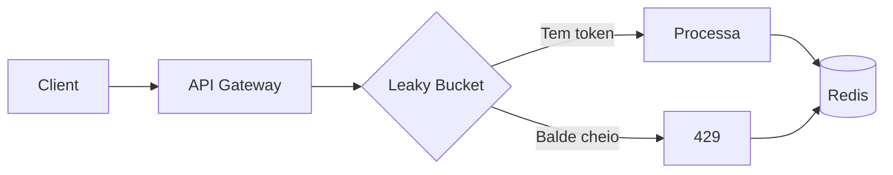

# 09 — Leaky Bucket (Rate Limiter)

**🇧🇷** Rate Limiter Distribuído  
**🇬🇧** Distributed Rate Limiter

---

Sua API está no ar. De repente, 10 mil requisições por segundo. O que acontece? Seu servidor morre, o banco trava, e você perde clientes.

Eu já vi isso acontecer. Não foi um ataque DDoS — foi um cliente que fez um loop mal escrito. O sistema ficou fora do ar por 40 minutos. O prejuízo? Mais de R$ 50 mil em transações não processadas. Tudo porque não tinha rate limiting.

Rate limiting não é opcional. É o que separa uma API robusta de uma que cai na Black Friday. É o que separa um sistema financeiro de um que deixa passar 10 boletos do mesmo cliente em 1 segundo.

O Leaky Bucket é um dos algoritmos mais usados: a água entra em taxa variável (as requisições) e sai a uma taxa constante (o processamento). Se o balde enche, as próximas gotas transbordam (429 Too Many Requests).

Vou te mostrar não só como implementar, mas como fazer direito: distribuído, atômico, e resiliente.

---

## A arquitetura



```
Leaky Bucket (capacidade 100, refill 10/s):
┌──────────────────────────────────────────────┐
│  ┌─┐ ┌─┐ ┌─┐ ┌─┐ ┌─┐                    │
│  │R│ │R│ │R│ │R│ │R│ → processando        │
│  │e│ │e│ │e│ │e│ │e│    (10 req/s)        │
│  │q│ │q│ │q│ │q│ │q│                      │
│  └─┘ └─┘ └─┘ └─┘ └─┘                      │
│  ────────────────────────────────────────  │
│  Transbordo (429)                          │
└──────────────────────────────────────────────┘
```

O balde tem dois parâmetros: capacidade (quantas requisições cabem no burst) e refill (quantas gotas vazam por segundo). A beleza do Leaky Bucket é que ele suaviza picos — você pode ter 100 requisições de uma vez, mas se continuar a 20 req/s, as extras transbordam.

---

## Resolução em TypeScript

### Middleware com Redis

```typescript
import Redis from 'ioredis';

class LeakyBucket {
  private redis: Redis;

  constructor() {
    this.redis = new Redis(process.env.REDIS_URI);
  }

  async checkLimit(key: string, capacity: number, refillRate: number, refillMs: number) {
    const now = Date.now();
    const redisKey = `leaky:${key}`;
    
    // Lua script roda atômico no Redis
    const result = await this.redis.eval(`
      local key = KEYS[1]
      local capacity = tonumber(ARGV[1])
      local refill = tonumber(ARGV[2])
      local interval = tonumber(ARGV[3])
      local now = tonumber(ARGV[4])
      
      local bucket = redis.call('HMGET', key, 'tokens', 'last_refill')
      local tokens = tonumber(bucket[1]) or capacity
      local last = tonumber(bucket[2]) or now
      
      -- Refill baseado no tempo
      local elapsed = now - last
      if elapsed > 0 then
        local add = math.floor(elapsed / interval) * refill
        tokens = math.min(capacity, tokens + add)
      end
      
      if tokens >= 1 then
        tokens = tokens - 1
        redis.call('HMSET', key, 'tokens', tokens, 'last_refill', now)
        redis.call('PEXPIRE', key, interval * 2)
        return {1, tokens, 0}
      else
        return {0, 0, interval - (now % interval)}
      end
    `, 1, redisKey, capacity, refillRate, refillMs, now);
    
    return {
      allowed: result[0] === 1,
      remaining: result[1],
      resetIn: result[2],
    };
  }
}

// Middleware Express/Fastify
function rateLimit(capacity: number, refillRate: number) {
  const bucket = new LeakyBucket();
  
  return async (req: any, res: any, next: any) => {
    const key = `${req.ip}:${req.route.path}`;
    
    const result = await bucket.checkLimit(key, capacity, refillRate, 1000);
    
    res.setHeader('X-RateLimit-Limit', capacity);
    res.setHeader('X-RateLimit-Remaining', result.remaining);
    res.setHeader('X-RateLimit-Reset', Math.ceil(result.resetIn / 1000));
    
    if (!result.allowed) {
      return res.status(429).json({
        error: 'Too Many Requests',
        retryAfter: Math.ceil(result.resetIn / 1000),
      });
    }
    
    next();
  };
}
```

### Por que Lua no Redis?

Se você fez "só incrementar um contador no Redis" como rate limiter, me desculpa, mas está errado.

O problema é race condition. Duas requisições simultâneas lêem o contador, vêem que ainda tem token, e as duas passam. Você acorda com 10 mil requisições processadas quando deveria ter aceitado só 100.

O Lua script resolve isso porque o Redis executa o script inteiro de forma atômica. Nenhuma outra requisição interfere no meio. É como uma transação de banco de dados, mas mais rápida.

### Implementação sem Lua (alternativa com transação Redis)

Se você não pode usar Lua (Redis mais antigo, restrições de infra), dá pra fazer com transação `MULTI/EXEC` e watch:

```typescript
async function checkLimitTransaction(key: string, capacity: number, refillRate: number, refillMs: number) {
  const now = Date.now();
  const redisKey = `leaky:${key}`;
  
  const result = await this.redis.multi()
    .hmget(redisKey, 'tokens', 'last_refill')
    .exec();
  
  const [tokensStr, lastStr] = result[0][1] as [string | null, string | null];
  let tokens = tokensStr ? parseInt(tokensStr) : capacity;
  const last = lastStr ? parseInt(lastStr) : now;
  
  // Refill
  const elapsed = now - last;
  if (elapsed > 0) {
    const add = Math.floor(elapsed / refillMs) * refillRate;
    tokens = Math.min(capacity, tokens + add);
  }
  
  if (tokens >= 1) {
    tokens--;
    await this.redis.multi()
      .hset(redisKey, 'tokens', tokens, 'last_refill', now)
      .pexpire(redisKey, refillMs * 2)
      .exec();
    
    return { allowed: true, remaining: tokens, resetIn: 0 };
  }
  
  return { allowed: false, remaining: 0, resetIn: refillMs - (now % refillMs) };
}
```

Mas atenção: `MULTI/EXEC` não é otimista — ele não faz rollback se outra conexão mudar os dados. Pra isso você precisaria de `WATCH`. O Lua é mais seguro e mais rápido.

### Rate limiter por múltiplas dimensões

Às vezes você precisa limitar por IP, por usuário, por rota, ou tudo junto. Um rate limiter flexível permite combinar chaves:

```typescript
function buildRateLimitKey(req: any, dimensions: string[]): string {
  const parts: string[] = [];
  
  for (const dim of dimensions) {
    switch (dim) {
      case 'ip':
        parts.push(req.ip || req.connection.remoteAddress);
        break;
      case 'route':
        parts.push(req.route?.path || req.url);
        break;
      case 'userId':
        parts.push(req.user?.id || 'anonymous');
        break;
      case 'method':
        parts.push(req.method);
        break;
      case 'apiKey':
        parts.push(req.headers['x-api-key'] || 'unknown');
        break;
    }
  }
  
  return parts.join(':');
}

// Middleware configurável
function createRateLimiter(config: {
  dimensions: string[];
  capacity: number;
  refillRate: number;
  refillMs?: number;
}) {
  const bucket = new LeakyBucket();
  const refillMs = config.refillMs || 1000;
  
  return async (req: any, res: any, next: any) => {
    const key = buildRateLimitKey(req, config.dimensions);
    const result = await bucket.checkLimit(key, config.capacity, config.refillRate, refillMs);
    
    res.setHeader('X-RateLimit-Limit', config.capacity);
    res.setHeader('X-RateLimit-Remaining', result.remaining);
    res.setHeader('X-RateLimit-Reset', Math.ceil(result.resetIn / 1000));
    
    if (!result.allowed) {
      return res.status(429).json({
        error: 'Too Many Requests',
        retryAfter: Math.ceil(result.resetIn / 1000),
      });
    }
    
    next();
  };
}

// Uso
app.use('/api/payments', createRateLimiter({
  dimensions: ['userId', 'route'],
  capacity: 10,
  refillRate: 1,
  refillMs: 1000,
}));
```

### Diferentes estratégias de rate limit

O Leaky Bucket não é a única estratégia. Cada uma tem seu uso:

```typescript
// 1. Token Bucket (similar ao Leaky, mas com refill por intervalo)
class TokenBucket {
  async checkLimit(key: string, capacity: number, refillPerSecond: number) {
    const now = Date.now();
    const redisKey = `token:${key}`;
    
    const result = await this.redis.eval(`
      local key = KEYS[1]
      local capacity = tonumber(ARGV[1])
      local refill = tonumber(ARGV[2])
      local now = tonumber(ARGV[3])
      
      local bucket = redis.call('HMGET', key, 'tokens', 'last_refill')
      local tokens = tonumber(bucket[1]) or capacity
      local last = tonumber(bucket[2]) or now
      
      local elapsed = now - last
      local add = elapsed * refill / 1000
      if add > 0 then
        tokens = math.min(capacity, tokens + add)
      end
      
      if tokens >= 1 then
        tokens = tokens - 1
        redis.call('HMSET', key, 'tokens', tokens, 'last_refill', now)
        redis.call('PEXPIRE', key, 10000)
        return {1, tokens, 0}
      else
        local retryAfter = math.ceil((1 - tokens) / refill * 1000)
        return {0, 0, retryAfter}
      end
    `, 1, redisKey, capacity, refillPerSecond, now);
    
    return {
      allowed: result[0] === 1,
      remaining: result[1],
      resetIn: result[2],
    };
  }
}

// 2. Fixed Window (mais simples, menos preciso)
class FixedWindow {
  async checkLimit(key: string, maxRequests: number, windowMs: number) {
    const now = Date.now();
    const windowKey = Math.floor(now / windowMs);
    const redisKey = `fixed:${key}:${windowKey}`;
    
    const count = await this.redis.incr(redisKey);
    if (count === 1) {
      await this.redis.pexpire(redisKey, windowMs);
    }
    
    return {
      allowed: count <= maxRequests,
      remaining: Math.max(0, maxRequests - count),
      resetIn: windowMs - (now % windowMs),
    };
  }
}

// 3. Sliding Window Log (mais preciso, mais memória)
class SlidingWindowLog {
  async checkLimit(key: string, maxRequests: number, windowMs: number) {
    const now = Date.now();
    const redisKey = `sliding:${key}`;
    const cutoff = now - windowMs;
    
    await this.redis.zremrangebyscore(redisKey, 0, cutoff);
    
    const count = await this.redis.zcard(redisKey);
    
    if (count < maxRequests) {
      await this.redis.zadd(redisKey, now, `${now}:${Math.random()}`);
      await this.redis.pexpire(redisKey, windowMs);
      return { allowed: true, remaining: maxRequests - count - 1, resetIn: 0 };
    }
    
    const oldest = await this.redis.zrange(redisKey, 0, 0, 'WITHSCORES');
    const resetIn = oldest.length >= 2 ? parseInt(oldest[1]) + windowMs - now : 0;
    
    return { allowed: false, remaining: 0, resetIn };
  }
}
```

Recomendo Leaky Bucket pra maioria dos casos. Fixed Window é simples mas tem o problema do "burst no limiar da janela" — se a janela reiniciar, 100 requisições passam de uma vez. Sliding Window Log é preciso mas consome mais memória (ZSET com timestamp de cada request).

### Circuit Breaker (bonus)

Rate limiting é preventivo. Circuit breaker é reativo. Quando um serviço downstream está caindo, você para de chamá-lo:

```typescript
class CircuitBreaker {
  private failures: number = 0;
  private lastFailureTime: number = 0;
  private state: 'CLOSED' | 'OPEN' | 'HALF_OPEN' = 'CLOSED';
  
  constructor(
    private threshold: number = 5,
    private cooldownMs: number = 30000,
    private halfOpenMaxRequests: number = 3
  ) {}
  
  async call<T>(fn: () => Promise<T>, fallback: () => Promise<T>): Promise<T> {
    if (this.state === 'OPEN') {
      if (Date.now() - this.lastFailureTime >= this.cooldownMs) {
        this.state = 'HALF_OPEN';
      } else {
        return fallback();
      }
    }
    
    try {
      const result = await fn();
      
      if (this.state === 'HALF_OPEN') {
        this.state = 'CLOSED';
        this.failures = 0;
      }
      
      return result;
    } catch (err) {
      this.failures++;
      this.lastFailureTime = Date.now();
      
      if (this.failures >= this.threshold) {
        this.state = 'OPEN';
      }
      
      return fallback();
    }
  }
}

// Uso: protege chamadas a API de terceiros
const paymentsBreaker = new CircuitBreaker(5, 30000);

app.post('/api/process-payment', async (req, reply) => {
  const result = await paymentsBreaker.call(
    () => processPayment(req.body),
    () => ({ status: 'queued', message: 'Pagamento será processado em breve' })
  );
  
  return reply.send(result);
});
```

---

## Resolução em Go

```go
package main

import (
    "context"
    "fmt"
    "net/http"
    "strconv"
    "time"
    "github.com/redis/go-redis/v9"
)

type RateLimiter struct {
    rdb *redis.Client
}

func NewRateLimiter(addr string) *RateLimiter {
    return &RateLimiter{
        rdb: redis.NewClient(&redis.Options{Addr: addr}),
    }
}

func (rl *RateLimiter) Check(ctx context.Context, key string,
    capacity, refillRate int, refillMs int64) (bool, int, int64) {

    now := time.Now().UnixMilli()

    script := redis.NewScript(`
        local key = KEYS[1]
        local capacity = tonumber(ARGV[1])
        local refill = tonumber(ARGV[2])
        local interval = tonumber(ARGV[3])
        local now = tonumber(ARGV[4])

        local bucket = redis.call('HMGET', key, 'tokens', 'last_refill')
        local tokens = tonumber(bucket[1]) or capacity
        local last = tonumber(bucket[2]) or now

        local elapsed = now - last
        if elapsed > 0 then
            local add = math.floor(elapsed / interval) * refill
            tokens = math.min(capacity, tokens + add)
        end

        if tokens >= 1 then
            tokens = tokens - 1
            redis.call('HMSET', key, 'tokens', tokens, 'last_refill', now)
            redis.call('PEXPIRE', key, interval * 2)
            return {1, tokens, 0}
        else
            return {0, 0, interval - (now % interval)}
        end
    `)

    result, err := script.Run(ctx, rl.rdb, []string{key},
        capacity, refillRate, refillMs, now).Result()
    if err != nil {
        return true, capacity, 0 // Fail open
    }

    vals := result.([]interface{})
    allowed := vals[0].(int64) == 1
    remaining := int(vals[1].(int64))
    resetIn := vals[2].(int64)

    return allowed, remaining, resetIn
}

func (rl *RateLimiter) Middleware(capacity, refill int) func(http.Handler) http.Handler {
    return func(next http.Handler) http.Handler {
        return http.HandlerFunc(func(w http.ResponseWriter, r *http.Request) {
            key := r.RemoteAddr + ":" + r.URL.Path

            allowed, remaining, resetIn := rl.Check(r.Context(), key, capacity, refill, 1000)

            w.Header().Set("X-RateLimit-Limit", strconv.Itoa(capacity))
            w.Header().Set("X-RateLimit-Remaining", strconv.Itoa(remaining))
            w.Header().Set("X-RateLimit-Reset", fmt.Sprintf("%d", resetIn/1000))

            if !allowed {
                w.Header().Set("Retry-After", fmt.Sprintf("%d", resetIn/1000))
                http.Error(w, `{"error":"Too Many Requests"}`, http.StatusTooManyRequests)
                return
            }

            next.ServeHTTP(w, r)
        })
    }
}
```

### Rate limiter com middleware hierárquico

Em Go, você pode compor middlewares para criar limites por camada:

```go
// Rate limiter global (por IP)
func GlobalRateLimit(next http.Handler) http.Handler {
    return http.HandlerFunc(func(w http.ResponseWriter, r *http.Request) {
        key := "global:" + getClientIP(r)
        allowed, remaining, _ := rateLimiter.Check(r.Context(), key, 1000, 100, 1000)
        
        if !allowed {
            http.Error(w, "Global rate limit exceeded", http.StatusTooManyRequests)
            return
        }
        
        next.ServeHTTP(w, r)
    })
}

// Rate limiter por rota
func RouteRateLimit(capacity, refill int) func(http.Handler) http.Handler {
    return func(next http.Handler) http.Handler {
        return http.HandlerFunc(func(w http.ResponseWriter, r *http.Request) {
            key := "route:" + r.Method + ":" + r.URL.Path
            allowed, remaining, _ := rateLimiter.Check(r.Context(), key, capacity, refill, 1000)
            
            if !allowed {
                http.Error(w, "Route rate limit exceeded", http.StatusTooManyRequests)
                return
            }
            
            next.ServeHTTP(w, r)
        })
    }
}

// Rate limiter por usuário autenticado
func UserRateLimit(capacity, refill int) func(http.Handler) http.Handler {
    return func(next http.Handler) http.Handler {
        return http.HandlerFunc(func(w http.ResponseWriter, r *http.Request) {
            userID := getUserIDFromContext(r.Context())
            if userID == "" {
                next.ServeHTTP(w, r)
                return
            }
            
            key := "user:" + userID
            allowed, remaining, _ := rateLimiter.Check(r.Context(), key, capacity, refill, 1000)
            
            if !allowed {
                http.Error(w, "User rate limit exceeded", http.StatusTooManyRequests)
                return
            }
            
            next.ServeHTTP(w, r)
        })
    }
}

// Composição
mux := http.NewServeMux()
mux.Handle("/api/", GlobalRateLimit(
    RouteRateLimit(100, 10)(
        UserRateLimit(50, 5)(
            http.HandlerFunc(apiHandler),
        ),
    ),
))
```

### Fallback local (quando Redis cai)

Se o Redis cair, seu rate limiter precisa decidir: deixa passar ou bloqueia todo mundo?

```go
type FallbackRateLimiter struct {
    redis   *RateLimiter
    local   *sync.Mutex
    counters map[string]struct {
        tokens    int
        lastRefill int64
    }
}

func (frl *FallbackRateLimiter) Check(ctx context.Context, key string,
    capacity, refillRate int, refillMs int64) (bool, int, int64) {
    
    // Tenta Redis primeiro
    allowed, remaining, resetIn := frl.redis.Check(ctx, key, capacity, refillRate, refillMs)
    if err == nil {
        return allowed, remaining, resetIn
    }
    
    // Redis falhou - fallback local (menos preciso, mas funciona)
    frl.local.Lock()
    defer frl.local.Unlock()
    
    now := time.Now().UnixMilli()
    counter, exists := frl.counters[key]
    if !exists {
        counter = struct{...}{tokens: capacity, lastRefill: now}
    }
    
    // Refill
    elapsed := now - counter.lastRefill
    if elapsed > 0 {
        add := (elapsed / refillMs) * refillRate
        counter.tokens = min(capacity, counter.tokens + add)
    }
    
    if counter.tokens >= 1 {
        counter.tokens--
        frl.counters[key] = counter
        return true, counter.tokens, 0
    }
    
    return false, 0, refillMs - (now % refillMs)
}
```

### TS vs Go: Rate Limiter

A implementação do Lua script é idêntica nas duas linguagens — o Redis não liga pra linguagem. A diferença está no entorno.

No TypeScript, o `ioredis` é mais maduro que o `go-redis` pra Lua. A função `eval` aceita o script como string e o array de keys. O resultado é tipado (parcialmente). No Go, você precisa fazer type assertion pra `[]interface{}` e depois converter cada elemento.

No TypeScript, o middleware é mais limpo porque Express/Fastify têm um ecossistema de middleware maduro. No Go, você escreve `func(http.Handler) http.Handler` que é funcional mas mais verboso.

A vantagem do Go aparece na concorrência. O rate limiter em Go com `sync.Mutex` pra fallback local é previsível e sem surpresas. No TypeScript, fallback local precisaria de um `Map` compartilhado entre workers — e cada worker tem seu próprio mapa. Você precisaria de um cache compartilhado (Redis de novo) ou aceitar a imprecisão.

---

## Como testar

```bash
make infra-up
pnpm --filter @banking/leaky-bucket dev

# Load test
npx autocannon -c 100 -d 10 http://localhost:3009/api/test

# Ver headers
curl -v http://localhost:3009/api/test 2>&1 | grep RateLimit
```

### Teste manual de rate limiting

```bash
# Envia 15 requests em sequência
for i in $(seq 1 15); do
  echo "Request $i:"
  curl -s -o /dev/null -w "Status: %{http_code}, RateLimit-Remaining: %{header{x-ratelimit-remaining}}\n" \
    http://localhost:3009/api/test
done
```

Com capacidade 10 e refill 1/s, os requests 1-10 devem passar (status 200), e os requests 11-15 devem ser bloqueados (status 429) até o bucket refill.

### Teste de concorrência

```bash
# 50 requests simultâneos
for i in $(seq 1 50); do
  curl -s http://localhost:3009/api/test &
done
wait
```

Com o Lua script atômico, exatamente 10 requests devem passar. Os outros 40 devem receber 429. Sem race condition.

### Teste de refill

```bash
# Enche o bucket
for i in $(seq 1 10); do curl -s http://localhost:3009/api/test & done
wait

# Espera 2 segundos (2 tokens refill)
sleep 2

# Deve aceitar 2 requests
for i in $(seq 1 3); do
  curl -s -o /dev/null -w "%{http_code} " http://localhost:3009/api/test
done
# Saída esperada: 200 200 429
```

## Troubleshooting

**Problema: Rate limit está bloqueando requisições legítimas**
Sua capacidade está muito baixa ou seu refill está muito lento. Calcule: quantas requisições por segundo sua API realmente recebe em pico? Qual a média? A capacidade deve ser 2-3x o pico esperado.

**Problema: Rate limit não está bloqueando nada**
O Redis está acessível? O Lua script está compilando? Verifique os logs do Redis. Se o script falhar silenciosamente, o `fail open` pode estar deixando tudo passar.

**Problema: Headers não estão sendo enviados**
O middleware está sendo aplicado depois de um middleware que já escreveu a resposta? A ordem dos middlewares importa. O rate limiter precisa ser o primeiro da cadeia.

**Problema: Rate limit por IP não funciona atrás de proxy**
Se você tem NGINX ou Cloudflare na frente, `req.ip` pode ser sempre o IP do proxy. Configure o trust proxy no Express ou use o header `X-Forwarded-For`.

---

## Lições aprendidas

1. **Lua script no Redis é atômico** — Sem race condition. Milhões de requisições concorrentes não quebram o bucket. O Redis executa o script em uma única thread, então não tem surpresa.

2. **Fail open vs fail closed** — Se o Redis cai, sua API para? Depende. Financeiro: fail closed (bloqueia tudo, segurança primeiro). Rede social: fail open (deixa passar, melhor ter lentidão que ficar fora do ar).

3. **Headers são contrato** — `X-RateLimit-Limit`, `Remaining`, `Reset` não são opcionais. O cliente precisa saber quando pode tentar de novo. Sem headers, o cliente fica cego e faz retry na mesma hora, piorando o problema.

4. **Capacidade e refill são diferentes** — Capacidade é o burst. Refill é a taxa sustentável. Um sem o outro não faz sentido. Capacidade 10 com refill 10/s significa 10 requests de uma vez, depois 1 por segundo. Capacidade 100 com refill 10/s significa 100 requests de uma vez, depois 10 por segundo.

5. **Teste com carga real** — `autocannon` ou `wrk` com 100 conexões concorrentes. Se o rate limit segurar, sua API está pronta. Se não segurar, você tem um bug.

6. **Dimensione corretamente** — Rate limit por IP protege contra um único cliente mal comportado. Rate limit por rota protege endpoints específicos (login mais restrito que listagem). Rate limit por usuário protege contra abuso de conta comprometida.

7. **Monitore os 429s** — Se você está vendo muitos 429, algo está errado. Pode ser cliente mal configurado, ou pode ser sua capacidade muito baixa. Gráfico de 429s por hora é tão importante quanto gráfico de latência.

8. **Retry-After é lei** — Cliente bem comportado respeita `Retry-After`. Cliente mal comportado ignora. Seu rate limit precisa funcionar mesmo se o cliente ignorar. O bucket não deixa passar mesmo se o cliente tentar 1000 vezes por segundo.

9. **Rate limit não substitui autenticação** — Rate limit é proteção contra abuso, não contra ataque. Se você precisa proteger endpoints de login, use rate limit + captcha + bloqueio de IP. Rate limit sozinho não segura ataque distribuído.

10. **Gráfico de 429s no dashboard** — Se você não monitora quantos 429s sua API retorna, você não sabe se o rate limit está funcionando ou se está quebrando clientes legítimos. Métrica: 429s por minuto, por rota, por cliente.

## Código completo

O rate limiter está em `packages/leaky-bucket/`. Pra rodar:

```bash
# Sobe Redis
make infra-up

# Roda o servidor de teste
pnpm --filter @banking/leaky-bucket dev

# Teste de carga
npx autocannon -c 100 -d 30 http://localhost:3009/api/test

# Testes unitários
pnpm --filter @banking/leaky-bucket test
```

### Testes do rate limiter

```typescript
// tests/rate-limiter.test.ts
import { describe, it, expect, beforeAll, afterAll } from 'vitest';
import Redis from 'ioredis';
import { LeakyBucket } from '../src/leaky-bucket';

describe('LeakyBucket', () => {
  let bucket: LeakyBucket;
  let redis: Redis;

  beforeAll(() => {
    redis = new Redis('redis://localhost:6379');
    bucket = new LeakyBucket();
  });

  afterAll(async () => {
    await redis.quit();
  });

  it('deve permitir primeira requisição', async () => {
    const result = await bucket.checkLimit('test:key1', 10, 1, 1000);
    expect(result.allowed).toBe(true);
    expect(result.remaining).toBe(9);
  });

  it('deve consumir tokens sequencialmente', async () => {
    const key = 'test:key2';

    for (let i = 0; i < 10; i++) {
      const result = await bucket.checkLimit(key, 10, 1, 1000);
      expect(result.allowed).toBe(true);
      expect(result.remaining).toBe(9 - i);
    }

    const result = await bucket.checkLimit(key, 10, 1, 1000);
    expect(result.allowed).toBe(false);
    expect(result.remaining).toBe(0);
  });

  it('deve refill com o tempo', async () => {
    const key = 'test:key3';

    // Esgota
    for (let i = 0; i < 5; i++) {
      await bucket.checkLimit(key, 5, 2, 1000);
    }

    // Espera refill de 2 tokens (1 segundo)
    await new Promise(r => setTimeout(r, 1100));

    const result = await bucket.checkLimit(key, 5, 2, 1000);
    expect(result.allowed).toBe(true);
    expect(result.remaining).toBe(1); // refill de 2, consumiu 1
  });

  it('deve ter chaves diferentes para clientes diferentes', async () => {
    const resultA = await bucket.checkLimit('client:A', 3, 1, 1000);
    const resultB = await bucket.checkLimit('client:B', 3, 1, 1000);

    expect(resultA.allowed).toBe(true);
    expect(resultB.allowed).toBe(true);
  });
});
```

### Expondo métricas

```typescript
// middleware/metrics.ts
// Exporta métricas do rate limiter pro Prometheus
import prometheus from 'prom-client';

const rateLimitCounter = new prometheus.Counter({
  name: 'rate_limit_blocked_total',
  help: 'Total de requisições bloqueadas pelo rate limit',
  labelNames: ['route', 'ip_prefix'],
});

const rateLimitRemaining = new prometheus.Gauge({
  name: 'rate_limit_remaining',
  help: 'Tokens restantes no bucket',
  labelNames: ['key'],
});

// Integração no middleware
app.use((req, res, next) => {
  const originalJson = res.json.bind(res);

  res.json = function (body: any) {
    if (res.statusCode === 429) {
      const ipPrefix = req.ip?.split('.').slice(0, 2).join('.') || 'unknown';
      rateLimitCounter.inc({ route: req.route?.path || 'unknown', ip_prefix: ipPrefix });
    }
    return originalJson(body);
  };

  next();
});
```

Com essas métricas no Prometheus + Grafana, você vê em tempo real: "a rota /api/login está bloqueando 500 requisições por minuto". Aí você sabe se é ataque ou se a capacidade está baixa.
