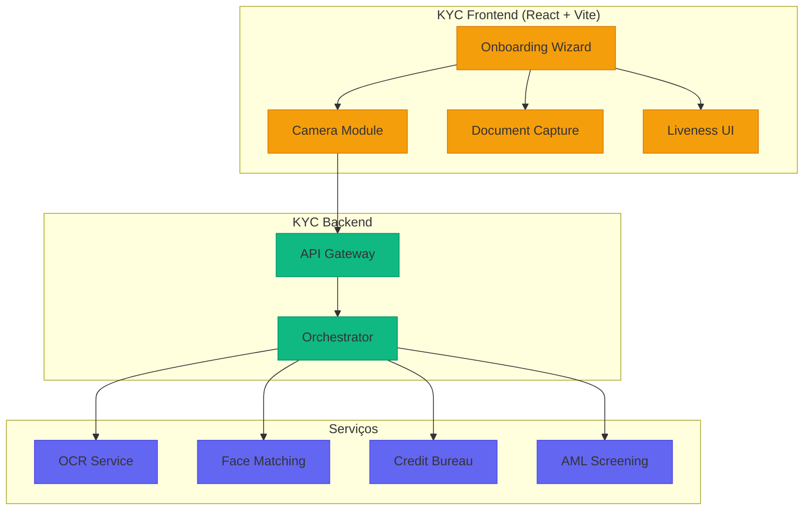
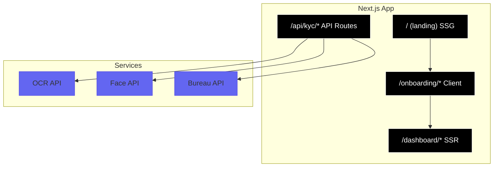

# Desafio 11: KYC System — Onboarding Digital à Prova de Fraude

**🇧🇷** Sistema de Verificação de Identidade  
**🇬🇧** Know Your Customer System

---

**KYC (Know Your Customer)** é o processo regulatório obrigatório para toda instituição financeira no Brasil. Regulamentado pelo **BACEN (Resolução 4.753/2019)** e pela **Lei 9.613/1998 (Lavagem de Dinheiro)**, o KYC é a **primeira linha de defesa** contra fraudes, lavagem de dinheiro e financiamento ao terrorismo.

## Switch: React (Vite) vs Next.js

<LanguageToggle />

<div class="lang-content vite" style="display:block;">

### Por que React (Vite) para KYC?

| Vantagem | Descrição |
|----------|-----------|
| **SPA nativo** | Fluxo contínuo sem reloads |
| **MediaDevices** | Acesso direto à câmera |
| **ML client-side** | TensorFlow.js para edge detection |
| **Bundle pequeno** | Carrega rápido em mobile |
| **Hot Reload** | DX excelente |

### Arquitetura



### UseCamera Hook

```typescript
export function useCamera(options: UseCameraOptions = {}): UseCameraReturn {
  const { facingMode = 'environment', resolution = { width: 1920, height: 1080 } } = options;
  const videoRef = useRef<HTMLVideoElement>(null);
  const streamRef = useRef<MediaStream | null>(null);
  const [isStreaming, setIsStreaming] = useState(false);

  const startCamera = useCallback(async () => {
    const stream = await navigator.mediaDevices.getUserMedia({
      video: { facingMode, width: { ideal: resolution.width }, height: { ideal: resolution.height } },
      audio: false,
    });
    streamRef.current = stream;
    if (videoRef.current) {
      videoRef.current.srcObject = stream;
      await videoRef.current.play();
      setIsStreaming(true);
    }
  }, [facingMode]);

  const captureImage = useCallback((): string | null => {
    if (!videoRef.current || !canvasRef.current) return null;
    const canvas = canvasRef.current;
    canvas.width = videoRef.current.videoWidth;
    canvas.height = videoRef.current.videoHeight;
    canvas.getContext('2d')!.drawImage(videoRef.current, 0, 0);
    return canvas.toDataURL('image/jpeg', 0.92);
  }, []);

  const stopCamera = useCallback(() => {
    streamRef.current?.getTracks().forEach(t => t.stop());
    setIsStreaming(false);
  }, []);

  useEffect(() => () => stopCamera(), [stopCamera]);
  return { videoRef, canvasRef, isStreaming, startCamera, stopCamera, captureImage };
}
```

### Zustand Store

```typescript
export const useKYCStore = create<KYCStore>()(
  persist(
    (set) => ({
      session: null,
      initializeSession: (sessionId) => set({ session: { sessionId, currentStep: 'PERSONAL_DATA', status: 'PENDING' } }),
      setCurrentStep: (step) => set((s) => ({ session: s.session ? { ...s.session, currentStep: step } : null })),
      setDocument: (data) => set((s) => ({ session: s.session ? { ...s.session, document: data } : null })),
      setLiveness: (data) => set((s) => ({ session: s.session ? { ...s.session, liveness: data } : null })),
      reset: () => set({ session: null }),
    }),
    { name: 'kyc-session', storage: createJSONStorage(() => sessionStorage) }
  )
);
```

### Comparação: React (Vite) vs Next.js

| Aspecto | React (Vite) | Next.js |
|---------|-------------|---------|
| **Fluxo SPA** | Nativo, sem reloads | Hydration overhead |
| **Camera/MediaDevices** | Acesso direto | Mais complexo |
| **ML client-side** | TensorFlow.js fácil | Server Components limitam |
| **Bundle** | ~150KB gzipped | ~300KB+ |
| **SEO** | Não precisa (KYC) | SSR útil para landing |
| **API Routes** | Backend separado | Integrado |

### Casos Reais

- **Nubank** (React Native + React) — 80M+ clientes, onboarding < 5min
- **C6 Bank** (React) — 20M+ clientes, OCR próprio
- **Stone** (React) — 5M+ merchants, KYC empresarial

</div>

<div class="lang-content next" style="display:none;">

### Por que Next.js para KYC?

| Vantagem | Descrição |
|----------|-----------|
| **Portal unificado** | Landing + KYC + Dashboard |
| **API Routes** | Backend no mesmo projeto |
| **SSR/SSG** | Landing pages com SEO |
| **Server Components** | Auth check sem JS extra |
| **Streaming** | Uploads progressivos |

### Arquitetura Next.js



### Estrutura de Rotas

```
app/
├── (marketing)/page.tsx
├── onboarding/
│   ├── layout.tsx
│   ├── personal/page.tsx
│   ├── document/page.tsx
│   ├── liveness/page.tsx
│   └── review/page.tsx
├── dashboard/page.tsx
└── api/kyc/
    ├── sessions/route.ts
    ├── documents/route.ts
    └── liveness/route.ts
```

### Onboarding Layout (Server Component)

```tsx
// app/onboarding/layout.tsx
import { redirect } from 'next/navigation';
import { cookies } from 'next/headers';
import { Stepper } from '@/components/kyc/Stepper';

export default async function OnboardingLayout({ children }) {
  const sessionId = cookies().get('kyc-session')?.value;
  if (!sessionId) redirect('/onboarding');

  const response = await fetch(`${process.env.API_URL}/kyc/sessions/${sessionId}`, {
    headers: { Cookie: `kyc-session=${sessionId}` },
    cache: 'no-store',
  });
  const session = await response.json();

  return (
    <div className="min-h-screen">
      <Stepper steps={steps} currentStep={session.currentStep} />
      <main>{children}</main>
    </div>
  );
}
```

### API Route com Streaming

```typescript
// app/api/kyc/documents/route.ts
export async function POST(request: NextRequest) {
  const formData = await request.formData();
  const file = formData.get('document') as File;

  const blob = await put(`kyc/${sessionId}/${Date.now()}.jpg`, file, { access: 'public' });
  const ocrResult = await runOCR(blob.url);

  return NextResponse.json({ success: true, documentUrl: blob.url, ocr: ocrResult });
}
```

### Server Actions

```typescript
// app/onboarding/personal/actions.ts
'use server';

const PersonalDataSchema = z.object({
  fullName: z.string().min(3).max(100),
  cpf: z.string().transform(v => v.replace(/\D/g, '')).refine(validateCPF),
  email: z.string().email(),
  phone: z.string().refine(validatePhone),
});

export async function submitPersonalData(formData: FormData) {
  const validated = PersonalDataSchema.parse(Object.fromEntries(formData));
  // Server-side validation + AML check + save
  redirect('/onboarding/document');
}
```

### Comparação: React (Vite) vs Next.js

| Aspecto | React (Vite) | Next.js |
|---------|-------------|---------|
| **Fluxo SPA** | Nativo, sem reloads | Hydration overhead |
| **Camera** | Acesso direto | Mais complexo |
| **SEO** | Não precisa | SSR útil para landing |
| **API Routes** | Backend separado | Integrado |
| **Server Components** | N/A | Auth check sem JS |
| **Streaming** | Manual | Nativo |

### Casos Reais

- **Inter** (Next.js) — 30M+ clientes, portal unificado
- **C6 Bank** (Next.js) — 20M+ clientes, App Router

</div>

---

## Como testar

```bash
# React (Vite)
cd packages/frontend/kyc-web
pnpm dev

# Next.js
cd packages/frontend/kyc-portal
pnpm dev
```

---

## Lições aprendidas

1. **KYC = porta de entrada** — Onboarding rápido (5min) converte 3x mais
2. **Active liveness é obrigatório** — Selfie estática é vulnerável
3. **Edge detection client-side** — Reduz retakes drasticamente
4. **Logs imutáveis** — 5+ anos (BACEN)
5. **Acessibilidade** — Upload como fallback para câmera
6. **React (Vite)** — Melhor para KYC isolado, performance máxima
7. **Next.js** — Melhor para portal unificado (landing + KYC + dashboard)
8. **CPF validation** — Sempre client-side E server-side
9. **OCR preciso** — P95 < 3s, accuracy > 98%
10. **Face match** — > 95% para aprovação automática
