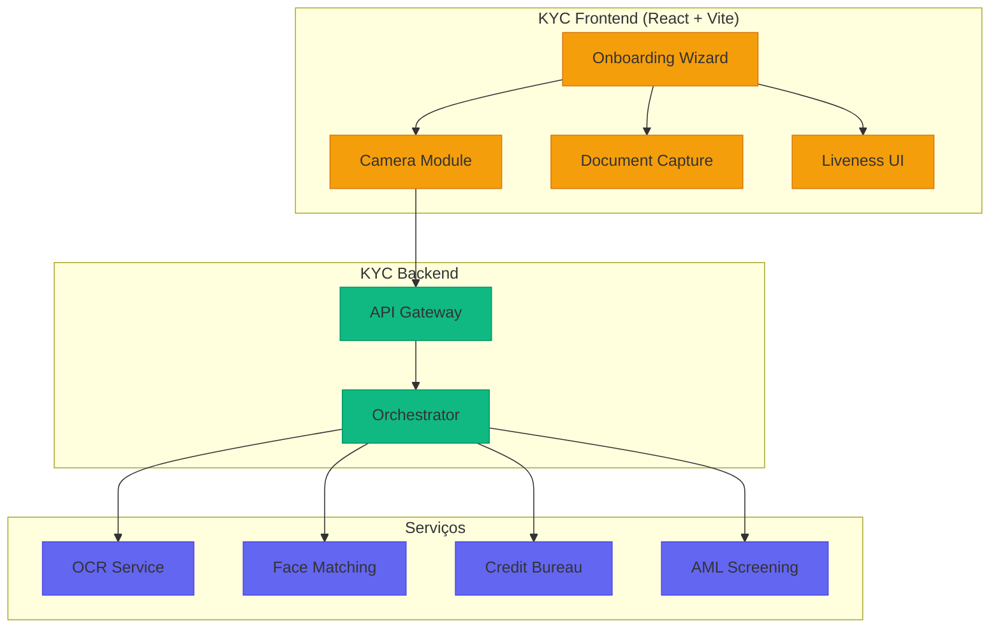
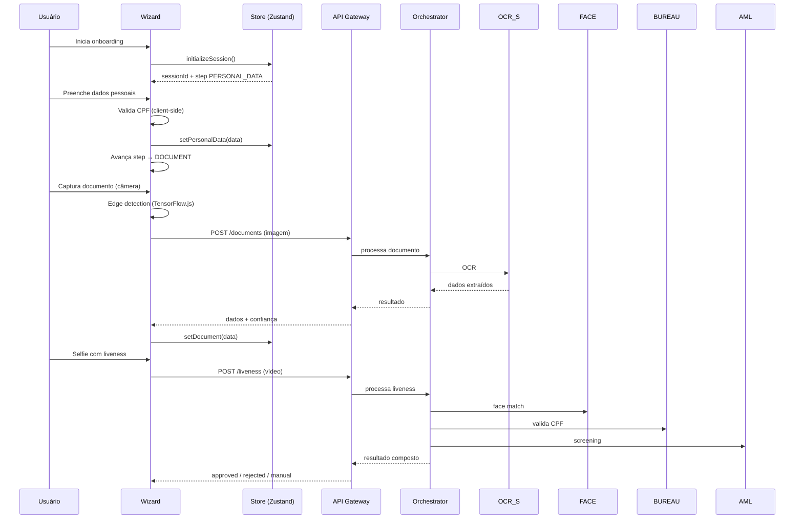
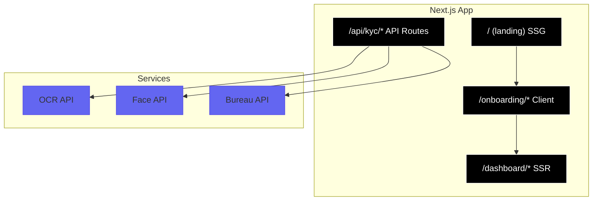

# Desafio 11: KYC System — Onboarding Digital à Prova de Fraude

**🇧🇷** Sistema de Verificação de Identidade  
**🇬🇧** Know Your Customer System

---

## 🎯 Objetivos de Aprendizado

- Implementar um fluxo completo de KYC (captura → OCR → face match → validação)
- Dominar captura de documentos com MediaDevices e canvas API
- Projetar state management resiliente para onboarding multi-step (Zustand + persist)
- Diferenciar SPA (Vite) de SSR (Next.js) para aplicações KYC
- Integrar serviços de OCR, face matching e AML screening
- Implementar validação de CPF com algoritmo dos dígitos verificadores
- Garantir resiliência em sessões KYC concorrentes

---

## 📋 Pré-requisitos

### 🧠 Conceitos
- KYC (Know Your Customer)
- PLD/FT (Prevenção à Lavagem de Dinheiro)
- LGPD para dados biométricos
- BACEN Resolução 4.658/2018
- Due diligence baseada em risco (SDD/CDD/EDD)

### 📚 Desafios Anteriores
- [Desafio 10: Landing Page](/challenges/10-landing-page) — o onboarding KYC é integrado à landing page de conversão

### 🛠️ Ferramentas
- Docker
- PostgreSQL
- Câmera (webcam/mobile)
- Azure Face API ou AWS Rekognition

### 💻 Técnico
- Next.js 14+ (App Router)
- React 18+
- TypeScript
- Zustand (state management)
- react-webcam
- OCR (Tesseract.js)
- Validação de CPF/CNPJ

---

## 📖 Abertura — O Que é KYC?

"Vou te explicar. você já abriu uma conta digital nos últimos anos? Pegou o celular, tirou foto do documento, fez um selfie, e em 5 minutos tava com a conta pronta. Parece simples, né? Mas por trás desse fluxo de 5 minutos existe um sistema que precisa validar sua identidade, checar se você não é um fraudador, verificar se seu CPF não está em lista de lavagem de dinheiro, e ainda garantir que a selfie não é um deepfake.

Isso é um sistema de **KYC** — Know Your Customer.

Antigamente — e quando eu digo antigamente é antes do banking digital — KYC era presencial. Você levava seus documentos, xerox autenticada, comprovante de residência, e esperava dias. O gerente conferia, carimbava, arquivava. Tudo em papel, tudo manual.

Só que hoje não dá mais. Hoje o cliente quer abrir conta em 5 minutos, pelo celular, sem falar com ninguém. E o KYC? Continua sendo a mesma responsabilidade de sempre — **saber quem é seu cliente**. Mas agora você precisa fazer isso com IA, visão computacional, e integração com bureaus de crédito.

E tem a regulação. O **BACEN (Resolução 4.753/2019)** e a **Lei 9.613/1998 (Lavagem de Dinheiro)** mandam: toda instituição financeira no Brasil precisa saber quem é seu cliente. Não é opção. É lei.

Esse desafio é sobre **construir esse coração de onboarding digital**. Não com papel, não com carimbo, mas com React, TypeScript, OCR e face matching — porque o mundo mudou, mas a responsabilidade de saber quem está do outro lado não mudou."

Mas para entender o KYC moderno, precisamos voltar no tempo. O conceito de "Conheça seu cliente" não nasceu em fintech — nasceu no combate ao terrorismo. Em outubro de 2001, depois dos atentados de 11 de setembro, o congresso americano aprovou o **USA PATRIOT Act**. O Título III da lei exigia que instituições financeiras americanas implementassem programas de identificação de clientes — e o resto do mundo seguiu. Em 2003, o **GAFI (Grupo de Ação Financeira)** revisou suas 40 Recomendações para incluir KYC como pilar. O Brasil, como membro do GAFI, internalizou essas regras com a **Lei 9.613/1998** (atualizada pela 12.683/2012) e as circulares do BACEN que vieram depois.

O marco regulatório brasileiro é denso e em camadas. A **Resolução 4.658/2018** do BACEN definiu a política de segurança cibernética que toda instituição autorizada precisa ter — e o KYC digital está no centro dela. A **Resolução 4.753/2019** foi além: estabeleceu requisitos para abertura de contas por meios eletrônicos, exigindo que o processo fosse "Seguro, íntegro e confiável". E a **Resolução 4.893/2021** disciplinou o compartilhamento de dados de fraudes entre instituições — criando um ecossistema onde um CPF fraudado no banco A fica disponível para o banco B rejeitar. Por cima disso tudo, a **LGPD (Lei 13.709/2018)** colocou dados biométricos (foto do rosto, vídeo de selfie) na categoria de dados sensíveis — com restrições severas de coleta, armazenamento e exclusão. O KYC digital brasileiro opera sob a intersecção de pelo menos quatro marcos regulatórios simultâneos.

E as fintechs brasileiras viraram referência mundial nesse jogo. O **Nubank** processa mais de 80 milhões de clientes com um onboarding que leva menos de 5 minutos — usando React Native e React no frontend, com uma combinação de OCR proprietário e face matching de terceiros. O **Mercado Pago** valida identidades de milhões de microempreendedores em toda a América Latina. A **Stone** faz KYC empresarial para mais de 5 milhões de comerciantes. Todos eles resolveram o mesmo quebra-cabeça: como validar identidade em escala, com baixo atrito, respeitando regulação, e sem deixar fraudador passar.

Mas o custo de errar é brutal. Um **falso positivo** — rejeitar um cliente legítimo — custa o LTV (Lifetime Value) de um cliente que pode chegar a R$ 2.000,00 por ano em receita. Um **falso negativo** — aprovar um fraudador — custa muito mais: um único laranja pode abrir dezenas de contas em sequência, movimentar milhões em transações fraudulentas, e gerar multas regulatórias que chegam a centenas de milhares de reais. Em 2023, um golpe usando deepfake de voz passou pelo KYC de um banco americano e permitiu uma transferência de US$ 35 milhões. Em 2024, uma quadrilha brasileira foi presa por abrir mais de 2.000 contas digitais usando documentos adulterados e selfies geradas por IA — tudo passou por sistemas de KYC "Básicos" que só faziam OCR sem liveness.

Os números brasileiros são alarmantes. A **Federação Brasileira de Bancos (Febraban)** estima que fraudes financeiras digitais movimentam mais de R$ 2,5 bilhões por ano no Brasil. Desse total, uma parcela significativa começa no onboarding: contas abertas com identidades falsas, documentos adulterados, ou deepfakes. Cada conta aprovada indevidamente é um passivo que pode explodir meses depois, quando a conta é usada como laranja para lavagem de dinheiro ou como intermediária para golpes de pix. Um sistema de KYC robusto é literalmente a primeira — e mais importante — linha de defesa de qualquer instituição financeira digital.

E o que torna isso especialmente desafiador é a diversidade documental brasileira. Diferente dos Estados Unidos, onde o driver's license é padronizado, ou da Europa, onde o passaporte é universal, o Brasil tem o **RG com 27 formatos estaduais diferentes**, a **CNH antiga (papel moeda)** que ainda vale até 2032, a **CNH digital com QR Code** que veio em 2022, o **CRLV digital**, o **RNE (Registro Nacional de Estrangeiro)**, e dezenas de documentos de classe (OAB, CRM, CREA). Cada um tem layout diferente, campos em posições diferentes, fontes diferentes, e elementos de segurança diferentes. Um sistema de KYC brasileiro precisa dar conta dessa sopa de documentos — e ainda separar um documento real de uma adulteração convincente.

---

## 🔥 O Problema

Fraude de identidade é um negócio de bilhões. Literalmente. No Brasil, estima-se que fraudes financeiras movimentam mais de **R$ 2 bilhões por ano**. E a porta de entrada? Sempre a mesma: o onboarding digital.

O problema do KYC é que ele precisa equilibrar **duas forças opostas**: segurança e experiência do usuário. Se você pede 15 documentos, escaneamento de íris e comprovante de residência com foto — seguro, mas ninguém termina o cadastro. Se você só pede nome e CPF — rápido, mas qualquer fraudador passa, e a multa do BACEN vem.

Os desafios concretos:

1. **Fraude documental** — Documentos falsos, adulterados, ou roubados. Uma CNH falsificada bem-feita passa em OCR ingênuo.
2. **Deepfake e spoofing** — Selfies estáticas são fáceis de forjar com foto de papel, vídeo gravado, ou máscara 3D impressa.
3. **Regulatório** — Manter logs imutáveis por 5+ anos, garantir LGPD, seguir Resolução 4.753.
4. **Onboarding friction** — Cada etapa extra no fluxo custa conversão. Um onboarding de 5 minutos converte 3x mais que um de 15 minutos.
5. **Integração fragmentada** — Você precisa de OCR, face matching, bureau de crédito, AML screening — cada um é um serviço diferente com API diferente.

Cada um desses problemas tem solução: **active liveness** pra deepfake, **edge detection** pra reduzir retake, **Zustand + persist** pra fluxo resiliente, **orquestrador de serviços** pra integrar tudo.

Mas vamos mergulhar fundo em cada um — porque a superfície é só o começo.

A **complexidade documental brasileira** merece um capítulo à parte. O RG, documento mais comum do Brasil, é emitido por 27 Secretarias de Segurança Pública diferentes — cada uma com seu layout, sua fonte, suas marcas d'água, seus elementos de segurança. Um RG de São Paulo não tem a mesma disposição de campos que um RG de Minas Gerais ou do Rio Grande do Sul. A CNH passou por uma transformação: o modelo antigo (aquele de papel moeda verde) foi substituído em 2022 pelo modelo digital com QR Code — mas ambos continuam válidos (o antigo até 2032), e o sistema precisa reconhecer os dois. O CRLV digital, documento obrigatório para veículos, tem seu próprio layout. O RNE para estrangeiros é outro formato completamente diferente. E ainda existem dezenas de documentos de classe — OAB, CRM, CREA, CRA, CRECI — que podem ser aceitos como identificação dependendo da política da instituição. Um OCR ingênuo que espera "Campo nome no topo" vai quebrar em 90% dos documentos brasileiros. OCR para KYC no Brasil precisa ser inteligente o suficiente para identificar o tipo de documento, orientar-se pelo layout correspondente, e extrair campos com posições dinâmicas — não templates fixos.

E tem a **LGPD no meio do caminho**. Dados biométricos — foto do rosto, vídeo de selfie, impressão digital de voz — são classificados como **dados pessoais sensíveis** pelo artigo 5º, inciso II da LGPD. Isso significa que a coleta precisa de consentimento explícito e específico (não vale aquele "Aceito os termos" genérico), o armazenamento precisa ser segregado e criptografado com chaves específicas, o titular tem direito de solicitar exclusão a qualquer momento, e o compartilhamento com terceiros (como serviços de face matching hospedados em cloud) precisa de contratos específicos de tratamento de dados. O BACEN exige que os dados de KYC sejam guardados por no mínimo 5 anos após o encerramento da conta (artigo 6º da Resolução 4.753) — mas a LGPD diz que dados sensíveis só podem ser mantidos enquanto durarem as finalidades do tratamento. O conflito entre "Guarde por 5 anos" e "Delete quando não precisar mais" é resolvido na prática com uma **política de anonimização progressiva**: depois de 2 anos sem atividade, os dados biométricos são anonimizados (hash irreversível), mantendo apenas os metadados não-sensíveis para fins regulatórios.

**PEP (Pessoa Exposta Politicamente)** e **listas restritivas** são outro nível de complexidade. PEPs são políticos, juízes, ministros, presidentes de estatais, e seus familiares até segundo grau. A Resolução 4.753 exige que instituições identifiquem PEPs no onboarding e as submetam a **Enhanced Due Diligence** — um escrutínio mais rigoroso que inclui origem de patrimônio, vínculos societários, e monitoramento contínuo. O problema: não existe uma lista oficial de PEPs consolidada no Brasil. O Portal da Transparência lista ocupantes de cargos públicos, mas não seus familiares. A COAF mantém registros, mas não divulga publicamente. As instituições recorrem a bureaus especializados (Serasa, LexisNexis, Refinitiv) que agregam essas informações de múltiplas fontes. Cada PEP não identificado é um risco regulatório — e cada cidadão comum erroneamente classificado como PEP é um cliente que vai sofrer atrito desnecessário no onboarding.

**Listas restritivas** vão além das PEPs: sanções internacionais (OFAC dos EUA, ONU, União Europeia), listas de trabalho escravo, embargos ambientais, e as listas de fraudadores confirmados mantidas pelas próprias instituições. O BACEN exige que as instituições consultem "Listas públicas de pessoas e entidades envolvidas com atos terroristas" — mas na prática, um AML screening completo consulta dezenas de bases: OFAC, Interpol, COAF, CVM, CADE, IBAMA, e bases proprietárias de cada bureau. Uma única pessoa pode estar limpa em 29 bases e bloqueada em 1 — e essa 1 é o que separa uma conta aprovada de uma multa milionária.

E o **custo dos erros** escala de forma não-linear. Um falso positivo em uma fintech com 100 mil onboardings/mês e taxa de rejeição de 3% significa 3.000 clientes rejeitados por mês — a um LTV médio de R$ 2 mil/clientes, isso são R$ 6 milhões em receita perdida por mês, ou R$ 72 milhões por ano. Um falso negativo em um banco grande pode significar centenas de contas-laranja abertas que, quando descobertas, geram multas do BACEN que começam em R$ 200 mil por infração e podem chegar a milhões. O sistema de KYC é literalmente um problema de otimização de trade-offs: **quão agressiva é sua linha de corte** para maximizar aprovações e minimizar fraudes? A resposta não é um número mágico — é um processo contínuo de calibração baseado em dados históricos e machine learning.

---

## 🏗️ Arquitetura Geral

<LanguageToggle />

<div class="Lang-content vite" style="Display:block;">

### Visão Macro



### A Stack

React 19, Vite, TypeScript, Zustand, TensorFlow.js (client-side), MediaDevices API. Backend em Node com orquestrador de serviços. Tudo tipado, zero frameworks mágicos.

> **Por que React (Vite) e não Next.js?** — KYC é uma SPA por natureza: fluxo contínuo de etapas (dados → documento → selfie → revisão), sem necessidade de SEO (é área logada). Vite dá o bundle mais leve (~150KB gzipped), hot reload nativo, e acesso direto ao MediaDevices sem hydration overhead. Se você precisa de landing page com SEO + KYC, aí Next.js faz sentido — e a seção no final deste desafio mostra como.

A escolha do **Vite como bundler** é estratégica para KYC porque o onboarding é 100% uma Single Page Application — o usuário não navega entre páginas, ele transita entre etapas de um wizard. Cada transição de página com SSR causaria um full reload que quebraria a captura de câmera e perderia o estado. O Vite, por não ter runtime de framework em produção, entrega um bundle ~150KB gzipped que carrega instantaneamente — crucial quando seu usuário está num celular com 3G no interior do Maranhão. E o **Zustand** foi escolhido sobre Redux porque a API `persist` com `sessionStorage` resolve o problema de sobrevivência de estado entre aba-fecha-e-volta com 2 linhas de configuração, enquanto Redux exigiria middleware, saga, e 40 linhas de boilerplate.

O **orquestrador de serviços** é o componente menos visível mas mais crítico do backend. Ele coordena chamadas assíncronas para OCR, face matching, bureau de crédito e AML screening — serviços que têm latências diferentes (OCR: 1-3s, face match: 500ms-2s, bureau: 3-8s, AML: 5-15s). Um design ingênuo chamaria cada serviço em sequência, somando latências e entregando o resultado em 20 segundos. O orquestrador dispara tudo em paralelo, aguarda o último serviço terminar (com timeout individual), e compõe o score final com pesos configuráveis. Cada serviço tem seu próprio **circuit breaker**: se o serviço de AML estiver fora do ar, o orquestrador pode decidir se prossegue com degraded mode (aprovação automática desabilitada, tudo vai para revisão manual) ou bloqueia o onboarding até o serviço voltar.

### Fluxo de Onboarding



Este sequence diagram conta a história completa de um onboarding feliz. Mas ele esconde três fluxos que todo sistema de KYC precisa tratar:

1. **Fluxo de retake** — O OCR retorna confiança baixa. O sistema solicita recaptura automática (volta para a etapa DOCUMENT com instruções visuais: "Vire o documento, aproxime mais, evite reflexo"). Após 3 retakes consecutivos, escala para upload de arquivo como fallback — porque em algum momento você precisa decidir se o documento é ilegível ou a câmera do usuário é ruim demais.

2. **Fluxo de revisão manual** — Face match retorna score entre 80% e 95%. O orquestrador classifica como MANUAL_REVIEW. O onboarding pausa, um agente humano recebe as duas fotos lado a lado (selfie + foto do documento), e decide em no máximo 4 horas. O usuário recebe um push notification: "Sua conta está em análise. Retornaremos em até 4 horas". O SLA de 4 horas é o máximo que um usuário tolera sem abrir reclamação no Reclame Aqui.

3. **Fluxo de fraude confirmada** — AML screening retorna hit positivo em lista de lavagem de dinheiro. O sistema rejeita automaticamente, bloqueia o CPF por 90 dias (para evitar reenvio com documento diferente), registra log imutável com timestamp e evidência, e notifica o COAF conforme Resolução 4.753. Esse fluxo tem zero intervenção humana — qualquer demora aqui pode ser interpretada como conivência.

### Schema de Dados

```typescript
type KYCStep = 'PERSONAL_DATA' | 'DOCUMENT' | 'LIVENESS' | 'REVIEW';
type KYCStatus = 'PENDING' | 'IN_PROGRESS' | 'APPROVED' | 'REJECTED' | 'MANUAL_REVIEW';
type DocumentType = 'RG' | 'CNH' | 'RNE' | 'PASSPORT';

interface KYCSession {
  sessionId: string;
  currentStep: KYCStep;
  status: KYCStatus;
  personalData?: PersonalData;
  document?: {
    type: DocumentType;
    frontImage: string;   // base64
    backImage?: string;   // base64
    ocrResult?: OCRData;
    confidence: number;
  };
  liveness?: {
    videoUrl?: string;
    faceMatchScore: number;
    livenessScore: number;
  };
  createdAt: string;
  updatedAt: string;
}

interface PersonalData {
  fullName: string;
  cpf: string;
  email: string;
  phone: string;
  birthDate: string;
  motherName: string;
}

interface OCRData {
  name: string;
  documentNumber: string;
  birthDate: string;
  expirationDate?: string;
  issuer?: string;
  extractedFields: Record<string, string>;
}
```

---

## 👨‍💻 Mão na Massa

"Bora codar. O bagulho é o seguinte: você precisa de um fluxo de KYC que capture documento, faça OCR, valide a selfie com liveness detection, e cruze com bases de dados — tudo em menos de 5 minutos. E o cliente não pode travar no meio.

Vou te mostrar como fazer isso na prática."

Antes de abrir o código, vamos entender o pipeline completo de dados que você está construindo. O fluxo começa quando o usuário digita os dados pessoais (nome, CPF, data de nascimento, nome da mãe). Esse passo parece burocrático — mas é a primeira validação cruzada do sistema. O CPF informado pelo usuário será comparado com o CPF extraído do documento via OCR. O nome e data de nascimento também. Se houver divergência entre o que o usuário digitou e o que o OCR leu no documento, o sistema sinaliza inconsistência — que pode ser um erro de digitação inocente ou uma tentativa de usar documento de terceiro. Essa validação cruzada (dados declarados vs dados documentais) é o primeiro checkpoint de segurança.

Depois dos dados pessoais, o usuário captura o documento com a câmera. Aqui reside a maior fonte de retrabalho em KYC: imagens de baixa qualidade. Mais de 60% dos retakes em sistemas de onboarding são causados por fotos borradas, mal enquadradas, com reflexo, ou com iluminação inadequada. A solução é **validar a qualidade antes de enviar** para o servidor — usando edge detection e análise de nitidez no próprio navegador. O TensorFlow.js permite rodar modelos de visão computacional diretamente no browser, eliminando o round-trip de rede para cada retake. Se a imagem não passa na validação de qualidade, o usuário recebe instruções visuais ("Aproxime mais", "Evite reflexo", "Melhore a iluminação") e tenta de novo — sem custo de API desperdiçado.

Depois da captura, a imagem sobe para o backend, onde o **OCR extrai os dados textuais** do documento. OCR de documentos brasileiros não é trivial: cada tipo de documento tem layout próprio, e documentos do mesmo tipo (RG) podem ter layouts diferentes por estado emissor. Um sistema de KYC profissional usa detecção de tipo de documento (classificador visual que identifica se é RG-SP, RG-RJ, CNH-nova, CNH-antiga, etc.) e aplica o template de extração correspondente. Os campos extraídos são então validados semanticamente: CPF válido, data de nascimento plausível (não pode ser data futura, não pode indicar idade >130 anos), nome da mãe parece um nome de pessoa (não é "FULANO DE TAL" ou string vazia).

O face matching é o passo seguinte: a selfie do usuário é comparada com a foto extraída do documento. Esse matching é assíncrono — a foto do documento pode ter 5, 10, até 20 anos (no caso do RG antigo). O envelhecimento, mudanças de peso, uso de óculos, barba, maquiagem — tudo afeta o score de similaridade. Por isso o threshold precisa ser adaptativo: mais tolerante para documentos antigos, mais rigoroso para documentos recentes.

Por fim, o **AML screening** consulta bases de PEPs, sanções internacionais, e listas restritivas. Esse passo é o mais lento do pipeline (pode levar 5-15 segundos) porque envolve consultas a múltiplos bureaus externos, cada um com sua API, latência e SLA. O orquestrador dispara todas as consultas em paralelo e aguarda o resultado composto — aplicando a regra de decisão final: approved (tudo verde), rejected (qualquer bloqueio), ou manual review (zona cinzenta).

### UseCamera Hook

O coração do KYC é a câmera. Você precisa capturar documento e selfie com qualidade suficiente pra OCR e face matching.

```typescript
export function useCamera(options: UseCameraOptions = {}): UseCameraReturn {
  const { facingMode = 'environment', resolution = { width: 1920, height: 1080 } } = options;
  const videoRef = useRef<HTMLVideoElement>(null);
  const canvasRef = useRef<HTMLCanvasElement>(null);
  const streamRef = useRef<MediaStream | null>(null);
  const [isStreaming, setIsStreaming] = useState(false);

  const startCamera = useCallback(async () => {
    const stream = await navigator.mediaDevices.getUserMedia({
      video: { facingMode, width: { ideal: resolution.width }, height: { ideal: resolution.height } },
      audio: false,
    });
    streamRef.current = stream;
    if (videoRef.current) {
      videoRef.current.srcObject = stream;
      await videoRef.current.play();
      setIsStreaming(true);
    }
  }, [facingMode, resolution]);

  const captureImage = useCallback((): string | null => {
    if (!videoRef.current || !canvasRef.current) return null;
    const canvas = canvasRef.current;
    canvas.width = videoRef.current.videoWidth;
    canvas.height = videoRef.current.videoHeight;
    canvas.getContext('2d')!.drawImage(videoRef.current, 0, 0);
    return canvas.toDataURL('image/jpeg', 0.92);
  }, []);

  const stopCamera = useCallback(() => {
    streamRef.current?.getTracks().forEach(t => t.stop());
    setIsStreaming(false);
  }, []);

  useEffect(() => () => stopCamera(), [stopCamera]);
  return { videoRef, canvasRef, isStreaming, startCamera, stopCamera, captureImage };
}
```

**Três decisões importantes aqui:**

1. **`facingMode: 'environment'`** — Para documento, usa a câmera traseira do celular (mais resolução). Para selfie, troca pra `'user'`. Parece detalhe, mas metade dos retakes é por câmera errada.

2. **`toDataURL('image/jpeg', 0.92)`** — JPEG com 92% de qualidade é o ponto ideal entre tamanho e legibilidade pra OCR. PNG é grande demais pra upload mobile. Abaixo de 85% o OCR começa a perder acurácia.

3. **Cleanup no `useEffect`** — Se o usuário sair da tela sem parar a câmera, a luz vermelha de privacidade continua acesa. O return do useEffect garante que `stopCamera` seja chamada sempre.

Um quarto ponto que merece atenção: o **`useRef` para o stream**. O MediaStream é um objeto nativo do navegador que não deve ser armazenado no estado do React — ele não é serializável, não dispara re-render, e tentar passá-lo via props ou estado pode causar memory leaks. O `useRef` mantém uma referência mutável que sobrevive a re-renders sem acionar o ciclo de vida do React. O mesmo vale para o canvas: a referência ao elemento DOM precisa ser estável. E note que o `useEffect` de cleanup é registrado **antes** do return — isso garante que o stopCamera seja chamado tanto no unmount normal quanto no remount causado por Strict Mode no desenvolvimento (que monta/desmonta/monta novamente para detectar side effects).

### State Management com Zustand

O fluxo de KYC tem 4 etapas e pode levar minutos. O usuário pode fechar o app, receber uma ligação, ou o celular morrer. O estado precisa sobreviver.

```typescript
export const useKYCStore = create<KYCStore>()(
  persist(
    (set) => ({
      session: null,
      initializeSession: (sessionId) => set({
        session: { sessionId, currentStep: 'PERSONAL_DATA', status: 'PENDING' }
      }),
      setCurrentStep: (step) => set((s) => ({
        session: s.session ? { ...s.session, currentStep: step } : null
      })),
      setDocument: (data) => set((s) => ({
        session: s.session ? { ...s.session, document: data } : null
      })),
      setLiveness: (data) => set((s) => ({
        session: s.session ? { ...s.session, liveness: data } : null
      })),
      reset: () => set({ session: null }),
    }),
    { name: 'kyc-session', storage: createJSONStorage(() => sessionStorage) }
  )
);
```

**Duas decisões de design:**

- **`persist` com `sessionStorage`** — Diferente de `localStorage`, `sessionStorage` é limpo quando a aba fecha. Isso é intencional: se o usuário fechar a aba e voltar, a sessão expirou e ele recomeça. Mas se ele só deu um refresh ou mudou de app, o dado continua lá.

- **Imutabilidade explícita** — Cada `set` espalha o session anterior com `...s.session`. Zustand não faz merge automático de objetos aninhados — se você esquece o spread, perde o estado anterior. É verboso, mas é proposital: estado de KYC não pode ser perdido por merge silencioso.

A escolha do **Zustand** sobre Context API ou Redux é pragmática. Context API causaria re-render em toda a árvore de componentes a cada atualização de etapa — num fluxo de 4 etapas com câmera ativa, isso significa frame drops e input lag perceptíveis. Zustand, por usar subscriptions seletivas via `useKYCStore(s => s.session?.currentStep)`, re-renderiza apenas o componente que consome a fatia alterada do estado. E o `persist` middleware é nativo do Zustand — zero bibliotecas adicionais.

Mas tem uma armadilha com `sessionStorage`: ele é síncrono e bloqueia a main thread. Para objetos grandes (imagens em base64 podem chegar a vários megabytes), o `sessionStorage.setItem()` pode travar a UI por centenas de milissegundos. A mitigação é não persistir imagens em base64 no store — armazene apenas URLs temporárias (blob URLs) ou metadados, e deixe as imagens em um cache separado com IndexedDB ou em memória com cleanup explícito.

### Validação de CPF (Client + Server)

```typescript
export function validateCPF(cpf: string): boolean {
  const digits = cpf.replace(/\D/g, '');
  if (digits.length !== 11) return false;
  if (/^(\d)\1{10}$/.test(digits)) return false;

  const calcDigit = (base: number[]) => {
    const sum = base.reduce((acc, d, i) => acc + d * (base.length + 1 - i), 0);
    const rest = (sum * 10) % 11;
    return rest === 10 ? 0 : rest;
  };

  const base = digits.slice(0, 9).split('').map(Number);
  const d1 = calcDigit(base);
  const d2 = calcDigit([...base, d1]);

  return d1 === Number(digits[9]) && d2 === Number(digits[10]);
}
```

**Por que validar CPF client-side?** — Economiza uma chamada de API a cada digitação errada. O usuário descobre na hora que errou o CPF, não depois de 3 etapas. Mas a validação server-side é obrigatória (nunca confie no cliente). **Sempre faça nos dois lados.**

Vamos entender o algoritmo dos dígitos verificadores — porque isso cai em toda entrevista de dev banking no Brasil. O CPF tem 9 dígitos base + 2 dígitos verificadores. O primeiro dígito verificador (d1) é calculado multiplicando cada um dos 9 dígitos base por um peso decrescente que começa em 10: (d1 * 10) + (d2 * 9) + ... + (d9 * 2). Soma tudo, multiplica por 10, pega o resto da divisão por 11. Se o resto for 10, vira 0. Esse é d1. O segundo dígito (d2) repete o cálculo incluindo d1 na base e começando o peso em 11. O CPF é válido se d1 e d2 calculados baterem com o nono e décimo dígitos informados.

A validação extra `if (/^(\d)\1{10}$/.test(digits)) return false` pega o caso dos CPFs com todos os dígitos iguais (111.111.111-11, 222.222.222-22, etc.) — que passariam no algoritmo dos dígitos verificadores mas são notoriamente inválidos. Essa é a diferença entre validação matemática (o dígito verificador bate) e validação semântica (esse CPF não existe na Receita Federal).

E a validação de **CNPJ** segue a mesma lógica com pesos diferentes:
```typescript
export function validateCNPJ(cnpj: string): boolean {
  const digits = cnpj.replace(/\D/g, '');
  if (digits.length !== 14) return false;
  if (/^(\d)\1{13}$/.test(digits)) return false;

  const calcDigit = (base: number[], weights: number[]) => {
    const sum = base.reduce((acc, d, i) => acc + d * weights[i], 0);
    const rest = sum % 11;
    return rest < 2 ? 0 : 11 - rest;
  };

  const base = digits.slice(0, 12).split('').map(Number);
  const w1 = [5, 4, 3, 2, 9, 8, 7, 6, 5, 4, 3, 2];
  const w2 = [6, 5, 4, 3, 2, 9, 8, 7, 6, 5, 4, 3, 2];

  const d1 = calcDigit(base, w1);
  const d2 = calcDigit([...base, d1], w2);

  return d1 === Number(digits[12]) && d2 === Number(digits[13]);
}
```

A diferença crucial entre CPF e CNPJ: o CPF usa o resto da divisão `(sum * 10) % 11`, enquanto o CNPJ usa `sum % 11` e subtrai de 11. São variações do mesmo algoritmo de módulo 11 — mas se você usar a fórmula errada no contexto errado, vai rejeitar documentos válidos. Em sistemas de KYC empresarial, você precisa dos dois validadores.

### Upload de Documento

```typescript
async function uploadDocument(
  imageBase64: string,
  sessionId: string,
  documentType: DocumentType
): Promise<OCRResult> {
  const blob = await fetch(imageBase64).then(r => r.blob());
  const formData = new FormData();
  formData.append('document', blob, `document-${Date.now()}.jpg`);
  formData.append('sessionId', sessionId);
  formData.append('type', documentType);

  const response = await fetch('/api/kyc/documents', {
    method: 'POST',
    body: formData,
  });

  if (!response.ok) {
    throw new Error(`Upload failed: ${response.statusText}`);
  }

  return response.json();
}
```

O upload de documento tem mais nuance do que parece. A conversão de base64 para blob via `fetch(imageBase64).then(r => r.blob())` é um truque comum mas tem um custo: você está criando um request HTTP fake (blob URL interno) só para converter o formato. Em navegadores modernos, existe `b64toBlob` nativo, mas o suporte é inconsistente. A alternativa mais performática é converter manualmente com `Uint8Array` e `atob` — mas o ganho de performance é marginal para imagens abaixo de 5MB.

O nome do arquivo (`document-${Date.now()}.jpg`) inclui timestamp para evitar colisão no storage — mas em ambientes multi-instância (múltiplos servidores de upload), dois uploads no mesmo milissegundo ainda podem colidir. A versão de produção usa UUID v7 (timestamp-ordered) ou o próprio `sessionId` como prefixo do nome do arquivo.

E o `FormData` é a forma correta de enviar arquivos binários para o servidor — enviar base64 como JSON bruto é um erro comum que aumenta o payload em 33% (base64 é 4/3 do tamanho binário original). Uma imagem de 3MB em base64 vira 4MB em JSON — num onboarding mobile com conexão instável, esses megabytes extras fazem diferença na taxa de abandono.

### Edge Detection Client-Side

Antes de enviar a imagem pro OCR, você detecta se o documento está enquadrado, focado e com boa iluminação — no próprio navegador. Isso evita chamar API à toa:

```typescript
async function detectDocumentEdges(
  imageData: ImageData
): Promise<{ hasDocument: boolean; confidence: number }> {
  // Usa TensorFlow.js ou Canny Edge Detection
  // Retorna se encontrou um quadrilátero com proporção de documento
  const edges = cv.Canny(imageData, 50, 150);
  const contours = cv.findContours(edges, cv.RETR_EXTERNAL, cv.CHAIN_APPROX_SIMPLE);
  const docContour = contours.find(c => {
    const approx = cv.approxPolyDP(c, 0.02 * cv.arcLength(c, true), true);
    return approx.length === 4 && isDocumentProportion(approx);
  });
  return { hasDocument: !!docContour, confidence: docContour ? 0.95 : 0 };
}
```

**Edge detection reduz retakes em ~40%** — O usuário sabe na hora se o documento tá borrado, mal enquadrado, ou com reflexo. Em vez de enviar pro servidor e esperar o OCR falhar.

O algoritmo por trás dessa função é o **Canny Edge Detection**, desenvolvido por John Canny em 1986 e ainda hoje o padrão da indústria para detecção de bordas. Ele opera em 5 estágios: (1) suavização gaussiana para reduzir ruído, (2) cálculo dos gradientes de intensidade (derivadas Sobel), (3) non-maximum suppression para afinar as bordas, (4) double threshold para separar bordas fortes, fracas e não-bordas, e (5) edge tracking by hysteresis para conectar bordas fracas que estejam ligadas a bordas fortes. O resultado é uma imagem binária onde pixels brancos representam bordas. Em cima disso, `findContours` identifica polígonos contínuos, e `approxPolyDP` (Douglas-Peucker) simplifica o polígono — se o polígono simplificado tem 4 vértices e proporções similares a um documento A4 (~1:1.414) ou CNH (~1.586:1), temos um documento enquadrado. Se tem 3 vértices ou 5+, está cortado ou com fundo confuso.

---

## 🧠 A Profundidade

### Por que Active Liveness é Obrigatório?

"Presta atencao. deixa eu te contar uma história. Em 2019, um pesquisador do MIT mostrou que dava pra burlar sistemas de KYC com uma máscara de papel impressa em 4K. Só. Isso mesmo: uma selfie estática + uma máscara de papel = conta aprovada. Mais de 70% dos sistemas de KYC da época caíam.

A diferença entre passive e active liveness:

**Passive liveness:** O sistema analisa uma selfie estática. Textura da pele, reflexo nos olhos, profundidade. Tudo que um bom deepfake consegue replicar.

**Active liveness:** O sistema pede uma ação — piscar, virar a cabeça, sorrir, ler um número na tela. Isso é **muito mais difícil de falsificar** porque:
- A máscara de papel não pisca
- O vídeo gravado não responde a comandos aleatórios
- O deepfake em tempo real precisa de latência < 300ms

O padrão da indústria hoje é **active liveness com challenges aleatórios**. O servidor sorteia 3 de 10 comandos possíveis e o usuário executa em sequência. Se o timing ou a ordem estiver errada, falha."

Vamos entender a engenharia por trás do liveness detection com mais granularidade. O **passive liveness** analisa características da imagem estática que são difíceis de replicar em uma reprodução: textura da pele (poros, rugas, microtexturas — um papel impresso tem textura uniforme), reflexo especular nos olhos (o catchlight — uma tela reproduzindo uma selfie gera um reflexo retangular sutil nos olhos, enquanto um olho real reflete de forma natural), e o **depth map** inferido por deep learning — um modelo treinado em milhões de faces reais vs. faces "De apresentação" (prints, telas, máscaras) aprende a distinguir uma face 3D de uma superfície plana. Passive liveness é rápido (sub-segundo), não pede nenhuma ação do usuário, e tem baixo atrito — mas seu calcanhar de Aquiles é que deepfakes modernos (StyleGAN3, face-swap em tempo real) conseguem replicar textura de pele e depth com precisão crescente. Um ataque sofisticado com tela 4K exibindo um vídeo deepfake de alta qualidade passa em sistemas puramente passivos.

O **active liveness** sobe a barra porque adiciona temporalidade e interatividade. O servidor gera um challenge aleatório — por exemplo, "Pisque duas vezes, vire a cabeça para a esquerda, e sorria". O usuário executa, e o sistema analisa o vídeo frame a frame. A validação envolve múltiplas camadas: (a) **face tracking** confirma que a mesma face permanece no quadro durante todo o challenge, (b) **action recognition** confirma que cada ação foi executada na ordem correta, (c) **motion analysis** verifica que o movimento facial tem cinemática natural (aceleração, desaceleração, micro-pausas — um vídeo pré-gravado pode ter a ação correta mas a cinemática de um deepfake é artificialmente suave), e (d) **temporal consistency** verifica que os frames são contínuos e sem saltos ou cortes. O custo é atrito: pedir para o usuário virar a cabeça e sorrir adiciona 10-15 segundos ao onboarding. O trade-off é segurança vs experiência — e a indústria converge para um modelo híbrido: passive liveness como primeira camada (filtro rápido), active liveness como segunda camada apenas para scores de passive abaixo do threshold.

### KYC Onboarding vs KYC Periódico — São Dois Problemas Diferentes

Muita gente pensa em KYC como um evento único — você faz o onboarding e acabou. Mas, na verdade, KYC tem duas modalidades completamente distintas em termos de arquitetura e complexidade:

**KYC de Onboarding (CDD — Customer Due Diligence)** é o que você implementa quando o cliente abre a conta. É pontual, acontece uma vez, e tem o maior atrito tolerável (o cliente aceita passar por um fluxo de 5 minutos para abrir a conta). Esse é o desafio que estamos implementando aqui.

**KYC Periódico (Ongoing Due Diligence)** é a reavaliação contínua do cliente. Acontece a cada 12, 24 ou 36 meses dependendo do perfil de risco, e o cliente nem percebe — é background. O sistema precisa monitorar mudanças: o cliente mudou de emprego? Passou a ser PEP? Apareceu em alguma lista restritiva? O documento venceu? O perfil de transações mudou radicalmente (de 2 transações/mês para 200/dia)? O KYC periódico é mais complexo tecnicamente porque opera em batch sobre milhões de clientes ativos, precisa de integração com sistemas de monitoramento transacional, e dispara workflows de atualização cadastral automática (push notification: "Atualize seu documento"). A arquitetura de KYC periódico envolve batch processing, event-driven triggers (documento venceu → evento → workflow de renovação), e scoring contínuo de risco — um universo diferente do onboarding em tempo real.

### Abordagem Baseada em Risco (Risk-Based Approach)

A **Resolução 4.753** do BACEN é explícita: as instituições devem adotar uma **abordagem baseada em risco** para KYC. Isso significa que o nível de escrutínio não é uniforme para todos os clientes — ele escala com o risco percebido. A implementação padrão tem três níveis:

**Simplified Due Diligence (SDD)** — Para clientes de baixo risco: conta digital básica, limite de movimentação baixo (até R$ 5.000/mês), sem função de crédito. O KYC pode ser simplificado: CPF válido + selfie com passive liveness. OCR de documento pode ser opcional se o CPF for validado na base da Receita Federal. Esse é o caso da conta digital gratuita que fintechs oferecem em 2 minutos.

**Standard Due Diligence (CDD)** — Para clientes de risco médio: conta corrente completa, cartão de crédito, investimentos. O KYC é o fluxo completo que implementamos aqui: dados pessoais + documento com OCR + face matching + AML screening. Todos os checks são obrigatórios, e o score de aprovação exige que cada componente passe individualmente.

**Enhanced Due Diligence (EDD)** — Para clientes de alto risco: PEPs, clientes internacionais, setores sensíveis (armas, criptomoedas, ONGs que recebem doações internacionais), movimentação acima de R$ 100 mil/mês. O KYC vai além do padrão: exige comprovante de residência, declaração de origem de patrimônio, entrevista por vídeo com agente humano, e aprovação multi-nível (não basta o sistema aprovar automaticamente — precisa de aprovação de compliance officer). Cada PEP identificado no onboarding automaticamente escala o nível para EDD.

A implementação da abordagem baseada em risco no código envolve um **risk scoring engine** que, durante o onboarding, consulta múltiplas fontes: perfil do cliente (renda declarada, profissão, idade), geolocalização do IP, score de crédito (Serasa/Boa Vista), e o resultado do AML screening. O engine combina essas features num score composto (0-100) e aplica a política: score > 80 → SDD, score 40-80 → CDD, score < 40 → EDD. A política é configurável por produto, por canal (mobile vs web), e pode ser ajustada sem redeploy — via feature flags ou configuration service.

### Machine Learning em KYC: Model Drift, Bias e Explicabilidade

Modelos de ML são cada vez mais usados em sistemas de KYC — seja para classificar documentos, detectar deepfakes, ou gerar scores compostos de risco. Mas eles introduzem três problemas que você precisa conhecer antes de colocar em produção:

**Model drift** — O modelo foi treinado em documentos emitidos até 2023. Em 2024, o governo muda o layout da CNH. De repente, o modelo de classificação de documento começa a falhar em 100% das CNHs novas — não porque está errado, mas porque o mundo mudou. Model drift é silencioso e perigoso: a acurácia cai gradativamente sem que ninguém perceba, até o momento em que o número de revisões manuais explode e o time de operações descobre que o modelo está obsoleto há 3 meses. A mitigação envolve: (a) monitoramento contínuo da distribuição de scores e da taxa de revisão manual por tipo de documento, (b) alertas automáticos quando a métrica foge do baseline, (c) pipeline de retreinamento periódico com dados rotulados recentes (idealmente feedback loop dos agentes de revisão manual), e (d) ensemble de modelos — um modelo legacy + um modelo novo rodando em shadow mode para detectar divergência antes de substituir.

**Bias (viés)** — Modelos de face matching treinados predominantemente em rostos caucasianos têm acurácia menor em rostos negros e asiáticos. Isso não é um problema teórico — o NIST (National Institute of Standards and Technology) publicou estudos mostrando que algoritmos de face recognition de grandes vendors apresentam taxas de falso positivo 10x a 100x maiores para mulheres negras comparado a homens brancos. Num sistema de KYC, isso significa que uma mulher negra tem mais chance de cair em revisão manual e ter a conta atrasada — não porque ela é fraudadora, mas porque o algoritmo foi treinado com viés. A Resolução 4.893/2021 do BACEN menciona explicitamente a necessidade de "Mitigação de vieses discriminatórios" em sistemas automatizados. A mitigação prática inclui: (a) usar modelos auditados pelo NIST com relatórios públicos de bias, (b) treinar com datasets balanceados demograficamente (pelo Censo), (c) monitorar taxas de rejeição segmentadas por gênero/região/idade, e (d) ter um processo de apelação humano — se o modelo rejeitou, o cliente pode solicitar revisão humana em até 24 horas.

**Explicabilidade** — O compliance officer pergunta: "Por que esse cliente foi rejeitado?" Se a resposta for "O modelo decidiu", você tem um problema. A LGPD, em seu artigo 20, garante ao titular o direito de solicitar a revisão de decisões automatizadas — e a revisão precisa ser feita por uma pessoa natural. O BACEN exige que decisões de KYC sejam "Fundamentadas e rastreáveis". Na prática, isso significa que seu sistema precisa registrar, para cada decisão automatizada, um **reason code** interpretável: não basta "Score < threshold", precisa ser "Face match retornou 0.72, abaixo do threshold de 0.80 para CNH com 8 anos de emissão; o fator principal de divergência foi a região dos olhos (uso de óculos)". Isso se resolve com SHAP values, LIME, ou modelos intrinsicamente interpretáveis (árvores de decisão, logistic regression) para features individuais — não para o modelo completo de deep learning, mas para o metamodel que combina os scores.

### Liveness Detection: Como Funciona Por Dentro

Vamos descer ao nível técnico do que acontece quando você chama `POST /liveness`. O serviço recebe um vídeo de 5-10 segundos (30fps, 640x480, h.264) e executa uma pipeline de 4 estágios:

**Estágio 1 — Face Detection & Tracking (Viola-Jones + KLT):** Cada frame do vídeo é processado por um detector facial (geralmente MTCNN ou RetinaFace — Viola-Jones é obsoleto mas ainda usado em edge por ser leve). O detector retorna bounding box + 5 landmarks (olhos, nariz, cantos da boca). O KLT (Kanade-Lucas-Tomasi) tracker mantém a identidade da face entre frames — se o tracker perder a face por mais de 3 frames consecutivos, é sinal de que a pessoa saiu do quadro (ou é um ataque com máscara que o detector perdeu momentaneamente).

**Estágio 2 — Depth Map Estimation (CNN encoder-decoder):** Uma rede convolucional encoder-decoder (estilo UNet) infere um mapa de profundidade a partir de um frame RGB. A rede foi treinada em datasets de faces 3D escaneadas (FaceScape, NoneC) mapeadas para RGB. O depth map de uma face real tem curvatura nasal, profundidade das órbitas oculares, e relevo dos lábios — um depth map de uma tela plana é uniforme.

**Estágio 3 — Texture Analysis (LBP + CNN):** O Local Binary Pattern (LBP) analisa a microtextura da região facial: uma pele real tem poros, rugas finas, textura irregular. Uma impressão em papel tem textura da trama do papel. Uma tela LCD tem o padrão de subpixels RGB (moiré). Uma rede CNN fine-tuned em classificação binária (real vs presentation attack) opera sobre patches da imagem e vota — se 80%+ dos patches votam "Real", o estágio passa.

**Estágio 4 — Challenge-Response Verification:** O servidor enviou o challenge (ex: "Pisque, vire esquerda, sorria") e agora verifica: os landmarks dos olhos mostram fechamento (eye aspect ratio < 0.2) por 2+ frames seguidos? O ângulo de yaw da cabeça passou de -15 graus (esquerda)? Os landmarks da boca mostram distensão horizontal (sorriso)? E, crucialmente, essas ações aconteceram na ordem correta com timing natural? Um vídeo pré-gravado pode conter as 3 ações mas em ordem diferente da requisitada, ou com timing mecânico (todas as ações com exatamente a mesma duração).

### Como a Indústria Resolveu — Mapa de Serviços

Hoje você não implementa liveness detection do zero — integra com APIs especializadas. O mercado tem três camadas de provedores:

**Camada 1 — Provedores full-stack de KYC:** Unico (idTech), CAF, Jumio, Onfido, Socure. Eles oferecem OCR + face match + liveness + document verification como plataforma integrada. A vantagem é simplicidade de integração (uma API para tudo) e suporte regulatório (já são homologados pelo BACEN). A desvantagem é vendor lock-in e custo por onboarding (US$ 0,50 a US$ 2,00 por verificação completa).

**Camada 2 — Serviços de computação visual:** Azure Face API, AWS Rekognition, Google Cloud Vision. Eles oferecem detecção facial, face match (comparação 1:1 entre duas fotos), e alguns oferecem liveness básico. A vantagem é custo mais baixo (US$ 0,001 a US$ 0,01 por chamada) e infraestrutura cloud que você já usa. A desvantagem é que o liveness deles é limitado — você precisa complementar com lógica própria de challenge-response.

**Camada 3 — Modelos open-source:** TensorFlow FaceNet, dlib, InsightFace. Você hospeda e opera seus próprios modelos. A vantagem é custo zero de API e controle total sobre os dados (crítico para LGPD). A desvantagem é que você precisa de MLOps: treinamento, deploy, monitoramento, retreinamento — e o time para manter isso. Fintechs em estágio inicial começam na camada 1, migram para camada 2 quando a escala demanda redução de custo, e só vão para camada 3 quando estão processando milhões de onboardings por mês.

### OCR Preciso é um Problema de Engenharia

OCR parece resolvido — afinal, Google Docs extrai texto de PDF há anos. Mas OCR de documento brasileiro tem particularidades:

1. **RG tem 27 formatos diferentes** — Cada estado emite o RG com layout próprio. São Paulo é diferente do Rio, que é diferente de Minas.
2. **CNH mudou em 2022** — Novo formato com QR Code, mas a antiga ainda vale.
3. **Documentos danificados** — Dobrados, manchados, com adesivos, assinatura sobre texto.
4. **Fontes não padronizadas** — Cada documento usa fonte diferente, tamanho diferente.

A métrica que importa: **P95 < 3s, accuracy > 98%**. Se o OCR demora mais que 3 segundos ou erra mais que 2% dos caracteres, o onboarding começa a perder conversão.

```typescript
interface OCRMetrics {
  processingTimeMs: number;
  confidence: number;         // 0-1
  fieldAccuracy: Record<string, number>;
  rawText: string;
  validatedFields: {
    name: boolean;
    documentNumber: boolean;
    birthDate: boolean;
    expirationDate: boolean;
  };
}
```

A arquitetura de um OCR para documentos brasileiros é um pipeline de 5 etapas: (1) **Document Type Classification** — uma CNN leve (MobileNetV2 fine-tuned) classifica a imagem em uma das ~40 categorias de documento (RG-SP, RG-RJ, CNH-antiga, CNH-nova, etc.), (2) **Image Preprocessing** — correção de perspectiva (deskew), equalização de histograma (CLAHE) para melhorar contraste, binarização adaptativa, remoção de ruído, (3) **Field Localization** — com base no tipo de documento, um modelo de object detection (YOLO ou Faster R-CNN) localiza as regiões de interesse: campo nome, campo CPF, campo data de nascimento, foto, assinatura, (4) **Text Recognition** — cada região recortada passa por um recognizer (CRNN + CTC loss ou transformer-based como TrOCR) que converte a imagem em texto, e (5) **Semantic Validation** — regex + validador de CPF + sanity checks (data de nascimento não pode ser futura, nome não pode ser "ASSINATURA DO PORTADOR"). Só com esse pipeline completo você alcança 98%+ de acurácia em documentos brasileiros do mundo real (não os de laboratório).

### Face Matching — O Matching é Assimétrico

Face matching compara a selfie com a foto do documento. O problema: a foto do documento pode ter 10 anos. Você envelheceu. Mudou o cabelo. Emagreceu. Usa óculos agora.

A indústria usa **threshold adaptativo**:

- **Score > 95%** → Aprovação automática
- **Score 80-95%** → Aprovação com revisão mínima (confere nome + data)
- **Score < 80%** → Revisão manual obrigatória

O threshold varia por documento:
- CNH (foto mais recente, renovada a cada 10 anos) → threshold 90%
- RG (pode ter 20+ anos) → threshold 80%
- Passaporte (foto recente, alta qualidade) → threshold 95%

O face matching em si é uma operação que parece simples mas esconde complexidade. O fluxo real envolve: (1) detectar a face em ambas as imagens (selfie e foto do documento), (2) alinhar as faces (rotate, scale, crop) para que os olhos fiquem na mesma posição horizontal e a distância interpupilar seja normalizada — qualquer desalinhamento de 2-3 graus derruba o score, (3) extrair o **embedding** — um vetor de 128 ou 512 dimensões que codifica as características biométricas da face (distância entre olhos, formato do nariz, contorno da mandíbula, proporções faciais) usando uma rede como FaceNet ou ArcFace, e (4) computar a distância euclidiana ou cosine similarity entre os dois embeddings. Esse embedding é o que torna o face matching rápido (sub-segundo) — você não está comparando pixels, está comparando vetores de características pré-computadas.

O grande desafio operacional do face matching é o **cross-age matching**. Uma foto de RG de 15 anos atrás versus uma selfie de hoje: o embedding da mesma pessoa vai divergir mais do que a distância entre pessoas diferentes da mesma idade. A solução é um modelo específico de cross-age face recognition, treinado em datasets como FG-NET ou CACD — mas esses datasets são pequenos e majoritariamente caucasianos. Na prática, a maioria das fintechs brasileiras usa o threshold adaptativo por idade do documento como fallback, e quando o documento tem mais de 15 anos, a revisão é sempre manual.

### Casos Reais

- **Nubank** (React Native + React) — 80M+ clientes, onboarding < 5min
- **C6 Bank** (React + Next.js) — 20M+ clientes, OCR próprio
- **Stone** (React) — 5M+ merchants, KYC empresarial
- **Inter** (Next.js) — 30M+ clientes, portal unificado

---

## 🧪 Testando Concorrência

"O teste mais crítico pro KYC não é se o OCR funciona ou se a câmera captura — é se o sistema aguenta múltiplos onboardings concorrentes sem duplicar sessão, cruzar dados de usuários diferentes, ou travar em race condition."

### Concorrência de Sessões

Um mesmo CPF pode ser submetido por duas sessões diferentes ao mesmo tempo (o usuário abriu o app em dois dispositivos). O sistema precisa detectar e rejeitar a segunda:

```typescript
it('should reject duplicate KYC sessions for same CPF', async () => {
  const session1 = await kycService.createSession({ cpf: '12345678900' });
  const session2Promise = kycService.createSession({ cpf: '12345678900' });

  await expect(session2Promise).rejects.toThrow('Active KYC session already exists');
});
```

### Race Condition entre Aprovação e Fraude

O caso mais perigoso: enquanto o sistema está aprovando um KYC automaticamente, chega um alerta de fraude no mesmo CPF. Quem vence?

```typescript
it('should handle race between approval and fraud alert', async () => {
  const session = await kycService.createSession({ cpf: '12345678900' });

  const [approvalResult, fraudResult] = await Promise.allSettled([
    kycService.approveSession(session.sessionId),
    kycService.flagFraud(session.sessionId, 'CPF in blacklist'),
  ]);

  const finalSession = await kycService.getSession(session.sessionId);
  // Se fraude chegou primeiro, sessão NÃO pode estar aprovada
  // Se aprovação chegou primeiro, sessão fica em MANUAL_REVIEW
  expect(finalSession.status).not.toBe('APPROVED');
});
```

**O invariante:** Uma sessão KYC nunca pode transicionar de `REJECTED` ou `MANUAL_REVIEW` para `APPROVED` depois de uma decisão mais restritiva. Use optimistic locking no banco:

```typescript
async function approveSession(sessionId: string): Promise<void> {
  const result = await KYCSession.findOneAndUpdate(
    { _id: sessionId, status: { $in: ['PENDING', 'IN_PROGRESS'] } },
    { $set: { status: 'APPROVED', updatedAt: new Date() } },
    { new: true }
  );
  if (!result) throw new Error('Session cannot be approved from current status');
}
```

Este padrão de **optimistic locking** com `findOneAndUpdate` usando a condição `status: { $in: ['PENDING', 'IN_PROGRESS'] }` é um clássico de sistemas financeiros. O segredo é que a operação é atômica no MongoDB: o `findOneAndUpdate` é executado como uma única operação no documento — entre o find e o update, nenhuma outra operação pode modificar o status. Se outra operação (como o `flagFraud` do teste de race condition) já tiver mudado o status para `REJECTED`, a condição `$in: ['PENDING', 'IN_PROGRESS']` falha, o update retorna null, e a aprovação é rejeitada. Isso previne TOCTOU (Time of Check to Time of Use) — o clássico bug de concorrência onde você verifica, daí outra thread modifica, e você atualiza baseado na verificação obsoleta.

### Concorrência em Upload de Documentos

Dois uploads simultâneos do mesmo documento podem criar duplicidade no storage:

```typescript
it('should deduplicate concurrent document uploads', async () => {
  const image = fakeImageData();

  const [result1, result2] = await Promise.allSettled([
    kycService.uploadDocument(sessionId, image, 'CNH'),
    kycService.uploadDocument(sessionId, image, 'CNH'),
  ]);

  // Apenas um upload deve ser aceito
  const successes = [result1, result2].filter(r => r.status === 'fulfilled');
  expect(successes).toHaveLength(1);

  const session = await kycService.getSession(sessionId);
  expect(session.document).toBeDefined();
});
```

**Solução:** Hash SHA-256 da imagem no client-side. Envia o hash junto com o upload. O servidor checa se o hash já foi processado antes de aceitar:

```typescript
async function uploadDocument(
  sessionId: string,
  imageBase64: string,
  documentType: DocumentType
): Promise<OCRResult> {
  const hash = await sha256(imageBase64);
  const existing = await documentCache.get(hash);
  if (existing) return existing;

  const result = await processOCR(imageBase64, documentType);
  await documentCache.set(hash, result, { ttl: 3600 });
  return result;
}
```

A deduplicação por hash resolve o problema de upload duplicado mas introduz um edge case sutil: duas imagens diferentes podem ter o mesmo hash SHA-256? A probabilidade é astronomicamente baixa (1 em 2^256 ≈ 10^77 — mais chance de você ganhar na Mega-Sena 10 vezes consecutivas), então na prática é seguro. Mas o cache TTL de 3600 segundos (1 hora) é importante: se um fraudador enviar a mesma imagem em duas sessões diferentes com CPFs diferentes (tentando abrir contas com o mesmo documento), o cache vai retornar o OCR sem reprocessar — mas a validação cruzada de CPF (OCR.CPF vs session.CPF) vai detectar a discrepância e rejeitar.

### Concorrência entre Onboarding e Atualização Cadastral

Um cenário ainda mais sutil: o cliente está fazendo o onboarding (KYC inicial) e, simultaneamente, o back-office dispara uma atualização cadastral (KYC periódico) porque o documento venceu durante o processo. As duas operações competem pelo mesmo registro de cliente:

```typescript
it('should serialize onboarding and periodic review', async () => {
  const session = await kycService.createSession({ cpf: '12345678900' });
  await kycService.updateSession(session.sessionId, { status: 'IN_PROGRESS' });

  const [onboardingResult, reviewResult] = await Promise.allSettled([
    kycService.completeOnboarding(session.sessionId, { status: 'APPROVED' }),
    kycService.triggerPeriodicReview(session.customerId),
  ]);

  const final = await kycService.getSession(session.sessionId);
  // Ambas operações precisam ser serializadas: uma delas falha com "Locked"
  const failures = [onboardingResult, reviewResult].filter(r => r.status === 'rejected');
  expect(failures).toHaveLength(1);
  expect(final.auditLog).toHaveLength(2); // Ambas tentativas registradas
});
```

A solução aqui é **distributed locking** — um lock advisory no banco de dados ou no Redis com chave `kyc:lock:${customerId}` que serializa todas as operações sobre o mesmo cliente. O lock tem TTL de 30 segundos (para evitar deadlock se o processo morrer), e a operação que não conseguiu o lock é reenfileirada com backoff exponencial (1s, 2s, 4s, até desistir com max 3 retries).

---

## 💡 Lições Aprendidas

1. **KYC = porta de entrada — onboarding rápido (5min) converte 3x mais.** O KYC não é um departamento de compliance isolado — é o funil de entrada de todo cliente. Cada segundo adicionado ao fluxo de onboarding custa pontos percentuais de conversão. A métrica norte do time de produto não é "Taxa de fraude detectada" — é "Clientes aprovados com segurança". O equilíbrio entre conversão e segurança é a arte do KYC, e o que separa uma fintech que escala de uma que morre no compliance.

2. **Active liveness é obrigatório — selfie estática é vulnerável.** Em 2026, deepfakes são indistinguíveis de fotos reais a olho nu. Qualquer sistema que dependa apenas de análise estática de selfie está vulnerável a ataques com tela 4K, máscara 3D impressa, ou vídeo deepfake. Active liveness com challenge-response aleatório é o padrão mínimo aceitável — e para instituições grandes (nível S1 do BACEN), o ideal é combinar active + passive liveness em camadas.

3. **Edge detection client-side — reduz retakes drasticamente.** Validar a qualidade da imagem no navegador — antes de qualquer byte subir para o servidor — corta os retakes em ~40%. O usuário ajusta enquadramento e iluminação instantaneamente, sem esperar timeout de API. Essa otimização de frontend economiza mais dinheiro em custo de OCR do que qualquer otimização de backend.

4. **Logs imutáveis — 5+ anos (BACEN).** Cada decisão de KYC — aprovação, rejeição, revisão manual, alteração de dados — precisa ser registrada em log imutável, com timestamp, operador (humano ou sistema) e evidência. Sem append-only, sem updates, sem deletes. O BACEN audita logs de KYC e a ausência de rastreabilidade é tão grave quanto a fraude em si.

5. **Acessibilidade — upload como fallback para câmera.** Nem todo usuário tem um celular com câmera boa. Nem todo usuário está num ambiente bem iluminado. Nem todo usuário quer (ou pode) dar permissão de câmera. O upload de arquivo como fallback não é "Nice to have" — é requisito de acessibilidade e de negócio. Sem ele, você exclui usuários com celulares antigos, pessoas com deficiência visual que dependem de foto tirada por terceiro, e usuários em regiões com baixa luminosidade.

6. **React (Vite) — melhor para KYC isolado, performance máxima.** Quando o KYC é uma aplicação standalone (ex: fluxo de onboarding embarcado em iframe), Vite entrega o bundle mais leve (~150KB gzipped), acesso direto ao MediaDevices sem overhead de SSR, e hot reload instantâneo. A experiência de desenvolvimento é superior, e o runtime é mais previsível.

7. **Next.js — melhor para portal unificado (landing + KYC + dashboard).** Quando o KYC é parte de um portal maior — com landing page pública, área logada, e dashboard — Next.js com SSR/SSG é a escolha certa. O SEO da landing page, as API Routes integradas, e os Server Components para auth check compensam o bundle maior e a complexidade extra com MediaDevices.

8. **CPF validation — sempre client-side E server-side.** Validar CPF no frontend dá feedback instantâneo e economiza chamadas de API. Mas a validação server-side é obrigatória como segunda camada — nunca confie no cliente, porque qualquer validação client-side pode ser bypassada com DevTools. A validação dupla é um padrão de defesa em profundidade: nenhuma camada sozinha é suficiente, as duas juntas cobrem o gap.

9. **OCR preciso — P95 < 3s, accuracy > 98%.** A latência de OCR é percebida pelo usuário como "O app travou". Abaixo de 1 segundo é imperceptível. Entre 1-3 segundos é tolerável com loading indicator. Acima de 3 segundos, a taxa de abandono sobe exponencialmente. A acurácia abaixo de 98% significa que 2 em cada 100 onboardings vão para revisão manual por erro de OCR — custo operacional desnecessário. O OCR é o único componente do pipeline que o usuário percebe diretamente; todos os outros (bureau, AML, face match) rodam em background.

10. **Face match — score > 95% para aprovação automática.** O threshold de 95% não é arbitrário — é o ponto onde a taxa de falso positivo cai abaixo de 1 em 10.000 (com bons modelos como ArcFace). Abaixo de 95%, a probabilidade de aprovar um fraudador com documento de terceiro sobe rapidamente. Mas o threshold é adaptativo por documento (CNH vs RG), por idade do documento, e por perfil de risco — não é um número fixo.

11. **Hash de imagem — deduplica upload concorrente sem processar duas vezes.** SHA-256 da imagem antes do upload funciona como chave de idempotência. Se o usuário clicou duas vezes no botão de enviar, se o navegador retentou a requisição, ou se o mesmo documento está sendo usado em duas sessões de fraude — o hash garante que o OCR seja feito apenas uma vez. O cache com TTL de 1 hora evita processamento redundante.

12. **Optimistic locking — impede race condition entre aprovação e rejeição.** O `findOneAndUpdate` com condição de status é a defesa mais simples e mais robusta contra race conditions em KYC. Sem ele, duas threads podem aprovar e rejeitar o mesmo onboarding em paralelo, e o que chegar por último "Vence" — independente de qual decisão é a correta. Com optimistic locking, a primeira decisão vence, e a segunda falha com erro explícito.

13. **Challenge aleatório — active liveness com comandos randômicos mata deepfake.** O servidor sorteia 3 de 10 comandos possíveis em ordem aleatória. Um atacante precisaria gerar um deepfake em tempo real que responda corretamente a qualquer combinação de comandos — com latência < 300ms para não ser detectado. Em 2026, isso ainda é computacionalmente inviável em tempo real com hardware de consumo.

14. **LGPD para dados biométricos — consentimento explícito, armazenamento segregado, direito de exclusão.** Dados biométricos são sensíveis por lei. Você precisa de consentimento específico (separado dos termos de uso), criptografia com chaves dedicadas, e processo de exclusão que realmente apague os embeddings faciais — não apenas marque um flag "Deleted" no banco. A auditoria de LGPD em fintechs tem foco crescente em dados biométricos.

15. **Abordagem baseada em risco — SDD, CDD, EDD.** Nem todo cliente precisa de KYC completo. A política de risco escalona o escrutínio conforme o perfil: conta simples com limite de R$ 5.000/mês pode usar SDD (CPF + selfie), conta completa usa CDD (fluxo completo), e PEPs/altos volumes usam EDD (documentação extra, entrevista, aprovação humana). Essa segmentação reduz o atrito médio e concentra recursos de compliance onde o risco é maior.

16. **Model monitoring — drift, bias, explicabilidade.** Modelos de ML em KYC não são "Deploy e esquece". Eles degradam com o tempo (mudanças em documentos, novos padrões de fraude), podem ter viés demográfico, e precisam gerar explicações para decisões automatizadas. Um pipeline de MLOps para KYC inclui monitoramento contínuo de métricas, retreinamento periódico, e auditoria de bias por segmento.

---

## 🚀 Como Testar na Prática

```bash
# React (Vite)
cd packages/frontend/kyc-web
pnpm dev

# Testes unitários
pnpm --filter @banking/kyc-web test

# Testes de concorrência
pnpm --filter @banking/kyc-web test -- --grep "Concorrência"
```

Para KYC completo, você precisa dos serviços de apoio rodando:

```bash
# Sobe serviços mockados
docker compose -f docker-compose.kyc.yml up -d

# Serviços:
# - OCR mock (porta 4001)
# - Face matching mock (porta 4002)
# - Bureau mock (porta 4003)
# - AML mock (porta 4004)

# Backend KYC
pnpm --filter @banking/kyc-server dev
```

Os serviços mockados são essenciais para desenvolvimento local porque os serviços reais de OCR e face matching (Azure, AWS, Unico) exigem API keys, têm rate limits, e custam por chamada. Cada desenvolvedor rodando `pnpm dev` e testando o fluxo completo 20 vezes por dia geraria uma conta de API desnecessária. Os mocks implementam o mesmo contrato de API mas retornam dados pré-definidos com latência simulada — o suficiente para testar o fluxo de UI e a lógica de orquestração. Para testes de integração reais (pré-produção), aí sim você sobe um ambiente staging com as APIs reais e um budget controlado de chamadas.

---

## 🔧 Troubleshooting

### 1. Câmera não abre (permission denied)

**Causa:** Usuário negou permissão de câmera no navegador.  
**Solução:** Fallback para upload de arquivo:

```typescript
async function startCameraWithFallback() {
  try {
    await startCamera();
  } catch (err) {
    if ((err as Error).name === 'NotAllowedError') {
      setShowUploadFallback(true);
      // Mensagem: "Permissão negada. Envie uma foto do documento."
    }
  }
}
```

### 2. OCR com baixa confiança

**Causa:** Imagem borrada, mal iluminada, ou documento danificado.  
**Solução:** Validar qualidade antes de enviar:

```typescript
function validateImageQuality(imageData: ImageData): QualityResult {
  const brightness = calculateAverageBrightness(imageData);
  const blur = calculateLaplacianVariance(imageData);
  const edges = detectEdges(imageData);

  if (brightness < 40) return { pass: false, reason: 'Imagem muito escura' };
  if (brightness > 220) return { pass: false, reason: 'Imagem estourada' };
  if (blur < 100) return { pass: false, reason: 'Imagem borrada' };
  if (edges.length < 4) return { pass: false, reason: 'Documento não enquadrado' };

  return { pass: true };
}
```

### 3. Liveness falso positivo (deepfake passou)

**Causa:** Challenge previsível ou detecção de profundidade falha.  
**Solução:** Múltiplas camadas de verificação:

```typescript
interface LivenessResult {
  textureAnalysis: number;    // Análise de textura da pele
  depthMap: number;            // Mapa de profundidade 3D
  microExpressions: number;    // Microexpressões faciais
  challengeResponse: number;   // Resposta correta ao challenge
  overall: number;             // Score composto ponderado
}

// Só aprova se TODAS as camadas passarem
function isLive(result: LivenessResult): boolean {
  return (
    result.textureAnalysis > 0.8 &&
    result.depthMap > 0.7 &&
    result.microExpressions > 0.6 &&
    result.challengeResponse > 0.9 &&
    result.overall > 0.85
  );
}
```

### 4. Face match score baixo entre selfie e documento

**Causa:** Foto do documento desatualizada, ângulo diferente, ou mudança de aparência.  
**Solução:** Score adaptativo por tipo de documento:

```typescript
function getThreshold(documentType: DocumentType, yearsSinceIssue: number): number {
  const base = {
    CNH: 0.90,
    RG: 0.80,
    PASSPORT: 0.95,
  }[documentType];

  // Reduz 1 ponto percentual por ano desde a emissão
  return Math.max(base - yearsSinceIssue * 0.01, 0.70);
}
```

### 5. Sessão expirou durante onboarding

**Causa:** Usuário demorou mais que o tempo limite entre etapas (tipicamente 15-30 min).  
**Solução:** Restaurar progresso parcial com `sessionStorage`:

```typescript
async function restoreSession(): Promise<KYCSession | null> {
  const saved = sessionStorage.getItem('kyc-session');
  if (!saved) return null;

  const session = JSON.parse(saved) as KYCSession;
  const elapsed = Date.now() - new Date(session.updatedAt).getTime();

  // Sessão expirou após 30 minutos
  if (elapsed > 30 * 60 * 1000) {
    sessionStorage.removeItem('kyc-session');
    return null;
  }

  // Valida se a sessão ainda existe no backend
  const valid = await fetch(`/api/kyc/sessions/${session.sessionId}`);
  return valid.ok ? session : null;
}
```

### 6. Documento com data de validade vencida

**Causa:** Usuário submeteu CNH ou RG com data de validade expirada.  
**Solução:** Aceitar documento vencido com flag de warning, mas não rejeitar automaticamente — RG vencido ainda é documento de identificação válido para muitos fins:

```typescript
function validateDocumentExpiry(expirationDate: string, issuedAt: string): ExpiryResult {
  const expiry = new Date(expirationDate);
  const now = new Date();

  if (expiry < now) {
    return {
      valid: true,           // Não rejeita — ainda é documento de identidade
      warning: 'DOCUMENT_EXPIRED',
      riskAdjustment: 0.05,  // Aumenta 5% na margem de risco
      message: 'Documento vencido. Recomendamos renovar seu documento.',
    };
  }

  if (expiry < new Date(now.getTime() + 90 * 24 * 60 * 60 * 1000)) {
    return {
      valid: true,
      warning: 'DOCUMENT_EXPIRING_SOON',
      riskAdjustment: 0.02,
      message: 'Seu documento vencerá em menos de 90 dias.',
    };
  }

  return { valid: true };
}
```

### 7. PEP hit — falso positivo

**Causa:** O nome do cliente coincide com o nome de uma Pessoa Exposta Politicamente na base (ex: João Silva, deputado vs João Silva, programador). Nomes comuns geram falsos positivos em PEP screening.  
**Solução:** Validar PEP hit com dados adicionais (data de nascimento, filiação, CPF) antes de aplicar EDD:

```typescript
async function validatePEPHit(pepCandidate: PEPRecord, customer: PersonalData): Promise<boolean> {
  // Nome igual mas CPF diferente = falso positivo
  if (pepCandidate.cpf && pepCandidate.cpf !== customer.cpf) return false;

  // Nome igual, sem CPF na base = verifica data de nascimento
  if (pepCandidate.birthDate && pepCandidate.birthDate !== customer.birthDate) return false;

  // Nome + mãe igual = provável PEP real
  if (pepCandidate.motherName && pepCandidate.motherName === customer.motherName) return true;

  // Caso ambíguo: escala para revisão manual
  if (pepCandidate.nameSimilarity > 0.95) {
    await escalateToManualReview(customer.cpf, 'POSSIBLE_PEP', pepCandidate);
    return true; // Assume PEP até decisão humana
  }

  return false;
}
```

### 8. Mobile network failure durante upload de documento

**Causa:** Usuário está no celular com conexão 3G/4G instável e o upload de 3MB falha no meio.  
**Solução:** Upload com retry chunked e exponential backoff — se o upload falhar, o sistema espera 1s, 2s, 4s e tenta de novo, até 3 tentativas. Se todas falharem, oferece para o usuário tentar novamente mais tarde via push notification:

```typescript
async function uploadWithRetry(
  imageBase64: string,
  sessionId: string,
  documentType: DocumentType,
  maxRetries = 3
): Promise<OCRResult> {
  for (let attempt = 1; attempt <= maxRetries; attempt++) {
    try {
      return await uploadDocument(imageBase64, sessionId, documentType);
    } catch (error) {
      if (attempt === maxRetries) {
        // Agenda retry futuro via push notification
        await scheduleRetry(sessionId, imageBase64, documentType);
        throw new Error('Upload failed. We will notify you when to try again.');
      }
      // Exponential backoff: 1s, 2s, 4s
      await new Promise(r => setTimeout(r, 1000 * Math.pow(2, attempt - 1)));
    }
  }
}
```

### 9. Resolução da câmera insuficiente para OCR

**Causa:** Dispositivo Android antigo com câmera de baixa resolução (5MP ou menos) — a imagem capturada não tem DPI suficiente para o OCR ler fontes pequenas (como o número do documento).  
**Solução:** Detectar a resolução real da câmera após `getUserMedia()` e, se for abaixo de 1920x1080 efetiva, redirecionar automaticamente para upload de arquivo (que permite enviar foto tirada com câmera externa ou scanner):

```typescript
async function checkCameraResolution(stream: MediaStream): Promise<ResolutionCheck> {
  const track = stream.getVideoTracks()[0];
  const settings = track.getSettings();
  const effectiveMP = (settings.width || 0) * (settings.height || 0) / 1_000_000;

  if (effectiveMP < 2) {
    return {
      sufficient: false,
      reason: `Camera resolution too low (${effectiveMP.toFixed(1)}MP). Minimum: 2MP for OCR.`,
      fallback: 'FILE_UPLOAD',
    };
  }

  return { sufficient: true };
}
```

---

## 📚 O que vem depois

- **Background check automation** — Integração com bureaus de crédito (Serasa, Boa Vista) e bases governamentais. Aprofundamento na Resolução 4.753: quais bases consultar, ordem de consulta, e como lidar com divergências entre bureaus. Implementação de cache de consultas para reduzir custo (um CPF consultado ontem não precisa ser consultado de novo hoje — a não ser para AML screening em tempo real).

- **PEP screening** — Cross-check com listas de Pessoas Politicamente Expostas. Desenho de um sistema de PEP screening que lida com: múltiplas fontes (Serasa PEP, LexisNexis, Dow Jones), deduplicação de registros entre fontes, atualização diária das listas, e workflow de EDD (Enhanced Due Diligence) para PEPs confirmados — incluindo coleta de declaração de origem de patrimônio e aprovação de compliance.

- **Recurring KYC** — Re-verificação periódica obrigatória (a cada 12-24 meses). Arquitetura de batch processing que avalia milhões de clientes periodicamente, dispara workflows de atualização cadastral, e aplica as mesmas regras de KYC onboarding mas em background — sem interromper o uso da conta. Inclui: detecção de documentos vencendo, mudança de perfil de risco, e PEP screening periódico.

- **Document expiry monitoring** — Alerta quando RG/CNH/Passaporte do cliente está vencendo. Sistema de notificações com push/email/SMS que escala: primeiro aviso 90 dias antes, segundo 30 dias antes, e bloqueio de certas operações (ex: aumento de limite) se o documento permanecer vencido por mais de 60 dias. O desafio técnico é o scheduling de milhões de lembretes sem sobrecarregar o sistema de notificações.

- **Biometric authentication** — Usar face match como segundo fator de autenticação no login. O embedding facial gerado durante o onboarding é armazenado (com consentimento LGPD) e reutilizado para autenticação contínua: no login, o usuário faz uma selfie rápida que é comparada com o embedding de referência. Se o score for > 95%, é a mesma pessoa. Isso substitui SMS OTP e reduz custo de autenticação em ~80% (SMS custa ~R$ 0,10/envio, face match custa ~R$ 0,001/chamada). O desafio inclui: quando re-treinar o embedding (envelhecimento), como lidar com mudanças drásticas de aparência, e como impedir que um atacante autenticado faça re-enrollment do próprio rosto.

- **Fraud score ML** — Modelo preditivo que combina dezenas de features (dispositivo, IP, comportamento, dados) pra gerar score de risco. Features típicas incluem: device fingerprint (Canvas fingerprint, WebGL, font list), IP geolocation vs local de residência declarado, horário do onboarding (3 da manhã é suspeito), velocidade de digitação (bot digita em < 100ms por campo), order dos campos preenchidos (humano preenche nome → CPF → data; bot preenche em ordem alfabética de name attribute). O modelo final é um ensemble: gradient boosting (XGBoost) para features tabulares + deep learning para imagens, com um metamodel (logistic regression) que combina os scores em um score final de 0-100.

- **Onboarding analytics** — Funil de conversão por etapa: quantos abandonam em cada passo e por quê. Métricas críticas: taxa de inicio (usuários que começaram onboarding / usuários que visitaram landing), taxa de conclusão (completaram / começaram), drop-off por etapa (pessoal → documento → selfie → revisão), tempo médio por etapa, taxa de retake, taxa de revisão manual, e SLA de revisão (P95 do tempo entre início do onboarding e decisão final). Com esses dados, o time de produto identifica o gargalo: se 40% dos usuários abandonam na etapa de selfie, o problema provavelmente é usabilidade da câmera ou liveness muito exigente — não é falta de demanda.

- **Cross-border KYC** — Quando o cliente é estrangeiro (RNE, Passaporte) ou a fintech opera em múltiplos países. Cada jurisdição tem seus próprios documentos, regras de AML, e listas de sanções. O sistema de KYC precisa ser multi-tenant: as regras de validação, os thresholds de face match, as bases de AML, e os workflows de aprovação variam por país. Um onboarding no Brasil segue a Resolução 4.753, no México segue a CNBV, nos EUA segue o Bank Secrecy Act — mas todos compartilham o mesmo frontend e a mesma infraestrutura de orquestração, com a camada de regras configurada por tenant.

- **KYC-as-a-Service** — Expor o sistema de KYC como API para parceiros e afiliados. Grandes marketplaces (Mercado Livre, iFood, Uber) precisam validar a identidade de vendedores e entregadores — e muitas vezes preferem consumir KYC como serviço em vez de construir o próprio. A arquitetura de KYC-as-a-Service inclui: autenticação OAuth2 para parceiros, rate limiting por tenant, white-label do fluxo de onboarding (o parceiro embarca o wizard KYC em seu app via WebView ou SDK), e webhooks para notificar o parceiro sobre o status do KYC (approved/rejected/manual_review).

---

</div>

<div class="Lang-content next" style="Display:none;">

### Por que Next.js para KYC?

| Vantagem | Descrição |
|----------|-----------|
| **Portal unificado** | Landing + KYC + Dashboard |
| **API Routes** | Backend no mesmo projeto |
| **SSR/SSG** | Landing pages com SEO |
| **Server Components** | Auth check sem JS extra |
| **Streaming** | Uploads progressivos |

### Arquitetura Next.js



### Estrutura de Rotas

```
app/
├── (marketing)/page.tsx
├── onboarding/
│   ├── layout.tsx
│   ├── personal/page.tsx
│   ├── document/page.tsx
│   ├── liveness/page.tsx
│   └── review/page.tsx
├── dashboard/page.tsx
└── api/kyc/
    ├── sessions/route.ts
    ├── documents/route.ts
    └── liveness/route.ts
```

### Onboarding Layout (Server Component)

```tsx
// app/onboarding/layout.tsx
import { redirect } from 'next/navigation';
import { cookies } from 'next/headers';
import { Stepper } from '@/components/kyc/Stepper';

export default async function OnboardingLayout({ children }) {
  const sessionId = cookies().get('kyc-session')?.value;
  if (!sessionId) redirect('/onboarding');

  const response = await fetch(`${process.env.API_URL}/kyc/sessions/${sessionId}`, {
    headers: { Cookie: `kyc-session=${sessionId}` },
    cache: 'no-store',
  });
  const session = await response.json();

  return (
    <div className="Min-h-screen">
      <Stepper steps={steps} currentStep={session.currentStep} />
      <main>{children}</main>
    </div>
  );
}
```

### API Route com Streaming

```typescript
// app/api/kyc/documents/route.ts
export async function POST(request: NextRequest) {
  const formData = await request.formData();
  const file = formData.get('document') as File;

  const blob = await put(`kyc/${sessionId}/${Date.now()}.jpg`, file, { access: 'public' });
  const ocrResult = await runOCR(blob.url);

  return NextResponse.json({ success: true, documentUrl: blob.url, ocr: ocrResult });
}
```

### Server Actions

```typescript
// app/onboarding/personal/actions.ts
'use server';

const PersonalDataSchema = z.object({
  fullName: z.string().min(3).max(100),
  cpf: z.string().transform(v => v.replace(/\D/g, '')).refine(validateCPF),
  email: z.string().email(),
  phone: z.string().refine(validatePhone),
});

export async function submitPersonalData(formData: FormData) {
  const validated = PersonalDataSchema.parse(Object.fromEntries(formData));
  // Server-side validation + AML check + save
  redirect('/onboarding/document');
}
```

### Comparação: React (Vite) vs Next.js

| Aspecto | React (Vite) | Next.js |
|---------|-------------|---------|
| **Fluxo SPA** | Nativo, sem reloads | Hydration overhead |
| **Camera/MediaDevices** | Acesso direto | Mais complexo |
| **ML client-side** | TensorFlow.js fácil | Server Components limitam |
| **Bundle** | ~150KB gzipped | ~300KB+ |
| **SEO** | Não precisa (KYC) | SSR útil para landing |
| **API Routes** | Backend separado | Integrado |
| **Server Components** | N/A | Auth check sem JS |
| **Streaming** | Manual | Nativo |

### Casos Reais

- **Inter** (Next.js) — 30M+ clientes, portal unificado
- **C6 Bank** (Next.js) — 20M+ clientes, App Router
- **Nubank** (React Native + React) — 80M+ clientes

<Quiz />

<GiscusComments />

</div>
