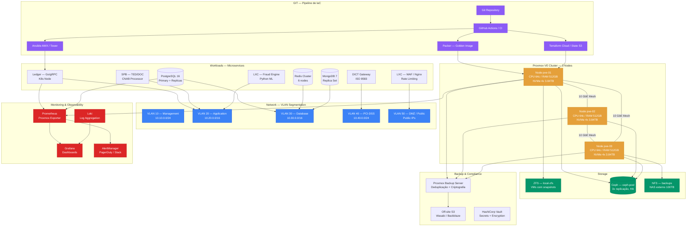
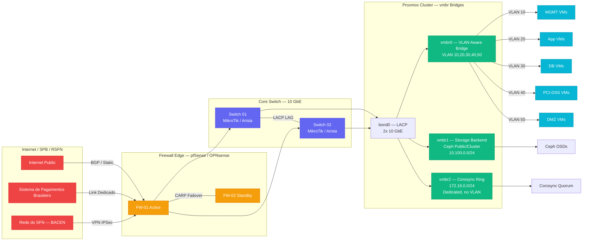
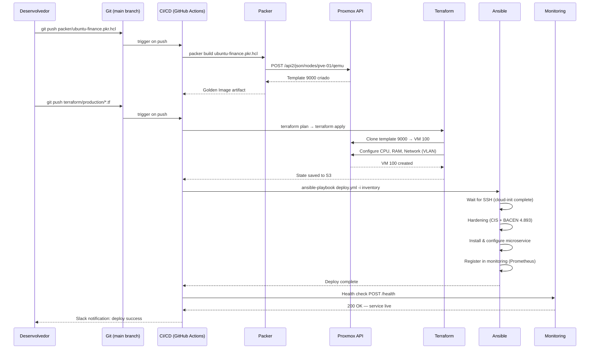
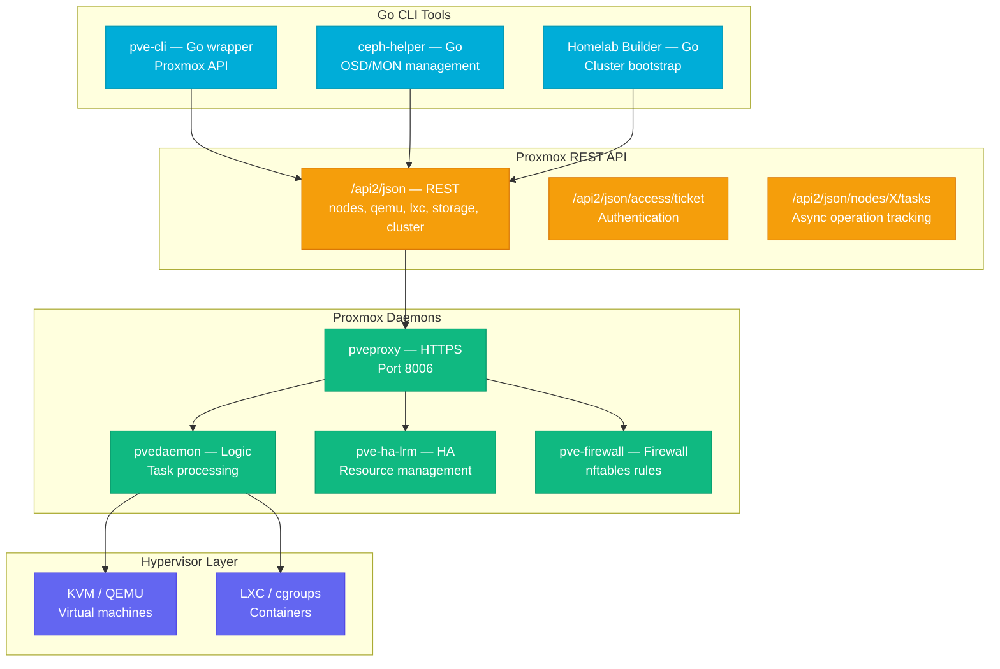
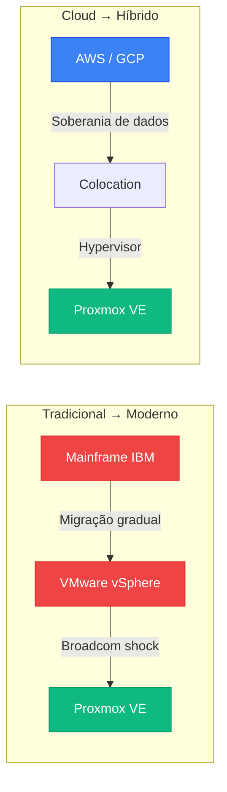

# Desafio 12: Proxmox VE — Infraestrutura Soberana para o Banking Stack

**🇧🇷** Infraestrutura de Produção Auto-Hospedada
**🇬🇧** Self-Hosted Production Infrastructure

---

## 🎯 Objetivos de Aprendizado

- Dominar Proxmox VE como hypervisor de produção para fintechs
- Projetar topologia de rede com VLANs isoladas (management, aplicação, banco, PCI-DSS)
- Configurar storage com ZFS, Ceph e NFS para alta disponibilidade
- Implementar clusters de alta disponibilidade com corosync e quorum
- Integrar Terraform e Ansible para provisionamento declarativo (IaC)
- Configurar Proxmox Backup Server (PBS) com políticas de retenção regulatória
- Implementar monitoramento com Prometheus, Grafana e métricas nativas do Proxmox
- Entender o trade-off econômico entre self-hosting (Colo) e cloud (AWS/GCP)

---

## 📋 Pré-requisitos

### 🧠 Conceitos
- Virtualização (hypervisor tipo 1 vs 2)
- Containers LXC vs VMs KVM
- Storage (ZFS, LVM, Ceph, NFS)
- Redes Linux (bridges, VLANs, OVS)
- Alta disponibilidade (quorum, fencing, corosync)
- Infrastructure as Code

### 📚 Desafios Anteriores
- [Desafio 13: CI/CD](/challenges/13-cicd) — a infra provisionada pelo Proxmox hospeda os pipelines de CI/CD e os ambientes de staging/production

### 🛠️ Ferramentas
- Proxmox VE 8+
- 2+ servidores físicos (ou VMs aninhadas para lab local)
- Switch gerenciável com VLANs
- PBS (Proxmox Backup Server)

### 💻 Técnico
- Linux (Debian/Ubuntu)
- Shell scripting
- Terraform (provider Telmate/Proxmox)
- Ansible
- corosync/pacemaker
- iptables/nftables

---

## 📖 Abertura — Por que Fintechs Deveriam Controlar sua Própria Infraestrutura?

"Olha, deixa eu te falar uma coisa que pouca gente fala sobre cloud. Você abre a fatura da AWS no final do mês, olha aquele número — US$ 48.000 — e pensa: 'caramba, eu tô pagando aluguel de servidor que daria pra comprar um datacenter em 6 meses'. E você está certo. Mas o problema não é só o custo. O problema é que **você não controla mais nada**.

Deixa eu voltar no tempo pra você entender como chegamos aqui. Até 2006, ano em que a AWS lançou o EC2, toda infraestrutura era on-prem. Bancos tinham datacenters próprios — salas refrigeradas com piso elevado, nobreaks do tamanho de geladeiras, fitas LTO girando em robôs de backup. Era caro, era lento, mas era **seu**. O Banco do Brasil sabia exatamente em qual prédio, em qual andar, em qual rack estava o servidor que processava TED. Se desse problema, o engenheiro descia três andares e cutucava o servidor com o dedo.

Aí veio a cloud e mudou tudo. De repente, "Infraestrutura" virou um formulário web e cartão de crédito. Mágico. Mas junto com a mágica veio o problema: **você perdeu soberania**. Seus dados não estão mais no seu datacenter. Estão em Ashburn, Virgínia. Ou em Frankfurt. Ou em algum lugar da Irlanda que você nunca pisou. E quando o BACEN pergunta "Seus dados estão armazenados em território nacional?", você não tem uma resposta simples.

Em 2021, a Resolução CMN 4.893 do BACEN — a famosa resolução de cibersegurança — mudou o jogo. Ela não proíbe cloud, mas exige que você saiba exatamente onde cada dado está, quem acessou, quando acessou, e que você tenha política de backup, disaster recovery e continuidade de negócio **documentada e testada**. Para uma fintech pequena ou média, cumprir isso em cloud é um pesadelo de compliance — VPC flow logs, CloudTrail, Config Rules, organizações multi-conta... a complexidade explode.

E tem a questão econômica. Uma instância EC2 `m5.xlarge` (4 vCPU, 16 GB RAM) custa cerca de US$ 0,19/hora on-demand — uns US$ 140/mês por máquina. Uma fintech de porte médio roda 40 a 60 VMs só em produção. Conta rápida: 50 VMs × US$ 140 = US$ 7.000/mês. Em um ano, US$ 84.000. Em três anos, US$ 252.000. Com esse dinheiro, você compra três servidores bare-metal de 64 cores, 512 GB RAM, 10 TB NVMe cada — e paga um colocation de R$ 3.000/mês por rack. Sobra dinheiro pra contratar um sysadmin full-time e ainda economiza.

Mas a decisão não é só dinheiro. É **performance**. Em cloud, você divide CPU com outros milhares de clientes (o famoso "Noisy neighbor"). Você nunca sabe se a latência extra de 15ms é sua aplicação ou é o hipervisor da AWS fazendo overcommit de CPU. Em bare-metal com Proxmox, você faz pin de CPU, reserva RAM, configura IO thread dedicado. Seus bancos PostgreSQL rodam com latência de 0.3ms, não 15ms. E quando você processa PIX em tempo real, 15ms é uma eternidade.

Agora entra uma figura central nessa história: o Proxmox VE. Nascido em 2008 na Áustria, desenvolvido pela Proxmox Server Solutions GmbH, ele é um hypervisor open-source baseado em Debian que combina KVM (virtualização completa) e LXC (contêineres Linux) em uma única interface web. Ele surgiu como alternativa ao VMware ESXi e ao Citrix XenServer — ambos proprietários e com licenciamento caro.

Em 2024, aconteceu algo que ninguém esperava: a Broadcom comprou a VMware por US$ 61 bilhões. Em seis meses, eles mataram o VMware ESXi free, descontinuaram 56 produtos, mudaram o licenciamento de perpétuo para assinatura, e aumentaram o preço em até 400%. Datacenters do mundo inteiro entraram em pânico. O Proxmox, que já era bom, virou a tábua de salvação. Migrações de VMware pra Proxmox explodiram. Empresas como a Hetzner e a OVH começaram a oferecer Proxmox como opção padrão.

O Proxmox tem três vantagens que o VMware nunca teve: **é open-source** (AGPLv3, você pode auditar o código), **combina KVM e LXC** (VMs quando precisa de isolamento total, containers quando precisa de densidade), e **tem API REST** (tudo que você faz na interface web pode ser automatizado via API). A API REST é o que permite Terraform, Ansible e GitOps — coisa que o VMware fazia via PowerCLI, uma aberração proprietária baseada em PowerShell que ninguém queria aprender.

E tem uma última coisa que o pessoal de cloud esquece: **latência de rede entre serviços**. Na AWS, dois microserviços na mesma VPC têm latência de 0.5ms a 2ms, dependendo da zona de disponibilidade. No seu rack, conectados via Linux bridge a 10 Gbps, a latência é de 0.05ms. Para um sistema de pagamentos que faz 15 chamadas internas pra processar uma transação, isso é a diferença entre 7ms e 75ms. Multiplica por 2500 TPS. Você está queimando 170 segundos de latência acumulada por segundo. O cliente sente. O BACEN mede. E o SLA do PIX é de 10 segundos.

Este desafio é sobre construir essa infraestrutura soberana: do zero ao cluster de produção, com HA, backups compliance-ready, monitoramento, e IaC completo. Não é sobre "Subir um homelab". É sobre o que um CTO de fintech precisa saber pra decidir entre AWS e Colo — e como executar se a decisão for Colo."

---

## 🔥 O Problema

Imagine que você é CTO de uma fintech de pagamentos. Sua aplicação começou num monólito rodando no Heroku. Depois migrou pra AWS com ECS e RDS. Funciona... mais ou menos. A conta mensal já está em US$ 55.000 e subindo 15% ao mês. O banco de dados PostgreSQL (RDS `db.r6g.4xlarge`) está sofrendo com latência. O Redis (ElastiCache) custa uma fortuna em transferência de dados. E o pior: o compliance officer mandou um email dizendo que o BACEN quer auditoria completa de infraestrutura — e você não sabe nem em qual datacenter físico seus dados estão.

Os problemas são reais e concretos:

1. **Custo de cloud é exponencial, não linear** — Cada novo cliente custa uma fração do servidor. Mas AWS cobra por tudo: compute, storage, transfer, NAT gateway, load balancer, CloudWatch, VPC endpoints. Uma fintech com 200 mil clientes gasta entre US$ 30 mil e US$ 80 mil por mês em cloud. Em 3 anos, esse dinheiro compra um datacenter próprio. E o custo não estabiliza — quanto mais você cresce, mais cara fica a AWS. Data transfer entre AZs a US$ 0.01/GB parece barato, até você processar 10 TB/mês = US$ 100/mês só pra mover dados entre servidores no mesmo datacenter. Multiplica por todos os serviços e você descobre que 40% da conta AWS é data transfer, não compute.

2. **Latência entre serviços em cloud é imprevisível** — Na AWS, dois containers na mesma VPC podem ter latência de 0.5ms ou 15ms, dependendo do noisy neighbor, da AZ, do hipervisor, da rede subjacente. Nunca é determinístico. E para um sistema financeiro que faz dezenas de chamadas internas por transação, latência imprevisível significa SLA imprevisível. O BACEN exige que o PIX tenha confirmação em até 10 segundos. Se suas chamadas internas somam 5 segundos de latência acumulada, você tem 5 segundos pra todo o resto. Não tem margem pra erro.

3. **Compliance em cloud é um labirinto de responsabilidade compartilhada** — A AWS é responsável pela "Segurança da nuvem". Você é responsável pela "Segurança na nuvem". O que isso significa na prática? A AWS garante que o datacenter é seguro. Você garante que sua aplicação, seus dados, suas chaves, seus acessos são seguros. Mas a fronteira não é clara. Quem é responsável pelo bucket S3 com permissão pública por engano? Você. Quem é responsável pelo snapshot do RDS que vazou? Você. Quem é responsável por provar que seus logs não foram adulterados? Você. O BACEN não quer saber se o erro foi da AWS — ele multa a fintech. E a multa pode chegar a 2% do faturamento.

4. **Fornecedor de cloud pode mudar o preço a qualquer momento** — A AWS nunca baixou preço de EC2. O Google Cloud já aumentou preço de alguns serviços. A Oracle Cloud... bem, a Oracle é a Oracle. Quando você está em cloud pública, você é price-taker. Se a AWS decidir que o RDS vai custar 30% mais caro ano que vem, você paga ou migra. E migrar um banco de 5 TB com zero downtime é uma operação de meses. Seu CFO vai perguntar por que o custo de infra subiu 30% e você vai responder "Porque a AWS quis".

5. **Dados financeiros em cloud estrangeira é problema jurídico** — A LGPD permite transferência internacional de dados, desde que o país de destino tenha nível adequado de proteção. Mas o BACEN exige que dados de transações financeiras estejam em território nacional. E se a AWS tem datacenter em São Paulo (`sa-east-1`), tecnicamente seus dados estão no Brasil — mas a AWS é uma empresa americana, sujeita ao US CLOUD Act. O governo americano pode, em tese, exigir acesso a dados armazenados pela AWS, mesmo em datacenters fora dos EUA. Seu jurídico vai querer uma opinião sobre isso. E opinião jurídica sobre soberania de dados em cloud custa R$ 50.000 por consulta — se você conseguir achar um advogado que entenda do assunto.

6. **Bare-metal vs cloud: a falsa dicotomia** — A escolha não é entre "Ter um datacenter no porão" e "Jogar tudo na AWS". Existe um espectro: colocation (você compra o servidor, coloca num datacenter de terceiros), dedicated hosting (você aluga servidores dedicados), private cloud (OpenStack ou VMware on-prem), hybrid (parte cloud, parte on-prem). O Proxmox brilha em cenários de colocation e dedicated hosting — você controla o hipervisor, a rede, o storage, mas não precisa se preocupar com refrigeração, energia redundante e segurança física do datacenter.

Cada um desses problemas tem solução: **Proxmox VE** para virtualização soberana, **Ceph e ZFS** para storage replicado, **VLANs** para isolamento de tráfego, **corosync + HA** para eliminar single point of failure, **PBS** para backup compliance-ready, **Terraform + Ansible** para infraestrutura como código, e **Prometheus + Grafana** para observabilidade completa — tudo rodando em hardware que é **seu**, em um datacenter que você escolheu.

---

## 🏗️ Arquitetura Geral

<LanguageToggle />

<div class="Lang-content ts" style="Display:block;">

### Visão Macro — Cluster Proxmox de Produção Financeira



Antes de mergulhar na configuração, quero que você entenda uma decisão arquitetural fundamental desse diagrama: **três nós físicos não é luxo, é o mínimo para HA**. Com dois nós, você tem split-brain: se a rede entre eles cair, cada um acha que é o primário e ambos tentam escrever no storage — corrompendo dados. Com três nós, você tem quorum: qualquer decisão precisa de 2 votos entre 3. Se um nó cair ou ficar isolado, os outros dois têm quorum e continuam operando. É o mesmo princípio que o etcd do Kubernetes e o Raft consensus. O Proxmox implementa isso via corosync, um sistema de cluster communication que usa token ring e quorum provider.

Outra decisão: o storage está separado do compute. Os nós do Proxmox rodam Ceph localmente (hyperconverged — cada nó é ao mesmo tempo servidor de VM e storage node), mas o backup e o NFS são externos. Isso é proposital: se o cluster inteiro pegar fogo (literalmente), seus backups estão em um appliance separado, fisicamente distante, e replicados pra nuvem. Backup no mesmo hardware que produção não é backup — é wishful thinking.

A segmentação de VLANs também merece explicação: **VLAN 30 (Database)** é uma rede privada sem rota pra internet. Nenhum banco de dados tem IP público. Nenhuma aplicação acessa banco diretamente da DMZ. O tráfego entre aplicação e banco passa exclusivamente pela VLAN 30, que não tem gateway pra fora. Isso é exigência PCI-DSS 1.2.1 — restringir tráfego de entrada e saída ao mínimo necessário. A VLAN 40 (PCI-DSS) é ainda mais restrita: só máquinas que processam dados de cartão residem nela, com firewall stateful entre VLAN 40 e qualquer outra rede.

### A Stack de Virtualização

O Proxmox VE roda sobre Debian e combina duas tecnologias de virtualização:

- **KVM (Kernel-based Virtual Machine)** — Hypervisor tipo 1 (bare-metal) integrado ao kernel Linux. Cada VM é um processo QEMU isolado, com seu próprio kernel, seu próprio init system, suas próprias interfaces de rede. Use KVM quando precisar de isolamento total — bancos de dados, serviços PCI-DSS, gateways de pagamento. KVM suporta live migration (mover uma VM entre nós físicos sem downtime), snapshots, templates, e passthrough de hardware (GPU, placa de rede, HSM).

- **LXC (Linux Containers)** — Virtualização em nível de sistema operacional. Compartilha o kernel do host, mas isola processos, rede, filesystem, e namespaces. Muito mais leve que KVM — um container ocupa dezenas de MB de RAM contra centenas de MB de uma VM. Use LXC quando densidade e velocidade importam mais que isolamento total — proxies reversos, web servers, workers de background, ferramentas de monitoramento. LXC inicia em milissegundos (contra 5-10 segundos de uma VM), usa CPU nativa sem overhead de virtualização, e permite overcommit de RAM.

> **Por que Proxmox e não Kubernetes direto no bare-metal?** — Kubernetes bare-metal é possível (Kubeadm, Talos, RKE2), mas você perde a flexibilidade de ter VMs e containers no mesmo hypervisor. Com Proxmox, você pode rodar um cluster Kubernetes **dentro** de VMs (tipo Rancher ou K3s como workload) e ainda ter VMs individuais para PostgreSQL e Redis. Kubernetes é orquestrador de containers, não gerenciador de infraestrutura. Você ainda precisa de alguém pra gerenciar o hardware, a rede, o storage, os backups, a recuperação de desastres. O Proxmox faz a camada de infraestrutura. O Kubernetes faz a camada de aplicação. São complementares, não concorrentes.

### Topologia de Rede com Isolation Zones



A topologia acima é o padrão para fintechs que se conectam ao SPB e RSFN. A rede corosync (Ring 0) é **dedicada** — nada mais trafega nela. Se a rede de storage saturar, se a rede de aplicação tiver um pico de tráfego, o cluster não perde quorum. O corosync é sensível a latência: se um nó demora mais de 800ms pra responder ao token ring, o cluster marca o nó como offline e faz fence (isola o nó pra evitar split-brain). Uma rede corosync separada garante que o token ring nunca compete com tráfego de storage ou aplicação.

### Fluxo de Provisionamento — GitOps Pipeline



O pipeline GitOps segue o princípio de **imutabilidade**: nunca se configura uma VM em produção manualmente. Tudo que está rodando veio de uma pipeline que partiu de um template golden image, foi provisionado por Terraform, configurado por Ansible e registrado no monitoring. Se uma VM dá problema, você não faz troubleshooting — você destrói e recria. Com golden image + Terraform + Ansible, uma recriação completa de VM leva menos de 5 minutos. Isso se chama **cattle, not pets** — suas VMs são gado numerado, não bichinhos de estimação com nome e história. O gado doente vai pro abate e nasce outro idêntico no lugar.

### Estrutura de Diretórios do Projeto IaC

```
banking-stack/
├── packer/
│   ├── ubuntu-fintech.pkr.hcl         # Golden image base
│   ├── ubuntu-pci-dss.pkr.hcl         # Golden image PCI-DSS (mais restritiva)
│   ├── scripts/
│   │   ├── base-hardening.sh          # CIS Level 1 hardening
│   │   ├── install-qemu-agent.sh      # Proxmox guest agent
│   │   └── cloud-init-cleanup.sh      # Limpeza pós-install
│   └── variables.pkr.hcl
│
├── terraform/
│   ├── production/
│   │   ├── main.tf                    # Proxmox provider + backend
│   │   ├── variables.tf               # Secrets via Vault
│   │   ├── vms/
│   │   │   ├── ledger.tf             # VMs do ledger
│   │   │   ├── database.tf           # PostgreSQL + MongoDB
│   │   │   ├── gateway.tf            # DICT / ISO 8583
│   │   │   └── monitoring.tf         # Prometheus + Grafana
│   │   ├── network.tf                 # VLANs, bridges, firewalls
│   │   ├── storage.tf                 # Ceph pools, NFS mounts
│   │   └── outputs.tf                 # IPs, FQDNs
│   └── modules/
│       ├── vm-banking/                # Módulo reutilizável
│       │   ├── main.tf
│       │   ├── variables.tf
│       │   └── outputs.tf
│       └── vm-pci-dss/               # Módulo PCI-DSS (mais restrições)
│
├── ansible/
│   ├── playbooks/
│   │   ├── deploy-ledger.yml
│   │   ├── deploy-database.yml
│   │   ├── deploy-monitoring.yml
│   │   └── hardening-bacen-4893.yml
│   ├── roles/
│   │   ├── common/                    # Base: SSH, NTP, DNS, firewall
│   │   ├── postgresql/               # PostgreSQL 16 + streaming replication
│   │   ├── mongodb/                   # MongoDB 7 Replica Set
│   │   ├── redis/                     # Redis 7 Cluster
│   │   ├── ledger/                    # Ledger service (Go binary)
│   │   ├── node-exporter/            # Prometheus node metrics
│   │   └── auditd/                    # Auditd rules BACEN
│   └── inventory/
│       ├── production/hosts.yml       # Inventário dinâmico via Proxmox API
│       └── group_vars/all.yml
│
├── monitoring/
│   ├── prometheus/
│   │   ├── prometheus.yml            # Scrape configs
│   │   └── rules/                    # Alerting rules
│   ├── grafana/
│   │   └── dashboards/               # JSON dashboards
│   └── loki/
│       └── promtail-config.yml
│
└── docs/
    └── runbooks/                      # Procedimentos operacionais
        ├── disaster-recovery.md
        ├── node-replacement.md
        └── backup-restore.md
```

---

## 👨‍💻 Mão na Massa

"Bora codar. O bagulho é o seguinte: você vai subir um cluster Proxmox de produção, do zero, com tudo que uma fintech precisa pra dormir tranquila sabendo que os dados dos clientes estão seguros, redundantes e auditáveis.

Antes de colocar a mão na massa, quero que você entenda quatro conceitos que vão aparecer em cada linha de configuração desse cluster: **quorum e split-brain**, **ZFS vs Ceph armados**, **live migration sem downtime**, e **backup com deduplicação**.

### Quorum e Split-Brain Explicado com Dinheiro

Em um cluster, split-brain acontece quando dois ou mais nós perdem comunicação entre si, mas continuam achando que são o nó ativo. Se ambos tentarem escrever no mesmo storage, os dados são corrompidos. Em sistema financeiro, isso significa duas transações diferentes escrevendo no mesmo ledger sem saber uma da outra. Catastrófico.

O Proxmox resolve isso com **corosync + quorum + fencing**. Corosync é um sistema de comunicação de cluster que usa token ring — um token circula entre os nós. Cada nó precisa responder ao token em menos de 800ms (configurável). Se um nó não responde, ele é removido do cluster.

Quorum é a regra: pra qualquer decisão (iniciar VM, migrar VM, escrever no storage), o cluster precisa de `floor(total_nodes / 2) + 1` votos. Com 3 nós, precisa de 2 votos. Se o corosync detecta que um nó caiu, os outros dois ainda têm quorum e continuam. Se dois caírem, o cluster inteiro para — mas não corrompe dados. Parar é melhor que corromper.

Fencing é o isolamento físico do nó removido. O Proxmox usa `fence_pve` (via API REST) pra desligar o nó problemático ou cortar seu acesso ao storage. O fencing garante que o nó isolado não consegue escrever no Ceph ou no ZFS — evitando split-brain mesmo que o nó "Caído" ainda esteja rodando mas com rede particionada.

### ZFS vs Ceph: Quando Usar Cada Um

O Proxmox suporta múltiplos backends de storage, mas os dois principais são ZFS e Ceph. Eles resolvem problemas diferentes:

- **ZFS (local-zfs)**: Storage local a cada nó. Snapshots instantâneos, compressão, deduplicação, checksumming. Ideal para VMs que não precisam de migração automática entre nós — ambientes de desenvolvimento, staging, VMs de baixa criticidade. ZFS é extremamente rápido porque não tem overhead de rede: os discos estão no mesmo servidor que a VM. Mas se o nó físico morrer, as VMs em ZFS local **não sobem sozinhas** — você precisa restaurar do backup.

- **Ceph (ceph-pool)**: Storage distribuído com replicação 3x. Os discos de todos os nós formam um pool único, e os dados são distribuídos com CRUSH map. Ideal para VMs de produção que precisam de HA — se um nó morrer, o Ceph automaticamente redistribui os dados e as VMs continuam rodando nos outros nós. Ceph tem overhead de rede (cada write replica 3x pela rede), mas a redundância é imbatível. Para bancos de dados de produção, Ceph é mandatório.

No nosso cluster, usamos **ZFS local para o sistema operacional do Proxmox e templates**, e **Ceph para todas as VMs de produção**. O raciocínio: se o nó 1 morrer, as VMs que estavam nele migram automaticamente para os nós 2 e 3 via HA, porque os discos estão no Ceph e são acessíveis por qualquer nó.

### Instalação Base do Proxmox VE

Primeiro, a instalação do Proxmox em cada nó. O Proxmox VE é um sistema operacional completo baseado em Debian. Você baixa a ISO, grava num pendrive (ou monta via IPMI/ iDRAC no datacenter) e instala como qualquer Linux.

```bash
# Após instalação base do Proxmox VE em cada nó
# Configurar hostname e /etc/hosts em cada nó

# pve-01
hostnamectl set-hostname pve-01.fintech.local

cat > /etc/hosts << 'EOF'
127.0.0.1 localhost
10.10.0.11 pve-01.fintech.local pve-01
10.10.0.12 pve-02.fintech.local pve-02
10.10.0.13 pve-03.fintech.local pve-03
10.100.0.11 pve-01-storage
10.100.0.12 pve-02-storage
10.100.0.13 pve-03-storage
EOF

# Desabilitar repositório enterprise (não temos licença)
sed -i 's/^deb https:\/\/enterprise.proxmox.com/#&/' /etc/apt/sources.list.d/pve-enterprise.list

# Adicionar repositório community (no-subscription)
echo "Deb http://download.proxmox.com/debian/pve bookworm pve-no-subscription" \
  > /etc/apt/sources.list.d/pve-no-subscription.list

# Atualizar sistema
apt update && apt dist-upgrade -y

# Instalar ferramentas essenciais
apt install -y vim htop iotop iftop nmon net-tools bridge-utils \
  vlan openvswitch-switch qemu-guest-agent
```

### Configuração de Rede — Bridges e VLANs

Cada nó Proxmox precisa de pelo menos 3 bridges Linux:

```bash
# Configurar /etc/network/interfaces em pve-01

cat > /etc/network/interfaces << 'INTERFACES'
auto lo
iface lo inet loopback

# Bond das interfaces físicas (2x 10 GbE em LACP)
auto bond0
iface bond0 inet manual
    bond-slaves eno1 eno2
    bond-mode 802.3ad           # LACP — Link Aggregation
    bond-miimon 100
    bond-downdelay 200
    bond-updelay 200
    bond-xmit-hash-policy layer3+4

# Bridge principal — VLAN-aware
auto vmbr0
iface vmbr0 inet static
    address 10.10.0.11/24        # Management IP
    gateway 10.10.0.1
    bridge-ports bond0
    bridge-stp off
    bridge-fd 0
    bridge-vlan-aware yes
    bridge-vids 10,20,30,40,50
    # VLAN 10 — Management (native/não taggeada no vmbr0)
    # VLAN 20,30,40,50 — Taggeadas nas VMs

# Bridge de Storage — Ceph frontend
auto vmbr1
iface vmbr1 inet static
    address 10.100.0.11/24
    bridge-ports bond0.100       # VLAN 100 dedicada ao Ceph
    bridge-stp off
    bridge-fd 0
    mtu 9000                     # Jumbo frames para Ceph

# Bridge de Corosync — Cluster communication
auto vmbr2
iface vmbr2 inet static
    address 172.16.0.11/24
    bridge-ports eno3            # Interface física dedicada (terceira NIC)
    bridge-stp off
    bridge-fd 0
    # SEM VLAN tagging — corosync precisa da menor latência possível
INTERFACES

# Aplicar configuração
ifreload -a
```

**Decisão crítica:** o `vmbr2` (corosync) usa uma **interface física dedicada**, não uma VLAN no bond. Por quê? Porque se o bond saturar com tráfego de storage + aplicação, você não quer que o corosync perca o token ring. Corosync é o batimento cardíaco do cluster. Se ele falhar, o cluster faz fencing e suas VMs caem. Uma interface dedicada de 1 GbE pra corosync é barata (R$ 50 por uma placa de rede) e elimina uma classe inteira de falhas. 

O MTU 9000 (jumbo frames) no vmbr1 é específico para Ceph. Ceph faz muitas operações de I/O grandes (4 MB por objeto). Com MTU 1500, cada objeto é fragmentado em ~2700 pacotes. Com MTU 9000, são ~450 pacotes. Menos pacotes = menos overhead de CPU = mais IOPS. Em cluster Ceph de produção, jumbo frames são praticamente obrigatórios.

### Criação do Cluster Proxmox

```bash
# No nó pve-01 (será o primeiro nó do cluster)
pvecm create fintech-cluster

# Verificar status do cluster
pvecm status
# Deve mostrar: Quorum: 1, Nodes: 1, Expected votes: 1

# Nos nós pve-02 e pve-03, juntar ao cluster
# (execute em pve-02)
pvecm add 10.10.0.11
# Vai pedir a senha root do pve-01

# (execute em pve-03)
pvecm add 10.10.0.11

# Verificar status final
pvecm status
# Deve mostrar: Quorum: 2, Nodes: 3, Expected votes: 3
# Todos os nós com status "Online" e "Member: Yes"
```

Agora, configurar o corosync com duas redes (ring0 e ring1) para redundância:

```bash
# Editar /etc/pve/corosync.conf em qualquer nó (replica automaticamente)

cat > /etc/pve/corosync.conf << 'COROSYNC'
logging {
  debug: off
  to_syslog: yes
}

nodelist {
  node {
    name: pve-01
    nodeid: 1
    quorum_votes: 1
    ring0_addr: 172.16.0.11
    ring1_addr: 10.10.0.11
  }
  node {
    name: pve-02
    nodeid: 2
    quorum_votes: 1
    ring0_addr: 172.16.0.12
    ring1_addr: 10.10.0.12
  }
  node {
    name: pve-03
    nodeid: 3
    quorum_votes: 1
    ring0_addr: 172.16.0.13
    ring1_addr: 10.10.0.13
  }
}

quorum {
  provider: corosync_votequorum
}

totem {
  cluster_name: fintech-cluster
  config_version: 2
  interface {
    linknumber: 0
  }
  interface {
    linknumber: 1
  }
  ip_version: ipv4
  secauth: on
  version: 2
  token: 4000           # 4000ms timeout antes de considerar nó offline
  token_retransmits_before_loss_const: 10
}
COROSYNC

# Incrementar config_version e aplicar
# O Proxmox sincroniza automaticamente o arquivo entre os nós
```

Note o `ring1_addr` usando a mesma rede do management (10.10.0.0/24). Isso dá redundância ao corosync: se a interface dedicada (ring0) falhar, o corosync usa a rede de management (ring1). O token ring opera nas duas redes simultaneamente — qualquer uma que responder mantém o cluster ativo.

### Configuração do Ceph — Storage Distribuído

O Ceph é configurado diretamente pela interface web do Proxmox ou via CLI. Aqui vamos usar CLI para automação:

```bash
# Instalar Ceph em todos os nós (execute em pve-01)
pveceph install -version reef

# Criar configuração inicial do Ceph
pveceph init --network 10.100.0.0/24

# Criar monitor (MON) em cada nó — mínimo 3 para quorum
pveceph mon create                        # Cria MON no nó atual
# Repita nos outros nós ou via interface web

# Criar manager (MGR) em cada nó
pveceph mgr create

# Preparar os discos NVMe como OSDs (Object Storage Daemons)
# Em cada nó, os 4 discos NVMe de 3.84 TB — um para SO, três para Ceph

# Em pve-01:
ceph-volume lvm create --data /dev/nvme1n1   # 3.84 TB OSD 1
ceph-volume lvm create --data /dev/nvme2n1   # 3.84 TB OSD 2
ceph-volume lvm create --data /dev/nvme3n1   # 3.84 TB OSD 3

# Repita em pve-02 e pve-03 com os discos correspondentes
# Total: 9 OSDs × 3.84 TB = 34.56 TB raw
# Com replicação 3x: 34.56 / 3 = 11.52 TB utilizáveis

# Criar pool Ceph para VMs
pveceph pool create vm-storage --size 3 --min_size 2 --pg_num 256

# Criar pool Ceph para dados de banco (com SSDs classificados como "Fast")
pveceph pool create db-storage --size 3 --min_size 2 --pg_num 128 \
  --crush-rule replicated_ssd

# Associar pool ao Proxmox como storage
pvesm add rbd ceph-pool --pool vm-storage \
  --content images,rootdir \
  --krbd  # Usar kernel RBD (mais performático)

pvesm add rbd ceph-db --pool db-storage \
  --content images,rootdir \
  --krbd

# Verificar status do Ceph
ceph -s
# Deve mostrar: HEALTH_OK, 9 OSDs up, 3 MONs quorum
```

A escolha de `--size 3 --min_size 2` é o padrão ouro do Ceph para produção financeira: cada objeto é replicado em 3 OSDs diferentes, e o cluster continua operando com `min_size 2` (aceita I/O com 2 réplicas enquanto recupera a terceira). Com `size 2`, se um disco falhar durante a recuperação, você perde dados. Com `size 3`, dois discos podem falhar simultaneamente e você ainda tem a terceira réplica. O custo é 3x de espaço bruto, mas para dados financeiros, é o preço de dormir tranquilo.

O `--krbd` (kernel RBD) merece destaque: o Proxmox suporta dois clientes Ceph — `krbd` (kernel) e `librbd` (userspace). O kernel RBD é significativamente mais rápido porque evita context switches entre kernel e userspace em cada operação de I/O. Em benchmarks, `krbd` entrega 15-20% mais IOPS que `librbd`. Para bancos de dados, essa diferença é relevante.

### Criando a Primeira VM via CLI

Antes do Terraform, vamos criar uma VM manualmente para entender o que o Terraform vai automatizar:

```bash
# Baixar ISO do Ubuntu 22.04 LTS
wget https://releases.ubuntu.com/22.04.3/ubuntu-22.04.3-live-server-amd64.iso \
  -O /var/lib/vz/template/iso/ubuntu-22.04.3-live-server-amd64.iso

# Criar VM com cloud-init no Ceph
qm create 9000 \
  --name ubuntu-fintech-template \
  --memory 4096 \
  --cores 2 \
  --cpu host \
  --net0 virtio,bridge=vmbr0,tag=20 \
  --scsihw virtio-scsi-pci \
  --scsi0 ceph-pool:0,discard=on,ssd=1,iothread=1 \
  --ide2 ceph-pool:cloudinit \
  --boot order=scsi0 \
  --ostype l26 \
  --agent enabled=1 \
  --serial0 socket \
  --vga serial0 \
  --machine q35 \
  --bios ovmf \
  --efidisk0 ceph-pool:1,format=raw,efitype=4m,pre-enrolled-keys=0

# Importar disco da ISO
qm importdisk 9000 /var/lib/vz/template/iso/ubuntu-22.04.3-live-server-amd64.iso ceph-pool

# Configurar boot pela ISO para instalação
qm set 9000 --boot order=ide2\;scsi0

# Iniciar VM para instalar SO base
qm start 9000

# Após instalação manual do Ubuntu (via console VNC/noVNC):
# -- Instalar qemu-guest-agent
# -- Configurar cloud-init
# -- Limpar machine-id, SSH host keys, logs
# -- Desligar a VM

# Converter para template
qm template 9000

# Agora podemos clonar quantas VMs quisermos:
qm clone 9000 100 --name prod-ledger-01 --full true \
  --storage ceph-pool

# Configurar recursos da VM clonada
qm set 100 \
  --cores 8 \
  --memory 16384 \
  --cpu host,flags=+aes \
  --net0 virtio,bridge=vmbr0,tag=20,firewall=1 \
  --ipconfig0 ip=10.20.10.10/24,gw=10.20.10.1 \
  --sshkey /root/.ssh/proxmox-deploy.pub \
  --ciuser deployer

# Iniciar VM
qm start 100
```

Os parâmetros `--machine q35` e `--bios ovmf` são importantes: Q35 é o chipset moderno (substitui o i440fx legado), suporta PCIe nativo e é necessário para VMs com mais de 4 GB de RAM e discos NVMe. OVMF é a implementação open-source do UEFI, necessária para boot seguro e GPT. Com `--efidisk0`, o Proxmox cria um disco EFI separado para a VM, permitindo que ela tenha seu próprio bootloader UEFI.

---

## 🧠 A Profundidade

### Por que Bare-Metal Ainda Importa na Era do Kubernetes?

"Fato curioso: deixa eu te contar uma história que aconteceu comigo em 2019. Eu estava ajudando uma fintech que processava R$ 40 milhões por mês em boletos. Tudo rodando na AWS, bonitinho, Kubernetes, RDS, ElastiCache. Um belo dia, a AWS teve uma degradação no `sa-east-1` — nada grave, só latência 10x maior entre AZs por 4 horas. Nesse período, o sistema deles processou 30% menos transações. Perderam R$ 120 mil em receita. E detalhe: a AWS não deu desconto na fatura daquele mês. Pelo contrário — cobraram a mais porque o aumento de latência gerou mais retries, que geraram mais requisições, que geraram mais cobrança.

Essa história ilustra o problema fundamental de depender de infraestrutura que você não controla: **você herda os problemas do seu provedor, mas não herda as soluções**. Se a AWS decide que o `sa-east-1` vai ter um pico de latência, você não pode fazer nada além de abrir um ticket e esperar. Se você tivesse seu próprio hardware em um datacenter em São Paulo, e a latência subisse, você ia até o rack, olhava o switch, trocava o cabo com defeito, e resolvia em 15 minutos.

Mas deixa eu aprofundar em algo que ninguém fala: **a economia do colocation é contraintuitiva**. As pessoas acham que cloud é barato porque você paga por uso. Mas o que elas não percebem é que, a partir de um certo ponto, você está pagando **mais caro por unidade de compute do que comprar o hardware**. Vamos fazer as contas com números reais:

Um servidor Dell PowerEdge R760xs com 2x Intel Xeon Gold 6438Y+ (64 cores total), 512 GB DDR5 ECC, 4x NVMe Samsung PM9A3 3.84 TB, 2x 25 GbE SFP28 — custa aproximadamente R$ 120.000 à vista. Vida útil: 5 anos. Custo mensal: R$ 2.000 por mês de depreciação. Colocation num datacenter Tier III em São Paulo (Ascenty, Equinix, Scala): R$ 3.000/mês por 1/4 de rack (10U), incluindo energia redundante, refrigeração, link de 1 Gbps. Custo total por servidor: R$ 5.000/mês.

Na AWS, uma instância `m5.8xlarge` (32 vCPU, 128 GB RAM) custa US$ 1,536/hora × 730 horas = US$ 1.121/mês = R$ 5.600/mês. E isso é **metade** da capacidade do nosso servidor. Para capacidade equivalente (64 vCPU, 512 GB RAM), você precisaria de uma `m5.16xlarge` a US$ 2,240/hora = US$ 1.635/mês = R$ 8.175/mês. **Em 14 meses, você pagou o servidor inteiro.** Nos 46 meses restantes de vida útil, você está economizando R$ 8.175/mês × 46 = R$ 376.000 por servidor.

E isso sem contar storage. Na AWS, 10 TB de EBS gp3 custam US$ 800/mês + US$ 0.02/GB de transferência. No seu rack, 10 TB de NVMe custam R$ 0 — já está incluso no servidor. Em 5 anos, só de storage você economiza US$ 48.000 por servidor.

Agora, o argumento da cloud é "Ah, mas você precisa de um time de infra pra gerenciar hardware". Verdade. Um sysadmin senior custa R$ 15.000/mês (CLT, 13o, férias, benefícios — uns R$ 22.000/mês de custo total). Dois sysadmins = R$ 44.000/mês. Com 10 servidores, a economia em relação à AWS é de R$ 81.750/mês (10 × R$ 8.175). Descontando os salários, sobram R$ 37.750/mês. Por ano, R$ 453.000. Em 5 anos, R$ 2.265.000. Com esse dinheiro, você contrata um terceiro sysadmin, um engenheiro de segurança, um DBA, compra servidores melhores, e ainda sobra pra festa de fim de ano.

Mas a economia real é maior que isso. Porque quando você está no seu próprio hardware, você faz **overcommit inteligente**. Na AWS, você paga pela capacidade alocada. Se você provisiona uma `m5.8xlarge` e usa 15% de CPU, você paga 100%. No Proxmox, você pode rodar 20 VMs em um servidor de 64 cores porque nem todas usam CPU ao mesmo tempo. Overcommit de CPU de 3:1 ou 4:1 é padrão na indústria. Overcommit de RAM é mais arriscado, mas com KSM (Kernel Same-page Merging) e ballooning, você consegue 20-30% de economia de RAM."

### LXC vs KVM: A Matemática da Densidade

Vamos fazer as contas de quantas cargas de trabalho cada tipo de virtualização suporta:

**KVM (máquinas virtuais completas):**
- Overhead de RAM: ~500 MB por VM (kernel + init system + qemu-guest-agent)
- Overhead de CPU: ~5% por VM (QEMU emulação + context switches)
- Overhead de disco: latência adicional de ~0.1ms (virtio-scsi)
- Isolamento: total (kernel separado, namespaces, cgroups)

**LXC (containers):**
- Overhead de RAM: ~50 MB por container (apenas processos do usuário)
- Overhead de CPU: <1% (namespaces no kernel do host)
- Overhead de disco: ~0.01ms (bind mount)
- Isolamento: parcial (kernel compartilhado)

Em um servidor de 512 GB RAM, rodando VMs de 4 GB para microserviços:
- KVM: (512 - 10 GB host) / (4 + 0.5) = 502 / 4.5 ≈ **111 VMs**
- LXC: (512 - 10) / (4 + 0.05) = 502 / 4.05 ≈ **123 containers**

Parece pouca diferença, mas considere que cada VM gasta ~5% de CPU em overhead. Com 111 VMs, 5.55 cores são desperdiçados só com QEMU. Com LXC, menos de 1 core. Em processamento financeiro, onde você quer extrair cada ciclo de CPU, LXC pra cargas não-críticas (proxy reverso, monitoramento, workers) libera cores preciosos pras VMs de banco de dados.

Mas atenção: **LXC não substitui KVM em cargas PCI-DSS**. O padrão PCI-DSS exige segmentação de rede e isolamento de sistemas. Um container LXC compartilha o kernel com o host — se alguém explorar uma vulnerabilidade no kernel, sai do container e ganha acesso ao host. Com KVM, o atacante precisaria de uma segunda vulnerabilidade (QEMU escape) pra sair da VM. Defense in depth: no nosso cluster, PCI-DSS roda em KVM sempre. Aplicações internas rodam em LXC por densidade.

### Proxmox Backup Server — O Que Torna Ele Especial pra Compliance

O Proxmox Backup Server (PBS) é um appliance separado (pode rodar em VM ou bare-metal) que faz backup de VMs, containers e hosts Proxmox. Ele não é "Mais um software de backup". Ele resolve três problemas que são pesadelos de compliance:

**1. Deduplicação em nível de chunk (não de arquivo)**

Backups tradicionais (rsync, tar, Veeam) deduplicam por arquivo. Se você tem dois arquivos com conteúdo similar mas nomes diferentes, eles são armazenados duas vezes. O PBS divide cada imagem de disco em chunks de 4 MB e deduplica por conteúdo. Se 100 VMs rodam Ubuntu 22.04 com os mesmos binários do sistema, o PBS armazena cada chunk uma única vez. O resultado: 100 VMs de 20 GB cada = 2 TB de dados lógicos, mas apenas ~100 GB de dados físicos (95% de deduplicação). Para compliance, isso significa que você pode manter 90 dias de backups diários sem precisar de um storage array de R$ 200.000.

**2. Verificação de integridade com hash tree (Merkle tree)**

O PBS armazena cada backup como uma árvore de hashes (similar ao git). Cada chunk tem um checksum SHA-256. Os chunks formam um índice, o índice forma um manifesto, o manifesto forma um snapshot. Se qualquer chunk for corrompido (bit rot, falha de disco), o PBS detecta na verificação periódica. Para auditoria BACEN, você pode provar que o backup de 15 de janeiro de 2026 está íntegro, sem corrupção, e pode ser restaurado. É o equivalente digital de um lacre numerado em um malote de documentos.

**3. Criptografia client-side (antes de sair do servidor)**

O PBS pode criptografar os chunks **antes** de enviar para storage. Isso significa que mesmo se alguém roubar o disco do PBS ou o bucket S3 de off-site, os dados estão cifrados com AES-256-GCM. A chave fica no servidor de origem — se você perder a chave, perde todos os backups. O PBS suporta master key + key rotation, então você pode trocar a chave periodicamente sem perder backups antigos (cada backup mantém referência à chave com que foi cifrado).

### Estratégia de Retenção para Compliance BACEN

A Resolução 4.893 exige retenção de logs e dados por no mínimo 5 anos. Na prática, a estratégia de backup para compliance é:

```
Política de Retenção PBS:

Backups diários:     manter 30 dias     (30 snapshots)
Backups semanais:    manter 12 semanas   (12 snapshots)
Backups mensais:     manter 24 meses     (24 snapshots)
Backups anuais:      manter 7 anos       (7 snapshots)

Total: 73 snapshots por VM
Espaço com deduplicação: ~150 GB por VM × 73 = ~11 TB
Espaço com replicação off-site (Wasabi): 11 TB × US$ 6.99/TB = US$ 77/mês
```

E a estratégia de restauração precisa ser testada:

```
Testes de restore (obrigatórios para compliance):

Mensal:     restore de 1 VM aleatória para ambiente de staging
Trimestral: restore de toda a stack (ledger + banco + gateway) para ambiente isolado
Anual:      disaster recovery completo — recriar cluster do zero em hardware diferente
            e validar que todas as 50 VMs sobem e funcionam
```

O teste anual de DR é o que separa fintechs que sobrevivem a um desastre das que fecham. Em 2021, o datacenter da OVH em Estrasburgo pegou fogo. Empresas que tinham backup off-site e testavam restore voltaram em horas. Empresas que só "Confiavam que o backup funcionava" perderam tudo. A diferença entre esses dois grupos era um script de restore que rodava todo trimestre.

### Terraform + Proxmox: O Estado da Arte em 2025

O provider Terraform para Proxmox (`bpg/proxmox`) evoluiu muito desde 2023. Hoje ele suporta:

- **Recursos**: VMs (QEMU), containers (LXC), pools, storage, rede, firewall, usuários, grupos, ACLs
- **Data sources**: consultar VMs existentes, templates, redes, storage
- **Remote state**: S3, Terraform Cloud, HTTP backend, pg (PostgreSQL)

Mas tem três limitações importantes que você precisa conhecer:

1. **Terraform não gerencia a instalação do Proxmox** — Você ainda precisa instalar o Proxmox VE nos nós manualmente (ou via PXE boot automatizado). O Terraform começa a atuar depois que o Proxmox está rodando e acessível via API.

2. **State do Terraform é a verdade, não o Proxmox** — Se alguém alterar manualmente uma VM pela interface web (adicionar mais RAM, trocar a VLAN), o Terraform vai detectar drift no próximo `plan` e vai reverter pra configuração declarada. Isso é bom (previne configuração fantasma) mas também é perigoso: se o drift for intencional (ex: aumentar RAM durante um incidente), o Terraform vai desfazer no próximo deploy. A solução é disciplina: **toda alteração de infra começa no Terraform**.

3. **Provider não suporta Ceph nativamente** — Você precisa configurar Ceph via API do Proxmox (CLI `pveceph`) ou via provider `ceph` separado. O `bpg/proxmox` gerencia VMs que usam storage Ceph, mas não gerencia OSDs, MONs, pools Ceph.

### Ansible: Hardening e Configuração Pós-Provisionamento

Depois que o Terraform cria a VM, o Ansible assume. O playbook de hardening segue o CIS Benchmark Level 1 para Ubuntu 22.04, com adições específicas para BACEN 4.893:

```yaml
---
- name: Hardening CIS + BACEN 4.893 para VMs financeiras
  hosts: all
  become: yes
  gather_facts: yes

  vars:
    auditd_rules:
      - "-w /etc/shadow -p wa -k identity_changes"
      - "-w /etc/sudoers -p wa -k scope_changes"
      - "-w /etc/ssh/sshd_config -p wa -k sshd_config"
      - "-w /var/log/audit/ -p wa -k audit_logs"
      - "-w /etc/ssl/private/ -p wa -k crypto_keys"
      - "-a always,exit -F arch=b64 -S execve -k command_execution"

  tasks:
    - name: Desabilitar serviços desnecessários
      systemd:
        name: "{{ item }}"
        enabled: no
        state: stopped
      loop:
        - avahi-daemon
        - cups
        - rpcbind
        - bluetooth. service
      ignore_errors: yes

    - name: Remover pacotes inseguros (BACEN 4.893 Art. 8)
      apt:
        state: absent
        purge: yes
        name:
          - telnet
          - rsh-client
          - rsh-server
          - talk
          - xinetd
          - nis
          - tftp
          - vsftpd
          - inetutils-telnetd
          - inetutils-talkd

    - name: Configurar auditd com regras BACEN
      template:
        src: audit.rules.j2
        dest: /etc/audit/rules.d/99-bacen.rules
        mode: 0640
      notify: restart auditd

    - name: Habilitar e iniciar auditd
      systemd:
        name: auditd
        enabled: yes
        state: started

    - name: Configurar AIDE (detecção de integridade de arquivos)
      apt:
        name: aide
        state: present

    - name: Inicializar banco de dados AIDE
      command: aideinit -b /var/lib/aide/aide.db.new
      args:
        creates: /var/lib/aide/aide.db

    - name: Renomear banco de dados inicial do AIDE
      command: mv /var/lib/aide/aide.db.new /var/lib/aide/aide.db
      args:
        creates: /var/lib/aide/aide.db

    - name: Agendar verificação diária do AIDE
      cron:
        name: "AIDE daily integrity check"
        job: "/usr/bin/aide.wrapper --check | /usr/bin/mail -s 'AIDE Report' security@fintech.local"
        hour: 3
        minute: 0

    - name: Configurar limites de sistema (limits.conf)
      pam_limits:
        domain: "*"
        limit_type: hard
        limit_item: core
        value: 0

    - name: Kernel hardening via sysctl
      sysctl:
        name: "{{ item.key }}"
        value: "{{ item.value }}"
        state: present
        reload: yes
      loop:
        - { key: "Net.ipv4.tcp_syncookies", value: "1" }
        - { key: "Net.ipv4.ip_forward", value: "0" }
        - { key: "Net.ipv4.conf.all.rp_filter", value: "1" }
        - { key: "Net.ipv4.conf.default.rp_filter", value: "1" }
        - { key: "Net.ipv4.conf.all.accept_source_route", value: "0" }
        - { key: "Net.ipv4.conf.all.accept_redirects", value: "0" }
        - { key: "Net.ipv4.conf.all.secure_redirects", value: "0" }
        - { key: "Net.ipv4.icmp_echo_ignore_broadcasts", value: "1" }
        - { key: "Net.ipv4.icmp_ignore_bogus_error_responses", value: "1" }
        - { key: "Kernel.randomize_va_space", value: "2" }
        - { key: "Kernel.kptr_restrict", value: "2" }
        - { key: "Kernel.dmesg_restrict", value: "1" }
        - { key: "Fs.suid_dumpable", value: "0" }

    - name: Configurar firewalld com default deny
      firewalld:
        default_zone: drop
        state: enabled

    - name: Liberar apenas portas essenciais
      firewalld:
        port: "{{ item }}"
        permanent: yes
        state: enabled
        zone: drop
      loop:
        - "22/tcp"     # SSH (restrito a IPs do bastion)
        - "9100/tcp"   # Node Exporter (monitoring VLAN)
        - "8080/tcp"   # Aplicação (App VLAN)

    - name: Configurar SSH hardening
      lineinfile:
        path: /etc/ssh/sshd_config
        regexp: "{{ item.regexp }}"
        line: "{{ item.line }}"
        validate: "Sshd -t -f %s"
      loop:
        - { regexp: "^#?PermitRootLogin", line: "PermitRootLogin no" }
        - { regexp: "^#?PasswordAuthentication", line: "PasswordAuthentication no" }
        - { regexp: "^#?ChallengeResponseAuthentication", line: "ChallengeResponseAuthentication no" }
        - { regexp: "^#?MaxAuthTries", line: "MaxAuthTries 3" }
        - { regexp: "^#?MaxSessions", line: "MaxSessions 5" }
        - { regexp: "^#?ClientAliveInterval", line: "ClientAliveInterval 300" }
        - { regexp: "^#?ClientAliveCountMax", line: "ClientAliveCountMax 2" }
        - { regexp: "^#?X11Forwarding", line: "X11Forwarding no" }
        - { regexp: "^#?AllowTcpForwarding", line: "AllowTcpForwarding no" }
      notify: restart sshd

    - name: Remover chaves SSH do host (serão regeneradas)
      file:
        path: /etc/ssh/ssh_host_*
        state: absent
      when: ansible_virtualization_role == "Guest"
      notify: regenerate ssh keys

  handlers:
    - name: restart auditd
      systemd:
        name: auditd
        state: restarted

    - name: restart sshd
      systemd:
        name: sshd
        state: restarted

    - name: regenerate ssh keys
      command: dpkg-reconfigure openssh-server
```

O Ansible também é responsável por configurar o node_exporter (Prometheus) em cada VM, registrar a VM no inventário do monitoring, e fazer o health check inicial.

---

## 🧪 Testando a Resiliência do Cluster

"O teste mais importante de infraestrutura — e o que ninguém faz porque dá medo — é **derrubar um nó em produção e ver se o cluster sobrevive**. Não em staging. Em produção. Com transações reais passando. Se você nunca testou failover com carga real, você não tem HA — você tem esperança."

### Teste 1: Failover de Nó com Carga

```bash
# Preparação: gerar carga constante no cluster
# Em uma VM de teste:
for i in $(seq 1 100000); do
  curl -s -X POST https://api.fintech.local/pix \
    -H "Authorization: Bearer test-token" \
    -d "{\"Amount\": 10.00, \"Receiver\": \"Acc_test_${i}\"}" &
  sleep 0.1
done

# Enquanto a carga roda, em outro terminal:
# Derrubar pve-02 abruptamente (simulando falha de hardware)
ssh pve-02 "Echo 1 > /proc/sys/kernel/sysrq; echo b > /proc/sysrq-trigger"

# Observar comportamento do cluster (em pve-01):
watch -n 1 pvecm status
# Esperado: pve-02 marcado como "Offline" em ~10 segundos (token timeout)
# Quorum cai de 3 para 2 — cluster continua operando

# Verificar que as VMs que estavam em pve-02 migraram:
qm list
# Esperado: VMs que estavam em pve-02 agora aparecem em pve-01 e pve-03
# Tempo total de failover: 60-120 segundos (HA manager detecta + Ceph lock release + VM boot)

# Verificar que as transações continuaram processando:
# As transações durante o failover devem ter sucesso (retry automático no load balancer)
# Transações que estavam em voo podem falhar — idempotency key garante que retry não duplica
```

### Teste 2: Corrupção de Disco e Recuperação via Ceph

```bash
# Simular corrupção de um OSD
# No nó pve-03:
ceph osd out osd.6      # Marcar OSD como "Out"
ceph osd down osd.6      # Marcar OSD como "Down"

# Verificar que o Ceph entra em recovering:
ceph -s
# Esperado: HEALTH_WARN, "1 osd down", "Recovering X/Y objects"

# Verificar que VMs continuam acessíveis (I/O vai pros OSDs restantes):
ssh prod-ledger-01 "Dd if=/dev/zero of=/tmp/test bs=1M count=1000"
# Deve funcionar sem erros — Ceph redireciona I/O automaticamente

# Tempo de recovery depende da quantidade de dados:
# 1 TB de dados em 3 OSDs: ~10-20 minutos com NVMe

# Recriar OSD com disco novo (simulação de troca de hardware):
ceph-volume lvm zap /dev/nvme1n1
ceph-volume lvm create --data /dev/nvme1n1
# Ceph automaticamente detecta o novo OSD e inicia backfilling
```

### Teste 3: Restore Completo do PBS

```bash
# Simular perda total de uma VM
qm destroy 100 --purge
# VM 100 deletada completamente (discos no Ceph também)

# Restaurar do último backup (PBS):
qmrestore pbs:backup/prod-ledger-01/2026-06-29T03:00:00Z 100 \
  --storage ceph-pool

# Iniciar VM restaurada:
qm start 100

# Verificar data do backup restaurado:
ssh prod-ledger-01 "Date"
# Deve mostrar a data/hora exata do backup

# Verificar integridade dos dados:
ssh prod-ledger-01 "Systemctl status ledger"
ssh prod-ledger-01 "Psql -c 'SELECT COUNT(*) FROM transactions;'"
```

### Teste 4: Disaster Recovery Completo (1x por ano)

O teste de DR completo é o holy grail da resiliência. Ele deve ser executado em hardware completamente separado, de preferência em outro datacenter:

```bash
# Em hardware novo (3 servidores bare-metal):
# 1. Instalar Proxmox VE nos 3 nós
# 2. Configurar rede idêntica (mesmas VLANs, mesmos IPs)
# 3. Restaurar todos os backups do PBS:
for backup in $(proxmox-backup-client list --repository pbs.fintech.local); do
  qmrestore pbs:backup/$backackup $(echo $backup | cut -d/ -f2 | cut -d- -f3) --storage local-zfs
done

# 4. Iniciar todas as VMs na ordem correta (bancos primeiro, apps depois)
# 5. Validar stack completa:
#    - Bancos de dados respondem queries
#    - APIs retornam 200
#    - Transações de teste são processadas
#    - Saldos conferem com último snapshot conhecido

# Métrica de sucesso: RTO (Recovery Time Objective) < 4 horas
# Métrica de sucesso: RPO (Recovery Point Objective) < 1 hora
```

O RPO de 1 hora significa que, no pior caso, você perde até 1 hora de transações. Isso é determinado pela frequência dos backups. Com backups horários no PBS (viável com deduplicação), RPO = 1 hora. Com backups a cada 15 minutos (também viável), RPO = 15 minutos. O custo de storage determina a frequência — com deduplicação, backups a cada 15 minutos de 50 VMs ocupam ~200 GB adicionais por dia (chunks incrementais). Totalmente viável.

---

## 💡 Lições Aprendidas

1. **Três nós é o mínimo, não o ideal** — Com 2 nós você tem split-brain. Com 3 nós você tem quorum. Mas com 3 nós, se 2 falharem simultaneamente (improvável mas possível — falha de energia no rack), o cluster para por falta de quorum. O ideal são 5 nós: tolerância a falha de 2 nós simultâneos, e você pode fazer manutenção em um nó sem reduzir a redundância. Mas 5 nós custam quase o dobro de 3. A decisão é: qual o custo de downtime vs. o custo de hardware adicional? Para fintechs que processam PIX, downtime de 1 hora pode custar R$ 500.000 em transações perdidas. Cinco nós se pagam na primeira falha dupla.

2. **Ceph é incrível, mas a rede é tudo** — Ceph com rede de 10 GbE é usável. Com 25 GbE é bom. Com 100 GbE é mágico. Mas se você usar 1 GbE pra Ceph, vai sofrer. Cada write no Ceph replica 3x pela rede. Uma VM escrevendo 500 MB/s gera 1.5 GB/s de tráfego de rede. Com 1 GbE (~125 MB/s), você satura o link com uma única VM fazendo backup. Invista em rede antes de investir em mais discos. E sempre use jumbo frames (MTU 9000): a redução de pacotes diminui o overhead de CPU em até 30%.

3. **Corosync precisa de rede dedicada** — Não compartilhe a rede do corosync com storage ou aplicação. Uma rajada de tráfego no Ceph pode saturar o link, aumentar a latência do corosync, causar timeout do token ring, e o cluster fazer fencing de um nó saudável. Uma interface de 1 GbE dedicada custa R$ 50 e evita esse cenário. É a decisão mais barata e mais negligenciada em clusters Proxmox.

4. **Snapshot ZFS não é backup** — Snapshot é instantâneo, mas vive no mesmo disco que os dados. Se o disco falhar, snapshot e dados morrem juntos. Backup de verdade é: snapshot → send/receive para outro storage → replicar off-site → verificar integridade → testar restore. O PBS automatiza isso. Mas você ainda precisa configurar a replicação off-site (PBS remote sync) e os testes de restore periódicos.

5. **Terraform state é o ponto mais frágil do IaC** — Se você perder o arquivo `terraform.tfstate`, perdeu o mapeamento entre recursos declarados e recursos reais. O Terraform não consegue mais gerenciar a infra — vai tentar recriar tudo. Use backend remoto com versionamento (S3 + DynamoDB lock, ou Terraform Cloud, ou bucket com object versioning). E faça backup do state junto com os backups de VM. State do Terraform é tão crítico quanto o banco de dados.

6. **Overcommit de RAM pode matar performance silenciosamente** — No Proxmox, você pode alocar 600 GB de RAM em VMs num servidor de 512 GB (overcommit). O KSM (Kernel Same-page Merging) recupera RAM compartilhando páginas idênticas entre VMs. Mas se todas as VMs demandarem RAM simultaneamente, o host começa a fazer swap ou, pior, o OOM killer mata processos aleatórios. Configure `memory.min` e `memory.max` no cgroup de cada VM, e monitore `mem.swap.usage` no host. Se o swap do host > 10%, você está em overcommit perigoso.

7. **Firewall do Proxmox é stateful, mas não substitui firewall de borda** — O firewall integrado do Proxmox (baseado em iptables/nftables) opera no nível da bridge, antes do tráfego chegar na VM. É ótimo para isolar VLANs e restringir tráfego entre VMs. Mas ele não substitui um pfSense/OPNsense na borda para: DDoS mitigation, IPS/IDS (Suricata), VPN site-to-site, BGP, NAT, captive portal, geo-IP filtering. O firewall do Proxmox é sua segunda linha de defesa. O firewall de borda é a primeira.

8. **Live migration não é mágica — ela exige pré-requisitos** — Para migrar uma VM entre nós sem downtime, você precisa: (1) storage compartilhado (Ceph ou NFS — não funciona com ZFS local), (2) CPUs compatíveis entre os nós (mesmo vendor e geração), (3) rede rápida entre os nós (a RAM da VM é copiada pela rede), (4) nenhum device PCI passthrough na VM. Se qualquer um desses faltar, a migração vai falhar ou precisar de downtime. Planeje sua arquitetura sabendo que live migration é funcionalidade, não garantia.

9. **Proxmox sem subscription ainda é enterprise-ready** — O repositório `pve-no-subscription` recebe as mesmas atualizações de segurança que o repositório enterprise, apenas sem o atraso de estabilização. Para produção, o ideal é ter subscription (acesso ao repositório enterprise com updates testados), mas o custo (começando em € 95/ano por CPU socket) é irrisório perto do custo de downtime. Se sua fintech fatura R$ 10M/ano, pague os € 285/ano (3 nós) e durma tranquilo.

10. **PBS com verificação de integridade agendada é exigência regulatória** — A Resolução 4.893 não diz "Use PBS", mas diz "Garanta a integridade e disponibilidade dos backups". O PBS tem verificação de integridade agendada que lê cada chunk e recalcula o SHA-256. Agende essa verificação para rodar semanalmente (aos sábados, quando a carga é menor) e configure alerta se a verificação encontrar corrupção. Guarde os logs de verificação — eles são evidência para auditoria.

11. **Monitoramento de hardware é tão importante quanto monitoramento de software** — Prometheus + node_exporter monitora CPU, RAM, disco, rede. Mas você também precisa monitorar: temperatura de CPU (via IPMI), saúde de discos (SMART — `node_smartmon` exporter), fontes de alimentação redundantes, UPS (battery level, estimated runtime), e nobreak. Um servidor com CPU a 95°C vai throttlar e ninguém vai perceber até a latência explodir. O Proxmox expõe métricas via API (`/api2/json/nodes/{node}/status`) que podem ser coletadas pelo `proxmox-exporter` para Prometheus.

12. **VLANs são segurança de rede, não segurança de aplicação** — Separar bancos de dados na VLAN 30 impede que um invasor na VLAN 50 (DMZ) acesse diretamente o PostgreSQL. Mas se um invasor comprometer uma VM na VLAN 20 (aplicação), ele pode acessar a VLAN 30 via regra de firewall legítima (a aplicação precisa falar com o banco). VLANs são defesa de perímetro. Segurança de aplicação (WAF, SQL injection prevention, autenticação, autorização) é defesa de profundidade. As duas precisam coexistir.

13. **Golden images economizam horas em incidentes** — Se uma VM é comprometida ou corrompida, você não faz rollback — você destrói e recria do template em 2 minutos. O Ansible aplica a configuração em mais 3 minutos. Em 5 minutos, uma VM nova e idêntica está no ar. Isso é possível porque o template já tem SO, qemu-guest-agent, cloud-init, e pacotes base instalados. O Ansible só aplica as camadas específicas (aplicação, monitoring, hardening). Se você não tem golden image, cada recriação de VM leva 45 minutos de instalação manual. Em um incidente de segurança, 45 minutos é uma eternidade.

14. **O custo real de cloud não é compute — é data transfer e serviços gerenciados** — Toda fintech que migra de cloud pra Colo descobre que estava gastando 60-70% da conta AWS com RDS, ElastiCache, NAT Gateway, Load Balancer e data transfer. O EC2 era a menor parcela. Quando você traz pra Colo, PostgreSQL em VM própria custa R$ 0 incremental (o servidor já está pago), Redis em LXC custa R$ 0 incremental, load balancer é HAProxy em LXC custando R$ 0 incremental. A economia real não é 30% — é 70-80% quando você considera o custo total.

---

## 🚀 Como Testar na Prática

```bash
# Pré-requisito: 3 servidores com Proxmox VE 8.x instalados
# (Use VMs aninhadas para teste: 3 VMs com KVM habilitado, 8 GB RAM cada)

# 1. Criar cluster
# No nó 1:
pvecm create fintech-lab
# Nos nós 2 e 3:
pvecm add <IP_DO_NO_1>

# 2. Configurar storage compartilhado (NFS simples para lab)
# No nó 1 (servidor NFS):
apt install -y nfs-kernel-server
mkdir -p /srv/nfs/proxmox
echo "/srv/nfs/proxmox *(rw,sync,no_root_squash,no_subtree_check)" >> /etc/exports
exportfs -a

# Em todos os nós:
pvesm add nfs lab-nfs --path /mnt/pve/lab-nfs \
  --server <IP_NFS> --export /srv/nfs/proxmox \
  --content images,iso,backup

# 3. Baixar template de container (LXC) — mais leve para testes
pveam update
pveam available          # Lista templates disponíveis
pveam download local ubuntu-22.04-standard_22.04-1_amd64.tar.zst

# 4. Criar container do banco de dados
pct create 200 \
  local:vztmpl/ubuntu-22.04-standard_22.04-1_amd64.tar.zst \
  --hostname db-primary \
  --storage lab-nfs \
  --rootfs lab-nfs:8 \
  --cores 2 \
  --memory 2048 \
  --swap 512 \
  --net0 name=eth0,bridge=vmbr0,ip=dhcp \
  --unprivileged 1 \
  --features nesting=1

pct start 200

# 5. Instalar PostgreSQL dentro do container
pct exec 200 -- bash -c "
  apt update && apt install -y postgresql postgresql-client
  systemctl enable postgresql
  systemctl start postgresql
  sudo -u postgres psql -c \"CREATE DATABASE banking;\""

# 6. Criar VM para aplicação (usando ISO e instalação manual)
# Baixar ISO cloud
wget https://cloud-images.ubuntu.com/noble/current/noble-server-cloudimg-amd64.img \
  -O /var/lib/vz/template/iso/noble-server-cloudimg-amd64.img

qm create 100 \
  --name app-ledger \
  --memory 4096 \
  --cores 4 \
  --net0 virtio,bridge=vmbr0 \
  --scsi0 lab-nfs:32 \
  --ide2 lab-nfs:cloudinit \
  --boot order=scsi0 \
  --agent enabled=1

qm importdisk 100 /var/lib/vz/template/iso/noble-server-cloudimg-amd64.img lab-nfs
qm set 100 --scsi0 lab-nfs:vm-100-disk-0
qm set 100 --ipconfig0 ip=dhcp
qm set 100 --ciuser ubuntu --cipassword changeme123
qm set 100 --sshkey ~/.ssh/id_rsa.pub
qm start 100

# 7. Configurar alta disponibilidade
ha-manager add vm:100
ha-manager add ct:200

# Verificar status do HA:
ha-manager status
# Deve mostrar vm:100 e ct:200 como "Started"

# 8. Testar failover manual:
ha-manager migrate vm:100 pve-02
# A VM deve migrar ao vivo (live migration) para o nó 2
# Verifique que a VM continua respondendo durante a migração

# 9. Configurar backup no PBS (se disponível no lab)
# Se você tiver um PBS rodando:
pvesm add pbs pbs-lab --server <PBS_IP> --datastore backups \
  --username root@pam --fingerprint <FINGERPRINT>

# Criar job de backup diário:
cat > /etc/pve/vzdump.cron << 'CRON'
30 02 * * * root vzdump --all --mode snapshot --compress zstd \
  --storage pbs-lab --prune-backups "Keep-daily=7,keep-weekly=4,keep-monthly=3"
CRON

# 10. Verificar métricas (via API do Proxmox)
curl -s -k https://localhost:8006/api2/json/nodes/pve-01/status \
  -H "Authorization: PVEAPIToken=root@pam!monitor=<TOKEN>" | jq '.data'

curl -s -k https://localhost:8006/api2/json/cluster/resources \
  -H "Authorization: PVEAPIToken=root@pam!monitor=<TOKEN>" | jq '.data[] | {id, status, cpu, mem, netout}'
```

### Teste de Carga com Ferramenta de Benchmark

```bash
# Dentro da VM da aplicação, instalar ferramenta de load:
apt install -y apache2-utils wrk

# Gerar carga simulando PIX:
wrk -t 4 -c 100 -d 60s --latency http://localhost:8080/api/health

# No host Proxmox, monitorar impacto:
watch -n 1 'pvesh get /cluster/resources --type vm --output-format json | jq ".[] | {name: .name, cpu: .cpu, mem: .mem}"'

# Simular tráfego de rede entre VMs:
# Na VM de banco:
iperf3 -s
# Na VM de app:
iperf3 -c <IP_DB_VM> -t 30 -P 4
```

---

## 🔧 Troubleshooting

### 1. Cluster não atinge quorum após queda de nó

**Causa:** Dois nós caíram ou estão isolados (partição de rede). Só sobrou 1 nó de 3, e 1 voto < quorum mínimo de 2.

**Solução:** Se você tem certeza de que os outros nós não vão voltar (falha de hardware), force quorum no nó sobrevivente:

```bash
pvecm expected 1
```

**Cuidado:** Isso desabilita temporariamente a proteção de split-brain. Use apenas quando os outros nós estão fisicamente destruídos e você precisa recuperar o serviço imediatamente. Assim que os nós voltarem, restaure o expected votes com `pvecm expected 3`.

### 2. "TASK ERROR: cluster not ready — no quorum?"

**Causa:** Você tentou iniciar uma VM ou modificar configuração sem quorum no cluster. O Proxmox bloqueia operações que alteram estado quando não há quorum.

**Solução:** Restaure o quorum (traga nós offline de volta) ou, se for o nó único sobrevivente, force quorum como acima. Mas antes, verifique conectividade:

```bash
# Verificar se todos os nós respondem no corosync:
corosync-cmapctl | grep members

# Testar rede corosync:
ping 172.16.0.12
ping 172.16.0.13

# Verificar logs do corosync:
journalctl -u corosync -n 100 --no-pager
```

### 3. Ceph: "HEALTH_WARN — 1 OSDs down"

**Causa:** Um disco falhou, foi removido, ou o OSD daemon morreu.

**Solução:** Identifique qual OSD e por que caiu:

```bash
ceph osd tree          # Ver árvore de OSDs
ceph osd down          # Listar OSDs marcados como "Down"
ceph health detail     # Detalhes da falha

# Se o disco falhou fisicamente (SMART errors):
# Remova o OSD permanentemente:
ceph osd out osd.<ID>
ceph osd crush remove osd.<ID>
ceph auth del osd.<ID>
ceph osd rm osd.<ID>

# Substitua o disco e recrie o OSD:
ceph-volume lvm zap /dev/<novo_disco>
ceph-volume lvm create --data /dev/<novo_disco>
```

**Prevenção:** Monitore SMART em todos os discos. Configure `smartd` para enviar alertas:

```bash
apt install -y smartmontools
cat > /etc/smartd.conf << 'EOF'
/dev/nvme0 -a -m root -M test
/dev/nvme1 -a -m root -M test
/dev/nvme2 -a -m root -M test
/dev/nvme3 -a -m root -M test
EOF
systemctl enable smartd && systemctl start smartd
```

### 4. Live migration falha com "ERROR: migration aborted"

**Causa comum:** CPU incompatível entre os nós. Se os CPUs dos servidores são de gerações diferentes (ex: pve-01 é Xeon Gold 6438Y, pve-02 é Xeon Silver 4314), o QEMU pode rejeitar a migração porque o conjunto de instruções é diferente.

**Solução:** Configure o tipo de CPU como `kvm64` (mínimo denominador comum) para VMs que precisam migrar entre gerações diferentes. Mas isso perde otimizações específicas do CPU. O ideal é: todos os nós com o mesmo modelo de CPU.

```bash
# Verificar flags de CPU:
qm config 100 | grep cpu

# Para forçar compatibilidade:
qm set 100 --cpu kvm64,flags=+aes

# Para permitir migração entre CPUs diferentes (menos seguro):
qm set 100 --cpu host,flags=+aes
# Só funciona se os CPUs forem do mesmo vendor (Intel/AMD) e geração próxima
```

### 5. Container LXC não inicia: "Permission denied — nesting"

**Causa:** Você tentou rodar Docker dentro de um container LXC sem habilitar `nesting=1` e `features keyctl=1,nesting=1`.

**Solução:**

```bash
# Parar o container
pct stop 200

# Adicionar nesting ao config
cat >> /etc/pve/lxc/200.conf << 'EOF'
features: keyctl=1,nesting=1
EOF

# Iniciar novamente
pct start 200
```

O nesting permite que o container LXC use namespaces aninhados — requisito para Docker, systemd-nspawn e qualquer ferramenta que crie containers dentro de containers. Em ambiente de produção, é preferível rodar Docker/Kubernetes em VMs (KVM) e usar LXC para cargas simples.

### 6. Backup PBS: "Backup failed — permission denied"

**Causa:** O PBS não reconhece a chave API ou o token do Proxmox.

**Solução:** Verifique a configuração de storage PBS:

```bash
# Listar storages PBS configurados:
cat /etc/pve/storage.cfg | grep -A 10 pbs

# Verificar fingerprint (deve bater com o PBS):
proxmox-backup-manager cert info | grep Fingerprint

# Testar conexão:
proxmox-backup-client list --repository root@pam@pbs.fintech.local:8007:backups

# Recriar o storage PBS com credenciais corretas:
pvesm add pbs pbs-remote \
  --server pbs.fintech.local \
  --datastore backups \
  --username root@pam \
  --password "Senha_do_usuario_root_no_PBS" \
  --fingerprint $(proxmox-backup-manager cert info | grep Fingerprint | awk '{print $2}')
```

### 7. VM não inicia após restore: "TASK ERROR: storage 'ceph-pool' does not exist"

**Causa:** O storage configurado na VM não existe no nó onde você está tentando restaurar.

**Solução:** Restaure especificando o storage de destino:

```bash
qmrestore pbs:backup/vm/100/2026-06-29T03:00:00Z 100 --storage ceph-pool
```

Se o storage mudou de nome, verifique os storages disponíveis:

```bash
pvesm status
```

### 8. Corosync token timeout: "Totem: A processor failed, forming new configuration"

**Causa:** Latência na rede do corosync excedeu o valor de `token: 4000` (4 segundos). Pode ser causado por saturação da interface, falha de cabo, ou switch sobrecarregado.

**Solução:**

```bash
# Verificar latência entre nós (na rede corosync):
ping -c 100 172.16.0.12

# Verificar erros de rede:
ip -s link show dev eno3
# Procure por "Errors", "Dropped", "Overruns"

# Aumentar timeout do token (paliativo, não resolve a causa):
# Editar /etc/pve/corosync.conf:
#   token: 8000
#   token_retransmits_before_loss_const: 20

# A causa raiz geralmente é:
# - Cabo de rede com defeito (troque o cabo)
# - Switch com buffer overflow (upgrade do switch ou QoS)
# - Interface de rede compartilhada com Ceph (use interface dedicada)
```

---

## 📚 O que vem depois

Este desafio construiu a base — um cluster Proxmox de produção com HA, storage replicado, backup compliance-ready e IaC. Mas a infraestrutura de uma fintech de verdade vai muito além. Aqui está o roadmap do que você precisa evoluir:

- **Proxmox + Kubernetes (Rancher / K3s)** — VMs são ótimas para bancos de dados e serviços com estado. Mas para microserviços stateless (API gateways, workers, processadores de eventos), Kubernetes oferece rolling updates, auto-scaling, service mesh, e GitOps com Flux/ArgoCD. Rodar Kubernetes como workload no Proxmox (usando Rancher em VMs ou Talos Linux) combina o melhor dos dois mundos: infraestrutura soberana do Proxmox + orquestração de containers do Kubernetes. O padrão é: 3 VMs master (control plane) + 5 VMs worker — tudo rodando em 3 nós físicos com Ceph.

- **HSM (Hardware Security Module) em Bare-Metal** — Para processar pagamentos com PCI-DSS, você precisa de um HSM para gerar, armazenar e usar chaves criptográficas. HSM em nuvem (AWS CloudHSM) custa US$ 1.37/hora = US$ 1.000/mês. Um HSM físico (Utimaco, Thales, ou até o open-source SoftHSM em hardware dedicado) custa R$ 30.000 uma vez. Para fintechs que fazem emissão de cartão ou PIX, HSM próprio reduz o custo em 90% e elimina a dependência de um terceiro para suas chaves mestras.

- **Disaster Recovery site (DR site)** — Ter 3 nós em um datacenter é HA. Mas se o datacenter pegar fogo, você perdeu tudo. DR site é um segundo cluster Proxmox em outro datacenter (de preferência em outra cidade — São Paulo + Rio, por exemplo) que replica assincronamente via PBS remote sync. O DR site pode ser menor (2 nós, sem Ceph, só ZFS local) porque só precisa operar durante a recuperação. O PBS replica incremental — a cada hora, ele envia apenas os chunks novos para o PBS remoto. Com deduplicação, uma hora de mudanças em 50 VMs gera ~5 GB de novos chunks. Via link de 100 Mbps, replica em ~7 minutos.

- **Observabilidade completa com OpenTelemetry** — Prometheus + Grafana cobre métricas. Loki cobre logs. Mas você também precisa de tracing distribuído (para entender a latência de ponta a ponta em uma transação PIX que passa por 5 microserviços). OpenTelemetry com Jaeger ou Tempo completa o tripé de observabilidade. E o mais importante: **alerting intencional**. Não alerte CPU > 80% (métrica de infra). Alerte "P95 latency de PIX > 7 segundos" (métrica de negócio). Alerte "Taxa de sucesso de transações < 99.9% nos últimos 5 minutos". Alerte "Discrepância de saldo no fechamento contábil". Infraestrutura serve ao negócio, não o contrário.

- **Segurança física + PCI-DSS compliance** — Ter seu próprio hardware significa que você é responsável pela segurança física. Isso inclui: datacenter com certificação Tier III ou superior, controle de acesso biométrico, câmeras 24/7, gaiolas individuais com fechadura, registro de todas as entradas e saídas, destruição certificada de discos (NIST 800-88), e políticas de acesso (ninguém acessa o rack sozinho — sempre em dupla). Para PCI-DSS, você precisa de um ASV scan trimestral (Approved Scanning Vendor) que escaneia suas VMs da VLAN PCI-DSS e emite um relatório de conformidade.

- **Network automation com NetBox** — À medida que seu cluster cresce (10 servidores, 200 VMs, 15 VLANs, 300 IPs), planilha Excel não escala. NetBox é um IPAM/DCIM open-source que funciona como "Source of truth" da rede: racks, servidores, VMs, IPs, VLANs, circuitos, cabos. O Terraform pode consultar o NetBox para descobrir qual IP livre usar na próxima VM. O Ansible pode gerar inventário dinâmico a partir do NetBox. É o catálogo de infraestrutura que toda fintech precisa mas poucas têm.

- **Multi-tenancy com Proxmox** — Se sua fintech tem múltiplos produtos (ex: conta digital + maquininha + adquirência), você pode segregar workloads por cluster (um cluster por produto) ou por namespace (um cluster com resource pools isolados). Resource pools no Proxmox permitem agrupar VMs e limitar CPU/RAM/storage por pool — útil para equipes diferentes que compartilham o mesmo hardware mas não devem competir por recursos.

- **GitOps de verdade — FluxCD ou ArgoCD controlando Terraform** — O pipeline atual (Git → CI → Terraform → Ansible) funciona, mas o ideal é que o Terraform rode não só no CI, mas também como reconciliação contínua. Se alguém alterar uma VM manualmente, o FluxCD detecta drift e reaplica o Terraform automaticamente. É como Kubernetes operators, mas para infraestrutura de VM. O Atlantis (open-source) faz isso para Terraform — ele comenta no PR com o resultado do `plan` e aplica automaticamente quando o PR é mergeado na branch principal.

- **Upgrade de Proxmox sem downtime** — Proxmox libera major versions a cada 2 anos (7.x → 8.x). O upgrade entre major versions é complexo: você precisa migrar todas as VMs para outros nós, fazer upgrade do nó vazio, reiniciar, migrar de volta, repetir para cada nó. O HA manager e live migration tornam isso possível com zero downtime. Mas você precisa testar o procedimento em staging primeiro — e ter rollback planejado se algo der errado. Documente cada passo e treine o time. Upgrade de Proxmox é o tipo de operação que, se feita errado, derruba a fintech por um dia inteiro.

- **Política de retenção de logs centralizada** — Cada VM gera logs (syslog, auth.log, auditd, application logs). A Resolução 4.893 exige retenção por 5 anos. Armazenar logs localmente em cada VM não escala. A solução é: Promtail (agente Loki) em cada VM → Loki centralizado (em LXC dedicado) → S3 off-site para retenção longa. Loki comprime logs e indexa apenas metadados (labels), mantendo o storage eficiente. 50 VMs gerando 1 GB de logs por dia = 50 GB/dia. Com compressão Loki (10:1), ~5 GB/dia. Em 5 anos, ~9 TB. Viável em storage S3 barato (Wasabi: US$ 9.125 em 5 anos).

- **Pentest externo anual** — Compliance exige, e o bom senso também. Contrate uma empresa especializada em pentest para atacar sua infraestrutura: testar firewall de borda (Nessus scan), tentar invasão via DMZ, testar escalonamento de privilégio de um container LXC não-privilegiado, tentar accesso ao Ceph via rede de storage, tentar quebrar o cluster corosync. O resultado do pentest vira um backlog de correções priorizado por severidade. Faça isso todo ano. Infraestrutura que nunca foi testada está quebrada — você só não sabe ainda.

---

</div>

<div class="Lang-content go" style="Display:none;">

### Arquitetura do Proxmox Provider (Go)



### Go Client para Proxmox API

```go
package proxmox

import (
    "Bytes"
    "Crypto/tls"
    "Encoding/json"
    "Fmt"
    "Io"
    "Net/http"
    "Net/url"
    "Time"
)

type ProxmoxClient struct {
    baseURL    string
    httpClient *http.Client
    ticket     string
    csrfToken  string
}

type APITokenAuth struct {
    APIToken string // root@pam!monitor=uuid-token
}

func NewProxmoxClient(host string, port int, auth APITokenAuth) *ProxmoxClient {
    return &ProxmoxClient{
        baseURL: fmt.Sprintf("Https://%s:%d/api2/json", host, port),
        httpClient: &http.Client{
            Transport: &http.Transport{
                TLSClientConfig: &tls.Config{
                    InsecureSkipVerify: true, // Em produção: carregar CA cert
                },
            },
            Timeout: 30 * time.Second,
        },
    }
}

func (c *ProxmoxClient) doRequest(method, path string, body interface{}) ([]byte, error) {
    var reqBody io.Reader
    if body != nil {
        jsonBody, err := json.Marshal(body)
        if err != nil {
            return nil, fmt.Errorf("Json marshal: %w", err)
        }
        reqBody = bytes.NewReader(jsonBody)
    }

    u, _ := url.Parse(c.baseURL + path)
    req, err := http.NewRequest(method, u.String(), reqBody)
    if err != nil {
        return nil, fmt.Errorf("New request: %w", err)
    }

    req.Header.Set("Authorization", "PVEAPIToken=root@pam!monitor=<TOKEN>")
    req.Header.Set("Accept", "Application/json")

    if body != nil {
        req.Header.Set("Content-Type", "Application/json")
    }

    resp, err := c.httpClient.Do(req)
    if err != nil {
        return nil, fmt.Errorf("Http do: %w", err)
    }
    defer resp.Body.Close()

    respBytes, err := io.ReadAll(resp.Body)
    if err != nil {
        return nil, fmt.Errorf("Read body: %w", err)
    }

    if resp.StatusCode >= 400 {
        return nil, fmt.Errorf("Api error %d: %s", resp.StatusCode,
            string(respBytes))
    }

    return respBytes, nil
}

// GetClusterStatus retorna status do cluster Proxmox
func (c *ProxmoxClient) GetClusterStatus() (*ClusterStatus, error) {
    data, err := c.doRequest("GET", "/cluster/status", nil)
    if err != nil {
        return nil, err
    }

    var status struct {
        Data []ClusterNode `json:"Data"`
    }
    if err := json.Unmarshal(data, &status); err != nil {
        return nil, fmt.Errorf("Unmarshal: %w", err)
    }

    return &ClusterStatus{
        Nodes:  status.Data,
        Quorum: countQuorum(status.Data),
    }, nil
}

// CreateVM cria uma VM a partir de template
func (c *ProxmoxClient) CreateVM(node string, spec VMCreateSpec) (string, error) {
    body := map[string]interface{}{
        "Vmid":  spec.VMID,
        "Name":  spec.Name,
        "Cores": spec.Cores,
        "Memory": spec.Memory,
    }

    if spec.CloneFrom != 0 {
        body["Clone"] = spec.CloneFrom
        body["Full"] = true
    }

    data, err := c.doRequest("POST",
        fmt.Sprintf("/nodes/%s/qemu", node), body)
    if err != nil {
        return "", err
    }

    var result struct {
        Data string `json:"Data"` // task UPNODE
    }
    json.Unmarshal(data, &result)

    return result.Data, nil
}

// WaitForTask espera uma task assíncrona do Proxmox completar
func (c *ProxmoxClient) WaitForTask(node, upid string) error {
    for {
        data, err := c.doRequest("GET",
            fmt.Sprintf("/nodes/%s/tasks/%s/status", node, upid), nil)
        if err != nil {
            return err
        }

        var taskStatus struct {
            Data struct {
                Status string `json:"Status"`
                ExitCode string `json:"Exitstatus"`
            } `json:"Data"`
        }
        json.Unmarshal(data, &taskStatus)

        if taskStatus.Data.Status == "Stopped" {
            if taskStatus.Data.ExitCode != "OK" {
                return fmt.Errorf("Task failed: %s", taskStatus.Data.ExitCode)
            }
            return nil
        }

        time.Sleep(2 * time.Second)
    }
}

type ClusterStatus struct {
    Nodes  []ClusterNode
    Quorum bool
}

type ClusterNode struct {
    Name   string  `json:"Name"`
    IP     string  `json:"Ip"`
    Online int     `json:"Online"`
    Quorum int     `json:"Quorate"`
}

type VMCreateSpec struct {
    VMID      int
    Name      string
    CloneFrom int
    Cores     int
    Memory    int // MB
}

func countQuorum(nodes []ClusterNode) bool {
    online := 0
    total := 0
    for _, n := range nodes {
        total += n.Quorum
        if n.Online == 1 {
            online++
        }
    }
    return total >= (online/2 + 1)
}
```

### Terraform Custom Provider para Fintechs

Para fintechs que precisam de abstrações específicas (ex: VM PCI-DSS com firewall automático, VM de banco de dados com replicação, alerta de HA configurado automaticamente), um custom Terraform provider em Go é a resposta:

```go
package main

import (
    "Context"
    "Github.com/hashicorp/terraform-plugin-sdk/v2/diag"
    "Github.com/hashicorp/terraform-plugin-sdk/v2/helper/schema"
)

func Provider() *schema.Provider {
    return &schema.Provider{
        Schema: map[string]*schema.Schema{
            "Proxmox_url": {
                Type:     schema.TypeString,
                Required: true,
            },
            "Api_token": {
                Type:      schema. TypeString,
                Required:  true,
                Sensitive: true,
            },
        },
        ResourcesMap: map[string]*schema.Resource{
            "Fintech_banking_vm": resourceBankingVM(),
            "Fintech_database_cluster": resourceDatabaseCluster(),
            "Fintech_pci_dss_zone": resourcePCIDSSZone(),
        },
        ConfigureContextFunc: providerConfigure,
    }
}

func resourceBankingVM() *schema.Resource {
    return &schema.Resource{
        CreateContext: resourceBankingVMCreate,
        ReadContext:   resourceBankingVMRead,
        UpdateContext: resourceBankingVMUpdate,
        DeleteContext: resourceBankingVMDelete,

        Schema: map[string]*schema.Schema{
            "Name": {
                Type:     schema.TypeString,
                Required: true,
            },
            "Node": {
                Type:     schema.TypeString,
                Required: true,
            },
            "Vlan": {
                Type:     schema.TypeInt,
                Required: true,
                Description: "VLAN ID (20=App, 30=DB, 40=PCI-DSS)",
            },
            "Cpu_cores": {
                Type:     schema.TypeInt,
                Default:  4,
                Optional: true,
            },
            "Memory_mb": {
                Type:     schema.TypeInt,
                Default:  8192,
                Optional: true,
            },
            "Ha_enabled": {
                Type:     schema.TypeBool,
                Default:  true,
                Optional: true,
            },
            "Pbs_backup": {
                Type:     schema.TypeBool,
                Default:  true,
                Optional: true,
            },
        },
    }
}

func resourceBankingVMCreate(ctx context.Context, d *schema.ResourceData, m interface{}) diag.Diagnostics {
    client := m.(*ProxmoxClient)

    spec := VMCreateSpec{
        VMID:  generateVMID(), // próximo ID disponível
        Name:  d.Get("Name").(string),
        Cores: d.Get("Cpu_cores").(int),
        Memory: d.Get("Memory_mb").(int),
    }

    upid, err := client.CreateVM(d.Get("Node").(string), spec)
    if err != nil {
        return diag.FromErr(err)
    }

    if err := client.WaitForTask(d.Get("Node").(string), upid); err != nil {
        return diag.FromErr(err)
    }

    // Configurar VLAN no device de rede
    // Habilitar HA se requisitado
    // Agendar backup PBS se requisitado

    d.SetId(fmt.Sprintf("%d", spec.VMID))
    return resourceBankingVMRead(ctx, d, m)
}
```

### Comparação: Proxmox vs VMware ESXi vs XCP-ng

| Aspecto | Proxmox VE | VMware ESXi | XCP-ng |
|---------|-----------|-------------|--------|
| **Licença** | AGPLv3 (gratuito) | Proprietário (US$ 5,000+/socket) | GPLv2 (gratuito) |
| **KVM / Container** | KVM + LXC nativos | Apenas VMs | Apenas VMs |
| **API REST** | Nativa, completa | SOAP/REST (limitada) | REST (Xen API) |
| **HA nativo** | Sim (corosync) | Sim (vSphere HA) | Sim (XAPI HA) |
| **Storage** | ZFS, Ceph, NFS, iSCSI, LVM | vSAN, NFS, iSCSI, FC | NFS, iSCSI, local SR |
| **Backup nativo** | PBS (deduplicação) | Veeam (proprietário) | Xen Orchestra |
| **Live migration** | Sim (KVM) | Sim (vMotion) | Sim (XenMotion) |
| **Web UI** | HTML5 nativa | HTML5 (vSphere) | Xen Orchestra |
| **IaC** | Terraform + Ansible | Terraform + PowerCLI | Terraform + XO CLI |
| **Suporte comercial** | Proxmox GmbH (€) | VMware/Broadcom (US$) | Vates (€) |
| **Custo 3 hosts** | € 0 - € 855/ano | US$ 15,000+/ano | € 0 - € 4,500/ano |

### Quando escolher cada hipervisor?

**Escolha Proxmox VE quando:**
- Você precisa de **containers LXC** para densidade e velocidade
- Você quer **storage hyperconverged** (Ceph integrado, sem appliance separado)
- Seu orçamento é limitado e você quer **open-source sem surpresas de licenciamento**
- Você precisa de **PBS** (backup com deduplicação nativa, sem software de terceiros)
- Sua fintech quer **independência de vendor** — AGPLv3 garante que ninguém vai matar o produto

**Escolha VMware ESXi quando:**
- Você precisa de **suporte enterprise 24/7 com SLA** (VMware/Broadcom)
- Sua equipe já tem **certificação VCP** e experiência com vSphere
- Você usa **vSAN** e quer integração nativa VMware
- Você precisa de **NSX** para micro-segmentação de rede
- Seu budget de infraestrutura é grande (R$ 50.000+/mês em licenças)

**Escolha XCP-ng quando:**
- Você quer **Xen hypervisor** (usado pela AWS, é o hypervisor mais testado do mundo)
- Você prefere **Xen Orchestra** como interface de gerenciamento
- Você quer open-source mas não precisa de containers LXC nativos
- Sua fintech é europeia e quer suporte da Vates (empresa francesa)

### Exemplo Real: O Que Grandes Bancos Usam

- **Itaú** — Datacenters próprios, VMware vSphere Enterprise Plus, storage EMC VMAX
- **Bradesco** — Datacenters próprios, mainframe IBM zSeries + VMware para workloads Linux
- **Nubank** — AWS para a maioria, zonas on-prem com Proxmox para HSM + PCI-DSS
- **Stone** — AWS + Co-location com Proxmox para workloads PCI-DSS (terminais de cartão)
- **Banco Inter** — Migração progressiva de VMware para Proxmox após Broadcom aquisition
- **C6 Bank** — AWS predominante, VMware em datacenter próprio para sistemas legados

O padrão é claro: bancos tradicionais têm datacenters próprios com VMware (herança dos anos 2000-2010). Fintechs novas começaram em cloud e estão trazendo cargas sensíveis (PCI-DSS, HSM, dados de clientes) para infraestrutura própria. O Proxmox é o ponto de convergência: é moderno o suficiente para fintechs, barato o suficiente para startups, e robusto o suficiente para produção financeira.



**Conclusão:** Em 2026, o Proxmox VE é a resposta mais pragmática para fintechs que precisam de soberania de dados, performance previsível e custos controlados. Não é sobre "Open-source vs enterprise" — é sobre "Controlar sua própria infraestrutura vs alugar a infra de outro". E no mercado financeiro, quem controla a infraestrutura controla o destino da empresa.

<Quiz />

<GiscusComments />

</div>
