# Desafio 13: CI/CD — Pipeline de Deploy Automatizado

**🇧🇷** Integração e Deploy Contínuo  
**🇬🇧** Continuous Integration & Deployment

---

No contexto regulatório brasileiro (**Resolução BACEN 4.893/2021**), cada deploy precisa ser **rastreável, testável e reversível**. CI/CD não é "deploy automático" — é a **engenharia de confiança** que permite times pequenos entregar com segurança de bancos.

## Switch: GitHub Actions vs GitLab CI

<LanguageToggle />

<div class="lang-content gha" style="display:block;">

### Arquitetura do Pipeline

```mermaid
graph LR
    subgraph "CI"
      GIT -->|push| BUILD[Build & Lint]
      BUILD --> TEST[Unit Tests]
      TEST --> SAST[SAST Scan]
      SAST --> DOCKER[Docker Build]
      DOCKER --> SCAN[Container Scan]
      SCAN --> PUSH[Push Registry]
    end

    subgraph "CD"
      PUSH --> STG[Deploy Staging]
      STG --> E2E[E2E Tests]
      E2E --> PERF[Performance Tests]
      PERF --> APPROVE[Manual Approval]
      APPROVE --> PROD[Deploy Production]
      PROD --> CANARY[Canary 5%→100%]
      CANARY --> MONITOR[Monitor 15min]
      MONITOR --> ROLLBACK{Healthy?}
      ROLLBACK -->|Yes| SUCCESS[✅ OK]
      ROLLBACK -->|No| ROLL[🔄 Rollback]
    end

    classDef ci fill:#f59e0b,stroke:#d97706;
    classDef cd fill:#10b981,stroke:#059669;

    class BUILD,TEST,SAST,DOCKER,SCAN,PUSH ci;
    class STG,E2E,PERF,APPROVE,PROD,CANARY,MONITOR cd;
```



### Workflow Principal — CI Pipeline

```yaml
name: CI Pipeline
on:
  push:
    branches: [main, develop]
  pull_request:
    branches: [main]

jobs:
  lint:
    runs-on: ubuntu-latest
    steps:
      - uses: actions/checkout@v4
      - uses: actions/setup-node@v4
        with: { node-version: '20', cache: 'npm' }
      - run: npm ci
      - run: npm run lint
      - run: npm run typecheck

  test-unit:
    needs: lint
    runs-on: ubuntu-latest
    strategy:
      matrix: { app: [ledger, dict, iso8583] }
    services:
      postgres: { image: postgres:16, env: { POSTGRES_DB: test } }
      redis: { image: redis:7-alpine }
      mongodb: { image: mongo:7 }
    steps:
      - uses: actions/checkout@v4
      - uses: actions/setup-node@v4
        with: { node-version: '20', cache: 'npm' }
      - run: npm ci
      - run: npm run test:unit -- --coverage --ci

  security-scan:
    needs: test-unit
    runs-on: ubuntu-latest
    steps:
      - uses: github/codeql-action/init@v3
        with: { languages: javascript, go }
      - uses: github/codeql-action/analyze@v3
      - uses: trufflesecurity/trufflehog@main

  build-docker:
    needs: [test-unit, security-scan]
    if: github.ref == 'refs/heads/main'
    runs-on: ubuntu-latest
    strategy:
      matrix: { app: [ledger, dict, iso8583] }
    steps:
      - uses: docker/build-push-action@v5
        with:
          context: ./apps/${{ matrix.app }}
          push: true
          tags: ghcr.io/${{ github.repository }}/${{ matrix.app }}:${{ github.sha }}
          cache-from: type=gha
          cache-to: type=gha,mode=max

  deploy-staging:
    needs: build-docker
    environment: { name: staging }
    steps:
      - uses: azure/k8s-set-context@v4
      - run: kubectl set image deployment/$app $app=image:${{ github.sha }} --namespace=staging
      - run: kubectl rollout status deployment/$app --timeout=5m

  deploy-production:
    needs: deploy-staging
    environment: { name: production }
    strategy:
      matrix: { app: [ledger, dict, iso8583] }
      max-parallel: 1
    steps:
      - run: |
          CURRENT=$(kubectl get svc ${{ matrix.app }} -o jsonpath='{.spec.selector.color}')
          NEXT=$([ "$CURRENT" == "blue" ] && echo "green" || echo "blue")
          kubectl set image deployment/${{ matrix.app }}-$NEXT app=image:${{ github.sha }}
          kubectl rollout status deployment/${{ matrix.app }}-$NEXT --timeout=10m
          curl -f http://$NEW_IP:8080/health || exit 1
          kubectl patch svc ${{ matrix.app }} -p "{\"spec\":{\"selector\":{\"color\":\"$NEXT\"}}}"
```

### Estratégias de Deploy

| Estratégia | Como funciona | Quando usar |
|------------|---------------|-------------|
| **Blue/Green** | 2 versões em paralelo, troca instantânea | Ledger, ISO 8583 |
| **Canary** | 5% → 25% → 100% | Features novas |
| **Rolling** | Substitui pods gradualmente | Serviços internos |
| **Feature Flags** | Deploy sempre, ativa via flag | Experimentação |

### Composite Action

```yaml
# .github/actions/build-docker/action.yml
name: 'Build Docker Image'
inputs:
  app-name: { required: true }
  registry: { required: true }
runs:
  using: 'composite'
  steps:
    - uses: docker/setup-buildx-action@v3
    - uses: docker/build-push-action@v5
      with:
        context: ./apps/${{ inputs.app-name }}
        push: true
        cache-from: type=gha
    - uses: aquasecurity/trivy-action@master
      with:
        severity: 'CRITICAL,HIGH'
        exit-code: '1'
```

### Métricas DORA

| Métrica | Elite | Meta Fintech |
|---------|-------|-------------|
| **Deploy Frequency** | Múltiplos/dia | Diário |
| **Lead Time** | < 1 hora | < 1 hora |
| **MTTR** | < 1 hora | < 1 hora |
| **Change Failure** | 0-15% | 0-15% |

### Casos Reais

- **Nubank** (GitLab CI + ArgoCD) — 1000+ deploys/dia, MTTR 15min
- **Stone** (GitHub Actions) — 500+ deploys/dia, MTTR 5min
- **Inter** (Azure DevOps) — 200+ deploys/dia

</div>

<div class="lang-content glci" style="display:none;">

### Por que GitLab CI?

| Vantagem | Descrição |
|----------|-----------|
| **Self-hosted runners** | Dados sensíveis on-prem |
| **Auto DevOps** | Pipelines automáticos |
| **Security nativo** | SAST, DAST, secrets |
| **Container Registry** | Integrado |
| **Review Apps** | Ambiente por MR |
| **Value Stream** | Analytics DORA nativo |

### Pipeline GitLab CI

```yaml
stages: [validate, test, security, build, deploy-staging, deploy-production]

lint:
  stage: validate
  image: node:20-alpine
  script:
    - npm ci
    - npm run lint
    - npm run typecheck

test-unit:
  stage: test
  image: node:20-alpine
  services: [postgres:16, redis:7-alpine, mongo:7]
  script:
    - npm run test:unit -- --coverage
  coverage: '/All files[^|]*\|[^|]*\s+([\d\.]+)/'

sast:
  stage: security
  include: [{ template: Security/SAST.gitlab-ci.yml }]

build-docker:
  stage: build
  script:
    - for app in ledger dict iso8583; do
        docker build -t $REGISTRY/$app:$CI_COMMIT_SHA ./apps/$app;
        docker push $REGISTRY/$app:$CI_COMMIT_SHA;
      done

deploy-production:
  stage: deploy-production
  environment: { name: production }
  when: manual
  script:
    - kubectl set image deployment/$app app=$REGISTRY/$app:$CI_COMMIT_SHA
    - kubectl rollout status deployment/$app --timeout=10m
```

### Auto DevOps

```yaml
include: [{ template: Auto-DevOps.gitlab-ci.yml }]
variables:
  AUTO_DEVOPS_PLATFORM_TARGET: kubernetes
  PRODUCTION_STRATEGY: manual

review:
  environment:
    name: review/$CI_MERGE_REQUEST_IID
    on_stop: stop_review
```

### Casos Reais

- **Nubank** (GitLab CI) — 1000+ deploys/dia, 500+ runners
- **Inter** (GitLab CI) — Enterprise, compliance BACEN

</div>

---

## Lições aprendidas

1. **CI/CD = engenharia de confiança** — Não é só deploy automático
2. **Todo deploy deve ser reversível** — Blue/Green ou rollback automático
3. **SAST obrigatório** — CodeQL + Semgrep em todo PR
4. **Aprovação manual** — Exigência BACEN para produção
5. **Métricas DORA** — Medir frequency, lead time, MTTR, failure rate
6. **Canary monitoring** — 15min post-deploy, rollback se error > 1%
7. **GitOps com ArgoCD** — Estado declarativo no Git
8. **CODEOWNERS** — Donos por pasta, aprovações automáticas
9. **Trivy scan** — Container vulnerabilities antes do push
10. **Composite actions** — Reutilize build/test/deploy
