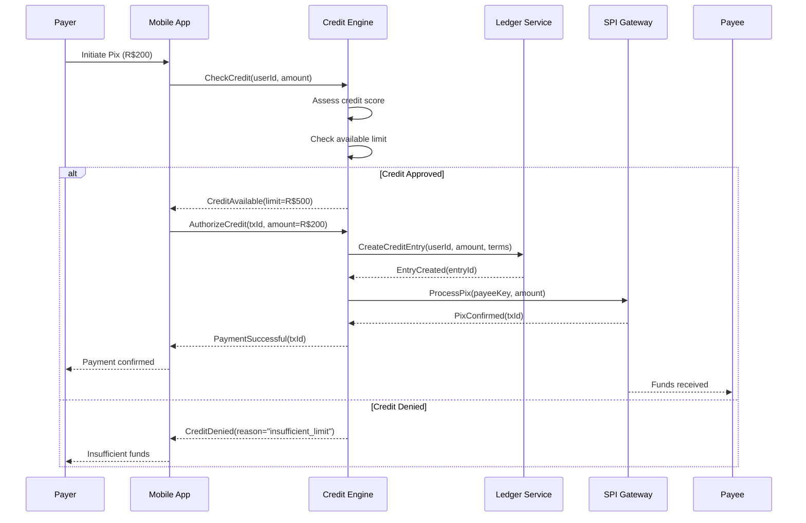
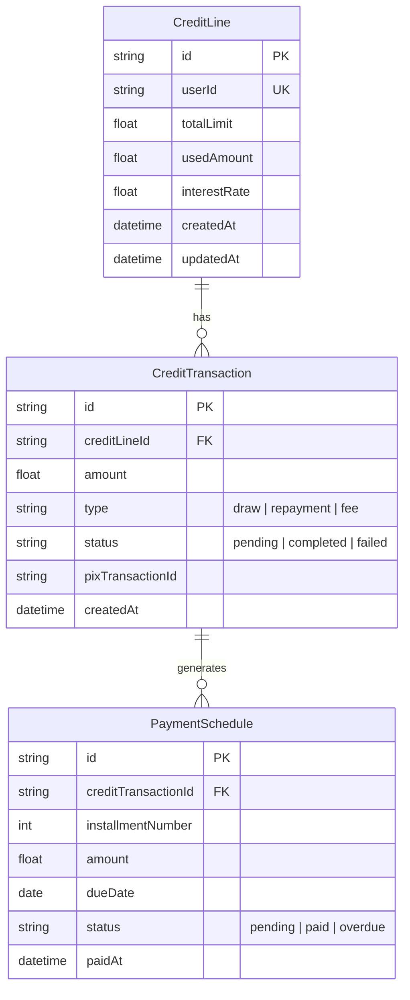

# 14 — RFC Architecture

**🇧🇷** Documentos de Arquitetura RFC  
**🇬🇧** RFC Architecture Documents

---

## 🇧🇷 Descrição do Desafio

Criar documentos de arquitetura no formato RFC (Request for Comments) para sistemas financeiros hipotéticos, demonstrando capacidade de projetar sistemas complexos com decisões bem documentadas.

Requisitos:
- Estrutura RFC completa (problema, solução, trade-offs)
- Diagramas de arquitetura em ASCII e Mermaid
- Modelagem de dados (ERD)
- Design de API REST/GraphQL
- Considerações de segurança
- Análise de alternativas

---

## 🇬🇧 Challenge Description

Create RFC (Request for Comments) architecture documents for hypothetical financial systems, demonstrating ability to design complex systems with well-documented decisions.

Requirements:
- Complete RFC structure (problem, solution, trade-offs)
- Architecture diagrams (ASCII and Mermaid)
- Data modeling (ERD)
- REST/GraphQL API design
- Security considerations
- Alternatives analysis

---

## Why RFCs Matter

When I started my career, architecture decisions were made in meetings. Someone would draw boxes on a whiteboard, everyone would nod, and six months later someone would ask "why did we choose MongoDB over PostgreSQL?" Nobody remembered. The decision was lost to time.

RFCs fix this. An RFC is a written record of a decision: the problem, the options considered, the chosen solution, and the reasoning. It's a living document that can be referenced, challenged, and improved over time.

For a banking stack, RFCs are particularly important because:

1. **Financial systems have real consequences.** A bad architecture decision can lead to data loss, compliance violations, or financial discrepancies. Decisions need to be scrutinized.

2. **Regulatory requirements.** You may need to justify architecture choices to auditors. An RFC shows you considered alternatives and made a deliberate, informed decision.

3. **Distributed teams.** Not everyone was in the room when the decision was made. An RFC lets any team member, current or future, understand the reasoning.

4. **Onboarding.** New engineers can read the RFCs to understand why the system is designed the way it is. This is orders of magnitude more valuable than a README.

5. **Evolution tracking.** As the system changes, RFCs document the history. "Why did we add a credit layer on top of Pix?" — there's an RFC for that.

The format is "Request for Comments" because it's a proposal that invites discussion. The goal isn't to dictate — it's to converge. A good RFC goes through draft → review → approval → implementation → retrospective.

---

## RFC Documents / Documentos RFC

| # | RFC | Description | Descrição |
|---|-----|-------------|-----------|
| 1 | [Credit on top of Pix](../rfc/credit-on-pix.md) | Credit system layered on Pix instant payments | Sistema de crédito sobre pagamentos Pix |
| 2 | [Data Lake for Fintech](../rfc/data-lake.md) | Analytical data lake for financial data | Data lake analítico para dados financeiros |
| 3 | [Financial Monitoring](../rfc/financial-monitoring.md) | Real-time financial transaction monitoring | Monitoramento de transações financeiras em tempo real |

---

## RFC Structure / Estrutura RFC

Each RFC follows this structure:

```
1. Title and Metadata
   - Title, Author, Date, Status, Version

2. Problem Statement
   - Context
   - Motivation
   - Goals and Non-Goals

3. Proposed Solution
   - Architecture Overview
   - Component Diagram
   - Data Flow

4. Database Schema (Mermaid ERD)
   - Entity-Relationship Diagram
   - Table descriptions

5. API Design
   - Endpoints
   - Request/Response examples
   - Authentication

6. Trade-offs and Alternatives
   - Options considered
   - Pros and cons

7. Security Considerations
   - Threats
   - Mitigations
   - Compliance

8. Open Questions
   - Items needing further discussion
```

---

## RFC Writing Methodology

I didn't invent this structure — it's based on years of reading RFCs from projects like Rust, Kubernetes, and React. But I've refined it for financial systems. Here's the methodology I use.

### Phase 1: Identify the Problem

Before writing a single word, I answer these questions:

1. **What is the user-visible problem?** ("Pix only works with available balance — users can't make payments when they're short on funds.")
2. **Why now?** ("Pix adoption has reached 80% of Brazilian adults. Credit-on-Pix is the next frontier.")
3. **What happens if we don't solve it?** ("We lose transactions to competitors who offer this feature.")
4. **What is the scope?** ("First release: consumer credit only. Business credit in v2.")

If I can't answer these four questions clearly, the RFC isn't ready to write. I go back and think harder.

### Phase 2: Explore Solutions

I document every solution I can think of, even the bad ones. For the "Credit on Pix" RFC, the options included:

| Option | Description | Complexity |
|--------|-------------|------------|
| Pre-funded credit pool | Users pre-deposit funds that act as credit buffer | Low |
| Real-time credit assessment | Check credit score, approve/reject in milliseconds | High |
| Deferred settlement | Pay Pix now, settle credit later | Medium |
| Third-party credit API | Outsource credit decisions to a partner | Medium |

Each option gets a paragraph explaining how it would work and why I'm (tentatively) rejecting or accepting it.

### Phase 3: Write the Proposal

With the solution chosen, I write the RFC following the structure above. The key is specificity: concrete architecture diagrams, real API schemas, actual table definitions. Vague RFCs are useless.

### Phase 4: Review and Iterate

An RFC is "Request for Comments" — I want feedback. I share the RFC with stakeholders and ask specific questions:

- "Is the 50ms latency budget realistic for credit assessment?"
- "Should we support installment plans in v1 or v2?"
- "Have I missed any regulatory constraints?"

Each round of feedback gets incorporated into the RFC. The version number tracks iterations.

### Phase 5: Decision and Implementation

Once the RFC is approved, it becomes the implementation blueprint. I reference the RFC number in commit messages:

```
feat(ledger): implement credit-on-pix engine

Implements RFC-001: Credit on top of Pix
- Adds credit assessment middleware
- Creates credit line ledger entries
- Implements interest calculation
```

This creates a traceable link from architecture decision to implementation. Anyone wondering "why does this code exist?" can find the RFC.

---

## Anatomy of a Great Problem Statement

The problem statement is the most important section. If you get this wrong, the rest of the RFC is building on sand.

### Poor Problem Statement

```
Pix needs a credit option. Let's add one.
```

This tells me nothing. Why does Pix need credit? What's the user need? What's the business case?

### Great Problem Statement (from RFC-001)

```
Pix has become the main instant payment method in Brazil.
However, currently Pix only operates as a debit system —
the payer needs to have available balance to complete
the transaction. There is no native credit layer on top of Pix.

This means users with insufficient balance at the moment
of payment must:
1. Transfer funds from another account (if they have one)
2. Use a credit card (which uses a different payment rail)
3. Abandon the transaction

Each of these alternatives increases friction and reduces
conversion. A native credit layer on top of Pix would
allow users to complete Pix payments even when their
account balance is insufficient, with the amount converted
to a credit operation.

This RFC proposes an architecture for such a system.
```

Notice the difference: it describes the current state, the pain points, and the desired outcome. Anyone reading this understands the "why" before the "what."

### Goals vs Non-Goals

Explicitly stating what you're NOT doing is as important as stating what you are doing.

**Goals:**
- Allow Pix payments even without sufficient balance
- Real-time credit decision and disbursement (< 50ms additional latency)
- Transparent to the payee (receives Pix as usual)
- Configurable credit limits per user
- Interest and fee calculation

**Non-Goals:**
- Replace existing Pix infrastructure (we use the SPI interface as-is)
- Define credit risk models (we integrate with existing scoring systems)
- Regulatory compliance specifics (covered in a separate document)
- Support for business credit (planned for v2)
- International payments (Pix is Brazil-only)

Non-goals prevent scope creep. When someone says "shouldn't we also support PIX Internacional?" in the middle of implementation, I point to the RFC: "Non-goal."

---

## Architecture Diagrams: ASCII and Mermaid

I use two diagram formats for different purposes.

### ASCII Diagrams: Embeddable Everywhere

```text
┌─────────────────────────────────────────────────────────────┐
│                     Credit on Pix System                     │
│                                                              │
│  Payer                      Credit Engine              Payee │
│    │                              │                    │     │
│    │  1. Initiate Pix             │                    │     │
│    │ ────────────────────────────►│                    │     │
│    │                              │                    │     │
│    │  2. Check credit limit       │                    │     │
│    │                              │                    │     │
│    │      ┌───────────────┐       │                    │     │
│    │      │ Credit Assess │       │                    │     │
│    │      │ ├─ User score │       │                    │     │
│    │      │ ├─ Limit      │       │                    │     │
│    │      │ └─ Decision   │       │                    │     │
│    │      └───────────────┘       │                    │     │
│    │                              │                    │     │
│    │  3. Authorize credit         │                    │     │
│    │ ────────────────────────────►│                    │     │
│    │                              │  4. Process Pix    │     │
│    │                              │ ──────────────────►│     │
│    │                              │                    │     │
│    │  5. Confirmation             │                    │     │
│    │ ◄────────────────────────────│ ◄──────────────────│     │
│    │                              │                    │     │
│ ┌──┴──┐                     ┌────┴───┐          ┌────┴──┐  │
│ │User │                     │ Ledger │          │ SPI   │  │
│ │App  │                     │Engine  │          │Gateway│  │
│ └─────┘                     └────────┘          └───────┘  │
└─────────────────────────────────────────────────────────────┘
```

ASCII diagrams:
- Render in any text viewer (terminal, GitHub, IDE, email)
- Version control friendly (diff-able)
- Quick to create
- Ugly but functional

### Mermaid Diagrams: Interactive and Beautiful

Mermaid renders in GitHub, VitePress, and many other tools. It supports sequence diagrams, entity-relationship diagrams, flowcharts, and more.



The Mermaid version is more detailed and shows the full flow with conditions. I use Mermaid for documentation that will be viewed in a browser (VitePress, GitHub README), and ASCII for in-code comments and quick mockups.

#### ERD with Mermaid

For database modeling, Mermaid ERDs are invaluable:



---

## API Design: REST Patterns

A good RFC defines the API contract. For the Credit on Pix RFC, the API looks like this:

### Endpoints

```
POST   /api/v1/credit/check        — Check credit availability
POST   /api/v1/credit/authorize    — Authorize credit for a transaction
POST   /api/v1/credit/repay        — Make a repayment
GET    /api/v1/credit/line         — Get credit line details
GET    /api/v1/credit/transactions — List credit transactions
GET    /api/v1/credit/statement    — Get monthly statement
```

### Request/Response Examples

```json
// POST /api/v1/credit/check
// Request
{
  "userId": "user_abc123",
  "amount": 20000,
  "currency": "BRL",
  "merchantId": "merchant_xyz789"
}

// Response: 200 OK
{
  "available": true,
  "availableLimit": 50000,
  "requestedAmount": 20000,
  "interestRate": 0.0299,
  "installmentOptions": [
    { "months": 1, "total": 20000 },
    { "months": 3, "total": 20600 },
    { "months": 6, "total": 21200 },
    { "months": 12, "total": 22400 }
  ],
  "expiresAt": "2024-01-15T10:30:00Z"
}

// Response: 402 Payment Required
{
  "available": false,
  "reason": "insufficient_limit",
  "availableLimit": 10000,
  "requestedAmount": 20000,
  "suggestion": "Reduce amount to R$100.00 or less"
}
```

Notice the `402 Payment Required` status code. I use HTTP status codes semantically: 200 for success, 400 for bad request, 402 for business rule rejection, 422 for validation errors, 500 for internal errors.

### Authentication

Each endpoint defines its auth requirements:

```
POST /api/v1/credit/*
  Auth: Bearer JWT (user access token)
  Scope: credit:write
  Rate Limit: 10 requests/minute per user
  
GET /api/v1/credit/line
  Auth: Bearer JWT (user access token)
  Scope: credit:read
  Rate Limit: 100 requests/minute per user
```

---

## Trade-offs and Alternatives

This section is where the RFC shows its value. I document every option considered and why each was accepted or rejected.

### Option A: Pre-funded Credit Pool

Users deposit money into a credit pool. When they need credit, the system draws from their pre-funded pool.

**Pros:**
- Zero credit risk (funds are already in the pool)
- No real-time scoring needed
- Simple to implement

**Cons:**
- Users must pre-fund (same problem as current Pix!)
- Reduces conversion (users don't want to lock up capital)
- Competitive disadvantage (other players offer real credit)

**Verdict: Rejected.** Doesn't solve the core problem of insufficient balance at transaction time.

### Option B: Real-time Credit Assessment

Check user's credit score and available limit in real-time. If score passes and limit is sufficient, extend credit instantly.

**Pros:**
- True credit experience (no pre-funding)
- Maximum conversion
- Competitive differentiation

**Cons:**
- Complex architecture (scoring, limit management, settlement)
- Requires integration with credit bureaus
- Latency risk (must complete in < 1 second)
- Regulatory requirements (SCC, Bacen regulations)

**Verdict: Selected.** This is the primary proposal in this RFC.

### Option C: Deferred Settlement

Process the Pix normally, mark it as "credit," and settle with the user later.

**Pros:**
- Simplest implementation
- User gets immediate value
- No changes to Pix flow

**Cons:**
- Bank bears all the risk (no credit check upfront)
- Difficult to manage defaults
- Regulatory gray area

**Verdict: Rejected.** Too risky for the institution. Credit must be assessed before disbursement.

### Option D: Third-party Credit API

Outsource credit decisions to a partner (e.g., a fintech specializing in credit).

**Pros:**
- No credit infrastructure to build
- Partner handles risk assessment
- Faster time to market

**Cons:**
- Vendor lock-in
- Sharing user data with third parties
- Profit sharing reduces margins
- Partner may change terms or go out of business

**Verdict: Rejected for v1.** May revisit for v2 if internal scoring proves too complex.

---

## Security Considerations

Every financial RFC must have a security section. I organize it by threat category.

### Threat Model

| Threat | Impact | Likelihood | Mitigation |
|--------|--------|------------|------------|
| Credit line abuse | High | Medium | Rate limiting, anomaly detection |
| Identity theft | Critical | Medium | MFA, device fingerprinting |
| Replay attacks | High | Low | Nonce, idempotency keys |
| Data interception | High | Low | TLS 1.3, certificate pinning |
| Insider fraud | Critical | Low | Audit logging, separation of duties |
| DDoS on credit endpoint | Medium | Medium | Rate limiting, WAF, auto-scaling |

### Data Protection

```
Credit Line Data:
  - At rest: AES-256 encryption
  - In transit: TLS 1.3
  - Access: Service-to-service auth with mTLS
  - Retention: 5 years (regulatory requirement)
  - Deletion: Anonymized after retention period

PII Data:
  - At rest: AES-256 with separate key
  - Access: Role-based, audited quarterly
  - Masking: Last 4 digits only in logs
```

### Secrets Management

```yaml
# Kubernetes deployment with Secrets
apiVersion: v1
kind: Secret
metadata:
  name: credit-engine-secrets
type: Opaque
data:
  # Base64-encoded, set via CI/CD pipeline
  DB_PASSWORD: <from-vault>
  CREDIT_BUREAU_API_KEY: <from-vault>
  JWT_SIGNING_KEY: <from-vault>
```

Never store secrets in the repository. I use HashiCorp Vault for secret distribution.

### Compliance Requirements

For Brazilian financial systems:

- **Bacen Resolutions**: The system must comply with resolutions on credit operations, including interest rate disclosure and late payment procedures.
- **LGPD (Lei Geral de Proteção de Dados)**: User data handling must comply with LGPD requirements, including consent management and data deletion on request.
- **SCC (Sistema de Crédito Cooperativo)**: If the system operates through a cooperative, SCC rules apply.
- **PCI-DSS**: If credit card numbers are involved (they aren't in this RFC, but Pix credit ties to accounts).

---

## Open Questions

No RFC is complete at v0.1. I always list unresolved questions:

1. **Should credit limits be dynamic or static?** Dynamic limits (based on spending patterns) provide better UX but add complexity. Static limits are simpler but less user-friendly.

2. **What happens when a user has multiple active credit lines?** Should they be consolidated into a single limit, or managed separately?

3. **Grace period policy:** How many days after the due date before late fees apply? Industry standard is 15 days, but we need product team input.

4. **Integration with Central Bank's Pix Credit rules?** As of writing, there's no specific regulatory framework for credit-on-Pix. This may change.

5. **Should we support partial prepayments?** Users might want to pay off part of their credit early. This affects interest calculation.

These open questions are flagged for discussion during the RFC review period. The answers become part of the implementation specification.

---

## RFC Lifecycle

An RFC goes through these stages:

```
[Draft] → [Review] → [Approved] → [Implemented] → [Deprecated] → [Superseded]
```

| Status | Meaning |
|--------|---------|
| **Draft** | RFC is being written. Not yet ready for review. |
| **Review** | RFC is open for comments. Discussion period. |
| **Approved** | RFC has been accepted. Implementation can begin. |
| **Implemented** | The feature is live. Code references this RFC. |
| **Deprecated** | No longer recommended. Still in use but not for new designs. |
| **Superseded** | Replaced by a newer RFC (which is referenced). |

I track the lifecycle in the metadata header:

```yaml
---
rfc: 001
title: Credit on top of Pix
status: Implemented
author: Banking Challenges Team
date: 2024-01-15
updated: 2024-03-20
version: v1.2
supersedes: []
superseded_by: []
implementation_pr: https://github.com/mateussiqueira/banking-stack/pull/142
---

```

When an RFC is superseded, the new RFC links to the old one:

```yaml
---
rfc: 004
title: Credit on Pix v2 — Dynamic Limits
supersedes: [rfc-001]
---
```

This creates a decision tree. Anyone can trace the evolution: "We started with RFC-001, but RFC-004 changed the limit strategy."

---

## RFC Template

I use the following template for new RFCs. It ensures consistency across the project.

```markdown
---
rfc: `<number>`
title: `<title>`
status: Draft
author: `<author>`
date: <YYYY-MM-DD>
version: v0.1
---

# RFC: `<title>`

## Problem Statement

### Context

<2-3 paragraphs describing the current situation>

### Motivation

<Why is this change needed? What problem does it solve?>

### Goals

- `<goal 1>`
- `<goal 2>`

### Non-Goals

- <non-goal 1>

---

## Proposed Solution

### Architecture Overview

```
`<ASCII architecture diagram>`
```

### System Components

1. **``<Component Name>``** — ``<description, responsibility>``
2. **``<Component Name>``** — ``<description, responsibility>``

### Data Flow

```mermaid
sequenceDiagram
    `<Main flow>`
```

---

## Database Schema

```mermaid
erDiagram
    `<Tables and relationships>`
```

### Table: ``<table_name>``

| Column | Type | Description |
|--------|------|-------------|
| id | UUID | Primary key |
| ... | ... | ... |

---

## API Design

### Endpoints

| Method | Path | Description |
|--------|------|-------------|
| POST | /api/v1/... | ... |

### Request/Response

```json
// Request
{ ... }

// Response: 200 OK
{ ... }
```

### Authentication

`<Scope and auth requirements>`

---

## Trade-offs and Alternatives

### Option A: `<name>`

`<Description>`

**Pros:** ...
**Cons:** ...

**Verdict:** <Accepted/Rejected>

### Option B: `<name>`

`<Description>`

**Pros:** ...
**Cons:** ...

**Verdict:** <Accepted/Rejected>

---

## Security Considerations

| Threat | Impact | Mitigation |
|--------|--------|------------|
| `<threat>` | `<level>` | `<mitigation>` |

---

## Open Questions

1. `<Question 1>`
2. `<Question 2>`

---

## Implementation Plan

### Phase 1: MVP

- [ ] Core credit assessment service
- [ ] Basic CRUD for credit lines
- [ ] Pix integration

### Phase 2: Enhanced

- [ ] Installment plans
- [ ] Interest calculation engine
- [ ] Notifications

### Phase 3: Advanced

- [ ] Dynamic credit limits
- [ ] ML-based risk scoring
- [ ] Automated collection
```

---

## Real RFC Example: The "Financial Monitoring" RFC

Let me walk through one of the existing RFCs to show how this comes together.

The **Financial Monitoring** RFC describes a real-time transaction monitoring system. Here's how each section maps to the structure:

### Problem Statement

```
Financial institutions need to detect and respond to
fraudulent transactions in real-time. Current batch-based
detection (running reports at end of day) means a fraudulent
transaction is only discovered hours after it occurred.

This RFC proposes a streaming-based monitoring system
that evaluates each transaction within 100ms of receipt.
```

The problem is specific and measurable: "batch processing" leads to "hours of delay." The solution targets "100ms."

### Proposed Solution

The architecture uses Kafka for streaming, Flink for processing, and MongoDB for storage:

```
┌─────────────┐     ┌──────────┐     ┌──────────────┐
│ Transaction  │────►│  Kafka   │────►│  Flink Job   │
│ Source       │     │  Topic   │     │  (Rules)     │
└─────────────┘     └──────────┘     └──────┬───────┘
                                            │
                               ┌────────────┼────────────┐
                               ▼            ▼            ▼
                         ┌──────────┐ ┌──────────┐ ┌──────────┐
                         │ MongoDB  │ │ Alert    │ │ Dashboard│
                         │ (Events) │ │ Service  │ │ (Grafana)│
                         └──────────┘ └──────────┘ └──────────┘
```

### Trade-offs

The RFC considers three options:

| Option | Description | Verdict |
|--------|-------------|---------|
| Streaming (Kafka + Flink) | Real-time event processing | Selected |
| Batch (Spark nightly) | 24h delay, simple | Rejected |
| Hybrid (streaming + batch) | Both real-time and daily reports | Deferred to v2 |

The RFC documents why streaming is chosen: "Batch processing cannot meet the 100ms SLA required for fraud prevention."

### Security Monitoring Rules

The RFC includes concrete rule examples:

```
RULE: Velocity Check
- Trigger: More than 5 transactions in 60 seconds
- Action: Block card, notify user, flag for review
- Severity: High

RULE: Amount Anomaly
- Trigger: Transaction > 200% of user's average daily amount
- Action: Request additional authentication (3DS)
- Severity: Medium

RULE: Geolocation Mismatch
- Trigger: Consecutive transactions from cities > 500km apart within 60 minutes
- Action: Block, notify user
- Severity: Critical
```

These rules are specific enough to implement directly from the RFC. No additional specification document needed.

---

## How to Write a Good RFC

After writing several RFCs and reading dozens more, here are my rules:

### Do's

1. **Start with the problem.** If I'm not convinced there's a problem to solve, I won't read the rest. Hook me early.

2. **Be specific.** "We use Kafka for streaming" is vague. "We use Kafka 3.6 with 5 partitions, replicated across 3 brokers, with AT_LEAST_ONCE delivery semantics" is specific enough to debate.

3. **Use real numbers.** "Improves performance" is weak. "Reduces 95th percentile latency from 200ms to 45ms" is strong.

4. **Show your work.** "We chose PostgreSQL over MongoDB because of transactional guarantees" — good. "We chose PostgreSQL because our workload is 80% writes with complex joins, and we need ACID compliance for financial reconciliation; MongoDB outperforms on read-heavy workloads with flexible schemas, which doesn't match our use case" — excellent.

5. **Acknowledge trade-offs.** Every architecture decision is a trade-off. If you don't mention any, you either haven't thought deeply enough, or you're being dishonest.

6. **Link to code.** When the RFC is approved and the feature is implemented, link to the PR. This creates a traceable decision → implementation chain.

### Don'ts

1. **Don't write a novel.** 5-10 pages is the sweet spot. Less than 2 pages is too shallow. More than 20 and nobody will read it.

2. **Don't be dogmatic.** "We should use microservices because they're best practice" is not an argument. "We should split the ledger service because the credit assessment component has different scaling requirements (high CPU, bursty) from the transaction recording component (high I/O, steady)" — that's a real reason.

3. **Don't ignore security.** Every RFC, even for internal tools, should mention security. At minimum: "This system processes internal data only, no PII, no authentication required." Be explicit.

4. **Don't skip open questions.** Pretending everything is resolved creates false confidence. Acknowledging unknowns shows intellectual honesty.

5. **Don't forget non-goals.** Without explicit non-goals, stakeholders will assume everything is in scope. Non-goals manage expectations.

---

## How to Review an RFC

Reviewing is a skill too. When I receive an RFC for review, I check these things:

1. **Is the problem real?** Do I agree that this needs solving?
2. **Are the requirements complete?** Does this handle edge cases?
3. **Are the trade-offs honest?** Do the selected options truly outperform the alternatives?
4. **Is the design feasible?** Can this be built with our current resources and constraints?
5. **Are the security considerations adequate?** What am I missing?
6. **Are the open questions acceptable?** Can we proceed without answering them all?

I comment on the RFC as GitHub PR comments on the Markdown file:

```markdown
> **The system uses a single PostgreSQL instance for credit transactions.**

Have we considered the failover scenario? If this instance goes down,
all credit operations are blocked until recovery. Should we add
a read replica for HA in v1, or is this acceptable for the MVP?

I lean toward accepting the single-instance risk for v1 but
adding a note in the implementation plan for HA in v2.
```

The key: I provide reasoning, not just "I don't like this." And I offer a path forward (accept with note, reject with alternative, request more information).

---

## The RFCs in This Project

Here's what each existing RFC covers and what you'll learn from reading them:

### RFC-001: Credit on Top of Pix

This is the most complete RFC in the project. It covers:
- How to layer credit logic on top of Brazil's instant payment system
- Real-time credit assessment architecture
- Interaction with the SPI (Pix's settlement system)
- The full flow from user initiating a Pix to receiving credit
- Interest calculation, repayment schedules
- 4 alternatives considered with detailed pros/cons

**Why this matters:** Pix is unique to Brazil, but the pattern (layering financial products on top of payment rails) is universal. The architecture can be adapted for any instant payment system — UPI in India, FedNow in the US, etc.

### RFC-002: Data Lake for Fintech

This RFC covers analytical infrastructure:
- Ingesting transaction data from multiple sources
- Building a dimensional model (star schema)
- ETL/ELT pipeline design
- Query performance optimization for financial analytics
- Data governance and retention policies

**Why this matters:** Most fintechs start with operational databases that perform poorly for analytics. This RFC shows how to design a proper analytical layer.

### RFC-003: Financial Monitoring

This RFC covers real-time monitoring:
- Streaming fraud detection architecture
- Rule engine design (configurable, hot-reloadable)
- Alert routing and escalation
- Dashboard design for operations teams
- Integration with existing banking infrastructure

**Why this matters:** Fraud detection is a critical competence for any financial system. The patterns here apply to any real-time monitoring system.

---

## How to View / Como Visualizar

```bash
# Open RFCs via VitePress
make docs

# Direct markdown
open packages/docs/rfc/credit-on-pix.md
open packages/docs/rfc/data-lake.md
open packages/docs/rfc/financial-monitoring.md

# Create a new RFC
cp packages/docs/rfc/TEMPLATE.md packages/docs/rfc/00x-my-new-rfc.md
```

## Final Thoughts

RFCs are a habit. The first RFC you write will feel awkward and overly formal. The tenth one will feel natural. The twentieth one will save your team a month of arguing about architecture.

The investment is small — a few hours to write, a few hours to review. The return is enormous: documented decisions, shared understanding, faster onboarding, auditable architecture.

In banking, where mistakes cost real money, RFCs aren't overhead. They're insurance.
