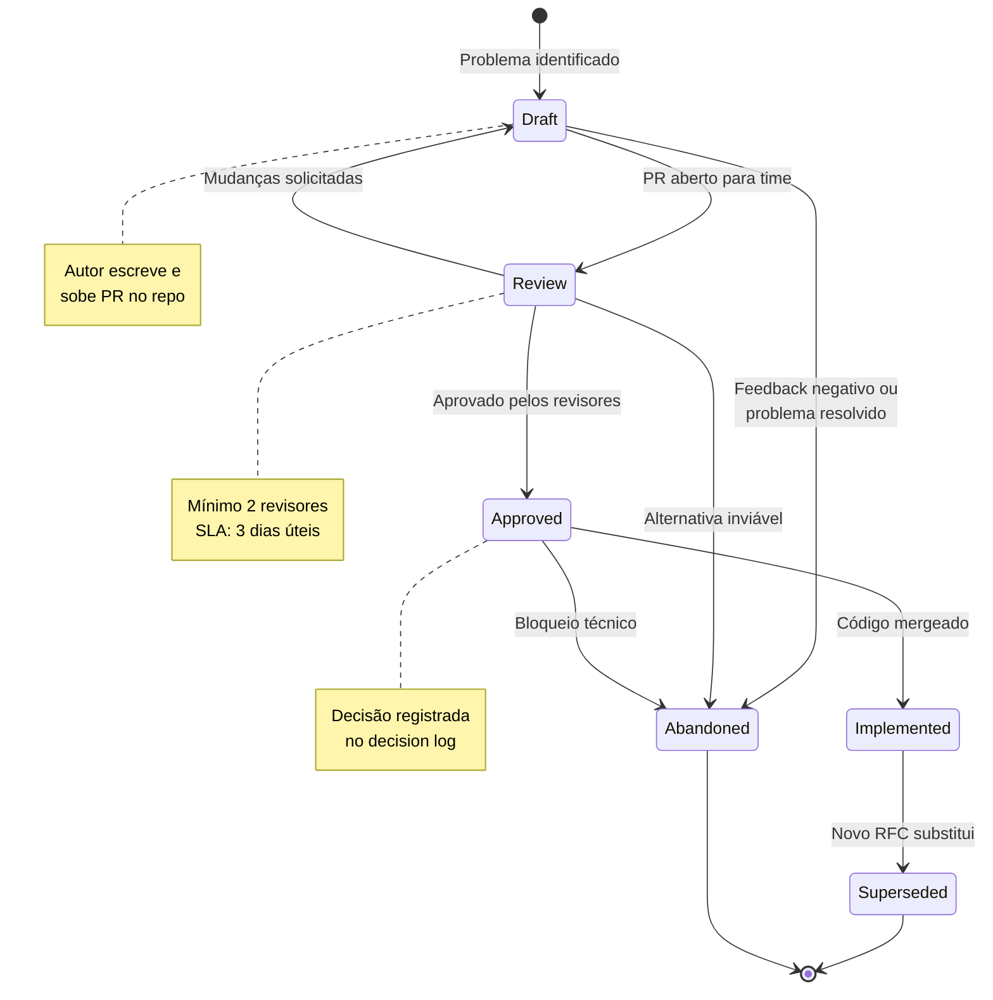
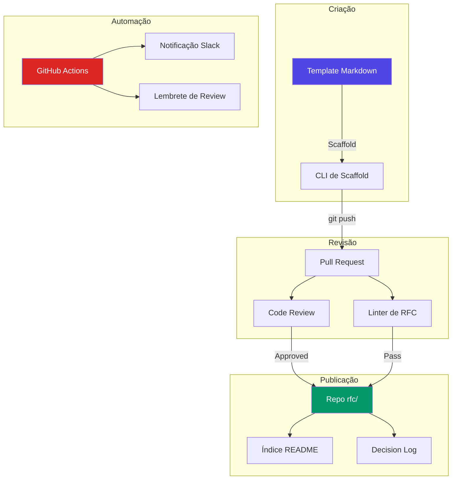
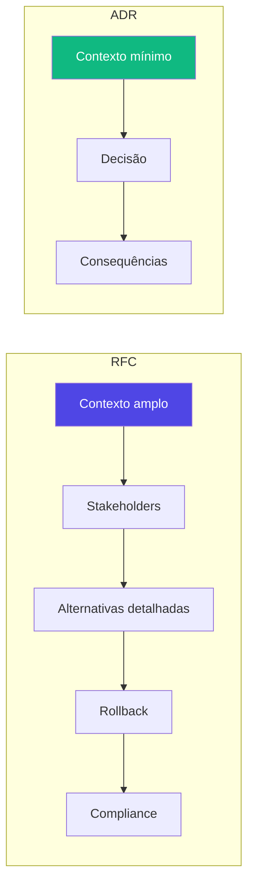
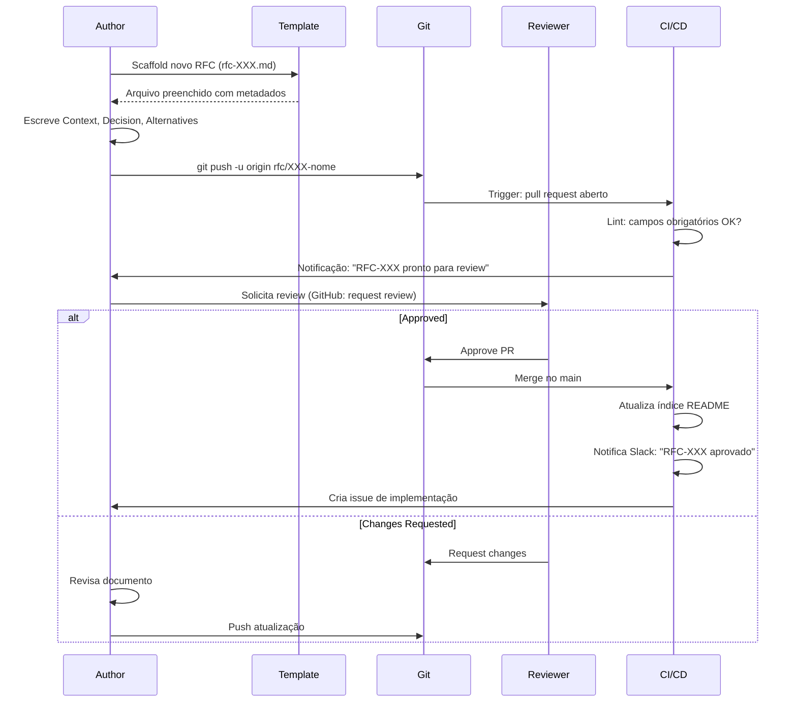
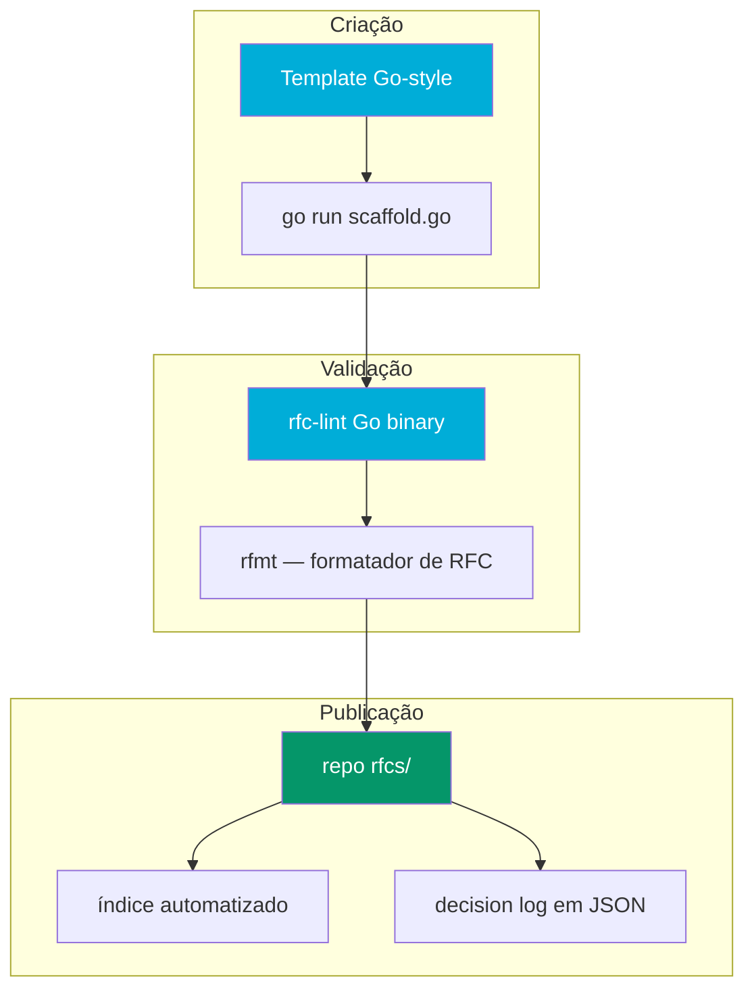

# Desafio 14: RFC — Documentando Decisões que Sobrevivem ao Tempo

**🇧🇷** RFC e ADR para decisões de engenharia  
**🇬🇧** RFC & ADR for Engineering Decisions

---

## 🎯 Objetivos de Aprendizado

- Dominar o processo de RFC (Request for Comments) como ferramenta de decisão
- Escrever RFCs que documentam contexto, alternativas e consequências
- Diferenciar RFC de ADR (Architecture Decision Record) e saber quando usar cada um
- Implementar o ciclo de vida completo: draft → review → approved → implemented → superseded
- Entender por que fintechs reguladas exigem documentação de decisões arquiteturais
- Montar tooling de RFC com markdown, Git, CI/CD e automação de templates
- Construir um decision log que preserva conhecimento institucional contra rotatividade

---

## 📋 Pré-requisitos

### 🧠 Conceitos
- Processo de RFC (inspirado no IETF)
- ADR (Architecture Decision Records)
- Documentação técnica
- Tomada de decisão em engenharia
- Governança de software
- Gestão do conhecimento

### 📚 Desafios Anteriores
- Nenhum — processo de documentação que se aplica a todos os desafios do banking-stack

### 🛠️ Ferramentas
- Git
- GitHub (Pull Requests, Code Review, Issue Templates)
- Markdown
- Mermaid (diagramas)

### 💻 Técnico
- Markdown avançado (tabelas, diagramas Mermaid, callouts)
- Git workflow (branching, code review)
- Redação técnica
- Arquitetura de software

---

## 📖 Abertura — O Que é um RFC?

"Fato curioso: deixa eu te contar uma história que começa em 1969, num laboratório da UCLA, com um cara chamado Steve Crocker. Ele tinha 24 anos, estava ajudando a construir a ARPANET — a rede que viraria a internet — e tinha um problema: como 40 pesquisadores espalhados pelos EUA iam decidir coisas sem se matar? Porque decidir protocolo de rede é tipo decidir qual santo protege a cidade — cada um tem o seu e ninguém cede.

Aí o Crocker fez algo genial pela simplicidade. Ele escreveu um documento chamado 'Request for Comments' — pedido de comentários. Não chamou de 'Standard', não chamou de 'Specification', não chamou de 'Decision Final do Comitê Supremo'. Chamou de **Request for Comments**. A palavra 'Request' não é acidental. É um convite. 'Olha, eu acho que deveria ser assim. O que vocês acham?' E a palavra 'Comments' também não é: não é 'Approval', não é 'Sign-off'. É comentário. Opinião. Discussão.

O RFC 1, escrito em 7 de abril de 1969, tinha 6 páginas datilografadas tratando de host software da ARPANET. Era informal, tinha tom de conversa entre amigos, e terminava com um pedido genuíno de feedback. Ninguém imaginava que aquele documento inauguraria um processo que, 55 anos depois, seria adotado por empresas como Uber, Shopify, HashiCorp, Amazon, Google e — pasme — praticamente toda fintech que precisa passar por auditoria regulatória.

Mas por que 'RFC'? Por que não 'Spec'? Porque o Crocker entendeu uma coisa que a maioria das empresas demora décadas pra aprender: **quem decide sozinho decide errado**. Ou pior: decide certo, mas ninguém sabe por quê. E aí, 6 meses depois, quando o contexto mudou, ninguém consegue reavaliar a decisão porque o raciocínio morreu com quem decidiu. O RFC existe pra que a decisão sobreviva ao decisor.

Agora, deixa eu trazer isso pro mundo real de engenharia de software — e especificamente pra fintech.

Em 2012, a Knight Capital, uma das maiores corretoras de Wall Street, perdeu US$ 440 milhões em 45 minutos. O motivo? Um deploy mal feito. Mas a causa raiz não foi o deploy — foi a **ausência de processo de decisão documentado**. Ninguém tinha escrito um RFC explicando por que o novo software de trading estava sendo instalado, quais eram os riscos, qual era o plano de rollback, o que as alternativas consideradas eram. Se tivesse existido um RFC, alguém teria levantado a mão na review e dito: 'Espera aí — e se o deploy falhar? Qual é o circuito breaker?' Mas não tinha RFC. Não tinha review. Não tinha ninguém questionando. E US$ 440 milhões viraram fumaça em 45 minutos.

Outro caso: em 2012 também — ano ruim pra gestão de risco — o JPMorgan Chase perdeu US$ 6 bilhões no que ficou conhecido como 'London Whale'. O relatório do Senado americano identificou que os modelos de risco eram mal documentados, as premissas não eram registradas, e quando os traders mudavam parâmetros ninguém sabia por que os parâmetros originais tinham sido escolhidos. De novo: **decisões sem registro**, conhecimento que morreu com quem saiu de férias, parâmetros que ninguém sabia justificar.

No Brasil, o Pix — que hoje é padrão ouro de sistema de pagamentos — nasceu de um RFC do Banco Central. O BCB não acordou um dia e disse 'vamos fazer Pix'. Eles publicaram um documento de consulta pública — essencialmente um RFC — convidando o mercado a comentar. Bancos, fintechs, cooperativas de crédito, todo mundo mandou feedback. O documento evoluiu por meses. Quando o Pix foi lançado, não era a ideia de uma pessoa — era a convergência de centenas de contribuições. E é por isso que deu certo.

Mas por que eu estou te contando isso tudo num desafio de código? Porque **toda decisão de arquitetura que você toma hoje vai ser questionada amanhã**. O engenheiro que escolheu MongoDB pro ledger — ele vai estar aí daqui a 2 anos quando o banco crescer e alguém perguntar 'por que a gente não usa PostgreSQL?'. Se ele escreveu um RFC, a resposta está lá: contexto, alternativas consideradas, trade-offs, data da decisão. Se ele não escreveu... a resposta é 'ah, o João que sabia, mas ele saiu da empresa'.

RFCs não são burocracia. São **memória institucional**. São o que separa uma empresa que aprende com as próprias decisões de uma empresa que repete os mesmos erros a cada rotatividade de equipe.

E em fintech — onde auditoria do Banco Central, compliance com GDPR/LGPD, certificação PCI-DSS e relatórios regulatórios são realidades diárias — documentar decisões não é opcional. É exigência. O BACEN não vai te perguntar 'qual banco de dados você usa?' — ele vai te perguntar 'por que você escolheu esse banco, quais os riscos, e como você mitiga falhas?'. Se você não tiver um RFC pra mostrar, a conversa termina mal.

Então esse desafio é sobre construir o **músculo de documentar decisões**. Não é código — é processo. Mas é o tipo de processo que, quando bem feito, evita que você perca US$ 440 milhões em 45 minutos."

---

## 🔥 O Problema

Imagine que você é o tech lead de uma fintech em crescimento. Hoje, você decide coisas assim:

> "Vamos usar MongoDB pra tudo porque é rápido e não precisa de schema."

E funciona. Até que seis meses depois, com 3 milhões de usuários, o banco começa a travar. Alguém pergunta: "Por que a gente escolheu MongoDB e não PostgreSQL?" E a resposta é... silêncio. Ou pior: "Fulano que decidiu, mas ele saiu."

Esse é o problema da **amnésia arquitetural** — decisões são tomadas, mas o raciocínio se perde. E os sintomas são devastadores:

**1. Tribal Knowledge**

O conhecimento vive na cabeça de 3 pessoas. Se uma sai, o conhecimento vai junto. Se as 3 saem, você tem um sistema que ninguém entende. Eu já vi empresa que tinha um serviço crítico rodando em Clojure — ninguém sabia por quê, ninguém sabia manter, mas estava lá, processando R$ 2 bilhões por mês. O engenheiro que escolheu Clojure em 2018 já estava em outra empresa, surfando em Bali. O serviço continuava rodando, mas cada bug novo era uma crise existencial.

Esse fenômeno é tão comum que tem nome na literatura de engenharia de software: **bus factor**. Quantas pessoas precisam ser atropeladas por um ônibus pra que o projeto morra? Se seu bus factor é 1, você tem um problema. Se é 0.5 — porque metade do conhecimento morreu quando o João saiu e a outra metade está num Google Doc que ninguém sabe onde fica — você tem uma catástrofe.

E tem um agravante específico de fintech: rotatividade em tecnologia financeira é MUITO alta. Bancos tradicionais pagam bônus gordos, big techs pagam salários em dólar, e sua fintech promissora está competindo por talento com todo mundo. A probabilidade de o engenheiro que decidiu a stack estar na empresa daqui a 2 anos é baixa. Se a decisão não estiver documentada, ela morre com a saída dele.

**2. Cargo Cult Decision-Making**

"O Nubank usa Clojure, então a gente também deveria usar." "O Uber tem 1000 RFCs, então a gente precisa de 1000 RFCs." Decisões baseadas no que os outros fizeram, sem entender o contexto, são cargo cult. O Nubank escolheu Clojure em 2013 porque o time fundador era de functional programming e porque Datomic (também Clojure) resolvia o problema de audit trail imutável. Seu contexto é completamente diferente — seu time sabe TypeScript, seu orçamento de cloud é 1/10 do Nubank de 2013, e seu volume de transações é 1/100. Copiar a stack sem copiar o contexto é receita pra fracasso.

O problema é que sem RFC documentado, você nem sabe que está fazendo cargo cult. Alguém lembra vagamente que "O Nubank usa Clojure", mas ninguém lembra o contexto da decisão original. Aí você adota e 6 meses depois descobre que não tem ninguém no mercado pra contratar que saiba Clojure no Brasil. O RFC teria listado isso nas 'Consequences Negativas' e você teria pensado duas vezes.

**3. O Efeito "Sempre Fizemos Assim"**

Uma decisão foi tomada em 2019, num contexto específico: MongoDB era a única opção que o time conhecia, o prazo era apertado, e o CTO disse "Resolve rápido". Em 2024, o contexto mudou completamente: o banco cresceu 100x, PostgreSQL agora é conhecido pelo time, e existem 3 alternativas melhores. Mas ninguém reavalia porque a decisão original nunca foi documentada — ela virou "Verdade absoluta". "Ah, a gente usa MongoDB porque... sempre usou MongoDB."

Isso se chama **path dependence** — o caminho que você trilhou define o caminho que você continua trilhando, mesmo que existam caminhos melhores. O RFC quebra path dependence porque ele força você a registrar **quando** a decisão foi tomada e **em que contexto**. Se o contexto mudou, você reabre o RFC.

Um exemplo concreto: em 2020, uma fintech brasileira escolheu Firebase como banco principal porque o time era pequeno e queria velocidade. Funcionou por 2 anos. Em 2022, com 500 mil usuários, Firebase custava R$ 80 mil/mês e tinha problemas de consistência em transações. Mas ninguém questionava porque "Sempre foi Firebase". Só quando um engenheiro novo escreveu um RFC propondo migrar pra PostgreSQL é que a empresa percebeu: a decisão original fazia sentido em 2020, mas não fazia mais em 2022. A migração levou 6 meses, mas economizou R$ 60 mil/mês e eliminou 3 classes de bugs de consistência. Tudo porque alguém escreveu um RFC questionando o status quo.

**4. Auditoria e Compliance**

Fintechs são reguladas. O Banco Central exige que decisões de arquitetura que afetam segurança, disponibilidade e integridade de dados sejam justificáveis. A LGPD exige que decisões sobre armazenamento de dados pessoais sejam documentadas (artigo 50: "Os controladores e operadores deverão manter registro das operações de tratamento de dados pessoais"). O PCI-DSS exige documentação de arquitetura de rede e fluxo de dados de cartão.

Se você não tem RFCs documentando por que o banco de dados fica em tal região, por que a criptografia usa AES-256, por que o backup é diário e não horário — você está fora de compliance. E fora de compliance significa: multa, suspensão de operação, perda de licença. Já vi fintech que perdeu 6 meses de roadmap porque o BACEN pediu documentação de arquitetura e a empresa não tinha — precisou parar tudo pra documentar retrospectivamente.

**5. O Verdadeiro Custo de Decisões Ruins**

Vamos fazer uma conta rápida. Uma decisão de arquitetura ruim — trocar de banco de dados, reescrever um serviço, migrar de REST pra GraphQL sem necessidade — custa em média 3 a 6 meses de engenharia. Com um time de 5 pessoas a R$ 25 mil/mês cada, isso é entre R$ 375 mil e R$ 750 mil. E isso é só o custo direto. O custo de oportunidade — features que deixaram de ser entregues, bugs que entraram em produção durante a migração, clientes que cancelaram porque o sistema ficou instável — é facilmente o dobro.

Um RFC bem escrito custa 2 a 4 horas de um engenheiro sênior. Mesmo considerando o tempo de review (mais 4 a 8 horas distribuídas entre 3 revisores), o custo total é na casa de R$ 3 mil a R$ 8 mil. Compare com R$ 375 mil de uma migração mal planejada. O ROI de escrever RFC é tão óbvio que a pergunta não é "Por que escrever?" — é "Por que você ainda não está escrevendo?".

**6. Feedback Loop e Melhoria Contínua**

Sem RFC, o ciclo de decisão é: problema → alguém decide → implementa → esquece. Com RFC, o ciclo vira: problema → RFC draft → discussão → decisão → implementação → retrospective → aprendizado. A diferença é que, com RFC, cada decisão gera um artefato que pode ser revisitado, questionado, melhorado. Você não está só resolvendo o problema — está construindo uma base de conhecimento que torna a próxima decisão mais rápida e melhor informada.

A Uber tem mais de 1000 RFCs acumulados desde 2016. Quando um engenheiro novo entra, ele passa a primeira semana lendo RFCs relevantes pro time dele. Em uma semana, ele entende o contexto de dezenas de decisões que moldaram o sistema que ele vai manter. Sem RFCs, esse mesmo aprendizado levaria meses de conversas de corredor, perguntas no Slack, e tentativa e erro.

Cada uma dessas dores tem solução. E a solução passa por **processo**, **template** e **cultura**.

---

## 🏗️ Arquitetura Geral

<LanguageToggle />

<div class="Lang-content ts" style="Display:block;">

### Visão Macro — O Ciclo de Vida de um RFC



Esse diagrama de estados é o coração do processo. Cada RFC nasce como `Draft` — um documento incompleto que o autor sobe como pull request. O status `Draft` é um convite: "Ainda estou pensando, me ajudem a refinar". É diferente de `Review`, que significa: "Já refinei o suficiente, agora quero aprovação ou rejeição".

Repare que `Abandoned` pode vir de qualquer estado. Isso é importante: abandonar um RFC não é fracasso. É economia de tempo. Se durante a review você descobre que a alternativa era inviável, ou que o problema já foi resolvido de outra forma, abandonar o RFC é a decisão certa. Um RFC abandonado ainda é valioso: ele documenta o que NÃO fazer e por quê. Da próxima vez que alguém sugerir a mesma ideia, você aponta pro RFC abandonado.

O estado `Superseded` é onde RFCs antigos vão morrer com dignidade. Quando um RFC novo substitui um antigo, o antigo não é deletado — ele é marcado como `Superseded` e referencia o novo. Isso preserva a história: você consegue ver a evolução das decisões ao longo do tempo, como camadas geológicas.

### Stack de Ferramentas para RFC



Tudo vive num diretório `rfcs/` dentro do repositório. Não é um repo separado — é colocalizado com o código que a decisão afeta. Isso é importante porque cria um link físico entre a decisão e o código. Quando alguém faz `git blame` num arquivo de configuração e vê um commit com mensagem "Implementa RFC-042", ela consegue `git show` o RFC e entender exatamente por que aquela configuração existe.

A CLI de scaffold (um script shell ou Node) gera um RFC novo a partir de um template, preenche metadados (número, data, autor), e cria um branch pra review. O linter verifica se todos os campos obrigatórios estão preenchidos, se o status é válido, se as alternativas têm tabela de prós/contras.

### Estrutura de Diretórios

```
rfcs/
├── README.md              # Índice de todos os RFCs com status
├── template.md            # Template base
├── 0001-template.md       # O template em si (meta-RFC)
├── 0002-cdc-postgres.md   # RFC-002: Change Data Capture com PostgreSQL
├── 0003-mtls-services.md  # RFC-003: mTLS entre serviços internos
├── 0014-pix-credito.md    # RFC-014: Crédito sobre Pix
├── ...
├── adr/                   # ADRs (decisões mais leves)
│   ├── README.md
│   ├── adr-001-monorepo.md
│   ├── adr-002-graphql-ledger.md
│   └── adr-005-go-spi.md
└── superseded/            # RFCs substituídos
    ├── 0001-kafka-legado.md
    └── 0007-rest-legado.md
```

### Template de RFC — O Documento Canônico

```markdown
# RFC-XXX: [Título Descritivo]

**Status:** Draft | Review | Approved | Implemented | Deprecated | Superseded
**Authors:** @github-handle
**Date:** YYYY-MM-DD
**Reviewers:** @reviewer1, @reviewer2
**Supersedes:** RFC-YYY (se aplicável)
**Superseded By:** RFC-ZZZ (se aplicável)

---

## Context

[Qual problema motivou esta decisão? Quais são as restrições (técnicas, negócio,
regulatórias, prazo)? O que acontece se não decidirmos nada?]

### Background

[Contexto histórico, decisões anteriores relevantes, links para RFCs relacionados.]

### Stakeholders

| Papel | Pessoa/Time | Impacto |
|-------|-------------|---------|
| Product | @pm | Alto — afeta roadmap Q3 |
| Engineering | @tech-lead | Alto — muda stack de dados |
| Security | @sec-team | Médio — novos vetores de ataque |
| Compliance | @compliance | Baixo — sem impacto regulatório |

### Constraints

- **Prazo:** Feature X precisa estar em produção até [data]
- **Orçamento:** Custo adicional máximo de R$ X/mês
- **Performance:** Latência p99 < 100ms
- **Equipe:** Time atual tem expertise em [tecnologias]
- **Regulatório:** BACEN exige [requisito específico]

## Decision

[O que foi decidido? Seja específico e acionável. Use diagramas se ajudar.]

### Solução Proposta

[Descreva a solução em detalhe técnico suficiente para implementação.]

### Justificativa

[Por que esta solução e não outra? Quais critérios foram usados?]

### Scope

- **In scope:** [o que está incluído]
- **Out of scope:** [o que explicitamente NÃO está incluído]
- **Future considerations:** [o que pode ser adicionado depois]

## Alternatives Considered

| # | Alternativa | Prós | Contras | Decisão |
|---|-------------|------|---------|---------|
| A | [Opção A] | ... | ... | ❌ [motivo] |
| B | [Opção B] | ... | ... | ❌ [motivo] |
| C | [Opção escolhida] | ... | ... | ✅ [critério decisivo] |

### Análise Detalhada

#### Alternativa A: [Nome]

**Descrição:** [O que é]
**Prós:** [Lista]
**Contras:** [Lista]
**Por que foi descartada:** [Razão específica, não genérica]

#### Alternativa B: [Nome]

[...]

## Consequences

### Positivas

- [benefício 1]
- [benefício 2]

### Negativas

- [custo/risco 1]
- [custo/risco 2]

### Mitigações

| Risco | Probabilidade | Impacto | Mitigação |
|-------|---------------|---------|-----------|
| [risco 1] | Alta/Média/Baixa | Alto/Médio/Baixo | [ação] |

## Rollback Plan

[Se a decisão se provar errada, como desfazemos? Em quanto tempo? Qual o custo?]

### Triggers para Rollback

- [métrica/evento que indica que deu errado]
- [prazo máximo para reavaliar]

### Passos de Rollback

1. [passo 1]
2. [passo 2]

## Security Considerations

- [implicações de segurança: novos vetores, superfície de ataque, compliance]
- [como os dados são protegidos?]
- [quem tem acesso?]
- [impacto em certificações (PCI-DSS, SOC2, ISO 27001)?]

## Compliance & Regulatory

- [impacto em BACEN, LGPD, GDPR, PSD2, Open Finance?]
- [requer notificação a regulador?]
- [requer atualização de política interna?]

## Migration Plan

[Se a decisão envolve migração: fases, rollback por fase, downtime esperado.]

### Fase 1: [nome] (Sprint X)
### Fase 2: [nome] (Sprint Y)

## Timeline

| Fase | Responsável | Início | Fim | Status |
|------|-------------|--------|-----|--------|
| RFC Review | @author | date | date | ✅ |
| Implementation | @team | date | date | 🔄 |
| Rollout | @team | date | date | ⏳ |
| Retrospective | @author | date | date | ⏳ |

## References

- [links para documentação, artigos, RFCs relacionados]
- [ADR relacionado, se houver]
- [issue tracker, design doc]
```

Esse template é extenso de propósito. Nem todo RFC precisa preencher todas as seções — em particular, `Compliance & Regulatory` e `Migration Plan` são opcionais, dependendo do escopo. Mas a estrutura força o autor a pensar em aspectos que a intuição ignora: "Qual é o plano de rollback?", "Quem são os stakeholders?", "Quais riscos e como mitigar?".

### ADR — O Irmão Mais Leve

ADR (Architecture Decision Record) é uma alternativa mais enxuta, popularizada por Michael Nygard em 2011. Enquanto o RFC cobre decisões de projeto inteiro e convida discussão ampla, o ADR cobre decisões pontuais e registra o que foi decidido — sem necessariamente convidar debate.



| Aspecto | RFC | ADR |
|---------|-----|-----|
| **Escopo** | Decisão de arquitetura de alto impacto | Decisão técnica pontual |
| **Tamanho** | 2-10 páginas | 1-2 páginas |
| **Público** | Tech leads, arquitetos, PMs, compliance | Time de engenharia |
| **Ciclo** | Draft → Review → Approved → Implemented → Superseded | Proposed → Accepted → Deprecated → Superseded |
| **Discussão** | Convida debate amplo (PR, comentários) | Registra decisão já tomada |
| **Formato** | Template completo com 10+ seções | Template mínimo com 3 seções |
| **Exemplo** | "Devemos migrar de REST para GraphQL?" | "Vamos usar DataLoader no resolver de transactions" |
| **Quando usar** | Mudanças arquiteturais, nova tecnologia, impacto cross-team | Decisões internas do time, ferramentas, convenções de código |

### Template ADR

```markdown
# ADR-XXX: [Título]

**Status:** Proposed | Accepted | Deprecated | Superseded by ADR-YYY
**Date:** YYYY-MM-DD
**Deciders:** @handle1, @handle2

## Context

[O que está acontecendo que nos força a tomar esta decisão? 2-3 frases.]

## Decision

[O que decidimos fazer? Seja específico. Uma frase clara.]

## Consequences

### Positivas
- [...]

### Negativas
- [...]

## References
- [links]
```

A diferença fundamental é filosófica: RFC é **prospectivo** ("Vamos decidir juntos?"), ADR é **retrospectivo** ("Decidimos isso, fica registrado"). Na prática, times maduros usam os dois. RFCs pra decisões que precisam de alinhamento cross-team; ADRs pra decisões internas que o time já fez e quer registrar pro futuro.

### Fluxo de Criação de um RFC



Esse fluxo é o mesmo de um code review, e isso é intencional. RFC é tratado como código — versionado, revisado, mergeado. A diferença é que o "Código" é prosa técnica em markdown, e o "Compilador" é o cérebro dos seus colegas.

### Script de Scaffold

```bash
#!/bin/bash
# scripts/rfc-new.sh — Cria um novo RFC a partir do template

set -euo pipefail

RFC_DIR="Rfcs"
TEMPLATE="$RFC_DIR/template.md"

# Pega o próximo número
NEXT_NUM=$(ls "$RFC_DIR"/*.md 2>/dev/null | grep -oP '^\d+' | sort -n | tail -1)
NEXT_NUM=$((NEXT_NUM + 1))

RFC_FILE="$RFC_DIR/$(printf '%04d' $NEXT_NUM)-${1:-titulo}.md"

if [ -f "$RFC_FILE" ]; then
  echo "❌ RFC $RFC_FILE já existe"
  exit 1
fi

# Preenche template com metadados
sed -e "S/RFC-XXX/RFC-$(printf '%04d' $NEXT_NUM)/" \
    -e "S/YYYY-MM-DD/$(date +%Y-%m-%d)/" \
    -e "S/@github-handle/@$(git config user.name)/" \
    "$TEMPLATE" > "$RFC_FILE"

echo "✅ RFC criado: $RFC_FILE"
echo "📝 Edite o arquivo e faça:"
echo "   git checkout -b rfc/$(printf '%04d' $NEXT_NUM)-${1:-titulo}"
echo "   git add $RFC_FILE && git commit -m 'rfc: draft RFC-$(printf '%04d' $NEXT_NUM)'"
```

### CI/CD para RFCs — Linter e Automação

```yaml
# .github/workflows/rfc-lint.yml
name: RFC Lint

on:
  pull_request:
    paths:
      - 'rfcs/**/*.md'

jobs:
  lint:
    runs-on: ubuntu-latest
    steps:
      - uses: actions/checkout@v4
      
      - name: Validate RFC Status
        run: |
          for file in rfcs/*.md; do
            # Verifica se status é válido
            if ! grep -qP '\*\*Status:\*\* (Draft|Review|Approved|Implemented|Deprecated|Superseded)' "$file"; then
              echo "❌ $file: Status inválido ou ausente"
              exit 1
            fi
            # Verifica se tem contexto
            if ! grep -qP '## Context' "$file"; then
              echo "❌ $file: Seção 'Context' ausente"
              exit 1
            fi
            # Verifica se tem alternativas
            if ! grep -qP '## Alternatives Considered' "$file"; then
              echo "❌ $file: Seção 'Alternatives Considered' ausente"
              exit 1
            fi
          done
          echo "✅ Todos os RFCs passaram na validação"
      
      - name: Update RFC Index
        if: github.event_name == 'push' && github.ref == 'refs/heads/main'
        run: |
          node scripts/rfc-index.mjs > rfcs/README.md
```

A CI faz duas coisas: valida que o RFC tem os campos obrigatórios (status, context, alternatives) e, após merge, regenera o índice automaticamente. Isso elimina o trabalho manual de manter o README atualizado.

---

## 👨‍💻 Mão na Massa

"Bora codar — ou melhor, bora escrever. O bagulho é o seguinte: RFC não é papel, é processo. E processo sem ferramenta vira desculpa pra não fazer. Então vou te mostrar o workflow completo, do scaffold ao merge, com scripts que você pode copiar e colar AGORA no seu projeto.

### Por que Markdown e Git?

Antes de mais nada: por que a gente usa Markdown no Git e não Google Docs, Notion ou Confluence?

**1. Versionamento real.** Git te dá histórico completo: quem mudou o quê, quando, e por quê (commit message). Google Docs tem histórico também, mas é linear e difícil de navegar. No Git, você faz `git log -- rfcs/0042.md` e vê toda a evolução do RFC-042 em segundos.

**2. Code review nativo.** Pull request já é o mecanismo que seu time conhece pra revisar código. Por que aprender outra ferramenta pra revisar RFC? Comentários inline, sugestões de mudança, approve/reject — tudo igual code review.

**3. Colocalização.** O RFC vive no mesmo repo do código que ele afeta. Se o RFC decide usar PostgreSQL com `pg_partman` pra particionamento, o código de configuração do PostgreSQL está a `cd ../services/database` de distância. Se estivesse no Notion, você teria que abrir outra aba, buscar, achar o link certo — atrito que faz ninguém ler RFC depois de aprovado.

**4. Offline e backup.** Git é distribuído. Você tem o repo completo no seu laptop. Se o Notion cair, se o Confluence for descontinuado, se o Google Docs mudar o formato — você ainda tem os RFCs. Pra fintech, onde registros de decisão podem ser exigidos em auditoria 5 anos depois, isso importa.

**5. Automação.** GitHub Actions, Git hooks, CI/CD. Você consegue validar RFC automaticamente: "Esse RFC referencia uma RFC que não existe?" "O status foi atualizado?" "A data de review passou do SLA?" Tudo isso é scriptável em cima de Git. Em Google Docs, você depende de APIs que mudam.

### Passo a Passo: Escrevendo seu Primeiro RFC

Vamos criar um RFC real juntos. O cenário: sua fintech está crescendo e o PostgreSQL atual (single instance, `db.t3.large`) está chegando no limite com 5.000 queries por segundo. Você precisa decidir a estratégia de escala."

#### Passo 1: Scaffold

```bash
# Cria o arquivo a partir do template
./scripts/rfc-new.sh postgres-scaling

# Output:
# ✅ RFC criado: rfcs/0042-postgres-scaling.md
# 📝 Edite o arquivo e faça:
#    git checkout -b rfc/0042-postgres-scaling
```

#### Passo 2: Escrever o Context

O Context é onde você estabelece FATOS, não opiniões. Dados, métricas, links pra dashboards. Se você escrever "O banco está lento" sem dados, o reviewer vai pedir dados. Antecipe:

```markdown
# RFC-042: Estratégia de Escala para PostgreSQL

**Status:** Draft
**Authors:** @tech-lead
**Date:** 2026-06-30
**Reviewers:** @dba, @backend-lead, @sre

## Context

### Background

Nosso PostgreSQL (db.t3.large, 2 vCPU, 8 GB RAM, 500 GB gp3) está processando
~4.800 queries/segundo no pico (08:00-20:00). A latência p95 subiu de 12ms (Jan/2026)
para 47ms (Jun/2026). Com o lançamento do Pix Automático previsto para Setembro,
projetamos um aumento de 2.5x no volume de transações, o que levaria a latência p95
para ~120ms — acima do nosso SLA de 100ms.

### Dados Atuais (Junho 2026)

| Métrica | Valor atual | Limite SLA | Projeção Set/26 |
|---------|-------------|------------|------------------|
| QPS pico | 4.800 | 10.000 | 12.000 |
| Latência p95 | 47ms | 100ms | ~120ms |
| Conexões ativas | 180 | 500 | ~450 |
| Storage | 380 GB / 500 GB | 80% | 475 GB (95%) |
| CPU avg | 62% | 80% | ~95% |
| Replicação lag | 80ms | 500ms | ~400ms |

### Constraints

- **Prazo:** Solução precisa estar em produção até 15/Agosto (6 semanas)
- **Orçamento:** Custo adicional máximo de R$ 8.000/mês
- **Equipe:** 2 backend engineers, 1 DBA (meio período), 1 SRE
- **Regulatório:** Dados financeiros precisam residir no Brasil (BACEN)
- **Downtime:** Máximo 2 horas de janela de manutenção mensal
```

#### Passo 3: Listar Alternativas com Tabela de Decisão

Essa é a parte mais importante do RFC. Se você só apresenta a solução que já decidiu, não é RFC — é anúncio. Você precisa mostrar que considerou outras opções e explicar por que foram descartadas:

```markdown
## Alternatives Considered

| # | Alternativa | Prós | Contras | Decisão |
|---|-------------|------|---------|---------|
| A | Scale-up (db.t3.2xlarge) | Simples, zero migração | Limite de hardware, custo 4x | ❌ Teto baixo |
| B | Read replicas + PgBouncer | Baixo custo, maduro | Não resolve writes, complexidade de roteamento | ❌ Só adia o problema |
| C | Patroni + HAProxy + sharding | Alta disponibilidade, escala horizontal | Curva de aprendizado, operação complexa | ❌ Overkill pro tamanho atual |
| D | **PgBouncer + read replica + particionamento** | Custo moderado, resolve 80% do problema | Requer mudança em queries | ✅ Melhor custo-benefício |

### Análise Detalhada

#### Alternativa A: Scale-up (db.t3.2xlarge → db.r6g.2xlarge)

**Descrição:** Aumentar o tamanho da instância RDS de 2 vCPU/8GB para 8 vCPU/64GB.

**Prós:**
- Zero mudança de código
- Zero mudança de configuração
- Implementação em 1 hora (modify-db-instance)

**Contras:**
- Custo: R$ 12.800/mês (4x o atual de R$ 3.200)
- Teto previsível: com 3x volume em 2027, precisaríamos de outra migração
- Vertical scaling tem limite físico: a maior instância RDS é 128 vCPU
- Não resolve contenção de locks em tabelas quentes

**Por que foi descartada:** Resolve o problema imediato mas não o estrutural. Estaríamos comprando 12 meses de sobrevida por 4x o custo, e depois teríamos o mesmo problema com uma conta 4x maior. Scale-up é solução tática, não estratégica.

#### Alternativa B: Read Replicas + PgBouncer

**Descrição:** Adicionar 2 read replicas e colocar PgBouncer como connection pooler.

**Prós:**
- Read replicas resolvem ~70% do volume (queries de extrato, dashboard, relatórios)
- PgBouncer reduz conexões ativas de 180 para ~20
- Custo: ~R$ 6.500/mês adicional

**Contras:**
- Não resolve writes (que são ~30% do volume e o gargalo real)
- Replicação lag pode causar inconsistência em leituras (cliente vê saldo desatualizado)
- Roteamento de read/write precisa de lógica na aplicação
- Com 3 réplicas, lag máximo aceitável precisa ser monitorado

**Por que foi descartada:** Read replicas resolvem leitura, mas nosso gargalo de crescimento é escrita (PIX, TED, transações). Com 2.5x mais transações, o write throughput é o limite, não o read.

#### Alternativa D: PgBouncer + Read Replica + Particionamento (ESCOLHIDA)

**Descrição:** Combinação de connection pooling (PgBouncer), 1 read replica para consultas analíticas, e particionamento por range nas tabelas de transações.

**Componentes:**
1. **PgBouncer** — Reduz conexões ativas no PostgreSQL de 180 para ~20
2. **Read Replica** — 1 réplica dedicada para relatórios, dashboards e extrato
3. **Particionamento** — Tabela `transactions` particionada por mês (`transactions_2026_07`)

**Implementação:**
```sql
-- Criação da tabela particionada
CREATE TABLE transactions (
    id UUID DEFAULT gen_random_uuid(),
    sender_account_id UUID NOT NULL,
    receiver_account_id UUID NOT NULL,
    amount BIGINT NOT NULL,
    type transaction_type NOT NULL,
    status transaction_status NOT NULL DEFAULT 'PENDING',
    created_at TIMESTAMPTZ NOT NULL DEFAULT now()
) PARTITION BY RANGE (created_at);

-- Cria partições mensais
CREATE TABLE transactions_2026_07 PARTITION OF transactions
    FOR VALUES FROM ('2026-07-01') TO ('2026-08-01');
    
CREATE TABLE transactions_2026_08 PARTITION OF transactions
    FOR VALUES FROM ('2026-08-01') TO ('2026-09-01');

-- Índices em cada partição
CREATE INDEX idx_tx_2026_07_account ON transactions_2026_07(sender_account_id, created_at);
CREATE INDEX idx_tx_2026_07_status ON transactions_2026_07(status, created_at);
```

**Prós:**
- Particionamento reduz o tamanho dos índices: em vez de 1 índice de 80GB, temos 12 índices de ~7GB
- Queries com `WHERE created_at >= '2026-06-01'` usam partition pruning (só escaneiam partições relevantes)
- PgBouncer reduz memory pressure no PostgreSQL
- Read replica isola carga analítica da carga transacional
- Custo total: ~R$ 6.800/mês adicional
- Migração pode ser faseada: PgBouncer primeiro (semana 1), particionamento (semanas 2-4)

**Contras:**
- Particionamento requer que queries incluam `created_at` no WHERE pra usar pruning
- Manutenção de partições (criar partições futuras, dropar antigas)
- Read replica adiciona lag (mirroring assíncrono, ~50-100ms)

**Por que foi escolhida:** Melhor relação custo-benefício. Resolve 80% do problema de escala com 50% do custo das alternativas mais agressivas (sharding, Aurora). A migração é incremental e reversível: se particionamento não resolver, podemos adicionar sharding depois.
```

#### Passo 4: Escrever Plano de Rollback

Rollback é o que separa RFC profissional de RFC amador. Se sua decisão se provar errada, você precisa saber exatamente como desfazer, em quanto tempo, e com qual custo:

```markdown
## Rollback Plan

### Triggers para Reavaliação

- Latência p95 > 100ms por mais de 1 hora consecutiva após 30 dias da migração
- Custo mensal exceder R$ 12.000 (gatilho de alerta financeiro)
- Incidentes de replicação lag > 500ms mais de 3 vezes em um mês
- Reclamação de cliente sobre saldo desatualizado (replicação lag visível ao usuário)

### Passos de Rollback

1. **PgBouncer (reversível em 10 min):** Alterar connection string da aplicação
   de volta para o endpoint direto do RDS. PgBouncer é stateless.

2. **Read Replica (reversível em 5 min):** Alterar configuração de datasource
   de leitura para apontar para o primary. Réplicas podem ser deletadas sem
   perda de dados.

3. **Particionamento (reversível em 4h):** Criar tabela não-particionada com
   os mesmos índices, `INSERT INTO ... SELECT * FROM transactions`, renomear.
   Requer janela de manutenção de 2h para tabela de transações.

### Custo de Rollback (pior caso)
- Tempo de engenharia: 8 horas
- Downtime: 2 horas (particionamento)
- Perda de dados: zero (particionamento é reorganização, não deleção)
```

#### Passo 5: Submeter para Review

```bash
git checkout -b rfc/0042-postgres-scaling
git add rfcs/0042-postgres-scaling.md
git commit -m "Rfc: draft RFC-042 — Estratégia de Escala para PostgreSQL"
git push -u origin rfc/0042-postgres-scaling

# Cria PR no GitHub, adiciona reviewers: @dba, @backend-lead, @sre
# Adiciona label: rfc, status/draft
```

Durante a review, comentários no PR funcionam como discussão do RFC. O autor responde, ajusta o documento, sobe novos commits. Quando os reviewers aprovam:

```bash
# Atualiza status pra Approved e merge
git checkout main
git merge rfc/0042-postgres-scaling
git push

# O CI atualiza rfcs/README.md automaticamente
```

### Decisão: RFC vs ADR — Exemplos Práticos

"Quando usar RFC e quando usar ADR? Vou te dar cenários concretos pra não ter dúvida:"

**Use RFC quando:**
- Mudar banco de dados (PostgreSQL → MongoDB, ou adicionar Redis como cache)
- Introduzir nova tecnologia na stack (Kafka, Kubernetes, GraphQL)
- Alterar arquitetura de deploy (monolito → microservices)
- Decisão que afeta mais de um time
- Decisão com implicações de segurança ou compliance
- Migração com potencial de downtime
- Escolha de fornecedor/ferramenta com custo recorrente
- Mudança em contrato de API pública

**Use ADR quando:**
- Convenção de código ("Usar Prettier com config X")
- Escolha de biblioteca dentro de um padrão já estabelecido ("Axios em vez de fetch")
- Decisão interna do time que não afeta outros times
- Registro de decisão já tomada e implementada
- Documentar "Por que não usamos X" pra referência futura

**Não documente (nem RFC nem ADR) quando:**
- A decisão é trivial e reversível em minutos (ex: nome de variável, ordem de parâmetros)
- É preferência pessoal sem impacto arquitetural
- É experimento temporário (branch de spike, proof of concept)
- Você está documentando por documentar, sem valor real de decisão

---

## 🧠 A Profundidade

### A Origem dos RFCs: IETF e a Cultura de Abertura

"Fato curioso: deixa eu aprofundar nessa história dos RFCs porque ela explica TUDO sobre por que esse processo funciona. Em 1969, quando Steve Crocker escreveu o RFC 1, ele fez uma escolha de palavras que definiria a cultura da internet por décadas: 'Request for Comments'. Não 'Internet Standard Proposal'. Não 'Network Working Group Decision'. Ele deliberadamente escolheu um tom humilde, de alguém que está pedindo ajuda, não ditando regra.

O Crocker escreveu no RFC 3, ainda em 1969: 'The content of a note may be any thought, suggestion, etc. related to the HOST software or other aspect of the network. Notes are encouraged to be timely rather than polished. Philosophical positions without examples or other specifics, specific suggestions or implementation techniques without introductory or background explication, and explicit questions without any attempted answers are all acceptable. The minimum length for a note is one sentence.'

Traduzindo: **qualquer pensamento vale**. Não precisa ser polido. Não precisa ter resposta. Pode ser uma pergunta. O importante é registrar e compartilhar. Essa filosofia — timely rather than polished — é o oposto do que a maioria das empresas faz, onde documento precisa ser aprovado por 5 gerentes antes de existir.

E sabe qual foi o RFC que definiu o protocolo HTTP? RFC 1945, escrito em 1996 por Tim Berners-Lee e Roy Fielding. E o TCP? RFC 793, de 1981, por Jon Postel. E o que essas pessoas têm em comum? Nenhuma delas era 'chefe' de nada. Eram engenheiros propondo ideias, que outros engenheiros comentaram, refinaram, e eventualmente todo mundo adotou. A internet que você usa agora — inclusive pra ler esse documento — foi construída em cima de RFCs."

### Como Empresas Modernas Adaptaram o Processo

**Uber (2016-presente):** A Uber adotou RFCs em 2016 com uma regra de ouro: qualquer mudança de arquitetura que afete mais de 10 engenheiros ou que custe mais de 2 semanas de implementação **requer RFC**. Eles têm mais de 1000 RFCs acumulados e um time dedicado de "RFC Shepherds" que ajudam autores a estruturar documentos. Uma prática interessante: todo RFC tem um campo `Reviewers` com pelo menos 2 nomes e um SLA de revisão de 3 dias úteis. Se os revisores não respondem em 3 dias, o autor escala.

**Shopify:** O processo de RFC da Shopify é famoso por ser assíncrono e escrito. Nada de reunião pra decidir arquitetura. Tudo é RFC escrito, comentado no GitHub, e decidido no documento. O lema deles: "Writing is thinking." Se você não consegue escrever sua proposta de forma clara, você ainda não entendeu o problema. Eles também têm uma prática de "RFC Lite" pra decisões menores — essencialmente o que chamamos de ADR.

**HashiCorp:** Usam RFCs pra tudo — de features de produto a mudanças internas de processo. O template deles inclui uma seção obrigatória de "User Impact" que força o autor a pensar em como a decisão afeta o usuário final. Eles também têm uma cultura de "RFCs são documentos vivos" — um RFC nunca é "Final", ele pode ser atualizado anos depois se o contexto mudar.

**Amazon (6-pagers e PR/FAQ):** A Amazon usa um formato diferente mas filosoficamente similar: os famosos "6-pagers" — documentos de 6 páginas que substituem apresentações PowerPoint em reuniões de decisão. Antes de qualquer decisão grande, o autor escreve um documento narrativo (sem bullet points, prosa corrida), distribui, e a reunião começa com 30 minutos de leitura silenciosa. Só depois vem a discussão. É essencialmente um RFC com formato específico.

**Google (Design Docs):** Os Design Docs do Google são RFCs com outro nome. Todo projeto de engenharia começa com um design doc que o autor compartilha com o time, recebe comentários, itera, e eventualmente é aprovado por um "Review committee". A diferença é que o Google é mais hierárquico — o design doc precisa ser aprovado por um comitê formal — enquanto RFCs no estilo Uber/Shopify são revisados por pares.

### O que Todas Essas Empresas Têm em Comum

1. **Decisões são escritas, não faladas.** Reunião não documenta decisão. O que foi dito morre quando a reunião acaba. O que foi escrito sobrevive.

2. **Revisão é obrigatória.** Ninguém decide sozinho. Mesmo o CTO passa por review quando escreve um RFC. A autoridade do argumento substitui o argumento de autoridade.

3. **Contexto é preservado.** Todo RFC documenta não só a decisão, mas o contexto em que foi tomada. Isso permite reavaliar a decisão quando o contexto muda.

4. **Alternativas são listadas.** Mostrar o que foi considerado e descartado é tão importante quanto mostrar o que foi escolhido. Impede que alguém, 2 anos depois, sugira uma alternativa que já foi avaliada e descartada com boas razões.

5. **Status é explícito.** Todo RFC tem um status claro (Draft, Review, Approved, Implemented, Superseded). Você nunca fica na dúvida se a decisão foi tomada ou não.

### A Psicologia da Decisão: Por que Escrever Força Clareza

Tem um fenômeno cognitivo que explica por que RFCs funcionam melhor que discussão oral: **o efeito de explicação**. Quando você tenta explicar algo por escrito, você é forçado a estruturar seu pensamento de forma linear e lógica. Buracos no raciocínio que passariam despercebidos numa conversa de corredor ficam óbvios no papel.

Paul Graham, fundador da Y Combinator, disse: "Writing doesn't just communicate ideas; it generates them." Escrever não é só comunicar — é gerar ideias. Muitas vezes você começa um RFC achando que sabe a resposta e, no meio da seção de Alternatives, percebe que a alternativa B é melhor que a sua ideia original. Isso é o RFC funcionando como ferramenta de pensamento, não só de documentação.

Tem outro fenômeno: **viés de confirmação em grupo**. Numa reunião, se as primeiras 3 pessoas concordam com uma ideia, a quarta tende a concordar também — mesmo que tenha dúvidas. É conformidade social. Num RFC escrito e revisado assincronamente, cada revisor lê o documento sozinho, forma sua opinião sem influência dos outros, e comenta. O resultado é uma diversidade maior de perspectivas.

Jeff Bezos institucionalizou isso na Amazon com a prática de o autor do 6-pager distribuir o documento e todo mundo ler em silêncio no começo da reunião. Ele descobriu que, se o autor apresenta oralmente, a eloquência do apresentador influencia mais que a qualidade da ideia. Com leitura silenciosa, a ideia fala por si.

### Compliance e Regulatório: RFCs como Evidência

No Brasil, fintechs reguladas pelo Banco Central precisam seguir a Resolução CMN 4.893 e a Resolução BCB 1 que tratam de governança de tecnologia. Essas normas exigem que a instituição tenha "Processos formalizados de gestão de mudanças em tecnologia" e "Documentação que permita rastrear decisões que afetam a segurança e disponibilidade dos serviços".

Um RFC bem escrito atende esses requisitos diretamente:
- **Rastreabilidade:** RFC-XXX está no Git, com data, autor e histórico de alterações.
- **Justificativa:** A seção Context explica por que a mudança era necessária.
- **Análise de risco:** As seções Consequences e Security Considerations documentam os riscos avaliados.
- **Aprovação:** Os reviewers no PR comprovam que a decisão foi revisada.
- **Audit trail:** O histórico do Git mostra quem aprovou, quando, e quais comentários foram feitos.

Na União Europeia, o Digital Operational Resilience Act (DORA), que entrou em vigor em 2025, exige que instituições financeiras documentem "ICT risk management decisions" e mantenham registros por pelo menos 5 anos. RFCs em Git, com backup e replicação, atendem isso.

### O Custo de NÃO Documentar Decisões

Vamos fazer um estudo de caso real. Em 2017, uma fintech brasileira (que não vou nomear) decidiu migrar seu core banking de um mainframe legado pra uma arquitetura de microservices em Java. A migração durou 2 anos, custou R$ 40 milhões, e... falhou. Voltaram pro mainframe. Por quê?

A post-mortem identificou que a decisão de migrar foi tomada em 3 reuniões, sem documentação formal. Ninguém escreveu um RFC analisando alternativas (modernizar o mainframe? migrar gradualmente? substituir só partes?). Ninguém listou riscos (e se a equipe de Java não tiver experiência com domínio bancário? e se a latência dos microservices for pior que o batch do mainframe?). Ninguém definiu critérios de sucesso ou plano de rollback.

Se tivesse existido um RFC, alguém teria escrito "Alternativa: modernização gradual do mainframe com APIs REST na frente". Alguém teria comentado "Nosso time de Java nunca trabalhou com conciliação contábil, isso é risco alto". Alguém teria perguntado "Qual é o plano B se a latência piorar?". Com essas perguntas no documento, a decisão teria sido diferente — ou pelo menos mais informada.

O RFC teria custado 4 horas de um arquiteto e 2 horas de 3 revisores. Total: 10 horas. R$ 3 mil. Compare com R$ 40 milhões e 2 anos perdidos. O ROI de escrever RFC não é 10x. Não é 100x. É 13.333x.

### RFC Anti-Patterns: O Que NÃO Fazer

**1. RFC como anúncio, não como convite.** Se você já decidiu e o RFC só existe pra comunicar a decisão, você não está fazendo RFC — está fazendo changelog. O valor do RFC está na discussão que acontece ANTES da decisão. Se a decisão já está tomada, você perdeu o valor.

**2. RFC muito vago.** "Vamos melhorar a performance do sistema." Qual sistema? Qual métrica? Quanto é "Melhorar"? Como mede? RFC vago é inútil porque ninguém consegue aprovar ou rejeitar — não tem critério objetivo. Seu RFC precisa ser específico o suficiente pra que um reviewer possa dizer "Discordo, e aqui está o porquê".

**3. RFC muito extenso.** Sim, o template é grande. Mas você não precisa preencher TODAS as seções com texto. O template é um checklist pra você não esquecer de pensar em algo — não uma exigência de preenchimento. Se `Compliance & Regulatory` não se aplica, escreva "N/A" e siga em frente. Um RFC de 20 páginas ninguém lê.

**4. RFC sem dono.** Alguém precisa ser responsável por levar o RFC do draft ao implemented. Se o autor escreve, sobe o PR, e abandona, o RFC morre em Draft. RFC precisa de um champion — alguém que responde comentários, itera o documento, e empurra até a decisão.

**5. RFC como substituto de conversa.** RFCs são complemento de conversa, não substituto. Se tem uma decisão polêmica, o autor deveria conversar com os stakeholders ANTES de escrever o RFC. O RFC formaliza o que já foi discutido informalmente — ele não substitui alinhamento humano. O pior RFC é o "RFC bomba": o autor escreve sozinho, sobe o PR, e espera que o documento convença todo mundo. Isso não funciona.

**6. RFC sem data de validade.** Toda decisão tem prazo de validade. O contexto que fez sentido em 2023 pode não fazer em 2026. RFCs deveriam ter um campo "Review after" ou "Expires" — uma data em que a decisão será reavaliada automaticamente. Sem isso, RFCs viram dogma.

### Decision Log: O Mapa do Tesouro da Sua Arquitetura

Um decision log é um índice cronológico de TODAS as decisões de arquitetura. É diferente do índice de RFCs (que lista documentos) — o decision log é uma timeline de eventos decisórios:

```markdown
# Decision Log — Banking Stack

| Data | ID | Decisão | Status | Impacto |
|------|-----|---------|--------|---------|
| 2024-01-10 | ADR-001 | Monorepo com Turborepo | Accepted | Estrutural |
| 2024-01-15 | RFC-001 | GraphQL + Relay para APIs | Approved | Arquitetural |
| 2024-01-20 | ADR-002 | DataLoader no Ledger | Accepted | Performance |
| 2024-02-01 | RFC-002 | CDC com PostgreSQL | Approved | Dados |
| 2024-02-10 | ADR-005 | Go para SPI e DICT | Accepted | Performance |
| 2024-03-01 | RFC-003 | mTLS entre serviços | Review | Segurança |
| 2024-03-15 | RFC-001 | GraphQL + Relay | Superseded by RFC-004 | Evolução |
| 2024-04-01 | RFC-004 | gRPC para serviços internos | Approved | Arquitetural |
```

O decision log serve a três propósitos:
1. **Onboarding:** Novo engenheiro lê o log e entende a história do sistema em 5 minutos.
2. **Auditoria:** Regulador pergunta "Quais decisões de segurança vocês tomaram nos últimos 2 anos?" — você aponta pro log.
3. **Reavaliação:** Uma vez por trimestre, o time revisa as decisões com mais de 12 meses e pergunta: "Ainda faz sentido?"

---

## 🧪 Testando o Processo de RFC

"Teste de software você já sabe fazer. Mas como testar um PROCESSO? Como saber se seu processo de RFC está funcionando ou é só teatro?"

### Teste 1: O Fire Drill

Simule uma decisão de arquitetura fictícia e veja se o processo funciona:

```typescript
// scripts/rfc-fire-drill.ts
// Simula um ciclo completo de RFC com decisão fictícia

interface RFCFireDrill {
  scenario: string;
  expectedOutcome: 'approved' | 'rejected' | 'abandoned';
  timeToDecision: number; // horas
  reviewersResponded: number;
  changesRequested: number;
}

async function runFireDrill(): Promise<RFCFireDrill> {
  const scenario = {
    title: 'RFC-TEST: Migrar de REST para gRPC',
    context: 'Simulação: 3 serviços internos, latência atual 45ms, alvo 10ms',
    reviewers: ['@eng1', '@eng2', '@architect'],
    sla: 48, // horas
  };

  const startTime = Date.now();
  
  // 1. Criar RFC de teste
  await createRFC(scenario);
  
  // 2. Notificar reviewers
  await notifyReviewers(scenario.reviewers);
  
  // 3. Aguardar reviews (com timeout = SLA * 2)
  const reviews = await waitForReviews(scenario.sla * 2);
  
  // 4. Coletar métricas
  const timeToDecision = (Date.now() - startTime) / 3600000;
  
  return {
    scenario: scenario.title,
    expectedOutcome: 'approved',
    timeToDecision,
    reviewersResponded: reviews.length,
    changesRequested: reviews.filter(r => r.status === 'changes_requested').length,
  };
}

// Roda o fire drill e reporta
async function main() {
  const result = await runFireDrill();
  
  console.log('🧯 Fire Drill Result:');
  console.log(`   Cenário: ${result.scenario}`);
  console.log(`   Tempo até decisão: ${result.timeToDecision.toFixed(1)}h`);
  console.log(`   Revisores que responderam: ${result.reviewersResponded}`);
  console.log(`   Mudanças solicitadas: ${result.changesRequested}`);
  
  if (result.reviewersResponded < 2) {
    console.log('❌ FAIL: Menos de 2 revisores responderam — processo não funciona');
  } else if (result.timeToDecision > 48) {
    console.log('⚠️  WARN: Decisão levou mais de 48h — SLA não cumprido');
  } else {
    console.log('✅ PASS: Processo de RFC funciona dentro do SLA');
  }
}

main();
```

O fire drill expõe problemas reais: tem revisor que nunca responde? O SLA de 48h é irrealista? O template é confuso e as pessoas não sabem preencher? Melhor descobrir com um teste do que com um RFC de verdade que trava o roadmap.

### Teste 2: Métricas de Saúde do Processo

Monitore essas métricas continuamente:

| Métrica | Alvo | Alerta | O que indica |
|---------|------|--------|-------------|
| **Time to decision** | < 5 dias úteis | > 10 dias | Processo lento demais |
| **Review response rate** | > 80% | < 50% | Revisores não priorizam RFC |
| **RFC abandon rate** | < 30% | > 50% | RFCs sendo criados sem necessidade |
| **RFCs sem implementação** | < 20% | > 40% | Decisões não estão sendo executadas |
| **RFCs expirados (> 18 meses)** | 0% | > 10% | Decisões não estão sendo reavaliadas |
| **RFCs com < 2 revisores** | 0% | > 10% | Decisões sem escrutínio suficiente |

### Teste 3: Revisão de RFC pelo Time

Uma vez por trimestre, escolha um RFC implementado e faça uma revisão retrospectiva:

1. A decisão foi correta? O que faríamos diferente hoje?
2. O plano de rollback teria funcionado?
3. As consequências negativas listadas se materializaram?
4. O RFC capturou o contexto real da época?
5. Alguém leu o RFC nos últimos 6 meses?

Se a resposta da #5 for "Não", seu processo de RFC está falhando no propósito principal: servir como memória institucional. RFC que ninguém lê é tão útil quanto nada.

---

## 💡 Lições Aprendidas

1. **RFC é convite, não anúncio.** Se você já decidiu e só quer comunicar, não é RFC — é changelog. O valor está na discussão que acontece antes da decisão. Um RFC que passou por 20 comentários, 3 iterações e uma rejeição inicial é mais valioso que um RFC aprovado em 2 horas sem debate — porque o debate gerou clareza.

2. **Alternativas são a parte mais importante do RFC.** Mostrar o que você considerou e descartou é mais valioso do que descrever o que escolheu. Impede que a mesma discussão aconteça de novo 18 meses depois quando um engenheiro novo sugerir exatamente a alternativa que já foi analisada.

3. **ADR para decisões internas, RFC para decisões cross-team.** Não escreva um RFC de 10 páginas pra decidir qual biblioteca de formatação de data usar. Use ADR. E vice-versa: não documente uma migração de banco de dados em 3 parágrafos de ADR. Use RFC.

4. **RFC sem plano de rollback é meia decisão.** Toda decisão de arquitetura pode dar errado. Se você não sabe como desfazer, você não deveria estar implementando. O plano de rollback não precisa ser elaborado — mas precisa existir.

5. **Timely, not polished.** O lema do RFC 3 da IETF continua valendo. Um RFC imperfeito que existe é melhor que um RFC perfeito que nunca foi escrito. Escreva rápido, publique como Draft, melhore com feedback. Não passe 2 semanas polindo antes de mostrar pra ninguém — você pode estar polindo a decisão errada.

6. **RFCs são a primeira coisa que um auditor pede.** Em fintech regulada, quando o Banco Central ou um auditor externo bater na porta, eles vão pedir documentação de decisões de arquitetura. RFCs no Git são documentação viva, versionada e rastreável. Google Docs perdido no Drive pessoal de um ex-funcionário não é.

7. **Decision log é o mapa do tesouro da sua arquitetura.** Mantenha um índice cronológico de todas as decisões. Facilita onboarding, auditoria e reavaliação periódica. Um decision log de 50 entradas conta a história do seu sistema melhor que qualquer diagrama de arquitetura.

8. **Code review == RFC review.** Use o mesmo fluxo de PR que você já usa pra código. Não invente um processo separado. A ferramenta que você já conhece é a melhor ferramenta.

9. **RFCs expiram.** Toda decisão tem prazo de validade. Adicione um campo `Review after` e agende uma revisão automática. Uma decisão que fazia sentido com 10 mil usuários pode não fazer com 10 milhões.

10. **O custo de NÃO documentar é ordens de grandeza maior.** Compare 4 horas de um engenheiro escrevendo RFC com 6 meses de time refazendo uma migração mal planejada. Não existe cenário onde não documentar sai mais barato.

11. **RFCs não substituem conversas.** RFC é formalização, não primeiro contato. Se a decisão é polêmica, converse com stakeholders antes de escrever. O RFC documenta o consenso construído — não cria consenso do zero.

12. **Cultura de RFC se constrói de cima.** Se os líderes técnicos não escrevem RFCs, ninguém escreve. O tech lead precisa dar o exemplo: escrever o primeiro RFC, pedir review genuíno, aceitar críticas no documento. Se o tech lead trata RFC como burocracia, o time também trata.

13. **Ferramenta barata, processo caro.** Markdown e Git são grátis. O que custa é a disciplina de escrever, revisar e manter. Invista em automação (scaffold, lint, índice) pra reduzir o atrito. Se criar um RFC novo requer 15 passos manuais, ninguém vai fazer.

14. **ADR não é RFC Lite.** São ferramentas diferentes pra cenários diferentes. ADR registra decisão tomada. RFC convida discussão antes da decisão. Confundir os dois gera frustração: time espera ser consultado (RFC) e recebe comunicado (ADR), ou time espera comunicado (ADR) e recebe documento extenso que precisa revisar (RFC).

15. **Onboarding com RFCs é 10x mais rápido.** Um engenheiro novo que lê 20 RFCs do time entende a arquitetura em 2 dias. Sem RFCs, o mesmo aprendizado leva 2 meses de perguntas no Slack, documentação desatualizada e conversas de corredor. Seu onboarding é tão bom quanto seus RFCs.

---

## 🚀 Como Testar na Prática

```bash
# Cria um novo RFC a partir do template
./scripts/rfc-new.sh minha-decisao

# Edita o RFC com seu editor preferido
vim rfcs/0042-minha-decisao.md

# Cria branch e sobe pra review
git checkout -b rfc/0042-minha-decisao
git add rfcs/0042-minha-decisao.md
git commit -m "Rfc: draft RFC-042 — Minha Decisão"
git push -u origin rfc/0042-minha-decisao

# Roda validação local antes do push (opcional)
node scripts/rfc-lint.mjs rfcs/0042-minha-decisao.md

# Verifica o índice de RFCs
cat rfcs/README.md

# Lista todos os RFCs por status
grep -r "Status:" rfcs/*.md | sort -t: -k2

# Encontra RFCs que referenciam uma tecnologia específica
grep -rl "PostgreSQL" rfcs/

# Conta RFCs por status
echo "=== RFCs por Status ==="
grep -rh "Status:" rfcs/*.md | sort | uniq -c | sort -rn

# Encontra RFCs sem data de revisão
grep -L "Review after" rfcs/*.md

# Gera decision log
node scripts/rfc-index.mjs > rfcs/README.md
```

Para criar o template inicial no seu projeto:

```bash
mkdir -p rfcs/adr rfcs/superseded scripts

cat > rfcs/template.md << 'TEMPLATE'
# RFC-XXX: [Título]

**Status:** Draft
**Authors:** @github-handle
**Date:** YYYY-MM-DD
**Reviewers:**

## Context
## Decision
## Alternatives Considered
## Consequences
## Rollback Plan
## Security Considerations
## References
TEMPLATE

# Cria o meta-RFC (RFC-0001) — o RFC que define o processo de RFC
cp rfcs/template.md rfcs/0001-rfc-process.md
# Edita com a definição do processo, status, etc.

echo "# Decision Log" > rfcs/README.md
echo "" >> rfcs/README.md
echo "| # | Título | Status | Data | Autor |" >> rfcs/README.md
echo "|---|--------|--------|------|-------|" >> rfcs/README.md
```

---

## 🔧 Troubleshooting

### 1. "Ninguém revisa meus RFCs"

**Causa:** Processo de review não está integrado na rotina do time. RFCs são vistos como trabalho extra, não como parte do trabalho.  
**Solução:** Defina SLA de revisão (ex: 3 dias úteis) e inclua no ciclo de sprint. Adicione um canal no Slack onde novos RFCs são anunciados automaticamente. Considere designar "RFC reviewer de plantão" rotativo — cada semana, uma pessoa do time é responsável por revisar RFCs naquele período.

```yaml
# .github/workflows/rfc-notify.yml
name: RFC Notify
on:
  pull_request:
    types: [opened]
    paths: ['rfcs/**']
jobs:
  notify:
    runs-on: ubuntu-latest
    steps:
      - uses: slackapi/slack-github-action@v2
        with:
          webhook: ${{ secrets.SLACK_WEBHOOK }}
          payload: |
            {
              "Text": "📝 Novo RFC: ${{ github.event.pull_request.title }}\nAutor: ${{ github.event.pull_request.user.login }}\nLink: ${{ github.event.pull_request.html_url }}\nReviewers: <!subteam^TEAM_ID> — SLA: 3 dias úteis"
            }
```

### 2. "Meus RFCs são muito longos e ninguém lê"

**Causa:** O autor está preenchendo todas as seções do template com texto, mesmo quando irrelevante. Ou está escrevendo prosa que poderia ser tabela.  
**Solução:** Use o template como checklist, não como exigência de preenchimento. Se `Compliance & Regulatory` não se aplica, escreva `N/A`. Prefira tabelas a parágrafos pra comparações. Coloque a conclusão no início de cada seção (estilo jornalístico: pirâmide invertida). Um RFC de 2 páginas bem escritas é melhor que 10 páginas que ninguém termina.

### 3. "Tem RFC demais, não sei o que está valendo"

**Causa:** RFCs antigos não são marcados como `Superseded`. O índice está desatualizado. Não existe um decision log consolidado.  
**Solução:** Mantenha `rfcs/README.md` como índice canônico. Automatize a atualização via CI. Faça uma limpeza trimestral: revise RFCs com mais de 12 meses e atualize status. Mova RFCs superseded para `rfcs/superseded/`. O decision log (tabela cronológica) é mais útil que o índice alfabético pra entender o estado atual.

### 4. "Decisões são tomadas em reunião e o RFC é escrito depois só pra constar"

**Causa:** A cultura da empresa valoriza decisão oral rápida. RFC é visto como formalidade burocrática, não como ferramenta de decisão.  
**Solução:** Inverta a ordem: a reunião só acontece DEPOIS que o RFC foi lido. Se a decisão é importante o suficiente pra ter reunião, é importante o suficiente pra ter documento. Comece com decisões pequenas: "Daqui pra frente, toda mudança de banco de dados vai ter RFC antes". Conforme o time vê o valor (decisões melhores, menos retrabalho), a cultura muda organicamente.

### 5. "RFCs não capturam o debate — os comentários do PR se perdem"

**Causa:** Comentários de PR são efêmeros — depois do merge, ninguém revisita. O RFC final não reflete as discussões que levaram à decisão.  
**Solução:** Adicione uma seção `## Discussion Summary` no RFC após a aprovação, resumindo os principais pontos de debate, objeções levantadas e como foram resolvidas. Isso captura o "Como chegamos aqui" que o RFC puro não mostra.

### 6. "RFC foi aprovado mas nunca implementado"

**Causa:** RFC não tem dono após aprovação. A decisão foi documentada, mas ninguém é responsável por executar.  
**Solução:** RFC deve gerar uma issue de implementação automaticamente (via CI). Adicione um campo `Implementation Issue` no RFC que linka pra issue. Se a issue não for fechada em X sprints, o RFC pode ser reavaliado — talvez a decisão precise ser revista ou a prioridade tenha mudado.

### 7. "ADR e RFC viraram a mesma coisa no nosso time"

**Causa:** O time não entende a diferença ou usa os dois indiscriminadamente.  
**Solução:** Crie um meta-RFC (RFC-0001) que define explicitamente quando usar cada um. Coloque exemplos concretos do seu domínio. Publique como referência. Se alguém abrir um RFC pra decidir qual lint rule usar, aponte pro meta-RFC e diga "Isso é ADR".

---

## 📚 O que vem depois

Este desafio te deu o processo e as ferramentas. Mas RFCs não vivem isolados — eles são parte de um ecossistema maior de governança técnica. Aqui está o roadmap do que evoluir:

- **RFCs automatizados com CI/CD** — Validação automática de campos obrigatórios, notificação de revisores via Slack, atualização automática do índice, geração de decision log. A CI que você viu no exemplo é o mínimo — o ideal é integrar com o ciclo de sprint: RFC aprovado cria automaticamente issues no Jira/Linear, RFC implementado atualiza status, RFC expirado gera alerta pro tech lead.

- **RFC template por tipo de decisão** — Nem toda decisão precisa do mesmo template. Crie templates específicos: `rfc-security.md` (com seções de threat model, vetores de ataque, compliance), `rfc-data.md` (com schema changes, migração, retenção), `rfc-infra.md` (com custo, capacidade, disaster recovery). Templates especializados reduzem o esforço de preenchimento e garantem que aspectos específicos do domínio sejam considerados.

- **Decision log com busca semântica** — Com 100+ RFCs, encontrar "Aquela decisão sobre caching que o João escreveu em 2024" fica difícil. Ferramentas como `rfcs.dev` (open source) ou uma interface baseada em LLM que indexa RFCs e responde perguntas como "Por que usamos PostgreSQL e não MongoDB?" são o próximo salto de usabilidade.

- **RFCs como contrato de API** — Quando um RFC define uma API (GraphQL schema, gRPC proto, REST contract), o RFC deveria ser a fonte da verdade. Ferramentas como `buf` (pra protobuf) ou `graphql-codegen` podem gerar código a partir do que está especificado no RFC, garantindo que implementação = especificação.

- **RFC review rotativa e treinamento** — Times que levam RFC a sério treinam engenheiros pra escrever e revisar RFCs. O review não é intuitivo: tem técnica pra dar feedback construtivo, identificar premissas não declaradas, questionar alternativas faltantes. Considere um workshop semestral de "How to RFC" e um programa de mentoria onde engenheiros seniores revisam os primeiros RFCs dos juniores.

- **Integração com Architecture Decision Records (ADR)** — O ADR que você aprendeu é a ponta do iceberg. Ferramentas como `adr-tools` (bash), `adr-viewer` (visualização web), e `log4brains` (static site a partir de ADRs) transformam sua pasta de markdown num portal de arquitetura navegável. Combinado com RFCs, você tem um sistema completo de gestão de conhecimento arquitetural.

- **RFC para compliance reports** — Em fintech, relatórios de compliance (BACEN, auditoria externa) pedem evidências de decisões de arquitetura. Automatize a geração desses relatórios a partir dos RFCs: um script que coleta todos os RFCs com tag `security` ou `compliance` dos últimos 12 meses, formata em PDF, e gera um índice. Auditor chega, você entrega o PDF gerado automaticamente — e o auditor fica feliz porque está tudo documentado, versionado e rastreável.

- **RFC lifecycle analytics** — Quantos RFCs seu time produz por trimestre? Qual o tempo médio de Draft a Approved? Quais times produzem mais RFCs? Quais RFCs são mais reavaliados? Essas métricas dizem muito sobre a saúde da sua arquitetura. Um aumento no número de RFCs pode indicar que o sistema está instável (muitas mudanças) ou que o time está amadurecendo (documentando mais). Sem métricas, você não sabe qual.

- **RFC scorecard (qualidade do RFC)** — Implemente uma rubrica de avaliação: clareza do contexto (1-5), completude das alternativas (1-5), qualidade do plano de rollback (1-5), consideração de segurança (1-5). Reviews atribuem notas. RFCs com score abaixo de X voltam pra Draft. Isso cria um ciclo de melhoria contínua na qualidade da documentação.

- **Lightweight RFC para times pequenos** — Se seu time tem 5 pessoas, o processo completo de RFC (template extenso, múltiplos revisores, CI/CD) pode ser overkill. Crie uma versão "RFC Lite": um Google Doc com 4 seções (Context, Decision, Alternatives, Rollback), revisado em 48h, aprovado com 👍 no Slack. O importante é o hábito de documentar, não a perfeição do processo. Conforme o time cresce, o processo escala junto.

- **RFC-driven development** — Assim como TDD (test-driven development) prega escrever o teste antes do código, RDD prega escrever o RFC antes do código. Pra features de alta complexidade, o RFC vira a especificação: você escreve o comportamento esperado, edge cases, estratégia de teste e plano de rollback ANTES de escrever uma linha de código. O código implementa o RFC, e o RFC vira documentação automática.

- **Cross-team RFC review boards** — Em empresas com 50+ engenheiros, RFCs de um time podem impactar outro time sem que ninguém perceba. Um review board cross-team (representantes de cada time) revisa RFCs que têm a tag `cross-cutting`. O board se reúne semanalmente por 30 minutos pra revisar RFCs pendentes. Isso evita o problema clássico: time A decide mudar o formato de dados, time B descobre quando a API quebra em produção.

---

</div>

<div class="Lang-content go" style="Display:none;">

### Arquitetura de RFCs (Go)

No ecossistema Go, o processo de RFC é idêntico em espírito, mas algumas ferramentas são diferentes:



### Scaffold em Go

```go
package main

import (
    "Fmt"
    "Os"
    "Path/filepath"
    "Strconv"
    "Strings"
    "Text/template"
    "Time"
)

type RFC struct {
    Number   int
    Title    string
    Author   string
    Date     string
    Status   string
}

func main() {
    if len(os.Args) < 2 {
        fmt.Fprintf(os.Stderr, "Usage: rfc-scaffold <title>\n")
        os.Exit(1)
    }

    title := strings.Join(os.Args[1:], "-")
    num := nextNumber("Rfcs/")

    rfc := RFC{
        Number: num,
        Title:  title,
        Author: gitUser(),
        Date:   time.Now().Format("2006-01-02"),
        Status: "Draft",
    }

    filename := fmt.Sprintf("Rfcs/%04d-%s.md", num, title)
    
    tmpl := template.Must(template.ParseFiles("Rfcs/template.md"))
    f, err := os.Create(filename)
    if err != nil {
        panic(err)
    }
    defer f.Close()

    if err := tmpl.Execute(f, rfc); err != nil {
        panic(err)
    }

    fmt.Printf("✅ RFC-%04d criado: %s\n", num, filename)
    fmt.Printf("📝 Edite e faça:\n")
    fmt.Printf("   git checkout -b rfc/%04d-%s\n", num, title)
    fmt.Printf("   git add %s && git commit\n", filename)
}

func nextNumber(dir string) int {
    entries, _ := os.ReadDir(dir)
    max := 0
    for _, e := range entries {
        if !e.IsDir() {
            parts := strings.SplitN(e.Name(), "-", 2)
            if n, err := strconv.Atoi(parts[0]); err == nil && n > max {
                max = n
            }
        }
    }
    return max + 1
}

func gitUser() string {
    // Em produção, executaria: git config user.name
    return os.Getenv("GIT_AUTHOR_NAME")
}
```

### Validação de RFC em Go

```go
package main

import (
    "Bufio"
    "Fmt"
    "Os"
    "Regexp"
    "Strings"
)

type ValidationError struct {
    File    string
    Line    int
    Message string
}

var requiredSections = []string{
    "## Context",
    "## Decision",
    "## Alternatives Considered",
    "## Consequences",
}

var validStatuses = []string{
    "Draft", "Review", "Approved",
    "Implemented", "Deprecated", "Superseded",
}

func validateRFC(path string) []ValidationError {
    file, err := os.Open(path)
    if err != nil {
        return []ValidationError{{File: path, Message: err.Error()}}
    }
    defer file.Close()

    var errors []ValidationError
    scanner := bufio.NewScanner(file)
    content := ""
    lineNum := 0

    for scanner.Scan() {
        lineNum++
        content += scanner.Text() + "\n"
    }

    // Check status
    statusRe := regexp.MustCompile(`\*\*Status:\*\*\s*(.+)`)
    if matches := statusRe.FindStringSubmatch(content); len(matches) > 1 {
        status := strings.TrimSpace(matches[1])
        valid := false
        for _, s := range validStatuses {
            if strings.HasPrefix(status, s) {
                valid = true
                break
            }
        }
        if !valid {
            errors = append(errors, ValidationError{
                File: path, Message: fmt.Sprintf("Status inválido: %q", status),
            })
        }
    } else {
        errors = append(errors, ValidationError{
            File: path, Message: "Campo **Status:** ausente",
        })
    }

    // Check required sections
    for _, section := range requiredSections {
        if !strings.Contains(content, section) {
            errors = append(errors, ValidationError{
                File: path, Message: fmt.Sprintf("Seção %q ausente", section),
            })
        }
    }

    return errors
}

func main() {
    for _, path := range os.Args[1:] {
        for _, err := range validateRFC(path) {
            fmt.Printf("❌ %s: %s\n", err.File, err.Message)
        }
    }
    fmt.Println("✅ Validação concluída")
}
```

### Decision Log em Go

Em vez de manter um README.md manual, o time Go pode gerar o decision log como JSON e renderizar com um template:

```go
package decision

import (
    "Encoding/json"
    "Os"
    "Time"
)

type Decision struct {
    ID        string    `json:"Id"`
    Title     string    `json:"Title"`
    Status    string    `json:"Status"`
    Date      time.Time `json:"Date"`
    Author    string    `json:"Author"`
    Impact    string    `json:"Impact"`
    SupersededBy string `json:"Superseded_by,omitempty"`
}

type DecisionLog struct {
    Decisions []Decision `json:"Decisions"`
    Generated time.Time  `json:"Generated_at"`
}

func GenerateLog(rfcDir string) (*DecisionLog, error) {
    // Parse all RFC files, extract metadata, build log
    log := &DecisionLog{
        Decisions: []Decision{},
        Generated: time.Now(),
    }
    
    entries, err := os.ReadDir(rfcDir)
    if err != nil {
        return nil, err
    }

    for _, e := range entries {
        if e.IsDir() || !strings.HasSuffix(e.Name(), ".md") {
            continue
        }
        // Parse frontmatter and extract decision
        // ...
    }

    // Write JSON log
    data, _ := json.MarshalIndent(log, "", "  ")
    os.WriteFile("Rfcs/decision-log.json", data, 0644)

    return log, nil
}
```

### Go vs TypeScript para Gestão de RFCs

| Aspecto | TypeScript | Go |
|---------|-----------|-----|
| **Scaffold CLI** | `node scripts/rfc-new.js` | `go run ./cmd/rfc-scaffold` ou binário compilado |
| **Validação** | Regex + Node.js | Regex + Go (mais rápido, binário único) |
| **CI/CD** | GitHub Actions + Node | GitHub Actions + Go binary (sem `npm install`) |
| **Templates** | Template literals ou Handlebars | `text/template` (nativo, zero dependências) |
| **Decision Log** | Script em Node gerando markdown | Binário Go gerando JSON + renderização |
| **Distribuição** | Precisa de Node.js no PATH | Binário único compilado (`rfc` CLI) |

**Conclusão:** Ambos funcionam. Go tem vantagem em ferramentas CLI distribuíveis (binário único, sem runtime). TypeScript tem vantagem em integração com GitHub Actions e ecossistema Node (a maioria dos times já tem Node instalado). O importante não é a linguagem da ferramenta — é a disciplina do processo.

<Quiz />

<GiscusComments />

</div>
