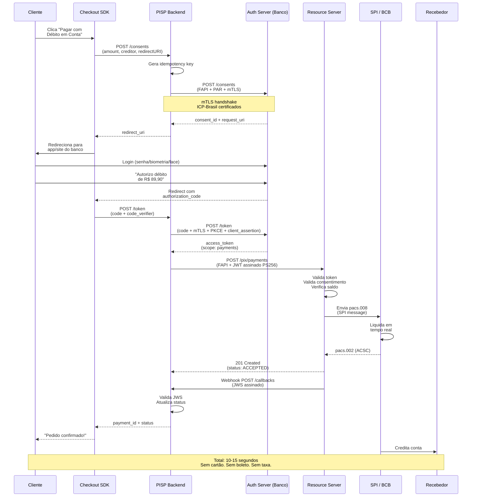
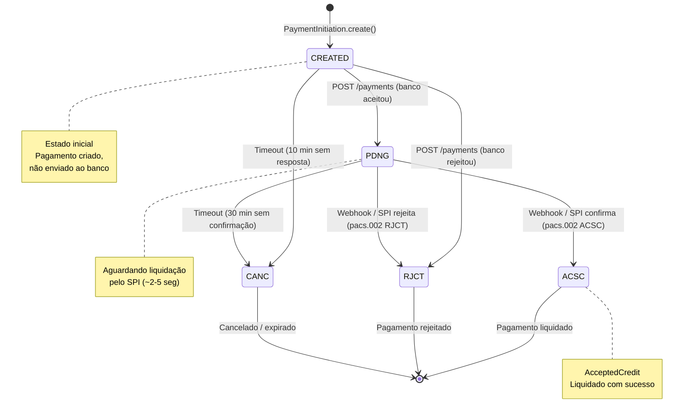

# Desafio 15: PISP — O Iniciador de Pagamentos no Open Finance Brasil

**🇧🇷** Iniciador de Transação de Pagamento (ITP) no Open Finance
**🇬🇧** Payment Initiation Service Provider (PISP)

---

## 🎯 Objetivos de Aprendizado

- Entender a regulamentação da Resolução Conjunta nº 1/2020 e o papel do iniciador de pagamento
- Implementar o fluxo completo PISP: consentimento → autorização → iniciação → liquidação via SPI
- Dominar o protocolo FAPI (Financial-grade API) com mTLS, JWT assinado (PS256) e PKCE
- Integrar com o ecossistema Open Finance: DICT, diretório de participantes, certificados ICP-Brasil
- Projetar webhooks de status com validação JWS para confirmação assíncrona de pagamentos
- Implementar idempotência fim-a-fim e reconciliação contábil com cada banco detentor
- Comparar PISP com outros meios de pagamento (cartão, boleto, PIX manual) em custo, latência e UX

---

## 📋 Pré-requisitos

### 🧠 Conceitos
- PISP (Payment Initiation Service Provider) e Resolução Conjunta BCB Nº 1/2020
- Fluxo de consentimento para pagamento no Open Finance
- Integração Open Finance ↔ SPI via pacs.008/pacs.002
- Pix Automático como evolução do PISP manual
- Checkout sem cartão e sem boleto como novo paradigma de pagamento

### 📚 Desafios Anteriores
- [Desafio 05: Open Finance](/challenges/05-open-finance) — consentimento, certificação FAPI, mTLS e DCR
- [Desafio 02: SPI](/challenges/02-spi) — iniciação de pagamento via pacs.008 e confirmação via pacs.002
- [Desafio 06: Open Finance & Pagamentos](/challenges/06-open-finance) — fluxo de consentimento para PISP e webhooks de confirmação

### 🛠️ Ferramentas
- OpenSSL (geração e gestão de certificados ICP-Brasil e cadeia de confiança)
- Docker (serviços locais para desenvolvimento)
- Redis (idempotência de requisições + cache de consentimento)
- PostgreSQL (persistência de consentimentos e transações)

### 💻 Técnico
- TypeScript e Node.js 20+ (backend das APIs)
- OAuth 2.0 + FAPI 1.0 (Authorization Code Flow com PKCE e PAR)
- mTLS (Mutual TLS com certificados cliente e servidor)
- JWT / JWS / JWE (assinatura e criptografia de tokens)
- Webhooks com validação de assinatura JWS (replay detection, timestamp validation)

---

## 📖 Abertura — O Que é um PISP?

"Deixa eu te falar: deixa eu te contar uma coisa que vai mudar como você pensa sobre pagamentos. Quando você abre o iFood, pede um hambúrguer e paga com dois cliques — sem digitar número de cartão, sem CVV, sem validade, sem abrir o app do banco pra fazer PIX — você tá usando um **iniciador de pagamento**. E por trás desses dois cliques existe um dos sistemas mais complexos do sistema financeiro brasileiro.

Mas deixa eu voltar no tempo — e quando eu digo tempo, é **1995**. O Brasil vivia o Plano Real, inflação controlada, e o sistema de pagamentos era... papel. Boleto, cheque, dinheiro vivo. Cartão de crédito era coisa de rico. Em 1995, só 15% dos brasileiros tinham conta bancária. Pagar uma pizza delivery significava ter troco em casa.

Avança pra 2002: o Banco Central cria o **STR** — Sistema de Transferência de Reservas. É a espinha dorsal do sistema financeiro brasileiro, onde bancos liquidam transferências entre si. Mas ele só serve pra banco. Você, pessoa física, continua dependendo de TED (que demorava horas e custava R$ 20) ou DOC (que liquidava no dia seguinte). Isso porque o STR opera em tempo real, mas os bancos empurravam as transferências de varejo pra processamento batch — o famoso 'vai cair amanhã'.

Aí veio **novembro de 2020**. O PIX foi lançado — e o Brasil virou de cabeça pra baixo. Transferência em 10 segundos, 24 horas por dia, 7 dias por semana, de graça. Em 18 meses, o PIX já tinha mais transações que cartão de crédito e débito **somados**. Hoje são mais de 250 milhões de transações por dia. O PIX resolveu a transferência entre pessoas. Mas não resolveu o **pagamento**.

Porque pagamento é diferente de transferência. Quando você paga uma conta, você não está só movendo dinheiro — você está vinculando esse movimento a uma obrigação. 'Eu paguei R$ 39,90 pra Netflix'. 'Eu paguei R$ 89,90 pro iFood'. O pagamento carrega contexto. E é aí que entra o conceito de **Payment Initiation**.

A Europa saiu na frente. Em 2018, a **PSD2** (Payment Services Directive 2) entrou em vigor na União Europeia. A PSD2 criou duas figuras novas: o **AISP** (Account Information Service Provider), que agrega dados de contas, e o **PISP** (Payment Initiation Service Provider), que inicia pagamentos. A ideia era quebrar o monopólio dos bancos sobre a experiência de pagamento. Se um terceiro — um iFood, um Mercado Livre, uma Netflix — pudesse iniciar um pagamento direto da conta do cliente, por que o cliente precisaria de cartão de crédito?

A PSD2 foi revolucionária porque atacou o modelo de negócios das adquirentes. Cielo, Rede, Stone — todas elas cobram uma taxa de **MDR** (Merchant Discount Rate) que vai de 1% a 5% sobre cada transação de cartão. Num PIX de R$ 100, o lojista recebe R$ 100. Num cartão de crédito de R$ 100, o lojista recebe entre R$ 95 e R$ 98. A diferença parece pequena, mas em escala: um marketplace que fatura R$ 1 bilhão por ano paga entre R$ 20 e R$ 50 milhões **só de taxa de cartão**. O PISP elimina essa intermediação.

O Banco Central viu isso. E em **4 de maio de 2020** — antes mesmo do PIX lançar — publicou a **Resolução Conjunta nº 1/2020**, criando o **Iniciador de Transação de Pagamento** (ITP) no Brasil. A resolução definiu que um terceiro poderia iniciar um PIX em nome do cliente, desde que autorizado por ele e integrado ao Open Finance. Mas a implementação dependia do ecossistema estar pronto — e foi na **Fase 3 do Open Finance Brasil**, em **2022**, que o PISP se tornou realidade regulatória.

Agora, por que isso é tão transformador? Por três razões:

**Primeira: elimina o cartão de crédito.** O lojista não precisa mais pagar MDR pra adquirente, não precisa de antifraude de cartão (que custa caro e ainda rejeita venda legítima), não precisa esperar 30 dias pra receber (no crédito parcelado). O dinheiro cai na conta em 10 segundos.

**Segunda: elimina o boleto.** Boleto demora de 1 a 3 dias úteis pra compensar. O cliente paga hoje, o lojista vê o dinheiro depois de amanhã. E tem o custo de emissão, de registro, de processamento. PISP é instantâneo.

**Terceira: elimina o PIX manual.** Fazer um PIX copiando e colando chave, abrindo app do banco, conferindo valor — isso é fricção. O PISP faz tudo automaticamente, com consentimento prévio. O cliente clica 'pagar' e pronto. Tudo resolvido em background.

Sabe o que mais? O **Pix Automático**, lançado em **junho de 2025**, é construído 100% sobre PISP. Débito automático sem convênio bilateral com cada banco. Qualquer fintech pode oferecer cobrança recorrente — assinatura, mensalidade, aluguel — iniciando o pagamento via PISP, sem precisar costurar 150 contratos com 150 bancos. É a democracia do débito automático.

E tem a cereja do bolo: o fluxo PISP opera inteiramente dentro da **infraestrutura do Open Finance**. Consentimento padronizado, autenticação forte (FAPI), certificados ICP-Brasil, trilha de auditoria regulatória. Não é um 'jeitinho' — é um ecossistema regulado, seguro, auditável.

Esse desafio é sobre **construir o iniciador de pagamento**. Não com planilha, não com contrato — mas com TypeScript, Go, FAPI, mTLS, JWT e webhooks. Porque o futuro dos pagamentos no Brasil não é o PIX — o PIX é a ferrovia. O futuro é o que roda sobre esses trilhos: o PISP, o Pix Automático, o Open Finance."

---

## 🔥 O Problema

Imagine que você está construindo o checkout de um e-commerce. O fluxo parece simples:

```
Cliente → escolhe produto → clica "Pagar" → pagamento aprovado → pedido confirmado
```

Mas o que acontece nos bastidores do pagamento determina a margem do negócio:

**Cartão de crédito:** você integra com uma adquirente (Stone, PagSeguro, Mercado Pago). Paga 2% a 5% de MDR. Espera 30 dias pra receber o valor parcelado. Se o cliente contestar a compra (chargeback), você perde o dinheiro e ainda paga multa. A cada 100 vendas, entre 0.5% e 2% viram chargeback. No fim do mês, sua margem de 20% virou 12%.

**Boleto bancário:** você emite um boleto. O cliente paga. O banco processa em D+1 ou D+2. Você espera até 3 dias úteis pra ver o dinheiro. E se o cliente não pagar? Boleto vencido = venda perdida. A taxa de conversão de boleto é de 50% a 70% — ou seja, você perde de 30% a 50% das vendas. Fora o custo de R$ 3 a R$ 5 por boleto emitido.

**PIX manual:** você gera um QR Code ou uma chave PIX. O cliente abre o app do banco, escaneia, confere o valor, digita a senha. Funciona — mas a fricção é alta. A cada passo do fluxo, você perde clientes. Estudos mostram que cada tela adicional no checkout reduz a conversão em 10% a 15%. Se o cliente precisa abrir o app do banco, a conversão cai entre 20% e 40%. Fora que PIX manual não tem recorrência: você não pode cobrar o cliente todo mês automaticamente.

Agora imagina o caso da **assinatura recorrente**. A Netflix tem 20 milhões de assinantes no Brasil. Cobrar cada um via cartão de crédito custa entre R$ 0,40 e R$ 2,00 por transação — mais R$ 2 milhões a R$ 10 milhões por mês só em taxa. Cobrar via boleto? Impossível. Cobrar via PIX manual? O usuário teria que abrir o app do banco todo mês e pagar. Em 3 meses, 60% dos assinantes teriam abandonado.

É aqui que entra o **PISP**. Um iniciador de pagamento resolve todos esses problemas de uma vez:

1. **Custo zero pro lojista** — O PISP usa a infraestrutura do PIX, que é gratuita. Zero MDR. Zero taxa de boleto. Zero chargeback de cartão (porque não tem cartão). O lojista recebe o valor integral, na hora.

2. **Conversão máxima** — O cliente clica "Pagar", é redirecionado pro app do banco (que ele já conhece e confia), autoriza com biometria, e volta pro checkout com o pagamento confirmado. Duas telas. Fricção mínima. Conversão acima de 90%.

3. **Recorrência nativa** — O Pix Automático (construído sobre PISP) permite que o lojista cobre o cliente todo mês, automaticamente, sem nova autorização. É o débito automático do Open Finance: uma vez autorizado, as cobranças subsequentes são automáticas.

4. **Segurança regulatória** — O fluxo inteiro roda sobre FAPI (Financial-grade API), com mTLS obrigatório, JWT assinado com PS256, certificados ICP-Brasil. Cada transação é rastreável, cada consentimento é revogável, cada participante é identificado.

5. **Sem chargeback** — Diferente do cartão de crédito, o PISP não tem mecanismo de chargeback. O cliente autorizou ativamente o débito na conta dele, autenticado pelo banco, com biometria. Se contestar depois, a responsabilidade é do banco, não do lojista.

Mas implementar um PISP não é trivial. Diferente de integrar uma API REST de pagamento, o PISP exige:

- **Certificados ICP-Brasil** — Você precisa de um certificado digital de pessoa jurídica emitido por autoridade certificadora credenciada. Não é SSL comum de LetsEncrypt — é certificado ICP, com cadeia de confiança até a raiz da ICP-Brasil.

- **mTLS (Mutual TLS)** — O servidor do banco exige que você apresente seu certificado. Não basta o banco ter HTTPS — você também precisa provar quem é.

- **FAPI Security Profile** — O protocolo FAPI define como o fluxo OAuth 2.0 deve operar em ambiente financeiro: PAR (Pushed Authorization Request), PKCE, JWT assinado com PS256, JWS nos webhooks.

- **DICT** — Você precisa consultar o Diretório de Identificadores de Contas Transacionais do Banco Central pra resolver chaves PIX e descobrir em qual banco o recebedor tem conta.

- **Consentimento** — Antes de iniciar um pagamento, você precisa de um consentimento ativo do cliente, registrado no banco dele. Cada consentimento tem escopo, valor, prazo de expiração e pode ser revogado a qualquer momento.

- **Reconciliação** — Você precisa bater os pagamentos iniciados com os pagamentos confirmados pelo SPI, em cada banco, a cada dia. Se um pagamento foi iniciado mas não confirmado, você precisa saber por quê.

Esse desafio é sobre implementar tudo isso. Da entidade de domínio até o webhook de confirmação, do consentimento até a reconciliação, do mTLS até o JWS. Vamos construir um iniciador de pagamento de verdade.

---

## 🏗️ Arquitetura Geral

<LanguageToggle />

<div class="Lang-content ts" style="Display:block;">

### Visão Macro

```mermaid
flowchart TB
    subgraph "Clientes"
        USER[Consumidor]
        MERCH[Merchant / Loja]
    end

    subgraph "PISP — Iniciador de Pagamento"
        CHECKOUT[Checkout SDK]
        INIT_SVC[Payment Initiator Service]
        CONSENT_SVC[Consent Service]
        FRAUD[Fraud Engine]
        RECON[Reconciliation Engine]
        WEBHOOK[Webhook Handler]
    end

    subgraph "Banco Detentor (ASPSP)"
        AUTH_SRV[Authorization Server<br/>FAPI + PAR]
        RES_SRV[Resource Server<br/>Payments API]
        SPI_CLI[SPI Client]
    end

    subgraph "Infraestrutura Financeira"
        SPI[SPI — Sistema de Pagamentos<br/>Instantâneos / BCB]
        DICT[DICT — Diretório de Identificadores<br/>de Contas Transacionais]
        DIR[Open Finance Directory<br/>Participantes + Endpoints]
    end

    subgraph "Armazenamento"
        PG[(PostgreSQL<br/>Payments + Consents)]
        REDIS[(Redis<br/>Idempotency + Cache)]
    end

    USER -->|1. Clica "Pagar"| CHECKOUT
    MERCH -->|Integração| CHECKOUT
    CHECKOUT -->|2. POST /consents| AUTH_SRV
    USER -->|3. Autentica + Aprova| AUTH_SRV
    AUTH_SRV -->|4. access_token| INIT_SVC
    INIT_SVC -->|5. POST /payments| RES_SRV
    INIT_SVC -->|Consulta| DIR
    INIT_SVC -->|Resolve chave| DICT
    RES_SRV -->|6. pacs.008| SPI
    SPI -->|7. Liquida + pacs.002| SPI_CLI
    RES_SRV -->|8. Webhook| WEBHOOK
    WEBHOOK -->|Atualiza status| INIT_SVC
    INIT_SVC -->|Persiste| PG
    INIT_SVC -->|Cache| REDIS
    CONSENT_SVC -->|Gerencia| PG
    FRAUD -->|Score + Bloqueio| INIT_SVC
    RECON -->|Conciliação| PG
    RECON -->|Arquivos CNAB| SPI

    classDef client fill:#4f46e5,color:#fff
    classDef pisp fill:#f59e0b,color:#000
    classDef bank fill:#10b981,color:#fff
    classDef infra fill:#8b5cf6,color:#fff
    classDef storage fill:#64748b,color:#fff

    class USER,MERCH client
    class CHECKOUT,INIT_SVC,CONSENT_SVC,FRAUD,RECON,WEBHOOK pisp
    class AUTH_SRV,RES_SRV,SPI_CLI bank
    class SPI,DICT,DIR infra
    class PG,REDIS storage
```

Antes de mergulharmos no código, quero que você entenda três decisões arquiteturais críticas nesse diagrama.

**Primeira: o Checkout SDK é separado do Payment Initiator Service.** O SDK roda no frontend (browser ou app mobile) e é responsável por orquestrar o redirect do usuário pro banco. O Initiator Service roda no backend e nunca vê a senha do usuário. Essa separação é de segurança: o PISP não pode ter acesso às credenciais bancárias do cliente. É o banco que autentica, é o banco que autoriza. O PISP só recebe um token de acesso com escopo limitado (`payments`).

**Segunda: o Redis não armazena dados de pagamento — só idempotência e cache de consultas do DICT.** Pagamentos e consentimentos vivem no PostgreSQL com transações ACID. O Redis é a camada de defesa: evita duplicatas causadas por retry do cliente e acelera a resolução de chaves PIX (que não muda com frequência).

**Terceira: a reconciliação é um processo separado, assíncrono, que roda em background.** Não é parte do fluxo de iniciação. A iniciação é síncrona e rápida (<500ms). A reconciliação é batch (diária) e lenta (minutos a horas). Separar os dois fluxos evita que a lentidão da reconciliação impacte a experiência do usuário. A reconciliação consulta o SPI, baixa arquivos, bate com o banco de dados local, e gera relatórios de divergência.

### A Stack

**TypeScript** (Edge): Checkout SDK, Dashboard do merchant, integração com frontend. Koa + `graphql-relay` + `dataloader` pra API pública. `jose` pra JWT/JWS. `open` pra criptografia e certificados.

**Go** (Core): Payment Initiator Service, Consent Service, Fraud Engine, Reconciliation Engine. `golang-jwt/jwt/v5` pra FAPI. `crypto/tls` pra mTLS nativo. `go-chi/chi/v5` pra HTTP routing. `pgx` pra PostgreSQL. `go-redis` pra Redis.

> **Por que Go no core e TypeScript no edge?** — O core PISP lida com milhares de iniciações por segundo. Cada uma envolve criptografia assimétrica (PS256), mTLS handshake, chamada HTTP ao banco, e atualização de banco de dados. Go gerencia isso com goroutines leves (2KB de stack cada), latência de garbage collector sub-milissegundo, e throughput 10x maior que Node.js pra esse workload específico. O TypeScript no edge brilha pela velocidade de desenvolvimento, ecossistema de componentes React, e integração com o frontend. É o padrão que empresas como Mercado Pago, PicPay e iFood adotaram: Go no core de pagamentos, TypeScript/React no checkout.

### Fluxo Completo de um Pagamento PISP



Repare em cinco detalhes sutis desse diagrama de sequência:

**1. PAR (Pushed Authorization Request).** O consentimento não é enviado como query parameter na URL de redirect — isso seria inseguro. Em vez disso, o PISP faz um POST com o payload do consentimento e recebe um `request_uri` opaco. O usuário é redirecionado com esse URI, não com os dados. Isso evita vazamento de informações do pagamento via URL e protege contra ataques de modificação de parâmetros.

**2. PKCE (Proof Key for Code Exchange).** O PISP gera um `code_verifier` aleatório e envia o `code_challenge` (SHA-256 do verifier) junto com a requisição de consentimento. Na hora de trocar o `authorization_code` pelo `access_token`, o PISP envia o `code_verifier` original. O banco valida que o `code_challenge` bate. Isso impede que um atacante que interceptou o `authorization_code` consiga trocá-lo por um token — porque ele não tem o `code_verifier`.

**3. Client Assertion (JWT).** Na troca do token, o PISP não manda `client_id + client_secret` como faria um OAuth2 comum. Em vez disso, ele assina um JWT com sua chave privada (PS256) contendo `iss`, `sub`, `aud`, `jti`, `exp`. O banco valida a assinatura usando a chave pública do PISP (obtida no Open Finance Directory). Isso vincula a autenticação do cliente ao certificado ICP-Brasil.

**4. JWS no webhook.** Quando o banco notifica o PISP sobre a confirmação do pagamento, a notificação não é um POST simples — é um payload assinado com JWS (JSON Web Signature) usando a chave privada do banco. O PISP valida a assinatura usando a chave pública do banco (obtida no diretório). Isso garante que a notificação realmente veio do banco e não foi forjada.

**5. Dois canais de confirmação.** O pagamento pode ser confirmado de duas formas: síncrona (a resposta do `POST /payments` já vem com `ACSC`) ou assíncrona (webhook). O PISP precisa lidar com ambas. Se a resposta síncrona já confirma, o webhook é redundante (mas ainda chega). Se a resposta é `PDNG` (pending), o PISP espera o webhook pra atualizar o status pra `ACSC` ou `RJCT`. O importante é que o estado final seja sempre consistente, independente do canal.

### Schema do Banco de Dados

O modelo de dados de um PISP gira em torno de três entidades principais:

```
PaymentConsent:
  id (UUID)
  client_id (do merchant/pisp)
  user_id (do consumidor)
  bank_id (ISPB do banco detentor)
  type: SINGLE | RECURRING
  status: AWAITING_AUTHORISATION | AUTHORISED | CONSUMED | REJECTED | REVOKED
  amount (valor autorizado, em centavos)
  currency (BRL)
  creditor_account (ISPB + agência + conta + tipo)
  creditor_name
  creditor_document (CPF/CNPJ)
  expiration_datetime
  authorization_code
  created_at, updated_at

PaymentInitiation:
  id (UUID)
  consent_id (FK → PaymentConsent)
  idempotency_key (UNIQUE)
  amount (centavos)
  status: CREATED | PDNG | ACSC | RJCT | CANC
  end_to_end_id (identificador único do PIX no SPI)
  bank_transaction_id
  rejection_reason
  created_at, confirmed_at

PaymentWebhook:
  id (UUID)
  payment_id (FK → PaymentInitiation)
  bank_id
  status: PDNG | ACSC | RJCT
  jws_signature (assinatura validada)
  raw_payload
  received_at, processed_at
```

Por que `amount` em centavos? Porque dinheiro nunca deve ser representado como float. `R$ 89,90` = `8990` centavos. Isso elimina erros de arredondamento de ponto flutuante. Em Go, usa `int64`. Em TypeScript, `number` (que é seguro até 2^53, muito além dos centavos que você vai processar). Essa é uma daquelas decisões que parecem detalhe mas custam milhões se feitas errado — já aconteceu com banco, já aconteceu com fintech, já aconteceu com crypto exchange.

O campo `end_to_end_id` merece uma explicação: é o identificador universal da transação no ecossistema PIX. Ele é gerado pelo participante que envia o pacs.008 (a mensagem SPI) e tem um formato específico definido pelo Banco Central: `E` + ISPB do participante + timestamp + sequencial. O `end_to_end_id` é o que permite rastrear uma transação de ponta a ponta — você pode consultar o SPI com esse ID e descobrir exatamente onde a transação está, em qual banco, em qual status.

### State Machine do Pagamento



A state machine do pagamento PISP é mais complexa que a de uma transação de ledger comum. No ledger, a transação ou é `COMPLETED` ou é `REVERTED`. No PISP, existe o estado intermediário `PDNG` (pending) porque entre o banco aceitar o comando de pagamento e o SPI liquidar a transação, existe uma janela assíncrona de 2 a 5 segundos. O PISP precisa estar preparado pra receber o status final via webhook dentro dessa janela.

O timeout do `CREATED → CANC` (10 minutos) reflete o `expiresAt` do consentimento: se o cliente autorizou mas o PISP demorou mais de 10 minutos pra iniciar o pagamento, o consentimento expirou e a iniciação precisa ser cancelada.

O timeout do `PDNG → CANC` (30 minutos) é um mecanismo de defesa: se o banco aceitou a iniciação mas o SPI nunca confirmou (seja por falha técnica, seja por rejeição silenciosa), o PISP assume que a transação falhou. Em produção, esse timeout é configurado de acordo com o SLA do SPI (que é de 99.9% de liquidação em menos de 5 segundos).

---

## 👨‍💻 Mão na Massa

"Bora codar. O bagulho é o seguinte: você precisa construir um iniciador de pagamento que fale com qualquer banco do Open Finance via FAPI, com mTLS, JWT assinado, PKCE, webhooks com JWS — o pacote completo. E o mais importante: **pagamento duplicado não pode existir**. Se o cliente clicou duas vezes, se o retry do SDK disparou, se o webhook chegou atrasado — o sistema precisa garantir que cada pagamento é único.

Antes do código, quero cravar três conceitos que vão aparecer em cada linha: o **modelo de domínio com state machine**, o **FAPI client com toda sua complexidade criptográfica**, e o **padrão de idempotência com Redis como barreira atômica**.

### Domain Entity — PaymentInitiation

A entidade de pagamento encapsula toda a lógica de transição de estados. Nada fora dela mexe no `status` diretamente — isso evita que um bug no service coloque um pagamento em estado inválido.

```typescript
export enum PaymentStatus {
  CREATED = 'CREATED',
  PENDING = 'PDNG',
  ACCEPTED_CREDIT = 'ACSC',
  REJECTED = 'RJCT',
  CANCELLED = 'CANC',
}

export enum PaymentConsentType {
  SINGLE = 'SINGLE',
  RECURRING = 'RECURRING',
}

export enum PaymentConsentStatus {
  AWAITING_AUTHORISATION = 'AWAITING_AUTHORISATION',
  AUTHORISED = 'AUTHORISED',
  CONSUMED = 'CONSUMED',
  REJECTED = 'REJECTED',
  REVOKED = 'REVOKED',
}

interface PaymentProps {
  id: string;
  consentId: string;
  idempotencyKey: string;
  amount: number;
  currency: string;
  creditorAccount: CreditorAccount;
  creditorName: string;
  creditorDocument: string;
  status: PaymentStatus;
  endToEndId?: string;
  bankTransactionId?: string;
  rejectionReason?: string;
  createdAt: Date;
  confirmedAt?: Date;
  expiresAt: Date;
}

export class PaymentInitiation extends Entity<PaymentProps> {
  private constructor(props: PaymentProps, id: string) {
    super(props, id);
  }

  public static create(input: {
    consentId: string;
    idempotencyKey: string;
    amount: number;
    creditorAccount: CreditorAccount;
    creditorName: string;
    creditorDocument: string;
  }): PaymentInitiation {
    if (input.amount <= 0) {
      throw new DomainError('Amount must be positive');
    }

    return new PaymentInitiation(
      {
        id: uuidv4(),
        consentId: input.consentId,
        idempotencyKey: input.idempotencyKey,
        amount: input.amount,
        currency: 'BRL',
        creditorAccount: input.creditorAccount,
        creditorName: input.creditorName,
        creditorDocument: input.creditorDocument,
        status: PaymentStatus.CREATED,
        createdAt: new Date(),
        expiresAt: new Date(Date.now() + 10 * 60 * 1000), // 10 minutes
      },
      uuidv4(),
    );
  }

  public markAsSent(bankTransactionId: string): void {
    if (this.props.status !== PaymentStatus.CREATED) {
      throw new DomainError(
        `Cannot send payment in status ${this.props.status}. Expected CREATED.`,
      );
    }
    if (new Date() > this.props.expiresAt) {
      this.props.status = PaymentStatus.CANCELLED;
      throw new DomainError('Payment has expired');
    }
    this.props.status = PaymentStatus.PENDING;
    this.props.bankTransactionId = bankTransactionId;
  }

  public confirm(endToEndId: string): void {
    if (
      this.props.status !== PaymentStatus.PENDING &&
      this.props.status !== PaymentStatus.CREATED
    ) {
      throw new DomainError(
        `Cannot confirm payment in status ${this.props.status}. Expected PENDING or CREATED.`,
      );
    }
    this.props.status = PaymentStatus.ACCEPTED_CREDIT;
    this.props.endToEndId = endToEndId;
    this.props.confirmedAt = new Date();
  }

  public reject(reason: string): void {
    if (
      this.props.status !== PaymentStatus.PENDING &&
      this.props.status !== PaymentStatus.CREATED
    ) {
      throw new DomainError(
        `Cannot reject payment in status ${this.props.status}.`,
      );
    }
    this.props.status = PaymentStatus.REJECTED;
    this.props.rejectionReason = reason;
  }

  public cancel(): void {
    if (this.props.status === PaymentStatus.ACCEPTED_CREDIT) {
      throw new DomainError('Cannot cancel a confirmed payment');
    }
    this.props.status = PaymentStatus.CANCELLED;
  }

  public canBeProcessed(): boolean {
    return (
      this.props.status !== PaymentStatus.ACCEPTED_CREDIT &&
      this.props.status !== PaymentStatus.REJECTED &&
      this.props.status !== PaymentStatus.CANCELLED &&
      new Date() <= this.props.expiresAt
    );
  }

  public isConfirmed(): boolean {
    return this.props.status === PaymentStatus.ACCEPTED_CREDIT;
  }

  public isRejected(): boolean {
    return this.props.status === PaymentStatus.REJECTED;
  }
}
```

**Quatro decisões de design importantes:**

1. **`cancel()` não reverte pagamento confirmado.** Depois que o SPI liquidou (`ACSC`), o dinheiro já foi transferido. Não dá pra cancelar. Se o merchant quiser devolver, vai ter que iniciar um PIX de volta. Isso é diferente de cartão de crédito, onde existe o mecanismo de estorno/chargeback — no PISP, a transação é final.

2. **`markAsSent()` verifica expiração.** Se o pagamento expirou (10 minutos desde a criação), ele é automaticamente cancelado e a operação falha. Isso é uma proteção contra pagamentos "Zumbis" que ficam pendentes pra sempre.

3. **`confirm()` aceita `CREATED` como estado válido.** Isso porque o banco pode retornar confirmação síncrona (na resposta do POST) sem nunca passar por `PDNG`. O estado `PDNG` existe para o caso assíncrono, quando o banco aceita mas o SPI ainda não liquidou.

4. **Uso de `DomainError` em vez de exceptions genéricas.** Cada erro de domínio carrega contexto: qual estado atual, qual transição foi tentada, qual regra foi violada. Isso alimenta logs, monitoramento, e dashboards de erro do PISP.

### PaymentConsent — A Chave do Fluxo

O consentimento de pagamento é diferente do consentimento de dados (AISP). Enquanto o consentimento de dados autoriza acesso a extratos e saldos por meses, o consentimento de pagamento é **transacional**:

```typescript
export class PaymentConsent extends AggregateRoot<PaymentConsentProps> {
  public static create(input: {
    userId: string;
    bankId: string;
    type: PaymentConsentType;
    amount: number;
    creditorAccount: CreditorAccount;
    creditorName: string;
    creditorDocument: string;
    expirationDateTime: Date;
    recurringPolicy?: RecurringPolicy;
  }): PaymentConsent {
    if (input.type === PaymentConsentType.SINGLE && input.amount <= 0) {
      throw new DomainError('Single consent requires positive amount');
    }

    return new PaymentConsent(
      {
        id: uuidv4(),
        userId: input.userId,
        bankId: input.bankId,
        type: input.type,
        status: PaymentConsentStatus.AWAITING_AUTHORISATION,
        amount: input.amount,
        currency: 'BRL',
        creditorAccount: input.creditorAccount,
        creditorName: input.creditorName,
        creditorDocument: input.creditorDocument,
        expirationDateTime: input.expirationDateTime,
        recurringPolicy: input.recurringPolicy ?? null,
        authorizationCode: null,
        createdAt: new Date(),
        updatedAt: new Date(),
      },
      uuidv4(),
    );
  }

  public authorise(authorizationCode: string): void {
    if (this.props.status !== PaymentConsentStatus.AWAITING_AUTHORISATION) {
      throw new DomainError('Consent not awaiting authorisation');
    }
    this.props.status = PaymentConsentStatus.AUTHORISED;
    this.props.authorizationCode = authorizationCode;
  }

  public canBeUsed(): boolean {
    return (
      this.props.status === PaymentConsentStatus.AUTHORISED &&
      new Date() <= this.props.expirationDateTime
    );
  }

  public validatePayment(amount: number): boolean {
    if (!this.canBeUsed()) return false;

    if (this.props.type === PaymentConsentType.SINGLE) {
      return this.props.amount === amount;
    }

    if (this.props.recurringPolicy) {
      if (this.props.recurringPolicy.maxAmountPerTransaction) {
        return amount <= this.props.recurringPolicy.maxAmountPerTransaction;
      }
      if (this.props.recurringPolicy.maxCumulativeAmount) {
        // Verifica total acumulado no período
        return true; // simplificado — em produção, soma as cobranças do período
      }
    }

    return true;
  }

  public consume(): void {
    if (this.props.type === PaymentConsentType.SINGLE) {
      if (this.props.status !== PaymentConsentStatus.AUTHORISED) {
        throw new DomainError('Only authorised consents can be consumed');
      }
      this.props.status = PaymentConsentStatus.CONSUMED;
    }
    // Consents recorrentes não são consumidos — permanecem AUTHORISED
  }

  public revoke(): void {
    if (this.props.status === PaymentConsentStatus.CONSUMED) {
      throw new DomainError('Cannot revoke a consumed consent');
    }
    this.props.status = PaymentConsentStatus.REVOKED;
  }
}
```

A diferença fundamental entre SINGLE e RECURRING: um consentimento `SINGLE` é consumido após o primeiro pagamento bem-sucedido — ele morre. Um consentimento `RECURRING` permanece `AUTHORISED` e pode ser usado múltiplas vezes, dentro dos limites definidos em `recurringPolicy` (valor máximo por transação, valor máximo acumulado no mês, quantidade máxima de transações).

Em produção, o `validatePayment` de consentimento recorrente consulta um contador de transações do período corrente pra verificar se o limite acumulativo não foi excedido. Esse contador vive no banco de dados e é atualizado atomicamente a cada pagamento — mesma lógica do ledger, mesma preocupação com concorrência.

### FAPI Client — A Integração com Bancos

"Essa é a parte mais cabeluda do sistema. FAPI não é OAuth2 comum — é OAuth2 com esteroides. Você precisa de mTLS, JWT assinado com PS256, PKCE, e PAR. Vamos por partes."

```typescript
import * as jose from 'jose';
import { readFileSync } from 'fs';
import { createHash, randomBytes } from 'crypto';

interface FAPIClientConfig {
  clientId: string;
  privateKeyPem: string;
  certificatePem: string;
  caPem: string;
  keyId: string;
  directoryBaseUrl: string;
}

export class FAPIClient {
  private privateKey: jose.KeyLike;
  private httpsAgent: https.Agent;
  private directory: OpenFinanceDirectory;

  constructor(private config: FAPIClientConfig) {
    this.privateKey = await jose.importPKCS8(config.privateKeyPem, 'PS256');
    this.httpsAgent = new https.Agent({
      cert: config.certificatePem,
      key: config.privateKeyPem,
      ca: config.caPem,
      rejectUnauthorized: true,
    });
    this.directory = new OpenFinanceDirectory(config.directoryBaseUrl);
  }

  async createPaymentConsent(params: {
    bankId: string;
    amount: number;
    creditorAccount: CreditorAccount;
    creditorName: string;
    creditorDocument: string;
    redirectUri: string;
    type: 'SINGLE' | 'RECURRING';
  }): Promise<PaymentConsentResponse> {
    const bankEndpoints = await this.directory.getBankEndpoints(params.bankId);
    const consentEndpoint = bankEndpoints.consentEndpoint;

    // Gera PKCE
    const codeVerifier = base64URLEncode(randomBytes(32));
    const codeChallenge = base64URLEncode(
      createHash('sha256').update(codeVerifier).digest(),
    );

    // Monta payload do consentimento
    const consentPayload = {
      data: {
        loggedUser: {
          document: { identification: params.creditorDocument, rel: 'CPF' },
        },
        businessEntity: {
          document: { identification: params.creditorDocument, rel: 'CPF' },
        },
        creditor: {
          personType: 'PESSOA_NATURAL',
          cpfCnpj: params.creditorDocument,
          name: params.creditorName,
        },
        payment: {
          type: 'PIX',
          date: new Date().toISOString().split('T')[0],
          currency: 'BRL',
          amount: (params.amount / 100).toFixed(2),
          ibgeTownCode: '3550308', // SP
        },
      },
    };

    // PAR — Pushed Authorization Request
    const parResponse = await this.authenticatedRequest(
      'POST',
      `${bankEndpoints.authServer}/par`,
      {
        client_id: this.config.clientId,
        code_challenge: codeChallenge,
        code_challenge_method: 'S256',
        redirect_uri: params.redirectUri,
        response_type: 'code',
        scope: 'payments',
        request: await this.signRequest(consentPayload, params.bankId),
      },
    );

    return {
      consentId: parResponse.consent_id,
      requestUri: parResponse.request_uri,
      codeVerifier,
    };
  }

  async getAccessToken(params: {
    bankId: string;
    authorizationCode: string;
    codeVerifier: string;
  }): Promise<string> {
    const bankEndpoints = await this.directory.getBankEndpoints(params.bankId);

    const clientAssertion = await this.generateClientAssertion(
      bankEndpoints.authServer,
    );

    const response = await this.authenticatedRequest(
      'POST',
      `${bankEndpoints.authServer}/token`,
      {
        grant_type: 'authorization_code',
        code: params.authorizationCode,
        code_verifier: params.codeVerifier,
        client_id: this.config.clientId,
        client_assertion: clientAssertion,
        client_assertion_type: 'urn:ietf:params:oauth:client-assertion-type:jwt-bearer',
      },
    );

    return response.access_token;
  }

  async initiatePayment(
    bankId: string,
    accessToken: string,
    payment: {
      consentId: string;
      paymentId: string;
      amount: number;
      creditor: { name: string; document: string; account: CreditorAccount };
    },
  ): Promise<PaymentResponse> {
    const bankEndpoints = await this.directory.getBankEndpoints(bankId);

    const signedPayment = await this.signRequest(
      {
        data: {
          consentId: payment.consentId,
          paymentId: payment.paymentId,
          creditor: {
            personType: 'PESSOA_NATURAL',
            cpfCnpj: payment.creditor.document,
            name: payment.creditor.name,
          },
          payment: {
            type: 'PIX',
            amount: (payment.amount / 100).toFixed(2),
            currency: 'BRL',
            ibgeTownCode: '3550308',
          },
        },
      },
      bankId,
    );

    const response = await this.authenticatedRequest(
      'POST',
      `${bankEndpoints.resourceServer}/open-banking/payments/v1/pix/payments`,
      {
        headers: {
          Authorization: `Bearer ${accessToken}`,
          'Content-Type': 'application/jwt',
          'x-fapi-interaction-id': uuidv4(),
          'x-idempotency-key': payment.paymentId,
        },
        body: signedPayment,
      },
    );

    return this.mapPaymentResponse(response);
  }

  private async generateClientAssertion(audience: string): Promise<string> {
    return new jose.SignJWT({
      iss: this.config.clientId,
      sub: this.config.clientId,
    })
      .setProtectedHeader({
        alg: 'PS256',
        kid: this.config.keyId,
        typ: 'JWT',
      })
      .setIssuedAt()
      .setExpirationTime('60s')
      .setJti(uuidv4())
      .setAudience(audience)
      .sign(this.privateKey);
  }

  private async signRequest(
    payload: unknown,
    bankId: string,
  ): Promise<string> {
    const bankPublicKey = await this.directory.getBankPublicKey(bankId);

    // Assina o payload como JWS (detached signature)
    return new jose.CompactSign(
      new TextEncoder().encode(JSON.stringify(payload)),
    )
      .setProtectedHeader({
        alg: 'PS256',
        kid: this.config.keyId,
        typ: 'JWT',
        b64: false,
        'http://openbanking.org.br/claim': 'payload',
      })
      .sign(this.privateKey);
  }
}
```

**Seis detalhes cruciais do FAPI Client:**

1. **mTLS via https.Agent.** O `https.Agent` é configurado com o certificado ICP-Brasil do PISP (`cert`) e a chave privada correspondente (`key`). `rejectUnauthorized: true` garante que o certificado do banco também é validado contra a cadeia ICP. Conexão segura nos dois sentidos.

2. **PKCE com S256.** O `code_verifier` é 32 bytes aleatórios (256 bits de entropia). O `code_challenge` é o SHA-256 do verifier, codificado em base64url. O banco armazena o challenge e só libera o token se o verifier bater.

3. **PAR (Pushed Authorization Request).** Em vez de passar o payload no redirect (o que exporia dados na URL e limitaria o tamanho a ~2000 caracteres), o PISP faz um POST com o consentimento e recebe um `request_uri`. Só o URI vai na URL de redirect — o payload fica armazenado no banco.

4. **Client Assertion como JWT.** O campo `client_assertion` é um JWT assinado com a chave privada do PISP. O banco valida a assinatura com a chave pública registrada no diretório Open Finance. Isso elimina a necessidade de `client_secret` compartilhado — um atacante não consegue forjar um client assertion sem a chave privada.

5. **Content-Type: application/jwt.** O payload do pagamento é enviado como um JWT assinado, não como JSON. O banco extrai os dados do JWT após validar a assinatura. Isso garante integridade e não-repúdio: o PISP não pode alegar que não enviou o pagamento, porque a assinatura prova que foi ele.

6. **x-fapi-interaction-id.** Identificador único por interação, exigido pela especificação FAPI. Permite rastrear cada chamada no log do banco e correlacionar com o log do PISP em caso de investigação.

### Payment Initiator Service — Orquestrando o Fluxo

```typescript
export class PaymentInitiatorService {
  constructor(
    private paymentRepo: PaymentInitiationRepository,
    private consentRepo: PaymentConsentRepository,
    private fapiClient: FAPIClient,
    private idempotencyService: IdempotencyService,
    private fraudService: FraudDetectionService,
    private eventPublisher: EventPublisher,
    private logger: Logger,
  ) {}

  async initiate(
    input: InitiatePaymentInput,
    pispClientId: string,
  ): Promise<Result<PaymentInitiation, PaymentError>> {
    const startTime = Date.now();

    // 1. Idempotência — barreira atômica contra duplicatas
    const existing = await this.idempotencyService.check(
      input.idempotencyKey,
    );
    if (existing) {
      this.logger.info('Idempotency cache hit', {
        idempotencyKey: input.idempotencyKey,
        existingPaymentId: existing.id,
      });
      return Result.ok(existing as PaymentInitiation);
    }

    // 2. Valida consentimento
    const consent = await this.consentRepo.findById(input.consentId);
    if (!consent) {
      return Result.fail(new ConsentNotFoundError(input.consentId));
    }
    if (!consent.canBeUsed()) {
      return Result.fail(
        new ConsentNotActiveError(
          input.consentId,
          consent.status,
        ),
      );
    }
    if (!consent.validatePayment(input.amount)) {
      return Result.fail(
        new ExceedsLimitError(
          input.amount,
          consent.type === PaymentConsentType.SINGLE
            ? consent.amount
            : consent.recurringPolicy?.maxAmountPerTransaction ?? 0,
        ),
      );
    }

    // 3. Fraud check — timeout curto pra não impactar latência
    const fraudResult = await this.fraudService.preInitiationCheck({
      userId: consent.userId,
      amount: input.amount,
      creditorDocument: consent.creditorDocument,
      deviceFingerprint: input.deviceFingerprint,
      ipAddress: input.ipAddress,
    });
    if (fraudResult.isHighRisk) {
      this.logger.warn('Fraud detected', {
        userId: consent.userId,
        amount: input.amount,
        riskScore: fraudResult.riskScore,
        reasons: fraudResult.reasons,
      });
      return Result.fail(new FraudDetectedError(fraudResult.riskScore));
    }

    // 4. Cria payment entity
    const payment = PaymentInitiation.create({
      consentId: input.consentId,
      idempotencyKey: input.idempotencyKey,
      amount: input.amount,
      creditorAccount: consent.creditorAccount,
      creditorName: consent.creditorName,
      creditorDocument: consent.creditorDocument,
    });

    // 5. Obtém access_token do banco
    const accessToken = await this.fapiClient.getAccessToken({
      bankId: consent.bankId,
      authorizationCode: consent.authorizationCode!,
      codeVerifier: consent.codeVerifier!,
    });

    // 6. Envia pagamento ao banco via FAPI
    const bankResponse = await this.fapiClient.initiatePayment(
      consent.bankId,
      accessToken,
      {
        consentId: consent.id,
        paymentId: payment.id,
        amount: input.amount,
        creditor: {
          name: consent.creditorName,
          document: consent.creditorDocument,
          account: consent.creditorAccount,
        },
      },
    );

    // 7. Atualiza estado do pagamento com resposta do banco
    switch (bankResponse.status) {
      case 'ACSC':
        payment.markAsSent(bankResponse.bankTransactionId!);
        payment.confirm(bankResponse.endToEndId!);
        break;
      case 'PDNG':
      case 'ACSP':
        payment.markAsSent(bankResponse.bankTransactionId!);
        break;
      case 'RJCT':
        payment.reject(bankResponse.rejectionReason ?? 'Rejected by bank');
        break;
      default:
        payment.reject(`Unknown status: ${bankResponse.status}`);
    }

    // 8. Persiste pagamento
    await this.paymentRepo.save(payment);

    // 9. Consome consentimento (se SINGLE)
    if (consent.type === PaymentConsentType.SINGLE && payment.isConfirmed()) {
      consent.consume();
      await this.consentRepo.save(consent);
    }

    // 10. Armazena idempotency key com resultado
    await this.idempotencyService.store(input.idempotencyKey, payment);

    // 11. Publica evento de domínio
    await this.eventPublisher.publish('payment.initiated', {
      paymentId: payment.id,
      consentId: consent.id,
      amount: payment.amount,
      status: payment.status,
      bankId: consent.bankId,
      userId: consent.userId,
      durationMs: Date.now() - startTime,
    });

    this.logger.info('Payment initiation completed', {
      paymentId: payment.id,
      status: payment.status,
      durationMs: Date.now() - startTime,
    });

    return Result.ok(payment);
  }
}
```

O fluxo do `initiate` tem 11 passos e cada um deles pode falhar. O tratamento de erro não está no código acima por brevidade, mas em produção cada passo tem seu próprio catch com rollback apropriado. Por exemplo: se o passo 6 (envio ao banco) falhar, o pagamento fica com status `CREATED` e pode ser retentado. Se o passo 8 (persistência) falhar, você tem um problema sério — o banco já processou o pagamento mas você não registrou. É por isso que existe reconciliação.

### Webhook Handler — Confirmando Pagamentos

```typescript
export class WebhookHandler {
  constructor(
    private paymentRepo: PaymentInitiationRepository,
    private directory: OpenFinanceDirectory,
    private eventPublisher: EventPublisher,
    private logger: Logger,
  ) {}

  async handleBankWebhook(
    payload: WebhookPayload,
    jwsSignature: string,
    bankId: string,
  ): Promise<void> {
    // 1. Valida assinatura JWS
    const bankPublicKey = await this.directory.getBankPublicKey(bankId);
    const isValid = await this.validateJWS(
      payload,
      jwsSignature,
      bankPublicKey,
    );
    if (!isValid) {
      this.logger.error('Invalid JWS signature on webhook', {
        bankId,
        paymentId: payload.paymentId,
      });
      throw new WebhookError('Invalid JWS signature');
    }

    // 2. Busca pagamento
    const payment = await this.paymentRepo.findById(payload.paymentId);
    if (!payment) {
      this.logger.error('Webhook received for unknown payment', {
        paymentId: payload.paymentId,
        bankId,
      });
      throw new WebhookError('Payment not found');
    }

    // 3. Idempotência de webhook — não processa duas vezes
    if (payment.isConfirmed()) {
      this.logger.info('Webhook for already confirmed payment — ignoring', {
        paymentId: payment.id,
      });
      return;
    }

    // 4. Atualiza status baseado no payload
    switch (payload.status) {
      case 'ACSC':
        payment.confirm(payload.endToEndId);
        break;
      case 'RJCT':
        payment.reject(payload.rejectionReason ?? 'Rejected via webhook');
        break;
      case 'PDNG':
        // Status intermediário — não altera
        break;
      default:
        this.logger.warn('Unknown webhook status', {
          paymentId: payment.id,
          status: payload.status,
        });
        return;
    }

    // 5. Persiste
    await this.paymentRepo.save(payment);

    // 6. Publica evento
    await this.eventPublisher.publish('payment.status_changed', {
      paymentId: payment.id,
      newStatus: payment.status,
      endToEndId: payment.endToEndId,
      source: 'webhook',
    });

    this.logger.info('Webhook processed successfully', {
      paymentId: payment.id,
      status: payment.status,
    });
  }

  private async validateJWS(
    payload: WebhookPayload,
    signature: string,
    publicKey: jose.KeyLike,
  ): Promise<boolean> {
    try {
      const parts = signature.split('.');
      if (parts.length !== 3) return false;

      const header = JSON.parse(
        new TextDecoder().decode(base64URLDecode(parts[0])),
      );
      if (header.alg !== 'PS256') return false;

      const signingInput = `${parts[0]}.${parts[1]}`;
      const signatureBytes = base64URLDecode(parts[2]);

      const { verify } = await import('crypto');
      const verifier = verify.createVerify('RSA-SHA256');
      verifier.update(signingInput);
      return verifier.verify(
        { key: publicKey, padding: verify.constants.RSA_PKCS1_PSS_PADDING },
        signatureBytes,
      );
    } catch (err) {
      this.logger.error('JWS validation failed', { error: err });
      return false;
    }
  }
}
```

O webhook handler pode ser chamado múltiplas vezes pro mesmo pagamento (retry do banco, rede duplicada, etc.). O passo 3 garante idempotência: se o pagamento já está confirmado, ignora. Se o webhook chega antes da resposta síncrona do `POST /payments`, o status é atualizado pra `ACSC` ou `RJCT`, e quando a resposta síncrona chegar, o `PaymentInitiation.confirm()` vai falhar com `DomainError` — mas o service captura e trata como sucesso (porque o resultado final é o mesmo).

### Idempotency Service — O Guardião contra Duplicatas

```typescript
export class IdempotencyService {
  constructor(private redis: Redis) {}

  async check(key: string): Promise<PaymentInitiation | null> {
    const cached = await this.redis.get(`idempotency:${key}`);
    if (!cached) return null;

    return this.deserialize(cached);
  }

  async store(
    key: string,
    payment: PaymentInitiation,
  ): Promise<void> {
    // TTL de 72 horas — tempo suficiente pra cobrir qualquer retry
    await this.redis.set(
      `idempotency:${key}`,
      this.serialize(payment),
      'EX',
      72 * 60 * 60,
    );
  }
}
```

A idempotency key é gerada pelo cliente (UUID v4) e enviada no header `Idempotency-Key`. O Redis armazena `idempotency:{key} → {payment}` com TTL de 72 horas. Se o cliente retry, o Redis retorna o resultado original. Isso resolve o caso clássico: cliente clica "Pagar", timeout de rede, cliente clica "Pagar" de novo. Sem idempotência, dois pagamentos seriam criados. Com idempotência, o segundo é ignorado.

Em produção, o TTL de 72 horas cobre o pior caso: um pagamento iniciado numa sexta-feira à noite, com falha de rede, e o retry só acontece na segunda-feira de manhã.

---

## 🧠 A Profundidade

### Por que FAPI e não OAuth2 Simples?

"Olha, essa é uma das perguntas que mais ouço de dev entrando no Open Finance. 'Por que não usar OAuth2 normal? Por que tanta complexidade?' A resposta é: porque OAuth2 foi desenhado pra login social — 'entrar com Google', 'entrar com Facebook'. Ele não foi desenhado pra movimentar dinheiro.

O FAPI (Financial-grade API) é um perfil de segurança criado pelo **OpenID Foundation** especificamente pra APIs financeiras. Ele pega o OAuth2 e adiciona camadas de proteção que fazem sentido quando o recurso protegido é **dinheiro**, não fotos do Instagram.

Vamos comparar:

| Aspecto | OAuth2 Padrão | FAPI |
|---------|--------------|------|
| **Autenticação do cliente** | `client_secret` compartilhado | mTLS ou JWT assinado com chave privada |
| **Autorização** | `response_type=code` | PAR + PKCE obrigatório |
| **Token** | Bearer token qualquer | JWT assinado + confinado ao canal mTLS |
| **Requisições** | Body JSON simples | JWT assinado (JWS) com detached signature |
| **Webhooks** | POST sem assinatura | JWS assinado pelo banco |
| **Criptografia** | HMAC-SHA256 (HS256) | PS256 (RSA-PSS) ou ES256 (ECDSA) |
| **Certificados** | Qualquer CA TLS | ICP-Brasil (cadeia de confiança regulada) |
| **PAR** | Não existe | Obrigatório — payload via POST, não query string |

No OAuth2 comum, se um atacante intercepta o `authorization_code` e conhece o `client_secret`, ele obtém um token e acessa os recursos. No FAPI, mesmo que intercepte o código, o atacante precisa: (a) do `code_verifier` do PKCE, (b) da chave privada do cliente pra assinar o client assertion, e (c) do certificado ICP pra estabelecer mTLS. Três fatores de autenticação — é o equivalente digital de 'algo que você sabe, algo que você tem, algo que você é'.

E tem o PAR — Pushed Authorization Request. No OAuth2 comum, os parâmetros de autorização vão na query string da URL de redirect. Isso significa que: (a) ficam visíveis no histórico do navegador, (b) podem ser logados por proxies e firewalls, (c) têm limite de tamanho (~2000 caracteres), e (d) podem ser modificados por um atacante MITM. No FAPI, o payload é enviado via POST direto (canal mTLS), e o que vai na URL é só um `request_uri` opaco. O payload real fica no banco, acessível apenas via o `request_uri`.

Tudo isso encarece a implementação? Sim. Mas o Open Finance Brasil adotou FAPI porque o custo de um vazamento de dados financeiros — ou pior, de uma iniciação de pagamento fraudulenta — é ordens de grandeza maior que o custo de implementar o protocolo correto."

### mTLS e Certificados ICP-Brasil

"MTLS — Mutual TLS — é o TLS normal, mas nos dois sentidos. No TLS comum, só o servidor (banco) apresenta certificado — o cliente (seu navegador) confia que está falando com o banco certo. No mTLS, o cliente também apresenta certificado — o servidor confia que está falando com o cliente certo.

Isso é essencial pro PISP porque o banco precisa ter certeza de que a requisição de pagamento veio de um iniciador autorizado. Não basta um `client_id` — qualquer um pode copiar um `client_id`. Mas ninguém pode forjar um certificado ICP-Brasil assinado por uma autoridade certificadora credenciada.

A cadeia de confiança funciona assim:

```
ICP-Brasil (Raiz)
  └── AC Certisign (Autoridade Certificadora de 1º nível)
       └── AC Certisign PJ (Autoridade Certificadora de 2º nível)
            └── Certificado PJ do PISP (CNPJ, Razão Social, chave pública)
```

Cada certificado na cadeia é assinado pelo superior. O banco valida a cadeia inteira até a raiz ICP-Brasil, que é a âncora de confiança do sistema financeiro nacional. Se qualquer elo da cadeia for inválido — certificado expirado, revogado, assinatura inválida — a conexão mTLS é rejeitada.

E tem um detalhe que muita gente erra: o certificado do PISP precisa ser do tipo **A3** (com chave privada em hardware — token USB ou HSM) ou **A1** (chave privada em software). O A3 é mais seguro porque a chave privada nunca sai do dispositivo — as operações criptográficas acontecem dentro do token. O A1 é mais prático pra desenvolvimento e CI/CD, mas exige que a chave privada seja armazenada em arquivo (protegida por senha, idealmente em vault de secrets).

Na prática de produção: o certificado A1 fica em um HSM (Hardware Security Module) ou em um vault (AWS KMS, HashiCorp Vault). O FAPI Client nunca vê a chave privada em plain text — ele faz chamadas ao vault pra assinar JWTs. Isso é compliance: a norma PCI-DSS e a regulação do BCB exigem que chaves privadas de produção nunca estejam em texto plano."

### O SPI e as Mensagens pacs.008/pacs.002

"Quando o banco recebe seu `POST /payments`, ele não mexe no saldo imediatamente. Ele envia uma mensagem pro **SPI** — Sistema de Pagamentos Instantâneos — e espera a resposta. Vamos entender esse protocolo.

O SPI é o 'cérebro' do PIX. Ele não guarda dinheiro — ele **coordena a liquidação** entre os bancos. Cada banco participante tem uma conta no SPI (conta de reserva bancária). Quando o banco do pagador envia uma mensagem `pacs.008` (FIToFICustomerCreditTransfer), o SPI:

1. Valida que o banco pagador tem saldo suficiente na conta de reserva
2. Debita a conta de reserva do banco pagador
3. Credita a conta de reserva do banco recebedor
4. Envia `pacs.002` (FIToFIPaymentStatusReport) de volta — com status `ACSC` (AcceptedSettlementCompleted)

Tudo isso em menos de 2 segundos (o SLA do SPI é 99.9% das transações liquidadas em menos de 5 segundos).

A mensagem `pacs.008` carrega informações essenciais: ISPB do banco pagador, ISPB do banco recebedor, agência e conta do recebedor, valor, finalidade, e o **EndToEndId** — o identificador universal da transação.

A mensagem `pacs.002` retorna com o status da liquidação:

| Código | Significado | Implicação |
|--------|------------|------------|
| `ACSC` | AcceptedSettlementCompleted | Liquidado com sucesso |
| `ACSP` | AcceptedSettlementPending | Aceito, aguardando liquidação |
| `RJCT` | Rejected | Rejeitado (saldo insuficiente, conta inválida, etc.) |

O PISP não envia `pacs.008` diretamente — isso é responsabilidade do banco detentor. Mas o PISP recebe o reflexo dessa mensagem: o status que volta no `POST /payments` é uma tradução do `pacs.002` que o banco recebeu do SPI.

Por que isso importa? Porque se o SPI rejeitar a transação (`RJCT`), não adianta o PISP retentar com os mesmos parâmetros — a rejeição é determinística para aquela combinação de conta, valor e saldo. O PISP precisa reportar o erro pro usuário e sugerir ação corretiva (verificar saldo, verificar chave PIX, etc.)."

### Idempotência Fim-a-Fim

"Idempotência em pagamento não é opcional — é sobrevivência. Mas idempotência no PISP é mais complexa que no ledger porque o sistema é distribuído entre três partes: o PISP, o banco, e o SPI. Cada um tem sua própria garantia de idempotência, e se qualquer um falhar, o sistema como um todo precisa se recuperar.

Vamos ver as camadas:

**Camada 1 — Idempotência no PISP (Redis):**
O `IdempotencyService` garante que o PISP não processa duas vezes a mesma requisição. Mas isso só protege contra retry do cliente. Se o PISP enviou o pagamento pro banco, recebeu timeout, e o banco processou — o Redis não resolve.

**Camada 2 — Idempotência no banco (x-idempotency-key):**
O header `x-idempotency-key` enviado pelo PISP pro banco garante que o banco não processa duas vezes o mesmo pagamento. O banco armazena a chave e o resultado associado. Se o PISP retry, o banco retorna o resultado original.

**Camada 3 — Idempotência no SPI (EndToEndId):**
O SPI usa o `EndToEndId` como chave de idempotência. Se o banco enviar duas mensagens `pacs.008` com o mesmo `EndToEndId`, o SPI rejeita a segunda. Isso protege contra retry do banco.

**Camada 4 — Reconciliação (batch):**
Mesmo com as três camadas acima, coisas podem dar errado. O PISP enviou, o banco processou, mas a resposta se perdeu. O Redis expirou. O `x-idempotency-key` expirou. A reconciliação diária é a última linha de defesa: compara os pagamentos iniciados pelo PISP com os liquidados pelo SPI e identifica divergências.

A reconciliação funciona assim: uma vez por dia (geralmente de madrugada), o PISP baixa o extrato de transações SPI de cada banco com que opera. Compara cada transação com o banco de dados local. Transações que existem no SPI mas não no PISP: foram processadas mas não registradas — atualiza o banco local. Transações que existem no PISP mas não no SPI: foram iniciadas mas não liquidadas — investiga se é timeout, rejeição, ou falha."

### Comparação com Outros Meios de Pagamento

"Bora fazer a comparação que todo mundo pede: PISP vs Cartão vs Boleto vs PIX manual. Não é sobre qual é 'melhor' — é sobre qual faz sentido pra cada caso de uso.

| Aspecto | Cartão de Crédito | Boleto | PIX Manual | PISP / Pix Automático |
|---------|-------------------|--------|------------|----------------------|
| **Custo pro lojista** | 2-5% MDR + antifraude | R$ 3-5/emissão | R$ 0 (gratuito) | R$ 0 (gratuito) |
| **Prazo de recebimento** | 30 dias (parcelado) | D+1 a D+3 | Instantâneo | Instantâneo |
| **Conversão checkout** | 85-95% | 50-70% | 60-80% | 90-95% |
| **Recorrência** | Nativa (tokenização) | Não suporta | Não suporta | Nativa (Pix Automático) |
| **Chargeback** | Sim (0.5-2%) | Não | Não | Não |
| **Fricção de UX** | Baixa (1-click) | Alta (copia/cola) | Média (app banco) | Baixa (redirect + biometria) |
| **Parcelamento** | Nativo (até 12x) | Não | Não | Não (por enquanto) |
| **Estorno** | Simples | Complexo | PIX de volta | PIX de volta |
| **Segurança** | PCI-DSS | Registro bancário | Autenticação banco | FAPI + ICP-Brasil + mTLS |
| **Cobertura** | 100% bancos | 100% bancos | 100% bancos | Bancos Open Finance (80%+ contas) |

O cartão de crédito ainda reina no **parcelamento**. O PISP não parcela — você debita o valor à vista da conta do cliente. Se o lojista quer vender em 12x, o cartão é imbatível. Mas pra vendas à vista — que são a maioria no e-commerce brasileiro — o PISP é estritamente superior em custo e velocidade.

O boleto ainda reina na **bancarização baixa**. Se o cliente não tem conta em banco (ou não quer usar), o boleto permite pagar em lotérica, correspondente bancário, ou com dinheiro. Mas o PIX e o Open Finance estão acelerando a inclusão financeira — e o escopo do boleto diminui a cada ano.

O PIX manual reina na **simplicidade**. Pra pequenos negócios que não têm integração técnica — o vendedor de bolo de pote, o personal trainer, o freelancer — gerar um QR Code PIX é mais simples que implementar um PISP. Mas pra negócios com checkout online, a fricção do PIX manual custa conversão.

E o PISP? É a bala de prata pra **checkout digital** e **assinaturas recorrentes**. Qualquer negócio que dependa de conversão online e margem apertada — e-commerce, SaaS, food delivery, mobilidade — se beneficia do custo zero e da conversão alta do PISP."

### Smart Routing — Escolhendo o Melhor Banco

"Um PISP de verdade não fala com um banco só. Ele fala com dezenas, centenas de bancos. E cada banco tem performance diferente, disponibilidade diferente, taxa de rejeição diferente. Um PISP maduro implementa **smart routing**: escolhe em qual banco iniciar o pagamento baseado em métricas em tempo real.

Como funciona: quando o cliente escolhe pagar com débito em conta, o PISP descobre em quais bancos ele tem conta (via Open Finance AISP). Entre esses bancos, o smart router escolhe o melhor baseado em:

- **Latência P95**: qual banco está respondendo mais rápido agora?
- **Taxa de sucesso**: qual banco tem menor taxa de rejeição (saldo insuficiente)?
- **Disponibilidade**: qual banco está online? (métrica de health check)
- **Custo**: se o banco cobra taxa de iniciação (alguns cobram), prioriza os gratuitos
- **Saldo**: via AISP, qual banco tem mais saldo disponível? (reduz chance de rejeição)

O smart router não é um `if/else` — é um algoritmo de decisão que pondera múltiplas variáveis em tempo real. No PicPay e no Mercado Pago, esse algoritmo é atualizado a cada 5 minutos com dados dos últimos 15 minutos de transações.

E tem o fallback: se o banco preferido falhar (timeout, rejeição), o PISP tenta o próximo banco da lista. Isso aumenta a taxa de sucesso de 85% (banco único) pra mais de 99% (multi-bank com fallback)."

### Pix Automático — O Futuro da Recorrência

"Lançado em junho de 2025, o Pix Automático é a evolução natural do PISP. Ele resolve o problema da recorrência — cobranças mensais sem nova autorização do cliente.

Antes do Pix Automático, a única forma de fazer débito automático era via **convênio bilateral** com cada banco. A Netflix precisava assinar um contrato com o Itaú, outro com o Bradesco, outro com o Nubank, outro com o Banco do Brasil... E cada contrato tinha negociação de taxa, SLA, formato de arquivo, janela de processamento. Uma fintech pequena simplesmente não tinha poder de barganha pra negociar com 150 bancos.

O Pix Automático elimina isso. Ele funciona sobre o PISP, usando consentimento recorrente. O fluxo:

1. O cliente autoriza uma vez: 'Netflix pode debitar até R$ 50 por mês'
2. Todo mês, a Netflix inicia o pagamento via PISP com o mesmo `consent_id`
3. O banco processa automaticamente, sem pedir nova autorização
4. O cliente recebe notificação do débito

O consentimento recorrente tem parâmetros de controle:
- `maxAmountPerTransaction`: valor máximo por cobrança (ex: R$ 50)
- `maxCumulativeAmount`: valor máximo acumulado no mês (ex: R$ 200)
- `maxTransactionsPerMonth`: quantidade máxima de cobranças
- `validityStart` / `validityEnd`: período de validade (ex: 12 meses)

O cliente pode revogar a qualquer momento — direto no app do banco, sem falar com a Netflix. Isso é compliance do Open Finance: o cliente sempre controla seus consentimentos.

O impacto no mercado é enorme. Estima-se que o Pix Automático vai migrar entre 40% e 60% das assinaturas que hoje usam cartão de crédito. Pra um negócio SaaS com 10.000 assinantes pagando R$ 50/mês, a economia em MDR é de R$ 15.000 a R$ 30.000 por mês — R$ 180.000 a R$ 360.000 por ano. É dinheiro que vai direto pra margem."

### Segurança no Webhook

"O webhook de confirmação é o ponto mais vulnerável do PISP. É uma URL pública que qualquer um pode chamar. Se um atacante descobrir essa URL e souber o formato do payload, ele pode enviar confirmações falsas e fazer o PISP acreditar que pagamentos foram liquidados quando não foram.

Por isso o FAPI exige **JWS (JSON Web Signature)** nos webhooks. Toda notificação do banco é assinada com a chave privada do banco. O PISP valida a assinatura com a chave pública do banco (obtida no Open Finance Directory). Se a assinatura não bater, o webhook é descartado.

Mas tem um detalhe sutil: **replay attack**. Um atacante poderia capturar um webhook legítimo (assinatura válida) e reenviá-lo depois, causando confirmação duplicada. A defesa contra isso está em duas frentes:

1. **Idempotência de webhook**: o handler verifica se o pagamento já está confirmado antes de processar.
2. **Timestamp + nonce no JWS**: o JWS contém `iat` (issued at) e `jti` (unique ID). Se o `iat` for muito antigo (>5 minutos), rejeita. Se o `jti` já foi visto, rejeita.

O `jti` é armazenado em um set no Redis com TTL de 1 hora. Cada webhook tem um `jti` único, e se o mesmo `jti` aparecer duas vezes, é replay attack."

### Reconciliação Contábil — A Última Trincheira

"A reconciliação é o processo de bater os pagamentos iniciados pelo PISP com os pagamentos liquidados pelo SPI. Ela é essencial por três motivos:

1. **Detectar pagamentos processados mas não registrados**: O banco processou, o SPI liquidou, mas a resposta se perdeu e o PISP nunca soube.
2. **Detectar pagamentos registrados mas não processados**: O PISP registrou, mas o banco rejeitou silenciosamente e o status nunca foi atualizado.
3. **Auditoria regulatória**: O Banco Central exige que todo iniciador mantenha trilha de reconciliação.

A reconciliação roda em batch, geralmente de madrugada, e segue esse algoritmo:

```
Para cada banco B com que o PISP opera:
  1. Baixa extrato SPI de B (transações do dia anterior)
  2. Para cada transação no extrato:
     a. Busca no banco local pelo EndToEndId
     b. Se existe localmente:
        - Se status local != status SPI → atualiza status local
     c. Se não existe localmente:
        - Cria registro com status = SPI (transação "órfã")
        - Notifica time de operações (possível falha de registro)
  3. Para cada transação local com data de hoje e status PDNG:
     a. Busca no extrato SPI pelo EndToEndId
     b. Se não existe no SPI:
        - Se passou mais de 30 min → marca como CANC (timeout)
        - Se passou menos de 30 min → mantém PDNG (ainda pode liquidar)
  4. Gera relatório de reconciliação:
     - Total de transações consolidadas
     - Divergências encontradas
     - Ações tomadas (atualizações, correções)
```

Esse algoritmo garante que, no pior caso, uma divergência entre PISP e SPI dura no máximo 24 horas (até a próxima reconciliação). Em produção, reconciliação pode rodar mais frequentemente — a cada hora ou até a cada 15 minutos — dependendo do volume de transações e do custo de processamento."

---

## 🧪 Testando o PISP

"Testar um PISP não é trivial porque você não tem um banco de verdade pra testar contra. Você precisa de mocks e stubs que simulem o comportamento FAPI — e precisa testar cenários de falha que são raros mas catastróficos."

### Teste de Integração com Mock de Banco

```typescript
describe('PaymentInitiatorService', () => {
  let service: PaymentInitiatorService;
  let mockFapiClient: jest.Mocked<FAPIClient>;
  let mockBank: BankSimulator;

  beforeAll(async () => {
    mockBank = await BankSimulator.start({
      port: 9999,
      cert: readFileSync('test/fixtures/bank-cert.pem'),
      key: readFileSync('test/fixtures/bank-key.pem'),
    });

    mockFapiClient = {
      getAccessToken: jest.fn(),
      initiatePayment: jest.fn(),
    } as any;

    service = new PaymentInitiatorService(
      new InMemoryPaymentRepo(),
      new InMemoryConsentRepo(),
      mockFapiClient,
      new InMemoryIdempotencyService(),
      new FakeFraudService(),
      new InMemoryEventPublisher(),
      new ConsoleLogger(),
    );
  });

  afterAll(async () => {
    await mockBank.stop();
  });

  it('should initiate payment and confirm via synchronous response', async () => {
    const consent = PaymentConsent.create({
      userId: 'user-1',
      bankId: '00000000',
      type: PaymentConsentType.SINGLE,
      amount: 8990, // R$ 89,90
      creditorAccount: { ispb: '00000000', agency: '0001', number: '12345', type: 'CACC' },
      creditorName: 'Loja Teste',
      creditorDocument: '12345678901',
      expirationDateTime: new Date(Date.now() + 600000),
    });
    consent.authorise('auth-code-123');
    await consentRepo.save(consent);

    mockFapiClient.getAccessToken.mockResolvedValue('access-token-xyz');
    mockFapiClient.initiatePayment.mockResolvedValue({
      status: 'ACSC',
      endToEndId: 'E00000000202501011234567890',
      bankTransactionId: 'tx-abc-123',
    });

    const result = await service.initiate(
      {
        consentId: consent.id,
        idempotencyKey: uuidv4(),
        amount: 8990,
        deviceFingerprint: 'fp-123',
        ipAddress: '192.168.1.1',
      },
      'pisp-client-1',
    );

    expect(result.isOk()).toBe(true);
    const payment = result.unwrap();
    expect(payment.isConfirmed()).toBe(true);
    expect(payment.endToEndId).toBe('E00000000202501011234567890');
  });

  it('should handle bank rejection', async () => {
    mockFapiClient.initiatePayment.mockResolvedValue({
      status: 'RJCT',
      rejectionReason: 'SALDO_INSUFICIENTE',
    });

    const result = await service.initiate(
      {
        consentId: consent.id,
        idempotencyKey: uuidv4(),
        amount: 100000, // R$ 1.000,00 (mais que o saldo)
        deviceFingerprint: 'fp-123',
        ipAddress: '192.168.1.1',
      },
      'pisp-client-1',
    );

    expect(result.isOk()).toBe(true); // não é erro de sistema
    const payment = result.unwrap();
    expect(payment.isRejected()).toBe(true);
    expect(payment.rejectionReason).toBe('SALDO_INSUFICIENTE');
  });

  it('should be idempotent', async () => {
    const idempotencyKey = uuidv4();

    mockFapiClient.initiatePayment.mockResolvedValue({
      status: 'ACSC',
      endToEndId: 'E00000000202501011234567890',
      bankTransactionId: 'tx-abc-123',
    });

    const first = await service.initiate({ ...input, idempotencyKey }, 'pisp-1');
    const second = await service.initiate({ ...input, idempotencyKey }, 'pisp-1');

    expect(first.unwrap().id).toBe(second.unwrap().id);
    expect(mockFapiClient.initiatePayment).toHaveBeenCalledTimes(1);
  });

  it('should reject duplicate idempotency key with different amount', async () => {
    // Este teste garante que idempotency key com parâmetros diferentes
    // NÃO retorna o resultado cached — é um ataque de replay modificado
    const key = uuidv4();
    await service.initiate({ ...input, amount: 5000, idempotencyKey: key }, 'pisp-1');

    const result = await service.initiate(
      { ...input, amount: 10000, idempotencyKey: key },
      'pisp-1',
    );

    expect(result.isFail()).toBe(true);
  });

  it('should maintain payment amount invariant under concurrency', async () => {
    const consent = PaymentConsent.create({
      userId: 'user-1',
      bankId: '00000000',
      type: PaymentConsentType.SINGLE,
      amount: 10000,
      creditorAccount: { ispb: '00000000', agency: '0001', number: '12345', type: 'CACC' },
      creditorName: 'Loja',
      creditorDocument: '12345678901',
      expirationDateTime: new Date(Date.now() + 600000),
    });
    consent.authorise('auth-code');
    await consentRepo.save(consent);

    // Dispara 10 iniciações concorrentes com a mesma idempotency key
    const key = uuidv4();
    const promises = Array.from({ length: 10 }, () =>
      service.initiate(
        { consentId: consent.id, idempotencyKey: key, amount: 10000, deviceFingerprint: 'fp', ipAddress: '1.2.3.4' },
        'pisp-1',
      ),
    );

    const results = await Promise.all(promises);

    // Todos devem retornar o mesmo payment ID
    const paymentIds = new Set(results.map(r => r.unwrap().id));
    expect(paymentIds.size).toBe(1);
  });
});
```

### Teste do Webhook Handler

```typescript
describe('WebhookHandler', () => {
  it('should validate JWS signature', async () => {
    const payload = {
      paymentId: 'payment-1',
      status: 'ACSC',
      endToEndId: 'E00000000202501011234567890',
    };

    const validSignature = await signJWS(payload, bankPrivateKey);
    const invalidSignature = await signJWS(payload, attackerPrivateKey);

    // Assinatura válida → processa
    await expect(
      handler.handleBankWebhook(payload, validSignature, 'bank-1'),
    ).resolves.not.toThrow();

    // Assinatura inválida → rejeita
    await expect(
      handler.handleBankWebhook(payload, invalidSignature, 'bank-1'),
    ).rejects.toThrow('Invalid JWS signature');
  });

  it('should reject replayed webhook (jti already seen)', async () => {
    const payload = {
      paymentId: 'payment-1',
      status: 'ACSC',
      endToEndId: 'E00000000202501011234567890',
      jti: 'unique-jti-123',
      iat: Math.floor(Date.now() / 1000),
    };

    const signature = await signJWS(payload, bankPrivateKey);

    // Primeira vez → aceita
    await handler.handleBankWebhook(payload, signature, 'bank-1');

    // Segunda vez com mesmo jti → rejeita
    await expect(
      handler.handleBankWebhook(payload, signature, 'bank-1'),
    ).rejects.toThrow('Replay attack detected');
  });

  it('should reject webhook with old timestamp', async () => {
    const payload = {
      paymentId: 'payment-1',
      status: 'ACSC',
      endToEndId: 'E00000000202501011234567890',
      jti: 'jti-old',
      iat: Math.floor(Date.now() / 1000) - 600, // 10 minutos atrás
    };

    const signature = await signJWS(payload, bankPrivateKey);

    await expect(
      handler.handleBankWebhook(payload, signature, 'bank-1'),
    ).rejects.toThrow('Webhook too old');
  });
});
```

---

## 💡 Lições Aprendidas

1. **PISP é a próxima fronteira dos pagamentos no Brasil** — Depois do PIX (transferência instantânea) e do Open Finance (compartilhamento de dados), o PISP fecha o ciclo permitindo que terceiros iniciem pagamentos diretamente da conta do cliente. É o fim da dependência de cartão de crédito e boleto.

2. **FAPI não é opcional — é obrigatório e complexo** — mTLS com certificados ICP-Brasil, PAR, PKCE, JWT assinado com PS256, client assertion, JWS nos webhooks. Cada camada resolve um vetor de ataque específico. A complexidade não é acidental — é o preço da segurança em APIs que movimentam dinheiro.

3. **Consentimento de pagamento ≠ consentimento de dados** — O consentimento de pagamento é transacional e de curta duração (minutos). O consentimento de dados é duradouro (meses). As regras de validação, expiração e revogação são completamente diferentes. Tratar os dois como se fossem a mesma coisa é uma falha de design.

4. **Idempotência precisa de múltiplas camadas** — Redis no PISP, `x-idempotency-key` no banco, `EndToEndId` no SPI, reconciliação em batch. Nenhuma camada sozinha é suficiente. O sistema precisa sobreviver a falhas em qualquer ponto do fluxo distribuído.

5. **Webhooks precisam de validação criptográfica** — JWS com assinatura PS256 do banco, validação de `jti` contra replay, validação de `iat` contra replay temporal. Um webhook sem validação é uma porta aberta pra confirmação fraudulenta de pagamentos.

6. **State machine do pagamento é complexa** — `CREATED → PDNG → ACSC` (caminho feliz), `CREATED → RJCT` (rejeição imediata), `PDNG → RJCT` (rejeição após pending), `CREATED → CANC` (timeout). Cada transição tem pré-condições e o domínio deve impedir transições inválidas.

7. **Reconciliação diária é obrigatória** — Por mais que o fluxo síncrono e os webhooks funcionem, sempre existe a possibilidade de uma transação escapar. A reconciliação batch contra o extrato SPI é a última linha de defesa e exigência regulatória.

8. **Go domina o core de pagamentos por performance e segurança** — Go gerencia mTLS e criptografia assimétrica com performance 5-15x superior ao Node.js. Para workloads de iniciação de pagamento (alta concorrência, criptografia pesada, baixa latência), Go é a escolha natural.

9. **Pix Automático é débito automático democratizado** — Sem convênios bilaterais, qualquer fintech pode oferecer cobrança recorrente. O impacto na indústria de assinaturas e SaaS é comparável ao impacto do PIX nas transferências.

10. **Smart routing transforma disponibilidade em vantagem competitiva** — Um PISP multi-bank com routing inteligente pode atingir 99.5%+ de taxa de sucesso, contra 85-90% de um PISP single-bank. A diferença de 10 pontos percentuais em conversão é a diferença entre um negócio viável e um prejuízo.

---

## Como Testar

```bash
# TypeScript — Edge + API
pnpm --filter @banking/pisp dev

# Go — Core de pagamentos
cd packages/backend/pisp-go
go run .

# Iniciar um pagamento via API
curl -X POST http://localhost:3007/api/v1/payments/initiate \
  -H "Content-Type: application/json" \
  -H "X-pisp-client-id: fintech-abc" \
  -H "Idempotency-Key: $(uuidgen)" \
  -d '{
    "ConsentId": "Uuid-do-consentimento",
    "Amount": 8990,
    "DeviceFingerprint": "Fp-abc-123",
    "IpAddress": "192.168.1.100"
  }'

# Consultar status do pagamento
curl http://localhost:3007/api/v1/payments/uuid-do-pagamento \
  -H "X-pisp-client-id: fintech-abc"

# Listar pagamentos pendentes
curl http://localhost:3007/api/v1/payments?status=PDNG \
  -H "X-pisp-client-id: fintech-abc"
```

---

## Referências

- [Resolução Conjunta nº 1/2020 — BCB](https://www.bcb.gov.br/estabilidadefinanceira/exibenormativo?tipo=Resolu%C3%A7%C3%A3o%20Conjunta&numero=1)
- [FAPI 1.0 — OpenID Foundation](https://openid.net/specs/openid-financial-api-part-1-1_0.html)
- [Open Finance Brasil — API de Pagamentos](https://openfinancebrasil.atlassian.net/wiki/spaces/OF/pages/17378605/API+-+Pagamentos)
- [Manual de Padrões para Iniciação de Pagamentos — BCB](https://www.bcb.gov.br/estabilidadefinanceira/pagamentosinstantaneos)
- [Pix Automático — Documentação BCB](https://www.bcb.gov.br/estabilidadefinanceira/pixautomatico)
- [DICT — Diretório de Identificadores de Contas Transacionais](https://www.bcb.gov.br/estabilidadefinanceira/dict)
- [SPI — Sistema de Pagamentos Instantâneos](https://www.bcb.gov.br/estabilidadefinanceira/spi)

<Quiz />

<GiscusComments />

</div>
