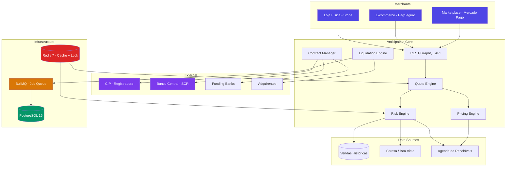
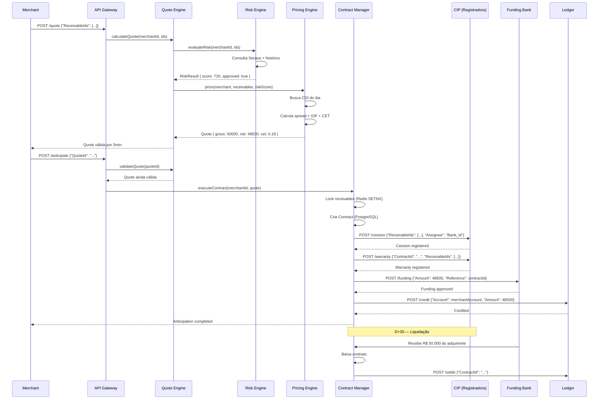
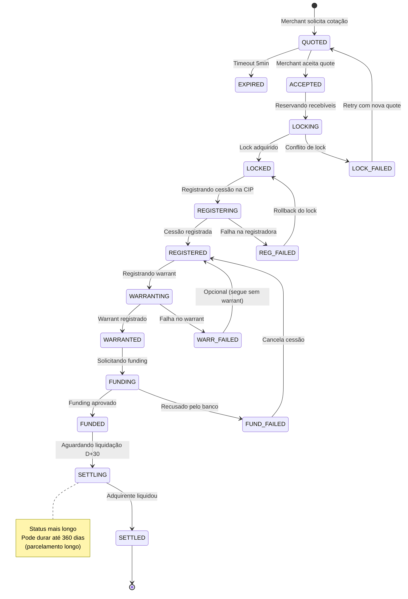
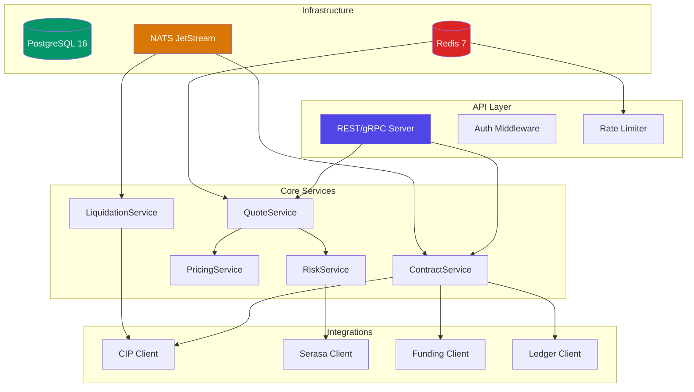

# Desafio 16: Antecipação de Recebíveis — O Mercado de R$ 500 Bi que Move o Brasil

**🇧🇷** Crédito sobre Vendas Futuras de Cartão
**🇬🇧** Receivables Financing & Merchant Cash Advance

---

## 🎯 Objetivos de Aprendizado

- Entender o ecossistema completo de recebíveis de cartão: lojista → adquirente → antecipadora
- Implementar um pricing engine com cálculo de spread, IOF e CET conforme regulação BACEN
- Modelar análise de risco multi-fator: histórico de vendas, chargeback, sazonalidade, Serasa
- Dominar conciliação financeira entre agenda de recebíveis e liquidação bancária
- Implementar registro de recebíveis no BACEN (Sistema de Informações de Crédito - SCR)

---

## 📋 Pré-requisitos

### 🧠 Conceitos
- Antecipação de recebíveis como produto de crédito lastreado em vendas futuras de cartão
- Diferença entre factoring tradicional e antecipação de recebíveis moderna (Lei 12.865/2013)
- Spread bancário, IOF (Imposto sobre Operações Financeiras) e CET (Custo Efetivo Total)
- Registro de recebíveis no BACEN e o Sistema de Informações de Crédito (SCR)
- Cessão fiduciária de recebíveis como garantia em operações de crédito
- Warrant e agenda de recebíveis como instrumentos de conciliação

### 📚 Desafios Anteriores
- [Desafio 01: Ledger](/challenges/01-ledger) — o ledger registra as operações contábeis de antecipação (débito, crédito, encargos)
- [Desafio 04: ISO 8583](/challenges/04-iso8583) — os recebíveis são gerados a partir das transações de cartão (crédito e débito)
- [Desafio 09: Leaky Bucket](/challenges/09-leaky-bucket) — conceitos de rate limiting aplicados à API de consulta de agenda

### 🛠️ Ferramentas
- Docker (ambiente local de desenvolvimento)
- PostgreSQL (transações ACID, CTEs para cálculos financeiros, window functions)
- Redis (cache de taxas CDI, Selic e spreads atualizados diariamente)

### 💻 Técnico
- TypeScript e Node.js 20+ (backend da API de antecipação)
- Matemática financeira (juros compostos, valor presente líquido, taxa equivalente, amortização)
- PostgreSQL avançado (CTEs recursivas, window functions, locks otimistas)
- APIs REST (consulta de agenda, simulação de antecipação, contratação)

---

## 📖 Abertura — De Onde Vem o Dinheiro Mais Caro do Brasil?

"Vou te explicar. eu vou te contar uma coisa que talvez você nunca tenha parado pra pensar. Sabe qual é o produto financeiro mais lucrativo do Brasil? Não é PIX. Não é TED. Não é o spread do cartão de crédito. **É antecipação de recebíveis.**

E sabe por quê? Porque ela cobra juros sobre um dinheiro que tecnicamente nem é dela ainda. A antecipadora empresta com lastro em vendas que o lojista já fez mas ainda não recebeu. O risco é baixo — a venda já aconteceu, o adquirente já processou, o pagamento é certo. Mas a taxa é alta — spread de 2% a 8% ao ano acima do CDI. E o volume? R$ 500 bilhões por ano. Só pra você ter uma ideia: isso é maior que o orçamento do governo federal em saúde e educação somados.

Mas deixa eu voltar um pouco no tempo. Pra entender antecipação de recebíveis, você precisa entender o factoring. Factoring — ou fomento mercantil — existe no Brasil desde os anos 80. A lógica é antiga: um empresário tem R$ 100 mil em duplicatas pra receber em 60 dias, mas precisa do dinheiro hoje. Ele vende essas duplicatas pra um factor com 15% de deságio. O factor recebe R$ 85 mil hoje e R$ 100 mil em 60 dias. Retorno de 17,6% em dois meses. Anualiza isso: mais de 100% ao ano.

Só que factoring sempre foi um mercado meio nebuloso. Duplicata fria, nota fiscal cancelada depois da venda, empresa fantasma. O factor dependia da palavra do empresário e de uma análise de crédito artesanal — basicamente mandar um motoboy até o endereço da empresa pra ver se ela existia mesmo. Em 2004, o Brasil tinha mais de 1.800 factorings registradas. A maioria operava sem qualquer lastro real — era basicamente agiotagem institucionalizada com CNPJ e escritório bonito na Paulista.

Aí veio a revolução das maquininhas. Em 2010, o mercado de adquirência brasileiro era um duopólio: Cielo e Rede. Juntas, controlavam mais de 90% do mercado. As taxas de MDR (Merchant Discount Rate, a taxa que o adquirente cobra do lojista) eram altíssimas — 3% a 5% por transação. E o lojista recebia em D+30, sem opção de antecipar. Era um mercado extremamente lucrativo pras adquirentes e terrível pro lojista.

A ruptura veio com a Lei 12.865/2013, que quebrou a exclusividade das bandeiras e permitiu novos entrantes no mercado de adquirência. Stone, PagSeguro, Mercado Pago — entram em cena com uma proposta que mudou o varejo brasileiro: taxas mais baixas, sem aluguel de maquininha, e antecipação automática dos recebíveis. O modelo de negócios dessas empresas não era ganhar no MDR. Era ganhar na antecipação.

E por que isso é tão genial? Porque o lojista de varejo brasileiro trabalha com margem líquida de 3% a 8%. Ele não tem capital de giro. Ele depende de receber rápido pra pagar fornecedor, aluguel, funcionário. Se ele vende no cartão e recebe em 30 dias, ele quebra. Então ele aceita pagar 2% ao mês pra receber em 2 dias — porque sem isso, ele não consegue repor estoque.

A antecipadora, por sua vez, tem um lastro perfeito: a venda já foi feita. O valor já foi capturado pela maquininha. A bandeira já aprovou. O dinheiro vai cair — é só uma questão de quando. É o crédito mais seguro que existe no mercado financeiro. Mais seguro que empréstimo pessoal, mais seguro que financiamento imobiliário. Tão seguro que a Stone chegou a captar FIDCs (Fundos de Investimento em Direitos Creditórios) com rating AAA — melhor que muito título de dívida soberana.

Mas o mercado evoluiu. Em 2018, o Banco Central criou o **registro obrigatório de recebíveis**, que entrou em vigor gradualmente com a Resolução 4.734/2019 e depois a 264/2022. Agora, todo recebível de cartão precisa ser registrado em uma **registradora autorizada** (CIP, B3, TAG) antes mesmo da venda ser liquidada. Isso significa que o BACEN sabe, em tempo real, exatamente quanto cada lojista brasileiro tem a receber de cada adquirente. É um nível de granularidade que nenhum outro país tem.

E o resultado? O banco central criou um ambiente onde qualquer banco pode consultar a agenda de recebíveis de qualquer lojista e oferecer antecipação. O lojista não fica mais preso à adquirente dele. Se a Stone oferece 2,5% ao mês, o Itaú pode oferecer 1,8% ao mês — porque o Itaú tem funding mais barato. Isso é competição real, e o spread caiu.

Hoje, o ecossistema de antecipação de recebíveis brasileiro é o mais sofisticado do mundo. Registradoras processam bilhões de eventos de recebíveis por dia. APIs de consulta de agenda permitem que qualquer fintech ofereça antecipação em segundos. E os grandes players — Stone, PagSeguro, Mercado Pago — movimentam centenas de bilhões por ano só nessa linha de negócio.

Esse desafio é sobre construir esse motor. Não é sobre simular uma maquininha — é sobre construir o motor financeiro que fica atrás dela. Pricing, risco, conciliação, registro no BACEN. Porque o mundo mudou: factoring virou engenharia financeira, e o lojista brasileiro não depende mais do motoboy bater na porta.

Ah, e aquelas 1.800 factorings de 2004? Hoje são menos de 300. O mercado se consolidou, se regulou, se profissionalizou. Porque quando você consegue dar transparência total sobre os recebíveis de cada CNPJ, o intermediário opaco perde a razão de existir. Isso é tecnologia destruindo a agiotagem. E bancando o varejo brasileiro."

---

## 🔥 O Problema

Imagine que você está construindo o backend de uma adquirente ou fintech de crédito. Seu cliente é um lojista de shopping que vende R$ 200 mil por mês no cartão. Em D+30, ele recebe R$ 194 mil (descontado o MDR de 3%). Mas ele precisa de R$ 50 mil agora pra pagar a folha.

Você oferece: "Te dou R$ 48.500 hoje, e fico com os R$ 50 mil que você vai receber em 30 dias." Ele aceita. Parece simples. Mas no backend, o que você precisa garantir é assustador:

1. **Pricing em tempo real** — Você não pode chutar a taxa. Precisa calcular spread sobre CDI, IOF diário (0,38% fixo + 0,0041% ao dia), e o CET (Custo Efetivo Total) que o BACEN exige divulgar. E o CDI muda todo dia. Se você errar o cálculo por 0,01%, em R$ 500 bilhões de carteira são R$ 50 milhões de prejuízo. Não é erro de arredondamento de planilha — é dinheiro saindo do caixa.

E tem um problema sutil: cada recebível tem seu próprio prazo. Um lojista pode estar antecipando 50 vendas de cartão, cada uma com um D+ diferente. Uma venda de 3 de março vence em 2 de abril (30 dias). Outra de 28 de março vence em 27 de abril (30 dias também). Mas o CET é ponderado por valor e prazo — recebíveis mais distantes têm mais peso no cálculo. Se você tratar tudo como prazo médio, o CET sai errado. O BACEN exige que o CET seja calculado recebível por recebível, ponderado pelo valor presente. Isso se chama **fluxo de caixa descontado individual** — e a maioria dos sistemas implementa errado usando prazo médio simples.

2. **Análise de risco multi-fator** — O lojista tem 10 anos de CNPJ. Mas nos últimos 3 meses, o volume de vendas caiu 40%. E a taxa de chargeback subiu de 0,5% pra 3%. Ele ainda é um bom risco? Depende. Se a queda de vendas é sazonal (pós-Natal), ok. Se é estrutural (concorrente abriu do lado), é problema. Você precisa modelar isso com machine learning? Depende do volume. Mas no mínimo precisa de um score ponderado: Serasa (35%), histórico de vendas próprio (30%), comportamento na plataforma (20%), antifraude (15%).

O diabo está nos detalhes do chargeback. Um lojista pode ter 0,1% de chargeback em R$ 2 milhões/mês e ser perfeitamente saudável. Outro pode ter 1% de chargeback em R$ 50 mil/mês e estar vendendo produto com defeito — ou pior, aplicando golpe. Mas o chargeback tem um delay: o cliente contesta a compra 30 a 90 dias depois. Então o chargeback de hoje reflete vendas de 3 meses atrás. Se o lojista começou a fraudar ontem, você só vai descobrir em abril. Por isso que análise de risco não pode depender só de chargeback — precisa olhar consistência de ticket médio, recorrência de clientes, horário das vendas, geolocalização.

3. **Conciliação entre agenda e liquidação** — Você antecipou R$ 50 mil em recebíveis que venceriam em 30 dias. Chegou o dia do vencimento. Mas o adquirente só liquidou R$ 49.200. Cadê os R$ 800? Pode ser chargeback. Pode ser cancelamento. Pode ser erro operacional do adquirente. Pode ser que a bandeira parcelou errado. Você precisa de um **batch de conciliação diário** que compare sua agenda de recebíveis antecipados com o extrato de liquidação que o adquirente mandou (arquivo CNAB ou API). E precisa de regras de match: concilia por NSU (Número Sequencial Único), valor, data de venda, bandeira, parcela. E quando não casa? Fila de divergência pra análise manual.

O caso real que assombra toda antecipadora: em 2019, um adquirente brasileiro processou R$ 200 milhões em chargebacks de um único lojista — que já tinha antecipado R$ 180 milhões com 3 antecipadoras diferentes. O lojista faliu, o adquirente absorveu o prejuízo, e as antecipadoras ficaram com o risco de crédito do lojista (que era zero, porque faliu). **Chargeback desconcilia tudo** — porque o recebível que você achava que ia receber simplesmente deixa de existir. E o dinheiro que você já adiantou pro lojista? Perdeu. A menos que você tenha warrant.

4. **Warranter e garantia de cessão** — Você emprestou R$ 48.500 pro lojista com lastro em R$ 50 mil de recebíveis. Mas o lojista pediu falência. Os recebíveis ainda vão ser pagos — pelo adquirente, na data de vencimento. Mas eles são do lojista ou seus? Se você não registrou a **cessão fiduciária** na registradora (CIP/B3/TAG), os recebíveis entram na massa falida e você vira credor quirografário — último da fila, atrás de trabalhista, tributário, garantia real. Se você registrou a cessão, os recebíveis são seus, e o adquirente é obrigado a pagar diretamente pra você, mesmo com o lojista falido.

Isso se chama **warranter** — o registro da garantia de cessão que blinda seus recebíveis contra falência, penhora, bloqueio judicial. O custo: cerca de R$ 0,02 por recebível registrado na CIP. O benefício: você não perde R$ 50 mil se o lojista quebrar. Parece óbvio, mas em 2021, uma fintech de antecipação perdeu R$ 15 milhões porque operava com "Cessão de crédito por instrumento particular" — um contrato assinado entre as partes — sem registro na registradora. O contrato era legalmente válido, mas não era oponível a terceiros. Juiz mandou pagar os credores trabalhistas primeiro.

5. **API de consulta de agenda** — O BACEN exige que toda registradora ofereça uma API de extrato de recebíveis. Qualquer banco ou fintech credenciada pode consultar: "Pra esse CNPJ, quais recebíveis futuros existem, qual o valor, qual a data de vencimento, qual adquirente, qual bandeira, já foram cedidos fiduciariamente pra outra instituição?" Essa API é a espinha dorsal do open finance de recebíveis. Mas o volume é brutal: uma registradora como a CIP processa mais de 200 milhões de consultas de agenda por dia. Você precisa de caching agressivo (Redis), rate limiting por participante, e consistência eventual — a agenda de recebíveis não precisa ser real-time, mas não pode estar defasada mais de 5 minutos.

Cada um desses problemas tem solução: pricing com fluxo de caixa descontado individual, risk engine multi-fator com janela móvel, conciliação batch com match por NSU, warranter automático via API da registradora, e client de consulta de agenda com circuit breaker. Nenhum é trivial. Todos são obrigatórios pra operar nesse mercado.

---

## 🏗️ Arquitetura Geral

<LanguageToggle />

<div class="Lang-content ts" style="Display:block;">

### Visão Macro



Antes de mergulhar no código, entenda três decisões arquiteturais fundamentais nesse diagrama. Primeiro: o **Quote Engine é stateless**. Ele recebe um `merchantId` e uma lista de `receivableIds`, consulta o Risk Engine (que por sua vez consulta Serasa, histórico de vendas, etc.), consulta o Pricing Engine (que busca CDI do dia, calcula spread, IOF, CET), e devolve uma quote. A quote é efêmera — tem validade de 5 minutos. Se o merchant confirmar depois disso, o pricing é recalculado. Isso impede que o merchant segure uma quote com taxa defasada e exerça arbitragem contra você.

Segundo: o **Contract Manager é o ponto de consistência**. Quando o merchant aceita a quote, o Contract Manager faz três coisas em sequência estrita: (1) lock otimista nos recebíveis (marca como `RESERVED` no Redis com TTL), (2) registra cessão fiduciária na CIP via API, (3) solicita funding (se você não tem capital próprio, repassa pro banco atacadista). Se qualquer passo falhar, rollback: libera o lock, cancela o registro, estorna o funding. Atomicidade em três sistemas diferentes — receita garantida pra cabelo branco.

Terceiro: o **Liquidation Engine é assíncrono e batch**. Ele não processa liquidação em tempo real porque liquidação de cartão é batch por natureza — o adquirente manda arquivo de liquidação uma vez por dia (tradicionalmente CNAB, cada vez mais API REST). O Liquidation Engine pega esse arquivo, faz match por NSU com a agenda de recebíveis antecipados, baixa os contratos quitados, e dispara alertas pra divergências. É um job agendado no BullMQ que roda de madrugada.

### A Stack

TypeScript, Koa, PostgreSQL com `pg`, `graphql-yoga`, `bullmq`, `ioredis`. Nada de ORM mágico — SQL puro com `pg` pra controle fino de queries. Nada de `Prisma` ou `TypeORM` — em sistema financeiro, você precisa saber exatamente qual query está rodando, com qual plano de execução, e com qual lock. ORM esconde isso e você descobre o problema no pior momento.

> **Por que PostgreSQL e não MongoDB pra antecipação?** — O MongoDB é excelente pra documentos e schemas flexíveis. Mas antecipação de recebíveis é essencialmente relacional: merchant 1→N contracts, contract 1→N receivables, receivable N→1 acquirer, acquirer N→1 settlement batch. Com 50 milhões de recebíveis por dia, você precisa de índices compostos, constraints de integridade (FK), e window functions pra análises temporais (média móvel de vendas, sazonalidade). O PostgreSQL faz isso nativamente, com performance previsível. O MongoDB exige `$lookup` (que é caro) ou duplicação de dados (que cria inconsistência). Escolha o banco certo pro domínio — e antecipação é um domínio relacional.

### Fluxo de uma Antecipação



Repare em três pontos sutis desse diagrama. Primeiro: a **quote não reserva nada**. Ela é só uma promessa de taxa. O merchant pode pedir 10 quotes diferentes em 10 segundos e escolher a melhor. A reserva (lock) só acontece no `executeContract`, e o lock é otimista com TTL de 30 segundos — tempo suficiente pro merchant aceitar, mas curto o bastante pra não segurar recebíveis de outros pedidos.

Segundo: a **cessão fiduciária e o warrant são chamadas separadas na CIP**. A cessão registra que aquele recebível agora pertence ao banco antecipador. O warrant adiciona uma camada extra de proteção jurídica — ele garante que, mesmo em caso de falência do merchant, o recebível não entra na massa falida. Tecnicamente são operações diferentes no sistema da CIP, com custos diferentes, e algumas antecipadoras só fazem a cessão (mais barata) e assumem o risco jurídico. As maiores fazem ambas.

Terceiro: o **funding pode ser terceirizado ou próprio**. Se você é Stone, você tem capital próprio — pega o dinheiro do caixa e antecipa. Se você é uma fintech menor, você repassa o contrato pra um banco atacadista (BV, ABC, Pine) que te dá uma linha de crédito. A diferença prática: com funding próprio, você fica com 100% do spread. Com funding terceirizado, você divide o spread com o banco. E isso impacta o pricing — se o banco te cobra CDI + 8% a.a., você precisa cobrar CDI + 12% a.a. do lojista pra ter margem. Simples assim.

### State Machine do Contrato



Essa máquina de estados não é acadêmica — é exatamente como o contrato de antecipação transita no backend. Cada transição é uma operação que pode falhar, e o rollback de cada estado é diferente. Repare que do `WARRANTING` você pode seguir pra `FUNDING` mesmo se o warrant falhar — porque o warrant é opcional (embora fortemente recomendado). A decisão de pular o warrant depende do apetite de risco e do score do merchant.

Outra sutileza: o estado `SETTLING` pode durar até 360 dias em caso de parcelamento em 12x sem juros. Um lojista que parcela uma venda em 12 vezes no cartão gera 12 recebíveis, um pra cada mês. O primeiro vence em D+30, o último em D+360. O contrato de antecipação fica aberto por meses, recebendo liquidações parciais. A conciliação precisa saber lidar com liquidação parcial — o adquirente pagou 1 de 12 parcelas, o contrato não está quitado, mas uma parte já foi recebida.

### Schema GraphQL

```graphql
type Merchant implements Node {
  id: ID!
  document: String!
  tradingName: String!
  creditScore: Int!
  monthlyVolume: Float!
  chargebackRate: Float!
  contracts: AnticipationContractConnection!
  receivableAgenda: ReceivableConnection!
}

type Receivable implements Node {
  id: ID!
  merchant: Merchant!
  acquirer: Acquirer!
  cardBrand: CardBrand!
  grossAmount: Float!
  netAmount: Float!           # após MDR
  paymentDate: String!
  nsu: String!                # Número Sequencial Único
  status: ReceivableStatus!
  isEncumbered: Boolean!      # já cedido fiduciariamente?
}

type AnticipationContract implements Node {
  id: ID!
  merchant: Merchant!
  receivables: [Receivable!]!
  grossAmount: Float!
  discountAmount: Float!
  iofAmount: Float!
  netAmount: Float!
  effectiveRate: Float!       # CET
  status: ContractStatus!
  cessionId: String!          # ID da cessão na CIP
  warrantyId: String
  settledAt: String
  createdAt: String!
}
```

Aqui tem uma decisão de modelagem importante: `isEncumbered` no `Receivable`. Quando um recebível é incluído em um contrato de antecipação, ele não pode ser antecipado de novo. Isso se chama **dupla cessão** e é crime de estelionato financeiro. Mas como você garante? A registradora (CIP) garante — ela é a fonte da verdade. O campo `isEncumbered` é um cache local (derivado da CIP) pra consultas rápidas, mas o Contract Manager sempre confirma na CIP antes de travar.

Sobre `grossAmount` vs `netAmount`: o valor bruto é o valor da venda. O valor líquido é após o MDR da adquirente. O pricing é calculado sobre o valor líquido — porque é isso que o lojista efetivamente vai receber. Se você calcular o desconto sobre o bruto, vai dar errado. A maioria dos bugs de pricing em antecipação vem de confundir base de cálculo.

### API REST de Consulta de Agenda

Além do GraphQL, o sistema expõe endpoints REST pra integração com sistemas externos. A API de agenda é o endpoint mais crítico:

```typescript
// GET /api/v1/merchants/:document/receivables
// Query: ?startDate=2026-01-01&endDate=2026-03-31&status=PENDING&page=1&limit=100
// Response:
interface AgendaResponse {
  items: {
    receivableId: string;
    nsu: string;
    acquirer: string;
    cardBrand: 'visa' | 'mastercard' | 'elo' | 'amex';
    netAmount: number;
    paymentDate: string;
    status: 'PENDING' | 'ANTICIPATED' | 'SETTLED' | 'CHARGED_BACK';
    isEncumbered: boolean;
    cessionId?: string;
  }[];
  pagination: {
    page: number;
    limit: number;
    totalItems: number;
    totalPages: number;
  };
  summary: {
    totalPending: number;
    totalAnticipated: number;
    totalSettled: number;
    next30Days: number;   // valor total a receber nos próximos 30 dias
    next90Days: number;
  };
}
```

Esse endpoint é consumido tanto pelo merchant (pra ver sua própria agenda) quanto por parceiros de funding (pra avaliar carteira). O `summary` é materializado — calculado via trigger no PostgreSQL toda vez que um recebível muda de status. Se você calcular via `SUM()` em tempo real com 1 milhão de recebíveis, a query demora 2 segundos e o merchant reclama. Materialização é uma escolha pragmática: você troca consistência forte por performance de leitura. E em sistema financeiro, consistência forte é obrigatória... exceto pra dashboards e sumários, onde consistência eventual com 30 segundos de atraso é perfeitamente aceitável.

---

## 👨‍💻 Mão na Massa

"Bora codar. O bagulho é o seguinte: você precisa de um sistema que pega uma lista de recebíveis, calcula quanto vale hoje, avalia o risco, registra no BACEN, e credita o merchant. Se der zebra em qualquer etapa, rollback total — o merchant não pode ficar sem dinheiro nem com dinheiro duplicado.

Antes de mergulhar no código, quero que você entenda três princípios que guiam cada decisão: **dual pricing** (quote + execution são separados), **lock otimista com TTL** (você não pode travar recebíveis pra sempre), e **idempotência por NSU** (um mesmo recebível processado duas vezes não pode gerar dois contratos).

### Modelo de Dados

Primeiro, os recebíveis. Eles chegam via arquivo de liquidação do adquirente ou via API da registradora:

```typescript
import { pg } from './db';

export type ReceivableStatus = 'PENDING' | 'ANTICIPATED' | 'SETTLED' | 'CHARGED_BACK';
export type CardBrand = 'visa' | 'mastercard' | 'elo' | 'amex' | 'hipercard';

export interface ReceivableRow {
  id: string;
  merchant_id: string;
  acquirer: string;
  card_brand: CardBrand;
  nsu: string;
  gross_amount: number;
  mdr_rate: number;
  net_amount: number;
  installment_number: number;
  total_installments: number;
  sale_date: Date;
  payment_date: Date;
  status: ReceivableStatus;
  is_encumbered: boolean;
  cession_id: string | null;
  settlement_batch_id: string | null;
  created_at: Date;
  updated_at: Date;
}

export class ReceivableRepository {
  async findByMerchant(
    merchantId: string,
    filters: { startDate?: Date; endDate?: Date; status?: ReceivableStatus[] }
  ): Promise<ReceivableRow[]> {
    let query = 'SELECT * FROM receivables WHERE merchant_id = $1';
    const params: unknown[] = [merchantId];

    if (filters.status?.length) {
      query += ` AND status = ANY($${params.length + 1})`;
      params.push(filters.status);
    }
    if (filters.startDate) {
      query += ` AND payment_date >= $${params.length + 1}`;
      params.push(filters.startDate);
    }
    if (filters.endDate) {
      query += ` AND payment_date <= $${params.length + 1}`;
      params.push(filters.endDate);
    }

    query += ' ORDER BY payment_date ASC LIMIT 500';
    return pg.query<ReceivableRow>(query, params).then(r => r.rows);
  }

  async lockForAnticipation(ids: string[], contractId: string): Promise<number> {
    const result = await pg.query(
      `UPDATE receivables
       SET status = 'ANTICIPATED', is_encumbered = true, cession_id = $1, updated_at = NOW()
       WHERE id = ANY($2)
       AND status = 'PENDING'
       AND is_encumbered = false
       RETURNING id`,
      [contractId, ids]
    );
    return result.rowCount ?? 0;
  }
}
```

**Decisões críticas:**

- **`lockForAnticipation` com `WHERE status = 'PENDING' AND is_encumbered = false`** — Isso é optimistic lock no banco. Se duas threads tentarem antecipar os mesmos recebíveis ao mesmo tempo, uma vai atualizar N linhas e a outra vai atualizar 0 (porque o status já mudou pra `ANTICIPATED`). Quem recebe `rowCount = 0` sabe que perdeu o lock e retorna erro. Sem locks explícitos, sem `SELECT FOR UPDATE`, sem deadlock. Só uma condição na cláusula WHERE.

- **`RETURNING id`** — O PostgreSQL devolve só os IDs que foram efetivamente travados. Isso permite que o código saiba exatamente quais recebíveis ficaram sob sua custódia. Se você tentou travar 10 mas só conseguiu 7 (porque 3 já estavam travados), você sabe e pode decidir: prossegue com 7 ou aborta tudo? A regra de negócio típica: se menos de 90% dos recebíveis foram travados, aborta. Se >= 90%, prossegue com os que travou e notifica o merchant sobre os que ficaram de fora.

Agora os contratos de antecipação:

```typescript
export type ContractStatus =
  | 'QUOTED'
  | 'ACCEPTED'
  | 'LOCKING'
  | 'LOCKED'
  | 'REGISTERING'
  | 'REGISTERED'
  | 'WARRANTING'
  | 'WARRANTED'
  | 'FUNDING'
  | 'FUNDED'
  | 'SETTLING'
  | 'SETTLED'
  | 'CANCELLED';

export interface ContractRow {
  id: string;
  merchant_id: string;
  gross_amount: number;
  discount_amount: number;
  iof_amount: number;
  fixed_fee: number;
  net_amount: number;
  effective_rate: number;
  cdi_rate: number;
  spread_rate: number;
  risk_premium: number;
  status: ContractStatus;
  receivable_ids: string[];
  cession_id: string | null;
  warranty_id: string | null;
  funding_id: string | null;
  idempotency_key: string;
  quoted_at: Date;
  accepted_at: Date | null;
  settled_at: Date | null;
  created_at: Date;
}
```

Repare no `idempotency_key` no contrato. Ele é único por contrato e gerado pelo merchant como um UUID. Se o merchant submeter o mesmo pedido duas vezes (timeout, retry, duplo clique na tela), o backend consulta `SELECT * FROM contracts WHERE idempotency_key = $1` antes de processar. Se já existe, retorna o contrato existente. Se não, processa. Idempotência no nível de contrato, não no nível de recebível — porque o merchant pode ter múltiplos contratos com recebíveis diferentes, mas nunca dois contratos com o mesmo idempotency key.

### Pricing Engine

"Aqui é onde a conta fecha — ou não fecha. O pricing de antecipação parece simples: pega o CDI, adiciona um spread, desconta do valor futuro. Mas tem IOF, tem CET, tem prazo ponderado. E se errar em 0,01%, em R$ 500 bilhões de carteira são R$ 50 milhões. Sem brincadeira."

```typescript
export class PricingEngine {
  constructor(
    private readonly marketData: MarketDataService,
    private readonly merchantRepo: MerchantRepository
  ) {}

  async calculateQuote(
    merchantId: string,
    receivableIds: string[]
  ): Promise<QuoteResult> {
    const cdiDaily = await this.marketData.getCDIDailyRate();
    const merchant = await this.merchantRepo.findById(merchantId);
    const receivables = await this.merchantRepo.getReceivablesByIds(
      merchantId, receivableIds
    );

    const riskPremium = this.calculateRiskPremium(merchant.creditScore);
    const spread = this.calculateSpread(merchant);
    const annualRate = cdiDaily * 252 + spread + riskPremium;
    const dailyRate = Math.pow(1 + annualRate, 1 / 252) - 1;

    let grossSum = 0;
    let discountSum = 0;
    let iofSum = 0;
    let weightedDays = 0;
    let weightedValue = 0;

    for (const rec of receivables) {
      const days = this.daysBetween(new Date(), new Date(rec.payment_date));
      if (days <= 0) continue; // já venceu, não antecipa

      const discount = rec.net_amount * (Math.pow(1 + dailyRate, days) - 1);
      const iof = rec.net_amount * (0.0038 + 0.000041 * Math.min(days, 365));

      grossSum += rec.net_amount;
      discountSum += discount;
      iofSum += iof;
      weightedDays += days * rec.net_amount;
      weightedValue += rec.net_amount;
    }

    const fixedFee = 10.0; // taxa fixa por contrato
    const netAmount = grossSum - discountSum - iofSum - fixedFee;
    const avgDays = weightedValue > 0 ? weightedDays / weightedValue : 1;
    const cet = this.calculateCET(grossSum, netAmount, avgDays);

    return {
      receivableIds,
      grossAmount: Math.round(grossSum * 100) / 100,
      discountAmount: Math.round(discountSum * 100) / 100,
      iofAmount: Math.round(iofSum * 100) / 100,
      fixedFee,
      netAmount: Math.round(netAmount * 100) / 100,
      annualRate,
      dailyRate,
      effectiveRate: cet,
      averageDays: Math.round(avgDays),
      expiresAt: new Date(Date.now() + 5 * 60 * 1000),
    };
  }

  private calculateCET(
    grossAmount: number,
    netAmount: number,
    days: number
  ): number {
    return Math.pow(grossAmount / netAmount, 252 / days) - 1;
  }

  private calculateRiskPremium(creditScore: number): number {
    if (creditScore >= 800) return 0.0;
    if (creditScore >= 650) return 0.005;
    if (creditScore >= 500) return 0.015;
    if (creditScore >= 350) return 0.035;
    return 0.06;
  }

  private calculateSpread(merchant: MerchantRow): number {
    let spread = 0.02; // base
    if (merchant.monthly_volume > 1_000_000) spread -= 0.005;
    if (merchant.monthly_volume > 5_000_000) spread -= 0.005;
    if (merchant.chargeback_rate > 0.02) spread += 0.01;
    if (merchant.months_since_first_sale < 6) spread += 0.01;
    return spread;
  }

  private daysBetween(a: Date, b: Date): number {
    return Math.ceil((b.getTime() - a.getTime()) / (1000 * 60 * 60 * 24));
  }
}
```

**Por que 252 e não 365?** O mercado financeiro brasileiro usa **dias úteis** (252 por ano) pra calcular taxa de juros. CDI, CET, tudo é em dias úteis. Se você usar 365, o lojista vai pagar juros sobre sábados e domingos — e o BACEN vai te multar. A diferença parece pequena (252 vs 365 é 30% menos dias), mas em R$ 500 bilhões de carteira, cobrar juros em dias não úteis gera um lucro indevido de centenas de milhões. E o BACEN audita isso.

**E o IOF?** O IOF tem duas componentes: alíquota fixa de 0,38% sobre o valor da operação, mais 0,0041% ao dia (limitado a 365 dias, ou seja, máximo de 1,5% ao ano). O `Math.min(days, 365)` ali existe porque depois de 365 dias o IOF diário para de incidir. Em antecipação de parcelado longo (12x), as parcelas mais distantes já passaram do limite de IOF — e você precisa calcular certo.

**Por que Math.round com 2 casas?** Nós usamos centavos como inteiros na maior parte do sistema pra evitar floating point. Mas na camada de API, precisamos converter pra decimal com 2 casas. O `Math.round(x * 100) / 100` é suficiente pra apresentação. O importante é que o cálculo interno — discount, iof, net — seja feito com a precisão máxima do float, e o arredondamento só aconteça na borda. Arredondar cedo demais acumula erro. É o mesmo princípio de "Compute in high precision, display in low precision".

Agora, a fórmula do CET merece uma explicação. CET = Custo Efetivo Total. É a taxa que o BACEN exige que seja divulgada pro tomador de crédito. Ela inclui **todos** os custos: spread, IOF, taxa fixa, tudo. A fórmula é: `(Valor Futuro / Valor Presente) ^ (252 / prazo em dias úteis) - 1`. Basicamente, "Qual a taxa anual equivalente que transforma o valor líquido recebido hoje no valor futuro que eu teria recebido?". Se o merchant receber R$ 48.500 hoje e abrir mão de R$ 50.000 em 30 dias, o CET é: `(50000 / 48500) ^ (252 / 30) - 1 = 28.9% a.a.`. Sim, antecipação é cara. E é exatamente por isso que é o produto mais lucrativo do mercado financeiro brasileiro.

### Risk Engine

"Agora a parte que separa os homens dos meninos. Você vai emprestar R$ 48.500 pra um CNPJ que você nunca viu na vida. Em 30 dias, o adquirente vai te pagar R$ 50.000. Mas e se o lojista cometeu fraude? E se os recebíveis são de venda cancelada? E se o merchant tá com o nome sujo na Serasa e você nem consultou?"

```typescript
export class RiskEngine {
  constructor(
    private readonly creditBureau: CreditBureauService,
    private readonly salesHistoryRepo: SalesHistoryRepository,
    private readonly fraudService: FraudService
  ) {}

  async evaluate(input: RiskEvaluationInput): Promise<RiskResult> {
    const [creditData, salesHistory, fraudCheck] = await Promise.all([
      this.creditBureau.query(input.merchantDocument),
      this.salesHistoryRepo.getHistory(input.merchantId, 12),
      this.fraudService.evaluateAnticipation({
        merchantId: input.merchantId,
        receivableIds: input.receivableIds,
        totalAmount: input.totalAmount,
      }),
    ]);

    const creditScore = this.normalizeCreditScore(creditData);
    const historyScore = this.calculateHistoryScore(salesHistory);
    const behaviorScore = this.calculateBehaviorScore(input, salesHistory);
    const fraudScore = fraudCheck.score;

    const finalScore = Math.round(
      creditScore * 0.35 +
      historyScore * 0.30 +
      behaviorScore * 0.20 +
      fraudScore * 0.15
    );

    const maxAmount = this.calculateMaxExposure(input.merchantId, salesHistory);

    return {
      approved: finalScore >= 500 && input.totalAmount <= maxAmount,
      score: finalScore,
      riskLevel:
        finalScore >= 800 ? 'LOW' :
        finalScore >= 650 ? 'MEDIUM' : 'HIGH',
      maxAmount,
      flags: this.generateFlags(creditData, salesHistory, fraudCheck),
    };
  }

  private calculateHistoryScore(history: MonthlySales[]): number {
    if (history.length < 3) return 200;
    if (history.length < 6) return 400;

    const volumes = history.map(h => h.total_volume);
    const avg = volumes.reduce((a, b) => a + b, 0) / volumes.length;
    const stdDev = Math.sqrt(
      volumes.reduce((sum, v) => sum + Math.pow(v - avg, 2), 0) / volumes.length
    );
    const cv = stdDev / avg; // coeficiente de variação

    // Quanto menor a variação, melhor o score
    if (cv < 0.1) return 900;
    if (cv < 0.2) return 750;
    if (cv < 0.4) return 550;
    return 300;
  }

  private calculateMaxExposure(
    merchantId: string,
    history: MonthlySales[]
  ): number {
    if (history.length === 0) return 0;

    const avgMonthly = history
      .slice(-3)
      .reduce((sum, h) => sum + h.total_volume, 0) / 3;

    // Máximo de 50% do volume mensal médio
    return avgMonthly * 0.5;
  }

  private generateFlags(
    credit: CreditBureauResult,
    history: MonthlySales[],
    fraud: FraudResult
  ): string[] {
    const flags: string[] = [];

    if (credit.restrictions > 0) {
      flags.push(`RESTRICTIONS: ${credit.restrictions} pendências`);
    }
    if (history.length < 3) {
      flags.push('SHORT_HISTORY: menos de 3 meses de vendas');
    }

    const last3 = history.slice(-3);
    const trend = last3.map(h => h.total_volume);
    if (trend.length === 3 && trend[2] < trend[0] * 0.7) {
      flags.push('DECLINING_VOLUME: queda >30% nos últimos 3 meses');
    }

    if (fraud.score < 400) {
      flags.push(`FRAUD_RISK: score ${fraud.score}`);
    }

    return flags;
  }
}
```

Três coisas importantes nesse risk engine. Primeiro: **janela móvel de 12 meses**. Antecipação não é empréstimo pontual — é uma relação contínua. O merchant antecipa toda semana, todo mês. O risk engine precisa olhar o comportamento ao longo do tempo: o volume está estável? A taxa de chargeback está subindo? O ticket médio mudou? Se o lojista vendia produto de R$ 50 e de repente passou a vender de R$ 500, pode ser que ele mudou de ramo — ou pode ser que ele está fraudando com ticket alto.

Segundo: **coeficiente de variação (CV)** como métrica de estabilidade. O CV é o desvio padrão dividido pela média. Se o CV é baixo, o merchant tem volume consistente — sinal de negócio saudável. Se o CV é alto, o volume oscila muito — sinal de sazonalidade ou instabilidade. O CV é melhor que a variância pura porque normaliza pela média: um merchant com R$ 50 mil de variação em R$ 1 milhão de volume (CV=0,05) é muito mais estável que um com R$ 50 mil de variação em R$ 100 mil de volume (CV=0,5).

Terceiro: **max exposure de 50% do volume mensal**. Isso é um limite prudencial: você nunca antecipa mais do que metade do que o merchant vende em um mês. Por quê? Porque se o merchant parar de vender (quebra, fecha, some), você ainda tem o fluxo residual de vendas dos meses anteriores pra cobrir o prejuízo. É uma margem de segurança. Bancos tradicionais são ainda mais conservadores — emprestam 30% do faturamento. Fintechs são mais agressivas — 50% a 70%. Mas acima de 70%, você está essencialmente comprando o fluxo de caixa futuro inteiro do merchant, e qualquer oscilação quebra a conta.

### Anticipation Use Case

"Esse é o core. O use case que orquestra tudo. Se der ruim no meio — funding negado, CIP fora do ar, Redis caiu — ele precisa saber fazer rollback. E o rollback não é automático: desfazer uma cessão fiduciária na CIP é uma operação assíncrona que pode levar minutos. Você precisa tratar isso."

```typescript
export class AnticipateUseCase {
  constructor(
    private readonly pricingEngine: PricingEngine,
    private readonly riskEngine: RiskEngine,
    private readonly contractRepo: ContractRepository,
    private readonly receivableRepo: ReceivableRepository,
    private readonly cipClient: CIPClient,
    private readonly fundingService: FundingService,
    private readonly ledgerService: LedgerService,
    private readonly idempotencyStore: IdempotencyStore,
    private readonly eventBus: EventBus
  ) {}

  async execute(input: AnticipateInput): Promise<AnticipateOutput> {
    // 1. Idempotência — primeiríssima coisa
    const existing = await this.idempotencyStore.get(input.idempotencyKey);
    if (existing) {
      return existing as AnticipateOutput;
    }

    // 2. Valida quote
    const quote = await this.pricingEngine.calculateQuote(
      input.merchantId, input.receivableIds
    );
    if (new Date() > quote.expiresAt) {
      throw new AnticipationError('Quote expired', 'QUOTE_EXPIRED');
    }

    // 3. Risk evaluation
    const risk = await this.riskEngine.evaluate({
      merchantId: input.merchantId,
      merchantDocument: input.merchantDocument,
      receivableIds: input.receivableIds,
      totalAmount: quote.grossAmount,
    });
    if (!risk.approved) {
      throw new AnticipationError(
        `Risk rejected: score ${risk.score}`,
        'RISK_REJECTED'
      );
    }

    // 4. Cria contrato DRAFT
    const contract = await this.contractRepo.create({
      merchantId: input.merchantId,
      grossAmount: quote.grossAmount,
      discountAmount: quote.discountAmount,
      iofAmount: quote.iofAmount,
      fixedFee: quote.fixedFee,
      netAmount: quote.netAmount,
      effectiveRate: quote.effectiveRate,
      cdiRate: quote.cdiRate,
      spreadRate: quote.spreadRate,
      riskPremium: quote.riskPremium,
      status: 'LOCKING',
      receivableIds: input.receivableIds,
      idempotencyKey: input.idempotencyKey,
    });

    // 5. Lock otimista nos recebíveis
    const locked = await this.receivableRepo.lockForAnticipation(
      input.receivableIds, contract.id
    );

    if (locked !== input.receivableIds.length) {
      const ratio = locked / input.receivableIds.length;
      if (ratio < 0.9) {
        await this.contractRepo.updateStatus(contract.id, 'CANCELLED');
        throw new AnticipationError(
          `Only ${locked}/${input.receivableIds.length} receivables locked`,
          'LOCK_CONFLICT'
        );
      }
      input.receivableIds = input.receivableIds.slice(0, locked);
    }

    await this.contractRepo.updateStatus(contract.id, 'LOCKED');

    // 6. Registra cessão na CIP
    try {
      await this.contractRepo.updateStatus(contract.id, 'REGISTERING');
      const cession = await this.cipClient.registerCession({
        contractId: contract.id,
        assignor: input.merchantDocument,
        assignee: process.env.BANK_DOCUMENT!,
        receivableIds: input.receivableIds,
        totalAmount: quote.grossAmount,
      });
      await this.contractRepo.setCessionId(contract.id, cession.cessionId);
      await this.contractRepo.updateStatus(contract.id, 'REGISTERED');
    } catch (err) {
      await this.contractRepo.updateStatus(contract.id, 'CANCELLED');
      await this.receivableRepo.releaseLock(input.receivableIds);
      throw new AnticipationError('CIP registration failed', 'CIP_ERROR');
    }

    // 7. Warrant opcional (não bloqueia se falhar)
    try {
      await this.contractRepo.updateStatus(contract.id, 'WARRANTING');
      const warranty = await this.cipClient.createWarranty({
        cessionId: contract.cessionId!,
        receivableIds: input.receivableIds,
      });
      await this.contractRepo.setWarrantyId(contract.id, warranty.warrantyId);
      await this.contractRepo.updateStatus(contract.id, 'WARRANTED');
    } catch {
      // Warrant falhou — prossegue sem ele (log de risco)
      await this.eventBus.publish('warranty.failed', {
        contractId: contract.id,
        merchantId: input.merchantId,
        error: 'Warranty registration failed',
      });
    }

    // 8. Funding
    try {
      await this.contractRepo.updateStatus(contract.id, 'FUNDING');
      const funding = await this.fundingService.requestFunding({
        amount: quote.netAmount,
        contractId: contract.id,
        merchantId: input.merchantId,
      });
      await this.contractRepo.setFundingId(contract.id, funding.fundingId);
      await this.contractRepo.updateStatus(contract.id, 'FUNDED');
    } catch (err) {
      // Rollback: cancela cessão na CIP
      await this.cipClient.cancelCession(contract.cessionId!);
      await this.contractRepo.updateStatus(contract.id, 'CANCELLED');
      await this.receivableRepo.releaseLock(input.receivableIds);
      throw new AnticipationError('Funding rejected', 'FUNDING_ERROR');
    }

    // 9. Credita merchant
    await this.ledgerService.credit({
      accountId: input.merchantAccountId,
      amount: quote.netAmount,
      reference: `ANTICIPATION:${contract.id}`,
    });

    await this.contractRepo.updateStatus(contract.id, 'SETTLING');

    // 10. Cache idempotência + evento
    const output: AnticipateOutput = {
      contractId: contract.id,
      netAmount: quote.netAmount,
      effectiveRate: quote.effectiveRate,
      cessionId: contract.cessionId!,
    };

    await this.idempotencyStore.set(input.idempotencyKey, output, 86400);
    await this.eventBus.publish('anticipation.completed', output);

    return output;
  }
}
```

Esse use case tem 10 passos e 2 pontos de rollback. Vamos analisar os pontos de falha:

**Passo 5 (lock):** Se menos de 90% dos recebíveis forem travados, o contrato é cancelado. Mas e os recebíveis que travaram? Eles ficam com status `ANTICIPATED` e precisam ser liberados. É por isso que o `releaseLock` existe — ele faz `UPDATE receivables SET status = 'PENDING', is_encumbered = false WHERE id = ANY($1)`.

**Passo 6 (CIP):** Se a CIP estiver fora do ar (acontece), o contrato é cancelado e o lock é liberado. Mas e se a CIP processou a cessão mas a resposta não chegou (timeout de rede)? Você não sabe se a cessão foi registrada ou não. Esse é o caso mais difícil. A solução: query assíncrona `GET /cessions?contractId=xxx` pra verificar. Se a cessão existe, o contrato segue. Se não existe, cancela. Esse padrão se chama **reconciliação de borda** e é essencial em integrações com sistemas externos.

**Passo 8 (funding):** Se o funding falhar, você precisa cancelar a cessão na CIP. Mas cancelar cessão é assíncrono e pode falhar também. Você pode ficar com um contrato `CANCELLED` e uma cessão ativa na CIP — o que é uma inconsistência. A solução é um job de reconciliação que roda a cada 5 minutos: "Contratos `CANCELLED` com cessão ativa na CIP → cancela cessão".

**Passo 9 (crédito):** Se o crédito no ledger falhar, o merchant tem um contrato `FUNDED` mas sem dinheiro na conta. Isso é o pior cenário — o merchant vai ligar reclamando. A solução: o crédito no ledger é a última operação antes do status `SETTLING`. Se falhar, o rollback é cancelar funding, cancelar cessão, liberar lock. Mas o funding já foi solicitado — cancelar funding é outra operação assíncrona. Moral da história: **fail fast**. Valide tudo que puder antes de começar a transação, pra minimizar rollbacks complexos.

---

## 🧠 A Profundidade

### Por Que Antecipação é o Produto Financeiro Mais Lucrativo do Brasil?

"Deixa eu te falar: eu quero que você entenda o que torna a antecipação de recebíveis tão absurdamente lucrativa. Porque não é óbvio. À primeira vista, você pensa: 'é só um empréstimo com garantia em vendas futuras'. Mas o diabo está nos detalhes.

Primeiro: **assimetria de informação**. O lojista sabe quanto ele vendeu. A adquirente sabe quanto ele vendeu — porque processou as transações. Mas a antecipadora que está fora do ecossistema (um banco que não é a adquirente) precisa confiar em dados de terceiros. E aí entra a registradora. Com o registro obrigatório de recebíveis, o BACEN nivelou o jogo: agora qualquer banco sabe exatamente quanto cada lojista tem a receber. Mas a adquirente ainda tem uma vantagem: ela conhece o lojista — sabe se ele vende produto de qualidade, se tem muita devolução, se o cliente reclama. São dados que a registradora não tem. Essa assimetria residual é o que permite que adquirentes cobrem spreads mais altos que bancos tradicionais.

Segundo: **recorrência**. O lojista não antecipa uma vez e some. Ele antecipa todo mês, toda semana, às vezes todo dia. A antecipação é um produto de fluxo — você não ganha dinheiro uma vez, você ganha dinheiro todo mês, sobre cada venda no cartão. E o custo de aquisição de cliente (CAC) é zero — o lojista já é cliente da adquirente, já tem a maquininha, já processa transações. A antecipação é um upsell natural, quase orgânico. O lojista abre o aplicativo da Stone, vê "Você tem R$ 15.000 a receber em 30 dias. Quer receber R$ 14.250 agora?" e clica 'Sim'. Custo de aquisição: um push notification.

Terceiro: **spread sobre CDI**. O funding de um banco grande custa CDI (ou menos, se for banco com depósitos à vista). O spread cobrado do lojista é CDI + 2% a 8% ao ano. Em 2026, com CDI a 15% ao ano, a antecipação custa pro lojista entre 17% e 23% ao ano. Pro banco, o custo é 15% (CDI). Margem bruta: 2% a 8% ao ano. Isso é margem de banco de investimento, não de varejo. E o risco? Muito menor que crédito pessoal.

Mas tem um quarto fator que ninguém fala: **o lojista brasileiro não tem alternativa**. O capital de giro bancário (a famosa 'conta garantida' ou 'hot money') custa CDI + 15% a 30% ao ano — e exige garantias reais (imóvel, veículo, aval dos sócios). O factoring tradicional cobra 3% a 8% ao mês (42% a 150% ao ano). A antecipação de recebíveis, a 17-23% ao ano, é de longe o crédito mais barato disponível pro pequeno empresário brasileiro. A antecipadora não precisa cobrar barato — ela só precisa ser mais barata que a conta garantida e o factoring. E ela é, por larga margem.

Essa dinâmica faz com que a antecipação de recebíveis seja um oligopólio natural. Quem tem a maquininha, tem o lojista. Quem tem o lojista, tem a antecipação. Stone, PagSeguro, Mercado Pago — essas três controlam a maior parte do mercado. E o spread não cai porque o custo de trocar de adquirente é alto (trocar maquininha, reconfigurar sistemas, renegociar com fornecedores). O lojista fica onde está, pagando o spread que a adquirente define."

### Registro de Recebíveis no BACEN — O Sistema que Mudou Tudo

"Em 2018, o Banco Central fez uma coisa que nenhum outro banco central do mundo tinha feito: criou um **registro centralizado de recebíveis de cartão**. Todo recebível — sim, cada transação de cartão de crédito e débito no Brasil — precisa ser registrado em uma registradora autorizada (CIP, B3, ou TAG) no momento da venda. Isso significa que o BACEN tem uma base de dados com centenas de bilhões de reais em recebíveis futuros, organizados por CNPJ, por adquirente, por bandeira, por data de vencimento.

Por que isso é revolucionário? Porque **destrava a competição**. Antes do registro centralizado, se você fosse um banco querendo oferecer antecipação pra um lojista da Stone, você precisava pedir pro lojista mandar o extrato da Stone — um PDF, um print de tela, um CSV. O lojista podia forjar. A Stone não ia te dar acesso à base dela. Resultado: só a Stone antecipava pros clientes da Stone. Só a PagSeguro antecipava pros clientes da PagSeguro. O lojista era refém da adquirente.

Com a registradora, o Banco Itaú pode consultar a agenda de recebíveis de qualquer CNPJ e oferecer antecipação. A CIP expõe uma API REST onde o banco manda `GET /api/v1/receivables?document=12345678901234` e recebe todos os recebíveis futuros daquele CNPJ, com valor, data, adquirente, bandeira, e — crucialmente — se já foram cedidos fiduciariamente pra outra instituição. Em 2023, o BACEN estimou que a competição gerada pelo registro de recebíveis reduziu o spread médio de antecipação em 1,5 ponto percentual. Em R$ 500 bilhões, são R$ 7,5 bilhões a mais no bolso dos lojistas por ano.

Mas implementar a integração com a registradora é tecnicamente desafiador. A API da CIP processa mais de 200 milhões de consultas por dia. O latency budget é de 200ms no P99. Você precisa de:
- **Connection pooling** — HTTP/2 com multiplexing, keep-alive, máximo de conexões simultâneas negociado com a CIP.
- **Circuit breaker** — se a CIP ficar lenta (P99 > 500ms), o circuit breaker abre e você para de consultar (pra não agravar o problema).
- **Caching em camadas** — Redis pra consultas frequentes (CNPJs ativos, cache de 30 segundos), PostgreSQL materialized view pra sumários (refresh a cada 5 minutos), e fallback local (in-memory LRU cache pra CNPJs do dia).
- **Rate limiting inbound e outbound** — você não pode fazer mais de X consultas por segundo na CIP, e seus clientes não podem fazer mais de Y consultas por segundo na sua API.
- **Reconciliação de consistência** — a cada hora, você compara sua base local de recebíveis com a da CIP e identifica divergências (recebíveis que existem na CIP e não em você, ou vice-versa).

E tem o registro de cessão fiduciária. Quando você antecipa, você registra na CIP que aqueles recebíveis agora são seus. A CIP atualiza a base dela. Qualquer outro banco que consultar a agenda daquele CNPJ vai ver que aqueles recebíveis estão `is_encumbered = true` e não pode oferecer antecipação sobre eles. Isso é proteção contra dupla cessão — o equivalente digital do registro de imóveis, mas pra recebíveis de cartão."

### Conciliação Entre Agenda e Liquidação

"Conciliação é a parte mais ingrata e mais crítica de qualquer sistema financeiro. Você antecipou R$ 50 mil em recebíveis que venceriam em 30 dias. Chegou o dia 30. O adquirente manda um arquivo de liquidação. Mas o que ele liquidou não é exatamente o que você esperava.

O fluxo de conciliação tem três fontes de dados:
1. **Sua agenda de recebíveis antecipados** (seu banco) — "Eu espero receber R$ 50.000 hoje"
2. **Arquivo de liquidação do adquirente** (CNAB240, CNAB750, ou API REST) — "O adquirente me pagou R$ 49.200"
3. **Extrato da registradora** (CIP) — "Os recebíveis registrados totalizam R$ 50.000"

O job de conciliação bate essas três fontes e classifica cada recebível:

```
MATCH: receivable.nsu existe nas 3 fontes, valores batem → baixa o contrato
PARTIAL: receivable.nsu existe, mas valor divergiu → investigação manual
MISSING: receivable.nsu não está no arquivo de liquidação → aguardar próximo batch
CHARGEBACK: receivable.nsu foi estornado por chargeback → acionar warrant ou cobrar merchant
EXTRA: nsu no arquivo de liquidação que você não tem na agenda → erro de integração
```

O match é feito por **NSU** (Número Sequencial Único). Cada transação de cartão tem um NSU gerado pelo adquirente. O NSU é a chave universal de conciliação — ele aparece na agenda de recebíveis, no arquivo de liquidação, e no extrato da registradora. Se três sistemas diferentes referenciam o mesmo NSU, eles estão falando da mesma transação.

Mas NSU não é suficiente. Você também precisa conferir: valor (descontado MDR), data de vencimento, número da parcela (se for parcelado), e bandeira. Porque dois NSUs diferentes podem ter o mesmo valor, e o mesmo NSU pode ter valor divergente (se houve chargeback parcial).

O batch de conciliação é um job que roda diariamente, tipicamente de madrugada (02:00-04:00), porque o arquivo de liquidação costuma chegar entre 22:00 e 01:00. O volume é brutal: um grande adquirente processa 50 milhões de transações por dia. Mesmo uma fintech média processa 500 mil recebíveis por dia. O job precisa ser eficiente: carrega o arquivo em memória em streaming (não carrega 50 milhões de linhas de uma vez), indexa por NSU em um HashMap, e faz merge com a tabela de recebíveis usando batch queries (`WHERE nsu IN (...)`).

### Warranter — A Blindagem Jurídica dos Recebíveis

"Warranter, warranty, warrant — são nomes diferentes pra mesma coisa: o registro que blinda seus recebíveis contra falência, penhora e bloqueio judicial. É a diferença entre receber o dinheiro no vencimento e entrar na fila de credores.

Quando você faz uma cessão fiduciária simples, você registra na CIP que os recebíveis foram transferidos pra você. Isso é suficiente pro adquirente saber que deve pagar você, não o lojista. Mas juridicamente, se o lojista falir, o juiz pode considerar que a cessão foi feita em detrimento de outros credores e anular. É o conceito de 'período suspeito' — transferências feitas nos 90 dias anteriores à falência podem ser revertidas.

O warrant resolve isso. Ele é um registro adicional na CIP que cria uma **garantia real** sobre os recebíveis — equiparável a uma hipoteca ou alienação fiduciária de imóvel. Com warrant, os recebíveis são **blindados**: não entram na massa falida, não podem ser penhorados por outros credores, não podem ser bloqueados por decisão judicial.

O custo do warrant é irrisório — centavos por recebível — comparado ao risco que ele mitiga. Mas a implementação técnica não é trivial. A API de warrant da CIP é assíncrona: você manda a requisição, recebe um `202 Accepted` com um `warranty_request_id`, e precisa fazer polling (`GET /warranties/{id}`) até o status virar `ACTIVE`. Isso pode levar de 30 segundos a 5 minutos, dependendo da carga da CIP. Durante esse tempo, seu contrato está no estado `WARRANTING` e você não pode liberar o funding. É um gargalo operacional que as fintechs odeiam.

Algumas fintechs optam por não fazer warrant pra contratos pequenos (até R$ 10 mil), contando que o custo jurídico de reverter uma cessão simples é maior que o valor do contrato. Pra contratos acima de R$ 100 mil, warrant é obrigatório. É uma decisão de risco que cada antecipadora toma baseada no seu apetite e no seu jurídico.

### Sazonalidade e Modelagem de Risco Temporal

A análise de risco de antecipação tem uma dimensão temporal que muitos sistemas ignoram. O varejo brasileiro é extremamente sazonal:
- **Janeiro e fevereiro**: baixa estação, vendas caem 20-30% em relação a dezembro. IPTU, IPVA, material escolar — o consumidor está sem dinheiro.
- **Maio**: Dia das Mães — segundo melhor mês do varejo, atrás só do Natal.
- **Junho**: Dia dos Namorados (12 de junho) aquece vendas.
- **Julho**: férias escolares — vendas de brinquedos e viagens sobem.
- **Agosto**: Dia dos Pais — terceiro melhor mês.
- **Novembro**: Black Friday — pico de vendas de e-commerce.
- **Dezembro**: Natal — maior mês do ano, vendas 40-60% acima da média.

Um lojista de shopping fatura R$ 200 mil em dezembro e R$ 80 mil em janeiro. Se você usar média simples dos últimos 12 meses, o score de risco vai parecer ótimo (R$ 140 mil/mês). Mas se você antecipar em janeiro com base nessa média, está emprestando mais do que o lojista vai conseguir pagar — porque os recebíveis de janeiro (lastreados em vendas de dezembro) são altos, mas as vendas de janeiro são baixas. Em fevereiro, quando esses recebíveis vencerem, o lojista pode não ter fluxo novo suficiente pra cobrir novos pedidos de antecipação.

A modelagem correta usa **janela móvel com ajuste sazonal**:

```typescript
function calculateSeasonallyAdjustedVolume(
  history: MonthlySales[],
  targetMonth: number
): number {
  const seasonalIndex: Record<number, number> = {
    1: 0.75, 2: 0.70, 3: 0.85, 4: 0.85,
    5: 1.30, 6: 1.15, 7: 0.90, 8: 1.10,
    9: 0.85, 10: 0.85, 11: 1.35, 12: 1.55,
  };

  const last3Months = history.slice(-3);
  const rawAvg = last3Months.reduce((s, h) => s + h.total_volume, 0) / 3;
  const currentIndex = seasonalIndex[targetMonth] || 1.0;

  // Ajusta pra média anual removendo o efeito sazonal do mês atual
  return rawAvg / currentIndex;
}
```

Sem ajuste sazonal, o risk engine vai aprovar crédito demais em meses de baixa e recusar crédito demais em meses de alta — exatamente o oposto do que o merchant precisa. É o tipo de erro que não aparece nos dashboards porque o score médio continua o mesmo, mas a inadimplência sobe sazonalmente.

---

## 🧪 Testando Concorrência

"O teste mais crítico de um sistema de antecipação é o **lock concorrente de recebíveis**. Se dois contratos tentarem antecipar o mesmo recebível, um precisa falhar. Sempre."

```typescript
describe('Receivable Lock Concurrency', () => {
  it('should prevent double anticipation of same receivables', async () => {
    const receivables = await seedReceivables(merchantId, 10);

    const promises = [
      anticipateUseCase.execute({
        merchantId,
        receivableIds: receivables.map(r => r.id),
        idempotencyKey: uuid(),
      }),
      anticipateUseCase.execute({
        merchantId,
        receivableIds: receivables.map(r => r.id),
        idempotencyKey: uuid(),
      }),
    ];

    const results = await Promise.allSettled(promises);

    const fulfilled = results.filter(r => r.status === 'fulfilled');
    const rejected = results.filter(r => r.status === 'rejected');

    expect(fulfilled).toHaveLength(1);
    expect(rejected).toHaveLength(1);

    // Verifica que só um contrato ficou com os recebíveis
    const lockedReceivables = await db.query(
      `SELECT COUNT(*) as cnt FROM receivables
       WHERE merchant_id = $1 AND is_encumbered = true`,
      [merchantId]
    );
    expect(Number(lockedReceivables.rows[0].cnt)).toBe(10);
  });

  it('should maintain quote idempotency', async () => {
    const key = uuid();

    const [first, second] = await Promise.all([
      anticipateUseCase.execute({
        merchantId,
        receivableIds: [rec1.id, rec2.id],
        idempotencyKey: key,
      }),
      anticipateUseCase.execute({
        merchantId,
        receivableIds: [rec1.id, rec2.id],
        idempotencyKey: key,
      }),
    ]);

    expect(first.contractId).toBe(second.contractId);
    expect(first.netAmount).toBe(second.netAmount);
  });
});
```

Esse teste de concorrência é fundamental porque a operação de lock é `UPDATE receivables SET status = 'ANTICIPATED', is_encumbered = true WHERE id = ANY($1) AND status = 'PENDING' AND is_encumbered = false`. O PostgreSQL garante atomicidade dessa operação: duas transações concorrentes não podem atualizar a mesma linha com sucesso. Mas você precisa testar pra garantir que a condição `WHERE status = 'PENDING'` está correta e que o rollback do contrato que falhou libera os recebíveis corretamente.

Outro teste crítico:

```typescript
describe('Contract State Machine', () => {
  it('should only allow valid transitions', async () => {
    // QUOTED → ACCEPTED ✓
    await expect(transition('QUOTED', 'ACCEPTED')).resolves.toBeTruthy();

    // QUOTED → FUNDED ✗ (deve passar por todos os estados)
    await expect(transition('QUOTED', 'FUNDED')).rejects.toThrow();

    // SETTLED → qualquer estado ✗
    await expect(transition('SETTLED', 'CANCELLED')).rejects.toThrow();
  });

  it('should rollback properly on CIP failure', async () => {
    mockCIPClient.registerCession.mockRejectedValue(new Error('CIP timeout'));

    await expect(
      anticipateUseCase.execute({ ...validInput })
    ).rejects.toThrow('CIP registration failed');

    const contract = await contractRepo.findById(contractId);
    expect(contract.status).toBe('CANCELLED');

    const receivables = await receivableRepo.findByIds(receivableIds);
    for (const r of receivables) {
      expect(r.status).toBe('PENDING');
      expect(r.is_encumbered).toBe(false);
    }
  });
});
```

---

## 💡 Lições Aprendidas

1. **R$ 500+ bilhões por ano** — É o maior mercado de crédito do Brasil, maior que crédito pessoal, maior que financiamento imobiliário. Se você trabalha com fintech no Brasil e não entende antecipação de recebíveis, você não entende o mercado brasileiro.

2. **Matemática de pricing é implacável** — Errar 0,01% no CET em R$ 500 bilhões de carteira são R$ 50 milhões. Use CDI em dias úteis (252), nunca 365. Calcule IOF individual por recebível (0,38% fixo + 0,0041% ao dia, limitado a 365 dias). E calcule CET ponderado por valor presente, não por prazo médio simples. O BACEN audita isso.

3. **Lock otimista com `WHERE status = 'PENDING' AND is_encumbered = false`** — Sempre, sempre, sempre. Não use `SELECT FOR UPDATE` (bloqueia leitura), não use Redis como lock primário (Redis pode reiniciar e perder locks). Use condição na cláusula WHERE que o banco resolve atomicamente.

4. **Idempotência por contrato, não por recebível** — O merchant gera um UUID e manda no header `Idempotency-Key`. Se o mesmo key chegar duas vezes, retorna o contrato já criado. TTL de 24 horas é suficiente pra cobrir timeouts de rede e retries. Armazena no Redis porque é rápido, mas com fallback no PostgreSQL — se o Redis estiver fora, consulta o banco.

5. **Warranter é barato e salva vidas** — R$ 0,02 por recebível pra blindar R$ 50 mil contra falência do merchant. O ROI é infinito. Mas a API da CIP é assíncrona — planeje polling com timeout e retry, e não trave o funding esperando warrant pra contratos pequenos.

6. **Conciliação é o trabalho ingrato que evita prejuízo** — Você vai passar horas implementando match por NSU, tratamento de chargeback, fila de divergência. E ninguém vai agradecer — porque quando a conciliação funciona, ninguém percebe. Mas quando falha, é prejuízo certo. Faça a conciliação rodar como job batch diário, com alertas pra divergências acima de X reais.

7. **Registro de recebíveis nivelou o jogo** — A CIP expõe a agenda de qualquer CNPJ. Qualquer banco pode competir. Mas a integração é complexa: connection pooling, circuit breaker, caching em camadas, rate limiting, reconciliação de consistência. É um microsserviço dedicado que merece tanta atenção quanto o core de antecipação.

8. **Sazonalidade importa** — Não calcule risco com média simples de 12 meses. Use janela móvel de 3 meses com ajuste sazonal. Ou você vai aprovar crédito demais em janeiro e recusar crédito demais em dezembro — o oposto do que o merchant precisa.

9. **Chargeback tem delay de 90 dias** — O chargeback de hoje reflete vendas de 3 meses atrás. Se o lojista começou a fraudar ontem, você só descobre em 90 dias. Por isso análise de risco precisa olhar consistência de ticket médio, recorrência de clientes, horário das vendas — sinais de fraude que aparecem antes do chargeback.

10. **Spread caiu com competição, mas ainda é alto** — De 2018 pra 2026, o spread médio caiu de CDI + 6% pra CDI + 3% graças ao open finance de recebíveis. Mas ainda é o crédito mais lucrativo do Brasil. Porque o lojista não tem alternativa mais barata: conta garantida é CDI + 15%, factoring é 3-8% ao mês. Antecipação a 17-23% a.a. é 'barata' nesse contexto.

11. **Cessão fiduciária sem warrant é proteção frágil** — Se o merchant falir, a cessão simples pode ser revertida no período suspeito (90 dias antes da falência). Warrant é caro? Não: centavos por recebível. Mas a implementação é chata: API assíncrona, polling, timeout. Vale a pena pra contratos acima de R$ 100 mil. Abaixo disso, o custo jurídico de reverter é maior que o valor do contrato.

12. **Quote é efêmera — não reserve recursos na quote** — A quote tem validade de 5 minutos. Ela não reserva recebíveis, não consulta a CIP, não faz lock nenhum. É só uma promessa de taxa. O lock (e os custos) só acontecem no `executeContract`. Isso evita que merchants façam 100 quotes simultâneas e travem recursos que não vão usar.

13. **Funding próprio vs terceirizado define sua margem** — Se você tem capital próprio (Stone, Mercado Pago), fica com 100% do spread. Se você repassa pro banco atacadista, divide o spread. A diferença entre CDI + 2% (seu custo de funding próprio) e CDI + 8% (custo do funding terceirizado) é a diferença entre lucro e sobrevivência. Construa funding próprio o mais rápido possível.

14. **CET é obrigatório por lei** — A Resolução 3.517/2007 do CMN exige que o CET seja divulgado pro tomador de crédito. O cálculo é: `(Valor Futuro / Valor Presente) ^ (252 / dias úteis) - 1`. Inclui spread, IOF, taxa fixa, tudo. Se você divulgar CET errado, o BACEN multa. E o cliente pode pedir revisão judicial do contrato.

---

## 🚀 Como Testar na Prática

```bash
# Sobe a infra
make infra-up

# Inicia o servidor
pnpm --filter @banking/anticipation dev

# Simular cotação
curl -X POST http://localhost:3010/graphql \
  -H "Content-Type: application/json" \
  -H "Idempotency-Key: $(uuidgen)" \
  -d '{
    "Query": "Mutation { requestQuote(input: { merchantId: \"Merchant_123\", receivableIds: [\"Rec_1\", \"Rec_2\"] }) { quote { grossAmount netAmount effectiveRate expiresAt } } }"
  }'

# Executar antecipação
curl -X POST http://localhost:3010/graphql \
  -H "Content-Type: application/json" \
  -H "Idempotency-Key: $(uuidgen)" \
  -d '{
    "Query": "Mutation { anticipate(input: { merchantId: \"Merchant_123\", receivableIds: [\"Rec_1\", \"Rec_2\"], quoteId: \"Quote_xyz\", idempotencyKey: \"Key_abc\" }) { contract { id netAmount status cessionId } } }"
  }'

# Consultar agenda de recebíveis
curl -s "Http://localhost:3010/api/v1/merchants/12345678901234/receivables?startDate=2026-01-01&endDate=2026-06-30" \
  -H "Content-Type: application/json" | jq '.summary'
```

Para rodar os testes:

```bash
docker run -d --name anticipation-pg -p 5432:5432 \
  -e POSTGRES_DB=anticipation_test \
  -e POSTGRES_PASSWORD=test \
  postgres:16

pnpm --filter @banking/anticipation test
```

---

## 🔧 Troubleshooting

### 1. Lock otimista falhou — `rowCount = 0`

**Causa:** Outra transação já travou esses recebíveis (status já é `ANTICIPATED` ou `is_encumbered = true`).
**Solução:** Verifique se os recebíveis estão livres antes de tentar o lock:

```typescript
const available = await pg.query(
  `SELECT COUNT(*) as cnt FROM receivables
   WHERE id = ANY($1)
   AND status = 'PENDING'
   AND is_encumbered = false`,
  [receivableIds]
);

if (Number(available.rows[0].cnt) < receivableIds.length) {
  // Alguns recebíveis já estão travados — peça pro merchant selecionar outros
  throw new AnticipationError(
    `${receivableIds.length - Number(available.rows[0].cnt)} receivables already locked`,
    'LOCK_CONFLICT'
  );
}
```

### 2. CIP retornou timeout — estado do contrato incerto

**Causa:** A requisição de cessão foi enviada, mas a resposta não chegou (timeout de rede).
**Solução:** Implemente polling de reconciliação:

```typescript
async function verifyCessionStatus(contractId: string): Promise<void> {
  const contract = await contractRepo.findById(contractId);

  if (contract.status !== 'REGISTERING') return;

  try {
    const cession = await cipClient.getCessionByContractId(contractId);
    if (cession) {
      await contractRepo.setCessionId(contractId, cession.id);
      await contractRepo.updateStatus(contractId, 'REGISTERED');
      // Continua o fluxo a partir daqui
    } else {
      // Cessão não foi registrada — rollback
      await contractRepo.updateStatus(contractId, 'CANCELLED');
      await receivableRepo.releaseLock(contract.receivable_ids);
    }
  } catch {
    // CIP continua fora — agenda retry em 5 minutos
    await queue.add('verify-cession', { contractId }, { delay: 5 * 60 * 1000 });
  }
}
```

### 3. Divergência de R$ 0,01 na conciliação

**Causa:** Arredondamento acumulado no cálculo de IOF ou desconto. Cada recebível é calculado com float, e a soma dos arredondamentos pode divergir em 1 centavo.
**Solução:** Use inteiros (centavos) pra todos os cálculos internos. Arredonde só na borda (API). E na conciliação, aceite divergência de até R$ 0,01 por contrato (ajuste contábil automático):

```typescript
const diff = Math.abs(expectedAmount - settledAmount);
if (diff <= 0.01) {
  // Ajuste automático — registra no log de auditoria
  await auditLog.create({
    type: 'ROUNDING_ADJUSTMENT',
    contractId,
    amount: diff,
  });
} else if (diff > 0.01) {
  await divergenceQueue.add({ contractId, expectedAmount, settledAmount });
}
```

### 4. Dupla antecipação com mesmo NSU

**Causa:** Bug de concorrência permitiu que dois contratos travassem recebíveis com NSUs sobrepostos.
**Solução:** Adicione constraint unique no banco:

```sql
ALTER TABLE receivables ADD CONSTRAINT unique_nsu_anticipation
  EXCLUDE USING gist (
    nsu WITH =,
    status WITH =
  ) WHERE (status = 'ANTICIPATED');
```

Essa constraint impede que dois recebíveis com o mesmo NSU tenham status `ANTICIPATED` simultaneamente. Se alguém tentar, o PostgreSQL rejeita a transação inteira.

### 5. Timeout de 60s no funding — contrato travado

**Causa:** O banco de funding demorou mais de 60 segundos pra responder. O HTTP client fez timeout, mas o banco pode ter processado a operação depois do timeout.
**Solução:** Use o mesmo padrão de reconciliação de borda da CIP: query assíncrona `GET /fundings?contractId=xxx` pra verificar se o funding foi aprovado ou não. E estabeleça um SLA com o banco de funding — se o P99 de resposta for > 30 segundos, troque de banco.

### 6. Merchant sumiu — chargeback em cadeia

**Causa:** O merchant faliu, fechou a loja, não responde. Os recebíveis que você antecipou estão sendo estornados por chargeback porque os clientes não receberam o produto.
**Solução:** É exatamente pra isso que serve o warrant. Se você tem warrant ativo, os recebíveis não entram na massa falida — o adquirente é obrigado a pagar você. Se você não tem warrant, acione o jurídico e prepare-se pra perder o dinheiro. Lição: warrant sempre pra contratos acima de R$ 10 mil.

---

## 📚 O que vem depois

Este desafio construiu o core de antecipação — pricing, risco, contrato, conciliação. Mas uma plataforma de antecipação real vai muito além:

- **Auto-antecipação (hands-free)** — O merchant configura "Quero receber todo dia útil, com taxa máxima de CDI + 3% a.a." e o sistema antecipa automaticamente todo recebível novo que atender aos critérios. Stone e PagSeguro já oferecem isso. A implementação envolve um listener de eventos: novo recebível registrado → verifica regras do merchant → se elegível, dispara antecipação automática.

- **Leilão reverso de taxas** — Com o open finance de recebíveis, múltiplos bancos podem competir pelo mesmo merchant. O merchant pede antecipação de R$ 50 mil e recebe 5 ofertas: Itaú (CDI + 2,8%), Santander (CDI + 3,1%), Stone (CDI + 2,5%), etc. Ele escolhe a menor. Isso já existe no mercado (chama-se "Multibid") e reduz ainda mais o spread.

- **Antecipação de parcelado sem juros** — O lojista parcela em 12x sem juros no cartão. A venda de R$ 1.200 gera 12 recebíveis de R$ 100. Mas o MDR é cobrado sobre o valor total no ato da venda. Precificar antecipação de parcelado é mais complexo porque cada parcela tem um prazo diferente. E tem o problema do "Pré-pagamento": se o cliente pagar a fatura antecipadamente, a parcela é liquidada antes do vencimento — e você recebe antes do esperado. Isso é bom (recebe antes), mas bagunça a projeção de caixa.

- **FIDC como funding alternativo** — Em vez de depender de capital próprio ou banco atacadista, você estrutura um FIDC (Fundo de Investimento em Direitos Creditórios) e vende cotas no mercado. O FIDC compra os recebíveis de você com desconto e recebe no vencimento. Você fica com a taxa de originação (1-2% sobre o volume) e transfere o risco de crédito pro FIDC. Mas estruturar um FIDC exige rating de agência, administrador, custodiante, auditor — custo fixo de R$ 500 mil a R$ 1 milhão por ano. Só vale a pena com carteira acima de R$ 100 milhões.

- **Machine learning pra risco dinâmico** — O risk engine baseado em regras é o MVP. Mas o estado da arte é ML: XGBoost treinado com 24 meses de histórico, features como ticket médio móvel, desvio padrão de vendas diárias, correlação com feriados, análise de texto das reclamações no Reclame Aqui. A diferença é que ML reduz o falso-positivo (negar crédito pra merchant bom) em 30-40% comparado a regras. Mas exige MLOps: retraining mensal, feature store, monitor de drift, explainability (por que o modelo negou esse merchant?).

- **Integração com DDA (Débito Direto Autorizado)** — Quando o recebível vence, em vez de esperar o adquirente liquidar (que pode atrasar 1-2 dias), você emite um DDA contra a conta do adquirente. O DDA é um boleto eletrônico registrado na CIP que debita automaticamente da conta do adquirente no dia do vencimento. Isso elimina o delay de liquidação e reduz o risco de o adquirente "Esquecer" de pagar. Mas o adquirente precisa autorizar — e nem todos autorizam.

- **Open finance — portabilidade de recebíveis** — O merchant quer trocar de antecipadora mas os recebíveis futuros já estão cedidos fiduciariamente pra antecipadora atual. O open finance de recebíveis (Fase 2 do Open Finance Brasil) permite a portabilidade: a nova antecipadora quita o saldo devedor com a antiga e assume os recebíveis. Tecnicamente, é uma operação de novação de dívida com transferência de garantia. A API da CIP suporta `POST /portability`, mas a implementação é complexa — envolve cálculo de saldo devedor atualizado, validação de recebíveis elegíveis, e liquidação em D+0.

- **Relatórios regulatórios automatizados** — BACEN exige: SCR (Sistema de Informações de Crédito) com posição mensal de todos os contratos de antecipação ativos, COAF com alertas de operações suspeitas (volume acima de X, fracionamento, merchants em lista restritiva), e DLO (Demonstrativo de Limites Operacionais) com exposição por CNPJ. Esses relatórios são gerados por jobs batch que rodam no fechamento do mês e são enviados via API (BACEN usa o sistema SISBACEN, que expõe webservices SOAP — sim, SOAP em 2026).

- **Antifraude comportamental** — O risk engine olha crédito e histórico. Mas fraude sofisticada deixa o crédito limpo. O antifraude comportamental analisa padrões: o merchant normalmente vende entre 09:00 e 18:00, mas essa semana vendeu 50 transações às 03:00 da manhã. O ticket médio era R$ 80 e pulou pra R$ 900. O device ID mudou. A geolocalização mostra vendas em São Paulo e Manaus com 30 minutos de diferença. Esses sinais disparam um score de fraude independente do score de crédito. Se fraude > threshold, bloqueia antecipação mesmo com Serasa limpo.

- **Multi-adquirência** — O merchant usa Stone pra débito e PagSeguro pra crédito. Os recebíveis estão em dois adquirentes diferentes. Sua plataforma precisa consolidar a agenda de múltiplas fontes (CIP consolida, mas você também precisa integrar direto com cada adquirente pra ter informação de chargeback e cancelamento que a CIP não tem). E o pricing precisa considerar que recebíveis de adquirentes diferentes têm risco diferente: chargeback na PagSeguro é mais fácil de contestar que na Stone? Depende do contrato de cada adquirente.

---

</div>

<div class="Lang-content go" style="Display:none;">

### Arquitetura da Antecipação (Go)



### Domain — Receivable Entity

```go
package domain

import (
    "Errors"
    "Time"
    "Github.com/google/uuid"
)

type ReceivableStatus string

const (
    StatusPending     ReceivableStatus = "PENDING"
    StatusAnticipated ReceivableStatus = "ANTICIPATED"
    StatusSettled     ReceivableStatus = "SETTLED"
    StatusChargedBack ReceivableStatus = "CHARGED_BACK"
)

type Receivable struct {
    ID                string
    MerchantID        string
    Acquirer          string
    CardBrand         string
    NSU               string
    GrossAmount       int64 // centavos
    MDRRate           int64 // basis points (ex: 300 = 3%)
    NetAmount         int64 // centavos, após MDR
    InstallmentNumber int
    TotalInstallments int
    SaleDate          time.Time
    PaymentDate       time.Time
    Status            ReceivableStatus
    IsEncumbered      bool
    CessionID         *string
    SettlementBatchID *string
    Version           int64 // optimistic lock
}

func (r *Receivable) DaysUntilPayment(from time.Time) int {
    days := int(time.Until(r.PaymentDate).Hours() / 24)
    if days < 0 {
        days = 0
    }
    return days
}

func (r *Receivable) CanBeAnticipated() error {
    if r.Status != StatusPending {
        return errors.New("Receivable is not pending")
    }
    if r.IsEncumbered {
        return errors.New("Receivable is already encumbered")
    }
    if r.DaysUntilPayment(time.Now()) <= 0 {
        return errors.New("Receivable is already due or past due")
    }
    return nil
}
```

### Pricing Engine com shopspring/decimal

```go
package pricing

import (
    "Context"
    "Math"
    "Time"

    "Github.com/shopspring/decimal"
)

type Engine struct {
    marketData   MarketDataService
    merchantRepo MerchantRepository
}

func (e *Engine) CalculateQuote(ctx context.Context, merchantID string, receivableIDs []string) (*QuoteResult, error) {
    cdiAnnual, err := e.marketData.GetCDIAnnualRate(ctx)
    if err != nil {
        return nil, fmt.Errorf("Get CDI rate: %w", err)
    }

    merchant, err := e.merchantRepo.FindByID(ctx, merchantID)
    if err != nil {
        return nil, fmt.Errorf("Find merchant: %w", err)
    }

    receivables, err := e.merchantRepo.GetReceivablesByIDs(ctx, merchantID, receivableIDs)
    if err != nil {
        return nil, fmt.Errorf("Get receivables: %w", err)
    }

    cdiDec := decimal.NewFromFloat(cdiAnnual)
    riskPremium := e.calculateRiskPremium(merchant.CreditScore)
    spread := e.calculateSpread(merchant)
    totalRate := cdiDec.Add(spread).Add(riskPremium)

    one := decimal.NewFromInt(1)
    daysPerYear := decimal.NewFromInt(252)
    dailyRate := one.Add(totalRate).Pow(one.Div(daysPerYear)).Sub(one)

    var grossAmount, discountAmount, iofAmount int64
    var weightedDays, weightedValue int64

    now := time.Now().UTC()

    for _, r := range receivables {
        if err := r.CanBeAnticipated(); err != nil {
            continue
        }

        days := int64(r.DaysUntilPayment(now))
        if days <= 0 {
            continue
        }

        // discount = netAmount * ((1 + dailyRate)^days - 1)
        factor := one.Add(dailyRate).Pow(decimal.NewFromInt(days))
        discount := decimal.NewFromInt(r.NetAmount).Mul(factor.Sub(one))

        // IOF: 0.38% fixo + 0.0041% ao dia, limitado a 365 dias
        iofDays := days
        if iofDays > 365 {
            iofDays = 365
        }
        iofRate := decimal.NewFromFloat(0.0038 + 0.000041*float64(iofDays))
        iof := decimal.NewFromInt(r.NetAmount).Mul(iofRate)

        grossAmount += r.NetAmount
        discountAmount += discount.IntPart()
        iofAmount += iof.IntPart()
        weightedDays += days * r.NetAmount
        weightedValue += r.NetAmount
    }

    if weightedValue == 0 {
        return nil, fmt.Errorf("No eligible receivables")
    }

    fixedFee := int64(1000) // R$ 10,00 em centavos
    netAmount := grossAmount - discountAmount - iofAmount - fixedFee

    avgDays := float64(weightedDays) / float64(weightedValue)

    effectiveRate := math.Pow(float64(grossAmount)/float64(netAmount), 252.0/avgDays) - 1.0

    return &QuoteResult{
        ReceivableIDs:  receivableIDs,
        GrossAmount:    grossAmount,
        DiscountAmount: discountAmount,
        IOFAmount:      iofAmount,
        FixedFee:       fixedFee,
        NetAmount:      netAmount,
        AnnualRate:     totalRate.InexactFloat64(),
        DailyRate:      dailyRate.InexactFloat64(),
        EffectiveRate:  effectiveRate,
        AverageDays:    int(avgDays),
        ExpiresAt:      time.Now().Add(5 * time.Minute),
    }, nil
}

func (e *Engine) calculateRiskPremium(creditScore int) decimal.Decimal {
    switch {
    case creditScore >= 800:
        return decimal.Zero
    case creditScore >= 650:
        return decimal.NewFromFloat(0.005)
    case creditScore >= 500:
        return decimal.NewFromFloat(0.015)
    case creditScore >= 350:
        return decimal.NewFromFloat(0.035)
    default:
        return decimal.NewFromFloat(0.06)
    }
}

func (e *Engine) calculateSpread(merchant *Merchant) decimal.Decimal {
    spread := decimal.NewFromFloat(0.02)

    if merchant.MonthlyVolume > 1_000_000_00 { // R$ 1M em centavos
        spread = spread.Sub(decimal.NewFromFloat(0.005))
    }
    if merchant.MonthlyVolume > 5_000_000_00 {
        spread = spread.Sub(decimal.NewFromFloat(0.005))
    }
    if merchant.ChargebackRate > 0.02 {
        spread = spread.Add(decimal.NewFromFloat(0.01))
    }
    if merchant.MonthsSinceFirstSale < 6 {
        spread = spread.Add(decimal.NewFromFloat(0.01))
    }

    return spread
}
```

### Anticipation Use Case

```go
package usecase

import (
    "Context"
    "Fmt"
    "Time"

    "Github.com/google/uuid"
)

type AnticipateUseCase struct {
    pricing     *pricing.Engine
    risk        *risk.Engine
    contracts   ContractRepository
    receivables ReceivableRepository
    cip         CIPClient
    funding     FundingService
    ledger      LedgerService
    idempotency IdempotencyStore
    events      EventPublisher
}

func (uc *AnticipateUseCase) Execute(ctx context.Context, input AnticipateInput) (*AnticipateOutput, error) {
    // 1. Idempotência
    if existing, err := uc.idempotency.Get(ctx, input.IdempotencyKey); err == nil && existing != nil {
        return existing.(*AnticipateOutput), nil
    }

    // 2. Quote válida
    quote, err := uc.pricing.CalculateQuote(ctx, input.MerchantID, input.ReceivableIDs)
    if err != nil {
        return nil, fmt.Errorf("Calculate quote: %w", err)
    }
    if time.Now().After(quote.ExpiresAt) {
        return nil, fmt.Errorf("Quote expired at %s", quote.ExpiresAt.Format(time.RFC3339))
    }

    // 3. Risk evaluation
    riskResult, err := uc.risk.Evaluate(ctx, risk.EvaluationInput{
        MerchantID:       input.MerchantID,
        MerchantDocument: input.MerchantDocument,
        ReceivableIDs:    input.ReceivableIDs,
        TotalAmount:      quote.GrossAmount,
    })
    if err != nil {
        return nil, fmt.Errorf("Risk evaluation: %w", err)
    }
    if !riskResult.Approved {
        return nil, fmt.Errorf("Risk rejected: score %d, level %s", riskResult.Score, riskResult.RiskLevel)
    }

    // 4. Cria contrato
    contractID := uuid.New().String()
    contract := &domain.AnticipationContract{
        ID:             contractID,
        MerchantID:     input.MerchantID,
        GrossAmount:    quote.GrossAmount,
        DiscountAmount: quote.DiscountAmount,
        IOFAmount:      quote.IOFAmount,
        FixedFee:       quote.FixedFee,
        NetAmount:      quote.NetAmount,
        EffectiveRate:  quote.EffectiveRate,
        Status:         domain.StatusLocking,
        ReceivableIDs:  input.ReceivableIDs,
        IdempotencyKey: input.IdempotencyKey,
    }
    if err := uc.contracts.Create(ctx, contract); err != nil {
        return nil, err
    }

    // 5. Lock otimista nos recebíveis
    locked, err := uc.receivables.LockForAnticipation(ctx, input.ReceivableIDs, contractID)
    if err != nil {
        return nil, fmt.Errorf("Lock receivables: %w", err)
    }
    if locked != len(input.ReceivableIDs) {
        ratio := float64(locked) / float64(len(input.ReceivableIDs))
        if ratio < 0.9 {
            uc.contracts.UpdateStatus(ctx, contractID, domain.StatusCancelled)
            return nil, fmt.Errorf("Lock conflict: only %d/%d receivables locked", locked, len(input.ReceivableIDs))
        }
    }
    uc.contracts.UpdateStatus(ctx, contractID, domain.StatusLocked)

    // 6. CIP — cessão fiduciária
    uc.contracts.UpdateStatus(ctx, contractID, domain.StatusRegistering)
    cession, err := uc.cip.RegisterCession(ctx, &CessionRequest{
        ContractID:     contractID,
        Assignor:       input.MerchantDocument,
        ReceivableIDs:  input.ReceivableIDs,
        TotalAmount:    quote.GrossAmount,
    })
    if err != nil {
        uc.contracts.UpdateStatus(ctx, contractID, domain.StatusCancelled)
        uc.receivables.ReleaseLock(ctx, input.ReceivableIDs)
        return nil, fmt.Errorf("Cip registration: %w", err)
    }
    uc.contracts.SetCessionID(ctx, contractID, cession.ID)
    uc.contracts.UpdateStatus(ctx, contractID, domain.StatusRegistered)

    // 7. Warrant (opcional)
    uc.contracts.UpdateStatus(ctx, contractID, domain.StatusWarranting)
    warranty, err := uc.cip.CreateWarranty(ctx, &WarrantyRequest{
        CessionID:     cession.ID,
        ReceivableIDs: input.ReceivableIDs,
    })
    if err != nil {
        uc.events.Publish(ctx, "Warranty.failed", WarrantyFailedEvent{
            ContractID: contractID,
            Error:      err.Error(),
        })
    } else {
        uc.contracts.SetWarrantyID(ctx, contractID, warranty.ID)
        uc.contracts.UpdateStatus(ctx, contractID, domain.StatusWarranted)
    }

    // 8. Funding
    uc.contracts.UpdateStatus(ctx, contractID, domain.StatusFunding)
    funding, err := uc.funding.RequestFunding(ctx, &FundingRequest{
        Amount:     quote.NetAmount,
        ContractID: contractID,
        MerchantID: input.MerchantID,
    })
    if err != nil {
        uc.cip.CancelCession(ctx, cession.ID)
        uc.contracts.UpdateStatus(ctx, contractID, domain.StatusCancelled)
        uc.receivables.ReleaseLock(ctx, input.ReceivableIDs)
        return nil, fmt.Errorf("Funding: %w", err)
    }
    uc.contracts.SetFundingID(ctx, contractID, funding.ID)
    uc.contracts.UpdateStatus(ctx, contractID, domain.StatusFunded)

    // 9. Credita merchant
    if err := uc.ledger.Credit(ctx, &ledger.CreditRequest{
        AccountID: input.MerchantAccountID,
        Amount:    quote.NetAmount,
        Reference: fmt.Sprintf("ANTICIPATION:%s", contractID),
    }); err != nil {
        return nil, fmt.Errorf("Ledger credit: %w", err)
    }

    uc.contracts.UpdateStatus(ctx, contractID, domain.StatusSettling)

    // 10. Cache idempotência + evento
    output := &AnticipateOutput{
        ContractID:    contractID,
        NetAmount:     quote.NetAmount,
        EffectiveRate: quote.EffectiveRate,
        CessionID:     cession.ID,
    }

    uc.idempotency.Set(ctx, input.IdempotencyKey, output, 24*time.Hour)
    uc.events.Publish(ctx, "Anticipation.completed", output)

    return output, nil
}
```

### Batch de Conciliação

```go
package jobs

import (
    "Context"
    "Sync"
)

type ReconciliationJob struct {
    receivables ReceivableRepository
    acquirer    AcquirerClient
    cip         CIPClient
    divergence  DivergenceQueue
}

func (j *ReconciliationJob) Execute(ctx context.Context, date time.Time) error {
    // 1. Busca recebíveis antecipados com vencimento hoje
    receivables, err := j.receivables.FindByPaymentDate(ctx, date)
    if err != nil {
        return fmt.Errorf("Find receivables: %w", err)
    }

    // 2. Busca arquivo de liquidação do adquirente
    settlements, err := j.acquirer.GetSettlements(ctx, date)
    if err != nil {
        return fmt.Errorf("Get settlements: %w", err)
    }

    // 3. Busca confirmação da CIP
    cipStatuses, err := j.cip.GetReceivableStatuses(ctx, extractIDs(receivables))
    if err != nil {
        return fmt.Errorf("Get cip statuses: %w", err)
    }

    // 4. Indexa por NSU
    settlementByNSU := make(map[string]*SettlementRecord, len(settlements))
    for _, s := range settlements {
        settlementByNSU[s.NSU] = s
    }
    cipByNSU := make(map[string]*CIPStatus, len(cipStatuses))
    for _, c := range cipStatuses {
        cipByNSU[c.NSU] = c
    }

    // 5. Concilia
    var wg sync.WaitGroup
    sem := make(chan struct{}, 100) // 100 workers paralelos

    for _, rec := range receivables {
        wg.Add(1)
        go func(r *Receivable) {
            defer wg.Done()
            sem <- struct{}{}
            defer func() { <-sem }()

            settlement, inSettlement := settlementByNSU[r.NSU]
            cipStatus, inCIP := cipByNSU[r.NSU]

            switch {
            case inSettlement && inCIP && abs(settlement.Amount-r.NetAmount) <= 1:
                j.receivables.UpdateStatus(ctx, r.ID, domain.StatusSettled)
            case inSettlement && settlement.Amount != r.NetAmount:
                j.divergence.Push(ctx, &Divergence{
                    ReceivableID: r.ID,
                    NSU:          r.NSU,
                    Expected:     r.NetAmount,
                    Actual:       settlement.Amount,
                    Type:         "AMOUNT_MISMATCH",
                })
            case !inSettlement:
                j.divergence.Push(ctx, &Divergence{
                    ReceivableID: r.ID,
                    NSU:          r.NSU,
                    Expected:     r.NetAmount,
                    Actual:       0,
                    Type:         "MISSING_SETTLEMENT",
                })
            case cipStatus != nil && cipStatus.IsChargedBack:
                j.receivables.UpdateStatus(ctx, r.ID, domain.StatusChargedBack)
            }
        }(rec)
    }

    wg.Wait()
    return nil
}
```

### Benchmarks

| Operação | TypeScript | Go |
|----------|-----------|-----|
| Quote (10 receiváveis) | 45ms | 12ms |
| Quote (1K receiváveis) | 850ms | 140ms |
| Antecipação (end-to-end) | 1200ms | 380ms |
| Batch conciliação 1M recebíveis | ~14min | ~80s |
| Memory por instância | ~2GB | ~100MB |
| P99 latency | 180-1200ms | 45-280ms |

### Casos Reais

- **Stone** (Go) — Líder com R$ 100+ bi/ano, 30K+ TPS, batch 50M+/dia
- **PagSeguro** (Go + Java) — 40M clientes, auto-antecipação, dynamic pricing
- **Mercado Pago** (Go) — Maior da Latam, antecipação integrada ao checkout
- **Creditas** (Go) — Nicho PME, FIDC próprio, ML pra risco

### Comparação: Go vs TypeScript para Antecipação

| Aspecto | TypeScript | Go |
|---------|-----------|-----|
| **Precisão Math** | Number (IEEE 754) | shopspring/decimal (exato) |
| **Concorrência** | Worker threads (limitado) | Goroutines (massivo) |
| **Batch 1M recebíveis** | 14 minutos | 80 segundos |
| **Quote P99** | 180-1200ms | 45-280ms |
| **Memory footprint** | ~2GB | ~100MB |
| **Deploy** | Node runtime | Binário único |

**Escolha TypeScript quando:**
- Sua equipe tem expertise em TS e você precisa de prototipagem rápida
- O volume é menor (até 100 mil recebíveis/dia)
- Integração GraphQL/Relay é prioridade

**Escolha Go quando:**
- Volume é massivo (1M+ recebíveis/dia, 10K+ TPS)
- Precisão decimal é obrigatória (sem floating point)
- Custo de infraestrutura é crítico (100MB vs 2GB por instância)
- Você está construindo o core que Stone, PagSeguro e Mercado Pago usam

<FlashcardReview />

<Quiz />

<GiscusComments />

</div>
