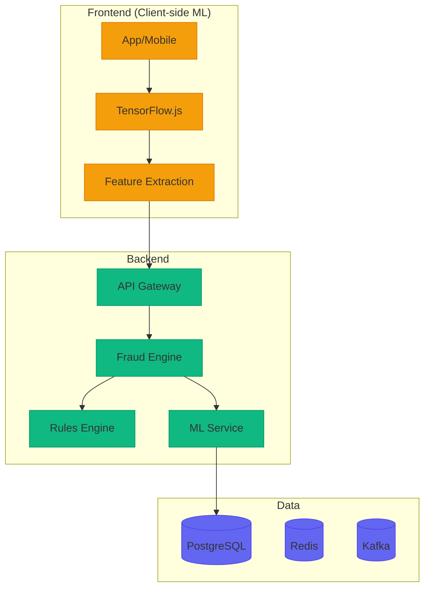

# Desafio 17: Fraud Detection ML — Detecção de Fraude em Tempo Real

**🇧🇷** Detecção de Fraude com Machine Learning  
**🇬🇧** Fraud Detection with Machine Learning

---

Fraude financeira custa **R$ 40 bilhões/ano** no Brasil. A detecção precisa ser **em tempo real** (< 100ms) e **precisa** (false positive < 1%). O desafio é equilibrar segurança com experiência do cliente legítimo.

## Switch: TensorFlow.js (Client-side) vs Go + Python (Server-side)

<LanguageToggle />

<div class="lang-content ts" style="display:block;">

### Arquitetura



### Features de Fraude

| Feature | Descrição |
|---------|-----------|
| **Velocity** | Nº transações por hora/IP/dispositivo |
| **Amount Deviation** | Valor vs média histórica |
| **Geo-Location** | Localização incompatível |
| **Device Fingerprint** | Mudança de dispositivo |
| **Time Pattern** | Transações em horários atípicos |
| **Behavioral** | Padrão de gastos do cliente |

### Client-side ML com TensorFlow.js

```typescript
import * as tf from '@tensorflow/tfjs';

export class FraudDetectorClient {
  private model: tf.LayersModel;

  async loadModel() {
    this.model = await tf.loadLayersModel('/models/fraud-detection.json');
  }

  async predict(features: FraudFeatures): Promise<FraudPrediction> {
    const inputTensor = tf.tensor2d([[
      features.velocity,
      features.amountDeviation,
      features.geoScore,
      features.deviceChange ? 1 : 0,
      features.timeAnomaly ? 1 : 0,
      features.amountRatio,
    ]]);

    const prediction = this.model.predict(inputTensor) as tf.Tensor;
    const score = (await prediction.data())[0] as number;

    inputTensor.dispose();
    prediction.dispose();

    return {
      score,
      isHighRisk: score > 0.7,
      riskLevel: score > 0.8 ? 'HIGH' : score > 0.5 ? 'MEDIUM' : 'LOW',
    };
  }
}
```

### Rules Engine

```typescript
export class FraudRulesEngine {
  private rules: FraudRule[] = [
    { name: 'VELOCITY_LIMIT', check: (f) => f.transactionsLastHour > 10, score: 30 },
    { name: 'AMOUNT_SPIKE', check: (f) => f.amountRatio > 5, score: 40 },
    { name: 'GEO_MISMATCH', check: (f) => f.geoScore < 0.3, score: 25 },
    { name: 'DEVICE_CHANGE', check: (f) => f.deviceChange, score: 20 },
    { name: 'NIGHT_OWL', check: (f) => f.timeAnomaly, score: 15 },
    { name: 'HIGH_RISK_MCC', check: (f) => f.mccRisk > 0.7, score: 35 },
  ];

  evaluate(features: FraudFeatures): RuleResult {
    const triggered = this.rules.filter(r => r.check(features));
    const totalScore = triggered.reduce((sum, r) => sum + r.score, 0);

    return {
      triggered: triggered.map(r => r.name),
      score: Math.min(totalScore, 100),
      isHighRisk: totalScore >= 50,
      reason: triggered.map(r => r.name).join(', '),
    };
  }
}
```

### Comparação: Client-side vs Server-side

| Aspecto | TensorFlow.js (Client) | Go + Python (Server) |
|---------|----------------------|---------------------|
| **Latência** | ~5ms (local) | ~50ms (rede) |
| **Modelo** | Leve (quantizado) | Pesado (completo) |
| **Precisão** | ~85% | ~95% |
| **Privacidade** | Dados não saem do device | Dados vão pro servidor |
| **Atualização** | Push de modelo | Deploy de serviço |
| **Escopo** | Features simples | Features complexas |

### Casos Reais

- **Nubank** — ML client-side + server-side
- **Stone** — Rules engine + ML híbrido
- **Mercado Pago** — Real-time scoring

</div>

<div class="lang-content go" style="display:none;">

### Arquitetura Server-side

```mermaid
graph TB
    subgraph "API"
      API[REST API]
      ENGINE[Fraud Engine]
    end

    subgraph "ML Pipeline"
      RULES[Rules Engine]
      ML_SVC[ML Service]
      TRAIN[Training Pipeline]
    end

    subgraph "Data"
      PG[(PostgreSQL)]
      REDIS[(Redis Cache)]
      KAFKA[(Kafka Events)]
    end

    API --> ENGINE
    ENGINE --> RULES
    ENGINE --> ML_SVC
    ML_SVC --> PG

    classDef api fill:#10b981,stroke:#059669;
    classDef ml fill:#6366f1,stroke:#4f46e5;
    classDef data fill:#dc2626,stroke:#b91c1c;

    class API,ENGINE api;
    class RULES,ML_SVC,TRAIN ml;
    class PG,REDIS,KAFKA data;
```

### Fraud Engine

```go
package fraud

import (
    "context"
    "time"
)

type FraudEngine struct {
    rulesEngine   *RulesEngine
    mlService     *MLService
    featureStore  *FeatureStore
    logger        *zap.Logger
}

func (e *FraudEngine) Evaluate(ctx context.Context, input FraudInput) (*FraudResult, error) {
    start := time.Now()

    // 1. Extrai features
    features, err := e.featureStore.Extract(ctx, input)
    if err != nil {
        return nil, err
    }

    // 2. Rules engine (rápido, < 1ms)
    ruleResult := e.rulesEngine.Evaluate(features)

    // 3. ML scoring (se rules passaram)
    if !ruleResult.IsHighRisk {
        mlResult, err := e.mlService.Predict(ctx, features)
        if err != nil {
            e.logger.Warn("ML prediction failed, using rules only", zap.Error(err))
        } else {
            ruleResult.Score = (ruleResult.Score + mlResult.Score) / 2
            ruleResult.IsHighRisk = mlResult.Score > 0.7
        }
    }

    e.logger.Info("Fraud evaluation",
        zap.Int("score", ruleResult.Score),
        zap.Bool("high_risk", ruleResult.IsHighRisk),
        zap.Duration("latency", time.Since(start)),
    )

    return &FraudResult{
        Score:     ruleResult.Score,
        IsHighRisk: ruleResult.IsHighRisk,
        Triggered: ruleResult.Triggered,
        Reason:    ruleResult.Reason,
    }, nil
}
```

### Rules Engine

```go
type Rule struct {
    Name  string
    Check func(features FraudFeatures) bool
    Score int
}

type RulesEngine struct {
    rules []Rule
}

func NewRulesEngine() *RulesEngine {
    return &RulesEngine{
        rules: []Rule{
            {Name: "VELOCITY_LIMIT", Check: func(f FraudFeatures) bool { return f.TransactionsLastHour > 10 }, Score: 30},
            {Name: "AMOUNT_SPIKE", Check: func(f FraudFeatures) bool { return f.AmountRatio > 5 }, Score: 40},
            {Name: "GEO_MISMATCH", Check: func(f FraudFeatures) bool { return f.GeoScore < 0.3 }, Score: 25},
            {Name: "DEVICE_CHANGE", Check: func(f FraudFeatures) bool { return f.DeviceChange }, Score: 20},
            {Name: "NIGHT_OWL", Check: func(f FraudFeatures) bool { return f.TimeAnomaly }, Score: 15},
            {Name: "HIGH_RISK_MCC", Check: func(f FraudFeatures) bool { return f.MCCRisk > 0.7 }, Score: 35},
        },
    }
}

func (e *RulesEngine) Evaluate(features FraudFeatures) RuleResult {
    var triggered []string
    totalScore := 0

    for _, rule := range e.rules {
        if rule.Check(features) {
            triggered = append(triggered, rule.Name)
            totalScore += rule.Score
        }
    }

    if totalScore > 100 { totalScore = 100 }

    return RuleResult{
        Triggered:   triggered,
        Score:       totalScore,
        IsHighRisk:  totalScore >= 50,
        Reason:      strings.Join(triggered, ", "),
    }
}
```

### Benchmark

| Operação | TS (TensorFlow.js) | Go (Server) |
|----------|-------------------|-------------|
| Prediction | ~5ms | ~2ms |
| Rules eval | ~0.5ms | ~0.1ms |
| Feature extraction | ~10ms | ~3ms |
| Throughput | ~1K/s | ~10K/s |

### Casos Reais

- **Nubank** — 80M+ clientes, ML em tempo real
- **Stone** — Rules + ML híbrido
- **Mercado Pago** — Real-time scoring

</div>

---

## Como testar

```bash
# TypeScript
pnpm dev

# Go
cd fraud-engine && go run .

# Testar predição
curl -X POST http://localhost:3017/predict \
  -H "Content-Type: application/json" \
  -d '{"amount":5000,"velocity":15,"geoScore":0.2,"deviceChange":true}'
```

---

## Lições aprendidas

1. **Rules first, ML depois** — Rules são rápidas e explicáveis
2. **Client-side ML** — Latência zero, mas modelo leve
3. **Server-side ML** — Mais preciso, mas latência de rede
4. **Feature engineering** — 80% do trabalho é nas features
5. **False positives** — Mantenha < 1% pra não irritar clientes
6. **Regras variam por merchant** — MCC, localização, volume
7. **A/B testing** — Compare modelos em produção
8. **Retraining** — Modelos ficam obsoletos, re treine mensalmente
9. **Explainability** — Por que bloqueou? Regras ajudam
10. **Escalabilidade** — Go processa 10K+ decisions/s
