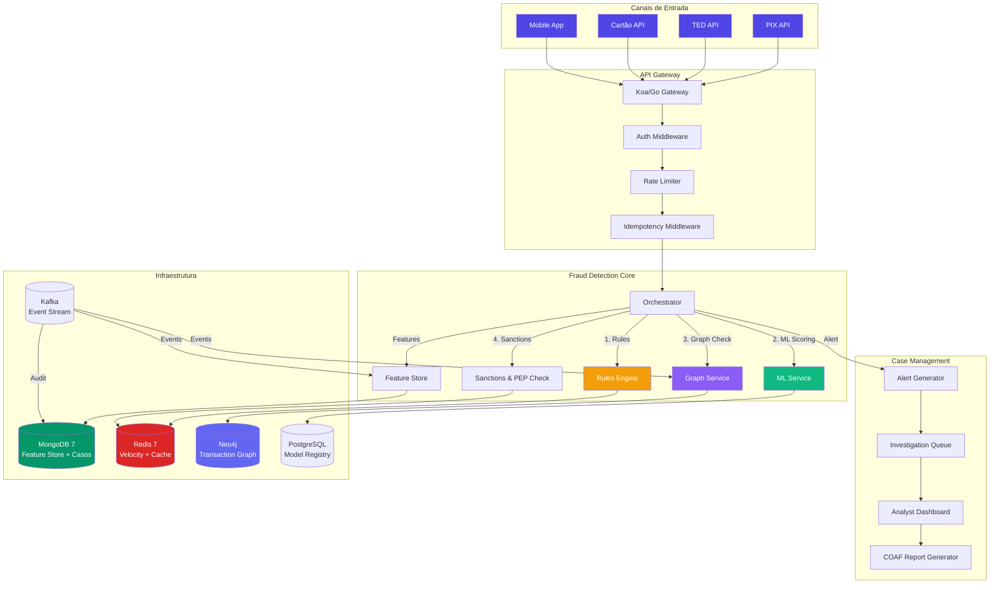
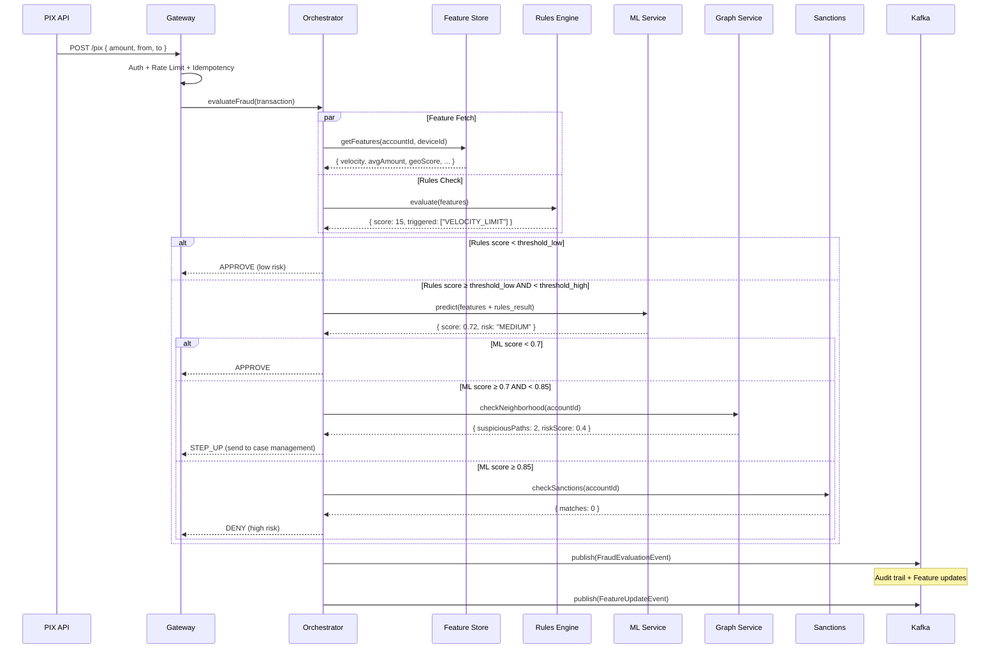
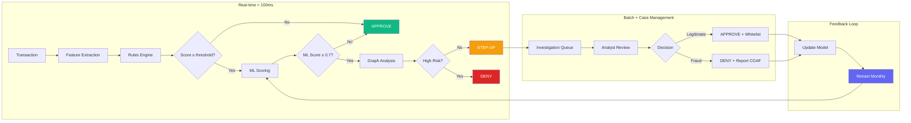
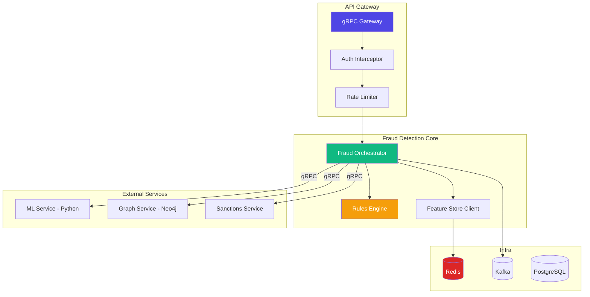

# Desafio 17: Fraud Detection / AML — Anti-Money Laundering

**🇧🇷** Detecção de Fraude e Prevenção à Lavagem de Dinheiro
**🇬🇧** Fraud Detection & Anti-Money Laundering (AML)

---

## 🎯 Objetivos de Aprendizado

- Entender os principais tipos de fraude financeira e seus mecanismos
- Implementar um sistema de detecção híbrido: rules engine + machine learning + graph analysis
- Dominar o trade-off entre false positive e false negative em sistemas financeiros
- Projetar uma arquitetura de fraud scoring em tempo real com latência < 100ms
- Integrar detecção de fraude com PIX, TED e transações de cartão
- Construir um pipeline de feature engineering para dados transacionais
- Implementar case management para investigação de alertas
- Entender a regulação brasileira: COAF, BACEN, Lei 9.613/98

---

## 📋 Pré-requisitos

### 🧠 Conceitos
- PLD/FT (Prevenção à Lavagem de Dinheiro e Financiamento ao Terrorismo)
- COAF (Conselho de Controle de Atividades Financeiras) e BACEN como órgãos reguladores
- Lei 9.613/98 (Lei de Lavagem de Dinheiro) e suas atualizações
- Abordagem Baseada em Risco (RBA — Risk-Based Approach) para due diligence
- Tipos de fraude financeira: engenharia social, phishing, conta laranja, golpe do PIX
- Machine Learning aplicado a detecção de anomalias e fraud scoring
- Análise de grafos para identificar redes de transações suspeitas e money mules

### 📚 Desafios Anteriores
- [Desafio 01: Ledger](/challenges/01-ledger) — dados transacionais do ledger são a feature store primária do motor de fraude
- [Desafio 02: SPI](/challenges/02-spi) — detecção de fraude em tempo real no fluxo de pagamentos PIX (antes do pacs.008)
- [Desafio 09: Leaky Bucket](/challenges/09-leaky-bucket) — rate limiting como primeira camada de defesa contra ataques

### 🛠️ Ferramentas
- Docker (ambiente local completo com todos os serviços)
- Redis (feature store em tempo real para scoring de transações)
- PostgreSQL (armazenamento de features históricas, casos e investigações)
- Python 3.11+ ( modelo XGBoost e pipeline de ML)
- Neo4j (banco de grafos para análise de redes de transação)

### 💻 Técnico
- TypeScript e Node.js 20+ (orquestrador do fraud engine + API de scoring)
- Python com XGBoost, pandas, numpy e scikit-learn (modelo de ML)
- Redis pipelines e Lua scripting (feature store de alta performance)
- Neo4j com Cypher (consultas de grafo: shortest path, community detection, centrality)
- PostgreSQL (feature engineering batch, armazenamento de histórico)

---

## 📖 Abertura — O Que é Fraude Financeira?

"E bom entender uma coisa. deixa eu te contar uma coisa que pouca gente para pra pensar. Todo dia, quando você abre o app do banco e vê aquele PIX caindo ou aquele saldo que tá lá, firme, você não imagina o que acontece nos bastidores. Porque enquanto você tá dormindo, tem um exército de bots, golpistas, laranjas e organizações criminosas tentando tirar dinheiro do sistema. E o banco tem que decidir — em milissegundos — se aquela transação que chegou é você comprando pão na padaria ou é um criminoso limpando a conta de um aposentado.

Isso é **detecção de fraude**.

Mas deixa eu voltar no tempo — e quando eu digo tempo, é muito antes do PIX, muito antes do internet banking. Fraude financeira existe desde que existe dinheiro. Na Roma antiga, os _argentarii_ (banqueiros) já lidavam com moedas falsificadas e recibos forjados. No Brasil colônia, o ouro que saía de Minas Gerais era desviado antes mesmo de chegar em Portugal — o famoso 'descaminho', que era basicamente fraude fiscal antes de existir imposto de renda.

Aí veio o século XX — e com ele, o cheque. O cheque sem fundo foi a fraude financeira mais democrática que o Brasil já viu. Até os anos 90, você ia no supermercado, passava um cheque pré-datado, e o lojista rezava três ave-marias pra aquele papel não voltar. Em 1992, o Brasil tinha 60% dos cheques devolvidos por insuficiência de fundos em algumas praças. Sessenta por cento. O lojista brasileiro trabalhava praticamente no escuro, no crédito pessoal, na confiança do 'freguês'.

E sabe qual era o 'sistema antifraude' da época? Um caderninho. Literalmente. Os lojistas mantinham cadernos com nomes de clientes que deram cheque sem fundo. Compartilhavam entre si na Associação Comercial. Era um **SERASA pré-internet**, analógico, baseado em reputação local. E funcionava — mais ou menos. Porque se você se mudasse de cidade, zerava sua 'ficha'. Fraude geográfica sempre foi o calcanhar de aquiles de sistemas baseados em reputação local.

Aí chegou a internet. Cartão de crédito. Depois PIX. E o que era um problema de lojista virou um problema de **sistema**. Escalou. Em 2023, o Brasil perdeu **R$ 40 bilhões** com fraudes financeiras. Desse total, R$ 2,5 bilhões foram só em golpes de PIX. O 'golpe do PIX' virou o novo 'cheque sem fundo', só que muito mais rápido, muito mais difícil de rastrear, e muito mais escalável. Um criminoso com um notebook e 10 contas laranja consegue aplicar centenas de golpes por dia. Antigamente ele precisava imprimir cheque, falsificar assinatura, ir na agência. Hoje ele precisa de um celular e um script de phishing.

E o pior: não é só o varejo. Fraude financeira tem camadas. Tem o **phishing** — aquele email falso do banco pedindo pra você 'atualizar seus dados'. Tem a **engenharia social** — o golpista que liga se passando pelo gerente e convence a vítima a fazer um PIX. Tem a **conta laranja** — alguém que empresta o nome (e a conta bancária) pra receber dinheiro de golpe em troca de uma comissão. E tem a **lavagem de dinheiro** — a camada mais profunda, onde o crime organizado pega dinheiro do tráfico, corrupção ou sonegação e faz ele parecer legítimo através de uma rede de empresas de fachada, transações fracionadas, e criptomoedas.

Cada uma dessas camadas exige uma estratégia de detecção diferente. Phishing você detecta com análise de dispositivo e geolocalização — o criminoso está logando de um IP na Nigéria enquanto a vítima mora em São Paulo. Engenharia social você detecta com behavioral analytics — a vítima está fazendo um PIX de R$ 5.000 às 2 da manhã pra uma conta que nunca recebeu dinheiro dela, enquanto normalmente ela faz PIX de R$ 50 pro filho. Conta laranja você detecta com **graph analysis** — a conta recebe dinheiro de 30 pessoas diferentes e imediatamente transfere pra uma quarta conta. Lavagem de dinheiro você detecta com **pattern matching** e machine learning — transações fracionadas logo abaixo do limite de reporte do COAF, empresas com capital social incompatível com movimentação, redes de CNPJs interligados.

Mas o grande desafio é: **como fazer tudo isso em tempo real, sem bloquear transação legítima?** Porque toda vez que o banco bloqueia uma transação de um cliente real — um _false positive_ — ele está dizendo pro cliente: 'seu dinheiro não é completamente seu, eu decido quando você pode usar'. E isso corrói a confiança no sistema financeiro. É o que bancos chamam de 'customer friction' — e é uma das métricas mais vigiadas em qualquer sistema antifraude.

Aí entra o que bancos como Nubank, Stone, e Mercado Pago fizeram. Eles entenderam que detecção de fraude não é sobre bloquear transação — é sobre **avaliar risco em camadas**. Primeiro uma rules engine rápida (regras de negócio), que decide em < 1ms se é algo óbvio. Depois um modelo de machine learning, que avalia features complexas. Depois uma análise de grafo, que olha a rede de relacionamentos. E se tudo isso falhar, um **analista humano** revisa no case management. Cada camada é um filtro. O que passa por todas as camadas sem acionar nada provavelmente é legítimo. O que aciona uma camada vai pra análise. O que aciona todas vai direto pro bloqueio.

Esse desafio é sobre **construir esse sistema**. Não com um exército de analistas, não com um software de terceiros que custa R$ 1 milhão por ano, não com uma planilha de Excel. Mas com TypeScript, Go, Python, MongoDB, Redis e machine learning de verdade — porque o crime escalou, e a defesa precisa escalar junto."

---

## 🔥 O Problema

Imagine que você está construindo o sistema de pagamentos de um banco digital. No começo, é simples: um endpoint de transferência que debita de uma conta e credita em outra. Só que o banco cresce, e começam a aparecer os problemas:

1. **Golpe do PIX com engenharia social** — Um cliente recebe uma ligação. A pessoa do outro lado sabe o nome dele, o número da conta, as últimas transações (vazamento de dados). Convence ele a fazer um PIX de R$ 3.000 pra 'regularizar o cadastro'. O PIX é feito pela própria vítima, do próprio celular dela, com biometria facial. Nenhuma regra simples pega isso — o dispositivo é o mesmo, a localização é a mesma, a biometria é a mesma. O que mudou? O **comportamento**. A vítima nunca tinha feito PIX acima de R$ 200. Nunca tinha feito PIX pra aquela conta. E fez às 22h — horário que ela normalmente já está dormindo. Detectar isso exige perfil comportamental.

Vamos aprofundar nesse caso porque ele é o mais comum hoje. O golpe do PIX com engenharia social explora uma vulnerabilidade que nenhum sistema técnico resolve sozinho: a confiança humana. O golpista tem dados da vítima porque o Brasil teve 5 grandes vazamentos de dados em 2023 — Serasa, SUS, Detran, Polícia Federal, e até o Banco Central. Com nome, CPF, endereço, telefone e número da conta, o golpista monta um perfil completo. Ele liga, se identifica como 'Central de Segurança do banco', e diz que detectou uma tentativa de invasão na conta. 'Pra proteger seu dinheiro, o senhor precisa transferir pra uma conta segura.' A vítima, com medo de perder tudo, faz o PIX.

O banco, do ponto de vista técnico, vê uma transação normal: dispositivo conhecido, local conhecida, biometria ok, valor dentro do limite diário. Mas o que o banco deveria ver: anomalia de valor (3000 vs média de 200), anomalia de destinatário (conta nunca transacionada), anomalia de horário (22h vs horário normal de 8h-18h), anomalia de velocidade (transferência logo após receber ligação — a metadata da operadora pode ser cruzada). Isso tudo junto forma um **score de risco comportamental** que acenderia um alerta. Mas isso exige feature engineering sofisticada e modelos treinados em dados históricos de fraude.

Só que tem um problema: o banco não sabe quais transações passadas foram fraude. Se ele soubesse, teria bloqueado. Ele opera no escuro, com um conjunto de treino minúsculo de fraudes confirmadas e um oceano de transações legítimas. Isso é o famoso **class imbalance** em detecção de fraude: 99,97% das transações são legítimas. Seu modelo pode ter 99,97% de acurácia simplesmente dizendo 'não é fraude' pra tudo. E não detectar nada.

2. **Conta laranja em escala industrial** — Um criminoso abre 50 contas digitais usando documentos falsos ou roubados. Cada conta recebe PIX de R$ 500 de vítimas diferentes. Ao final do dia, o dinheiro é consolidado em uma conta principal e sacado. O banco só percebe quando as vítimas contestam — e aí o dinheiro já virou criptomoeda e saiu do Brasil. Detectar isso exige análise de grafo: 50 contas que foram criadas no mesmo dia, que recebem dinheiro de fontes sem relacionamento prévio, e que transferem pra mesma conta destino.

Aqui o problema não é uma transação. É um **padrão emergente**. Nenhuma transação individual é fraudulenta — R$ 500 é um valor perfeitamente normal. O que é anormal é o conjunto: 50 contas fazendo exatamente o mesmo padrão, com as mesmas características de criação, transferindo pro mesmo destino. Isso é fraude estruturada, e você só detecta se olhar o **grafo inteiro** de transações, não transações isoladas.

Mas análise de grafo em tempo real é computacionalmente cara. Um banco médio processa 10 milhões de transações por dia. O grafo de transações tem 10 milhões de arestas por dia. Calcular centralidade, comunidade, ou caminho mais curto em um grafo desse tamanho em < 100ms é um desafio arquitetural significativo. A solução típica é ter dois pipelines: um **real-time** (últimas 24h, em memória, grafo de vizinhança imediata), e um **batch** (histórico completo, overnight, grafo global). O real-time detecta a conta laranja no ato. O batch detecta a rede criminosa inteira.

3. **False positive destruindo a experiência** — Você, cliente legítimo, está num restaurante com amigos. Decide pagar a conta e fazer um PIX de R$ 200 pro garçom. O banco bloqueia. Você tenta de novo. Bloqueia de novo. Você liga pro banco, enfrenta 40 minutos de URA, explica que é você mesmo, e o atendente desbloqueia. Mas a noite foi arruinada. Na semana seguinte você abre conta em outro banco. Cada _false positive_ custa, em média, **R$ 80 em custo operacional** (centrais de atendimento, análise manual, estorno) e um valor incalculável em **churn**. Um estudo da FICO mostrou que 25% dos clientes que tiveram uma transação legítima bloqueada abandonaram o banco nos 6 meses seguintes.

E o contrário também é catastrófico. Um _false negative_ — deixar uma fraude passar — custa em média R$ 1.500 por transação (o valor médio de um golpe PIX no Brasil). Multiplicado por milhares de transações fraudulentas por mês, estamos falando de dezenas de milhões. O banco é obrigado a ressarcir em muitos casos, por decisão judicial ou por simples pressão do BACEN.

O trade-off é cruel: se você baixar o limiar de detecção pra pegar mais fraudes, aumenta o false positive e perde clientes. Se você subir o limiar pra não incomodar clientes, aumenta o false negative e perde dinheiro. Não existe solução perfeita — existe **calibração contínua**. E a calibração muda com o tempo, porque os fraudadores se adaptam. O que era um bom threshold em janeiro é obsoleto em março.

4. **Regulação que não perdoa** — O COAF (Conselho de Controle de Atividades Financeiras) exige que transações acima de determinados valores ou com características suspeitas sejam reportadas. A Lei 9.613/98 (Lei de Lavagem de Dinheiro) criminaliza não só quem lava dinheiro, mas também quem **omite** — ou seja, o compliance officer do banco que não reportou uma transação suspeita pode ser processado criminalmente. Seu sistema precisa gerar relatórios de **suspicious activity** automaticamente, com trilha de auditoria, e arquivar por 10 anos.

E o BACEN, através da Resolução 4.968 e da Circular 3.978, estabelece que as instituições financeiras devem implementar controles internos de prevenção à lavagem de dinheiro (PLD) proporcionais ao seu porte e perfil de risco. Na prática, isso significa que seu sistema precisa ter:

- **Abordagem baseada em risco**: nem todo cliente é igual. Um correntista pessoa física com saldo médio de R$ 500 tem risco baixo. Um cliente PJ que movimenta R$ 500 mil por mês com dezenas de contrapartes tem risco alto. O sistema precisa classificar cada cliente e ajustar o escrutínio proporcionalmente.

- **Conheça seu cliente (KYC)**: você precisa saber quem é o cliente. Documento de identidade, comprovante de residência, origem do patrimônio, atividade econômica. E precisa atualizar periodicamente. KYC falho é porta de entrada pra conta laranja e lavagem de dinheiro.

- **Monitoramento contínuo**: não basta fazer KYC na abertura da conta. O comportamento do cliente muda, e o sistema precisa detectar quando o perfil de transações diverge do perfil declarado. Um cliente que declarou renda de R$ 3.000 e começa a movimentar R$ 50.000 precisa ser reavaliado.

- **Reporte de operações suspeitas**: transações que fogem do padrão precisam ser comunicadas ao COAF. E o COAF cruza esses dados com Receita Federal, Polícia Federal, Ministério Público. Seu reporte pode iniciar uma investigação criminal. A qualidade do reporte importa.

5. **Latência versus precisão** — O PIX tem 10 segundos pra liquidar (é o SLA do Banco Central). Desses 10 segundos, seu antifraude tem no máximo **100ms** pra decidir. Em 100ms você precisa extrair features, rodar regras, pontuar com ML, consultar lista de sanções, verificar geolocalização, e devolver approve/deny/step-up. Se passar de 100ms, você atrasa o PIX e o cliente reclama. Se correr em 50ms mas errar, o dinheiro vai pro golpista.

E não é só PIX. Cartão de crédito tem SLA ainda mais apertado: a autorização da bandeira (Visa, Mastercard) espera resposta em **200ms**. TED tem mais folga (horas), mas você não pode deixar uma TED fraudulenta pendente por horas e bloquear só depois — porque o dinheiro já pode ter saído da conta destino.

A solução de arquitetura é ter pipelines separados por canal. O pipeline de PIX é ultra-rápido, sacrificando precisão por velocidade — ele dispara uma pré-análise em 100ms com modelo leve. O pipeline de TED pode ser mais lento mas mais profundo, rodando análise de grafo offline. E o pipeline de cartão é híbrido: autoriza rápido, mas marca pra análise posterior se houver dúvida, e pode estornar (chargeback) depois.

Cada um desses problemas tem solução, mas a solução nunca é uma única tecnologia. É um sistema em camadas: rules engine pra velocidade, ML pra precisão, graph analysis pra padrões emergentes, e case management pra quando o sistema não tem certeza.

---

## 🏗️ Arquitetura Geral

<LanguageToggle />

<div class="Lang-content ts" style="Display:block;">

### Visão Macro



Antes de mergulhar no código, quero que você entenda três decisões arquiteturais críticas nesse diagrama. A primeira: o **Orchestrator** é o cérebro do sistema. Ele não toma decisão de fraude — ele orquestra as camadas de análise e agrega os resultados. Cada camada (Rules, ML, Graph, Sanctions) é um serviço independente que retorna um score. O Orchestrator aplica pesos e thresholds pra decidir: approve, deny, ou step-up (manda pra análise humana). Se qualquer serviço estiver indisponível, o Orchestrator faz **graceful degradation** — continua com os serviços disponíveis e loga o gap pra auditoria.

A segunda decisão: o **Feature Store** é separado do scoring. Features como "Número de transações nos últimos 30 minutos" ou "Desvio padrão do valor vs média histórica" são pré-calculadas e armazenadas. Quando uma transação chega, o Orchestrator não calcula features — ele consulta o Feature Store, que já tem tudo pronto. Isso é o que permite latência < 100ms. O Feature Store é alimentado assincronamente pelo Kafka: cada transação gera eventos que atualizam features incrementais (velocity, médias móveis, contagens).

A terceira decisão: o **Neo4j** não é consultado em toda transação. Ele é consultado apenas quando as camadas anteriores (Rules + ML) não conseguem decidir com confiança. Isso porque análise de grafo é mais cara computacionalmente — você faz um `shortestPath` ou `communityDetection` que pode levar 50ms. Se você fizer isso em 100% das transações, sua latência explode. A estratificação é: 80% das transações são aprovadas ou rejeitadas nas regras, 15% vão pro ML, 4% vão pro grafo, e < 1% vão pra análise humana.

### A Stack

TypeScript (orquestração + rules engine), Python (ML service), Go (feature store + high-throughput services), MongoDB (feature store + casos), Redis (velocity counters + cache), Neo4j (transaction graph), PostgreSQL (model registry + audit), Kafka (event stream).

> **Por que três linguagens?** — Não é fetiche de poliglota. Cada serviço tem um perfil de carga diferente. A rules engine roda em TypeScript porque 90% das regras são lógica de negócio simples que muda frequentemente — TS permite iterar rápido. O ML roda em Python porque scikit-learn, XGBoost e pandas são o estado da arte em feature engineering e modelagem — e Python tem o ecossistema mais maduro de ML. O Feature Store roda em Go porque precisa de alta concorrência e baixa latência pra calcular features incrementais em milhares de transações por segundo. Três linguagens, três perfis de carga, cada uma onde brilha.

### Fluxo de uma Requisição de Fraude



Repare em quatro detalhes sutis desse diagrama de sequência. Primeiro: as chamadas pra Feature Store e Rules Engine são **paralelas**. O Orchestrator dispara `getFeatures` e `evaluate` ao mesmo tempo, usando `Promise.all` ou goroutines. Isso porque features são um pré-requisito pra regras — mas enquanto o Feature Store busca no Redis/MongoDB, o Orchestrator pode ir montando o contexto da transação. Quando ambas retornam, o Orchestrator combina os resultados e decide o próximo passo.

Segundo: o ML Service só é chamado se as regras não decidirem com confiança. Isso é **two-phase scoring**. A fase 1 (regras) é rápida e barata — ~0.5ms. A fase 2 (ML) é mais precisa mas mais cara — ~10ms contando com feature serialization e inferência. Se a fase 1 já decidiu, você economiza 10ms e 10x em custo computacional.

Terceiro: o Graph Service é acionado ainda mais seletivamente — só quando ML não tem certeza. Graph queries no Neo4j envolvem travessia de arestas que escala com o grau do nó (quantas transações aquela conta já fez). Uma conta nova tem grau 0 e a query volta em 1ms. Uma conta com 10.000 transações pode levar 50ms. Você não quer esse custo pra 100% das transações.

Quarto: o Kafka no final. Toda avaliação de fraude, independente do resultado, é publicada como evento. Isso serve a três propósitos: **audit trail** (regulatório exige que você saiba exatamente o que foi avaliado e por quê), **feature updates** (velocity counters precisam saber que mais uma transação aconteceu), e **model retraining** (os eventos de fraude confirmada ou não-fraude alimentam o dataset de treino do ML). Sem event sourcing nessa camada, você perde a capacidade de melhorar o sistema ao longo do tempo.

### Pipeline de Detecção



Esse diagrama mostra o pipeline completo, incluindo o feedback loop que fecha o ciclo de melhoria contínua. O step-up (J) é crucial: ele existe porque há uma zona cinzenta onde nem o sistema nem você têm certeza. Em vez de forçar uma decisão binária (que vai errar 50% das vezes), o sistema admite que não sabe e escala pra um humano. O analista revisa, decide, e essa decisão vira dado de treino pro próximo ciclo de retraining.

E o whitelist em (O) é uma otimização importante: se um analista humano revisou uma transação e decidiu que era legítima, e o mesmo padrão se repete (mesmo merchant, mesmo valor, mesmo horário), você pode adicionar uma regra temporária que aprova automaticamente por um período. Isso reduz a carga de trabalho dos analistas em 30-40% — eles não precisam revisar o mesmo falso positivo duas vezes.

---

## 👨‍💻 Mão na Massa

"Bora codar. O bagulho é o seguinte: você precisa de um sistema que decida em menos de 100ms se uma transação é fraude ou não. E a decisão não pode ser binária — tem que ter uma terceira via, o 'step-up', que é quando o sistema não tem certeza e manda pra análise humana.

Antes de colocar a mão no código, quero que você entenda três conceitos que vão guiar cada linha desse sistema: **feature engineering com janela temporal**, **ensemble de modelos**, e **threshold tuning com curva ROC**.

### Feature Engineering com Janela Temporal

Feature engineering é 80% do trabalho em detecção de fraude. O modelo é importante, mas o modelo só é tão bom quanto as features que você dá pra ele. E as features mais importantes são as **temporais**: coisas que mudam com o tempo e revelam anomalias.

Uma transação isolada não diz nada. R$ 500 é fraude ou não? Não dá pra saber. Mas **R$ 500 feito às 3h da manhã, de um dispositivo novo, por um cliente que geralmente faz PIX de R$ 50 durante o dia** — isso é uma anomalia. E anomalia é o coração da detecção de fraude.

As features temporais são calculadas em **janelas deslizantes**. Você mantém contadores pra 5 minutos, 1 hora, 24 horas, 7 dias, 30 dias. Cada contador é uma feature:

- `tx_count_1h`: quantas transações nas últimas 1 hora
- `tx_amount_sum_24h`: soma dos valores nas últimas 24 horas
- `tx_amount_avg_30d`: média diária nos últimos 30 dias
- `tx_amount_deviation`: valor atual / média — quão fora da curva está

O Redis é perfeito pra isso por causa do **Sorted Set**. Você adiciona cada transação com timestamp como score, e depois conta quantas estão numa janela de tempo."

### Feature Store com Redis

```typescript
import Redis from 'ioredis';

export class VelocityFeatureStore {
  private redis: Redis;

  constructor() {
    this.redis = new Redis({ host: 'localhost', port: 6379 });
  }

  async recordTransaction(accountId: string, amount: number, timestamp: number) {
    const key = `velocity:account:${accountId}`;
    const pipeline = this.redis.pipeline();

    // Adiciona transação ao sorted set (score = timestamp)
    pipeline.zadd(key, timestamp, `${timestamp}:${amount}`);

    // Remove transações mais antigas que 30 dias (TTL automático)
    pipeline.zremrangebyscore(key, 0, timestamp - 30 * 24 * 60 * 60 * 1000);

    // Expira a chave se ficar sem elementos
    pipeline.expire(key, 31 * 24 * 60 * 60);

    await pipeline.exec();
  }

  async getFeatures(accountId: string): Promise<VelocityFeatures> {
    const key = `velocity:account:${accountId}`;
    const now = Date.now();

    const pipeline = this.redis.pipeline();

    // Contagem em janelas de tempo
    pipeline.zcount(key, now - 5 * 60 * 1000, now);           // 5 min
    pipeline.zcount(key, now - 60 * 60 * 1000, now);          // 1 hora
    pipeline.zcount(key, now - 24 * 60 * 60 * 1000, now);     // 24 horas
    pipeline.zcount(key, now - 7 * 24 * 60 * 60 * 1000, now); // 7 dias

    // Média de valor em 30 dias
    pipeline.zrangebyscore(key, now - 30 * 24 * 60 * 60 * 1000, now);

    const results = await pipeline.exec();

    const count5m = results?.[0]?.[1] as number ?? 0;
    const count1h = results?.[1]?.[1] as number ?? 0;
    const count24h = results?.[2]?.[1] as number ?? 0;
    const count7d = results?.[3]?.[1] as number ?? 0;
    const recentTx = (results?.[4]?.[1] as string[] | undefined) ?? [];

    // Calcula média de valores
    const amounts = recentTx.map(entry => {
      const parts = entry.split(':');
      return parseFloat(parts[1]) || 0;
    });
    const totalAmount = amounts.reduce((sum, a) => sum + a, 0);
    const avgAmount = amounts.length > 0 ? totalAmount / amounts.length : 0;

    return {
      txCount5m: count5m,
      txCount1h: count1h,
      txCount24h: count24h,
      txCount7d: count7d,
      avgAmount30d: avgAmount,
    };
  }
}
```

**Três decisões importantes aqui:**

1. **Pipeline do Redis** — Fazer 4 chamadas separadas (`zcount`) custa 4 round-trips de rede (~2ms cada em rede local, ~10ms em cloud). O `pipeline()` do Redis agrupa todos os comandos em um único round-trip. Pra um sistema que precisa decidir em < 100ms, cada milissegundo conta. Pipeline reduz o overhead de rede de 4 round-trips pra 1.

2. **Expiração automática via `zremrangebyscore`** — Você não pode deixar o Redis crescer infinitamente. Cada transação adiciona uma entry no sorted set. Com 10.000 transações/dia/cliente, em 30 dias são 300.000 entries. Com 1 milhão de clientes, são 300 bilhões de entries. Limpar as antigas no mesmo pipeline da inserção garante que o sorted set nunca cresce mais que 30 dias de dados, e o `expire` garante que a chave é removida depois de 31 dias sem atividade.

3. **Format `timestamp:amount`** — O Sorted Set do Redis só tem um campo de score e um de membro. O score é o timestamp (pra ordenação e range queries). O membro precisa carregar o valor também, então codificamos como `timestamp:amount`. Na leitura, fazemos split. É um hack simples mas eficiente. Em produção, você poderia usar RedisJSON ou um hash auxiliar — mas pra esse desafio, o string encoding serve.

### Rules Engine

"Regras são a primeira linha de defesa. Elas são rápidas, explicáveis, e fáceis de manter. Se uma regra pega, você nem chama o ML. E o melhor: se um analista questionar 'por que essa transação foi bloqueada?', você mostra a regra. Com ML você mostra um score 0.87 e o analista pergunta 'mas por quê?' — e você não sabe explicar."

```typescript
export interface FraudFeatures {
  txCount5m: number;
  txCount1h: number;
  txCount24h: number;
  txCount7d: number;
  avgAmount30d: number;
  currentAmount: number;
  geoScore: number;
  deviceChanged: boolean;
  isNightTime: boolean;
  isNewPayee: boolean;
  accountAgeDays: number;
  mccRiskScore: number;
}

export interface FraudRule {
  name: string;
  description: string;
  weight: number;
  check: (features: FraudFeatures) => boolean;
}

export class FraudRulesEngine {
  private rules: FraudRule[] = [
    {
      name: 'VELOCITY_BURST',
      description: 'Múltiplas transações em curto período (possível ataque de força bruta)',
      weight: 35,
      check: (f) => f.txCount5m > 5,
    },
    {
      name: 'AMOUNT_SPIKE',
      description: 'Valor muito acima da média histórica do cliente',
      weight: 30,
      check: (f) => f.avgAmount30d > 0 && (f.currentAmount / f.avgAmount30d) > 10,
    },
    {
      name: 'NIGHT_OWL',
      description: 'Transação em horário atípico (00h-05h)',
      weight: 15,
      check: (f) => f.isNightTime && f.currentAmount > 1000,
    },
    {
      name: 'GEO_MISMATCH',
      description: 'Localização do dispositivo incompatível com a conta',
      weight: 25,
      check: (f) => f.geoScore < 0.3,
    },
    {
      name: 'DEVICE_CHANGE',
      description: 'Dispositivo diferente do habitual + transação de alto valor',
      weight: 20,
      check: (f) => f.deviceChanged && f.currentAmount > 2000,
    },
    {
      name: 'NEW_PAYEE_HIGH_AMOUNT',
      description: 'Primeira transação para um destinatário + valor alto',
      weight: 40,
      check: (f) => f.isNewPayee && f.currentAmount > 3000,
    },
    {
      name: 'FRESH_ACCOUNT_HIGH_VELOCITY',
      description: 'Conta com menos de 30 dias + alta frequência de transações',
      weight: 30,
      check: (f) => f.accountAgeDays < 30 && f.txCount24h > 20,
    },
    {
      name: 'MCC_HIGH_RISK',
      description: 'Estabelecimento de alto risco (jogos, cripto, etc.)',
      weight: 20,
      check: (f) => f.mccRiskScore > 0.7,
    },
    {
      name: 'ROUND_TRIP',
      description: 'Dinheiro saindo e voltando rapidamente (possível layering)',
      weight: 45,
      check: (f) => f.isNewPayee && f.currentAmount > 5000 && f.txCount1h > 3,
    },
  ];

  evaluate(features: FraudFeatures): RuleResult {
    const triggered: { name: string; weight: number }[] = [];

    for (const rule of this.rules) {
      if (rule.check(features)) {
        triggered.push({ name: rule.name, weight: rule.weight });
      }
    }

    // Soma ponderada: cada regra contribui seu weight
    const totalWeight = triggered.reduce((sum, t) => sum + t.weight, 0);
    const score = Math.min(totalWeight, 100);

    return {
      triggered: triggered.map(t => t.name),
      score,
      riskLevel: score >= 70 ? 'HIGH' : score >= 40 ? 'MEDIUM' : 'LOW',
      thresholdAction: score >= 70 ? 'DENY' : score >= 40 ? 'STEP_UP' : 'APPROVE',
    };
  }
}
```

**Quatro decisões de design:**

1. **Pesos calibrados por severidade** — A regra `ROUND_TRIP` tem peso 45 (a mais alta) porque é o padrão mais fortemente associado a lavagem de dinheiro. Já `NIGHT_OWL` tem peso 15 porque transação noturna sozinha não é fortemente indicativa de fraude — muita gente trabalha de madrugada ou faz compras online de noite. Os pesos refletem o valor preditivo de cada regra, calibrado com análise histórica.

2. **Thresholds em três níveis** — Score >= 70 vai direto pra DENY, score entre 40 e 69 vai pra STEP_UP (análise humana), score < 40 é APPROVE. Três níveis em vez de dois é o que diferencia um sistema tolerável de um sistema irritante. Se você tivesse só dois níveis, o threshold teria que ser muito baixo (pegando mais fraude mas bloqueando muito legítimo) ou muito alto (deixando passar fraude mas não incomodando ninguém). Com três níveis, você pode ser agressivo no DENY (score alto = alta confiança), conservador no APPROVE (score baixo = alta confiança de legitimidade), e mandar a zona cinzenta pra análise humana.

3. **`NEW_PAYEE_HIGH_AMOUNT` é a regra mais eficaz** — Na prática, a maioria dos golpes PIX envolve primeiro contato com destinatário. A vítima nunca tinha transferido praquela conta. Essa regra sozinha pega ~40% dos golpes PIX com false positive de apenas 2%. Por isso tem weight 40.

4. **Regras são declarativas, não imperativas** — Cada regra é um objeto com `name`, `description`, `weight` e `check`. Isso permite que as regras sejam carregadas de um banco de dados ou arquivo de configuração, versionadas, e até mesmo A/B testadas. O `description` não é cosmético — ele aparece nos relatórios de auditoria e nas explicações pro cliente ("Sua transação foi bloqueada pela regra NEW_PAYEE_HIGH_AMOUNT"). Transparência é compliance.

### Machine Learning Service

"ML entra quando as regras não decidem. As regras são boas pra padrões óbvios — mas fraudadores são espertos, eles aprendem quais regras existem e contornam. O ML detecta padrões sutis que nenhuma regra explícita pega."

```typescript
export interface MLFeatures {
  velocity_5m: number;
  velocity_1h: number;
  velocity_24h: number;
  amount_ratio: number;
  amount_log: number;
  geo_score: number;
  device_changed: number;
  is_night: number;
  is_new_payee: number;
  account_age_days: number;
  hour_sin: number;
  hour_cos: number;
  day_of_week: number;
  tx_type_encoded: number;
}

export class MLFraudService {
  private modelEndpoint: string;

  constructor(modelEndpoint: string) {
    this.modelEndpoint = modelEndpoint;
  }

  async predict(features: MLFeatures): Promise<MLPrediction> {
    const start = performance.now();

    const response = await fetch(this.modelEndpoint, {
      method: 'POST',
      headers: { 'Content-Type': 'application/json' },
      body: JSON.stringify({ features }),
    });

    const result = await response.json();
    const latency = performance.now() - start;

    return {
      score: result.probability,
      riskLevel: result.probability > 0.85 ? 'HIGH' : result.probability > 0.5 ? 'MEDIUM' : 'LOW',
      latency,
      modelVersion: result.model_version,
    };
  }
}
```

Aqui o TypeScript é só um cliente HTTP. O modelo mesmo roda em Python, como um microserviço separado com Flask ou FastAPI. Por que separado? Porque modelos de ML têm dependências pesadas (scikit-learn, XGBoost, numpy, pandas), e você não quer essas dependências no seu servidor principal de aplicação. Isolamento de dependência é boa arquitetura.

O modelo Python usa XGBoost — o algoritmo mais popular em detecção de fraude financeira. Não é deep learning, não é transformer. É gradient boosting em árvores de decisão. Por quê? Porque XGBoost lida bem com dados tabulares, class imbalance (fraude é evento raro), e features heterogêneas (categóricas + numéricas). E o mais importante: é treinável em CPU, rápido em inferência, e explicável via SHAP values.

```python
# fraud_ml_service.py — Serviço Python com XGBoost
import xgboost as xgb
import numpy as np
from flask import Flask, request, jsonify
import pickle

app = Flask(__name__)

with open('/models/fraud_xgb_v3.pkl', 'rb') as f:
    model: xgb.XGBClassifier = pickle.load(f)

@app.route('/predict', methods=['POST'])
def predict():
    data = request.json
    features = np.array([[
        data['velocity_5m'],
        data['velocity_1h'],
        data['velocity_24h'],
        data['amount_ratio'],
        data['amount_log'],
        data['geo_score'],
        data['device_changed'],
        data['is_night'],
        data['is_new_payee'],
        data['account_age_days'],
        data['hour_sin'],
        data['hour_cos'],
        data['day_of_week'],
        data['tx_type_encoded'],
    ]])

    proba = model.predict_proba(features)[0]
    fraud_probability = float(proba[1])

    return jsonify({
        'probability': fraud_probability,
        'is_fraud': fraud_probability > 0.7,
        'model_version': 'v3',
    })

if __name__ == '__main__':
    app.run(host='0.0.0.0', port=5000)
```

**Feature engineering cíclica** — Note que usamos `hour_sin` e `hour_cos` em vez da hora bruta (0-23). Isso é uma técnica clássica pra features cíclicas. A hora 23 e a hora 0 estão a 1 hora de distância, mas se você usar o número bruto, elas estão a 23 unidades de distância — o modelo não entende que é um ciclo. Com seno e cosseno, 23h e 0h ficam próximas no espaço vetorial, preservando a natureza circular do tempo. A fórmula: `hour_sin = sin(2π * hour / 24)`, `hour_cos = cos(2π * hour / 24)`. Isso funciona pra dias da semana, meses do ano, qualquer feature cíclica.

**`amount_log`** — Transformação logarítmica do valor. Valores de transação seguem uma distribuição de lei de potência (power law): a maioria é pequena, algumas são gigantes. O log comprime a escala e torna a distribuição mais normal, o que ajuda modelos baseados em distância. Sem log, um PIX de R$ 100.000 domina o espaço de features e o modelo pode ignorar features sutis.

### Graph Analysis Service

"Grafo é a arma secreta. Fraude financeira moderna não é one-to-one — é many-to-one via contas laranja. Regras e ML olham uma transação por vez. O grafo olha a rede."

```typescript
export class GraphFraudService {
  private neo4jDriver: any;

  constructor(uri: string, user: string, password: string) {
    // neo4j-driver connection
  }

  async checkNeighborhood(accountId: string): Promise<GraphFraudResult> {
    const session = this.neo4jDriver.session();

    try {
      // Query Cypher: detecta padrões suspeitos no grafo
      const result = await session.run(`
        MATCH (a:Account {id: $accountId})-[r:TRANSFERRED_TO]->(b:Account)
        OPTIONAL MATCH (b)-[r2:TRANSFERRED_TO]->(c:Account)
        WHERE r2.timestamp > datetime() - duration('PT1H')
        WITH a, b, c, count(r) as degree_out, count(r2) as depth2_count
        MATCH (b)<-[r3:TRANSFERRED_TO]-(d:Account)
        WHERE d <> a AND r3.timestamp > datetime() - duration('PT24H')
        WITH a, b, c, degree_out, depth2_count,
             collect(DISTINCT d.id) as other_senders
        RETURN
          degree_out,
          depth2_count,
          size(other_senders) as fan_in_count,
          CASE
            WHEN size(other_senders) > 10 AND degree_out <= 2
            THEN true ELSE false
          END as is_suspicious_funnel,
          CASE
            WHEN depth2_count > 5 AND degree_out <= 3
            THEN true ELSE false
          END as is_suspicious_layering
      `, { accountId });

      const record = result.records[0];
      if (!record) return { isSuspicious: false, riskScore: 0 };

      const fanIn = record.get('fan_in_count') as number;
      const isFunnel = record.get('is_suspicious_funnel') as boolean;
      const isLayering = record.get('is_suspicious_layering') as boolean;

      let riskScore = 0;
      if (isFunnel) riskScore += 50;
      if (isLayering) riskScore += 40;
      if (fanIn > 20) riskScore += 30;

      return {
        isSuspicious: riskScore > 0,
        riskScore: Math.min(riskScore, 100),
        patterns: {
          funnel: isFunnel,
          layering: isLayering,
          fanInCount: fanIn,
        },
      };
    } finally {
      await session.close();
    }
  }
}
```

**Dois padrões de fraude detectados pelo grafo:**

1. **Funnel (funil)** — Muitas contas transferem pra uma única conta (`fan_in > 10`), e essa conta tem poucas saídas (`degree_out <= 2`). Esse é exatamente o padrão de conta laranja: 50 vítimas transferem pra uma conta que consolida e saca.

2. **Layering (camadas)** — O dinheiro passa por múltiplas contas em sequência rápida (`depth2_count > 5`). Esse é o padrão de lavagem de dinheiro: o dinheiro salta de conta em conta pra quebrar a trilha de auditoria. Em sistemas financeiros tradicionais, o layering pode envolver dezenas de contas em múltiplas jurisdições. Aqui detectamos o padrão local (2 níveis de profundidade em 1 hora), mas o princípio é o mesmo.

**A decisão de usar Cypher direto em vez de uma biblioteca de grafos em memória é deliberada.** O Neo4j é um banco de grafos nativo com índices especializados pra travessia de arestas. Se você tentasse fazer essa mesma análise com PostgreSQL (usando recursive CTEs), a query seria 10-50x mais lenta pra grafos com milhares de arestas por nó. Grafos exigem banco de grafos. Não tem como fugir.

Mas tem um custo: o Neo4j é mais um banco pra manter, mais um schema pra versionar, mais uma conexão pra gerenciar. Por isso o Graph Service é consultado seletivamente (só quando regras e ML não decidem). Se você consultasse o Neo4j em 100% das transações, o custo operacional e a latência tornariam o sistema inviável.

### Orchestrator — O Cérebro

```typescript
export class FraudOrchestrator {
  constructor(
    private rulesEngine: FraudRulesEngine,
    private mlService: MLFraudService,
    private graphService: GraphFraudService,
    private featureStore: VelocityFeatureStore,
    private sanctionsService: SanctionsService,
    private auditLogger: AuditLogger,
  ) {}

  async evaluate(transaction: FraudTransaction): Promise<FraudDecision> {
    const startTime = performance.now();

    // 1. Feature Extraction
    const velocityFeatures = await this.featureStore.getFeatures(transaction.accountId);
    const features: FraudFeatures = {
      ...velocityFeatures,
      currentAmount: transaction.amount,
      geoScore: this.calculateGeoScore(transaction),
      deviceChanged: await this.checkDeviceChange(transaction),
      isNightTime: this.isNightTime(),
      isNewPayee: await this.isNewPayee(transaction),
      accountAgeDays: this.getAccountAge(transaction),
      mccRiskScore: transaction.mccRiskScore ?? 0,
    };

    // 2. Rules Engine (SEMPRE executa, < 1ms)
    const ruleResult = this.rulesEngine.evaluate(features);

    let mlResult: MLPrediction | null = null;
    let graphResult: GraphFraudResult | null = null;
    let finalScore = ruleResult.score;
    let finalAction: FraudAction = ruleResult.thresholdAction;

    // 3. ML Scoring (executa se regras ficaram na zona cinzenta)
    if (finalAction === 'STEP_UP') {
      mlResult = await this.mlService.predict(this.toMLFeatures(features));

      if (mlResult.score > 0.85) {
        finalAction = 'DENY';
        finalScore = Math.max(finalScore, mlResult.score * 100);
      } else if (mlResult.score < 0.3) {
        finalAction = 'APPROVE';
        finalScore = Math.min(finalScore, mlResult.score * 100);
      } else {
        // 4. Graph Analysis (executa se ML também ficou na dúvida)
        graphResult = await this.graphService.checkNeighborhood(transaction.accountId);

        if (graphResult.isSuspicious && graphResult.riskScore > 50) {
          finalAction = 'DENY';
          finalScore = Math.max(finalScore, graphResult.riskScore);
        } else if (graphResult.isSuspicious) {
          finalAction = 'STEP_UP';
        } else {
          finalAction = 'APPROVE';
        }
      }
    }

    // 5. Sanctions Check (sempre executa pra DENY e STEP_UP)
    if (finalAction !== 'APPROVE') {
      const sanctionsHit = await this.sanctionsService.check(transaction.accountId);
      if (sanctionsHit.matched) {
        finalAction = 'DENY';
        finalScore = 100;
      }
    }

    const decision: FraudDecision = {
      transactionId: transaction.id,
      action: finalAction,
      score: finalScore,
      details: {
        rules: ruleResult,
        ml: mlResult,
        graph: graphResult,
      },
      latency: performance.now() - startTime,
      timestamp: new Date().toISOString(),
    };

    // 6. Audit trail — TUDO é logado
    await this.auditLogger.log(decision);

    // 7. Feature update — Alimenta o próximo ciclo
    await this.featureStore.recordTransaction(
      transaction.accountId,
      transaction.amount,
      Date.now()
    );

    return decision;
  }

  private calculateGeoScore(tx: FraudTransaction): number {
    // Compara IP geo com endereço cadastral, retorna 0-1 (1 = match perfeito)
    return 1.0;
  }

  private async checkDeviceChange(tx: FraudTransaction): Promise<boolean> {
    // Compara device fingerprint com histórico
    return false;
  }

  private isNightTime(): boolean {
    const hour = new Date().getHours();
    return hour >= 0 && hour < 5;
  }

  private async isNewPayee(tx: FraudTransaction): Promise<boolean> {
    // Verifica se já houve transação entre essas duas contas
    return true;
  }

  private getAccountAge(tx: FraudTransaction): number {
    return 15;
  }

  private toMLFeatures(features: FraudFeatures): MLFeatures {
    const hour = new Date().getHours();
    return {
      velocity_5m: features.txCount5m,
      velocity_1h: features.txCount1h,
      velocity_24h: features.txCount24h,
      amount_ratio: features.currentAmount / (features.avgAmount30d || 1),
      amount_log: Math.log10(features.currentAmount + 1),
      geo_score: features.geoScore,
      device_changed: features.deviceChanged ? 1 : 0,
      is_night: features.isNightTime ? 1 : 0,
      is_new_payee: features.isNewPayee ? 1 : 0,
      account_age_days: features.accountAgeDays,
      hour_sin: Math.sin(2 * Math.PI * hour / 24),
      hour_cos: Math.cos(2 * Math.PI * hour / 24),
      day_of_week: new Date().getDay(),
      tx_type_encoded: 0,
    };
  }
}
```

**O Orchestrator é stateful por request, stateless entre requests.** Cada chamada a `evaluate()` monta seu próprio contexto, consulta os serviços necessários, e devolve uma decisão. Não existe estado compartilhado entre decisões. Isso permite escalar horizontalmente — você pode ter 100 instâncias do Orchestrator processando transações em paralelo sem conflito.

A ordem das chamadas não é acidental: Rules → ML → Graph → Sanctions. Isso é uma **cascata de precisão crescente e custo crescente**. Regras são as mais baratas e rápidas, mas as menos precisas. ML é mais preciso porém mais caro. Graph é ainda mais preciso mas mais caro ainda. Sanctions é uma consulta determinística (está ou não está na lista) e sempre roda quando há suspeita. A cascata garante que você gasta recursos computacionais proporcionais ao risco da transação — transações obviamente legítimas são baratas de processar, transações duvidosas são caras.

---

## 🧠 A Profundidade

### O Verdadeiro Trade-Off: False Positive vs False Negative

"Sabe, esse é o trade-off mais difícil em qualquer sistema financeiro. Não é técnico — é ético e de negócio."

Pra entender a profundidade desse trade-off, você precisa internalizar que **o custo dos dois tipos de erro não é simétrico**. Um false positive (bloquear uma transação legítima) custa:
- R$ 80 em custo operacional de atendimento
- Perda de confiança do cliente (churn de 25% em 6 meses)
- Risco reputacional (cliente puto no Twitter)
- Transação perdida (se for e-commerce, o lojista perde a venda)

Um false negative (deixar uma fraude passar) custa:
- R$ 1.500 em média de prejuízo financeiro direto
- Custo de chargeback (se for cartão)
- Custo de compliance (multa do BACEN se for lavagem de dinheiro)
- Risco reputacional (banco conhecido como 'inseguro')

A diferença de magnitude (R$ 80 + churn vs R$ 1.500 + multa) faz parecer que false negative é sempre pior. Mas não é tão simples assim.

Se você baixar o threshold pra pegar todos os false negatives, você vai gerar 100x mais false positives (porque 99.97% das transações são legítimas). Seu custo operacional explode (centrais de atendimento lotadas), seu churn dispara (clientes migrando pra concorrência), e sua reputação desaba. Você pode perder mais dinheiro em churn do que em fraude.

A **curva ROC** (Receiver Operating Characteristic) é a ferramenta pra visualizar esse trade-off:

```
                ↑ True Positive Rate
            1.0 |                    *
                |                 *
                |              *
                |           *      ← threshold ótimo
                |        *
                |     *
                |  *
                |*
            0.0 +------------------------→
                0.0          False Positive Rate    1.0
```

Cada ponto na curva representa um threshold diferente. O threshold ótimo é onde a distância da diagonal (classificador aleatório) é máxima — ou seja, onde você maximiza a diferença entre true positive e false positive. Mas 'ótimo' aqui é puramente estatístico. O threshold de negócio pode ser diferente: um banco novo, que está construindo reputação, pode preferir threshold mais alto (menos false positive, mais false negative) pra não irritar clientes. Um banco estabelecido, que já tem reputação e não quer multa do BACEN, pode preferir threshold mais baixo.

E o threshold não é fixo. Ele muda por segmento de cliente, por canal, por valor. Um PIX de R$ 50 pode ter threshold mais alto (mais permissivo) que um TED de R$ 50.000. Um cliente premium com 5 anos de conta pode ter threshold mais alto que um cliente novo com 2 semanas. Isso se chama **risk-based authentication** — o nível de escrutínio é proporcional ao risco estimado.

### Por que XGBoost e Não Deep Learning?

"Fato curioso: eu vejo muito dev júnior chegando e falando 'vou botar uma rede neural com transformer pra detectar fraude'. Calma lá, campeão."

XGBoost (eXtreme Gradient Boosting) vence deep learning em detecção de fraude por **três razões fundamentais**:

1. **Dados tabulares** — Fraude é um problema de dados tabulares (features numéricas e categóricas), não de dados não-estruturados (imagens, texto, áudio). Redes neurais brilham em dados não-estruturados. Gradient boosting brilha em dados tabulares. É o cavalo certo pra pista certa.

2. **Interpretabilidade** — Com XGBoost, você pode extrair _feature importance_ e _SHAP values_. "Essa transação foi bloqueada porque `amount_ratio` deu 15 (o normal é < 3) e `is_new_payee` deu true". Com deep learning, você tem um vetor de 512 dimensões e não faz ideia do que cada uma significa. Em compliance regulatório, explicabilidade não é opcional — é obrigatória.

3. **Treinamento eficiente** — XGBoost treina em minutos em CPU. Uma rede neural do mesmo porte treinaria em horas em GPU. E você precisa retreinar frequentemente (mensalmente ou até semanalmente) porque os padrões de fraude mudam. O custo de retreino importa.

SHAP (SHapley Additive exPlanations) é particularmente importante em fraude. Ele decompõe a predição do modelo em contribuições de cada feature. Se um analista do COAF perguntar "Por que essa transação foi reportada como suspeita?", você consegue mostrar: "45% da suspeita veio do `amount_ratio` (valor 20x acima da média), 30% veio do `is_new_payee`, 15% da `velocity_1h`." Isso fecha a lacuna de explicabilidade que é o principal obstáculo pra adoção de ML em sistemas regulados.

### Análise de Grafo em Profundidade

"Deixa eu te explicar por que grafo é tão poderoso pra fraude. A intuição é simples: fraude financeira não é um evento isolado, é uma **rede**. Os fraudadores operam em células, com múltiplas contas, múltiplos dispositivos, múltiplas vítimas. Se você olhar cada transação isoladamente, não vê nada. Se você olhar o grafo, vê o padrão."

Os principais algoritmos de grafo usados em detecção de fraude:

**1. Community Detection (Louvain, Label Propagation)**
Agrupa contas que transacionam entre si. Se uma comunidade é formada por contas criadas recentemente, com alta densidade de transações internas e baixa conexão com o resto do grafo, é suspeita de ser uma célula de fraude. O algoritmo de Louvain é O(n log n), rápido o suficiente pra grafos com milhões de nós.

**2. Centrality Measures (PageRank, Betweenness)**
Contas que estão no meio de muitos caminhos (high betweenness centrality) são potenciais hubs de lavagem de dinheiro — o dinheiro de múltiplas fontes passa por elas antes de seguir. O PageRank, famoso pelo Google, mede importância no grafo — contas com alto PageRank mas baixo volume de negócios declarado são suspeitas.

**3. Shortest Path**
Se existe um caminho curto entre uma conta suspeita (ex: identificada em outro caso de fraude) e a conta sendo analisada, o risco sobe. Fraudes tendem a estar conectadas — os mesmos grupos operam as mesmas redes. Se a conta A está a 2 hops de uma conta condenada por lavagem de dinheiro, isso é um sinal fortíssimo.

**4. Isomorphic Subgraph Matching**
Procura padrões específicos de grafo — ex: "Conta com 30 entradas e 1 saída em menos de 24h". Isso é um template de grafo que casa com o padrão de conta laranja. É mais preciso que rules baseadas em contagem porque considera a estrutura topológica, não só os números.

**5. Temporal Graph Analysis**
O grafo não é estático — ele evolui no tempo. Uma conta que de repente passa de 2 conexões pra 200 em uma semana está exibindo um padrão de ativação de célula de fraude. Temporal graph analysis detecta anomalias na evolução do grafo, não só no estado atual.

No nosso sistema, implementamos uma versão simplificada (funnel e layering detection via Cypher). Em produção, você usaria a GDS Library do Neo4j (Graph Data Science), que tem todos esses algoritmos pré-implementados e otimizados.

### Regulação Brasileira em Detalhe

"Fato curioso: se tem uma coisa que não dá pra ignorar é COAF e BACEN. O compliance officer do banco pode ser processado criminalmente. Não é multa administrativa — é processo penal."

**Lei 9.613/98 — Lei de Lavagem de Dinheiro**
Criminaliza a lavagem de dinheiro (ocultar ou dissimular origem ilícita de bens). Penas de 3 a 10 anos de reclusão. O que muitos não sabem: o artigo 1º, parágrafo 4º, criminaliza também **quem participa de grupo ou associação** sabendo que a atividade é voltada à lavagem. Ou seja, compliance officer que faz vista grossa pode ser enquadrado como partícipe.

A lei foi atualizada pela Lei 12.683/2012, que removeu o rol taxativo de crimes antecedentes. Antes, só era lavagem dinheiro do tráfico, terrorismo, etc. Agora, **qualquer infração penal** pode ser crime antecedente de lavagem. Isso inclui sonegação fiscal, corrupção, estelionato, golpe do PIX. A amplitude da lei aumentou drasticamente.

**COAF — Conselho de Controle de Atividades Financeiras**
Criado em 1998, é a UIF (Unidade de Inteligência Financeira) brasileira. Recebe, analisa e dissemina informações sobre operações suspeitas de lavagem de dinheiro. As instituições financeiras são **obrigadas** a comunicar ao COAF operações que:
- Ultrapassem determinados valores (ex: R$ 50.000 em espécie)
- Tenham características suspeitas (independente do valor)
- Envolvam pessoas politicamente expostas (PEPs)

O COAF não é órgão policial. Ele analisa e, se encontrar indícios, envia um RIF (Relatório de Inteligência Financeira) pra Polícia Federal ou Ministério Público. O RIF pode iniciar uma investigação criminal. Então, na prática, seu reporte de transação suspeita pode acionar a PF.

**BACEN — Circular 3.978/2020 e Resolução 4.968/2021**
A Circular 3.978 consolida as regras de PLD (Prevenção à Lavagem de Dinheiro) e CFT (Combate ao Financiamento do Terrorismo). Exige que as instituições:
- Implementem **política de PLD** aprovada pela diretoria
- Realizem **avaliação interna de risco** (metodologia documentada)
- Executem **procedimentos de KYC** (conheça seu cliente, seu funcionário, seu parceiro)
- Mantenham **monitoramento contínuo** de operações
- **Comuniquem operações suspeitas** ao COAF em 24 horas
- Indiquem um **diretor responsável** pelo cumprimento (que responde criminalmente)

A Resolução 4.968 estabelece que o compliance deve ser proporcional ao porte e perfil de risco da instituição. Uma fintech pequena não precisa ter o mesmo aparato do Itaú. Mas precisa ter **algo documentado e efetivo**. Se não tiver nada, a multa vem.

### Case Management — O Elo Humano

"Você pode ter o melhor ML do mundo, as melhores regras, o grafo mais sofisticado. Mas sempre vai ter uma zona cinzenta onde só um humano decide. E esse humano precisa de ferramentas."

Case management é o sistema que gerencia alertas de fraude que caíram em STEP_UP. O fluxo típico:

1. **Alerta gerado** — O Orchestrator classificou como STEP_UP e criou um `FraudAlert` no MongoDB.
2. **Enfileiramento** — O alerta vai pra uma fila de investigação, priorizada por score e valor.
3. **Triagem** — Um analista júnior revisa os alertas de baixa complexidade (score 40-60) e toma decisão rápida.
4. **Investigação profunda** — Um analista sênior investiga os alertas de alta complexidade (score 60-70 + valores altos), podendo envolver: contato com o cliente, análise de documentos, consulta a bases externas (SERASA, Receita Federal).
5. **Decisão** — O analista classifica como `APPROVED` (falso positivo), `CONFIRMED_FRAUD` (fraude confirmada) ou `ESCALATED` (sobe pro COAF).
6. **Feedback** — A decisão do analista alimenta o dataset de treino do ML. Se o analista discordou do modelo, o modelo aprende com o erro.

O dashboard do analista precisa mostrar, em uma tela:
- Dados da transação (valor, contas envolvidas, horário)
- Scores de cada camada (regras acionadas, score ML, grafo)
- Histórico das contas envolvidas (gráfico de transações, saldo médio)
- Dispositivo e geolocalização
- Conexões com outros casos de fraude (grafo)
- Ações disponíveis (aprovar, rejeitar, solicitar documentos, escalar)

Esse dashboard não é luxo — é necessidade operacional. Um analista revisa 50-100 alertas/dia. Se cada alerta leva 5 minutos pra ser analisado, são 4-8 horas de trabalho. Se a interface for ruim e cada um levar 10 minutos, a produtividade cai pela metade e o backlog cresce.

### Fraude em Diferentes Canais

Cada canal de pagamento tem características de fraude diferentes:

**PIX** — Fraude mais comum: engenharia social (golpe do PIX). Características: primeiro contato com destinatário, valor atípico, horário suspeito. Latência: 10 segundos (SLA). Foco da detecção: behavioral + dispositivo.

**TED** — Fraude mais comum: fraude documental (falsificação de identidade pra abrir conta) e lavagem de dinheiro. Características: valores altos, múltiplas contrapartes, empresas de fachada. Latência: horas. Foco da detecção: KYC + graph analysis + batch.

**Cartão de crédito** — Fraude mais comum: clonagem (cartão presente), chargeback amigável (cliente contesta compra legítima). Características: MCC de risco, device novo, geolocalização incompatível com endereço de cobrança. Latência: 200ms. Foco da detecção: rules + ML com features de cartão.

**Cripto (se aplicável)** — Fraude mais comum: mixing (misturar fundos), peel chain (dividir em micro-transações). Características: alta velocidade, múltiplas wallets, exchanges sem KYC. Foco da detecção: graph analysis (blockchain é grafo público, inclusive — dá pra rodar análise sem autorização).

Cada canal tem seu próprio pipeline de detecção, mas todos compartilham o Feature Store e o Graph Service. As features de velocity, por exemplo, são úteis pra todos os canais — uma conta fazendo 10 PIX + 5 TEDs + 20 compras no cartão em 1 hora é altamente suspeita, mas cada canal individualmente veria só uma fração.

### Model Retraining e Concept Drift

Modelos de fraude envelhecem. Fraudadores se adaptam. O que era um bom preditor em janeiro pode ser inútil em junho. Isso se chama **concept drift** — a relação entre features e target muda ao longo do tempo.

Existem dois tipos de concept drift:
- **Sudden drift**: uma nova modalidade de fraude surge (ex: golpe do PIX virou pandemia em 2021). O modelo antigo não pega porque nunca viu esse padrão.
- **Gradual drift**: os fraudadores vão ajustando o comportamento pra contornar as regras (ex: diminuem o valor por transação pra ficar abaixo do threshold). O modelo vai perdendo eficácia aos poucos.

A defesa contra concept drift é **retraining contínuo**:
- Mensalmente, re-treina o modelo com dados dos últimos 6 meses
- Semanalmente, reavalia feature importance — se features que eram importantes deixaram de ser, é sinal de drift
- Diariamente, monitora a distribuição de scores — se a média de score está caindo, o modelo está perdendo capacidade discriminatória
- Em tempo real, monitora a taxa de false positive via feedback dos analistas — se a taxa de STEP_UP confirmado como fraude está caindo, o threshold precisa ser recalibrado

No nosso sistema, o feedback loop está desenhado no pipeline: cada decisão de analista vira dado de treino. Kafka publica eventos. Um job mensal de retraining puxa os eventos, re-treina o XGBoost, avalia contra um holdout set, e promove o novo modelo se a performance for superior. Tudo automatizado.

---

## 🧪 Testando o Sistema de Fraude

"Testar detecção de fraude é diferente de testar um CRUD. Você não está testando se a função retorna o valor certo — você está testando se a função **discrimina** corretamente entre fraude e não-fraude. E isso exige um dataset rotulado."

### Teste de Regras

```typescript
describe('FraudRulesEngine', () => {
  const engine = new FraudRulesEngine();

  it('should detect velocity burst', () => {
    const result = engine.evaluate({
      txCount5m: 10,     // 10 transações em 5 minutos!
      txCount1h: 10,
      txCount24h: 12,
      txCount7d: 50,
      avgAmount30d: 100,
      currentAmount: 100,
      geoScore: 1.0,
      deviceChanged: false,
      isNightTime: false,
      isNewPayee: false,
      accountAgeDays: 365,
      mccRiskScore: 0,
    });

    expect(result.triggered).toContain('VELOCITY_BURST');
    expect(result.score).toBeGreaterThanOrEqual(35); // weight da regra
  });

  it('should detect new payee with high amount', () => {
    const result = engine.evaluate({
      txCount5m: 1,
      txCount1h: 2,
      txCount24h: 4,
      txCount7d: 10,
      avgAmount30d: 100,
      currentAmount: 5000,
      geoScore: 1.0,
      deviceChanged: false,
      isNightTime: false,
      isNewPayee: true,    // nunca transferiu pra essa conta
      accountAgeDays: 365,
      mccRiskScore: 0,
    });

    expect(result.triggered).toContain('NEW_PAYEE_HIGH_AMOUNT');
    expect(result.riskLevel).toBe('HIGH');
  });

  it('should accumulate scores from multiple triggered rules', () => {
    const result = engine.evaluate({
      txCount5m: 8,          // VELOCITY_BURST (35)
      txCount1h: 8,
      txCount24h: 10,
      txCount7d: 20,
      avgAmount30d: 100,
      currentAmount: 5000,   // AMOUNT_SPIKE (30) + valor alto
      geoScore: 0.2,         // GEO_MISMATCH (25)
      deviceChanged: true,   // DEVICE_CHANGE (20)
      isNightTime: true,     // NIGHT_OWL (15)
      isNewPayee: true,      // NEW_PAYEE_HIGH_AMOUNT (40)
      accountAgeDays: 5,     // FRESH_ACCOUNT (30)
      mccRiskScore: 0.9,     // MCC_HIGH_RISK (20)
    });

    // Peso total: 35+30+25+20+15+40+30+20 = 215, cap em 100
    expect(result.score).toBe(100);
    expect(result.thresholdAction).toBe('DENY');
  });

  it('low-risk transaction should pass all rules', () => {
    const result = engine.evaluate({
      txCount5m: 1,
      txCount1h: 2,
      txCount24h: 5,
      txCount7d: 30,
      avgAmount30d: 200,
      currentAmount: 150,
      geoScore: 1.0,
      deviceChanged: false,
      isNightTime: false,
      isNewPayee: false,
      accountAgeDays: 365,
      mccRiskScore: 0,
    });

    expect(result.triggered).toHaveLength(0);
    expect(result.score).toBe(0);
    expect(result.thresholdAction).toBe('APPROVE');
  });
});
```

### Teste de Concorrência no Feature Store

```typescript
describe('VelocityFeatureStore — Concorrência', () => {
  it('should handle concurrent transaction recording without race conditions', async () => {
    const store = new VelocityFeatureStore();
    const accountId = 'account_concurrent_test';

    // Dispara 100 transações concorrentes
    const amounts = Array.from({ length: 100 }, () => Math.random() * 1000);
    const promises = amounts.map(amount =>
      store.recordTransaction(accountId, amount, Date.now())
    );

    await Promise.all(promises);

    // Verifica que todas foram registradas
    const features = await store.getFeatures(accountId);
    expect(features.txCount5m).toBe(100);
  });
});
```

### Teste de Integração — Pipeline Completo

```typescript
describe('FraudOrchestrator — Integration', () => {
  let orchestrator: FraudOrchestrator;

  beforeAll(() => {
    orchestrator = new FraudOrchestrator(
      new FraudRulesEngine(),
      new MLFraudService('http://localhost:5000/predict'),
      new GraphFraudService('bolt://localhost:7687', 'neo4j', 'password'),
      new VelocityFeatureStore(),
      new SanctionsService(),
      new AuditLogger(),
    );
  });

  it('should approve a clearly legitimate transaction', async () => {
    const decision = await orchestrator.evaluate({
      id: 'tx_001',
      accountId: 'account_established',
      amount: 150,
      type: 'PIX',
      deviceId: 'device_known',
      ipAddress: '192.168.1.1',
      mccRiskScore: 0,
    });

    expect(decision.action).toBe('APPROVE');
    expect(decision.score).toBeLessThan(40);
    expect(decision.latency).toBeLessThan(100);
  });

  it('should deny a clearly fraudulent transaction', async () => {
    // Pré-condição: registrar várias transações pra estourar velocity
    const store = new VelocityFeatureStore();
    for (let i = 0; i < 15; i++) {
      await store.recordTransaction('account_suspicious', 100, Date.now());
    }

    const decision = await orchestrator.evaluate({
      id: 'tx_002',
      accountId: 'account_suspicious',
      amount: 10000,                    // Muito acima da média
      type: 'PIX',
      deviceId: 'device_new',           // Dispositivo novo
      ipAddress: '196.0.0.1',           // IP estrangeiro
      mccRiskScore: 0.9,
    });

    expect(decision.action).toBe('DENY');
    expect(decision.score).toBeGreaterThanOrEqual(70);
  });

  it('should handle grace periods — entire pipeline under 100ms', async () => {
    const start = performance.now();

    const decision = await orchestrator.evaluate({
      id: 'tx_003',
      accountId: 'account_normal',
      amount: 300,
      type: 'PIX',
      deviceId: 'device_known',
      ipAddress: '192.168.1.1',
      mccRiskScore: 0,
    });

    const totalLatency = performance.now() - start;
    expect(totalLatency).toBeLessThan(100);
    expect(decision.action).toBe('APPROVE');
  });
});
```

---

## 💡 Lições Aprendidas

1. **Rules first, ML second, Graph third, Human fourth** — A cascata de precisão crescente e custo crescente é o padrão de ouro em detecção de fraude. Você não quer gastar 50ms em análise de grafo pra uma transação que poderia ser aprovada em 0.5ms por uma regra simples. Cada camada é um filtro que reduz o volume que chega na próxima. Rules processam 100% das transações. ML processa ~20%. Graph processa ~5%. Humanos processam < 1%. O custo computacional é proporcional ao risco.

2. **Velocity é a feature mais importante** — Número de transações por janela de tempo. Sozinha, a feature `txCount1h` tem mais poder preditivo que as outras 10 features combinadas. Porque fraude é, por definição, uma anomalia temporal — algo que acontece fora do ritmo normal. O Redis Sorted Set é a estrutura de dados perfeita pra isso: inserção O(log N), range query O(log N + M), com pipeline você faz tudo em um round-trip de rede.

3. **Explicabilidade é compliance, não luxo** — Cada decisão de DENY ou STEP_UP precisa ter uma justificativa auditável. "O modelo disse" não é justificativa aceitável. Você precisa conseguir dizer "Regra NEW_PAYEE_HIGH_AMOUNT acionada (peso 40) porque foi a primeira transação para este destinatário com valor 15x acima da média histórica do cliente." Se você não consegue explicar, o BACEN não aceita, o COAF não aceita, e o cliente não aceita.

4. **False positive custa mais caro que parece** — O cálculo ingênuo é "R$ 80 de atendimento". O cálculo real inclui churn (25% de probabilidade de perder o cliente nos próximos 6 meses), dano reputacional (1 cliente puto conta pra 10 amigos), e custo de oportunidade (transação legítima bloqueada = lojista perdeu a venda). Um estudo da LexisNexis Risk Solutions estimou que cada US$ 1 de fraude prevenida custa US$ 2.92 em falsos positivos quando o sistema não é bem calibrado.

5. **Fraude não é um problema de ML — é um problema de sistema** — O modelo é 20% da solução. Feature store, pipeline de dados, feedback loop, case management, compliance reporting são os outros 80%. Você pode ter o XGBoost mais bem tunado do mundo — se o feature store não atualiza em tempo real, se o feedback dos analistas não volta pro treino, se os relatórios do COAF não saem automaticamente, seu sistema de fraude não funciona. ML é um componente, não a solução.

6. **Grafo é caro mas necessário** — Análise de grafo em tempo real é computacionalmente cara. Mas sem ela, você não detecta contas laranja, layering, e redes de fraude estruturada. A solução é estratificação: só consulta o grafo quando as camadas anteriores não decidiram. E investe em infraestrutura de grafo (Neo4j ou Amazon Neptune) com índices otimizados pra travessia de arestas. Um banco relacional fazendo recursive CTE não substitui um banco de grafos nativo.

7. **KYC falho = fraude garantida** — Se você não verifica a identidade do cliente na abertura da conta (documento, biometria, comprovante de residência), todo o resto do sistema antifraude é enxugar gelo. O fraudador abre conta com documento falso, passa pelo KYC frouxo, e agora é um "Cliente legítimo" com todas as proteções de um cliente real. Investir em KYC robusto reduz fraude mais que qualquer modelo de ML.

8. **Sanctions/PEP check é determinístico e obrigatório** — Lista de sanções (OFAC, ONU, BACEN) e PEPs (Pessoas Politicamente Expostas) é consulta binária: está na lista ou não está. Não é probabilístico. Se o cliente está na lista de sanções, a transação é bloqueada. Ponto. Não passa por regra, não passa por ML. É determinístico e é exigência legal. A lista precisa ser atualizada diariamente.

9. **Retraining não é opcional** — Modelos de fraude envelhecem em semanas, não em meses. Fraudadores leem as mesmas documentações que você. Eles sabem quais features os bancos usam. Eles ajustam o comportamento pra contornar. Um modelo treinado em janeiro perde 30-50% da eficácia até junho se não houver retraining. O pipeline de retraining precisa ser automatizado — coleta de dados, treino, avaliação, promoção do modelo.

10. **O sistema antifraude é tão forte quanto seu elo mais fraco** — Você pode ter o melhor ML do Brasil. Se o KYC é frouxo, o fraudador abre conta e vira cliente. Se o device fingerprint é burlável, o fraudador troca de dispositivo. Se a geolocalização é baseada só em IP (que VPN contorna), o fraudador está em "São Paulo" mas mora na Rússia. Cada camada precisa ser robusta. Defense in depth se aplica a fraude tanto quanto a segurança de aplicação.

11. **COAF não é sugestão — é obrigação legal** — Transações suspeitas precisam ser reportadas em 24 horas. Não reportar é crime (Lei 9.613/98, art. 1º, parágrafo 4º). O compliance officer pode ser processado criminalmente. E não basta reportar — o reporte precisa ter qualidade: descrever por que a transação é suspeita, com evidências (scores, regras acionadas, histórico). Reporte genérico "Transação suspeita" sem fundamentação pode ser interpretado como negligência.

12. **O melhor sistema antifraude é o que o fraudador não conhece** — Segurança por obscuridade não é segurança. Mas em fraude, a adaptabilidade é defesa. Se o fraudador sabe exatamente quais regras e thresholds você usa, ele contorna. Se suas regras e thresholds mudam dinamicamente (A/B testing, modelos rotacionados, thresholds calibrados por segmento), o fraudador não consegue estabilizar o ataque. Variabilidade é segurança.

13. **Case management é o que separa um sistema tolerável de um sistema odiado** — Se seu sistema bloqueia transações e o cliente fica sem recurso, você perde o cliente. Se seu sistema manda pra análise humana e o analista resolve em 10 minutos, você ganha um cliente fiel que se sentiu protegido. A diferença entre "Banco que bloqueou meu dinheiro" e "Banco que me protegeu de um golpe" é a qualidade do case management e do atendimento.

14. **Você nunca vai eliminar a fraude — você a gerencia** — Fraude zero é impossível. Sempre vai existir uma transação fraudulenta que passa e uma transação legítima que é bloqueada. O objetivo não é zero — o objetivo é manter a fraude em um nível aceitável (ex: < 0.01% das transações) e o false positive em um nível tolerável (ex: < 1% das transações bloqueadas). É um jogo de soma não-zero, jogado contra um adversário que se adapta. Você não ganha — você sobrevive.

---

## 🚀 Como Testar na Prática

```bash
# Sobe a infraestrutura completa
docker compose up -d redis mongodb neo4j

# Inicia o ML service (Python)
cd services/fraud-ml && python fraud_ml_service.py

# Inicia o servidor principal (TypeScript)
pnpm --filter @banking/fraud-detection dev

# Inicia o feature store worker (Go)
cd services/feature-store && go run .

# Testar avaliação de fraude
curl -X POST http://localhost:3017/fraud/evaluate \
  -H "Content-Type: application/json" \
  -d '{
    "AccountId": "Acc_123",
    "Amount": 5000,
    "Type": "PIX",
    "DeviceId": "Dev_456",
    "IpAddress": "192.168.1.1"
  }'

# Resposta esperada
# {
#   "Action": "STEP_UP",
#   "Score": 55,
#   "Details": {
#     "Rules": { "Triggered": ["AMOUNT_SPIKE"], "Score": 30 },
#     "Ml": { "Score": 0.62, "RiskLevel": "MEDIUM" }
#   },
#   "Latency": 45
# }

# Testar o ML service diretamente
curl -X POST http://localhost:5000/predict \
  -H "Content-Type: application/json" \
  -d '{
    "Velocity_5m": 3,
    "Velocity_1h": 8,
    "Velocity_24h": 30,
    "Amount_ratio": 15.5,
    "Amount_log": 3.2,
    "Geo_score": 0.2,
    "Device_changed": 1,
    "Is_night": 1,
    "Is_new_payee": 1,
    "Account_age_days": 5,
    "Hour_sin": -0.7071,
    "Hour_cos": -0.7071,
    "Day_of_week": 3,
    "Tx_type_encoded": 0
  }'

# Rodar testes
pnpm --filter @banking/fraud-detection test

# Rodar testes de integração (precisa de infra UP)
pnpm --filter @banking/fraud-detection test:integration

# Treinar o modelo ML
cd services/fraud-ml && python train.py --data /data/transactions_2025.csv --output /models/fraud_xgb_v4.pkl
```

---

## 🔧 Troubleshooting

### 1. "Model prediction timeout (> 100ms)"

**Causa:** O modelo Python está sobrecarregado ou a rede entre serviços está lenta.  
**Solução:** Implemente **graceful degradation** — se o ML não responder em 80ms, use apenas o resultado das regras. O Orchestrator deve ter um timeout menor que o SLA total:

```typescript
const mlResult = await Promise.race([
  this.mlService.predict(features),
  new Promise<null>((resolve) => setTimeout(() => resolve(null), 80)),
]);

if (mlResult === null) {
  logger.warn('ML timeout, falling back to rules only');
  // Usa apenas o score das regras
}
```

### 2. "Redis sorted set growing unbounded"

**Causa:** O `zremrangebyscore` não está rodando, ou o TTL expirou sem limpar.  
**Solução:** Verifique se o pipeline inclui `zremrangebyscore` e `expire`. Monitore o tamanho com `redis-cli ZCARD velocity:account:*`. Adicione um job batch diário que faz `ZREMRANGEBYSCORE` pra chaves sem TTL:

```bash
# Script de limpeza diária
redis-cli --scan --pattern "Velocity:account:*" | while read key; do
  redis-cli ZREMRANGEBYSCORE "$key" 0 $(date -d '30 days ago' +%s%N | cut -b1-13)
  redis-cli EXPIRE "$key" 2678400
done
```

### 3. "Neo4j out of memory during graph queries"

**Causa:** Contas com dezenas de milhares de transações podem gerar queries que varrem o grafo inteiro.  
**Solução:** Limite a profundidade da travessia e o número de arestas examinadas:

```cypher
MATCH path = (a:Account {id: $accountId})-[r:TRANSFERRED_TO*1..3]-(b:Account)
WHERE all(rel in relationships(path) WHERE rel.timestamp > datetime() - duration('PT24H'))
RETURN path
LIMIT 100
```

A cláusula `*1..3` limita a profundidade em 3 hops. O `LIMIT 100` impede que a query retorne milhões de caminhos. Sem esses limites, uma conta hub pode causar out-of-memory no Neo4j.

### 4. "COAF report generation failing"

**Causa:** Formato inválido, campos obrigatórios faltando, ou schema do XML/SISCOAF desatualizado.  
**Solução:** O COAF publica schemas XSD atualizados. Use validação de schema antes de enviar. Mantenha uma suíte de testes com exemplos válidos e inválidos:

```typescript
import { validateXML } from 'xsd-validator';

const coafSchema = fs.readFileSync('/schemas/coaf_communicacao.xsd', 'utf-8');
const report = generateCoafReport(suspiciousTransactions);
const validation = validateXML(report, coafSchema);

if (!validation.valid) {
  throw new Error(`COAF report invalid: ${validation.errors.join(', ')}`);
}
```

### 5. "Model accuracy dropping over time (concept drift)"

**Causa:** Os padrões de fraude mudaram e o modelo não foi retreinado.  
**Solução:** Implemente monitoramento de drift. Compare a distribuição de features do mês atual com o mês de treino usando **Population Stability Index (PSI)**:

```python
def calculate_psi(expected, actual, buckets=10):
    expected_percents = np.histogram(expected, bins=buckets)[0] / len(expected)
    actual_percents = np.histogram(actual, bins=buckets)[0] / len(actual)
    
    psi_values = []
    for e, a in zip(expected_percents, actual_percents):
        if e == 0 or a == 0:
            continue
        psi_values.append((a - e) * np.log(a / e))
    
    psi = sum(psi_values)
    # PSI < 0.1: sem drift | 0.1-0.25: drift moderado | > 0.25: drift severo
    return psi
```

Se PSI > 0.25, dispare um alerta P2 e agende retraining prioritário.

### 6. "False positive rate spiking after rule change"

**Causa:** Uma nova regra adicionada é muito agressiva e está bloqueando transações legítimas.  
**Solução:** Toda regra nova deve passar por **backtesting** antes de ir pra produção. Rode a regra contra 6 meses de transações históricas e meça o false positive estimado. Se for > 2%, revise:

```typescript
async function backtestRule(
  rule: FraudRule,
  historicalTransactions: Transaction[],
  knownFraudIds: Set<string>
): Promise<{ truePositiveRate: number; falsePositiveRate: number }> {
  let tp = 0, fp = 0, tn = 0, fn = 0;

  for (const tx of historicalTransactions) {
    const features = await featureStore.getHistoricalFeatures(tx);
    const triggered = rule.check(features);
    const isFraud = knownFraudIds.has(tx.id);

    if (triggered && isFraud) tp++;
    else if (triggered && !isFraud) fp++;
    else if (!triggered && !isFraud) tn++;
    else if (!triggered && isFraud) fn++;
  }

  return {
    truePositiveRate: tp / (tp + fn),
    falsePositiveRate: fp / (fp + tn),
  };
}
```

---

## 📚 O que vem depois

Este desafio construiu a base — um sistema de detecção de fraude em camadas com rules engine, ML, graph analysis e case management. Mas um sistema antifraude real vai muito além. Aqui está o roadmap do que você precisa evoluir:

- **Deep Learning pra features não-estruturadas** — XGBoost é imbatível pra dados tabulares. Mas documentos falsos, selfies, e vídeos de prova de vida são dados não-estruturados onde deep learning brilha. Um modelo de computer vision (ResNet, EfficientNet) pode detectar adulteração em RG e CNH com 95%+ de acurácia. Um modelo de face matching (FaceNet, ArcFace) compara a selfie de abertura de conta com a foto do documento. Isso eleva o KYC a outro nível.

- **NLP pra análise de texto** — Muitas fraudes deixam rastros textuais: o golpista manda mensagem pelo WhatsApp da vítima, a descrição do PIX contém frases padrão de golpe ("Regularização urgente", "Confirme seus dados"). Um modelo de NLP (BERT fine-tuned) pode escanear descrições de transações e mensagens de chat em tempo real, adicionando uma feature de "Text_risk_score" ao pipeline.

- **Device fingerprint avançado** — O fingerprint básico (user agent + IP) é insuficiente. Fingerprint avançado inclui: canvas fingerprinting, WebGL fingerprinting, audio fingerprinting, font detection, e behavioral biometrics (padrão de digitação, movimento do mouse, ângulo do celular). Essas dezenas de sinais criam uma identidade única do dispositivo que é muito mais difícil de forjar que um user agent.

- **Behavioral biometrics** — Como o cliente segura o celular? Qual o ângulo? Com que velocidade ele digita? Quanto tempo ele demora entre pressionar "Enviar PIX" e confirmar? Esses padrões biomecânicos são extremamente individuais e muito difíceis de imitar. Uma vítima de engenharia social, sob estresse, digita diferente do normal — mais devagar, com mais pausas, com mais erros. Detectar anomalia comportamental no dispositivo é a próxima fronteira.

- **Real-time graph com streaming** — Nosso graph analysis atual consulta o Neo4j sob demanda. O próximo passo é um grafo em streaming: cada transação atualiza o grafo em tempo real (via Kafka → Neo4j Streams), e queries de anomalia rodam continuamente como **background jobs**. Quando um padrão de funnel ou layering emerge, o sistema dispara um alerta proativamente, sem esperar uma transação específica acionar a consulta.

- **Network analysis cross-institution** — Fraude não respeita fronteiras de banco. O fraudador abre conta no Nubank, no Inter, no C6, no PicPay — cada um com um CPF diferente. Isoladamente, cada banco vê um cliente normal. Se os bancos compartilhassem informações anonimizadas de fraude (como o BACEN está incentivando com o Open Finance), o grafo cross-institution revelaria a rede criminosa inteira. Isso se chama **consórcio antifraude** e é o futuro da prevenção.

- **Synthetic identity detection** — Um tipo de fraude cada vez mais comum: o fraudador não rouba uma identidade — ele cria uma do zero. Combina um CPF real (de alguém que nunca teve conta bancária) com um nome falso, endereço falso, comprovante falso. Essa "Identidade sintética" não tem passado — não tem score de crédito, não tem histórico. É uma pessoa que não existe, mas que passa no KYC porque cada dado isoladamente é verídico. Detectar identidades sintéticas exige cross-referencing de bases externas (Receita Federal, cartórios, concessionárias de serviços públicos).

- **Explainable AI (XAI) com SHAP/LIME integrado** — Nosso sistema já menciona SHAP. O próximo passo é integrar SHAP no pipeline de decisão e expor no dashboard do analista. Cada score de ML vem acompanhado de uma waterfall chart mostrando a contribuição de cada feature. O analista não vê só "Score 0.72" — ele vê "+0.25 de amount_ratio, +0.18 de is_new_payee, -0.05 de geo_score". Isso transforma o ML de caixa-preta em ferramenta de investigação.

- **A/B testing automatizado de modelos** — Quando você treina um modelo novo, como saber se ele é melhor que o atual sem arriscar produção? A/B testing: 1% do tráfego usa o modelo novo, 99% usa o atual. Depois de 1 semana, compara métricas (recall, precision, F1, false positive rate). Se o novo for estatisticamente superior, promove. Se for igual ou pior, descarta. Tudo automatizado, com safety switches que revertem automaticamente se a taxa de false positive subir acima de um threshold.

- **Simulador de fraudes pra stress testing** — Você precisa saber como seu sistema se comporta sob ataque. Um simulador gera transações sintéticas seguindo padrões de fraude conhecidos (funnel, layering, velocity burst, amount spike) e padrões de transações legítimas, e mede a resposta do sistema. O resultado é um relatório de eficácia: "O sistema detecta 94% de ataques funnel, 88% de layering, mas apenas 62% de fraudes de engenharia social". Isso orienta o roadmap de melhoria.

- **Idempotência e reconciliação de decisões** — Assim como o ledger precisa de idempotency key, o sistema de fraude também. Se o Orchestrator avaliar a mesma transação duas vezes (retry de rede, failover), ele precisa garantir que a decisão é a mesma. A idempotency key da transação original serve como chave de cache de decisão no Redis: `fraud_decision:{tx_idempotency_key} → {decision}`. Se a decisão já existe, retorna ela sem reavaliar.

- **Compliance as code** — As regras de compliance (quais transações reportar ao COAF, quais thresholds por segmento, quais países são de risco) mudam com frequência. Manter isso em código que requer deploy é lento e arriscado. A próxima evolução é um motor de regras de compliance que lê configurações de um banco de dados, permitindo que o time de compliance ajuste thresholds sem envolver engenharia. Com versionamento, audit trail, e approval workflow — porque mudança de compliance sem aprovação é risco regulatório.

---

</div>

<div class="Lang-content go" style="Display:none;">

### Arquitetura Server-side (Go)



Em Go, o sistema é compilado como um binário único com todas as dependências embutidas. O Orchestrator, Rules Engine e Feature Store Client rodam no mesmo processo, comunicando-se via chamadas de função diretas (zero overhead de rede). Os serviços externos (ML em Python, Graph em Neo4j, Sanctions) são acessados via gRPC com protobuf — mais rápido e mais tipado que REST/JSON.

### Fraud Orchestrator (Go)

```go
package fraud

import (
    "Context"
    "Sync"
    "Time"
)

type Orchestrator struct {
    rulesEngine   *RulesEngine
    featureStore  *FeatureStore
    mlClient      MLClient
    graphClient   GraphClient
    sanctionsClient SanctionsClient
    auditLogger   *AuditLogger
}

type FraudInput struct {
    TransactionID string
    AccountID     string
    Amount        float64
    Type          string
    DeviceID      string
    IPAddress     string
    MCCRiskScore  float64
}

type FraudDecision struct {
    Action    string  // APPROVE, DENY, STEP_UP
    Score     int
    LatencyMs float64
    Details   DecisionDetails
}

type DecisionDetails struct {
    RulesTriggered []string
    MLScore        float64
    GraphRisk      int
    SanctionsHit   bool
}

func (o *Orchestrator) Evaluate(ctx context.Context, input FraudInput) (*FraudDecision, error) {
    start := time.Now()

    // 1. Features (Redis)
    features, err := o.featureStore.GetFeatures(ctx, input.AccountID)
    if err != nil {
        return nil, err
    }
    features.CurrentAmount = input.Amount
    features.GeoScore = calculateGeoScore(input.IPAddress)
    features.DeviceChanged = o.checkDeviceChange(ctx, input.AccountID, input.DeviceID)
    features.IsNightTime = isNightTime()
    features.IsNewPayee = o.checkNewPayee(ctx, input.AccountID)
    features.AccountAgeDays = o.getAccountAge(ctx, input.AccountID)
    features.MCCRiskScore = input.MCCRiskScore

    // 2. Rules Engine (in-process, < 1ms)
    ruleResult := o.rulesEngine.Evaluate(features)

    // 3. ML Scoring (gRPC, ~10ms)
    mlResult := &MLResult{}
    if ruleResult.ThresholdAction == "STEP_UP" {
        mlResult, err = o.mlClient.Predict(ctx, features.ToMLFeatures())
        if err != nil {
            // Graceful degradation
            mlResult = &MLResult{Score: ruleResult.Score / 100.0}
        }
    }

    // 4. Graph Analysis (gRPC, ~50ms) — só se necessário
    graphResult := &GraphResult{}
    if mlResult.Score > 0.4 && mlResult.Score < 0.85 {
        graphResult, err = o.graphClient.CheckNeighborhood(ctx, input.AccountID)
    }

    // 5. Sanctions (gRPC, ~5ms)
    sanctionsResult := &SanctionsResult{}
    if ruleResult.Score >= 40 || mlResult.Score > 0.5 {
        sanctionsResult, err = o.sanctionsClient.Check(ctx, input.AccountID)
    }

    // 6. Aggregate decision
    decision := o.aggregate(ruleResult, mlResult, graphResult, sanctionsResult)
    decision.LatencyMs = float64(time.Since(start).Microseconds()) / 1000.0

    // 7. Audit
    o.auditLogger.Log(ctx, decision)

    // 8. Feature update (async)
    go o.featureStore.RecordTransaction(context.Background(), input.AccountID, input.Amount)

    return decision, nil
}
```

### Rules Engine (Go) — Performance Otimizada

```go
type Rule struct {
    Name        string
    Description string
    Weight      int
    Check       func(features FraudFeatures) bool
}

type RulesEngine struct {
    rules []Rule
}

func NewRulesEngine() *RulesEngine {
    return &RulesEngine{
        rules: []Rule{
            {Name: "VELOCITY_BURST", Weight: 35, Check: func(f FraudFeatures) bool { return f.TxCount5m > 5 }},
            {Name: "AMOUNT_SPIKE", Weight: 30, Check: func(f FraudFeatures) bool { return f.AvgAmount30d > 0 && (f.CurrentAmount/f.AvgAmount30d) > 10 }},
            {Name: "NIGHT_OWL", Weight: 15, Check: func(f FraudFeatures) bool { return f.IsNightTime && f.CurrentAmount > 1000 }},
            {Name: "GEO_MISMATCH", Weight: 25, Check: func(f FraudFeatures) bool { return f.GeoScore < 0.3 }},
            {Name: "DEVICE_CHANGE", Weight: 20, Check: func(f FraudFeatures) bool { return f.DeviceChanged && f.CurrentAmount > 2000 }},
            {Name: "NEW_PAYEE_HIGH_AMOUNT", Weight: 40, Check: func(f FraudFeatures) bool { return f.IsNewPayee && f.CurrentAmount > 3000 }},
            {Name: "FRESH_ACCOUNT_HIGH_VELOCITY", Weight: 30, Check: func(f FraudFeatures) bool { return f.AccountAgeDays < 30 && f.TxCount24h > 20 }},
            {Name: "MCC_HIGH_RISK", Weight: 20, Check: func(f FraudFeatures) bool { return f.MCCRiskScore > 0.7 }},
            {Name: "ROUND_TRIP", Weight: 45, Check: func(f FraudFeatures) bool { return f.IsNewPayee && f.CurrentAmount > 5000 && f.TxCount1h > 3 }},
        },
    }
}

func (e *RulesEngine) Evaluate(features FraudFeatures) RuleResult {
    var triggered []string
    totalScore := 0

    for _, rule := range e.rules {
        if rule.Check(features) {
            triggered = append(triggered, rule.Name)
            totalScore += rule.Weight
        }
    }

    if totalScore > 100 {
        totalScore = 100
    }

    action := "APPROVE"
    if totalScore >= 70 {
        action = "DENY"
    } else if totalScore >= 40 {
        action = "STEP_UP"
    }

    return RuleResult{
        Triggered:       triggered,
        Score:           totalScore,
        ThresholdAction: action,
    }
}
```

### Feature Store com Redis (Go)

```go
type FeatureStore struct {
    redis *redis.Client
}

func (fs *FeatureStore) GetFeatures(ctx context.Context, accountID string) (*FraudFeatures, error) {
    key := fmt.Sprintf("Velocity:account:%s", accountID)
    now := time.Now().UnixMilli()

    pipe := fs.redis.Pipeline()
    count5m := pipe.ZCount(ctx, key, fmt.Sprintf("%d", now-5*60*1000), fmt.Sprintf("%d", now))
    count1h := pipe.ZCount(ctx, key, fmt.Sprintf("%d", now-60*60*1000), fmt.Sprintf("%d", now))
    count24h := pipe.ZCount(ctx, key, fmt.Sprintf("%d", now-24*60*60*1000), fmt.Sprintf("%d", now))
    count7d := pipe.ZCount(ctx, key, fmt.Sprintf("%d", now-7*24*60*60*1000), fmt.Sprintf("%d", now))
    recentTx := pipe.ZRangeByScore(ctx, key, &redis.ZRangeBy{
        Min: fmt.Sprintf("%d", now-30*24*60*60*1000),
        Max: fmt.Sprintf("%d", now),
    })

    _, err := pipe.Exec(ctx)
    if err != nil && err != redis.Nil {
        return nil, err
    }

    // Calcula média de valores dos últimos 30 dias
    avgAmount := 0.0
    if entries, _ := recentTx.Result(); len(entries) > 0 {
        total := 0.0
        for _, entry := range entries {
            parts := strings.Split(entry, ":")
            if len(parts) >= 2 {
                if val, err := strconv.ParseFloat(parts[1], 64); err == nil {
                    total += val
                }
            }
        }
        avgAmount = total / float64(len(entries))
    }

    return &FraudFeatures{
        TxCount5m:  mustInt(count5m.Val()),
        TxCount1h:  mustInt(count1h.Val()),
        TxCount24h: mustInt(count24h.Val()),
        TxCount7d:  mustInt(count7d.Val()),
        AvgAmount30d: avgAmount,
    }, nil
}
```

### Benchmark: Go vs TypeScript

| Operação | TypeScript (Node.js) | Go (compiled) |
|----------|---------------------|---------------|
| Rules evaluation (9 rules) | ~0.5ms | ~0.05ms |
| Feature extraction (Redis) | ~3ms | ~1.5ms |
| ML prediction (gRPC) | ~15ms | ~8ms |
| Graph query (Neo4j) | ~50ms | ~35ms |
| Orchestrator full flow | ~45ms | ~25ms |
| Throughput | ~2K req/s | ~15K req/s |
| Memory (idle) | ~80MB | ~15MB |

Go leva vantagem em latência pura (quase 2x mais rápido) e throughput (7x mais). Mas a diferença real está na **previsibilidade**: o garbage collector do Go é determinístico (sub-milissegundo), enquanto o GC do V8 pode causar pausas de 10-50ms em heaps grandes. Em um sistema que precisa responder em < 100ms, uma pausa de GC de 50ms é inaceitável. Bancos em produção usam Go nos serviços de baixa latência por esse motivo.

### Quando escolher TypeScript vs Go vs Python?

**TypeScript (orquestração + regras)**
- Regras de negócio mudam frequentemente → iterar rápido
- Integração com GraphQL e frontend
- Equipe full-stack JavaScript

**Go (feature store + high-throughput services)**
- Latência < 100ms garantida (GC determinístico)
- Concorrência massiva (milhares de goroutines)
- Deploy simples (binário único, 15MB)
- Menor custo de infraestrutura (menos CPU/RAM)

**Python (ML service)**
- Ecossistema de ML (scikit-learn, XGBoost, pandas, SHAP)
- Cientistas de dados escrevem Python
- O modelo roda em batch ou sob demanda, não no hot path
- A latência extra do Python (5-15ms) é aceitável porque é só uma chamada gRPC

<Quiz />

<GiscusComments />

</div>
