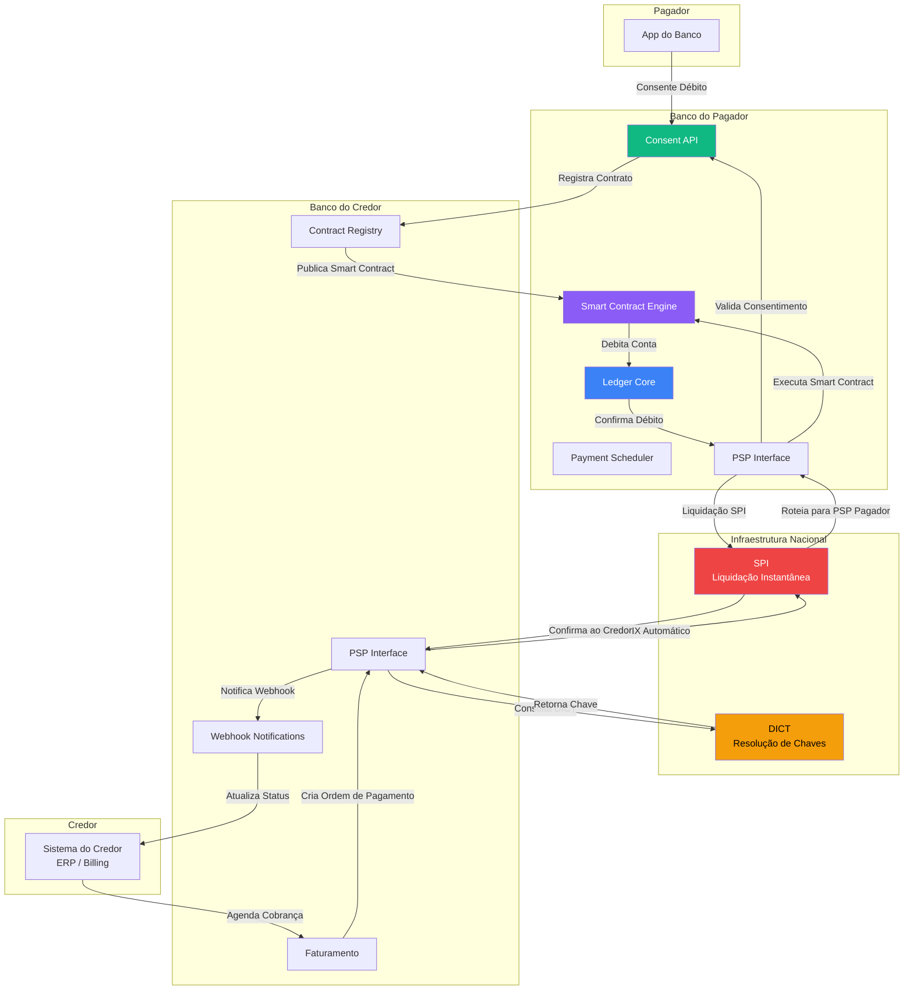
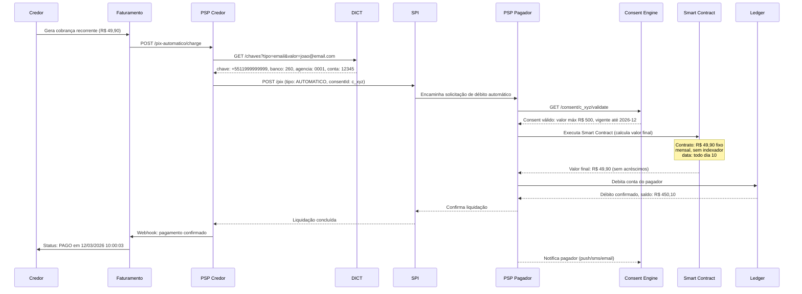
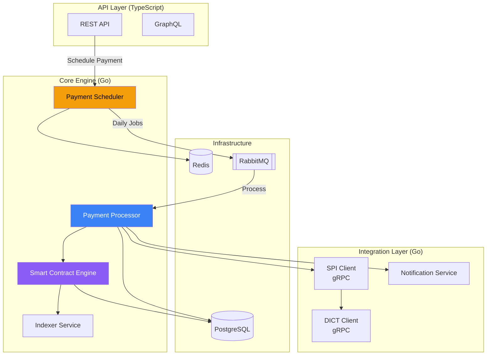

# Desafio 18: PIX Automático — Pagamentos Recorrentes na Infraestrutura do Futuro

**🇧🇷** PIX Automático com Smart Contracts e Consentimento de Débito  
**🇬🇧** Automatic PIX with Smart Contracts and Debit Consent

---

## 🎯 Objetivos de Aprendizado

- Implementar um motor de pagamentos recorrentes sobre a infraestrutura do PIX
- Modelar smart contracts financeiros para débito automático programável
- Integrar com SPI (Sistema de Pagamentos Instantâneos) e DICT (Diretório de Identificadores)
- Implementar BolePix — a convergência entre boleto e PIX
- Construir um sistema de consentimento de débito compatível com regulação BACEN
- Projetar scheduling engine para pagamentos futuros com garantia de execução
- Dominar o fluxo de autorização recorrente do Open Finance aplicado ao PIX Automático

---

## 📋 Pré-requisitos

### 🧠 Conceitos
- Fluxo do PIX tradicional (SPI, DICT, PSPs)
- Open Finance / Open Banking
- JWT e OAuth 2.0 (consent flow)
- Event sourcing e CQRS
- Smart contracts (conceito, não Solidity)

### 📚 Desafios Anteriores
- 01-ledger (transações atômicas)
- 02-spi (integração com SPI)
- 03-dict (resolução de chaves)
- 05-open-finance (consentimento)
- 14-rfc (recurring payments RFC)
- 15-pisp (payment initiation)

### 🛠️ Ferramentas
- Docker + PostgreSQL 16
- Redis 7
- RabbitMQ ou Kafka
- pnpm
- Golang 1.22+

### 💻 Técnico
- TypeScript (API e scheduling engine)
- Go (core de processamento)
- GraphQL (consent management)
- gRPC (integração SPI)
- OpenAPI (webhooks de notificação)

---

## 📖 Abertura — O Fim do Boleto Vencido na Gaveta

"Cara, deixa eu te contar uma história que todo brasileiro conhece. É dia 10, você lembra que o boleto da escola do seu filho venceu ontem. Corre no app do banco, digita aquele código de 47 dígitos — erra o terceiro campo, volta, corrige — paga. O banco do credor vai receber em D+1 ou D+2. A escola vai saber que você pagou na quarta-feira, talvez na quinta. Enquanto isso, o sistema de cobrança da escola já gerou uma multa de 2% e juros de mora automáticos.

Agora imagina o seguinte: você autoriza o débito uma vez. A escola agenda a cobrança mensal. Todo dia 10, o valor sai automaticamente da sua conta. Você não digita código nenhum. Você não lembra de pagar. Você não paga multa por esquecimento. A escola recebe em D+0, em 10 segundos, com confirmação instantânea. Isso não é débito automático tradicional — que demora 48 horas pra liquidar e o credor só sabe que o dinheiro caiu no terceiro dia útil. Isso é **PIX Automático**.

E eu vou além. Pensa num financiamento imobiliário de 360 parcelas. Hoje, o comprador precisa lembrar de pagar 360 boletos. Ou pior: autoriza débito em conta e reza pro banco não voltar a parcela por 'Saldo insuficiente' no dia errado. Com PIX Automático, o contrato de financiamento é um **smart contract financeiro** registrado no sistema. Ele sabe o valor de cada parcela, a data de vencimento, o indexador (TR, IPCA, CDI), e pode recalcular o saldo devedor automaticamente. Se o comprador tiver saldo, debita. Se não tiver, tenta de novo amanhã. Se o indexador mudar, recalcula. Tudo sem intervenção humana.

E tem um terceiro cenário, ainda mais profundo: o **BolePix**. Você já recebeu um boleto com QR Code PIX? Aquilo ali é o BolePix em sua forma mais primitiva — dois instrumentos de pagamento no mesmo documento. Mas o BolePix pleno vai além: é um título de cobrança que nasce digital, é registrado no DICT, pode ser pago via PIX ou compensado como boleto tradicional, e — aqui está a grande inovação — pode ser **automaticamente agendado** para débito recorrente se o pagador der consentimento. Você recebe o boleto da conta de luz, escaneia o QR Code, o app pergunta 'Quer autorizar débito automático todo mês?' Você diz sim. Nunca mais recebe boleto de luz. O pagamento acontece sozinho, todo mês, sem atraso, sem multa.

Mas por que isso não existe ainda? Se o PIX foi lançado em 2020 e é um sucesso estrondoso — 250 milhões de transações por dia, R$ 15 trilhões movimentados em 2024 — por que o PIX Automático só está entrando em produção em 2025?

A resposta está em três pilares que são o coração desse desafio: **consentimento**, **smart contracts** e **integração regulatória**.

O consentimento é o mais óbvio: você não pode debitar automaticamente da conta de alguém sem autorização explícita, revogável, rastreável. O Open Finance já resolve isso com o fluxo de consentimento OAuth 2.0 — o cliente autentica no banco, autoriza o iniciador de pagamento, define limites e vigência. Mas o PIX Automático exige um consentimento turbinado: ele precisa especificar **recorrência** (mensal, semanal, customizada), **valor máximo por transação**, **valor máximo acumulado no mês**, **data de expiração do consentimento**. E o consentimento precisa ser consultado pelo banco do pagador **a cada transação**, em tempo real, com latência de milissegundos.

Os smart contracts financeiros são o segundo pilar. Diferente dos smart contracts de blockchain (Ethereum, Solana), um smart contract financeiro no contexto do PIX Automático é uma **especificação declarativa de regras de pagamento** que roda no backend do banco. Ele define: o que cobrar, quando cobrar, como recalcular, o que fazer em caso de saldo insuficiente, quando notificar o pagador, quando cancelar o contrato. É um conceito que o Banco Central está desenvolvendo ativamente — eles chamam de 'Contrato Inteligente de Pagamento'.

E o terceiro pilar — integração regulatória — é onde a maioria dos devs subestima a complexidade. O PIX Automático não é só uma feature do seu app. Ele envolve: registro do contrato no DICT, comunicação com o SPI via ISO 20022, notificação ao pagador a cada transação (exigência do BACEN), relatórios de transações recorrentes para compliance, limites de valor por tipo de contrato, e integração com o sistema de contestação (se o pagador contestar um débito, o banco tem que reverter em até 24 horas).

Esse desafio é sobre construir esse ecossistema. Da tela de consentimento ao motor de scheduling, do smart contract financeiro à conciliação contábil. Você vai entender por que o PIX Automático é a maior revolução em meios de pagamento desde o próprio PIX — e por que demorou 5 anos pra ficar pronto."

---

## 🔥 O Problema

Você é engenheiro de uma fintech autorizada pelo BACEN a operar como PSP (Provedor de Serviços de Pagamento). Sua missão é implementar o PIX Automático para três cenários reais:

**Cenário 1 — Assinatura de Serviços:** Uma empresa de streaming (tipo Netflix, Spotify, HBO) quer cobrar mensalmente 2 milhões de assinantes no Brasil via PIX Automático. Hoje eles perdem 15% dos pagamentos por cartão vencido/fraude e pagam 3% de taxa de interchange pra bandeira. Com PIX Automático, a taxa é zero e a liquidação é instantânea. Mas eles precisam de: autorização de débito recorrente do cliente, retentativa automática em caso de saldo insuficiente, notificação pós-pagamento, cancelamento fácil pelo cliente.

**Cenário 2 — Financiamento Imobiliário:** Uma construtora vendeu 500 apartamentos financiados em 360 meses. Cada parcela é calculada com TR + juros + amortização (Tabela SAC ou Price). O saldo devedor muda todo mês. A parcela não é fixa — ela é recalculada a cada vencimento baseado no saldo devedor atualizado. O PIX Automático precisa: modelar o contrato de financiamento como smart contract, recalcular parcela mensalmente, debitar o valor variável, atualizar o saldo devedor, gerar extrato de pagamentos pro mutuário.

**Cenário 3 — BolePix Híbrido:** Uma empresa de utilities (água, luz, gás) emite 5 milhões de contas por mês. Cada conta tem valor variável (consumo). Eles querem emitir um BolePix que: funciona como boleto tradicional (código de barras, vencimento), funciona como PIX (QR Code, pagamento instantâneo), e oferece ao pagador a opção de converter em débito automático recorrente. Se o pagador optar pelo automático, os próximos boletos nem são emitidos — o valor é debitado automaticamente baseado na leitura do medidor.

Os problemas técnicos que você vai enfrentar:

1. **Modelagem de Smart Contract Financeiro** — Como representar regras de pagamento variáveis (parcela com indexador, consumo de energia que muda todo mês) em um contrato digital que o banco consiga executar deterministicamente?

2. **Scheduling de Pagamentos com Garantia** — Como garantir que 2 milhões de pagamentos sejam processados no dia correto, na hora correta, sem atraso e sem duplicata? Se o scheduler cair às 23:59, quem processa os pagamentos do dia?

3. **Consentimento Granular** — Como modelar um consentimento que diga "Autorizo débito de até R$ 500 por mês, todo dia 10, para a Netflix, até dezembro de 2026, e quero ser notificado 24h antes de cada débito"?

4. **Retentativa Inteligente** — Se o pagador não tem saldo no dia 10, o sistema tenta no dia 11, 12, 13? Quantas vezes? A cada tentativa, recalcula multa e juros? Como evitar que o pagador seja surpreendido por um débito atrasado?

5. **Integração SPI em Tempo Real** — O PIX Automático usa a mesma infraestrutura do PIX tradicional (SPI, DICT, PSPs). Mas com uma diferença: a transação é iniciada pelo credor (não pelo pagador), e o pagador precisa ter um consentimento ativo. Como o SPI valida o consentimento? Como o DICT resolve a chave do pagador?

6. **BolePix e a Morte Gradual do Boleto** — O BolePix é um Frankenstein regulatório: metade boleto (CIP, código de barras, vencimento), metade PIX (SPI, QR Code, liquidação instantânea). Como modelar um instrumento que funciona nos dois mundos?

7. **Conciliação de Transações Recorrentes** — No final do mês, como você prova que debitou corretamente 2 milhões de assinaturas, que os valores batem com os contratos, que as retentativas não geraram duplicatas, e que o saldo do ledger fecha?

---

## 🏗️ Arquitetura Geral

<LanguageToggle />

<div class="Lang-content ts" style="Display:block;">

### Visão Macro — PIX Automático no Ecossistema Nacional



Repare em um detalhe fundamental desse diagrama: o fluxo do PIX Automático é **invertido** em relação ao PIX tradicional. No PIX tradicional, o **pagador** inicia a transação (ele abre o app, escolhe o valor, faz o PIX). No PIX Automático, o **credor** inicia a transação (ele agenda a cobrança, o sistema debita do pagador automaticamente). Essa inversão tem implicações profundas em segurança, consentimento e responsabilidade — e é por isso que o BACEN demorou 5 anos pra regulamentar.

Outra coisa: o **Smart Contract Engine** não é um smart contract de blockchain rodando na Ethereum. É um motor de regras determinístico que roda no backend do banco do pagador. Ele recebe o contrato (regras de pagamento), avalia as condições, calcula o valor devido (incluindo correção monetária, juros, multas), e decide se o débito pode prosseguir. É 'Smart' porque executa automaticamente, e 'Contract' porque é vinculante entre as partes. Mas é código TypeScript/Go rodando em servidor tradicional — não em rede descentralizada.

### A Stack

**Backend principal (TypeScript):** Koa + BullMQ (job scheduling) + PostgreSQL (consent store) + Redis (cache de contratos + idempotência) + gRPC client (integração SPI simulada).

**Core engine (Go):** Processamento de alta vazão, cálculo de smart contracts, conciliação batch.

**Comunicação:** REST/GraphQL para consent management, gRPC para SPI/DICT, Webhooks para notificações ao credor.

> **Por que BullMQ e não RabbitMQ?** — BullMQ é nativo do ecossistema Node.js, usa Redis como broker (mesma infra que já usamos pra idempotência), e tem suporte nativo a delayed jobs (essencial pro scheduler de retentativa). RabbitMQ seria mais robusto pra produção de larga escala, mas BullMQ é mais produtivo pra desenvolvimento e MVP. Em produção, você migraria pra Kafka com Kafka Streams.

### Fluxo de um Pagamento Recorrente



### Modelo de Dados — Smart Contract

O coração do PIX Automático é o **PaymentContract** — a representação digital do acordo entre pagador e credor:

```typescript
export interface IPaymentContract {
  _id: string;
  contractId: string;           // UUID gerado pelo sistema
  consentId: string;            // FK pro consentimento Open Finance

  // Partes
  payerKey: string;             // Chave PIX do pagador (CPF, email, telefone)
  payerAccount: string;         // Conta do pagador (resolvida via DICT)
  creditorName: string;         // Nome do credor
  creditorDocument: string;     // CNPJ do credor
  creditorPSP: string;          // PSP do credor (ISPB)

  // Configuração Financeira
  schedule: PaymentSchedule;    // Regras de agendamento
  amount: AmountRule;           // Regras de valor (fixo, variável, indexado)
  retryPolicy: RetryPolicy;     // Política de retentativa
  notifications: NotificationRule[]; // Regras de notificação

  // Estado
  status: ContractStatus;
  nextPaymentDate: Date;
  totalPayments: number;
  successfulPayments: number;
  failedPayments: number;

  // Metadados
  createdAt: Date;
  updatedAt: Date;
  expiresAt: Date;              // Data de expiração do contrato
  revokedAt?: Date;             // Data de revogação pelo pagador
}

export type ContractStatus =
  | 'ACTIVE'      // Contrato ativo, próximo pagamento agendado
  | 'PAUSED'      // Pagador pausou temporariamente
  | 'EXPIRED'     // Contrato expirou (data limite)
  | 'REVOKED'     // Pagador revogou consentimento
  | 'CANCELLED'   // Credor cancelou
  | 'COMPLETED';  // Todas as parcelas pagas

export interface PaymentSchedule {
  type: 'FIXED' | 'VARIABLE' | 'CUSTOM';
  interval: 'DAILY' | 'WEEKLY' | 'BIWEEKLY' | 'MONTHLY' | 'BIMONTHLY' | 'QUARTERLY' | 'SEMIANNUAL' | 'ANNUAL';
  dayOfMonth?: number;          // Para intervalos mensais: dia fixo
  dayOfWeek?: number;           // Para intervalos semanais: dia da semana
  firstPaymentDate: Date;
  totalOccurrences?: number;    // undefined = indefinido
  customDates?: Date[];         // Para schedule customizado
}

export interface AmountRule {
  type: 'FIXED' | 'VARIABLE' | 'INDEXED' | 'CALCULATED';
  fixedAmount?: number;         // Valor fixo (em centavos)

  // Para valor variável (ex: conta de luz)
  variableSource?: string;      // URL do endpoint que retorna o valor

  // Para valor indexado (ex: financiamento)
  indexer?: 'TR' | 'IPCA' | 'CDI' | 'SELIC' | 'IGPM' | 'INPC';
  baseAmount?: number;          // Valor base a ser indexado
  amortizationType?: 'SAC' | 'PRICE'; // Tipo de amortização
  outstandingBalance?: number;  // Saldo devedor atual

  // Para valor calculado
  calculationFormula?: string;  // Expressão: "baseAmount * (1 + indexer/100)"
}

export interface RetryPolicy {
  enabled: boolean;
  maxRetries: number;           // Máximo de tentativas (ex: 3)
  intervalHours: number;        // Intervalo entre tentativas (ex: 24)
  applyPenalty: boolean;        // Aplica multa/juros na retentativa?
  penaltyPercentage: number;    // Multa percentual (ex: 2.0 = 2%)
  interestPerDay: number;       // Juros ao dia (ex: 0.033 = 0,033% ao dia)
}

export interface NotificationRule {
  channel: 'EMAIL' | 'SMS' | 'PUSH';
  timing: 'BEFORE_PAYMENT' | 'AFTER_PAYMENT' | 'ON_FAILURE' | 'ON_RETRY';
  hoursBefore?: number;         // Quantas horas antes (ex: 24)
}
```

Esse modelo é denso e intencional. Cada campo tem uma razão regulatória ou de negócio:

- **`payerKey`** — Armazenamos a chave PIX (não a conta), porque o DICT pode mudar o vínculo.
- **`creditorPSP`** — Precisamos saber o PSP do credor pra rotear a confirmação via SPI.
- **`Schedule.type`** — `FIXED` é Netflix (todo dia 10), `VARIABLE` é conta de luz (todo dia 15 mas o valor muda), `INDEXED` é financiamento (parcela recalculada), `CUSTOM` é caso raro.
- **`AmountRule.variableSource`** — URL do endpoint do credor que retorna o valor atual. O banco do pagador chama esse endpoint pra saber quanto debitar. Isso é exigência do BACEN: o valor da cobrança precisa vir do credor, não ser 'Estimado' pelo banco.
- **`RetryPolicy.applyPenalty`** — Multa e juros são calculados automaticamente pelo Smart Contract Engine. Se o pagador atrasou 3 dias, o contrato sabe calcular multa + juros proporcionais.
- **`NotificationRule`** — O BACEN exige que o pagador seja notificado antes de cada débito automático (com 24h de antecedência mínima). E notificado depois do pagamento, com comprovante.

### Implementação do Smart Contract Engine (TypeScript)

O Smart Contract Engine é o componente que avalia as regras do contrato e calcula o valor a ser debitado:

```typescript
import { addDays, differenceInDays } from 'date-fns';

export interface ContractExecutionInput {
  contract: IPaymentContract;
  executionDate: Date;
  variableValue?: number;     // Valor do credor (se amountType = VARIABLE)
}

export interface ContractExecutionOutput {
  shouldExecute: boolean;
  amount: number;             // Valor final em centavos
  breakdown: AmountBreakdown;
  warnings: string[];
  errors: string[];
}

export interface AmountBreakdown {
  baseAmount: number;
  indexerCorrection: number;
  interest: number;
  penalty: number;
  total: number;
}

export class SmartContractEngine {
  async execute(input: ContractExecutionInput): Promise<ContractExecutionOutput> {
    const { contract, executionDate, variableValue } = input;
    const output: ContractExecutionOutput = {
      shouldExecute: false,
      amount: 0,
      breakdown: { baseAmount: 0, indexerCorrection: 0, interest: 0, penalty: 0, total: 0 },
      warnings: [],
      errors: [],
    };

    // 1. Validar se o contrato está ativo
    if (contract.status !== 'ACTIVE') {
      output.errors.push(`Contract is ${contract.status}, not ACTIVE`);
      return output;
    }

    if (contract.expiresAt && executionDate > contract.expiresAt) {
      output.errors.push('Contract has expired');
      return output;
    }

    // 2. Validar se hoje é dia de pagamento
    const isPaymentDay = this.isPaymentDay(contract.schedule, executionDate);
    if (!isPaymentDay) {
      output.shouldExecute = false;
      return output;
    }

    // 3. Calcular valor base
    if (contract.amount.type === 'FIXED' && contract.amount.fixedAmount) {
      output.breakdown.baseAmount = contract.amount.fixedAmount;
    } else if (contract.amount.type === 'VARIABLE') {
      if (!variableValue && !contract.amount.variableSource) {
        output.errors.push('Variable amount requires value or source');
        return output;
      }
      output.breakdown.baseAmount = variableValue ?? 0;
    } else if (contract.amount.type === 'INDEXED' && contract.amount.outstandingBalance) {
      output.breakdown.baseAmount = this.calculateAmortization(
        contract.amount.outstandingBalance,
        contract.amount.amortizationType ?? 'SAC',
        contract.amount.baseAmount ?? contract.amount.outstandingBalance,
        contract.schedule.totalOccurrences ?? 360,
        contract.successfulPayments
      );
    }

    // 4. Verificar se o pagamento está atrasado e calcular acréscimos
    const daysLate = differenceInDays(executionDate, contract.nextPaymentDate);
    if (daysLate > 0 && contract.retryPolicy.applyPenalty) {
      output.breakdown.penalty = Math.round(
        output.breakdown.baseAmount * (contract.retryPolicy.penaltyPercentage / 100)
      );
      output.breakdown.interest = Math.round(
        output.breakdown.baseAmount * (contract.retryPolicy.interestPerDay / 100) * daysLate
      );
      output.warnings.push(`Payment is ${daysLate} days late. Penalty and interest applied.`);
    }

    // 5. Calcular correção por indexador (se aplicável)
    if (contract.amount.type === 'INDEXED' && contract.amount.indexer) {
      const indexerValue = await this.getIndexerValue(contract.amount.indexer, executionDate);
      output.breakdown.indexerCorrection = Math.round(
        output.breakdown.baseAmount * (indexerValue / 100)
      );
    }

    // 6. Calcular total
    output.breakdown.total =
      output.breakdown.baseAmount +
      output.breakdown.indexerCorrection +
      output.breakdown.interest +
      output.breakdown.penalty;

    output.amount = output.breakdown.total;
    output.shouldExecute = output.errors.length === 0;
    return output;
  }

  private isPaymentDay(schedule: PaymentSchedule, date: Date): boolean {
    const day = date.getDate();
    if (schedule.type === 'CUSTOM' && schedule.customDates) {
      return schedule.customDates.some(d =>
        d.getFullYear() === date.getFullYear() &&
        d.getMonth() === date.getMonth() &&
        d.getDate() === date.getDate()
      );
    }
    if (schedule.dayOfMonth) {
      if (day === schedule.dayOfMonth) return true;
      // Se o dia cair em fim de semana, ajusta pro próximo dia útil
      const adjusted = this.adjustToBusinessDay(date, schedule.dayOfMonth);
      return adjusted.getDate() === day;
    }
    return false;
  }

  private adjustToBusinessDay(date: Date, targetDay: number): Date {
    const adjusted = new Date(date.getFullYear(), date.getMonth(), targetDay);
    while (adjusted.getDay() === 0 || adjusted.getDay() === 6) {
      adjusted.setDate(adjusted.getDate() + 1);
    }
    return adjusted;
  }

  private calculateAmortization(
    outstandingBalance: number,
    type: 'SAC' | 'PRICE',
    totalAmount: number,
    totalMonths: number,
    paidMonths: number
  ): number {
    if (type === 'SAC') {
      const amortization = Math.round(totalAmount / totalMonths);
      const interestRate = 0.01 * (outstandingBalance);
      return amortization + interestRate;
    }
    // PRICE: parcela fixa
    const monthlyRate = 0.008; // Exemplo: 0.8% a.m.
    const installment = totalAmount *
      (monthlyRate * Math.pow(1 + monthlyRate, totalMonths)) /
      (Math.pow(1 + monthlyRate, totalMonths) - 1);
    return Math.round(installment);
  }

  private async getIndexerValue(indexer: string, date: Date): Promise<number> {
    // Em produção: buscar do BACEN/SGS ou API de dados financeiros
    const indexerValues: Record<string, number> = {
      'TR': 0.07,      // 0.07% em março/2026 (exemplo)
      'IPCA': 0.38,    // 0.38% a.m.
      'CDI': 0.93,     // 0.93% a.m.
      'SELIC': 0.91,   // 0.91% a.m.
      'IGPM': 0.52,    // 0.52% a.m.
      'INPC': 0.34,    // 0.34% a.m.
    };
    return indexerValues[indexer] ?? 0;
  }
}
```

### O Scheduling Engine com BullMQ

O Scheduler é o componente que garante que pagamentos aconteçam no dia e hora corretos:

```typescript
import Bull from 'bullmq';
import { SmartContractEngine } from './smart-contract-engine';
import { PaymentContractRepository } from './repository';

const connection = { host: 'localhost', port: 6379 };

// Fila principal de execução diária
const dailyExecutionQueue = new Bull('pix-automatico:execucao-diaria', { connection });

// Fila de retentativa (com delay)
const retryQueue = new Bull('pix-automatico:retentativa', { connection });

// Job que agenda todos os contratos do dia
export async function scheduleDailyPayments(date?: Date): Promise<void> {
  const targetDate = date ?? new Date();
  const contracts = await PaymentContractRepository.findActiveForDate(targetDate);

  const jobs = contracts.map((contract) => ({
    name: `payment:${contract.contractId}`,
    data: {
      contractId: contract.contractId,
      executionDate: targetDate.toISOString(),
    },
    opts: {
      jobId: `${contract.contractId}:${targetDate.toISOString().slice(0, 10)}`,
      removeOnComplete: 100,
      removeOnFail: 200,
    },
  }));

  await dailyExecutionQueue.addBulk(jobs);
  console.log(`[scheduler] Agendados ${contracts.length} pagamentos para ${targetDate.toISOString().slice(0, 10)}`);
}

// Worker que processa cada pagamento individual
dailyExecutionQueue.process('payment:*', 50, async (job) => {
  const { contractId, executionDate } = job.data;
  const contract = await PaymentContractRepository.findById(contractId);

  if (!contract || contract.status !== 'ACTIVE') {
    console.log(`[worker] Contrato ${contractId} não está ativo, pulando`);
    return { skipped: true, reason: 'Contract not active' };
  }

  const engine = new SmartContractEngine();
  let variableValue: number | undefined;

  if (contract.amount.type === 'VARIABLE' && contract.amount.variableSource) {
    variableValue = await fetchVariableAmount(contract.amount.variableSource);
  }

  const output = await engine.execute({
    contract,
    executionDate: new Date(executionDate),
    variableValue,
  });

  if (!output.shouldExecute) {
    console.log(`[worker] Contrato ${contractId}: ${output.errors.join(', ')}`);
    return { skipped: true, errors: output.errors };
  }

  try {
    // Iniciar transação PIX Automático via SPI
    const paymentResult = await initiatePixAutomatico({
      contractId: contract.contractId,
      consentId: contract.consentId,
      amount: output.amount,
      breakdown: output.breakdown,
      creditorPSP: contract.creditorPSP,
      payerKey: contract.payerKey,
    });

    // Atualizar contador de pagamentos
    await PaymentContractRepository.updateAfterPayment(contractId, {
      successfulPayments: contract.successfulPayments + 1,
      nextPaymentDate: calculateNextPaymentDate(contract.schedule, new Date(executionDate)),
    });

    console.log(`[worker] Pagamento ${contractId} concluído: R$ ${(output.amount / 100).toFixed(2)}`);
    return { success: true, paymentId: paymentResult.paymentId };
  } catch (error) {
    console.error(`[worker] Falha no pagamento ${contractId}:`, error);

    // Se é um erro recuperável (saldo insuficiente), agenda retentativa
    if (isRetryableError(error) && contract.retryPolicy.enabled) {
      await scheduleRetry(contract, output, job.attemptsMade);
    }

    throw error; // BullMQ retry mecanismo
  }
});

async function scheduleRetry(
  contract: IPaymentContract,
  output: ContractExecutionOutput,
  attemptsMade: number
): Promise<void> {
  if (attemptsMade >= contract.retryPolicy.maxRetries) return;

  const retryDate = new Date();
  retryDate.setHours(retryDate.getHours() + contract.retryPolicy.intervalHours);

  await retryQueue.add(
    `retry:${contract.contractId}`,
    {
      contractId: contract.contractId,
      executionDate: retryDate.toISOString(),
      originalAmount: output.amount,
      attempt: attemptsMade + 1,
    },
    {
      delay: contract.retryPolicy.intervalHours * 3600000, // horas em ms
      jobId: `${contract.contractId}:retry:${attemptsMade + 1}`,
    }
  );

  console.log(`[scheduler] Retentativa ${attemptsMade + 1}/${contract.retryPolicy.maxRetries} agendada para ${retryDate.toISOString()}`);
}
```

### Consent Engine — Validação Granular

O consentimento é o guardião do PIX Automático. Sem consentimento válido, não há débito:

```typescript
export interface IConsent {
  consentId: string;
  payerDocument: string;
  payerAccount: string;
  creditorName: string;
  creditorDocument: string;
  creditorPSP: string;
  scope: ConsentScope;
  limits: ConsentLimits;
  status: 'AWAITING_AUTHORISATION' | 'AUTHORISED' | 'REJECTED' | 'REVOKED' | 'EXPIRED';
  createdAt: Date;
  authorisedAt?: Date;
  expiresAt: Date;
  revokedAt?: Date;
  transactions: ConsentTransaction[];
}

export interface ConsentScope {
  type: 'RECURRING_PIX_DEBIT';
  purpose: string;            // "Assinatura mensal Netflix"
  contractReference: string;  // ID do contrato vinculado
}

export interface ConsentLimits {
  maxSingleAmount: number;        // Valor máximo por transação (centavos)
  maxMonthlyAmount: number;       // Valor máximo acumulado no mês
  maxDailyTransactions: number;   // Máximo de transações por dia
  allowedSchedules: ('DAILY' | 'WEEKLY' | 'MONTHLY')[];
}

export interface ConsentTransaction {
  transactionId: string;
  amount: number;
  timestamp: Date;
  status: 'SUCCESS' | 'FAILED';
}

export class ConsentValidator {
  async validate(consentId: string, amount: number, date: Date): Promise<ValidationResult> {
    const consent = await this.repository.findById(consentId);

    if (!consent) return { valid: false, reason: 'Consent not found' };
    if (consent.status !== 'AUTHORISED') return { valid: false, reason: `Consent status: ${consent.status}` };
    if (consent.expiresAt < date) return { valid: false, reason: 'Consent expired' };

    // Validar valor máximo por transação
    if (amount > consent.limits.maxSingleAmount) {
      return { valid: false, reason: `Amount ${amount} exceeds max single amount ${consent.limits.maxSingleAmount}` };
    }

    // Validar valor máximo acumulado no mês
    const monthlyTotal = consent.transactions
      .filter(t => {
        const tDate = new Date(t.timestamp);
        return tDate.getMonth() === date.getMonth() &&
               tDate.getFullYear() === date.getFullYear() &&
               t.status === 'SUCCESS';
      })
      .reduce((sum, t) => sum + t.amount, 0) + amount;

    if (monthlyTotal > consent.limits.maxMonthlyAmount) {
      return { valid: false, reason: `Monthly total (${monthlyTotal}) exceeds limit (${consent.limits.maxMonthlyAmount})` };
    }

    // Validar máximo de transações diárias
    const dailyCount = consent.transactions.filter(t => {
      const tDate = new Date(t.timestamp);
      return tDate.toDateString() === date.toDateString() && t.status === 'SUCCESS';
    }).length;

    if (dailyCount >= consent.limits.maxDailyTransactions) {
      return { valid: false, reason: `Daily transaction limit (${consent.limits.maxDailyTransactions}) reached` };
    }

    return { valid: true };
  }
}

export type ValidationResult = { valid: true } | { valid: false; reason: string };
```

### BolePix — O Instrumento Híbrido

O BolePix é a ponte entre o mundo antigo (boleto, CIP, código de barras) e o mundo novo (PIX, SPI, QR Code):

```typescript
export interface IBolePix {
  bolePixId: string;

  // Dados do Boleto (backward compatibility)
  codigoBarras: string;
  linhaDigitavel: string;
  valor: number;
  vencimento: Date;
  beneficiario: {
    nome: string;
    documento: string;
    agencia: string;
    conta: string;
  };
  pagador: {
    nome: string;
    documento: string;
  };

  // Dados do PIX
  pixCopiaCola: string;           // BR Code (PIX copy-paste)
  pixQrCode: string;              // URL do QR Code dinâmico
  txId: string;                   // Transaction ID do PIX
  chavePix: string;               // Chave PIX do beneficiário

  // Metadados do BolePix
  permitePixAutomatico: boolean;   // Habilita conversão pra débito automático
  contratoAutomaticoId?: string;   // Se convertido, ID do contrato
  liquidado: boolean;
  dataLiquidacao?: Date;
  canalLiquidacao?: 'BOLETO' | 'PIX' | 'PIX_AUTOMATICO';
}

export class BolePixService {
  async emitirBolePix(dados: {
    valor: number;
    vencimento: Date;
    beneficiario: IBolePix['beneficiario'];
    pagador: IBolePix['pagador'];
    permitePixAutomatico: boolean;
  }): Promise<IBolePix> {
    const txId = this.gerarTxId();

    const bolePix: IBolePix = {
      bolePixId: uuidv4(),
      codigoBarras: this.gerarCodigoBarras(dados.valor, dados.vencimento),
      linhaDigitavel: this.gerarLinhaDigitavel(dados.valor, dados.vencimento),
      valor: dados.valor,
      vencimento: dados.vencimento,
      beneficiario: dados.beneficiario,
      pagador: dados.pagador,
      pixCopiaCola: await this.gerarBrCode(txId, dados.valor, dados.beneficiario),
      pixQrCode: await this.gerarQrCode(txId),
      txId,
      chavePix: dados.beneficiario.documento, // CNPJ como chave
      permitePixAutomatico: dados.permitePixAutomatico,
      liquidado: false,
    };

    await this.repository.save(bolePix);
    return bolePix;
  }

  async converterParaAutomatico(bolePixId: string, consentId: string): Promise<IPaymentContract> {
    const bolePix = await this.repository.findById(bolePixId);
    if (!bolePix || !bolePix.permitePixAutomatico) {
      throw new Error('Este BolePix não permite conversão para PIX Automático');
    }

    const contract: IPaymentContract = {
      contractId: uuidv4(),
      consentId,
      payerKey: bolePix.pagador.documento,
      payerAccount: await this.resolveAccountByDocument(bolePix.pagador.documento),
      creditorName: bolePix.beneficiario.nome,
      creditorDocument: bolePix.beneficiario.documento,
      creditorPSP: await this.resolvePSP(bolePix.beneficiario.documento),
      schedule: {
        type: 'VARIABLE',
        interval: 'MONTHLY',
        dayOfMonth: bolePix.vencimento.getDate(),
        firstPaymentDate: bolePix.vencimento,
      },
      amount: {
        type: 'VARIABLE',
        variableSource: `https://api.cedente.com.br/billing/${bolePix.pagador.documento}/current`,
      },
      retryPolicy: {
        enabled: true,
        maxRetries: 3,
        intervalHours: 24,
        applyPenalty: true,
        penaltyPercentage: 2.0,
        interestPerDay: 0.033,
      },
      notifications: [
        { channel: 'PUSH', timing: 'BEFORE_PAYMENT', hoursBefore: 24 },
        { channel: 'PUSH', timing: 'AFTER_PAYMENT' },
      ],
      status: 'ACTIVE',
      nextPaymentDate: bolePix.vencimento,
      totalPayments: 0,
      successfulPayments: 0,
      failedPayments: 0,
      createdAt: new Date(),
      updatedAt: new Date(),
      expiresAt: new Date('2099-12-31'),
    };

    await this.contractRepo.save(contract);
    await this.repository.update(bolePixId, {
      contratoAutomaticoId: contract.contractId,
      canalLiquidacao: 'PIX_AUTOMATICO',
      liquidado: true,
      dataLiquidacao: new Date(),
    });

    return contract;
  }

  private gerarBrCode(txId: string, valor: number, beneficiario: any): string {
    // BR Code (PIX copy-paste)
    const payload = {
      txId,
      valor: (valor / 100).toFixed(2),
      nome: beneficiario.nome,
      chave: beneficiario.documento,
      cidade: 'SAO PAULO',
    };
    return `00020126580014br.gov.bcb.pix0136${beneficiario.documento}520400005303986540${(valor / 100).toFixed(2)}5802BR5913${beneficiario.nome}6009SAO PAULO62140510${txId}6304A1B2`;
  }
}
```

O BolePix é uma ideia genial do ponto de vista de engenharia de produto. Em vez de forçar o usuário a migrar de boleto pra PIX, você oferece os dois no mesmo documento. O boleto continua funcionando pra quem prefere pagar em lotérica ou internet banking. O QR Code PIX atende quem quer pagar instantaneamente. E o botão 'Ativar débito automático' planta a semente da conversão — o usuário nunca mais recebe boleto, o sistema aprendeu a debitar automaticamente.

### Integração com SPI e DICT

```typescript
export class SPIClient {
  async initiatePixAutomatico(data: {
    contractId: string;
    consentId: string;
    amount: number;
    creditorPSP: string;
    payerKey: string;
    breakdown: AmountBreakdown;
  }): Promise<{ paymentId: string; status: string }> {
    // 1. Resolver chave PIX do pagador via DICT
    const dictResponse = await this.dict.resolve(data.payerKey);

    if (!dictResponse.found) {
      throw new Error(`Chave PIX ${data.payerKey} não encontrada no DICT`);
    }

    // 2. Construir mensagem ISO 20022 (pacs.008)
    const isoMessage = this.buildPacs008({
      msgId: uuidv4(),
      creDtTm: new Date().toISOString(),
      intrBkSttlmDt: new Date().toISOString().slice(0, 10),
      instdAmt: { value: data.amount, ccy: 'BRL' },
      dbtr: {
        nm: dictResponse.accountHolder,
        id: dictResponse.document,
        acct: dictResponse.account,
        agt: { finInstnId: { clrSysMmbId: { mmbId: dictResponse.ispb } } },
      },
      cdtr: {
        nm: data.creditorPSP,
        agt: { finInstnId: { clrSysMmbId: { mmbId: data.creditorPSP } } },
      },
      purp: { prtry: 'PIX_AUTOMATICO' },
      rmtInf: {
        ustrd: [
          `Contrato: ${data.contractId}`,
          `Consentimento: ${data.consentId}`,
          `Base: ${data.breakdown.baseAmount}`,
          `Total: ${data.breakdown.total}`,
        ],
      },
    });

    // 3. Enviar pro SPI
    const response = await this.spi.sendMessage(isoMessage);
    return { paymentId: response.paymentId, status: response.status };
  }
}
```

---

## 🧠 A Profundidade

### A Diferença Fundamental entre PIX, Débito Automático Tradicional e PIX Automático

| Aspecto | PIX Tradicional | Débito Automático (ITA) | PIX Automático |
|---------|----------------|------------------------|----------------|
| **Quem inicia** | Pagador | Credor (via CIP) | Credor (via SPI) |
| **Liquidação** | Instantânea (D+0) | D+1 ou D+2 | Instantânea (D+0) |
| **Horário** | 24x7x365 | Dias úteis, horário bancário | 24x7x365 |
| **Consentimento** | Implícito (pagador decide) | Autorização em papel/online | Consentimento digital Open Finance |
| **Notificação** | Comprovante pós-pagamento | Nenhuma (só extrato) | Pré (24h) + Pós pagamento |
| **Contestação** | Difícil (voluntário) | Até 30 dias | Até 90 dias (regulação BACEN) |
| **Custo** | Gratuito pra PF | Tarifa bancária | Gratuito pra PF |
| **Recorrência** | Não suporta | Suporta (valores fixos) | Suporta (valores fixos e variáveis) |
| **Indexador** | N/A | N/A | Suporta (TR, IPCA, CDI...) |
| **Smart Contract** | Não | Não | Sim |

O débito automático tradicional (aquele que você autoriza pra academia, plano de saúde) opera via CIP (Câmara Interbancária de Pagamentos) no sistema ITA (Instrução de Transferência Automática). A academia envia um arquivo batch pra CIP com todas as cobranças do dia. A CIP processa em lote (D+0) e envia pros bancos. Os bancos debitam dos clientes (D+1). Se não tem saldo, volta (D+2). A academia só sabe que recebeu no D+2 — e olhe lá.

O PIX Automático é radicalmente diferente: cada transação é individual, instantânea, confirmada em 10 segundos, 24 horas por dia, 7 dias por semana — incluindo feriados, sábados e domingos. A academia agenda a cobrança às 2h da manhã de domingo e o dinheiro cai na conta dela às 2h00min10s.

### Por que Consentimento Granular é a Parte Mais Importante

O consentimento do PIX Automático é mais complexo que o consentimento do Open Finance tradicional por três razões:

1. **É contínuo, não pontual.** No Open Finance, você autoriza o compartilhamento de dados uma vez e ele vale por 12 meses. No PIX Automático, cada transação individual é validada contra o consentimento em tempo real. Se o consentimento for revogado às 14:32, o débito das 14:33 é bloqueado instantaneamente.

2. **Tem limites dinâmicos.** O pagador pode autorizar 'Débitos de até R$ 500 por mês para Netflix'. Se a Netflix tentar debitar R$ 501, o sistema bloqueia. Se já debitou R$ 450 em duas transações e tentar debitar mais R$ 100, bloqueia também. Esse tracking mensal exige um contador de transações atualizado em tempo real.

3. **É vinculado a um iniciador específico.** O consentimento é entre o pagador e um iniciador de pagamento (credor) específico. Se o CNPJ do credor mudar, o consentimento não vale mais. Isso evita que um credor malicioso use consentimentos de outro.

### O Scheduling Problem — Como Garantir que Pagamentos Aconteçam?

O problema de scheduling de pagamentos em larga escala é mais sutil do que parece. Vamos aos cenários de falha:

**Cenário A — Scheduler cai antes do processamento:** Você agenda 2 milhões de pagamentos pra rodarem às 00:00 do dia 10. Às 23:59 do dia 9, o servidor do scheduler cai. Os pagamentos do dia 10 não acontecem. Solução: o job de scheduling roda com `repeatable` cron (`0 0 * * *`), e o BullMQ garante que se o worker cair, o job é recolocado na fila.

**Cenário B — Scheduler cai durante o processamento:** O scheduler processou 1.2 milhão dos 2 milhões de pagamentos e caiu. Os 800 mil restantes não foram debitados. Solução: cada job de pagamento individual é atômico. Se o worker cair processando o job #1.200.001, o BullMQ retorna o job pra fila e ele será reprocessado por outro worker. Idempotency key (baseada em `contractId + date`) garante que pagamentos já concluídos não sejam duplicados.

**Cenário C — Duas instâncias do scheduler competem:** Em Kubernetes com 3 réplicas, todas as 3 agendam os mesmos 2 milhões de pagamentos. Solução: distributed lock via Redis (`SETNX` com TTL) — apenas uma instância ganha o direito de agendar. As outras detectam o lock e pulam.

```typescript
export async function scheduleDailyPaymentsWithLock(date?: Date): Promise<void> {
  const lockKey = `scheduler:lock:daily:${date?.toISOString().slice(0, 10) ?? new Date().toISOString().slice(0, 10)}`;
  const acquired = await redis.set(lockKey, process.env.HOSTNAME!, 'EX', 300, 'NX');

  if (!acquired) {
    console.log('[scheduler] Outro worker já está agendando. Pulando.');
    return;
  }

  try {
    await scheduleDailyPayments(date);
  } finally {
    await redis.del(lockKey);
  }
}
```

### Indexadores e Correção Monetária no Smart Contract

O Brasil tem uma particularidade que torna os smart contracts financeiros especialmente complexos: a inflação histórica criou uma cultura de indexação. Quase todo contrato de longo prazo no Brasil é indexado: financiamento imobiliário (TR), aluguel (IGPM), precatórios (IPCA), CDBs (CDI), títulos públicos (SELIC).

O Smart Contract Engine precisa saber buscar o valor do indexador do dia, calcular a correção acumulada desde o último pagamento, e aplicar sobre o saldo devedor ou valor base. E isso não é tão simples quanto chamar uma API:

- **TR (Taxa Referencial):** Divulgada pelo BACEN diariamente. Pode ser zero ou próxima de zero (como foi entre 2017 e 2021). Afeta financiamentos imobiliários.
- **IPCA (Índice de Preços ao Consumidor Amplo):** Divulgado pelo IBGE mensalmente. Como aplicar mensalmente se o índice é mensal? Usa-se pro-rata ou índice do mês anterior.
- **CDI (Certificado de Depósito Interbancário):** Divulgado pela B3 diariamente. Média das taxas de juros interbancárias.
- **IGPM (Índice Geral de Preços do Mercado):** Divulgado pela FGV mensalmente. Usado em contratos de aluguel.

Cada indexador tem sua fonte, sua periodicidade, sua convenção de cálculo. O motor precisa abstrair isso e prover valores consistentes pro cálculo da parcela:

```typescript
export class IndexerService {
  async getAccumulatedRate(indexer: string, from: Date, to: Date): Promise<number> {
    switch (indexer) {
      case 'CDI': return this.getCDIAccumulated(from, to);
      case 'IPCA': return this.getIPCAProRata(from, to);
      case 'TR': return this.getTRAccumulated(from, to);
      case 'SELIC': return this.getSelicAccumulated(from, to);
      default: throw new Error(`Indexer ${indexer} not supported`);
    }
  }

  private async getCDIAccumulated(from: Date, to: Date): Promise<number> {
    const rates = await this.b3API.getCDIRates(from, to);
    return rates.reduce((acc, rate) => acc * (1 + rate / 100), 1) - 1;
  }

  private async getIPCAProRata(from: Date, to: Date): Promise<number> {
    const monthlyIPCA = await this.ibgeAPI.getMonthlyIPCA(from, to);
    const daysInPeriod = differenceInDays(to, from);
    const daysInMonth = new Date(to.getFullYear(), to.getMonth() + 1, 0).getDate();
    return (monthlyIPCA / 100) * (daysInPeriod / daysInMonth);
  }
}
```

### Notificações e o Marco Regulatório

O BACEN é bem específico sobre notificações no PIX Automático. O Manual do PIX (anexo sobre PIX Automático) exige:

1. **Notificação prévia ao pagamento:** O pagador deve ser informado com no mínimo 24 horas de antecedência sobre o débito que ocorrerá. A notificação deve conter: nome do credor, valor, data do débito, identificação do contrato.

2. **Notificação pós-pagamento:** Após cada débito bem-sucedido, o pagador deve receber um comprovante com: valor debitado, data/hora, nome do credor, contrato, saldo restante na conta.

3. **Notificação de insucesso:** Se o débito falhar (saldo insuficiente), o pagador deve ser notificado informando que haverá retentativa e quais os acréscimos (multa, juros) se aplicáveis.

4. **Canal de revogação:** Em cada notificação, deve haver um link ou botão para o pagador revogar o consentimento imediatamente.

```typescript
export class NotificationService {
  async sendPrePaymentNotification(contract: IPaymentContract, amount: number, date: Date): Promise<void> {
    const message = {
      title: `Débito automático agendado — ${contract.creditorName}`,
      body: `R$ ${(amount / 100).toFixed(2)} será debitado em ${format(date, "dd/MM/yyyy 'às' HH:mm")}.`,
      data: {
        type: 'PRE_PAYMENT_NOTIFICATION',
        contractId: contract.contractId,
        action: 'REVOKE_CONSENT',
        actionLabel: 'Cancelar débito automático',
      },
    };

    await this.pushService.send(contract.payerKey, message);
  }

  async sendPostPaymentNotification(contract: IPaymentContract, paymentId: string, amount: number): Promise<void> {
    const message = {
      title: `Pagamento realizado — ${contract.creditorName}`,
      body: `R$ ${(amount / 100).toFixed(2)} debitado com sucesso. ID: ${paymentId.slice(0, 8)}...`,
      data: {
        type: 'POST_PAYMENT_RECEIPT',
        contractId: contract.contractId,
        paymentId,
        amount,
        date: new Date().toISOString(),
      },
    };

    await this.pushService.send(contract.payerKey, message);
  }
}
```

---

## 🧪 Testando o PIX Automático

### Teste 1: Contrato Fixo com Execução Perfeita

```typescript
it('should execute fixed recurring payment on schedule', async () => {
  const contract = await createTestContract({
    schedule: { type: 'FIXED', interval: 'MONTHLY', dayOfMonth: 10, firstPaymentDate: new Date('2026-03-10') },
    amount: { type: 'FIXED', fixedAmount: 4990 }, // R$ 49,90
  });

  const engine = new SmartContractEngine();
  const result = await engine.execute({
    contract,
    executionDate: new Date('2026-03-10'),
  });

  expect(result.shouldExecute).toBe(true);
  expect(result.amount).toBe(4990);
  expect(result.breakdown.penalty).toBe(0);
  expect(result.breakdown.interest).toBe(0);
});
```

### Teste 2: Pagamento Atrasado com Multa e Juros

```typescript
it('should calculate penalty and interest for late payment', async () => {
  const contract = await createTestContract({
    schedule: { type: 'FIXED', interval: 'MONTHLY', dayOfMonth: 10, firstPaymentDate: new Date('2026-03-10') },
    amount: { type: 'FIXED', fixedAmount: 10000 }, // R$ 100,00
    retryPolicy: {
      enabled: true, maxRetries: 3, intervalHours: 24,
      applyPenalty: true, penaltyPercentage: 2.0, interestPerDay: 0.033,
    },
  });

  // Simula pagamento 5 dias atrasado
  const engine = new SmartContractEngine();
  const result = await engine.execute({
    contract: { ...contract, nextPaymentDate: new Date('2026-03-10') },
    executionDate: new Date('2026-03-15'),
  });

  expect(result.shouldExecute).toBe(true);
  expect(result.breakdown.baseAmount).toBe(10000);
  expect(result.breakdown.penalty).toBe(200); // 2% de R$ 100
  expect(result.breakdown.interest).toBe(16); // 0.033% * 5 dias * R$ 100 = ~17
  expect(result.amount).toBe(10216);
});
```

### Teste 3: Consentimento Expirado — Débito Bloqueado

```typescript
it('should block payment when consent is expired', async () => {
  const validator = new ConsentValidator();
  const expiredConsent = await createTestConsent({
    status: 'AUTHORISED',
    expiresAt: new Date('2026-01-01'),
  });

  const result = await validator.validate(expiredConsent.consentId, 5000, new Date('2026-03-10'));
  expect(result.valid).toBe(false);
  if (!result.valid) expect(result.reason).toContain('expired');
});
```

### Teste 4: Limite Mensal Excedido

```typescript
it('should block payment when monthly limit is exceeded', async () => {
  const consent = await createTestConsent({
    limits: { maxSingleAmount: 10000, maxMonthlyAmount: 50000, maxDailyTransactions: 10, allowedSchedules: ['MONTHLY'] },
    transactions: [
      { amount: 30000, timestamp: new Date('2026-03-05'), status: 'SUCCESS' },
      { amount: 15000, timestamp: new Date('2026-03-08'), status: 'SUCCESS' },
    ],
  });

  const validator = new ConsentValidator();
  const result = await validator.validate(consent.consentId, 10000, new Date('2026-03-10'));
  expect(result.valid).toBe(false);
  if (!result.valid) expect(result.reason).toContain('Monthly total');
});
```

### Teste 5: Concorrência no Scheduler (Lock Distribuído)

```typescript
it('only one scheduler instance should create daily jobs', async () => {
  const promises = [
    scheduleDailyPaymentsWithLock(),
    scheduleDailyPaymentsWithLock(),
    scheduleDailyPaymentsWithLock(),
  ];

  const results = await Promise.all(promises);
  const successful = results.filter(r => r === true);
  expect(successful.length).toBe(1); // Apenas uma instância agenda
});
```

---

## 💡 Lições Aprendidas

1. **PIX Automático não é PIX + Débito Automático** — É um novo arranjo de pagamento, com características próprias: consentimento granular, smart contracts, liquidação instantânea, notificações obrigatórias. Subestimar a complexidade regulatória é o erro mais comum.

2. **Smart contract não precisa de blockchain** — O conceito de contrato autoexecutável com regras declarativas é independente de tecnologia. No PIX Automático, o smart contract roda no backend do banco, em TypeScript/Go, validado pelo BACEN.

3. **Consentimento é o componente mais crítico** — Se o consentimento falhar, o sistema ou vai debitar indevidamente (cliente puto) ou não vai debitar (credor puto). A validação precisa ser em tempo real, a cada transação, com granularidade de valor, frequência e vigência.

4. **Indexadores são complexos no Brasil** — TR, IPCA, CDI, SELIC, IGPM, INPC, IPC-Fipe... Cada um tem sua fonte, periodicidade, convenção de cálculo. Um motor de smart contract brasileiro precisa abstrair essa complexidade e ser extensível (novo indexador surge, o código continua funcionando).

5. **BolePix é transição, não ruptura** — Forçar o usuário a abandonar o boleto gera fricção. Oferecer os dois no mesmo documento, com upgrade path natural pro PIX Automático, gera adoção gradual sem perder usuários.

6. **Notificações são obrigações regulatórias, não features** — O BACEN exige 24h de antecedência na notificação pré-pagamento. Se seu sistema não notificar e o cliente contestar, o banco é responsabilizado.

7. **O scheduling problem é mais difícil que parece** — Garantir que pagamentos aconteçam na data certa, sem duplicata, com retry, tolerando falhas de worker, é um problema de sistemas distribuídos clássico. BullMQ + Redis + distributed lock é uma solução pragmática.

8. **O DICT é a chave (literalmente)** — Sem o DICT, o credor não sabe em qual banco/agência/conta está o pagador. A chave PIX (CPF, email, telefone, chave aleatória) é resolvida no DICT antes de cada pagamento. Isso significa que o pagador pode trocar de banco sem avisar o credor — o DICT resolve automaticamente.

9. **Idempotência é ainda mais crítica em pagamentos recorrentes** — Um pagamento duplicado em PIX Automático é pior que em PIX tradicional: o cliente pode nem perceber por meses, até que o saldo acumulado fique negativo. A chave de idempotência (`contractId + scheduledDate`) é a defesa final.

10. **Teste com simulação de cenários reais** — Pagamento atrasado 30 dias (multa + juros acumulados), saldo insuficiente com retry, consentimento revogado no meio do mês, indexador mudando drasticamente (ex: SELIC subindo de 2% pra 14%). Seu smart contract precisa lidar com todos esses cenários deterministicamente.

---

## 🚀 Como Testar na Prática

```bash
# Sobe a infra (PostgreSQL + Redis + BullMQ)
make infra-up

# Inicia o scheduler e workers
pnpm --filter @banking/pix-automatico dev

# Criar um contrato de pagamento recorrente
curl -X POST http://localhost:3004/api/contracts \
  -H "Content-Type: application/json" \
  -d '{
    "consentId": "c_abc123",
    "schedule": { "type": "FIXED", "interval": "MONTHLY", "dayOfMonth": 10, "firstPaymentDate": "2026-03-10" },
    "amount": { "type": "FIXED", "fixedAmount": 4990 },
    "creditorName": "Streaming Plus",
    "creditorDocument": "12345678000199",
    "payerKey": "joao@email.com"
  }'

# Forçar execução do scheduler manualmente
curl -X POST http://localhost:3004/api/scheduler/trigger-daily

# Verificar status dos pagamentos
curl http://localhost:3004/api/contracts/c_abc123/transactions

# Emitir um BolePix
curl -X POST http://localhost:3004/api/bolepix \
  -H "Content-Type: application/json" \
  -d '{
    "valor": 29990,
    "vencimento": "2026-03-15",
    "beneficiario": { "nome": "Energia S.A.", "documento": "98765432000110", "agencia": "0001", "conta": "123456" },
    "pagador": { "nome": "João Silva", "documento": "12345678900" },
    "permitePixAutomatico": true
  }'

# Converter BolePix para PIX Automático
curl -X POST http://localhost:3004/api/bolepix/BX123/convert-to-automatic \
  -H "Content-Type: application/json" \
  -d '{ "consentId": "c_xyz789" }'
```

---

## 🔧 Troubleshooting

### 1. Pagamento não acontece na data programada

**Causa:** Scheduler não rodou (worker caído, lock distribuído preso, cron não disparou).  
**Solução:** Verifique os logs do scheduler. Force a execução manual via endpoint `/api/scheduler/trigger-daily?date=2026-03-10`. Se o problema for lock distribuído preso, delete a chave no Redis: `DEL scheduler:lock:daily:2026-03-10`.

### 2. Smart Contract calculou valor errado

**Causa:** Indexador desatualizado no cache ou fórmula incorreta no `calculateAmortization`.  
**Solução:** Verifique os campos `breakdown` na resposta do `execute()`. Cada componente (baseAmount, indexerCorrection, interest, penalty, total) é calculado separadamente. Identifique qual componente está errado e depure a fórmula específica.

### 3. Duplicata de pagamento

**Causa:** Scheduler rodou duas vezes (lock distribuído falhou) ou ausência de idempotency key no processamento.  
**Solução:** Verifique se cada job do BullMQ tem `jobId` único (`contractId:date`). Verifique se o `createTransaction` no ledger usa idempotency key. Implemente `SETNX` no Redis com TTL de 48h como segunda camada de proteção.

### 4. Consentimento bloqueando pagamentos legítimos

**Causa:** Limite mensal mal configurado ou tracking de transações do mês anterior não foi resetado.  
**Solução:** O `ConsentValidator` filtra transações pelo mês/ano da execução. Verifique o fuso horário — uma transação às 23:00 UTC de 31/03 pode ser 01/04 em horário de Brasília. Use sempre o timezone do pagador (`America/Sao_Paulo`).

### 5. VariableAmount endpoint do credor fora do ar

**Causa:** O credor forneceu um endpoint pra consulta de valor variável, mas o endpoint caiu.  
**Solução:** Implemente circuit breaker com fallback. Se o endpoint falhar 3 vezes consecutivas, use o último valor conhecido (cache Redis) e notifique o credor sobre a falha. NUNCA debite sem valor — melhor pular um pagamento do que debitar valor errado.

### 6. BolePix liquidado duas vezes (boleto + PIX)

**Causa:** O pagador pagou o boleto no banco e depois escaneou o QR Code PIX.  
**Solução:** O `txId` do PIX e o `código de barras` do boleto são vinculados ao mesmo `bolePixId`. Na liquidação, verifique se o BolePix já foi liquidado pelo outro canal. Se sim, o PIX deve ser rejeitado com mensagem "Este título já foi pago via boleto em DD/MM/AAAA".

---

## 📚 O que vem depois

- **Contestação e Reversal Automatizado** — O BACEN exige que o pagador possa contestar um débito automático em até 90 dias. Implementar o fluxo de contestação com devolução em D+0.
- **Multi-Calendário** — Suporte a calendários customizados (ex: pagamento a cada 2 meses, ou dias úteis específicos, ou 'Terceira quarta-feira do mês').
- **DDA (Débito Direto Autorizado) 2.0** — Integração do PIX Automático com DDA, onde boletos emitidos são automaticamente convertidos pra débito automático se o pagador tiver consentimento ativo.
- **Smart Contract com Multi-Credor** — Cenários onde um pagamento é dividido entre múltiplos credores (ex: conta de condomínio rateada entre 200 apartamentos).
- **Relatórios Regulatórios** — COAF, BACEN, e-Financeira exigem relatórios específicos de transações recorrentes. Automatizar a geração com base nos dados do ledger e contratos.
- **Webhook de Cancelamento** — Quando o pagador revoga consentimento, todos os contratos vinculados precisam ser pausados e o credor notificado via webhook em tempo real.

---

</div>

<div class="Lang-content go" style="Display:none;">

### Processamento de Alta Performance (Go)



### Go: Smart Contract Engine

```go
package contract

import (
    "context"
    "fmt"
    "math"
    "time"
)

type PaymentContract struct {
    ID              string
    ConsentID       string
    Schedule        PaymentSchedule
    AmountRule      AmountRule
    RetryPolicy     RetryPolicy
    Status          string
    NextPaymentDate time.Time
    PaidCount       int
}

type PaymentSchedule struct {
    Type           string
    Interval       string
    DayOfMonth     int
    FirstPayment   time.Time
    TotalPayments  int
}

type AmountRule struct {
    Type               string
    FixedAmount        int64
    VariableSource     string
    Indexer            string
    BaseAmount         int64
    AmortizationType   string
    OutstandingBalance int64
}

type ExecutionResult struct {
    ShouldExecute bool
    Amount        int64
    Breakdown     struct {
        BaseAmount        int64
        IndexerCorrection int64
        Interest          int64
        Penalty           int64
        Total             int64
    }
    Errors   []string
    Warnings []string
}

type SmartContractEngine struct {
    indexerSvc IndexerService
}

func (e *SmartContractEngine) Execute(ctx context.Context, contract PaymentContract, execDate time.Time) (*ExecutionResult, error) {
    result := &ExecutionResult{}

    if contract.Status != "ACTIVE" {
        result.Errors = append(result.Errors, fmt.Sprintf("contract status is %s", contract.Status))
        return result, nil
    }

    if !e.isPaymentDay(contract.Schedule, execDate) {
        return result, nil
    }

    switch contract.AmountRule.Type {
    case "FIXED":
        result.Breakdown.BaseAmount = contract.AmountRule.FixedAmount
    case "INDEXED":
        baseAmount, err := e.calculateIndexedAmount(ctx, contract, execDate)
        if err != nil {
            return nil, fmt.Errorf("calculating indexed amount: %w", err)
        }
        result.Breakdown.BaseAmount = baseAmount
    }

    daysLate := int(execDate.Sub(contract.NextPaymentDate).Hours() / 24)
    if daysLate > 0 && contract.RetryPolicy.ApplyPenalty {
        result.Breakdown.Penalty = int64(float64(result.Breakdown.BaseAmount) * contract.RetryPolicy.PenaltyPercentage / 100)
        result.Breakdown.Interest = int64(float64(result.Breakdown.BaseAmount) * contract.RetryPolicy.InterestPerDay / 100 * float64(daysLate))
        result.Warnings = append(result.Warnings, fmt.Sprintf("payment is %d days late", daysLate))
    }

    result.Breakdown.Total = result.Breakdown.BaseAmount + result.Breakdown.IndexerCorrection + result.Breakdown.Interest + result.Breakdown.Penalty
    result.Amount = result.Breakdown.Total
    result.ShouldExecute = len(result.Errors) == 0
    return result, nil
}

func (e *SmartContractEngine) calculateIndexedAmount(ctx context.Context, contract PaymentContract, date time.Time) (int64, error) {
    rate, err := e.indexerSvc.GetRate(ctx, contract.AmountRule.Indexer, date)
    if err != nil {
        return 0, err
    }

    if contract.AmountRule.AmortizationType == "SAC" {
        monthlyAmortization := contract.AmountRule.BaseAmount / int64(contract.Schedule.TotalPayments)
        interest := int64(float64(contract.AmountRule.OutstandingBalance) * rate)
        return monthlyAmortization + interest, nil
    }

    if contract.AmountRule.AmortizationType == "PRICE" {
        monthlyRate := rate / 12
        total := float64(contract.AmountRule.BaseAmount)
        n := float64(contract.Schedule.TotalPayments)
        installment := total * monthlyRate * math.Pow(1+monthlyRate, n) / (math.Pow(1+monthlyRate, n) - 1)
        return int64(math.Round(installment)), nil
    }

    return 0, fmt.Errorf("unsupported amortization type: %s", contract.AmountRule.AmortizationType)
}

func (e *SmartContractEngine) isPaymentDay(schedule PaymentSchedule, date time.Time) bool {
    if schedule.Type == "CUSTOM" {
        return false
    }
    return date.Day() == schedule.DayOfMonth
}
```

### Go: Payment Processor com SPI Integration

```go
package processor

import (
    "context"
    "fmt"
    "time"
)

type PaymentProcessor struct {
    contractRepo ContractRepository
    spiClient    SPIClient
    dictClient   DICTClient
    ledgerClient LedgerClient
}

type SPIClient interface {
    InitiatePixAutomatico(ctx context.Context, req PixAutomaticoRequest) (*PixResponse, error)
}

type PixAutomaticoRequest struct {
    ContractID string
    ConsentID  string
    Amount     int64
    CreditorISPB string
    PayerKey   string
}

func (p *PaymentProcessor) ProcessPayment(ctx context.Context, contractID string, execDate time.Time) error {
    contract, err := p.contractRepo.FindByID(ctx, contractID)
    if err != nil {
        return fmt.Errorf("finding contract: %w", err)
    }

    engine := &SmartContractEngine{indexerSvc: NewIndexerService()}
    result, err := engine.Execute(ctx, *contract, execDate)
    if err != nil {
        return fmt.Errorf("executing contract: %w", err)
    }

    if !result.ShouldExecute {
        return fmt.Errorf("contract not executable: %v", result.Errors)
    }

    // Resolve payer key via DICT
    payerInfo, err := p.dictClient.ResolveKey(ctx, contract.PayerKey)
    if err != nil {
        return fmt.Errorf("resolving payer key: %w", err)
    }

    // Initiate PIX Automático via SPI
    pixResp, err := p.spiClient.InitiatePixAutomatico(ctx, PixAutomaticoRequest{
        ContractID:   contract.ID,
        ConsentID:    contract.ConsentID,
        Amount:       result.Amount,
        CreditorISPB: contract.CreditorISPB,
        PayerKey:     contract.PayerKey,
    })
    if err != nil {
        return p.handlePaymentFailure(ctx, contract, result, err)
    }

    // Update contract after successful payment
    nextDate := p.calculateNextDate(contract.Schedule, execDate)
    return p.contractRepo.UpdateAfterPayment(ctx, contract.ID, contract.PaidCount+1, nextDate)
}

func (p *PaymentProcessor) handlePaymentFailure(ctx context.Context, contract *PaymentContract, result *ExecutionResult, originalErr error) error {
    if contract.RetryPolicy.Enabled && contract.RetryCount < contract.RetryPolicy.MaxRetries {
        retryDate := time.Now().Add(time.Duration(contract.RetryPolicy.IntervalHours) * time.Hour)
        return p.scheduleRetry(ctx, contract.ID, result.Amount, retryDate, contract.RetryCount+1)
    }
    return fmt.Errorf("payment failed after %d retries: %w", contract.RetryCount, originalErr)
}
```

### Comparação: Node.js/TypeScript vs Go para PIX Automático

| Cenário | TypeScript (Node.js) | Go |
|---------|---------------------|-----|
| **Consent API** | Melhor (expressivo, validações ricas) | OK (verboso pra schemas) |
| **Smart Contract Engine** | Bom (flexível, fácil de testar) | Excelente (perfórmance, determinismo) |
| **Scheduler** | BullMQ é excelente | Precisa de lib externa ou implementar |
| **SPI Integration (gRPC)** | OK via @grpc/grpc-js | Nativo, excelente performance |
| **Processamento Batch (2M transações/dia)** | Sofre (single thread) | Brilha (goroutines) |
| **Manutenção do Contrato** | TypeScript ajuda com tipos | Go é mais verboso |
| **Deploy** | Node runtime + deps | Binário único, sem dependências |

---

</div>

<FlashcardReview />

<Quiz />

<GiscusComments />
