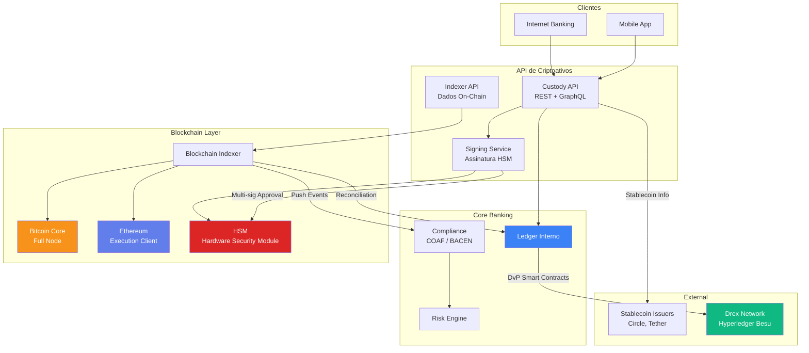
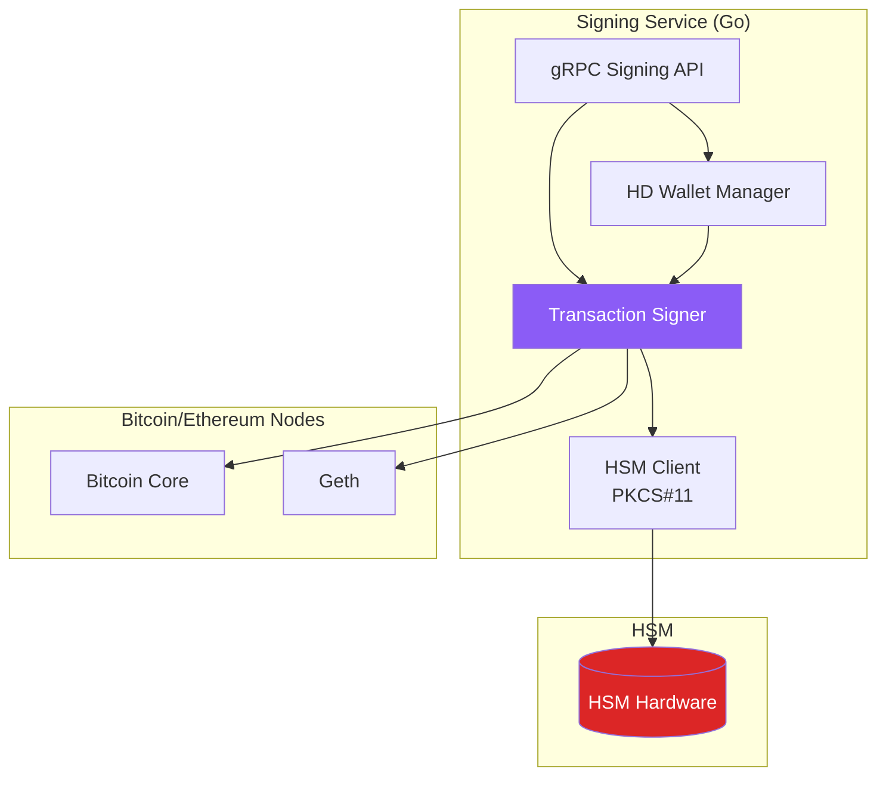

# Desafio 19: Criptomoedas no Contexto Financeiro — Blockchain, Custódia e Stablecoins

**🇧🇷** Bitcoin, Ethereum, Custódia e Stablecoins no Sistema Financeiro  
**🇬🇧** Bitcoin, Ethereum, Custody and Stablecoins in the Financial System

---

## 🎯 Objetivos de Aprendizado

- Entender os fundamentos criptográficos do Bitcoin e Ethereum
- Implementar um sistema de custódia (hot/cold wallet) compatível com regulação BACEN
- Construir um indexador de blockchain para rastrear transações
- Integrar Web3.js e ethers.js para interagir com smart contracts
- Modelar stablecoins (USDC, USDT, BRL stablecoins) no contexto do Drex
- Compreender os fundamentos de DeFi e sua interseção com o sistema financeiro tradicional
- Implementar assinatura de transações com HSM e multi-sig

---

## 📋 Pré-requisitos

### 🧠 Conceitos
- Criptografia (hash, assinatura digital, curvas elípticas)
- Estruturas de dados (Merkle trees, linked lists)
- Sistemas distribuídos (consenso, Byzantine Fault Tolerance)
- Contabilidade (double-entry, reconcilição)

### 📚 Desafios Anteriores
- 01-ledger (transações atômicas, double-entry)
- 04-iso8583 (mensageria financeira)
- 09-leaky-bucket (rate limiting)
- 14-rfc (especificação de protocolos)

### 🛠️ Ferramentas
- Docker + PostgreSQL 16
- Redis 7
- Ganache (Ethereum local)
- Bitcoin Core (regtest)
- ethers.js v6 / Web3.js v4
- pnpm + Golang 1.22+

### 💻 Técnico
- TypeScript (API, indexer)
- Go (core de custódia, assinatura)
- Solidity (leitura de smart contracts)
- gRPC (comunicação entre serviços)

---

## 📖 Abertura — O Dinheiro que Não Dorme

"Deixa eu te levar pra uma pequena cidade na França, em 1298. Marco Polo acabou de voltar da China e descreveu algo que deixou os europeus perplexos: o imperador Kublai Khan usava papel como dinheiro. Não ouro. Não prata. Papel. Casca de amoreira processada, cortada em retângulos, carimbada com o selo imperial, e aceita em todo o império. Os europeus riram. 'Dinheiro de papel? Isso é ridículo.' Trezentos anos depois, a Inglaterra fundou o Bank of England — e adivinha o que eles emitiram? Papel-moeda.

Esse padrão se repete na história do dinheiro: conchas na África, sal no Império Romano, contas de vidro nas Américas, ouro por milênios, papel-moeda por séculos, cartão de crédito por décadas, PIX por anos. Cada geração olha pra inovação monetária da geração seguinte e pensa 'Isso não é dinheiro de verdade'. E cada geração está errada.

Bitcoin é a concha cauri do século XXI.

Quando Satoshi Nakamoto publicou o whitepaper do Bitcoin em 31 de outubro de 2008 — em plena crise financeira global, com bancos quebrando, governos imprimindo trilhões em bailouts, e a confiança no sistema financeiro no fundo do poço — ele não estava propondo uma nova tecnologia. Ele estava propondo uma nova forma de **consenso social sobre o que é dinheiro**.

E aqui está a parte que a maioria dos devs cripto não entende: o problema que o Bitcoin resolve não é tecnológico — é sociológico. O problema é: como um grupo de pessoas que não confiam umas nas outras, que nunca se viram, que falam línguas diferentes e vivem em jurisdições diferentes, podem concordar sobre **quem tem quanto dinheiro** sem um intermediário central? A resposta de Satoshi foi o blockchain — um livro-razão compartilhado, imutável, onde cada página (bloco) referencia a anterior via hash criptográfico, e onde adicionar uma página nova exige prova de trabalho (Proof of Work) que custa energia real.

Mas entenda uma coisa: blockchain não é banco de dados. Blockchain é uma estrutura de dados que resolve o problema do **double-spending** em redes descentralizadas. Se eu te mando um arquivo digital, você recebe uma cópia e eu fico com o original. Se eu te mando R$ 100 via internet, como você sabe que eu não mandei os mesmos R$ 100 pra mais 50 pessoas? O banco sabe — ele é o intermediário central que debita minha conta e credita a sua. O Bitcoin resolve isso sem banco, usando proof-of-work e a regra da cadeia mais longa.

Esse desafio não é sobre 'Como ficar rico com Bitcoin'. É sobre entender criptomoedas do ponto de vista de um engenheiro de sistema financeiro. Você vai construir um indexador de blockchain que rastreia transações como um banco rastreia PIX. Vai implementar um sistema de custódia que separa chaves quentes (hot wallet, pra transações do dia a dia) de chaves frias (cold wallet, HSM offline, multi-sig). Vai integrar stablecoins — USDC, USDT, e o futuro BRL estável — no contexto do Open Finance e do Drex. E vai entender por que o Banco Central do Brasil não está com medo do Bitcoin — ele está estudando como usar a tecnologia pra construir o Real Digital.

Porque, no fim das contas, a pergunta não é se criptomoedas vão substituir o dinheiro tradicional. A pergunta é: o que o sistema financeiro tradicional pode aprender com a tecnologia que faz o Bitcoin funcionar há 18 anos, 24 horas por dia, 7 dias por semana, sem um único minuto de downtime, processando centenas de bilhões de dólares, sem CEO, sem sede, sem servidor central?"

---

## 🔥 O Problema

Você é engenheiro de uma instituição financeira autorizada pelo BACEN. Sua diretoria decidiu que o banco vai oferecer serviços de criptoativos — não como corretora especulativa, mas como **custodiante regulado**. O BACEN publicou a Resolução Conjunta nº 1 (2023) e a Resolução BCB nº 313 (2023) que regulamentam a prestação de serviços de ativos virtuais. Seu banco precisa:

**Cenário 1 — Custódia Regulada:** O banco vai guardar Bitcoin e Ethereum de clientes institucionais (fundos de investimento, family offices, tesourarias de empresas). A custódia precisa ser segregada (ativos dos clientes separados do patrimônio do banco), auditável on-chain, com relatórios mensais pro BACEN. As chaves privadas precisam ser armazenadas em HSM (Hardware Security Module) com multi-sig (M de N assinaturas).

**Cenário 2 — Indexador de Blockchain:** Para compliance e auditoria, o banco precisa rastrear todas as transações dos clientes, reconciliar saldos on-chain com o ledger interno, detectar transações suspeitas (mixing, tumblers, darknet) e reportar ao COAF. Isso exige um indexador que leia blocos de Bitcoin e Ethereum em tempo real.

**Cenário 3 — Stablecoins no Open Finance:** Fundos de investimento querem alocar em stablecoins (USDC, USDT) como proteção cambial. O banco precisa integrar stablecoins ao seu sistema de Open Finance — mostrar o saldo de USDC junto com o saldo em reais, permitir transferências entre contas estáveis, e estar preparado pra integração com Drex (que pode usar um modelo similar de tokenização).

**Cenário 4 — Integração Drex:** O Banco Central está desenvolvendo o Drex (Real Digital), que usa uma plataforma DLT (Hyperledger Besu). Seu banco precisa preparar a infraestrutura pra interoperar com a rede Drex, incluindo integração com smart contracts de entrega-contra-pagamento (DvP) e pagamento-contra-pagamento (PvP).

Os problemas técnicos:

1. **HD Wallets e Derivação de Chaves** — Como gerar milhões de endereços Bitcoin de forma determinística (BIP32, BIP44, BIP84) com uma única seed phrase?

2. **Assinatura de Transações com HSM** — Como assinar transações Bitcoin/Ethereum sem expor a chave privada? Como implementar multi-sig (ex: 3 de 5 diretores precisam aprovar uma transferência de R$ 10 milhões em BTC)?

3. **Indexação em Tempo Real** — A blockchain do Bitcoin tem 500+ GB. A do Ethereum tem 1 TB+. Como indexar apenas as transações relevantes pros seus clientes, em tempo real, sem baixar a blockchain inteira?

4. **Reconciliação On-Chain vs Off-Chain** — O ledger do banco diz que o cliente tem 5.23 BTC. A blockchain diz que o endereço do cliente tem 5.23 BTC. Mas o banco também tem um hot wallet que moveu 0.1 BTC pra outro endereço. Como reconciliar essas três fontes de verdade?

5. **Stablecoins e Lastro** — USDC é lastreado em dólares físicos (1 USDC = 1 USD em conta bancária). Como auditar on-chain que o emissor realmente tem os dólares? Como integrar stablecoins BRL (ex: BRZ, cBRZ) com o PIX e o Open Finance?

6. **Gas e Taxas de Rede** — Cada transação Ethereum custa gas (calculado em Gwei). Como estimar o gas antes de enviar uma transação? Como lidar com spikes de gas (ex: durante mint de NFT popular)?

7. **DeFi — Oportunidade ou Ameaça?** — Protocolos DeFi como Aave, Compound oferecem empréstimos colateralizados sem banco. Isso compete com o banco ou complementa? Como integrar DeFi ao sistema financeiro regulado?

---

## 🏗️ Arquitetura Geral

<LanguageToggle />

<div class="Lang-content ts" style="Display:block;">

### Visão Macro — Custódia de Criptoativos no Banco



### A Stack

**Backend (TypeScript):** Koa + PostgreSQL (custody records) + Redis (UTXO cache) + BullMQ (indexer jobs).

**Blockchain:** Bitcoin Core (regtest/testnet), Geth/Nethermind (Ethereum), ethers.js v6, bitcoinjs-lib.

**Core (Go):** Assinatura de transações, integração HSM via PKCS#11, processamento batch de reconciliação.

**Segurança:** HSM (SoftHSM em dev, AWS CloudHSM em prod), multi-sig wallet (Gnosis Safe ou implementação própria), air-gapped signing para cold wallet.

### HD Wallets — Gerando Endereços Determinísticos

A hierarquia de carteiras determinísticas (BIP32/BIP44/BIP84) é a base de qualquer sistema de custódia moderno:

```typescript
import { BIP32Factory } from 'bip32';
import * as bitcoin from 'bitcoinjs-lib';
import * as ecc from 'tiny-secp256k1';
import { generateMnemonic, mnemonicToSeedSync } from 'bip39';
import { payments } from 'bitcoinjs-lib';

const bip32 = BIP32Factory(ecc);

// Caminho de derivação BIP84 (Native SegWit)
// m / purpose' / coin_type' / account' / change / address_index
// m / 84' / 0' / 0' / 0 / 0  (Bitcoin mainnet, primeira conta, endereço 0)

export class HDWalletService {
  private masterNode: any;

  async initialize(seedPhrase?: string): Promise<string> {
    const mnemonic = seedPhrase ?? generateMnemonic(256);
    const seed = mnemonicToSeedSync(mnemonic);
    this.masterNode = bip32.fromSeed(seed);
    return mnemonic;
  }

  deriveAddress(account: number = 0, change: boolean = false, index: number = 0): {
    address: string;
    publicKey: string;
    path: string;
  } {
    const changeIndex = change ? 1 : 0;
    const path = `m/84'/0'/${account}'/${changeIndex}/${index}`;
    const child = this.masterNode.derivePath(path);

    const { address } = payments.p2wpkh({
      pubkey: Buffer.from(child.publicKey),
      network: bitcoin.networks.bitcoin,
    });

    return {
      address: address!,
      publicKey: child.publicKey.toString('hex'),
      path,
    };
  }

  deriveNextAddress(account: number = 0): {
    address: string;
    index: number;
  } {
    let index = 0;
    let address: string;
    let used = true;

    while (used) {
      const derived = this.deriveAddress(account, false, index);
      address = derived.address;
      used = this.isAddressUsed(address);
      if (!used) break;
      index++;
    }

    return { address: address!, index };
  }
}
```

O caminho de derivação `m/84'/0'/0'/0/0` segue o BIP84 (Native SegWit):
- `m` — master key
- `84'` — purpose (BIP84 = Native SegWit, BIP44 = Legacy, BIP49 = SegWit)
- `0'` — coin type (0 = Bitcoin, 60 = Ethereum, 1 = Testnet)
- `0'` — account (primeira conta)
- `0` — change (0 = endereço externo/recebimento, 1 = troco interno)
- `0` — address index (endereço sequencial)

Isso significa que com **uma única seed phrase de 24 palavras**, você pode gerar 2 bilhões de endereços Bitcoin — e recuperar todos eles a partir da seed. Isso é o que permite que carteiras como Exodus, Trust Wallet e Ledger funcionem.

### Custódia — Hot Wallet vs Cold Wallet

A arquitetura de custódia separa os ativos em duas camadas:

```typescript
export interface WalletConfig {
  type: 'HOT' | 'COLD';
  threshold: number;      // Limite máximo na hot wallet
  multiSig: {
    total: number;        // Total de signers (ex: 5)
    required: number;     // Assinaturas necessárias (ex: 3)
    signers: SignerInfo[];
  };
  hsmSlot: string;        // Identificador no HSM
}

export interface SignerInfo {
  name: string;           // Nome do signatário (ex: "Diretor Financeiro")
  role: string;           // Cargo
  publicKey: string;      // Chave pública HSM
  weight: number;         // Peso do voto (normalmente 1)
}

export class CustodyManager {
  private hotWallet: HDWalletService;
  private coldWallet: HDWalletService;
  private config: WalletConfig;

  // Cada endereço de depósito é derivado da cold wallet (recebimento)
  async generateDepositAddress(clientId: string): Promise<string> {
    const { address } = this.coldWallet.deriveNextAddress();
    await this.repository.saveAddress(address, clientId, 'COLD', 'DEPOSIT');
    return address;
  }

  // Para saques, primeiro usa a hot wallet; se não tiver saldo, agenda da cold
  async processWithdrawal(clientId: string, amount: number, destinationAddress: string): Promise<string> {
    const hotBalance = await this.getHotWalletBalance();
    const coldBalance = await this.getClientColdBalance(clientId);

    if (amount > hotBalance) {
      // Precisa mover fundos da cold pra hot (rebalanceamento)
      await this.scheduleColdToHotTransfer(amount - hotBalance);
      throw new Error('Withdrawal queued: waiting for hot wallet rebalance');
    }

    const txHex = await this.createAndSignTransaction({
      from: await this.hotWallet.deriveHotAddress(),
      to: destinationAddress,
      amount,
      fee: await this.estimateFee(),
    });

    const approvalId = await this.requestMultiSigApproval(txHex, amount);
    await this.waitForApprovals(approvalId);

    const txId = await this.broadcaster.broadcast(txHex);
    await this.repository.recordWithdrawal(clientId, txId, amount);
    return txId;
  }

  async rebalanceFromColdToHot(amount: number): Promise<string> {
    const approvalId = await this.requestMultiSigApproval('cold_to_hot', amount);
    await this.waitForApprovals(approvalId);
    return await this.moveFunds('COLD', 'HOT', amount);
  }
}
```

### Indexador de Blockchain

O indexador é o componente mais intensivo em dados. Ele precisa:
1. Ouvir novos blocos em tempo real (WebSocket/JSON-RPC)
2. Filtrar transações relevantes (endereços dos clientes)
3. Armazenar transações indexadas (PostgreSQL)
4. Detectar padrões suspeitos (mixers, OFAC, darknet)
5. Gerar relatórios de saldo e movimentação

```typescript
import { WebSocketProvider, formatEther } from 'ethers';
import { EventEmitter } from 'events';

export class BlockchainIndexer extends EventEmitter {
  private btcProvider: any;
  private ethProvider: WebSocketProvider;
  private processedBlockHeight: number = 0;

  async start(): Promise<void> {
    this.ethProvider = new WebSocketProvider('ws://localhost:8546');

    // Subscreve a novos blocos
    this.ethProvider.on('block', async (blockNumber: number) => {
      await this.processBlock(blockNumber);
    });

    // Processa blocos históricos em batch
    const latestBlock = await this.ethProvider.getBlockNumber();
    for (let i = this.processedBlockHeight; i <= latestBlock; i++) {
      if (i % 100 === 0) {
        console.log(`[indexer] Processando bloco ${i}/${latestBlock}`);
      }
      await this.processBlock(i);
    }

    console.log('[indexer] Indexador iniciado');
  }

  private async processBlock(blockNumber: number): Promise<void> {
    const block = await this.ethProvider.getBlock(blockNumber, true);

    if (!block || !block.transactions) return;

    for (const tx of block.transactions) {
      if (typeof tx === 'string') {
        const fullTx = await this.ethProvider.getTransaction(tx);
        if (fullTx) await this.maybeIngestTransaction(fullTx, blockNumber);
      } else {
        await this.maybeIngestTransaction(tx, blockNumber);
      }
    }

    this.processedBlockHeight = blockNumber;
    this.emit('block:processed', { blockNumber, transactions: block.transactions.length });
  }

  private async maybeIngestTransaction(tx: any, blockNumber: number): Promise<void> {
    const from = tx.from?.toLowerCase();
    const to = tx.to?.toLowerCase();

    const watchedAddresses = await this.addressRepository.getWatchedAddresses();

    const isFromWatched = watchedAddresses.has(from ?? '');
    const isToWatched = watchedAddresses.has(to ?? '');

    if (!isFromWatched && !isToWatched) return;

    await this.transactionRepository.save({
      hash: tx.hash,
      blockNumber,
      from: from ?? 'unknown',
      to: to ?? 'contract',
      value: tx.value?.toString() ?? '0',
      valueEth: formatEther(tx.value ?? 0n),
      gasPrice: tx.gasPrice?.toString() ?? '0',
      gasUsed: tx.gasLimit?.toString() ?? '0',
      timestamp: new Date(),
      input: tx.data ?? '0x',
      isContractInteraction: tx.data !== '0x' && tx.to !== null,
    });

    // Detecta interações com mixers conhecidos
    if (this.isKnownMixer(to)) {
      this.emit('alert:mixer', { tx: tx.hash, from, to });
      await this.complianceService.reportSuspicious(tx.hash, 'MIXER_INTERACTION');
    }

    // Detecta interações com endereços sancionados (OFAC)
    if (await this.isSanctionedAddress(from) || await this.isSanctionedAddress(to)) {
      this.emit('alert:sanctioned', { tx: tx.hash, from, to });
      await this.complianceService.blockAddress(from ?? to ?? '');
    }
  }

  private isKnownMixer(address: string | null): boolean {
    const mixerAddresses = new Set([
      '0xd90e2f925DA726b50C4Ed8D0Fb90Ad053324F31b',
      '0x12D66f87A04A9E220743712cE6d9bB1B5616B8Ff',
    ]);
    return address ? mixerAddresses.has(address.toLowerCase()) : false;
  }
}
```

### Reconciliação On-Chain vs Off-Chain

A reconciliação é o processo de garantir que o saldo que o banco acha que o cliente tem é igual ao saldo que a blockchain mostra:

```typescript
export class ReconciliationService {
  async reconcileClient(clientId: string): Promise<ReconciliationReport> {
    const clientAddresses = await this.addressRepository.findByClient(clientId);
    const onChainBalances = await this.fetchOnChainBalances(clientAddresses);
    const offChainBalances = await this.ledgerRepository.getClientBalance(clientId);

    const report: ReconciliationReport = {
      clientId,
      timestamp: new Date(),
      addresses: [],
      discrepancies: [],
    };

    for (const addr of clientAddresses) {
      const onChain = onChainBalances.get(addr.address) ?? 0n;
      const offChain = offChainBalances.get(addr.address) ?? 0n;

      report.addresses.push({
        address: addr.address,
        onChain: onChain.toString(),
        offChain: offChain.toString(),
        match: onChain === offChain,
      });

      if (onChain !== offChain) {
        report.discrepancies.push({
          address: addr.address,
          onChain: onChain.toString(),
          offChain: offChain.toString(),
          difference: (onChain - offChain).toString(),
        });
      }
    }

    if (report.discrepancies.length > 0) {
      await this.alertingService.alertReconciliationMismatch(report);
    }

    return report;
  }

  private async fetchOnChainBalances(addresses: any[]): Promise<Map<string, bigint>> {
    const balances = new Map<string, bigint>();

    for (const addr of addresses) {
      // Usa multicall pra batchar consultas (reduz RPC calls)
      const balance = await this.ethProvider.getBalance(addr.address);
      balances.set(addr.address, balance);
    }

    return balances;
  }
}
```

### Stablecoins — USDC, USDT e BRL Stablecoins

```typescript
import { Contract, JsonRpcProvider, formatUnits, parseUnits } from 'ethers';

const ERC20_ABI = [
  'function balanceOf(address owner) view returns (uint256)',
  'function transfer(address to, uint256 amount) returns (bool)',
  'function decimals() view returns (uint8)',
  'function symbol() view returns (string)',
  'event Transfer(address indexed from, address indexed to, uint256 value)',
];

export class StablecoinService {
  private provider: JsonRpcProvider;
  private contracts: Map<string, Contract> = new Map();

  // Stablecoins suportadas
  static readonly STABLECOINS = {
    USDC_ETH: { address: '0xA0b86991c6218b36c1d19D4a2e9Eb0cE3606eB48', chain: 'ethereum', decimals: 6 },
    USDT_ETH: { address: '0xdAC17F958D2ee523a2206206994597C13D831ec7', chain: 'ethereum', decimals: 6 },
    DAI_ETH:  { address: '0x6B175474E89094C44Da98b954EedeAC495271d0F', chain: 'ethereum', decimals: 18 },
    BRZ_ETH:  { address: '0x420412E765BFa6d85aaaC94b4f7b708C89be2e2B', chain: 'ethereum', decimals: 4 },
  };

  async getStablecoinBalance(walletAddress: string, stablecoin: string): Promise<string> {
    const contract = this.getContract(stablecoin);
    const balance = await contract.balanceOf(walletAddress);
    const decimals = StablecoinService.STABLECOINS[stablecoin].decimals;
    return formatUnits(balance, decimals);
  }

  async transferStablecoin(
    fromWallet: string,
    toAddress: string,
    amount: string,
    stablecoin: string,
    privateKey: string
  ): Promise<string> {
    const contract = this.getContract(stablecoin);
    const decimals = StablecoinService.STABLECOINS[stablecoin].decimals;
    const parsedAmount = parseUnits(amount, decimals);

    const wallet = new ethers.Wallet(privateKey, this.provider);
    const connectedContract = contract.connect(wallet);

    // Estima gas antes de enviar
    const gasEstimate = await connectedContract.transfer.estimateGas(toAddress, parsedAmount);
    const gasPrice = await this.provider.getFeeData();

    const tx = await connectedContract.transfer(toAddress, parsedAmount, {
      gasLimit: Math.ceil(Number(gasEstimate) * 1.2),
      maxFeePerGas: gasPrice.maxFeePerGas,
      maxPriorityFeePerGas: gasPrice.maxPriorityFeePerGas,
    });

    await tx.wait();
    return tx.hash;
  }

  // Integração com Open Finance: exposição agregada em stablecoins
  async getTotalStablecoinExposure(clientAddresses: string[]): Promise<StablecoinExposure> {
    const exposure: StablecoinExposure = {
      totalBRL: 0,
      byStablecoin: {},
    };

    for (const addr of clientAddresses) {
      for (const [symbol, config] of Object.entries(StablecoinService.STABLECOINS)) {
        const balance = await this.getStablecoinBalance(addr, symbol);
        const balanceBRL = await this.convertToBRL(Number(balance), symbol);
        exposure.byStablecoin[symbol] = (exposure.byStablecoin[symbol] ?? 0) + Number(balance);
        exposure.totalBRL += balanceBRL;
      }
    }

    return exposure;
  }
}
```

### Web3.js — Interagindo com Contratos DeFi

```typescript
import Web3 from 'web3';

export class DefiIntegration {
  private web3: Web3;

  constructor(rpcUrl: string) {
    this.web3 = new Web3(rpcUrl);
  }

  // Consulta posição de empréstimo no Aave
  async getAavePosition(userAddress: string): Promise<AavePosition> {
    const aavePoolABI = [
      'function getUserAccountData(address user) view returns (uint256, uint256, uint256, uint256, uint256, uint256)',
    ];
    const poolAddress = '0x7d2768dE32b0b80b7a3454c06BdAc94A69DDc7A9';
    const pool = new this.web3.eth.Contract(aavePoolABI, poolAddress);

    const data = await pool.methods.getUserAccountData(userAddress).call();
    return {
      totalCollateralETH: this.web3.utils.fromWei(data[0], 'ether'),
      totalDebtETH: this.web3.utils.fromWei(data[1], 'ether'),
      availableBorrowsETH: this.web3.utils.fromWei(data[2], 'ether'),
      currentLiquidationThreshold: Number(data[3]) / 100,
      ltv: Number(data[4]) / 100,
      healthFactor: Number(data[5]) / 1e18,
    };
  }

  // Simula swap no Uniswap
  async getUniswapQuote(
    tokenIn: string,
    tokenOut: string,
    amountIn: string,
    decimals: number
  ): Promise<{ amountOut: string; priceImpact: string }> {
    const uniswapRouterABI = [
      'function getAmountsOut(uint amountIn, address[] memory path) view returns (uint[] memory amounts)',
    ];

    const routerAddress = '0x7a250d5630B4cF539739dF2C5dAcb4c659F2488D';
    const router = new this.web3.eth.Contract(uniswapRouterABI, routerAddress);

    const path = [tokenIn, tokenOut];
    const amountInWei = this.web3.utils.toWei(amountIn, 'ether');

    const amounts = await router.methods.getAmountsOut(amountInWei, path).call();
    const amountOut = this.web3.utils.fromWei(amounts[1], 'ether');

    return { amountOut, priceImpact: '0.5%' };
  }
}
```

---

## 🧠 A Profundidade

### A Criptografia por Trás do Bitcoin

O Bitcoin usa três primitivas criptográficas:

**1. SHA-256 (double):** Toda transação, todo bloco, todo Merkle root é hashado com SHA-256 duas vezes. `SHA256(SHA256(data))`. Isso é usado no Proof of Work (minerador precisa encontrar um nonce tal que o hash do bloco comece com N zeros), na geração de endereços, e na prova de inclusão (Merkle proof). SHA-256 double é uma escolha deliberada pra prevenir ataques de length extension — um ataque onde, dado `H(m)`, você pode calcular `H(m || padding || extension)` sem conhecer `m`. O double SHA-256 impede isso porque o ataque funcionaria no primeiro hash, mas não no segundo.

**2. ECDSA (secp256k1):** A curva elíptica secp256k1 é usada pra assinaturas digitais. Cada transação Bitcoin é assinada com a chave privada do remetente. O nó validador verifica a assinatura com a chave pública. O endereço Bitcoin é derivado da chave pública: `SHA256(publicKey) → RIPEMD160 → Base58Check`. O uso de RIPEMD160 depois de SHA256 reduz o hash de 256 bits pra 160 bits, resultando em endereços mais curtos. A segurança aqui é de 160 bits (não 256), porque a segunda função hash domina. Mas 160 bits ainda é 2^160 — aproximadamente o número de átomos no universo observável.

**3. Merkle Trees:** Cada bloco contém uma Merkle tree cuja raiz está no header do bloco. Cada folha é o hash de uma transação. Pra provar que uma transação está em um bloco, você não precisa fornecer todas as transações — só a Merkle proof (log2(n) hashes). Isso é o que permite SPV (Simplified Payment Verification): uma carteira mobile pode verificar pagamentos sem baixar a blockchain inteira.

### Proof of Work — Por que Gastar Energia?

O Proof of Work é a inovação mais controversa e menos compreendida do Bitcoin. A crítica padrão é "Gasta energia à toa". Mas o gasto de energia é precisamente o que dá segurança ao sistema.

A lógica é: adicionar um bloco válido à blockchain custa energia real (eletricidade + hardware). Se você quiser reescrever a história (ex: reverter uma transação de 1 hora atrás), você precisa refazer o Proof of Work de todos os blocos desde aquela transação — e fazer isso mais rápido que o resto da rede junta. Isso se chama **ataque de 51%**. Em 2026, a rede Bitcoin tem aproximadamente 600 EH/s (exahashes por segundo). Pra executar um ataque de 51%, você precisaria de 300 EH/s de poder computacional. O custo estimado dessa infraestrutura é US$ 15 bilhões em hardware, mais US$ 2 milhões por hora em eletricidade. E o que você ganharia com isso? A capacidade de reverter transações — mas o mercado descobriria em minutos, o preço do Bitcoin despencaria, e seu investimento de US$ 15 bilhões viraria pó.

É um mecanismo de segurança econômica: o custo do ataque é maior que o benefício do ataque. Proof of Stake (Ethereum pós-Merge) substitui energia por capital em risco: validadores depositam ETH como colateral e perdem o colateral se tentarem fraudar. A segurança econômica é similar, mas o custo operacional é ordens de grandeza menor.

### Custódia — O Verdadeiro Desafio

Custódia de criptoativos é o problema mais difícil do mercado institucional. Não é sobre tecnologia — é sobre **governança**. As perguntas que você precisa responder:

- Quem pode aprovar uma transferência de R$ 10 milhões em BTC?
- Quantas pessoas precisam aprovar? (M de N = 3 de 5 diretores)
- Como evitar que um diretor sob coação (ameaça física) assine?
- O que acontece se um signatário morrer ou ficar incapacitado?
- Como provar pro auditor que as chaves nunca foram expostas?

Soluções institucionais (Fireblocks, Copper, BitGo) implementam MPC (Multi-Party Computation) em vez de multi-sig tradicional. No MPC, a chave privada nunca é montada em lugar nenhum — cada parte tem um shard, e a assinatura é computada através de um protocolo criptográfico interativo. Se um shard for comprometido, o atacante não consegue fazer nada sozinho.

```typescript
// Implementação conceitual de fluxo multi-sig
export class MultiSigApprovalFlow {
  async requestApproval(txHex: string, amount: number, reason: string): Promise<string> {
    const approval = await this.repository.create({
      txHex,
      amount,
      reason,
      requiredSignatures: 3,
      signatures: [],
      status: 'PENDING',
      expiresAt: new Date(Date.now() + 24 * 3600 * 1000),
    });

    // Notifica todos os signatários
    for (const signer of this.config.multiSig.signers) {
      await this.notificationService.sendApprovalRequest(signer, approval);
    }

    return approval.id;
  }

  async signApproval(approvalId: string, signerId: string, hsmSignature: string): Promise<void> {
    const approval = await this.repository.findById(approvalId);
    if (!approval || approval.status !== 'PENDING') throw new Error('Invalid approval');
    if (approval.signatures.find(s => s.signerId === signerId)) {
      throw new Error('Signer already signed');
    }

    approval.signatures.push({ signerId, hsmSignature, timestamp: new Date() });

    if (approval.signatures.length >= approval.requiredSignatures) {
      approval.status = 'APPROVED';
      await this.broadcaster.broadcast(approval.txHex);
    }

    await this.repository.save(approval);
  }
}
```

### Stablecoins — A Ponte Entre Dois Mundos

Stablecoins são o caso de uso mais importante de blockchain no sistema financeiro tradicional. Por quê? Porque elas resolvem o problema da volatilidade sem perder as vantagens da blockchain:

- **Transferência 24/7/365** — Você pode mandar USDC num domingo às 3h da manhã. Tente fazer isso com TED.
- **Liquidação instantânea** — A transação confirma em 12 segundos (Ethereum) ou sub-segundo (Solana). TED é D+0 se enviado até 17h.
- **Custo baixo** — Transferir USDC na Polygon custa R$ 0,003. Transferir USD via SWIFT custa R$ 100-200.
- **Programabilidade** — Stablecoins são tokens ERC-20, então você pode integrá-las com smart contracts, DeFi, escrow.

Mas stablecoins também são o ponto mais frágil do ecossistema cripto. A pergunta fundamental é: **quem garante o lastro?** USDC e USDT dizem que têm 1 dólar em reserva pra cada token emitido. Mas "Reserva" pode ser: dinheiro em banco, títulos do tesouro americano, commercial paper, ou... nada (como a Terra/Luna descobriu em 2022, evaporando US$ 40 bilhões em 72 horas).

A regulação brasileira (Marco Legal das Criptomoedas, Lei 14.478/2022) exige que prestadores de serviços de ativos virtuais tenham segregação patrimonial, governança, e relatórios de compliance. O BACEN está desenvolvendo uma regulação específica pra stablecoins — incluindo a possibilidade de stablecoins lastreadas em Real (BRL) que interoperem com o Drex.

### DeFi e a Reconstrução do Sistema Financeiro

DeFi (Decentralized Finance) é a reconstrução de serviços financeiros usando smart contracts em vez de instituições. Em vez de um banco emprestar dinheiro, um protocolo DeFi como Aave permite que qualquer pessoa deposite garantia (ETH, WBTC) e tome empréstimo em stablecoins — tudo governado por código, sem análise de crédito, sem gerente, sem agência.

Os componentes de DeFi:
- **DEX (Decentralized Exchange):** Uniswap, Curve — troca de tokens sem order book, usando AMM (Automated Market Maker)
- **Lending:** Aave, Compound — empréstimos colateralizados
- **Stablecoins:** MakerDAO/DAI — stablecoin descentralizada colateralizada
- **Derivatives:** Synthetix, dYdX — ativos sintéticos
- **Insurance:** Nexus Mutual — seguros contra bugs de smart contract

Pra um banco tradicional, DeFi é simultaneamente ameaça e oportunidade. Ameaça porque desintermedia o banco — por que tomar empréstimo a 5% ao mês no banco se posso tomar a 2% no Aave contra meu ETH? Oportunidade porque a infraestrutura de custódia, compliance e integração que o banco tem é exatamente o que o mercado institucional precisa pra acessar DeFi com segurança.

---

## 🧪 Testando a Custódia

### Teste 1: Derivação Determinística de Endereços

```typescript
it('should generate same addresses from same seed', async () => {
  const wallet1 = new HDWalletService();
  const wallet2 = new HDWalletService();

  const seed = await wallet1.initialize();
  await wallet2.initialize();

  const addr1 = wallet1.deriveAddress(0, false, 10);
  const addr2 = wallet2.deriveAddress(0, false, 10);

  expect(addr1.address).toBe(addr2.address);
  expect(addr1.path).toBe("m/84'/0'/0'/0/10");
});
```

### Teste 2: Indexador Detecta Transação Relevante

```typescript
it('should index transactions for watched addresses', async () => {
  const indexer = new BlockchainIndexer();
  const watchedAddr = '0x1234567890abcdef1234567890abcdef12345678';
  await indexer.addressRepository.add(watchedAddr, 'client-1');

  const mockTx = {
    hash: '0xabc...',
    from: watchedAddr,
    to: '0xrecipient...',
    value: 1000000000000000000n,
    gasPrice: 30000000000n,
    gasLimit: 21000n,
    data: '0x',
  };

  await indexer['maybeIngestTransaction'](mockTx, 100);

  const transactions = await indexer.transactionRepository.findByAddress(watchedAddr);
  expect(transactions.length).toBeGreaterThan(0);
  expect(transactions[0].hash).toBe('0xabc...');
});
```

### Teste 3: Reconciliação Detecta Divergência

```typescript
it('should detect reconciliation discrepancies', async () => {
  const reconciliation = new ReconciliationService();

  const report = await reconciliation.reconcileClient('client-1');
  const mismatches = report.addresses.filter(a => !a.match);

  // Deve ter 0 divergências (em ambiente de teste controlado)
  expect(mismatches.length).toBe(0);
});
```

### Teste 4: Multi-Sig Requer Quórum

```typescript
it('should require minimum signatures before broadcasting', async () => {
  const flow = new MultiSigApprovalFlow();
  const approval = await flow.requestApproval('raw_tx_hex', 100, 'Teste');

  await flow.signApproval(approval.id, 'signer-1', 'sig1');
  await flow.signApproval(approval.id, 'signer-2', 'sig2');

  // Ainda não tem 3 assinaturas, não deve broadcast
  const pending = await flow.repository.findById(approval.id);
  expect(pending.status).toBe('PENDING');

  await flow.signApproval(approval.id, 'signer-3', 'sig3');

  const approved = await flow.repository.findById(approval.id);
  expect(approved.status).toBe('APPROVED');
});
```

### Teste 5: Stablecoin — Integração ERC-20

```typescript
it('should read USDC balance from contract', async () => {
  const stablecoin = new StablecoinService();
  const balance = await stablecoin.getStablecoinBalance(
    '0xf977814e90da44bfa03b6295a0616a897441acec', // Binance hot wallet
    'USDC_ETH'
  );

  expect(typeof balance).toBe('string');
  expect(Number(balance)).toBeGreaterThan(0);
});
```

---

## 💡 Lições Aprendidas

1. **Blockchain é ledger distribuído, não banco de dados** — Não espere performance de banco de dados relacional de uma blockchain. O design é pra resiliência e imutabilidade, não pra throughput. O Bitcoin processa ~7 transações por segundo. O Ethereum ~30. O PIX processa 2500 TPS. Cada tecnologia tem seu propósito.

2. **Custódia é 90% governança, 10% tecnologia** — O desafio não é guardar a chave privada (HSM resolve). É definir quem pode fazer o quê, com quais limites, sob quais circunstâncias, e como provar isso pro regulador.

3. **HD Wallets são a base de tudo** — BIP32/44/84 permitem que você gerencie milhões de endereços com uma única seed. Entender o caminho de derivação é fundamental pra qualquer sistema de custódia.

4. **Indexador próprio é melhor que API de terceiro** — Etherscan, Infura, Alchemy são ótimos pra prototipar. Em produção regulada, você precisa de um full node próprio e um indexador que você controla. Compliance não pode depender de API de terceiro.

5. **Stablecoins são o killer app de blockchain** — Transferir valor 24/7/365 com custo baixo é o caso de uso que o sistema financeiro tradicional mais precisa. O Drex do BACEN é essencialmente uma stablecoin BRL operada pelo Banco Central.

6. **DeFi é o laboratório do futuro financeiro** — Empréstimos colateralizados, AMMs, yield farming podem parecer brinquedo, mas são experimentos em larga escala sobre como reconstruir serviços financeiros. Bancos que ignoram DeFi vão ser surpreendidos.

7. **Multi-sig não resolve tudo** — Multi-sig tradicional (3 de 5 chaves) ainda tem pontos únicos de falha se as chaves forem armazenadas em lugares similares. MPC (Multi-Party Computation) é o estado da arte pra custódia institucional.

8. **Segurança é assimétrica** — O atacante só precisa achar UMA falha. Você precisa defender TODAS as superfícies de ataque. Chave privada, seed phrase, HSM, comunicação entre sistemas, frontend, pessoa física sob coação.

9. **O Brasil está na vanguarda regulatória** — O Marco Legal das Criptomoedas (Lei 14.478/2022) e as resoluções do BACEN colocam o Brasil entre os países mais avançados em regulação de criptoativos. Isso atrai capital institucional.

10. **Bitcoin não vai substituir o Real** — Mas a tecnologia que faz o Bitcoin funcionar (blockchain, consenso, criptografia) vai ser parte fundamental da próxima geração do sistema financeiro. O Drex é a prova.

---

## 🚀 Como Testar na Prática

```bash
# Sobe nós locais de blockchain
make infra-up  # Sobe Bitcoin regtest + Ethereum (Ganache)

# Inicia o indexador
pnpm --filter @banking/crypto-indexer dev

# Gera uma carteira HD
curl -X POST http://localhost:3005/api/wallet/generate \
  -H "Content-Type: application/json" \
  -d '{"type": "HD_BIP84", "network": "bitcoin"}'

# Deriva um endereço de depósito
curl http://localhost:3005/api/wallet/derive?account=0&index=0

# Consulta saldo on-chain
curl http://localhost:3005/api/balance/1A1zP1eP5QGefi2DMPTfTL5SLmv7DivfNa

# Registra endereço para monitoramento
curl -X POST http://localhost:3005/api/indexer/watch \
  -H "Content-Type: application/json" \
  -d '{"address": "1A1zP1eP5QGefi2DMPTfTL5SLmv7DivfNa", "clientId": "client-123", "label": "Satoshi"}'

# Solicita aprovação multi-sig para saque
curl -X POST http://localhost:3005/api/custody/withdrawal \
  -H "Content-Type: application/json" \
  -d '{"clientId": "client-123", "amount": "0.5", "asset": "BTC", "destination": "bc1q..."}'

# Executa reconciliação
curl -X POST http://localhost:3005/api/reconciliation/run \
  -H "Content-Type: application/json" \
  -d '{"clientId": "client-123"}'
```

---

## 🔧 Troubleshooting

### 1. "Nonce too low" ao enviar transação Ethereum

**Causa:** O nonce da transação é menor que o nonce atual da conta (transação pendente na mempool).  
**Solução:** Sempre busque o nonce atual antes de criar transação: `await provider.getTransactionCount(address, 'pending')`. Use `pending` pra contar transações na mempool, não só as confirmadas.

### 2. Transação Bitcoin presa no mempool (não confirma)

**Causa:** Fee (taxa de mineração) muito baixa. Mineradores priorizam transações com fee/sat mais alto.  
**Solução:** Estime a fee com `estimatesmartfee` do Bitcoin Core. Em picos de uso (ex: 2026, ordinals congestionando a rede), use RBF (Replace-By-Fee) pra aumentar a fee da transação pendente.

### 3. Indexer perdeu blocos (gap no histórico)

**Causa:** O indexador caiu por algumas horas e quando voltou, o `processedBlockHeight` estava atrasado. Mas o WebSocket pode ter perdido eventos durante a queda.  
**Solução:** Implemente um mecanismo de "Catch-up": a cada 5 minutos, compare `processedBlockHeight` com `latestBlock`. Se houver gap > 10, execute o batch histórico pra preencher. Sempre processe blocos com idempotência (se o bloco já foi processado, pule).

### 4. Saldo on-chain não bate com off-chain

**Causa:** O ledger interno registrou uma transação que falhou on-chain, ou vice-versa.  
**Solução:** Implemente o reconciliation service pra rodar diariamente. Cada divergência gera um ticket de investigação. Rastreie o `txHash` on-chain pra ver o status real da transação (confirmada, pendente, revertida).

### 5. Gas muito alto em transação ERC-20

**Causa:** Rede Ethereum congestionada. Contratos ERC-20 consomem mais gas que transferências nativas de ETH (~65k vs 21k).  
**Solução:** Use L2 (Polygon, Arbitrum, Optimism) pra stablecoins. O gas é 100x menor. Ou aguarde horários de baixa (madrugada UTC, fim de semana).

### 6. HSM retornando erro de conexão

**Causa:** HSM é acessado via PKCS#11 ou API proprietária. Problemas de rede, certificado expirado, ou slot ocupado.  
**Solução:** Implemente health check no HSM a cada 30 segundos. Se falhar, coloque o signing service em modo degradado (transações pequenas passam, grandes ficam pendentes). NUNCA faça fallback pra assinatura sem HSM — isso violaria a regulação.

---

## 📚 O que vem depois

- **Bitcoin Taproot e Lightning Network** — Taproot melhora privacidade e eficiência. Lightning Network permite micropagamentos instantâneos em Bitcoin (tipo PIX em cima do Bitcoin).
- **Ethereum Account Abstraction (ERC-4337)** — Permite que contas sejam controladas por smart contracts, habilitando recovery social, paymasters (pagar gas em stablecoin), e transações sem gas.
- **MPC (Multi-Party Computation) para Custódia** — Substitui multi-sig tradicional por protocolo criptográfico onde a chave privada nunca é montada.
- **Tokenização de Ativos Reais (RWA)** — Imóveis, títulos, recebíveis tokenizados em blockchain. O desafio 20 cobre isso em profundidade.
- **Drex e Smart Contracts** — O desafio 21 cobre a integração com a rede Drex (Hyperledger Besu) e smart contracts de entrega-contra-pagamento (DvP).
- **Compliance On-Chain Avançado** — Análise de padrões de mixing, detecção de tumbling, scoring de risco de endereços (Chainalysis, TRM Labs).
- **Zero-Knowledge Proofs em Finanças** — ZK-rollups pra escalabilidade, ZK-KYC (provar que você é maior de idade sem revelar sua data de nascimento), ZK-compliance.

---

</div>

<div class="Lang-content go" style="Display:none;">

### Custódia e Assinatura em Go



### Go: HD Wallet e Derivação

```go
package custody

import (
    "crypto/ecdsa"
    "fmt"
    "math/big"

    "github.com/btcsuite/btcd/btcutil/hdkeychain"
    "github.com/btcsuite/btcd/chaincfg"
    "github.com/ethereum/go-ethereum/crypto"
)

type HDWallet struct {
    masterKey  *hdkeychain.ExtendedKey
    network    *chaincfg.Params
}

func NewHDWallet(seed []byte, isMainnet bool) (*HDWallet, error) {
    network := &chaincfg.TestNet3Params
    if isMainnet {
        network = &chaincfg.MainNetParams
    }

    masterKey, err := hdkeychain.NewMaster(seed, network)
    if err != nil {
        return nil, fmt.Errorf("generating master key: %w", err)
    }

    return &HDWallet{masterKey: masterKey, network: network}, nil
}

func (w *HDWallet) DeriveBitcoinAddress(purpose, coinType, account, change, index uint32) (string, error) {
    // m / purpose' / coin_type' / account' / change / index
    path := []uint32{
        purpose + hdkeychain.HardenedKeyStart,
        coinType + hdkeychain.HardenedKeyStart,
        account + hdkeychain.HardenedKeyStart,
        change,
        index,
    }

    key := w.masterKey
    for _, p := range path {
        var err error
        key, err = key.Derive(p)
        if err != nil {
            return "", fmt.Errorf("deriving path element %d: %w", p, err)
        }
    }

    pubKey, err := key.ECPubKey()
    if err != nil {
        return "", fmt.Errorf("getting public key: %w", err)
    }

    address, err := pubKey.Address(bitcoin.P2WPKH)
    if err != nil {
        return "", fmt.Errorf("generating address: %w", err)
    }

    return address.EncodeAddress(), nil
}

func (w *HDWallet) DeriveEthereumAddress(account, index uint32) (string, *ecdsa.PrivateKey, error) {
    // m / 44' / 60' / account' / 0 / index
    path := []uint32{
        44 + hdkeychain.HardenedKeyStart,
        60 + hdkeychain.HardenedKeyStart,
        account + hdkeychain.HardenedKeyStart,
        0,
        index,
    }

    key := w.masterKey
    for _, p := range path {
        var err error
        key, err = key.Derive(p)
        if err != nil {
            return "", nil, err
        }
    }

    privKey, err := key.ECPrivKey()
    if err != nil {
        return "", nil, err
    }

    ethPrivKey := privKey.ToECDSA()
    address := crypto.PubkeyToAddress(ethPrivKey.PublicKey)
    return address.Hex(), ethPrivKey, nil
}
```

### Go: Assinatura Bitcoin com HSM

```go
package signing

import (
    "context"
    "encoding/hex"
    "fmt"
)

type BitcoinSigner struct {
    hsmClient HSMClient
}

type HSMClient interface {
    SignTransaction(ctx context.Context, slot string, txHex string) (string, error)
}

type TransactionRequest struct {
    Inputs         []UTXO
    Outputs        []Output
    ChangeAddress  string
    FeeRate        int64
    HSMKeySlot     string
    MultiSigKeys   []string
}

type UTXO struct {
    TxID      string
    Vout      uint32
    Amount    int64
    ScriptPubKey string
}

type Output struct {
    Address string
    Amount  int64
}

func (s *BitcoinSigner) CreateAndSign(ctx context.Context, req TransactionRequest) (string, error) {
    tx := NewTransaction()

    for _, in := range req.Inputs {
        tx.AddInput(in.TxID, in.Vout)
    }

    for _, out := range req.Outputs {
        tx.AddOutput(out.Address, out.Amount)
    }

    // Calcula troco
    totalIn := int64(0)
    for _, in := range req.Inputs {
        totalIn += in.Amount
    }
    totalOut := int64(0)
    for _, out := range req.Outputs {
        totalOut += out.Amount
    }
    estimatedFee := int64(len(req.Inputs)*180+len(req.Outputs)*34+10) * req.FeeRate
    change := totalIn - totalOut - estimatedFee

    if change > 546 {
        tx.AddOutput(req.ChangeAddress, change)
    }

    txHex := tx.Serialize()

    // Assina via HSM (PKCS#11)
    signedHex, err := s.hsmClient.SignTransaction(ctx, req.HSMKeySlot, txHex)
    if err != nil {
        return "", fmt.Errorf("hsm signing: %w", err)
    }

    return signedHex, nil
}
```

### Go: Verificação de Saldo On-Chain (Multicall)

```go
package balance

import (
    "context"
    "math/big"
    "sync"

    "github.com/ethereum/go-ethereum/common"
    "github.com/ethereum/go-ethereum/ethclient"
)

type BalanceChecker struct {
    client *ethclient.Client
}

func (b *BalanceChecker) GetBalances(ctx context.Context, addresses []string, tokenAddress string) (map[string]*big.Int, error) {
    result := make(map[string]*big.Int)
    var wg sync.WaitGroup
    var mu sync.Mutex
    sem := make(chan struct{}, 20) // Concorrência limitada a 20 goroutines

    for _, addr := range addresses {
        wg.Add(1)
        go func(address string) {
            defer wg.Done()
            sem <- struct{}{}
            defer func() { <-sem }()

            if tokenAddress != "" {
                // ERC-20 balanceOf
                balance, err := b.getERC20Balance(ctx, tokenAddress, address)
                if err != nil {
                    return
                }
                mu.Lock()
                result[address] = balance
                mu.Unlock()
            } else {
                // Ether nativo
                balance, err := b.client.BalanceAt(ctx, common.HexToAddress(address), nil)
                if err != nil {
                    return
                }
                mu.Lock()
                result[address] = balance
                mu.Unlock()
            }
        }(addr)
    }

    wg.Wait()
    return result, nil
}

func (b *BalanceChecker) getERC20Balance(ctx context.Context, tokenAddress, walletAddress string) (*big.Int, error) {
    payload, _ := ERC20ABI.Pack("balanceOf", common.HexToAddress(walletAddress))

    msg := ethereum.CallMsg{
        To:   &common.Address{},
        Data: payload,
    }
    copy(msg.To[:], common.HexToAddress(tokenAddress).Bytes())

    result, err := b.client.CallContract(ctx, msg, nil)
    if err != nil {
        return big.NewInt(0), err
    }

    balance := new(big.Int)
    balance.SetBytes(result)
    return balance, nil
}
```

### Comparação: TypeScript vs Go para Criptoativos

| Tarefa | TypeScript | Go |
|--------|-----------|-----|
| **Indexador (event-driven)** | Bom (EventEmitter, async/await) | Excelente (goroutines, channels) |
| **Integração Web3/ethers** | Excelente (ecossistema mais maduro) | OK (go-ethereum, mas menos libs) |
| **Assinatura HSM** | OK (via bindings) | Excelente (PKCS#11 nativo, CGo) |
| **Derivação HD** | Bom (bitcoinjs-lib, ethers) | Excelente (performance pra lote) |
| **Reconciliação batch** | Sofre com CPU-bound | Brilha (concorrência real) |
| **Prototipagem** | Muito mais rápido | Mais verboso |
| **Segurança de tipos** | Bom (mas valores em string) | Excelente (tipos numéricos precisos) |

---

</div>

<FlashcardReview />

<Quiz />

<GiscusComments />
