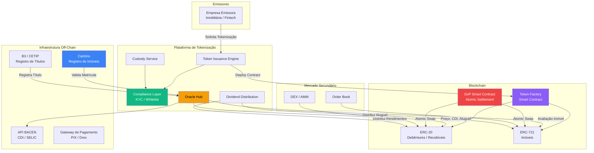
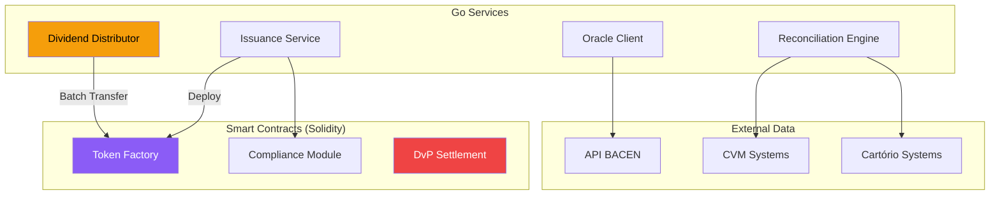

# Desafio 20: Tokenização de Ativos — Do Papel ao Token, da Escritura ao Smart Contract

**🇧🇷** Tokenização Imobiliária, Recebíveis e Ativos Reais com ERC-20/ERC-721  
**🇬🇧** Real Estate, Receivables and Real-World Assets Tokenization with ERC-20/ERC-721

---

## 🎯 Objetivos de Aprendizado

- Compreender o ecossistema de tokenização no contexto do Drex e do BACEN
- Implementar smart contracts ERC-20 e ERC-721 para ativos do mundo real
- Modelar tokenização de imóveis, títulos de dívida e recebíveis
- Construir um sistema de custódia e compliance para ativos tokenizados
- Integrar oráculos de preço e dados off-chain (Chainlink, API BACEN)
- Dominar o fluxo de emissão, distribuição, negociação e liquidação (DvP)
- Entender a regulamentação CVM (Resolução 175, Marco Legal) para tokens

---

## 📋 Pré-requisitos

### 🧠 Conceitos
- Smart contracts (Solidity básico)
- ERC-20, ERC-721, ERC-1155
- Mercado de capitais brasileiro (CVM, CETIP, B3)
- Registro de imóveis (Cartório, matrícula, alienação fiduciária)
- Due diligence e KYC/AML

### 📚 Desafios Anteriores
- 19-criptomoedas (blockchain, custódia, stablecoins)
- 11-kyc (identidade digital, prevenção a fraudes)
- 16-anticipation (antecipação de recebíveis)
- 01-ledger (double-entry, atomicidade)

### 🛠️ Ferramentas
- Docker + PostgreSQL 16
- Hardhat / Foundry (Solidity dev)
- OpenZeppelin Contracts
- IPFS / Pinata (metadados off-chain)
- ethers.js v6
- pnpm + Golang 1.22+

### 💻 Técnico
- Solidity (escrita/leitura de contratos)
- TypeScript (API, orquestração)
- Go (processamento batch, integração)
- GraphQL (query de ativos tokenizados)

---

## 📖 Abertura — O Cartório Vai Virar Smart Contract

"Em 2019, um apartamento em São Paulo foi vendido por R$ 1.2 milhão. O comprador pagou à vista. O vendedor entregou as chaves. O contrato foi assinado. Tudo certo? Não. A matrícula do imóvel ainda estava no nome do vendedor. E ficou assim por 8 meses. Por que? Porque o cartório de registro de imóveis tinha uma fila de 8 meses pra processar a transferência de propriedade. Durante 8 meses, o comprador morava no apartamento mas não era o dono — legalmente falando. Se o vendedor tivesse um credor, o apartamento poderia ser penhorado. Se o vendedor morresse, o apartamento entraria em inventário.

Isso é o Brasil real. O país onde transferir a propriedade de um imóvel leva de 30 a 240 dias, dependendo da cidade, do cartório e da complexidade da transação. Um país onde existem 3.500 cartórios de registro de imóveis, cada um com seu sistema, sua interpretação da lei, sua velocidade. Um país onde você pode ter a escritura, as chaves, e o contrato — mas a propriedade ainda não é sua.

Agora imagina o seguinte: o imóvel é tokenizado. A matrícula digital é um NFT (ERC-721) registrado em blockchain. A transferência de propriedade é uma transação atômica: o comprador envia o dinheiro (Drex ou stablecoin), o vendedor transfere o token, tudo em uma única operação de smart contract que ou acontece por inteiro ou não acontece. O tempo de transferência? 12 segundos. O custo? Centavos. E o cartório? Ele ainda existe — mas agora ele é um oráculo que atesta a validade jurídica da tokenização. A matrícula física e a matrícula digital são vinculadas por hash criptográfico. Qualquer juiz, advogado ou comprador pode verificar on-chain que o token #47382 corresponde à matrícula #128.937 do 5º Cartório de Registro de Imóveis de São Paulo — e que essa matrícula foi validada pelo oficial do cartório com sua assinatura digital ICP-Brasil.

Isso não é ficção científica. Em 2024, a CVM publicou a Resolução 175 que regulamenta a tokenização de valores mobiliários no Brasil. Em 2025, o BACEN publicou as regras do Drex (Real Digital), que incluem suporte a ativos tokenizados e smart contracts de entrega-contra-pagamento (DvP). O Banco Interamericano de Desenvolvimento (BID) já emitiu títulos tokenizados em blockchain. A BlackRock lançou um fundo tokenizado (BUIDL) em Ethereum. O mundo está tokenizando tudo — e o Brasil, com seus 240 dias de transferência imobiliária, é o país que mais precisa dessa tecnologia.

Mas tokenização não é só imóvel. Pensa em um título de dívida corporativa (debênture). Hoje, emitir uma debênture envolve: escritório de advocacia, banco coordenador, CETIP (registro), B3 (negociação), agentes fiduciários, assembleias de debenturistas. O custo de emissão pode chegar a R$ 500 mil — o que torna inviável para empresas médias. Com tokenização, o título é um ERC-20 emitido diretamente pelo emissor, registrado em blockchain, fracionado em tokens de R$ 100, e negociado em DEX 24/7. O custo de emissão cai pra R$ 5 mil. O acesso democratiza: em vez de lote mínimo de R$ 100 mil, qualquer pessoa pode comprar R$ 100 de uma debênture tokenizada.

E recebíveis? Uma empresa que vendeu R$ 1 milhão em produtos parcelados em 12 vezes. Ela precisa de capital de giro hoje. Hoje ela vai ao banco, antecipa os recebíveis, paga 3% ao mês. Com tokenização, cada parcela vira um ERC-20, vendido diretamente a investidores em uma plataforma DeFi. A taxa cai pra 1% ao mês — porque não tem spread do banco.

Esse desafio é sobre construir a infraestrutura que torna tudo isso possível. Você vai escrever smart contracts, implementar oráculos de preço, modelar a custódia regulada, e entender por que o BACEN está apostando em DLT como a próxima infraestrutura do mercado financeiro brasileiro."

---

## 🔥 O Problema

Você é engenheiro de uma plataforma de tokenização autorizada pela CVM como _Crowdfunding de Investimento_ (Resolução CVM 88) e em processo de autorização como _Administradora de Mercado Organizado_ na sandbox regulatória do BACEN. Sua plataforma precisa tokenizar três ativos:

**Cenário 1 — Tokenização Imobiliária:** Um edifício comercial em São Paulo, avaliado em R$ 50 milhões, será tokenizado em 50.000 tokens ERC-721 (cada token representa 0.002% do imóvel, ou R$ 1.000). Investidores de varejo podem comprar quantos tokens quiserem e receber aluguel proporcional mensalmente. Quando o imóvel for vendido, os tokens são queimados e os investidores recebem o proporcional do valor de venda.

**Cenário 2 — Tokenização de Recebíveis:** Uma fintech de antecipação de recebíveis quer tokenizar R$ 10 milhões em duplicatas. Cada duplicata de R$ 5.000 vira um ERC-20. Investidores podem comprar frações de duplicatas (R$ 100 cada) e receber o valor de face no vencimento. A plataforma precisa calcular o desconto (taxa de juros), gerenciar inadimplência, e distribuir pagamentos automaticamente.

**Cenário 3 — Título de Dívida Corporativa:** Uma empresa de médio porte (faturamento R$ 50 milhões/ano) quer emitir R$ 20 milhões em debêntures tokenizadas. Cada debênture de R$ 1.000 vira um ERC-20 pagando CDI + 3% ao ano, com vencimento em 3 anos e pagamentos trimestrais de juros. A plataforma precisa gerenciar o ciclo de vida completo: emissão, distribuição, pagamento de juros, amortização e resgate.

Os problemas técnicos:

1. **Modelagem do Token** — ERC-20 (fungível) ou ERC-721 (não-fungível) ou ERC-1155 (multi-token)? Qual padrão pra cada ativo? Como adicionar compliance (KYC, whitelist, lockup) em cima do padrão básico?

2. **Fracionamento e Liquidez** — Como dividir um imóvel de R$ 50 milhões em 50 mil tokens que podem ser comprados por R$ 1 mil cada? Como garantir liquidez no mercado secundário? AMM (Automated Market Maker) estilo Uniswap ou order book estilo B3?

3. **Oráculos e Dados Off-Chain** — O preço do aluguel, a taxa CDI, o valor de mercado do imóvel — tudo isso são dados off-chain. Como trazer esses dados pra blockchain de forma confiável e à prova de manipulação?

4. **Custódia e Compliance** — Quem custodia os tokens? Como garantir KYC em todas as transações? Como bloquear endereços sancionados? Como implementar lockup periods (ex: tokens de debênture não podem ser transferidos nos primeiros 6 meses)?

5. **Distribuição de Rendimentos** — Como pagar aluguel mensal pra 1.250 investidores de forma automática e proporcional? Como pagar juros trimestrais de debênture pra 200 investidores? Gas cost de 200 transações individuais seria proibitivo.

6. **Integração com o Mundo Off-Chain** — O imóvel existe no mundo físico, com matrícula no cartório, IPTU, condomínio. Como vincular o token digital ao ativo físico de forma juridicamente válida?

7. **DvP (Delivery vs Payment) com Drex** — A liquidação atômica: o comprador envia Drex e o vendedor transfere o token na mesma transação. Se qualquer lado falhar, tudo reverte. Como implementar isso?

---

## 🏗️ Arquitetura Geral

<LanguageToggle />

<div class="Lang-content ts" style="Display:block;">

### Visão Macro — Plataforma de Tokenização



### A Stack

**Smart Contracts (Solidity):** OpenZeppelin Contracts v5, ERC-20, ERC-721, ERC-1155, Ownable, AccessControl, Pausable, ERC20Permit.

**Backend (TypeScript):** Koa + PostgreSQL (off-chain records) + Redis (nonce management, gas cache) + ethers.js v6 (contract interaction) + IPFS (metadata).

**Core (Go):** Processamento batch de dividendos, integração com APIs de oráculo (BACEN, IBGE), relatórios de compliance.

### Smart Contract: Token de Recebível (ERC-20 com Compliance)

```solidity
// SPDX-License-Identifier: MIT
pragma solidity ^0.8.20;

import "@openzeppelin/contracts/token/ERC20/ERC20.sol";
import "@openzeppelin/contracts/access/AccessControl.sol";
import "@openzeppelin/contracts/security/Pausable.sol";

contract TokenRecebivel is ERC20, AccessControl, Pausable {
    bytes32 public constant MINTER_ROLE = keccak256("MINTER_ROLE");
    bytes32 public constant COMPLIANCE_ROLE = keccak256("COMPLIANCE_ROLE");

    // Dados do recebível
    struct ReceivableData {
        uint256 faceValue;          // Valor de face (R$ 5000 * 10^decimals)
        uint256 maturityDate;       // Data de vencimento (unix timestamp)
        string debtorDocument;      // CPF/CNPJ do devedor (hash)
        uint256 discountRate;       // Taxa de desconto em basis points (ex: 300 = 3%)
        bool isPaid;                // Já foi pago?
    }

    mapping(uint256 => ReceivableData) public receivables;
    uint256 public nextReceivableId;

    // Compliance: whitelist de endereços autorizados
    mapping(address => bool) public whitelist;

    // Lockup: endereços com tokens bloqueados até data X
    mapping(address => uint256) public lockupUntil;

    // Metadados off-chain (IPFS)
    mapping(uint256 => string) public receivableMetadata;

    event ReceivableCreated(uint256 indexed id, uint256 faceValue, uint256 maturityDate);
    event ReceivablePaid(uint256 indexed id, uint256 amount);
    event WhitelistUpdated(address indexed account, bool status);

    constructor(
        string memory name,
        string memory symbol,
        address admin
    ) ERC20(name, symbol) {
        _grantRole(DEFAULT_ADMIN_ROLE, admin);
        _grantRole(MINTER_ROLE, admin);
        _grantRole(COMPLIANCE_ROLE, admin);
    }

    function mintReceivable(
        address to,
        uint256 faceValue,
        uint256 maturityDate,
        string memory debtorDocument,
        uint256 discountRate,
        string memory metadataURI
    ) external onlyRole(MINTER_ROLE) whenNotPaused returns (uint256) {
        require(faceValue > 0, "Face value must be positive");
        require(maturityDate > block.timestamp, "Maturity must be in the future");
        require(whitelist[to], "Recipient not whitelisted");

        uint256 id = nextReceivableId++;

        receivables[id] = ReceivableData({
            faceValue: faceValue,
            maturityDate: maturityDate,
            debtorDocument: debtorDocument,
            discountRate: discountRate,
            isPaid: false
        });

        receivableMetadata[id] = metadataURI;
        _mint(to, faceValue);

        emit ReceivableCreated(id, faceValue, maturityDate);
        return id;
    }

    function payReceivable(uint256 id) external onlyRole(MINTER_ROLE) {
        ReceivableData storage rec = receivables[id];
        require(!rec.isPaid, "Already paid");

        rec.isPaid = true;
        _burn(address(this), rec.faceValue);

        emit ReceivablePaid(id, rec.faceValue);
    }

    // Compliance: só transfere se ambos estão na whitelist e sem lockup
    function _beforeTokenTransfer(
        address from,
        address to,
        uint256 amount
    ) internal virtual override {
        super._beforeTokenTransfer(from, to, amount);

        if (from != address(0)) {
            require(whitelist[from], "Sender not whitelisted");
            require(block.timestamp >= lockupUntil[from], "Sender in lockup");
        }
        if (to != address(0)) {
            require(whitelist[to], "Recipient not whitelisted");
            require(block.timestamp >= lockupUntil[to], "Recipient in lockup");
        }
    }

    function setWhitelist(address account, bool status) external onlyRole(COMPLIANCE_ROLE) {
        whitelist[account] = status;
        emit WhitelistUpdated(account, status);
    }

    function setLockup(address account, uint256 unlockTimestamp) external onlyRole(COMPLIANCE_ROLE) {
        lockupUntil[account] = unlockTimestamp;
    }
}
```

### Smart Contract: Token Imobiliário (ERC-721 Fracionado via ERC-20)

```solidity
// SPDX-License-Identifier: MIT
pragma solidity ^0.8.20;

import "@openzeppelin/contracts/token/ERC721/ERC721.sol";
import "@openzeppelin/contracts/token/ERC20/ERC20.sol";
import "@openzeppelin/contracts/access/Ownable.sol";
import "@openzeppelin/contracts/security/ReentrancyGuard.sol";

contract ImovelNFT is ERC721, Ownable, ReentrancyGuard {
    uint256 public nextTokenId;

    struct ImovelData {
        string matricula;          // Número da matrícula no cartório
        string cartorio;           // Nome do cartório
        uint256 area;              // Área em m²
        uint256 valorAvaliacao;    // Valor de avaliação
        uint256 precoPorToken;     // Preço de cada token de fração (centavos)
        uint256 maxTokens;         // Total de tokens fracionários
        uint256 tokensVendidos;    // Tokens já vendidos
        uint256 rendimentoMensal;  // Aluguel mensal total
        address tokenFracao;       // Contrato ERC-20 de fração
        string ipfsMetadata;       // IPFS CID com documentos
    }

    mapping(uint256 => ImovelData) public imoveis;

    event ImovelTokenizado(
        uint256 indexed tokenId,
        string matricula,
        uint256 valorAvaliacao,
        uint256 maxTokens
    );
    event RendimentoDistribuido(
        uint256 indexed tokenId,
        uint256 valorTotal,
        uint256 porToken
    );

    constructor() ERC721("Token Imobiliario BR", "TIBR") {}

    function tokenizarImovel(
        string memory matricula,
        string memory cartorio,
        uint256 area,
        uint256 valorAvaliacao,
        uint256 precoPorToken,
        uint256 maxTokens,
        string memory ipfsMetadata
    ) external onlyOwner returns (uint256, address) {
        require(maxTokens > 0, "Max tokens must be positive");

        uint256 tokenId = nextTokenId++;

        // Deploy do contrato ERC-20 de fração
        bytes memory bytecode = type(TokenFracao).creationCode;
        bytes32 salt = keccak256(abi.encodePacked(tokenId));
        address tokenFracaoAddr;

        assembly {
            tokenFracaoAddr := create2(0, add(bytecode, 32), mload(bytecode), salt)
        }

        TokenFracao(tokenFracaoAddr).initialize(
            string(abi.encodePacked("Token Imovel ", matricula)),
            string(abi.encodePacked("TI", matricula)),
            maxTokens * (10**TokenFracao(tokenFracaoAddr).decimals())
        );

        imoveis[tokenId] = ImovelData({
            matricula: matricula,
            cartorio: cartorio,
            area: area,
            valorAvaliacao: valorAvaliacao,
            precoPorToken: precoPorToken,
            maxTokens: maxTokens,
            tokensVendidos: 0,
            rendimentoMensal: 0,
            tokenFracao: tokenFracaoAddr,
            ipfsMetadata: ipfsMetadata
        });

        _safeMint(msg.sender, tokenId);
        emit ImovelTokenizado(tokenId, matricula, valorAvaliacao, maxTokens);

        return (tokenId, tokenFracaoAddr);
    }

    function comprarFracao(uint256 tokenId, uint256 quantidade) external payable nonReentrant {
        ImovelData storage imovel = imoveis[tokenId];
        require(imovel.tokensVendidos + quantidade <= imovel.maxTokens, "Limite de tokens");
        require(msg.value == imovel.precoPorToken * quantidade, "Valor incorreto");

        TokenFracao(imovel.tokenFracao).transfer(msg.sender, quantidade * (10**18));
        imovel.tokensVendidos += quantidade;
    }

    function atualizarRendimento(uint256 tokenId, uint256 valorAluguel) external onlyOwner {
        imoveis[tokenId].rendimentoMensal = valorAluguel;
    }

    function distribuirRendimento(uint256 tokenId) external onlyOwner {
        ImovelData storage imovel = imoveis[tokenId];
        require(imovel.rendimentoMensal > 0, "Sem rendimento");

        TokenFracao token = TokenFracao(imovel.tokenFracao);
        uint256 totalSupply = token.totalSupply();
        uint256 porToken = imovel.rendimentoMensal / totalSupply;

        // Em produção: usar Merkle airdrop ou streaming de pagamento
    }
}

contract TokenFracao is ERC20, Ownable {
    constructor() ERC20("", "") {
        _transferOwnership(msg.sender);
    }

    function initialize(string memory name, string memory symbol, uint256 supply) external onlyOwner {
        // Inicializa nome/símbolo
    }
}
```

### Oráculo — Trazendo Dados Off-Chain pra Blockchain

```typescript
import { Contract, JsonRpcProvider, Wallet } from 'ethers';

export interface OracleData {
  cdiRate: number;           // Taxa CDI diária (ex: 0.93% ao mês = 0.0308% ao dia)
  selicRate: number;         // Taxa SELIC
  igpmMonthly: number;       // IGPM mensal
  ipcaMonthly: number;       // IPCA mensal
  propertyIndex: number;     // Índice de valorização imobiliária (FipeZap)
  brlUsdRate: number;        // Cotação BRL/USD
}

export class OracleService {
  private provider: JsonRpcProvider;
  private oracleContract: Contract;
  private wallet: Wallet;

  // Fontes de dados
  private sources = {
    cdi: 'https://api.bcb.gov.br/dados/serie/bcdata.sgs.12/dados?formato=json',
    selic: 'https://api.bcb.gov.br/dados/serie/bcdata.sgs.11/dados?formato=json',
    ipca: 'https://api.bcb.gov.br/dados/serie/bcdata.sgs.433/dados?formato=json',
    igpm: 'https://api.bcb.gov.br/dados/serie/bcdata.sgs.189/dados?formato=json',
  };

  async fetchAndUpdate(indicators: string[]): Promise<void> {
    const data: Partial<OracleData> = {};

    if (indicators.includes('CDI')) {
      data.cdiRate = await this.fetchCDIRate();
    }
    if (indicators.includes('SELIC')) {
      data.selicRate = await this.fetchSelicRate();
    }
    if (indicators.includes('IPCA')) {
      data.ipcaMonthly = await this.fetchMonthlyIPCA();
    }
    if (indicators.includes('IGPM')) {
      data.igpmMonthly = await this.fetchMonthlyIGPM();
    }

    // Envia dados on-chain via transação
    await this.pushToBlockchain(data);
  }

  private async fetchCDIRate(): Promise<number> {
    const response = await fetch(this.sources.cdi);
    const json = await response.json();
    const latest = json[json.length - 1];
    return parseFloat(latest.valor) / 100; // Converte pra percentual
  }

  private async fetchSelicRate(): Promise<number> {
    const response = await fetch(this.sources.selic);
    const json = await response.json();
    const latest = json[json.length - 1];
    return parseFloat(latest.valor) / 100;
  }

  private async fetchMonthlyIPCA(): Promise<number> {
    const response = await fetch(this.sources.ipca);
    const json = await response.json();
    const latest = json[json.length - 1];
    return parseFloat(latest.valor) / 100;
  }

  private async fetchMonthlyIGPM(): Promise<number> {
    const response = await fetch(this.sources.igpm);
    const json = await response.json();
    const latest = json[json.length - 1];
    return parseFloat(latest.valor) / 100;
  }

  private async pushToBlockchain(data: Partial<OracleData>): Promise<void> {
    // Atualiza o contrato Oracle on-chain
    // Em produção: usar Chainlink ou similar
    const tx = await this.oracleContract.updateRates(
      Math.round((data.cdiRate ?? 0) * 10000),
      Math.round((data.selicRate ?? 0) * 10000),
      Math.round((data.ipcaMonthly ?? 0) * 10000),
      Math.round((data.igpmMonthly ?? 0) * 10000),
      { gasLimit: 200000 }
    );
    await tx.wait();
  }
}
```

### Distribuição de Rendimentos (Dividend Distribution)

O problema: como pagar R$ 50.000 de aluguel pra 1.250 investidores sem fazer 1.250 transações individuais (que custariam R$ 12.500 em gas)?

```typescript
import { Contract, ethers } from 'ethers';
import { MerkleTree } from 'merkletreejs';
import keccak256 from 'keccak256';

export class DividendDistributor {
  private merkleTree: MerkleTree | null = null;

  buildMerkleDistribution(
    holders: { address: string; balance: bigint }[],
    totalAmount: bigint
  ): {
    root: string;
    claims: Map<string, { amount: bigint; proof: string[] }>;
  } {
    const totalSupply = holders.reduce((sum, h) => sum + h.balance, 0n);

    const leaves = holders.map(h => {
      const amount = (h.balance * totalAmount) / totalSupply;
      return ethers.solidityPackedKeccak256(
        ['address', 'uint256'],
        [h.address, amount]
      );
    });

    this.merkleTree = new MerkleTree(leaves, keccak256, { sortPairs: true });
    const root = this.merkleTree.getHexRoot();

    const claims = new Map<string, { amount: bigint; proof: string[] }>();
    for (let i = 0; i < holders.length; i++) {
      const amount = (holders[i].balance * totalAmount) / totalSupply;
      const proof = this.merkleTree.getHexProof(leaves[i]);
      claims.set(holders[i].address.toLowerCase(), { amount, proof });
    }

    return { root, claims };
  }

  // O contrato on-chain armazena apenas a Merkle root
  // Cada holder chama claim() com sua proof
  async submitMerkleRootToContract(root: string): Promise<void> {
    const tx = await this.dividendContract.setMerkleRoot(root);
    await tx.wait();
  }

  // Cada investidor chama individualmente:
  // claimDividend(amount, merkleProof)
  // O contrato verifica a proof contra a root armazenada
}
```

A vantagem da Merkle Tree: o contrato on-chain só armazena 32 bytes (a Merkle root). Cada investidor fornece sua própria proof (~2KB pra 10 mil holders) quando faz o claim. O contrato verifica a proof em O(log n). Gas cost: ~50k por claim. Antes: 1.250 transações do protocolo = R$ 12.500. Depois: 1 transação pra setar root + 1.250 claims dos investidores = R$ 2.500 (cada investidor paga seu próprio gas).

### DvP (Delivery vs Payment) — Liquidação Atômica

```solidity
// SPDX-License-Identifier: MIT
pragma solidity ^0.8.20;

import "@openzeppelin/contracts/token/ERC20/IERC20.sol";
import "@openzeppelin/contracts/token/ERC721/IERC721Receiver.sol";
import "@openzeppelin/contracts/security/ReentrancyGuard.sol";

contract DvPAtomicSettlement is ReentrancyGuard {
    struct SwapOrder {
        address seller;
        address buyer;
        address assetContract;      // ERC-20 ou ERC-721
        uint256 assetId;            // 0 se ERC-20, tokenId se ERC-721
        uint256 assetAmount;        // Quantidade (ERC-20) ou 1 (ERC-721)
        address currencyContract;   // Drex ou stablecoin
        uint256 currencyAmount;     // Preço
        bytes32 secret;             // Hash do segredo (opcional, pra HTLC)
        uint256 expiry;
        bool isNFT;
        bool settled;
    }

    mapping(bytes32 => SwapOrder) public orders;

    event OrderCreated(bytes32 indexed orderId, address seller, address buyer, uint256 assetAmount, uint256 price);
    event OrderSettled(bytes32 indexed orderId);
    event OrderCancelled(bytes32 indexed orderId);

    function createOrder(
        address buyer,
        address assetContract,
        uint256 assetId,
        uint256 assetAmount,
        address currencyContract,
        uint256 currencyAmount,
        bool isNFT,
        uint256 validFor
    ) external returns (bytes32) {
        bytes32 orderId = keccak256(abi.encodePacked(
            msg.sender, buyer, assetContract, assetId, assetAmount,
            currencyContract, currencyAmount, block.timestamp
        ));

        orders[orderId] = SwapOrder({
            seller: msg.sender,
            buyer: buyer,
            assetContract: assetContract,
            assetId: assetId,
            assetAmount: assetAmount,
            currencyContract: currencyContract,
            currencyAmount: currencyAmount,
            secret: bytes32(0),
            expiry: block.timestamp + validFor,
            isNFT: isNFT,
            settled: false
        });

        // Vendedor deposita o ativo no contrato
        if (isNFT) {
            IERC721(assetContract).safeTransferFrom(msg.sender, address(this), assetId);
        } else {
            IERC20(assetContract).transferFrom(msg.sender, address(this), assetAmount);
        }

        emit OrderCreated(orderId, msg.sender, buyer, assetAmount, currencyAmount);
        return orderId;
    }

    function settle(bytes32 orderId) external nonReentrant {
        SwapOrder storage order = orders[orderId];
        require(order.settled == false, "Already settled");
        require(block.timestamp < order.expiry, "Order expired");
        require(msg.sender == order.buyer, "Only buyer can settle");

        order.settled = true;

        // 1. Comprador paga (Drex/Stablecoin → Vendedor)
        IERC20(order.currencyContract).transferFrom(
            order.buyer, order.seller, order.currencyAmount
        );

        // 2. Vendedor entrega o ativo (Contrato → Comprador)
        if (order.isNFT) {
            IERC721(order.assetContract).safeTransferFrom(
                address(this), order.buyer, order.assetId
            );
        } else {
            IERC20(order.assetContract).transfer(
                order.buyer, order.assetAmount
            );
        }

        emit OrderSettled(orderId);
    }

    function cancel(bytes32 orderId) external {
        SwapOrder storage order = orders[orderId];
        require(msg.sender == order.seller, "Only seller can cancel");
        require(!order.settled, "Already settled");

        order.settled = true;

        // Devolve o ativo pro vendedor
        if (order.isNFT) {
            IERC721(order.assetContract).safeTransferFrom(
                address(this), order.seller, order.assetId
            );
        } else {
            IERC20(order.assetContract).transfer(
                order.seller, order.assetAmount
            );
        }

        emit OrderCancelled(orderId);
    }
}
```

---

## 🧠 A Profundidade

### ERC-20 vs ERC-721 vs ERC-1155 — Qual Usar?

| Padrão | Uso | Exemplo | Fungível? | Gas (transfer) |
|--------|-----|---------|-----------|----------------|
| **ERC-20** | Ativos fungíveis | Debêntures, Recebíveis, Cotas de Fundo | Sim | ~50k |
| **ERC-721** | Ativos únicos | Imóvel, Obra de Arte, Matrícula | Não | ~70k |
| **ERC-1155** | Multi-token | Mix de fungível + não-fungível | Ambos | ~60k (batch) |

Para tokenização de ativos, o ERC-1155 é frequentemente a melhor escolha porque:
1. Um único contrato gerencia múltiplos tokens (ex: 500 recebíveis diferentes)
2. Batch transfers economizam gas (transferir 10 tokens em 1 tx)
3. Suporta tokens fungíveis e não-fungíveis no mesmo contrato

Mas ERC-1155 é mais complexo de implementar e auditar. Pra MVPs, ERC-20 + ERC-721 separados é mais seguro.

### O Problema do Oráculo — Confiança em Dados Off-Chain

Blockchains são determinísticas e self-contained. Elas não podem fazer HTTP requests. Isso é intencional — se cada nó fizesse um HTTP request, cada nó poderia receber uma resposta diferente (latência, censura, manipulação), e o consenso quebraria. O problema de trazer dados externos pra blockchain é chamado de **Oracle Problem**.

Soluções:
1. **Chainlink (descentralizado):** Múltiplos oráculos independentes reportam o mesmo dado. A mediana é usada. Requer stake de LINK como colateral. Custo: ~R$ 50 por update.
2. **Oráculo proprietário (centralizado):** Uma entidade confiável (ex: B3, BACEN, IBGE) assina digitalmente o dado e publica on-chain. Confiança na entidade, não no protocolo.
3. **Schellemberg (híbrido):** Múltiplos oráculos, mas com governança centralizada. Ex: 5 bancos aprovados pelo BACEN reportam a taxa CDI. Consenso: 3 de 5.

Pra tokenização regulada no Brasil, o modelo híbrido é o mais provável: entidades reguladas (bancos, B3, CETIP) operam como oráculos permissionados na rede Drex.

### Custódia Regulada de Ativos Tokenizados

A custódia de ativos tokenizados é diferente da custódia de criptomoedas:

| Aspecto | Custódia de Cripto | Custódia de Tokenizados |
|--------|-------------------|------------------------|
| **Ativo subjacente** | O próprio token | Ativo off-chain (imóvel, título) |
| **Validade jurídica** | Token é o ativo | Token representa o ativo |
| **Registro** | Blockchain | Blockchain + Cartório/B3 |
| **Due diligence** | KYC do cliente | KYC + Due diligence do ativo |
| **Custodiante** | Exchange / Custodian | Escriturador (CVM) |
| **Segregação** | Carteiras separadas | Patrimônio separado + lastro verificável |

O modelo de custódia tripla:
1. **Custodiante do ativo físico:** O imóvel é registrado em cartório com averbação de que está tokenizado. A matrícula física referencia o token ID on-chain.
2. **Custodiante do token:** As chaves privadas dos tokens são custodiadas em HSM com multi-sig, como em criptomoedas.
3. **Escriturador:** Entidade regulada pela CVM que mantém o livro de titulares dos tokens, concilia on-chain vs off-chain, e reporta ao regulador.

### IPFS e Metadados Off-Chain

O token ID #47 não contém os 200 documentos do imóvel (escritura, matrícula, IPTU, laudo de avaliação, contrato social da administradora). O que fica on-chain é o **hash** (CID do IPFS) que aponta pros documentos off-chain:

```typescript
import { create } from 'ipfs-http-client';

export class MetadataService {
  private ipfs = create({ url: 'http://localhost:5001' });

  async uploadImovelMetadata(imovelData: {
    matricula: string;
    cartorio: string;
    endereco: string;
    area: number;
    escrituraBase64: string;
    iptuBase64: string;
    laudoBase64: string;
    fotos: string[];
  }): Promise<string> {
    const metadata = {
      name: `Imóvel ${imovelData.matricula}`,
      description: `Token imobiliário - ${imovelData.endereco}`,
      image: imovelData.fotos[0],
      attributes: [
        { trait_type: 'Matrícula', value: imovelData.matricula },
        { trait_type: 'Cartório', value: imovelData.cartorio },
        { trait_type: 'Área (m²)', value: imovelData.area },
        { trait_type: 'Endereço', value: imovelData.endereco },
      ],
      documents: {
        escritura: imovelData.escrituraBase64,
        iptu: imovelData.iptuBase64,
        laudo: imovelData.laudoBase64,
      },
    };

    const result = await this.ipfs.add(JSON.stringify(metadata));
    return result.cid.toString(); // Ex: QmXo... (CID v0) ou bafy... (CID v1)
  }

  async getMetadata(cid: string): Promise<any> {
    const chunks = [];
    for await (const chunk of this.ipfs.cat(cid)) {
      chunks.push(chunk);
    }
    return JSON.parse(Buffer.concat(chunks).toString());
  }
}
```

### Regulamentação CVM — Resolução 175 e Tokenização

A Resolução CVM 175 (2022) é o marco regulatório dos valores mobiliários tokenizados no Brasil. Pontos principais:

1. **Tokens de valores mobiliários** (debêntures, cotas de fundos, CRIs, CRAs) são regulados pela CVM, independemente da tecnologia (blockchain ou não).
2. **Escriturador:** Toda emissão tokenizada precisa de um escriturador registrado na CVM, responsável pelo livro de titulares.
3. **Custódia:** Ativos tokenizados precisam de custodiante autorizado (CVM ou BACEN).
4. **Ofertas públicas:** Tokenização não isenta de registro de oferta pública (exceto crowdfunding, Res. CVM 88, limite de R$ 15 milhões).
5. **Sandbox regulatório:** CVM e BACEN mantêm sandboxes pra testar inovações com supervisão reduzida.

Na prática, uma plataforma de tokenização no Brasil opera como: emissor → escriturador → custodiante → plataforma de negociação → investidor. A blockchain é a camada de registro e liquidação, mas a governança e compliance continuam off-chain.

---

## 🧪 Testando a Tokenização

### Teste 1: Mint de Token de Recebível

```typescript
it('should mint receivable token with compliance', async () => {
  const { contract, owner, investor } = await deployTokenRecebivel();

  await contract.setWhitelist(investor.address, true);
  await contract.mintReceivable(
    investor.address,
    ethers.parseEther('5000'),  // R$ 5.000
    Math.floor(Date.now() / 1000) + 86400 * 90, // 90 dias
    '0xabc',  // debtor document hash
    300,      // 3%
    'ipfs://Qm...'
  );

  const balance = await contract.balanceOf(investor.address);
  expect(balance).to.equal(ethers.parseEther('5000'));
});
```

### Teste 2: Bloqueio de Transferência sem Whitelist

```typescript
it('should block transfer to non-whitelisted address', async () => {
  const { contract, investor1, investor2 } = await deployTokenRecebivel();

  await contract.setWhitelist(investor1.address, true);
  await contract.mintReceivable(investor1.address, parseEther('5000'), maturity, 'doc', 300, 'ipfs://');

  // investor2 NÃO está na whitelist
  await expect(
    contract.connect(investor1).transfer(investor2.address, parseEther('1000'))
  ).to.be.revertedWith('Recipient not whitelisted');
});
```

### Teste 3: Distribuição de Rendimentos via Merkle Tree

```typescript
it('should distribute dividends correctly via Merkle proof', async () => {
  const holders = [
    { address: '0xAAA', balance: 4000n * 10n**18n },
    { address: '0xBBB', balance: 3000n * 10n**18n },
    { address: '0xCCC', balance: 3000n * 10n**18n },
  ];
  const totalDividend = 10000n * 10n**18n; // R$ 10.000

  const distributor = new DividendDistributor();
  const { root, claims } = distributor.buildMerkleDistribution(holders, totalDividend);

  // Primeiro holder deve receber 40% (4000/10000)
  const claim = claims.get('0xAAA')!;
  expect(claim.amount).to.equal(4000n * 10n**18n);

  // Verifica a Merkle proof
  const calculatedRoot = distributor['merkleTree']!.getHexRoot();
  expect(root).to.equal(calculatedRoot);
});
```

---

## 💡 Lições Aprendidas

1. **Tokenização não é sobre tecnologia — é sobre representação jurídica** — O token é um registro digital. O ativo subjacente (imóvel, título, recebível) existe no mundo off-chain. A ponte jurídica entre os dois é o maior desafio.

2. **ERC-20/721 são protocolos, não soluções** — Eles definem a interface, mas você precisa adicionar compliance (whitelist, KYC, lockup), governança (AccessControl, pausable), e lógica de negócio (rendimentos, vencimento).

3. **Oráculos são o elo mais frágil** — Se o oráculo reportar CDI errado, os juros da debênture são calculados errados. Se reportar valor do imóvel errado, os tokens valem mais ou menos que o justo. A escolha do oráculo é a decisão mais crítica de arquitetura.

4. **Gas define o que é possível on-chain** — Fazer 10 mil transferências de dividendos na Ethereum mainnet custaria R$ 150 mil. Merkle airdrop reduz isso pra R$ 3 mil (uma tx pra root + claims individuais). Sempre otimizar gas.

5. **A CVM já regula tokenização** — Não é terra sem lei. Tokens que representam valores mobiliários são regulados, com exigências de escriturador, custodiante e registro.

6. **DvP é o santo graal** — A liquidação atômica (entrega do ativo em troca do pagamento na mesma transação) elimina o risco de uma parte não cumprir. O Drex foi projetado exatamente pra isso.

7. **Merkle trees são subutilizadas** — Pra distribuição de rendimentos, airdrops, whitelist de milhares de endereços, Merkle tree é a solução mais eficiente. O contrato só armazena 32 bytes (a root), e cada usuário fornece sua própria proof.

8. **IPFS é persistência, não permanência** — Documentos no IPFS precisam ser "Pinned" pra não desaparecerem. Use serviços como Pinata, Filecoin ou Web3.Storage. Ou, pra compliance regulatório, mantenha cópia off-chain em storage tradicional (S3) e use IPFS como camada de verificação de integridade.

9. **Tokenização é uma ponte, não uma ilha** — O token precisa interoperar com PIX, Drex, Open Finance, cartórios, B3. Cada integração off-chain é um desafio de engenharia.

10. **O Brasil é o maior mercado potencial de tokenização do mundo** — 240 dias pra transferir um imóvel, juros reais de 6% ao ano, crédito caro e burocrático. Tokenização resolve problemas reais brasileiros, não é moda importada.

---

## 🚀 Como Testar na Prática

```bash
# Sobe blockchain local (Hardhat)
cd contracts && npx hardhat node

# Deploy dos contratos
npx hardhat run scripts/deploy.ts --network localhost

# Inicia API da plataforma
pnpm --filter @banking/tokenization dev

# Tokenizar um recebível
curl -X POST http://localhost:3006/api/tokens/receivable \
  -H "Content-Type: application/json" \
  -d '{
    "faceValue": "5000.00",
    "maturityDate": "2026-09-15",
    "debtorDocument": "12345678900",
    "discountRate": 300,
    "metadata": { "invoice": "NF-12345", "issuer": "Empresa ABC" }
  }'

# Tokenizar um imóvel
curl -X POST http://localhost:3006/api/tokens/real-estate \
  -H "Content-Type: application/json" \
  -d '{
    "matricula": "123.456",
    "cartorio": "5o Cartorio SP",
    "area": 500,
    "valorAvaliacao": "50000000.00",
    "maxTokens": 50000,
    "precoPorToken": "1000.00"
  }'

# Distribuir rendimentos (aluguel)
curl -X POST http://localhost:3006/api/dividends/distribute \
  -H "Content-Type: application/json" \
  -d '{"tokenId": 0, "valorTotal": "50000.00"}'

# Criar ordem DvP
curl -X POST http://localhost:3006/api/dvp/order \
  -H "Content-Type: application/json" \
  -d '{
    "assetContract": "0x...",
    "assetAmount": "1000.00",
    "currencyContract": "0x...",
    "price": "1000.00",
    "buyer": "0x..."
  }'
```

---

## 🔧 Troubleshooting

### 1. Gas estimation failed ao fazer mint

**Causa:** O `require` de whitelist está bloqueando o endereço ou o contrato não tem fundos pra gas.  
**Solução:** Adicione o endereço na whitelist antes do mint. Verifique se a carteira do admin tem ETH pra gas.

### 2. Transação confirmada mas token não aparece na carteira

**Causa:** A carteira não adicionou o token (precisa do contract address + symbol + decimals manualmente).  
**Solução:** Forneça um botão "Adicionar token à carteira" via `wallet_watchAsset` (MetaMask) ou interface similar.

### 3. Merkle proof inválida no claim

**Causa:** O holder gerou a proof com um `amount` diferente do que está na Merkle tree.  
**Solução:** O servidor deve fornecer a proof correta pra cada holder. O contrato recalcula a leaf com `keccak256(abi.encodePacked(msg.sender, amount))` e verifica contra a root. Ambos precisam usar o mesmo encoding.

### 4. Divisão de tokens com casas decimais inconsistentes

**Causa:** ERC-20 padrão tem 18 decimais, mas você está lidando com centavos (2 decimais). 1000 tokens com 18 decimais = 1000.000000000000000000.  
**Solução:** Padronize `decimals` = 2 pra valores em centavos ou 6 pra compatibilidade com USDC. Documente claramente. Use `parseUnits("1000.00", 2)` ao interagir com ethers.

### 5. Oráculo retorna dado desatualizado

**Causa:** A API do BACEN pode ter lag de 1 dia (dados são publicados D+1). O CDI de hoje só está disponível amanhã.  
**Solução:** Use o último valor disponível com timestamp. Marque `lastUpdatedAt` no contrato. Se `block.timestamp - lastUpdatedAt > 48h`, emita evento de alerta.

---

## 📚 O que vem depois

- **Security Token Offering (STO)** — Oferta pública de tokens com registro na CVM, período de captação, preço fixo ou leilão.
- **Tokenização de Fundos de Investimento (FIDC, FII)** — Cotas de fundos tokenizadas, NAV on-chain, distribuição automática de proventos.
- **Mercado Secundário com AMM** — Implementar pool de liquidez estilo Uniswap pra tokens de ativos reais, com parâmetros de curva ajustados pra baixa volatilidade.
- **Tokenização de Carbono e ESG** — O desafio 22 cobre créditos de carbono tokenizados, green bonds e relatórios ESG.
- **Integração Drex DvP/PvP** — O desafio 21 cobre smart contracts nativos na rede Drex, liquidação atômica e interoperabilidade.
- **Fractional Ownership Governance** — Votação on-chain pra decisões do imóvel (reforma, venda, troca de administradora). Token holders votam proporcionalmente.

---

</div>

<div class="Lang-content go" style="Display:none;">

### Tokenization Engine em Go



### Go: Emissão de Token

```go
package tokenization

import (
    "context"
    "crypto/ecdsa"
    "fmt"
    "math/big"
    "time"

    "github.com/ethereum/go-ethereum/accounts/abi/bind"
    "github.com/ethereum/go-ethereum/common"
    "github.com/ethereum/go-ethereum/ethclient"
)

type IssuanceService struct {
    client       *ethclient.Client
    chainID      *big.Int
    signerKey    *ecdsa.PrivateKey
    factoryAddr  common.Address
}

type ReceivableInput struct {
    FaceValue      *big.Int
    MaturityDate   time.Time
    DebtorDocument string
    DiscountRate   uint16
    MetadataURI    string
}

func (s *IssuanceService) IssueReceivable(ctx context.Context, to common.Address, input ReceivableInput) (string, error) {
    auth, err := bind.NewKeyedTransactorWithChainID(s.signerKey, s.chainID)
    if err != nil {
        return "", fmt.Errorf("creating transactor: %w", err)
    }

    factory, err := NewTokenFactory(s.factoryAddr, s.client)
    if err != nil {
        return "", fmt.Errorf("loading factory: %w", err)
    }

    tx, err := factory.MintReceivable(
        auth,
        to,
        input.FaceValue,
        big.NewInt(input.MaturityDate.Unix()),
        input.DebtorDocument,
        input.DiscountRate,
        input.MetadataURI,
    )
    if err != nil {
        return "", fmt.Errorf("minting receivable: %w", err)
    }

    receipt, err := bind.WaitMined(ctx, s.client, tx)
    if err != nil {
        return "", fmt.Errorf("waiting for receipt: %w", err)
    }

    return tx.Hash().Hex(), nil
}
```

### Go: Distribuição Batch de Rendimentos

```go
package dividend

import (
    "context"
    "crypto/sha256"
    "math/big"
    "sort"
)

type MerkleTree struct {
    Leaves [][]byte
    Layers [][][]byte
}

type Holder struct {
    Address common.Address
    Balance *big.Int
}

func BuildMerkleTree(holders []Holder, totalDividend *big.Int) (*MerkleTree, map[common.Address]DividendClaim) {
    totalSupply := big.NewInt(0)
    for _, h := range holders {
        totalSupply.Add(totalSupply, h.Balance)
    }

    leaves := make([][]byte, len(holders))
    claims := make(map[common.Address]DividendClaim)

    for i, h := range holders {
        amount := new(big.Int).Mul(h.Balance, totalDividend)
        amount.Div(amount, totalSupply)

        leaf := hashLeaf(h.Address, amount)
        leaves[i] = leaf
        claims[h.Address] = DividendClaim{
            Amount: amount,
            Leaf:   leaf,
        }
    }

    tree := buildTree(leaves)

    for i, h := range holders {
        claim := claims[h.Address]
        claim.Proof = tree.GenerateProof(i)
        claims[h.Address] = claim
    }

    return tree, claims
}

func hashLeaf(address common.Address, amount *big.Int) []byte {
    h := sha256.New()
    h.Write(address.Bytes())
    h.Write(amount.Bytes())
    return h.Sum(nil)
}

func buildTree(leaves [][]byte) *MerkleTree {
    tree := &MerkleTree{Leaves: leaves}
    tree.Layers = append(tree.Layers, leaves)

    currentLayer := leaves
    for len(currentLayer) > 1 {
        nextLayer := make([][]byte, (len(currentLayer)+1)/2)
        for i := 0; i < len(currentLayer); i += 2 {
            h := sha256.New()
            h.Write(currentLayer[i])
            if i+1 < len(currentLayer) {
                h.Write(currentLayer[i+1])
            } else {
                h.Write(currentLayer[i])
            }
            nextLayer[i/2] = h.Sum(nil)
        }
        tree.Layers = append(tree.Layers, nextLayer)
        currentLayer = nextLayer
    }

    return tree
}

func (t *MerkleTree) Root() []byte {
    return t.Layers[len(t.Layers)-1][0]
}

func (t *MerkleTree) GenerateProof(index int) [][]byte {
    proof := make([][]byte, 0)
    for i := 0; i < len(t.Layers)-1; i++ {
        isRight := index%2 == 0
        var pairIndex int
        if isRight {
            pairIndex = index + 1
        } else {
            pairIndex = index - 1
        }

        if pairIndex < len(t.Layers[i]) {
            proof = append(proof, t.Layers[i][pairIndex])
        } else {
            proof = append(proof, t.Layers[i][index])
        }

        index = index / 2
    }
    return proof
}
```

### Comparação: TypeScript vs Go para Tokenização

| Tarefa | TypeScript | Go |
|--------|-----------|-----|
| **Integração ethers.js** | Excelente (ecossistema maduro) | OK (go-ethereum, menos libs) |
| **Deploy de contratos** | Via Hardhat/Truffle | Via abigen + bindings |
| **Processamento batch** | Sofre com CPU-bound | Excelente |
| **Distribuição Merkle** | Bom (merkletreejs) | Excelente (concorrência + performance) |
| **Integração CVM/BACEN** | Melhor (ecossistema JS) | OK |
| **Gas estimation** | ethers.js nativo | go-ethereum manual |
| **Segurança de tipos** | Bom | Excelente |

---

</div>
