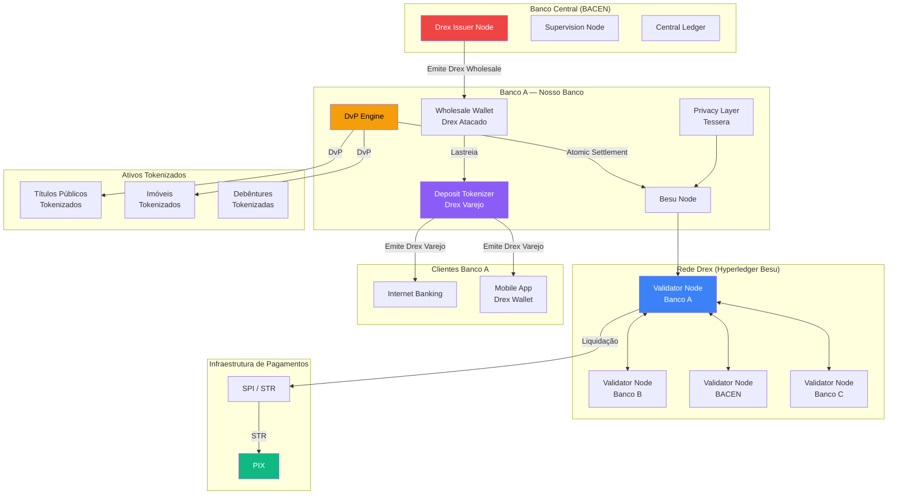
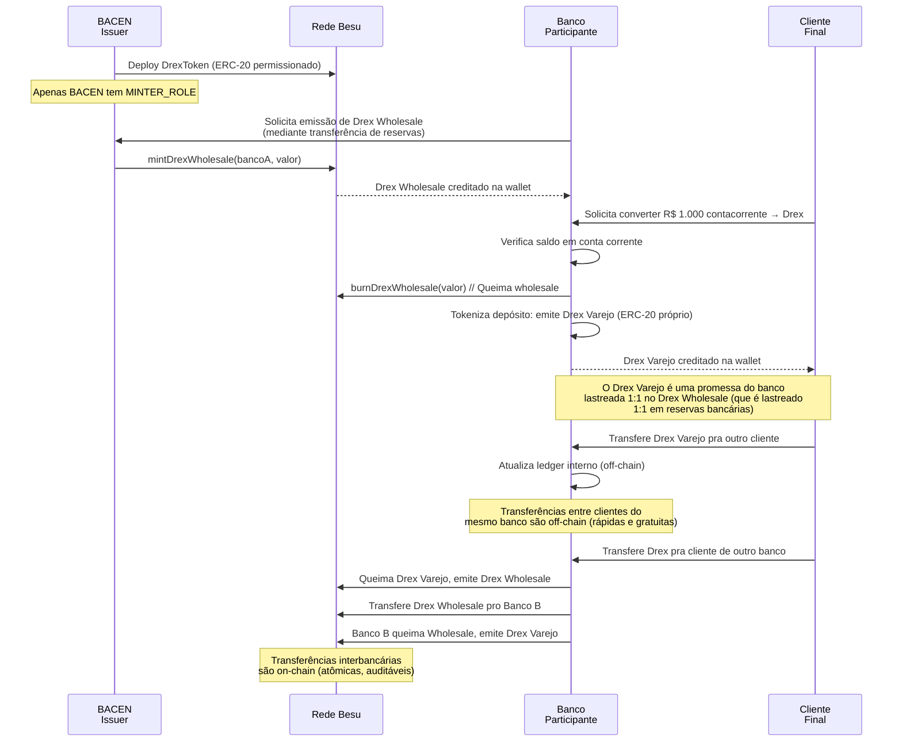
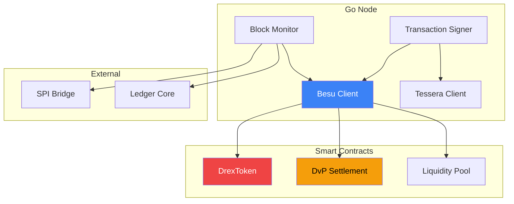

# Desafio 21: CBDC e Drex — A Moeda Digital do Banco Central do Brasil

**🇧🇷** Drex, CBDC Brasileira, Modelo Two-Tier e Smart Contracts de Liquidação  
**🇬🇧** Drex, Brazilian CBDC, Two-Tier Model and Settlement Smart Contracts

---

## 🎯 Objetivos de Aprendizado

- Compreender a arquitetura do Drex como CBDC brasileira em two-tier model
- Diferenciar CBDC wholesale (atacado) vs retail (varejo) e seus casos de uso
- Implementar smart contracts na plataforma Drex (Hyperledger Besu)
- Modelar liquidação atômica DvP (Delivery vs Payment) e PvP (Payment vs Payment)
- Integrar Drex com Pix, Open Finance e SPI via APIs de interoperabilidade
- Entender o modelo de privacidade do Drex (privacy-preserving via Besu private transactions)
- Projetar o fluxo de tokenização de depósitos bancários em Drex

---

## 📋 Pré-requisitos

### 🧠 Conceitos
- CBDC (Central Bank Digital Currency) — BIS framework
- Two-tier model (BACEN → Bancos → Clientes)
- Hyperledger Besu (Ethereum permissionado)
- Smart contracts (Solidity)
- ISO 20022 (mensageria financeira)
- Pix e SPI (Sistema de Pagamentos Instantâneos)

### 📚 Desafios Anteriores
- 18-pix-automatico (PIX recorrente, consentimento)
- 19-criptomoedas (blockchain, custódia)
- 20-tokenizacao (ERC-20/721, ativos reais)
- 02-spi (SPI, liquidação)
- 05-open-finance (compartilhamento de dados)

### 🛠️ Ferramentas
- Docker + Hyperledger Besu (rede permissionada)
- PostgreSQL 16 + Redis 7
- Hardhat (Solidity dev)
- ethers.js v6
- Kafka (eventos de liquidação)
- pnpm + Golang 1.22+

### 💻 Técnico
- Solidity (smart contracts Drex)
- TypeScript (API, orquestração)
- Go (nó Besu, processamento)
- gRPC (comunicação interbancária)
- OpenAPI (APIs de interoperabilidade BACEN)

---

## 📖 Abertura — Quando o Banco Central Vira Minerador

"Em 2020, o Banco Central do Brasil fez algo que surpreendeu o mundo financeiro. Não foi lançar o PIX — esse já era esperado. Foi anunciar que estudava criar uma **moeda digital de banco central**, uma CBDC. Na época, só as Bahamas tinham lançado uma (o Sand Dollar). China estava em testes com o e-CNY. Suécia estudava a e-Krona. E o Bacen — o mesmo Bacen que regula bancos desde 1964, que fiscaliza 200 milhões de PIX por dia, que controla a taxa SELIC — decidiu que o Brasil teria sua própria moeda digital.

Mas por que um Banco Central criaria uma moeda digital se o Brasil já tem o PIX, que é gratuito, instantâneo e funciona 24 horas? Se já tem o Real, que é digital (a maior parte do dinheiro no Brasil é escritural — existe só em computadores de bancos)? A resposta está em três palavras: **programabilidade**, **atomicidade** e **interoperabilidade**.

O PIX é uma ordem de pagamento. Ele move Reais da conta A pra conta B. Rápido, eficiente, maravilhoso. Mas o PIX não é **dinheiro programável**. Você não pode colocar R$ 100 em um smart contract que diga 'Só libere esses R$ 100 pro vendedor quando o cartório confirmar a transferência de propriedade'. Você não pode fazer um pagamento condicional: 'Transfira R$ 1 milhão pro vendedor do imóvel E simultaneamente registre a propriedade no nome do comprador'. Você não pode tokenizar Reais e usá-los como colateral em um protocolo DeFi.

O Drex (nome oficial do Real Digital, anunciado em agosto de 2023) resolve isso. O Drex é uma representação tokenizada do Real em uma plataforma DLT (Distributed Ledger Technology) operada pelo Banco Central. Ele usa a mesma unidade de conta (Real), a mesma política monetária (SELIC, metas de inflação), a mesma autoridade emissora (BACEN). A diferença é que o Drex é nativamente digital, nativamente programável, e nativamente interoperável com smart contracts.

E aqui está a sacada genial do modelo brasileiro: o **two-tier model**. O BACEN não vai distribuir Drex diretamente pra população. Ele emite o Drex no atacado (wholesale CBDC) pra bancos e instituições autorizadas. Esses bancos, por sua vez, tokenizam depósitos à vista (os Reais que os clientes têm em conta) e os transformam em Drex de varejo (retail CBDC). O BACEN opera a plataforma, emite e destrói Drex, e supervisiona. Os bancos distribuem, fazem KYC, atendem o cliente. É o mesmo modelo de dois níveis que existe hoje com o papel-moeda — só que digital e programável.

O que você pode fazer com Drex que não pode fazer com PIX?

1. **DvP Atômico (Delivery vs Payment):** Comprar um título público tokenizado e pagar com Drex na mesma transação. Se o título não for entregue, o Drex não sai. Se o Drex não for pago, o título não é transferido. Atomicidade nível banco de dados.

2. **PvP Cross-Border (Payment vs Payment):** Trocar Drex (BRL) por e-CNY (yuan chinês) ou USDC (dólar) em uma transação atômica cross-chain. Moeda A e Moeda B mudam de dono simultaneamente — ou nenhuma muda. Fim do 'Risco Herstatt' (risco de uma parte pagar e a outra não).

3. **Smart Contracts de Crédito:** Um empréstimo pessoal onde o Drex é liberado automaticamente quando o colateral (título público tokenizado) é depositado no smart contract. Se o tomador não pagar, o colateral é liquidado automaticamente e o Drex volta pro credor.

4. **IoT Payments:** Um carro elétrico que paga o pedágio automaticamente em Drex via smart contract, sem intervenção humana. Um medidor de energia que liquida consumo em tempo real em Drex.

5. **Programmable Money for Government:** Bolsa Família programável — o Drex recebido pelo beneficiário só pode ser gasto em categorias específicas (alimentação, saúde, educação), programaticamente, sem burocracia.

Esse desafio é sobre construir um nó participante da rede Drex, implementar smart contracts de liquidação, e entender por que o Brasil está na vanguarda global de CBDCs — não por acaso, mas por ter construído a infraestrutura certa (PIX, Open Finance, SPI) antes de lançar a moeda digital."

---

## 🔥 O Problema

Você é engenheiro de um banco participante do piloto Drex do BACEN (fase 2, 2025-2026). Seu banco precisa:

**Cenário 1 — Tokenização de Depósitos:** O banco recebe Drex wholesale do BACEN e precisa tokenizar depósitos à vista dos clientes. Cada R$ 1 em conta corrente vira 1 token Drex (1:1, paridade fixa). O banco é responsável por: emitir tokens Drex de varejo, lastrear 100% com Drex wholesale ou reservas no BACEN, e permitir que clientes convertam entre Real escritural e Drex livremente.

**Cenário 2 — Smart Contract DvP:** Um cliente quer comprar R$ 500 mil em títulos públicos tokenizados. O banco precisa executar a liquidação atômica: o Drex sai da conta do cliente e o título entra na carteira dele na mesma transação. Se qualquer lado falhar, tudo reverte — sem risco de 'Paguei e não recebi' ou 'Entreguei e não recebi'.

**Cenário 3 — Pool de Liquidez Interbancário:** Durante o dia, bancos precisam de Drex wholesale pra liquidar transações. O banco quer participar de um pool de liquidez onde pode tomar Drex emprestado de outros bancos via smart contract, com colateral em títulos públicos tokenizados, a juros overnight (CDI).

**Cenário 4 — Privacidade vs Rastreabilidade:** O BACEN exige rastreabilidade pra compliance (COAF, KYC, sanções), mas clientes exigem privacidade (seus saldos e transações não podem ser públicos na blockchain). Como o Drex resolve esse paradoxo?

Os problemas técnicos:

1. **Arquitetura Two-Tier** — Como modelar a relação BACEN (emissor) → Banco (distribuidor) → Cliente (usuário final) com garantia de que cada Drex de varejo é 100% lastreado?

2. **Hyperledger Besu Permissionado** — Diferente de Ethereum público, o Besu é uma rede permissionada onde só bancos autorizados rodam nós validadores. Como configurar, como deployar contratos, como gerenciar permissões?

3. **Smart Contracts Nativos vs EVM** — O Drex usa Ethereum Virtual Machine (EVM)? Sim — o Besu é compatível com EVM. Mas com restrições: contratos precisam ser aprovados pelo BACEN, tem gas limit máximo, e não podem fazer chamadas externas arbitrárias.

4. **Privacidade via Besu Private Transactions** — O Besu suporta transações privadas (Tessera/Orion) onde o payload é visível só pros participantes. Como modelar transações onde o BACEN vê tudo (compliance) mas outros bancos não?

5. **Interoperabilidade Drex ↔ PIX** — Um cliente quer pagar um boleto em Drex. Como o Drex se comunica com o SPI/STR? Como o comerciante recebe Reais se ele não está na rede Drex?

6. **Atomic Settlement** — Implementar DvP e PvP que garantam atomicidade. Se o smart contract falhar no meio, como garantir rollback total?

7. **Escalabilidade** — A rede Drex precisa processar volume comparável ao PIX (2500 TPS em pico). Hyperledger Besu processa ~300 TPS. Como escalar?

---

## 🏗️ Arquitetura Geral

<LanguageToggle />

<div class="Lang-content ts" style="Display:block;">

### Visão Macro — Ecossistema Drex



### A Stack

**Blockchain:** Hyperledger Besu (Ethereum permissionado, PoA IBFT 2.0, EVM compatível).

**Private Transactions:** Tessera (Privacy Manager, PGP-style encryption).

**Backend (TypeScript):** Koa + PostgreSQL (off-chain records) + Redis (nonce manager) + ethers.js v6 (Besu interaction) + Kafka (event streaming).

**Core (Go):** Tokenização de depósitos, integração SPI, processamento batch de reconciliação.

**Smart Contracts:** Solidity (EVN compatível), OpenZeppelin, contratos aprovados na sandbox BACEN.

### Two-Tier Model — Arquitetura de Emissão



### Smart Contract: Drex Token (ERC-20 Permissionado)

```solidity
// SPDX-License-Identifier: MIT
pragma solidity ^0.8.20;

import "@openzeppelin/contracts/token/ERC20/ERC20.sol";
import "@openzeppelin/contracts/access/AccessControl.sol";
import "@openzeppelin/contracts/security/Pausable.sol";
import "@openzeppelin/contracts/security/ReentrancyGuard.sol";

contract DrexToken is ERC20, AccessControl, Pausable, ReentrancyGuard {
    bytes32 public constant MINTER_ROLE = keccak256("MINTER_ROLE");
    bytes32 public constant BURNER_ROLE = keccak256("BURNER_ROLE");
    bytes32 public constant PAUSER_ROLE = keccak256("PAUSER_ROLE");
    bytes32 public constant COMPLIANCE_ROLE = keccak256("COMPLIANCE_ROLE");

    struct TransactionRecord {
        address from;
        address to;
        uint256 amount;
        uint256 timestamp;
        bytes32 transactionType; // DVP, PVP, TRANSFER, ISSUANCE, REDEMPTION
        bytes data;              // Metadados da transação (ISO 20022 ref)
    }

    mapping(address => bool) public isAuthorizedParticipant;
    mapping(bytes32 => TransactionRecord) public transactionLog;
    uint256 public transactionCount;

    // Controle de limites por participante
    mapping(address => uint256) public dailyMintLimit;
    mapping(address => uint256) public dailyMintUsed;
    uint256 public lastResetDate;

    event DrexIssued(address indexed to, uint256 amount, bytes32 indexed txId);
    event DrexRedeemed(address indexed from, uint256 amount, bytes32 indexed txId);
    event ParticipantAuthorized(address indexed participant);
    event ParticipantRevoked(address indexed participant);
    event TransactionLogged(bytes32 indexed txId, address from, address to, uint256 amount);

    constructor(address bacen) ERC20("Drex", "DRX") {
        _grantRole(DEFAULT_ADMIN_ROLE, bacen);
        _grantRole(MINTER_ROLE, bacen);
        _grantRole(BURNER_ROLE, bacen);
        _grantRole(PAUSER_ROLE, bacen);
        _grantRole(COMPLIANCE_ROLE, bacen);

        isAuthorizedParticipant[bacen] = true;
        _setDecimals(2); // Centavos
    }

    modifier onlyParticipant() {
        require(isAuthorizedParticipant[msg.sender], "Not authorized participant");
        _;
    }

    modifier withinDailyLimit(uint256 amount) {
        if (block.timestamp > lastResetDate + 86400) {
            dailyMintUsed[msg.sender] = 0;
            // lastResetDate atualizado no próximo mint
        }
        require(
            dailyMintUsed[msg.sender] + amount <= dailyMintLimit[msg.sender],
            "Daily mint limit exceeded"
        );
        _;
    }

    // BACEN emite Drex Wholesale pra um banco participante
    function issueWholesale(
        address to,
        uint256 amount
    ) external onlyRole(MINTER_ROLE) nonReentrant withinDailyLimit(amount) {
        require(isAuthorizedParticipant[to], "Recipient not a participant");

        dailyMintUsed[to] += amount;
        _mint(to, amount);

        bytes32 txId = _logTransaction(address(0), to, amount, "ISSUANCE", "");
        emit DrexIssued(to, amount, txId);
    }

    // Participante queima Drex Wholesale (ex: pra emitir varejo)
    function redeemWholesale(uint256 amount) external onlyParticipant nonReentrant {
        require(balanceOf(msg.sender) >= amount, "Insufficient balance");

        _burn(msg.sender, amount);

        bytes32 txId = _logTransaction(msg.sender, address(0), amount, "REDEMPTION", "");
        emit DrexRedeemed(msg.sender, amount, txId);
    }

    // Transferência entre participantes (interbancário)
    function transfer(address to, uint256 amount) public override onlyParticipant returns (bool) {
        require(isAuthorizedParticipant[to], "Recipient not a participant");

        bool result = super.transfer(to, amount);
        if (result) {
            _logTransaction(msg.sender, to, amount, "TRANSFER", "");
        }
        return result;
    }

    // Liquidação atômica DvP (chamada externa via contrato DvP)
    function atomicTransfer(
        address from,
        address to,
        uint256 amount
    ) external onlyParticipant returns (bool) {
        require(isAuthorizedParticipant[from] && isAuthorizedParticipant[to],
                "Participants not authorized");
        require(balanceOf(from) >= amount, "Insufficient balance");

        _transfer(from, to, amount);
        _logTransaction(from, to, amount, "DVP", "");
        return true;
    }

    function addParticipant(address participant, uint256 dailyLimit) external onlyRole(DEFAULT_ADMIN_ROLE) {
        isAuthorizedParticipant[participant] = true;
        dailyMintLimit[participant] = dailyLimit;
        emit ParticipantAuthorized(participant);
    }

    function _logTransaction(
        address from,
        address to,
        uint256 amount,
        bytes32 txType,
        bytes memory metadata
    ) internal returns (bytes32) {
        bytes32 txId = keccak256(abi.encodePacked(
            from, to, amount, block.timestamp, transactionCount
        ));
        transactionLog[txId] = TransactionRecord({
            from: from,
            to: to,
            amount: amount,
            timestamp: block.timestamp,
            transactionType: txType,
            data: metadata
        });
        transactionCount++;
        emit TransactionLogged(txId, from, to, amount);
        return txId;
    }
}
```

### Smart Contract: Atomic DvP Settlement

```solidity
// SPDX-License-Identifier: MIT
pragma solidity ^0.8.20;

import "@openzeppelin/contracts/token/ERC20/IERC20.sol";
import "@openzeppelin/contracts/token/ERC721/IERC721.sol";
import "@openzeppelin/contracts/security/ReentrancyGuard.sol";

contract DrexAtomicSettlement is ReentrancyGuard {
    struct SettlementOrder {
        address buyer;
        address seller;
        address assetContract;      // Título público tokenizado, imóvel, etc
        uint256 assetId;            // 0 pra ERC-20, tokenId pra ERC-721
        uint256 assetAmount;        // Quantidade ou 1
        address paymentContract;    // DrexToken
        uint256 paymentAmount;      // Valor em Drex
        uint256 expiry;
        bool isNFT;
        SettlementStatus status;
    }

    enum SettlementStatus { PENDING, SETTLED, CANCELLED, EXPIRED }

    mapping(bytes32 => SettlementOrder) public orders;
    mapping(address => uint256) public lockedBalance;

    event OrderCreated(bytes32 indexed orderId, address buyer, address seller, uint256 assetAmount, uint256 paymentAmount);
    event OrderSettled(bytes32 indexed orderId);
    event OrderCancelled(bytes32 indexed orderId);

    function createOrder(
        address seller,
        address assetContract,
        uint256 assetId,
        uint256 assetAmount,
        address paymentContract,
        uint256 paymentAmount,
        bool isNFT,
        uint256 validForSeconds
    ) external returns (bytes32) {
        require(paymentAmount > 0, "Payment must be positive");

        bytes32 orderId = keccak256(abi.encodePacked(
            msg.sender, seller, assetContract, assetId, assetAmount,
            paymentContract, paymentAmount, block.timestamp
        ));

        // Bloqueia o Drex do comprador
        IERC20(paymentContract).transferFrom(msg.sender, address(this), paymentAmount);
        lockedBalance[msg.sender] += paymentAmount;

        // Vendedor deposita o ativo
        if (isNFT) {
            IERC721(assetContract).transferFrom(seller, address(this), assetId);
        } else {
            IERC20(assetContract).transferFrom(seller, address(this), assetAmount);
        }

        orders[orderId] = SettlementOrder({
            buyer: msg.sender,
            seller: seller,
            assetContract: assetContract,
            assetId: assetId,
            assetAmount: assetAmount,
            paymentContract: paymentContract,
            paymentAmount: paymentAmount,
            expiry: block.timestamp + validForSeconds,
            isNFT: isNFT,
            status: SettlementStatus.PENDING
        });

        emit OrderCreated(orderId, msg.sender, seller, assetAmount, paymentAmount);
        return orderId;
    }

    function settle(bytes32 orderId) external nonReentrant {
        SettlementOrder storage order = orders[orderId];
        require(order.status == SettlementStatus.PENDING, "Invalid state");
        require(block.timestamp <= order.expiry, "Order expired");

        // ATÔMICO: ambas as transferências em sequência
        // Se qualquer uma falhar, tudo reverte

        // 1. Transfere ativo pro comprador
        if (order.isNFT) {
            IERC721(order.assetContract).transferFrom(address(this), order.buyer, order.assetId);
        } else {
            IERC20(order.assetContract).transfer(order.buyer, order.assetAmount);
        }

        // 2. Transfere Drex pro vendedor
        lockedBalance[order.buyer] -= order.paymentAmount;
        IERC20(order.paymentContract).transfer(order.seller, order.paymentAmount);

        order.status = SettlementStatus.SETTLED;
        emit OrderSettled(orderId);
    }
}
```

### Deposit Tokenizer — Bridge Real Escritural ↔ Drex Varejo

```typescript
import { Contract, ethers } from 'ethers';
import { DrexToken__factory } from '../typechain';

export class DepositTokenizer {
  private drexWholesale: Contract;
  private drexRetail: Contract;
  private ledgerRepository: any;

  async convertToDrex(clientId: string, amount: number): Promise<string> {
    // 1. Verifica saldo em conta corrente
    const balance = await this.ledgerRepository.getBalance(clientId);
    if (balance < amount) throw new Error('Saldo insuficiente');

    // 2. Debita conta corrente (off-chain)
    await this.ledgerRepository.debit(clientId, amount);

    // 3. Queima Drex Wholesale (on-chain) — libera reserva
    const wholesaleTx = await this.drexWholesale.redeemWholesale(
      ethers.parseUnits(amount.toString(), 2)
    );
    await wholesaleTx.wait();

    // 4. Emite Drex Varejo (on-chain, contrato próprio do banco)
    const retailTx = await this.drexRetail.mintRetail(
      clientId,
      ethers.parseUnits(amount.toString(), 2)
    );
    await retailTx.wait();

    return retailTx.hash;
  }

  async convertFromDrex(clientId: string, amount: number): Promise<string> {
    const retailBalance = await this.drexRetail.balanceOf(clientId);
    if (retailBalance < ethers.parseUnits(amount.toString(), 2)) {
      throw new Error('Drex insuficiente');
    }

    // 1. Queima Drex Varejo
    const burnTx = await this.drexRetail.burnRetail(
      clientId,
      ethers.parseUnits(amount.toString(), 2)
    );
    await burnTx.wait();

    // 2. Emite Drex Wholesale (volta reserva)
    const wholesaleTx = await this.drexWholesale.mint(
      this.bankAddress,
      ethers.parseUnits(amount.toString(), 2)
    );
    await wholesaleTx.wait();

    // 3. Credita conta corrente
    await this.ledgerRepository.credit(clientId, amount);

    return burnTx.hash;
  }
}
```

### Interoperabilidade Drex ↔ PIX

```typescript
export class DrexPixBridge {
  // Cliente quer pagar um QR Code PIX com Drex
  async payPixWithDrex(drexPayer: string, pixQrCode: string, amount: number): Promise<string> {
    // 1. Decodifica QR Code PIX
    const pixPayload = this.decodePixQrCode(pixQrCode);

    // 2. Verifica se o recebedor aceita Drex
    if (!pixPayload.acceptsDrex) {
      // Converte Drex → Real escritural → PIX
      await this.depositTokenizer.convertFromDrex(drexPayer, amount);
      return await this.pixClient.sendPix(pixPayload, amount);
    }

    // 3. Se aceita Drex, transfere diretamente
    const tx = await this.drexWholesale.transfer(
      pixPayload.drexAddress,
      ethers.parseUnits(amount.toString(), 2)
    );
    return tx.hash;
  }

  // Comerciante quer receber PIX normal, mas pagador pagou em Drex
  async receivePixAsDrex(pixTransaction: any): Promise<void> {
    if (pixTransaction.type === 'DREX') {
      const drexAmount = ethers.parseUnits(pixTransaction.amount.toString(), 2);
      // Já está em Drex, não precisa converter
      await this.ledgerRepository.creditDrex(pixTransaction.recipient, drexAmount);
    }
  }
}
```

---

## 🧠 A Profundidade

### Two-Tier Model — Por que Não Emitir CBDC Diretamente Pro Cidadão?

O debate global sobre CBDC tem dois campos: **retail CBDC direta** (Banco Central emite diretamente pro cidadão, com conta no BACEN pra cada brasileiro) e **wholesale CBDC com two-tier** (BACEN emite pra bancos, bancos distribuem).

O Brasil escolheu o modelo two-tier por razões pragmáticas:

1. **BACEN não quer ser banco de varejo.** Imagina o Bacen tendo que fazer KYC de 215 milhões de brasileiros, abrir contas, gerenciar fraudes, dar suporte ao cliente, fazer cobrança. Isso não é papel de Banco Central.

2. **Preserva o sistema bancário.** Se todo mundo pudesse ter conta diretamente no BACEN, por que manter conta em banco? Haveria uma fuga massiva de depósitos bancários, colapsando o crédito. Bancos usam depósitos pra emprestar — se os depósitos migrarem pro BACEN, o crédito seca.

3. **Inovação na ponta.** Bancos competem pra oferecer a melhor experiência em cima do Drex (carteiras, UX, integração com Open Finance, produtos). O BACEN provê a infraestrutura neutra. A competição acontece na camada de serviços.

4. **Modelo já testado.** É exatamente como o papel-moeda funciona hoje: o BACEN emite cédulas, os bancos distribuem. O two-tier digital é análogo.

### Hyperledger Besu — Por que Não Ethereum Público?

O Drex usa Hyperledger Besu, um cliente Ethereum permissionado. As diferenças:

| Aspecto | Ethereum Público | Hyperledger Besu (Drex) |
|---------|-----------------|------------------------|
| **Consenso** | Proof of Stake | IBFT 2.0 (Byzantine Fault Tolerant) |
| **Validadores** | Qualquer um com 32 ETH | Apenas instituições autorizadas pelo BACEN |
| **Finalidade** | Probabilística (~12 min) | Instantânea (1 bloco, ~2s) |
| **Privacidade** | Tudo público | Private transactions (Tessera) |
| **Gas** | Pago em ETH (volátil) | Pago em Drex ou subsidiado |
| **Governança** | Descentralizada (EIPs) | BACEN + Comitê de Participantes |
| **Escalabilidade** | ~30 TPS (L1) | ~300 TPS (com otimizações Besu) |

A escolha do Besu foi estratégica: é EVM-compatível (Solidity funciona), tem finalidade instantânea (IBFT 2.0), suporta transações privadas (essencial pra compliance + privacidade), e é open-source (Hyperledger Foundation, Linux Foundation).

### Privacidade vs Rastreabilidade — O Paradoxo do Drex

Esse é o problema mais difícil do Drex, e o que mais atrasou o piloto. O BACEN precisa de **rastreabilidade completa** (toda transação deve ser auditável pra compliance, COAF, investigação criminal). Mas cidadãos e empresas exigem **privacidade** (meus saldos e transações não podem ser visíveis a concorrentes, criminosos, ou ao governo sem ordem judicial).

A solução do Drex usa três camadas:

**1. Private Transactions (Besu/Tessera):** Transações entre partes são visíveis apenas para elas e para o BACEN (nó regulador). Outros bancos não veem os detalhes. Isso é implementado via Tessera (Privacy Manager) que gerencia chaves de criptografia e grupos de privacidade.

**2. On-chain (público) vs Off-chain (privado):** Transferências entre clientes do mesmo banco são off-chain (ledger interno do banco). Só transferências interbancárias são on-chain. Isso reduz exposição e volume on-chain.

**3. Zero-Knowledge Proofs (futuro):** O piloto atual não usa ZK-proofs, mas é o roadmap: provar que uma transação é válida (ex: "O remetente tinha saldo suficiente") sem revelar o saldo, o valor, ou as identidades.

```typescript
// Configuração de transação privada no Besu
export async function sendPrivateTransaction(
  contract: Contract,
  method: string,
  params: any[],
  participants: string[] // Public keys Tessera dos participantes
): Promise<string> {
  const tx = await contract.populateTransaction[method](...params);

  const privateTx = {
    from: this.wallet.address,
    to: contract.address,
    data: tx.data,
    privateFrom: this.tesseraPublicKey,
    privateFor: participants,
    gasLimit: 500000,
  };

  // Besu: envia via eea_sendRawTransaction com payload privado
  const txHash = await this.besuProvider.send('eea_sendRawTransaction', [privateTx]);
  return txHash;
}
```

### DvP e PvP — O Fim do Risco de Liquidação

O DvP (Delivery vs Payment) resolve o problema: comprador paga e vendedor entrega. No sistema tradicional (ex: bolsa de valores), existe um intervalo de D+1 ou D+2 entre o pagamento e a entrega. Nesse intervalo, uma das partes pode falir. Isso se chama **principal risk**.

O PvP (Payment vs Payment) resolve o problema cross-border: trocar Reais por Dólares. No sistema tradicional, você manda Reais via STR (Brasil) e espera Dólares via CHIPS (EUA). Os sistemas não se comunicam. Se um lado falhar, o outro fica no prejuízo. Isso se chama **Herstatt risk** (Banco Herstatt, 1974: recebeu marcos alemães de manhã, faliu de tarde, nunca entregou os dólares).

O Drex permite DvP e PvP atômicos: ambos os lados da transação estão no mesmo smart contract, na mesma blockchain, processados na mesma transação. Ou os dois acontecem, ou nenhum. Atomicidade via EVM.

### Integração com Open Finance

O Open Finance (desafio 05) permite compartilhamento de dados entre instituições. Com o Drex, o Open Finance ganha uma nova dimensão:

1. **Iniciação de Pagamento Drex:** Assim como o PISP inicia PIX, um iniciador poderá iniciar transações Drex — sempre com consentimento granular.

2. **Agregação de Ativos Digitais:** O cliente pode ver, no app do seu banco principal, todos os seus saldos: conta corrente, investimentos, Drex varejo, e até tokens de ativos (títulos, imóveis) — tudo agregado via Open Finance.

3. **Consentimento para Smart Contracts:** O cliente autoriza um smart contract a debitar Drex de sua wallet, similar ao PIX Automático (desafio 18), mas com regras programáveis complexas.

---

## 🧪 Testando a Rede Drex

### Teste 1: Emissão e Resgate de Drex Wholesale

```typescript
it('should mint and redeem Drex Wholesale', async () => {
  const { drexToken, bacen, banco } = await deployDrexToken();

  // BACEN emite R$ 1.000.000 em Drex Wholesale pro banco
  await drexToken.connect(bacen).issueWholesale(banco.address, parseUnits('1000000', 2));

  const bancoBalance = await drexToken.balanceOf(banco.address);
  expect(bancoBalance).to.equal(parseUnits('1000000', 2));

  // Banco resgata (queima) R$ 100.000
  await drexToken.connect(banco).redeemWholesale(parseUnits('100000', 2));

  const afterBalance = await drexToken.balanceOf(banco.address);
  expect(afterBalance).to.equal(parseUnits('900000', 2));
});
```

### Teste 2: Liquidação DvP Atômica

```typescript
it('should settle asset vs Drex atomically', async () => {
  const { drexToken, assetToken, dvpContract, buyer, seller } = await deployDvP();

  // Buyer tem Drex, seller tem ativo
  await drexToken.mint(buyer.address, parseUnits('10000', 2));
  await assetToken.mint(seller.address, parseUnits('50', 18));

  const orderId = await dvpContract.createOrder(
    seller.address,
    assetToken.address,
    0, // ERC-20
    parseUnits('50', 18),
    drexToken.address,
    parseUnits('10000', 2),
    false,
    3600
  );

  await dvpContract.settle(orderId);

  expect(await assetToken.balanceOf(buyer.address)).to.equal(parseUnits('50', 18));
  expect(await drexToken.balanceOf(seller.address)).to.equal(parseUnits('10000', 2));
});
```

### Teste 3: Participante Não Autorizado Bloqueado

```typescript
it('should block unauthorized participants', async () => {
  const { drexToken, banco, naoAutorizado } = await deployDrexToken();

  await drexToken.addParticipant(banco.address, parseUnits('1000000000', 2));

  await expect(
    drexToken.connect(naoAutorizado).transfer(banco.address, parseUnits('100', 2))
  ).to.be.revertedWith('Not authorized participant');
});
```

---

## 💡 Lições Aprendidas

1. **Drex não é criptomoeda — é moeda digital de Banco Central** — Não tem volatilidade, não tem mineração, não é descentralizado. É o Real em forma tokenizada, emitido e controlado pelo BACEN.

2. **Two-tier model é a chave da adoção** — BACEN provê infraestrutura neutra. Bancos competem em inovação. Clientes não precisam ter conta no BACEN.

3. **Smart contracts no Drex são permissionados** — Nem todo contrato pode ser deployado. O BACEN aprova contratos-padrão (DvP, PvP, escrow) e autoriza contratos customizados caso a caso.

4. **Privacidade é o problema mais difícil** — Rastreabilidade regulatória vs privacidade do cidadão. O modelo de private transactions (Tessera) é um paliativo; ZK-proofs são o futuro.

5. **DvP atômico elimina risco de principal** — A liquidação simultânea de pagamento e entrega no mesmo smart contract é a inovação mais prática do Drex.

6. **Interoperabilidade com PIX é mandatória** — O Drex não substitui o PIX. Eles coexistem: PIX pra pagamentos simples, Drex pra pagamentos programáveis e ativos tokenizados.

7. **Hyperledger Besu é uma escolha pragmática** — EVM-compatível (ecossistema Ethereum), finalidade instantânea (IBFT), transações privadas (Tessera), open-source. Não é perfeito, mas é adequado.

8. **O Brasil lidera CBDCs porque construiu a base antes** — PIX, Open Finance, SPI, regulação de criptoativos. O Drex não é um projeto isolado — é a camada final de uma estratégia de digitalização financeira de 10 anos.

---

## 🚀 Como Testar na Prática

```bash
# Sobe rede Besu local (4 validadores)
docker-compose -f docker/besu-network.yml up -d

# Deploy dos contratos base (DrexToken, DvP)
npx hardhat run scripts/deploy-drex.ts --network besu

# Configura Tessera (privacy)
docker-compose -f docker/tessera.yml up -d

# Inicia nó do banco
pnpm --filter @banking/drex-node dev

# Emitir Drex Wholesale (BACEN → Banco)
curl -X POST http://localhost:3007/api/drex/issue \
  -H "Content-Type: application/json" \
  -d '{"to": "0xBancoA", "amount": "1000000.00"}'

# Converter Real → Drex (cliente)
curl -X POST http://localhost:3007/api/drex/convert \
  -H "Content-Type: application/json" \
  -d '{"clientId": "client-123", "amount": "1000.00", "direction": "TO_DREX"}'

# Criar ordem DvP
curl -X POST http://localhost:3007/api/dvp/order \
  -H "Content-Type: application/json" \
  -d '{
    "assetContract": "0xTituloPublico",
    "assetAmount": "50000.00",
    "paymentAmount": "50000.00",
    "seller": "0xTesouroNacional",
    "isNFT": false,
    "validForSeconds": 3600
  }'

# Liquidar ordem DvP
curl -X POST http://localhost:3007/api/dvp/0xOrderId/settle
```

---

## 🔧 Troubleshooting

### 1. "Not authorized participant" ao transferir Drex

**Causa:** O endereço não foi adicionado como participante autorizado na rede Drex.  
**Solução:** Apenas o BACEN (`DEFAULT_ADMIN_ROLE`) pode adicionar participantes. Solicite autorização formal ao regulador antes do teste.

### 2. Transação privada não visível para participante

**Causa:** O `privateFor` não inclui a chave pública Tessera do participante, ou o Tessera node não está sincronizado.  
**Solução:** Verifique se a chave pública Tessera está correta. Use `eea_getTransactionReceipt` com a private key do participante pra buscar a transação privada.

### 3. Gas limit exceeded em contrato DvP

**Causa:** O contrato DvP faz múltiplas transferências de token em uma transação, cada uma consumindo ~50k gas.  
**Solução:** Aumente o `gasLimit` da transação pra 500k+. Monitore o gas usado e ajuste conforme necessidade.

### 4. Nonce manager conflitando entre workers

**Causa:** Múltiplos workers usando o mesmo signer, nonces colidindo.  
**Solução:** Use um `NonceManager` centralizado no Redis: `INCR nonce:0xBancoA` a cada transação. Ou use um worker dedicado pra assinatura com fila.

---

## 📚 O que vem depois

- **Cross-Border PvP** — Liquidação atômica Drex ↔ e-CNY (China) ou Drex ↔ USDC, via HTLC ou bridges inter-blockchain.
- **Triggered Payments** — Smart contracts que disparam pagamentos baseados em eventos externos (ex: confirmação de entrega por IoT, leitura de medidor).
- **Programmable Compliance** — Regras de compliance (limite de valor, frequência, geolocalização) programadas diretamente no smart contract.
- **CBDC Interoperability (mBridge)** — Projeto mBridge do BIS conectando CBDCs de múltiplos países (China, Tailândia, UAE, Hong Kong).
- **Zero-Knowledge Drex** — Privacidade total via ZK-rollups sem perder rastreabilidade regulatória.
- **Tokenização de Depósitos Interbancários** — Mercado interbancário de Drex wholesale com taxas CDI overnight via smart contracts.

---

</div>

<div class="Lang-content go" style="Display:none;">

### Drex Node em Go



### Go: Interação com Besu

```go
package drex

import (
    "context"
    "crypto/ecdsa"
    "math/big"
    "time"

    "github.com/ethereum/go-ethereum/accounts/abi/bind"
    "github.com/ethereum/go-ethereum/common"
    "github.com/ethereum/go-ethereum/ethclient"
)

type BesuClient struct {
    client    *ethclient.Client
    chainID   *big.Int
    signerKey *ecdsa.PrivateKey
    signer    common.Address
}

func NewBesuClient(rpcURL string, privateKeyHex string) (*BesuClient, error) {
    client, err := ethclient.Dial(rpcURL)
    if err != nil {
        return nil, fmt.Errorf("connecting to Besu: %w", err)
    }

    chainID, err := client.ChainID(context.Background())
    if err != nil {
        return nil, fmt.Errorf("getting chain ID: %w", err)
    }

    privateKey, err := crypto.HexToECDSA(privateKeyHex)
    if err != nil {
        return nil, fmt.Errorf("parsing private key: %w", err)
    }

    return &BesuClient{
        client:    client,
        chainID:   chainID,
        signerKey: privateKey,
        signer:    crypto.PubkeyToAddress(privateKey.PublicKey),
    }, nil
}

func (c *BesuClient) IssueDrexWholesale(ctx context.Context, to common.Address, amount *big.Int) (string, error) {
    auth, err := bind.NewKeyedTransactorWithChainID(c.signerKey, c.chainID)
    if err != nil {
        return "", err
    }

    drexToken, err := NewDrexToken(drexTokenAddress, c.client)
    if err != nil {
        return "", err
    }

    tx, err := drexToken.IssueWholesale(auth, to, amount)
    if err != nil {
        return "", fmt.Errorf("issuing wholesale: %w", err)
    }

    receipt, err := bind.WaitMined(ctx, c.client, tx)
    if err != nil {
        return "", fmt.Errorf("waiting for receipt: %w", err)
    }

    if receipt.Status != 1 {
        return "", fmt.Errorf("transaction failed: %s", tx.Hash().Hex())
    }

    return tx.Hash().Hex(), nil
}

func (c *BesuClient) MonitorBlocks(ctx context.Context, eventCh chan<- DrexEvent) error {
    headers := make(chan *types.Header)
    sub, err := c.client.SubscribeNewHead(ctx, headers)
    if err != nil {
        return fmt.Errorf("subscribing to headers: %w", err)
    }
    defer sub.Unsubscribe()

    for {
        select {
        case <-ctx.Done():
            return ctx.Err()
        case err := <-sub.Err():
            return fmt.Errorf("subscription error: %w", err)
        case header := <-headers:
            block, err := c.client.BlockByHash(ctx, header.Hash())
            if err != nil {
                continue
            }

            for _, tx := range block.Transactions() {
                if tx.To() != nil {
                    if *tx.To() == drexTokenAddress || *tx.To() == dvpAddress {
                        eventCh <- DrexEvent{
                            BlockNumber: block.NumberU64(),
                            TxHash:     tx.Hash().Hex(),
                            From:       common.Address{}, // precisa recuperar signer
                            To:         tx.To().Hex(),
                            Value:      tx.Value().String(),
                        }
                    }
                }
            }
        }
    }
}

type DrexEvent struct {
    BlockNumber uint64
    TxHash      string
    From        common.Address
    To          string
    Value       string
    EventType   string
}
```

### Comparação: Besu/Go vs Ethereum/TypeScript

| Aspecto | Besu + Go | Ethereum + TypeScript |
|---------|-----------|----------------------|
| **Performance de nó** | Go nativo, alta performance | JS via RPC, menor |
| **Privacidade (Tessera)** | Suporte nativo | Via RPC |
| **IBFT consenso** | Go implementa | N/A (PoS) |
| **Deploy contratos** | Go (verboso) | TypeScript + Hardhat (produtivo) |
| **Monitoramento** | Goroutines eficientes | EventEmitter OK |
| **Integração SPI** | Go (baixa latência) | TypeScript (mais lento) |

---

</div>

<FlashcardReview />

<Quiz />

<GiscusComments />
