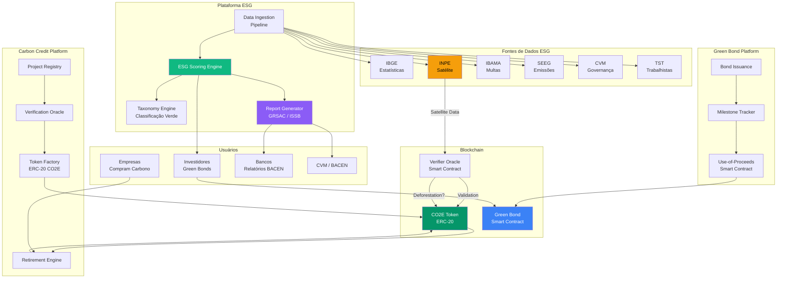
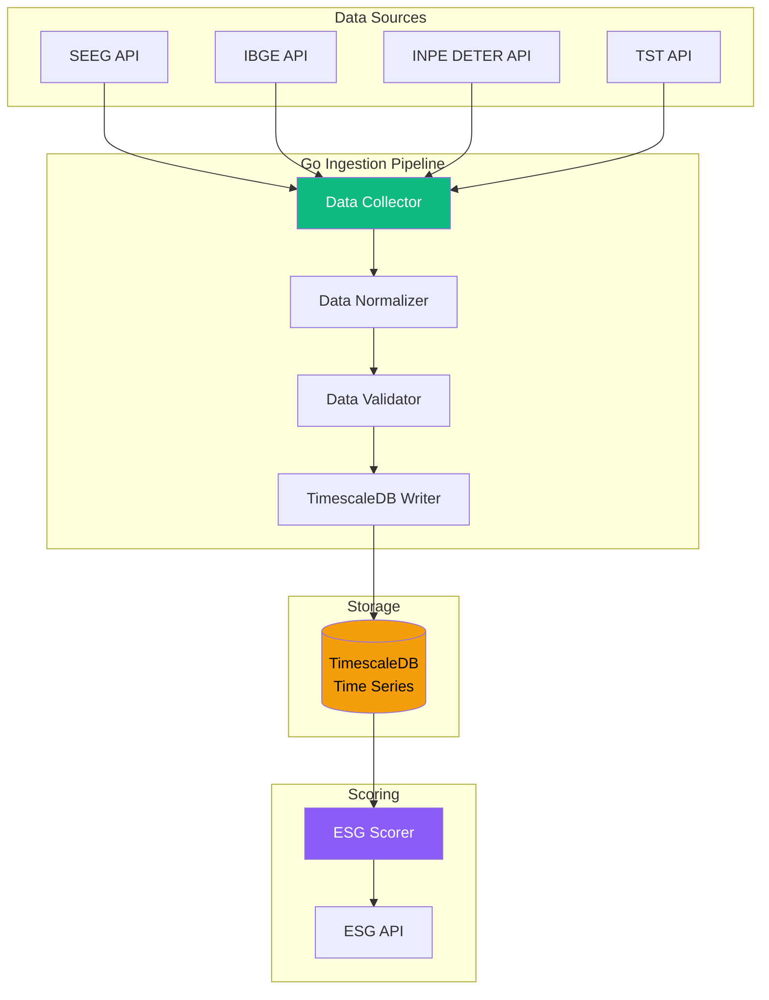

# Desafio 22: ESG e Green Finance — Finanças Sustentáveis no Sistema Financeiro Nacional

**🇧🇷** Crédito de Carbono Tokenizado, Green Bonds e Relatórios ESG Regulatórios  
**🇬🇧** Tokenized Carbon Credits, Green Bonds and ESG Regulatory Reporting

---

## 🎯 Objetivos de Aprendizado

- Compreender o ecossistema de finanças sustentáveis no Brasil (CVM, BACEN, B3)
- Implementar tokenização de créditos de carbono com ERC-20
- Construir um motor de scoring ESG para investimentos (Environmental, Social, Governance)
- Modelar Green Bonds (títulos verdes) com rastreabilidade de uso de recursos
- Integrar APIs de dados ESG (CDP, SASB, GRI, ISSB)
- Gerar relatórios regulatórios automatizados (CVM Res. 59, BACEN Res. 4.943)
- Implementar medição de impacto com APIs de sustentabilidade (IBGE, INPE, SEEG)

---

## 📋 Pré-requisitos

### 🧠 Conceitos
- ESG (Environmental, Social, Governance)
- Créditos de carbono (mercado regulado vs voluntário)
- Green bonds (ICMA Green Bond Principles)
- Taxonomia sustentável brasileira (em desenvolvimento pelo BACEN)
- Relatórios de sustentabilidade (GRI, SASB, ISSB, TCFD)

### 📚 Desafios Anteriores
- 20-tokenizacao (tokenização de ativos, ERC-20/721)
- 21-cbdc-drex (Drex, smart contracts, liquidação)
- 11-kyc (identidade, compliance)
- 08-report (geração de relatórios)
- 14-rfc (padronização)

### 🛠️ Ferramentas
- Docker + PostgreSQL 16
- TimescaleDB (séries temporais de métricas ESG)
- Redis 7 (cache de scores)
- Hardhat (smart contracts)
- IPFS (registro de projetos de carbono)
- pnpm + Golang 1.22+

### 💻 Técnico
- TypeScript (API, motor de scoring)
- Go (processamento batch, ingestão de dados)
- Solidity (carbon credit tokens)
- Python opcional (data science, modelos ESG)
- GraphQL (API de consulta de métricas ESG)

---

## 📖 Abertura — O Dinheiro que Planta Árvores

"Em 1997, numa cidade chamada Kyoto, no Japão, 84 países assinaram um protocolo que mudaria a forma como o mundo precifica a poluição. O Protocolo de Kyoto criou os **mecanismos de flexibilização**: se um país desenvolvido não conseguisse reduzir suas emissões, ele poderia comprar 'Créditos de carbono' de países que reduziram além da meta. Nascia ali o mercado de carbono — a ideia de que uma tonelada de CO2 evitada na Amazônia tem o mesmo valor atmosférico que uma tonelada reduzida na Alemanha.

Vinte e cinco anos depois, em 2022, o mundo emitiu 37 bilhões de toneladas de CO2. O preço do carbono na União Europeia chegou a €100 por tonelada. O mercado global de créditos de carbono movimentou US$ 850 bilhões. E o Brasil — o país com a maior floresta tropical do mundo, a maior biodiversidade, a matriz energética mais limpa entre as grandes economias — capturou menos de 1% desse mercado.

Por quê? Porque crédito de carbono é papel. Literalmente. Uma certificadora audita um projeto de reflorestamento no Pará, emite um documento PDF atestando que 10.000 toneladas de CO2 foram sequestradas, e vende esse PDF pra uma empresa na Europa. O PDF passa por 5 intermediários — cada um adiciona spread, comissão, risco de fraude. A empresa europeia comprou o PDF, mas não tem como verificar se as árvores realmente existem, se não foram cortadas depois, se o mesmo crédito não foi vendido duas vezes (double counting). O mercado de carbono voluntário é, essencialmente, um mercado de confiança em PDFs.

Agora imagina o seguinte: cada tonelada de CO2 sequestrada vira um token ERC-20. O token é emitido no momento da certificação (on-chain, imutável, auditável). Satélites (INPE, Planet Labs) monitoram a área reflorestada e reportam dados on-chain via oráculos. Se a floresta for desmatada, o smart contract queima os tokens correspondentes automaticamente. A empresa europeia compra o token, não o PDF. Ela pode verificar on-chain: o token existe, não foi queimado (double counting), a área reflorestada corresponde à quantidade de tokens. O custo de intermediação cai 90%. A confiança sobe 1000%.

Isso é **carbon credit tokenization** — e é o primeiro pilar desse desafio.

Mas finanças sustentáveis vão muito além de carbono. O segundo pilar é **Green Bonds** (títulos verdes). Uma empresa de saneamento emite R$ 500 milhões em debêntures pra construir estações de tratamento de água. O título é certificado como 'Verde' pela Climate Bonds Initiative. Mas como os investidores sabem que o dinheiro foi realmente usado pra saneamento, e não pra pagar bônus de executivos? A resposta é **rastreabilidade on-chain**: cada real do green bond é tokenizado, e o uso dos recursos é registrado em smart contract. O investidor pode ver, em tempo real: "R$ 2.3 milhões foram pagos à Construtora XYZ pela Estação de Tratamento Norte, NF 12345, geolocalização -23.5, -46.6".

O terceiro pilar é **ESG Scoring** — a pontuação ambiental, social e de governança que determina se uma empresa é 'Investível' por fundos sustentáveis. Hoje, o ESG score de uma empresa é calculado por agências de rating (MSCI, Sustainalytics, ISS) usando metodologias proprietárias e dados auto-declarados. O resultado é inconsistente: a Tesla tem score ESG baixo na MSCI (problemas trabalhistas) mas alto na Sustainalytics (produto verde). Como construir um scoring transparente, baseado em dados abertos (BACEN, IBGE, CVM, INPE, SEEG), auditável, e integrado ao Open Finance?

E o quarto pilar — talvez o mais árido, mas o mais impactante — é **relatórios regulatórios ESG**. A CVM (Resolução 59) exige que companhias abertas publiquem relatórios de sustentabilidade seguindo padrões ISSB (International Sustainability Standards Board). O BACEN (Resolução 4.943) exige que bancos publiquem o Relatório de Riscos e Oportunidades Sociais, Ambientais e Climáticas (GRSAC). A B3 exige que empresas listadas reportem métricas ESG no Relato Integrado. Automatizar a coleta, validação e publicação desses relatórios — integrando dados de múltiplas fontes (sensores IoT, APIs governamentais, blockchain de carbono) — é o desafio de engenharia mais subestimado do mercado financeiro.

Esse desafio é sobre construir a infraestrutura que conecta dinheiro e sustentabilidade. Porque, no fim das contas, você não pode gerenciar o que não mede — e você não pode investir no que não precifica."

---

## 🔥 O Problema

Você é engenheiro de uma plataforma de finanças sustentáveis, credenciada como _Partner_ da B3 para listagem de green bonds e _Registry_ no mercado voluntário de carbono (padrão Verra/Gold Standard). Sua plataforma precisa:

**Cenário 1 — Tokenização de Créditos de Carbono:** Um projeto de reflorestamento no Pará (10.000 hectares, 2 milhões de toneladas de CO2 sequestradas em 10 anos) quer tokenizar seus créditos de carbono. Cada tonelada de CO2 vira 1 token ERC-20 (símbolo: CO2E). O token é emitido mediante validação da certificadora (auditoria presencial + imagens de satélite). Se o projeto for desmatado (detectado por satélite), os tokens são queimados automaticamente. Empresas compram tokens pra compensar suas emissões, e os tokens são aposentados (queimados) quando usados.

**Cenário 2 — Green Bond com Rastreabilidade:** Uma empresa de energia solar vai emitir R$ 200 milhões em green bonds pra construir 5 parques solares em Minas Gerais. Cada parque solar é um smart contract que recebe recursos do green bond e libera conforme milestones (terraplanagem concluída → libera 20%; painéis instalados → libera 40%; conexão à rede → libera 40%). Investidores podem ver on-chain quanto foi gasto, onde, e qual o progresso de cada parque.

**Cenário 3 — ESG Scoring Automatizado:** Um fundo de investimento sustentável quer avaliar 500 empresas brasileiras com um score ESG proprietário. O score usa dados de: emissões de CO2 (SEEG/IBGE), processos trabalhistas (TST), multas ambientais (IBAMA), diversidade de gênero e raça (RAIS/Caged), e governança (CVM). O scoring é atualizado mensalmente e serve de base pra alocação de R$ 2 bilhões em ativos.

**Cenário 4 — Relatórios Regulatórios Automatizados:** Um banco médio (Nível 2 de PRSAC) precisa gerar automaticamente o GRSAC (Relatório de Riscos Socioambientais) pro BACEN. O relatório inclui: exposição a setores de alto risco ambiental (agropecuária, mineração), métricas de emissões financiadas (PCAF - Partnership for Carbon Accounting Financials), carteira de green bonds, e indicadores de risco climático (stress test de seca/inundação).

Os problemas técnicos:

1. **Verificação de Projetos de Carbono** — Como garantir que o crédito de carbono tokenizado corresponde a CO2 realmente sequestrado? Como integrar imagens de satélite (INPE, Planet, Sentinel) com smart contracts via oráculos?

2. **Double Counting Prevention** — Como evitar que o mesmo crédito de carbono seja tokenizado duas vezes (ex: uma vez na Verra e outra na Gold Standard)? Como implementar um registro global on-chain?

3. **Retirement de Tokens** — Quando uma empresa compra e usa um crédito de carbono pra compensar emissões, o token precisa ser "Aposentado" (queimado) pra não ser revendido. Como rastrear o ciclo de vida completo: emissão → venda → retirement?

4. **Green Bond Use-of-Proceeds Tracking** — Como garantir que os recursos do green bond foram usados exclusivamente no projeto verde? Como auditar on-chain e off-chain?

5. **ESG Data Pipeline** — Como ingerir dados de dezenas de fontes governamentais (IBGE, IBAMA, TST, CVM, INPE, ANEEL, SEEG) com formatos diferentes, periodicidades diferentes, e qualidade variável?

6. **Materialidade Financeira** — Nem toda métrica ESG é financeiramente material. Como determinar quais métricas realmente afetam o risco de crédito ou valuation?

7. **Taxonomia Sustentável Brasileira** — O BACEN está desenvolvendo uma taxonomia (classificação) do que é 'Verde', 'Social' e 'Sustentável' no Brasil. Como modelar isso de forma extensível, já que a taxonomia vai evoluir?

---

## 🏗️ Arquitetura Geral

<LanguageToggle />

<div class="Lang-content ts" style="Display:block;">

### Visão Macro — Plataforma de Finanças Sustentáveis



### A Stack

**Data Pipeline:** Node.js + BullMQ (ingestão batch) + TimescaleDB (séries temporais de métricas) + Redis (cache de scores).

**Backend (TypeScript):** Koa + GraphQL (ESG API) + PostgreSQL (registros de projetos, relatórios) + ethers.js v6 (blockchain).

**Core (Go):** Ingestão de dados massivos (IBGE, SEEG), processamento batch de scores, geração de relatórios PDF.

**Smart Contracts:** Solidity (ERC-20 CO2E, Green Bond Proceeds), IPFS (documentação de projetos).

### Smart Contract: Carbon Credit Token (ERC-20 com Verificação)

```solidity
// SPDX-License-Identifier: MIT
pragma solidity ^0.8.20;

import "@openzeppelin/contracts/token/ERC20/ERC20.sol";
import "@openzeppelin/contracts/access/AccessControl.sol";
import "@openzeppelin/contracts/security/Pausable.sol";

contract CarbonCreditToken is ERC20, AccessControl, Pausable {
    bytes32 public constant ISSUER_ROLE = keccak256("ISSUER_ROLE");
    bytes32 public constant VERIFIER_ROLE = keccak256("VERIFIER_ROLE");
    bytes32 public constant RETIREMENT_ROLE = keccak256("RETIREMENT_ROLE");

    struct CarbonProject {
        string projectId;          // ID da Verra/Gold Standard (ex: VCS-1234)
        string projectName;        // Nome do projeto
        string country;            // País (BR)
        string methodology;        // Metodologia de cálculo (ex: VM0009)
        uint256 totalCredits;      // Total de créditos emitidos
        uint256 creditsIssued;     // Créditos já emitidos
        uint256 creditsRetired;    // Créditos aposentados
        string ipfsDocumentation;  // IPFS CID com PDD + relatórios
        uint256 vintage;           // Ano safra (ex: 2024)
        bool active;               // Projeto ativo?
        address projectOwner;      // Dono do projeto
        uint256 lastVerification;  // Timestamp da última verificação
        uint256 deforestationRisk; // Risco de desmatamento (basis points 0-10000)
    }

    mapping(string => CarbonProject) public projects;
    string[] public projectList;

    mapping(address => uint256) public retiredCredits; // Créditos aposentados por empresa

    event ProjectRegistered(string indexed projectId, string name, uint256 totalCredits);
    event CreditsIssued(string indexed projectId, uint256 amount, address indexed recipient);
    event CreditsRetired(address indexed company, uint256 amount, string reason);
    event CreditsRevoked(string indexed projectId, uint256 amount, string reason);
    event ProjectDeactivated(string indexed projectId, string reason);

    constructor() ERC20("Carbon Credit Token", "CO2E") {
        _grantRole(DEFAULT_ADMIN_ROLE, msg.sender);
        _grantRole(ISSUER_ROLE, msg.sender);
    }

    function registerProject(
        string memory projectId,
        string memory name,
        string memory country,
        string memory methodology,
        uint256 totalCredits,
        string memory ipfsDoc,
        uint256 vintage
    ) external onlyRole(ISSUER_ROLE) {
        require(projects[projectId].totalCredits == 0, "Project already registered");
        require(totalCredits > 0, "Total credits must be positive");

        projects[projectId] = CarbonProject({
            projectId: projectId,
            projectName: name,
            country: country,
            methodology: methodology,
            totalCredits: totalCredits,
            creditsIssued: 0,
            creditsRetired: 0,
            ipfsDocumentation: ipfsDoc,
            vintage: vintage,
            active: true,
            projectOwner: msg.sender,
            lastVerification: block.timestamp,
            deforestationRisk: 0
        });

        projectList.push(projectId);
        emit ProjectRegistered(projectId, name, totalCredits);
    }

    function issueCredits(
        string memory projectId,
        uint256 amount,
        address recipient
    ) external onlyRole(ISSUER_ROLE) {
        CarbonProject storage project = projects[projectId];
        require(project.active, "Project not active");
        require(project.creditsIssued + amount <= project.totalCredits, "Exceeds total credits");

        project.creditsIssued += amount;
        _mint(recipient, amount);

        emit CreditsIssued(projectId, amount, recipient);
    }

    // Empresa aposenta créditos (compensação de emissões)
    function retireCredits(uint256 amount, string memory reason) external {
        require(balanceOf(msg.sender) >= amount, "Insufficient credits");

        _burn(msg.sender, amount);
        retiredCredits[msg.sender] += amount;

        emit CreditsRetired(msg.sender, amount, reason);
    }

    // Verificador revoga créditos (desmatamento detectado)
    function revokeCredits(
        string memory projectId,
        uint256 amount,
        string memory reason
    ) external onlyRole(VERIFIER_ROLE) {
        CarbonProject storage project = projects[projectId];
        require(project.active, "Project not active");
        require(project.creditsIssued - project.creditsRetired >= amount, "Insufficient outstanding credits");

        project.creditsRetired += amount;
        emit CreditsRevoked(projectId, amount, reason);
    }

    // Oráculo: atualiza risco de desmatamento baseado em dados de satélite
    function updateDeforestationRisk(
        string memory projectId,
        uint256 riskBasisPoints,
        bool forceDeactivate
    ) external onlyRole(VERIFIER_ROLE) {
        CarbonProject storage project = projects[projectId];
        project.deforestationRisk = riskBasisPoints;
        project.lastVerification = block.timestamp;

        if (forceDeactivate || riskBasisPoints >= 5000) {
            project.active = false;
            emit ProjectDeactivated(projectId, "Deforestation risk threshold exceeded");
        }
    }
}
```

### Satellite Oracle — Verificação por Imagens

```typescript
import { Contract, ethers } from 'ethers';

interface SatelliteData {
  projectId: string;
  timestamp: number;
  ndvi: number;           // Normalized Difference Vegetation Index (-1 a 1)
  deforestationRate: number; // Taxa de desmatamento (ha/ano)
  cloudCover: number;     // Cobertura de nuvens (%)
  imageUrl: string;       // URL da imagem Sentinel/Planet
  riskScore: number;      // Risco de desmatamento (0-10000)
}

export class SatelliteVerificationOracle {
  private contract: Contract;
  private inpeEndpoint = 'https://queimadas.dgi.inpe.br/queimadas/api/v1';
  private planetApiKey: string;

  async verifyProject(projectCoordinates: { lat: number; lon: number; area: number }): Promise<void> {
    // 1. Busca imagens Sentinel-2 via INPE/ESA
    const ndviData = await this.fetchNDVI(projectCoordinates);

    // 2. Busca alertas de desmatamento via DETER (INPE)
    const deterData = await this.fetchDETERAlerts(projectCoordinates);

    // 3. Busca focos de calor (queimadas) via INPE
    const fireData = await this.fetchFireAlerts(projectCoordinates);

    // 4. Calcula risco de desmatamento
    const riskScore = this.calculateDeforestationRisk(ndviData, deterData, fireData);

    // 5. Atualiza on-chain
    const tx = await this.contract.updateDeforestationRisk(
      projectCoordinates.area.toString(),
      riskScore,
      riskScore >= 5000 // Desativa projeto se risco > 50%
    );
    await tx.wait();
  }

  private calculateDeforestationRisk(
    ndvi: SatelliteData,
    deter: any,
    fire: any
  ): number {
    let risk = 0;

    // NDVI abaixo de 0.3 indica degradação
    if (ndvi.ndvi < 0.3) risk += 3000;

    // Alertas DETER recentes
    if (deter.alerts.length > 0) risk += deter.alerts.length * 500;

    // Focos de calor nos últimos 30 dias
    if (fire.count > 0) risk += Math.min(fire.count, 10) * 200;

    return Math.min(risk, 10000);
  }

  private async fetchNDVI(coords: any): Promise<SatelliteData> {
    // API Sentinel Hub / AWS Earth Engine
    const response = await fetch(
      `https://services.sentinel-hub.com/api/v1/processing`,
      {
        method: 'POST',
        headers: { 'Authorization': `Bearer ${this.planetApiKey}` },
        body: JSON.stringify({
          input: {
            bounds: {
              geometry: { type: 'Polygon', coordinates: this.getBoundingBox(coords) },
            },
            data: [{ type: 'sentinel-2-l2a' }],
          },
          output: { width: 512, height: 512, responses: [{ identifier: 'ndvi', format: { type: 'image/tiff' } }] },
        }),
      }
    );
    return response.json();
  }
}
```

### Green Bond Proceeds — Smart Contract de Rastreabilidade

```solidity
// SPDX-License-Identifier: MIT
pragma solidity ^0.8.20;

import "@openzeppelin/contracts/access/AccessControl.sol";
import "@openzeppelin/contracts/token/ERC20/IERC20.sol";
import "@openzeppelin/contracts/security/ReentrancyGuard.sol";

contract GreenBondProceeds is AccessControl, ReentrancyGuard {
    bytes32 public constant BOND_MANAGER_ROLE = keccak256("BOND_MANAGER_ROLE");

    enum MilestoneStatus { PENDING, IN_PROGRESS, COMPLETED, VERIFIED }

    struct Milestone {
        string description;
        uint256 budget;
        uint256 released;
        uint256 percentage;          // % do total do projeto
        address payable contractor;
        string invoiceRef;           // NF de referência
        MilestoneStatus status;
        uint256 completedAt;
        string verificationDoc;      // IPFS CID do laudo de conclusão
    }

    struct GreenBond {
        string bondId;
        string issuer;
        uint256 totalAmount;
        address paymentToken;        // Drex ou stablecoin
        string projectName;
        string projectCategory;      // "Solar", "Wind", "Water", "Transport"
        string location;             // Geocoordinates
        uint256 expectedCO2Reduction;
        Milestone[] milestones;
        uint256 totalReleased;
        bool completed;
        string ipfsBondFramework;    // Green Bond Framework document
    }

    mapping(string => GreenBond) public bonds;

    event MilestoneFunded(string indexed bondId, uint256 milestoneIndex, uint256 amount);
    event MilestoneVerified(string indexed bondId, uint256 milestoneIndex);
    event BondCompleted(string indexed bondId);

    function createBond(
        string memory bondId,
        string memory issuer,
        uint256 totalAmount,
        address paymentToken,
        string memory projectName,
        string memory projectCategory,
        string memory location,
        uint256 expectedCO2Reduction,
        Milestone[] memory initialMilestones,
        string memory frameworkDoc
    ) external onlyRole(BOND_MANAGER_ROLE) {
        require(bonds[bondId].totalAmount == 0, "Bond already exists");

        GreenBond storage bond = bonds[bondId];
        bond.bondId = bondId;
        bond.issuer = issuer;
        bond.totalAmount = totalAmount;
        bond.paymentToken = paymentToken;
        bond.projectName = projectName;
        bond.projectCategory = projectCategory;
        bond.location = location;
        bond.expectedCO2Reduction = expectedCO2Reduction;
        bond.ipfsBondFramework = frameworkDoc;

        for (uint i = 0; i < initialMilestones.length; i++) {
            bond.milestones.push(initialMilestones[i]);
        }
    }

    function releaseMilestoneFunds(
        string memory bondId,
        uint256 milestoneIndex
    ) external onlyRole(BOND_MANAGER_ROLE) nonReentrant {
        GreenBond storage bond = bonds[bondId];
        require(milestoneIndex < bond.milestones.length, "Invalid milestone");
        require(bond.milestones[milestoneIndex].status == MilestoneStatus.VERIFIED,
                "Milestone not verified");
        require(bond.milestones[milestoneIndex].released == 0,
                "Already funded");

        uint256 amount = bond.milestones[milestoneIndex].budget;
        bond.milestones[milestoneIndex].released = amount;
        bond.totalReleased += amount;

        IERC20(bond.paymentToken).transfer(
            bond.milestones[milestoneIndex].contractor,
            amount
        );

        emit MilestoneFunded(bondId, milestoneIndex, amount);
    }

    function verifyMilestone(
        string memory bondId,
        uint256 milestoneIndex,
        string memory verificationDoc
    ) external onlyRole(BOND_MANAGER_ROLE) {
        GreenBond storage bond = bonds[bondId];
        require(milestoneIndex < bond.milestones.length, "Invalid milestone");

        bond.milestones[milestoneIndex].status = MilestoneStatus.VERIFIED;
        bond.milestones[milestoneIndex].completedAt = block.timestamp;
        bond.milestones[milestoneIndex].verificationDoc = verificationDoc;

        emit MilestoneVerified(bondId, milestoneIndex);
    }
}
```

### ESG Scoring Engine

```typescript
export interface ESGScore {
  company: string;
  cnpj: string;
  date: Date;
  overall: number;          // 0-100
  environmental: ESGComponent;
  social: ESGComponent;
  governance: ESGComponent;
  riskFactors: string[];
}

export interface ESGComponent {
  score: number;            // 0-100
  weight: number;           // Peso no score final
  metrics: ESGMetric[];
}

export interface ESGMetric {
  name: string;
  value: number;
  unit: string;
  source: string;           // Fonte dos dados (IBGE, SEEG, TST)
  benchmark: number;        // Média do setor
  percentile: number;       // Percentil em relação ao setor
  trend: 'IMPROVING' | 'STABLE' | 'WORSENING';
}

export class ESGScoringEngine {
  async calculateScore(cnpj: string, sector: string): Promise<ESGScore> {
    const [envData, socialData, govData] = await Promise.all([
      this.fetchEnvironmentalData(cnpj),
      this.fetchSocialData(cnpj),
      this.fetchGovernanceData(cnpj),
    ]);

    const sectorBenchmarks = await this.fetchSectorBenchmarks(sector);

    const environmental = this.scoreEnvironmental(envData, sectorBenchmarks);
    const social = this.scoreSocial(socialData, sectorBenchmarks);
    const governance = this.scoreGovernance(govData, sectorBenchmarks);

    const weights = this.getSectorWeights(sector); // Pesos variam por setor

    const overall = Math.round(
      environmental.score * weights.env +
      social.score * weights.soc +
      governance.score * weights.gov
    );

    return {
      company: envData.companyName,
      cnpj,
      date: new Date(),
      overall,
      environmental,
      social,
      governance,
      riskFactors: this.identifyRiskFactors(environmental, social, governance),
    };
  }

  private async fetchEnvironmentalData(cnpj: string): Promise<any> {
    const [seeg, ibama, aneel, car] = await Promise.all([
      this.seegAPI.getEmissions(cnpj),        // Emissões CO2 (SEEG/IBGE)
      this.ibamaAPI.getFines(cnpj),            // Multas ambientais
      this.aneelAPI.getEnergyMix(cnpj),        // Matriz energética
      this.carAPI.getRuralRegistry(cnpj),      // Cadastro Ambiental Rural
    ]);

    return { seeg, ibama, aneel, car, companyName: seeg.companyName };
  }

  private async fetchSocialData(cnpj: string): Promise<any> {
    const [tst, caged, rais, inss] = await Promise.all([
      this.tstAPI.getLaborLawsuits(cnpj),      // Processos trabalhistas
      this.cagedAPI.getEmployment(cnpj),        // Admissões/demissões
      this.raisAPI.getDiversity(cnpj),          // Diversidade (gênero, raça)
      this.inssAPI.getAccidents(cnpj),          // Acidentes de trabalho
    ]);

    return { tst, caged, rais, inss };
  }

  private async fetchGovernanceData(cnpj: string): Promise<any> {
    const [cvm, compliance, transparency] = await Promise.all([
      this.cvmAPI.getBoardStructure(cnpj),     // Estrutura do conselho
      this.complianceAPI.getViolations(cnpj),   // Infrações regulatórias
      this.transparencyAPI.getDisclosures(cnpj), // Nível de transparência
    ]);

    return { cvm, compliance, transparency };
  }

  private getSectorWeights(sector: string): { env: number; soc: number; gov: number } {
    const weights: Record<string, any> = {
      'AGROPECUARIA': { env: 0.5, soc: 0.25, gov: 0.25 },
      'MINERACAO': { env: 0.5, soc: 0.3, gov: 0.2 },
      'ENERGIA': { env: 0.4, soc: 0.3, gov: 0.3 },
      'TECNOLOGIA': { env: 0.2, soc: 0.3, gov: 0.5 },
      'FINANCEIRO': { env: 0.2, soc: 0.3, gov: 0.5 },
      'DEFAULT': { env: 0.33, soc: 0.34, gov: 0.33 },
    };

    return weights[sector] ?? weights['DEFAULT'];
  }
}
```

---

## 🧠 A Profundidade

### O Mercado de Carbono Brasileiro

O Brasil tem dois mercados de carbono:

**1. Mercado Regulado (em construção):** O Projeto de Lei 412/2022 (aprovado no Senado, em tramitação na Câmara) cria o Sistema Brasileiro de Comércio de Emissões (SBCE), similar ao EU ETS europeu. Empresas que emitem mais de 25.000 toneladas CO2/ano terão que comprar permissões. O mercado regulado deve movimentar R$ 50-100 bilhões/ano até 2030.

**2. Mercado Voluntário:** Empresas compram créditos voluntariamente pra metas de ESG/net-zero. Principais padrões: Verra (VCS), Gold Standard, ACR, CAR. O mercado voluntário global movimentou US$ 2 bilhões em 2023, com preço médio de US$ 5/ton CO2 (muito abaixo dos €100 do mercado regulado europeu).

O problema do mercado voluntário é a **falta de padronização** e **risco de greenwashing**. Um crédito VCS da Amazônia pode valer US$ 3, enquanto um crédito Gold Standard da Índia vale US$ 8 — mesmo ambos representando 1 tonelada de CO2. A diferença está na confiança: o projeto indiano tem auditoria mais rigorosa, menor risco de "Não-adicionalidade" (o projeto teria acontecido de qualquer jeito, sem o crédito de carbono), e menor risco de "Vazamento" (o desmatamento só mudou de lugar).

Tokenização resolve parte disso: o token é imutável, rastreável, e vinculado a dados de verificação on-chain. Mas não resolve o problema fundamental de adicionalidade — isso continua dependendo de auditoria humana.

### Taxonomia Sustentável Brasileira

O BACEN, inspirado na EU Taxonomy, está desenvolvendo uma classificação do que é "Sustentável" no Brasil. A taxonomia define:

- **Atividades elegíveis:** Quais setores/atividades são considerados verdes?
- **Critérios técnicos:** Quais métricas objetivas definem "Verde"? (ex: emissões < X gCO2/kWh)
- **DNSH (Do No Significant Harm):** A atividade verde não pode causar dano significativo a outros objetivos ambientais.
- **Salvaguardas sociais:** Respeito a direitos trabalhistas, indígenas, comunidades tradicionais.

```typescript
export class TaxonomyEngine {
  private taxonomy: TaxonomyRule[];

  async classify(activity: string, metrics: Record<string, number>): Promise<TaxonomyResult> {
    const rules = this.taxonomy.filter(r => r.activity === activity);

    for (const rule of rules) {
      if (this.meetsCriteria(rule, metrics) && this.checkDNSH(rule)) {
        return {
          classification: rule.classification, // 'GREEN', 'TRANSITION', 'ENABLING'
          confidence: rule.confidence,
          eligibleForGreenBond: rule.greenBondEligible,
          sfdrArticle: rule.sfdrArticle, // Artigo 6, 8 ou 9 da SFDR
        };
      }
    }

    return { classification: 'NOT_ALIGNED', confidence: 1, eligibleForGreenBond: false };
  }

  private meetsCriteria(rule: TaxonomyRule, metrics: Record<string, number>): boolean {
    return rule.criteria.every(criterion => {
      const value = metrics[criterion.key];
      if (value === undefined) return false;
      switch (criterion.operator) {
        case '>=': return value >= criterion.threshold;
        case '<=': return value <= criterion.threshold;
        case '>': return value > criterion.threshold;
        case '<': return value < criterion.threshold;
        default: return false;
      }
    });
  }
}
```

### Relatórios Regulatórios — GRSAC (BACEN Res. 4.943)

O GRSAC é o relatório de riscos socioambientais que bancos precisam enviar ao BACEN. Ele inclui:

1. **Exposição a setores sensíveis:** Qual o % da carteira de crédito em agropecuária, mineração, óleo e gás?
2. **Emissões financiadas (PCAF):** Quantas toneladas de CO2 a carteira de crédito do banco financia?
3. **Green Asset Ratio (GAR):** Qual o % de ativos "Verdes" na carteira?
4. **Teste de estresse climático:** Se houver seca prolongada, quantos clientes do agronegócio ficam inadimplentes?
5. **Indicadores de risco de transição:** Exposição a setores que serão impactados pela transição pra economia de baixo carbono.

```typescript
export class GRSACReportGenerator {
  async generate(bancoCnpj: string, referenceYear: number): Promise<GRSACReport> {
    const creditPortfolio = await this.fetchCreditPortfolio(bancoCnpj, referenceYear);
    const sectorExposure = this.calculateSectorExposure(creditPortfolio);
    const financedEmissions = await this.calculatePCAFEmissions(creditPortfolio);
    const greenAssets = await this.calculateGreenAssetRatio(creditPortfolio);
    const climateStress = await this.runClimateStressTest(creditPortfolio);

    return {
      banco: bancoCnpj,
      anoReferencia: referenceYear,
      exposicaoSetorial: sectorExposure,
      emissoesFinanciadas: financedEmissions,
      greenAssetRatio: greenAssets,
      testeEstresseClimatico: climateStress,
      indicadoresRisco: await this.calculateRiskIndicators(creditPortfolio),
      revisaoIndependente: await this.generateAuditTrail(bancoCnpj, referenceYear),
    };
  }

  private async calculatePCAFEmissions(portfolio: any[]): Promise<PCAFResult> {
    let totalFinancedEmissions = 0;

    for (const loan of portfolio) {
      // PCAF methodology: financed emissions = (loan_amount / company_value) * company_emissions
      const companyEmissions = await this.seegAPI.getEmissions(loan.cnpj);
      const companyValue = await this.getCompanyEnterpriseValue(loan.cnpj);
      const attributionFactor = loan.amount / companyValue;
      totalFinancedEmissions += companyEmissions.total * attributionFactor;
    }

    return {
      scope1: totalFinancedEmissions * 0.3,
      scope2: totalFinancedEmissions * 0.2,
      scope3: totalFinancedEmissions * 0.5,
      total: totalFinancedEmissions,
      methodology: 'PCAF Global GHG Accounting Standard v2.0',
    };
  }
}
```

---

## 🧪 Testando ESG

### Teste 1: Emissão e Aposentadoria de Crédito de Carbono

```typescript
it('should issue and retire carbon credits', async () => {
  const { co2eToken, issuer, company } = await deployCarbonCredit();

  await co2eToken.connect(issuer).registerProject(
    'VCS-1234', 'Reflorestamento Pará', 'BR', 'VM0009',
    1000000, 'ipfs://Qm...', 2024
  );

  await co2eToken.connect(issuer).issueCredits('VCS-1234', 1000, company.address);
  expect(await co2eToken.balanceOf(company.address)).to.equal(1000);

  await co2eToken.connect(company).retireCredits(500, 'Compensação emissões 2024');
  expect(await co2eToken.balanceOf(company.address)).to.equal(500);
  expect(await co2eToken.retiredCredits(company.address)).to.equal(500);
});
```

### Teste 2: Desmatamento Detectado Revoga Créditos

```typescript
it('should revoke credits when deforestation detected', async () => {
  const { co2eToken, issuer, verifier } = await deployCarbonCredit();

  await co2eToken.grantRole(await co2eToken.VERIFIER_ROLE(), verifier.address);
  await co2eToken.connect(issuer).registerProject('VCS-5678', 'Floresta AM', 'BR', 'VM0009', 10000, 'ipfs://', 2024);
  await co2eToken.connect(issuer).issueCredits('VCS-5678', 1000, issuer.address);

  // Verificador detecta desmatamento
  await co2eToken.connect(verifier).updateDeforestationRisk('VCS-5678', 7000, true);

  const project = await co2eToken.projects('VCS-5678');
  expect(project.active).to.be.false;
});
```

### Teste 3: ESG Score Calculation

```typescript
it('should calculate ESG score with sector weights', async () => {
  const scoring = new ESGScoringEngine();
  const score = await scoring.calculateScore('12345678000199', 'AGROPECUARIA');

  expect(score.overall).toBeGreaterThanOrEqual(0);
  expect(score.overall).toBeLessThanOrEqual(100);
  expect(score.environmental.weight).toBe(0.5);
  expect(score.social.weight).toBe(0.25);
  expect(score.governance.weight).toBe(0.25);
});
```

### Teste 4: Green Bond Milestone Verification

```typescript
it('should release funds only after milestone verified', async () => {
  const { greenBond, manager } = await deployGreenBondProceeds();

  const milestones = [
    { description: 'Terraplanagem', budget: 100000, percentage: 20, contractor: '0x...', ... },
    { description: 'Instalação Painéis', budget: 200000, percentage: 40, contractor: '0x...', ... },
  ];

  await greenBond.createBond('GB-001', 'SolarCo', 500000, drexAddr, 'Parque Solar MG', 'Solar', '-18.5, -44.2', 50000, milestones, 'ipfs://');

  // Tentar liberar antes de verificar — deve falhar
  await expect(
    greenBond.releaseMilestoneFunds('GB-001', 0)
  ).to.be.revertedWith('Milestone not verified');

  await greenBond.verifyMilestone('GB-001', 0, 'ipfs://report');
  await greenBond.releaseMilestoneFunds('GB-001', 0);
});
```

---

## 💡 Lições Aprendidas

1. **Crédito de carbono é o ativo mais adequado pra tokenização** — É digital por natureza (representa um ativo intangível), se beneficia de rastreabilidade imutável, e o mercado atual sofre de fraude e double counting.

2. **Tokenização não substitui auditoria** — O token garante que o crédito não foi duplicado, mas não garante que a floresta existe. A verificação continua dependendo de auditores humanos e imagens de satélite.

3. **Green bond sem rastreabilidade é marketing** — Muitos "Green bonds" no mercado não têm mecanismo de verificação do uso dos recursos. Smart contracts com milestones e release condicional resolvem isso.

4. **ESG scoring é 80% dados, 20% algoritmo** — O maior desafio não é o modelo de scoring, mas a ingestão, limpeza e normalização de dados de dezenas de fontes governamentais.

5. **A taxonomia brasileira está em construção** — Qualquer sistema precisa ser extensível, porque a classificação do que é "Verde" vai evoluir nos próximos anos conforme o BACEN publica as regras.

6. **Relatórios regulatórios ESG vão ser obrigatórios** — CVM (Res. 59), BACEN (Res. 4.943), B3 (Relato Integrado). Automatizar a geração com dados primários (não auto-declarados) é diferencial competitivo.

7. **Satélites + blockchain = verificação quase em tempo real** — INPE/DETER já detectam desmatamento em semanas. Integrar isso com smart contracts permite reação rápida: créditos revogados antes que sejam vendidos.

8. **Materialidade financeira é subjetiva** — Nem toda métrica ESG afeta valuation. Água é material pra agricultura, irrelevante pra software. Carbono é material pra siderurgia, irrelevante pra banco digital. O scoring precisa ser contextual.

9. **O Brasil pode ser protagonista global** — Maior floresta tropical, matriz energética limpa, agricultura tropical. Se resolver o problema de verificação e rastreabilidade, o Brasil pode capturar 20% do mercado global de carbono.

10. **Greenwashing é o maior risco reputacional** — Vender crédito de carbono que não corresponde a redução real, ou green bond cujos recursos foram desviados, é pior que não fazer nada. A credibilidade do mercado inteiro depende de verificação robusta.

---

## 🚀 Como Testar na Prática

```bash
# Sobe infra (PostgreSQL + TimescaleDB + Redis)
make infra-up

# Sobe blockchain local
npx hardhat node

# Deploy carbon credit token
npx hardhat run scripts/deploy-carbon.ts --network localhost

# Inicia API ESG
pnpm --filter @banking/esg-platform dev

# Registrar projeto de carbono
curl -X POST http://localhost:3008/api/carbon/projects \
  -H "Content-Type: application/json" \
  -d '{
    "projectId": "VCS-BR-2024-001",
    "name": "Reflorestamento Amazônia",
    "country": "BR",
    "methodology": "VM0009",
    "totalCredits": 2000000,
    "vintage": 2024
  }'

# Emitir créditos de carbono
curl -X POST http://localhost:3008/api/carbon/VCS-BR-2024-001/issue \
  -H "Content-Type: application/json" \
  -d '{"amount": 10000, "recipient": "0x...Company"}'

# Aposentar créditos
curl -X POST http://localhost:3008/api/carbon/retire \
  -H "Content-Type: application/json" \
  -d '{"amount": 5000, "reason": "Compensação emissões 2024"}'

# Calcular ESG score
curl http://localhost:3008/api/esg/score/12345678000199

# Criar green bond
curl -X POST http://localhost:3008/api/green-bonds \
  -H "Content-Type: application/json" \
  -d '{
    "bondId": "GB-001",
    "issuer": "Solar Energia S.A.",
    "totalAmount": "200000000.00",
    "projectName": "Parque Solar MG",
    "projectCategory": "Solar",
    "location": "-18.5123, -44.2456",
    "expectedCO2Reduction": 50000
  }'

# Gerar relatório GRSAC
curl -X POST http://localhost:3008/api/reports/grsac \
  -H "Content-Type: application/json" \
  -d '{"bancoCnpj": "12345678000199", "ano": 2026}'
```

---

## 🔧 Troubleshooting

### 1. Projeto de carbono rejeitado pelo verificador

**Causa:** Documentação incompleta (PDD, relatórios de auditoria) ou coordenadas da área fora da cobertura de satélite.  
**Solução:** Verifique se todos os documentos obrigatórios foram enviados. Certifique-se de que as coordenadas caem dentro da área imageada pelo Sentinel-2 (resolução 10m).

### 2. Dupla contagem de créditos de carbono

**Causa:** O mesmo projeto foi registrado em dois padrões (ex: Verra e Gold Standard) com IDs diferentes.  
**Solução:** Cruze as coordenadas geográficas do projeto com registros existentes. Se duas áreas se sobrepõem > 90%, bloqueie o registro como duplicata.

### 3. ESG score muito diferente de agências externas

**Causa:** Fontes de dados ou metodologia de ponderação diferentes. MSCI usa dados proprietários; você usa dados públicos.  
**Solução:** Documente claramente a metodologia, fontes e pesos. Divergência não é necessariamente erro — mas transparência é obrigatória.

### 4. GRSAC reprovado na validação do BACEN

**Causa:** Formato incorreto (o BACEN exige XML schema específico) ou dados inconsistentes.  
**Solução:** Valide contra o XSD schema do BACEN antes do envio. Faça sanity checks: `greenAssetRatio > 0` e `< 1`, `totalFinancedEmissions > 0`.

### 5. Imagens de satélite com alta cobertura de nuvens na Amazônia

**Causa:** A Amazônia tem cobertura de nuvens ~70% do ano, impossibilitando verificação óptica.  
**Solução:** Use SAR (Radar de Abertura Sintética) via Sentinel-1, que penetra nuvens. Combine com alertas DETER (que já usa SAR + óptico).

---

## 📚 O que vem depois

- **Biodiversity Credits** — Além de carbono, créditos de biodiversidade (espécies preservadas, hectares de habitat). Mercado nascente, alta complexidade de medição.
- **Climate Stress Testing** — Modelos de risco climático integrados ao scoring de crédito. Se a temperatura subir 2°C, qual o impacto na inadimplência do agronegócio?
- **Scope 3 Supply Chain Tracking** — Rastrear emissões de toda a cadeia de suprimentos. Ex: um banco financia uma montadora, que usa aço de uma siderúrgica, que usa minério de uma mineradora. As emissões da mineradora são Scope 3 do banco.
- **Tokenized Renewable Energy Certificates (RECs)** — Certificados de energia renovável tokenizados, integrados com smart contracts de green bonds.
- **Impact NFTs** — NFTs que representam impacto social comprovado (ex: cada token = 1 criança alfabetizada, verificado por ONG e oráculo).
- **Regenerative Finance (ReFi)** — Movimento DeFi focado em financiar projetos regenerativos. Integração de carbon credits com AMMs, yield farming de impacto, bonds tokenizados.

---

</div>

<div class="Lang-content go" style="Display:none;">

### ESG Data Pipeline em Go



### Go: Coleta de Dados ESG

```go
package esg

import (
    "context"
    "encoding/json"
    "fmt"
    "sync"
    "time"
)

type DataCollector struct {
    sources map[string]DataSource
    db      *timeseries.Storage
}

type DataSource interface {
    Fetch(ctx context.Context, cnpj string, year int) ([]ESGDataPoint, error)
    Name() string
}

type ESGDataPoint struct {
    CNPJ      string
    Metric    string
    Value     float64
    Unit      string
    Timestamp time.Time
    Source    string
}

func (c *DataCollector) CollectAll(ctx context.Context, cnpj string, year int) ([]ESGDataPoint, error) {
    var (
        allData []ESGDataPoint
        mu      sync.Mutex
        wg      sync.WaitGroup
    )

    for name, source := range c.sources {
        wg.Add(1)
        go func(n string, src DataSource) {
            defer wg.Done()
            data, err := src.Fetch(ctx, cnpj, year)
            if err != nil {
                fmt.Printf("failed fetching from %s: %v\n", n, err)
                return
            }
            mu.Lock()
            allData = append(allData, data...)
            mu.Unlock()
        }(name, source)
    }

    wg.Wait()
    return allData, nil
}

type SEEGSource struct {
    baseURL string
    apiKey  string
}

func (s *SEEGSource) Fetch(ctx context.Context, cnpj string, year int) ([]ESGDataPoint, error) {
    url := fmt.Sprintf("%s/emissions?cnpj=%s&year=%d", s.baseURL, cnpj, year)

    resp, err := http.Get(url)
    if err != nil {
        return nil, fmt.Errorf("fetching SEEG: %w", err)
    }
    defer resp.Body.Close()

    var result struct {
        Emissions []struct {
            Activity string  `json:"activity"`
            Scope1   float64 `json:"scope1"`
            Scope2   float64 `json:"scope2"`
            Unit     string  `json:"unit"`
        } `json:"emissions"`
    }

    if err := json.NewDecoder(resp.Body).Decode(&result); err != nil {
        return nil, fmt.Errorf("decoding SEEG: %w", err)
    }

    var points []ESGDataPoint
    for _, e := range result.Emissions {
        points = append(points,
            ESGDataPoint{
                CNPJ: cnpj, Metric: "scope1_emissions",
                Value: e.Scope1, Unit: e.Unit,
                Timestamp: time.Now(), Source: "SEEG",
            },
            ESGDataPoint{
                CNPJ: cnpj, Metric: "scope2_emissions",
                Value: e.Scope2, Unit: e.Unit,
                Timestamp: time.Now(), Source: "SEEG",
            },
        )
    }

    return points, nil
}
```

### Go: Cálculo de Score ESG

```go
package scoring

type ESGScore struct {
    CNPJ          string
    Overall       float64
    Environmental float64
    Social        float64
    Governance    float64
    RiskFactors   []string
    CalculatedAt  time.Time
}

type ESGScorer struct {
    benchmarks map[string]SectorBenchmark
    weights    map[string]SectorWeight
}

type SectorBenchmark struct {
    Metrics map[string]BenchmarkValue
}

type BenchmarkValue struct {
    Mean   float64
    StdDev float64
    P25    float64
    P50    float64
    P75    float64
}

type SectorWeight struct {
    Environmental float64
    Social        float64
    Governance    float64
}

func (s *ESGScorer) Calculate(data []ESGDataPoint, sector string) ESGScore {
    bm := s.benchmarks[sector]
    w := s.weights[sector]

    envScore := 0.0
    socScore := 0.0
    govScore := 0.0
    envCount := 0.0
    socCount := 0.0
    govCount := 0.0

    for _, point := range data {
        score := s.scoreMetric(point, bm)

        switch {
        case isEnvironmental(point.Metric):
            envScore += score
            envCount++
        case isSocial(point.Metric):
            socScore += score
            socCount++
        case isGovernance(point.Metric):
            govScore += score
            govCount++
        }
    }

    envFinal := safeDiv(envScore, envCount)
    socFinal := safeDiv(socScore, socCount)
    govFinal := safeDiv(govScore, govCount)

    overall := envFinal*w.Environmental + socFinal*w.Social + govFinal*w.Governance

    return ESGScore{
        CNPJ:          data[0].CNPJ,
        Overall:       clamp(overall, 0, 100),
        Environmental: clamp(envFinal, 0, 100),
        Social:        clamp(socFinal, 0, 100),
        Governance:    clamp(govFinal, 0, 100),
        CalculatedAt:  time.Now(),
    }
}

func (s *ESGScorer) scoreMetric(point ESGDataPoint, bm SectorBenchmark) float64 {
    bench, ok := bm.Metrics[point.Metric]
    if !ok {
        return 50.0
    }

    normalized := (point.Value - bench.Mean) / bench.StdDev
    return 50.0 + normalized*15.0
}
```

### Comparação: TypeScript vs Go para ESG

| Tarefa | TypeScript | Go |
|--------|-----------|-----|
| **Data ingestion (APIs)** | Bom (fetch, async) | Excelente (goroutines, performance) |
| **TimescaleDB operations** | OK | Bom (pgx nativo) |
| **ESG scoring math** | OK (JS float64) | Excelente (math puro, performance) |
| **Report generation (PDF)** | Bom (puppeteer) | OK (gofpdf, menos maduro) |
| **Blockchain integration** | Excelente (ethers.js) | OK (go-ethereum) |
| **Data pipeline scheduling** | Bom (BullMQ) | Excelente (cron + goroutines) |
| **Prototyping speed** | Muito mais rápido | Mais verboso |

---

</div>
