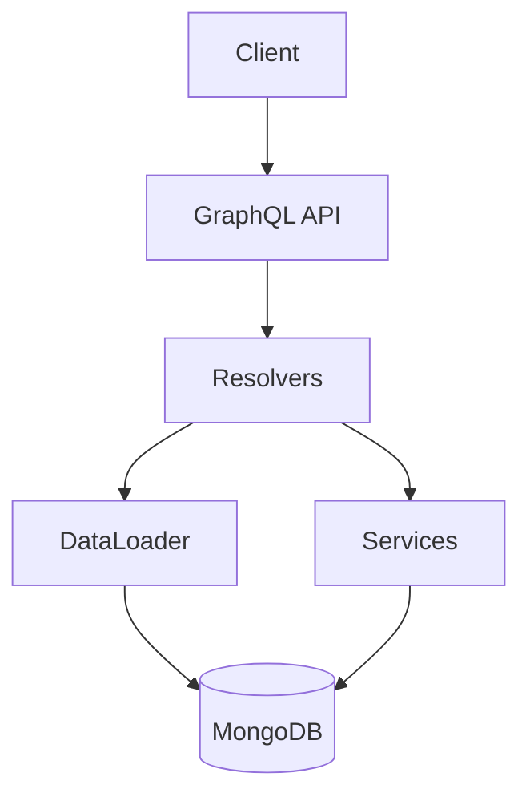

# 01 — Ledger GraphQL

**🇧🇷** Ledger Bancário com GraphQL Relay  
**🇬🇧** Bank Ledger with GraphQL Relay

---

You know when you open your banking app and see your balance? That screen looks simple, but underneath there's a system that needs to be atomically consistent. Your balance can't just disappear. A transfer can't be debited from one side and not credited to the other. That's a ledger.

The traditional approach is REST: you fetch one resource, then another, the N+1 problem shows up, pagination is done with `page=1&limit=10` which breaks when the bank inserts records in the middle. Then you discover GraphQL and Relay Connection and realize there was a better way.

That's what I did here. I took the classic bank ledger problem — accounts, transactions, balances — and implemented it with GraphQL using the Relay Connection pattern. With DataLoader to avoid N+1, MongoDB transactions for atomicity, and cursor-based pagination.

---

## Architecture



```
Schema:
  Queries:    account(id), accounts(first,after), transaction(id), transactions(first,after,accountId)
  Mutations:  createAccount, createTransaction
```

Every query uses Relay Connection for pagination. Every mutation follows the Relay pattern: `Input` → `Payload` → `clientMutationId`.

---

## TypeScript Implementation

### GraphQL Schema

The schema follows the Relay specification. Every entity implements `Node`, every list returns a `Connection`:

```graphql
interface Node { id: ID! }

type Account implements Node {
  id: ID!        # Relay global ID (base64)
  name: String!
  document: String!
  balance: Float!
}

type Transaction implements Node {
  id: ID!
  sender: Account!
  receiver: Account!
  amount: Float!
  type: TransactionType!
  status: TransactionStatus!
}
```

The Connection follows the cursor-based standard:

```graphql
type AccountConnection {
  edges: [AccountEdge]
  pageInfo: PageInfo!     # hasNextPage, hasPreviousPage, startCursor, endCursor
  totalCount: Int!
}
```

### DataLoader against N+1

Without DataLoader, a query of 10 transactions would make 21 database queries (1 for the transactions + 2 for each account involved). That's the classic N+1:

```typescript
import DataLoader from 'dataloader';

// Batch loader: groups multiple findById into a single query
const accountLoader = new DataLoader(async (ids: string[]) => {
  const accounts = await Account.find({ _id: { $in: ids } });
  const map = new Map(accounts.map(a => [a._id.toString(), a]));
  return ids.map(id => map.get(id) || null);
});

const resolvers = {
  Transaction: {
    sender: (tx) => accountLoader.load(tx.senderAccount.toString()),
    receiver: (tx) => accountLoader.load(tx.receiverAccount.toString()),
  }
};
```

### Atomic transaction (MongoDB)

Transferring money between accounts is the most critical operation. If the server crashes mid-way, money can't be lost:

```typescript
async function createTransaction(senderId: string, receiverId: string, amount: number) {
  const session = await mongoose.startSession();
  session.startTransaction();

  try {
    const sender = await Account.findById(senderId).session(session);
    const receiver = await Account.findById(receiverId).session(session);

    if (!sender || sender.balance < amount) {
      throw new Error('Saldo insuficiente');
    }

    sender.balance -= amount;
    receiver.balance += amount;

    await sender.save({ session });
    await receiver.save({ session });

    const tx = await Transaction.create([{
      sender: senderId, receiver: receiverId,
      amount, type: 'PIX', status: 'COMPLETED'
    }], { session });

    await session.commitTransaction();
    return tx[0];
  } catch (err) {
    await session.abortTransaction();
    throw err;
  } finally {
    session.endSession();
  }
}
```

Without `session`, if the server crashes after debiting the sender but before crediting the receiver, the money disappears. With `session`, either both happen or neither does.

### Cursor-based pagination

```typescript
async function accounts(first: number, after?: string) {
  const query = after
    ? { _id: { $gt: cursorFrom(after) } }
    : {};

  const items = await Account.find(query)
    .limit(first + 1)
    .sort({ _id: 1 });

  const hasNextPage = items.length > first;
  const nodes = hasNextPage ? items.slice(0, first) : items;

  return {
    edges: nodes.map(item => ({
      node: item,
      cursor: cursorTo(item._id),
    })),
    pageInfo: {
      hasNextPage,
      hasPreviousPage: !!after,
      startCursor: cursorTo(nodes[0]?._id),
      endCursor: cursorTo(nodes[nodes.length - 1]?._id),
    },
    totalCount: await Account.countDocuments(),
  };
}
```

The difference from `LIMIT/OFFSET` is that a cursor doesn't shift when new records are inserted in the database. If a new transaction appears mid-query, it won't mess up the current page.

---

## Go Implementation

Go doesn't have native GraphQL. You can use `gqlgen`, but for this case — 2 entities, simple CRUD — I preferred something more straightforward.

But the point is: Go isn't the best tool for GraphQL. You lose the schema-first ecosystem, codegen, and playground. Where Go shines here is in what sits **outside** GraphQL — in the service and automation layer:

```go
package main

import (
    "context"
    "fmt"
    "go.mongodb.org/mongo-driver/bson"
    "go.mongodb.org/mongo-driver/mongo"
    "go.mongodb.org/mongo-driver/mongo/options"
)

type Account struct {
    ID       string  `bson:"_id,omitempty"`
    Name     string  `bson:"name"`
    Document string  `bson:"document"`
    Balance  float64 `bson:"balance"`
}

type TransactionData struct {
    SenderID   string
    ReceiverID string
    Amount     float64
    Type       string
}

func Transfer(ctx context.Context, db *mongo.Database, data *TransactionData) error {
    session, err := db.Client().StartSession()
    if err != nil { return err }
    defer session.EndSession(ctx)

    _, err = session.WithTransaction(ctx, func(sc mongo.SessionContext) (interface{}, error) {
        senderCol := db.Collection("accounts")
        receiverCol := db.Collection("accounts")
        txCol := db.Collection("transactions")

        // Atomic read-modify-write
        var sender, receiver Account
        senderCol.FindOneAndUpdate(sc,
            bson.M{"_id": data.SenderID, "balance": bson.M{"$gte": data.Amount}},
            bson.M{"$inc": bson.M{"balance": -data.Amount}},
        ).Decode(&sender)

        receiverCol.FindOneAndUpdate(sc,
            bson.M{"_id": data.ReceiverID},
            bson.M{"$inc": bson.M{"balance": data.Amount}},
        ).Decode(&receiver)

        if sender.ID == "" {
            return nil, fmt.Errorf("saldo insuficiente")
        }

        txCol.InsertOne(sc, bson.M{
            "sender":   data.SenderID,
            "receiver": data.ReceiverID,
            "amount":   data.Amount,
            "type":     data.Type,
            "status":   "COMPLETED",
        })

        return nil, nil
    })

    return err
}
```

The difference: Go with `FindOneAndUpdate` is safer than Mongoose `findById.save()` because the balance decrement is atomic. The database guarantees no race condition between two concurrent transfers. In TypeScript, you depend on MongoDB's session. Both work, but Go forces you to think about atomicity from the start.

---

## Testing

```bash
# TypeScript
make infra-up
pnpm --filter @banking/ledger dev

# Create account
curl -X POST http://localhost:3001/graphql \
  -H "Content-Type: application/json" \
  -d '{"query":"mutation { createAccount(input: {name: \"João\", document: \"12345678900\", balance: 1000}) { account { id name balance } } }"}'

# Transfer
curl -X POST http://localhost:3001/graphql \
  -H "Content-Type: application/json" \
  -d '{"query":"mutation { createTransaction(input: {senderAccount: \"QWNjb3VudDox\", receiverAccount: \"QWNjb3VudDoy\", amount: 100, type: PIX}) { transaction { id amount status } } }"}'

# List accounts (cursor-based)
curl -s http://localhost:3001/graphql \
  -H "Content-Type: application/json" \
  -d '{"query":"{ accounts(first: 10) { edges { node { id name balance } } pageInfo { hasNextPage endCursor } } }"}'
```

---

## Lessons Learned

1. **GraphQL is not "REST done better"** — It's a different philosophy. You pay the upfront cost of schema and resolvers in exchange for flexibility on the consumer side.
2. **DataLoader should come by default** — Without it, any nested query explodes into N+1 queries. With it, batch loading solves the problem.
3. **ACID transactions in a NoSQL database are possible, but require setup** — MongoDB needs a Replica Set for transactions to work. It's not automatic.
4. **Cursor-based pagination is superior to offset** — When new records are inserted during navigation, the cursor doesn't shift. Offset does.
5. **TypeScript vs Go here is about ecosystem** — GraphQL in TS is far more productive (codegen, playground, schema-first). Go is better in the data layer (atomicity, performance). Use each where it shines.
