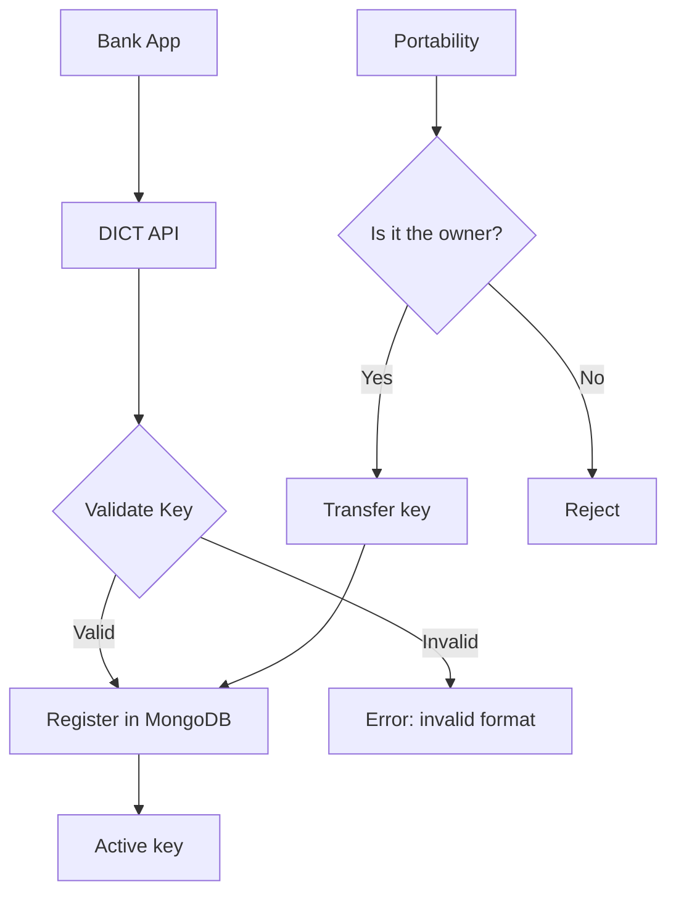

# Challenge 03 — DICT Simulator

**🇧🇷** Simulador do Diretório de Identificadores de Contas Transacionais  
**🇬🇧** DICT (Directory of Transactional Account Identifiers) Simulator

---

You have a CPF (Brazilian individual tax ID). That CPF is a Pix key. But how does the system know that CPF is yours and not your neighbor's?

The answer is DICT — the Directory of Transactional Account Identifiers (Diretório de Identificadores de Contas Transacionais). It's the system created by the Central Bank of Brazil to manage Pix keys. It stores the relationship between keys (CPF, CNPJ, email, phone, or random key) and the associated bank accounts.

Without DICT, you wouldn't be able to type a CPF and have the money land in the right account. It'd be like having a phone book with no names.

---

## Architecture



| Method | Route | What it does |
|--------|-------|-------------|
| POST | `/keys` | Register key |
| GET | `/keys/:key` | Query key |
| PATCH | `/keys/:key/claim` | Portability |
| DELETE | `/keys/:key` | Remove key |
| GET | `/accounts/:ispb/keys` | Keys for an account |

---

## TypeScript Implementation

### Pix key validation

The first problem: how do you validate each key type?

```typescript
type PixKeyType = 'CPF' | 'CNPJ' | 'EMAIL' | 'PHONE' | 'RANDOM';

function normalizeKey(key: string, type: PixKeyType): string {
  switch (type) {
    case 'CPF':  return key.replace(/\D/g, '').padStart(11, '0');
    case 'CNPJ': return key.replace(/\D/g, '').padStart(14, '0');
    case 'EMAIL': return key.toLowerCase().trim();
    case 'PHONE': return '+55' + key.replace(/\D/g, '');
    case 'RANDOM': return key.toUpperCase().replace(/[^A-Z0-9]/g, '');
  }
}

function validateKey(key: string, type: PixKeyType) {
  const n = normalizeKey(key, type);
  
  switch (type) {
    case 'CPF':
      if (n.length !== 11) return false;
      return isValidCPF(n);
    case 'PHONE':
      if (!/^\+55\d{10,11}$/.test(n)) return false;
      break;
    case 'EMAIL':
      if (!/^[^\s@]+@[^\s@]+\.[^\s@]+$/.test(n)) return false;
      break;
    case 'RANDOM':
      if (n.length !== 32 || /[^A-Z0-9]/.test(n)) return false;
      break;
  }
  return true;
}
```

The CPF validation algorithm looks like magic but it's simple math:

```typescript
function isValidCPF(cpf: string): boolean {
  if (/^(\d)\1+$/.test(cpf)) return false; // 111.111.111-11 is invalid
  
  let sum = 0;
  for (let i = 0; i < 9; i++) sum += parseInt(cpf[i]) * (10 - i);
  let d1 = (sum * 10) % 11;
  if (d1 === 10) d1 = 0;
  if (d1 !== parseInt(cpf[9])) return false;
  
  sum = 0;
  for (let i = 0; i < 10; i++) sum += parseInt(cpf[i]) * (11 - i);
  let d2 = (sum * 10) % 11;
  if (d2 === 10) d2 = 0;
  if (d2 !== parseInt(cpf[10])) return false;
  
  return true;
}
```

### Registration endpoint

```typescript
import Fastify from 'fastify';

const app = Fastify();

app.post<{ Body: DictKeyRequest }>('/api/v1/dict/keys', async (req, reply) => {
  const { type, value, account, owner } = req.body;
  
  if (!validateKey(value, type)) {
    return reply.status(422).send({ error: 'Chave inválida' });
  }
  
  const normalized = normalizeKey(value, type);
  
  // A key can only belong to one account
  const exists = await db.collection('keys').findOne({ 
    type, key: normalized 
  });
  
  if (exists) {
    return reply.status(409).send({ error: 'Chave já registrada' });
  }
  
  const key = {
    _id: normalized,
    type,
    originalValue: value,
    status: 'ACTIVE',
    account,
    owner,
    claims: [],
    createdAt: new Date(),
  };
  
  await db.collection('keys').insertOne(key);
  
  return reply.status(201).send(key);
});
```

---

## Go Implementation

In Go the structure is similar, but CPF validation is more explicit:

```go
package main

import (
    "net/http"
    "regexp"
    "github.com/gin-gonic/gin"
    "go.mongodb.org/mongo-driver/mongo"
)

type PixKey struct {
    Type    string `json:"type" binding:"required"`
    Value   string `json:"value" binding:"required"`
    Account struct {
        Ispb   string `json:"ispb"`
        Branch string `json:"branch"`
        Number string `json:"number"`
    } `json:"account" binding:"required"`
    Owner struct {
        Name     string `json:"name"`
        Document string `json:"document"`
    } `json:"owner" binding:"required"`
}

func isValidCPF(cpf string) bool {
    if len(cpf) != 11 {
        return false
    }
    
    // Check if all digits are the same
    allSame := true
    for i := 1; i < 11; i++ {
        if cpf[i] != cpf[0] {
            allSame = false
            break
        }
    }
    if allSame {
        return false
    }
    
    // First verification digit
    sum := 0
    for i := 0; i < 9; i++ {
        sum += int(cpf[i]-'0') * (10 - i)
    }
    d1 := (sum * 10) % 11
    if d1 == 10 { d1 = 0 }
    if d1 != int(cpf[9]-'0') {
        return false
    }
    
    // Second verification digit
    sum = 0
    for i := 0; i < 10; i++ {
        sum += int(cpf[i]-'0') * (11 - i)
    }
    d2 := (sum * 10) % 11
    if d2 == 10 { d2 = 0 }
    if d2 != int(cpf[10]-'0') {
        return false
    }
    
    return true
}

func normalizeCPF(value string) string {
    re := regexp.MustCompile(`\D`)
    cpf := re.ReplaceAllString(value, "")
    
    // Pad with leading zeros if needed
    for len(cpf) < 11 {
        cpf = "0" + cpf
    }
    
    return cpf
}

func main() {
    r := gin.Default()

    r.POST("/api/v1/dict/keys", func(c *gin.Context) {
        var req PixKey
        if err := c.ShouldBindJSON(&req); err != nil {
            c.JSON(400, gin.H{"error": err.Error()})
            return
        }

        switch req.Type {
        case "CPF":
            cpf := normalizeCPF(req.Value)
            if !isValidCPF(cpf) {
                c.JSON(422, gin.H{"error": "CPF inválido"})
                return
            }
            req.Value = cpf
        case "EMAIL":
            // Simple email validation
            matched, _ := regexp.MatchString(`^[^\s@]+@[^\s@]+\.[^\s@]+$`, req.Value)
            if !matched {
                c.JSON(422, gin.H{"error": "Email inválido"})
                return
            }
        case "PHONE":
            re := regexp.MustCompile(`\D`)
            phone := re.ReplaceAllString(req.Value, "")
            if len(phone) < 10 || len(phone) > 11 {
                c.JSON(422, gin.H{"error": "Telefone inválido"})
                return
            }
            req.Value = "+55" + phone
        }

        c.JSON(201, gin.H{
            "key":    req.Value,
            "type":   req.Type,
            "status": "ACTIVE",
            "account": req.Account,
            "owner":  req.Owner,
        })
    })

    r.Run(":3003")
}
```

The main difference: Go is more verbose, but the flow is explicit. No runtime magic. What you read is what executes.

---

## Testing

```bash
# TypeScript
pnpm --filter @banking/dict-simulator dev
curl -X POST http://localhost:3003/api/v1/dict/keys \
  -H "Content-Type: application/json" \
  -d '{"type":"CPF","value":"529.982.247-25","account":{"ispb":"12345678","branch":"0001","number":"12345-6"},"owner":{"name":"João","document":"52998224725"}}'

# Go
cd packages/backend/dict-simulator-go
go run .
curl localhost:3003/api/v1/dict/keys ...
```

---

## Lessons Learned

1. **Pix key validation is not trivial** — CPF has check digits, email has regex, phone has +55. Each type has its own rules.
2. **Normalization is king** — "123.456.789-00" and "12345678900" are the same CPF. DICT must normalize before saving.
3. **Portability is the nightmare** — Transferring keys between banks involves notification, up to 7-day confirmation window, and expiry. It's a state machine on its own.
4. **Concurrency** — Two simultaneous requests can register the same key. You need a unique index or a lock.
