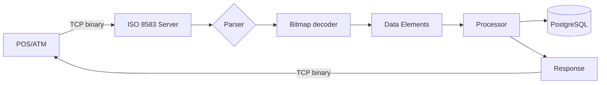

# Challenge 04 — ISO 8583 Simulator

**🇧🇷** Simulador de Mensagens Financeiras Binárias  
**🇬🇧** ISO 8583 Financial Message Simulator

---

## The Problem

When you swipe a credit card at the POS terminal, what actually happens between "approving" and "approved"?

It's not an HTTP call. It's a binary message over TCP. The standard is called ISO 8583, and every major card network — Visa, Mastercard, Elo — has been using it since the 80s.

The message is a compact binary structure: 4 bytes for the MTI, 8 bytes for the bitmap, and variable-length fields. Each bit in the bitmap tells you whether a field is present or not. It's efficient — and it's an absolute nightmare to debug.

---

## Architecture



```
┌──────────────┐     TCP      ┌──────────────┐     ┌──────────────┐
│   Client     │ ──────────── │  ISO 8583    │ ── │   Database   │
│  (POS/ATM)   │  Binary      │  Simulator   │     │  (Limits,    │
│              │  Messages    │              │     │   Cards)     │
└──────────────┘              └──────────────┘     └──────────────┘
```

---

### How the message works

```
┌─────────┬─────────┬──────────┬──────────────────────┐
│ MTI     │ Primary │ Secondary│   Data Elements      │
│ (4 hex) │ Bitmap  │ Bitmap   │   (variable length)  │
│         │ (8 hex) │ (8 hex)  │                      │
├─────────┼─────────┼──────────┼──────────────────────┤
│ 0200    │ F23C... │ (optional│  PAN, Amount,        │
│         │         │  if bit 1│  Terminal, etc.      │
│         │         │  is set) │                      │
└─────────┴─────────┴──────────┴──────────────────────┘
```

Each bit in the 64-bit bitmap represents one field. Bit 1 on = secondary bitmap exists. Bit 2 on = PAN (card number) is present. And so on.

---

## TypeScript Implementation

### Bitmap parsing

```typescript
function parseBitmap(hex: string): number[] {
  const bits: number[] = [];
  const buffer = Buffer.from(hex, 'hex');
  
  for (let byte = 0; byte < buffer.length; byte++) {
    for (let bit = 0; bit < 8; bit++) {
      if (buffer[byte] & (1 << (7 - bit))) {
        bits.push(byte * 8 + bit + 1);
      }
    }
  }
  
  return bits;
}
```

### Building a message

```typescript
function buildMessage(mti: string, fields: Map<number, string>): Buffer {
  const mtiBuf = Buffer.from(mti, 'ascii');
  
  // Determines which fields are present
  const presentFields = Array.from(fields.keys());
  const bitmap = buildBitmap(presentFields);
  
  // Encodes each field
  const elements = Buffer.concat(
    presentFields.map(fieldNum => {
      const value = fields.get(fieldNum)!;
      return encodeField(fieldNum, value);
    })
  );
  
  return Buffer.concat([mtiBuf, bitmap, elements]);
}

function encodeField(fieldNum: number, value: string): Buffer {
  switch (fieldNum) {
    case 2:  // PAN — LLVAR (length-prefixed)
      const len = Buffer.alloc(1, value.length);
      return Buffer.concat([len, Buffer.from(value, 'ascii')]);
    
    case 4:  // Amount — fixed 12 digits
      return Buffer.from(value.padStart(12, '0'), 'ascii');
    
    case 7:  // Transmission date/time — MMDDhhmmss
      return Buffer.from(value, 'ascii');
    
    default:
      return Buffer.from(value, 'ascii');
  }
}
```

### Standard response codes

| Code | Meaning |
|------|---------|
| 00 | Approved |
| 05 | Do not honor |
| 14 | Invalid card |
| 51 | Insufficient funds |
| 54 | Expired card |
| 91 | Issuer unavailable |

---

## Go Implementation

In Go, binary handling is more explicit. No magic `Buffer`:

```go
package main

import (
    "encoding/binary"
    "encoding/hex"
    "net"
    "fmt"
)

type ISO8583Message struct {
    MTI    string
    Fields map[int]string
}

func ParseMessage(data []byte) (*ISO8583Message, error) {
    if len(data) < 12 {
        return nil, fmt.Errorf("message too short")
    }

    msg := &ISO8583Message{
        MTI:    string(data[0:4]),
        Fields: make(map[int]string),
    }

    // Parse primary bitmap (bytes 4-11)
    bitmap := data[4:12]
    hasSecondary := bitmap[0]&0x80 != 0

    // Parse fields
    offset := 12
    if hasSecondary {
        offset = 20
    }

    for bit := 2; bit <= 128; bit++ {
        byteIndex := (bit - 1) / 8
        bitIndex := 7 - ((bit - 1) % 8)
        
        if byteIndex >= len(bitmap) {
            break
        }
        
        if bitmap[byteIndex]&(1<<bitIndex) != 0 {
            value, consumed := parseField(bit, data[offset:])
            msg.Fields[bit] = value
            offset += consumed
        }
    }

    return msg, nil
}

func parseField(bit int, data []byte) (string, int) {
    switch bit {
    case 2:
        // LLVAR: 1 byte length + value
        length := int(data[0])
        return string(data[1 : 1+length]), 1 + length
    case 4:
        // Fixed 12 bytes
        return string(data[:12]), 12
    default:
        return "", 0
    }
}

func BuildResponse(original *ISO8583Message, code string) []byte {
    response := &ISO8583Message{
        MTI: original.MTI[:2] + "10", // 0100 -> 0110, 0200 -> 0210
        Fields: map[int]string{
            39: code, // Response code
        },
    }
    return encodeMessage(response)
}
```

### TCP server

```go
func main() {
    listener, _ := net.Listen("tcp", ":3004")
    fmt.Println("ISO 8583 server on :3004")

    for {
        conn, _ := listener.Accept()
        go handleConnection(conn)
    }
}

func handleConnection(conn net.Conn) {
    defer conn.Close()
    
    buf := make([]byte, 4096)
    
    for {
        n, err := conn.Read(buf)
        if err != nil {
            break
        }
        
        msg, err := ParseMessage(buf[:n])
        if err != nil {
            continue
        }
        
        fmt.Printf("MTI: %s\n", msg.MTI)
        
        response := BuildResponse(msg, "00")
        conn.Write(response)
    }
}
```

---

## Testing

```bash
# TypeScript
pnpm --filter @banking/iso8583 dev

# Go
cd packages/backend/iso8583-go
go run .

# Connect with netcat and send binary
printf '\x02\x00\xF2\x3C\x48\x20\x00\xC0\x80\x04\x06\x12\x34\x56\x78\x90\x12\x34\x00\x00\x00\x01\x00\x00\x50\x00' | nc localhost 3004
```

---

## Lessons Learned

1. **ISO 8583 is more efficient than JSON** — An authorization message fits in 128 bytes. The equivalent XML would be 2KB.
2. **Bitmap is an art** — Each bit represents a field. A well-built bitmap drastically reduces message size.
3. **Raw TCP is not HTTP** — No request/response mapping. You have to manage connections, timeouts, and reassembly yourself.
4. **Go shines here** — Binary parsing in Go feels natural. TypeScript with Buffer works, but Go with byte slices is more idiomatic.
