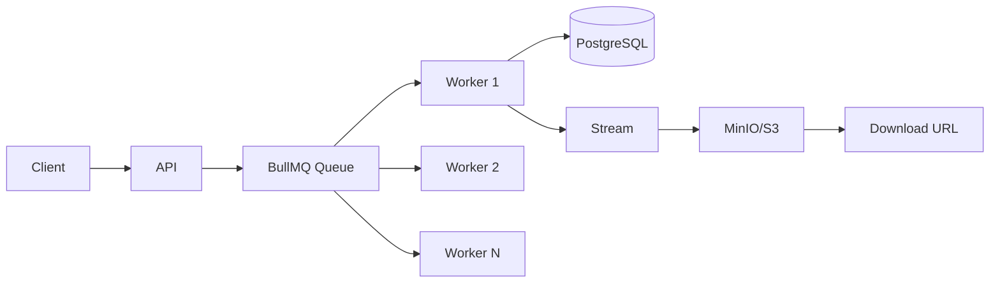

# Challenge 08 — Report System

**🇧🇷** Sistema de Relatórios  
**🇬🇧** Report System

---

Generating a 10-line CSV is easy. Generating a report with 500 thousand transactions, in PDF, with charts, and delivering it in 30 seconds — that's a whole different story.

The problem is you can't load 500k records into memory. The server dies, the database locks up, the client complains. The solution is streaming: query the database in batches, generate the file in chunks, upload straight to S3.

This challenge is about doing it right, with a queue, retry, and notification.

---

## Architecture



---

## TypeScript Implementation

### Streaming Query

```typescript
import { Cursor } from 'pg-cursor';

async function* streamQuery(pool: Pool, query: string, batchSize = 1000) {
  const client = await pool.connect();
  const cursor = client.query(new Cursor(query));
  
  try {
    let rows = await cursor.read(batchSize);
    while (rows.length > 0) {
      yield rows;
      rows = await cursor.read(batchSize);
    }
  } finally {
    cursor.close();
    client.release();
  }
}
```

### Streaming CSV Generation

```typescript
import { Readable } from 'stream';
import { stringify } from 'csv-stringify';

function csvStream(generator: AsyncGenerator<any[]>): Readable {
  const stringifier = stringify({ header: true });
  
  (async () => {
    for await (const batch of generator) {
      for (const row of batch) {
        stringifier.write(row);
      }
    }
    stringifier.end();
  })();
  
  return Readable.from(stringifier);
}
```

### Direct Upload to MinIO

```typescript
import { S3Client, PutObjectCommand } from '@aws-sdk/client-s3';
import { getSignedUrl } from '@aws-sdk/s3-request-presigner';
import { GetObjectCommand } from '@aws-sdk/client-s3';

const S3 = new S3Client({
  endpoint: process.env.MINIO_ENDPOINT,
  region: 'us-east-1',
  credentials: {
    accessKeyId: process.env.MINIO_ACCESS_KEY!,
    secretAccessKey: process.env.MINIO_SECRET_KEY!,
  },
  forcePathStyle: true,
});

async function uploadReport(key: string, stream: Readable) {
  await S3.send(new PutObjectCommand({
    Bucket: 'reports',
    Key: key,
    Body: stream,
    ContentType: 'text/csv',
  }));
}

async function generateDownloadUrl(key: string) {
  return getSignedUrl(S3, new GetObjectCommand({
    Bucket: 'reports', Key: key,
  }), { expiresIn: 3600 });
}
```

### BullMQ Queue

```typescript
import { Queue, Worker } from 'bullmq';

const reportQueue = new Queue('reports', {
  connection: { host: 'localhost', port: 6379 },
  defaultJobOptions: {
    attempts: 3,
    backoff: { type: 'exponential', delay: 5000 },
  },
});

const worker = new Worker('reports', async job => {
  const { reportId, type, filters } = job.data;
  
  await db.query('UPDATE reports SET status = $1 WHERE id = $2', ['GENERATING', reportId]);
  
  try {
    const generator = streamQuery(pool, buildQuery(type, filters));
    const stream = csvStream(generator);
    await uploadReport(`reports/${reportId}.csv`, stream);
    
    await db.query(
      'UPDATE reports SET status = $1, s3_key = $2 WHERE id = $3',
      ['READY', `reports/${reportId}.csv`, reportId]
    );
    
    await notifyWebhook(reportId);
  } catch (err) {
    await db.query('UPDATE reports SET status = $1, error = $2 WHERE id = $3',
      ['FAILED', (err as Error).message, reportId]);
    throw err; // BullMQ handles retry
  }
}, { connection: { host: 'localhost', port: 6379 }, concurrency: 5 });
```

---

## Go Implementation

```go
package main

import (
    "context"
    "database/sql"
    "encoding/csv"
    "io"
    "log"
    "net/http"
    "os"
    "github.com/go-redis/redis/v8"
    "github.com/minio/minio-go/v7"
)

type ReportWorker struct {
    db    *sql.DB
    s3    *minio.Client
    queue *redis.Client
}

func (w *ReportWorker) GenerateCSV(reportID, query string) error {
    // Stream query in batches
    rows, err := w.db.QueryContext(context.Background(), query)
    if err != nil {
        return err
    }
    defer rows.Close()

    // Create temp file (or pipe to S3)
    pr, pw := io.Pipe()
    writer := csv.NewWriter(pw)

    go func() {
        defer pw.Close()
        defer writer.Flush()

        columns, _ := rows.Columns()
        writer.Write(columns)

        values := make([]interface{}, len(columns))
        scanArgs := make([]interface{}, len(columns))
        for i := range values {
            scanArgs[i] = &values[i]
        }

        for rows.Next() {
            rows.Scan(scanArgs...)
            
            record := make([]string, len(columns))
            for i, v := range values {
                if v != nil {
                    record[i] = fmt.Sprintf("%v", v)
                }
            }
            writer.Write(record)
        }
    }()

    // Upload streaming to MinIO
    _, err = w.s3.PutObject(context.Background(), "reports",
        reportID+".csv", pr, -1,
        minio.PutObjectOptions{ContentType: "text/csv"})

    return err
}

func (w *ReportWorker) Listen() {
    // Poll Redis for pending reports
    for {
        result, err := w.queue.BRPop(context.Background(), 0, "report:queue").Result()
        if err != nil {
            log.Println(err)
            continue
        }

        reportID := result[1]
        go w.ProcessReport(reportID)
    }
}
```

The difference: **Go does real streaming.** The pipe connects the database query straight to the S3 upload, without any intermediate buffer. TypeScript does it too, but Go is more explicit about where each byte is.

---

## Testing

```bash
make infra-up
pnpm --filter @banking/report-system dev

curl -X POST http://localhost:3008/api/v1/reports/generate \
  -H "Content-Type: application/json" \
  -d '{"type":"TRANSACTIONS","format":"CSV","filters":{"from":"2024-01-01"}}'
```

---

## Lessons Learned

1. **Never load everything in memory** — 500k records fit in RAM, but 5 million don't. Streaming from the start.
2. **Queue with retry saves your skin** — If S3 goes down, the worker tries again. If the database is slow, the worker waits.
3. **Signed URL is basic security** — Don't leave financial reports public. Expiring URL for 1 hour.
4. **Idempotency matters** — If the job runs twice, it can't generate two copies. Use reportId as the key.
