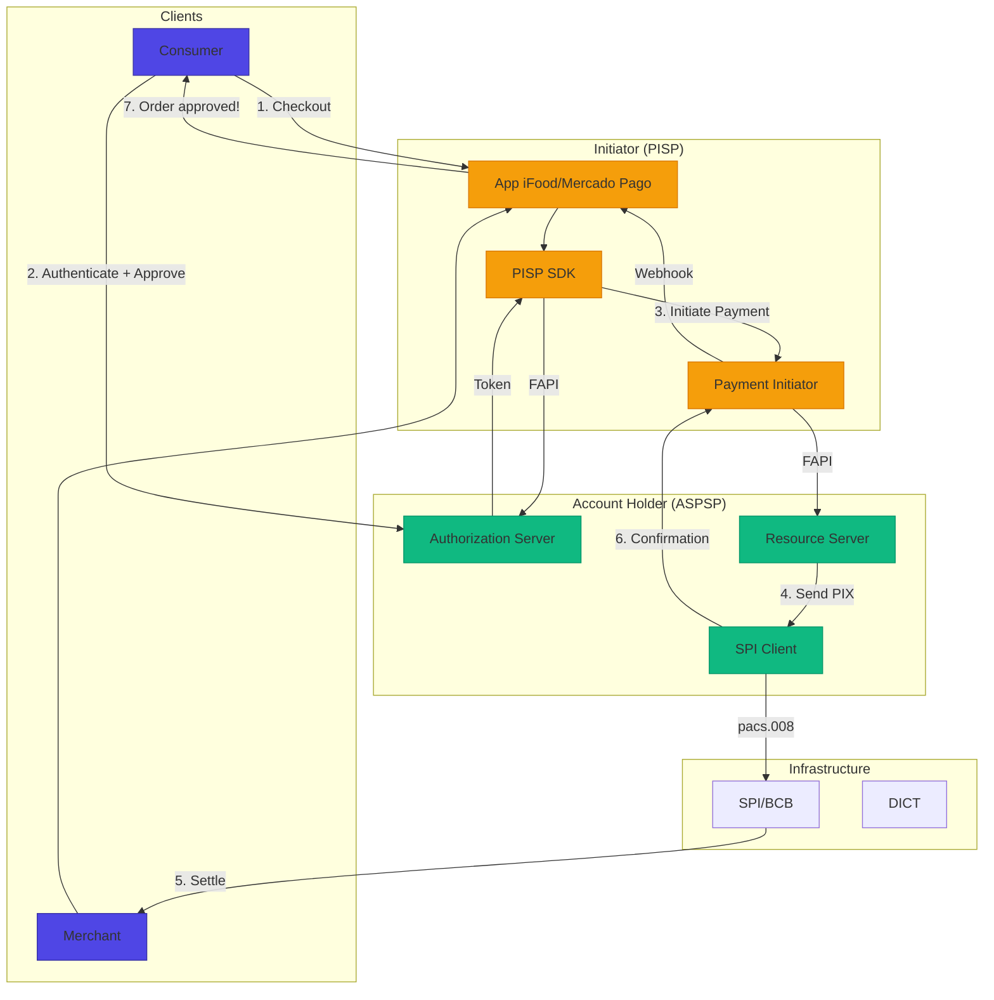
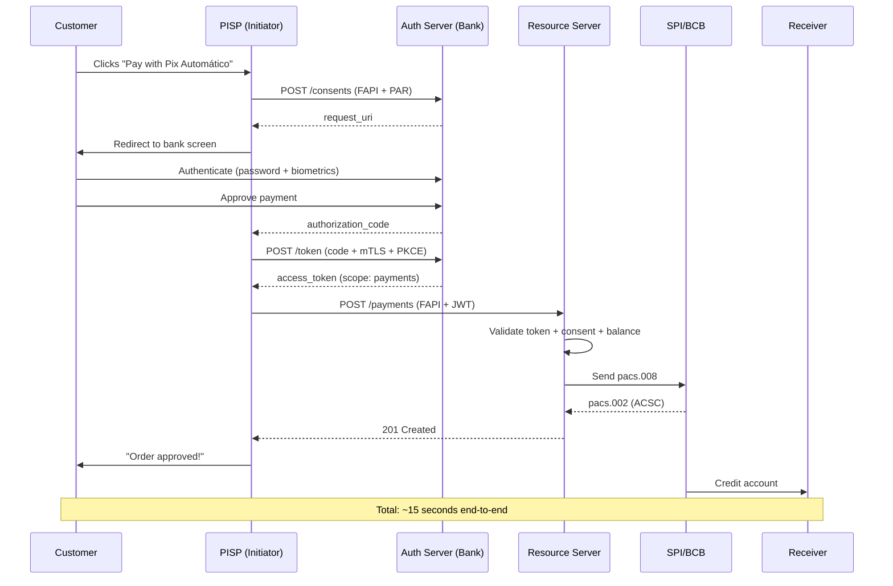
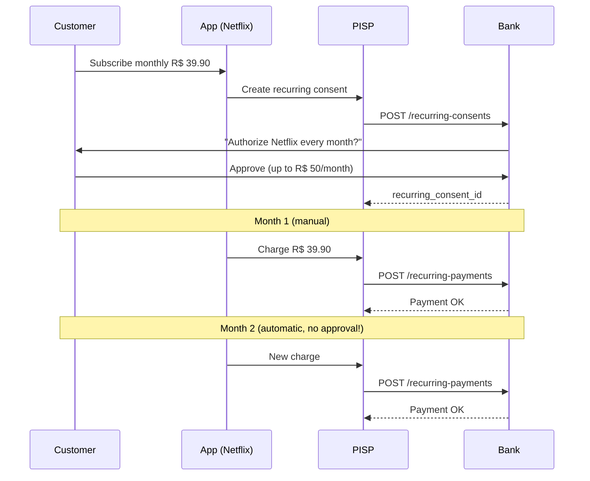

# Challenge 15: Payment Initiation (PISP) — Initiating Payments via Open Finance

**🇧🇷** Iniciador de Transação de Pagamento  
**🇬🇧** Payment Initiation Service Provider

---

The **PISP** (or **ISP - Payment Transaction Initiator**) is the figure introduced by **Phase 3 of Open Finance Brasil** that allows third parties to initiate payments **directly from the customer's bank account** — without credit cards, boleto, or manual PIX. It's the foundation of **"Pix Automático"** and modern **Direct Debit**.

## Switch: TypeScript vs Go

<LanguageToggle />

<div class="lang-content ts" style="display:block;">

### What is a PISP?

| Use Case | Example |
|----------|---------|
| **E-commerce checkout** | Pay with 1 click |
| **Recurring subscriptions** | Netflix, Spotify |
| **Food delivery** | iFood, Rappi |
| **Mobility** | Uber, 99 |
| **Marketplaces** | Mercado Livre, Shopee |

### Complete Ecosystem



### Detailed Flow



### Payment APIs

| Endpoint | Description |
|----------|-------------|
| `POST /consents` | Single consent |
| `POST /recurring-consents` | For recurrence |
| `POST /pix/payments` | Initiate PIX |
| `GET /pix/payments/{id}` | Check status |
| `POST /automatic-payments` | Pix Automático |

### Domain — Payment Entity

```typescript
export enum PaymentStatus {
  CREATED = 'CREATED',
  PENDING = 'PDNG',
  ACCEPTED_CREDIT = 'ACSC',
  REJECTED = 'RJCT',
  CANCELLED = 'CANC',
}

export class PaymentInitiation extends Entity<string> {
  public confirm(endToEndId: string): void {
    this.props.status = PaymentStatus.ACCEPTED_CREDIT;
    this.props.endToEndId = endToEndId;
    this.props.confirmedAt = new Date();
  }

  public reject(reason: string): void {
    this.props.status = PaymentStatus.REJECTED;
    this.props.rejectionReason = reason;
  }

  public canBeProcessed(): boolean {
    return !this.isConfirmed() && !this.isRejected()
      && new Date() <= this.props.expiresAt;
  }
}
```

### Payment Consent

```typescript
export class PaymentConsent {
  public canBeUsed(): boolean {
    return this.isAuthorised()
      && new Date() <= this.props.expirationDateTime;
  }

  public validatePayment(amount: number): boolean {
    if (!this.canBeUsed()) return false;
    if (this.props.type === PaymentConsentType.SINGLE) {
      return this.props.amount === amount;
    }
    if (this.props.recurringPolicy?.maxAmountPerTransaction) {
      return amount <= this.props.recurringPolicy.maxAmountPerTransaction;
    }
    return true;
  }

  public consume(): void {
    if (this.props.type === PaymentConsentType.SINGLE) {
      this.props.status = PaymentConsentStatus.CONSUMED;
    }
  }
}
```

### Payment Initiator Service

```typescript
export class PaymentInitiatorService {
  public async initiate(input: InitiatePaymentInput, pispClientId: string) {
    const existing = await this.idempotencyService.check(input.idempotencyKey);
    if (existing) return right(existing);

    const consent = await this.fapiClient.getPaymentConsent(pispClientId, input.consentId);
    if (!consent.canBeUsed()) return left(new ConsentNotActiveError());
    if (!consent.validatePayment(input.amount)) return left(new ExceedsLimitError());

    const fraudCheck = await this.fraudService.preInitiationCheck({ ... });
    if (fraudCheck.isHighRisk) return left(new FraudDetectedError());

    const payment = PaymentInitiation.create({ ... });
    await this.paymentRepo.save(payment);

    const result = await this.fapiClient.initiatePayment(pispClientId, { ... });

    if (result.value.status === 'ACSC') payment.confirm(result.value.endToEndId);
    else payment.reject(result.value.reason);

    if (consent.type === 'SINGLE') consent.consume();
    await this.eventPublisher.publish('payment.initiated', { ... });

    return right(payment);
  }
}
```

### Recurring Flow (Pix Automático)



### Comparison: TypeScript vs Go

| Aspect | TypeScript | Go |
|--------|-----------|-----|
| **FAPI/JWT** | jose, jsonwebtoken | golang-jwt/jwt |
| **mTLS** | TLS native | net/http mTLS |
| **Performance** | ~3K req/s | ~30K req/s |
| **Memory** | ~500MB | ~50MB |
| **Latency P99** | 30-100ms | 5-20ms |
| **Ecosystem** | Rich (ready SDKs) | Fewer FAPI libs |

### Real Cases

- **Mercado Pago** (Go) — Largest PISP, 30K+ TPS, Pix Automático
- **PicPay** (Go + TS) — 40M+ users, massive recurrence
- **iFood** (Go) — Checkout at scale, multi-bank
- **Pluggy/Belvo** (Go) — B2B PISP infrastructure

</div>

<div class="lang-content go" style="display:none;">

### Domain — Payment Entity

```go
package domain

import (
    "errors"
    "fmt"
    "time"
    "github.com/google/uuid"
)

type PaymentStatus string

const (
    StatusCreated        PaymentStatus = "CREATED"
    StatusPending        PaymentStatus = "PDNG"
    StatusAcceptedCredit PaymentStatus = "ACSC"
    StatusRejected       PaymentStatus = "RJCT"
)

type Payment struct {
    ID               string
    ConsentID        string
    Amount           int64
    Currency         string
    CreditorAccount  Account
    CreditorName     string
    Status           PaymentStatus
    EndToEndID       string
    CreatedAt        time.Time
    ExpiresAt        time.Time
    IdempotencyKey   string
}

func NewPayment(consentID string, amount int64, creditor Account, idempotencyKey string) (*Payment, error) {
    if amount <= 0 { return nil, ErrInvalidAmount }
    now := time.Now()
    return &Payment{
        ID: uuid.New().String(), ConsentID: consentID, Amount: amount,
        Currency: "BRL", CreditorAccount: creditor,
        Status: StatusCreated, CreatedAt: now, ExpiresAt: now.Add(10 * time.Minute),
        IdempotencyKey: idempotencyKey,
    }, nil
}

func (p *Payment) Confirm(endToEndID string) {
    p.Status = StatusAcceptedCredit
    p.EndToEndID = endToEndID
    now := time.Now()
    p.ConfirmedAt = &now
}

func (p *Payment) Reject(reason string) { p.Status = StatusRejected; p.RejectionReason = reason }
func (p *Payment) CanBeProcessed() bool { return !p.IsConfirmed() && !p.IsRejected() && time.Now().Before(p.ExpiresAt) }
```

### Payment Initiator Use Case

```go
package usecase

import (
    "context"
    "fmt"
    "time"
    "go.uber.org/zap"
)

type InitiatePaymentUseCase struct {
    paymentRepo  domain.PaymentRepository
    fapiClient   *openfinance.FAPIClient
    fraudService *fraud.DetectionService
    idempotency  *idempotency.Service
    eventPub     *events.Publisher
    logger       *zap.Logger
}

func (uc *InitiatePaymentUseCase) Execute(ctx context.Context, input InitiatePaymentInput, pispClientID string) (*InitiatePaymentOutput, error) {
    if existing, _ := uc.idempotency.Check(ctx, input.IdempotencyKey); existing != nil {
        return uc.toOutput(existing.(*domain.Payment)), nil
    }

    consent, err := uc.fapiClient.GetPaymentConsent(ctx, pispClientID, input.ConsentID)
    if err != nil { return nil, err }
    if !consent.CanBeUsed() { return nil, domain.ErrInvalidConsent }
    if !consent.ValidatePayment(input.Amount) { return nil, errors.New("exceeds limits") }

    fraudCtx, cancel := context.WithTimeout(ctx, 200*time.Millisecond)
    defer cancel()
    fraudResult, _ := uc.fraudService.PreInitiationCheck(fraudCtx, fraud.CheckInput{...})
    if fraudResult != nil && fraudResult.IsHighRisk { return nil, errors.New("fraud") }

    payment, _ := domain.NewPayment(input.ConsentID, input.Amount, input.CreditorAccount, input.IdempotencyKey)
    uc.paymentRepo.Save(ctx, payment)

    spiResp, err := uc.fapiClient.InitiatePayment(ctx, pispClientID, openfinance.FAPIPaymentRequest{...})
    if err != nil {
        payment.Reject("BANK_COMMUNICATION_FAILED")
        uc.paymentRepo.Update(ctx, payment)
        return nil, err
    }

    switch spiResp.Status {
    case "ACSC": payment.Confirm(spiResp.EndToEndID)
    case "PDNG", "ACSP": payment.MarkAsSent(spiResp.EndToEndID)
    case "RJCT": payment.Reject(spiResp.RejectionReason)
    }
    uc.paymentRepo.Update(ctx, payment)

    if consent.Type == domain.PaymentConsentTypeSingle { consent.Consume() }
    uc.eventPub.Publish(ctx, "payment.initiated", map[string]interface{}{...})

    return uc.toOutput(payment), nil
}
```

### FAPI Client

```go
package openfinance

import (
    "bytes"
    "context"
    "crypto/rsa"
    "crypto/tls"
    "encoding/json"
    "encoding/pem"
    "net/http"
    "time"
    "github.com/golang-jwt/jwt/v5"
    "github.com/google/uuid"
)

type FAPIClient struct {
    privateKey *rsa.PrivateKey
    keyID      string
    clientCert *tls.Certificate
    httpClient *http.Client
    directory  *directory.Sync
}

func (c *FAPIClient) InitiatePayment(ctx context.Context, clientID string, payment FAPIPaymentRequest) (*FAPIPaymentResponse, error) {
    bankEndpoint, _ := c.directory.FindConsentEndpoint(ctx, payment.ConsentID)
    token, _ := c.getAccessToken(ctx, clientID, payment.ConsentID)

    payload := map[string]interface{}{
        "data": map[string]interface{}{
            "consentId": payment.ConsentID, "paymentId": payment.PaymentID,
            "amount": fmt.Sprintf("%.2f", float64(payment.Amount)/100),
            "creditor": map[string]interface{}{
                "name": payment.Creditor.Name, "cpfCnpj": payment.Creditor.Document,
            },
        },
    }

    signedJWT, _ := c.signRequest(payload, clientID)

    req, _ := http.NewRequestWithContext(ctx, "POST",
        bankEndpoint+"/open-banking/payments/v1/payments",
        bytes.NewBufferString(signedJWT))
    req.Header.Set("Authorization", "Bearer "+token)
    req.Header.Set("Content-Type", "application/jwt")
    req.Header.Set("x-fapi-interaction-id", uuid.New().String())

    resp, err := c.httpClient.Do(req)
    if err != nil { return nil, err }
    defer resp.Body.Close()

    var data map[string]interface{}
    json.NewDecoder(resp.Body).Decode(&data)
    return c.mapPaymentResponse(data), nil
}

func (c *FAPIClient) signRequest(payload interface{}, clientID string) (string, error) {
    claims := jwt.MapClaims{"iss": clientID, "iat": time.Now().Unix(), "exp": time.Now().Add(5*time.Minute).Unix(), "data": payload}
    token := jwt.NewWithClaims(jwt.SigningMethodPS256, claims)
    token.Header["kid"] = c.keyID
    return token.SignedString(c.privateKey)
}
```

### Webhook Handler

```go
package http

import (
    "crypto/rsa"
    "crypto/sha256"
    "encoding/base64"
    "encoding/json"
    "net/http"
    "strings"
)

type WebhookHandler struct {
    processUC *usecase.ProcessConfirmationUseCase
    directory *directory.Sync
}

func (h *WebhookHandler) HandleBankWebhook(w http.ResponseWriter, r *http.Request) {
    jwsSignature := r.Header.Get("x-jws-signature")
    if jwsSignature == "" { h.writeError(w, 401, "MISSING_SIGNATURE"); return }

    var payload WebhookPayload
    json.NewDecoder(r.Body).Decode(&payload)

    if err := h.validateJWS(r.Context(), jwsSignature); err != nil {
        h.writeError(w, 401, "INVALID_SIGNATURE"); return
    }

    h.processUC.Execute(r.Context(), usecase.ProcessConfirmationInput{
        PaymentID: payload.PaymentID, Status: payload.Status, EndToEndID: payload.EndToEndID,
    })

    w.WriteHeader(200)
    json.NewEncoder(w).Encode(map[string]interface{}{"status": "RECEIVED"})
}

func (h *WebhookHandler) validateJWS(ctx context.Context, signature string) error {
    parts := strings.Split(signature, ".")
    if len(parts) != 3 { return errors.New("malformed JWS") }

    headerJSON, _ := base64.RawURLEncoding.DecodeString(parts[0])
    var header struct { Alg string `json:"alg"` }
    json.Unmarshal(headerJSON, &header)
    if header.Alg != "PS256" { return errors.New("unsupported algorithm") }

    publicKey, _ := h.directory.GetPublicKey(ctx, "bank-id")
    signatureBytes, _ := base64.RawURLEncoding.DecodeString(parts[2])
    hash := sha256.Sum256([]byte(parts[0] + "." + parts[1]))
    return rsa.VerifyPSS(publicKey, crypto.SHA256, hash[:], signatureBytes, &rsa.PSSOptions{SaltLength: rsa.PSSSaltLengthAuto})
}
```

### Benchmark

| Operation | TS P99 | Go P99 | TS Throughput | Go Throughput |
|-----------|--------|--------|---------------|---------------|
| /initiate | 450ms | 38ms | 1.8K/s | 28K/s |
| /consent | 85ms | 12ms | 3.5K/s | 42K/s |
| /webhook | 120ms | 8ms | 2.5K/s | 55K/s |

### Real Cases

- **Mercado Pago** (Go) — Largest PISP, 30K+ TPS
- **PicPay** (Go + TS) — 40M+ users, recurrence
- **iFood** (Go) — Checkout at scale, multi-bank
- **Pluggy/Belvo** (Go) — B2B infrastructure

</div>

---

## How to test

```bash
# TypeScript
pnpm --filter @banking/pisp dev

# Go
cd packages/backend/pisp-go
go run .

# Initiate payment
curl -X POST http://localhost:3007/api/v1/payments/initiate \
  -H "Content-Type: application/json" \
  -H "x-pisp-client-id: fintech-abc" \
  -d '{"consentId":"uuid","idempotencyKey":"uuid","amount":5000,"creditor":{"name":"Store","document":"12345678901","account":{"ispb":"12345678","number":"12345","accountType":"CACC"}}}'
```

---

## Lessons learned

1. **PISP = Next frontier** — After PIX and Open Finance
2. **Pix Automático** — Recurrence without new approval
3. **FAPI mandatory** — mTLS + PS256 + PKCE
4. **Idempotency critical** — Payments never duplicated
5. **Webhooks with JWS** — Signature validation
6. **State machine** — CREATED → PDNG → ACSC (or RJCT)
7. **Daily reconciliation** — With each account holder bank
8. **Go dominates at scale** — 5-15x faster
9. **Payment consent ≠ Data consent** — Different rules
10. **Smart routing** — Choose best bank for each payment
